<nav class="menu">
    <ul>
        <li class="home"><a href="/">Home</a></li>
        <li class="name">Course details</li>
                <li><a href="#video-000">Course details</a></li>
        <li class="pdf"><a href="https://mlvu.github.io/lectures/Course_details.2024.pdf">PDF</a></li>
    </ul>
</nav>

<article class="slides">

       <section class="video" id="video-000">
           <a class="slide-link" href="https://mlvu.github.io/details#video-0">link here</a>
           <iframe
                src="https://www.youtube.com/embed/csxk_bWkUQc?si=RxR-4zj0-ObIxqwv"
                title="YouTube video player"
                frameborder="0" allow="accelerometer; autoplay; clipboard-write; encrypted-media; gyroscope; picture-in-picture"
                allowfullscreen>
           </iframe>

       </section>

       <section id="slide-001">
            <a class="slide-link" href="https://mlvu.github.io/details#slide-001" title="Link to this slide.">link here</a>
            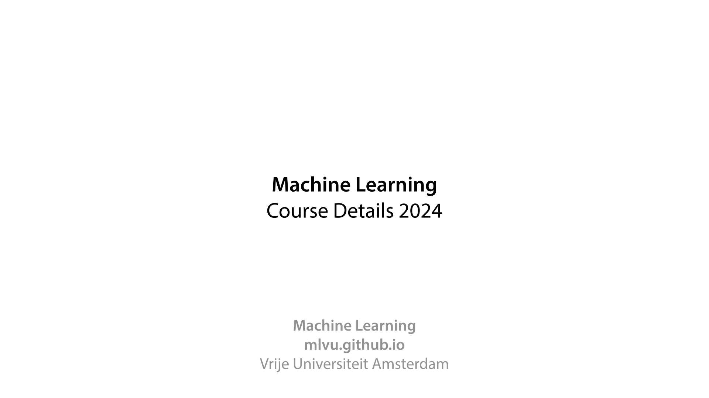

            <figcaption>
            
This set of slides explains the details of how the course is run, and what you need to do to pass. 

 

            </figcaption>
       </section>

       <section id="slide-002">
            <a class="slide-link" href="https://mlvu.github.io/details#slide-002" title="Link to this slide.">link here</a>
            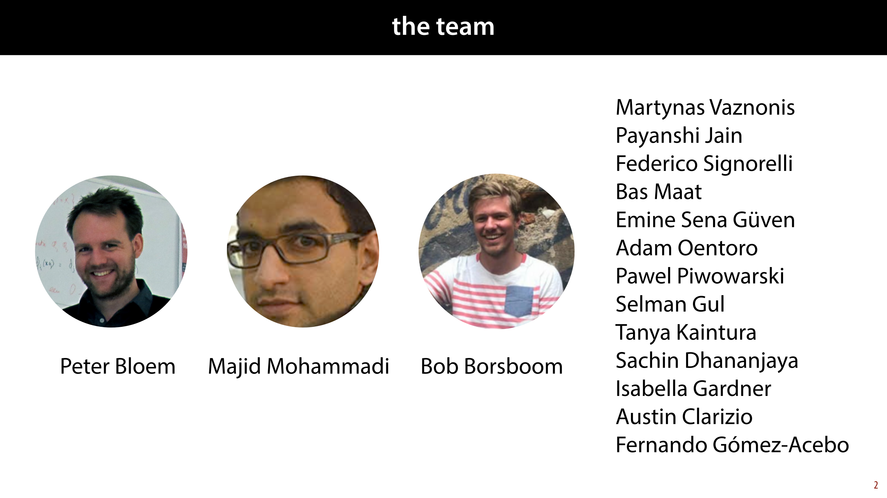

            <figcaption>
            

            </figcaption>
       </section>

       <section id="slide-003">
            <a class="slide-link" href="https://mlvu.github.io/details#slide-003" title="Link to this slide.">link here</a>
            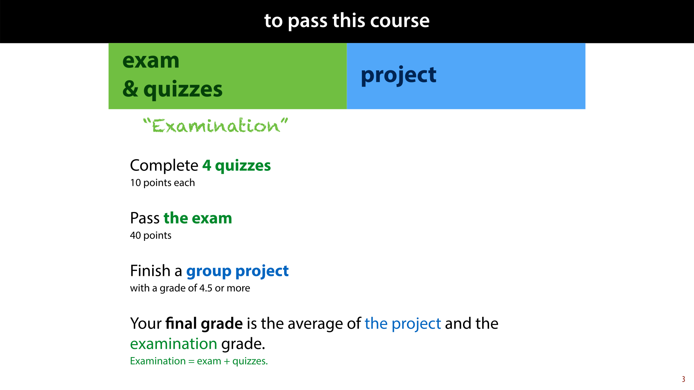

            <figcaption>
            
Let’s start with the most important information: what do you need to do to pass the course? You need to pass 4 online quizzes, pass the final exam and complete a group project. 

If you do this, you get two grades: one for the combined quizzes and exam, what we call the “examination” part of your grade, and one for the final project. If both grades are high enough, your final grade is the average of the two. 

 

            </figcaption>
       </section>

       <section id="slide-004">
            <a class="slide-link" href="https://mlvu.github.io/details#slide-004" title="Link to this slide.">link here</a>
            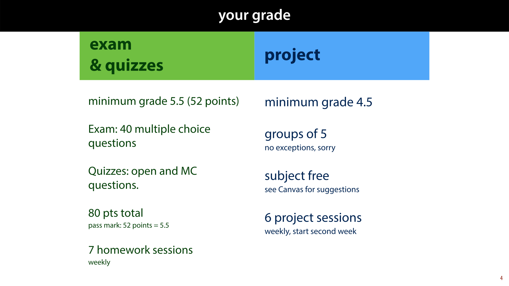

            <figcaption>
            
Here are the rules in detail.  

For the exam and quizzes you score points: 10 each for the quizzes and 40 for the exam, for a maximum total of 80 possible points. You need to score at least 52 points to pass, which corresponds to a 5.5. To support the exam and the quizzes, there are <em>homework exercises</em>. You can make these to prepare, but these are not graded. The answers are provided, so it’s up to you how you use them. There are weekly homework sessions to discuss the homework with your TA. 

The project is done in groups of 5. Here, the minimum grade is 4.5. Note however, that the minimum final grade is a 5.5, so if your project grade is this low, you will need to get a higher examination grade so that the average of the two is 5.5 or higher. The project is supported by group sessions, which start in the second week of the course.

            </figcaption>
       </section>

       <section id="slide-005">
            <a class="slide-link" href="https://mlvu.github.io/details#slide-005" title="Link to this slide.">link here</a>
            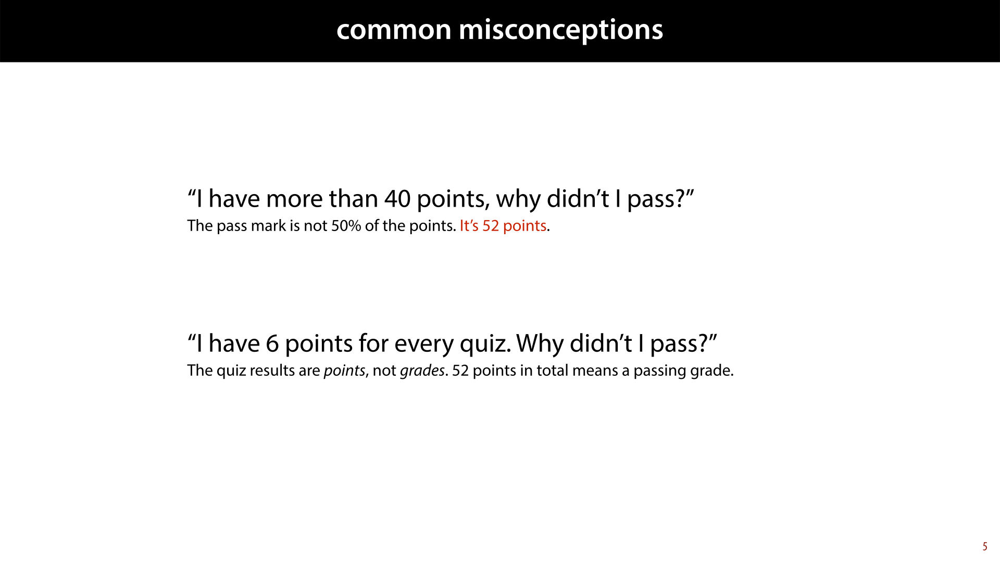

            <figcaption>
            
The grading system, despite our best efforts, is a little complex. This occasionally leads to some misunderstandings. These are the most common ones.  

First, <strong>scoring half the available points is not enough to pass</strong>. There is no rule that says that half the points should correspond to a passing grade. In our case, we’ve found that a pass mark of 52 points for the quizzes and the exam together, means you’ve learned the minimum required subject matter. 

Second, the fact that you can get between 0 and 10 point for each quiz <strong>does not mean that these represent grades</strong>. That is, if you get 6 points for a quiz, that doesn’t mean you’re on your way to a <em>grade</em> of 6. The points get added to the total, and the total needs to be higher than the pass mark.  
<aside    >Getting 6 points for every quiz means that you’ll need to score 28 points on the exam. This is a relatively high score, so it’s advisable to aim a little higher than this for the quizzes.</aside><aside    ></aside>
            </figcaption>
       </section>

       <section id="slide-006">
            <a class="slide-link" href="https://mlvu.github.io/details#slide-006" title="Link to this slide.">link here</a>
            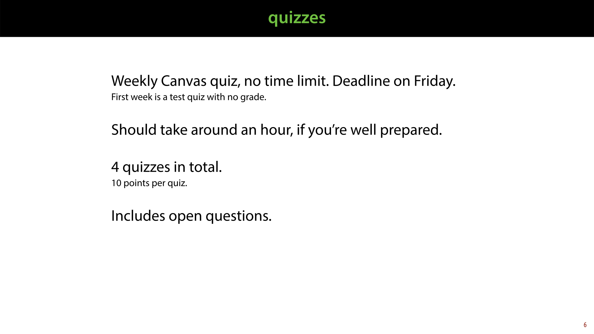

            <figcaption>
            
The quizzes form  the first half of the examination. They are four brief assignments that you do on Canvas. They include exam-style questions, but also open questions which are manually graded by the TAs. 

            </figcaption>
       </section>

       <section id="slide-007" class="anim">
            <a class="slide-link" href="https://mlvu.github.io/details#slide-007" title="Link to this slide.">link here</a>
            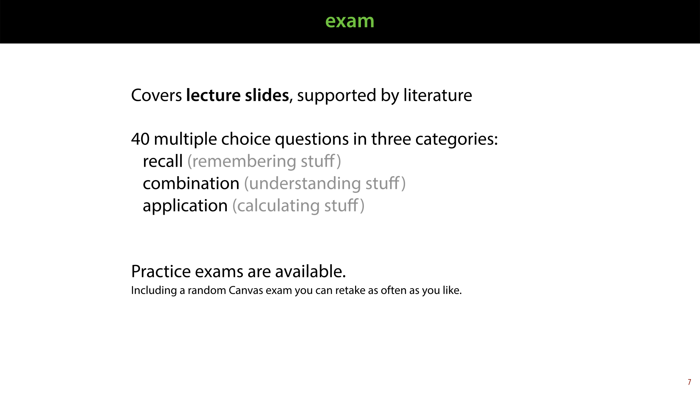

            <figcaption>
            
The lectures are the main focus of the exam. There is also required reading, but this is there as<em> support material</em> if the lectures aren't enough to give you a complete understanding. It's technically possible that an exam question deals with something that has only been mentioned in the literature, but it's rare. 

The exam has a very predictable structure, which you can use to your advantage. See <strong>Practice Exam A</strong> on Canvas for details. The main thing to worry about are the <em>application</em> questions. These require you to do things like calculating something, deriving something, or following an algorithm. In short, this is the stuff you need to practice beforehand. 

            </figcaption>
            click image for animation
       </section>

       <section id="slide-008" class="anim">
            <a class="slide-link" href="https://mlvu.github.io/details#slide-008" title="Link to this slide.">link here</a>
            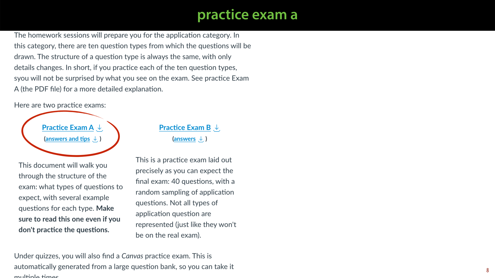

            <figcaption>
            
On Canvas, in the syllabus, you will find practice exam A: this document gives examples question, but it also explains in detail what the structure of the exam will be. Of particular note is the list of 10 <em>questions types</em> for the application questions on the exam. We will select 4 or 5 question types from this list for the exam. The structure of these questions will always be exactly the same, with only small details changed.  

That means the application part of the exam will be extremely predictable: if you’ve practices these 10 types of questions well, there will be no surprises in this part. 

            </figcaption>
            click image for animation
       </section>

       <section id="slide-009">
            <a class="slide-link" href="https://mlvu.github.io/details#slide-009" title="Link to this slide.">link here</a>
            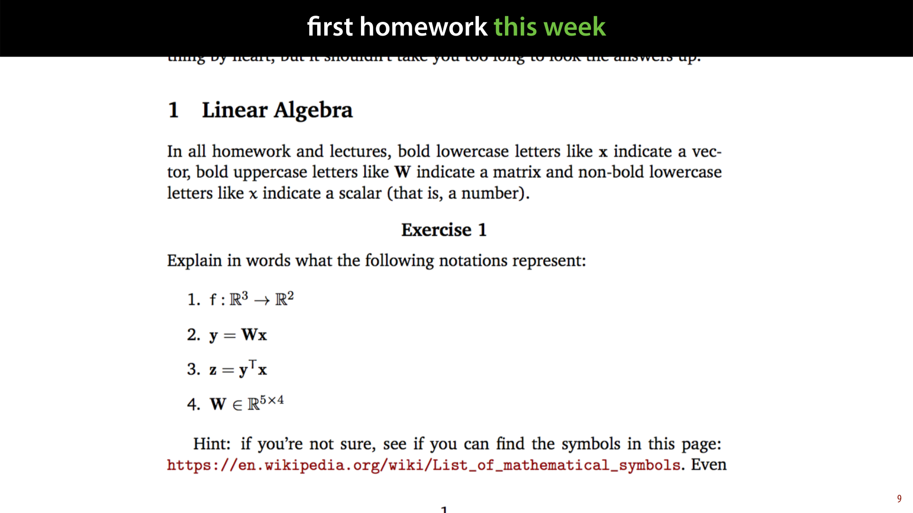

            <figcaption>
            
The homework helps you prepare for the application<em> </em>questions on the exam and in the quizzes. It's not graded, and you are entirely free to decide how much of it you do. The homework sessions, which are not obligatory, are there to help you with the homework.  

If you do go there, however, you are expected to have done, or to have tried to do, the homework beforehand. 

This slide shows the first homework exercise. This is<strong> a particularly important one</strong>, because it covers the preliminaries: the stuff we are assuming you know already. If you don't, that's fine, but it's your own responsibility to brush up. The homework has some links for where to do that. There is also a lecture that explains the most important details of the preliminaries. 
<aside    >If you find these symbols intimidating, or difficult to read,<strong> </strong>make sure to show up to the homework session. The mathematics of machine learning are relatively lightweight, but you do need to get used to the notation. If you have trouble with this sort of thing, the best thing to do is to face it early on and to ask us for help. </aside><aside    ></aside>
            </figcaption>
       </section>

       <section id="slide-010">
            <a class="slide-link" href="https://mlvu.github.io/details#slide-010" title="Link to this slide.">link here</a>
            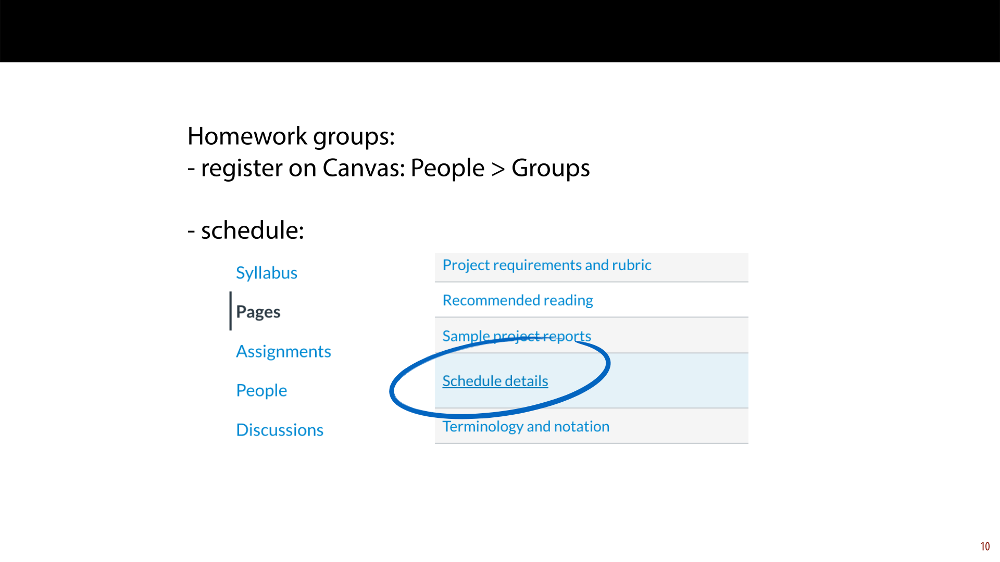

            <figcaption>
            
You can register for a homework group on Canvas. Go to "groups" under "People".  

Go to "schedule details" under "Pages" to find out when and where every group is.

            </figcaption>
       </section>

       <section id="slide-011">
            <a class="slide-link" href="https://mlvu.github.io/details#slide-011" title="Link to this slide.">link here</a>
            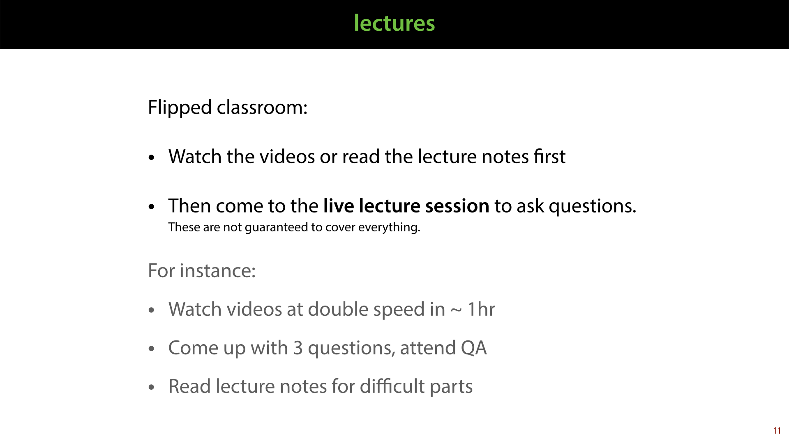

            <figcaption>
            
The lectures will be taught in what is know as "flipped classroom" style. That means the lectures are offered as pre-recorded videos, which you are expected to watch before attending the physical session. The physical session is then a question/answer session where the lecturer will go into any questions you may have, and re-explain important concepts from scratch where necessary. 

You can approach this any way you like. One approach we recommend is to watch the videos at high speed, and try to understand them just well enough to formulate some questions. Then, attend the QA session, which should allow you to follow most of the discussion. After that, use the written lecture notes to work through the more complex parts slowly. 

            </figcaption>
       </section>

       <section id="slide-012">
            <a class="slide-link" href="https://mlvu.github.io/details#slide-012" title="Link to this slide.">link here</a>
            

            <figcaption>
            
The second part of the grade is<strong> a machine learning project</strong>. This could be trying to analyse a particular dataset, solving a particular problem, or implementing a particular algorithm from scratch. You are free to choose your own topic, and the TA can help you with this. 

Our suggestion is to spend the first weeks exploring and trying out different methods. We offer 5 Jupyter notebooks (the <em>worksheets</em>) to help you get acquainted with the Python machine learning stack. Each should take 15 to 30 minutes to work through, and they serve mostly to give you a working environment to play around in. 

The deadline for picking a topic is 22 February. You can of course, commit to the topic earlier, so you have more time to perfect the report, but we do recommend exploring a bit first. 
<aside    >Note also that the last quiz is handed in on March 8, so you can expect to have a little more time to focus on the project in the last two weeks before the exam week.</aside><aside    ></aside>
            </figcaption>
       </section>

       <section id="slide-013">
            <a class="slide-link" href="https://mlvu.github.io/details#slide-013" title="Link to this slide.">link here</a>
            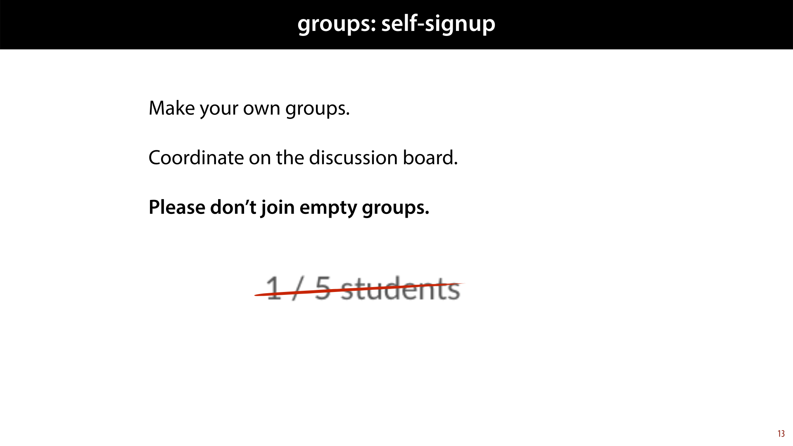

            <figcaption>
            
You may make your own groups however you like. There is a thread on the discussion board where you can look for groups to join. It's good to try and find a group with a similar level of ambition to your own. 

In principle, you are free to join any group that has space. If you don't much care, just pick any group, join, and introduce yourself. 

As a courtesy to other students, please do not just join empty groups as a solo student. Join a group that is already part full. A lot of groups need a little time to coordinate and to get 5 people together, before they sign up. This becomes very difficult when all groups already have one person in them.

            </figcaption>
       </section>

       <section id="slide-014">
            <a class="slide-link" href="https://mlvu.github.io/details#slide-014" title="Link to this slide.">link here</a>
            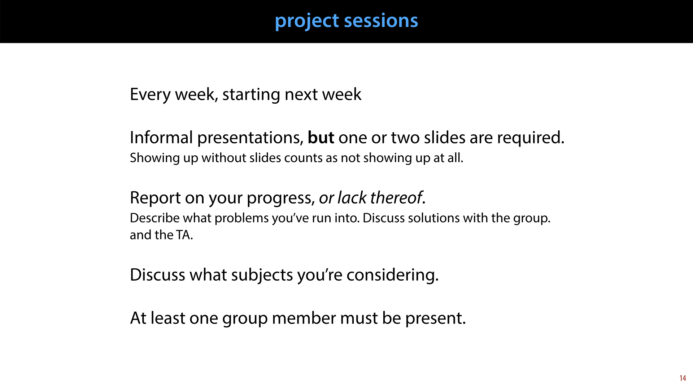

            <figcaption>
            
The project is supported in project sessions. There is no project session in the first week, and the project session in the last week is optional. 

You'll need to give a small presentation each session. This should be very informal, but you <strong>do need to have slides</strong> (just one or two), to show that you've thought about what you're going to say beforehand. Showing up without slides is counted as not showing up at all.

            </figcaption>
       </section>

       <section id="slide-015">
            <a class="slide-link" href="https://mlvu.github.io/details#slide-015" title="Link to this slide.">link here</a>
            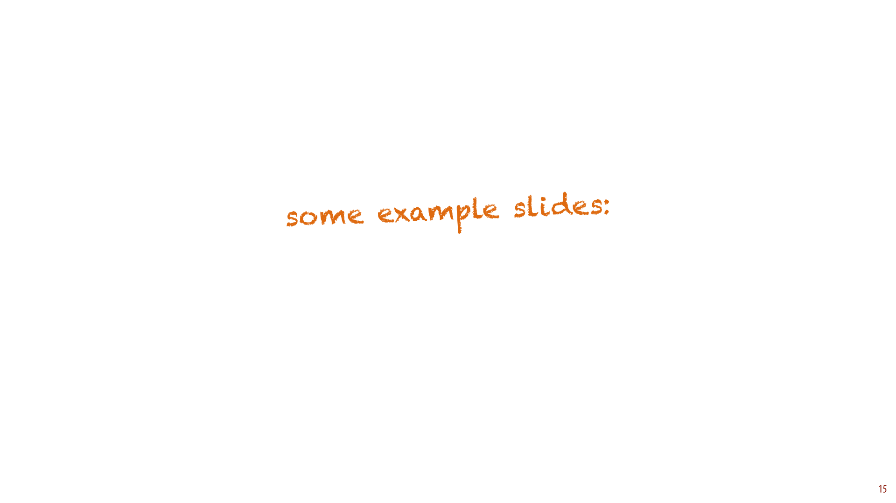

            <figcaption>
            
People often find it difficult to figure out what to talk about in each session, so here are some examples of the sort of slides we expect from you.

            </figcaption>
       </section>

       <section id="slide-016">
            <a class="slide-link" href="https://mlvu.github.io/details#slide-016" title="Link to this slide.">link here</a>
            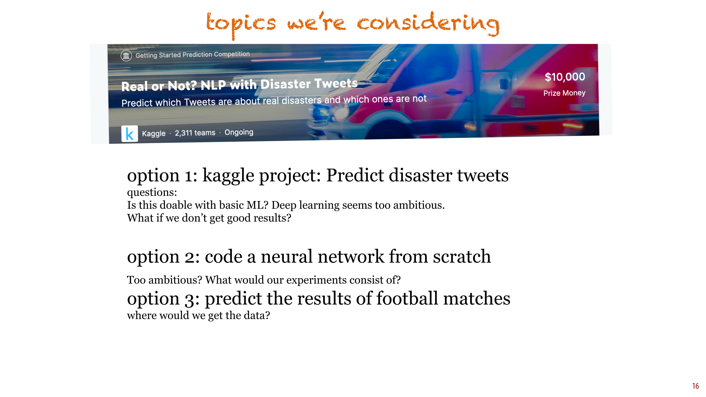

            <figcaption>
            
In the first week, you can introduce your group, and discuss the topics you're considering. This allows everybody to get a sense of what kind of topics different groups are thinking about, and it allows the TA to give you some feedback on what is manageable.

            </figcaption>
       </section>

       <section id="slide-017">
            <a class="slide-link" href="https://mlvu.github.io/details#slide-017" title="Link to this slide.">link here</a>
            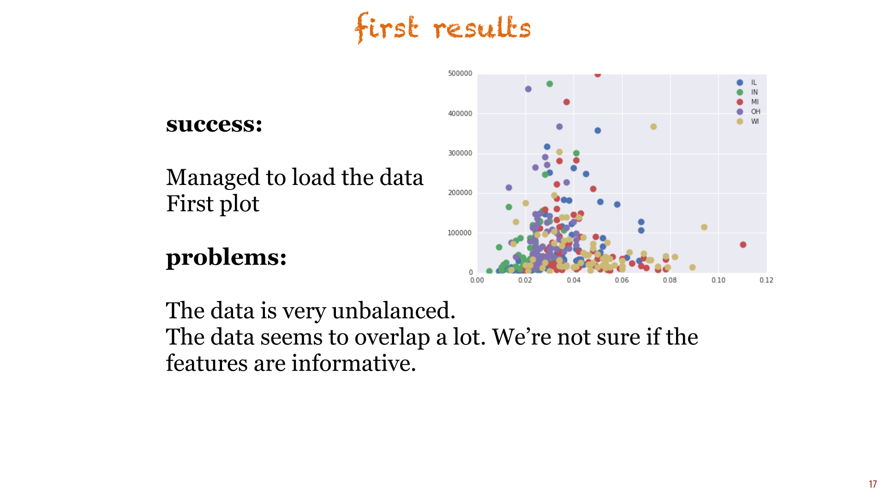

            <figcaption>
            
In the week after that, you have perhaps managed some early data explorations for one of your candidate topics. If so, copy paste whatever you have onto the slides, and discuss what you're stuck on and what problems you see. 

Help the TA to help you do some early troubleshooting. Problems like unbalanced data, missing values or poor label quality are important to identify early.

            </figcaption>
       </section>

       <section id="slide-018">
            <a class="slide-link" href="https://mlvu.github.io/details#slide-018" title="Link to this slide.">link here</a>
            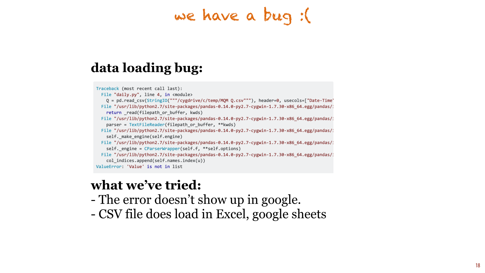

            <figcaption>
            
If you get stuck somewhere, just present the problem, and what you’ve tried so far. Maybe some students have encountered the same problem, maybe the TA can give you some tips for how to solve the problem. 

You don’t always have to present progress, but you do have to do something every week, and present what you’ve done. 
<aside    >Note that it's beneficial to work in python for this sort of thing, because most other students will also be working in python, so it increases the chances that your fellow students will be able to help you.</aside><aside    ></aside>
            </figcaption>
       </section>

       <section id="slide-019">
            <a class="slide-link" href="https://mlvu.github.io/details#slide-019" title="Link to this slide.">link here</a>
            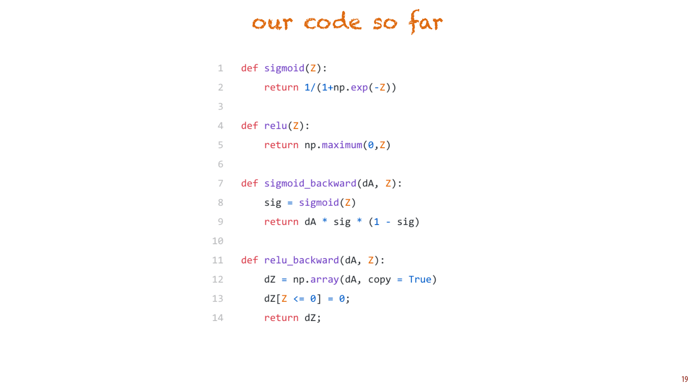

            <figcaption>
            
If you’re halfway through some complex coding, you can present some code that’s finished, and explain what it does.

            </figcaption>
       </section>

       <section id="slide-020">
            <a class="slide-link" href="https://mlvu.github.io/details#slide-020" title="Link to this slide.">link here</a>
            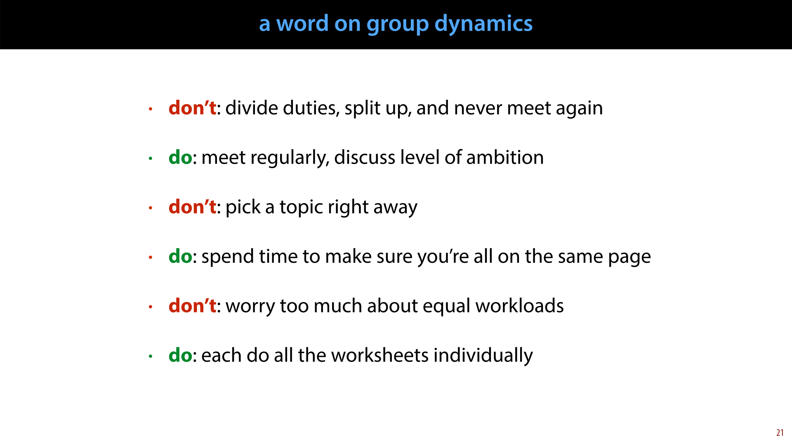

            <figcaption>
            
Some people don’t like working in groups, so they turn a project assignment into five individual assignments by immediately breaking up the work and never meeting again. Not only is this not the point of group work, it’s very likely to fail: if one group member doesn’t deliver, or misunderstood the idea, the whole project goes wrong. 

We consider efficient group work one of the skills you are practicing in this course. Just like coding, writing and mathematics. If you don't invest in setting up a healthy group dynamic, it will hurt your grade. In principle, we will not intervene if a group member underdelivers or otherwise doesn't satisfy the obligations the group has set. Unless somebody stays entirely absent, it's your own responsibility. 
<aside    >Please don't let that stop you, however, from letting us know about any problems. Just like the other skills, this is something we can hopefully help out with. We just want to emphasize that it's your own responsibility. We're happy to help, but not to arbitrate.</aside><aside    ></aside>
            </figcaption>
       </section>

       <section id="slide-021">
            <a class="slide-link" href="https://mlvu.github.io/details#slide-021" title="Link to this slide.">link here</a>
            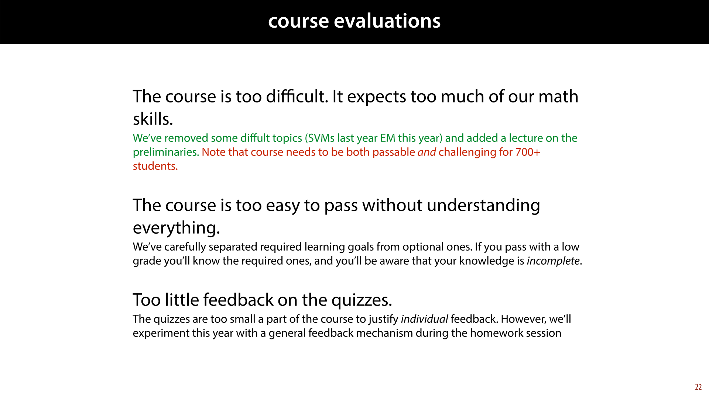

            <figcaption>
            
We have a very diverse group of students, and many  will be grouped with people you haven’t met before. Make sure that you’re on the same page about the kind of project you’d like to do and how complicated you want to make stuff. Nothing kills a project faster than a single highly motivated student dragging everybody into a hugely ambitious project. 

To make sure that everybody is clear about the group’s goals, <strong>take your time</strong> before you pick the topic. Meet regularly and do lots of exploratory work. Give everybody time to learn what machine learning is about, and to join the discussion.  
<aside    >It helps if everybody does the worksheets on their own, so you have a common experience to build on.</aside><aside    ></aside>
            </figcaption>
       </section>

       <section id="slide-022">
            <a class="slide-link" href="https://mlvu.github.io/details#slide-022" title="Link to this slide.">link here</a>
            

            <figcaption>
            
Finally, we’d like to point a few things that often show up in evaluations, and what we do about these points of criticism. 

The first complaint we often hear is that the course is too difficult and requires a lot of math skills. When possible we try to simplify the course in response without watering it down too much. In the last two years, two complex topics have been removed.  
<aside    >You can still see these lectures on the website if you’re curious. </aside>
We ask program directors to check that students have at least <em>some </em>background in probability, calculus and linear algebra before adding this course to their program. Still. for some people that means having had calculus in high school, or having to recall a linear algebra course that wasn’t very successful. We do our best to give you time to brush up on your preliminaries before we get into the hard math. 

The flipside of this is that we have certain goals to achieve. We don’t just need to convey machine learning, many of you are going to do a master soon, where the math level is much higher. If we hold back now, you will only suffer more next in the master. In short, there is a limit to how much simpler we can make the course.  

On the other side, we also hear that the course is <em>too simple</em>. More specifically, that despite all the complicated stuff we talk about, you only really need to master a small subset of the material in order to pass. It’s important to realize that this is <em>by design</em>. Doing this is not cheating. We carefully choose a subset of the material as primary learning goals. Knowing these inside and out will get you a passing grade, and the better you know the rest, the closer you get to a 10. This is is how courses are <em>supposed</em> to work. Especially a course like this, with so many students from so many different backgrounds. 

Another point we saw a lot last year, is that for the open quiz questions, there is little feedback form the TAs to justify the grades. We can’t give individual feedback for two reasons. First, it’s simply too much work (remember, we have to mark 700 quizzes per work), and second, the TAs aren’t qualified to argue with students about grades, and explicit feedback invites a certain amount of arguments. 

What we will try instead this year, is to have a general feedback session as part of the homework groups. Here, the TA points to specific issues that we encountered a lot during marking. You can also ask the homework TA to have a look at your submission, if there’s time, but remember they are not the TA that marked your quiz. 
<aside    >One other criticism we received is that hosting the videos on Youtube requires students to watch a lot of ads. This year, we will try to host the embedded videos on an alternative platform, so that ad-free viewing is also possible. </aside><aside    ></aside>
            </figcaption>
       </section>

       <section id="slide-023">
            <a class="slide-link" href="https://mlvu.github.io/details#slide-023" title="Link to this slide.">link here</a>
            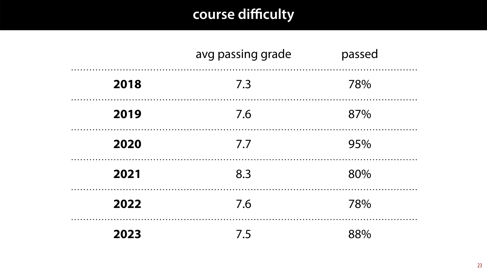

            <figcaption>
            
To illustrate the course difficulty, here are the average passing grades and the pass percentages of previous years. Note that these do not point to a disproportionately difficult course. In fact, some years are a little higher than what would be expected from a sufficiently challenging course. 
<aside    >These are the percentages of active students that passed, and the average grades among that percentage of students who passed </aside>
This doesn’t mean we don’t sympathise if you find the course difficult, or that we think it’s your own fault. We are always happy to help, and we strongly believe everybody should be able to learn these concepts. It’s just that these numbers don’t indicate that there is a serious problem, or that an overhaul is called for. 
<aside    >Nevertheless, last year, we decided to remove some of the more technical subjects which have become less relevant in the last few years: support vector machines, and with them Lagrange multipliers. We decided not to replace these by other subjects, but instead to give the remainder a little more room to breathe. This will hopefully lighten the load a little. </aside><aside    >This year, we removed the Expectation Maximization algorithm, and replaced it by the topic of Transformers. The latter is more relevant to modern AI and hopefully a little simpler. </aside>
 

 
<aside    ></aside>
            </figcaption>
       </section>

       <section id="slide-024">
            <a class="slide-link" href="https://mlvu.github.io/details#slide-024" title="Link to this slide.">link here</a>
            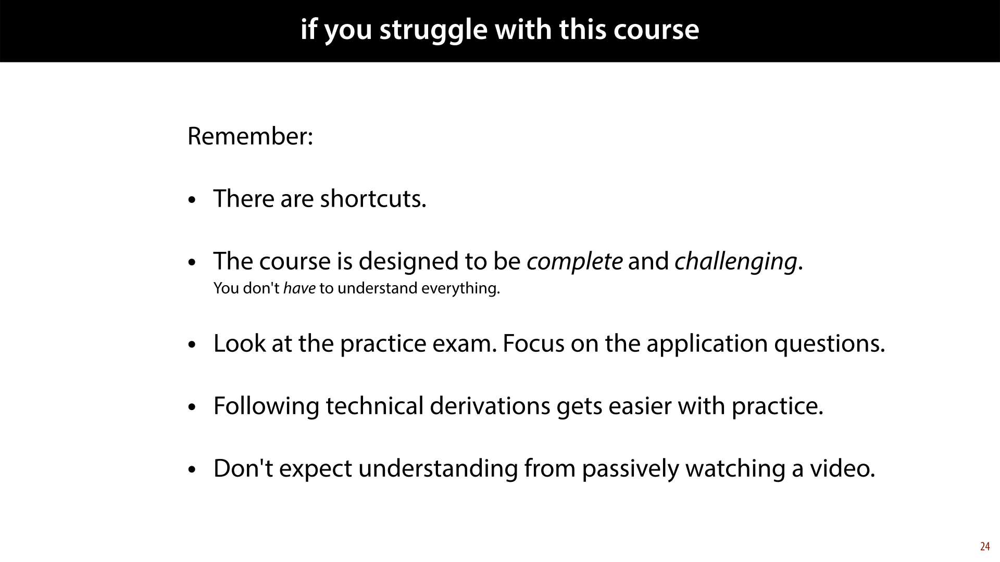

            <figcaption>
            
So, if you find yourself overwhelmed by the material, what should you do? Note first, that it's perfectly possible and acceptable to pass the course without understanding all the ins and outs of every topic discussed.  

Quite often, the slides aim to provide a <em>complete</em> story so that if you need to know all the details about a certain topic, you have them in a self-contained package. That doesn't mean, however, that you always need to understand all details of every subject. You can often skip the technical details, so long as you understand the larger message.  
<aside    >You don't always need to know how to get from A to B, so long as you understand what A and B are, and why it's important to get from one to the other. </aside>
To help you separate the wheat from the chaff, please look at the <strong>practice exams </strong>early on. They will help you to understand what it is you should focus on, if you find that the whole of a lecture is too much to digest.  

When it comes to following complex mathematical derivations, please note that it gets easier with practice. Maybe it takes you an hour to follow all the steps in a single slide the first time around, and your heart sinks at the prospect of doing that several times for every lecture. However, if you persevere, it will get easier very quickly, and before long, it will be second nature. 

Lastly, the practice of recording videos may give the unfortunate impression that all material can be absorbed by passively watching a video. You should expect to get as much out of watching the videos passively as you get out of attending a live lecture. It should be enough to set the stage, and to give a skeletal understanding of the subject, but to get the details, an active approach is necessary: you need to watch with pen and paper ready, and you'll have to frequently pause. Hopefully, the lecture notes can help with this part of the process.

            </figcaption>
       </section>

       <section id="slide-025">
            <a class="slide-link" href="https://mlvu.github.io/details#slide-025" title="Link to this slide.">link here</a>
            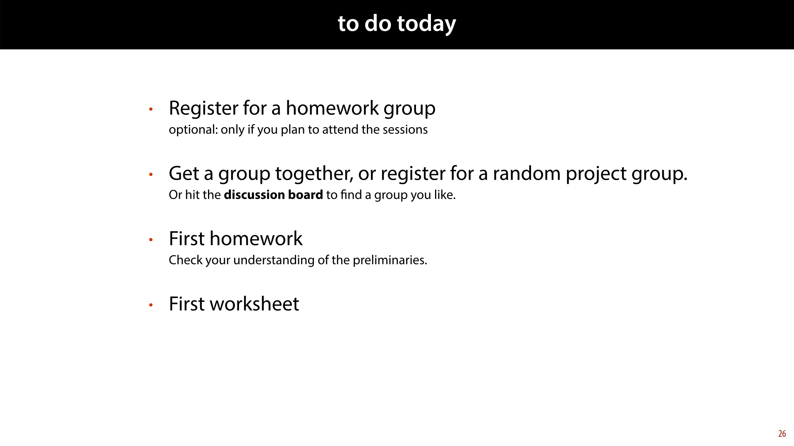

            <figcaption>
            
Those are the main things to understand going into the course.  

If anything is still unclear, you may ask me any question you like but only after you’ve read <a href="https://canvas.vu.nl/courses/60015/assignments/syllabus">this page</a> from top to bottom. <strong>There is an FAQ section at the bottom.</strong>

<strong></strong>

            </figcaption>
       </section>

       <section id="slide-026">
            <a class="slide-link" href="https://mlvu.github.io/details#slide-026" title="Link to this slide.">link here</a>
            

            <figcaption>
            

            </figcaption>
       </section>

</article>
