<nav class="menu">
    <ul>
        <li class="home"><a href="/">Home</a></li>
        <li class="name">Lecture 8: Density estimation</li>
                <li><a href="#video-000">Normal distributions</a></li>
                <li><a href="#video-026">Maximum likelihood estimators</a></li>
                <li><a href="#video-042">Expectation-maximization</a></li>
                <li><a href="#video-069">A formal analysis of EM</a></li>
        <li class="pdf"><a href="https://mlvu.github.io/lectures/42.ProbabilisticModels2.annotated.pdf">PDF</a></li>
    </ul>
</nav>

<article class="slides">

        <section class="video" id="video-000">
            <a class="slide-link" href="https://mlvu.github.io/em#video-0">link here</a>
           <video controls>
                <source src="https://pbm.thegood.cloud/s/rw6ffNbQ4geDsz9/download/MLVU%208.1_%20Normal%20distributions.mp4" type="video/mp4" />

                Download the <a href="https://pbm.thegood.cloud/s/rw6ffNbQ4geDsz9/download/MLVU%208.1_%20Normal%20distributions.mp4">video</a>.
           </video>
        </section>

       <section id="slide-001">
            <a class="slide-link" href="https://mlvu.github.io/em#slide-001" title="Link to this slide.">link here</a>
            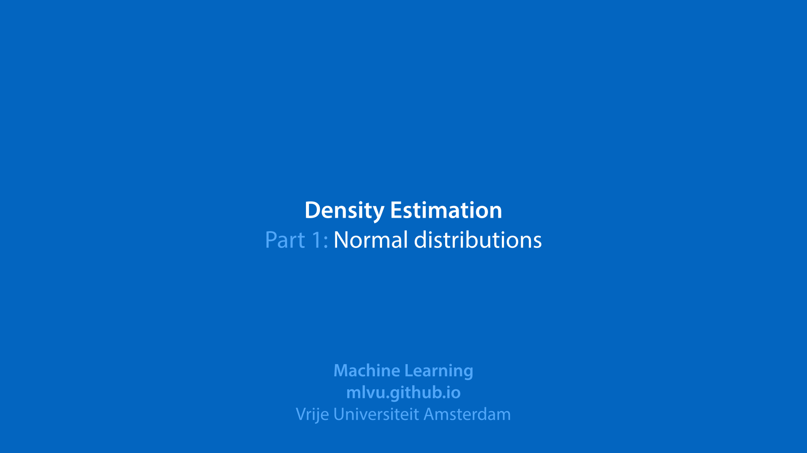

            <figcaption>
            
In a few videos so far, we made use of the Normal distribution, assuming that you’d seen it before, and that you know more or less what its properties are. 

In this  video, we’ll take a step back and look at the normal distribution from first principles. It’s an important tool in what is coming up in this lecture and the next, so we need to make ourselves eminently comfortable with the ins and outs. 

 

            </figcaption>
       </section>

       <section id="slide-002">
            <a class="slide-link" href="https://mlvu.github.io/em#slide-002" title="Link to this slide.">link here</a>
            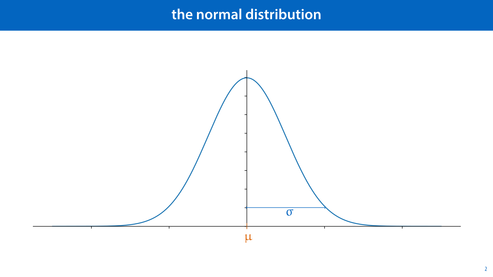

            <figcaption>
            
Here is the one dimensional normal distribution. 

One of the reasons that the normal distribution is so popular is that it has a definite <em>scale</em>. If I look at something like income distribution, the possible values cover many orders of magnitude, from 0 to billions. This is not the case with normally distributed phenomena. Take height for instance: no matter how many people I check, I will never see a person that is 5 meters tall. 

The normal distribution is a way of saying: I’m not sure about the value of x, and I can’t definitely rule any value out, but I’m almost certain it’s near this particular value. 

            </figcaption>
       </section>

       <section id="slide-003">
            <a class="slide-link" href="https://mlvu.github.io/em#slide-003" title="Link to this slide.">link here</a>
            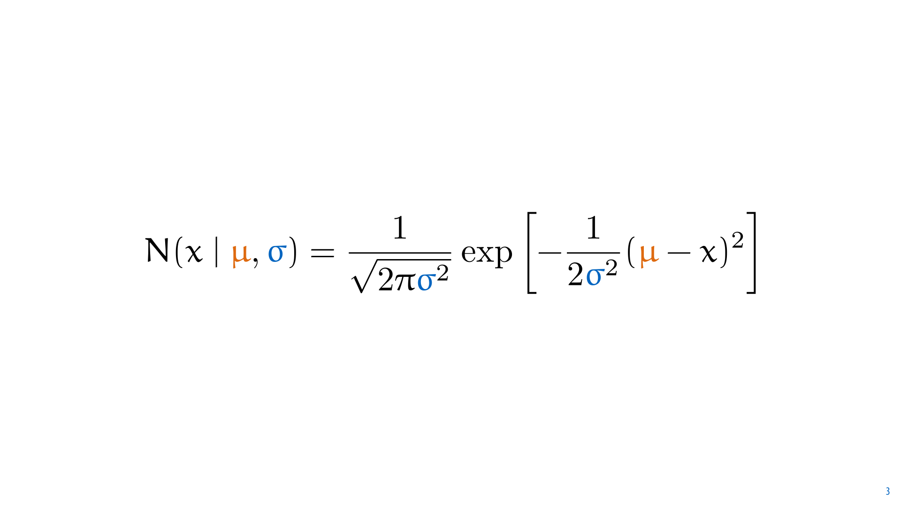

            <figcaption>
            
This is the formula for the probability density function of the one-dimensional normal distribution.  It looks very imposing, but if you know how to interpret it, it’s actually not that complicated. Let’s first see where it came from, and then try to figure out what all the different parts mean.

            </figcaption>
       </section>

       <section id="slide-004" class="anim">
            <a class="slide-link" href="https://mlvu.github.io/em#slide-004" title="Link to this slide.">link here</a>
            

            <figcaption>
            
So, if we strip away the complexity, this is the only really important part of the normal distribution. <strong>A negative exponential for the squared distance to the mean. </strong>

Everything else is adding some parameters so we can control the shape, and making sure it sums to one when we integrate.

            </figcaption>
            click image for animation
       </section>

       <section id="slide-005">
            <a class="slide-link" href="https://mlvu.github.io/em#slide-005" title="Link to this slide.">link here</a>
            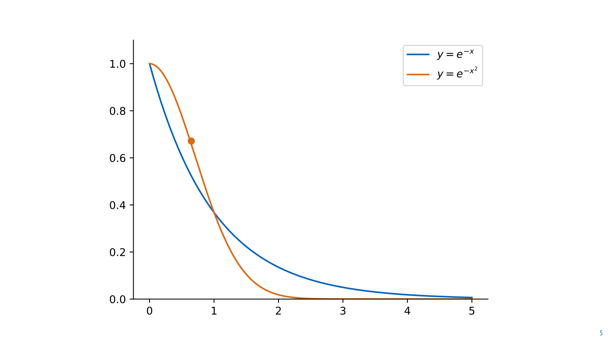

            <figcaption>
            
What does this curve look like? To illustrate, we’ll set the mean to zero for now, so that the function becomes exp(-x2) . 

Earlier, we described the normal distribution as having a <strong>definite scale</strong>. This means that we first need to make outliers incredibly unlikely. An exponentially decaying function like exp(-x) gives us that property. Each step of size 1 we take to the right more than halves the probability density. After seven steps it’s one thousandth of where we started, after fourteen steps one millionth, and after twenty-one steps one-billionth. 

Taking the negative exponential of the <em>square</em>, as our function exp(-x2)  does, results in an even stronger decay, and it has two more benefits.  
<aside    >Incidentally, if you follow Gauss’ logic for the <strong>median</strong> rather than the mean, you’ll see that the corresponding distribution follows the blue line in this picture (the so called<a href="https://en.wikipedia.org/wiki/Laplace_distribution"><strong> Laplace distribution</strong></a>). This fits our intuition that when our data doesn’t have a definite scale (like wealth), we should use the median rather than the mean. It also shows, however, that even with the median there is still some assumption of scale: outliers are still exponentially unlikely and we know where to expect samples. To model concepts like wealth properly, we need a <a href="https://en.wikipedia.org/wiki/Power_law"><strong>power law distribution</strong></a>. Such distributions are sometimes called scale-free. They truly have no scale, and there is no value like a mean or a median that tells us where we are most likely to find a sample.</aside><aside    ></aside>
            </figcaption>
       </section>

       <section id="slide-006">
            <a class="slide-link" href="https://mlvu.github.io/em#slide-006" title="Link to this slide.">link here</a>
            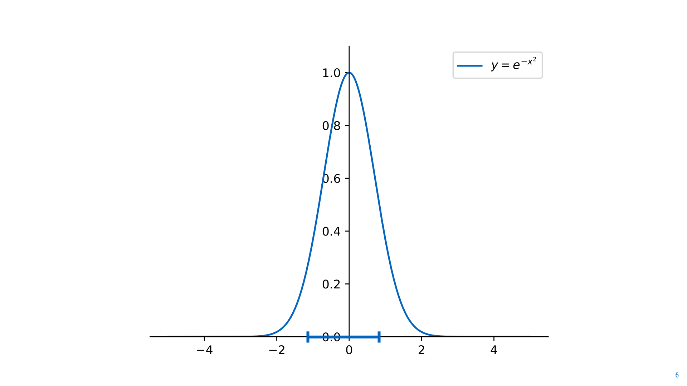

            <figcaption>
            
The first benefit is that the the function flattens out at the peak, giving us a nice bell-shaped curve, where exp(-x) instead has an ugly discontinuity at the top (if we make it symmetric). 

The second benefit is that it has an <strong>inflection point</strong>: the point (around 0.7) where the curve moves from decaying with <em>increasing</em> speed to decaying with <em>decreasing</em> speed. We can take this as a point of reference on the curve: to the left of this point, the curve looks fundamentally different than to the right of it. With the exponential decay, the function keeps looking the same as we move from left to right, every seven steps we take, the density halves. With the squared exponential decay, there is a place where the function keeps dropping ever more<em> quickly</em>, and a place where it starts dropping ever more <em>slowly</em>. We can use this to, as it were, decide where we are on the graph.  

The two inflection points are natural choices for the<strong> range </strong>bounding the “characteristic” scale of this distribution. The range of outcomes which we can reasonably expect. This is a little subjective: any outcome is possible, and the characteristic scale depends on what we’re willing to call unlikely. But given the subjectivity, the inflection points are as good a choice as anything. 

            </figcaption>
       </section>

       <section id="slide-007">
            <a class="slide-link" href="https://mlvu.github.io/em#slide-007" title="Link to this slide.">link here</a>
            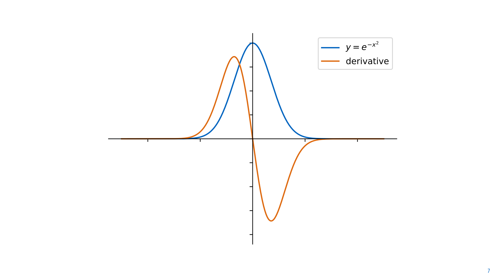

            <figcaption>
            
The inflection points are the peaks of the derivative of exp(-x2). 
<aside    >This makes sense if we think of the derivative as the rate of change. When the curve is increasing the derivative is positive and when its decreasing the derivative is negative. When the curve is increasing with increasing speed, the derivative is increasing, and when the curve is increasing with decreasing speed, the derivative is decreasing. The change between these two states is the inflection point where the derivative is neither increasing nor decreasing.</aside><aside    ></aside>
            </figcaption>
       </section>

       <section id="slide-008">
            <a class="slide-link" href="https://mlvu.github.io/em#slide-008" title="Link to this slide.">link here</a>
            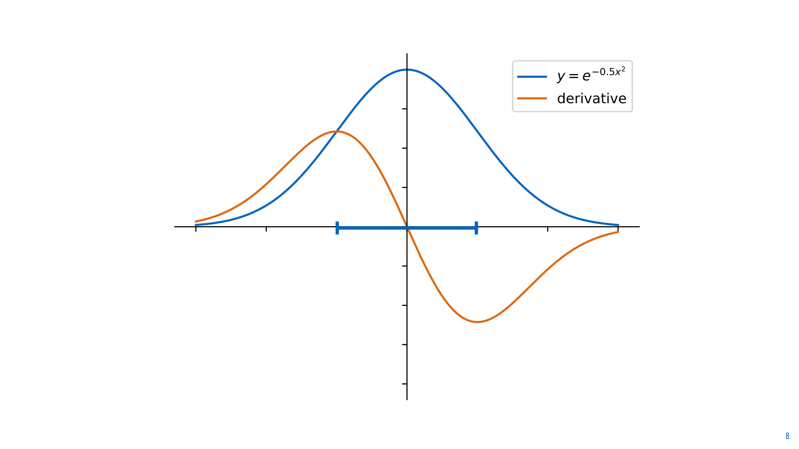

            <figcaption>
            
If we add a 0.5 multiplier to the inputs, the inflection points hit -1 and 1 exactly. This gives us a curve for which the characteristic scale is [-1, 1], which seems like a useful starting point (we can rescale this later to any range we require). 
<aside    >Additionally, when we now derive the maximum likelihood estimator for the mean, the exponent 2 will cancel out against this one half, which means we don’t even need to introduce the constant 2 multiplier when we derive the basic shape of the Gaussian.</aside><aside    ></aside>
            </figcaption>
       </section>

       <section id="slide-009" class="anim">
            <a class="slide-link" href="https://mlvu.github.io/em#slide-009" title="Link to this slide.">link here</a>
            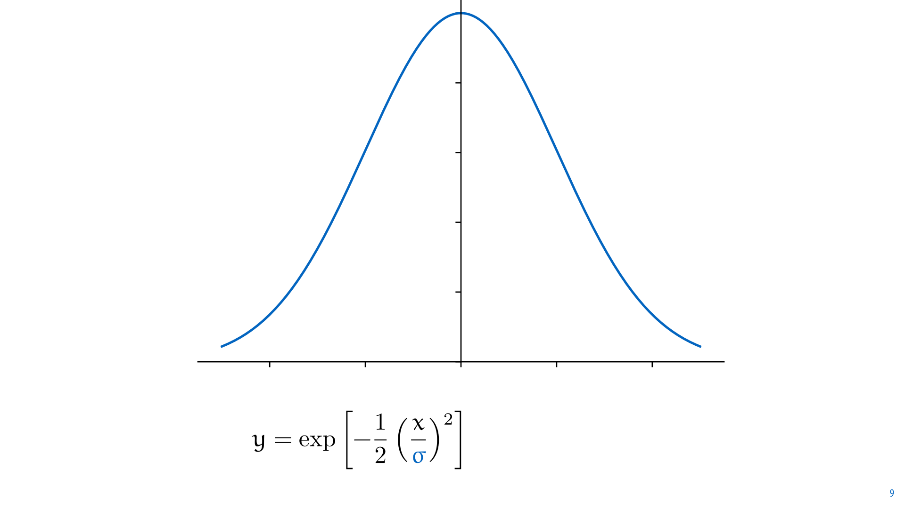

            <figcaption>
            
To change the scale, we add a parameter σ. This will end up representing the the <strong>standard deviation</strong>, but for now, we can just think of it as a way to make the bell wider or narrower. 

The square of the standard deviation is the variance. Either can be used as a parameter.

            </figcaption>
            click image for animation
       </section>

       <section id="slide-010">
            <a class="slide-link" href="https://mlvu.github.io/em#slide-010" title="Link to this slide.">link here</a>
            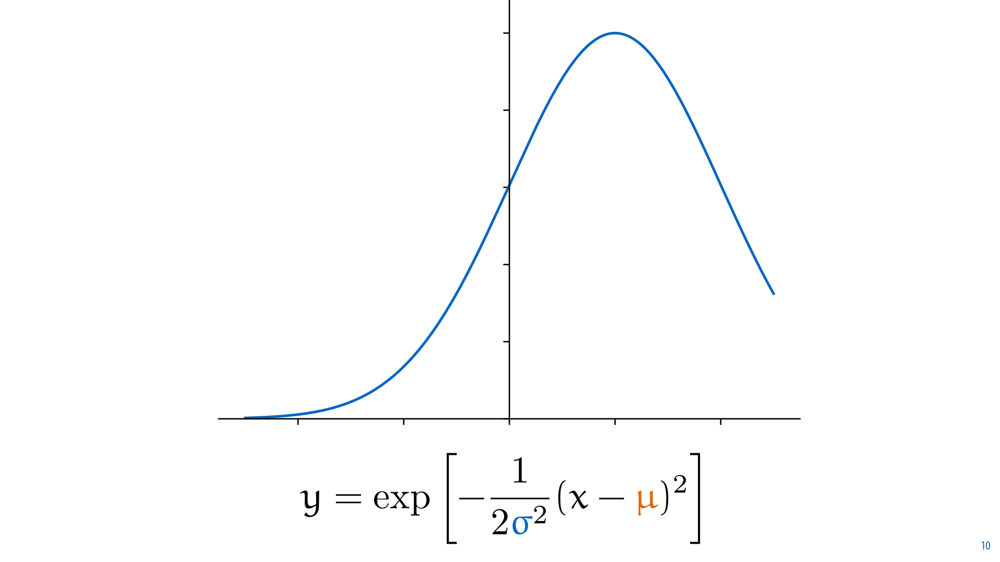

            <figcaption>
            
We can now add the mean back in, with parameter μ. This shifts the center of the bell forward or backward to coincide without the desired mean. 
<aside    >Note that shifting a curve forward by μ points is the same as shifting the coordinates backward by μ points. Likewise, we can think of the multiplication by σ as keeping the curve the same, but just drawing the ticks on the horizontal axis closer together or further apart.</aside><aside    ></aside>
            </figcaption>
       </section>

       <section id="slide-011" class="anim">
            <a class="slide-link" href="https://mlvu.github.io/em#slide-011" title="Link to this slide.">link here</a>
            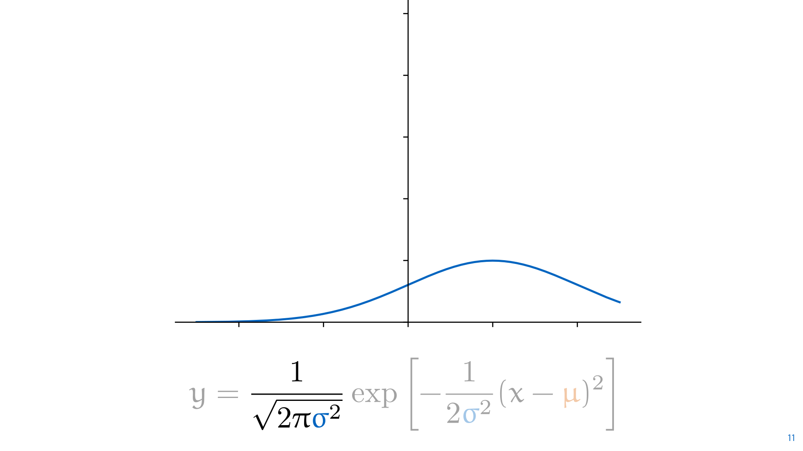

            <figcaption>
            
Finally, to make this a  proper probability density function, we need to make sure the area under the curve sums to one. 

This is done by integrating over the whole real number line. If the result is Z, we divide the function at every point by Z. This gives us a function that sums to 1 over the whole of its domain. For this function, it turns out that integrating results in an area equal to the square of two times π times the variance. 
<aside    >Don't be confused by the complicated looking mulitplier. The trick here is simple. If you multiply a function by 0.5 at every point, then it integrates to half of what it did before. If the squared exponential integrates to Z before we normalize, then mulitplying it by 1/Z ensure that it integrates to 1. It just so happens that Z = sqrt(2πσ2) in this case.</aside><aside    ></aside>
            </figcaption>
            click image for animation
       </section>

       <section id="slide-012">
            <a class="slide-link" href="https://mlvu.github.io/em#slide-012" title="Link to this slide.">link here</a>
            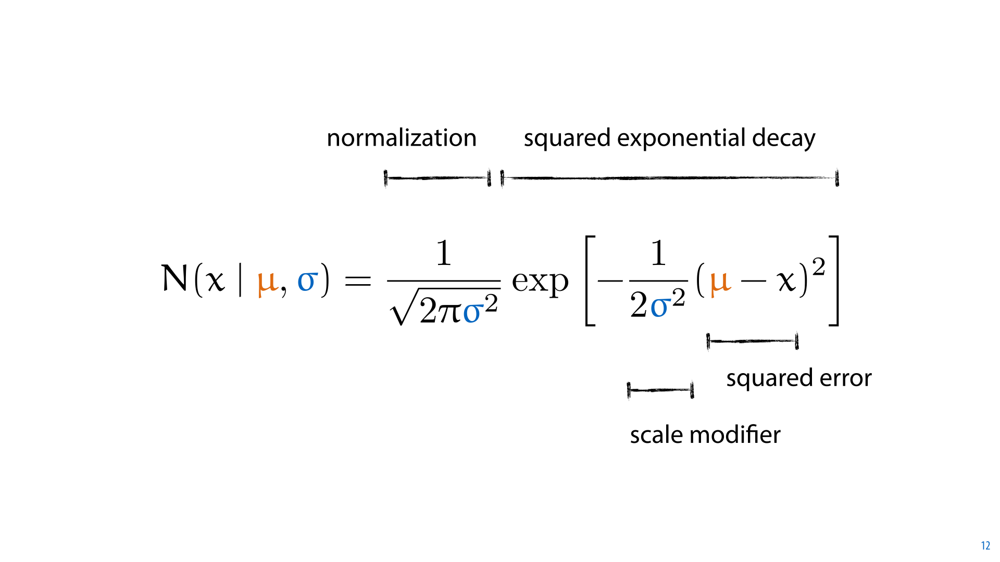

            <figcaption>
            
So that’s what the different parts of the normal distribution do. 

Imagine that we are trying to measure some true value μ, like the height of the average Dutch woman. If we pick a random person and measure them, we'll get a value that is probably near μ, and the values that are nearer μ are more likely, but all values have some probability. 

The formula for the normal distribution says that the probability that we measure the value x, depends primaly on the distance between the true value μ and x, our "measurement error". The likelihood of seeing x scales with squared exponential decay. The variance functions to scale the range of likely values. 

Everything before the exponential is just there as a multiplier for the likelihood so that it integrates to 1 over its whole domain.

            </figcaption>
       </section>

       <section id="slide-013" class="anim">
            <a class="slide-link" href="https://mlvu.github.io/em#slide-013" title="Link to this slide.">link here</a>
            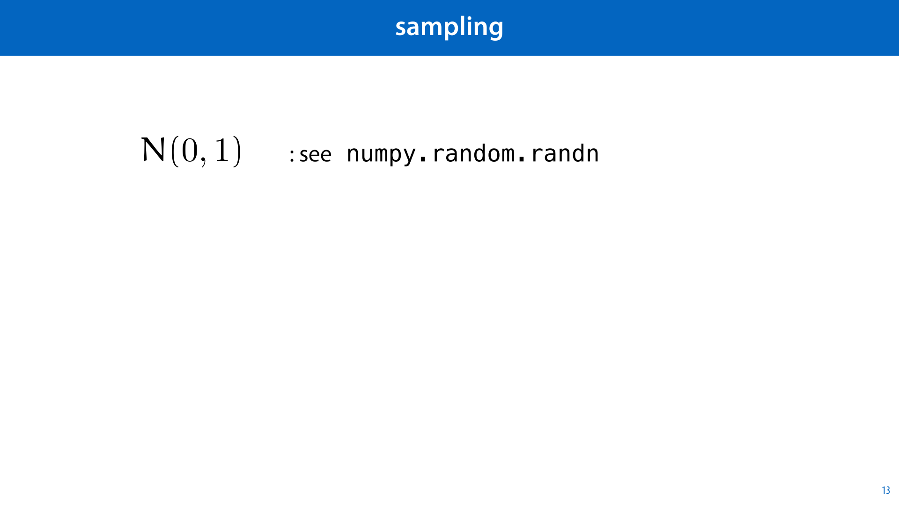

            <figcaption>
            
One benefit of the transformation approach we used, is that it’s now very easy to work out how to <strong>sample from an MVN</strong>. We can take the following approach.  

We’ll take sampling form a univariate standard normal as given, and assume that we have some function that will do this for us. 
<aside    >This is usually done by an algorithm called the Box-Muller transform, if you’re interested. </aside>
We can transform a sample from the standard normal distribution into a sample from a distribution with given mean and variance as shown above. 

            </figcaption>
            click image for animation
       </section>

       <section id="slide-014">
            <a class="slide-link" href="https://mlvu.github.io/em#slide-014" title="Link to this slide.">link here</a>
            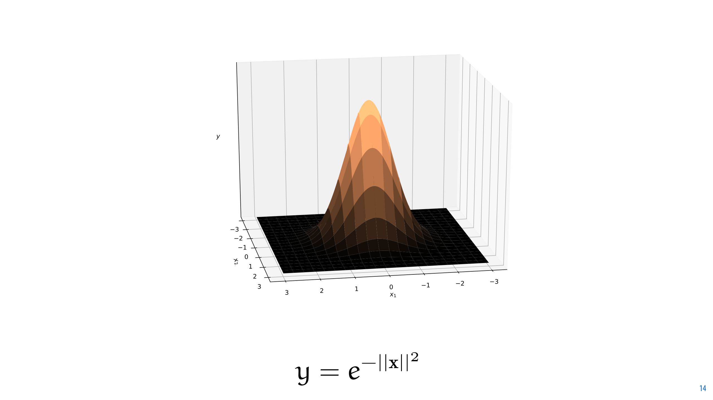

            <figcaption>
            
We start by defining a curve that decays squared-exponentially<em> in all directions</em>. Think of this as spinning our original function around the origin. To determine how likely a given point <strong>x</strong> is, we take the distance between <strong>x </strong>and the origin, and take the negative exponential of that value squared as the likelihood. 

The inflection points now become a kind of “inflection circle”, where the derivative peaks. Inside this circle lie the most likely outcomes for our distribution. This circle is a <strong>contour line </strong>on the normal distribution.

            </figcaption>
       </section>

       <section id="slide-015">
            <a class="slide-link" href="https://mlvu.github.io/em#slide-015" title="Link to this slide.">link here</a>
            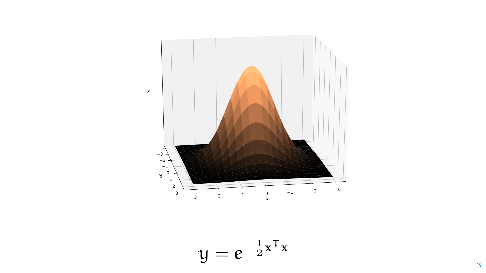

            <figcaption>
            
To give the inflection circle radius 1, we rescale the exponent, as we did before before. 

We also note that the square of the norm in the previous slide is equal to the dot product of <strong>x</strong> with itself, so we write that instead.

            </figcaption>
       </section>

       <section id="slide-016">
            <a class="slide-link" href="https://mlvu.github.io/em#slide-016" title="Link to this slide.">link here</a>
            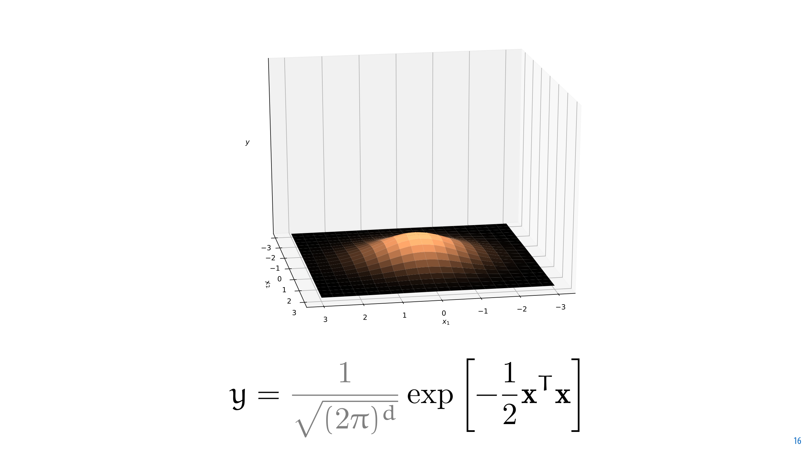

            <figcaption>
            
This time we’ll normalize first, and then introduce the parameters. 

This function is the probability density function of the <em>standard</em><strong> MVN</strong> (zero mean, and variance one in every direction).  

To define add parameters to this distribution for the mean and scale we’ll use a special trick. We’ll start with this distribution, <strong>and apply a linear transformation</strong>. We’ll see that the parameters of the linear transformation then become the parameters of the resulting multivariate normal.  

            </figcaption>
       </section>

       <section id="slide-017" class="anim">
            <a class="slide-link" href="https://mlvu.github.io/em#slide-017" title="Link to this slide.">link here</a>
            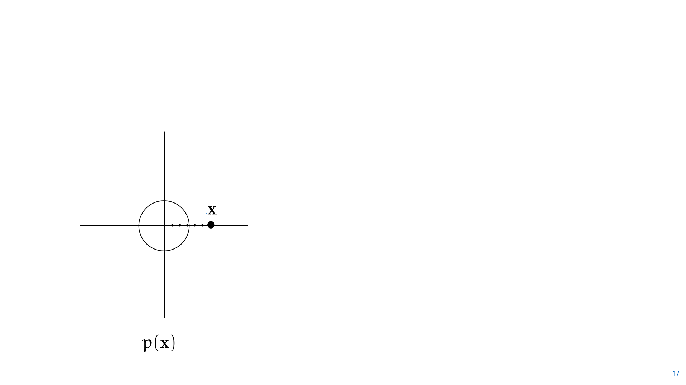

            <figcaption>
            
If we transform a sample <strong>x</strong> from the standard normal distribution into a sample <strong>y</strong>, we get a new distribution, with a new mean, and our inflection circle becomes an inflection ellipse (because a circle becomes an ellipse under a linear transformation).  

The trick is to tray and reverse the process. Say we pick a point <strong>y</strong> somewhere on the right. What’s the probability density for seeing that point after the transformation? 

Consider that the probability of ending up inside the inflection circle on the left must be the same as the probability of ending up inside the ellipse on the right. And this is true for any contour line we draw: we get a circle on the left, and an ellipse of the right, and the probabilities for both must be the same. 

This suggests that if we pick a point <strong>y</strong> on the right, and we want to know its density, we can reverse the transformation, to give us <strong>the equivalent point x on the left</strong>. The density of that point under p(<strong>x</strong>), the standard normal distribution, must be related to the density of <strong>y</strong> under q(<strong>y</strong>). In fact, it turns out that q(<strong>y</strong>) is proportional to the density of the reverse-transformed point.  

The only thing we need to correct for, is the fact that the matrix A shrinks or inflates the bell curve, so that the volume below it does not integrate to 1 anymore. From linear algebra we know that the amount by which a matrix inflates space is expressed by its <em>determinant</em>. So, if we divide the resulting density by the determinant, we find a properly normalized density. 
<aside    >This trick is a simple case of integration by substitution <a href="https://en.wikipedia.org/wiki/Integration_by_substitution#Application_in_probability"><strong>https://en.wikipedia.org/wiki/Integration_by_substitution#Application_in_probability</strong></a> In the context of probability it is also called the Change of Variable Theorem. </aside>
When dealing with Normal distributions it can be very helpful to think of them as linear transformations of the standard normal distribution. 

            </figcaption>
            click image for animation
       </section>

       <section id="slide-018" class="anim">
            <a class="slide-link" href="https://mlvu.github.io/em#slide-018" title="Link to this slide.">link here</a>
            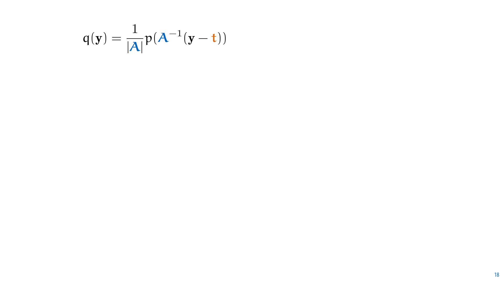

            <figcaption>
            
Here is the mathematics of what we described in the previous slide applied to the normal distribution. p(x) is the density function of the standard multivariate normal, and q(y) is the density of that distribution transformed by affine transformation <strong>A</strong><strong>x</strong> +<strong>t</strong>. 

by the logic in the previous slide, we can take the density of <strong>A</strong>-1(<strong>y</strong>-<strong>t</strong>) under the standard normal as the basis for the density of <strong>y</strong> under q . We set mu equal to t. Using the basic properties of the determinant, the transpose and the inverse (you can look these up on wikipedia if your linear algebra is rusty), we can rewrite the result to the pdf we expect.

            </figcaption>
            click image for animation
       </section>

       <section id="slide-019">
            <a class="slide-link" href="https://mlvu.github.io/em#slide-019" title="Link to this slide.">link here</a>
            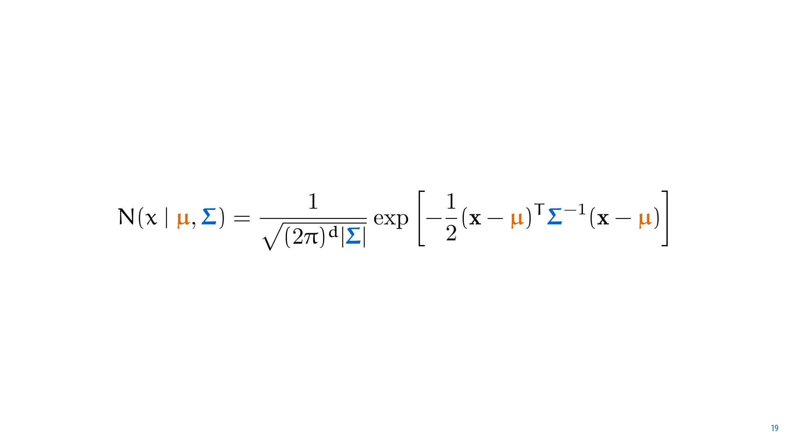

            <figcaption>
            
Here is the final functional form in terms of the mean and the covariance matrix.

            </figcaption>
       </section>

       <section id="slide-020">
            <a class="slide-link" href="https://mlvu.github.io/em#slide-020" title="Link to this slide.">link here</a>
            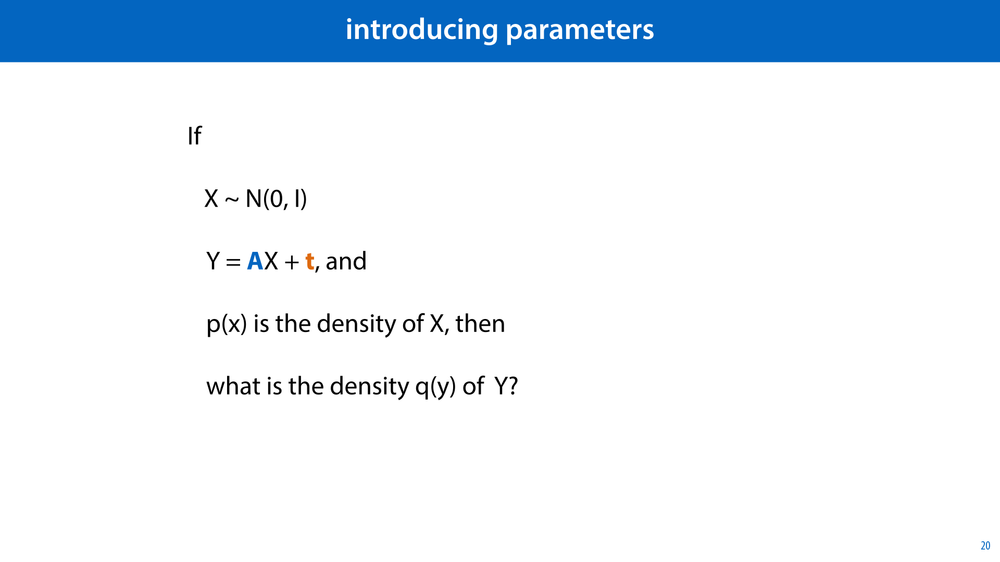

            <figcaption>
            
Here’s the formal way of doing that. Imagine that we sample a point X from the standard normal distribution. We then transform that point by a linear transformation defined by matrix <strong>A</strong> and vector <strong>t</strong>, resulting in a vector Y.  

All this put together is a random process that generates a random variable Y. Whatis the density function that defines our probability on Y?

            </figcaption>
       </section>

       <section id="slide-021" class="anim">
            <a class="slide-link" href="https://mlvu.github.io/em#slide-021" title="Link to this slide.">link here</a>
            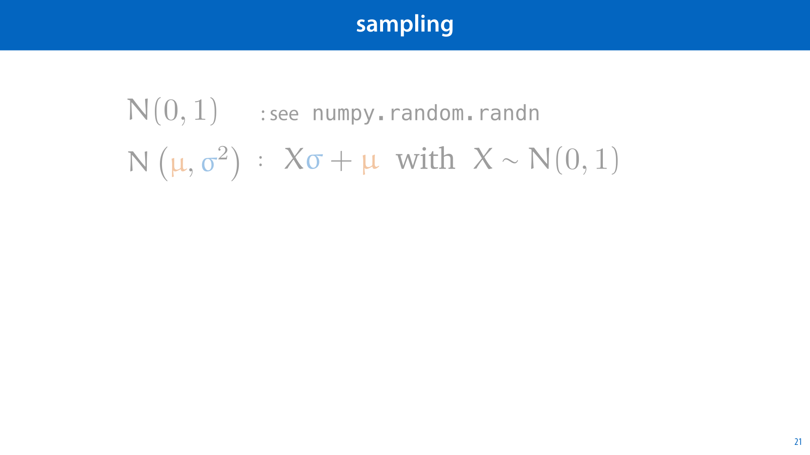

            <figcaption>
            
One benefit of the transformation approach we used, is that it’s now very easy to work out how to <strong>sample from an MVN</strong>. We can take the following approach.  

We’ll take sampling form a univariate standard normal as given, and assume that we have some function that will do this for us. 
<aside    >This is usually done by an algorithm called the Box-Muller transform, if you’re interested. </aside>
We can transform a sample from the standard normal distribution into a sample from a distribution with given mean and variance as shown above. 

We can then sample from the d-dimensional standard MVN by stacking d samples from the univariate normal in a vector. 

We can then transform this to a sample from an MVN with any given mean and covariance matrix by finding A and transforming as appropriate.

            </figcaption>
            click image for animation
       </section>

       <section id="slide-022">
            <a class="slide-link" href="https://mlvu.github.io/em#slide-022" title="Link to this slide.">link here</a>
            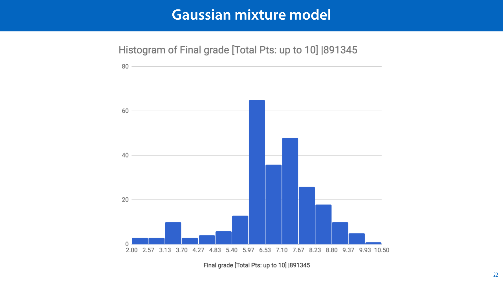

            <figcaption>
            
Finally, we'll take a look at what happens when a single Gaussian isn't enough. 

Here is the grade distribution for this course from a few years ago. It doesn’t look very normally distributed (unless you squint a lot). The main reason it doesn't look normally distributed, is because it has multiple peaks, known as <strong>modes</strong>. This often happens when your population consists of a small number of clusters, each with their own (normal) distribution. This data seems to have a multi-modal distribution: one with multiple separate peaks. 

In this year, the student population was mainly made up of two programs. We can imagine that students from one program found the course more more difficult than students from the other program giving us the two peaks above 5.5, and that the peak around 3.5 was that of students who only partially finished the course. This gives us three sub-populations, each with their own normal distribution.  

The problem is, we observe only the grades, and we can’t tell which population a student is in.Even in the high-scoring group we should expect <em>some</em> students to fail. 

We can describe this distribution with a <em>mixture</em> of several normal distributions. This is called a <strong>Gaussian mixture model</strong>. 
<aside    >These days the student population consists of many more programs and background, so the grade distribution looks more normal.</aside><aside    ></aside>
            </figcaption>
       </section>

       <section id="slide-023">
            <a class="slide-link" href="https://mlvu.github.io/em#slide-023" title="Link to this slide.">link here</a>
            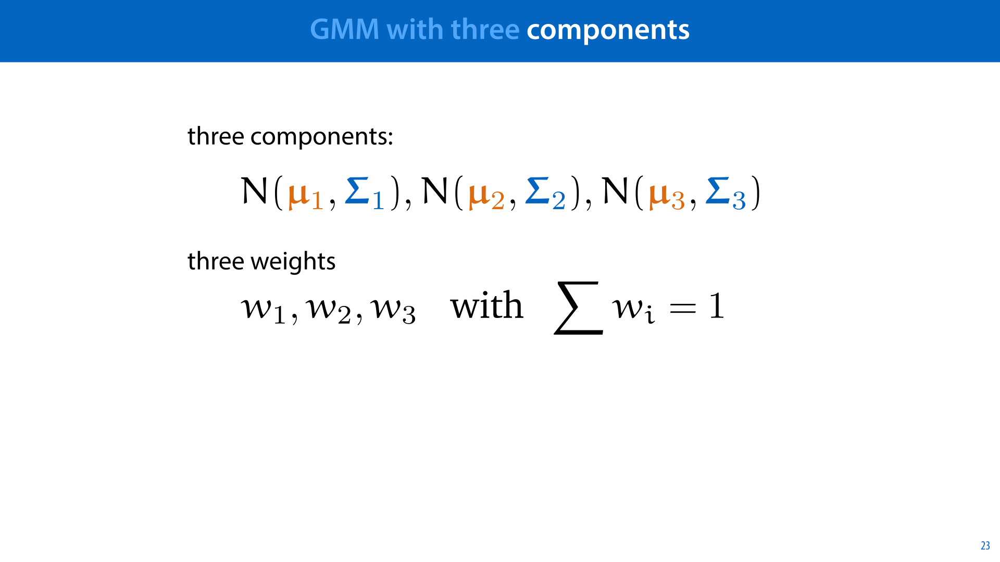

            <figcaption>
            
Here is how to define a mixture model. We define three separate normal distributions, each with their own parameters. We’ll call these<strong> components</strong>. 

In addition, we also define <strong>three weights</strong>, which we require to sum to one. These indicate the relative contributions of the components to the total. In our example, these would be the sizes of the three subpopulations of students, relative to the total. 

To sample from this distribution, we pick one of the components according to the weights, and then sample a point from that component. 

            </figcaption>
       </section>

       <section id="slide-024">
            <a class="slide-link" href="https://mlvu.github.io/em#slide-024" title="Link to this slide.">link here</a>
            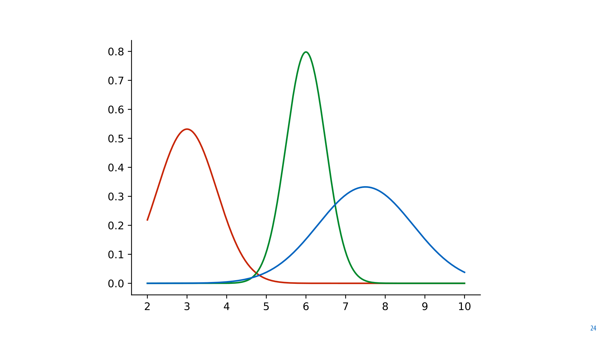

            <figcaption>
            
Here’s three components that might broadly correspond to what we saw in the grade histogram. 
<aside    >We'll see some examples in higher dimensionalities later.</aside><aside    ></aside>
            </figcaption>
       </section>

       <section id="slide-025" class="anim">
            <a class="slide-link" href="https://mlvu.github.io/em#slide-025" title="Link to this slide.">link here</a>
            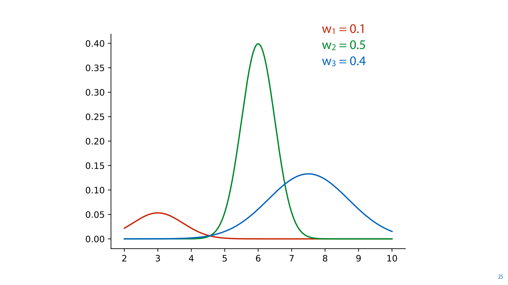

            <figcaption>
            
We scale each by their component weight. Since the areas under these curves each were 1 before we multiplied by the weights, they are now 0.1, 0.5 and 0.4 respectively.  

That means that if we sum these functions, the result is a combined function with an area under the curve of exactly 1: a new probability density with mulitple peaks.

            </figcaption>
            click image for animation
       </section>

       <section id="slide-026">
            <a class="slide-link" href="https://mlvu.github.io/em#slide-026" title="Link to this slide.">link here</a>
            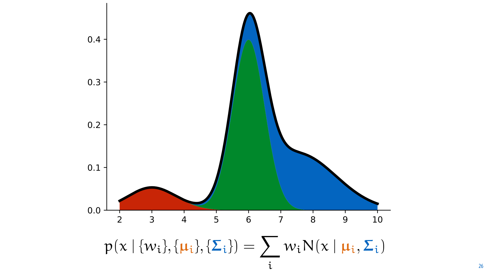

            <figcaption>
            
That looks like this. For each x we observe, each component could be responsible for producing that x, but the different components have different probabilities of being <strong>responsible </strong>for each x. 

            </figcaption>
       </section>

        <section class="video" id="video-026">
            <a class="slide-link" href="https://mlvu.github.io/em#video-26">link here</a>
           <video controls>
                <source src="https://pbm.thegood.cloud/s/DW8fZRHx8wJTi82/download/MLVU%208.2_%20Maximum%20likelihood%20estimators.mp4" type="video/mp4" />

                Download the <a href="https://pbm.thegood.cloud/s/DW8fZRHx8wJTi82/download/MLVU%208.2_%20Maximum%20likelihood%20estimators.mp4">video</a>.
           </video>
        </section>

       <section id="slide-027">
            <a class="slide-link" href="https://mlvu.github.io/em#slide-027" title="Link to this slide.">link here</a>
            

            <figcaption>
            
Now that we have a better understanding of why the normal distribution looks the way it does, let’s have another look at fitting one to our data. 

For all the examples in this video, we will use the principle of <strong>maximum likelihood</strong>. We will aim to find the parameters (mean and variance) for which the probability of the observed data is maximal. 
<aside    >This lecture is a little heavy in algebraic derivations, and a little light in intuition and examples. This is unavoidable. You should have the intuition for what a maximum likelihood estimator is already, and the rest is really nothing more but calculus and algebra. If you have trouble making it through this one, go back to the lecture on <a href="https://mlvu.github.io/lecture04/"><strong>probabilistic models</strong></a> and make sure you understand what maximum likelihood estimation is. Then, try to pick one of the derivations, and go through it slowly, step by step. </aside>
 

            </figcaption>
       </section>

       <section id="slide-028">
            <a class="slide-link" href="https://mlvu.github.io/em#slide-028" title="Link to this slide.">link here</a>
            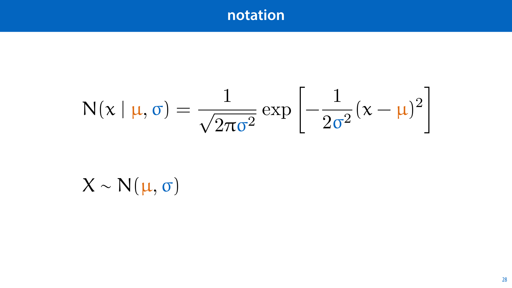

            <figcaption>
            

            </figcaption>
       </section>

       <section id="slide-029" class="anim">
            <a class="slide-link" href="https://mlvu.github.io/em#slide-029" title="Link to this slide.">link here</a>
            

            <figcaption>
            
The goal of maximum likelihood is to find the optimal way to fit a distribution to the data 

Before geting technical, we review the notion of the maximum likelihood estimation by an example on estimating the average height of  a population.  

For doing so, we accumulate the height of some people from the population (orange circles), and the goal is to identify a normal distribution that best represents such data. 

So, first thing we need to do is to identify where this distribution should be centred.  

 

            </figcaption>
            click image for animation
       </section>

       <section id="slide-030">
            <a class="slide-link" href="https://mlvu.github.io/em#slide-030" title="Link to this slide.">link here</a>
            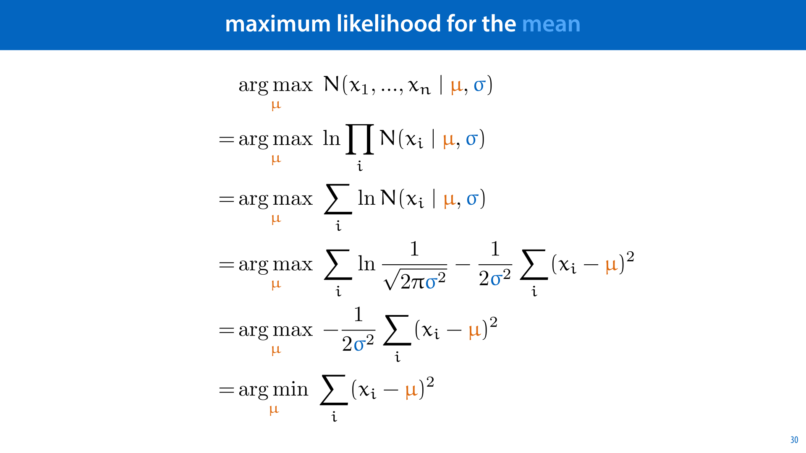

            <figcaption>
            
For the sake of completeness, let’s work out the maximum likelihood estimator for the variance/standard deviation

            </figcaption>
       </section>

       <section id="slide-031">
            <a class="slide-link" href="https://mlvu.github.io/em#slide-031" title="Link to this slide.">link here</a>
            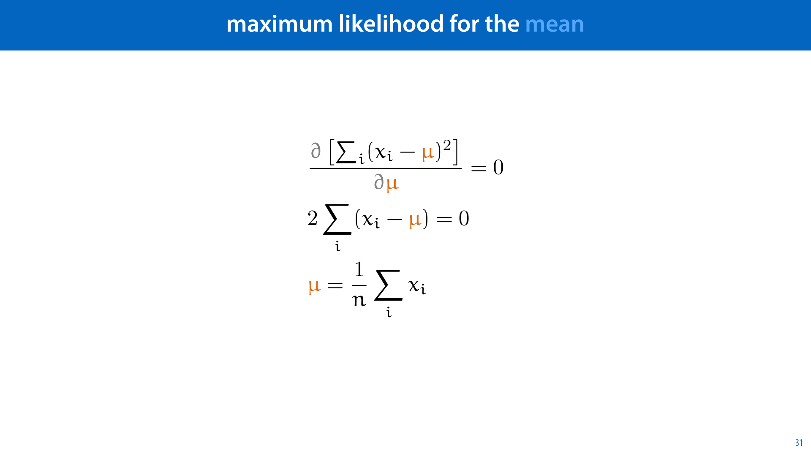

            <figcaption>
            
For the sake of completeness, let’s work out the maximum likelihood estimator for the variance/standard deviation

            </figcaption>
       </section>

       <section id="slide-032">
            <a class="slide-link" href="https://mlvu.github.io/em#slide-032" title="Link to this slide.">link here</a>
            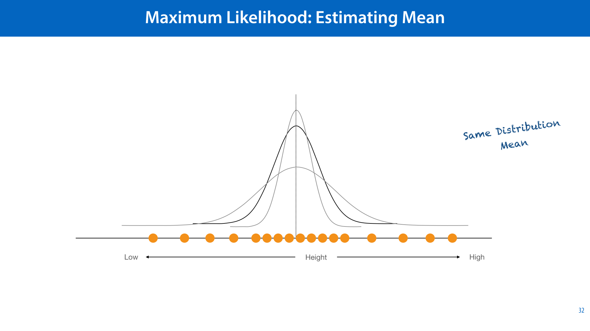

            <figcaption>
            

            </figcaption>
       </section>

       <section id="slide-033">
            <a class="slide-link" href="https://mlvu.github.io/em#slide-033" title="Link to this slide.">link here</a>
            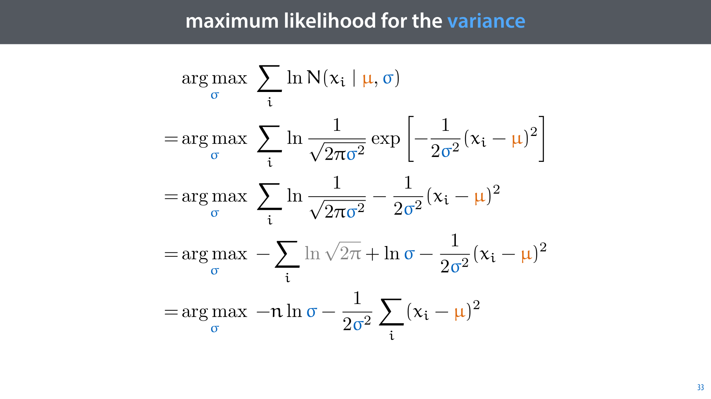

            <figcaption>
            
For the sake of completeness, let’s work out the maximum likelihood estimator for the variance/standard deviation 
<aside    >Slides with gray headers are included for completeness. You may consider these parts optional material.</aside><aside    ></aside>
            </figcaption>
       </section>

       <section id="slide-034" class="anim">
            <a class="slide-link" href="https://mlvu.github.io/em#slide-034" title="Link to this slide.">link here</a>
            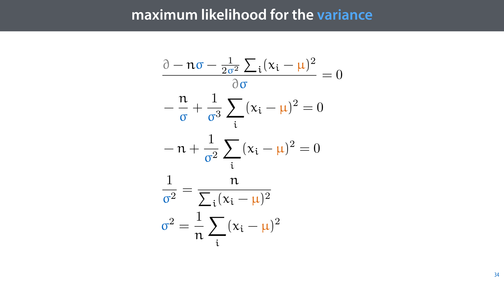

            <figcaption>
            
This is the maximum likelihood estimator for the variance. Taking the square on both sides gives us the estimator for the standard deviation. 

Note that it turns out that this estimator is biased: if we repeatedly sammple a dataset and compute the variance, our average error in the estimate doesn’t go to zero.  

For an unbiased estimator, we need to divide by n-1 instead. For large data, the difference has minimal impact.

            </figcaption>
            click image for animation
       </section>

       <section id="slide-035">
            <a class="slide-link" href="https://mlvu.github.io/em#slide-035" title="Link to this slide.">link here</a>
            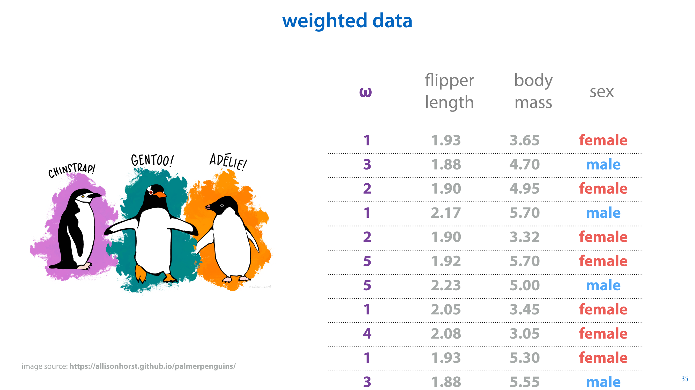

            <figcaption>
            
Sometimes we have a <strong>weighted</strong> dataset. For instance, we might trust some measurements more than others, and so downweight the ones we distrust in order to get a more appropriate model.  

For instance, in this example, we could imagine that some penguins struggled more than other as we were trying to measure them, and so we estimate how accurate we think the measurement is with a grade between 0 and 5. 

Normally, there is no upper bound to the weights, but we will usually assume that the weights are always positive and that they are<strong> proportional</strong>. That is, an instance with a weight of 5 counts five times as heavily as an instance with a weight of 1. The weights do not need to be integers. 
<aside    >We’ll see dataset weights crop up later in this lecture, and also in future lectures. </aside><aside    ></aside>
            </figcaption>
       </section>

       <section id="slide-036" class="anim">
            <a class="slide-link" href="https://mlvu.github.io/em#slide-036" title="Link to this slide.">link here</a>
            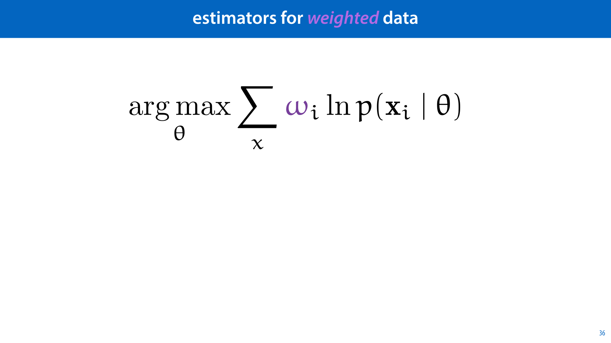

            <figcaption>
            
For weighted datasets, we can easily define a weighted maximum likelihood objective. We minimize the log likelihood as before, but we assign each term (that is, the log probability of each instance) a positive weight and maximize the weighted sum instead of the plain sum. 

For the normal distributions, the weighted maximum likelihood estimators are what you’d expect: the same as for the unweighted case, except the sum becomes a weighted sum, and we divide by the sum of the weights, instead of by n. 

If we set all the weights to 1 (or to any other positive constant), we recover the orginal maximum likelihood estimators. 
<aside    >Note that if the weights are all positive integers, we can see that these estimators correspond to simply repeating each instance according to its weight. That is, we can make an unweighted dataset where an instance with weight 3 occurs 3 times. The estimators for the unweighted data coincide exactly with these estimators for the weighted data.</aside><aside    ></aside>
            </figcaption>
            click image for animation
       </section>

       <section id="slide-037">
            <a class="slide-link" href="https://mlvu.github.io/em#slide-037" title="Link to this slide.">link here</a>
            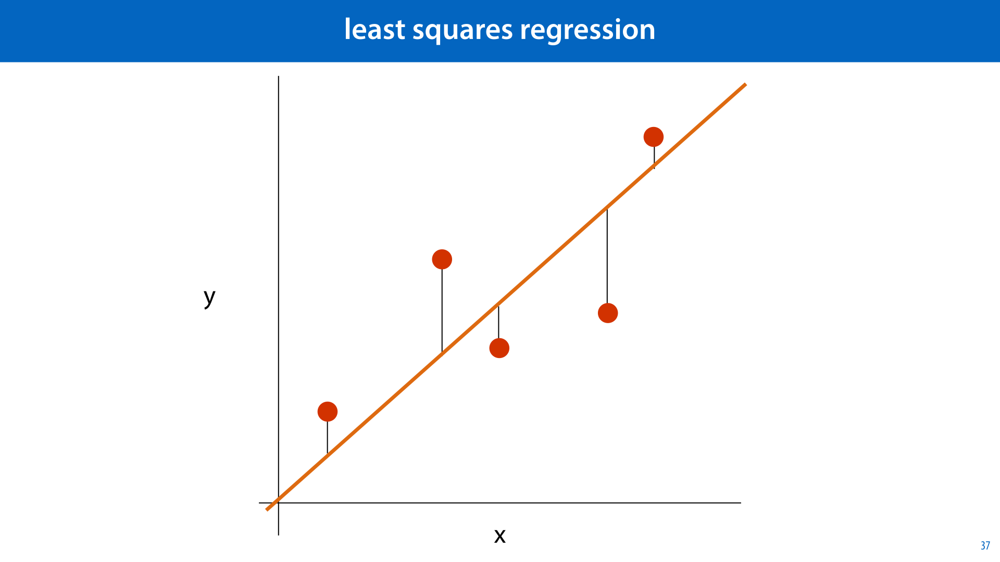

            <figcaption>
            
We first encountered the<strong> principle of least squares</strong>, not in the context of descriptive statistics like the mean and the standard deviation, but in the context of <strong>regression</strong>. 

Since we've now seen the close relationship between the squared error and the normal distribution, you may ask whether this means that there is a normal distribution hiding somewhere in our model when we fit a line using the least squares objective.

            </figcaption>
       </section>

       <section id="slide-038" class="anim">
            <a class="slide-link" href="https://mlvu.github.io/em#slide-038" title="Link to this slide.">link here</a>
            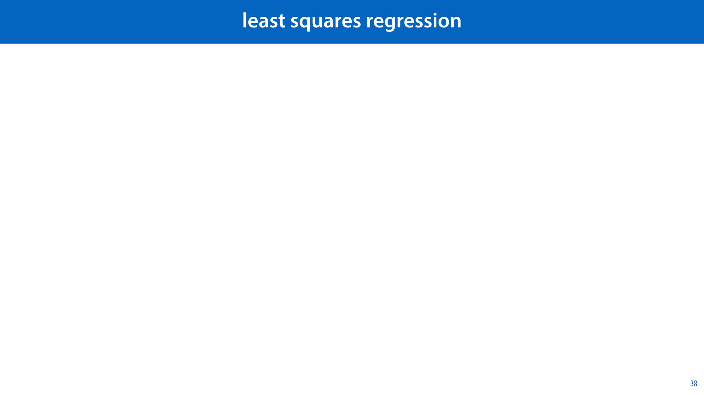

            <figcaption>
            
We first encountered the<strong> principle of least squares</strong>, not in the context of descriptive statistics like the mean and the standard deviation, but in the context of <strong>regression</strong>. 

Since we've now seen the close relationship between the squared error and the normal distribution, you may ask whether this means that there is a normal distribution hiding somewhere in our model when we fit a line using the least squares objective.

            </figcaption>
            click image for animation
       </section>

       <section id="slide-039" class="anim">
            <a class="slide-link" href="https://mlvu.github.io/em#slide-039" title="Link to this slide.">link here</a>
            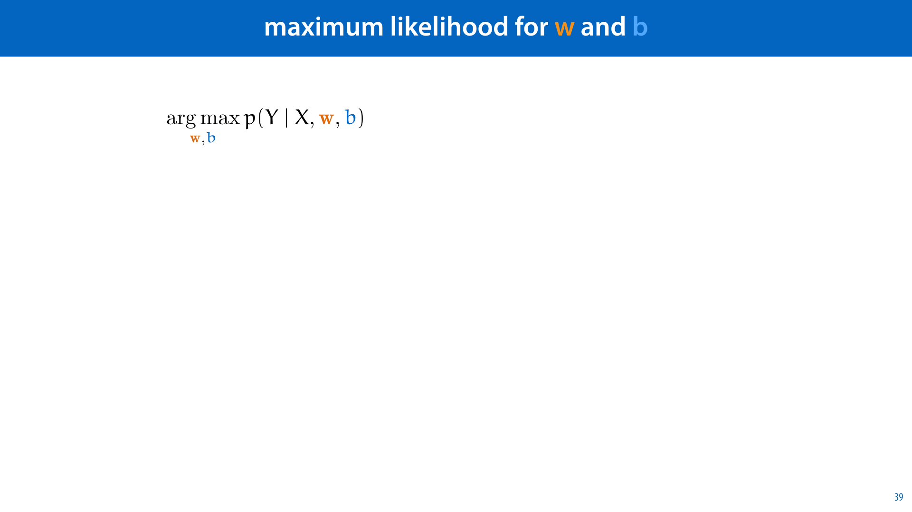

            <figcaption>
            
As we can see here, all elements from the normal distribution disappear except the square difference between the predicted output and the actual output, and the objective reduces to least squares. 

            </figcaption>
            click image for animation
       </section>

       <section id="slide-040" class="anim">
            <a class="slide-link" href="https://mlvu.github.io/em#slide-040" title="Link to this slide.">link here</a>
            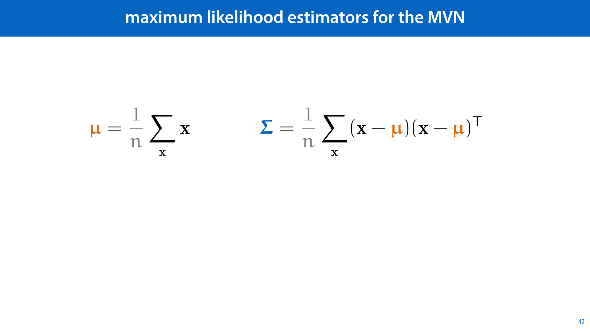

            <figcaption>
            
For the multivariate normal distribution, these are the maximum likelihood estimators. 

The same things we said for the univariate case hold here. The estimator for the covariance requires a correction if you need unbiased estimates. 

For weighted data, the sum again becomes a weighted sum, and the normalization is by the sum of the weights.

            </figcaption>
            click image for animation
       </section>

       <section id="slide-041">
            <a class="slide-link" href="https://mlvu.github.io/em#slide-041" title="Link to this slide.">link here</a>
            

            <figcaption>
            
Finally, let’s look at the last of our modelsfrom the previous video: the Gaussian mixture model. What happens when we try to define the maximum likelhood objective for this model?

            </figcaption>
       </section>

       <section id="slide-042">
            <a class="slide-link" href="https://mlvu.github.io/em#slide-042" title="Link to this slide.">link here</a>
            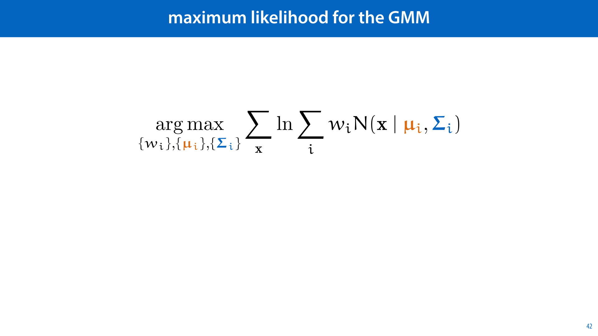

            <figcaption>
            
Here we face a problem: there’s a sum inside a logarithm. We can’t work the sum out of the logarithm, which means we won’t get a nice formulation of the derivative. We can do it anyway, and solve by gradient descent, we can even use backpropagation, so we only have to work out local derivatives, but what we’ll never get,is a functional form for the derivative that we can set equal to zero and solve analytically. 

After the break we’ll discuss the <strong>EM algorithm</strong>, which does’t give us an analytical solution, but it does allow us to use the tricks we’ve seen in this video, to help us fit a model. 

            </figcaption>
       </section>

        <section class="video" id="video-042">
            <a class="slide-link" href="https://mlvu.github.io/em#video-42">link here</a>
           <video controls>
                <source src="https://pbm.thegood.cloud/s/mTfcZ8XLj8G3qie/download/MLVU%208.3_%20Expectation-maximization.mp4" type="video/mp4" />

                Download the <a href="https://pbm.thegood.cloud/s/mTfcZ8XLj8G3qie/download/MLVU%208.3_%20Expectation-maximization.mp4">video</a>.
           </video>
        </section>

       <section id="slide-043">
            <a class="slide-link" href="https://mlvu.github.io/em#slide-043" title="Link to this slide.">link here</a>
            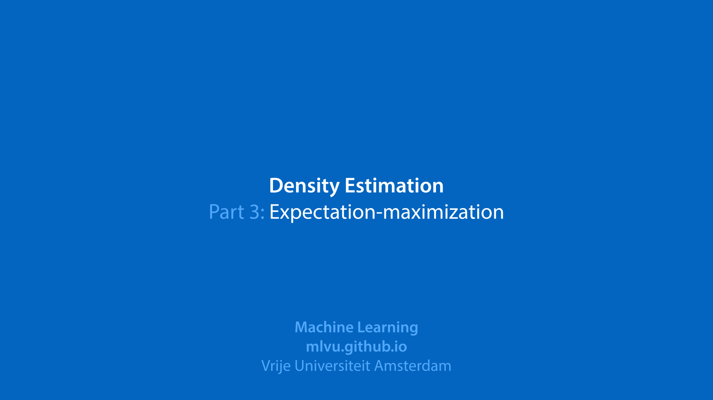

            <figcaption>
            
 

            </figcaption>
       </section>

       <section id="slide-044">
            <a class="slide-link" href="https://mlvu.github.io/em#slide-044" title="Link to this slide.">link here</a>
            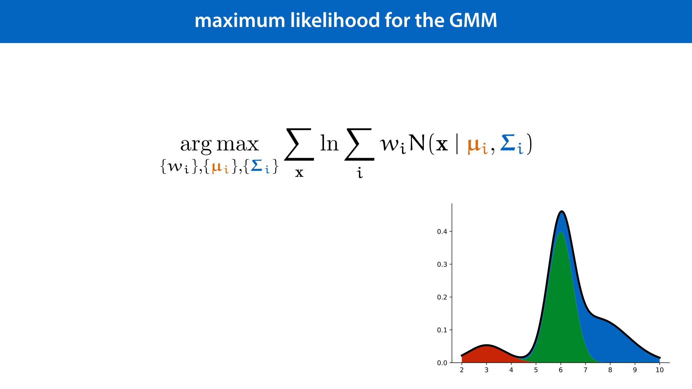

            <figcaption>
            
This is the problem that we'll deal with in this video and the next. How do we find the maximum likelihood fit for the Gaussian mixture model? The solution that we've been using so far: take the derivative and set it equal to zero, no longer works here. We can take the derivative of this function, but the result is quite complex, and setting it equal to zero doesn't give us a neat solution for the parameters.  
<aside    >We can still solve the problem using gradient descent with the complicated derivatives, or using backpropagation, but in this video, we will investigate a different approach.</aside><aside    ></aside>
            </figcaption>
       </section>

       <section id="slide-045">
            <a class="slide-link" href="https://mlvu.github.io/em#slide-045" title="Link to this slide.">link here</a>
            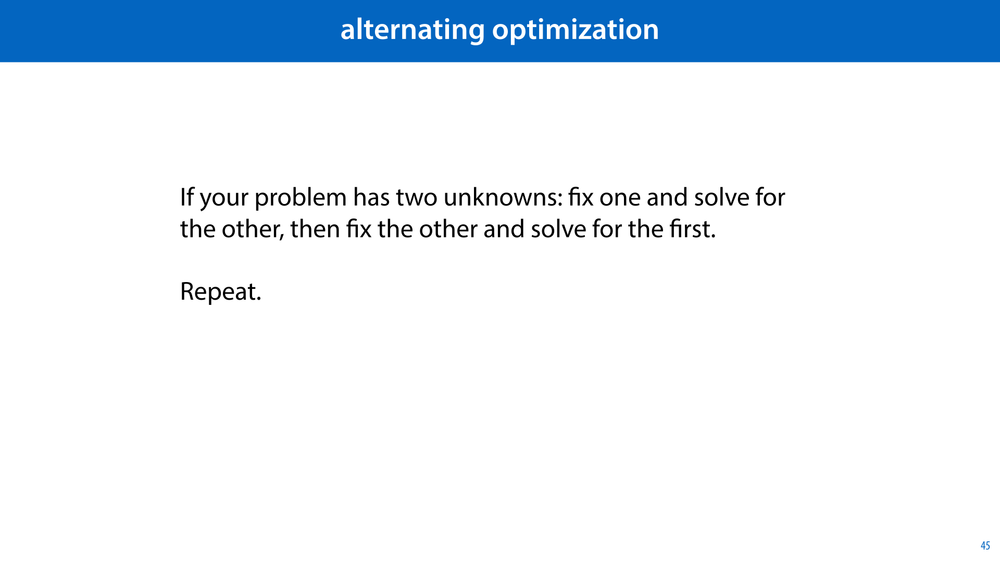

            <figcaption>
            
The EM algorithm, which we'll develop in this part, is an instance of alternating optimization. If you have a problem with two unknowns, and you could easily solve the problem is one of your unknowns were known: then just guess a value for one of them and solve for the other. Then, take your solution for the other and solve for the first. Keep repeating this, and with a bit of luck, you will converge to a good solution.

            </figcaption>
       </section>

       <section id="slide-046">
            <a class="slide-link" href="https://mlvu.github.io/em#slide-046" title="Link to this slide.">link here</a>
            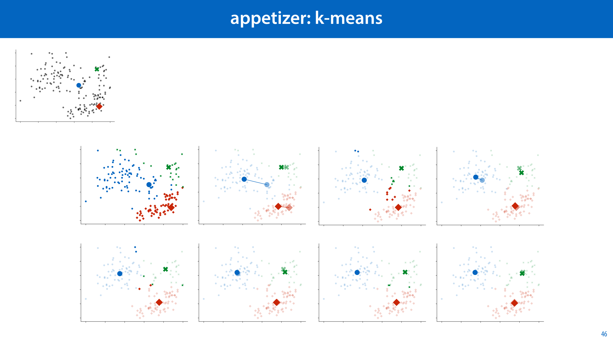

            <figcaption>
            
We’ve seen one example of alternating optimization already, in the first lecture: <strong>the k-Means algorithm</strong>. Here, the two unknowns are where the centers of our clusters are, and which cluster each point belongs to. If we knew which cluster each point belonged to, it would be easy to work out the centers of each cluster. If we knew the cluster centers, it would be easy to work out which cluster each point belongs to.  

Since we know neither, we set one of them (the cluster centers) to an arbitrary value, and then assign the points to the obvious clusters. Then we fix the cluster memberships and recompute the cluster centers. If we repeat this process, we end up converging to a good solution. 

 

            </figcaption>
       </section>

       <section id="slide-047">
            <a class="slide-link" href="https://mlvu.github.io/em#slide-047" title="Link to this slide.">link here</a>
            

            <figcaption>
            
Let's try to develop some intuition for why the k-means algorithm works. This will help us in working up to the more complex case of the EM algorithm. 

We will imagine the following model for our data. Imagine that the data was produced by the means<strong> emitting</strong> the data points. Each mean spits out a number of instances, like a sprinkler, and that is how the data we observed came to be.  
<aside    >This is a standard modelling approach: make a number of assumptions about how your data was produced, and then try to fit your model under those assumptions. The assumptions may be incorrect, but it's as good a place to start as any. </aside>
We won't make any further assumptions about how the means spit out the data points except that they are more likely spit out points nearby than far away.

            </figcaption>
       </section>

       <section id="slide-048" class="anim">
            <a class="slide-link" href="https://mlvu.github.io/em#slide-048" title="Link to this slide.">link here</a>
            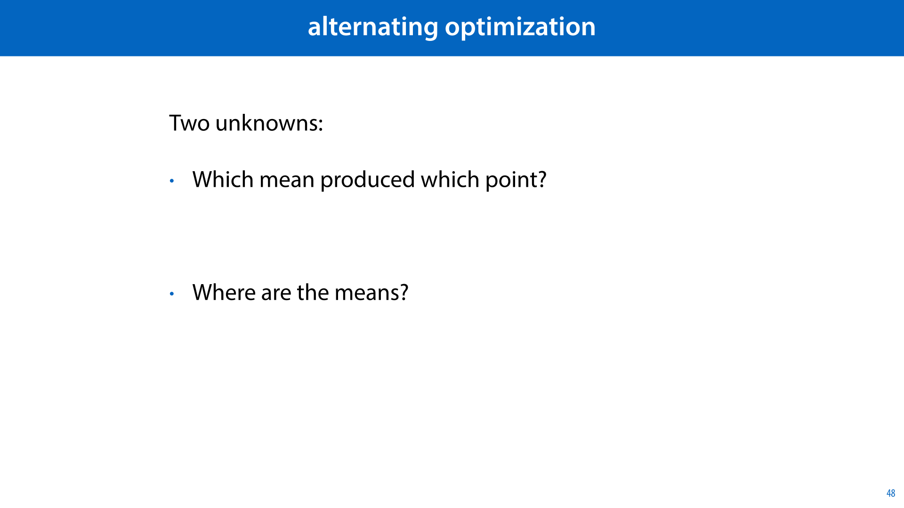

            <figcaption>
            
Under this model, we can make precise what the two unknowns of our problem are.  

First, we don't know which mean produced which point. Second, we don't know the location of the means. 

Each of these questions would be easy to answer (or at least guess) if we knew the answer to the other question. If we know the location of the means, it's pretty straightforward to guess which mean produced which point. The further the point is from the mean, the less likely it is to have been produced by that mean. So if we had to guess, we'd pick the mean that the point is closest to. 

If we know which mean produced every point, we could also make a pretty good guess for where the means should be: the bigger the distance between the points and their means, the less likely the situation becomes. The most likely situation is the one where the distance between the mean and all the points it produced is minimized. In other words, we place each mean at the average of all the points. 
<aside    >We've seen already that the mean minimizes the square of the total distances. We could also minimize the absolute distances: this is called the k-medians algorithm. </aside>
Applying the logic of alternating optimization to this problem given us the k means algorithm. We start with some random means and assign each point the most likely mean. Then we remove the means and recompute them, and repeat the procedure. 
<aside    >This still doesn't tell us why the iteration as a whole should work, but it hopefully shows that each individual step makes our solution better. It doesn't take a leap of faith to accept that a sequence of small good steps will often makes for a good walk. Later, we will build on this intuition to show more precisely what we can expect this algorithm to return.</aside><aside    ></aside>
            </figcaption>
            click image for animation
       </section>

       <section id="slide-049">
            <a class="slide-link" href="https://mlvu.github.io/em#slide-049" title="Link to this slide.">link here</a>
            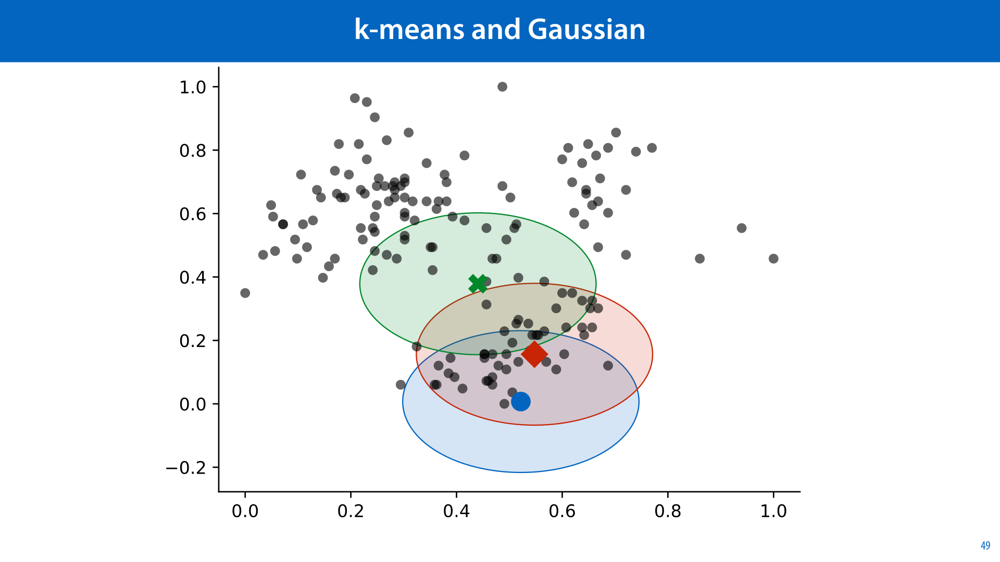

            <figcaption>
            
All we need to do to translate this into the problem of fitting a gaussian mixture model is to be slightly more precise about how each "mean", or component, produces the points. Instead of imagining a sprinkler producing the points, we assume that the points we produced by a<strong> multivariate normal distribution</strong>. That is, each component gets a mean <em>and a covariance matrix</em>. 

We also assign each component a weight. The higher the weight, the more likely the component is to produce a point. 

            </figcaption>
       </section>

       <section id="slide-050">
            <a class="slide-link" href="https://mlvu.github.io/em#slide-050" title="Link to this slide.">link here</a>
            

            <figcaption>
            
Toghether, these components with their weights make a Gaussian mixture model: the sum of k weighted Gaussians.

            </figcaption>
       </section>

       <section id="slide-051" class="anim">
            <a class="slide-link" href="https://mlvu.github.io/em#slide-051" title="Link to this slide.">link here</a>
            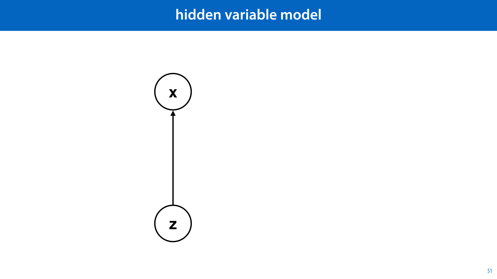

            <figcaption>
            
Here again, we have an unknown: we've assumed that the data is produced from k normal distributions, but we don't know which distribution produced which component.  

In statistics we often call this a<em> </em><strong>hidden variable model</strong>: the data is produced by picking a component, and then sampling a point from the component, but we don't see which component was used.  

We’ll indicate which component we’ve picked by a variable z. This is a discrete variable, which for a three-component model can take the values 1, 2 or 3. 

The problem is that when we see the data, we don’t know z. All we see is the sampled data, but not which component it came from. For this reason we call z a <strong>hidden variable</strong>. 

            </figcaption>
            click image for animation
       </section>

       <section id="slide-052">
            <a class="slide-link" href="https://mlvu.github.io/em#slide-052" title="Link to this slide.">link here</a>
            

            <figcaption>
            
Normally when we have a distribution over two random variables, and we want a distribution over one, we just marginalize one of them out: we sum the joint probability over all values of the variable we want to get rid of. We are left with the marginal distribution over the variable we're interested in (x). Can we do that here? 

The answer is yes in theory, but no in practice. The hidden variable z assigns one component <strong>to each instance in our data</strong>. The number of such assignments blows up exponentially. Even with just two components and a tiny dataset of 30 instances, this would already require a sum with billions of terms.

            </figcaption>
       </section>

       <section id="slide-053">
            <a class="slide-link" href="https://mlvu.github.io/em#slide-053" title="Link to this slide.">link here</a>
            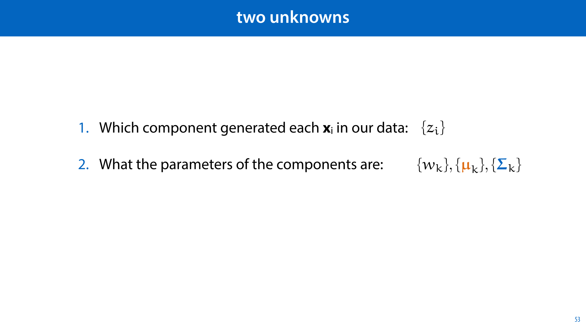

            <figcaption>
            
Instead, we’ll apply the philosophy of alternating optimization. First we state our two unknowns. 

Clearly, if we knew which component generated each point, we could easily estimate the parameters. Just partition the data by component, and use the maximum likelihood estimators on each component.  
<aside    >We don't know what the maximum likelihood estimators are for the component weights in this situation, but we'll see later that they have a very intuitive solution. </aside>
The other way around seems reasonable as well. Given the components, and their relative weight, it shouldn’t be too tricky to work out how likely each component is to be responsible for any given instance.

            </figcaption>
       </section>

       <section id="slide-054">
            <a class="slide-link" href="https://mlvu.github.io/em#slide-054" title="Link to this slide.">link here</a>
            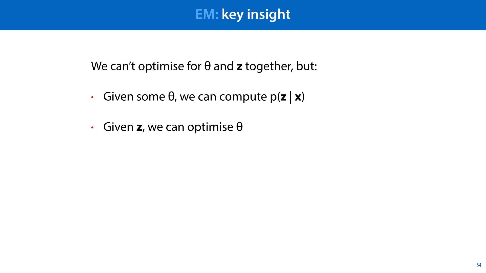

            <figcaption>
            
So, if we call the collection of all parameters of the model θ, then this is the key insight to the EM algorithm.

            </figcaption>
       </section>

       <section id="slide-055">
            <a class="slide-link" href="https://mlvu.github.io/em#slide-055" title="Link to this slide.">link here</a>
            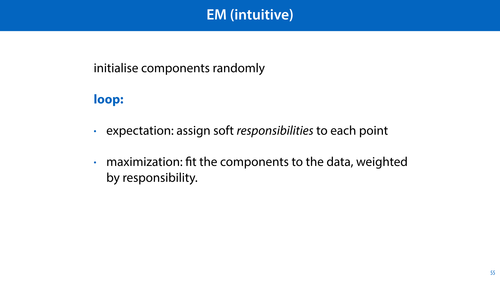

            <figcaption>
            
Here is the informal statement of the EM algorithm. The two steps are called expectation and maximization, which is where algorithm gets its name. 

In the k-means algorithm, we assigned the single most likely component to each point. Here, we are a little bit more gentle: we let each component take partial "responsibility" for each point. We never pick one component exclusively, we just say that the higher the probability density is under a component, the more likely it is that that component generated the point. But, all components always retain some probability. 

From a Bayesian perspective, you can say that we are computing a probability distribution for each point, over the three components, indicating the probability that the component produced the point. To appease the frequentists, we call this a <strong>responsibility</strong> rather than a probability. 

            </figcaption>
       </section>

       <section id="slide-056" class="anim">
            <a class="slide-link" href="https://mlvu.github.io/em#slide-056" title="Link to this slide.">link here</a>
            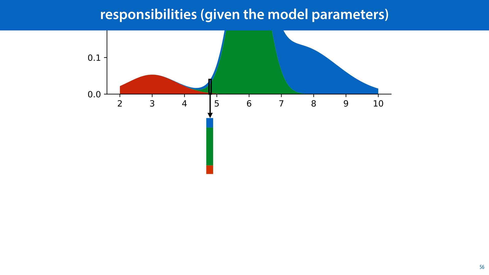

            <figcaption>
            
Here is how we define the<strong> responsibility</strong> taken for some point x by a particular component when the parameters of the components are given. We simply look at the three weighted densities for point x. The sum of these defines the total density for x under the GMM. The proportion of this sum that component 2 claims, is the responsibility that we assign to component 2 for producing x. 

If you allow subjective probability, this is just Bayes’ rule in action, the probability of component 2 being responsible given that we’ve observed x. If you want a purely frequentist interpretation of the EM algorithm, you have to be strict in calling these responsibilities and not probabilities. We cannot express a probability over which component generated x, since it is a hidden true value, which is not subject to chance. 

For now, we’ll just take this as a pretty intuitive way to work out responsibility, and see what it gets us. In the next video, we’ll see a more rigorous derivation that even a frequentist can get behind. 

In this case, the green component takes most of the responsibility for point x.

            </figcaption>
            click image for animation
       </section>

       <section id="slide-057">
            <a class="slide-link" href="https://mlvu.github.io/em#slide-057" title="Link to this slide.">link here</a>
            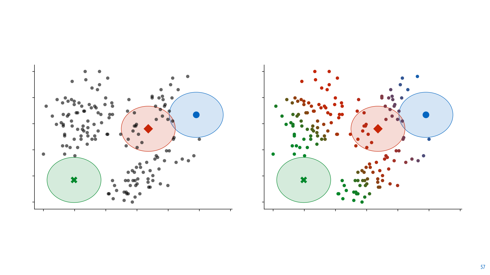

            <figcaption>
            
We can now take the first step in our EM algorithm. Here it is in two dimensions. We have some data and we will try to fit a two-component GMM to it. The number of components is a hyperparameter that we have to choose ourselves, based on intuition or basic hyperparameter optimization methods. 

We start with three arbitrary components. Given these components, we then assign responsibilities to each of our points. For points that are mostly blue, the blue component claims the most responsibility and for points that are mostly red, the red component claims the most responsibility, and so on. Note however, that in between the red and blue components, we find purple points. for these, the red and the blue components claim about equal responsibility. In between the green and blue components, we find teal components, where we divide the responsibility equally between the green and the blue component. 

 

            </figcaption>
       </section>

       <section id="slide-058">
            <a class="slide-link" href="https://mlvu.github.io/em#slide-058" title="Link to this slide.">link here</a>
            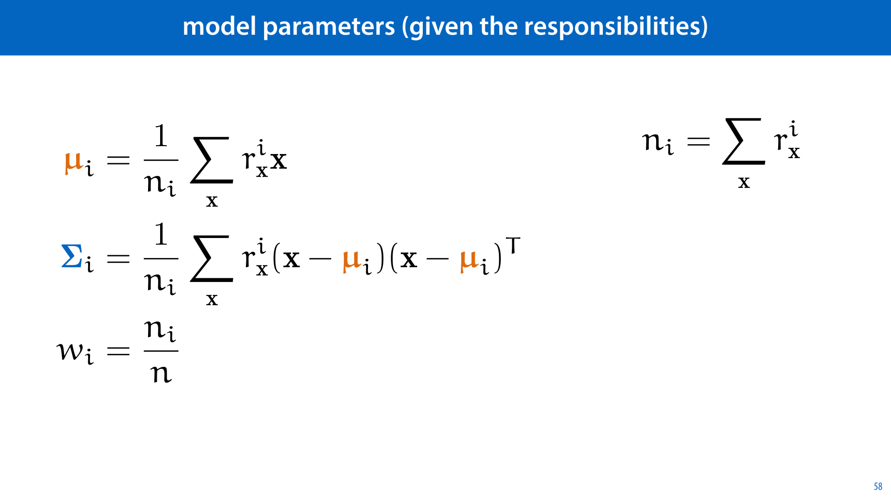

            <figcaption>
            
For each component i, we now discard the parameters mu and sigma, and<em> recompute</em> them to fit the subset of the data that the component has taken responsibility for.  

Since, unlike the k-means algorithm, we never strictly partition the data, every point belongs to each component<em> to some extent</em>. What we get is a weighted dataset, where the responsibility component i takes for each point becomes the weight of that point. Now we can simply use our weighted MLEs that we defined in the previous part. 

Our model isn’t just the parameters of the components, we also need to work out the component <em>weights</em>. For now, we’ll appeal to intuition, and say that it seems pretty logical to use the total amount of responsibility claimed by the component over the whole data. In the next video, we’ll be a bit more rigorous. 

With this, we have the two steps of our alternating optimization worked out: given components, we can assign responsibilities, and given responsibilities, we can fit components.

            </figcaption>
       </section>

       <section id="slide-059" class="anim">
            <a class="slide-link" href="https://mlvu.github.io/em#slide-059" title="Link to this slide.">link here</a>
            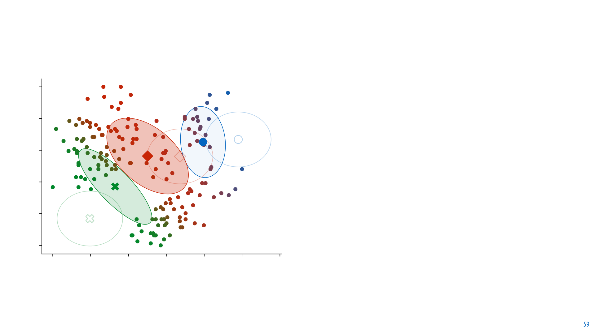

            <figcaption>
            
On the left, we see our new components, fitted to the weighted data. The blue mean is still the mean over the whole dataset (all points regardless of color), but the blue points pull on it with much greater force than the others. 

Next, we repeat the procedure: we <em>recompute</em> the responsibilities.  
<aside    >We use the alpha channel to indicate for which points the responsibilities have changes the most. </aside><aside    ></aside>
            </figcaption>
            click image for animation
       </section>

       <section id="slide-060" class="anim">
            <a class="slide-link" href="https://mlvu.github.io/em#slide-060" title="Link to this slide.">link here</a>
            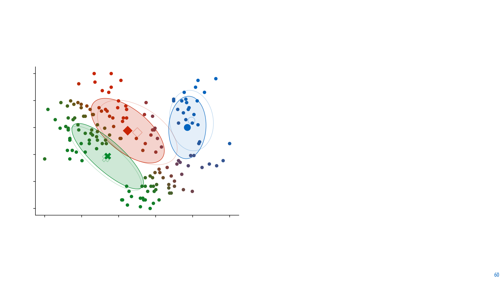

            <figcaption>
            

            </figcaption>
            click image for animation
       </section>

       <section id="slide-061" class="anim">
            <a class="slide-link" href="https://mlvu.github.io/em#slide-061" title="Link to this slide.">link here</a>
            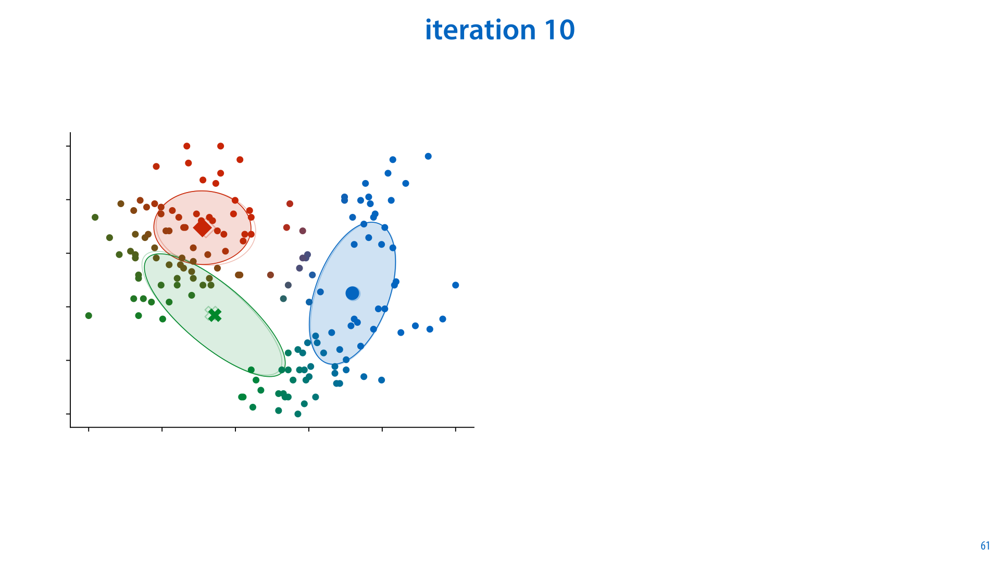

            <figcaption>
            
At iteration 10, we see the red component moving to the top left. As it does so, it leaves responsibility for the top right points to the blue component, and claiming more responsibility for the points on the left from the green component. This will push the green component towards the points at the bottom where it has the most responsibility. This in turn will claim responsibility from the blue component, pushing that up into its own cluster at the top right.

            </figcaption>
            click image for animation
       </section>

       <section id="slide-062" class="anim">
            <a class="slide-link" href="https://mlvu.github.io/em#slide-062" title="Link to this slide.">link here</a>
            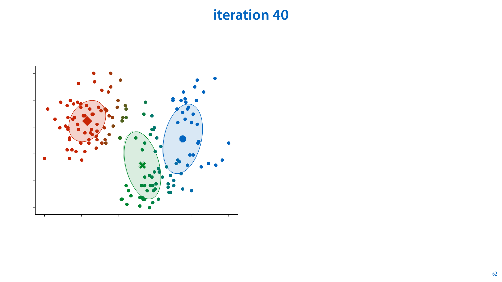

            <figcaption>
            
At 40 iterations, the green component has been pushed out of the red cluster.

            </figcaption>
            click image for animation
       </section>

       <section id="slide-063" class="anim">
            <a class="slide-link" href="https://mlvu.github.io/em#slide-063" title="Link to this slide.">link here</a>
            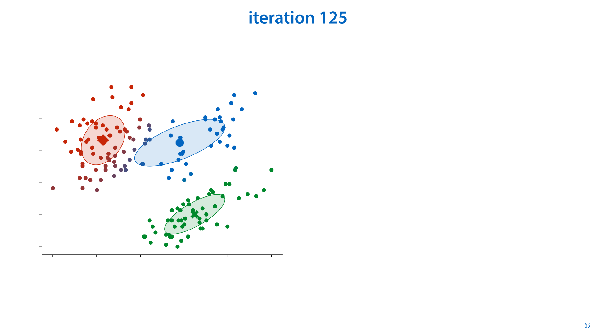

            <figcaption>
            
At 125 iterations, the changes have become microscopic and we decide the algorithm has converged. The components are remarkably close to the penguin species labels (which we had, but didn't show to the algorithm). 

Note that even though the algorithm has converged, there are plenty of points it's uncertain about. Between the red and blue components, there are many points that could be either an Adelie or a Chinstrap penguin.

            </figcaption>
            click image for animation
       </section>

       <section id="slide-064" class="anim">
            <a class="slide-link" href="https://mlvu.github.io/em#slide-064" title="Link to this slide.">link here</a>
            

            <figcaption>
            

            </figcaption>
            click image for animation
       </section>

       <section id="slide-065">
            <a class="slide-link" href="https://mlvu.github.io/em#slide-065" title="Link to this slide.">link here</a>
            

            <figcaption>
            
So, we can fit a Gaussian mixture model to a dataset. What does this buy us?

            </figcaption>
       </section>

       <section id="slide-066">
            <a class="slide-link" href="https://mlvu.github.io/em#slide-066" title="Link to this slide.">link here</a>
            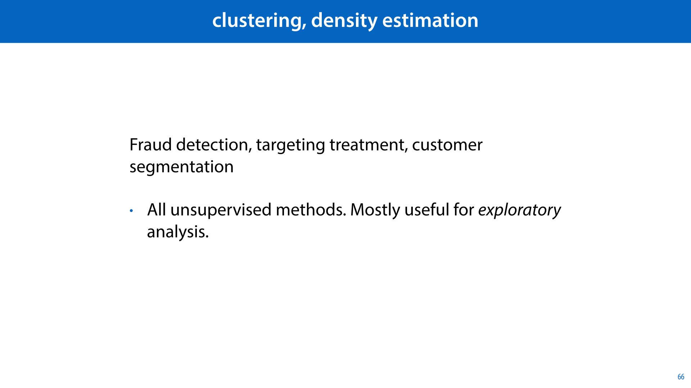

            <figcaption>
            
The first way we can use this model is as a clustering algorithm. It works the same as k-means, expect that we get cluster probabilities, instead of cluster assignments. 

If the model fits well, we can also use it for density estimation use cases: look at those points in low density regions. these are the outliers, which may be worth inspection, for instance if we have a dataset of financial transations, and we are trying to detect fraud.

            </figcaption>
       </section>

       <section id="slide-067">
            <a class="slide-link" href="https://mlvu.github.io/em#slide-067" title="Link to this slide.">link here</a>
            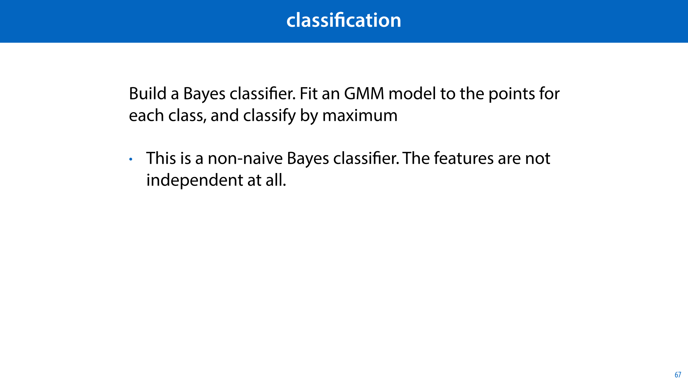

            <figcaption>
            
But, we can also take the mixture models and use them inside a Bayesian classfier: split the data by class, and fit a gaussian mixture model to each.

            </figcaption>
       </section>

       <section id="slide-068">
            <a class="slide-link" href="https://mlvu.github.io/em#slide-068" title="Link to this slide.">link here</a>
            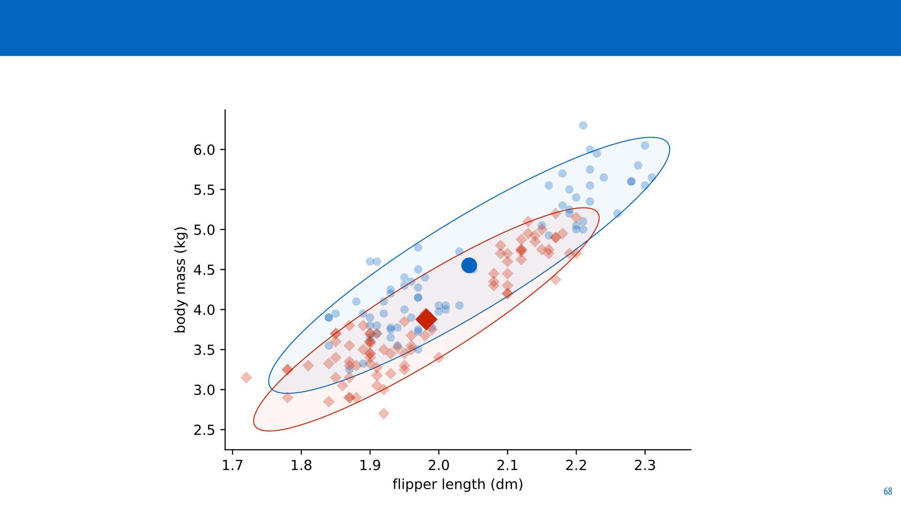

            <figcaption>
            
Here’s what a Bayesian classifier looks like with a single Gaussian per class in our sex-classification example for the penguins. Because the dataset contains multiple clusters, we can't get a clean separation this way.

            </figcaption>
       </section>

       <section id="slide-069">
            <a class="slide-link" href="https://mlvu.github.io/em#slide-069" title="Link to this slide.">link here</a>
            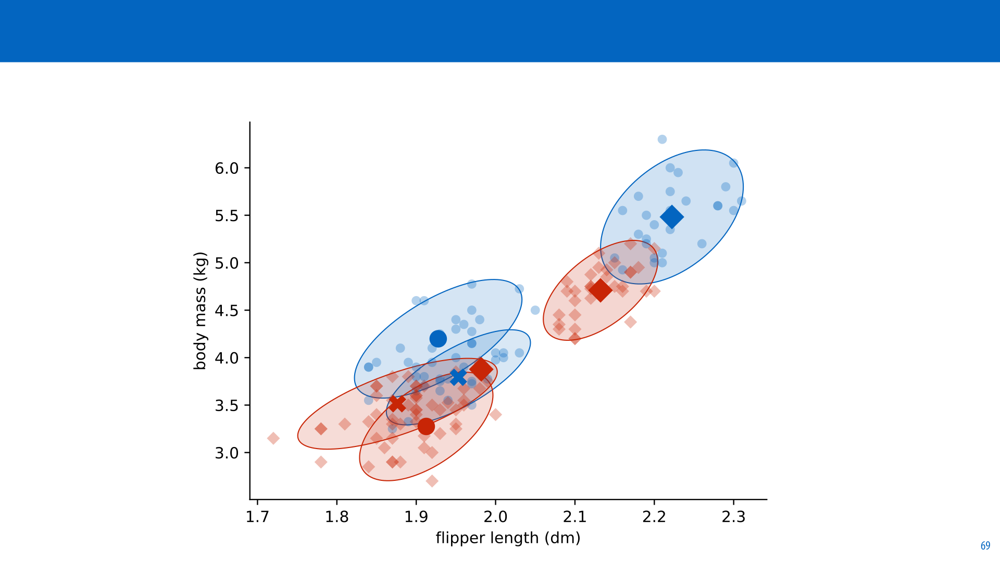

            <figcaption>
            
However, if we fit a Gaussian mixture model to each class, we can pick out the different clusters within each class and get a much better fit for the data.

            </figcaption>
       </section>

        <section class="video" id="video-069">
            <a class="slide-link" href="https://mlvu.github.io/em#video-69">link here</a>
           <video controls>
                <source src="https://pbm.thegood.cloud/s/wnr6xrJ3ZKRxYn3/download/MLVU%208.4_%20Expectation-maximization%20from%20first%20principles.mp4" type="video/mp4" />

                Download the <a href="https://pbm.thegood.cloud/s/wnr6xrJ3ZKRxYn3/download/MLVU%208.4_%20Expectation-maximization%20from%20first%20principles.mp4">video</a>.
           </video>
        </section>

       <section id="slide-070">
            <a class="slide-link" href="https://mlvu.github.io/em#slide-070" title="Link to this slide.">link here</a>
            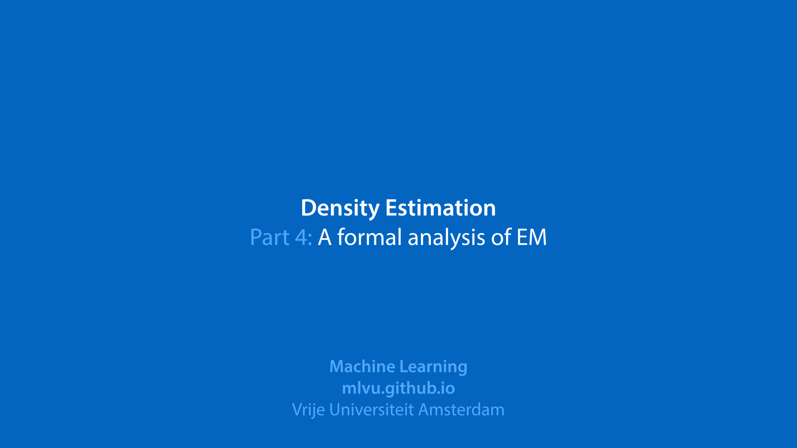

            <figcaption>
            
In the last video, we explained how EM works to fit a GMM model. We took a pretty informal approach, and appealed to intuition for most of the decisions we made. This is most helpful to get a comfortable understanding of the algorithm, but as it happens, we can derive all of these steps formally, as approximations to the maximum likelhood estimator fo the GMM model. 

 

            </figcaption>
       </section>

       <section id="slide-071">
            <a class="slide-link" href="https://mlvu.github.io/em#slide-071" title="Link to this slide.">link here</a>
            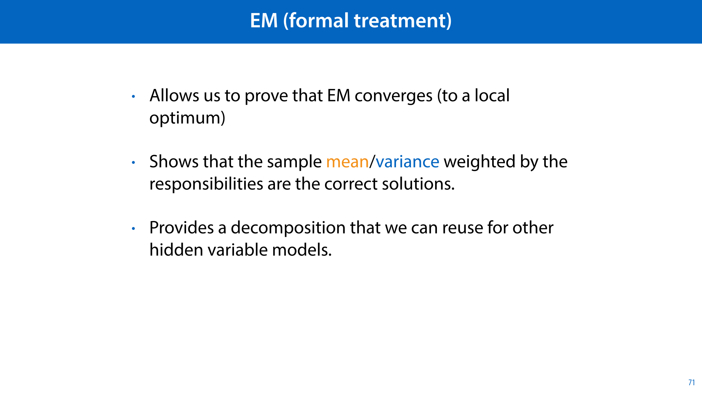

            <figcaption>
            
What do we get out of this, since we already have the EM algorithm and is seems to work pretty well? 

First, we can prove that EM converges to a local optimum. 

 Second, we can derive the responsibilities and weighted mean and variance as the correct solutions. In the last video, if  we had come up with five other ways of doing it that also seem pretty intuitive, we would have to implement and test all of them to see which worked best. With a little more theory we can save ourselves the experimentation. This is a good principle to remember: the better your grasp of theory, the smaller your search space. 

And finally, the decomposition we will use here will help us in other settings as well, starting next week we we apply the principle to deep neural networks.

            </figcaption>
       </section>

       <section id="slide-072">
            <a class="slide-link" href="https://mlvu.github.io/em#slide-072" title="Link to this slide.">link here</a>
            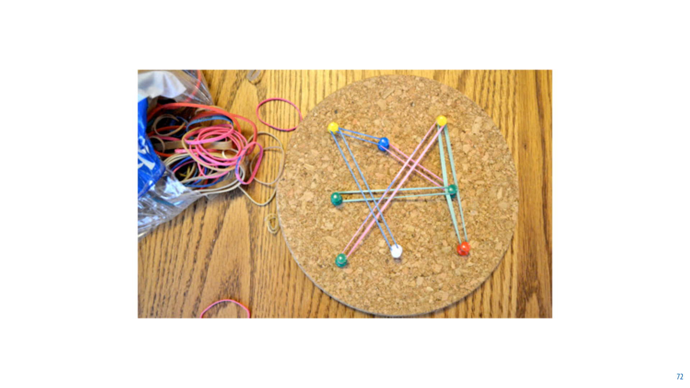

            <figcaption>
            
image source: <a href="http://www.ahappysong.com/2013/10/push-pin-geo-art.html"><strong>http://www.ahappysong.com/2013/10/push-pin-geo-art.html</strong></a>

<a href="http://www.ahappysong.com/2013/10/push-pin-geo-art.html"><strong></strong></a>

            </figcaption>
       </section>

       <section id="slide-073">
            <a class="slide-link" href="https://mlvu.github.io/em#slide-073" title="Link to this slide.">link here</a>
            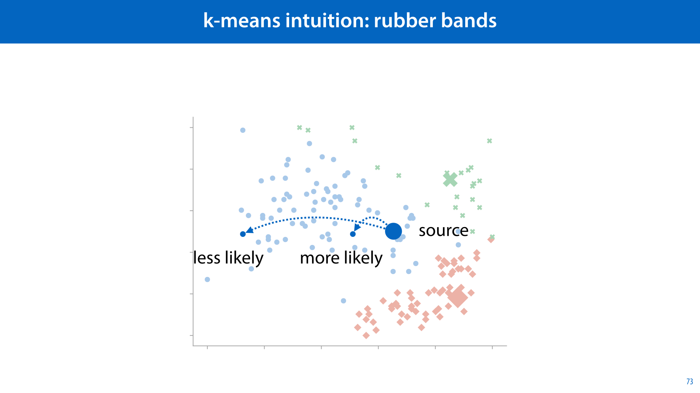

            <figcaption>
            
Before we get to the heavy math, let's have another look at the k-means algorithm. We'll show, in an informal argument why the k-means algorithm is guaranteed to converge. This argument has the same structure as the one we will apply to the EM algorithm. 

Here's the model we set up in the last part, to derive k-means: we assume that there are means (points in feature space) that are responsible for "emitting" the points in out dataset. We don't know exactly how they do this, but we do know that they are more likely to create points close to the mean than far away.  

The maximum likelihood objective says that we want to pick the model for which the data is most likely. Or, put differently, we want to reject any model under which the data is very unlikely. 

For k-means, a model consists of a set of means and an assignment of points to these means. 

            </figcaption>
       </section>

       <section id="slide-074" class="anim">
            <a class="slide-link" href="https://mlvu.github.io/em#slide-074" title="Link to this slide.">link here</a>
            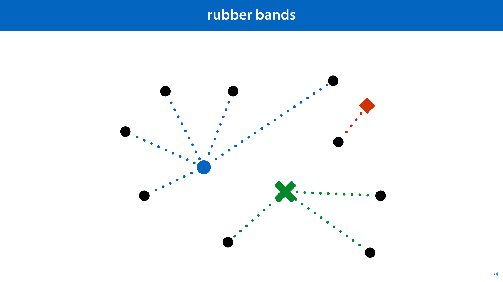

            <figcaption>
            
Here's an analogy: imagine the connection between a mean and one of the points as a <strong>rubber band</strong>. A complete model places k means somewhere in space and connects each data point to only one of the means. 

The principle we stated earlier, that points far away from the mean are less likely, now translated into <strong>the tension in the rubber bands</strong>. The more tightly we have to pull the rubber bands the less likely the model is as an explanation for the data. In this analogy, the maximum likelihood principle says that we are looking for the model where the tension in all the rubber bands, summed over all of them, is as small as possible. 

            </figcaption>
            click image for animation
       </section>

       <section id="slide-075" class="anim">
            <a class="slide-link" href="https://mlvu.github.io/em#slide-075" title="Link to this slide.">link here</a>
            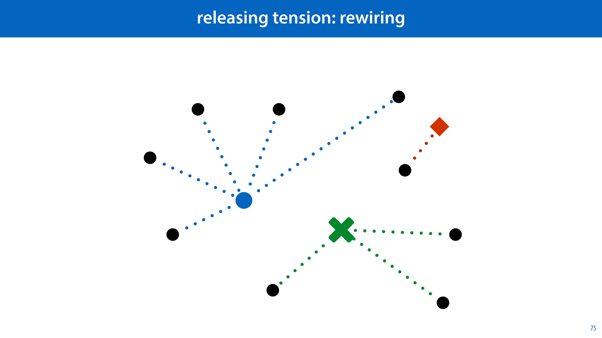

            <figcaption>
            
In this model, at least one of the rubber bands is stretched much farther than it needs to be. There are two ways we can reduce the tension.  

First, we can unhook some of the rubber bands, and <strong>tie them to a different mean</strong>. If we do this only if the new mean is closer to the point than the old mean, we know for a fact we are never increasing the sum total tension: in the new place, the rubber band will be under less tension than the old. 

This is, of course, the re-assignment step of the k-means algorithm.

            </figcaption>
            click image for animation
       </section>

       <section id="slide-076">
            <a class="slide-link" href="https://mlvu.github.io/em#slide-076" title="Link to this slide.">link here</a>
            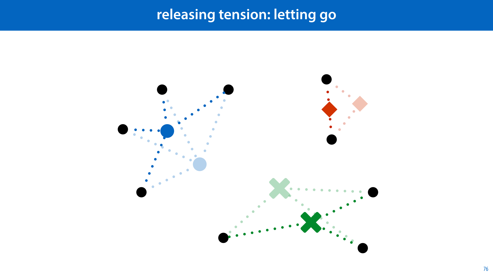

            <figcaption>
            
The other thing we can do to reduce the tension is to move the means into a better place. Imagine that so far you'd been holding the means in place against the tension of the rubber bands, and now you let them go. The rubber bands would automatically pull the means into the optimal place to reduce the tension as much as possible.  

Here again, we note that we are always guaranteed never to increase the total amount of tension in the springs. It may stay the same if the means don't move, but if they move, the total tension afterwards is less than before. 

Next, we pin the means in place again, rewire the connections while keeping the means fixed and so on.

            </figcaption>
       </section>

       <section id="slide-077">
            <a class="slide-link" href="https://mlvu.github.io/em#slide-077" title="Link to this slide.">link here</a>
            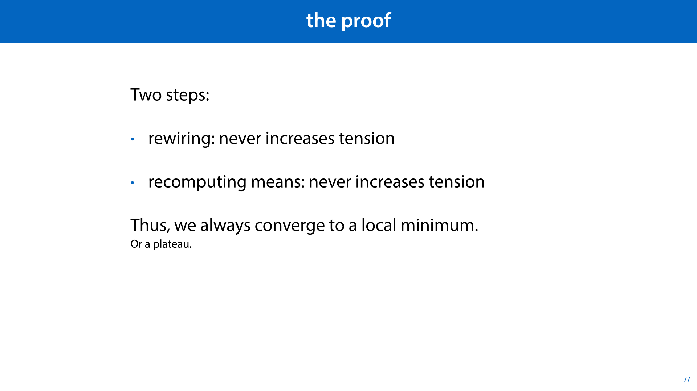

            <figcaption>
            
What we have shown is that there is some quantity, sum of total tension, that neither step of the algorithm ever increases (and in most cases, decreases). This means that if we imagine this quantity as a surface over our model space (like we do with the loss), <strong>we are always moving downhill on this surface.  </strong>

The same argument holds for the EM algorithm, but this requires a little more math. However, in working this out, we'll set up a very useful decomposition for hidden variable models that we will come back to later in the course.  
<aside    >This is not quite a complete proof that you always converge to a local minimum on the loss landscape, but it does show that you converge to a local minimum on the subset of the landscape that the algorithm visits. It is enough to show that the algorithm itself converges.<strong> </strong></aside><aside    ><strong></strong></aside>
            </figcaption>
       </section>

       <section id="slide-078">
            <a class="slide-link" href="https://mlvu.github.io/em#slide-078" title="Link to this slide.">link here</a>
            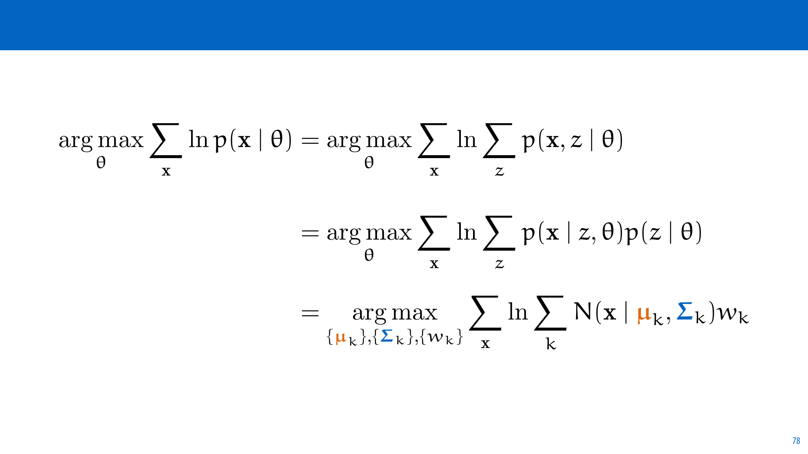

            <figcaption>
            
For a proper probabilistic model like a GMM, the equivalent of the sum total of the tensions in the rubber bands is the (log) likelihood. That is ultimately what we want to minimize. 

Let's start by writing down this objective for the Gaussian mixture model.  

Note that this is not quite analogous to the rubber bands yet, since we are no longer linking points to components. Here we just want to maximize the sum total probability mass that ends up at the points occupied by the data. The responsibilities, which are analogous to the rubber bands, come in later, as a way to help us solve this problem.

            </figcaption>
       </section>

       <section id="slide-079" class="anim">
            <a class="slide-link" href="https://mlvu.github.io/em#slide-079" title="Link to this slide.">link here</a>
            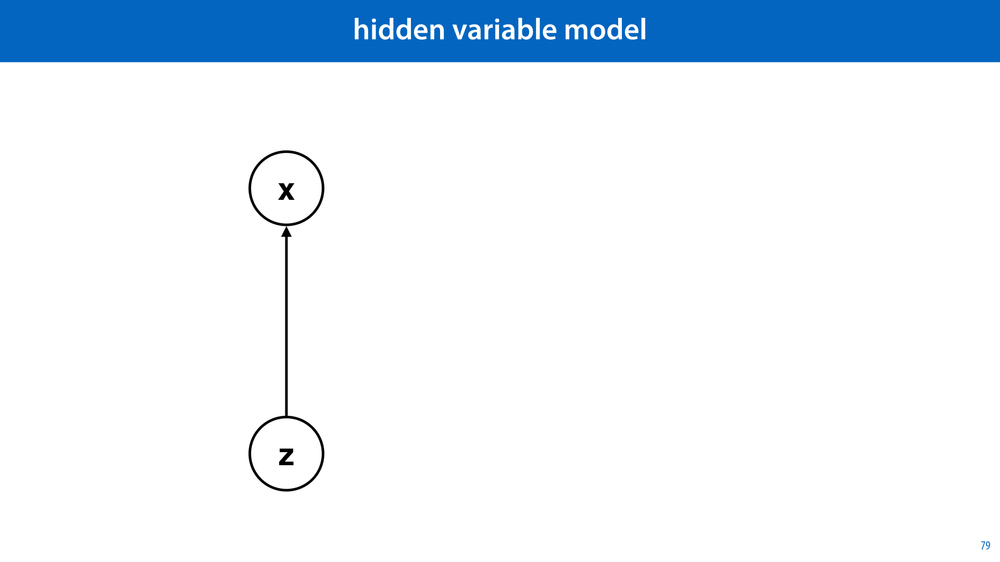

            <figcaption>
            
The problem we have to solve, as we saw before, is the hidden, or latent variable. The fact that we have to estimate both the parameters and the responsibilities of each component for each point together is what makes it impossible to find a global optimum efficiently. 

The probability distribution on the hidden variable is what's missing. If we knew that, we could solve the rest of the problem easily.

            </figcaption>
            click image for animation
       </section>

       <section id="slide-080" class="anim">
            <a class="slide-link" href="https://mlvu.github.io/em#slide-080" title="Link to this slide.">link here</a>
            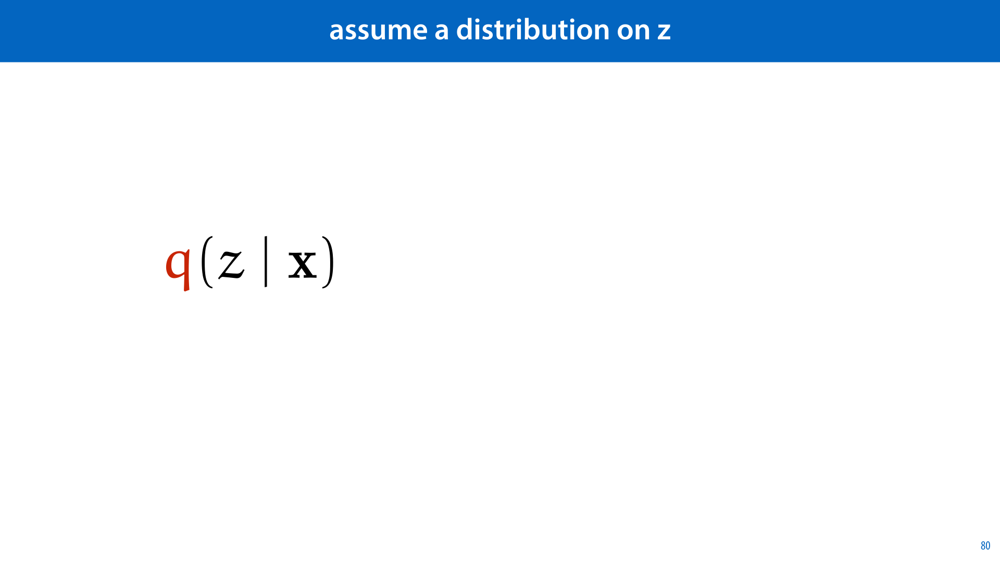

            <figcaption>
            
Our first step is to assume some arbitrary function which gives us a distribution on z for x. This distribution tells us for a given point which component we think generated it. It could be a very accurate distribution or a terrible one. Before we start looking for a <em>good</em> q, We’ll work out some properties first that hold for <em>any</em> q.  
<aside    >q is analogous to the rubber bands in the k-means example. Just like we could start with bad configuration of rubber bands, which stretches them out very far, we can start with a bad choice of q, which lead to a bad likelihood for the model. </aside>
Since in our specific example, z can take one of k values, you should think of q(z|<strong>x</strong>) as a categorical distribution over the k components in our model.  For a particular <strong>x</strong>, q tells us which components are most likely. This is the same function as the responsibilities we defined earlier, and indeed we will see that q will become the responsibilities later, but right now, we are making no assumptions about how q is computed: it could be a completely arbitrary and incorrect function. 

We can think of q(z|x) as an approximation to p(z|x, θ), the conditional distribution on the hidden variable, given the model parameters and the data.  

Why do we introduce q, when we can actually compute p(z|x, θ) using Bayes rule? Because q can be <em>any</em> function, which means it’s not tied to a particular value of θ. q is not a function of θ, which means that in our optimization, it functions as a constant. As we shall see, this can help us a great deal in our analysis. Previously we took the computation of the responsibilities as an intuitive step inspired by Bayes' rule. Now, we'll do without Bayes rule, and show how the responsibilities emerge from first principles, without appealing to intuition. 
<aside    >Remember, θ represents all the parameters of all components and their weights together in one object. </aside><aside    ></aside>
            </figcaption>
            click image for animation
       </section>

       <section id="slide-081" class="anim">
            <a class="slide-link" href="https://mlvu.github.io/em#slide-081" title="Link to this slide.">link here</a>
            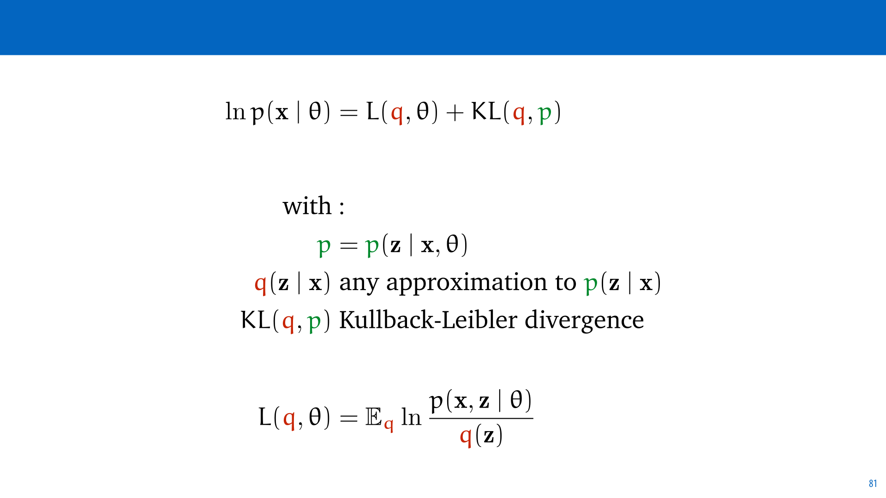

            <figcaption>
            
Remember that ultimately, we are not interested in the values of the hidden variables. We just want to pick θ to maximize  p(x | θ). The hidden variables don't even appear in this formula. the only problem is that we can't compute p(x | θ), because it would require us to marginalize over all possible values of z for all instances. This is where q comes in. 

Given any q (good or bad) we can show that the log likelihood ln p(x | θ), which we cannot easily compute, decomposes into the two terms shown in the slide. 

The KL divergence, as we saw in lecture 5, is a distance between two probability distributions. It tells us how good of an approximation q is for the distribution p(z | <strong>x</strong>, θ) we just compared it to. The worse the approximation, the greater the KL divergence. 

The second term L is just a relatively arbitrary function. There isn’t much meaning that can be divined from its definition, but we can prove that when we rewrite the log-likelihood of x into the KL divergence between p and q, L is what is “left over”. L plus the KL divergence makes the log likelihood. This means that when q is perfect approximation, and the KL divergence becomes zero, L is equal to the likelihood. The worse the approximation, the lower L is, since the KL divergence is always zero or greater. 
<aside    >In our current case, z is just a scalar, but we’ll treat it as a (boldface) vector to highlight that in general, this works for any kind of latent variable. We’ll need that when we reuse this decomposition in later lectures.</aside><aside    ></aside>
            </figcaption>
            click image for animation
       </section>

       <section id="slide-082" class="anim">
            <a class="slide-link" href="https://mlvu.github.io/em#slide-082" title="Link to this slide.">link here</a>
            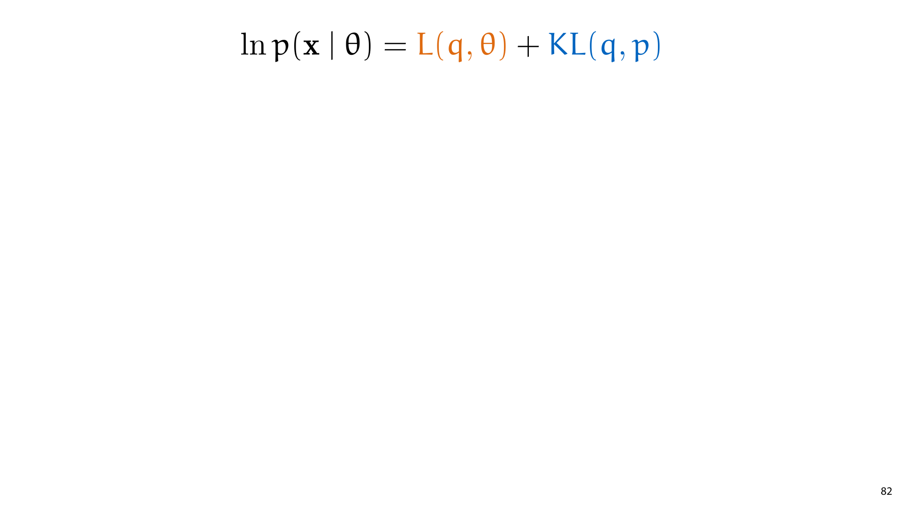

            <figcaption>
            
Here is the proof that this decomposition holds. It’s easiest to work backwards. We fill in our statement of L and KL terms, and rewrite to show that they’re equivalent to the log likelihood. 

If you're struggling to follow this, go through the explanation of the logarithm and the expectation in the first homework again, or look up their properties on wikipedia. There isn't much intuition here: it's just a purely algebraic proof that the log likelihood can be decomposed like this for any distribution q on the hidden variable. 
<aside    >We've written L and KL as sums here, but because we are only using properties of the expectation, it works for continuous distributions as well (in which case the sum becomes an integral).  </aside><aside    ></aside>
            </figcaption>
            click image for animation
       </section>

       <section id="slide-083" class="anim">
            <a class="slide-link" href="https://mlvu.github.io/em#slide-083" title="Link to this slide.">link here</a>
            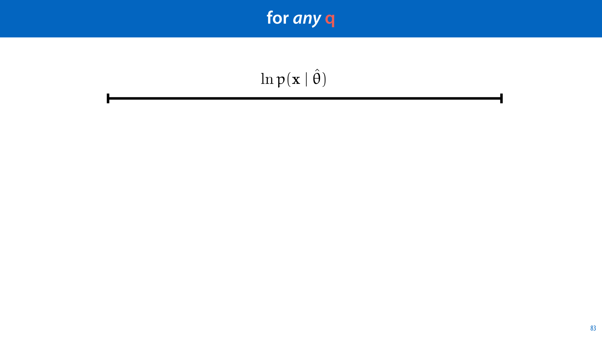

            <figcaption>
            
This is the picture that all this rewriting buys us. We have the probability of our data under the optimal model (top line) and the probability of our data under our current model (middle line). And for any q, whether it’s any good or not, the latter is composed of two terms. 

We can now build the same kind of proof as we did for the rubber bands: we can alternately shrink one of the two bars, which shows that the algorithm will converge.

            </figcaption>
            click image for animation
       </section>

       <section id="slide-084">
            <a class="slide-link" href="https://mlvu.github.io/em#slide-084" title="Link to this slide.">link here</a>
            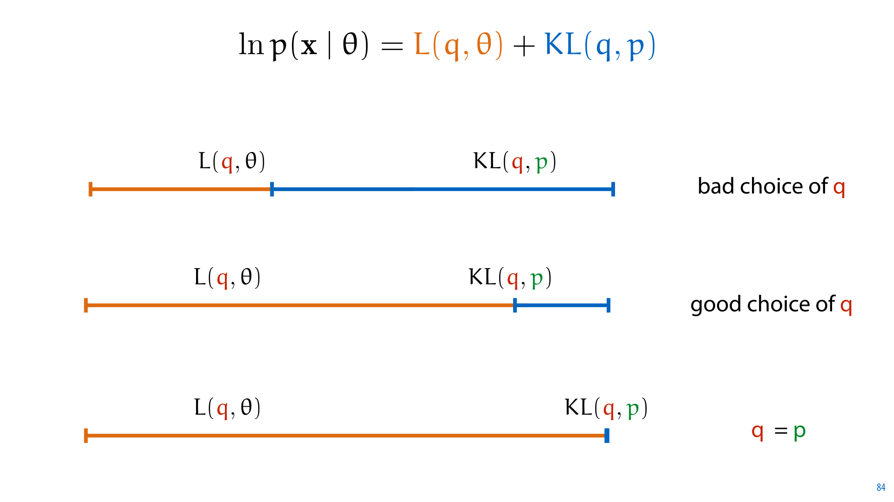

            <figcaption>
            
Note again that this is just a way of writing down the probability density of our data given the parameters (with the hidden variable z marginalized out). The sum of these two terms is always the same. The closer p is to q, the smaller the KL term gets. 

In short, L is a lower bound in the quantity that we’re interested in. The KL term tells us how good of a lower bound this is.

            </figcaption>
       </section>

       <section id="slide-085">
            <a class="slide-link" href="https://mlvu.github.io/em#slide-085" title="Link to this slide.">link here</a>
            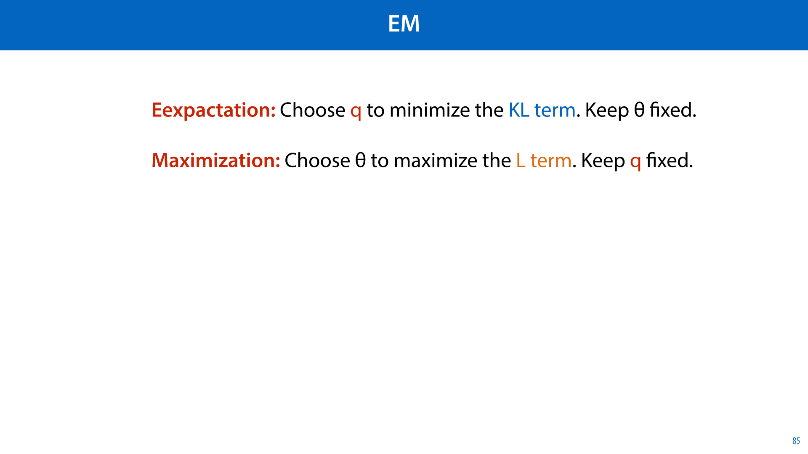

            <figcaption>
            
With this decomposition, it turns out that we can state the EM algorithm very simply, and in very general terms. 
<aside    >Note that none of this assumes anything about GMMs or about the distribution on z. This approach works for a much broader class of hidden variable models than just the GMM.</aside><aside    ></aside>
            </figcaption>
       </section>

       <section id="slide-086" class="anim">
            <a class="slide-link" href="https://mlvu.github.io/em#slide-086" title="Link to this slide.">link here</a>
            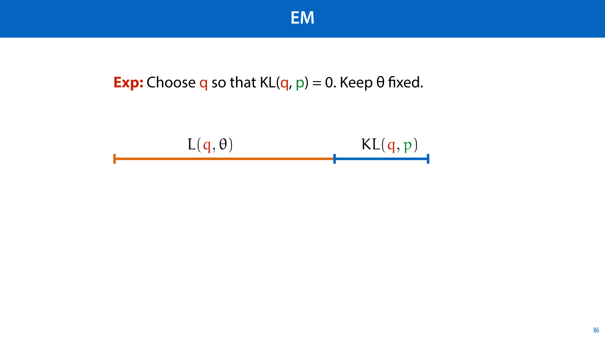

            <figcaption>
            
In the expectation step, we reset q to be the best possible approximation to p(z|x, θ) that we can find for the <em>current</em> θ. This is not the global optimum, since θ may be badly chosen, but it is never a worse choice than the previous q. We do this by minimizing the KL divergence between the two distributions.  
<aside    >Note that our objective is to maximize the sum of these two bars, so it may at first seem counter-intuitive to minimize one of them. However, the decomposition holds for any q, so if we re-select q, we don’t change the total length. We just change the proportion that the q term claims. </aside>
After this step, the total length of the two bars is unchanged, because the decomposition still holds. We have not moved to a worse place in the loss landscape.

            </figcaption>
            click image for animation
       </section>

       <section id="slide-087">
            <a class="slide-link" href="https://mlvu.github.io/em#slide-087" title="Link to this slide.">link here</a>
            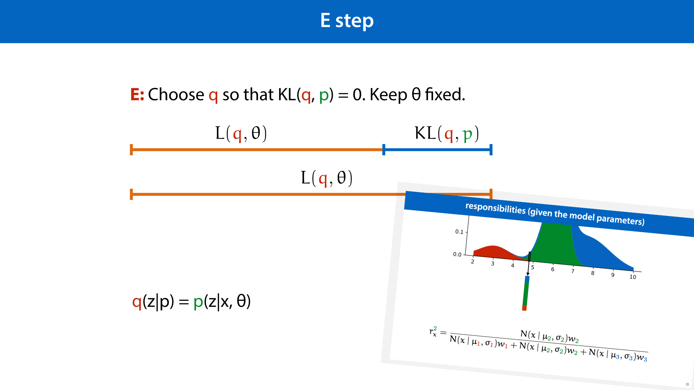

            <figcaption>
            
In the specific GMM setting, the expectation step is easy to work out. The KL divergence is minimal when q is a perfect approximation to p. Since we keep θ as a constant, we can just work out the conditional probabilities on z given the parameters θ. That is, in this setting we know p(z|x, θ), so we can just compute it and set q equal to it. 

The result is simply the responsibilities we already worked out in the previous part. 

This is analogous to rewiring the rubber bands in the k-means example: we keep the model the same, and re-assign the responsibilities in the way that is "most likely".

            </figcaption>
       </section>

       <section id="slide-088" class="anim">
            <a class="slide-link" href="https://mlvu.github.io/em#slide-088" title="Link to this slide.">link here</a>
            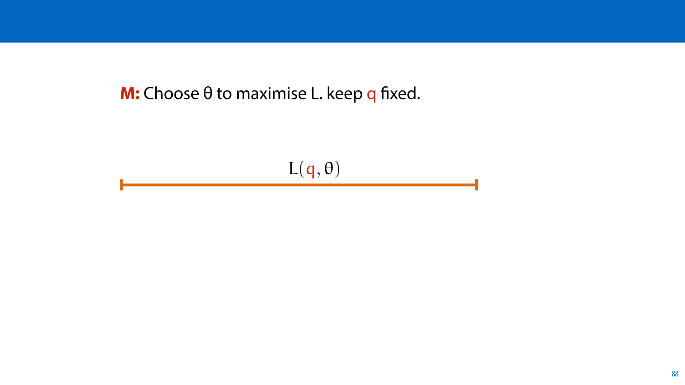

            <figcaption>
            
In the M step, we change the parameter θ which described the components and their weights. We choose the θ which maximizes L.  

This means our q function is no longer a perfect approximation to p, so the KL divergence is no longer zero. This means that the total size of the bar gets a boost both from our change of L and for a new (bigger) KL divergence. 

            </figcaption>
            click image for animation
       </section>

       <section id="slide-089" class="anim">
            <a class="slide-link" href="https://mlvu.github.io/em#slide-089" title="Link to this slide.">link here</a>
            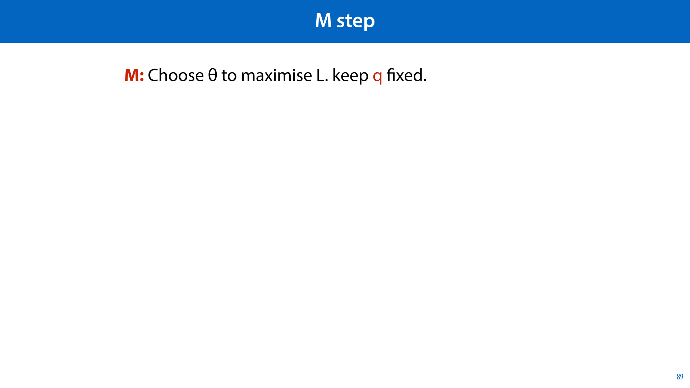

            <figcaption>
            
If we take the division out side of the logarithm, it becomes a term that does not contain θ, so we can remove it from our objective. 

The remainder is just a likelihood weighted by the responsibilities we’ve just computed.  

Note that the sum is now outside the logarithm. That means we can work out an optimal solution for the model parameters given the current q.

            </figcaption>
            click image for animation
       </section>

       <section id="slide-090" class="anim">
            <a class="slide-link" href="https://mlvu.github.io/em#slide-090" title="Link to this slide.">link here</a>
            

            <figcaption>
            
Here's how that works out for the parameters of the Gaussian mixture model. If we take this criterion, and work out the maximum likelihood, we find that for the mean and covariance we get a weighted version of the maximum likelihood objective for the normal distribution. We've worked these out already in the second part (the r's here are the ω's there). 
<aside    >We work out the estimators for component 2, to make things a little more concrete. The estimators for the other components are the same, but with the component number replaced as appropriate.</aside><aside    ></aside>
            </figcaption>
            click image for animation
       </section>

       <section id="slide-091" class="anim">
            <a class="slide-link" href="https://mlvu.github.io/em#slide-091" title="Link to this slide.">link here</a>
            

            <figcaption>
            
The one maximum likelihood estimator we haven't worked out yet is the one for the weights of the components. In the previous part, we just appealed to intuition and said that it makes sense to set the weights to the proportion of responsibility each component claims over the whole data. Now we can work out that this is actually the solution to the maximization objective. 
<aside    >The weights should sum to one, so that part of our optimization is actually a constrained optimization problem. This requires the use of Lagrange optimizers which are not part of the course material (any more). We include the derivation here for the sake of completeness. Lagrange multipliers are explained in <a href="https://mlvu.github.io/svms/"><strong>the optional SVM lecture</strong></a>. </aside>
We define a Lagrangian function that includes the constraints, take its derivative with respect to all its parameters (including the multiplier α), and we set them all equal to zero. The result for the weights is an expression including α, and the result for the Lagrange multiplier recovers the constraint, as it always does. Filling the former into the latter shows us that alpha expresses the total sum of responsibility weights over all components and instances. 

This means that the optimal weight for component 2 is the amount of responsibility assigned to component 2 in the previous ste, as a proportion of the total. 

 

            </figcaption>
            click image for animation
       </section>

       <section id="slide-092" class="anim">
            <a class="slide-link" href="https://mlvu.github.io/em#slide-092" title="Link to this slide.">link here</a>
            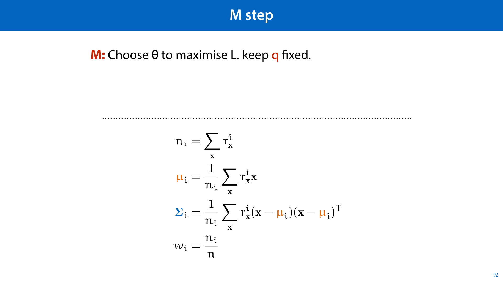

            <figcaption>
            
And there we have it: maximizing the log probability of the data as weighted by the responsibilites defined by q gives us exactly the estimators we came up with intuitively in the previous step.

            </figcaption>
            click image for animation
       </section>

       <section id="slide-093">
            <a class="slide-link" href="https://mlvu.github.io/em#slide-093" title="Link to this slide.">link here</a>
            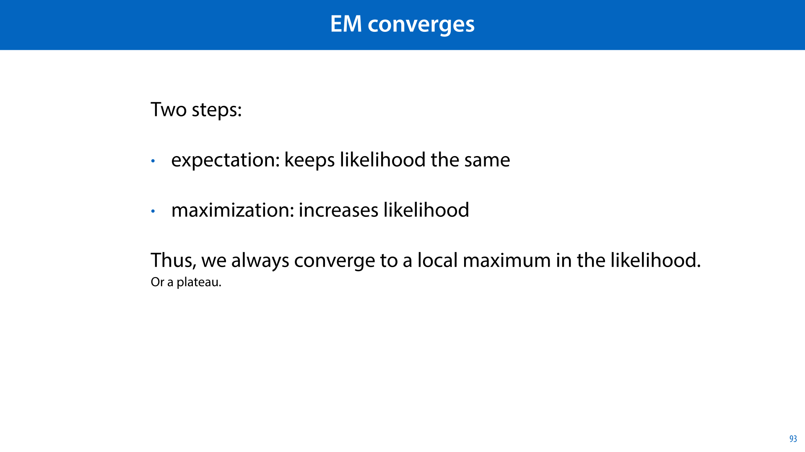

            <figcaption>
            
Thus, with the same reasoning as we saw for the rubber bands (and a lot more math), we find that we EM algorithm converged to a local maximum in the likelihood. 

Also, we have figured out a concrete way to translate the EM algorithm to other distributions. All of this works for any ditribution p and q, and it tells us exactly what to minimize and maximize in each step. So long as we can figure out how to perform those actions, we can apply the EM algorithm to any hidden variable model.

            </figcaption>
       </section>

</article>
