<nav class="menu">
    <ul>
        <li class="home"><a href="/">Home</a></li>
        <li class="name">Lecture 12: Embedding models</li>
                <li><a href="#video-000">Recommenders</a></li>
                <li><a href="#video-031">Improving recommenders</a></li>
                <li><a href="#video-053">PCA Revisited</a></li>
                <li><a href="#video-067">Graph models</a></li>
                <li><a href="#video-082">Validation</a></li>
        <li class="pdf"><a href="https://mlvu.github.io/lectures/62.Matrices.annotated.pdf">PDF</a></li>
    </ul>
</nav>

<article class="slides">

        <section class="video" id="video-000">
            <a class="slide-link" href="https://mlvu.github.io/embeddingmodels#video-0">link here</a>
           <video controls>
                <source src="https://pbm.thegood.cloud/s/W7AWGkFqJYaSrwS/download/MLVU%2012.1_%20Recommender%20systems.mp4" type="video/mp4" />

                Download the <a href="https://pbm.thegood.cloud/s/W7AWGkFqJYaSrwS/download/MLVU%2012.1_%20Recommender%20systems.mp4">video</a>.
           </video>
        </section>

       <section id="slide-001">
            <a class="slide-link" href="https://mlvu.github.io/embeddingmodels#slide-001" title="Link to this slide.">link here</a>
            

            <figcaption>
            
In this lecture, we’ll take the idea of embedding vectors we first saw in the previous lecture, and we’ll look at some other places it can be applied. 

Our first topic is a very common task for machine learning: recommender systems. This is something that isn’t quite classification or regression and is best modeled as an abstract task in its own right. 

 

            </figcaption>
       </section>

       <section id="slide-002">
            <a class="slide-link" href="https://mlvu.github.io/embeddingmodels#slide-002" title="Link to this slide.">link here</a>
            

            <figcaption>
            
The standard example of a recommender system is recommending <strong>movies</strong> to<strong> </strong><strong>users</strong>. 

That’s no accident. The modern concept of a recommender system was probably born in 2006 when Netflix, then mainly a DVD rental service, released a dataset of user/movie ratings, and offered a 1M$ prize for anybody who could improve the RMSE of their current predicted ratings by 10% from. 
<aside    >This is not to say that we didn't have recommendations on websites before then, but the modern view of how to solve the problem was probably born out of trying to win the Netflix prize. </aside>
This not only sparked an interest in <strong>recommendation</strong> as a task, but also probably started the craze for machine learning competitions that later led to websites like Kaggle. 

We’ll use the movie task as a running example, but we’ll also look at some other settings that translate to the same abstract task.

            </figcaption>
       </section>

       <section id="slide-003">
            <a class="slide-link" href="https://mlvu.github.io/embeddingmodels#slide-003" title="Link to this slide.">link here</a>
            

            <figcaption>
            
Let’s start by looking at the Netflix task, and what types of information we have available there. The defining property of the abstract task of recommendation is that the primary source of data is <strong>explicit user ratings</strong>: we<em> ask</em> users to tell us which movies they like, and hopefully, they’ll oblige. They do this only for a few movies, and from the small set of user/movie pairs that we know the rating for, we must predict the rest. 

Predicting ratings based on explicit feedback is sometimes known as <strong>collaborative filtering</strong>. The users collaborate by providing ratings, to help filter the movies they’ll like out of the large amount of available movies. 

The main drawback here is that the information can be very sparse: we’ll only get a few ratings per user, and some users won’t give any ratings at all. We’ll look at some ways to deal with that in the next video. For now, we’ll see what we can do with just explicit feedback. 

            </figcaption>
       </section>

       <section id="slide-004">
            <a class="slide-link" href="https://mlvu.github.io/embeddingmodels#slide-004" title="Link to this slide.">link here</a>
            

            <figcaption>
            
Movie recommendation is the canonical use case for recommender systems, but the system applies to many other systems. 

 Amazon was probably the first to use personalised recommendation to help users navigate their website. The principle is similar to Netflix. These are many<strong> </strong><strong>users</strong>, a large database of <strong>items</strong>. We have some information about which users liked which items in the past, so we can predict which ones they’ll like in the future.

            </figcaption>
       </section>

       <section id="slide-005">
            <a class="slide-link" href="https://mlvu.github.io/embeddingmodels#slide-005" title="Link to this slide.">link here</a>
            

            <figcaption>
            
Another use case is news stories, can we help people to find the articles they’re interested in? 
<aside    >A challenge in this domain is how quickly information changes. We may know that a user likes news about Billie Eilish, because they did  so in the past, but when a new pop star comes along that is like Billie Eilish, are we smart enough to recommend news articles about them as well? </aside><aside    ></aside>
            </figcaption>
       </section>

       <section id="slide-006" class="anim">
            <a class="slide-link" href="https://mlvu.github.io/embeddingmodels#slide-006" title="Link to this slide.">link here</a>
            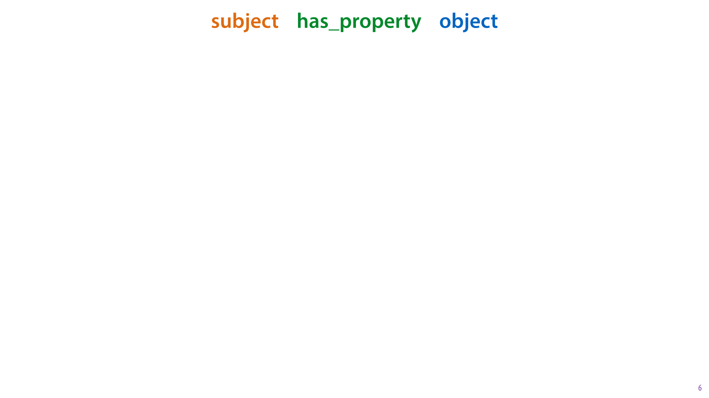

            <figcaption>
            
In the most general sense, the <strong>abstract task</strong> of recommendation is applicable to any situation where you have two large sets of things and a particular <strong>relation</strong> between them. 

The relation can be binary (it holds or it doesn’t) or it can come with a numeric value that indicates the <em>exten</em>t to which it holds. This could even be negative for when the relation doesn’t hold. 

Often, one side of the relation is a set of users and another is a set of items, but this need not always be the case. For instance, is you have a large collection of ingredients and a large collection of recipes, in which the ingredients occur, you could model this as a “recommendation” task. The resulting prediction may help to give ideas for which novel ingredient/recipe combinations would work well together. 

The key property of the abstract task is that in principle, you have no information, no<em> features</em>, for any of the objects in either set, beyond which ones in the first set are link to which ones in the second set. Or, if you do have some features as well, you consider these secondary information, and you want to base your predictions <em>primarily</em> on the property linking the two classes of objects.

            </figcaption>
            click image for animation
       </section>

       <section id="slide-007" class="anim">
            <a class="slide-link" href="https://mlvu.github.io/embeddingmodels#slide-007" title="Link to this slide.">link here</a>
            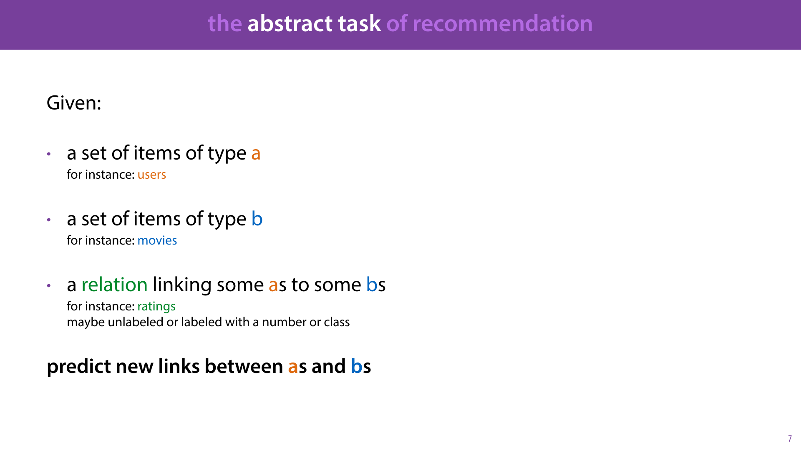

            <figcaption>
            
The edges we predict may be unlabeled, in which case, we should simply predict whether or not a link exists, or they be be labeled. They can be labeled with classes, for instance if users can like or dislike a movie, or they can be labeled with a number, for instance with a numeric rating given to the movie.  

If we have something like a five star rating, it’s up to us whether we prefer to model it as a relation labeled with five separate classes, or a relation labeled with a number between 1 and 5.

            </figcaption>
            click image for animation
       </section>

       <section id="slide-008">
            <a class="slide-link" href="https://mlvu.github.io/embeddingmodels#slide-008" title="Link to this slide.">link here</a>
            

            <figcaption>
            
Recommendation is probably the most widely deployed machine learning method in production systems at the moment. 

In fact, in many social media platforms, recommendation is the<strong> primary means of navigation</strong>. When you load your Facebook feed, your Twitter timeline or your Youtube homepage, the main content you see, is based on recommendation. You see the items in their database, that the algorithms think you’re going to like (or at least engage with), based on your past behavior.

            </figcaption>
       </section>

       <section id="slide-009">
            <a class="slide-link" href="https://mlvu.github.io/embeddingmodels#slide-009" title="Link to this slide.">link here</a>
            

            <figcaption>
            
In fact, recommendation algorithms are now so prevalent, that they are becoming a central component in the fabric of society. For a large proportion of the population, for instance, recommendation algorithms decide which news stories they see, and which analysis of those stories they’re exposed too.  

The consequences are difficult to oversee, and many issues have been discussed over the past few years. Filter bubbles may shield people from encountering different viewpoints. Optimizing algrithms for engagement may drive people towards more extreme viewpoints. And all this put together may even make the process of democracy more easy to manipulate. 

In other words, it is not entirely clear at the moment whether recommendation algorithms are a force for good, or something that has grown too big for us to entirely oversee the consequences of. Either way, it pays to understand exactly how they work.

            </figcaption>
       </section>

       <section id="slide-010">
            <a class="slide-link" href="https://mlvu.github.io/embeddingmodels#slide-010" title="Link to this slide.">link here</a>
            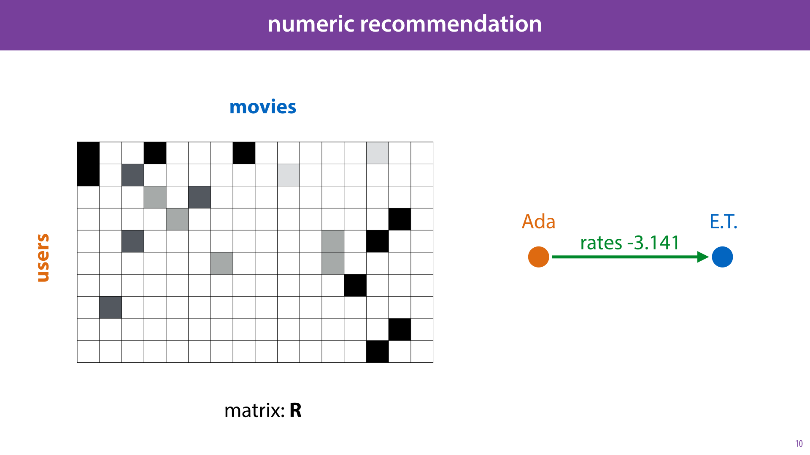

            <figcaption>
            
In the rest of the lecture, we’ll keep to the movie recommendation use case, to keep things concrete, but everything we say can easily be adapted to other instances of the abstract recommendation task. 

We’ll start with the case where we have <strong>numeric ratings</strong>, which may be negative if a user dislikes a movie and positive if they like it. Surprisingly, this is the easiest setting to handle. We’ll see later how to extend this to non-negative ratings, to class-labeled ratings and to unlabeled ratings. 

We can view the space of all possible ratings as a matrix with the users along one axis, and the movies along another.  

For some user/movie combinations we have a rating. Most of the matrix is empty, and these are the values that we want to predict.  

The problem, as we said before, is that we have no representation for the users or for the movies. The only thing we have is two big sets of “atomic” objects, and a small amount of connections between them.

            </figcaption>
       </section>

       <section id="slide-011">
            <a class="slide-link" href="https://mlvu.github.io/embeddingmodels#slide-011" title="Link to this slide.">link here</a>
            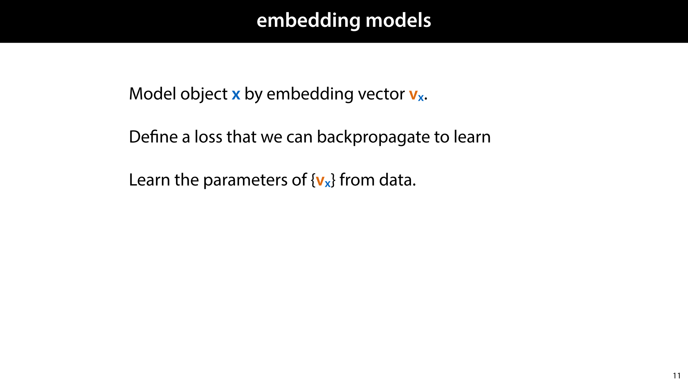

            <figcaption>
            
We’ve seen this problem before, in the <strong>word embedding</strong> problem. There, each word was an atomic object. What we did was represent each word by its own vector, and then <em>learn</em> the values of the vectors to perform some downstream task.

            </figcaption>
       </section>

       <section id="slide-012">
            <a class="slide-link" href="https://mlvu.github.io/embeddingmodels#slide-012" title="Link to this slide.">link here</a>
            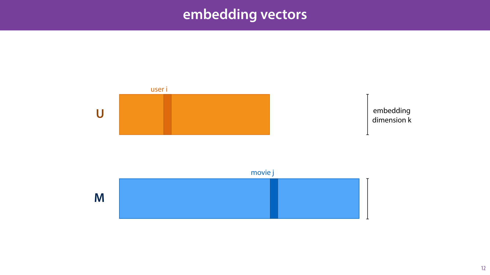

            <figcaption>
            
We’ll apply the same trick here. We assign a vector of initially random numbers to each user and to each movie, an <strong>embedding vector</strong>, and we will optimize the contents of these vectors to give us good representations. The number of elements k in each vector is a hyperparameter that we can set freely, but we must use the same k for both the user and the movie embeddings. 

We arrange the embeddings into two matrices U and M. These are the parameters of our model. 

To see how to learn these values, let’s imagine first what we might do if we could set them by hand. In other words, how might we solve the problem if we could craft feature vectors for each movie and each user?

            </figcaption>
       </section>

       <section id="slide-013" class="anim">
            <a class="slide-link" href="https://mlvu.github.io/embeddingmodels#slide-013" title="Link to this slide.">link here</a>
            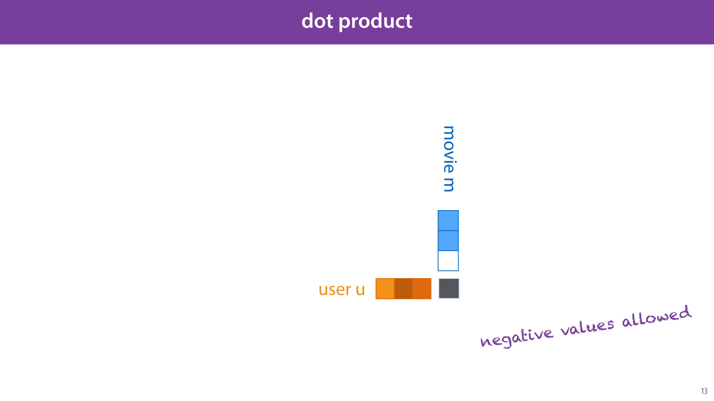

            <figcaption>
            
In that case, we can imagine setting the values by hand to represent various aspects for the users and for the movies that <em>match each other</em>. We might encode, for instance in one feature how much a user likes romance. We can make this negative for a strong dislike of romance and positive for a strong affinity for romance.  

We could then then encode in the corresponding movie feature, how much romance the movie contains.

            </figcaption>
            click image for animation
       </section>

       <section id="slide-014" class="anim">
            <a class="slide-link" href="https://mlvu.github.io/embeddingmodels#slide-014" title="Link to this slide.">link here</a>
            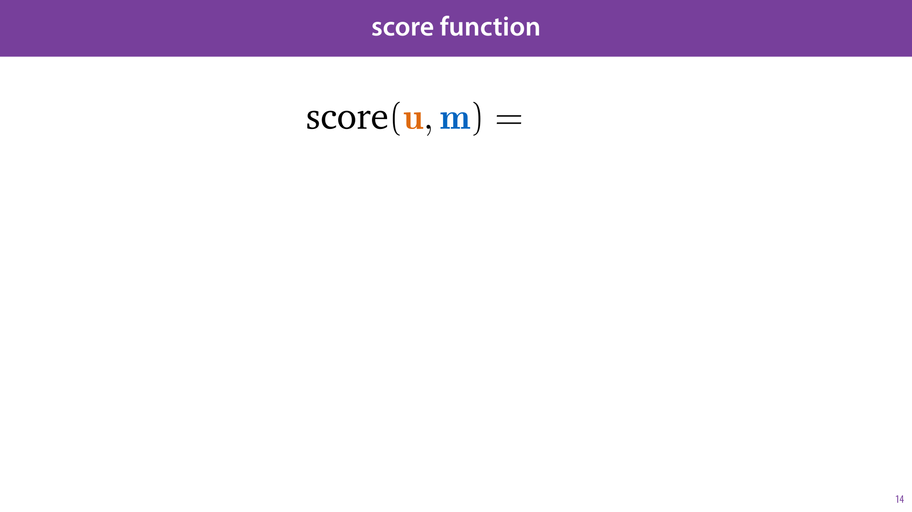

            <figcaption>
            
Based on these representations, we need to come up with a <strong>score function</strong>. Some function that takes the two representations and outputs a high positive number if the user is well-matched to the movie, a large negative number if the user will probably dislike the movie, and a number near zero if the user will be ambivalent about the movie. 

There are a few options, but a particularly simple one is the <strong>dot product</strong> between the user embedding and the movie embedding.  This neatly expresses how much of a match the two are: if the user loves romance and the movie contains loads of it, the romance term in the sum becomes very big. The same if both values are negative (the user hates romance and the movie is very unromantic). for mismatches, the term becomes negative and the score is brought down. 

A second effect is one of <strong>magnitude</strong>. If the user is ambivalent to romance (i.e. the romance feature is zero), that term doesn’t count towards the total (and for small values, the term contributes a little bit). 

Other score functions are possible, but the dot product is by far the most popular, and we’ll stick with that for the rest of the lecture.

            </figcaption>
            click image for animation
       </section>

       <section id="slide-015" class="anim">
            <a class="slide-link" href="https://mlvu.github.io/embeddingmodels#slide-015" title="Link to this slide.">link here</a>
            

            <figcaption>
            
Here is one benefit of using the dot product as out score function. For a given set of user and movie embeddings, we can simply compute all predicted ratings by multipliying the two matrices containing the embedding vectors. 

In a matrix multiplication A x B = C, each element of C contains the dot product of one row of A with one column of B. This means that multiplying <strong>U</strong>T with <strong>M</strong> will give us a matrix <strong>R</strong> of rating predictions for every user/movie pair.  

The highlighted cell Rij contains the dot product of the embedding vector for user i and movie j. This is exactly our prediction for how much that user will like that movie. 

            </figcaption>
            click image for animation
       </section>

       <section id="slide-016">
            <a class="slide-link" href="https://mlvu.github.io/embeddingmodels#slide-016" title="Link to this slide.">link here</a>
            

            <figcaption>
            
Another way of looking at this is that our aim is to take the matrix <strong>R</strong> of known ratings, and to <em>decompose</em> it as the product as two factors <strong>U</strong> and <strong>M</strong>. 

This is why this kind of approach to recommendation is sometimes called<strong> matrix factorization </strong>(or matrix decomposition). Multiplying <strong>U</strong> and <strong>M</strong> together should produce a matrix that is as close as possible to the rain matrix we have,

            </figcaption>
       </section>

       <section id="slide-017" class="anim">
            <a class="slide-link" href="https://mlvu.github.io/embeddingmodels#slide-017" title="Link to this slide.">link here</a>
            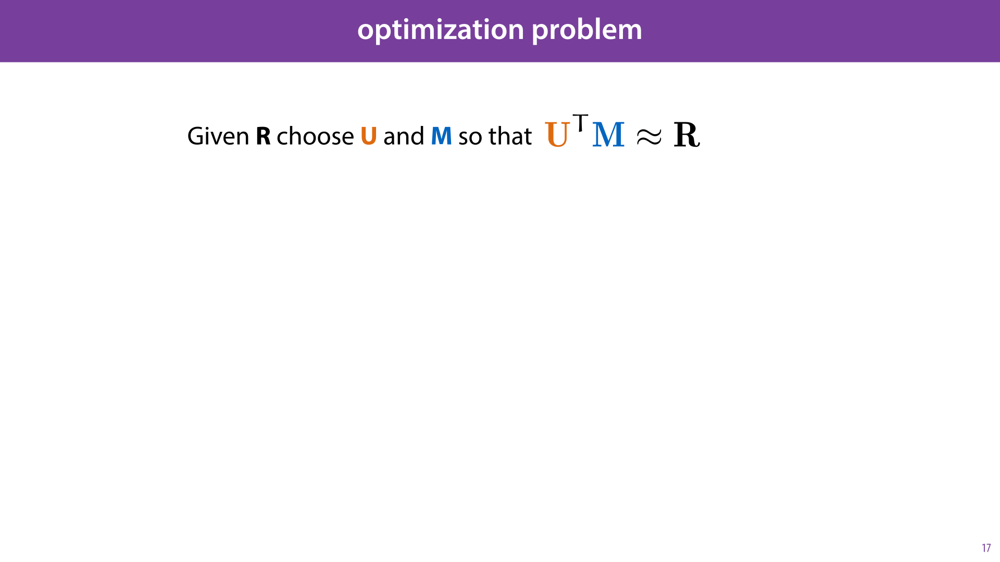

            <figcaption>
            
So our problem is that for a given incomplete matrix <strong>R</strong> of ratings, we want to find two smaller matrices <strong>U</strong> and <strong>M</strong> that multiply together into a rating matrix that is somehow close to <strong>R</strong>.  

To turn this into an optimization objective, we need to define how to measure how close together to matrices are. The simplest option is to measure the <strong>Frobenius norm </strong>of the difference between the two matrices.  

This sounds complicated, but it’s just the same as the vector norm, but applied to matrices: we sum the squares of the elements of the matrix together and take the square root of the sum. 

Minimizing the square of this value, is just minimizing the sum of the squared differences between the true rating matrix and our predictions. In other words, we compute <strong>predictions</strong> by taking the dot product of the user embedding and the movie embedding, we compute<strong> the error</strong> of our prediction by subtracting this from the true rating, and we minimize the sum of squared errors.

            </figcaption>
            click image for animation
       </section>

       <section id="slide-018">
            <a class="slide-link" href="https://mlvu.github.io/embeddingmodels#slide-018" title="Link to this slide.">link here</a>
            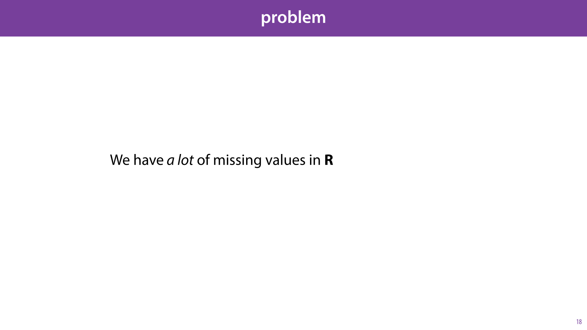

            <figcaption>
            
One problem is that <strong>R</strong> is not complete. For most user/movie pairs, we don’t know the rating (if we did, we wouldn’t need a recommender system).

            </figcaption>
       </section>

       <section id="slide-019">
            <a class="slide-link" href="https://mlvu.github.io/embeddingmodels#slide-019" title="Link to this slide.">link here</a>
            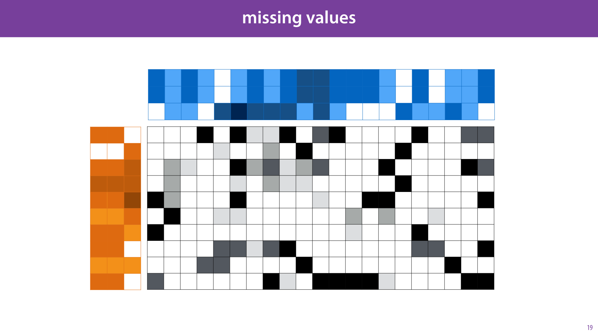

            <figcaption>
            
The matrix <strong>R</strong> is actually an <em>incomplete</em> matrix. We often fill in the unknown ratings with zeroes, but they are really <em>unknown</em> values. 

If we compute the squared errors for the whole matrix, we are essentially telling our model to predict a zero rating for all of these unknown values (when actually the true ratings here may be very high or very low.

            </figcaption>
       </section>

       <section id="slide-020">
            <a class="slide-link" href="https://mlvu.github.io/embeddingmodels#slide-020" title="Link to this slide.">link here</a>
            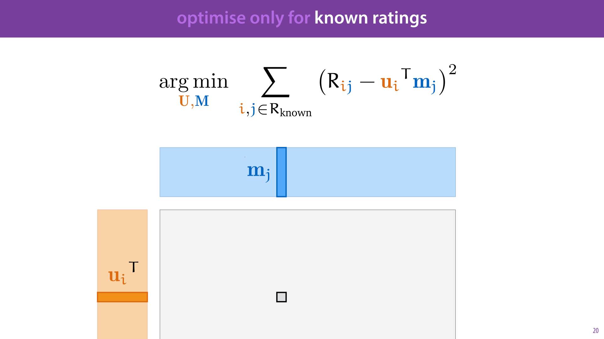

            <figcaption>
            
The solution is simple: we define the loss only for the known ratings. 

This is straightforward to do if we have both positive and negative ratings, for instance likes and dislikes. We just compute the squared errors <em>only</em> over the known values of the matrix, eliminating other terms from the sum. 
<aside    >If we have only positive ratings (such as twitter "likes"), this would just lead to the model predicting positive everywhere. We'll see how to deal with this setting later. </aside><aside    ></aside>
            </figcaption>
       </section>

       <section id="slide-021">
            <a class="slide-link" href="https://mlvu.github.io/embeddingmodels#slide-021" title="Link to this slide.">link here</a>
            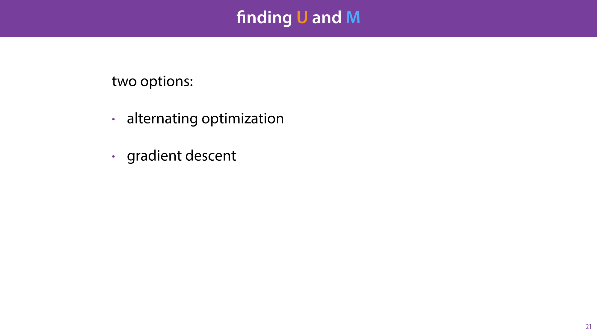

            <figcaption>
            
So, now that we have our optimization objective, how do we work out good values for our embedding vectors?  

The obvious choice is <strong>gradient descent</strong>. This is probably the most versatile and scalable option, but there is an alternative: <strong>alternating optimization</strong>.

            </figcaption>
       </section>

       <section id="slide-022">
            <a class="slide-link" href="https://mlvu.github.io/embeddingmodels#slide-022" title="Link to this slide.">link here</a>
            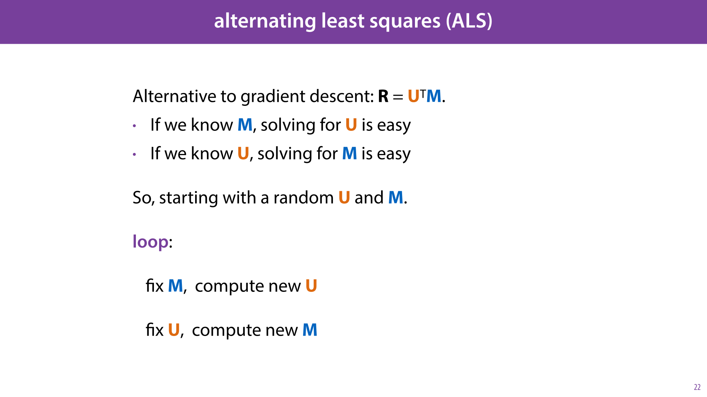

            <figcaption>
            
We won’t dig into it deeply, but here is the basic principle. The equation <strong>R</strong> = <strong>U</strong>T<strong>M</strong> is is a simple linear equation with two unknowns. It’s easy to solve analytically if we had one unknown (using basic linear algebra methods). 

ALS has some computational benefits for small datasets, but in practice, gradient descent seems to be more flexible, for instance in dealing with missing values, different loss functions and in and adding various regularizers.

            </figcaption>
       </section>

       <section id="slide-023">
            <a class="slide-link" href="https://mlvu.github.io/embeddingmodels#slide-023" title="Link to this slide.">link here</a>
            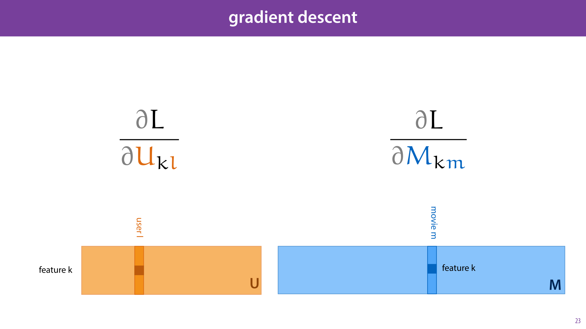

            <figcaption>
            
The simplest way to apply gradient descent is to implement recommendation in an automatic differentation system. If we do that, we can just define <strong>U</strong> and <strong>M</strong> as parameters, compute our loss and backpropagate. However, it’s instructive to work out the gradients for the squared error loss by hand. They’re not that complex, and they give us some insight into exactly how the algorithm updates the embedding values.  

To do this, these are the derivatives we need to work out. The derivatives of the loss L for the k-th embedding value of the embedding of user l, and similarly for the movie embeddings. For all k, l and m, these derivatives together make up the gradient of our model.

            </figcaption>
       </section>

       <section id="slide-024" class="anim">
            <a class="slide-link" href="https://mlvu.github.io/embeddingmodels#slide-024" title="Link to this slide.">link here</a>
            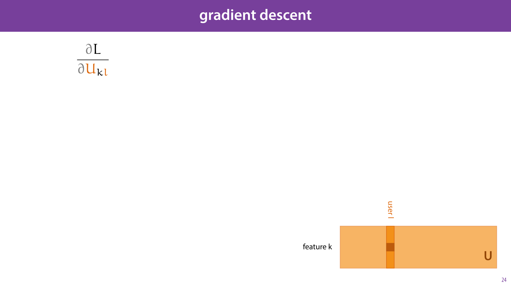

            <figcaption>
            
Here is the derivation for the user embedding. To simplify our notation, we define the error as a matrix <strong>E</strong> containing all differences between the predictions and the true ratings. We can sum over all elements in this matrix, or only over those corresponding to known ratings. We don't specify here, so the derivation holds for both cases.

            </figcaption>
            click image for animation
       </section>

       <section id="slide-025" class="anim">
            <a class="slide-link" href="https://mlvu.github.io/embeddingmodels#slide-025" title="Link to this slide.">link here</a>
            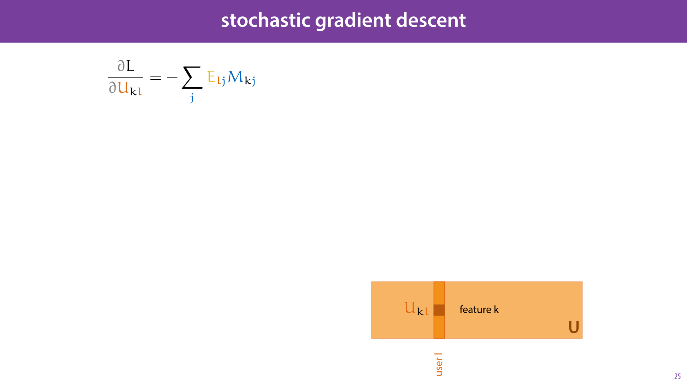

            <figcaption>
            
We update the k-th value of the embedding for user l, by computing the error vector for user l <em>over all movies</em>, and taking the dot product with the k-th feature over all movies. 

Imagine that the k-th value of the user and movie embeddings represents how romantic the user and movie are respectively. Now imagine that we had a movie that we think is very romantic and a user that we think is very romantic, that is, the both have high values for the k-th value in their embedding. Since the embeddings match well, we end up giving a high rating. 

Now imagine that the actual rating was much lower, so that we end up with a negative error: element Elm is a large negative number. The update rule tells us what this means. The movie’s k-th element was high, and we’re taking that as a constant at the moment. Therefore, we can only assume that the large error was due to the user. We update the user’s k-th value by the error multiplied by the movie’s k-th value, subtracting a large value.  

In short, assuming that both the movie and the user were romantic gave us a large error, and we are treating the movie matrix <strong>M</strong> as a constant, so we conclude that the user must be less romantic than we thought.

            </figcaption>
            click image for animation
       </section>

       <section id="slide-026" class="anim">
            <a class="slide-link" href="https://mlvu.github.io/embeddingmodels#slide-026" title="Link to this slide.">link here</a>
            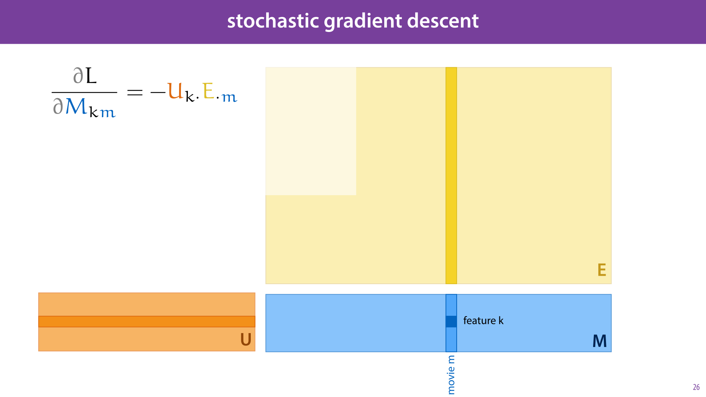

            <figcaption>
            
When we look at the update for the movie, we see the opposite. If the same thing happened: the user and the movie both have a high k-th value, we assume both are romantic, we give the pair a high rating and get a negative error, then we end up making the movie less romantic, since we are treating the romanticness of the user as a given. 

In practice, of course, we apply both update rules. So both the movie and the user end up getting a little less romantic. 

            </figcaption>
            click image for animation
       </section>

       <section id="slide-027">
            <a class="slide-link" href="https://mlvu.github.io/embeddingmodels#slide-027" title="Link to this slide.">link here</a>
            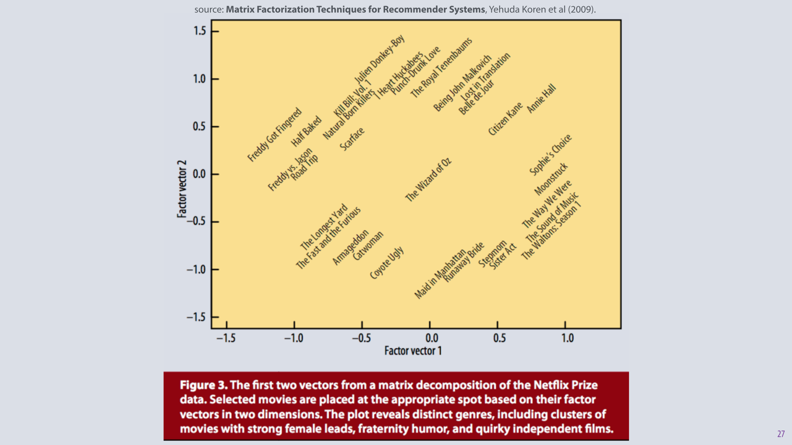

            <figcaption>
            
The remarkable thing is that if we train a model like this, we find that in our embedding space, various directions correspond to high-level semantic concepts.  

source: <a href="https://datajobs.com/data-science-repo/Recommender-Systems-%5BNetflix%5D.pdf"><strong>Matrix Factorization Techniques for Recommender Systems</strong></a>, Yehuda Koren et al (2009).

            </figcaption>
       </section>

       <section id="slide-028" class="anim">
            <a class="slide-link" href="https://mlvu.github.io/embeddingmodels#slide-028" title="Link to this slide.">link here</a>
            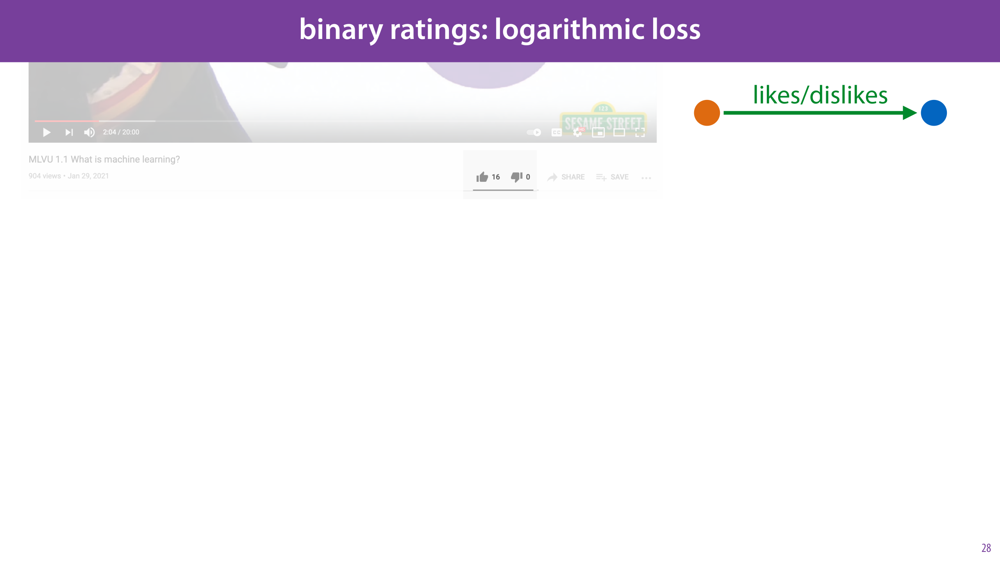

            <figcaption>
            
If the rating system is binary, like the like/dislike on Youtube and Netflix, then the scores for each user/item pair are best understood as <strong>classes</strong>.  

We can turn our dot product score into a binary class by applying a sigmoid to the dot product and applying a logarithmic loss. We interpret the value after the sigmoid as the probabiltiy that the user will like the movie, and 1 minus that value as the probability that the user will dislike the movie, and we take the negative logarithm of the probability of the correct option as our loss. 
<aside    >This is exactly what we did when we developed linear regression. The only difference is that there, the value going into the sigmoid was the dot product of some fixed features and one learnable vector, and here, it's the dot product of two learnable vectors. We also have a bias term in linear regression, but we'll see in the next part that recommenders can also benefit from bias terms.</aside><aside    ></aside>
            </figcaption>
            click image for animation
       </section>

       <section id="slide-029">
            <a class="slide-link" href="https://mlvu.github.io/embeddingmodels#slide-029" title="Link to this slide.">link here</a>
            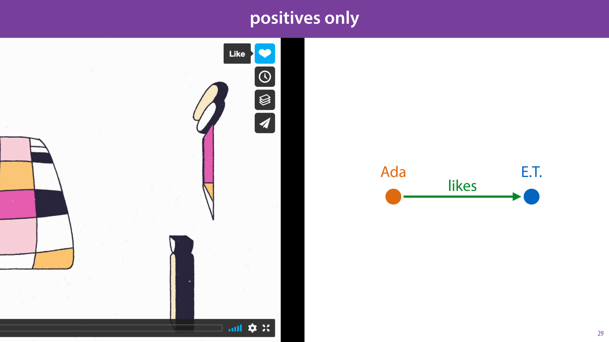

            <figcaption>
            
In many modern recommender systems, we <strong>only get positive ratings</strong>. You can “like” something, but you can’t dislike it or assign a number. 

The benefit of such rating systems is that users are much more likely to give ratings. First, because it’s less work, and second because it has a direct benefit for the user: they’re not just doing it to improve their recommendations (which they may not care about), they are effectively<strong> bookmarking </strong>the things they like, so that they can easily find them again. Thus you’re likely to get many more ratings if you build your system this way. 

The downside is that the modeling task is much more complicated. It’s like a classification task where the only labels you get are positive and <em>unknown</em>. For the unknowns, you don’t know how many positives there are, and how many negatives. We are essentially hiding the negative ratings by not giving users a button for that. 

If we just optimize the score function to be as big as possible for the known likes, then there’s nothing stopping the system from making the ratings as high as it can for all user/movie pairs. 

            </figcaption>
       </section>

       <section id="slide-030">
            <a class="slide-link" href="https://mlvu.github.io/embeddingmodels#slide-030" title="Link to this slide.">link here</a>
            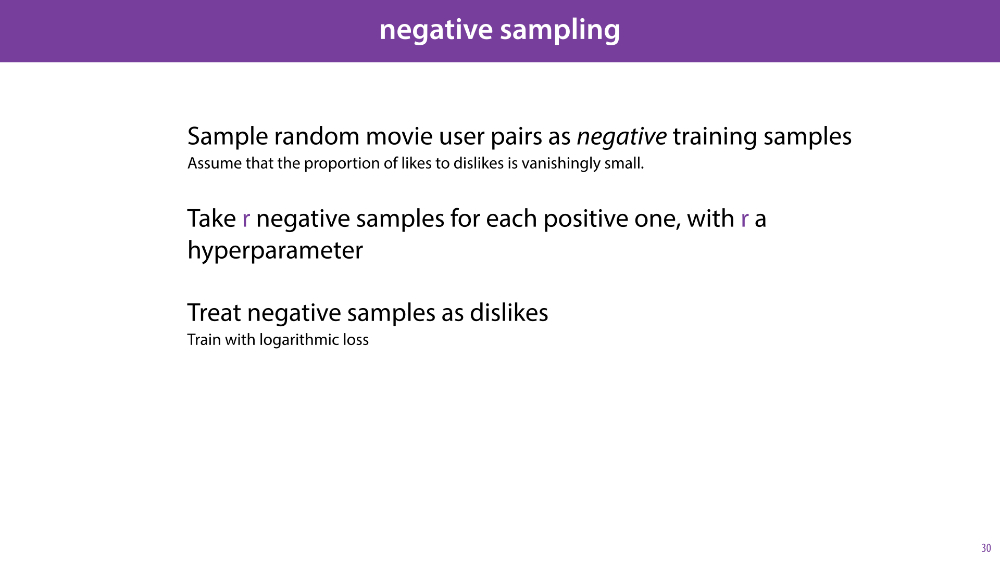

            <figcaption>
            
A common, simple and very effective trick to solve this problem is <strong>negative sampling</strong>. 

We sample random pairs of users and items and <em>assume </em>that these are negatives. Usually the proportion of positive user/movie pairs is vanishingly small compared to the proportion of pairs that are negative, or pairs for which the users are ambivalent, so if we sample a random pair, we can be almost certain that the user won’t like the movie. 

With these negative samples in hand, we can treat the problem as a binary classification problem again  and re-use what we learned for class-labeled ratings.

            </figcaption>
       </section>

       <section id="slide-031">
            <a class="slide-link" href="https://mlvu.github.io/embeddingmodels#slide-031" title="Link to this slide.">link here</a>
            

            <figcaption>
            
So far, we’ve assumed that we don’t have any information about users and movies by themselves: only the links between them. In practice, this isn’t true at all: Netflix has lots of extra information about both the users and the movies in its database. It’s just that we’ve assumed that the ratings are the most informative, so that we should start there. 

Of course, ideally, we don’t want to dismiss any information we have. In the next video, we’ll look at how we can extend a recommendation system with extra sources of information.

            </figcaption>
       </section>

        <section class="video" id="video-031">
            <a class="slide-link" href="https://mlvu.github.io/embeddingmodels#video-31">link here</a>
           <video controls>
                <source src="https://pbm.thegood.cloud/s/YDggLqknFCJ6GKF/download/MLVU%2012.2_%20Improving%20recommender%20systems.mp4" type="video/mp4" />

                Download the <a href="https://pbm.thegood.cloud/s/YDggLqknFCJ6GKF/download/MLVU%2012.2_%20Improving%20recommender%20systems.mp4">video</a>.
           </video>
        </section>

       <section id="slide-032">
            <a class="slide-link" href="https://mlvu.github.io/embeddingmodels#slide-032" title="Link to this slide.">link here</a>
            

            <figcaption>
            
In this video, we’ll look at how we can take the basic model from the last video, and extend it to improve its performance. 

 

            </figcaption>
       </section>

       <section id="slide-033">
            <a class="slide-link" href="https://mlvu.github.io/embeddingmodels#slide-033" title="Link to this slide.">link here</a>
            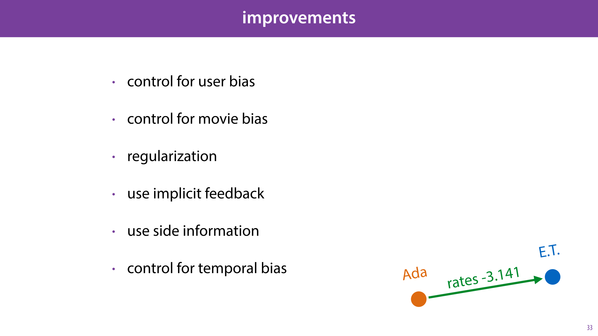

            <figcaption>
            
These are the topics we’ll deal with. 

Most of these tricks are based on the system that ultimately won the Netflix prize, so we’ll assume that we have numeric ratings.

            </figcaption>
       </section>

       <section id="slide-034">
            <a class="slide-link" href="https://mlvu.github.io/embeddingmodels#slide-034" title="Link to this slide.">link here</a>
            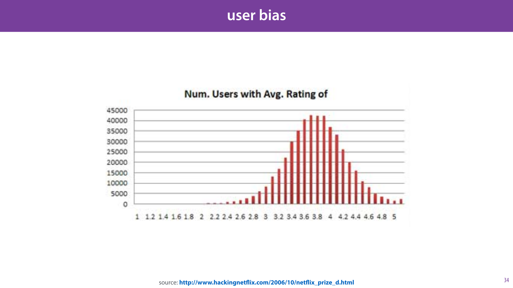

            <figcaption>
            
The average rating for each user is different. Some users are very positive, giving almost every movie 5 stars, and some give almost every movie less than 3 stars. 

If we can explicitly model the bias of a user, it takes some of the pressure off the matrix factorisation, which then only needs to predict how much a user will <strong>deviate </strong>from their average rating for a particular movie. 

            </figcaption>
       </section>

       <section id="slide-035">
            <a class="slide-link" href="https://mlvu.github.io/embeddingmodels#slide-035" title="Link to this slide.">link here</a>
            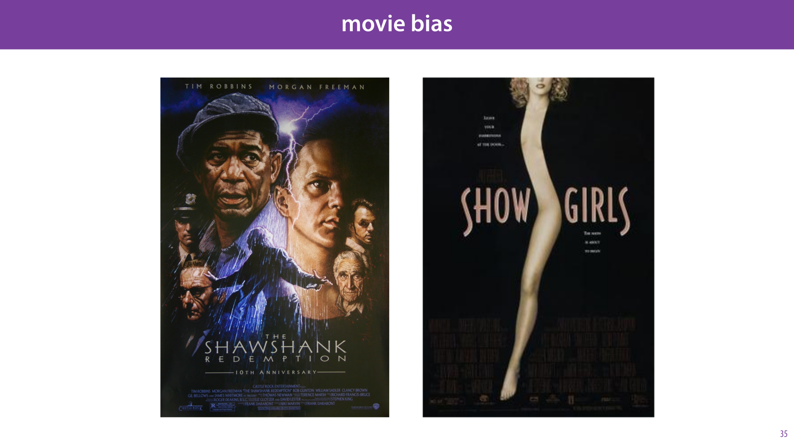

            <figcaption>
            
The same is true for movies. Some movies are universally liked, and some are universally loathed.

            </figcaption>
       </section>

       <section id="slide-036">
            <a class="slide-link" href="https://mlvu.github.io/embeddingmodels#slide-036" title="Link to this slide.">link here</a>
            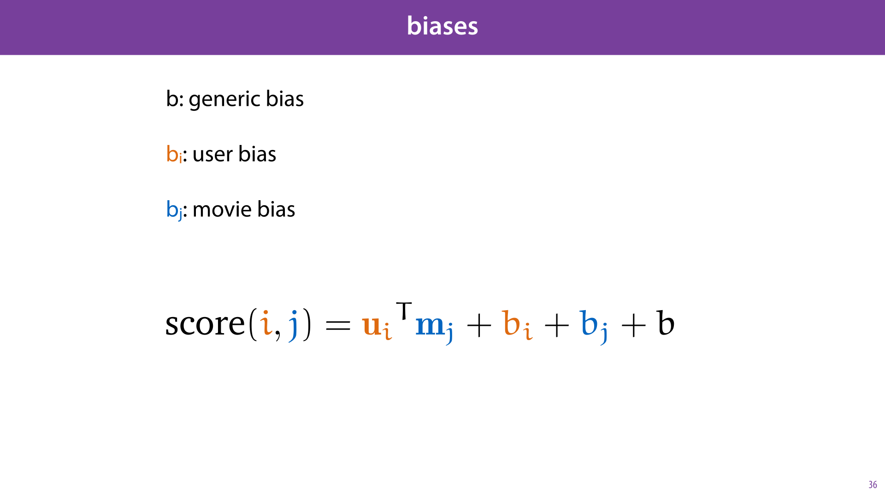

            <figcaption>
            
We model biases by a simple additive scalar (which is learned along with the embeddings): one for each user, one for each movie, and one general bias over all ratings. 

We can think of these parameters as taking some of the weight off the embeddings. If user i is very positive, and we didn’t have bias terms, we’d need to set their embedding so that it’s positive for all movies. With the bias term, the dot product just needs to model the distance to the user’s average rating.

            </figcaption>
       </section>

       <section id="slide-037" class="anim">
            <a class="slide-link" href="https://mlvu.github.io/embeddingmodels#slide-037" title="Link to this slide.">link here</a>
            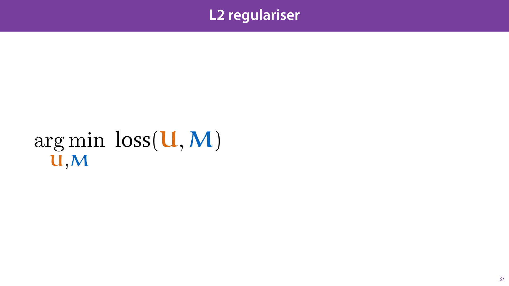

            <figcaption>
            
The more weights we add for the users and the movies, the more likely our model is to overfit. If this is a danger, then it may help to regularize a little. We can to this by a simple regularization term over the parameters.

            </figcaption>
            click image for animation
       </section>

       <section id="slide-038">
            <a class="slide-link" href="https://mlvu.github.io/embeddingmodels#slide-038" title="Link to this slide.">link here</a>
            

            <figcaption>
            
One big problem in recommender systems is the <strong>cold start problem</strong>. When a new user joins Netflix, or a new movie is added to the database, we have no ratings for them, so the matrix factorization has nothing to build an embedding on. 

In this case we have to rely on implicit feedback and side information, to suggest the users their first movies.

            </figcaption>
       </section>

       <section id="slide-039">
            <a class="slide-link" href="https://mlvu.github.io/embeddingmodels#slide-039" title="Link to this slide.">link here</a>
            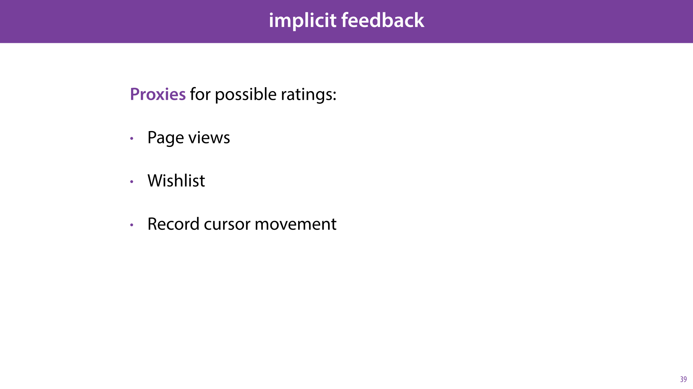

            <figcaption>
            

            </figcaption>
       </section>

       <section id="slide-040">
            <a class="slide-link" href="https://mlvu.github.io/embeddingmodels#slide-040" title="Link to this slide.">link here</a>
            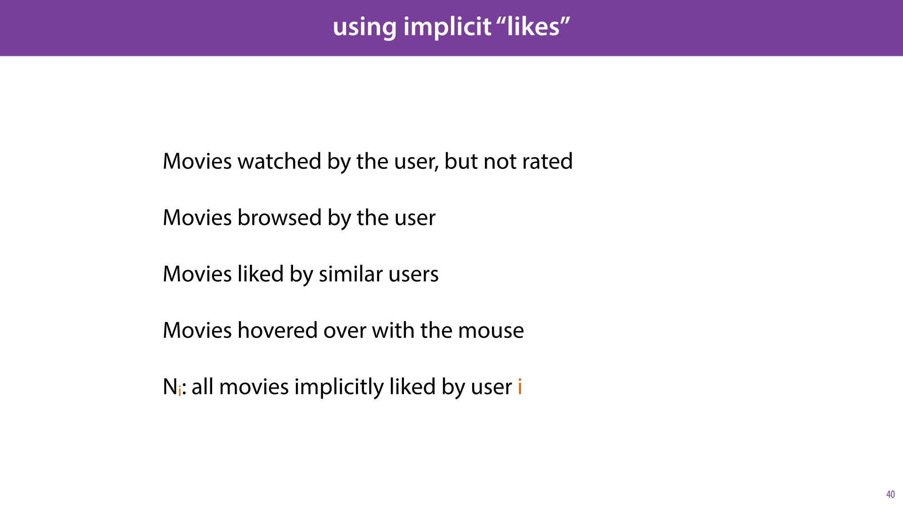

            <figcaption>
            
All of these are useful information, but we don’t want to treat them the same as our regular ratings. Ultimately, they’re much less reliable and they should be interpreted differently.

            </figcaption>
       </section>

       <section id="slide-041">
            <a class="slide-link" href="https://mlvu.github.io/embeddingmodels#slide-041" title="Link to this slide.">link here</a>
            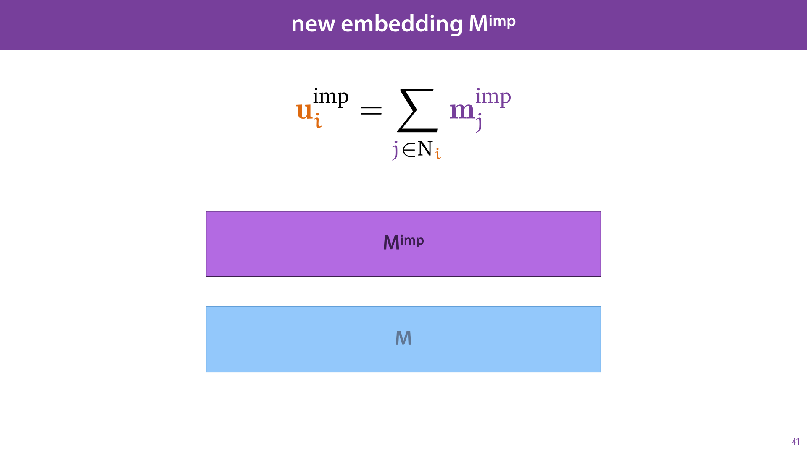

            <figcaption>
            
There are different ways of handling this problem, but this is the method used in the system that won the Netflix prize. 

We add a  second matrix of movie embeddings <strong>M</strong>imp, and then compute a new user embedding which is the sum of the x-embeddings of all the movies user x has implicitly “liked”. That is, we simply sum up the embeddings of all the movies the user has in some way been associated with. This sum functions as a second embedding for the user i. 

Ni is the set of movies with which user i is associated through implicit information. 

Note that there is a slightly counter-intuitive step here: we are learning <em>movie</em> embeddings, but their only function is to become a representation of the <em>user</em>. 

            </figcaption>
       </section>

       <section id="slide-042">
            <a class="slide-link" href="https://mlvu.github.io/embeddingmodels#slide-042" title="Link to this slide.">link here</a>
            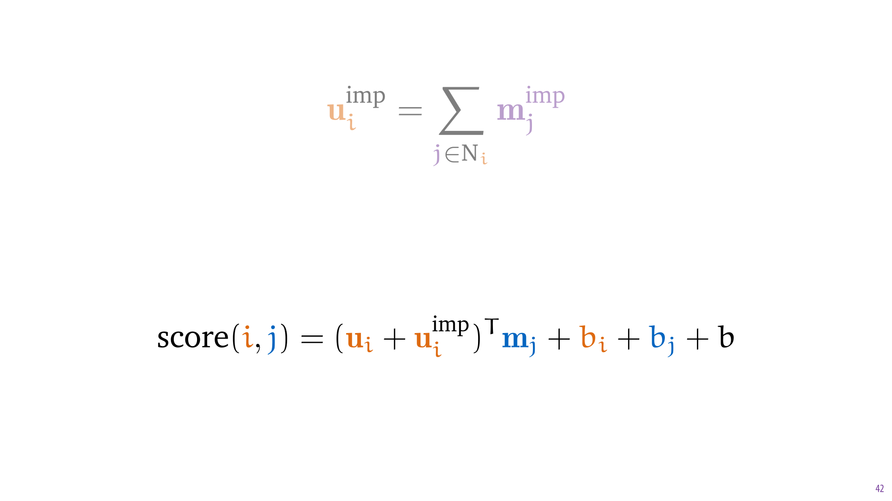

            <figcaption>
            
We then add the implicit-feedback embedding to the existing one before computing the dot product. 

To understand what’s happening, let’s look at the edge cases. If the implicit associations don’t help at all, all embedding vectors mimp will simply go to zero. If they help for some movies but not for others, then only the vectors of some movies will become non-zero. By adding then in this way, we are allowing the system to set non-zero values to the implicit likes only where it helps. 

            </figcaption>
       </section>

       <section id="slide-043">
            <a class="slide-link" href="https://mlvu.github.io/embeddingmodels#slide-043" title="Link to this slide.">link here</a>
            

            <figcaption>
            
As we noted in the last video, we do usually have features for the movies and the users as well, it’s just that the ratings are more predictive. Can we use the features for the users and movies to boost our performance, and to help with the cold start problem?

            </figcaption>
       </section>

       <section id="slide-044">
            <a class="slide-link" href="https://mlvu.github.io/embeddingmodels#slide-044" title="Link to this slide.">link here</a>
            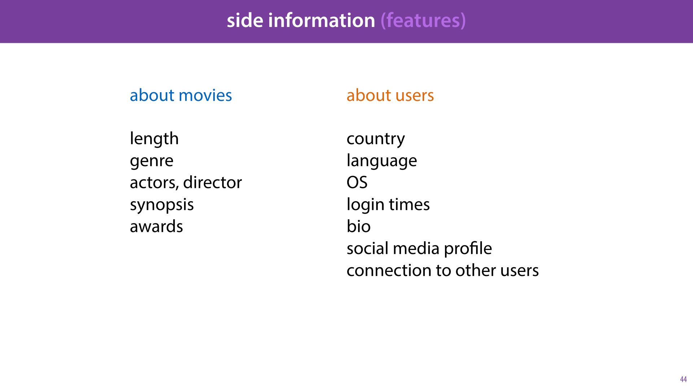

            <figcaption>
            
Here’s some of the information we may have for users and movies. 

This is essentially gives us two instance/feature matrices like those we’ve seen already in the classic machine learning tasks like classification and regression. One for the movies and one for the users. 

The challenge is to integrate this with the ratings, so that we can extend the relatively sparse information we get from those by generalising over the sets of users and movies.

            </figcaption>
       </section>

       <section id="slide-045">
            <a class="slide-link" href="https://mlvu.github.io/embeddingmodels#slide-045" title="Link to this slide.">link here</a>
            

            <figcaption>
            
To simplify things, we’ll assume all features are<em> binary categories</em>: the feature applies or it doesn’t.

            </figcaption>
       </section>

       <section id="slide-046">
            <a class="slide-link" href="https://mlvu.github.io/embeddingmodels#slide-046" title="Link to this slide.">link here</a>
            

            <figcaption>
            
We follow the same logic as we did before, for the implicit feedback, and add another matrix of embedding vectors: one embedding for each feature that can apply to a user. We sum up all the features that apply to user i and get another representation for the user. 

We then assign each feature an embedding, and sum over all features that apply to the user, creating a third user embedding. 

            </figcaption>
       </section>

       <section id="slide-047">
            <a class="slide-link" href="https://mlvu.github.io/embeddingmodels#slide-047" title="Link to this slide.">link here</a>
            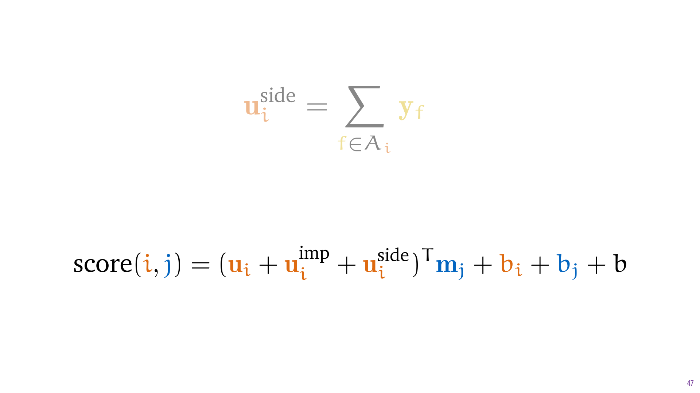

            <figcaption>
            
We add it to the sum inside the dot product. If we have side information for the movies, we apply the same principle there.

            </figcaption>
       </section>

       <section id="slide-048">
            <a class="slide-link" href="https://mlvu.github.io/embeddingmodels#slide-048" title="Link to this slide.">link here</a>
            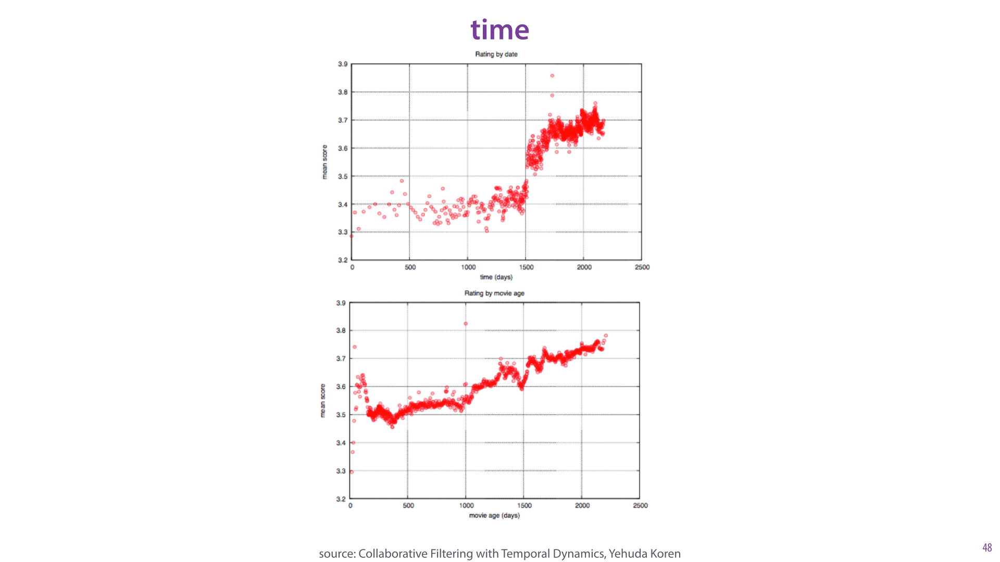

            <figcaption>
            
The Netflix data is not stable over time. It covers about 7 years, and in that time many things have changed. The most radical change comes about four years in, when Netflix changed the meaning of the ratings in words (these appeared in mouseover when you hovered over the ratings). Specifically, they changed the one-star rating from “I didn’t like it” to “I hated it”. Since people are less likely to say that they hate things, the average ratings increased. 

Similarly, if you look at how old a movie is, you see a positive relation to the average rating. Generally, people who watch a really old movie will likely do so because they know it, and want to watch it again. For new movies, more people are likely to be swayed by novelty and advertising. This means that new movies have a temporal bias for lower ratings. 
<aside    >Note that newer ratings are on the left in the bottom plot.</aside><aside    ></aside>
            </figcaption>
       </section>

       <section id="slide-049">
            <a class="slide-link" href="https://mlvu.github.io/embeddingmodels#slide-049" title="Link to this slide.">link here</a>
            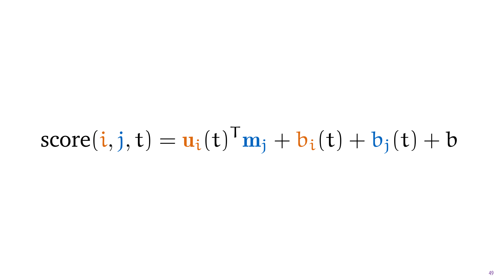

            <figcaption>
            
The solution is to make the biases, and the user embeddings <strong>time dependent</strong>. For the movies we make only the bias time dependent, since the properties of the movie itself stay the same. For user embeddings, we can actually make the embeddings time dependent, since user tastes may change over time.

            </figcaption>
       </section>

       <section id="slide-050">
            <a class="slide-link" href="https://mlvu.github.io/embeddingmodels#slide-050" title="Link to this slide.">link here</a>
            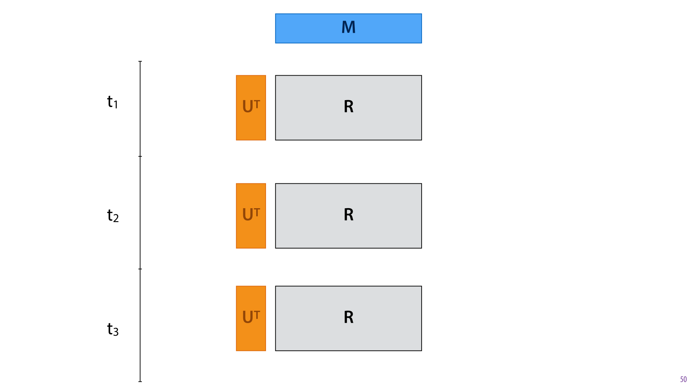

            <figcaption>
            
A very practical way to do this is just to cut time into a small number of chunks and learn a separate embedding for each chunk. Note that all the matrices stay the same size. There are just fewer ratings in <strong>R</strong>. 

The number of chunks is a tradeoff: the more chunks we cut time into, the more precisely we can model the time-dependency, but the worse our individual embeddings get, since we have less and less data per chunk. 

            </figcaption>
       </section>

       <section id="slide-051">
            <a class="slide-link" href="https://mlvu.github.io/embeddingmodels#slide-051" title="Link to this slide.">link here</a>
            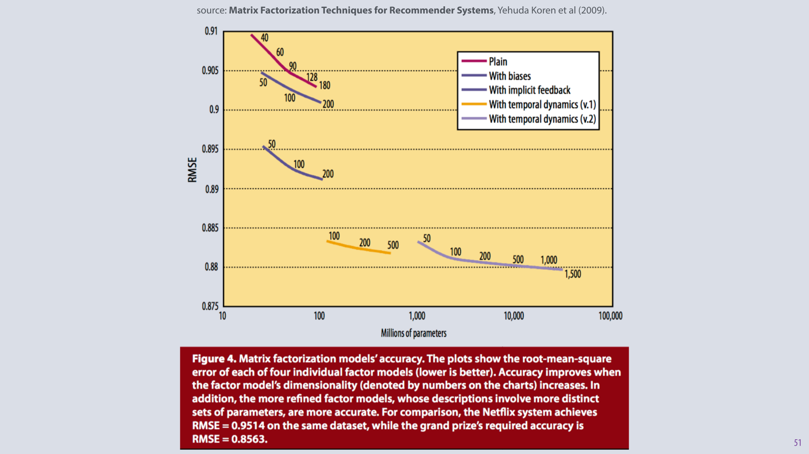

            <figcaption>
            
Here is how the different additions to the basic matrix factorization ultimately served to reduce the RMSE to the point that won the authors the Netflix prize.

            </figcaption>
       </section>

       <section id="slide-052">
            <a class="slide-link" href="https://mlvu.github.io/embeddingmodels#slide-052" title="Link to this slide.">link here</a>
            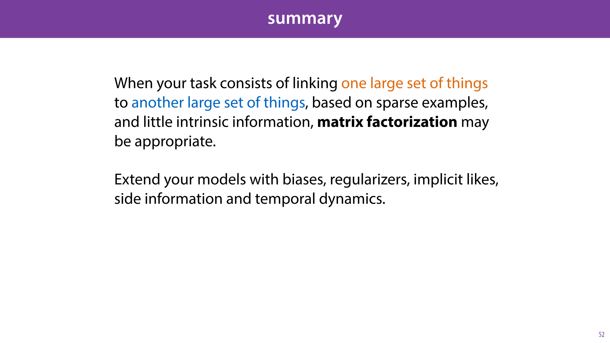

            <figcaption>
            

            </figcaption>
       </section>

       <section id="slide-053">
            <a class="slide-link" href="https://mlvu.github.io/embeddingmodels#slide-053" title="Link to this slide.">link here</a>
            

            <figcaption>
            
That’s it for recommendation. In the last videos in the lecture we’ll take a few quick looks at other places where embedding models can give us a new perspective, and we’ll finish up with some general notes on how to validate embedding models

            </figcaption>
       </section>

        <section class="video" id="video-053">
            <a class="slide-link" href="https://mlvu.github.io/embeddingmodels#video-53">link here</a>
           <video controls>
                <source src="https://pbm.thegood.cloud/s/qCdyF4SPifTzSYm/download/MLVU%2012.3_%20PCA%20revisited.mp4" type="video/mp4" />

                Download the <a href="https://pbm.thegood.cloud/s/qCdyF4SPifTzSYm/download/MLVU%2012.3_%20PCA%20revisited.mp4">video</a>.
           </video>
        </section>

       <section id="slide-054">
            <a class="slide-link" href="https://mlvu.github.io/embeddingmodels#slide-054" title="Link to this slide.">link here</a>
            

            <figcaption>
            
 

            </figcaption>
       </section>

       <section id="slide-055" class="anim">
            <a class="slide-link" href="https://mlvu.github.io/embeddingmodels#slide-055" title="Link to this slide.">link here</a>
            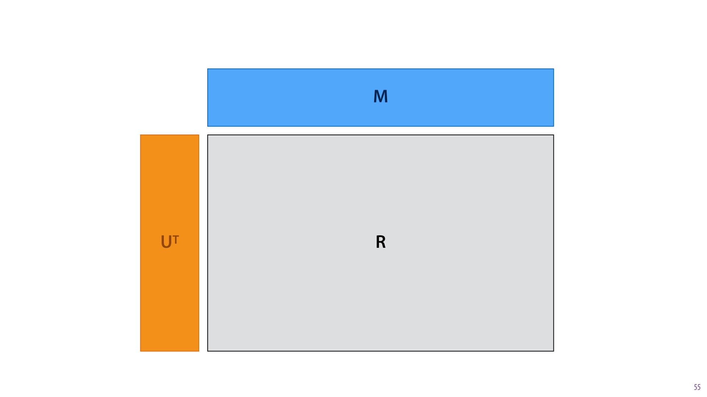

            <figcaption>
            
In the previous video, we saw that we could get embeddings by thinking of our data as a big matrix, and decomposing it into matrics of embeddings. 

We can think of this as two traditional data matrices in one: if we consider the users as instances, then the movies are a big set of binary features. If we consider the movies as instances, then which users they are liked by are their features.

            </figcaption>
            click image for animation
       </section>

       <section id="slide-056" class="anim">
            <a class="slide-link" href="https://mlvu.github.io/embeddingmodels#slide-056" title="Link to this slide.">link here</a>
            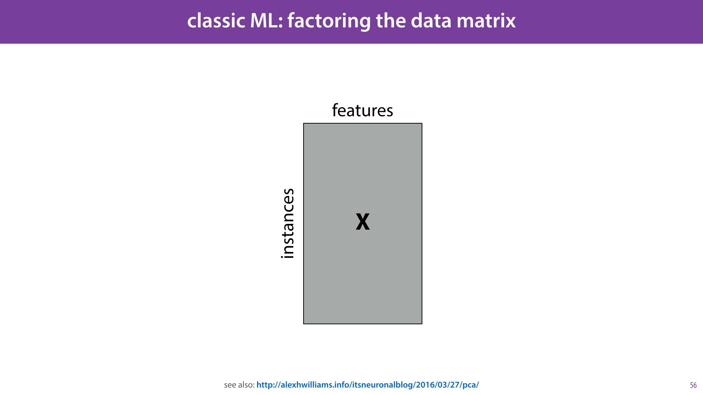

            <figcaption>
            
In the classical machine learning setting, our data can also be seen as a matrix (usually with an instance per row, and a feature per column.  

What would happen if we apply matrix factorization to this matrix? 

NB: In the following we’ll assume that the data have been mean-subtracted (the mean over all rows has been subtracted from each row).

            </figcaption>
            click image for animation
       </section>

       <section id="slide-057">
            <a class="slide-link" href="https://mlvu.github.io/embeddingmodels#slide-057" title="Link to this slide.">link here</a>
            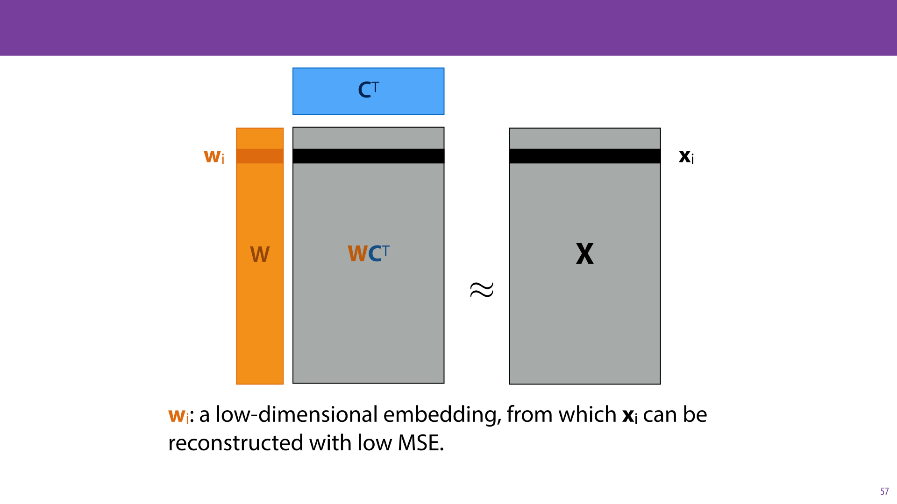

            <figcaption>
            
If we apply the same principle as we did with the recommender system, we are looking for two matrices, W and C: the first containing “embeddings” for our instances and the second “embeddings” for our features, such that their dot product reconstructs, as much as possible, the value of a particular feature for a particular matrix. 

If we do this succesfully,we get a dimensionality reduction. One based on a linear transformation.

            </figcaption>
       </section>

       <section id="slide-058">
            <a class="slide-link" href="https://mlvu.github.io/embeddingmodels#slide-058" title="Link to this slide.">link here</a>
            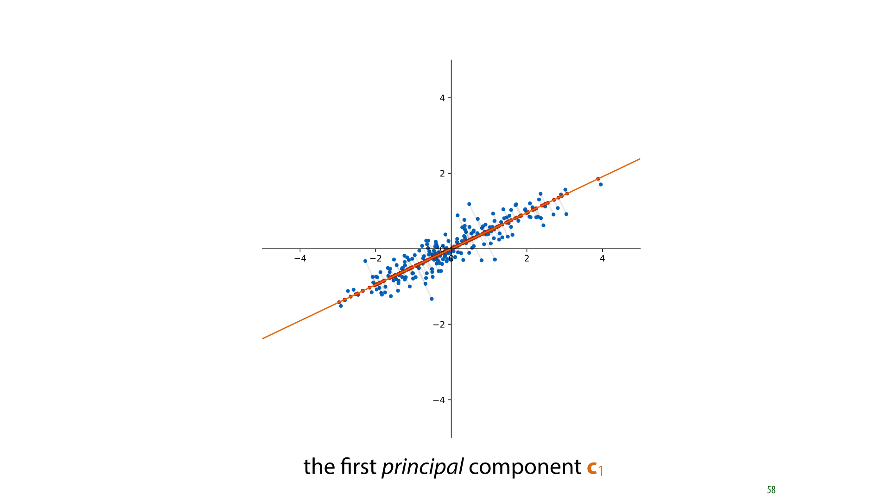

            <figcaption>
            
Our first dimensionality reduction method, PCA, was also based on a linear transformation.

            </figcaption>
       </section>

       <section id="slide-059">
            <a class="slide-link" href="https://mlvu.github.io/embeddingmodels#slide-059" title="Link to this slide.">link here</a>
            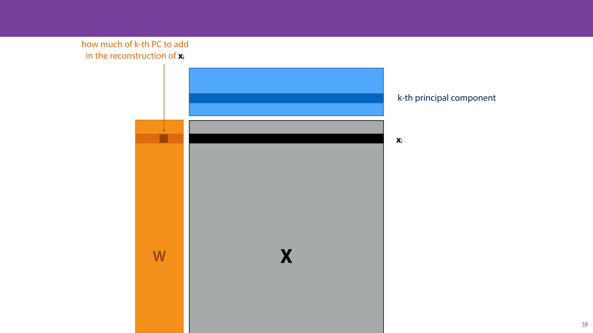

            <figcaption>
            

            </figcaption>
       </section>

       <section id="slide-060">
            <a class="slide-link" href="https://mlvu.github.io/embeddingmodels#slide-060" title="Link to this slide.">link here</a>
            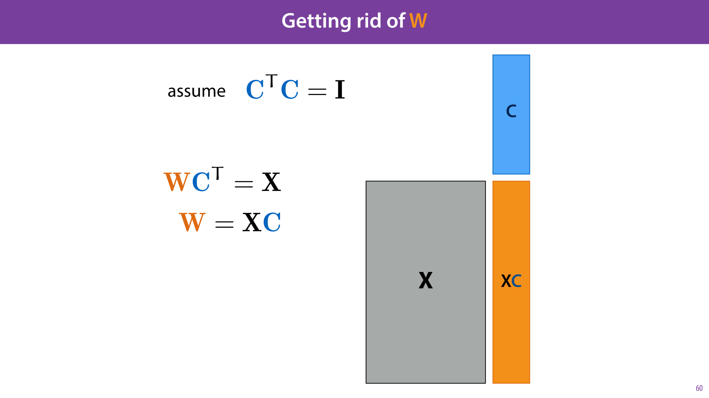

            <figcaption>
            
In PCA, we assume that the principal components were unit vectors and orthogonal to each other. We can do the  

 by assuming that the columns of C are linearly independent. In this case, we can rewrite W in terms of  C,and reduce the parameters of the model to just the “feature embeddings”.

            </figcaption>
       </section>

       <section id="slide-061" class="anim">
            <a class="slide-link" href="https://mlvu.github.io/embeddingmodels#slide-061" title="Link to this slide.">link here</a>
            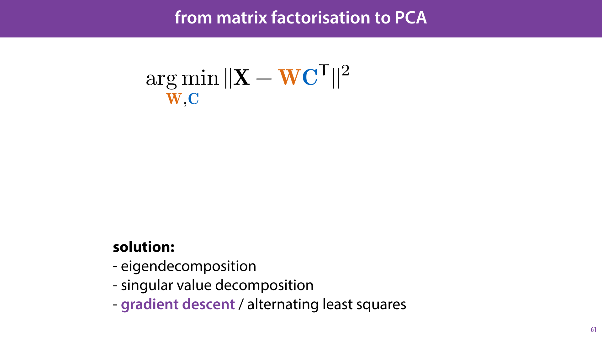

            <figcaption>
            
This gives us a constrained optimisation problem that is very close to PCA. It’s not entirely equivalent, but PCA is one of the solutions to this problem. 

 

See: <a href="http://peterbloem.nl/blog/pca-2"><strong>peterbloem.nl/blog/pca-2</strong></a> for the full story.

            </figcaption>
            click image for animation
       </section>

       <section id="slide-062">
            <a class="slide-link" href="https://mlvu.github.io/embeddingmodels#slide-062" title="Link to this slide.">link here</a>
            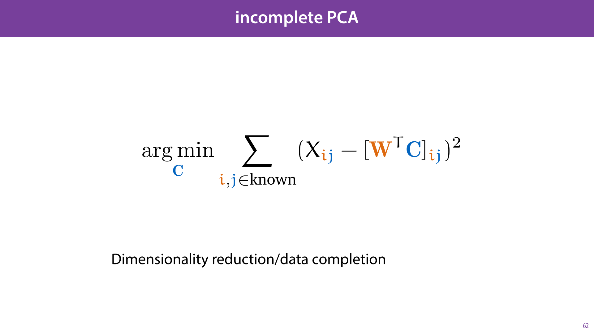

            <figcaption>
            
This perspective e allows us to modify the PCA objective with the tricks we’ve seen in the recommender setting. 

 For instance, if our data has<strong> missing values</strong>, we can focus the optimization only on the known values, giving us a mixture of dimensionality reduction and data completion. 

We can then learn on the low-dimensional representations, or reconstruct the data to give us imputations for the missing data

            </figcaption>
       </section>

       <section id="slide-063">
            <a class="slide-link" href="https://mlvu.github.io/embeddingmodels#slide-063" title="Link to this slide.">link here</a>
            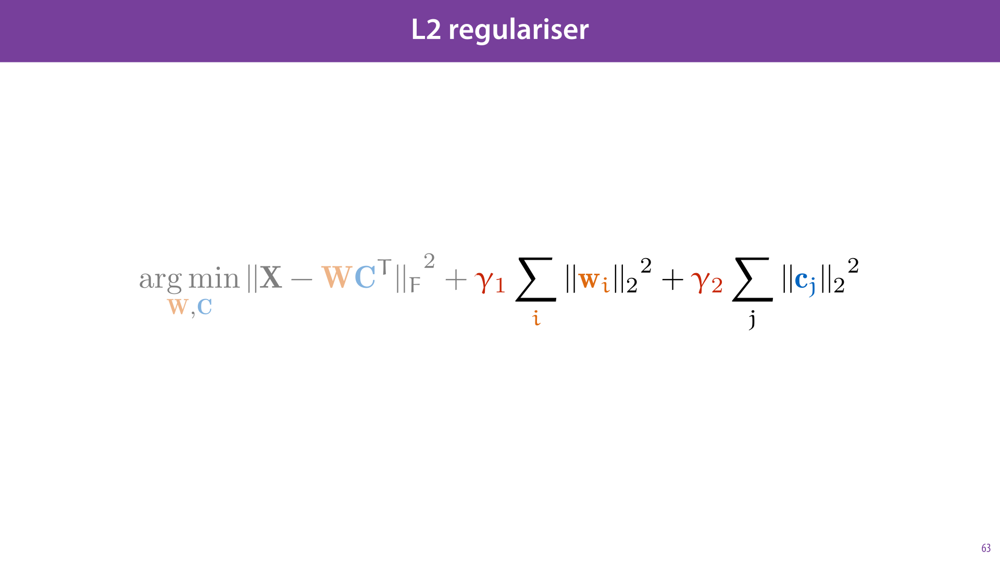

            <figcaption>
            
We can also add a regularizer to constrain the complexity of our embeddings.

            </figcaption>
       </section>

       <section id="slide-064">
            <a class="slide-link" href="https://mlvu.github.io/embeddingmodels#slide-064" title="Link to this slide.">link here</a>
            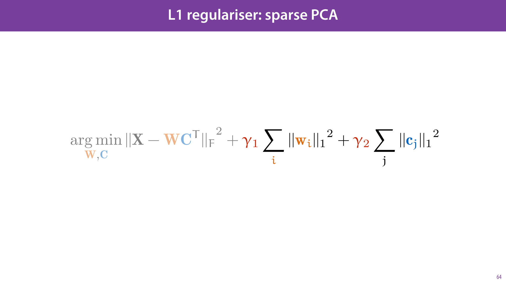

            <figcaption>
            
An L1 regularizer, as we know, promotes sparse models: models for which parameters are exactly zero. In this case that means that our embeddings are more likely to contain zeroes, which can make it easier to interpret the results.

            </figcaption>
       </section>

       <section id="slide-065">
            <a class="slide-link" href="https://mlvu.github.io/embeddingmodels#slide-065" title="Link to this slide.">link here</a>
            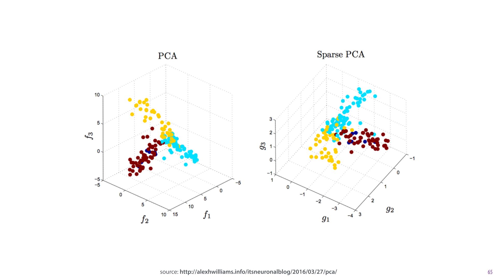

            <figcaption>
            
Here’s an example of a dataset reduced to 3D. It’s a bit difficult to see, but the points in the sparse PCA should be more axis aligned.

            </figcaption>
       </section>

       <section id="slide-066">
            <a class="slide-link" href="https://mlvu.github.io/embeddingmodels#slide-066" title="Link to this slide.">link here</a>
            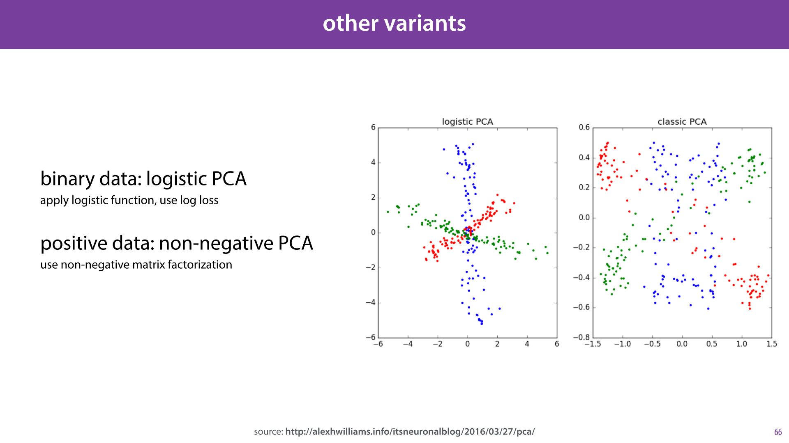

            <figcaption>
            
If our data has binary values, then we can reduce it with the same trick we saw before: apply a sigmoid and fit the log loss. As you can see on the right, this often gives us much better separation in the reduced dimensionality. 

If we have binary data that is largely missing, for which we only know some of the postives, non-negative matrix factorization gives us non-negative PCA.

            </figcaption>
       </section>

       <section id="slide-067">
            <a class="slide-link" href="https://mlvu.github.io/embeddingmodels#slide-067" title="Link to this slide.">link here</a>
            

            <figcaption>
            

            </figcaption>
       </section>

        <section class="video" id="video-067">
            <a class="slide-link" href="https://mlvu.github.io/embeddingmodels#video-67">link here</a>
           <video controls>
                <source src="https://pbm.thegood.cloud/s/WH39wmexKkRrEFS/download/MLVU%2012.4_%20Graph%20models.mp4" type="video/mp4" />

                Download the <a href="https://pbm.thegood.cloud/s/WH39wmexKkRrEFS/download/MLVU%2012.4_%20Graph%20models.mp4">video</a>.
           </video>
        </section>

       <section id="slide-068">
            <a class="slide-link" href="https://mlvu.github.io/embeddingmodels#slide-068" title="Link to this slide.">link here</a>
            

            <figcaption>
            
In this video, we’ll look at how some of these concepts can be applied to graphs. This is a complex subject, so we’ll only give a very high-level overview, without going into many details. 

 

            </figcaption>
       </section>

       <section id="slide-069">
            <a class="slide-link" href="https://mlvu.github.io/embeddingmodels#slide-069" title="Link to this slide.">link here</a>
            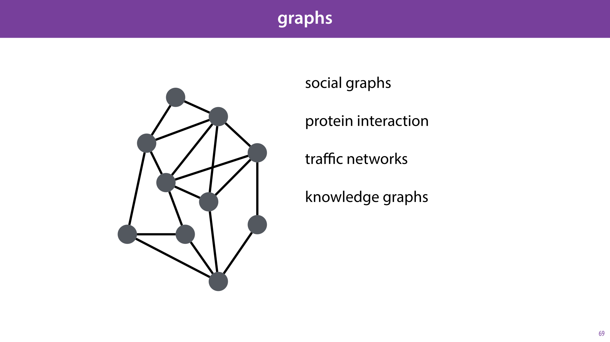

            <figcaption>
            
Graphs are an even more versatile format for capturing  knowledge than matrices and tensors. Many of the most interesting datasets come in the form of graphs.

            </figcaption>
       </section>

       <section id="slide-070">
            <a class="slide-link" href="https://mlvu.github.io/embeddingmodels#slide-070" title="Link to this slide.">link here</a>
            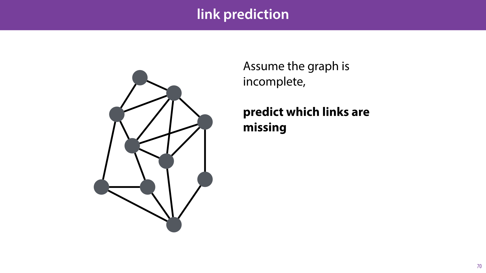

            <figcaption>
            
In link prediction, we assume the graph we see is incomplete (which is usually the case) and we try to predict which nodes should be linked .

            </figcaption>
       </section>

       <section id="slide-071">
            <a class="slide-link" href="https://mlvu.github.io/embeddingmodels#slide-071" title="Link to this slide.">link here</a>
            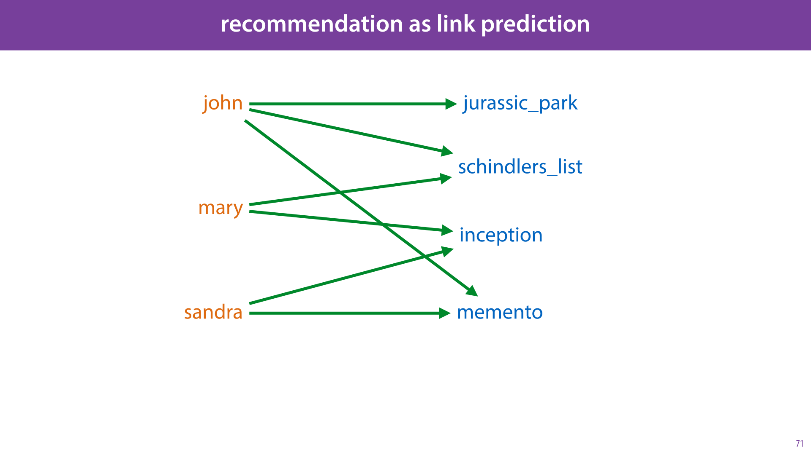

            <figcaption>
            
We can see recommendation as a particular instance of the link prediction problem. Here, the graph is bipartite: we have two different <em>types</em> of nodes (users and movies), and links are always from one type to the other. 

            </figcaption>
       </section>

       <section id="slide-072">
            <a class="slide-link" href="https://mlvu.github.io/embeddingmodels#slide-072" title="Link to this slide.">link here</a>
            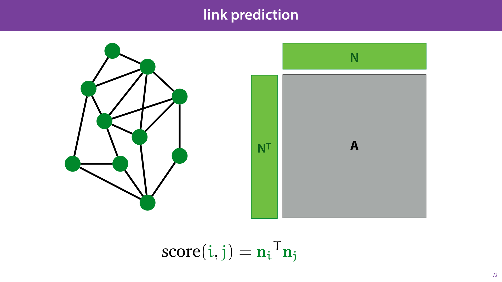

            <figcaption>
            
In general link prediction, we graph may not be bipartite, so we just learn a single embedding matrix for all nodes. We can then compute a score for the likelihood of a link existing in the graph between nodes i and j with the dot product, and train the embeddings to learn the known links, and use them to predict new links. 

This way we can predict which proteins might interact with each other, which people in a social network may be friends (or should be friends) and so on.  

In short, we apply the principle of  matrix factorization to the adjacency matrix of a graph. We can then use all the tricks from the first two videos to optimize our embeddings for the nodes

            </figcaption>
       </section>

       <section id="slide-073">
            <a class="slide-link" href="https://mlvu.github.io/embeddingmodels#slide-073" title="Link to this slide.">link here</a>
            

            <figcaption>
            
Knowledge graphs are graphs where nodes represent concepts or entities, and links are labeled with a relation. It’s a bit like a lot of different recommendation tasks rolled into one.  

Note how the extra knowledge of different relations can potentially help our predictions of other relations. For instance, knowing that John likes Memento, and that Memento is directed by Chrisopher Nolan, may allow us to conclude that John may like Inception at well.

            </figcaption>
       </section>

       <section id="slide-074" class="anim">
            <a class="slide-link" href="https://mlvu.github.io/embeddingmodels#slide-074" title="Link to this slide.">link here</a>
            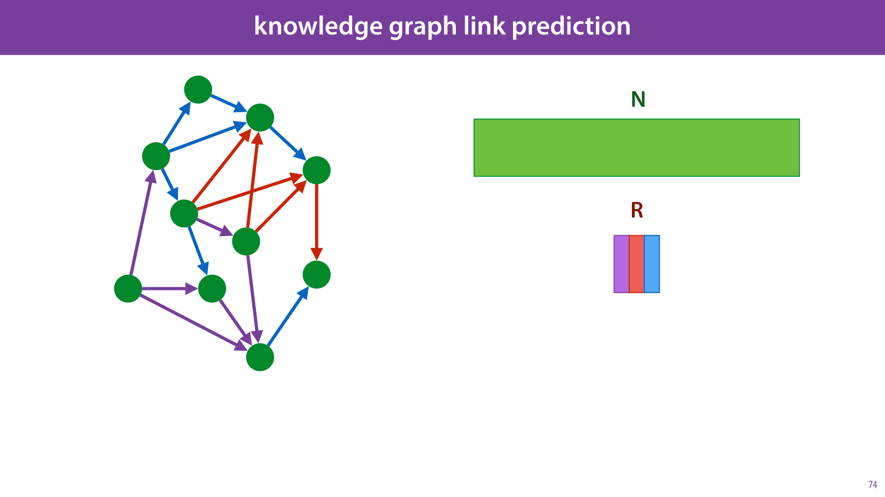

            <figcaption>
            
There are many ways to do link prediction in knowledge graphs, but a very simple approach is to learn node embeddings as before, but to also learn a separate embedding for the different relation types. 

This score function is called “distmult”, but many others exist with differing levels of complexity. 

We can think of this as decomposign a 3-tensor into the product of three embedding matrices. 

            </figcaption>
            click image for animation
       </section>

       <section id="slide-075">
            <a class="slide-link" href="https://mlvu.github.io/embeddingmodels#slide-075" title="Link to this slide.">link here</a>
            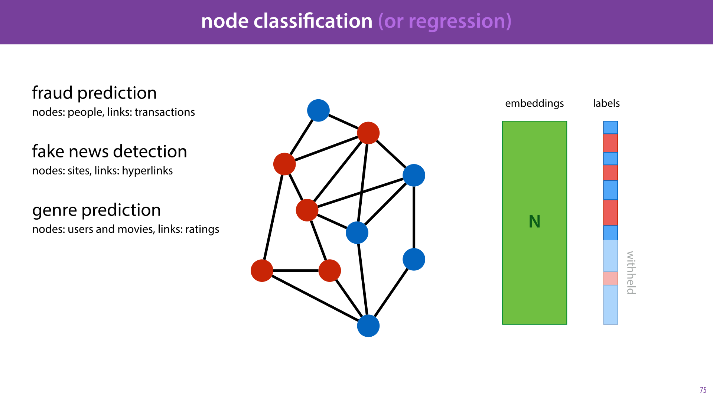

            <figcaption>
            
<strong>Node classification</strong> is another task: for each node, we are given a label, which we should try to predict. 

If we have vector representations for our nodes, we can use those in a regular classifier, but the question is, how do we get those embeddings, and how do we ensure that they capture the required information? 

We can’t just assign node embeddings like before, and apply gradient descent on the classification loss. That would ignore the graph structure entirely and would train each embedding in isolation to produce a particular clasification. We wouldn’t generalize <em>between</em> nodes. 

            </figcaption>
       </section>

       <section id="slide-076" class="anim">
            <a class="slide-link" href="https://mlvu.github.io/embeddingmodels#slide-076" title="Link to this slide.">link here</a>
            

            <figcaption>
            
The principle we will be using to learn/refine our embedding is that of <strong>mixing embeddings</strong>. To develop our intuition, imaging that we assign all nodes random 3D embeddings, with values between 0 and 1. For the purposes of visualization, we can then interpret these as RGB colors. We start with an entirely random color per node. 

We then apply a mixing step: we replace each node color by the mixture (the average) of itself and its direct neighbors. At first, the embeddings express nothing but identity, each node has its own color. After one mixing step, the node embeddings express something about the local graph neighbourhood: a node that is close to many purple nodes will come slightly more purple itself. 

After many mixing steps, all nodes have the same embedding, expressing only information about the entire graph. Somewhere in-between we find a sweet spot: where the embeddings express the node identity, but also the structure of the local graph neighborhood.

            </figcaption>
            click image for animation
       </section>

       <section id="slide-077">
            <a class="slide-link" href="https://mlvu.github.io/embeddingmodels#slide-077" title="Link to this slide.">link here</a>
            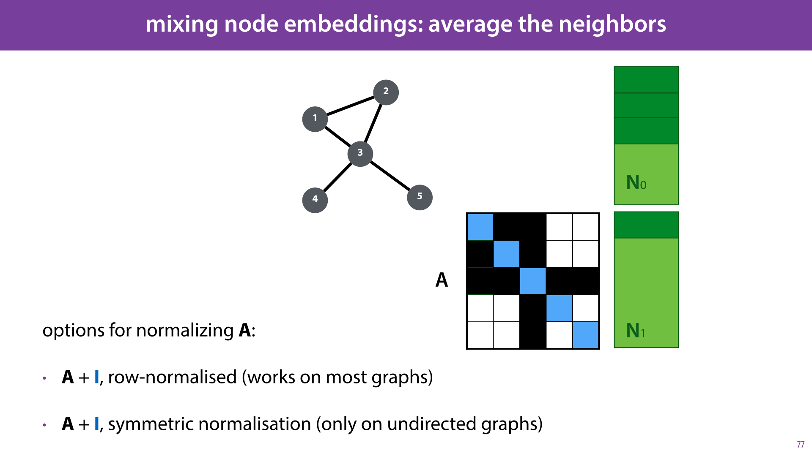

            <figcaption>
            
The simplest way to mix node embeddings is just to make the new node embedding the sum or average of of all the embeddings of the neighbors. 

We can achieve this mixing by multiplying the embedding vector by the adjacency matrix: this results in the sum of the embeddings of the neighbouring nodes. We also add self-loops for every node so that the current embedding stays part of the sum. 

If we sum, the embedding will blow up. with every mixing step. In order to control for this we need to normalize the adjacency matrix. If we row-normalize, we get the average over all neighbours. We can also use a <strong>symmetric normalization</strong>, which leads to a slightly different type of mixing but only works on undirected graphs. 

See this article for more details: <a href="https://tkipf.github.io/graph-convolutional-networks/"><strong>https://tkipf.github.io/graph-convolutional-networks/</strong></a> 

            </figcaption>
       </section>

       <section id="slide-078">
            <a class="slide-link" href="https://mlvu.github.io/embeddingmodels#slide-078" title="Link to this slide.">link here</a>
            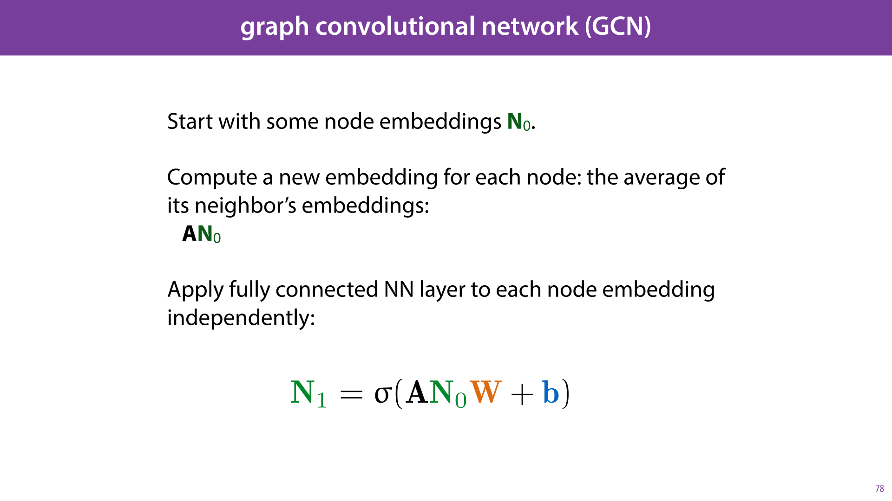

            <figcaption>
            
This is the principle used in graph convolution networks. The word convolution is used because they were inspired by image convolutions, but the connection is loose, so don’t read too much into it. 

The idea is that we start with some node embeddings,  

In order to make the mixing trainable, we add a a multiplication by a weight matrix. This matrix applies a linear projection to the mixed embeddings.  

The sigmoid activation can also be ReLU or linear. What works best depends on the data.

            </figcaption>
       </section>

       <section id="slide-079">
            <a class="slide-link" href="https://mlvu.github.io/embeddingmodels#slide-079" title="Link to this slide.">link here</a>
            

            <figcaption>
            
Applying this principle multiple times leads to a multi-layered structure, where we both mix and transform the initial embeddings. 

The output <strong>O</strong> is a matrix in which each column represents one of our nodes based both on the initial embedding and the local network structure. We can then use the representations i <strong>O</strong> to perform our classification.

            </figcaption>
       </section>

       <section id="slide-080" class="anim">
            <a class="slide-link" href="https://mlvu.github.io/embeddingmodels#slide-080" title="Link to this slide.">link here</a>
            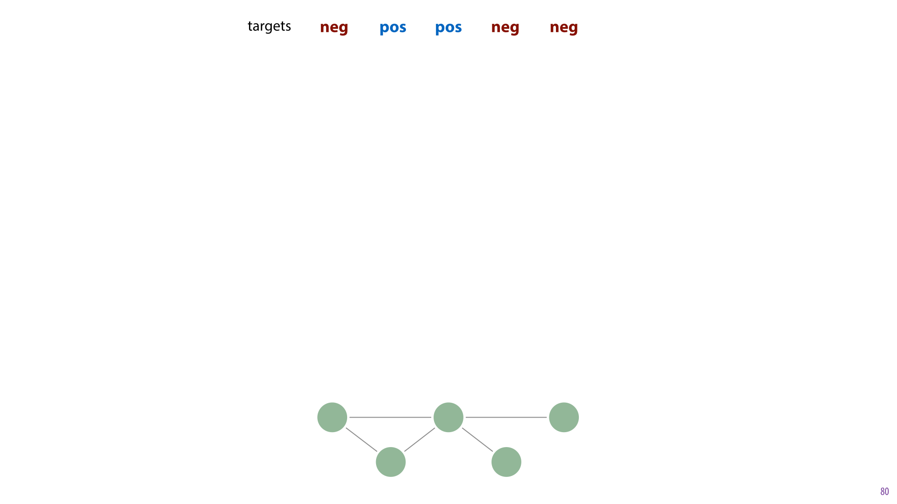

            <figcaption>
            
Here is how we do node classification with graph convolutions. We ensure that the embedding size of the last layer is equal to the number of classes (2 in this case). We then apply a softmax activation to these embeddings and interpret them as probabilities over the classes. 

This gives us a full batch of predictions for the whole data, for which we can compute the loss, which we then backpropagate.

            </figcaption>
            click image for animation
       </section>

       <section id="slide-081">
            <a class="slide-link" href="https://mlvu.github.io/embeddingmodels#slide-081" title="Link to this slide.">link here</a>
            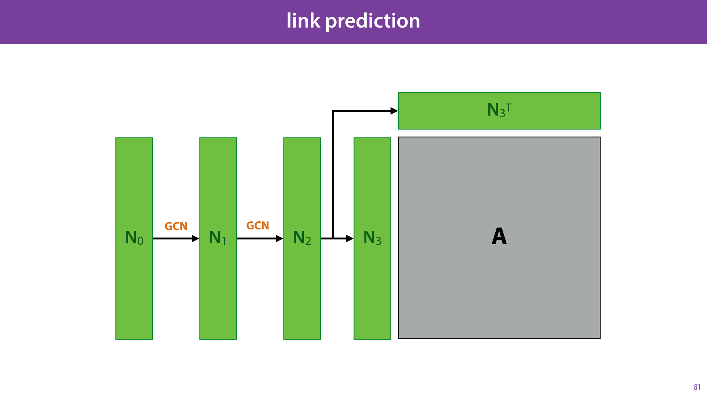

            <figcaption>
            
The mixing trick works for link prediction too. We simply apply a few GCN layers to mix up our embeddings, and then use them to predict our  

When we do link prediction, we can perform some graph convolutions on our embeddings and then multiply them out to generate our predictions. We compare these to our training data, and backpropagate the loss.

            </figcaption>
       </section>

       <section id="slide-082">
            <a class="slide-link" href="https://mlvu.github.io/embeddingmodels#slide-082" title="Link to this slide.">link here</a>
            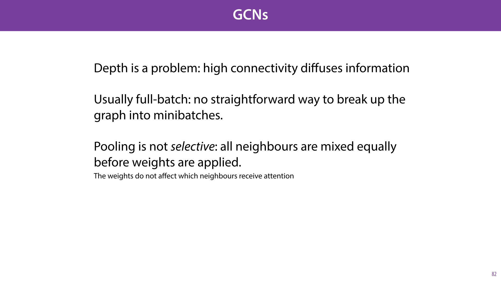

            <figcaption>
            

            </figcaption>
       </section>

        <section class="video" id="video-082">
            <a class="slide-link" href="https://mlvu.github.io/embeddingmodels#video-82">link here</a>
           <video controls>
                <source src="https://pbm.thegood.cloud/s/87yA8FmrYZm4DXD/download/MLVU%2012.5_%20Validation%20of%20embedding%20models.mp4" type="video/mp4" />

                Download the <a href="https://pbm.thegood.cloud/s/87yA8FmrYZm4DXD/download/MLVU%2012.5_%20Validation%20of%20embedding%20models.mp4">video</a>.
           </video>
        </section>

       <section id="slide-083">
            <a class="slide-link" href="https://mlvu.github.io/embeddingmodels#slide-083" title="Link to this slide.">link here</a>
            

            <figcaption>
            
In this video, we’ll look at some of the peculiarities of testing a trained embedding model 

 

            </figcaption>
       </section>

       <section id="slide-084">
            <a class="slide-link" href="https://mlvu.github.io/embeddingmodels#slide-084" title="Link to this slide.">link here</a>
            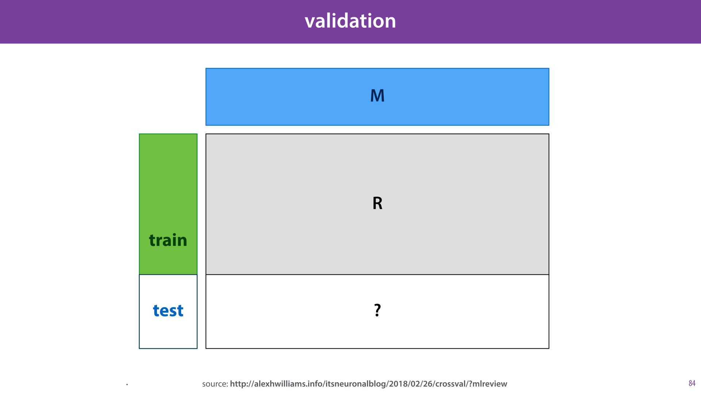

            <figcaption>
            
Ot is important to carefully consider our validation protocol. In other words: how do we withhold test data to train on. 

Let’s start with recommender systems. At first, you might think that it’s a good idea to just withhold some users. 

However, this doesn’t work: if we don’t see the users during training, we won’t learn embeddings for them, which means we can’t generate predictions.

            </figcaption>
       </section>

       <section id="slide-085">
            <a class="slide-link" href="https://mlvu.github.io/embeddingmodels#slide-085" title="Link to this slide.">link here</a>
            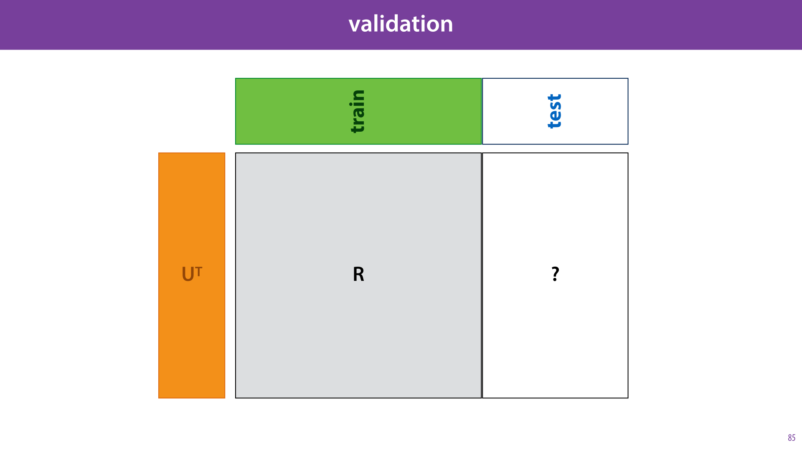

            <figcaption>
            
How about if we withhold some movies? The same thing happens.

            </figcaption>
       </section>

       <section id="slide-086">
            <a class="slide-link" href="https://mlvu.github.io/embeddingmodels#slide-086" title="Link to this slide.">link here</a>
            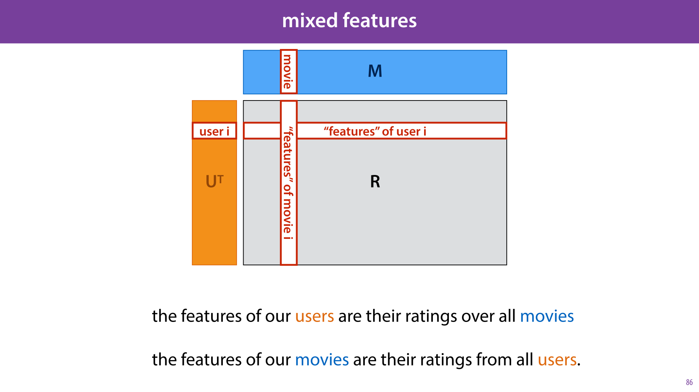

            <figcaption>
            

            </figcaption>
       </section>

       <section id="slide-087" class="anim">
            <a class="slide-link" href="https://mlvu.github.io/embeddingmodels#slide-087" title="Link to this slide.">link here</a>
            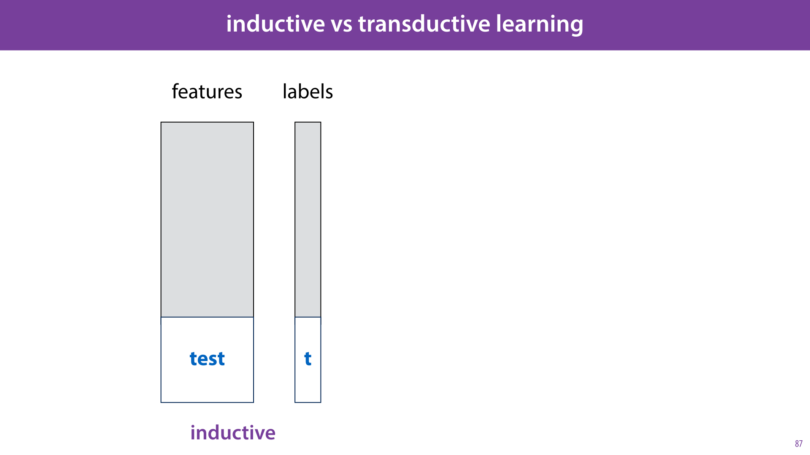

            <figcaption>
            
This is related to the difference between<strong> inductive</strong> and<strong> transductive </strong>learning. I the transduction setting, the learning is allowed to see the features of all data, but the labels of only the training data.

            </figcaption>
            click image for animation
       </section>

       <section id="slide-088">
            <a class="slide-link" href="https://mlvu.github.io/embeddingmodels#slide-088" title="Link to this slide.">link here</a>
            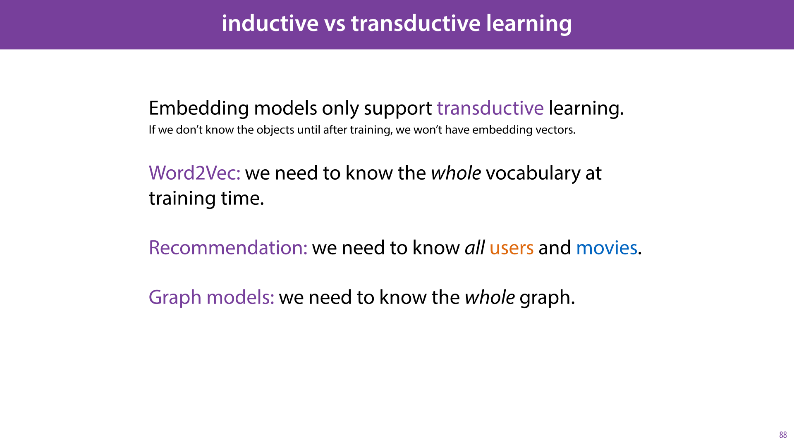

            <figcaption>
            

            </figcaption>
       </section>

       <section id="slide-089">
            <a class="slide-link" href="https://mlvu.github.io/embeddingmodels#slide-089" title="Link to this slide.">link here</a>
            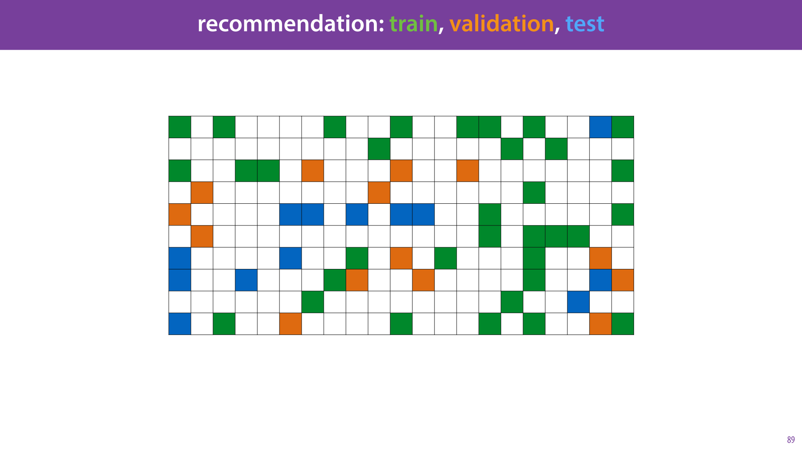

            <figcaption>
            
To evaluate our matrix factorization, we give the training algorithm all users, and all movies, <strong>but withhold some of the ratings</strong>.

            </figcaption>
       </section>

       <section id="slide-090">
            <a class="slide-link" href="https://mlvu.github.io/embeddingmodels#slide-090" title="Link to this slide.">link here</a>
            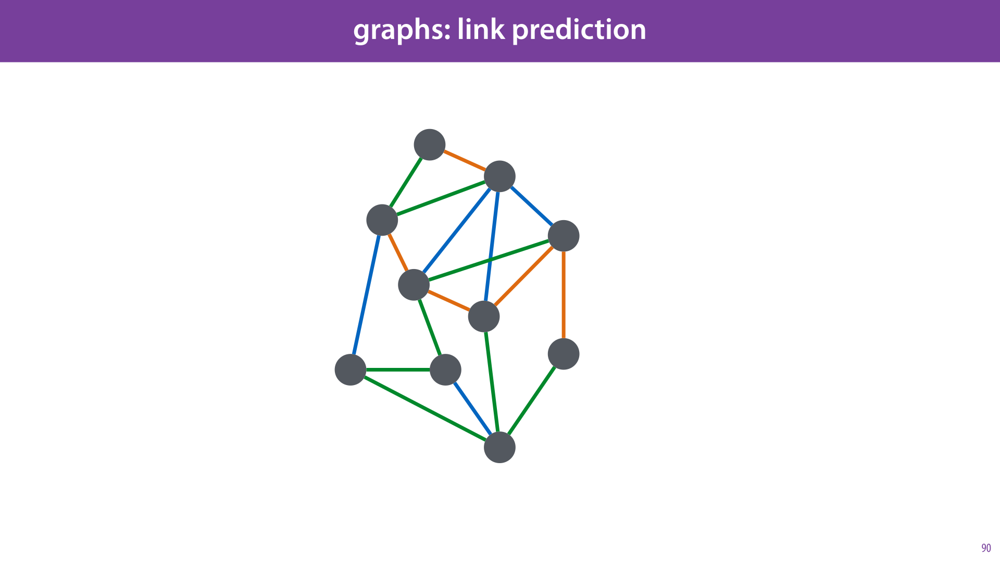

            <figcaption>
            
The same goes for the links.

            </figcaption>
       </section>

       <section id="slide-091">
            <a class="slide-link" href="https://mlvu.github.io/embeddingmodels#slide-091" title="Link to this slide.">link here</a>
            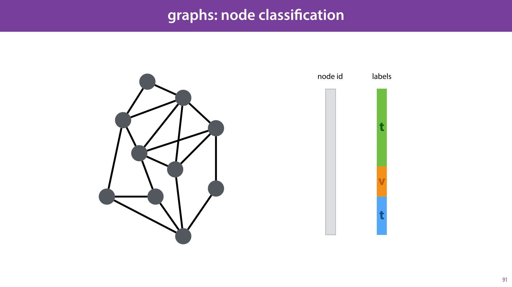

            <figcaption>
            
In the case of node classification, we provide the algorithm with the whole graph, and a table linking the node ids to the labels. In this table, we withhold some of the labels.

            </figcaption>
       </section>

       <section id="slide-092">
            <a class="slide-link" href="https://mlvu.github.io/embeddingmodels#slide-092" title="Link to this slide.">link here</a>
            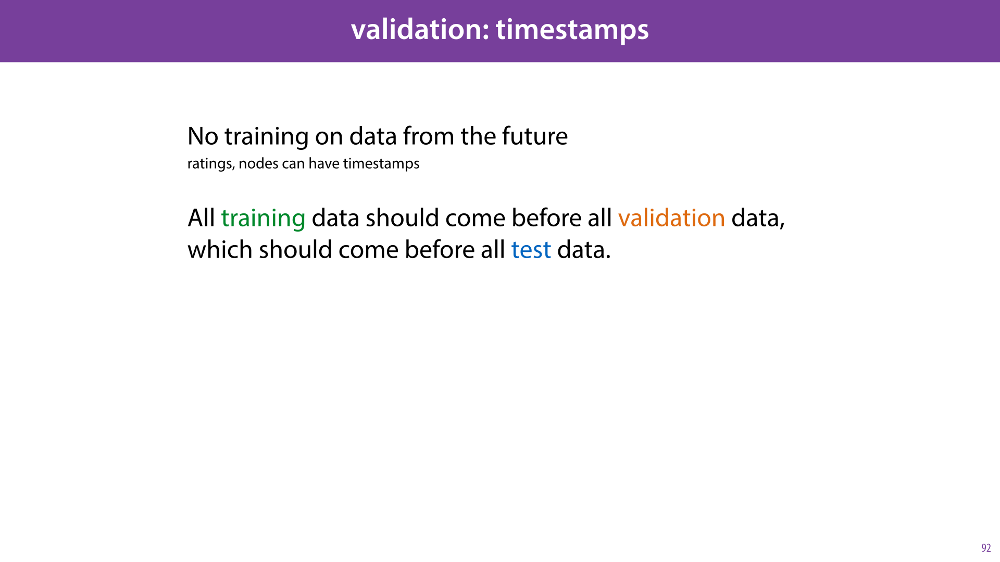

            <figcaption>
            
If our data has timestamps, we should follow the advice from last lecture as well.

            </figcaption>
       </section>

       <section id="slide-093">
            <a class="slide-link" href="https://mlvu.github.io/embeddingmodels#slide-093" title="Link to this slide.">link here</a>
            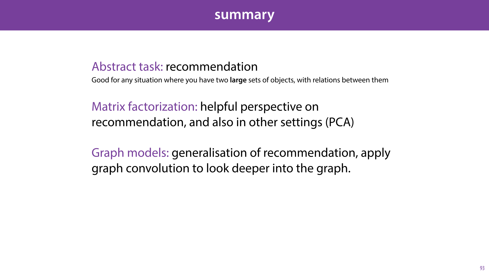

            <figcaption>
            

            </figcaption>
       </section>

       <section id="slide-094">
            <a class="slide-link" href="https://mlvu.github.io/embeddingmodels#slide-094" title="Link to this slide.">link here</a>
            

            <figcaption>
            

            </figcaption>
       </section>

</article>
