<nav class="menu">
    <ul>
        <li class="home"><a href="/">Home</a></li>
        <li class="name">Lecture 9: Deep generative models</li>
                <li><a href="#video-000">Generator networks</a></li>
                <li><a href="#video-024">Generative adversarial networks</a></li>
                <li><a href="#video-045">Autoencoders</a></li>
                <li><a href="#video-067">Variational autoencoders</a></li>
                <li><a href="#video-105">Social impact 3</a></li>
        <li class="pdf"><a href="https://mlvu.github.io/lectures/51.Deep%20Learning2.annotated.pdf">PDF</a></li>
    </ul>
</nav>

<article class="slides">

        <section class="video" id="video-000">
            <a class="slide-link" href="https://mlvu.github.io/generative#video-0">link here</a>
               <iframe
                    src="https://www.youtube.com/embed/jAxUolSXGtg"
                    title="YouTube video player"
                    frameborder="0" allow="accelerometer; autoplay; clipboard-write; encrypted-media; gyroscope; picture-in-picture"
                    allowfullscreen>
               </iframe>
        </section>

       <section id="slide-001">
            <a class="slide-link" href="https://mlvu.github.io/generative#slide-001" title="Link to this slide.">link here</a>
            

            <figcaption>
            
In this lecture, we’ll look at generative modeling, The business of training probability models that are too complex to give us an explicit density function over our feature space, but that do allow us to sample points. If we train them well, we get points that look like those in our dataset. 

These kinds of methods are often combined with neural nets to produce very complex, high-dimensional objects, for instance images. 

 

            </figcaption>
       </section>

       <section id="slide-002">
            <a class="slide-link" href="https://mlvu.github.io/generative#slide-002" title="Link to this slide.">link here</a>
            

            <figcaption>
            
Here is the example, we gave in the first lecture. A deep neural network from which we can sample highly realistic images of human faces. 

 

source: <a href="https://arxiv.org/abs/1812.04948"><strong class="blue">A Style-Based Generator Architecture for Generative Adversarial Networks</strong></a>, Karras et al. 

            </figcaption>
       </section>

       <section id="slide-003">
            <a class="slide-link" href="https://mlvu.github.io/generative#slide-003" title="Link to this slide.">link here</a>
            

            <figcaption>
            
In the rest of the lecture, we will use the following visual shorthand. The diagram on the left represents <strong>any kind of neural network</strong>. We don’t care about the precise architecture, whether it has one or a hundred hidden layers and whether it uses fully connected layers or convolutions, we just care about the shape of the input and the output. 

The image on the right represents a <strong>multivariate normal distribution</strong>. Think of this as a contour line for the density function. We’ve drawn it in a 2D space, but we’ll use it as a representation for MVNs in higher dimensional spaces as well. If the MVN is nonstandard, we’ll draw it as an ellipse somewhere else in space.

            </figcaption>
       </section>

       <section id="slide-004" class="anim">
            <a class="slide-link" href="https://mlvu.github.io/generative#slide-004" title="Link to this slide.">link here</a>
            

            <figcaption>
            
A plain neural network is purely <strong>deterministic</strong>. It translates an input to an output and does the same thing every time with no randomness. How do we turn this into a probability distribution? 

The first option is to take the output and to interpret it as the parameters of a probability distribution. We simply run the neural network for some input, let it produce some numbers as an output, and then interpret those as the parameters to a probability distribution. This distribution then defines a probability on a separate space. The network plus the probability distribution define a probability distribution <strong>conditional on the network input</strong>.

            </figcaption>
            click image for animation
       </section>

       <section id="slide-005">
            <a class="slide-link" href="https://mlvu.github.io/generative#slide-005" title="Link to this slide.">link here</a>
            

            <figcaption>
            
If this sounds abstract, note that it is something we've been doing already since the early lectures. For instance: to do binary classification, we defined a neural network with one sigmoid activated output node. We took that output value as the probability that the class was the positive one, but we could also say we're parametrizing a Bernoulli distribution with this value, and the Bernoulli distribution defines probabilities over the space containing the two outcomes "Class=pos" and "Class=neg". 

If we do this with a multiclass problem and a softmax output, we are parametrizing a <strong>multinomial distribution</strong>. 
<aside    >Note that linear regression is just a special case of this with a very simple (one layer) neural net.</aside><aside    ></aside>
            </figcaption>
       </section>

       <section id="slide-006" class="anim">
            <a class="slide-link" href="https://mlvu.github.io/generative#slide-006" title="Link to this slide.">link here</a>
            

            <figcaption>
            
Another example is regression, either linear or with a neural network. 

Here we simply produce a target prediction for x. However, what we saw in the previous lecture is that if we interpret this as t<strong>he mean of a normal distribution</strong> on y, then maximizing the likelihood of this distribution is equivalent to the least squares loss function.

            </figcaption>
            click image for animation
       </section>

       <section id="slide-007">
            <a class="slide-link" href="https://mlvu.github.io/generative#slide-007" title="Link to this slide.">link here</a>
            

            <figcaption>
            
If we build a probability distribution  parametrized by a neural network in this way, training it is pretty straightforward. We can easily compute the log-likelihood over our whole data, which then becomes a loss function. With backpropagation and gradient descent, we can train the parameters of the neural network to maximize the likelihood of the data under the model 

For many distributions, this leads to loss functions that we've seen already. 

The loss function for a normal output distribution with a mean<em> </em><em>and</em> variance, is a modification of the squared error. We can set the variance larger to reduce the impact of the squared errors, but we pay a penalty of the logarithm of sigma. If we know we are going to get the output value for instance i exactly right, then we will get almost no squared error and we can set the variance very small, paying little penalty. If we we’re less sure, then we expect a sizable squared error and we should increase the variance to reduce the impact a little. This way, we get a neural network that tells us not just what its best guess is, but also how sure it is about that guess. 
<aside    >Neural networks are very poor at estimating how sure they should be, so take this with a grain of salt, but in principle, the machinery is there for the network to provide an indication of certainty.</aside><aside    ></aside>
            </figcaption>
       </section>

       <section id="slide-008" class="anim">
            <a class="slide-link" href="https://mlvu.github.io/generative#slide-008" title="Link to this slide.">link here</a>
            

            <figcaption>
            
For a solution that applies to high-dimensional outputs like images, we can use the outputs to parametrize a<em> multivariate</em> normal distribution. Here we'll parametrize both the mean and the covariance matrix.

            </figcaption>
            click image for animation
       </section>

       <section id="slide-009">
            <a class="slide-link" href="https://mlvu.github.io/generative#slide-009" title="Link to this slide.">link here</a>
            

            <figcaption>
            
If we provide both the  the mean and the variance of an output distribution, it looks like this (for an n-dimensional output space). We simply split the output layer in two parts, and interpret one part as the mean and the other as the covariance matrix. 

Since representing a full covariance matrix would grow very big for high-dimensional outputs, we usually assume that the covariance matrix is <strong>diagonal </strong>(all off-diagonal values are zero). That way the representation of the covariance requires as many arguments as the representations of the mean, and we can simply split the output vector into two halves.  

We will call the resulting normal distribution a diagonal Gaussian (the word <em>isotropic</em> is also used). 

Equivalently, we can think of the output distribution as putting an independent 1D Gaussian on each dimension, with a mean and variance provided for each. 

For the mean, we can use a linear activation, since it can have any value, including negative values. However, the values of the covariance matrix need to be positive. To achieve this, we often exponentiate them. We’ll call this an <strong>exponential activation</strong>. An alternative option is the <strong>softplus</strong> function ln(1 + ex), which grows less explosively.

            </figcaption>
       </section>

       <section id="slide-010">
            <a class="slide-link" href="https://mlvu.github.io/generative#slide-010" title="Link to this slide.">link here</a>
            

            <figcaption>
            
Here’s what that looks like when we generate an image. The output distribution gives us a mean value for every channel of every pixel (a 3-tensor) and a corresponding variance for every mean. If we look at what that tells us about the red value of the pixel at coordinate (8, 7) we see that we get a univariate Gaussian with a particular mean and a variance. The mean tells us the network’s best guess for that value, and the variance tells us how <em>certain </em>the network is about this output. 

            </figcaption>
       </section>

       <section id="slide-011" class="anim">
            <a class="slide-link" href="https://mlvu.github.io/generative#slide-011" title="Link to this slide.">link here</a>
            

            <figcaption>
            
If we want to go all out, we can even make our neural network output the parameters of a Gaussian mixture model. This is called a <strong>mixture density network</strong>. 

All we need to do, is make sure that we have one output node for every parameter required, and apply different activations to the different kinds of parameters. The means get a linear activation and the covariances get an exponential activation as before. The component weights need to sum to one, so we need to give them a softmax activation (over just these three output values). 

If we want to train with maximum likelihood, we encounter this sum-inside-a-logarithm function again, which is difficult to deal with. But this time, it’s not such a headache. As we noted in the last lecture we can work out the gradient for this loss, it’s just a very ugly function. Since we are using backpropagation anyway, that needn’t worry us here. All we need to work out are the local derivatives or backward functions for functions like the logarithm and the sum, and those are usually provided by systems like Pytorch and Keras anyway.

            </figcaption>
            click image for animation
       </section>

       <section id="slide-012" class="anim">
            <a class="slide-link" href="https://mlvu.github.io/generative#slide-012" title="Link to this slide.">link here</a>
            

            <figcaption>
            
The mixture density network may seem like overkill, but it’s actually very useful in regression problems where multiple answers may be valid. 

Consider the problem of<strong> inverse kinematics</strong> in robotics. We have a robot arm with two joints, and we know where in space we want the hand of the arm to be. What angles should we set the two joints to? This is a great application for machine learning: it’s a relatively simple, smooth function. It’s easy to generate examples, and explicit solutions are a pain to write, and not robust to noise in the control of the robot. So we can solve it with a neural net.  

The inputs are the two coordinates where we want the hand to be (x1, x2), and the outputs are the two angles we should set the joints to (θ1, θ2). The problem we run into, is that for every input, <strong>there are two solutions</strong>. One with the elbow up, and one with the elbow down. A normal neural network trained with an MSE loss would not pick one or the other, but it would <em>average between the two</em>.  

A mixture density network with two components can fix this problem. For each input, it can simply put its components on the two valid solutions. 

image source: Mixture Density Networks, Christopher Bishop, 1994   

            </figcaption>
            click image for animation
       </section>

       <section id="slide-013" class="anim">
            <a class="slide-link" href="https://mlvu.github.io/generative#slide-013" title="Link to this slide.">link here</a>
            

            <figcaption>
            
The problem with the robot arm is that the task is uniquely determined in one direction—every configuration of the robot arms leads to a unique point in space for the hand—but not when we try to reason backward from the hand to the configuration of the joints.  

Here is a 2D version with that problem. Given x, we can predict t unambiguously. But, if we flip the problem and try to predict x given t, then at values like x=0.5, there are multiple predictions with high density. A network with a single Gaussian head (i.e. what we are implicitly doing when we are using least squares loss), will try to fit its Gaussian over both clusters of the data. This puts the mean, which is our ultimate prediction, <em>between</em> these two clusters, in a region where there is no data at all. 
<aside    >We can give the neural network control over the variance of this distribution as well, but all that achieves is that the variance grows to cover both groups of points. The mean stays in the same place. </aside>
By contrast, the mixture density network can output a distribution with two peaks. This allows it to cover the two groups of points in the output, and so solve the problem in a much more useful way. 

The general problem in the middle picture is called <strong>mode collapse</strong>: we have a problem with multiple acceptable answers, and instead of picking one of the answers at random, the neural network averages over all of them and produces a terrible answer.

            </figcaption>
            click image for animation
       </section>

       <section id="slide-014" class="anim">
            <a class="slide-link" href="https://mlvu.github.io/generative#slide-014" title="Link to this slide.">link here</a>
            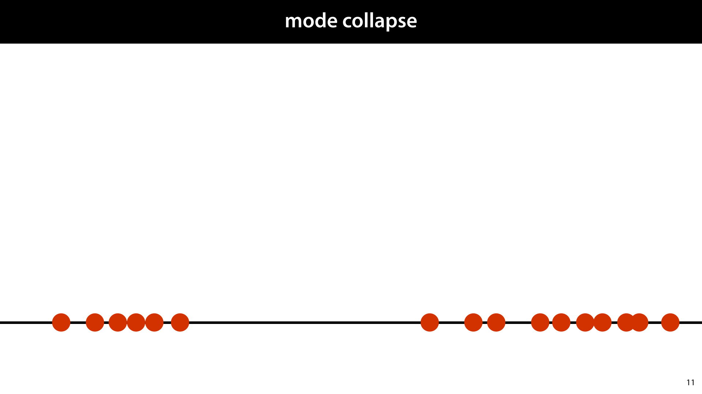

            <figcaption>
            
If our data is spread out in space in a complex, clustered pattern, and we  fit a simple unimodal distribution to it (that is, a distribution with one peak) then the result is a distribution that puts all the probability mass on the average of our points, but very <em>little</em> probability mass where the points actually are.

            </figcaption>
            click image for animation
       </section>

       <section id="slide-015">
            <a class="slide-link" href="https://mlvu.github.io/generative#slide-015" title="Link to this slide.">link here</a>
            

            <figcaption>
            
Mixture density networks go some way towards letting us capture more complex distributions in our neural networks, but when we want to capture something as complex and rich as the distribution on images representing human faces, they’re still insufficient.  

A mixture model with k components gives us k modes. So in the space of images, we can pick k images to give high probability and the rest is just a simple Gaussian shape around those k points. The distribution on human faces has infinitely many modes (all possible human faces) that should all be about equally likely. To achieve a distribution this complex, we need to use the power of the neural net, not just to choose a finite set of modes, but to control the whole shape of the probability function.  

Letting the neural network pick the parameters of a distribution with a simple shape is only ever going to produce a distribution with a simple shape. We need to change our approach.

            </figcaption>
       </section>

       <section id="slide-016" class="anim">
            <a class="slide-link" href="https://mlvu.github.io/generative#slide-016" title="Link to this slide.">link here</a>
            

            <figcaption>
            
Here’s a more powerful idea: we put the probability distribution at the<em> start</em> of the network instead of at the end of it. We sample a point from some straightforward distribution, usually a standard normal distribution, and we feed that point to a neural net. The result of these two steps is a random point, so we’ve defined another probability distribution. We call this construction a <strong>generator network</strong>. 
<aside    >Compare this to how we defined parametrized multivariate normals in the previous lecture: we started with a standard normal distribution, and we applied a linear transformation. This is the same thing, but we’ve replaced the linear transformation by a nonlinear one. </aside>
If we ignore the value of the input, we are now sampling from an unconditional distribution on <strong>x</strong>. 

            </figcaption>
            click image for animation
       </section>

       <section id="slide-017">
            <a class="slide-link" href="https://mlvu.github.io/generative#slide-017" title="Link to this slide.">link here</a>
            

            <figcaption>
            
To see what kind of distributions we might get when we do this, let’s try a little experiment.  

We wire up a random network as shown: a two-node input layer, followed by 12, 100-node fully-connected hidden layers with ReLU activations., and a final transformation back to two points. We <em>don’t train</em> the network. We just use Glorot initialisation to pick the parameters, and then  sample some points. Since the output is 2D, we can easily scatter-plot it.

            </figcaption>
       </section>

       <section id="slide-018">
            <a class="slide-link" href="https://mlvu.github.io/generative#slide-018" title="Link to this slide.">link here</a>
            

            <figcaption>
            
Here’s a plot of 100k points sampled in this way. Clearly, we’ve defined a highly complex distribution. Instead of having a finite set of single points as modes, we get strands of high probability in space, and sheets of lower, but nonzero probability. Remember, this network hasn’t been trained, so it’s not representing anything meaningful, but it shows that the distributions we can represent in this way is a highly complex family. 
<aside    >Note that the variance has shrunk, and the mean has drifted away from (0, 0); apparently our weight initialisation is not quite perfect. </aside><aside    ></aside>
            </figcaption>
       </section>

       <section id="slide-019">
            <a class="slide-link" href="https://mlvu.github.io/generative#slide-019" title="Link to this slide.">link here</a>
            

            <figcaption>
            
We can also use this trick to generate images. A normal convolutional net starts with a low-channel, high resolution image, and slowly decreases the resolution by maxpooling, while increasing the number of channels. Here, we reverse the process. We shape our input into a low resolution image with a large number of channels. We slowly increase the resolution by upsampling layers, and decrease the number of channels. 

We can use regular convolution layers, or <strong>deconvolutions</strong>, which are a kind of upside-down convolution. Both approaches give us effective generator networks for images. 

We see, that even without training, we have produced a distribution on images that is very complex and non-uniform. 
<aside    >I’ve enhanced the contrast and saturation in these images to make the colors stand out a little more.</aside><aside    ></aside>
            </figcaption>
       </section>

       <section id="slide-020" class="anim">
            <a class="slide-link" href="https://mlvu.github.io/generative#slide-020" title="Link to this slide.">link here</a>
            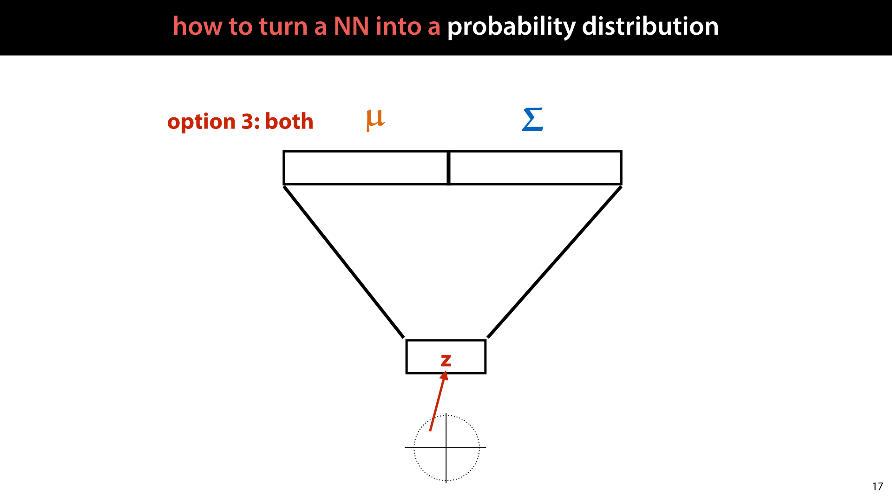

            <figcaption>
            
Of course, we can also use both options: we sample the input from a standard MVN, interpret the output as another MVN, and then sample from that. 

In these kinds of generator networks, the input is often called <strong>z</strong>, and the space of inputs is often called the<strong> latent space</strong>. As we will see later, this maps perfectly onto the hidden variable models of the previous lecture.

            </figcaption>
            click image for animation
       </section>

       <section id="slide-021">
            <a class="slide-link" href="https://mlvu.github.io/generative#slide-021" title="Link to this slide.">link here</a>
            

            <figcaption>
            
So the big question is, <strong>how do we train a generator network?</strong> Given some data, how do we set the weights of the network so that the sampled outputs start to look like the examples we have in our data? 

We’ll start with something that doesn’t work, to help us understand why the problem is difficult. Here is a naive approach: we simply sample a random point <strong class="blue">x</strong> (e.g. a picture) from the data, and sample a point <strong>y</strong> from the model and train on how close they are.  
<aside    >The loss could be any distance function between two tensors. The mean-squared error over the elements is a simple approach. If the elements are values between 0 and 1 (like in images), the binary cross-entropy makes sense too. For images the absolute value of the error (also called L1 loss) is also popular.</aside><aside    ></aside>
            </figcaption>
       </section>

       <section id="slide-022" class="anim">
            <a class="slide-link" href="https://mlvu.github.io/generative#slide-022" title="Link to this slide.">link here</a>
            

            <figcaption>
            
If we implement this naive approach, we do not get a good probability distribution. Instead, we get <strong>mode collapse</strong>.  

Here is a schematic example of what's happening: the blue points represent the modes (likely points) of the data. The green point is generated by the model. It’s close to one of the blue points, so the model should be rewarded, but it’s also far away from almost all of the other points. During training, there’s no guarantee that we will pair it up with the correct point, and we are likely to compute the loss to a completely different point. 

On average the model is punished for generating such points much more often than it is rewarded. The model that generates only the open point in the middle gets a smaller loss (and less variance). Under backpropagation, neural networks tend to converge to a distribution that generates only the open point over and over again. 

In other words, the many different modes (areas of high probability) of the data distribution end up being averaged (“collapsing”) into a single point.

            </figcaption>
            click image for animation
       </section>

       <section id="slide-023">
            <a class="slide-link" href="https://mlvu.github.io/generative#slide-023" title="Link to this slide.">link here</a>
            

            <figcaption>
            
Even though we have a probability distribution that is able to represent highly complex, multi-modal outputs, if we train it like this, we still end up producing a <strong>unimodal</strong> output centered on the mean of our data. If the dataset contains human faces, we get a fuzzy average of all faces, not a sample with individual details. 

How do we get the the network to<em> imagine details</em>, instead of averaging over all possibilities?

            </figcaption>
       </section>

       <section id="slide-024">
            <a class="slide-link" href="https://mlvu.github.io/generative#slide-024" title="Link to this slide.">link here</a>
            

            <figcaption>
            
There are two main approaches: GANs and variational autoencoders. We'll give a quick overview of the basic principle of GANs in the next part, and then a more detailed treatment of autoencoders and variational autoencoders in the last two parts. 

            </figcaption>
       </section>

        <section class="video" id="video-024">
            <a class="slide-link" href="https://mlvu.github.io/generative#video-24">link here</a>
               <iframe
                    src="https://www.youtube.com/embed/eaWxDebDDo8"
                    title="YouTube video player"
                    frameborder="0" allow="accelerometer; autoplay; clipboard-write; encrypted-media; gyroscope; picture-in-picture"
                    allowfullscreen>
               </iframe>
        </section>

       <section id="slide-025">
            <a class="slide-link" href="https://mlvu.github.io/generative#slide-025" title="Link to this slide.">link here</a>
            

            <figcaption>
            
In the last video, we defined <strong>generator networks</strong>, and we saw that they represent a very rich family of probability distributions. We also saw, that training them can be a tricky business. 

In this video we’ll look one way of training such networks: the method of <strong>generative adversarial networks (GANs)</strong>. 

 

            </figcaption>
       </section>

       <section id="slide-026" class="anim">
            <a class="slide-link" href="https://mlvu.github.io/generative#slide-026" title="Link to this slide.">link here</a>
            

            <figcaption>
            
GANs  originated just after Convolutional networks were breaking new ground, showing spectacular, sometimes super-human, performance in image labeling. The suggestion arose that perhaps convolutional networks were doing more or less the same as what humans do when they look at something. 

To verify this, researchers decided to start investigating  what kind of inputs would make a trained convolutional network give a certain output. This is easy to do, you just compute the gradient <em>with respect to the input of the network</em>, and train the input to maximise the activation of a particular label, while keeping the parameters of the network fixed.  
<aside    >This is similar to the feature visualizing approach we saw before, but you do it on the output nodes instead of the hidden nodes.  </aside>
You would expect that if you start with a random image, and follow the gradient to maximize the activation of the output node corresponding to the label “bus”, you’d get a picture of a bus. Or at least something that looks a little bit like a bus. What you actually get is something that is indistinguishable from the noise you started with. Only the very tiniest of changes is require to make the network see a bus. 

These are called <strong>adversarial examples</strong>. Instances that are specifically crafted to trip up a given model. 

            </figcaption>
            click image for animation
       </section>

       <section id="slide-027">
            <a class="slide-link" href="https://mlvu.github.io/generative#slide-027" title="Link to this slide.">link here</a>
            

            <figcaption>
            
The researchers also  found that if they started the search not at a random image, but at an image of another class, all that was needed to turn it into another class (according to the network) was a very small distortion. So small, that to us the image looks unchanged. In short, a tiny change to the image is enough to make a convolutional neural net think that a picture of a bus is a picture of an ostrich. 

Adversarial examples are an active area of research (both how to generate them and make models more robust against them). 

            </figcaption>
       </section>

       <section id="slide-028">
            <a class="slide-link" href="https://mlvu.github.io/generative#slide-028" title="Link to this slide.">link here</a>
            

            <figcaption>
            
Even manipulating objects in the physical world can have this effect. A stop sign can be made to look like a different traffic sign by the simple addition of some stickers. Clearly, this has some worrying implications for the development of self-driving cars.

            </figcaption>
       </section>

       <section id="slide-029">
            <a class="slide-link" href="https://mlvu.github.io/generative#slide-029" title="Link to this slide.">link here</a>
            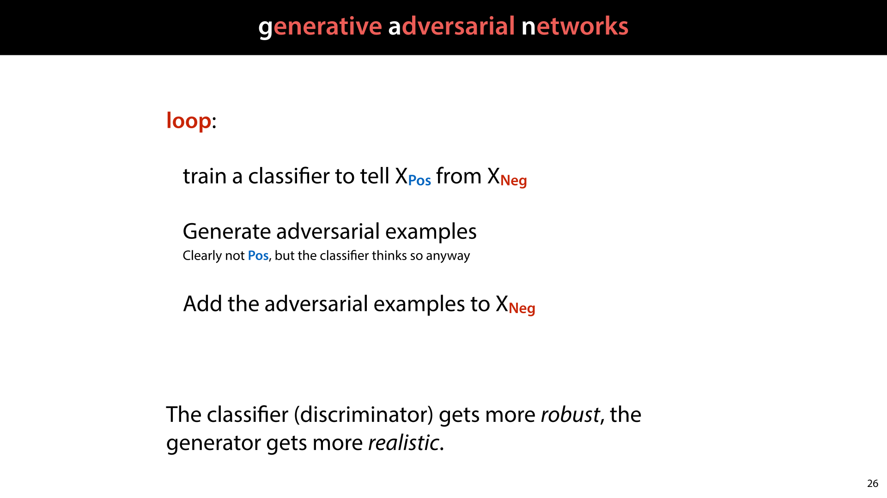

            <figcaption>
            
Pretty soon, this bad news was turned into good news by realising that if you can generate adversarial examples <em>automatically</em>, you can also add them to the dataset <em>as negatives</em> and retrain your network to make it more robust. You can simply tell your network that these things are not stop signs. Then, once your network is robust to the original adversarial examples, you can generate some new adversarial examples, and start the whole thing over again. 

We can think of this as a kind of iterated 2 player game (or an arms race). The <strong>discriminator</strong> (our classifier) tries to get good enough to tell fake data from real data and the <strong>generator</strong> (the algorithm that generates the adversarial examples) tries to get good enough to fool the discriminator. 

This is the basic idea of the <strong>generative adversarial network</strong>.

            </figcaption>
       </section>

       <section id="slide-030">
            <a class="slide-link" href="https://mlvu.github.io/generative#slide-030" title="Link to this slide.">link here</a>
            

            <figcaption>
            
We’ll look at four different examples of GANs. We’ll call the basic approach the “vanilla GAN”

            </figcaption>
       </section>

       <section id="slide-031">
            <a class="slide-link" href="https://mlvu.github.io/generative#slide-031" title="Link to this slide.">link here</a>
            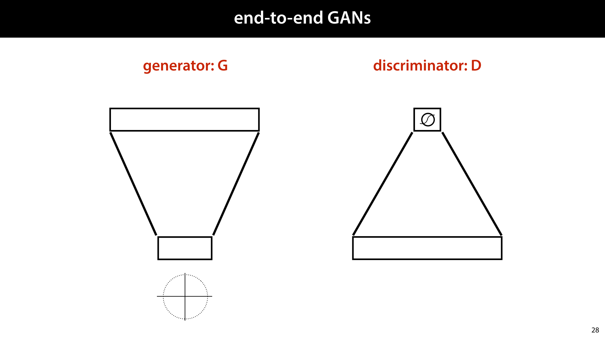

            <figcaption>
            
Generating adversarial examples by gradient descent is possible, but it’s much nicer if both our generator and our discriminator are separate neural networks. This will lead to a much cleaner approach for training GANs. 

We will draw the two components like this. The <strong class="red">generator </strong>takes an input sampled from a standard MVN and produces an image. This is a generator network as described in the previous video. We don't give it an output distribution (i.e. we're using option 2 from the previous part). 

The<strong class="red"> discriminator</strong> takes an image and classifies it as Positive (a real image of the target class) or Negative (a fake image sampled from the generator).  

If we have other images that are not of the target class, we can add those to the negative examples as well, but often, the positive class is just our dataset (like a collection of human faces), and the negative class is just the fake images created by the generator.

            </figcaption>
       </section>

       <section id="slide-032" class="anim">
            <a class="slide-link" href="https://mlvu.github.io/generative#slide-032" title="Link to this slide.">link here</a>
            

            <figcaption>
            
To train the discriminator, we feed it examples from the positive class, and train it to classify these as Pos.  

We also sample images from the generator (whose weights we keep fixed) and train the discriminator to recognize these as negative. At first, these will just be random noise, but there’s little harm in telling our network that such images are not busses (or whatever our positive class is). 

Note that since the generator is a neural network, we don’t need to collect a dataset of fake images which we then feed to the discriminator. We can just stick the discriminator on top of the generator, <em>making a single computation graph</em>, and train it by gradient descent to classify the result as negative. We just need to make sure to freeze the weights of the generator, so that gradient descent only updates the discriminator.

            </figcaption>
            click image for animation
       </section>

       <section id="slide-033">
            <a class="slide-link" href="https://mlvu.github.io/generative#slide-033" title="Link to this slide.">link here</a>
            

            <figcaption>
            
Then, to train the generator, we freeze the discriminator and train the weights of the generator to produce images that cause the discriminator to label them as <strong class="blue">Positive</strong>.  

This step may take a little time to wrap your head around. If it helps, think of the whole disciminator as a very complicated loss function. Whatever the generator produces, the more likely the discriminator is to call it positive, the lower the loss. 

We don’t need to wait for either step to converge. We can just train a the discriminator for one batch (i.e. one step of gradient descent) and then train the generator for one batch, and so on.  

And this is what we’ll call the <strong>vanilla GAN</strong>.

            </figcaption>
       </section>

       <section id="slide-034" class="anim">
            <a class="slide-link" href="https://mlvu.github.io/generative#slide-034" title="Link to this slide.">link here</a>
            

            <figcaption>
            
Sometimes we want to train the network to map an input to an output, but to generate the output probabilistically. For instance, when we train a network to color in a black-and-white photograph of a flower, it could choose many colors for the flower. We want to avoid mode collapse here: instead of averaging over all possible colors, giving us a brown or gray flower, we want it to pick one color, from all the possibilities.  

A <strong>conditional GAN</strong> lets us train generator networks that can do this.

            </figcaption>
            click image for animation
       </section>

       <section id="slide-035">
            <a class="slide-link" href="https://mlvu.github.io/generative#slide-035" title="Link to this slide.">link here</a>
            

            <figcaption>
            
In a conditional GAN, the generator is a function with an image input, which it maps it to an image output. However, it uses randomness to imagine specific details in the output.  

In this example, it imagines the photograph corresponding to a line drawing of a shoe. Running this generator twice would result in different shoes that are both “correct” instantiations of the input line drawing. 

source: <a href="https://phillipi.github.io/pix2pix/"><strong class="blue">Image-to-Image Translation with Conditional Adversarial Networks </strong></a>(2016), Phillip Isola Jun-Yan Zhu et al.

            </figcaption>
       </section>

       <section id="slide-036">
            <a class="slide-link" href="https://mlvu.github.io/generative#slide-036" title="Link to this slide.">link here</a>
            

            <figcaption>
            
To train a conditional GAN, we give the discriminator <strong>pairs of inputs and outputs</strong>. If these come from the generator, they should be classified as fake (negative) and if they come from the data, they should be classified as real (positive). 

The generator is trained in two ways.  

We freeze the weights of the discriminator, as before, and train the generator to produce thins that the discriminator will think are real.  

We feed it and input from the data, and backpropagate on the corresponding output (using L1 loss). 
<aside    >There are many more details you need to be aware of to train a model like this well, but for now we will just focus on the high-level picture.</aside><aside    ></aside>
            </figcaption>
       </section>

       <section id="slide-037">
            <a class="slide-link" href="https://mlvu.github.io/generative#slide-037" title="Link to this slide.">link here</a>
            

            <figcaption>
            
The conditional GAN works really well, but only if we have an example of a specific output that corresponds to a specific input. For some tasks, we don’t have paired images. We only have unmatched bags of images in two domains. For instance, we know that a picture of a horse can be turned into a picture of that horse as a zebra (a skilled painter could easily do this), but we don't have a lot of paired images of horses and corresponding zebras. All we have is a large number of horse images and a large number of zebra images. 

If we randomly match one zebra image to a horse image, and train a conditional GAN on this, all we get is mode collapse.

            </figcaption>
       </section>

       <section id="slide-038">
            <a class="slide-link" href="https://mlvu.github.io/generative#slide-038" title="Link to this slide.">link here</a>
            

            <figcaption>
            
CycleGANs solve this problem using two tricks.  

First, we train generators to perform the transformation in both directions. We train both a horse-to-zebra generator and a zebra-to-horse generator. Then each horse in our dataset is transformed into a zebra <strong>and back again</strong>.This gives us a fake zebra picture, which we can use to train a zebra discriminator, together with the real zebra pictures. We do the same thing the other way around: we transform the zebras to fake horses and back again, and use the fake horses together with the real horses to train a horse discriminator. 

Second, we add a <strong>cycle consistency loss</strong>. When we transform a horse to a zebra and back again, we should end up with the same horse again. The more different the final horse picture is from the original, the more we punish the generator networks.  

            </figcaption>
       </section>

       <section id="slide-039">
            <a class="slide-link" href="https://mlvu.github.io/generative#slide-039" title="Link to this slide.">link here</a>
            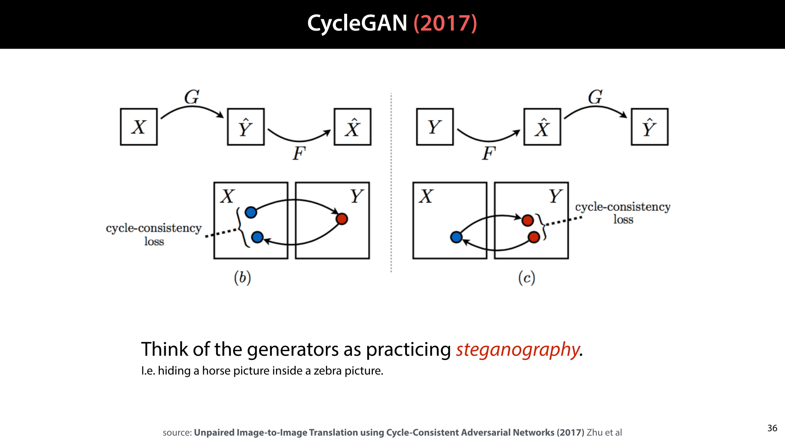

            <figcaption>
            
 

Here is the whole process in a diagram. 

One way to think of this is as the generators practicing steganography: hiding a secret message inside another innocent message. The generators are trying to hide a picture of a horse inside a picture of a zebra. The cycle consistency loss ensures that all the information of the horse picture is in the zebra picture and the horse picture can be fully decoded from the zebra picture. The discriminator's job is to tell which of the zebra pictures it sees have a horse hiding in it.  

If we have a strong discriminator and the generator can still fool it, then we get very realistic zebra pictures with horses hidden inside. Since the obvious way to make this transformation is to transform the horse into the zebra in the way we would do it, this is the transformation that the network learns.

            </figcaption>
       </section>

       <section id="slide-040">
            <a class="slide-link" href="https://mlvu.github.io/generative#slide-040" title="Link to this slide.">link here</a>
            

            <figcaption>
            
The CycleGAN works surprisingly well. Here’s how it maps photographs to impressionist paintings and vice versa.

            </figcaption>
       </section>

       <section id="slide-041">
            <a class="slide-link" href="https://mlvu.github.io/generative#slide-041" title="Link to this slide.">link here</a>
            

            <figcaption>
            
It doesn’t always work perfectly, though.

            </figcaption>
       </section>

       <section id="slide-042">
            <a class="slide-link" href="https://mlvu.github.io/generative#slide-042" title="Link to this slide.">link here</a>
            

            <figcaption>
            
Finally, let’s take a look at the <strong>StyleGAN</strong>, the network that generated the faces we first saw in the introduction. This is basically a Vanilla GAN, with most of the special tricks in the way the generator is constructed. It uses too many tricks to discuss here in detail, so we’ll just focus on one aspect: the idea that the latent vector is fed to the network at each stage of its forward pass. 

Since an image generator starts with a coarse (low resolution), high level description of an image, and slowly fills in the details, feeding it the latent vector at every layer (transformed by an affine transformation to fit it to the shape of the data at that stage), allows it to use different parts of the latent vector to describe different aspects of the image (the authors call these “styles”). 

The network also receives separate extra random noise per layer, that allows it to make random choices. Without this, all randomness would have to come from the latent vector. 

 

            </figcaption>
       </section>

       <section id="slide-043" class="anim">
            <a class="slide-link" href="https://mlvu.github.io/generative#slide-043" title="Link to this slide.">link here</a>
            

            <figcaption>
            
To see how this works, we can try to manipulate the network, by changing the latent vector to another for some of the layers. In this example all images on the margins are people that are generated for a particular single latent vector. 

We then re-generate the image for the destination, except that for a few layers (at the bottom, middle or top), we use the source latent vector instead.   

As we see, overriding the bottom layers changes things like gender, age and hair length, but not ethnicity. For the middle layer, the age is largely taken from the destination image, but the ethnicity is now override by the source. Finally for the top layers, only surface details are changed. 

This kind of manipulation was done during training as well, to ensure that it would lead to faces that fool the discriminator.

            </figcaption>
            click image for animation
       </section>

       <section id="slide-044">
            <a class="slide-link" href="https://mlvu.github.io/generative#slide-044" title="Link to this slide.">link here</a>
            

            <figcaption>
            
Let’s look at the other side of the network: the noise inputs.  

If we keep all the latent and noise inputs the same except for the very last noise input, we can see what the noise achieves: the man’s hair is equally messy in each generated example, but exactly in what way it’s messy changes per sample. The network uses the noise to determine the precise orientation of the individual “hairs”.

            </figcaption>
       </section>

       <section id="slide-045">
            <a class="slide-link" href="https://mlvu.github.io/generative#slide-045" title="Link to this slide.">link here</a>
            

            <figcaption>
            
We’ve given you a high level overview of GANs, which will hopefully give you an intuitive grasp of how they work. However, GANs are notoriously difficult to train, and many other tricks are required to get them to work. Here are some phrases you should Google if you decide to try implementing your own GAN. 

In the next video, we’ll look at a completely different approach to training generator networks: autoencoders.

            </figcaption>
       </section>

        <section class="video" id="video-045">
            <a class="slide-link" href="https://mlvu.github.io/generative#video-45">link here</a>
               <iframe
                    src="https://www.youtube.com/embed/t6GxDo1fSt0"
                    title="YouTube video player"
                    frameborder="0" allow="accelerometer; autoplay; clipboard-write; encrypted-media; gyroscope; picture-in-picture"
                    allowfullscreen>
               </iframe>
        </section>

       <section id="slide-046">
            <a class="slide-link" href="https://mlvu.github.io/generative#slide-046" title="Link to this slide.">link here</a>
            

            <figcaption>
            
In this part, we'll start to lay the groundwork for<strong> Variational Autoencoders</strong>. This starts with a completely different abstract task: dimensionality reduction. We'll see that given a dimensionality reduction model, we can often turn it into a generative model with a few hacks. In the next part, we will then develop this type of model in a more grounded and theoretical way. 

 

            </figcaption>
       </section>

       <section id="slide-047">
            <a class="slide-link" href="https://mlvu.github.io/generative#slide-047" title="Link to this slide.">link here</a>
            

            <figcaption>
            
Before we turn to autoencoders, let's first look at what we can do once we've trained a generator network. We’ll look at four use cases. 

The first, of course is that we can generate data that looks like it came from the same distribution as ours.

            </figcaption>
       </section>

       <section id="slide-048" class="anim">
            <a class="slide-link" href="https://mlvu.github.io/generative#slide-048" title="Link to this slide.">link here</a>
            

            <figcaption>
            
Another thing we can do is <strong>interpolation</strong>. 

If we take two points in the input space, and draw a line between them, we can pick evenly spaced points on that line and decode them. If the generator is good, this should give us a smooth transition from one point to the other, and each point should result in a convincing example of our output domain. 

Remember that in some contexts, we refer to the input of a generator network as its <strong>latent space</strong>.

            </figcaption>
            click image for animation
       </section>

       <section id="slide-049">
            <a class="slide-link" href="https://mlvu.github.io/generative#slide-049" title="Link to this slide.">link here</a>
            

            <figcaption>
            
We can also draw an<strong> interpolation grid</strong>; we just map the corners of a square lattice of equally spaced points to four points in our input space, and run all points through the generator network. 

            </figcaption>
       </section>

       <section id="slide-050">
            <a class="slide-link" href="https://mlvu.github.io/generative#slide-050" title="Link to this slide.">link here</a>
            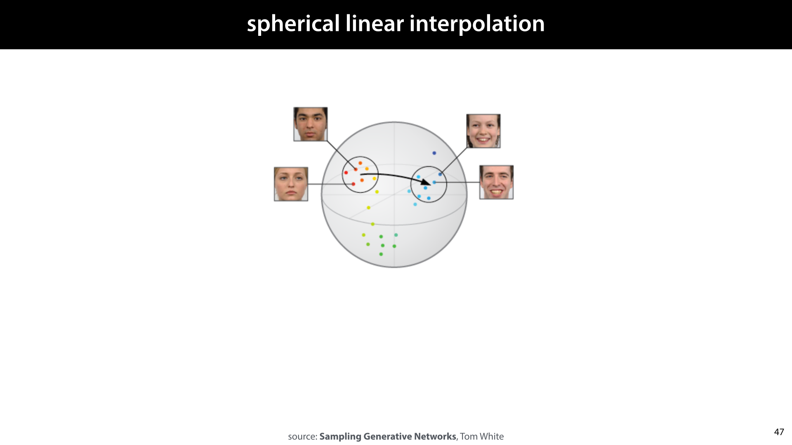

            <figcaption>
            
If the latent space is high dimensional, most of the probability of the standard MVN is near the edges of the radius-1 hypersphere (not in the centre as it is in 1, 2 and 3-dimensional MVNs).  
<aside    >High-dimensional MVNs look <a href="https://www.inference.vc/high-dimensional-gaussian-distributions-are-soap-bubble/"><strong class="blue">more like a soap bubble</strong></a> than the dense pointcloud we’re used to seeing in low-dimensional visualizations. </aside>
For that reason, we get better results if we interpolate along an arcinstead of along a straight line. This is called <strong>spherical linear interpolation</strong>.

            </figcaption>
       </section>

       <section id="slide-051">
            <a class="slide-link" href="https://mlvu.github.io/generative#slide-051" title="Link to this slide.">link here</a>
            

            <figcaption>
            
What if we want to interpolate between points in our dataset? It’s possible to do this with a GAN trained generator, but to make this work, we first have to <em>find</em> our data points in the input spoace. Remember, during training the discriminator is the only network that gets to see the actual data. We never explicitly map the data to the latent space. 

We can tack a mapping from data to latent space onto the network after training (as was done for these images), but we can also learn such a mapping directly. As it happens, this can help us to train the generator in a much more direct way.

            </figcaption>
       </section>

       <section id="slide-052" class="anim">
            <a class="slide-link" href="https://mlvu.github.io/generative#slide-052" title="Link to this slide.">link here</a>
            

            <figcaption>
            
Note that such a mapping would also give us a <strong>dimensionality reduction</strong>. We can see the latent space representation of the data as a reduced dimensionality representation of the input. 

We’ll focus on the perspective of dimensionality reduction for the rest of this video, to set up basic autoencoders. We can get a generator network out of these, but it’s a bit of an afterthought. In the next video, we’ll see how to train generator networks with a data-to-latent-space mapping in a more principled way.

            </figcaption>
            click image for animation
       </section>

       <section id="slide-053">
            <a class="slide-link" href="https://mlvu.github.io/generative#slide-053" title="Link to this slide.">link here</a>
            

            <figcaption>
            
Here’s what a simple <strong>autoencoder</strong> looks like. It’s is a particular type of neural network, shaped like an hourglass. Its job is just to make the output as close to the input as possible, but somewhere in the network there is a small layer that functions as a bottleneck.  

After the network is trained, this small layer becomes a compressed low-dimensional representation of the input.

            </figcaption>
       </section>

       <section id="slide-054" class="anim">
            <a class="slide-link" href="https://mlvu.github.io/generative#slide-054" title="Link to this slide.">link here</a>
            

            <figcaption>
            
Here’s the picture in detail. We call the bottom half of the network the <strong class="red">encoder</strong> and the top half the <strong>decoder</strong>. We feed the autoencoder an instance from our dataset, and all it has to do is reproduce that instance in its output. We can use any loss that compares the output to the original input, and produces a lower loss, the more similar they are. Then, we just brackpropagate the loss and train by gradient descent. 
<aside    >Least-squares loss, absolute error loss and binary cross-entropy are popular choices </aside>
We call the  blue layer the <strong class="blue">latent representation</strong> of the input. If we train an autoencoder with just two nodes on the latent representation, we can plot what latent representation each input is assigned. If the autoencoder works well, we expect to see similar images clustered together (for instance smiling people vs frowning people, men vs women, etc). 
<aside    >In a 2D space, we can’t cluster too many attributes together, but in higher dimensions it’s easier.  To quote <a href="http://jeffclune.com/courses/media/courses/2016-Fall-AI/lectures/L24-AI-2016.pdf"><strong class="blue">Geoff Hinton</strong></a>: “If there was a 30 dimensional supermarket, [the anchovies] could be close to the pizza toppings and close to the sardines.”</aside><aside    ></aside>
            </figcaption>
            click image for animation
       </section>

       <section id="slide-055">
            <a class="slide-link" href="https://mlvu.github.io/generative#slide-055" title="Link to this slide.">link here</a>
            

            <figcaption>
            
To show what this looks like, we've set up a relatively simple autoencoder consisting of convolutions in the encoder and deconvolutions in the decoder. We train it on a low-res version of the <a href="https://github.com/NVlabs/ffhq-dataset"><strong class="blue">FFHQ dataset</strong></a> of human faces. We give the latent space 256 dimensions. 
<aside    >For the PCA lecture we used black and white data to make the task easier. Since we have a more powerful model, we can use more varied full-color data. The StyleGAN was trained on the full-resolution version of this data. </aside>
Here are the reconstructions on a very simple network, with MSE loss on the output after 5 full passes over the data. 

            </figcaption>
       </section>

       <section id="slide-056">
            <a class="slide-link" href="https://mlvu.github.io/generative#slide-056" title="Link to this slide.">link here</a>
            

            <figcaption>
            

            </figcaption>
       </section>

       <section id="slide-057">
            <a class="slide-link" href="https://mlvu.github.io/generative#slide-057" title="Link to this slide.">link here</a>
            

            <figcaption>
            

            </figcaption>
       </section>

       <section id="slide-058">
            <a class="slide-link" href="https://mlvu.github.io/generative#slide-058" title="Link to this slide.">link here</a>
            

            <figcaption>
            
After 300 epochs, the autoencoder has pretty much converged. Here are the reconstructions next to the original data. Considering that we've reduced each image to just 256 numbers, it's not too bad.

            </figcaption>
       </section>

       <section id="slide-059" class="anim">
            <a class="slide-link" href="https://mlvu.github.io/generative#slide-059" title="Link to this slide.">link here</a>
            

            <figcaption>
            
One thing we can now do is to study the latent space based on the examples that we have. For instance, we can see whether smiling and non-smiling people end up in distinct parts of the latent space. 

We just label a small amount of instances as smiling and nonsmiling (just 20 each in this case). If we're lucky, these form distinct clusters in our latent space. If we compute the means of these clusters, we can draw a vector between them. We can think of this as a “smiling” vector. The further we push people along this line, the more the decoded point will smile. 

This is one big benefit of autoencoders: we can train them on unlabeled data (which is cheap) and then use only a <em>very</em> small number of labeled examples to “annotate” the latent space. In other words, autoencoders are a great way to do <strong>semi-supervised learning</strong>. 
<aside    >Compare this to what we did in our previous dimensionality reduction method of principal component analysis. There, we found that dimensions in the reduced space corresponded to high-level semantic concepts like gender and expression. Here, the latent space is a little more "entangled", but we can usually still find distinct directions for high-level concepts (they are just not aligned with the axes).</aside><aside    ></aside>
            </figcaption>
            click image for animation
       </section>

       <section id="slide-060">
            <a class="slide-link" href="https://mlvu.github.io/generative#slide-060" title="Link to this slide.">link here</a>
            

            <figcaption>
            
Once we've worked out what the smiling vector is, we can manipulate photographs to make people smile. We just encode their picture into the latent space, add the smiling vector (times some small scalar to control the effect), and decode the manipulated latent representation. If the autoencoder understands "smiling" well enough, the result will be the same picture but manipulated so that the person will smile.

            </figcaption>
       </section>

       <section id="slide-061">
            <a class="slide-link" href="https://mlvu.github.io/generative#slide-061" title="Link to this slide.">link here</a>
            

            <figcaption>
            
Here is what that looks like for our (simple) example model. In the middle we have the decoding of the original data, and to the right we see what happens if we add an increasingly large multiple of the smiling vector. 

To the right we subtract the smiling vector, which makes the person frown.

            </figcaption>
       </section>

       <section id="slide-062" class="anim">
            <a class="slide-link" href="https://mlvu.github.io/generative#slide-062" title="Link to this slide.">link here</a>
            

            <figcaption>
            
With a bit more powerful model, and some face detection, we can see what some famously moody celebrities might look like if they smiled. 

source: <a href="https://blogs.nvidia.com/blog/2016/12/23/ai-flips-kanye-wests-frown-upside-down/"><strong class="blue">https://blogs.nvidia.com/blog/2016/12/23/ai-flips-kanye-wests-frown-upside-down/</strong></a> 

            </figcaption>
            click image for animation
       </section>

       <section id="slide-063">
            <a class="slide-link" href="https://mlvu.github.io/generative#slide-063" title="Link to this slide.">link here</a>
            

            <figcaption>
            
What we get out of an autoencoder, depends on which part of the model we focus on. 

If we keep the encoder and the decoder, we get a network that can help us manipulate data in this way. 

If we keep just the encoder, we get a powerful dimensionality reduction method. We can use the latent space representation as the features for a model that does not scale well to too many features (like a non-naive Bayesian classifier). 

But this lecture was about generator networks. How do we get a generator out of a trained autoencoder? It turns out we can do this by keeping just the decoder.

            </figcaption>
       </section>

       <section id="slide-064">
            <a class="slide-link" href="https://mlvu.github.io/generative#slide-064" title="Link to this slide.">link here</a>
            

            <figcaption>
            
We don’t know beforehand where the data will end up in latent space, but after training we can just check. We encode the training data, fit a distribution to this point cloud in our latent space, and then just use this distribution as the input to our decoder to create a generator network.

            </figcaption>
       </section>

       <section id="slide-065">
            <a class="slide-link" href="https://mlvu.github.io/generative#slide-065" title="Link to this slide.">link here</a>
            

            <figcaption>
            
This is the point cloud of the latent representations in our example. We plot the first two of the 256 dimensions, resulting in the blue point cloud. 

To these points we, we fit an MVN (in 256 dimensions), and we sample 400 new points from it, the red dots.

            </figcaption>
       </section>

       <section id="slide-066">
            <a class="slide-link" href="https://mlvu.github.io/generative#slide-066" title="Link to this slide.">link here</a>
            

            <figcaption>
            
If we feed these points to the decoder, this is what we get. It's not quite up these with the style gan results, but clearly, the model can generate some non-existant people.

            </figcaption>
       </section>

       <section id="slide-067">
            <a class="slide-link" href="https://mlvu.github.io/generative#slide-067" title="Link to this slide.">link here</a>
            

            <figcaption>
            
This has given us a generator, but we have little control over what the latent space looks like. We just have to hope that it looks enough like a normal distribution that our MVN makes a good fit. In the GAN, we have perfect control over what our distribution on the latent space looks like; we can freely set it to anything. However, there, we have to fit a mapping from data to latent space after the fact. 

We’ve also seen that this interpolation works well, but it’s not something we’ve specifically trained the network to do. In the GAN, we should expect all latent space points to decode to something that fools the decoder, but in the autoencoder, there is nothing that stops the points <em>in between</em> the data points from decoding to garbage. 

Moreover, neither the GAN nor the autoencoder is a very principled way of optimizing. Is there a way to train for <strong>maximum likelihood</strong> directly? 

The answer to all of these questions is the<strong> variational autoencoder</strong>, which we’ll discuss in the next video. 

            </figcaption>
       </section>

        <section class="video" id="video-067">
            <a class="slide-link" href="https://mlvu.github.io/generative#video-67">link here</a>
               <iframe
                    src="https://www.youtube.com/embed/inUJd7f931g"
                    title="YouTube video player"
                    frameborder="0" allow="accelerometer; autoplay; clipboard-write; encrypted-media; gyroscope; picture-in-picture"
                    allowfullscreen>
               </iframe>
        </section>

       <section id="slide-068">
            <a class="slide-link" href="https://mlvu.github.io/generative#slide-068" title="Link to this slide.">link here</a>
            

            <figcaption>
            <aside    >The video refers to a lecture that is no longer part of the course. See the lecture notes for the missing pieces. We’ll create a new video soon. </aside>
  

            </figcaption>
       </section>

       <section id="slide-069">
            <a class="slide-link" href="https://mlvu.github.io/generative#slide-069" title="Link to this slide.">link here</a>
            

            <figcaption>
            
The variational autoencoder is a more principled way to train a generator network using the principles of an autoencoder. This requires a little more math, but we get a few benefits in return.

            </figcaption>
       </section>

       <section id="slide-070">
            <a class="slide-link" href="https://mlvu.github.io/generative#slide-070" title="Link to this slide.">link here</a>
            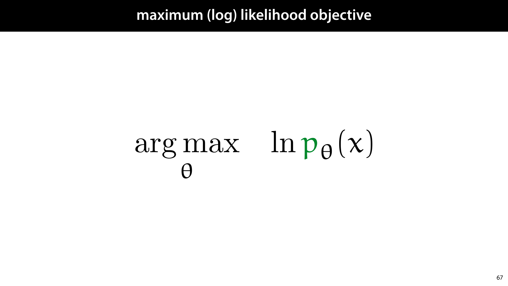

            <figcaption>
            
We’ll start with the maximum log-likelihood objective. We want to choose our parameters θ (the weights of the neural network) to maximise the log likelihood of the data. We will write this objective step by step until we end up with an autoencoder. 
<aside    >To simplify our notation a little bit, we will put the weights of the network in the subscript of p rather than in the conditional p(x | θ). Both notations mean the same thing (the conditional notation is useful when you want to apply Bayes’ rule to get a distribution on the parameters θ, but we won’t go into that in this lecture. </aside><aside    >We're specifically using the natural logarithm ln here because it will simplify things a little down the road.</aside><aside    ></aside>
            </figcaption>
       </section>

       <section id="slide-071">
            <a class="slide-link" href="https://mlvu.github.io/generative#slide-071" title="Link to this slide.">link here</a>
            

            <figcaption>
            
The first insight is that we can view our generator as a hidden variable model. We have a hidden variable <strong>z</strong>, a standard normally distributed vector, which we then fed to a neural network. The network produces a spherical normal distribution N(μ, σ), from which we sample variable <strong>x</strong>, which we then observe. We assume that the data came from this process too (or something equivalent to it), and we want to choose the parameters θ of the neural network to mimic the process that generated the data as closely as possible. 

The network computes the conditional distribution of <strong>x</strong> given <strong>z</strong>: pθ(<strong>z|</strong> <strong>x</strong>). Note that the value we actually want to maximize, pθ(<strong>x</strong>) is not conditioned on <strong>z</strong>. We want to maximize the probability of x, regardless of what latent vector z generated it. While pθ(<strong>z|</strong> <strong>x</strong>) is easy to compute (by just running the network) pθ(<strong>x</strong>) is not. 
<aside    >To compute pθ(x), we would have to somehow integrate over all possible values of <strong>z</strong> and their prior probabilities. </aside><aside    >Note also that we’re not thinking of this as an autoencoder yet. That view will <strong>emerge</strong>. For now, we are just looking at a generator network, and wondering how we might choose its parameters so that we maximize the likelihood of the data. </aside><aside    ></aside>
            </figcaption>
       </section>

       <section id="slide-072" class="anim">
            <a class="slide-link" href="https://mlvu.github.io/generative#slide-072" title="Link to this slide.">link here</a>
            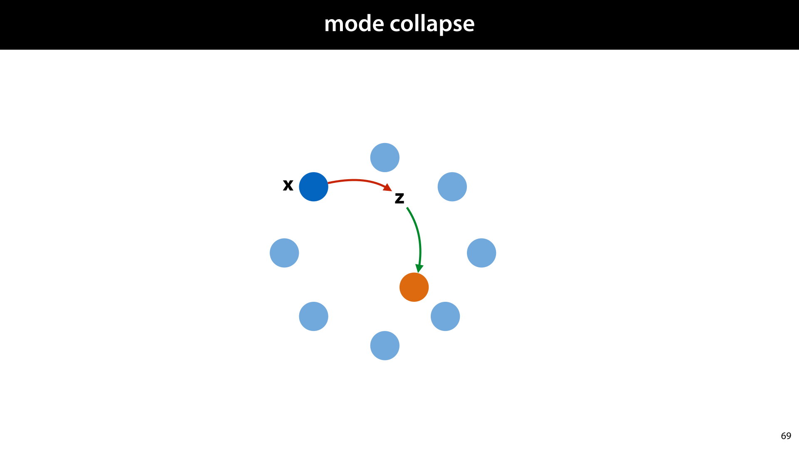

            <figcaption>
            
Here we see how the hidden variable problem causes our mode collapse. If we knew which <strong>z</strong> was supposed to produce which <strong>x</strong>, we could feed that <strong>z</strong> to the network to compute the loss between the output and x and optimize by backpropagation and gradient descent. In short, we’d have both the input (<strong>z</strong>) and the target value (<strong>x</strong>) for our network. 

The problem is that we don’t have<strong> the “complete” data </strong>(given the assumptions we made about how the data were generated). We don’t know the values of <strong>z</strong>, only the values of <strong>x</strong>. This means we don’t have the inputs for our network, only the targets. 

A common way to solve problems of incomplete data is to generate an approximate <strong>completion of your data</strong>. That is, you guess the missing part (in this case <strong>z</strong>), and learn your generator for <strong>x</strong> on the basis of this guess. That is, you build a generator for <strong>x</strong> given <strong>z</strong>,  and a guesser for <strong class="red">z</strong> given <strong class="red">x</strong>. Then you train both together. The better the guesser gets, the better the generator gets and vice versa. 

This is how we will build our autoencoder. 
<aside    >It’s no longer part of the exam material, but the Eexpectation Maximization (EM) algorithm works in exactly the same way. Have a look at the extra resources if you’re curious. Looking at the differences and commonalities between EM and the VAE is a great way to really get to grips with the details of probabilistic programming.</aside><aside    ></aside>
            </figcaption>
            click image for animation
       </section>

       <section id="slide-073">
            <a class="slide-link" href="https://mlvu.github.io/generative#slide-073" title="Link to this slide.">link here</a>
            

            <figcaption>
            
One way to solve this problem, would be to figure out which latent variable <strong>z</strong> would be likely to generate a given <strong>x</strong>. That is, for a given generator network, with fixed parameters θ, if we are given an image <strong>x</strong> how likely is any given input <strong>z</strong> to lead to the output sample <strong>x?</strong> This is the function pθ(<strong>z|</strong> <strong>x</strong>). 

This, again, is not an easy thing to work out.  To compute p(z|x, θ) we would need to<strong> invert</strong> the neural network: work out for a given output <strong>x</strong>, what the input <strong>z</strong> was. Or more probabilistically: which input values <strong>z</strong> are likely to have caused the network to output <strong>x</strong>. 
<aside    >The picture shows the Bayesian reasoning that is required: this particular <strong>z</strong> leads to an output distribution N(μ, σ) that has its peak probability density very close to <strong>x</strong>. This suggests z should have a high likelyhood, but <strong>z</strong> itself is very unlikely under the prior probability N(<strong>0</strong>, <strong>I</strong>), from which we sample <strong>z</strong>. </aside>
Network inversion is not impossible to do (we saw something similar when we were discussing GANs), but it’s a costly and imprecise business. Just like we did with the GANs, it’s best to introduce a network that will <em>learn the inversion</em> for us.  We call this network q.  

Unlike the GAN setting where we alternate the training of a network and its inversion,  we’ll figure out a way to train p and q <strong>together</strong>. We’ll try to update the parameters of p to fit the data, and try we’ll update the parameters of q to keep it a good approximation to the inversion of p, and we’ll do both at the same time.

            </figcaption>
       </section>

       <section id="slide-074" class="anim">
            <a class="slide-link" href="https://mlvu.github.io/generative#slide-074" title="Link to this slide.">link here</a>
            

            <figcaption>
            
For this purpose, we’ll introduce q. Its function is to<em> approximate</em>  pθ(<strong>z|</strong> <strong>x</strong>), the inversion of our generator network. 

Note that we’re treating q as an approximation, but we’re not yet saying that it’s a good approximation. It could be a terrible approximation, for instance at the start of learning, but we will set up some equations that hold for <em>any </em>approximation q no matter how good or bad. 

Since we will implement q with a neural network, it will have parameters, just like p. We will refer to the set of all its parameters with the letter ϕ (phi). 

            </figcaption>
            click image for animation
       </section>

       <section id="slide-075">
            <a class="slide-link" href="https://mlvu.github.io/generative#slide-075" title="Link to this slide.">link here</a>
            

            <figcaption>
            
We will draw the neural network q like this.  

It maps a given instance <strong>x</strong> to<em> a distribution on the latent space</em>. That is, we’re not generating a single <strong>z</strong> that is the likely latent for a given <strong>x</strong>, we are creating a distribution that will tell us for every <strong>z</strong> how likely it is that <strong>z</strong> would produce the given <strong>x</strong>. 

To make things easy for ourselves, we will assume that this distribution can be well approximated by a single spherical normal distribution. This means that q is a network with a probabilistic output, just like p. 

If the network works well, the correct latent representation (the one that decodes to <strong>x</strong> if we feed it to the generator) will get a high probability density under the distribution produced by this network. 

The structure of the q network, does not need to be related in any way to the structure of the network p, and their parameters ϕ and θ are not tied together in any way.  

In practice, it’s common to make q the rough inverse architecture of p, using deconvolutions in q where p uses convolutions, and so on, but this is not necessarily the best approach.

            </figcaption>
       </section>

       <section id="slide-076" class="anim">
            <a class="slide-link" href="https://mlvu.github.io/generative#slide-076" title="Link to this slide.">link here</a>
            

            <figcaption>
            
With that, we can state our problem more precisely. We have a generator network p that allows us to easily compute the conditional probability of <strong>x</strong> given some <strong>z</strong>. We want to choose its parameters so that the probability density of the data is maximized. 

We have an encoder network q that allows us to easily compute the conditional probability of <strong>z</strong> given some <strong>x</strong>. We want to choose its parameters so that the probabilities it generates correspond as closely as possible to the conditional probability <strong>z</strong> given <strong>x</strong> under the current weights of the generator network. 

Finally, there is one more function that we can easily compute: the marginal pθ(<strong>z</strong>). This is simply because we defined it ourselves: the input to p is sampled from a standard normal distribution. It’s value is chosen completely independently of how p functions or what <strong>x</strong> it produces, so the marginal distribution on  z is simply the standard normal distribution. 

This, then, is our challenge: <strong>tune the weights of these two networks to maximize the probability of the data under the generator, and do it in such a way that we only ever need to compute these three functions.</strong>

<strong></strong>

            </figcaption>
            click image for animation
       </section>

       <section id="slide-077">
            <a class="slide-link" href="https://mlvu.github.io/generative#slide-077" title="Link to this slide.">link here</a>
            

            <figcaption>
            
Putting everything together, this is our model. If we feed q an instance from our data <strong>x</strong>, we get a normal distribution on the latent space. If we sample a point <strong>z</strong> from this distribution, and feed it to p we get a distribution on <strong>x</strong>. If the networks are both well trained, this should give us a good reconstruction of <strong>x</strong>. 

The neural network p is our probability distribution conditional on the latent vector. q is our approximation of the conditional distribution on <strong>z</strong>. 
<aside    >We are beginning to see the autoencoder emerge. Note that this is relatively incidental. We are just trying to train the generator network, and all we've done is introduce q as an approximation to the inverse of p. At no point did we set out to build a dimensionality reduction method. </aside><aside    ></aside>
            </figcaption>
       </section>

       <section id="slide-078">
            <a class="slide-link" href="https://mlvu.github.io/generative#slide-078" title="Link to this slide.">link here</a>
            

            <figcaption>
            
Now, we promised that we could optimize these two networks together in a <em>principled</em> way. We will start with the maximum likelihood objective, which is hard to optimize directly, and rewrite step by step into a loss function that affects both networks. 
<aside    >The maximum likelihood loss doesn’t involve q yet. But we’ll rewrite it later to include q. </aside><aside    ></aside>
            </figcaption>
       </section>

       <section id="slide-079">
            <a class="slide-link" href="https://mlvu.github.io/generative#slide-079" title="Link to this slide.">link here</a>
            

            <figcaption>
            
We will first show the following decomposition.  This is a very useful property, and it’s used often to deal with hidden variable models. 
<aside    >We’ve dropped the parameter subscripts to simplify the notation. </aside>
The idea is that when we introduce an approximation to q(<strong>z</strong>|<strong>x</strong>) for p(<strong>z</strong>|<strong>x</strong>), we can then look at the Kulback-Leibler (KL) divergence between the two that expresses how good the approximation is. The smaller the KL divergence is, the better the approximation. If the KL divergence is zero, then the approximation is perfect and q(<strong>z</strong>|<strong>x</strong>) and p(<strong>z</strong>|<strong>x</strong>) express the same function. 

It turns out that the sum of the KL divergence and the function L as defined in the slide, is the log-probability of <strong>x</strong>. 

Note that the components of L are exactly the three functions we can compute. We still need to deal with the fact that it’s an expectation, but this hopefully shows that we’re getting closer to our target.

            </figcaption>
       </section>

       <section id="slide-080" class="anim">
            <a class="slide-link" href="https://mlvu.github.io/generative#slide-080" title="Link to this slide.">link here</a>
            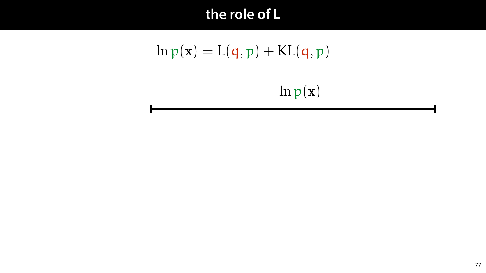

            <figcaption>
            
If we take p and its parameters as given, we can use the following reasoning to understand what the function L means. We know that given p, the log-likelihood of the data p(x) is fixed. We also know that the KL divergence is always non-negative. This means that for any q, the KL term must be smaller than the log-likelihood, and the L term is what makes up the difference. 

This means that if q is a perfect approximation, L is equal to the log likelihood, the very thing we wanted to approximate. This is relevant, because, as we will show, L 

            </figcaption>
            click image for animation
       </section>

       <section id="slide-081" class="anim">
            <a class="slide-link" href="https://mlvu.github.io/generative#slide-081" title="Link to this slide.">link here</a>
            

            <figcaption>
            
The idea of the variational autoencoder is to take the L term, and use this as our loss. 

The thinking is that since it’s a lowerbound on the likelihood (the quantity we’re trying to maximize), anything that increases L will also increase our likelihood. The better we maximise L, the better our model will do. 
<aside    >Note that this is only a lowerbound because we know that the KL term cannot be negative. If the KL divergence could be negative, the L term could be larger or smaller than the log-likelihood. </aside>
 

            </figcaption>
            click image for animation
       </section>

       <section id="slide-082" class="anim">
            <a class="slide-link" href="https://mlvu.github.io/generative#slide-082" title="Link to this slide.">link here</a>
            

            <figcaption>
            
Here’s a visualisation of how a lower bound objective works. We’re interested in finding the highest point of the blue line (the maximum likelihood solution), but that’s difficult to compute. Instead, we maximise the orange line (the evidence lower bound). Because it’s guaranteed to be below the blue line everywhere, we may expect to be finding a high value for the blue line as well. To some extent, pushing up the orange line, pushes up the  blue line as well. 

How well we do on the blue line depends a lot on how <em>tight</em> the lower bound is. The distance between the lower bound and the log likelihood is expressed by the KL divergence between pw(z|x) and qv(z|x). That is, because we cannot easily compute pw(z|x), we introduced an approximation qv(z|x) . The better this approximation, the lower the KL divergence, and the tighter the lower bound.

            </figcaption>
            click image for animation
       </section>

       <section id="slide-083" class="anim">
            <a class="slide-link" href="https://mlvu.github.io/generative#slide-083" title="Link to this slide.">link here</a>
            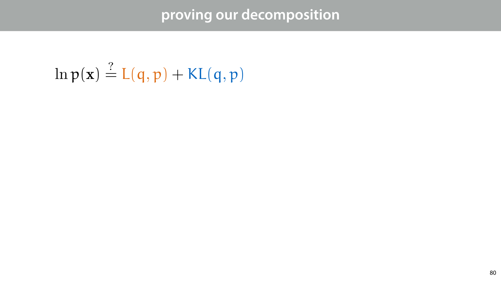

            <figcaption>
            
First, for completeness, we need to prove that our decomposition actually holds. This requires only the basic properties of probability and expectations that we already know from the preliminaries. 

It’s easiest to work backwards: we’ll state the decomposition, and then rewrite it into the log-likelihood of the data. 

First, we fill in the definition of L and of the KL divergence.  
<aside    >Note the use of expectations. Since z is a continuous variable, the expectation and KL divergence are integrals rather than sums.Since we only use the properties of the expectation that are the same for both the sum and integral version, we never need to deal with integrals explicitly. </aside>
Next, we take out the denominator q(<strong>z</strong>|<strong>x</strong>) on both sides. Taking this out of the logarithm gives us an exta term inside the expectation, which we can take out of both expectations. This gives us - E q(z|x) from the first term and + E q(z|x) from the second so they cancel out. 

Then, we apply the reverse logic to the second term, and move it into the first, giving us a new denominator. The factors p(x|z) in the numerator and denominator cancel out and we are left with an expectation over p(x). Note that the thing we’re taking the expectation for (z) doesn’t appear in p(x): we’re taking the expectation over a constant. So, we remove the expactation, and arrive at our goal.

            </figcaption>
            click image for animation
       </section>

       <section id="slide-084">
            <a class="slide-link" href="https://mlvu.github.io/generative#slide-084" title="Link to this slide.">link here</a>
            

            <figcaption>
            
With that, we are almost ready to start using L as a loss function. We just need a few tweaks to allow us to compute it efficiently in a deep learning system like Pytorch. 

First, since we want to implement a loss function, we want something to minize. Since we want L as big as possible, we’ll minimize -L. 

All three probability functions we are left with are ones we can easily compute: q(z|x) is given by the encoder network, p(x|z) is given by the decoder network, and p(z) was chosen when we defined (back in part 1) how the generator works, if we marginalize out x, the distribution on z is a standard multivariate normal. 

If we break all three out of the expection, and re-arrange we see that we get two very interpretable terms: 

The KL divergence between the distribution q provides for the latent <strong>z</strong> of <strong>x</strong> and the prior that p uses for <strong>z</strong> (which is a standard normal distribution). Note that we’re not comparing q to the thing it’s approximating here. We’re comparing a distribution that is conditioned on x to one that is independent of x. This means that we don’t necessarily want this term to go all the way to zero. We’ll see later that it functions as a kind of regularizer. 

The log probability of <strong>x</strong> given <strong>z</strong>, under the expectation that <strong>z</strong> is sampled from q(<strong>z</strong>|<strong>x</strong>). Here, we see the autoencoder begin to emerge. If we compute q(z|x), sample z from it, and then compute - ln p(<strong>x</strong>|<strong>z</strong>), the resulting value should (in expectation) be as low as possible. 

            </figcaption>
       </section>

       <section id="slide-085" class="anim">
            <a class="slide-link" href="https://mlvu.github.io/generative#slide-085" title="Link to this slide.">link here</a>
            

            <figcaption>
            
Let's see if this is a loss function we can implement in a system like Pytorch. 

The KL term is just the KL divergence between the MVN that the encoder produces for x and the standard normal MVN. This <a href="https://en.wikipedia.org/wiki/Kullback%E2%80%93Leibler_divergence#Multivariate_normal_distributions"><strong class="blue">works out</strong></a> as a relatively simple differentiable function of mu and sigma, so we can use it directly in a loss function. 
<aside    >Remember that θz is usually restricted to a diagonal matrix, so the network just outputs a vector of the same size as μz, which we take to be the diagonal of the covariance matrix. </aside><aside    >We’ll spare you the working out of the closed-form expression of  the KL divergence between Gaussians. If you need it, it’s <a href="https://dlvu.github.io/diffusion/#slide-045"><strong class="blue">in the slides for the deep learning course</strong></a>. Suffice it to say that it’s a simple function of the output of q that’s easy to implement in a system like Pytorch.</aside><aside    ></aside>
            </figcaption>
            click image for animation
       </section>

       <section id="slide-086" class="anim">
            <a class="slide-link" href="https://mlvu.github.io/generative#slide-086" title="Link to this slide.">link here</a>
            

            <figcaption>
            
The second part of our loss function requires a little more work. It’s an <strong>expectation</strong> for which we don’t have a closed form expression. Instead, we can <em>approximate</em> it by taking some samples, and averaging them.  
<aside    >This is the idea of Monte Carlo approximation of expections: to approximate the expectation of f(x) under some probability p, you just take a bunch of samples of  x from p and average the resulting values of f(x). IT’s what we almost always do implicitly when we use a sample average to represent a population. </aside>
To keep things simple, we just take a single sample. We’ll be computing the network lots of times during training, so overall, we’ll be taking lots of samples, and the optimization method we use (gradient descent) is robust to a little variance.

            </figcaption>
            click image for animation
       </section>

       <section id="slide-087">
            <a class="slide-link" href="https://mlvu.github.io/generative#slide-087" title="Link to this slide.">link here</a>
            

            <figcaption>
            
So, we replace <strong>z</strong> (the random variable) by <strong>z</strong>’ (the sample), and remove the expectation. 

We now have almost a fully differentiable model. Unfortunately, we still have a <strong>sampling step</strong> in the middle (and sampling is not a differentiable operation). How do we get from a distribution on <strong>z</strong> to a sample <strong>z’</strong>, in a way that we can backpropagate through? 

            </figcaption>
       </section>

       <section id="slide-088">
            <a class="slide-link" href="https://mlvu.github.io/generative#slide-088" title="Link to this slide.">link here</a>
            

            <figcaption>
            
The key is to look at the way we normally sample from a normal distribution. 

First, sampling from a standard normal distribution in d dimensions is as simple as taking d samples from a one-dimensional standard normal distribution and sticking them into a d-dimensional vector <strong>e</strong>. If you do this, the resulting vector e is distributed according to a d dimensional multivariate normal distribution. 
<aside    >We’ll take the algorithm for sampling  from a standard normal as read (we don’t need to dig into it). The default approach, if you’re interested, is called <a href="https://en.wikipedia.org/wiki/Box%E2%80%93Muller_transform"><strong class="blue">the Box-Muller transform</strong></a>. </aside><aside    >Then, if we want to sample from a diagonal distribution N(μ, σ) with vector mean μ and vector covariance σ, we just take a sample e from the standard normal distribution, and element-wise multiply e by σ and then add μ. The result is a sample from N(μ, σ).</aside><aside    ></aside>
            </figcaption>
       </section>

       <section id="slide-089">
            <a class="slide-link" href="https://mlvu.github.io/generative#slide-089" title="Link to this slide.">link here</a>
            

            <figcaption>
            
Looking at this algorithm, and applying it to our sample from N(μz, σz)—the distribution produced by q—we can see two things.  

First, the random aspects of the sampling don't depend on the output q. We can do all the random parts (generating <strong>e</strong>) before we even know what μz and σz are.  

Second, the rest of the algorithm is a simple, differentiable and affine operation. We just take e and multiply it by a vector and add another vector. 

            </figcaption>
       </section>

       <section id="slide-090">
            <a class="slide-link" href="https://mlvu.github.io/generative#slide-090" title="Link to this slide.">link here</a>
            

            <figcaption>
            
This means that we can basically work the sampling algorithm <em>into the architecture of the network</em>. We provide the network with an <strong>extra input</strong>: a sample from the standard normal distribution.  
<aside    >Note that this requires the network to produce standard deviations, not variances. So long as the outputs are positive, we can just interpret them as standard deviations, and assume that the network will learn to produce standard deviations. </aside>
Why does this help us? We’re still sampling, but we’ve moved the random sampling out of the way of the backpropagation. The gradient can now propagate down to the weights of the q function, and the actual randomness is treated as an<em> input</em>, rather than a computation. 

And with that, we have a fully differentiable loss function that we can put into a system like Keras or pytorch to train our autoencoder. 

This idea, of working the sampling algorithm into our network, and interpreting the random source of the sampling as another input, is called the <strong>reparametrization trick</strong>.

            </figcaption>
       </section>

       <section id="slide-091">
            <a class="slide-link" href="https://mlvu.github.io/generative#slide-091" title="Link to this slide.">link here</a>
            

            <figcaption>
            
The two terms of the loss function are usually called KL loss and reconstruction loss.  

The reconstruction loss maximises the probability of the current instances. This is basically the same loss we used for the regular autoencoder: we want the output of the decoder to look like the input. 

The KL loss ensures that the latent distributions are clustered around the origin, with variance 1. Over the whole dataset, it ensures that the latent distribution looks like a standard normal distribution.

            </figcaption>
       </section>

       <section id="slide-092">
            <a class="slide-link" href="https://mlvu.github.io/generative#slide-092" title="Link to this slide.">link here</a>
            

            <figcaption>
            
The formulation of the VAE has three forces acting on the latent space. The reconstruction loss pulls the latent distribution as much as possible towards a single point that gives the best reconstruction. Meanwhile, the KL loss, pulls the latent distribution (for all points) towards the standard normal distribution, acting as a <strong>regularizer</strong>. Finally, the sampling step ensures that not just a single point returns a good reconstruction, but a whole <em>neighbourhood</em> of points does. The effect can be summarized as follows: 

The <strong>reconstruction loss </strong>ensures that there are points in the latent space that decode to the data. 

The<strong> </strong><strong class="red">KL loss</strong> ensures that all these points together are laid out like a standard normal distribution. 

The<strong> sampling step </strong>ensures that points <em>in between</em> these also decode to points that resemble the data. 

To understand what happens in the VAE, you should focus on the tension between the reconstruction loss and the other two forces. If we had only the reconstruction loss, the encoder could put the data in a very space set of points in the latent space, and draw very narrow, low variance distributions around these. This leads to a kind of <em>overfitting</em>: the data is very precisely encoder in the latent space, but nothing ensures that the rest of the latent space decodes to something useful.  

The KL loss pulls the encoder away from this behavior. It ensures that the decoder wants to output distributions with relatively wide variances. This means that not just a single point decodes to <strong>x</strong>, but a large region of points does.  

<strong>question </strong>What happens if we have no reconstruction loss to balance the KL loss? Do we ever want the KL loss to reach its minimum of 0? No, if the KL loss is 0, then the output of the decoder is always equal to N(<strong>0</strong>, <strong>I</strong>). This means that the encoder produces a constant output regardless of the input and information makes its way out of the autoencoder. 

The sampling helps the KL loss achieves its aim of spreading out the latent representations. It forces the decoder to generate the data from many points that are spread out over the latent space, not just the ones that are most likely according to the decoder. 

<strong>question</strong> What happens if we sample a point <strong>z</strong>’ that has high probability under q(<strong>z</strong>|<strong>x</strong>1), but also under q(<strong>z</strong>|<strong>x</strong>2)? That is the latent space Gaussians for two points in the data overlap a dit and <strong>z</strong>’ falls in the overlapping region? How does this affect the encoder and the decoder? The decoder doesn’t know whether it’s supposed to generate <strong>x</strong>1 or <strong>x</strong>2, so it will learn to average (mode collapse) between them. This how it learns to interpolate. The encoder probably gets a high score on the KL loss, since the  overlapping Gaussians mean they are probably both close to N(0, I). However, the reconstruction loss would get higher if the Gaussians were less overlapping because that would tell the encoder more clearly whether it needs to generate <strong>x</strong>1 or <strong>x</strong>2.

            </figcaption>
       </section>

       <section id="slide-093" class="anim">
            <a class="slide-link" href="https://mlvu.github.io/generative#slide-093" title="Link to this slide.">link here</a>
            

            <figcaption>
            
To define an autoencoder, we need to choose the output distribution of our decoder, which will determine the precise form of the reconstruction loss. In these slides, we've used a diagonal normal distribution, but for images, that's not usually the best choice.  

We can get slightly better results with a Laplace distribution, but convergence will still be slow.  

Better results are achieved with the binary cross entropy. This doesn't correspond to a proper distribution on continuous valued image tensors, but it's often used anyway because of the fact convergence. To fix this problem, you can use something called <a href="https://en.wikipedia.org/wiki/Continuous_Bernoulli_distribution"><strong class="blue">a continuous Bernoulli distribution</strong></a>, which will give you fast convergence and a theoretically correct VAE.

            </figcaption>
            click image for animation
       </section>

       <section id="slide-094">
            <a class="slide-link" href="https://mlvu.github.io/generative#slide-094" title="Link to this slide.">link here</a>
            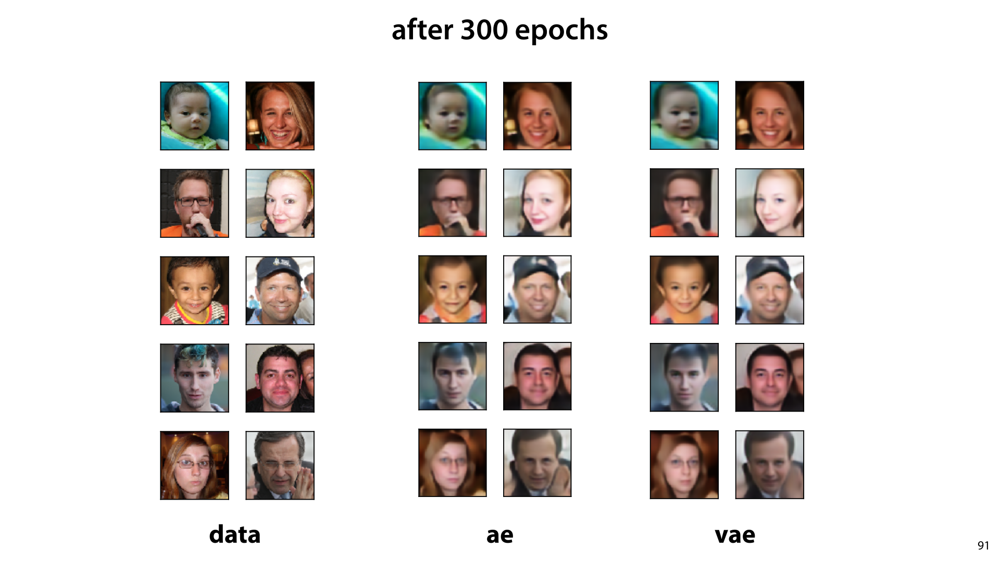

            <figcaption>
            
Here are some reconstructions for the regular autoencoder and for the VAE. They perform pretty similarly. There are slight differences if you look closely, but it's hard to tell which is better.

            </figcaption>
       </section>

       <section id="slide-095">
            <a class="slide-link" href="https://mlvu.github.io/generative#slide-095" title="Link to this slide.">link here</a>
            

            <figcaption>
            
However, if we generate data by providing the generator with a random input, the difference becomes more pronounces. Here we see that the VAE is more likely to generate complete, and coherent faces (although both models still struggle with the background).

            </figcaption>
       </section>

       <section id="slide-096">
            <a class="slide-link" href="https://mlvu.github.io/generative#slide-096" title="Link to this slide.">link here</a>
            

            <figcaption>
            
For completeness, here is the smiling vector, applied to the VAE model.

            </figcaption>
       </section>

       <section id="slide-097">
            <a class="slide-link" href="https://mlvu.github.io/generative#slide-097" title="Link to this slide.">link here</a>
            

            <figcaption>
            
Here are some examples from a more elaborate VAE. 

source: Deep Feature Consistent Variational Autoencoder by Xianxu Hou, Linlin Shen, Ke Sun, Guoping Qiu 

            </figcaption>
       </section>

       <section id="slide-098" class="anim">
            <a class="slide-link" href="https://mlvu.github.io/generative#slide-098" title="Link to this slide.">link here</a>
            

            <figcaption>
            
 

source: <a href="https://houxianxu.github.io/assets/project/dfcvae"><strong class="blue">https://houxianxu.github.io/assets/project/dfcvae</strong></a>

<a href="https://houxianxu.github.io/assets/project/dfcvae"><strong class="blue"></strong></a>

            </figcaption>
            click image for animation
       </section>

       <section id="slide-099">
            <a class="slide-link" href="https://mlvu.github.io/generative#slide-099" title="Link to this slide.">link here</a>
            

            <figcaption>
            
Here is what the algorithm looks like in Pytorch. Load the 5th worksheet to give it a try. 

<a href="https://github.com/mlvu/worksheets/blob/master/Worksheet%205%2C%20Pytorch.ipynb"><strong class="blue">https://github.com/mlvu/worksheets/blob/master/Worksheet%205%2C%20Pytorch.ipynb</strong></a> 

            </figcaption>
       </section>

       <section id="slide-100">
            <a class="slide-link" href="https://mlvu.github.io/generative#slide-100" title="Link to this slide.">link here</a>
            

            <figcaption>
            
In this worksheet, the VAE is trained on MNIST data, with a 2D latent space. Here is the original data, plotted by their latent coordinates. The colors represent the classes (to which the VAE did not have access). 

If you run the worksheet, you’ll end up with this picture (or one similar to it).

            </figcaption>
       </section>

       <section id="slide-101" class="anim">
            <a class="slide-link" href="https://mlvu.github.io/generative#slide-101" title="Link to this slide.">link here</a>
            

            <figcaption>
            
While the added value of the VAE is a bit difficult to detect in our example, in other domains it’s more clear.  

Here is an example of interpolation on sentences. First using a regular autoencoder, and then using a VAE. Note that the intermediate sentences for the AE are non-grammatical, but the intermediate sentences for the VAE are all grammatical. 

 

source: Generating Sentences from a Continuous Space by Samuel R. Bowman, Luke Vilnis, Oriol Vinyals, Andrew M. Dai, Rafal Jozefowicz, Samy Bengio 

https://arxiv.org/abs/1511.06349 

            </figcaption>
            click image for animation
       </section>

       <section id="slide-102" class="anim">
            <a class="slide-link" href="https://mlvu.github.io/generative#slide-102" title="Link to this slide.">link here</a>
            

            <figcaption>
            
We see that GANs are in many ways the inverse of autoencoders, in that GANS have the data space as the inside of the network, and VAEs have it as the outside.

            </figcaption>
            click image for animation
       </section>

       <section id="slide-103">
            <a class="slide-link" href="https://mlvu.github.io/generative#slide-103" title="Link to this slide.">link here</a>
            

            <figcaption>
            

            </figcaption>
       </section>

       <section id="slide-104">
            <a class="slide-link" href="https://mlvu.github.io/generative#slide-104" title="Link to this slide.">link here</a>
            

            <figcaption>
            

            </figcaption>
       </section>

       <section id="slide-105">
            <a class="slide-link" href="https://mlvu.github.io/generative#slide-105" title="Link to this slide.">link here</a>
            

            <figcaption>
            

            </figcaption>
       </section>

        <section class="video" id="video-105">
            <a class="slide-link" href="https://mlvu.github.io/generative#video-105">link here</a>
               <iframe
                    src="https://www.youtube.com/embed/r4DYGXmbk_E"
                    title="YouTube video player"
                    frameborder="0" allow="accelerometer; autoplay; clipboard-write; encrypted-media; gyroscope; picture-in-picture"
                    allowfullscreen>
               </iframe>
        </section>

       <section id="slide-106">
            <a class="slide-link" href="https://mlvu.github.io/generative#slide-106" title="Link to this slide.">link here</a>
            

            <figcaption>
            
This week and the last, we’ve discussed a lot of probability theory. With these tools in hand, we can go back to our discussion on social impact, and try to make it more precise. We can now talk a lot more precisely about how to<strong> reason probabilistically</strong> and what kind of mistakes people tend to make. Unsurprisingly, such mistakes have a strong impact on the way machine learning algorithms are used and abused in society. 

 

            </figcaption>
       </section>

       <section id="slide-107">
            <a class="slide-link" href="https://mlvu.github.io/generative#slide-107" title="Link to this slide.">link here</a>
            

            <figcaption>
            
Specifically , in this video, we’ll look at the problem of <strong>profiling</strong>. 

When we suspect people of a crime or target them for investigation, based on their membership of a group rather than based on their individual actions, that’s called <strong>profiling</strong>.  

Probably the most common form is<strong> racial profiling</strong>; which is when the group in question is an ethnic or racial group. Examples include black people being more likely to be stopped by police, or Arabic people being more likely to be checked at airports. 

Other forms of profiling, such as gender or sexual orientation profiling also exist in various contexts.

            </figcaption>
       </section>

       <section id="slide-108">
            <a class="slide-link" href="https://mlvu.github.io/generative#slide-108" title="Link to this slide.">link here</a>
            

            <figcaption>
            
We saw an example of this in the first social impact video: a prediction system (essentially using machine learning) which predicted the risk of people in prison re-offending when let out. This system, built by a company called Northpointe, showed a strong racial bias.  

As we saw then, it’s not enough to just remove race as a feature. So long as race or ethnicity can be predicted from the features you do use, your model may be inferring from race.

            </figcaption>
       </section>

       <section id="slide-109">
            <a class="slide-link" href="https://mlvu.github.io/generative#slide-109" title="Link to this slide.">link here</a>
            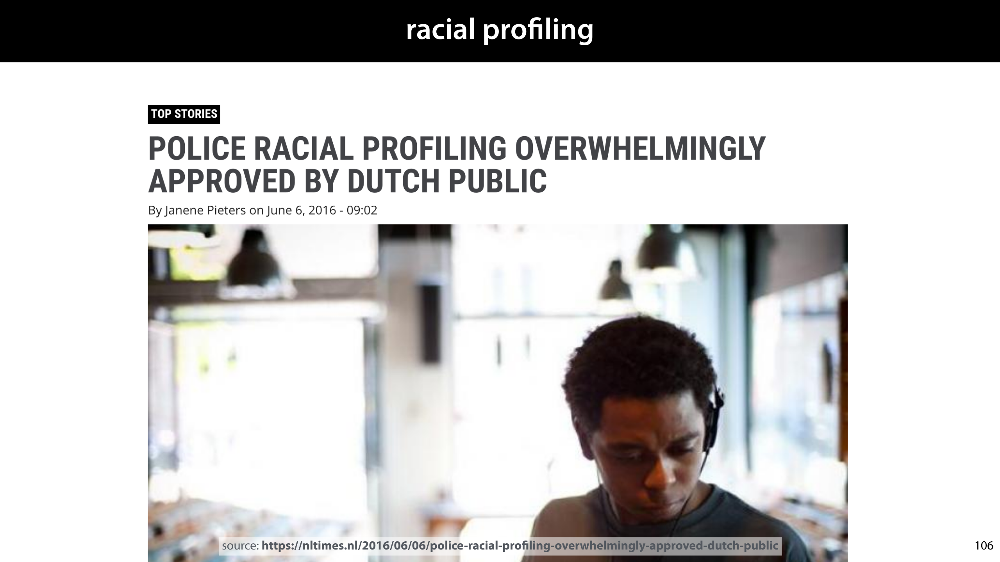

            <figcaption>
            
Profiling doesn't just happen in automated systems. And lest you think this is a typically American problem, let’s look a little closer to home.  

A few years ago, a Dutch hip-hop artist called Typhoon was stopped by the police. The police admitted that the combination of his skin colour and the fact that he drove an expensive car played a part in the choice to stop him. This caused a small stir in the Dutch media and a nationwide discussion about racial profiling. 

The main argument usually heard is “if it works, then it is worth it.” That is, in some cases, we should accept a certain amount of racism in our criminal procedures, if it is in some way successful.  

This statements hides a lot complexity: we’re assuming that such practices are successful, and we’re not defining what being successful <em>means</em> in this context. Our responsibility, as academics, is to unpack such statements, and to make it more precise what is actually being said. Let’s see if we can do that here. 

We’ll focus on the supposed pros and cons of profiling and on what it means for a profiling method to be successful, regardless of whether it’s an algorithm or a human doing the profiling. 

 

            </figcaption>
       </section>

       <section id="slide-110">
            <a class="slide-link" href="https://mlvu.github.io/generative#slide-110" title="Link to this slide.">link here</a>
            

            <figcaption>
            
As an example of how automated systems can perform profiling, without being explicitly programmed to, we can also stay in the Netherlands. 

Less than a month ago as this section's video was recorded, however, the Dutch government fell. In a parliamentary investigation at the end of last year, it was found that the tax service had wrongly accused an estimated 26 000 families of fraudulent claims for childcare benefits, often requiring them to pay back tens of thousand of euros, and driving them into financial difficulty. 

There were many factors at play, but an important problem that emerged was the use of what were called “self-learning systems.” In other words, machine learning. One of these, the risk-indicator, candidate lists for people to be checked for fraud. The features for this classification included, among other things the nationality of the subject (Dutch/non-Dutch). The system was a complete black box, and investigators had no insight into why people were marked as high risk. People with a risk level above 0.8 were automatically investigated, making the decision to investigate an autonomous one, made by the system without human intervention. 

One of the biggest criticisms of the tax service in the child welfare scandal is how few of the people involved understood the use of algorithms in general, and the details of the algorithms they were using specifically.  

This hopefully goes some way towards explaining why we’ve felt it necessary to discuss social impact in these lectures. We’re teaching you how to build complex systems, and history has shown again and again that policy makers and project managers are happy to deploy these in critical settings without fully understanding the consequences. If those responsible for building them, that is you and me, don’t have the insight and the ability required to communicate the potential harmful social impacts of these technologies, then what chance does anybody else have? 

<a href="https://www.groene.nl/artikel/opening-the-black-box"><strong class="blue">https://www.groene.nl/artikel/opening-the-black-box</strong></a> 

<a href="https://autoriteitpersoonsgegevens.nl/sites/default/files/atoms/files/onderzoek_belastingdienst_kinderopvangtoeslag.pdf"><strong class="blue">https://autoriteitpersoonsgegevens.nl/sites/default/files/atoms/files/onderzoek_belastingdienst_kinderopvangtoeslag.pdf</strong></a> 

 

            </figcaption>
       </section>

       <section id="slide-111">
            <a class="slide-link" href="https://mlvu.github.io/generative#slide-111" title="Link to this slide.">link here</a>
            

            <figcaption>
            
Since this is a sensitive subject, we’ll try to make our case as precisely as possible, and focus on a specific instance, where we have all the necessary data available: illicit drug use in the US. The US has a  system in place to record race and ethnicity in crime data. The categorization may be crude, but it’ll suffice for our purposes. 

From these graphs, we see on the left that black people engage in illicit drug use more than people of other ethnicities, and that they are also arrested for it more than people of other ethnicities. However, the rate of use is only marginally higher than that of white people, whereas the arrest rate can be as much as five times as high as that for white people,  

This points to one potential problem: racial profiling may very easily lead to disproportionate effects like those seen on the right. Even if there’s difference in the proportion with which black people and white people commit a particular crime, it’s very difficult to ensure that the profiling somehow honors that proportion. But we shouldn’t make the implicit assumption that that’s the only problem. If the proportions of the two graphs matched, would profiling then be justified? Is the problem with profiling that that we’re not doing it carefully enough, or is the problem that we’re doing it at all? 

We’ll look at some of the most common mistakes made in reasoning about profiling, one by one. 

sources: <a href="https://www.washingtonpost.com/news/wonk/wp/2013/06/04/the-blackwhite-marijuana-arrest-gap-in-nine-charts/?utm_term=.322fc255f412"><strong class="blue">https://www.washingtonpost.com/news/wonk/wp/2013/06/04/the-blackwhite-marijuana-arrest-gap-in-nine-charts/?utm_term=.322fc255f412</strong></a> 

 

<strong> </strong>

 

            </figcaption>
       </section>

       <section id="slide-112" class="anim">
            <a class="slide-link" href="https://mlvu.github.io/generative#slide-112" title="Link to this slide.">link here</a>
            

            <figcaption>
            
One problem with an automated system like that of Northpointe is that there is a strong risk of data not being sampled uniformly. If we start out with the arrest rates that we see on the right, then a system that predicts illicit drug use will see a lot more black drug users than white ones. Given such a data distribution, it’s not suprising that the system learns to associate being black with a higher rate of drug use.  

This is not because of any fundamental link between race and drug use, but purely because the data is not representative of the population. We have a<strong> sampling bias</strong>. 

It’s a bit like the example of the damaged planes in WWII we saw at the start of the fourth lecture: if we assume a uniform distribution in the data, we will conclude the wrong thing. In that case we weren’t seeing the planes that didn’t come back. Here, we aren’t seeing the white people that didn’t get arrested. 

Note that it’s not just algrithms that suffer from this problem. For instance, if we leave individual police officers to decide when to stop and search somebody, they will likely rely on their own experience, and the experience of a police officer is not uniform. There are many factors affecting human decision making, but one is that if they already arrest far more black than white people, they are extremely likely to end up with the same bias an algorithm would end up with. 

So let’s imagine that this problem is somehow solved, ande we get a perfectly representative dataset, with no sampling bias. Are we<em> then</em> justified in racial profiling? 

            </figcaption>
            click image for animation
       </section>

       <section id="slide-113" class="anim">
            <a class="slide-link" href="https://mlvu.github.io/generative#slide-113" title="Link to this slide.">link here</a>
            

            <figcaption>
            
You’d be forgiven for thinking that if a bias is present in the data, that the model simply reproduces that bias. In that case, given a dataset without sampling bias, we would start with the minor discrepancies on the left, and simply reproduce those. Our model would be biased, but we could make the case that it is at least reproducing biases present in society. 

However, it’s a peculiar property of machine learning models that they may actually <em>amplify</em> biases present in the data. That means that even if we start with data seen on the left, we may still end up with a predictor that disproportionately predicts drug use for black people.  

An example of this effect is seen on the right. For an image labeling tasks, the authors measured gender ratios in the training set, for subsets of particular nouns. For instances, for images containing both a wine glass and a person, we see that the probability of seeing a male or female person in the data is about 50/50, but in the predictions over a validation set, the ratio shifts to 60/40. 

It’s not entirely clear where this effect comes from. The second paper quoted shows that it’s related to our choice of inductive bias, so it’s a deep problem, that gets to the heart of the problem of induction. Even the Bayes’ optimal classifier can suffer from this problem. For our current purposes it’s enough to remember, that <strong>even if our input has biases that are representative, there’s no guarantee that our output will</strong>. 

It appears that this is a problem that may be impossible to solve. But let’s imagine, for the sake of arguments, that we somehow manage it. What if we get a perfectly representative dataset with no sampling bias, <em>and </em>we somehow ensure that our model doesn’t amplify bias. Can we then do racial profiling? 

 

            </figcaption>
            click image for animation
       </section>

       <section id="slide-114">
            <a class="slide-link" href="https://mlvu.github.io/generative#slide-114" title="Link to this slide.">link here</a>
            

            <figcaption>
            
Much of racial profiling falls into the trap of the <strong>prosecutor’s fallacy</strong>. In this case the probability that a person uses illicit drugs, given that they’re black is very slightly higher than the probability that they do so given that they are white, so the police feel that they are justified in using ethnicity as a feature for predicting drug use (it “works”).  

However, the probability that a person uses illicit drugs given that they are black is still very much<em> lower</em> than the probability of not using illicit drugs given that they they are black. This probability is never considered.  

As we see in the previous slide the rates are around p(drugs|black) = 0.09 vs. p(~drugs|black) = 0.91. If the police blindly stop only black people, they are disadvantaging over 90% of the people they stop. 

To help you understand, consider a more extreme example of the prosecutor’s fallacy. Let’s imagine that you’re trying to find professional basketball players. The probability that somebody is tall given that they play professional basketball, p(tall| basketball) is almost precisely 1. Thus, if you’re  looking for professional basketball players, you are justified in only asking tall people. However, the probability of somebody playing professional basketball given that they’re tall, is still extremely low. That means that if you go around asking tall people whether they are profesional basketball players, you’ll end bothering a lot of people before you find your basketball player, and probably annoying quite a few of them. 

 

            </figcaption>
       </section>

       <section id="slide-115">
            <a class="slide-link" href="https://mlvu.github.io/generative#slide-115" title="Link to this slide.">link here</a>
            

            <figcaption>
            
So, have we now covered all our bases? We get a dataset that is a fair representation, our model doesn’t amplify biases, and we correctly use Bayes’ rule.  

Can we then use the model to decide whether or not to stop black people in the street?  

The answer is still no.  

At this point, we may be certain that our <strong>predictions</strong> are accurate, and we have accurately estimated the probability accurately that a particular black person uses drugs illicitly.  

However, the fact that those predictions are accurate tells us nothing about whether the action of then stopping the person will be<strong> effective</strong>, <strong>justified</strong>, or <strong>fair</strong>. That all depends on what we are trying to achieve, and what we consider a fair and just use of police power. The accuracy of our predictions cannot help us guarantee any of this.

            </figcaption>
       </section>

       <section id="slide-116">
            <a class="slide-link" href="https://mlvu.github.io/generative#slide-116" title="Link to this slide.">link here</a>
            

            <figcaption>
            
This is an extremely important distinction in the responsible use of AI. There is a very fundamental difference between<strong> making a prediction</strong> and<strong> taking an action </strong>based on that prediction.  

We can hammer away at our predictions until there’s nothing left to improve about them, but none of that will tell us anything about whether taking a particular action is justified. How good a prediction is and how good an action is are two entirely different questions, answered in completely different ways.

            </figcaption>
       </section>

       <section id="slide-117">
            <a class="slide-link" href="https://mlvu.github.io/generative#slide-117" title="Link to this slide.">link here</a>
            

            <figcaption>
            
Recall the Google translate example from the first lecture. Given a gender neutral sentence in English, we may get a prediction saying that with probability 70% the word doctor should be translated as male in Spanish and with probability 30% it should be translated as female. There are almost certainly biases in the data sampling, and there is likely to be some bias amplification in the model, but in this case we can at least define what it would mean for this probability to be accurate. For this sentence, there are true probabilities, whether frequentist or Bayesian, for how the sentence should be translated. And we can imagine an ideal model that gets those probabilities absolutely right. 

However, that tells us nothing about what we should <em>do</em> with those probabilities. Getting a 70/30 probability doesn’t mean we are justified in going for the highest probability, or in sampling by the probabilities the model suggests. Both of those options have positive consequences, such as a user getting an accurate translation, and negative consequences, such as a user getting an accurate translation and the system amplifying gender biases. 

In this case, the best solution turned out to be a clever interface design choice, rather than blindly sticking with a single output. 

            </figcaption>
       </section>

       <section id="slide-118">
            <a class="slide-link" href="https://mlvu.github.io/generative#slide-118" title="Link to this slide.">link here</a>
            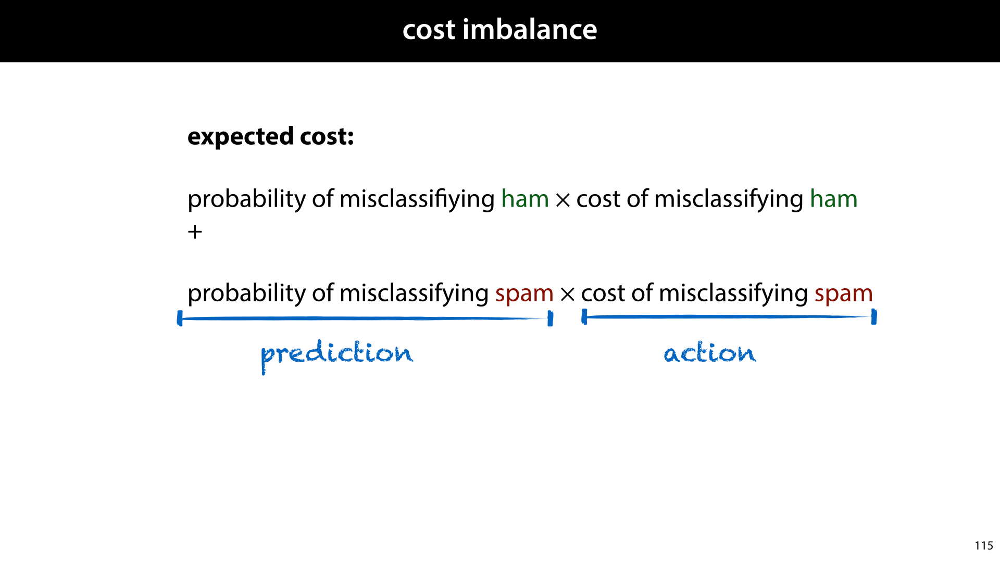

            <figcaption>
            
This is related to the question of cost imbalance. We may get good probabilities on whether an email is ham or spam, but until we know the cost of misclassification we don’t know which action to prefer (deleting the email or putting it in the inbox). The expected cost depends on how accurate our predictions are, but also on which actions we decide to connect to each of the predictions. This is an important point: cost imbalance is not a property of a classifier in isolation: it’s a property of a classifier, inside a larger system that takes actions. The cost imbalance for a system that deletes spam is very different from the cost imbalance in a system that moves spam to a junk folder. 

Here, we should always be on the lookout for creative solutions in how we use our predictions. Moving spam to a junk folder instead of deleting it, showing users multiple translations instead of just one, and so on. The best ways of minimizing cost don’t come from improving the model performance, but from rethinking the system around it. 

In questions of social impact, the cost of misclassification is usually extremely hard to quantify. If a hundred stop-and-searches lead to two cases of contraband found, how do we weigh the benefit of the contraband taken off the streets against the 98 stop-and-searches of innocent individuals. If the stop-and-search is done in a biased way, with all black people being searched at least once in their lifetime and most white people never being searched, then the stop-and-search policy can easily have a very damaging effect on how black people are view in society.  

It’s very easy, and very dangerous to think that we can easily quantify the cost of mistakes for systems like these. 

            </figcaption>
       </section>

       <section id="slide-119">
            <a class="slide-link" href="https://mlvu.github.io/generative#slide-119" title="Link to this slide.">link here</a>
            

            <figcaption>
            
<a href="https://twitter.com/OdedRechavi"><strong class="blue">https://twitter.com/OdedRechavi</strong></a> 

            </figcaption>
       </section>

       <section id="slide-120">
            <a class="slide-link" href="https://mlvu.github.io/generative#slide-120" title="Link to this slide.">link here</a>
            

            <figcaption>
            
A large part of choosing the right action to take based on a prediction, is separating <strong>correlation</strong> and <strong>causation</strong>. A lot of social issues, in AI and elsewhere, stem from confusions over correlation and causation, so let’s take a cerful look at these two concepts. 

Two observables, for instance, being black and using illicit drugs are correlated, if knowing the value of one can be used to predict the value of the other. It doesn’t have to be a good prediction, it just has to be better than it would be if we didn’t know the value of the first.  

This doesn’t mean that the first <strong>causes</strong> the second. I can from the smoke in my kitchen that my toast has burned, and if somebody tells me that my toaster has been on for half an hour, I can guess that there’s probably smoke in my kitchen. Only one of these causes the other. There are many technical definition of what constitutes causaility, but in general we say that A causes B if changing A causes a change in B. Turning off the toaster removes the smoke from my kitchen, but opening a window doesn’t stop my toast burning. 

 

            </figcaption>
       </section>

       <section id="slide-121">
            <a class="slide-link" href="https://mlvu.github.io/generative#slide-121" title="Link to this slide.">link here</a>
            

            <figcaption>
            
When talking correlation, the first thing we need to be on the lookout for is <em>spurious</em><strong> correlations</strong>. According to this data here, if we know the number of films Nicolas Cage appeared in in a given year, we can predict how many people will die by drowning in swimming pools. 

This is not because of any causal mechanism. Nicolas Cage is not driven by drowning deaths, and people do not decide to jump into their pools just because there are more Nicolas Cage movies (whatever you think of his recent career). It’s a <em>spurious correlation</em>. It looks like a relation in the data, but because we have so few examples for each, it’s possible to see such a relation by random chance (especially if you check many different potential relations). 

The key property of a spurious correlation is tha<em>t it goes away if we gather more data</em>. If we look at the years 2009-now, we will (most likely) not see this pattern.

            </figcaption>
       </section>

       <section id="slide-122">
            <a class="slide-link" href="https://mlvu.github.io/generative#slide-122" title="Link to this slide.">link here</a>
            

            <figcaption>
            
Gathering more data can hurt or help you here.  

The more features you have, the more likely it is that one of them can be predicted from the other purely by chance, and you will observe a correlation when there isn’t any. We call this <strong>wide data</strong>. 

Adding<em> instances</em> has the opposite effect. The more instances, the more sure we can be that observed correlations are true and not spurious. We call this <strong>tall data</strong>. 

Thus, if we are conservative with our features, and liberal with our instances, we can be more confident that any observed correlations are correct. The litmus test is to state the correlations you think are true and then<em> to test them on new data</em>. In life sciences, this is done through replication studies, where more data is gathered and the stated hypothesis from an existing piece of research is evaluated be the exact same experiment. In machine learning, we withhold a validation set for the first round of experiments, and then a test set for the second (and sometimes a meta-test set for replication studies).

            </figcaption>
       </section>

       <section id="slide-123">
            <a class="slide-link" href="https://mlvu.github.io/generative#slide-123" title="Link to this slide.">link here</a>
            

            <figcaption>
            
This is essentially a way of guarding against spurious correlations, or in other words, <em>overfitting is just predicting from a spurious correlation</em>. The definition of a spurious correlation is one that disappears when you gather more data, so if our correlation is spurious, it should not be present in the withheld data.  

A good machine learning model finds only <em>true correlations</em> and no <em>spurious correlations</em>. How to make that distinction without access to the withheld data, is the problem of induction. 
<aside    >This also tells us that using many features increases the probability of overfitting. If we see the target label as another column in our data, then the more different features we have, the more likely it is that over our small set of instances, one of them if correlated with the training labels. If this correlation is spurious, it goes away if we gather more data: that is, it's not present in the validation and test sets. Predicting from such a spurious correlation is overfitting.</aside><aside    ></aside>
            </figcaption>
       </section>

       <section id="slide-124">
            <a class="slide-link" href="https://mlvu.github.io/generative#slide-124" title="Link to this slide.">link here</a>
            

            <figcaption>
            
So if we rule out spurious correlations, what can we say that we have learned when we observe <strong>a correlation</strong>? 

If I see you have a runny nose, I can guess you have a cold. That doesn’t mean that having a runny nose causes colds. If I make the exam too difficult this year, it affects all grades, so somebody can  predict from your failing grade that other students are also likely to have a failing grade. That doesn’t mean that you caused your fellow student to fail. This is the cardinal rule of statistics: <strong>correlation is not causation</strong>. It is one that you’ve hopefully heard before. 

There is another rule, that is just as important, and a lot less famous. <strong>No correlation without causation.</strong> If we observe a correlation <em>and we’ve proved that it isn’t spurious</em>, there must be a causation <em>somewhere</em>. 

Simplifying things slightly, these are the ways a correlation can occur. If A and B are correlated then either A causes B, B causes A, or there is some other effect that causes both A and B (like me writing a difficult exam). A cause like C is called a <strong>confounder</strong>. 

It is important to note that C doesn’t have to be a single simple cause. It could be a large network of many related causes. In fact, causal graphs like these are almost always simplifications of a more complex reality.

            </figcaption>
       </section>

       <section id="slide-125" class="anim">
            <a class="slide-link" href="https://mlvu.github.io/generative#slide-125" title="Link to this slide.">link here</a>
            

            <figcaption>
            
So let’s return to our example of illicit drug use in America. We know that there’s a small correlation between race and illicit drug use (even though there is a far greater discrepancy in arrests). What is the causal graph behind this correlation? 

At the top we see what we can call the <em>racist interpretation</em>. That is, <em>racist</em> in the literal sense: seeing race as the fundamental cause of differences in behaviour. Put simply, this interpretation assumes a fundamental, biological difference in black people that makes them more susceptible to drug addiction. Few people hold such views explicitly these days, and there is no scientific evidence for it. But it’s important to remember that this kind of thinking was much more common not too long ago. 

At the bottom, is a more modern view, backed by a large amount of scientific evidence. Being black makes you more likely to be poor, due to explicit or implicit racism in society, and being poor makes you more likely to come into contact with illicit drugs and makes you less likely to be able to escape addiction.  

There is a third effect, which I think is often overlooked: poverty begets poverty. The less money your parents have, the lower your own chances are to escape poverty. Having to live in poverty means living from paycheck to paycheck, never building up savings, never building up resilience to sudden hardship, and never being able to invest in the long term. This means that on average, you are more likely to increase your poverty than to decrease it.  

The reason all this is relevant, is that for interventions to be effective, they must be aligned to the underlying causes. In the world above, racial profiling may actually be effective (although it could still be unjust). However, in the picture below, racial profiling actually<em> increases </em>pressure on black people, pushing them further into poverty. Even though the police <em>feel </em>like they’re arresting more drug users, they are most likely strengthening the blue feedback loop (or one similar to it).

            </figcaption>
            click image for animation
       </section>

       <section id="slide-126" class="anim">
            <a class="slide-link" href="https://mlvu.github.io/generative#slide-126" title="Link to this slide.">link here</a>
            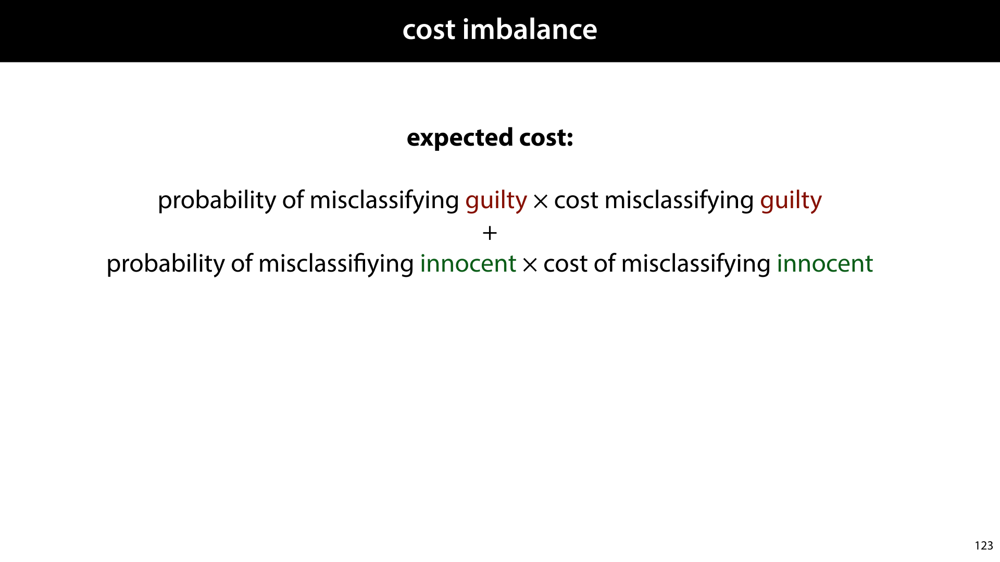

            <figcaption>
            
If we ignore data bias, and assume a perfect predictor, we still have to deal with the cost of misclassification. 

Misclassifying a guilty person can feed into this blue feedback loop. In the best case, it leads to embarrassment and loss of time for the person being searched. But there can also be more serious negative consequences.  

One subtle example is being found out for a different crime than the one you were suspected of,  due to the search. For instance, imagine that the if the predictor classifies for driving a stolen car, and during the stop, marijuana is found. This may at first seem like a win: the more crimes caught, the better. However, the result of doing this <em>based on profiling</em> is again that we are feeding into the blue feedback loop. 

There is a certain level of crime that we, as society allow to pass undetected, because detecting it would have too many negative consequences. It would cost too much to detect more crime, or infringe too much on the lives of the innocent.  

This is true for any society anywhere, although every society makes the tradeoff differently. However, if we stop people because they are predicted, through profiling, to be guilty crime X, and then arrest them for crime Y, then we end up setting this level differently for black people than for white people. Essentially, by introducing a profiling algorithm for car theft, we are lowering the probability that people get away with marijuana possession, and we are lowering it further for black people than for white people. 

 

            </figcaption>
            click image for animation
       </section>

       <section id="slide-127">
            <a class="slide-link" href="https://mlvu.github.io/generative#slide-127" title="Link to this slide.">link here</a>
            

            <figcaption>
            
Causality plays a large role in setting the rules for what is and isn’t <em>fair</em>. In law this is described as<strong> differentiation</strong>, justly treating people differently based on their attributes and <strong>discrimination</strong>, unjustly treating people differently based on their attributes. 

For instance, if we are hiring an actor to appear in in an ad for shaving cream, we have a sound reason for preferring a male actor over a female actor, all other qualifications being the same. There is a clear, common-sense causal connection between the attribute of being male and being suitable for the role. 

If we are hiring somebody to teach machine learning at a university,  preferring a male candidate over a female one, all else being equal, is generally considered wrong, and indeed illegal. This is because there is broad (though not universal) agreement that there is no causal link between your gender and how suitable you are as a teacher of machine learning. There may be <em>correlations</em>, since machine learning is still a male-dominated field, but no <em>causal</em> link. 

That is, differentiation is usually allowed, if and only if there is an unambiguous causal link between the sensitive attribute and job suitability. 

            </figcaption>
       </section>

       <section id="slide-128">
            <a class="slide-link" href="https://mlvu.github.io/generative#slide-128" title="Link to this slide.">link here</a>
            

            <figcaption>
            
Let’s take one final look at the profiling question, including everything we’ve learned. 

Say we somehow get a representative dataset, which is difficult. We somehow prevent bias amplification, which may be impossible. We apply Bayesian reasoning correctly, which is possible, we carefully design sensible actions based one some quantification of cost, which is very difficult. And we take care to consider all causal relations to avoid inadvertent costs and feedback loops,  which is difficult at best.  

Imagine a world where we can do all this, and get it right. Are we then justified in applying profiling?

            </figcaption>
       </section>

       <section id="slide-129">
            <a class="slide-link" href="https://mlvu.github.io/generative#slide-129" title="Link to this slide.">link here</a>
            

            <figcaption>
            
What we have taken so far is a purely <strong>consequentialist</strong> view. The consequences of our actions are what matters. The more positive those consequences, the more ethical the system is, and vice versa. 

            </figcaption>
       </section>

       <section id="slide-130">
            <a class="slide-link" href="https://mlvu.github.io/generative#slide-130" title="Link to this slide.">link here</a>
            

            <figcaption>
            
Consider the famous trolley problem: there is a an out of control trolley thundering down the tracks towards five people, and you can throw a switch to divert it to another track with one person on it. This illustrates some of the pitfalls of consequentialist thinking. 

The consequentialist conclusion is that throwing the switch is the ethical choice. It saves five lives and sacrifices one.

            </figcaption>
       </section>

       <section id="slide-131">
            <a class="slide-link" href="https://mlvu.github.io/generative#slide-131" title="Link to this slide.">link here</a>
            

            <figcaption>
            
Now imagine a maverick doctor who decides that he will kill one person, harvest their organs, and use them to save five terminally ill people in need of transplants. With two kidneys, two lungs and a heart he should easily be able to find the patients to save. 

From a consequentialist perspective, this is exactly the same as the trolley problem. One person dies, five are saved. And yet, we can be certain that many of the people who considered throwing the switch in the trolley problem to be the ethical choice, would not be so certain now.  

Without taking a position ourselves, what is it that makes the difference between these two situations? Why is the second example so much less agreeable to many people?

            </figcaption>
       </section>

       <section id="slide-132">
            <a class="slide-link" href="https://mlvu.github.io/generative#slide-132" title="Link to this slide.">link here</a>
            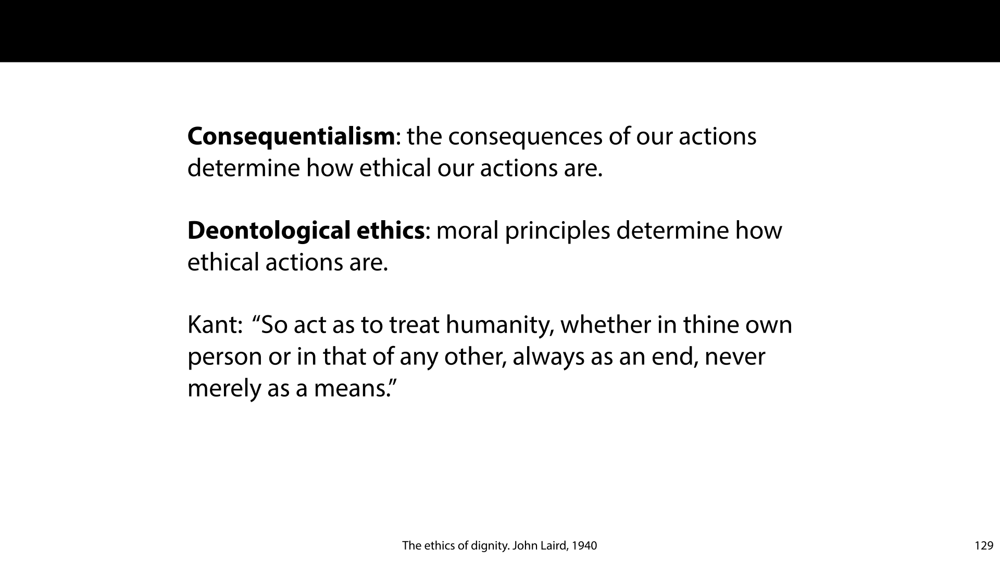

            <figcaption>
            
Without going into details, we can say that some actions are in themselves more morally disagreeable than others, regardless of the consequences. This quality, whatever it is, leads to <strong>deontological ethics</strong>. Ethical reasoning based on fundamental moral codes, regardless of consequences.  

Such codes are often tied to religion and other aspects of culture, but not always. Kant’s <em>categorical imperative</em> is an example of a rule that is not explicitly derived from some religious or cultural authority. Broadly, it states that to take an ethical action, you should only follow a rule if you would also accept it as a universal rule, applying to all. 

One aspect that crops up in deontological ethics is that of <strong>human dignity</strong>. This may be an explanation for the discrepancy between the trolley and the doctor. Flipping the switch is a brief action made under time pressure. This is in contrast to the premeditated murder and organ harvesting of an innocent person. The latter seems somehow a deeper violation of the dignity of the victim, and therefore a more serious violation of ethics. 

Kant, again, considered this a foundational principle of basic morality, to treat another human being as a means to an end, rather than as an end in themselves is to violate their dignity.  

Consider the difference between killing a human being in order to eat them and killing a human being to get revenge for adultery. From a consequentialist perspective, the first has perhaps the greater utility: in both cases, someone dies, but in one of them we get a meal out of it. From the deontological perspective of human dignity, the first is the greater sin. When we cannibalize someone, we treat them as a means to filling our stomach, without regard for their humanity. When we kill out of revenge, even though it may be wrong or disproportional, we treat the other as a human being and our action is directly related to one of theirs.

            </figcaption>
       </section>

       <section id="slide-133">
            <a class="slide-link" href="https://mlvu.github.io/generative#slide-133" title="Link to this slide.">link here</a>
            

            <figcaption>
            
To bring this back to our example, we can now say that our analysis of racial profiling is entirely consequentialist. We have been judging the cost of our actions and trying to maximize it by building the correct kind of system. It is perhaps not surprising that a lot of AI ethics follows this kind of framework, since optimizing quantities is what we machine learning researchers do best. 

The deontological view, specifically the one focused on human dignity, gives us a completely different perspective on the problem. One that makes the correctness and efficacy of the system almost entirely irrelevant. From this perspective it is<strong> fundamentally</strong> unjust to hold a person responsible for the actions of another. If we are to be judged, it should be on our own actions, rather than on the actions of another. 

To prevent crime from being committed, or to make some reparations after a crime is committed, some people need to suffer negative consequences: this ranges from being subjected to traffic stops to paying a fine. A just system only subjects those people to these negative consequences, that committed or planned to commit the crime. From this perspective, racial profiling, even if we avoided all the myriad pitfalls, is still a fundamental violation of dignity. It treats the time and dignity of Black people as a means to an end, trading it off against some other desirable property, in this case, a reduction of crime.  

While human dignity is often posed as hard constraint: something that should never be violated, in many cases this cannot be reasonably achieved. For instance, any justice system faces the possibility of convicting innocent people for the crimes of others. The only way to avoid this is to convict no one, removing the justice system entirely. So, we allow some violation of human dignity in order that we can punish the guilty.  

However, if we do have to suffer a certain probability that our dignity will be violated, we can at least ask that such violations are doled out uniformly.

            </figcaption>
       </section>

       <section id="slide-134">
            <a class="slide-link" href="https://mlvu.github.io/generative#slide-134" title="Link to this slide.">link here</a>
            

            <figcaption>
            
We won't tell you what to believe about profiling (although you may be able to guess my opinion). You'll need to decide for yourself where to draw the line. The only thing we ask is that you have a clear idea of the arguments for and against. If you argue that profiling is "effective", can you explain what exactly that means? Can you explain why none of the statistical errors above are being made, or why their impact is outweighed by other factors? 

Do you understand the difference between consequentialist and deontological arguments? Do you understand why arguments about human dignity cannot be countered with arguments for the effectiveness of profiling?

            </figcaption>
       </section>

       <section id="slide-135">
            <a class="slide-link" href="https://mlvu.github.io/generative#slide-135" title="Link to this slide.">link here</a>
            

            <figcaption>
            <aside    >image source: <a href="https://www.trouw.nl/nieuws/ouders-bij-debat-toeslagenaffaire-mijn-leven-is-naar-de-klote~bc3f3e52/"><strong class="blue">https://www.trouw.nl/nieuws/ouders-bij-debat-toeslagenaffaire-mijn-leven-is-naar-de-klote~bc3f3e52/</strong></a> </aside><aside    ></aside>
            </figcaption>
       </section>

</article>
