<nav class="menu">
    <ul>
        <li class="home"><a href="/">Home</a></li>
        <li class="name">Lecture 1: Introduction</li>
                <li><a href="#video-000">What is machine learning?</a></li>
                <li><a href="#video-021">Classification</a></li>
                <li><a href="#video-049">Other abstract tasks</a></li>
                <li><a href="#video-076">Social impact 1</a></li>
                <li><a href="#video-107">Generalization</a></li>
        <li class="pdf"><a href="https://mlvu.github.io/lectures/11.Introduction.annotated.pdf">PDF</a></li>
    </ul>
</nav>

<article class="slides">

       <section class="video" id="video-000">
           <a class="slide-link" href="https://mlvu.github.io/introduction#video-0">link here</a>
           <iframe
                src="https://www.youtube.com/embed/G5vMe_A5OTo"
                title="YouTube video player"
                frameborder="0" allow="accelerometer; autoplay; clipboard-write; encrypted-media; gyroscope; picture-in-picture"
                allowfullscreen>
           </iframe>

       </section>

       <section id="slide-001">
            <a class="slide-link" href="https://mlvu.github.io/introduction#slide-001" title="Link to this slide.">link here</a>
            

            <figcaption>
            
In this first lecture, we will look at what machine learning is, and at some of the basic definitions. We will also have a quick look at some simple methods that you might use to <em>do</em> machine learning, although we will save most of the details of these methods for later. 

We’ll start with a simple example. 

  

            </figcaption>
       </section>

       <section id="slide-002">
            <a class="slide-link" href="https://mlvu.github.io/introduction#slide-002" title="Link to this slide.">link here</a>
            

            <figcaption>
            
In the 1990s, the US postal service processed billions of letters each year. Many of them had hand-written addresses, like this one. To automate at least part of the process, people realized, it would be very helpful if computers could read, if not the whole address, then at least the zip code. Even if they couldn't get it exactly right all the time, it would still allow<em> most </em>mail to be sent to the right part of the country automatically. A small delay for rare letters that were sent to the wrong part of the country would be a small price to pay. 

Reading digits is pretty easy for us, almost all humans can do it. The problem is that this is one of those tasks that humans know how to do without knowing <em>how</em> it is that they do it. We can all read these digits, but if we met somebody who couldn’t, none of us could tell them exactly what steps they should follow to do what we do. We might say something like “a two is always a continuous line, with no loops, with a curve at the top a corner in the bottom left and a flat line at the bottom”. But that doesn’t explain how we recognize a line, a corner and a curve in the first place. It also doesn’t explain why we recognize the second digit in this zip code as a two, even though it violates our rule. 

In short, even if we have some idea of what we’re doing, we can’t make the process precise enough to turn it into a computer program. But if it's impossible to explain how to do it, how did we ourselves acquire the ability to recognize digits in the first place? We certainly weren’t born with it. 

image source: <a href="https://rafalab.github.io/dsbook/introduction-to-machine-learning.html"><strong>https://rafalab.github.io/dsbook/introduction-to-machine-learning.html</strong></a> 

            </figcaption>
       </section>

       <section id="slide-003">
            <a class="slide-link" href="https://mlvu.github.io/introduction#slide-003" title="Link to this slide.">link here</a>
            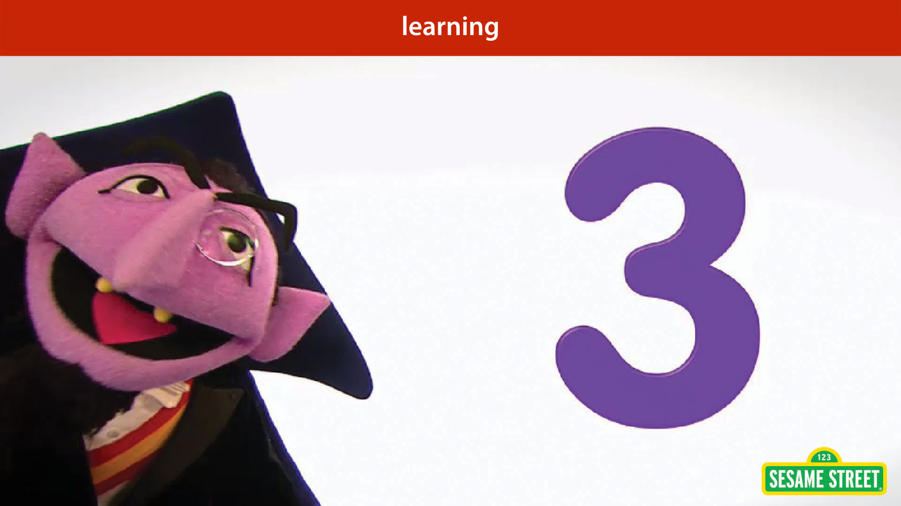

            <figcaption>
            
We <strong>learned</strong>, of course. We were shown examples of different digits and somebody told us which was which, and after a while, we figured out the general idea: what makes a 3 a 3, despite the many different ways of writing it. Nobody ever told us any explicit rules that always work, and we couldn't tell others exactly what we're doing, but somehow, from looking at examples, the concept of what makes a 3 a 3 ended up in our heads. 

Machine learning is the practice of applying the same idea to computers, or at least trying to. Instead of providing the computer with a set of instructions to follow step by step, like we normally do in programming, we provide a large number of <strong>examples</strong><em> </em>of the sort of thing we want the computer to learn. Then we try to figure out a program that recognizes the regularities in the examples and ignores the irrelevant details. 

image source: <a href="https://www.pbslearningmedia.org/resource/sesame-number-of-the-day-0/song-number-of-the-day-0-sesame-street/"><strong>https://www.pbslearningmedia.org/resource/sesame-number-of-the-day-0/song-number-of-the-day-0-sesame-street/</strong></a> 

            </figcaption>
       </section>

       <section id="slide-004">
            <a class="slide-link" href="https://mlvu.github.io/introduction#slide-004" title="Link to this slide.">link here</a>
            

            <figcaption>
            
Here is another problem that can be attacked with machine learning: playing chess. In this case, we don’t necessarily <em>need</em> machine learning. We understand chess well enough that we can actually design a chess playing program that learns nothing; it simply follows instructions, but that is still is good enough to beat the best grandmaster. In this picture, for example, we see Garry Kasparov, the world chess champion in 1997, playing a game against chess computer Deep Blue, a game he would lose. The Deep Blue system contained no learning parts, it just followed explicit instructions. 

However, just because it's possible without learning, doesn't mean we can't also do it <em>with</em> learning. In fact, the current best chess playing computer program, AlphaChess, uses a lot of machine learning.  

We can do this in different ways. Some chess computers that use learning look at databases of what good human players have done in different positions and try to generalize that knowledge. This is a bit like the digits: we select a large collection of examples for the computer, and the computer looks through them. 

Other systems learn in a more interactive way. They simply start playing, against humans, against other chess computers, or against a copy of themselves, and they remember everything they do. Then,<strong> they learn from these experiences </strong>to get better. In a sense, they are generating their own examples to learn from, by interacting with the world.

            </figcaption>
       </section>

       <section id="slide-005">
            <a class="slide-link" href="https://mlvu.github.io/introduction#slide-005" title="Link to this slide.">link here</a>
            

            <figcaption>
            
An even more complex problem is that of designing a self driving car. 

Again, we wouldn’t be able to design a set of rules that can always be followed to drive perfectly. Many important aspects of driving: following the curve of the road or recognizing pedestrians and traffic signs, are simply too complex and too poorly defined to just tell a computer what to do in a set of instructions to be followed like a recipe. 

Many of these problems can be isolated. For instance, we can collect a dataset of views from the car window, and train a model to recognize whether a stop sign is present. That doesn’t give us a self-driving car, but<strong> it solves part of the problem</strong>. For basic road following, we can observe a human driver, and see how they manipulate the steering wheel to keep the car straight. 

Here too, we could imagine a self driving car that doesn't learn from human examples, but just learns to drive by interacting with the world. It starts driving, and whenever something goes wrong, it adjusts its program. Obviously, it's best to do such things in a<em> simulated</em> world, at least at first.  

Of course, even if we successfully train all these separate modules, we still need to make sure that they then work together when we integrate them into a large system. This is very much still an open problem, and it's by no means clear that machine learning is the key to such an integration. Still, the individual smaller problems make interesting examples, which we'll look at in detail later. 

image source: the oatmeal, <a href="http://theoatmeal.com/blog/google_self_driving_car"><strong>http://theoatmeal.com/blog/google_self_driving_car</strong></a>

<a href="http://theoatmeal.com/blog/google_self_driving_car"><strong></strong></a>

            </figcaption>
       </section>

       <section id="slide-006">
            <a class="slide-link" href="https://mlvu.github.io/introduction#slide-006" title="Link to this slide.">link here</a>
            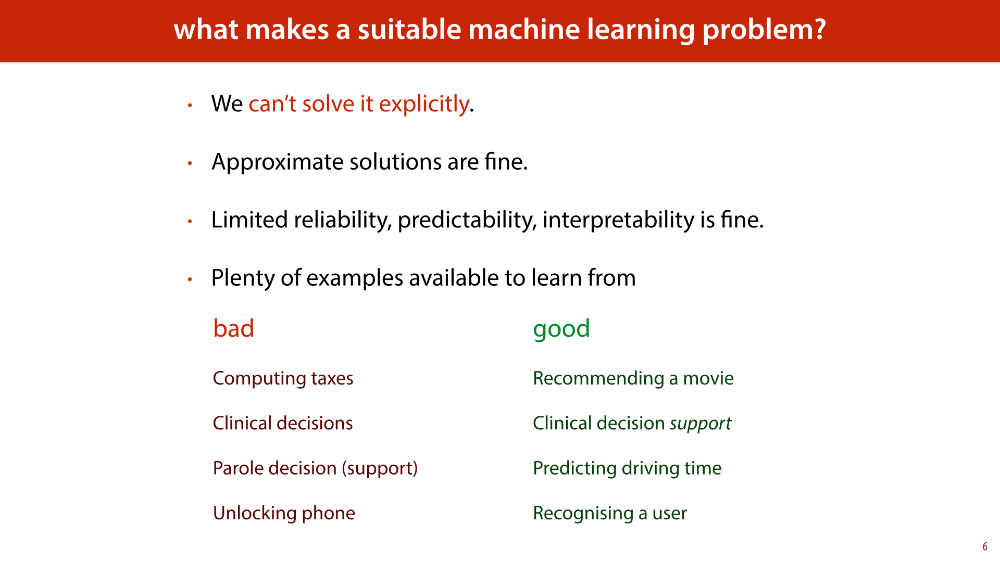

            <figcaption>
            
Let's zoom out a little, and see what kind of problems are suitable for machine learning approaches.  

In general, we are looking for settings where the requirements are forgiving: it should be fine if the learning program occasionally <strong>gets it wrong</strong>, or behaves unpredictably. We should also allow for limited <strong>interpretability</strong>: just like we can confidently recognize a 3 without offering anything to back up that confidence, machine learning programs usually allow very little insight into why we should trust their predictions, even if they are correct. Finally, machine learning works best when we have<strong> lots of examples </strong>of the kind of thing we are trying to learn. 

In a chess game, approximate solutions are acceptable: human chess players make mistakes too, so it's a domain where mistakes are expected. In zip code recognition, a mistake may cause the odd letter to be delayed, but that could be an acceptable sacrifice, if we build the rest of the system to manage such mistakes. 

Recommending a movie is also a good use case, since we have no explicit solution, and approximate solutions are fine: we can simply suggest a lot of movies to the user and let them pick. This is usually the reason why approximate solutions are accepted: we can embed the ML module in an interface that gives a user some control. In other words, we don’t give the ML system full autonomy, it is used to make suggestions to a human user. 

In self-driving cars, the question is much more complex: we need to be <em>really</em> sure that we don’t place too much trust in an unreliable pedestrian-recognizing module. This is one of the reasons why self-driving cars are not quite living up to the hype we saw a few years ago. Another bad use case is computing your taxes. Not only are approximate solutions are not acceptable in that case, we also know exactly how to compute a precise solution quickly and efficiently without any machine learning. 

We've put parole decisions and unlocking your phone (for instance by face recognition) in the "bad" column, but you should note that ML systems <em>do</em> exist for these use cases and they are widely used. We are seeing many such deployments of ML that are ill-advised at best. We'll look at some of these systems in detail as the course progresses, and we will see what the consequences can be.

            </figcaption>
       </section>

       <section id="slide-007">
            <a class="slide-link" href="https://mlvu.github.io/introduction#slide-007" title="Link to this slide.">link here</a>
            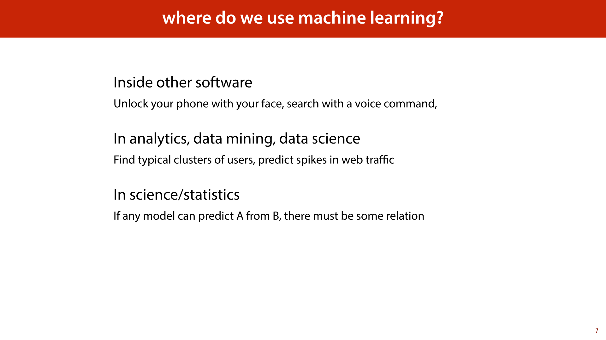

            <figcaption>
            
The most popular use of machine learning is <em>inside other software</em>. There is often one thing that we can't do explicitly, inside a larger system full of traditional software. Think of your email client detecting spam, or Netflix recommending a movie.  

Machine learning algorithms can also be used to trawl though large amounts of data to pick out interesting patterns. In such cases, they may not be embedded in software, but rather used directly by a data scientist at a company. For instance, if Netflix wants to figure out why their subscriptions always drop in January, they may ask somebody to use machine learning algorithms to analyze their data to come up with some hypotheses. Once the hypotheses have been generated, the code will be discarded. In this case, it's not the software that is the end product, but the intelligence produced by the software. 
<aside    >This is more commonly called data mining (or more generally, data science), but the methods used are the same as those used in machine learning. </aside>
Finally, we are seeing more and more machine learning methods employed in scientific research. This might simply be another form of data science, since scientists have large amounts of data to sift through as well, but we can also use machine learning models to identify relations between variables. If a machine learning model can predict one variable from another, there must be <em>some</em> relation between the two, which can then be further investigated,

            </figcaption>
       </section>

       <section id="slide-008">
            <a class="slide-link" href="https://mlvu.github.io/introduction#slide-008" title="Link to this slide.">link here</a>
            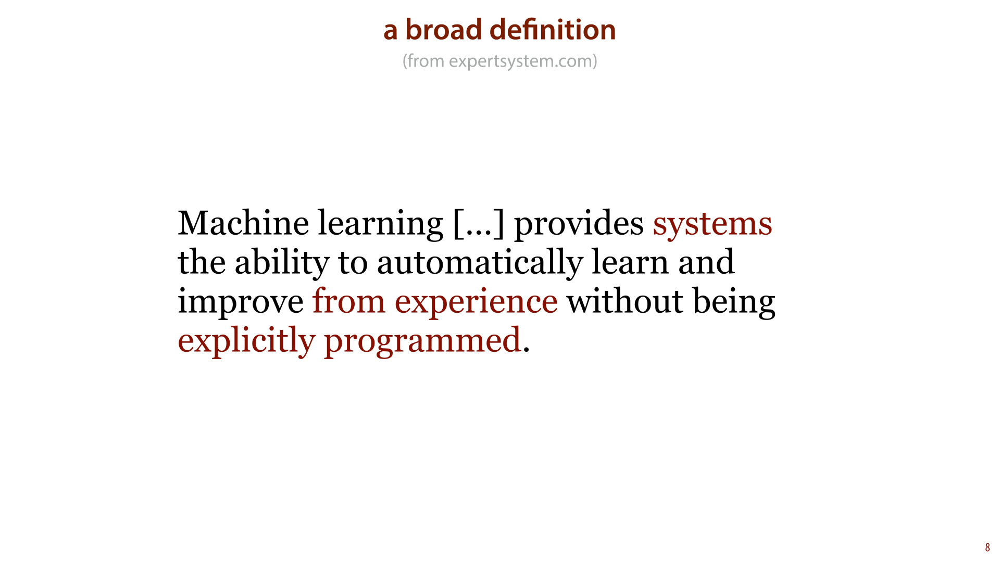

            <figcaption>
            
Now that we've seen some examples, let's see if we can find a definition of machine learning that is broad enough to capture all of this behavior. 

Here is a decent one that covers most of he important aspects. It describes a system (i.e. a computer running a program). It improves its behaviour based on experience, and the resulting behaviour has not been explicitly programmed.  

This kind of definition suggests a system that learns and acts like a human being. It continuously updates its “mind” while also constantly making decisions and taking actions  based on the information it has. This definition includes the chess program that learns from playing games, and the self-driving car that learns by driving around. 

quote source: <a href="http://www.expertsystem.com/machine-learning-definition/"><strong>http://www.expertsystem.com/machine-learning-definition/</strong></a>

<a href="http://www.expertsystem.com/machine-learning-definition/"><strong></strong></a>

            </figcaption>
       </section>

       <section id="slide-009">
            <a class="slide-link" href="https://mlvu.github.io/introduction#slide-009" title="Link to this slide.">link here</a>
            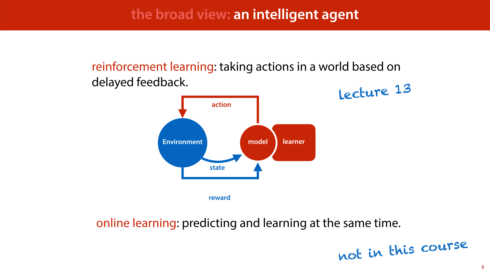

            <figcaption>
            
Such a continuously updating system is often called a<strong> learning agent</strong>. There are various subfields of machine learning that deal with such a broad view of machine learning. 

In <strong>reinforcement learning</strong>, we study true learning agents. We need to define the agent, the environment, and a reward system. The agent must learn to explore the environment, while also taking actions to maximize its rewards. Its actions may also change the environment, which the agent should take into account. Clearly, this is a very complicated type of problem to solve. We'll look at this in the very last lecture. 

In <strong>online learning</strong>, we simplify the problem a little bit. We are no longer taking <em>actions,</em> we are only predicting. That is, for each input we need to predict the right output, but what we choose to predict doesn’t affect what we will see in the future. Imagine predicting the weather. We are still learning <strong>online</strong>, however: every input we observe requires a prediction, but it also serves as an example to learn from in our future predictions: we are always predicting and learning <em>at the same time</em>. We won't deal explicitly with online learning in this course, but everything we come up with for reinforcement learning also applies to online learning problems. 

In most cases, we don’t actually need an agent that learns as it acts. In those cases, we can simplify the problem of machine learning a lot. 

            </figcaption>
       </section>

       <section id="slide-010">
            <a class="slide-link" href="https://mlvu.github.io/introduction#slide-010" title="Link to this slide.">link here</a>
            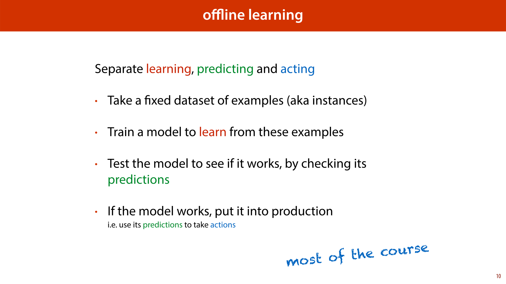

            <figcaption>
            
This simplified view is called <strong>offline learning</strong>. In<strong> </strong>offline learning you separate the acts of  

learning a model and  

putting a learned model to use.  

You gather a dataset of examples beforehand, you train a <strong>model</strong><em>, </em>test it, and once you’re sure it works well enough, you use that version of the model (for instance by sticking into a larger computer program). The finished program will never learn while it’s running.  

While this robs the exercise of some of its more exciting aspects, it still allows us to do something very useful: <em>it allows us to learn programs that we have no idea how to write ourselves</em>. If we need a digit recognizer to sort our mail, we can collect a bunch of examples, <em>train</em> one, and then put it to use. 

Almost all of this course will focus on offline learning.

            </figcaption>
       </section>

       <section id="slide-011" class="anim">
            <a class="slide-link" href="https://mlvu.github.io/introduction#slide-011" title="Link to this slide.">link here</a>
            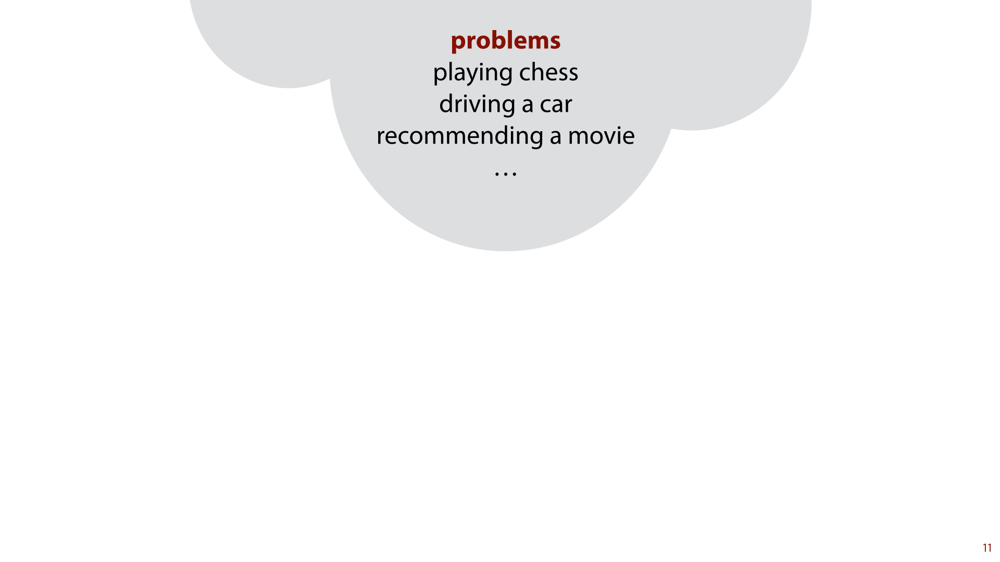

            <figcaption>
            
Now, the main problem with machine learning is that <strong>we want solutions that are applicable across domains</strong>. You don’t want to dedicate your entire life to crafting a perfect self-learning computer chess plpayer, and then find out that your ideas have no use for anything else. We want to solve the problem of machine learning <strong>in general</strong>: instead of studying each problem in isolation, we want solutions that can be applied to many problems. 

To make this possible, machine learning is often built on <strong>abstract tasks</strong> like <em>classification</em>, <em>regression</em> or <em>clustering</em>. If you have a practical problem, like chess playing, you find a way to abstract the problem of playing chess (or part of it) to the generic task of, say, classification, and then you pick one of many existing classification <em>methods</em>.

            </figcaption>
            click image for animation
       </section>

       <section id="slide-012">
            <a class="slide-link" href="https://mlvu.github.io/introduction#slide-012" title="Link to this slide.">link here</a>
            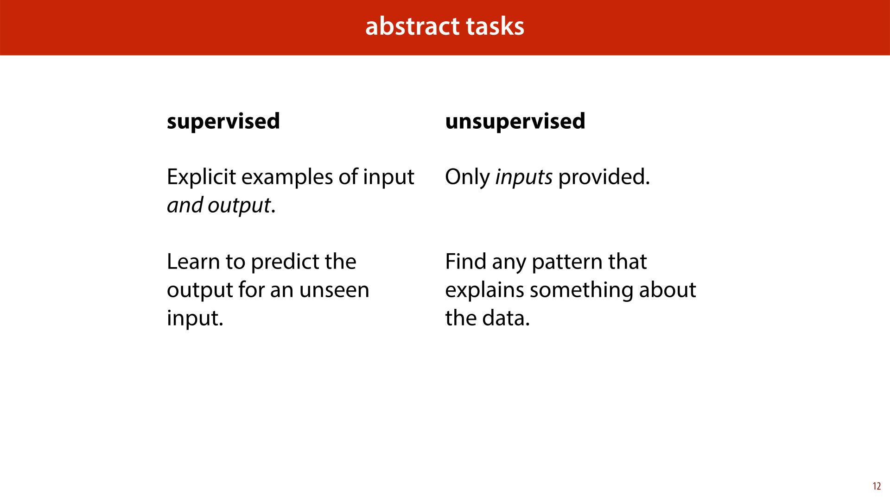

            <figcaption>
            
Abstract tasks come in two basic flavours: <strong>supervised</strong>, and <strong>unsupervised. </strong>

In supervised tasks, we have explicit examples of both inputs and the corresponding outputs. What we have to learn is the program that maps any input to the corresponding output. For instance, we may be provided with emails and given a label <strong>spam</strong> (advertising) or <strong>ham</strong> (genuine) for each. The task then, is to train a program to assign these labels to new emails. 

In unsupervised tasks, there is no target value, only the data. All we can do then is to learn some structure in the data. For instance we can cluster a dataset of students to see if there are natural groups, or we can analyze a dataset of financial transactions to see if we can isolate the ones that look "unusual". In both cases, we do this without explicit examples of the sort of thing we're looking for.

            </figcaption>
       </section>

       <section id="slide-013">
            <a class="slide-link" href="https://mlvu.github.io/introduction#slide-013" title="Link to this slide.">link here</a>
            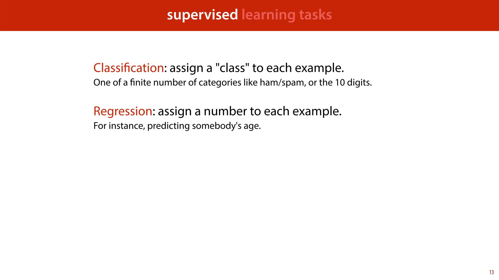

            <figcaption>
            
Most of the course will focus on supervised learning. These are the two main supervised abstract tasks: classification and regression. 

In classification, the job is to assign one of a fixed number of categories. For instance, classifiying email into the classes ham or spam is a classification problem. Recognizing digits can also be cast as a classification problem, since there are 10 possible digits we can predict for a given example. 

If the thing we are prodicting is not a category, but a number, we call the task regression. For instance, if we want to predict a person's age, we might cast this as a regression problem.

            </figcaption>
       </section>

       <section id="slide-014">
            <a class="slide-link" href="https://mlvu.github.io/introduction#slide-014" title="Link to this slide.">link here</a>
            <iframe
                src="https://www.youtube.com/embed/7BtLqqJVP9w"
                title="YouTube video player"
                frameborder="0" allow="accelerometer; autoplay; clipboard-write; encrypted-media; gyroscope; picture-in-picture"
                allowfullscreen>
            </iframe>

            <figcaption>
            
We'll go into classification and regression in more detail in the next videos. For now, here is a video that illustrates the basic idea. 

video source: <a href="https://www.youtube.com/watch?v=7BtLqqJVP9w"><strong>https://www.youtube.com/watch?v=7BtLqqJVP9w</strong></a>, <a href="https://archive.org/details/perceptron_documentary_excerpt"><strong>https://archive.org/details/perceptron_documentary_excerpt</strong></a> 

            </figcaption>
       </section>

       <section id="slide-015">
            <a class="slide-link" href="https://mlvu.github.io/introduction#slide-015" title="Link to this slide.">link here</a>
            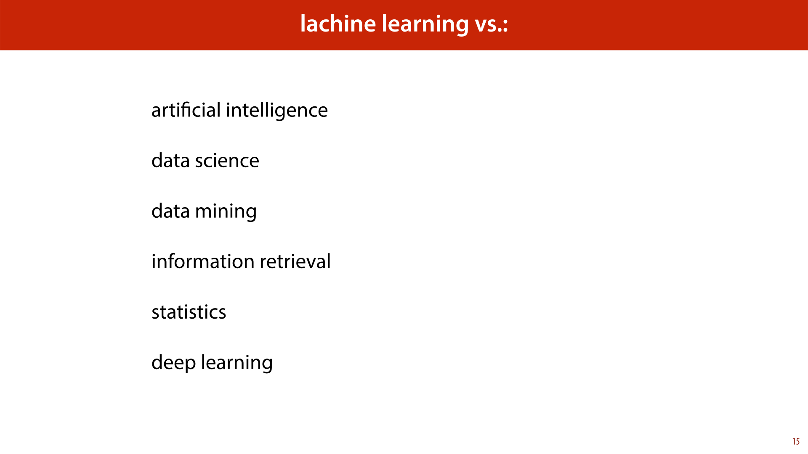

            <figcaption>
            
I’ve told you what machine learning is. Now let’s look at what it<em> isn’t</em>. To finish up this video, let’s see how machine learning relates to other fields of study: where they overlap and how they differ. 

            </figcaption>
       </section>

       <section id="slide-016">
            <a class="slide-link" href="https://mlvu.github.io/introduction#slide-016" title="Link to this slide.">link here</a>
            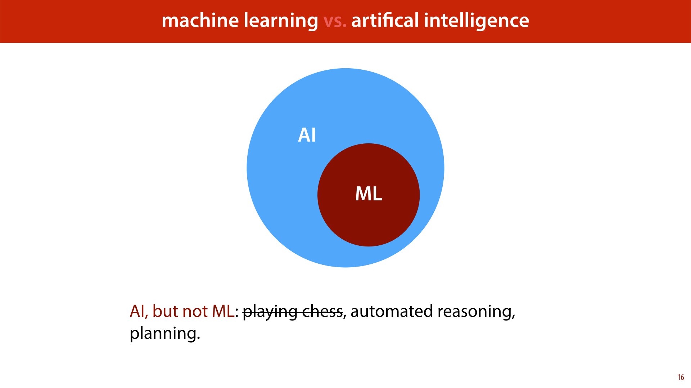

            <figcaption>
            
First up, <strong>Artificial Intelligence</strong> (AI). Machine learning is a subfield of AI. If we want to make a general AI that can do everything we can, it needs to be capable of learning. But there are many other problems and fields in AI that have nothing to do with learning. 

Other subfields, like natural language processing, are greatly helped by machine learning techniques, but can also be tackled without. In recent years machine learning has taken a much larger role in AI and many more aspects of AI are now dominated by machine learning approaches. However, the two terms still have very different meanings. 

For instance, when I started this course in 2018, the best chess computers used no learning at all. Since then, AlphaChess, which does use machine learning, has taken the crown.

            </figcaption>
       </section>

       <section id="slide-017">
            <a class="slide-link" href="https://mlvu.github.io/introduction#slide-017" title="Link to this slide.">link here</a>
            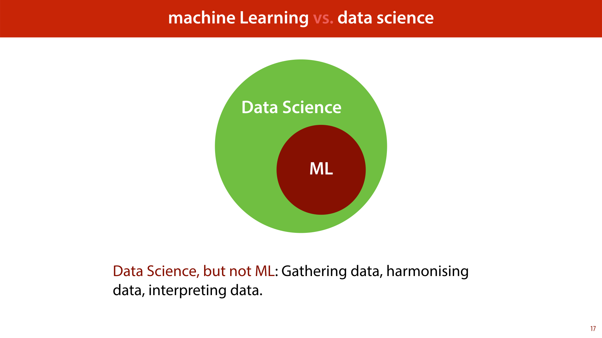

            <figcaption>
            
Similarly all machine learning is <strong>data science</strong>, but not all Data Science is machine learning. Often, machine learning is used as part of a larger data science pipeline.  

Some of these aspects of data science are very important to know if you want to do machine learning. We'll look at some of them in lectures 3 and 5.

            </figcaption>
       </section>

       <section id="slide-018">
            <a class="slide-link" href="https://mlvu.github.io/introduction#slide-018" title="Link to this slide.">link here</a>
            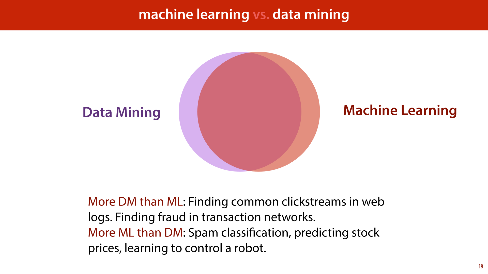

            <figcaption>
            
Here is a more subtle distinction: <strong>data mining</strong> and machine learning. Opinions differ, but I would characterize them as follows. Both analyze data, but they do so with different aims: machine learning aims to produce a <em>model </em>of the data, while data mining aims to produce intelligence <em>about</em> the data. The methods are often the same, the difference is in which we consider the end product: the software or the knowledge. 

Another distinction is that machine learning focuses on prediction: trying to <em>predict</em> a target value for new data, whereas data mining more often tries to navigate and simplify the data so that it becomes useful for users.  

If you have a dataset, but you expect never ever to see any new data from the same source, you can still perform data mining on it, but performing machine learning on it is not much use (although your data mining will probably use machine learning <em>techniques</em>).

            </figcaption>
       </section>

       <section id="slide-019">
            <a class="slide-link" href="https://mlvu.github.io/introduction#slide-019" title="Link to this slide.">link here</a>
            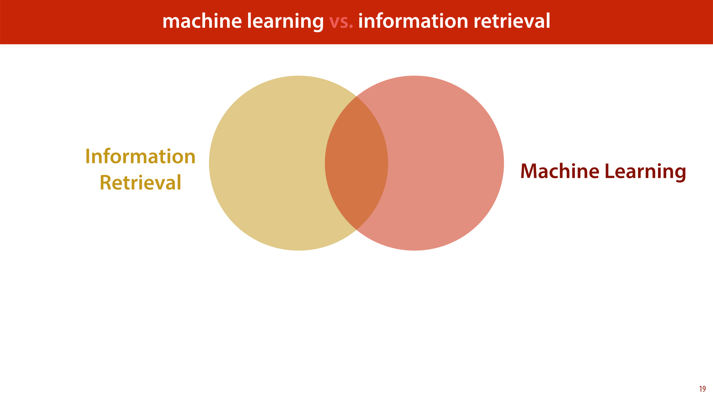

            <figcaption>
            
<strong>Information retrieval</strong> (building search engines) may look at first like a field that is completely distinct from ML. But on closer inspection, it turns out that you can model IR as a kind of classification task: your instances are documents, and your aim is to classify them into relevant or irrelevant (for a particular query).  

This may seem a bit extreme, but this view has actually helped us in machine learning to think more clearly about problems with high class-imbalance (where <em>ranking</em> is a more appropriate way to think about the task than classification). 

            </figcaption>
       </section>

       <section id="slide-020">
            <a class="slide-link" href="https://mlvu.github.io/introduction#slide-020" title="Link to this slide.">link here</a>
            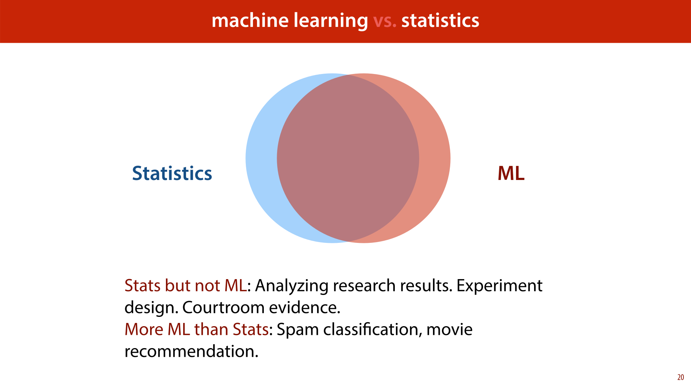

            <figcaption>
            
Here is  another subtle distinction. <strong>Statistics</strong> and machine learning both focus on analyzing data, and modeling it in some way. In fact, many of the models we use in machine learning were invented by statisticians long before machine learning even existed. The distinction isn’t always clear, but the most important difference is probably that statistics aims to get at the <em>truth</em>, whereas machine learning tries to come up with something that <em>works,</em> regardless of whether it’s true.  

Consider spam classification. We usually model emails as a bag of independently drawn words. This has nothing to do with the way emails are actually written. Still, it works well enough to let people control their inbox. The machine learning model doesn't reflect reality, but it works for the task in hand. 

Contrast this with proving in a courtroom that a particular piece of DNA evidence really puts a suspect at the scene of the crime. Here, we’re interested in more than just getting a useful model that captures some of the data, we need the whole truth and nothing but the truth. For this, the model that we fit to the data needs to have some quantifiable resemblance to the process that actually produced the data. This is a difficult thing to establish, and it is something that machine learning doesn't usually bother with.

            </figcaption>
       </section>

       <section id="slide-021">
            <a class="slide-link" href="https://mlvu.github.io/introduction#slide-021" title="Link to this slide.">link here</a>
            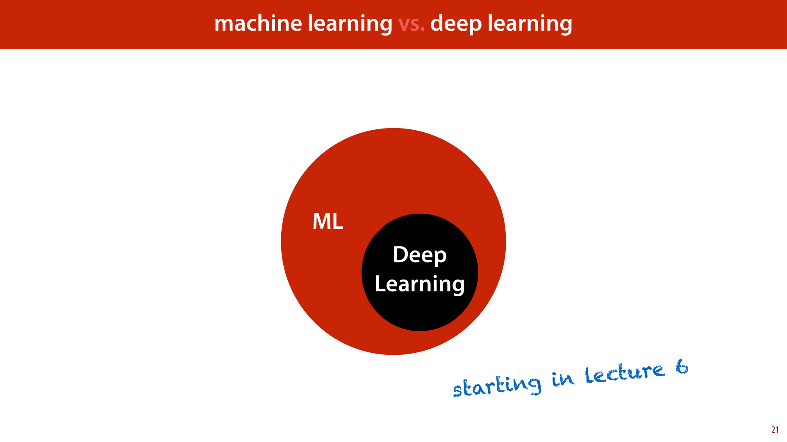

            <figcaption>
            
Finally, you may have heard a lot in the news in recent years about <strong>deep learning</strong> and wondered whether it is the same as machine learning or something different, or what. Here I can be clear. Deep learning is a subfield of machine learning. All deep learning is machine learning but not all machine learning is deep learning.  

We will discuss deep learning, and what makes it so special at various points in the course.

            </figcaption>
       </section>

       <section class="video" id="video-021">
           <a class="slide-link" href="https://mlvu.github.io/introduction#video-21">link here</a>
           <iframe
                src="https://www.youtube.com/embed/NPqYy-OuNEA"
                title="YouTube video player"
                frameborder="0" allow="accelerometer; autoplay; clipboard-write; encrypted-media; gyroscope; picture-in-picture"
                allowfullscreen>
           </iframe>

       </section>

       <section id="slide-022">
            <a class="slide-link" href="https://mlvu.github.io/introduction#slide-022" title="Link to this slide.">link here</a>
            

            <figcaption>
            
 

            </figcaption>
       </section>

       <section id="slide-023">
            <a class="slide-link" href="https://mlvu.github.io/introduction#slide-023" title="Link to this slide.">link here</a>
            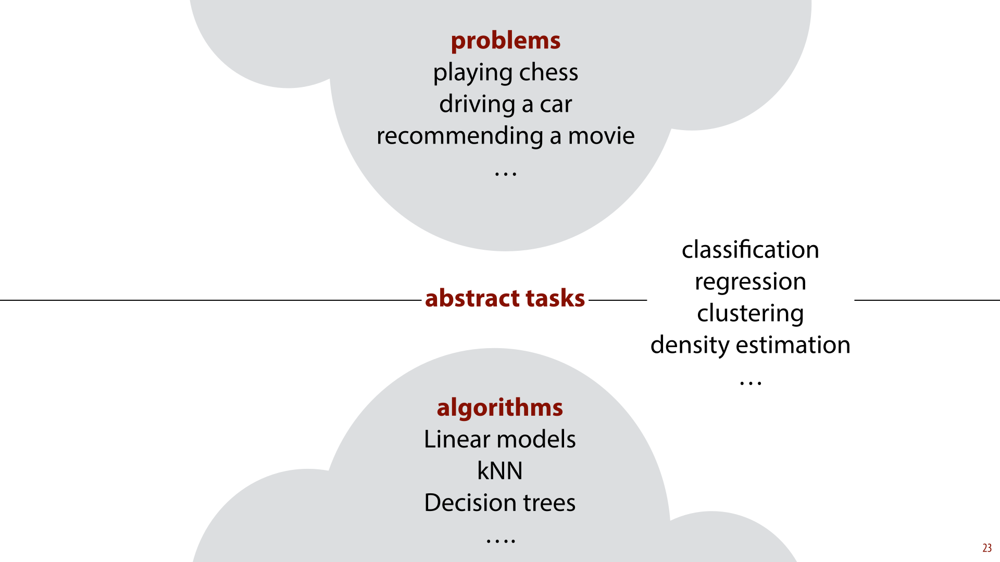

            <figcaption>
            
In the last video we showed this diagram of how machine learning usually works: we have a problem, we translate a part of that problem to an abstract task, and then we take an existing algorithm for that standard task and implement it.

            </figcaption>
       </section>

       <section id="slide-024">
            <a class="slide-link" href="https://mlvu.github.io/introduction#slide-024" title="Link to this slide.">link here</a>
            

            <figcaption>
            
In this video we will look in detail at one of the main abstract tasks for supervised learning: <strong>classification.</strong>

<strong></strong>

            </figcaption>
       </section>

       <section id="slide-025" class="anim">
            <a class="slide-link" href="https://mlvu.github.io/introduction#slide-025" title="Link to this slide.">link here</a>
            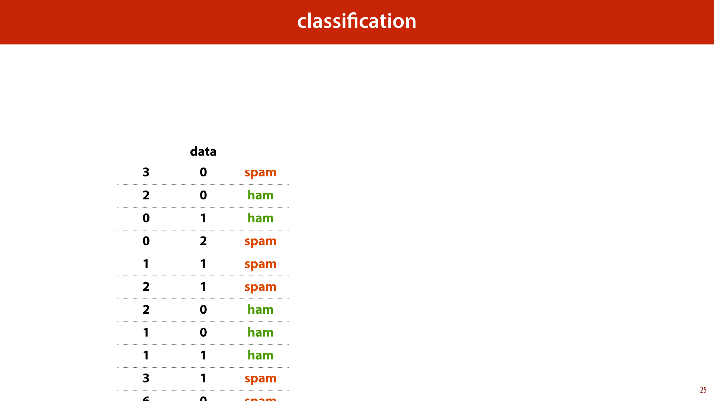

            <figcaption>
            
This is the basic framework of classification. The data that we provide our system with consists of examples, called <strong>instances</strong>, of the things we are trying to learn something about. In this example, our instances are e-mails. 

We must then make a series of measurements about each instance. In the case of e-mails, we may measure how often a specific word occurs. The things we measure are called the<strong> features</strong> of the instance. We can measure numeric features (like age or speed), but they can also be categoric (like gender or color). What we measure is up to us. Picking the right features is a big part of the art of building machine learning systems. 

Finally we have the <strong>target value</strong>: the thing we are trying to learn. In classification, this is always a categoric value, or a <em>class</em>: one of a handful of possible values. In this case, is the e-mail spam (an unwanted advertising e-mail), or ham (a genuine e-mail). 

This dataset is then fed to a <strong>learning algorithm</strong>. This can be anything, but it has to produce a<strong> classifier</strong>. A classifier is a small “machine” that makes the required class predictions. That is, it takes a new instance, one that wasn’t in the original dataset, and for which we don’t know the target class, and it makes a guess at what the correct class is..  

Note that the model in this example predicts "spam" for the instance, even though it has seen the same instance in its data with the label "ham" (in the eighth row). This is perfectly possible: the job of the model is not to memorize the data but to learn from it. Often the model needs to discard specific details it has seen in order to do its job well. 

 

 

            </figcaption>
            click image for animation
       </section>

       <section id="slide-026">
            <a class="slide-link" href="https://mlvu.github.io/introduction#slide-026" title="Link to this slide.">link here</a>
            

            <figcaption>
            
Let’s look at some examples of how we can reduce real-world problems to classification. We’ll start with <strong>handwriting recognition</strong>. Specifically, reading a ZIP code on an envelope. This involves many difficult problems: aligning the envelope, finding the address, finding the ZIP code within the address, segmenting the address into digits, etc.  

Our first step is to reduce the problem to a simple classification problem: we will assume that we are given an image of a <em>single digit</em>, and the task is to predict what the digit is. This is a much simpler problem, but still a challenging one. We’ll leave all the other problems to other people to solve (either using traditional approaches, or with more machine learning). 

The next step is to gather some training data we can learn from. 

image source: <a href="https://rafalab.github.io/dsbook/introduction-to-machine-learning.html"><strong>https://rafalab.github.io/dsbook/introduction-to-machine-learning.html</strong></a> 

            </figcaption>
       </section>

       <section id="slide-027">
            <a class="slide-link" href="https://mlvu.github.io/introduction#slide-027" title="Link to this slide.">link here</a>
            

            <figcaption>
            
First, we need a lot of pictures of handwritten digits. This is often easy enough with a little clever automation. The second part is more challenging: somebody needs to annotate what digit each picture represents. If we could automate that step, we wouldn’t need a classifier, so there’s no getting away from the fact that we need to do that by hand. 

In the 1980s, researchers at NIST (a US agency) built such a dataset, originally for the purpose of helping the US to evaluate the many digit recognition systems that were becoming available on the  market. This evolved into the the MNIST dataset. It contains 60 000 examples of handwritten digits. This translates very simply to classification: each picture of a digit is an<strong> instance</strong>, and the <strong>target</strong> is one of ten classes: 0, 1, 2, 3, 4, 5, 6, 7, 8 or 9. 

MNIST is a very famous dataset in machine learning. You can see the details of the story of MNIST explained in this lecture: <a href="https://www.youtube.com/watch?v=oKzNUGz21JM"><strong>https://www.youtube.com/watch?v=oKzNUGz21JM</strong></a>

<a href="https://www.youtube.com/watch?v=oKzNUGz21JM"><strong></strong></a>

            </figcaption>
       </section>

       <section id="slide-028" class="anim">
            <a class="slide-link" href="https://mlvu.github.io/introduction#slide-028" title="Link to this slide.">link here</a>
            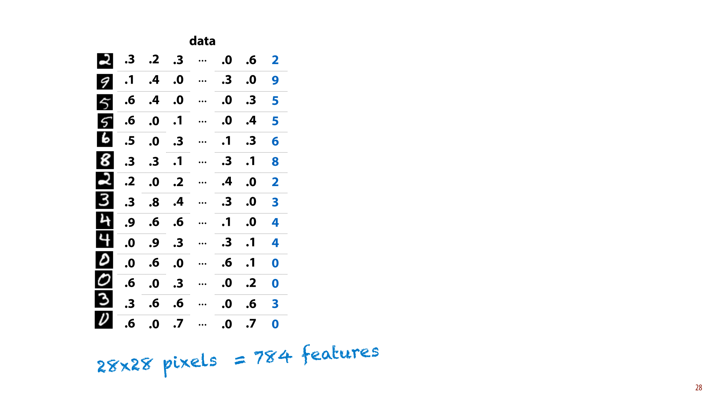

            <figcaption>
            
A simple way of attacking this problem is to make each pixel a feature. Here’s what that looks like. For each instance, we translate each pixel to a value between 0 (black) and 1 (white). This gives us instance with 784 features each, labeled with a digit from 0 to 9. We lose the information about how these features are arranged in a grid, the whole image is flattened into a long string of numbers, but with a bit of luck a good classifier can still make some sense out of it. 

We feed these instances to the learning algorithm, which produces a classifier. We then get a new example, and ask the classifier what it thinks. Once we have a classifier that does well, we can use it in a larger system, for recognizing digits. 

The current  best performing classifier for this task has a <a href="http://rodrigob.github.io/are_we_there_yet/build/classification_datasets_results.html#4d4e495354"><strong>probability of 0.21% </strong></a>of getting an unseen example wrong. 

Note that we haven’t fully solved the problem of character recognition. We still need to cut a sequence of digits into individual digits, feed those digits to the classifier and process the results. This all the work we have to to to translate our<strong> real problem </strong>to the <strong>abstract problem</strong> of classification. This is often the situation: machine learning solves part of the problem for us, but there is still a lot of engineering required to turn this solution into a working production system.

            </figcaption>
            click image for animation
       </section>

       <section id="slide-029">
            <a class="slide-link" href="https://mlvu.github.io/introduction#slide-029" title="Link to this slide.">link here</a>
            

            <figcaption>
            
Let’s look a problem that requires a little more work to abstract into classification: playing chess. The trick again is to make things easy for ourselves by only abstracting <em>part of the problem</em>. We won’t solve the whole thing with machine learning, but we’ll learn a function that’ll be useful in a larger chess-playing system. 

            </figcaption>
       </section>

       <section id="slide-030">
            <a class="slide-link" href="https://mlvu.github.io/introduction#slide-030" title="Link to this slide.">link here</a>
            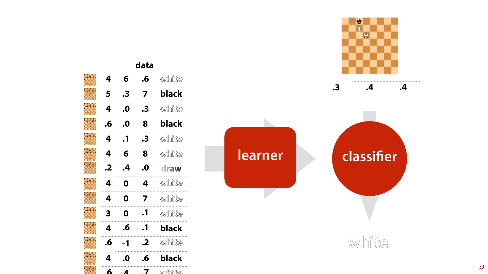

            <figcaption>
            
For instance, we could take a database of chess games, and label each position with which player ended up winning the game in the end. The aim is to predict, for given a position, which player is going to win the game.  

We could turn such a classifier into a chess player, by searching for positions from which we are likely to win and then playing moves that are likely to lead to those positions. Perhaps you are familiar with the minimax algorithm: you could use a classifier like this as a value function (also known as a heuristic) in minimax . 

A difficult problem here is <em>which features to use</em>. How do we translate different aspects of a chess position into numbers or categories in a way that will allow us to predict who is going to win? 

One option is to report how much of each black and white piece is left, which would allow at least some positions to be predicted accurately: if one player has a strong material advantage, they will probably win. For more insightful learning, we need better features.<strong> Domain expertise</strong> can often be translated to good features: are there passed pawns, rooks on an open file, does a player own both bishops, etc. All of these can be turned into features. The more of such features we can come up with, the better our algorithm may perform. 

Again, we haven’t solved the whole problem of learning how to play chess, but we’ve abstracted part of our problem into classification, hopefully making our life a little easier.

            </figcaption>
       </section>

       <section id="slide-031">
            <a class="slide-link" href="https://mlvu.github.io/introduction#slide-031" title="Link to this slide.">link here</a>
            

            <figcaption>
            
Last example, a self driving car. How do we turn part of the problem of  making a self driving car into a classification problem? 

image source: the oatmeal, <a href="http://theoatmeal.com/blog/google_self_driving_car"><strong>http://theoatmeal.com/blog/google_self_driving_car</strong></a>

<a href="http://theoatmeal.com/blog/google_self_driving_car"><strong></strong></a>

            </figcaption>
       </section>

       <section id="slide-032">
            <a class="slide-link" href="https://mlvu.github.io/introduction#slide-032" title="Link to this slide.">link here</a>
            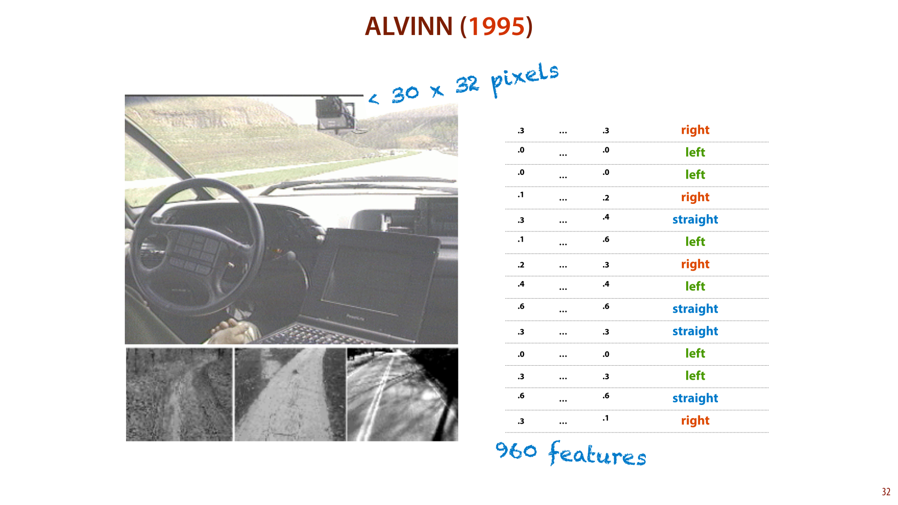

            <figcaption>
            
Here is an actual self-driving car system from 1995. They used a very low-resolution, black-and-white camera to film the road, and observed a human driver’s behavior to label each frame with an action. As with the digit recognition example, we simply make each pixel a feature.  

Once we've trained a classifier, we can hook its input up to the camera and its output up to the steering wheel. 

This very simple system actually drove from coast-to-coast autonomously in the US (albeit with a human driver executing the system’s instructions). It may not be safe enough to deal with all situations, but it can certainly follow different types of road. 
<aside    >NB: The actual system had more than three actions to allow for more gentle steering. You could also model this as regression, predicting the angle of the steering wheel as a single number, but this system modeled it as classification.</aside><aside    ></aside>
            </figcaption>
       </section>

       <section id="slide-033">
            <a class="slide-link" href="https://mlvu.github.io/introduction#slide-033" title="Link to this slide.">link here</a>
            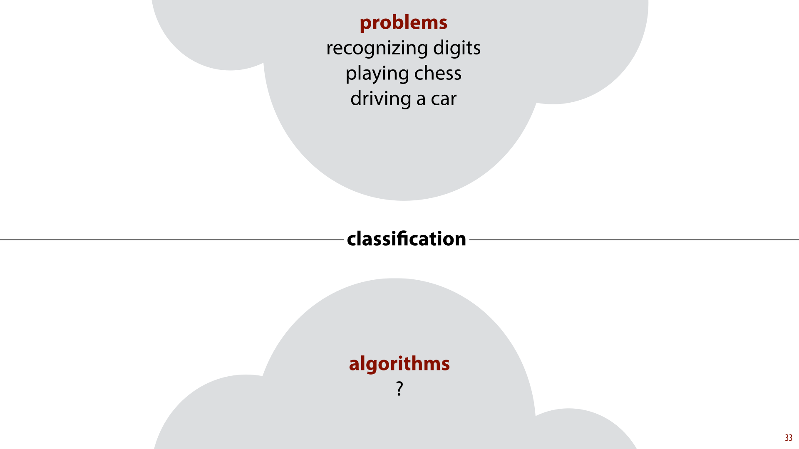

            <figcaption>
            
This is what I meant by <em>translating problems into abstract tasks</em>. By translating all these problems into classification problems, we can now apply any <strong>classification algorithm</strong> and see how well it does.  

So how do we fill in the other half of this picture? Once we have a classification task, with features selected and a set of good examples, how do we actually produce a classifier? 

We’ll look at three simple examples: a l<strong>inear classifier,</strong> a <strong>decision Tree classifier </strong>and a<strong> nearest neighbors classifier</strong>. We’ll only explain them briefly to give you a sense of how these problems might be solved. Don’t worry if you don’t totally get it yet. All methods will be discussed in more detail in later lectures. 

            </figcaption>
       </section>

       <section id="slide-034">
            <a class="slide-link" href="https://mlvu.github.io/introduction#slide-034" title="Link to this slide.">link here</a>
            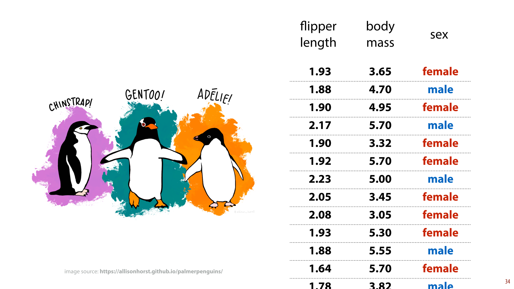

            <figcaption>
            
We'll use this dataset to illustrate each algorithm. Its <strong>instances</strong> are penguins, the two<strong> features</strong> are the flipper length (in dm) and the body mass (in kg). The class is their biological sex, restricted to male or female. Are these two features enough to guess a penguin's sex? 

data source: <a href="https://allisonhorst.github.io/palmerpenguins/"><strong>https://allisonhorst.github.io/palmerpenguins/</strong></a>, <a href="https://github.com/mcnakhaee/palmerpenguins"><strong>https://github.com/mcnakhaee/palmerpenguins</strong></a> (python package) 

image source: <a href="https://allisonhorst.github.io/palmerpenguins/"><strong>https://allisonhorst.github.io/palmerpenguins/</strong></a>

<a href="https://allisonhorst.github.io/palmerpenguins/"><strong></strong></a>

            </figcaption>
       </section>

       <section id="slide-035">
            <a class="slide-link" href="https://mlvu.github.io/introduction#slide-035" title="Link to this slide.">link here</a>
            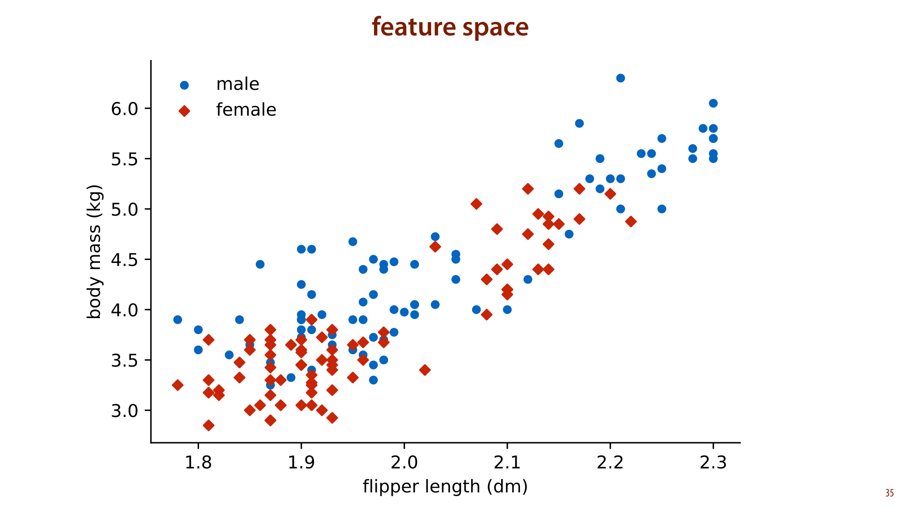

            <figcaption>
            
Since we have only two features, we can easily plot our dataset. 

We call this space, where every feature is an axis and every instance is a point, the <strong>feature space</strong>. If we had 3 features, it would be a 3D space. For higher numbers of features, we may have difficulty visualizing the feature space, but that shouldn’t stop the classifier: any classification method we come up with should, in principle, work on an arbitrary number of features.

            </figcaption>
       </section>

       <section id="slide-036" class="anim">
            <a class="slide-link" href="https://mlvu.github.io/introduction#slide-036" title="Link to this slide.">link here</a>
            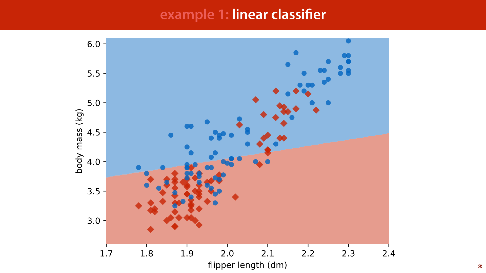

            <figcaption>
            
Here is a simple idea for a classifier: <em>draw a line</em>. We just draw a line somewhere through our space, and call everything above the line <strong class="blue">male</strong>, and below it <strong class="red">female</strong>. If we draw a good line, we may get most of the examples right. 

This is the line returned by one algorithm for fitting such lines. As you can see many examples end up misclassified, but some points are the correct side of the line. Our classifier might just do a little better than one that would simply guess at random. 

Once we have a line we are happy with, then if we see a new penguin, all we need to do is measure them, and see whether they end up above or below the line. 

            </figcaption>
            click image for animation
       </section>

       <section id="slide-037">
            <a class="slide-link" href="https://mlvu.github.io/introduction#slide-037" title="Link to this slide.">link here</a>
            

            <figcaption>
            
An important thing to note is that “drawing a line” is a technique that only works in two dimensions (i.e. if we have two features). Our methods need to work, at least in principle, for whatever number of features we decide to use. The more generic version of the idea to “draw a line” is to cut the feature space in two using a line-like shape. 

In 1D, the equivalent structure is a point. Anything above the point we guess is male, anything below it, female. 

In 3D, we can cut the feature space in two with a <em>plane</em>. 
<aside    >We've drawn only a segment of the plane here, but you should imagine it extending infinitely in all directions. </aside>
In four or more dimensions, the shape that cuts the space in two is called a <strong>hyperplane</strong>. We can no longer draw it intuitively, but luckily the mathematics are very simple. We’ll see how to define this in the next lecture.

            </figcaption>
       </section>

       <section id="slide-038" class="anim">
            <a class="slide-link" href="https://mlvu.github.io/introduction#slide-038" title="Link to this slide.">link here</a>
            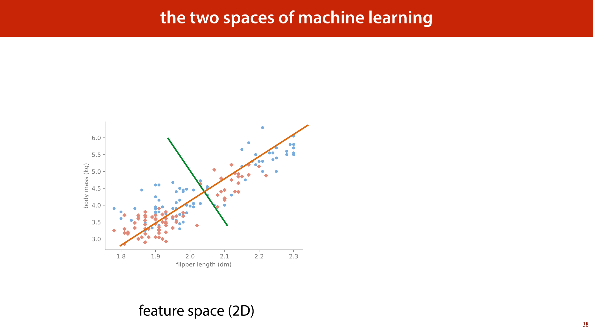

            <figcaption>
            
Let's stay in two dimensions for now. Which line should we choose? Some lines separate the classes pretty well, and some not at all. 

We can visualise this problem in the feature space. In the feature space (or instance space), each instance is a point, and our current classifier is a line.  

The simplest way to define a line in two dimensions is with three numbers: one multiplier for each feature (a and b) and a value that is added independent of the features (c). This means that there is a 3-dimensional space, with axes a, b and c where every point is a possible line in our feature space. We call this the model space. It is simply the space of all models available to us, given the assumptions we have made. In this case, the assumption is that the model is a line, and the model space becomes a 3-dimensional Euclidean space. 
<aside    >It's also possible to define a line in just two numbers. This is more compact, but the approach shown here, while slightly redundant, generalizes more easily to larger numbers of features. </aside>
Our job now, it to search the model space for a model that fits the data well. In order to do that, we need to define what it means to fit the data well. This is done by the <strong>loss function</strong>.

            </figcaption>
            click image for animation
       </section>

       <section id="slide-039">
            <a class="slide-link" href="https://mlvu.github.io/introduction#slide-039" title="Link to this slide.">link here</a>
            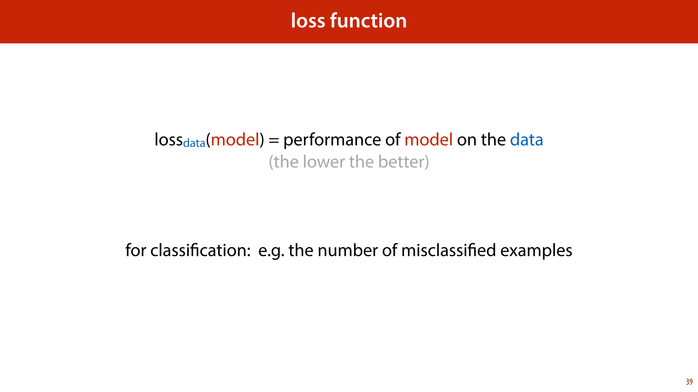

            <figcaption>
            
A <strong>loss function</strong> simply tells us how much we like a given model for the current data. The lower the better. 

Note that the loss function has the <strong>model</strong> as it argument and the <strong>data</strong> as a constant (as opposed to the model itself, which has the data as its argument). 

The best loss function to use for classification is a complex question. We’ll come back to that later. For now, we can just use the number examples that the model classifies incorrectly. The lower this is, the better.

            </figcaption>
       </section>

       <section id="slide-040">
            <a class="slide-link" href="https://mlvu.github.io/introduction#slide-040" title="Link to this slide.">link here</a>
            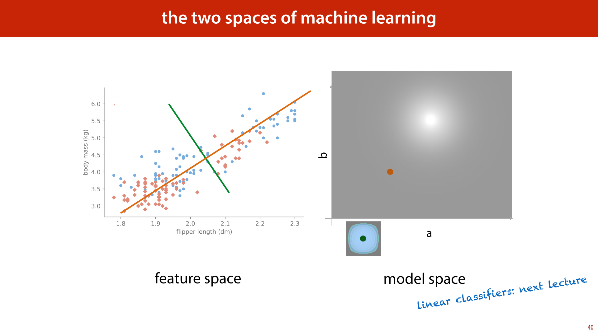

            <figcaption>
            
Once we have a loss function, we can colour our model space with the<em> loss of each model </em>(for our current data). The brighter, the better.  

All we need to do now is find the brightest point, which corresponds to the best model. More on that next lecture.  
<aside    >In this case we can simply see where the brightest point is, but remember that the model space is usually high-dimensional.</aside><aside    ></aside>
            </figcaption>
       </section>

       <section id="slide-041">
            <a class="slide-link" href="https://mlvu.github.io/introduction#slide-041" title="Link to this slide.">link here</a>
            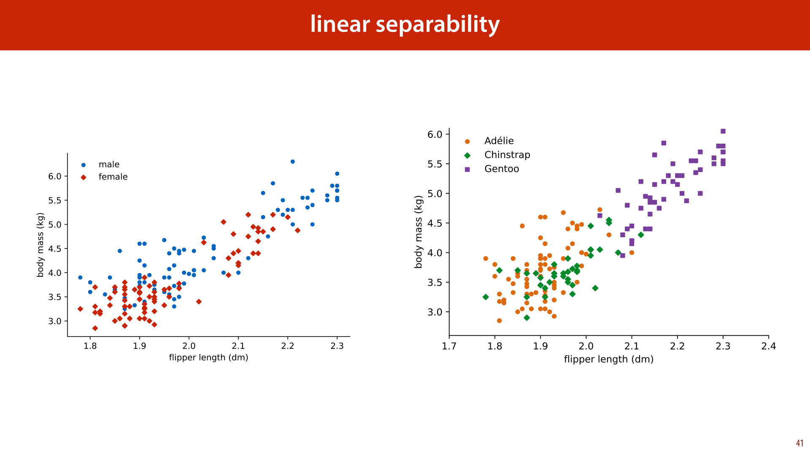

            <figcaption>
            
The problem with this particular classification task is that it just isn't possible to separate the two classes very well with a single line. This is because we are actually looking at three different species of penguins. Within each species cluster, the classes can actually be separated much easier. But if the species data is not available, we'll need to look into non-linear methods of classification.

            </figcaption>
       </section>

       <section id="slide-042" class="anim">
            <a class="slide-link" href="https://mlvu.github.io/introduction#slide-042" title="Link to this slide.">link here</a>
            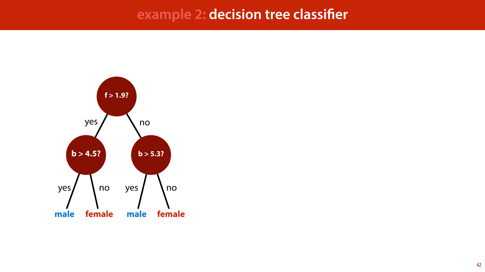

            <figcaption>
            
Here is one such approach: <strong>a decision tree</strong>. This classifier consists of a tree, which studies one feature in isolation at every node. In this case, it moves left if the feature is lower than some threshold value, and right if the feature is higher. 

We won't go into the training algorithm in detail. Often, decision trees are “grown” by adding nodes from the root until a particular criterion is reached. We’ll discuss how to train decision trees in detail in week 5. The algorithm is pretty simple, but all we want to show you here is that there are other ways to "carve up" your feature space, beyond drawing a line. 

Note that the model space for decision trees is a little more abstract than that for linear classifiers. We can just pick n numbers to represent a model, we have to think about the space of all possible trees, labeled with inequalities on the features. In such cases, it may be better to forget about the model space, and to come up with a training algorithm using a different perspective. 

The shape that he classifier draws in feature space to segment the two classes is called the<strong> decision boundary</strong>.

            </figcaption>
            click image for animation
       </section>

       <section id="slide-043">
            <a class="slide-link" href="https://mlvu.github.io/introduction#slide-043" title="Link to this slide.">link here</a>
            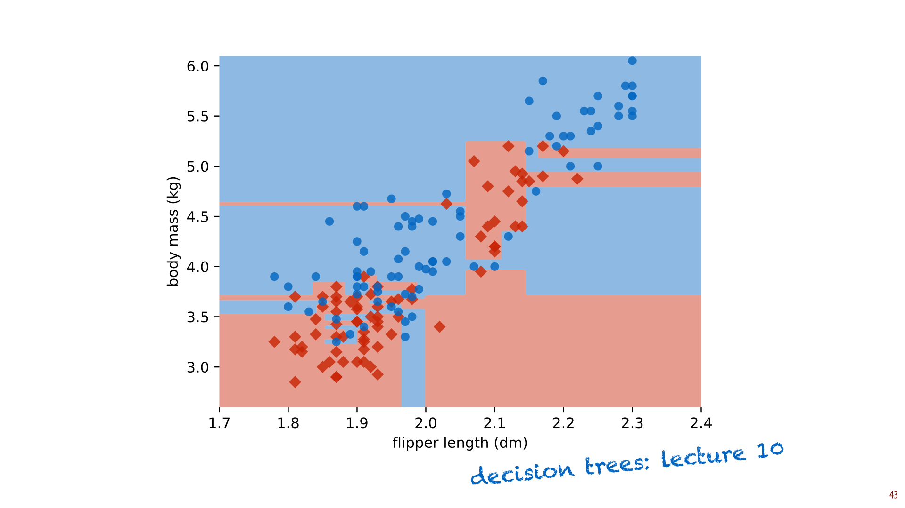

            <figcaption>
            
If we run an actual decision tree learning algorithm on this data, it comes up with a much more complex tree, segmenting the feature space into many small boxes, called <strong>segments</strong>. 

In lecture 10, we’ll see how this learning algorithm actually works.  

            </figcaption>
       </section>

       <section id="slide-044">
            <a class="slide-link" href="https://mlvu.github.io/introduction#slide-044" title="Link to this slide.">link here</a>
            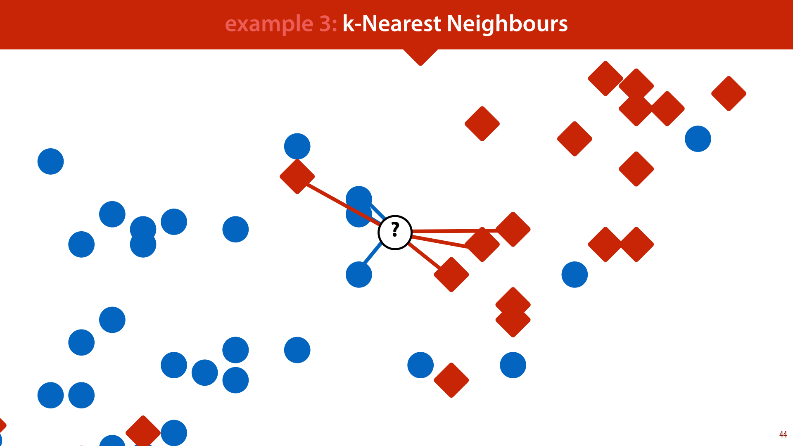

            <figcaption>
            
Finally, here is an example of a l<em>azy </em>classifier.<strong> k-Nearest neighbours.</strong> It doesn’t do any learning. It just<em> remembers</em> the data.  

For a new point (indicated by the question mark), it just looks at the <em>k</em> points that are closest (k=7 in this picture), and assigns the class that is most frequent in that set (female in this case). 

k is what we call a <strong>hyperparameter</strong>: you have to choose it yourself before you use the algorithm. We’ll discuss how to choose hyperparameters in lecture 4.

            </figcaption>
       </section>

       <section id="slide-045">
            <a class="slide-link" href="https://mlvu.github.io/introduction#slide-045" title="Link to this slide.">link here</a>
            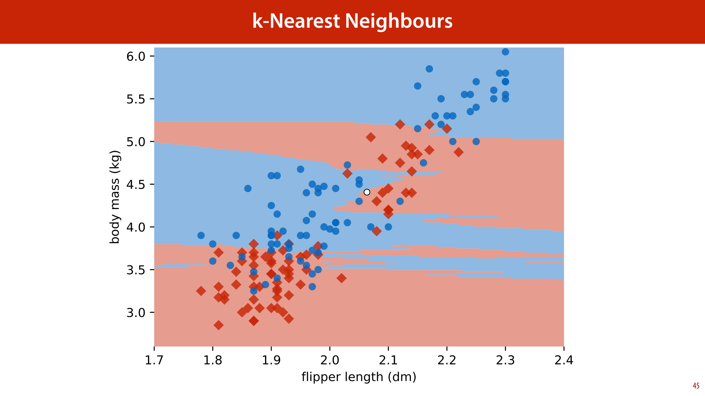

            <figcaption>
            
Here’s what the decision boundary looks like for k=7. The point from the previous slide is indicated in white. 
<aside    >Note that the distance in the vertical direction counts a little stronger, since the units are bigger. This means that the classification may not be what you'd expect based on the visual distance in this image. To fix this, we should normalize the data, which we will learn about in lecture 5.</aside><aside    ></aside>
            </figcaption>
       </section>

       <section id="slide-046">
            <a class="slide-link" href="https://mlvu.github.io/introduction#slide-046" title="Link to this slide.">link here</a>
            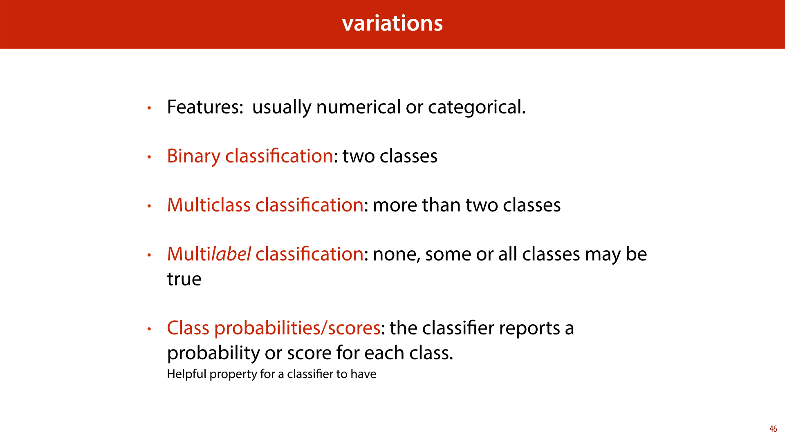

            <figcaption>
            
A few  variations are possible on this basic scheme. In these examples we've only seen numeric features, that is features whose value is a number, but it's also possible to have<strong> categoric features</strong>: features whose value is one of a small umber of categories. For instance, the species feature in the penguin dataset has three distinct possible values. 

Some models can handle only numeric features, in which case, any categoric features have to be translated to numeric ones (we’ll see how to do that in lecture 5). 

<strong>Binary classification</strong> (a task with two classes) is probably the simplest and most well-studied type of classification. If you have <em>more</em> than two classes, some classifiers, like decision trees and kNN, can deal with that without a problem. For others, like linear classification, you’ll need to find clever way to turn a binary classifier into a multiclass classifier. 

<strong>Multilabel classification</strong> is a much more complex task. Here, none, one or more of the classes can be true for a given instance. One example is predicting which genres apply to a given movie. We won’t go into it in this course, but it’s an active subject of research. 

Instead of a single verdict, it can often be helpful if a classifier assigns a<strong> score</strong> to each class. If we want a single class, we pick the one with the highest score, but we can also check what the second most likely class is. We can also, sometimes, look at the magnitude of the score to see how sure the classifier is of its prediction. This is often important if the consequences of of a wrong classification are very serious (i.e. deciding whether to operate on someone, or whether to investigate someone for criminal activity).

            </figcaption>
       </section>

       <section id="slide-047">
            <a class="slide-link" href="https://mlvu.github.io/introduction#slide-047" title="Link to this slide.">link here</a>
            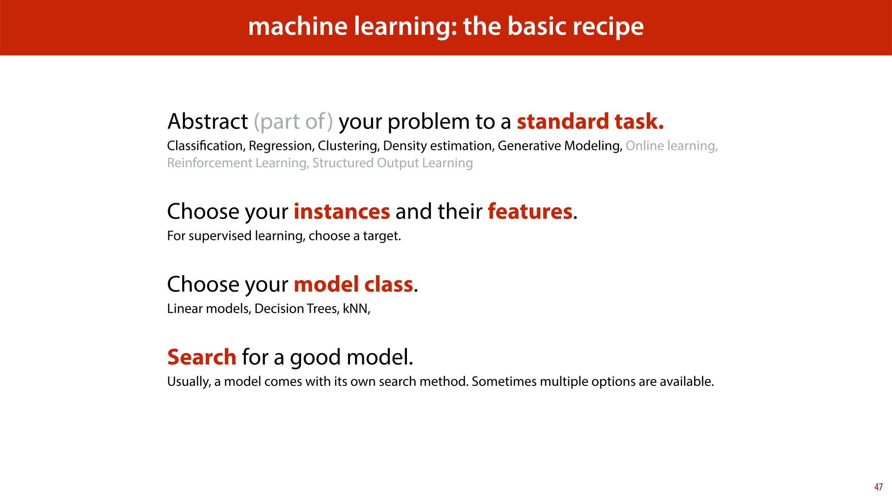

            <figcaption>
            
To summarize: this is the <strong>basic recipe</strong> for doing machine learning. We take a problem, we translate the problem, or part of the problem, to an abstract task, like classification. We choose our instances and our features. We choose a model class, and then we search the model space for a model that solves our problem well. 

The basic recipe doesn’t always fit every situation, and we’ll look at those cases too. But this is always a good place to start, especially when you're new to machine learning.

            </figcaption>
       </section>

       <section id="slide-048">
            <a class="slide-link" href="https://mlvu.github.io/introduction#slide-048" title="Link to this slide.">link here</a>
            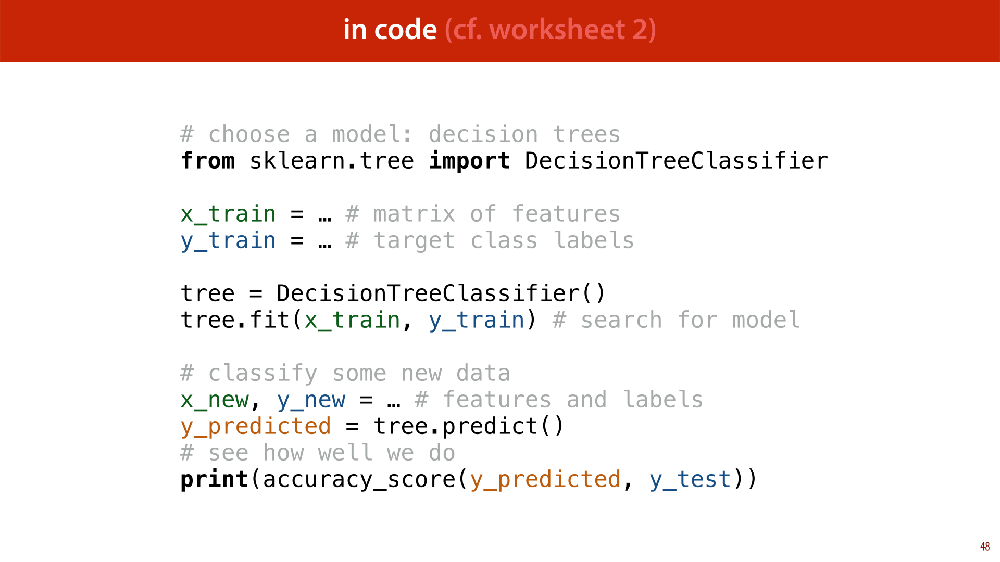

            <figcaption>
            
Here’s what the basic recipe looks like in code (using the sklearn library used in the worksheets). Note that the actual machine learning happens in just two lines of code.  

All you need to do is decide your features, and decide your target values (classes in this case). Once you’ve done that, you’re doing machine learning in two lines of code. You can then test how well your model does (more about that in week two) and keep trying different models until you get the performance you’re happy with. 

            </figcaption>
       </section>

       <section id="slide-049">
            <a class="slide-link" href="https://mlvu.github.io/introduction#slide-049" title="Link to this slide.">link here</a>
            

            <figcaption>
            
That’s all we’ll say about classification in this lecture. In the next video, we'll look at regression, and some other abstract tasks. 

image source: <a href="https://twitter.com/archillinks/status/1022889384494940160"><strong>https://twitter.com/archillinks/status/1022889384494940160</strong></a>

<a href="https://twitter.com/archillinks/status/1022889384494940160"><strong></strong></a>

            </figcaption>
       </section>

       <section class="video" id="video-049">
           <a class="slide-link" href="https://mlvu.github.io/introduction#video-49">link here</a>
           <iframe
                src="https://www.youtube.com/embed/pJIrdzhsWRM"
                title="YouTube video player"
                frameborder="0" allow="accelerometer; autoplay; clipboard-write; encrypted-media; gyroscope; picture-in-picture"
                allowfullscreen>
           </iframe>

       </section>

       <section id="slide-050">
            <a class="slide-link" href="https://mlvu.github.io/introduction#slide-050" title="Link to this slide.">link here</a>
            

            <figcaption>
            
 

            </figcaption>
       </section>

       <section id="slide-051">
            <a class="slide-link" href="https://mlvu.github.io/introduction#slide-051" title="Link to this slide.">link here</a>
            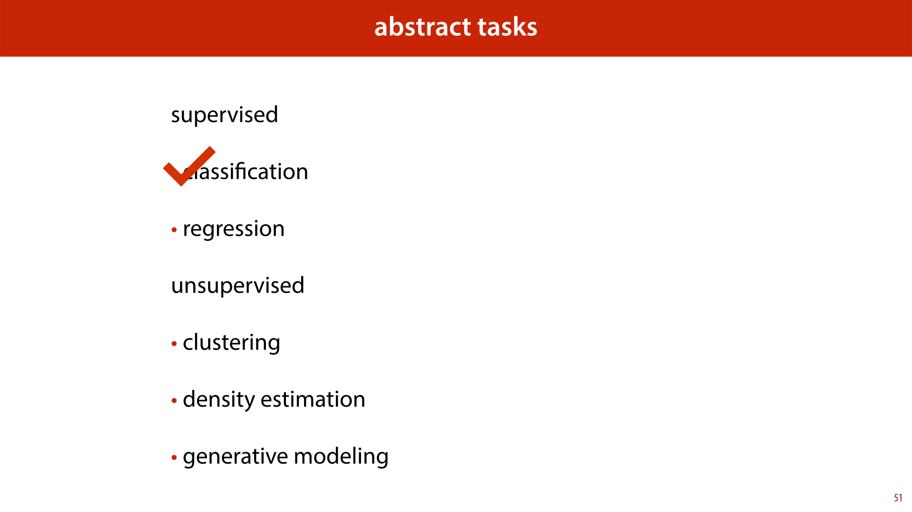

            <figcaption>
            
We’ve looked at classification, as our first example of an abstract task. In this video. We’ll see some others. First up: <strong>regression</strong>.

            </figcaption>
       </section>

       <section id="slide-052" class="anim">
            <a class="slide-link" href="https://mlvu.github.io/introduction#slide-052" title="Link to this slide.">link here</a>
            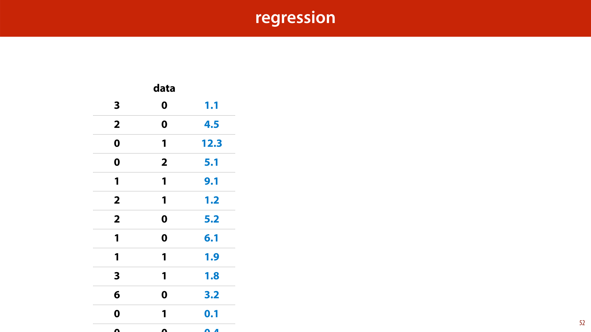

            <figcaption>
            
Regression works exactly the same as classification, except we’re predicting a <em>number </em>instead of a class. That is, the model we’re trying to learn is a function from the feature space to ℝ. 

To make things a little more precise, let's introduce some notation for the different parts of the task. We represent the features of a particular instance i by the vector <strong>x</strong>i. The corresponding true label (which is given in our data) we call ti. The model we represent by a function f, and its prediction for instance i we represent as f(<strong>x</strong>i). This. means that, broadly, our task is to get f(<strong>x</strong>i) as close as we can to ti. 

            </figcaption>
            click image for animation
       </section>

       <section id="slide-053">
            <a class="slide-link" href="https://mlvu.github.io/introduction#slide-053" title="Link to this slide.">link here</a>
            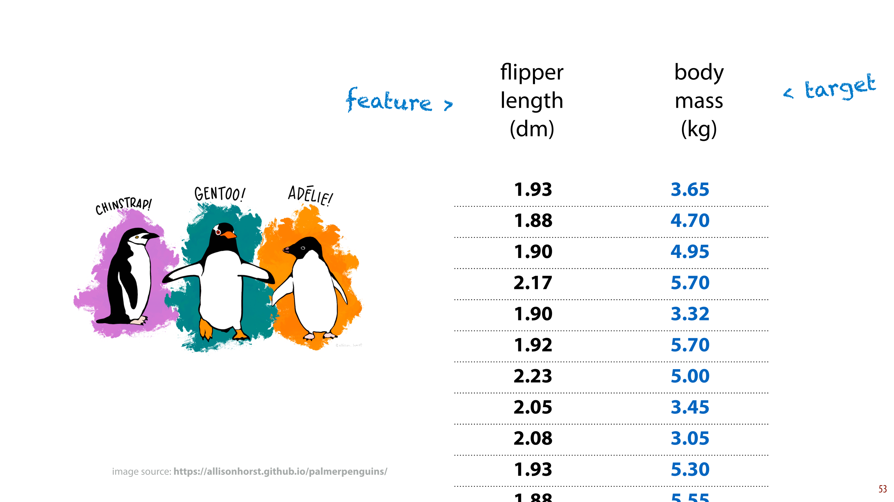

            <figcaption>
            
To illustrate some basic approaches to this problem, we will use the same dataset as before, but this time we will make the flipper length the sole feature, and we will try to predict the body mass. In general, penguins with large flippers should be tall, so we'd expect them to have higher body mass. So a reasonable guess should be possible. 

data source: <a href="https://allisonhorst.github.io/palmerpenguins/"><strong>https://allisonhorst.github.io/palmerpenguins/</strong></a>, <a href="https://github.com/mcnakhaee/palmerpenguins"><strong>https://github.com/mcnakhaee/palmerpenguins</strong></a> (python package) 

image source: <a href="https://allisonhorst.github.io/palmerpenguins/"><strong>https://allisonhorst.github.io/palmerpenguins/</strong></a> 

            </figcaption>
       </section>

       <section id="slide-054" class="anim">
            <a class="slide-link" href="https://mlvu.github.io/introduction#slide-054" title="Link to this slide.">link here</a>
            

            <figcaption>
            
Here’s what our data looks like. Note that though it looks the same as in the classification example, this time we’re plotting both the targets and the feature space in the same figure. 

We can use a <strong class="blue">linear model</strong> again. But note how differently we’re using the model. Previously, we wanted to segment the feature space into two classes. Now we’re trying to model the relation between the feature(s) and the target. The model has the same shape, but we’re using it very differently. 

The line I’ve drawn here isn’t very good. It predicts much too high a body mass for this flipper length. To determine how good a model is, we must again choose a <strong>loss function</strong>.

            </figcaption>
            click image for animation
       </section>

       <section id="slide-055" class="anim">
            <a class="slide-link" href="https://mlvu.github.io/introduction#slide-055" title="Link to this slide.">link here</a>
            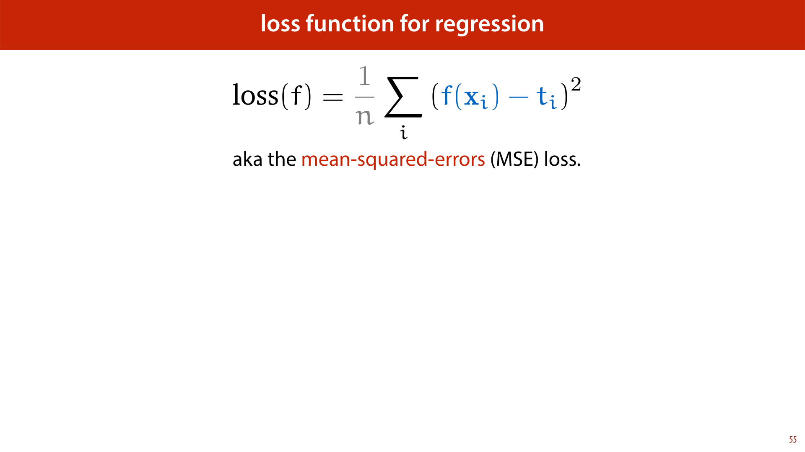

            <figcaption>
            
Recall that the <strong>loss function</strong> maps a model to a number that expresses how well it fits the data (the smaller the loss, the better).  

The <strong>mean-squared error loss</strong> is a common choice for regression. We simply take the difference between the model prediction and the target value from the data, for each instance. This is called a<strong> residual</strong>. We square, and then sum all residuals we get, giving us a single number. The lower that number is, the better the model fits our data. 
<aside    >You can think of the residuals as rubber bands, pulling the regression line closer to the points.</aside><aside    ></aside>
            </figcaption>
            click image for animation
       </section>

       <section id="slide-056">
            <a class="slide-link" href="https://mlvu.github.io/introduction#slide-056" title="Link to this slide.">link here</a>
            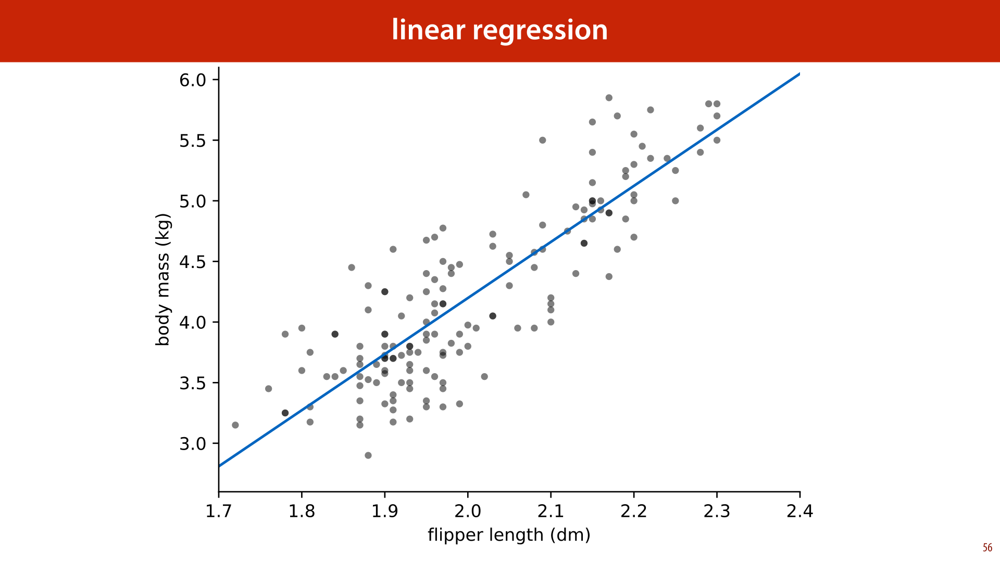

            <figcaption>
            
This is the line with the lowest MSE loss for this data. It doesn't predict all instances in the data perfectly, but if we group the penguins into small clusters with the same flipper length (i.e. small vertical slices in this image), we can see that the line tends to predict the average body mass for each group. 

            </figcaption>
       </section>

       <section id="slide-057">
            <a class="slide-link" href="https://mlvu.github.io/introduction#slide-057" title="Link to this slide.">link here</a>
            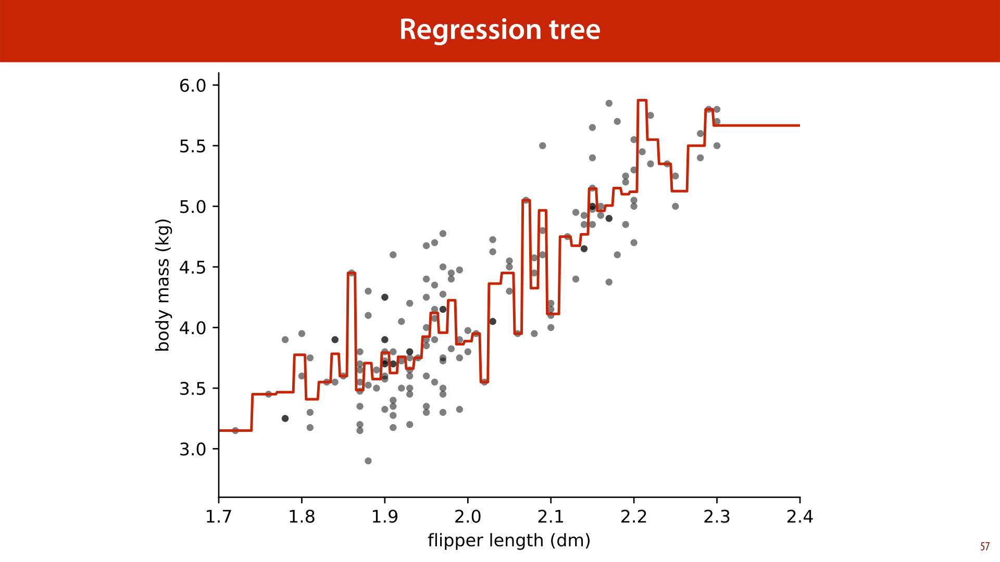

            <figcaption>
            
We can also use the<strong> decision tree</strong> principle to perform regression, giving us a <strong>regression tree</strong>.  

We simply segment the feature space into blocks, using a tree as before, and instead of assigning each a<em> class</em>, we assign each a <em>number</em>. This model covers the data very better than the linear regression does, for many points, it predicts exactly the right value. Does this make it a better model? Do we really expect that it's possible to predict body mass in such detail, from just one physical measurement?n We'll look at this question in the last video in this lecture.

            </figcaption>
       </section>

       <section id="slide-058">
            <a class="slide-link" href="https://mlvu.github.io/introduction#slide-058" title="Link to this slide.">link here</a>
            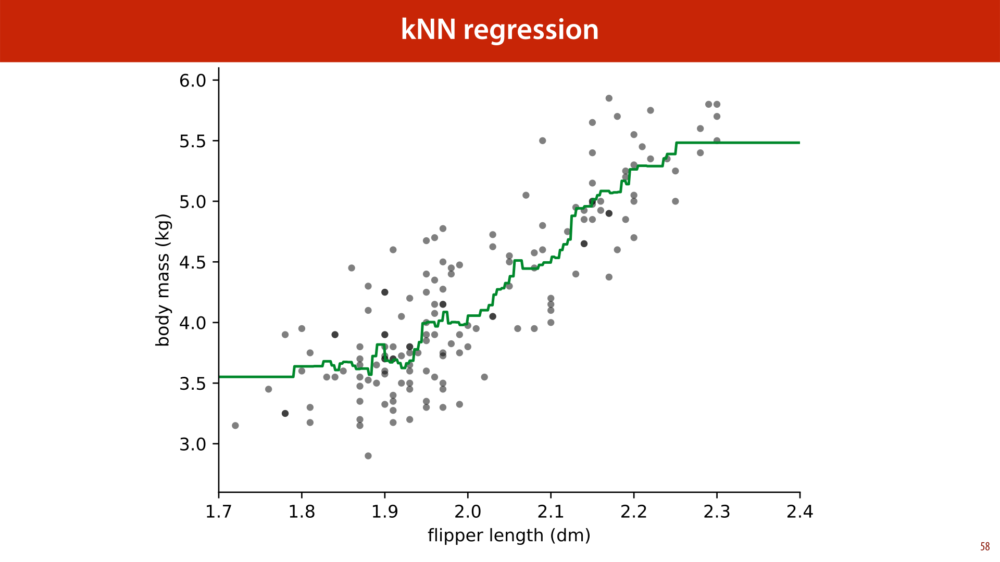

            <figcaption>
            
For the sake of completeness, here is what the regression equivalent of the kNN classifier looks like: <strong>kNN regression</strong>. Its prediction for any given point is the average of the k nearest points in the data (k=7 here). 

This hopefully gives you some idea of the different ways there are to build a regression model. In the next lecture we'll look in detail at how linear regression is done, and in later lectures, we'll start looking at different nonlinear methods in detail.

            </figcaption>
       </section>

       <section id="slide-059">
            <a class="slide-link" href="https://mlvu.github.io/introduction#slide-059" title="Link to this slide.">link here</a>
            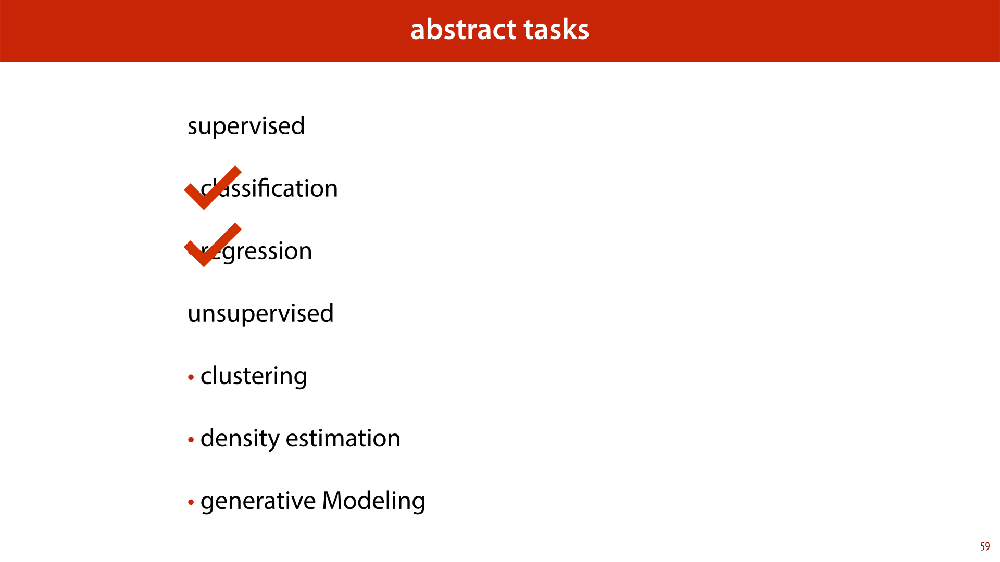

            <figcaption>
            
Next up are the <strong>unsupervised tasks.</strong> In classification and regression each instance comes with a <strong>label</strong>: an example of the sort of output we want our model to predict for each input. 

In unsupervised tasks, we have only the inputs. The task for the model is just to find any useful structure in the data. 

            </figcaption>
       </section>

       <section id="slide-060" class="anim">
            <a class="slide-link" href="https://mlvu.github.io/introduction#slide-060" title="Link to this slide.">link here</a>
            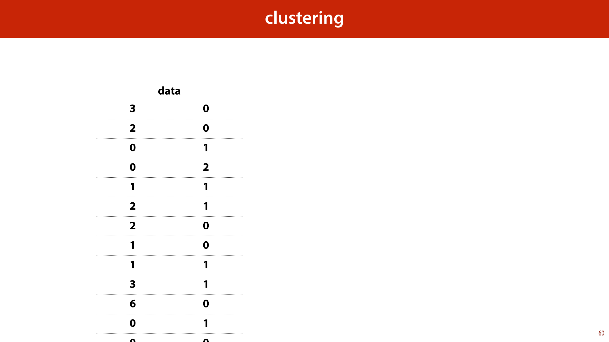

            <figcaption>
            
In the case of clustering, we ask the learner to split the instances into a number of clusters. The number of clusters is usually given beforehand by the user. 

This looks a lot like classification, but note that there are no example classes provided by the data. 

            </figcaption>
            click image for animation
       </section>

       <section id="slide-061">
            <a class="slide-link" href="https://mlvu.github.io/introduction#slide-061" title="Link to this slide.">link here</a>
            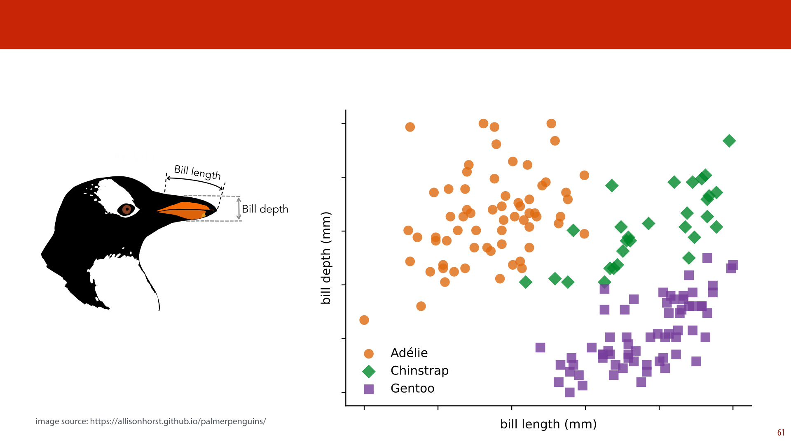

            <figcaption>
            
Here's an example from the penguin dataset. If we plot the bill length and bill depth, we see that the three species separate pretty clearly in this feature space. If we remove the information that there are separate clusters, can we recover it from these two features alone? Note that this is not classification, because we are not giving our learner labels. We're not telling it the species of any instance in our dataset. It has to figure out a clustering purely from the natural separation of the data. The only hint we'll give is the number of clusters we expect to find. 

image source: <a href="https://allisonhorst.github.io/palmerpenguins/"><strong>https://allisonhorst.github.io/palmerpenguins/</strong></a>

<a href="https://allisonhorst.github.io/palmerpenguins/"><strong></strong></a>

            </figcaption>
       </section>

       <section id="slide-062">
            <a class="slide-link" href="https://mlvu.github.io/introduction#slide-062" title="Link to this slide.">link here</a>
            

            <figcaption>
            
We'll show one quick example of a simple clustering algorithm, just to give you an impression of how something like this might work. 

This algorithm is called<strong> k-means </strong>(not to be confused with kNN). In the example we will separate the dataset into three clusters.  

We start by choosing three random points in the feature space (the red, green and blue points), called the “means”. Each of these represents one of our clusters.

            </figcaption>
       </section>

       <section id="slide-063">
            <a class="slide-link" href="https://mlvu.github.io/introduction#slide-063" title="Link to this slide.">link here</a>
            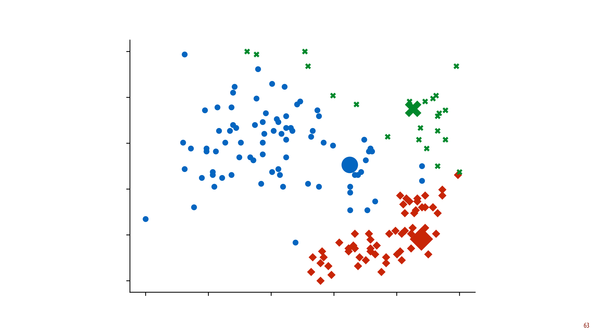

            <figcaption>
            
We then assign each point the cluster corresponding to the mean it is closest to.  

Since the means were randomly chosen, this does not yet correspond to a very meaningful clustering of the data.

            </figcaption>
       </section>

       <section id="slide-064">
            <a class="slide-link" href="https://mlvu.github.io/introduction#slide-064" title="Link to this slide.">link here</a>
            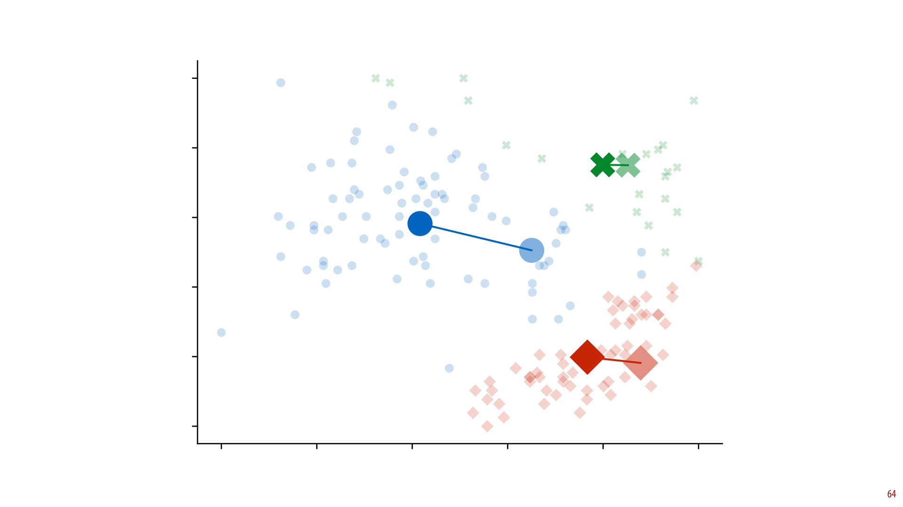

            <figcaption>
            
Next, we re-compute the means. Each new mean is the mean of all the points that now belong to its cluster. That is, the new red mean is the mean of all the points we colored red in the previous slide.. 
<aside    >Taking the mean of a series of points work just the same as taking the mean of single numbers, you sum up all the coordinates and then divide by the number of terms in the sum.</aside><aside    ></aside>
            </figcaption>
       </section>

       <section id="slide-065">
            <a class="slide-link" href="https://mlvu.github.io/introduction#slide-065" title="Link to this slide.">link here</a>
            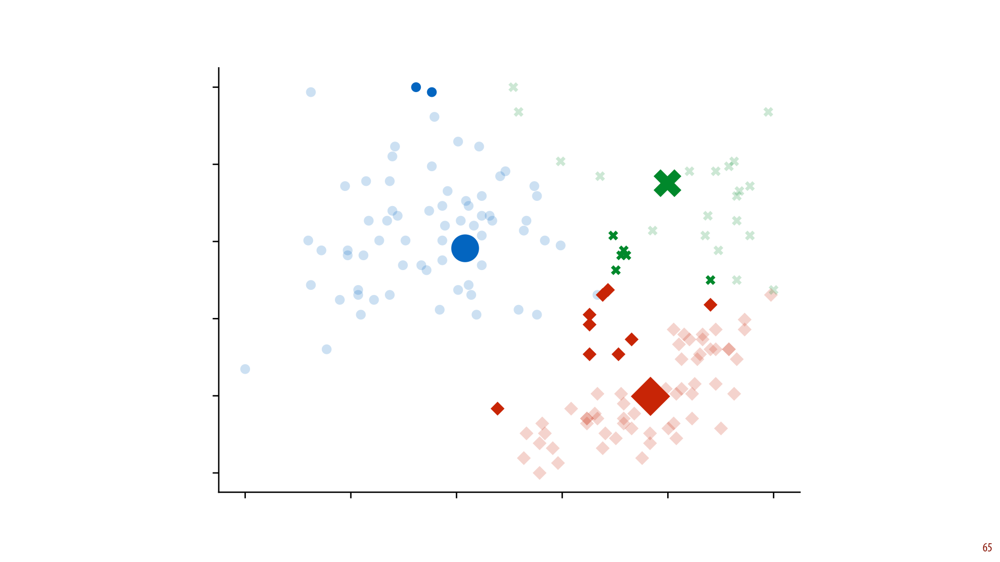

            <figcaption>
            
Then, we repeat the procedure, we re-assign each point to the mean they are now closest to. Highlighted here are the points that have changed from one cluster to another. For instance the highlighted red points were all blue before, because they were closest to the blue mean, but now that we've recomputed the means and the blue mean has moved over to the left, they are closer to the red mean.

            </figcaption>
       </section>

       <section id="slide-066" class="anim">
            <a class="slide-link" href="https://mlvu.github.io/introduction#slide-066" title="Link to this slide.">link here</a>
            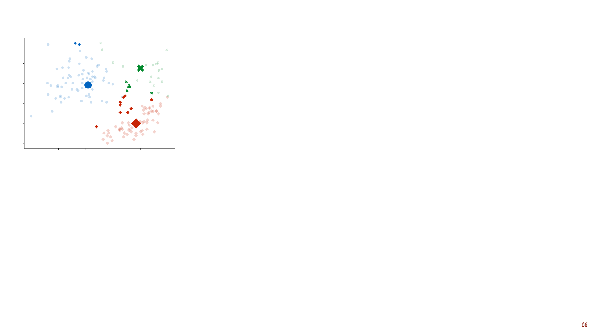

            <figcaption>
            
We keep iterating this process, re-assigning the clusters and re-computing the means, until the means stop moving from one iteration to the next. 

            </figcaption>
            click image for animation
       </section>

       <section id="slide-067">
            <a class="slide-link" href="https://mlvu.github.io/introduction#slide-067" title="Link to this slide.">link here</a>
            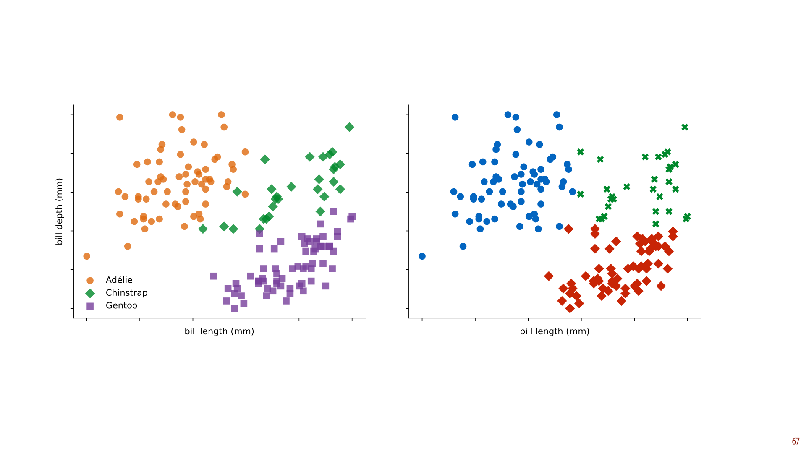

            <figcaption>
            
Here's the clustering we end up with. We won't know what the clusters <em>mean</em> of course, without investigating further, but in this case they correspond pretty closely to the species of the penguin, although there are some differences between the species and the clustering. 

It may seem a little magical to you that this algorithm works at all. We won't try to give you any intuition here; just take this as an example of how clustering might work in practice. In a later lecture we will see another algorithm called <em>expectation maximization</em>, which is very similar to k-means and there will try to provide some intuition for why this sort of approach works.

            </figcaption>
       </section>

       <section id="slide-068">
            <a class="slide-link" href="https://mlvu.github.io/introduction#slide-068" title="Link to this slide.">link here</a>
            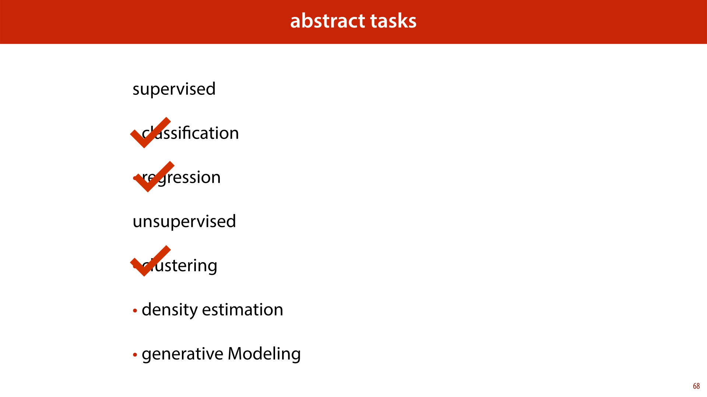

            <figcaption>
            
That's clustering dealt with. Next up, density estimation.

            </figcaption>
       </section>

       <section id="slide-069" class="anim">
            <a class="slide-link" href="https://mlvu.github.io/introduction#slide-069" title="Link to this slide.">link here</a>
            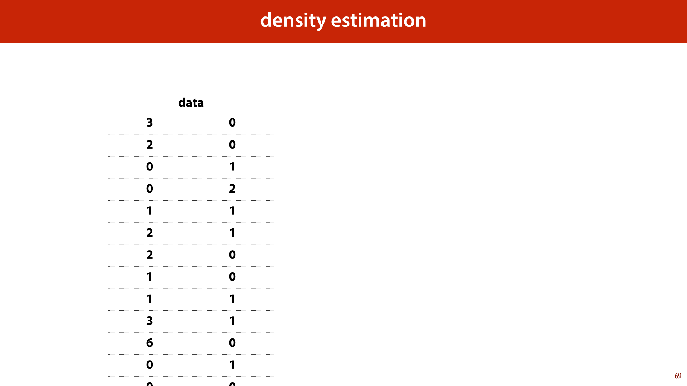

            <figcaption>
            
In <strong>density estimation</strong>, we want to learn how<em> likely </em>new data is. Is a 2 m tall 16 year old more or less likely than a 1.5 m tall 80 year old? We predict a number for each instance, and that number expresses how likely the model thinks the given instance is. 

In some ways, this is a bit like an unsupervised form of regression: we don't have any labels, and the model produces a number.  

Note however, that here, the number has a strict interpretation. The higher the number the more likely the instance. In the strictest form of density estimation, the number that the model produces should also behave as a <em>probability</em> or <em>probability density</em>. This means that it can't be a negative number, and all numbers the model produces over the whole feature space should sum or integrate to one. 

<em> </em>

 

            </figcaption>
            click image for animation
       </section>

       <section id="slide-070">
            <a class="slide-link" href="https://mlvu.github.io/introduction#slide-070" title="Link to this slide.">link here</a>
            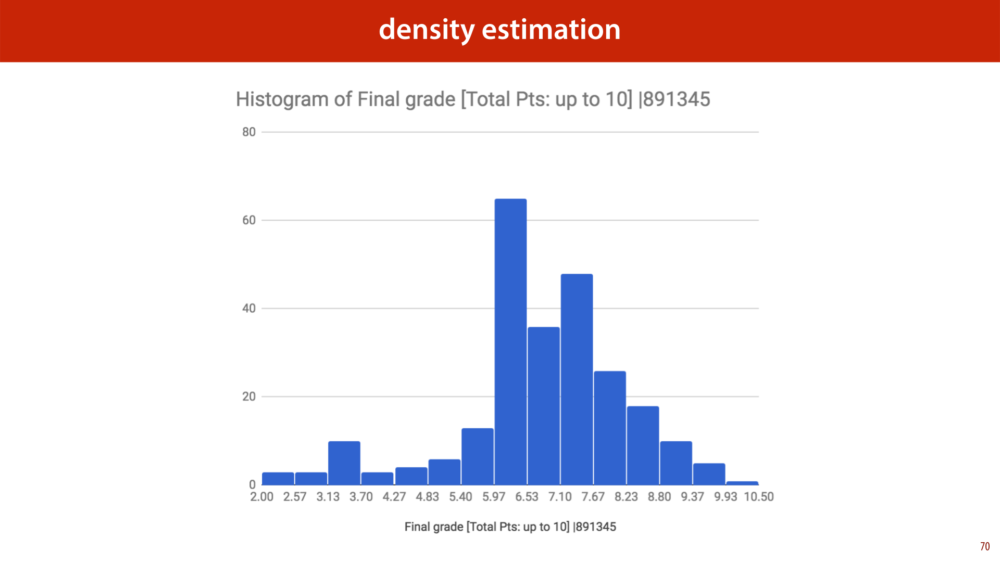

            <figcaption>
            
That may sound abstract, but density estimation is probably the machine learning task that most people reading this have already done before.  

Density estimation is the task of modelling the <em>probability distribution</em> behind your data. Most of you will have fit a distribution to a dataset at some point. 

Here is an example: the final grades from 2017. If you know a bit of statistics, you can probably see sort of a normal distribution in this. Once you’ve fitted a normal distribution, you can give a density estimate for any grade.  
<aside    >Even if that sounds unfamiliar, you may have calculated the mean and standard deviation of some data before, which is essentially fitting a normal distribution to your data. </aside>
If we look closer at this data, however, we see that there are really <em>three </em>peaks. these could be explained by noise, but we could also fit a mixture of three normal distributions to this data, to explain the peaks. This is a much more difficult model to fit. We'll investigate in a few weeks. For now, the lesson is that for simple models like a normal distribution, density estimation is so easy it’s not usually seen as machine learning, but as the models get more complex, the task gets more complex also.

            </figcaption>
       </section>

       <section id="slide-071">
            <a class="slide-link" href="https://mlvu.github.io/introduction#slide-071" title="Link to this slide.">link here</a>
            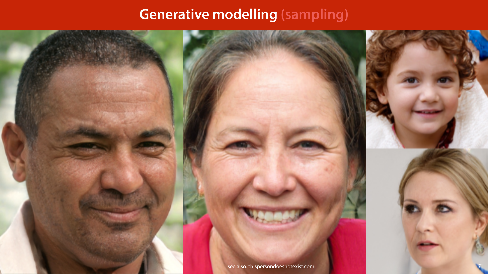

            <figcaption>
            
With highly complex data, it’s often easier to <em>sample</em> from a probability distribution than it is to get a probability (density) estimate. Building a model from which you can sample new examples is called<strong> generative modelling</strong>.  

These people <em>don’t exist</em>. These pictures were <em>sampled</em> from a model trained on a large dataset of images of faces. Note that this is not a 3d model, or a generator that started with a basic face and filled in the details: all the model saw was a large collection of pictures. This is a typical example of the power of <strong>deep learning</strong>, which we will discuss in the third week. 

This model couldn't tell you the probability density of a given face, but it can quickly generate new, realistic faces. 

image source: <a href="https://arxiv.org/abs/1812.04948"><strong>https://arxiv.org/abs/1812.04948</strong></a> see also: <a href="http://thispersondoesnotexist.com"><strong>thispersondoesnotexist.com</strong></a> 

try it yourself: <a href="http://thispersondoesnotexist.com"><strong>thispersondoesnotexist.com</strong></a>

<a href="http://thispersondoesnotexist.com"><strong></strong></a>

            </figcaption>
       </section>

       <section id="slide-072" class="anim">
            <a class="slide-link" href="https://mlvu.github.io/introduction#slide-072" title="Link to this slide.">link here</a>
            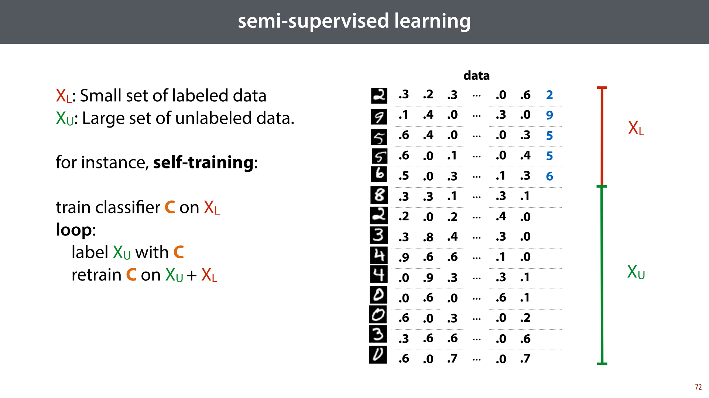

            <figcaption>
            
In many cases, unlabeled data is very cheaply available, while labeled data is expensive to acquire. In such cases, <strong>semi-supervised learning</strong> can be useful: this involves learning from a small labeled set and a large amount of unlabeled data. 

A very simple example is<strong> self-training</strong>: we train a classifier on the labeled data and use it to "complete" the dataset. Then, we train on the full data and repeat the process. From this example, it’s slightly mysterious why the unlabeled data should provide any benefit. For now, we’ll just say that the classifier trained on the whole data can better understand the basic structure of the instances, and then attach the label based on that deeper understanding of the structure.

            </figcaption>
            click image for animation
       </section>

       <section id="slide-073">
            <a class="slide-link" href="https://mlvu.github.io/introduction#slide-073" title="Link to this slide.">link here</a>
            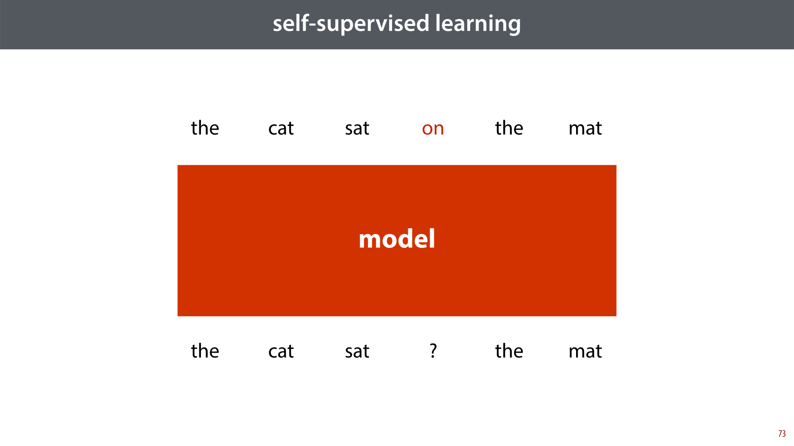

            <figcaption>
            
Recently people have been referring to a family of methods as <strong>self-supervised learning</strong>. It refers, generally, to different ways in which a large unlabeled dataset can be used to train a model in such a way that no or little annotation is required.  

One example is in the domain of natural language. For this, we need a <em>sequential</em> model. These are models we will learn about later. For now, all you need to know is that they consume sequences, like sentences, and they produce such sequences as well. This means that we can feed such a model sentences with one or more of the words masked out, and teach it to reconstruct those words. To do this, all you need is a large amount of sentences, and we have petabytes of those freely available on the internet. 

The unmasking task by itself may not be very useful, but a model that has learned to do this well, has likely learned a lot about the structure of sentences, which means it can then be used to build on for other, more useful tasks (possibly using a small amount of labeled data). 

Semi-supervised learning and self-supervised learning have a lot in common, and it’s not quite clear where one begins and the other ends. In general, self-supervised learning refers to deep learning models, and to clever training schemes using unlabeled data. We’ll see some more examples when we start talking about deep learning.

            </figcaption>
       </section>

       <section id="slide-074">
            <a class="slide-link" href="https://mlvu.github.io/introduction#slide-074" title="Link to this slide.">link here</a>
            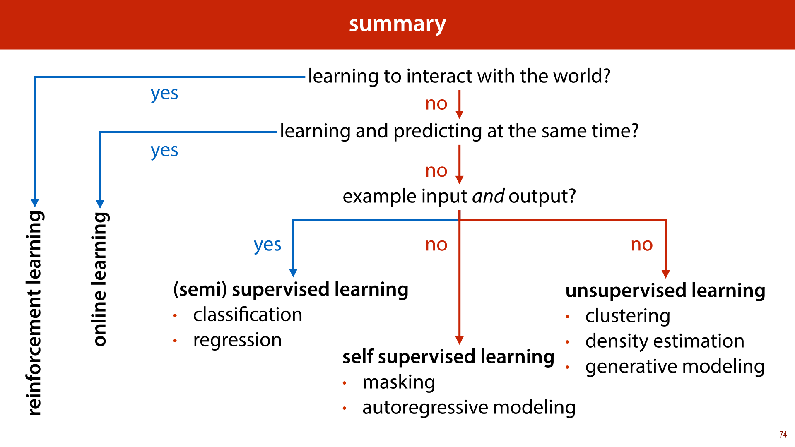

            <figcaption>
            
So, this is the picture we have built up so far of the various abstract tasks of machine learning. We will spend most of our time in the supervised learning category, but the techniques we will develop will translate very naturally to other categories.

            </figcaption>
       </section>

       <section id="slide-075">
            <a class="slide-link" href="https://mlvu.github.io/introduction#slide-075" title="Link to this slide.">link here</a>
            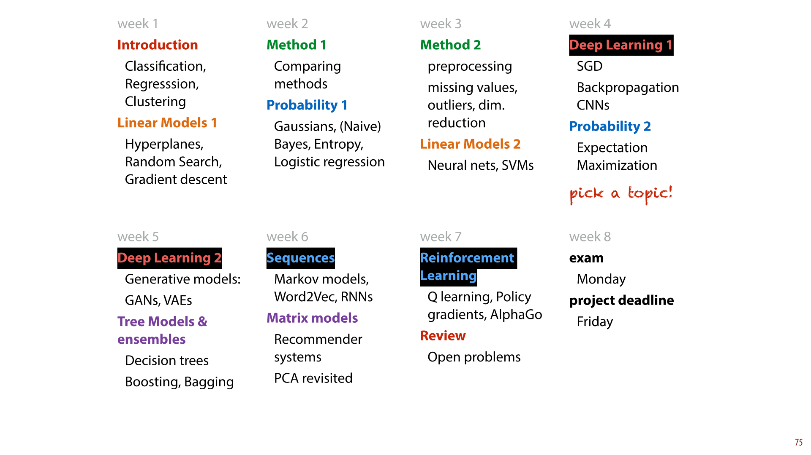

            <figcaption>
            
Here is the basic outline of the course, and the main subjects we'll be discussing.

            </figcaption>
       </section>

       <section id="slide-076">
            <a class="slide-link" href="https://mlvu.github.io/introduction#slide-076" title="Link to this slide.">link here</a>
            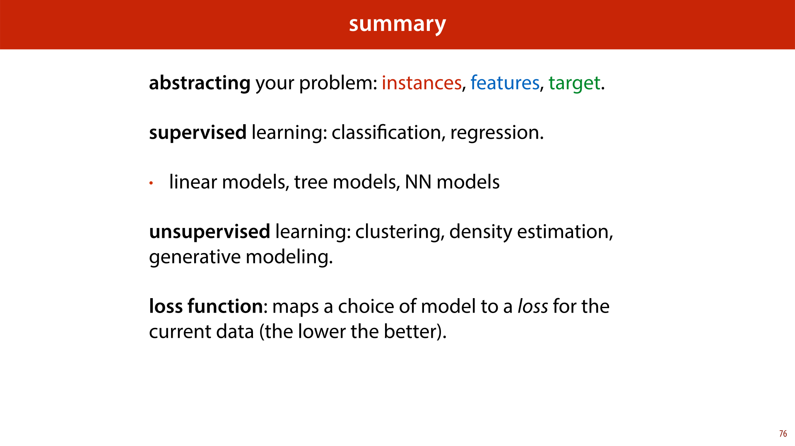

            <figcaption>
            

            </figcaption>
       </section>

       <section class="video" id="video-076">
           <a class="slide-link" href="https://mlvu.github.io/introduction#video-76">link here</a>
           <iframe
                src="https://www.youtube.com/embed/uWmbIQHtjhk"
                title="YouTube video player"
                frameborder="0" allow="accelerometer; autoplay; clipboard-write; encrypted-media; gyroscope; picture-in-picture"
                allowfullscreen>
           </iframe>

       </section>

       <section id="slide-077">
            <a class="slide-link" href="https://mlvu.github.io/introduction#slide-077" title="Link to this slide.">link here</a>
            

            <figcaption>
            
Throughout the course, we’ll occasionally stop and look at the impact that this kind of technology has on society. This is rapidly becoming more important as machine learning is being rolled out at national and international scales. 

Sometimes we’ll do this as part of the regular lectures, and sometimes, we’ll create a separate video to focus on some important aspects. In this video we’ll look at some of the questions it’s important to ask of machine learning systems and machine learning research. 

 

            </figcaption>
       </section>

       <section id="slide-078">
            <a class="slide-link" href="https://mlvu.github.io/introduction#slide-078" title="Link to this slide.">link here</a>
            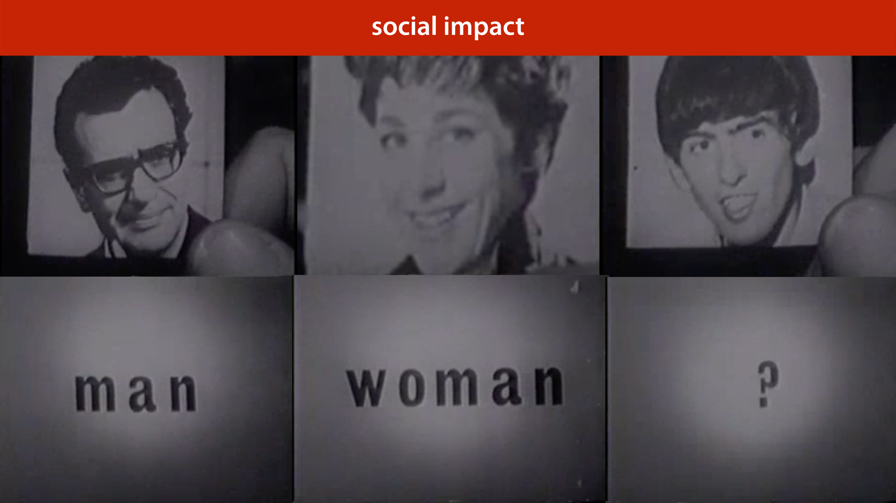

            <figcaption>
            
In the first video, we saw one of the earliest examples of machine learning: a model being used to classify the sex or gender of a person by their photograph.  

This may seem like a harmless example, and indeed for a long time the exercise was pretty academic. Machine learning simply didn’t work very well yet, and we needed difficult tasks that were easy to evaluate. Gender classification makes is a great example: it's simple binary classification, it's perfectly balanced, and we know that in principle it can be solved, because we ourselves can do it. 

In short, it was a good benchmark with which to study our models. Since the models being developend didn't perform well enough to be used anywhere anyway, the social impact was a non-issue.

            </figcaption>
       </section>

       <section id="slide-079">
            <a class="slide-link" href="https://mlvu.github.io/introduction#slide-079" title="Link to this slide.">link here</a>
            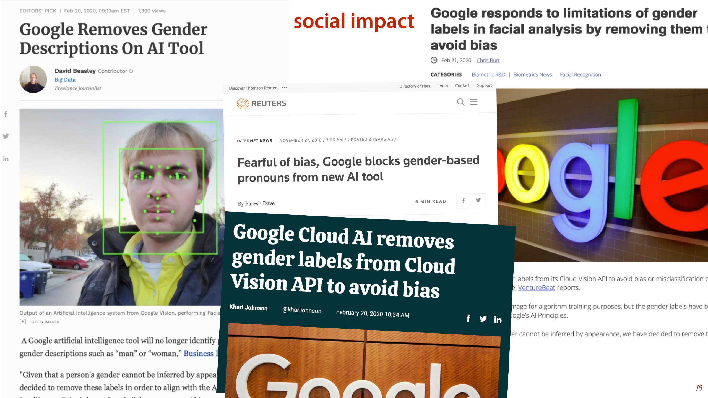

            <figcaption>
            
However, now that we have actually “solved” the task (that is, we have machine learning systems can do it as well as humans can), we need to look at what the impact is when we actually start using such systems in the real world. Sex or gender detection may seem harmless at first sight. After all, it’s something we all do subconsciously hundreds of times every day. But actually, building automated systems for it is highly controversial. So controversial in fact, that Google has decideed to disable the option in its Cloud vision API. 

This is a lucrative product for Google, and a reasonable guess of a subject’s gender is likely to be a commonly requested feature. If Google removes such a feature from their product, they must have a compelling reason. 

In this video, we will look at this example in detail, and consider the different reasons that people offer why we shouldn’t build such systems, even though we can. 

            </figcaption>
       </section>

       <section id="slide-080">
            <a class="slide-link" href="https://mlvu.github.io/introduction#slide-080" title="Link to this slide.">link here</a>
            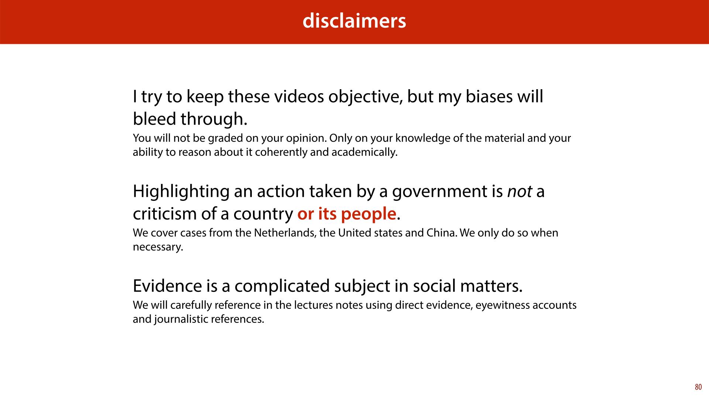

            <figcaption>
            
Before we start, some quick disclaimers that will hold for all social impact material in the course. 

The question of social impact is difficult to divorce entirely from one’s personal values. I am a secular, left-wing progressive on most issues, which will no doubt come through in these videos. I have done my best to present the discussion rather than the conclusions, and to present mostly facts that are difficult to dismiss if you believe in basic academic investigation. You are entirely free to form your own opinion, of course, and we will not test your position on these questions, only your knowledge of them. 

We will deal with various real-world use case. Since these are matters of <em>social</em> impact, it's often necessary for us to delve in to actions taken and systems built in or by different countries. If you are from one of the countries we discuss, it may be difficult to hear what we have to say. The first thing to note is that we carefully consider whether such topics are necessary include at all. If not, we will choose a different example. We spell out criteria we use for this at the end of the lecture notes (see <a href="http://mlvu.github.io/lecture01"><strong>mlvu.github.io/lecture01</strong></a>). 

Second, please understand that highlighting one action of a country's government is<strong> not intended as a criticism of that country, its culture, or its people</strong>. If you feel that anything we discuss puts you in the spotlight or makes you feel like you have to defend yourself, please know that that is not our intention. You also do not have to agree with what is said in these videos, and you should not take my word as gospel, just because I am a teacher. 
<aside    >If your are not from one of these countries, remember that expatriate students often have a difficult time feeling welcome already, and discussing subjects like these can make that substantially worse. Please do your best to ensure that students do not feel that these issues are held against them personally, or that they have to agree with any position in order to be accepted. </aside>
Finally, note that<strong> </strong>establishing <em>fact</em> in social science is a complicated business. As scientists and mathematicians, we are used to providing evidence through proof or through controlled experimentation. In social matters, such rigorous methods are simply not available. Since we are dealing with controversial issues, however, there is a strong burden of proof. That means that for these videos, we will make an extra effort to carefully reference and substantiate what we claim as true.

            </figcaption>
       </section>

       <section id="slide-081">
            <a class="slide-link" href="https://mlvu.github.io/introduction#slide-081" title="Link to this slide.">link here</a>
            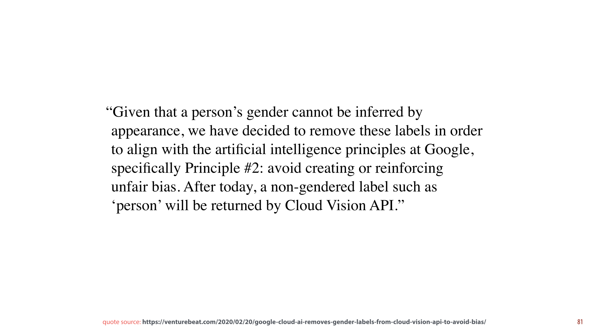

            <figcaption>
            
These references can be found in the lecture notes online. Sometimes simply alongside the slides, but for cases where a more extensive treatment is necessary, we've added a <a href="http://mlvu.github.io"><strong>social impact dossier on the website</strong></a>. This will allow us to dig a little deeper into the references required to substantiate some of the claims we make. 

If you’re upset about anything we say in the social impact parts of the lectures,  or you think we’ve made a mistake, please have a look at this resource. It contains a detailed explanation of our methods, and extensive references to back up any claim we make that might be controversial.

            </figcaption>
       </section>

       <section id="slide-082">
            <a class="slide-link" href="https://mlvu.github.io/introduction#slide-082" title="Link to this slide.">link here</a>
            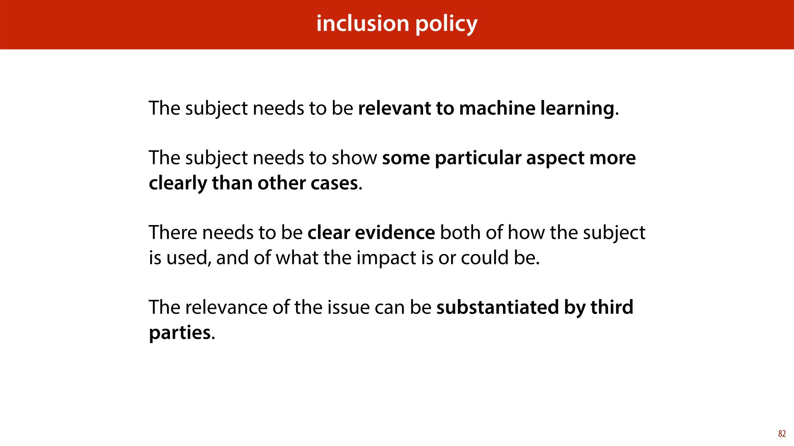

            <figcaption>
            
One particularly important aspect of the social impact dossier is our <strong>inclusion policy</strong>. In other words, the rules that we follow to decide whether a particular subject is worth discussing in the course. 

This is what stops us from arbitrarily discussing whatever political topics we’re personally most worked up about. If any particular topic seems arbitrarily chosen, or its inclusion politically motivated, check if we followed these four rules. If not, you may take us to task. 

The social impact dossier explicitly tests some of the more controversial topics against there rules. 

For a more detailed explanation of the policy and how we apply it, see: <a href="https://mlvu.github.io/social-impact/#slide-003"><strong>https://mlvu.github.io/social-impact/#slide-003</strong></a> 

            </figcaption>
       </section>

       <section id="slide-083">
            <a class="slide-link" href="https://mlvu.github.io/introduction#slide-083" title="Link to this slide.">link here</a>
            

            <figcaption>
            
First, let’s see what Google offered as an explanation for removing the feature. Their argument centers on the impossibility of inferring gender from physical attributes. 

But is this the whole story? We cannot perfectly infer a traffic sign or a digit from an image, but we can still make a pretty good guess. In fact these days, guessing a person’s sex or gender can be done with pretty high accuracy compared to most machine learning tasks.  

So the fact that it can’t be done perfectly surely can’t be the whole story: that is true for almost all machine learning applications, and for any label returned by the Cloud Vision API. What makes gender special? Why should sex or gender only be used if it can be perfectly inferred? Or should it perhaps not even be used then? 

To get to the real reason that such classification tasks are controversial, we need to look more carefully at the problem.  

quote source: <a href="https://venturebeat.com/2020/02/20/google-cloud-ai-removes-gender-labels-from-cloud-vision-api-to-avoid-bias/"><strong>https://venturebeat.com/2020/02/20/google-cloud-ai-removes-gender-labels-from-cloud-vision-api-to-avoid-bias/</strong></a>

<a href="https://venturebeat.com/2020/02/20/google-cloud-ai-removes-gender-labels-from-cloud-vision-api-to-avoid-bias/"><strong></strong></a>

            </figcaption>
       </section>

       <section id="slide-084">
            <a class="slide-link" href="https://mlvu.github.io/introduction#slide-084" title="Link to this slide.">link here</a>
            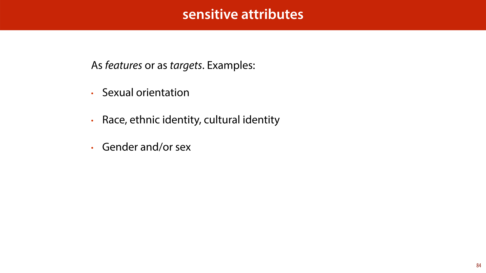

            <figcaption>
            
The first part of the problem is that gender and sex are examples of what we’ll call <strong>sensitive attributes</strong>: features or targets associated with instances in the data, that require careful consideration. These are some examples of sensitive attributes, but many more exist.

            </figcaption>
       </section>

       <section id="slide-085">
            <a class="slide-link" href="https://mlvu.github.io/introduction#slide-085" title="Link to this slide.">link here</a>
            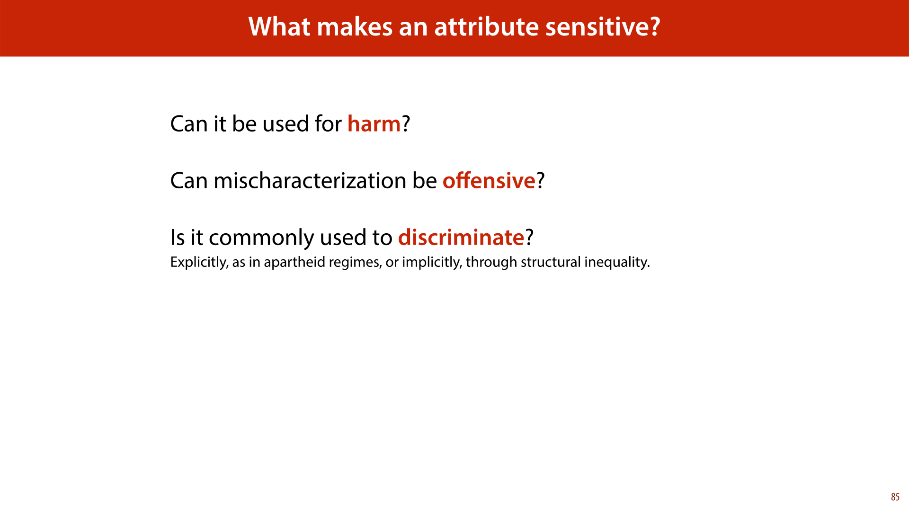

            <figcaption>
            
To decide whether or not an attribute is (potentially) sensitive, and if so, how it should be treated, we can ask ourselves several questions. In this video, we’ll focus on these three. 

            </figcaption>
       </section>

       <section id="slide-086">
            <a class="slide-link" href="https://mlvu.github.io/introduction#slide-086" title="Link to this slide.">link here</a>
            

            <figcaption>
            
The first, and perhaps most obvious question to ask yourself, is can a model be used for harm <em>intentionally</em>? 

This may seem like a vacuous question: apart from the most sadistic individuals, nobody causes harm intentionally, and certainly we don't expect large companies or countries to characterize their own actions as causing harm "on purpose". 

What we do see, however, is systems that cause <em>a particular effect</em> on purpose. There is then debate over whether that effect is harmful or not, and whether the harm is a necessary evil, but nobody is doubting that the system is functioning as intended.  

Here is one example. In China, in the Xinjiang region, there exists a mass internment program for people of Uyghur ethnicity. Large numbers of people are being incarcerated, under conditions that violate human rights. This by itself has nothing to do with machine learning, but one aspect of this issue is a large scale surveillance program, which includes the use of face recognition.  

For references, see the <a href="https://mlvu.github.io/social-impact/"><strong>social impact dossier</strong></a>. 

  

            </figcaption>
       </section>

       <section id="slide-087">
            <a class="slide-link" href="https://mlvu.github.io/introduction#slide-087" title="Link to this slide.">link here</a>
            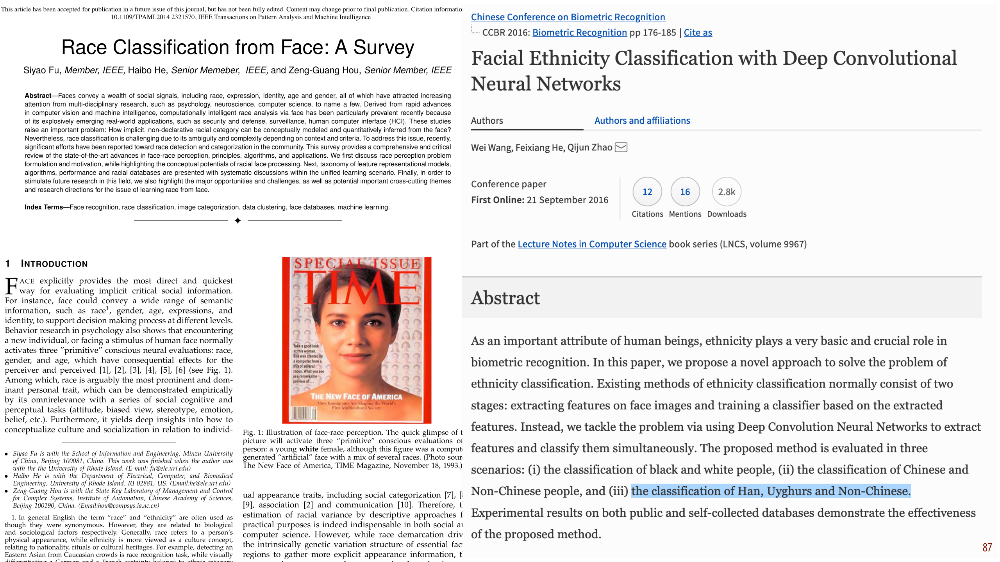

            <figcaption>
            
Against this background, It’s quite common to see research emerging from institutions focusing on the problem of <strong>ethnicity classification</strong>, sometimes with Uighur ethnicity explicitly used as a class. While it is a separate question whether ethinicity classification technology is being used in the existing Xinjiang surveillance systems, it is clear from this research that it is at least being <em>researched</em>, so if we are concerned about its use, this is the time consider the application of the technology we are developing. 

The reason we include this example here is that this is a rare case of a technology having a largely<em> </em><em>intended</em><strong> effect</strong>. The details of the larger Xinjiang situation are hotly debated, but nobody denies that a large surveillance program is a part of it, and that this makes it easier to incarcerate people of Uyghur ethnicity.  

There is a large body of direct evidence showing that explicit, automatic ethnicity detection is part of the technology being used in production systems. See the lecture notes for details. 
<aside    >Different parties have different views on the Xinjiang program as a whole, and whether it is harmful. The Chinese government characterizes it as necessary for national security, with several other countries signing declarations of support. Many other countries, however, have officially characterized the situation as at least "severe human rights abuse", and at worst "genocide".  </aside>
For references for these claims, see the <a href="https://mlvu.github.io/social-impact/"><strong>social impact dossier</strong></a>. 

            </figcaption>
       </section>

       <section id="slide-088" class="anim">
            <a class="slide-link" href="https://mlvu.github.io/introduction#slide-088" title="Link to this slide.">link here</a>
            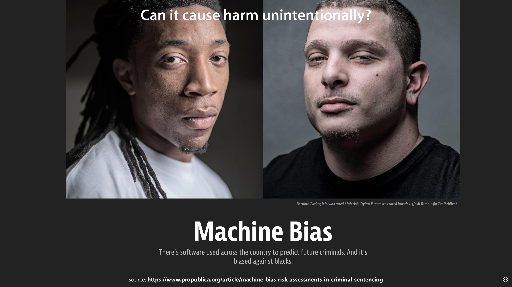

            <figcaption>
            
This aspect of the Xinjiang case makes it very unusual. It's much more common that designers try to avoid using ethnicity, race or other sensitive attributes, and that information finds its way into the system anyway. In such cases the effects that are considered harmful are <strong>not intended</strong>. 

In this article, the organization ProPublica broke the news that a system called COMPAS, used nation-wide in the United States to aid parole decisions was considerably more likely to deny black people parole than white people, even when all other factors were accounted for. 

This was not an explicit design choice of the makers of the system (a company called NorthPointe). In fact, they explicitly<em> excluded</em> race as a feature. However, even if we exclude sensitive attributes as features, we often can still <em>infer</em> them from other features. For instance, we may include a feature like a subject's postcode. This is usually strongly correlated with race, and so the system can still make the classification it would have made if race had been available. 

Contrast this with the previous situation. As before, the makers of the system deny the allegations of causing harm. Here, however, there is agreement on whether classifying by race is harmful. Both parties, ProPublica and Northpoint, presumably agree that a system would cause harm if it disproportionally denied black people parole. What they disagree on is whether this system does that. The effect that ProPublica alleges (and provides credible evidence for) in <strong>unintentional</strong>. 
<aside    >The question of how this disparity in predictions exactly comes about is subtle, and important to look at carefully. We'll do so in the third social impact video. </aside>
source: <a href="https://www.propublica.org/article/machine-bias-risk-assessments-in-criminal-sentencing"><strong>https://www.propublica.org/article/machine-bias-risk-assessments-in-criminal-sentencing</strong></a> 

For references, see the <a href="https://mlvu.github.io/social-impact/"><strong>social impact dossier</strong></a>.

            </figcaption>
            click image for animation
       </section>

       <section id="slide-089">
            <a class="slide-link" href="https://mlvu.github.io/introduction#slide-089" title="Link to this slide.">link here</a>
            

            <figcaption>
            
A system like COMPAS, that disproportionally denies black people parole is said to have <strong>a bias</strong>. This kind of bias can come from different places. 

One important source of bias is the distribution of the training data. Where we get our data has a tremendous impact on what the model learns. Since machine learning often requires large amounts of data, we usually can’t afford to control the gathering of data very carefully: unlike studies in life sciences, medicine and so on, we rarely make sure that all variables are carefully controlled.  

The result is that systems have unexpected biases. This is a picture of Joy Buolamwini. As a PhD student, she worked on existing face recognition systems. She found that if she tested them on her own face, they would not recognize her, and she needed to wear a light-colored mask to be recognized at all. 

One aspect of this problem is the bias in the data that face recognition systems are trained on. If, for instance, such data is gathered carelessly, we end up inheriting whatever biases our source has. If white people are overrepresented, then we end up training a system that works less well on non-white people. 

image source: <a href="https://www.nytimes.com/2018/02/09/technology/facial-recognition-race-artificial-intelligence.html"><strong>https://www.nytimes.com/2018/02/09/technology/facial-recognition-race-artificial-intelligence.html</strong></a>

<a href="https://www.nytimes.com/2018/02/09/technology/facial-recognition-race-artificial-intelligence.html"><strong></strong></a>

            </figcaption>
       </section>

       <section id="slide-090">
            <a class="slide-link" href="https://mlvu.github.io/introduction#slide-090" title="Link to this slide.">link here</a>
            

            <figcaption>
            
Here is a more recent example, a lot closer to home. 

During the COVID pandemic, the Vrije Universiteit used the software Proctorio to allow exams to be taken at home. Student Robin Pocornie finds that the software doesn't recognize her face unless she shines a bright light directly on to it. Before she figures out this hack, she's nearly missed the opportunity to start her exam on time [1].  

This is anecdotal evidence, of course, but it quickly becomes clear that many black students worldwide suffer the same problems. Not only can they not log in they are frequently marked for suspicious behaviour, or logged out, because the software thinks the have left their desk. 

This is a perfect example of exactly how these biases translate directly into harmful consequences (and we have our own university to thank for it). 

Eventually, a US researcher looked into the issue, and found some evidence that Proctorio uses the OpenCV library, which is known to have these issues [2]. 
<aside    >There is no structural, peer-reviewed research on this issue in Proctorio, but at this point the evidence is sufficient that I would put the burden of proof on them to show that they don't have such a bias.  </aside>
[1] <a href="https://www.volkskrant.nl/nieuws-achtergrond/de-antispieksoftware-herkende-haar-niet-als-mens-omdat-ze-zwart-is-maar-bij-de-vu-vond-ze-geen-gehoor~b6810279/?utm_source=link&amp;utm_medium=app&amp;utm_campaign=shared%20content&amp;utm_content=free"><strong>De antispieksoftware herkende haar niet als mens omdat ze zwart is, maar bij de VU vond ze geen gehoor</strong></a>, Fleur Damen, Volkskrant, 15 juli 2022  

[2] <a href="https://www.theverge.com/2021/4/8/22374386/proctorio-racial-bias-issues-opencv-facial-detection-schools-tests-remote-learning"><strong>Students of color are getting flagged to their teachers because testing software can’t see them</strong></a>, Mitchell Clark, the Verge, 8 April 2021

            </figcaption>
       </section>

       <section id="slide-091">
            <a class="slide-link" href="https://mlvu.github.io/introduction#slide-091" title="Link to this slide.">link here</a>
            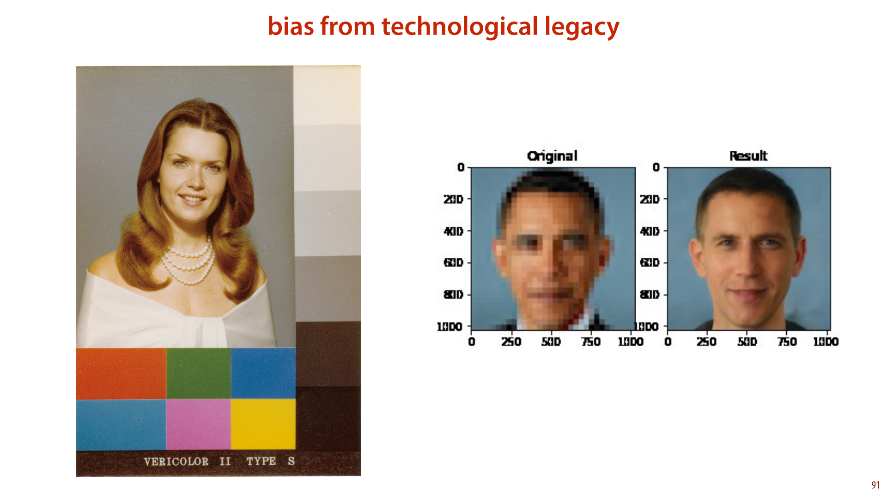

            <figcaption>
            
The problem is compounded by the way technologies build on one another. On the left is one example: the Shirley card. Such images (named after one of the models on the first one) were used by lab technicians to develop color photographs. This image was used as a reference to calibrate photo printers in small labs. This shows that white skin was, for a long time, the main target in developing photographic technology.  

Eventually, other test cards were developed, but not before color film and development had been focused on white skin for decades. Since digital photography was largely developed to mimic film, it’s quite possible that some of these biases are still present in modern day technology. Certainly most photographers will tell you that capturing black skin well is a skill in itself [1]. 

A more recent example is the PULSE system [2]. This is a rather ingenious method for generating reasonable high-resolution versions of low resolution photographs. Interestingly, the method doesn’t require any training data of its own: it relies on an existing generator network called StyleGAN (the same one that generated the non-existent people in the previous video). Unfortunately, StyleGAN turned out to be biased, most likely a result of the data it used. The result was that that images of non-white people were upsampled to white people. 
<aside    >Interestingly, a large part of StyleGAN's success was a special training dataset that they created, called FFHQ. This data was explicitly designed to include a greater variety of faces and people than the datasets that were then standard for this sort of task. This shows that even if you're aware of the problem, and you put in the effort to minimize it, you can still end up with problems like these. </aside>
[1] <a href="https://www.anothermag.com/art-photography/12799/antwaun-sargent-joshua-kissi-in-conversation-just-pictures-exhibition-st-louis"><strong>https://www.anothermag.com/art-photography/12799/antwaun-sargent-joshua-kissi-in-conversation-just-pictures-exhibition-st-louis</strong></a> 

[2] <a href="https://github.com/adamian98/pulse"><strong>https://github.com/adamian98/pulse</strong></a>

<a href="https://github.com/adamian98/pulse"><strong></strong></a>

            </figcaption>
       </section>

       <section id="slide-092" class="anim">
            <a class="slide-link" href="https://mlvu.github.io/introduction#slide-092" title="Link to this slide.">link here</a>
            

            <figcaption>
            
Finally, how you choose to<strong> use the predictions</strong> of your model can amplify bias, even if the predictions themselves are in some sense correct. 

Shown here is Google’s machine translation system. A sentence which is gender-neutral in English, like “My friend is a doctor” cannot be translated in a gender-neutral way into Spanish. In the earlier versions of Google Translate, a gender was chosen (implicitly), mostly dictated by the statistics of the dataset. Thus, since the dataset contained more examples of male doctors than female doctors, the system ends up picking the translation with the male suffix. 

You may argue that these statistics are in a sense reflective of biases that exist in society, so that it is indeed more likely that this sentence should be translated for a male.   

However, that doesn’t mean that we are <em>certain</em> that the user wants the sentence translated in this way. We might build a model that predicts that this sentence should be translated with a male gender with 70% probability. Let’s assume for the sake of argument that that probability is entirely correct.  

That <em>prediction</em> may be entirely correct, but that doesn’t tell us anything about what the correct <em>action</em> is. If we always pick the gender with the highest probability, we’re actually <em>amplifying </em>the bias in the data: there may be 70% male doctors in the dataset, but there will be 100% male doctors in translations produced by the system. 

The solution (in this case) was not to reduce the uncertainty by guessing more accurately, but to detect it, <em>and communicate it to the user</em>. In this case, by showing the two possible translations. The lesson here is that even if your predictions are sound, designing the correct<strong> action</strong> is still a difficult challenge. A challenge that often has more to do with human-computer interaction, than with machine learning. 

source: <a href="https://ai.googleblog.com/2020/04/a-scalable-approach-to-reducing-gender.html"><strong>https://ai.googleblog.com/2020/04/a-scalable-approach-to-reducing-gender.html</strong></a>

<a href="https://ai.googleblog.com/2020/04/a-scalable-approach-to-reducing-gender.html"><strong></strong></a>

            </figcaption>
            click image for animation
       </section>

       <section id="slide-093" class="anim">
            <a class="slide-link" href="https://mlvu.github.io/introduction#slide-093" title="Link to this slide.">link here</a>
            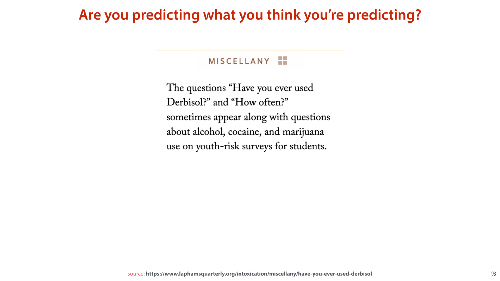

            <figcaption>
            
It’s also important to note that the target variable may not always be saying what you think it’s saying.  

This is a common problem with <strong>self-reporting</strong>. If you ask respondents for some value you’re interested in, rather than testing it directly, you often end up with inaccurate results. Either because people are lying to you, or because they simply don’t have an accurate idea of what you’re interested in.  

This example shows a common trick to avoid such self reporting problems: if you ask people if they've ever used a recreational drug that doesn't exist, you'll find that many people say yes. This tells you something about how reliable the answers are when you ask the same question for a drug that does exist. 

Now, imagine a survey where measures like this aren't taken, and we trust the students at face value when we ask about their drug use. If we then train a classifier to predict drug use from a set of features like extroversion, social background, or education level, we may think we’ve found a link between drug use and these features, when actually what we’ve found is a predictor for how willing people are to lie on a questionnaire.  

In short, just because a column in your data table is labeled "drug use", that doesn't mean you should blindly take it to actually represent drug use in the subjects. 

source: <a href="https://www.laphamsquarterly.org/intoxication/miscellany/have-you-ever-used-derbisol"><strong>https://www.laphamsquarterly.org/intoxication/miscellany/have-you-ever-used-derbisol</strong></a>

<a href="https://www.laphamsquarterly.org/intoxication/miscellany/have-you-ever-used-derbisol"><strong></strong></a>

            </figcaption>
            click image for animation
       </section>

       <section id="slide-094">
            <a class="slide-link" href="https://mlvu.github.io/introduction#slide-094" title="Link to this slide.">link here</a>
            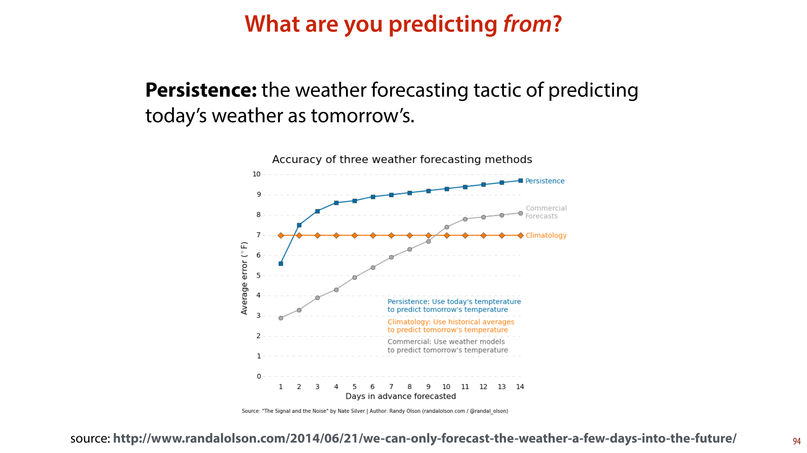

            <figcaption>
            
Another question is what <em>features </em>you are looking at for your predictions. What are you predicting from? 

For example, one very effective method for predicting the weather is simply to look at the weather today and to predict that tomorrow's weather will be the same. This is called the <em>persistence model</em> in weather forecasting. This is surprisingly effective, and you need a very sophisticated model to do any better. 

Nevertheless, for many use cases, this is an entirely unsuitable prediction. In short <strong>accuracy isn’t all that matters</strong>. A ship’s captain, for instance, will be interested in the probability of a storm. For this particular rare event the persistence model works terribly, even though it works well on average. The captain will be much more interested in a model that looks at <strong>relevant features</strong> to warn them of even a small probability of a storm than they will be in a model that simply predicts sunshine tomorrow if there was sunshine today.  

Part of the issue is that the captain is looking for predictions from <em>informative</em> features like mounting or falling air pressure. These features have a more direct causal relation to the prediction. The relation between today's weather and tomorrow's is much more correlational: today's weather doesn't<em> cause</em> tomorrow's weather, they are merely similar because they are usually caused by the same phenomena. 

source: <a href="http://www.randalolson.com/2014/06/21/we-can-only-forecast-the-weather-a-few-days-into-the-future/"><strong>http://www.randalolson.com/2014/06/21/we-can-only-forecast-the-weather-a-few-days-into-the-future/</strong></a>

<a href="http://www.randalolson.com/2014/06/21/we-can-only-forecast-the-weather-a-few-days-into-the-future/"><strong></strong></a>

            </figcaption>
       </section>

       <section id="slide-095">
            <a class="slide-link" href="https://mlvu.github.io/introduction#slide-095" title="Link to this slide.">link here</a>
            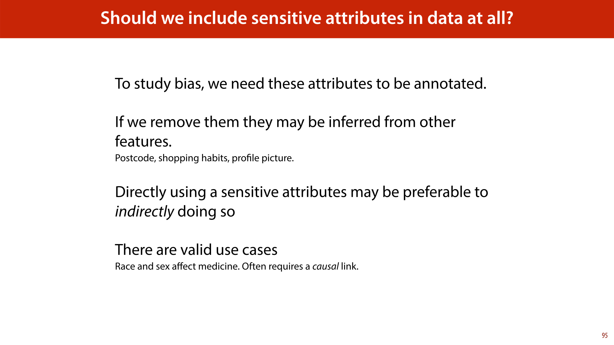

            <figcaption>
            
Next, it’s important to ask whether predicting a particular attribute can be <strong>offensive or hurtful</strong>. Regardless of whether you're guessing accurately, does the very act of guessing cause hurt, offense or harm? 

This is a more nebulous question than the others. Whether or not something causes offense is highly subjective. Causing offense is not illegal, and indeed it has often been instrumental in<em> improving</em> society. Many people feel that being offended is too often used as a shorthand to shut down meaningful conversation. Perhaps it’s better to consider the questions of whether your predictions are <em>hurtful</em>. While a single hurtful experience may be easy enough to shrug off, encountering enough of them on a daily basis can cross over into causing harm. Since a single machine learning model can now be rolled out to millions of people, affecting each many times a day,  one decision by a machine learning engineer can have a major negative impact. 

Thus, when you build a product that is meant to behave intelligently, it’s worth thinking about whether you want its automated behavior to be offensive.  

As a simple example, imagine if we spoke at a party and I guessed your sexuality, and told you I was doing so based on the shape of your nose. You might be offended (regardless of whether my guess was right or wrong). Even if, for the sake of argument, there is a broad correlation between nose shape and sexuality that I could use in my defense, it would probably still feel to you like I was taking a deep and complex aspect of your identity, and reducing it to a simple thing, to be guessed at. 

It’s not easy to pin down quite exactly where the offense comes from. My best guess is that it’s not so much the method of guessing that I chose to employ, but<em> the fact that I felt it necessary to do so at all</em>. I could have asked and been certain, or I could simply have left it. Since the attribute is a sensitive one, it deserves a sensitive course of action. In short, there’s a difference between being able to make a crude guess, and choosing to do so. 

In designing computer systems, a good rule of thumb is that if a behavior is not acceptable in a social context for people, then users will get upset if a computer system does it. Consider a website that asks you to give your email before it shows you its homepage. That’s like a person who asks you personal questions before even introducing themselves. This shows that well-designed computer systems should follow social norms. And that includes not guessing at sensitive attributes.  

Again, everybody is free to behave offensively, but the consequences are theirs. If you don’t treat people’s sensitive attributes with respect, don’t be surprised if they get upset with you. 

source: <a href="http://theawkwardyeti.com"><strong>theawkwardyeti.com</strong></a>

<a href="http://theawkwardyeti.com"><strong></strong></a>

            </figcaption>
       </section>

       <section id="slide-096">
            <a class="slide-link" href="https://mlvu.github.io/introduction#slide-096" title="Link to this slide.">link here</a>
            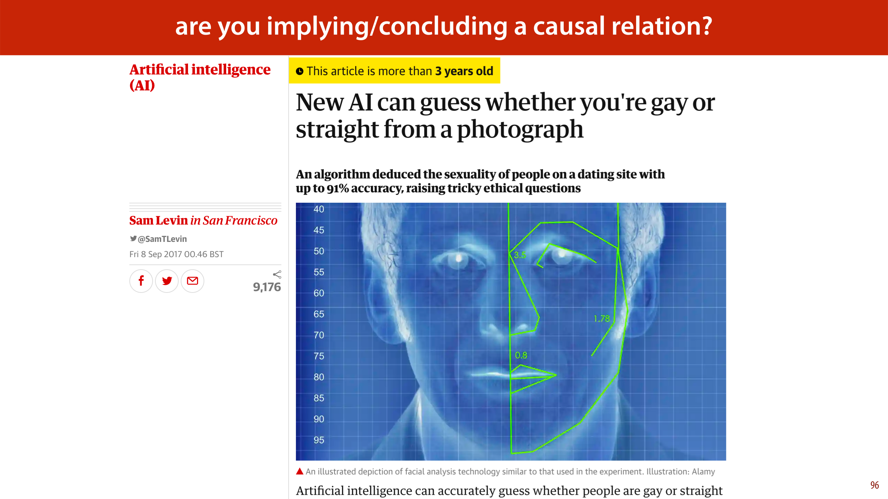

            <figcaption>
            
Finally, it's important to consider <strong>causality</strong>. Even if you can predict someone's job from their gender, someone's sexuality from a profile picture or someone's criminal future from their race, that's<strong> just a correlation</strong>. It doesn't means that one aspect causes the other. It could be that A causes B, B causes A, or that A and B are both caused by a third factor. 

It's important to realize that<strong> offline machine learning will </strong><em>never </em><strong>tell you what the causal relation is</strong>. To work out the causal structures in all these examples is extremely complex, and we'll devote more time to it in future social impact videos. For now, we will just caution you that even if you're smart enough not to conclude a causal link, publishing your results can still be seen to <strong>imply </strong>such a causal link.  

The slide shows an example we'll look at in more detail later: a research paper that showed that a classifier can guess whether you're gay or straight from a profile picture. 

Publicising such results will suggest to many people that there is a connection between the face somebody is born with, and their sexuality. As we will see when we look at the details, that is absolutely <em>not </em>a conclusion that can be drawn from this research, and the authors could have done a lot more to remove that implication. 

Put simply, machine learning produces crude and shallow guesswork at the best of times, and we should be very careful never to imply otherwise.

            </figcaption>
       </section>

       <section id="slide-097">
            <a class="slide-link" href="https://mlvu.github.io/introduction#slide-097" title="Link to this slide.">link here</a>
            

            <figcaption>
            
If you agree that certain attributes are sensitive, you may ask whether we should include them in our data at all? 

This all depends on context. In some cases, we may want to study whether racial or gender bias exists. In such cases, we need the data to be carefully annotated with the sensitive attributes.  

Removing sensitive attributes also doesn’t mean that we cannot discriminate on them. As we saw, other features may be correlated with the sensitive attributes, so that algorithms can still infer the sensitive attribute, and then produce a biased or problematic result based on that. In such cases, it may be preferable to include the sensitive feature explicitly and with the user’s consent so that we have more control over how it is used, or so that we can at least explain the system's behavior better. 

Finally, there are often valid use cases where we <em>can</em> use sensitive attributes in a responsible way. For instance, medical results are highly dependent on sex and race (and sometimes even sexuality). In conditions that are difficult to diagnose, like Parkinson’s, these may be crucial factors to consider.

            </figcaption>
       </section>

       <section id="slide-098">
            <a class="slide-link" href="https://mlvu.github.io/introduction#slide-098" title="Link to this slide.">link here</a>
            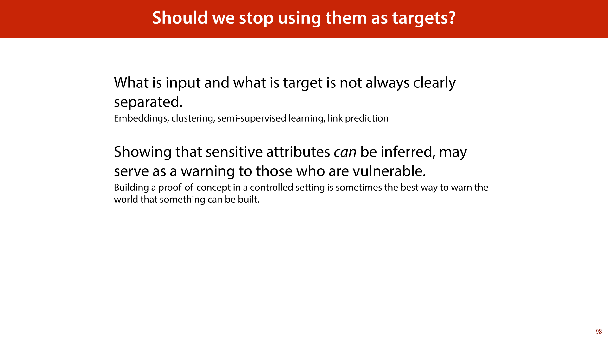

            <figcaption>
            
So, if we cannot just decree that they should never be used as <em>features</em>, can we perhaps agree that they should never be used as <em>targets</em>?  

Unfortunately, this is also not an easy call. Many algorithms work without explicit targets. Often, these learn representations that can be used to predict <em>all </em>information in the data including the sensitive attributes.  

Also, in some situations, building a system that explicitly does what we consider harmful, may be an effective way to warn people of which dangers exist.

            </figcaption>
       </section>

       <section id="slide-099">
            <a class="slide-link" href="https://mlvu.github.io/introduction#slide-099" title="Link to this slide.">link here</a>
            

            <figcaption>
            
For example, in the next video we’ll look at a classifier that was built to predict a person’s sexuality from profile pictures on a dating site. The authors’ stated intent was exactly this: to warn people that they may be exposing sensitive information purely by putting their image online. 

In eight countries in the world, homosexual acts carry the death penalty. 
<aside    >In most, this is not enforced, and prison sentences are common instead. The image in the slide is from 2013 [1], so some of the details may have changed. For an up to date overview of worldwide legislation, see [2]. </aside>
If facial features <em>are</em> correlated to some extent with sexual orientation, and law enforcement in these countries is incentivised to find as many non-heterosexual people as possible, then it can be important for gay people people to know that just by putting a photograph online, they may be exposing themselves to a higher degree of scrutiny. 

[1] <a href="https://www.economist.com/graphic-detail/2013/12/13/grim-to-be-gay"><strong>https://www.economist.com/graphic-detail/2013/12/13/grim-to-be-gay</strong></a> 

[2] <a href="https://en.wikipedia.org/wiki/LGBT_rights_by_country_or_territory#Northern_Africa"><strong>https://en.wikipedia.org/wiki/LGBT_rights_by_country_or_territory#Northern_Africa</strong></a> 

            </figcaption>
       </section>

       <section id="slide-100" class="anim">
            <a class="slide-link" href="https://mlvu.github.io/introduction#slide-100" title="Link to this slide.">link here</a>
            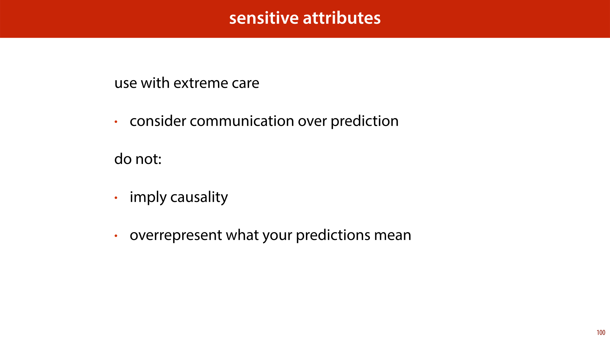

            <figcaption>
            
Again, you may think of these issues what you will. In many cases, these problems do not exist by themselves: you'll need to weigh them against whatever benefits will come from automating some process. We can't make that choice for you, and it's a choice everybody will make differently.

            </figcaption>
            click image for animation
       </section>

       <section id="slide-101">
            <a class="slide-link" href="https://mlvu.github.io/introduction#slide-101" title="Link to this slide.">link here</a>
            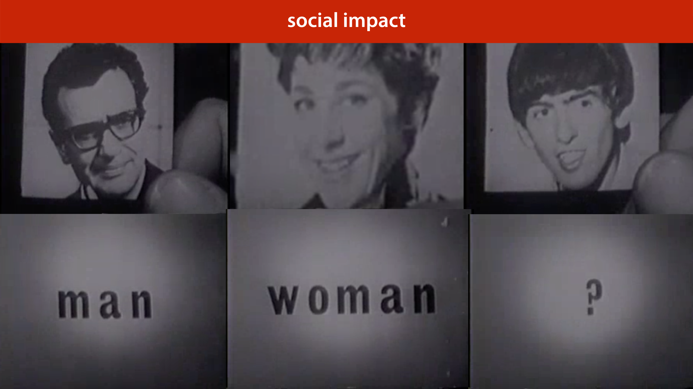

            <figcaption>
            
So, let’s return to our gender classifier, and ask some of these questions. Are sex and gender a sensitive attributes and if so, what should we do about gender classification? 

We've already seen, in the translation example, that data bias is an important problem when dealing with gender in data. Even if genders are carefully represented in your data, they may be associated in a biased way, such as associating doctors with men and nurses with women. As we saw, even if these biases are an accurate reflection of the state of society, we may still be in danger of amplifying them. 

Still, that does not in itself preclude us from using sex or gender as a target attribute for classification. To understand the controversy, we need to look at different questions.

            </figcaption>
       </section>

       <section id="slide-102">
            <a class="slide-link" href="https://mlvu.github.io/introduction#slide-102" title="Link to this slide.">link here</a>
            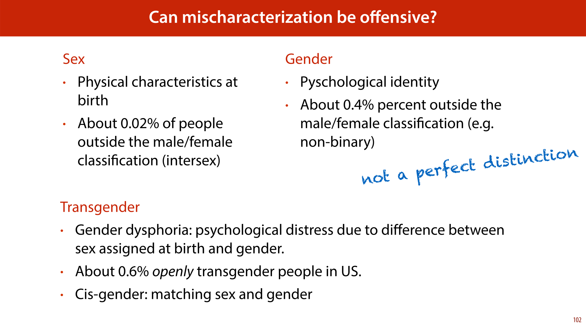

            <figcaption>
            
In discussing these matters, it is helpful to make a distinction between the type of body a person is born with, and their psychological gender identity. The first is usually referred to as <strong>sex</strong>, and the second as <strong>gender</strong>. These are not perfect distinctions, and it’s often not clear whether we are talking about sex differences or gender differences. But they serve to illustrate the basic problem. 

People whose sex and gender do not match, transgender people, can suffer considerable mental health problems when living according to their original sex rather than their gender, leading to extremely high rates of attempted suicide (40% vs a 4.6% national average)[1]. It is well-accepted in the psychological community that living with gender dysphoria, as this this sex-gender mismatch is known, is extremely distressing and that in adults, the best course of action is to conform to the gender rather than the sex. 

There is of course heated discussion at the moment about what the impact should be on various aspects of society. For our purposes, it is not necessary to discuss or endorse any specific claims. We have a large number of students, with no doubt a variety of views on the matter. You'll have to make up your own mind. However, what <em>is</em> undeniably true is that people with gender dysphoria exist, and that it causes them considerable and real psychological distress, in particular for those living according to their sex rather than their gender. This is is scientific fact, and it implies that for these people, gender should be considered a sensitive attribute.  

A proportion of 0.6% may not sound like much, but bear in mind that if your system is used by a million people, this means this means that 6000 people are negatively affected. Note also that this is the number of people who are openly transgender. Since there is a high stigma attached to being transgender, the total number will likely be much higher. 
<aside    >Sometimes the phrase transgender is used to cover both people whose sex and gender differ and people who do not identify as either male or female. For our current purposes, it is helpful to keep these categories distinct. </aside>
[1] The report of the 2015 U.S. Transgender survey, NCTE 2015, <a href="https://transequality.org/sites/default/files/docs/usts/USTS-Full-Report-Dec17.pdf"><strong>https://transequality.org/sites/default/files/docs/usts/USTS-Full-Report-Dec17.pdf</strong></a> 

            </figcaption>
       </section>

       <section id="slide-103" class="anim">
            <a class="slide-link" href="https://mlvu.github.io/introduction#slide-103" title="Link to this slide.">link here</a>
            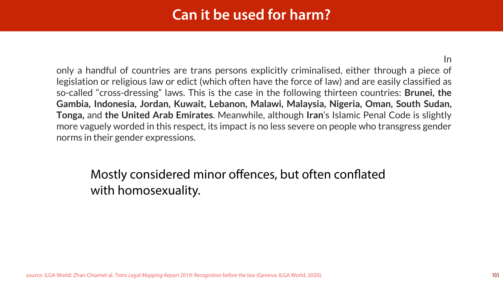

            <figcaption>
            
The next question we should ask, is whether predicting sex or gender, or a difference between the two, can cause harm, whether intentionally or not. 

Behaving in a way that doesn't conform to gender norms is illegal in 13 countries (as of 2020). These are usually considered minor offences, so at face value, the risk of intentional harm is less than it was for, for instance sexuality classification. However these issues are often conflated with homosexuality. That is, while cross-dressing itself only carries a minor penalty, it may be unfairly taken to <em>imply </em>homosexuality, which carries very severe penalties, including death.  

This means that the potential harm in predicting sex and gender may be similar to the harm in predicting sexuality. 

source: ILGA World: Zhan Chiamet al. <a href="https://ilga.org/trans-legal-mapping-report"><strong>Trans Legal Mapping Report 2019: Recognition before the law</strong></a> (Geneva: ILGA World, 2020).

            </figcaption>
            click image for animation
       </section>

       <section id="slide-104">
            <a class="slide-link" href="https://mlvu.github.io/introduction#slide-104" title="Link to this slide.">link here</a>
            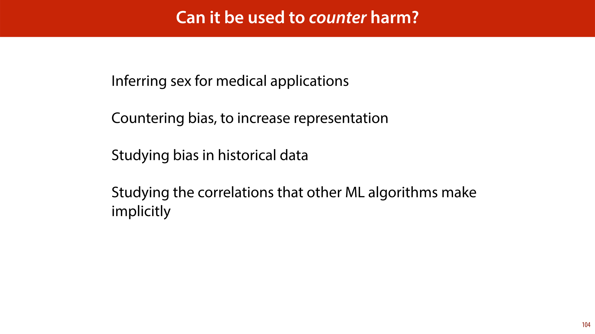

            <figcaption>
            
On the other hand, could predicting sex or gender be used to counter harm, or for harmless and beneficial purposes?  

In many medical applications, sex plays an important part. This doesn't automatically make it acceptable to guess a person's sex; remember, we can always <em>ask</em>. However, in some specific settings, there may be no certain way to ascertain sex due to privacy problems, and a guess may still be helpful. Still, if an attribute is sufficiently sensitive to be protected by privacy law, we should be even more careful about guessing it.  

In other cases, we may be aware of a harmful underrepresentation in our data. For instance, many early face detection datasets used computer vision researchers themselves as models, and that profession had a large gender imbalance at the time. In such cases, the best course of action, is of course to get better data, but if that is not feasible, it may be possible to <em>resample</em> the data, to at least alleviate the problem of data bias, if we can't solve it fully. At the very least, an effective "sex or gender" predictor should be able to tell us whether our dataset has an imbalance.

            </figcaption>
       </section>

       <section id="slide-105">
            <a class="slide-link" href="https://mlvu.github.io/introduction#slide-105" title="Link to this slide.">link here</a>
            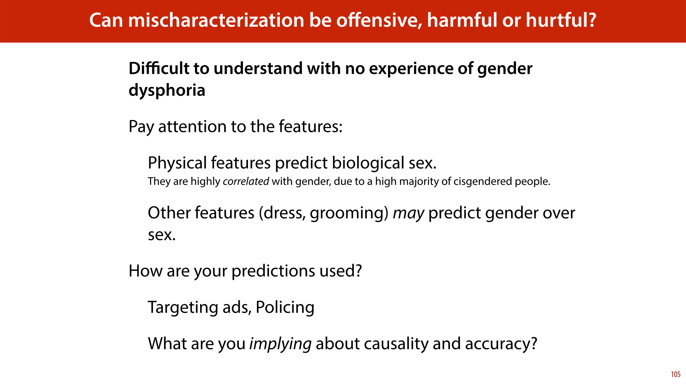

            <figcaption>
            
If you’ve never had any experience of gender dysphoria, it can be difficult to understand how intense it can be and how harmful it can be if your gender is regularly treated lightly. The best we can do as system builders is to consider the evidence (remember the attempted suicide rates) and to listen to our users. 

Where we cannot escape simply asking users for their gender when that is apposite, or doing without, and where we have a good reason to predict it, we should consider carefully which features we use: do they predict gender or sex, or a mixture of both? One may be correlated with the other (because a large majority of people are cis-gendered), but carelessly using your predictions may be seen as implying causal links that aren’t there.

            </figcaption>
       </section>

       <section id="slide-106">
            <a class="slide-link" href="https://mlvu.github.io/introduction#slide-106" title="Link to this slide.">link here</a>
            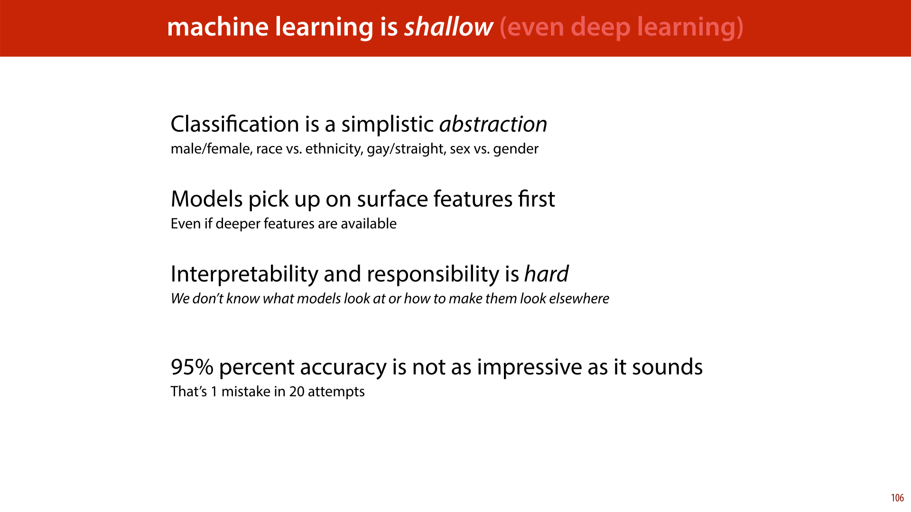

            <figcaption>
            
The problem is not solved, and it may never be. It’s a social problem more than a computer science one. The important thing to remember, is that machine learning systems are now deployed at scale, to millions of users. Machine learning is no longer just an academic exercise, and the decisions we make have consequences. That means we have a responsibility to consider those decisions carefully. In particular, we should always keep in mind how <em>shallow</em> machine learning is in its thinking (even if we use deep learning). 

Classification is a particularly strong example. In research, we like classification as an abstract task, because it’s a setting in which our models are easy to evaluate and to train. But that should not blind us to the fact that, usually, constraining a phenomenon like gender or sexuality to a small set of categories blinds us to the complexities of the thing we are actually trying to predict. 

Imagine a classifier that predicts the genre of a movie as either romance, action or comedy. In a research setting, this is a very nice, simple way to test our models, and to see what they can do. It doesn't matter that this is a poor representation of what genre actually is, because we it still allows us to compare models against one another. But if we then move to a domain where we are actually interested in saying something about movies, this categorization is woefully inadequate. It’s fine when we’re investigating our models, but it’s terrible to actually use in production settings.  

Here the problem isn't crucial: nobody will get hurt when a movie's genre is poorly represented. But when it comes to sensitive attributes, we have a responsibility to acknowledge that the categorizations used in classification are very shallow abstractions of the real world. And we should acknowledge this long before our models make it out of the laboratory.

            </figcaption>
       </section>

       <section id="slide-107">
            <a class="slide-link" href="https://mlvu.github.io/introduction#slide-107" title="Link to this slide.">link here</a>
            

            <figcaption>
            
So, this hopefully explains to some extent the reasons Google may have had to make the choice that it did. 

This is a difficult subject to explain precisely; however you look at it, it boils down to treating people with respect. What consists of respectful treatment, and how much of that people should be able to demand, is highly subjective. There are plenty of competitors to the Cloud Vision API that offer gender classification, so Google is likely sacrificing some customers who are looking for the feature, and gaining others who value their stance. 

You are free, of course, to disagree with Google's decision. Perhaps you disagree that gender classification is a sensitive matter. Perhaps you agree, but you value the right of Google's customers to make the decision for themselves more. In any case, we have hopefully convinced you that it's at least important to ask yourself the questions enumerated in this video. What answers you come up with, and how you weigh the different concerns is up to you. 

If nothing else, these issues show how far we've come in machine learning: our classifiers are no longer fed images by hand, and stumped by a judge’s wig or a Beatle hairdo, and they are certainly no longer confined to the laboratory. They are out there, making billions of predictions every hour in internationally deployed software systems. So, if we are the ones pushing them to production, we are the ones responsible for the consequences.

            </figcaption>
       </section>

       <section class="video" id="video-107">
           <a class="slide-link" href="https://mlvu.github.io/introduction#video-107">link here</a>
           <iframe
                src="https://www.youtube.com/embed/24fPK3CM-8E"
                title="YouTube video player"
                frameborder="0" allow="accelerometer; autoplay; clipboard-write; encrypted-media; gyroscope; picture-in-picture"
                allowfullscreen>
           </iframe>

       </section>

       <section id="slide-108">
            <a class="slide-link" href="https://mlvu.github.io/introduction#slide-108" title="Link to this slide.">link here</a>
            

            <figcaption>
            
In this last video, we’ll look a little deeper into the problem that is at the heart of what we are actually trying to achieve in machine learning. You may think the aim of machine learning model is to find a model that fits the training data as precisely as possible. You would be mistaken. The aim is to find a model that <strong>generalizes</strong>. 

 

            </figcaption>
       </section>

       <section id="slide-109">
            <a class="slide-link" href="https://mlvu.github.io/introduction#slide-109" title="Link to this slide.">link here</a>
            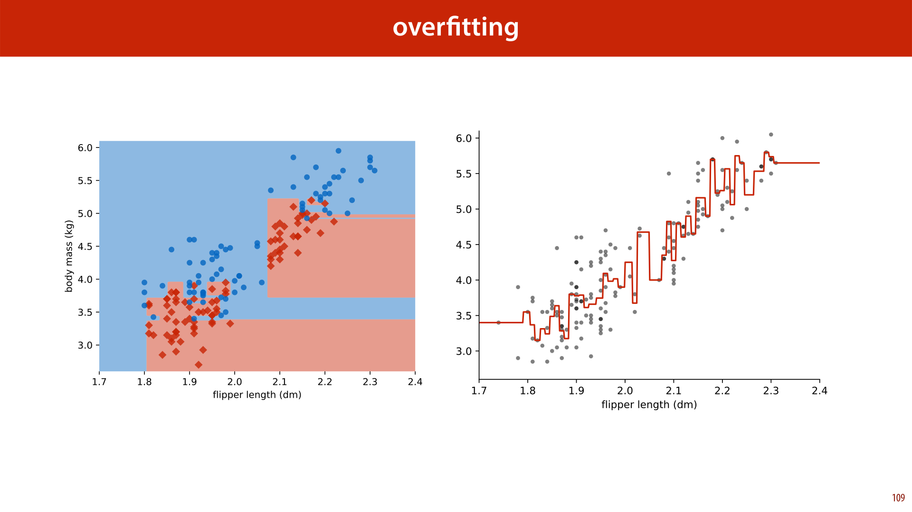

            <figcaption>
            
To explain, consider our tree-based solutions to the classification and regression problems. Both cover most of the data pretty well. Almost every red and blue dot is perfectly classified and the regression line hits a lot of the data points exactly. Both models make much closer fits than their linear counterparts.  

Look at the regression model on the right. Imagine you see a new penguin, and you are given their flipper length. Would it make sense to use this model to predict their body mass?

            </figcaption>
       </section>

       <section id="slide-110">
            <a class="slide-link" href="https://mlvu.github.io/introduction#slide-110" title="Link to this slide.">link here</a>
            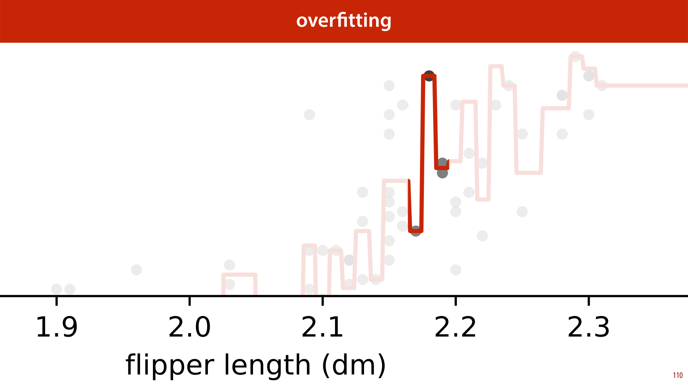

            <figcaption>
            
Let's zoom in on one of the spikes: here, the model seems to be convinced that penguins with a flipper length of exactly 218 mm have a much higher body mass than those with flipper lengths of 217 mm or 219 mm. This isn’t true, of course. There's nothing special about having flippers of exactly 219 mm long. It just happens to be the case that in this area, there was only one penguin in the data and they had a slightly higher body mass. The model is fitting details of the dataset that are <em>random noise</em>. We call this <strong>overfitting</strong>. 

When a model overfits, we sometimes say that it is <strong>memorizing</strong> the data, when it should be <strong>generalizing</strong>.

            </figcaption>
       </section>

       <section id="slide-111">
            <a class="slide-link" href="https://mlvu.github.io/introduction#slide-111" title="Link to this slide.">link here</a>
            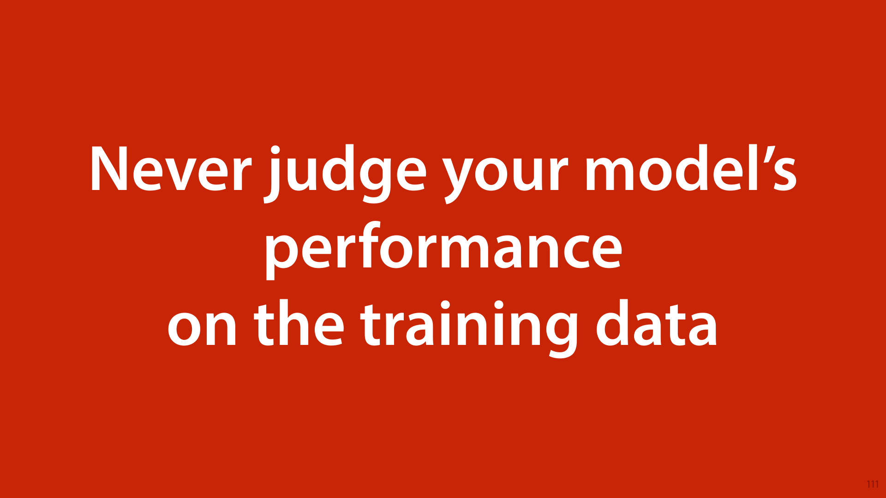

            <figcaption>
            
This is the most important rule in machine learning. Out of the three regression models we showed, the regression tree had the lowest loss on the training data, <strong>but it’s actually the worst model </strong>(for this particular dataset, it may be great for others). This means that if we look at how well the model does on the training data to pick the one we prefer, we'd end up with the worst one.  

It means nothing how many of the <em>training </em>instances the model gets right. What we actually want is a model that does well on <strong>new data;</strong> data that it hasn’t been trained on.

            </figcaption>
       </section>

       <section id="slide-112">
            <a class="slide-link" href="https://mlvu.github.io/introduction#slide-112" title="Link to this slide.">link here</a>
            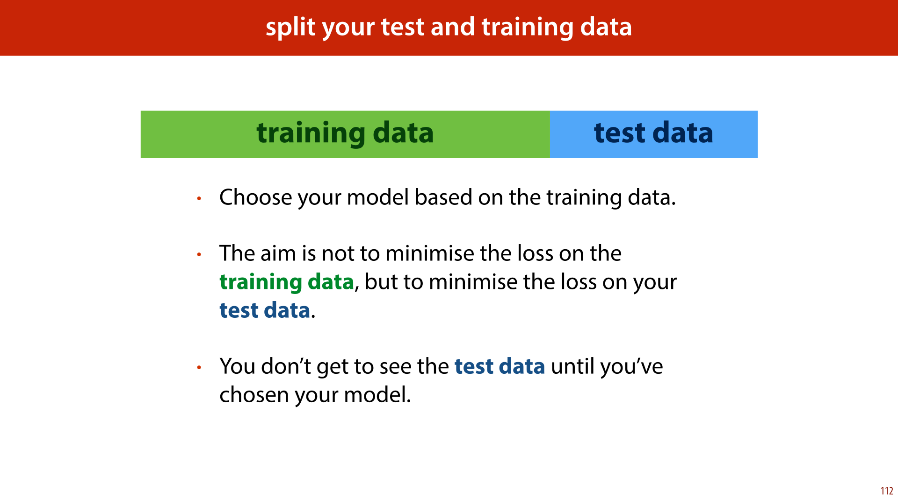

            <figcaption>
            
The simplest way to check this is to<strong> withhold data</strong>. You keep some data hidden from the model, and then check how well a particular model does on this part of the data. The data you show your model is called <strong class="green">training data</strong>, the data you withhold is called <strong>test data</strong>. 

            </figcaption>
       </section>

       <section id="slide-113">
            <a class="slide-link" href="https://mlvu.github.io/introduction#slide-113" title="Link to this slide.">link here</a>
            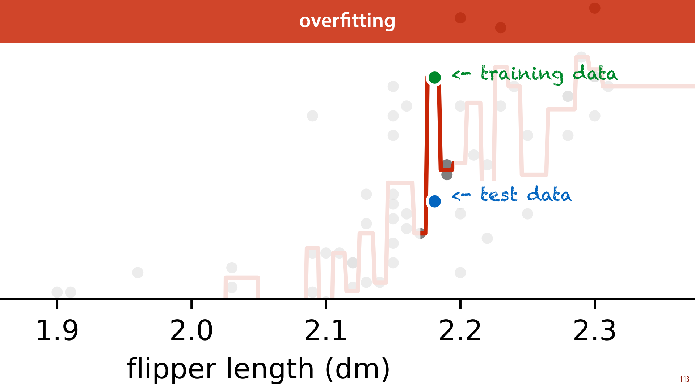

            <figcaption>
            
Now we see that the regression tree is a terrible model. The training data may show a spike in body mass at a flipper length of 219mm, but the test data will just follow the linear pattern. The next penguin we see with flippers of 219 mm, is likely to have a much lower body mass than the one we saw in the training data.

            </figcaption>
       </section>

       <section id="slide-114">
            <a class="slide-link" href="https://mlvu.github.io/introduction#slide-114" title="Link to this slide.">link here</a>
            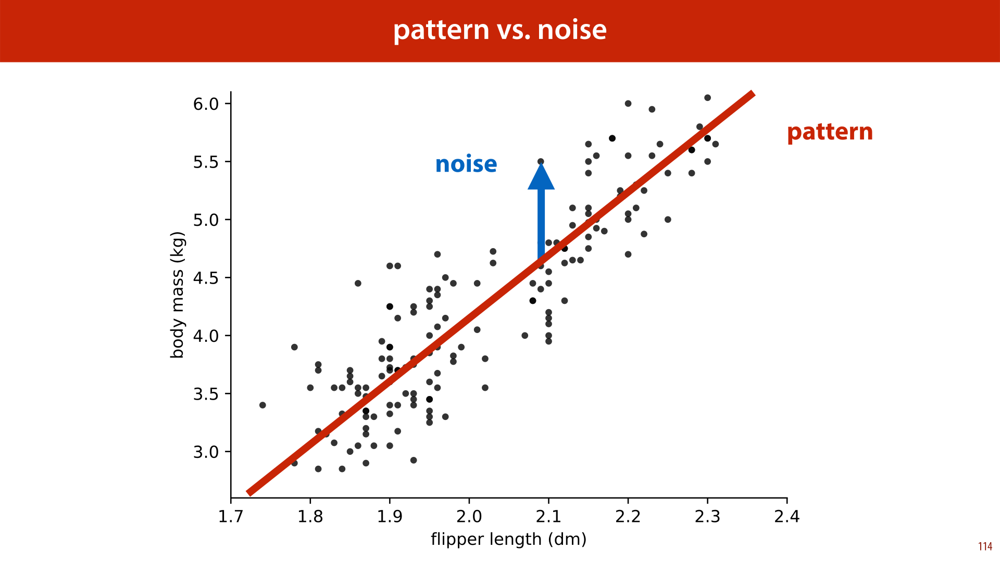

            <figcaption>
            
The task is not to fit the training data as well as possible. It is to fit the <strong>pattern</strong> in the training data and discard the <strong>noise</strong>. 

What is noise and what is pattern? Ultimately, the pattern is whatever is still there when we look at the test data, and the noise is what has disappeared. How can we tell which is which before looking at the test data? There doesn't seem to be a definitive answer. Every model does this differently, and we can only try things and see if they work.  

Fundamentally, machine learning is an<em> empirical </em>science, not a theoretical one. This is not to say that we don’t use theory to build our models, and to help us guess what might work. But ultimately, the proof that something works is empirical, not theoretical: we try it and see. 

            </figcaption>
       </section>

       <section id="slide-115">
            <a class="slide-link" href="https://mlvu.github.io/introduction#slide-115" title="Link to this slide.">link here</a>
            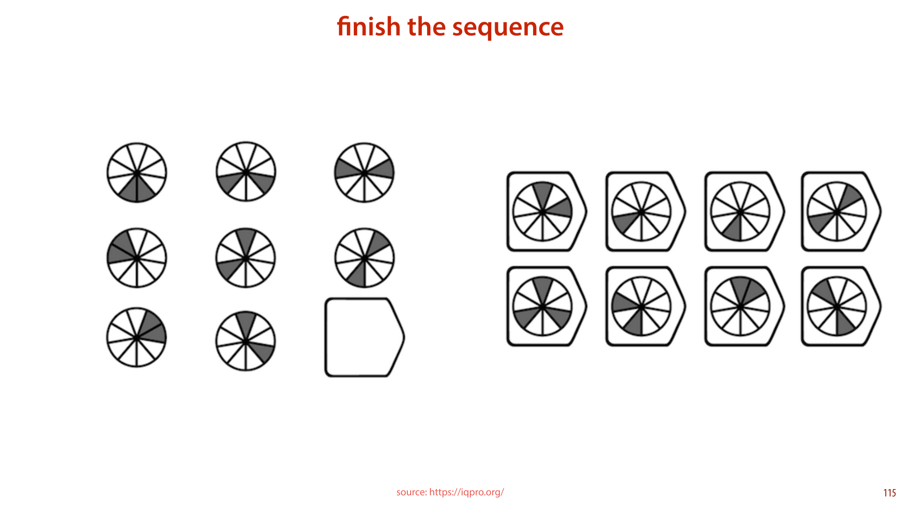

            <figcaption>
            
The problem of how we learn (and how we can make machines that learn) is an instance of the <strong>problem of induction</strong>. It was first posed as a problem by 18th century philosopher David Hume (pictured). 

<strong>Inductive reasoning</strong> is essentially a philosophical name for learning. We observe something happening a number of times, so we<em> infer </em>that it’ll probably happen again the next time. We’re not absolutely certain, and it doesn’t follow logically, but we’re sure enough to use that knowledge to our advantage. 

This is very different from the<strong> deductive reasoning </strong>which philosophers have studied since antiquity. 

            </figcaption>
       </section>

       <section id="slide-116" class="anim">
            <a class="slide-link" href="https://mlvu.github.io/introduction#slide-116" title="Link to this slide.">link here</a>
            

            <figcaption>
            
For deductive reasoning, we know the rules, and we understand them perfectly. For inductive reasoning the rules are not so clear. For instance, whenever I visit a funeral, I’m never the person being buried. Therefore, the more funerals I visit, the more certain I should be that next time it won’t be my funeral. Clearly this is not the case (usually the opposite is true). 

Deduction is rule-following. It’s what computers do best. In order to make computers do something like inductive reasoning, and in order to fully understand how <em>we</em> do it, we need to reduce it to rules. But Hume argued that inductive reason can not be proved to work by deductive methods. 

So, if inductive reasoning doesn’t follow as a special case of deductive reasoning, and inductive reasoning applies sometimes and it doesn’t at other times… how do <em>we</em> do it? Why is the funeral example obviously wrong, and the sun example obviously right? If inductive reasoning cannot be reduced to deductive reasoning, do we have any hope of reducing it to a computer program? 

In many ways, the problem of induction is still unsolved. We can teach computers to learn pretty well these days, but we still don’t fully understand what all the rules are. 

            </figcaption>
            click image for animation
       </section>

       <section id="slide-117">
            <a class="slide-link" href="https://mlvu.github.io/introduction#slide-117" title="Link to this slide.">link here</a>
            

            <figcaption>
            
Induction and machine learning are a bit like finish-the-sequence puzzles, that are often part of IQ tests.  

Some people get frustrated by puzzles like these, because the rules are not spelled out. We are supposed to infer the rules of this particular sequence and then apply those rules to find the missing element. Likewise, in machine learning, we are supposed to infer the pattern from the training set and apply it to the test set. 

Obviously, the correct solution is the one that fits the test set as well, but <strong>we have to decide before we see the test set</strong>. 

In this case, there are two ways to solve the puzzle. Reading from top to bottom each column contains a pattern that is rotated by three slices each step. Reading from left to right, the two slices in the pattern are pushed one slice further apart each step. In this case, both patterns lead to the same solution. But what if they didn’t? Which solution are we supposed to prefer? What if we come up with a highly convoluted reason for preferring some other answer, why would that obviously be wrong? 

The truth is, that while we have some general principles for which solutions we tend to prefer, there is no general theory of learning that is always obviously correct. Ultimately, the solution to puzzles like these are appeals to <em>intuition</em>, and so is the solution to a machine learning problem. This is what makes machine learning so difficult, and what makes it so interesting. 

source: <a href="https://iqpro.org/"><strong>https://iqpro.org/</strong></a> 

            </figcaption>
       </section>

       <section id="slide-118">
            <a class="slide-link" href="https://mlvu.github.io/introduction#slide-118" title="Link to this slide.">link here</a>
            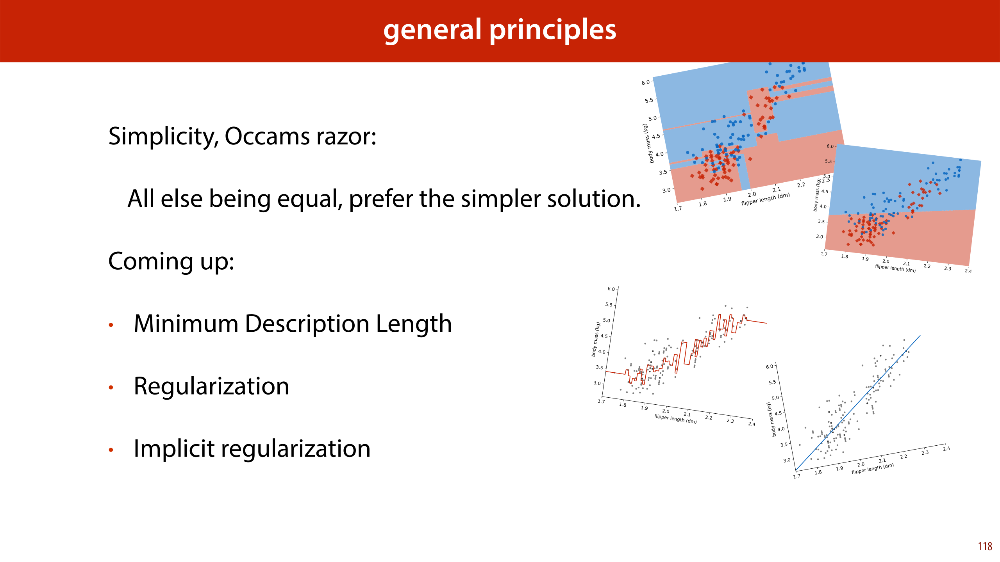

            <figcaption>
            
That isn’t to say we don’t have a general idea of what makes one solution better than another. There are always exceptions, but in general, preferring simple solutions over complex ones seems to lead to good learning performance. Intuitively, this certainly seems to apply to the penguin regression problem: the linear fit is the simpler one, and all the extra complexity of the regression tree is just noise. On the other hand, in the classification example the linear model was <em>too simple</em>, and the tree-based model was closer to the mark. 

Even if we decide that we should generally prefer simplicity, we still need to know where to draw the line. We have to make precise how we define the simplicity of a given model exactly, and if the simple and complex solutions aren’t equally good, how much simplicity we should sacrifice for a better solution. 

In later lectures we’ll look at some ways in which this intuition is made more precise, so we can answer some of these questions.

            </figcaption>
       </section>

       <section id="slide-119">
            <a class="slide-link" href="https://mlvu.github.io/introduction#slide-119" title="Link to this slide.">link here</a>
            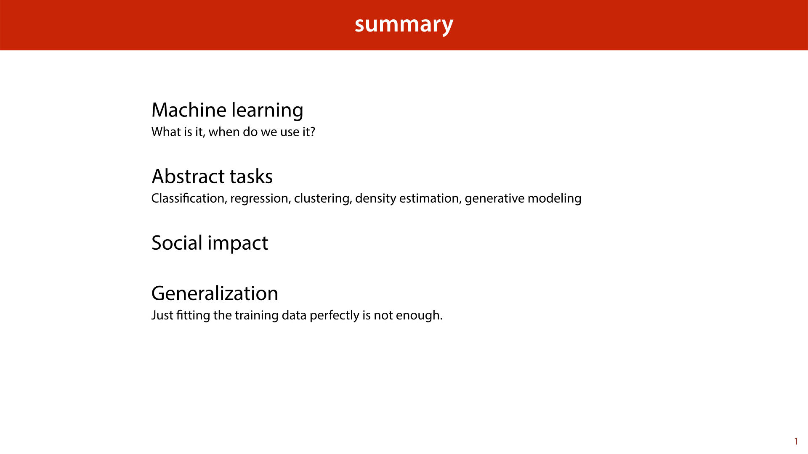

            <figcaption>
            

            </figcaption>
       </section>

       <section id="slide-120">
            <a class="slide-link" href="https://mlvu.github.io/introduction#slide-120" title="Link to this slide.">link here</a>
            

            <figcaption>
            

            </figcaption>
       </section>

</article>
