<nav class="menu">
    <ul>
        <li class="home"><a href="/">Home</a></li>
        <li class="name">Lecture 3: Model evaluation</li>
            <li><a href="#video-000">Experiments</a></li>
            <li><a href="#video-028">Statistical Testing</a></li>
            <li><a href="#video-051">Evaluation</a></li>
            <li><a href="#video-080">PR, ROC and AUC</a></li>
            <li><a href="#video-101">Social Impact 2</a></li>
            <li><a href="#video-120">No Free Lunch</a></li>
        <li class="pdf"><a href="https://mlvu.github.io/lectures/21.Methodology1.annotated.pdf">PDF</a></li>
    </ul>
</nav>

<article class="slides">
       <section class="video" id="video-000">
           <a class="slide-link" href="https://mlvu.github.io/lecture03#video-0">link here</a>
           <iframe
                src="https://www.youtube.com/embed/hHLDDJJl2v4?modestbranding=1&showinfo=0&rel=0"
                title="YouTube video player"
                frameborder="0" allow="accelerometer; autoplay; clipboard-write; encrypted-media; gyroscope; picture-in-picture"
                allowfullscreen>
           </iframe>

       </section>

       <section id="slide-001">
            <a class="slide-link" href="https://mlvu.github.io/lecture03#slide-001" title="Link to this slide.">link here</a>
            

            <figcaption>
            
<lnbr></lnbr>

            </figcaption>
       </section>

       <section id="slide-001" class="anim">
            <a class="slide-link" href="https://mlvu.github.io/lecture03#slide-002" title="Link to this slide.">link here</a>
            

            <figcaption>
            
Here is the basic recipe for machine learning again. This week, we’ll discuss what happens before and after. Today: once you’ve trained some models, how do you figure out which of them is best?

            </figcaption>
            click image for animation
       </section>

       <section id="slide-003">
            <a class="slide-link" href="https://mlvu.github.io/lecture03#slide-003" title="Link to this slide.">link here</a>
            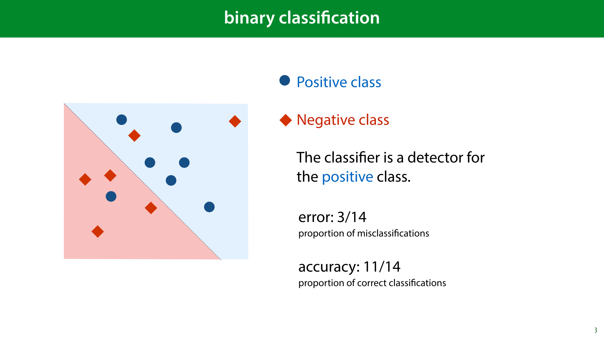

            <figcaption>
            
We’ll focus mostly on <strong>binary classification </strong>today (two-class classification). In this case, we can think of the classifier as a detector for one of the classes (like spam, or a disease). We tend to call this class positive. As in “testing positive for a disease.” 

In classification, the main metric of performance is the proportion of misclassified examples (which we’ve already seen). This is called the <strong>error</strong>. The proportion of correctly classified examples is called the <strong>accuracy</strong>. 

            </figcaption>
       </section>

       <section id="slide-003" class="anim">
            <a class="slide-link" href="https://mlvu.github.io/lecture03#slide-004" title="Link to this slide.">link here</a>
            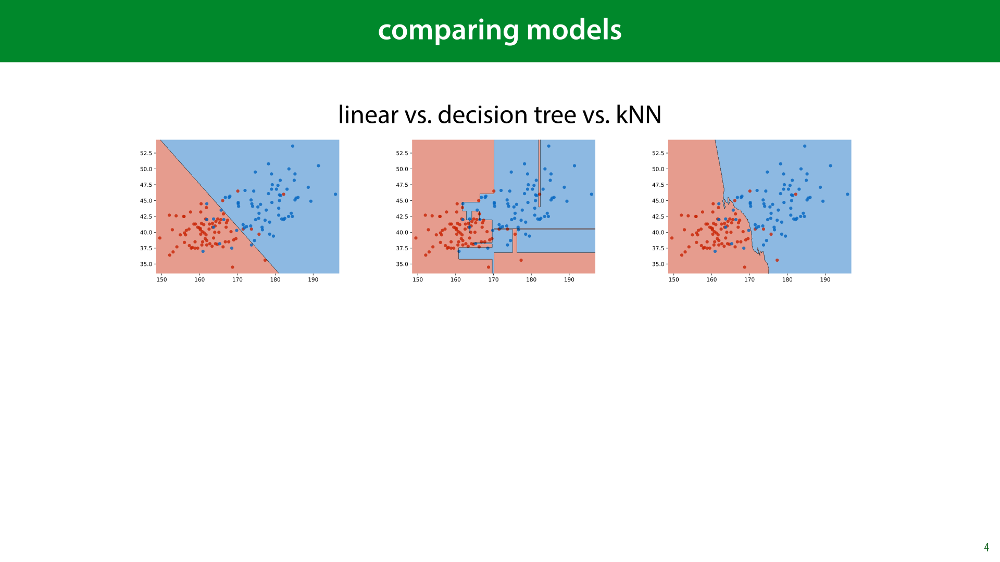

            <figcaption>
            
You compare models to figure out which is the best. Ultimately, to choose which model to you want to use in <em>production</em>. (This could be literally the production version of a piece of software, or just the model whose predictions you decide to use in the future.) 

Sometimes you are comparing different models types (decisions tree vs linear), but you might also be comparing different ways of configuring the same model type. For instance in the kNN classifier, how many neighbours (k) should we look at to determine our classification? 

With the 2D dataset, we can look at the decision boundary, and make a visual judgment. Usually, that’s not the case: our feature space will have hundreds of dimensions, and we’ll need to <em>measure</em> the performance of a model. 

            </figcaption>
            click image for animation
       </section>

       <section id="slide-004" class="anim">
            <a class="slide-link" href="https://mlvu.github.io/lecture03#slide-005" title="Link to this slide.">link here</a>
            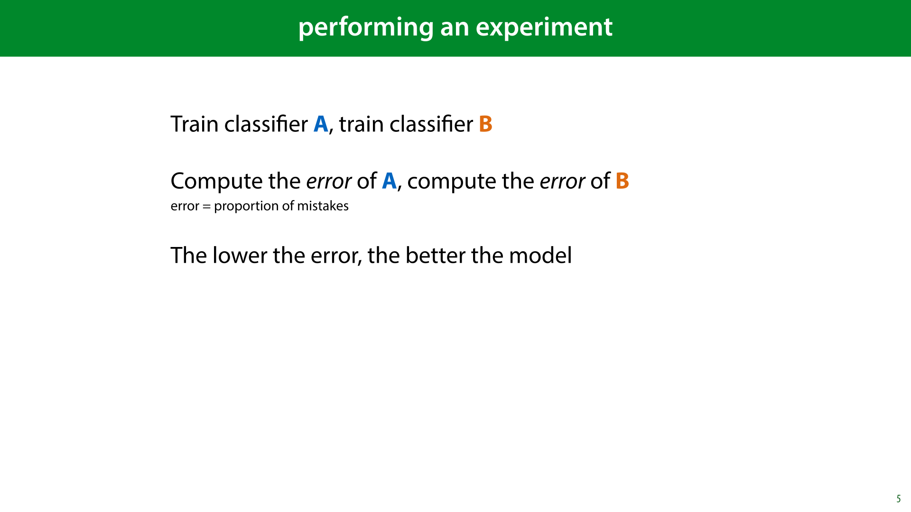

            <figcaption>
            
Here is the simplest, most straightforward way to compare two classifiers. You just train them both, so see how many examples they get wrong, and pick the one that made fewest mistakes. This is a very simple approach, but it’s basically what we do.  

We just need to consider<strong class="orange red"> a few questions</strong>, to make sure that we can trust our results.

            </figcaption>
            click image for animation
       </section>

       <section id="slide-006">
            <a class="slide-link" href="https://mlvu.github.io/lecture03#slide-006" title="Link to this slide.">link here</a>
            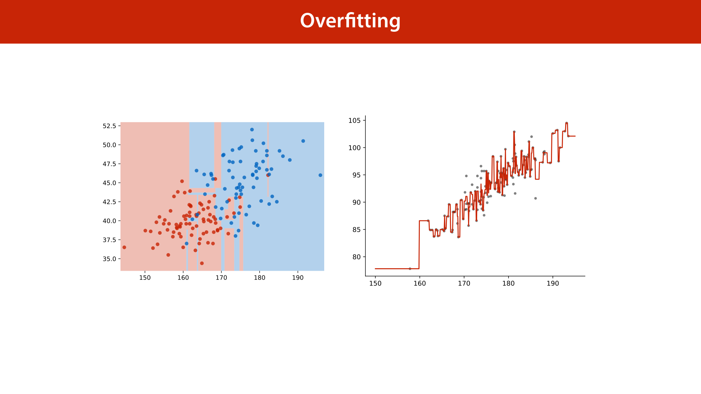

            <figcaption>
            
We’ve already seen what happens when you evaluate on the training data. A model that fits the training data perfectly may not be much use when it comes to data you haven't seen before.

            </figcaption>
       </section>

       <section id="slide-007">
            <a class="slide-link" href="https://mlvu.github.io/lecture03#slide-007" title="Link to this slide.">link here</a>
            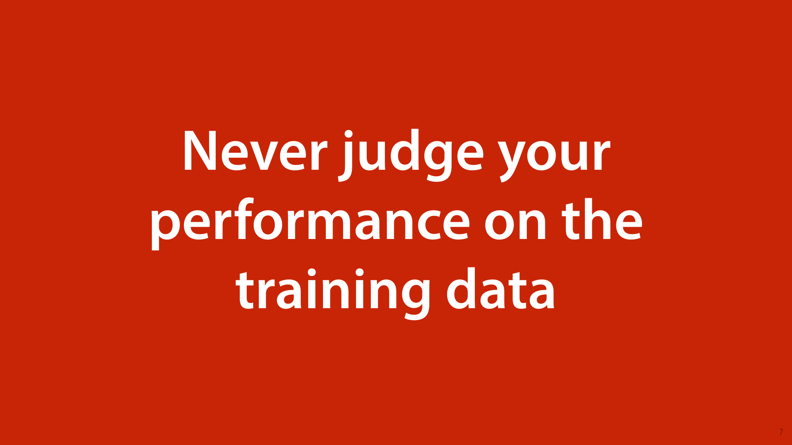

            <figcaption>
            

            </figcaption>
       </section>

       <section id="slide-008">
            <a class="slide-link" href="https://mlvu.github.io/lecture03#slide-008" title="Link to this slide.">link here</a>
            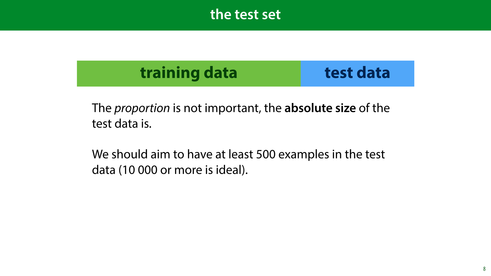

            <figcaption>
            
So the first thing we do in machine learning is <strong>withhold</strong> some data. We train our classifiers on the training data and test on the test data. That way, if we get good performance, we know that we’re likely to get a good performance on future data as well, and we haven’t just memorised random fluctuations in the training data. 

How should we split our data? The most important factor is the size in instances of the test data. The bigger this number, the more precise our estimate of our model’s error. Ideally, we separate 10 000 test instances, and use whatever we have left over as training data. Unfortunately, this is not always realistic. We’ll look at this a little more later.

            </figcaption>
       </section>

       <section id="slide-009">
            <a class="slide-link" href="https://mlvu.github.io/lecture03#slide-009" title="Link to this slide.">link here</a>
            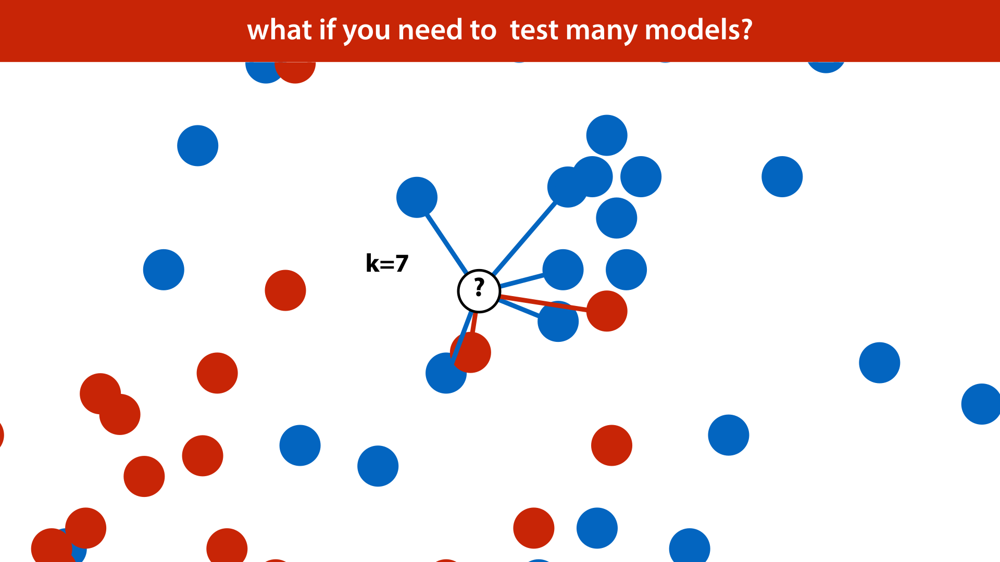

            <figcaption>
            
But even if we withhold some test data, we can still go wrong. We’ll use k nearest neighbours (kNN) as a running example. Remember, kNN assigns the class of the k nearest points.  

k is what is called a <strong>hyperparameter</strong>. We need to choose its value in some way before we run the algorithm. The algorithm doesn't specify how it should be chosen. One way of choosing k is to try a few values, and to see for which k we get the best performance.

            </figcaption>
       </section>

       <section id="slide-010">
            <a class="slide-link" href="https://mlvu.github.io/lecture03#slide-010" title="Link to this slide.">link here</a>
            

            <figcaption>
            
We will use the data from the first lecture as an example. We will take a small subsample of the dataset, so that the effects that we want to illustrate become exaggerated.

            </figcaption>
       </section>

       <section id="slide-010" class="anim">
            <a class="slide-link" href="https://mlvu.github.io/lecture03#slide-011" title="Link to this slide.">link here</a>
            

            <figcaption>
            
Here we’ve tested 12 different values of k on the same test data (using quite a small test set to illustrate the idea). We can see that for k=1, we get the best performance. We plotted the test data (with the training data in low opacity). 

            </figcaption>
            click image for animation
       </section>

       <section id="slide-012">
            <a class="slide-link" href="https://mlvu.github.io/lecture03#slide-012" title="Link to this slide.">link here</a>
            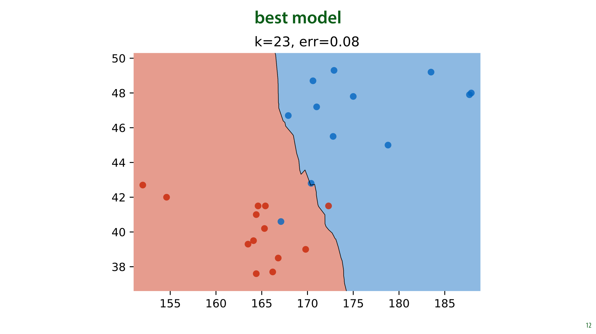

            <figcaption>
            
Here is the best run. Should we conclude that k=1 is definitely a better setting than k=2 or k=3? Should we conclude that we can expect an error of 0.16 on any future data from the same source?

            </figcaption>
       </section>

       <section id="slide-012" class="anim">
            <a class="slide-link" href="https://mlvu.github.io/lecture03#slide-013" title="Link to this slide.">link here</a>
            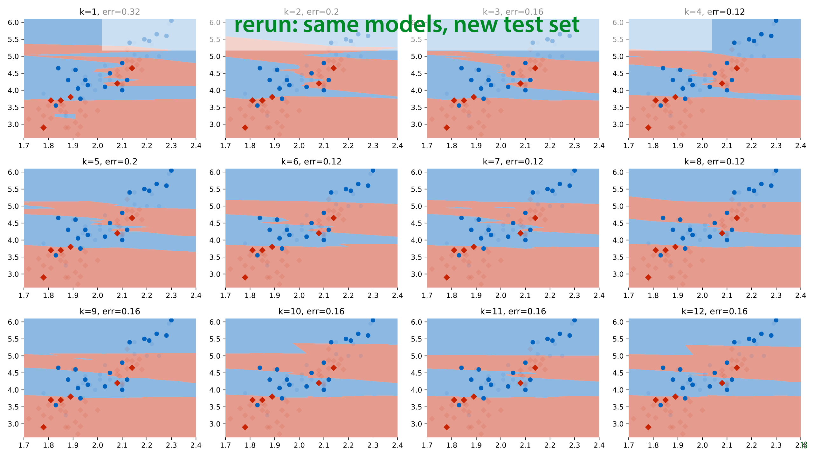

            <figcaption>
            
In this case, we have some more data from the same source, so we can evaluate the classifiers again on <strong>a fresh </strong><strong class="blue">test set</strong>. This is a luxury we don't normally have (we normally use all the data we are given).  

What we see is that k=1 no longer gives us the best performance. In fact, we get a radically different best value of k, and k=1 now gives us the <em>highest</em> error in the run.

            </figcaption>
            click image for animation
       </section>

       <section id="slide-014">
            <a class="slide-link" href="https://mlvu.github.io/lecture03#slide-014" title="Link to this slide.">link here</a>
            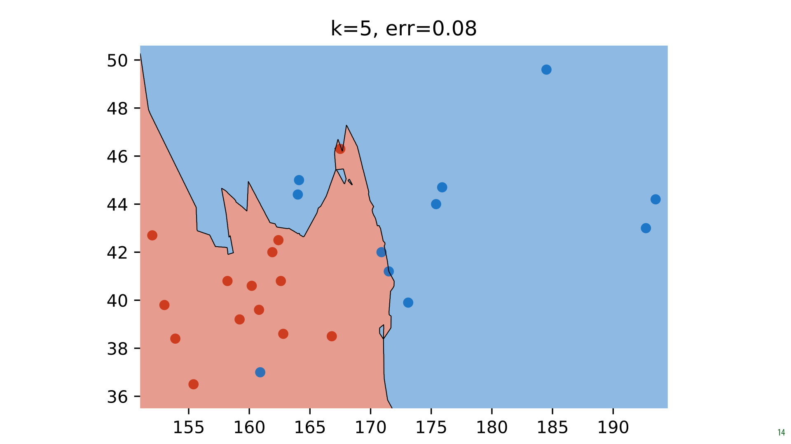

            <figcaption>
            
Here is one of the the new best runs.

            </figcaption>
       </section>

       <section id="slide-015">
            <a class="slide-link" href="https://mlvu.github.io/lecture03#slide-015" title="Link to this slide.">link here</a>
            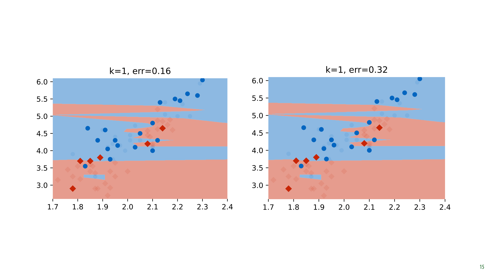

            <figcaption>
            
The same models, different test sets and the conclusions are entirely different. We were diligent in splitting our dataset and evaluating only on withheld data, and yet if we had done only one run on one dataset, as we normally would, we would have concluded that k=1 is the best setting and that an error of 0.16 can be expected with that value.  

If we look at the k=1 model from the second run (the one we chose), we will see that the performance on the new test set is terrible. If we select a model in this way and take it into production, we will find that it performs terribly. 

So what's happening here? 

            </figcaption>
       </section>

       <section id="slide-016">
            <a class="slide-link" href="https://mlvu.github.io/lecture03#slide-016" title="Link to this slide.">link here</a>
            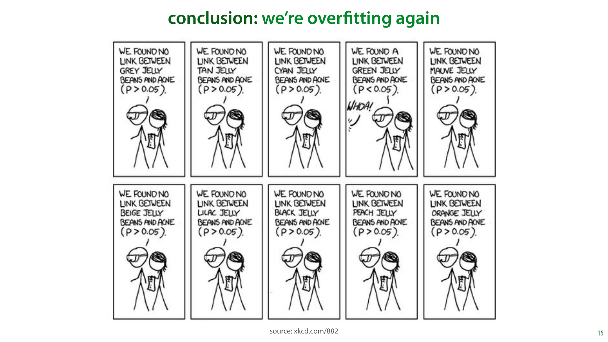

            <figcaption>
            
This is essentially the overfitting problem again. Our method of choosing the hyperparameter k is just another learning algorithm. By testing so many values of k on such a small amount of test data, we are overfitting our choice of k on the test data. The model we choose fits well because of random fluctuations in the data. When we resample the data, these fluctuations disappear and the performance drops. 

This is an instance of the<em> multiple testing</em> problem in statistics. We’re testing so many things, that the likelihood of a noticeable effect popping up by chance increases. We are in danger of ascribing meaning to random fluctuations.  

Specifically, in our case, the k=1 classifier <strong>got lucky</strong> on a few examples, that just happened to fall on the right side of the decision boundary. If we draw some new data, the same classifier won't be lucky again. The more different values of k we try, the more we are in danger of this kind of random luck determining which hyperparameters come out as good. 

The simple answer to the problem of multiple testing is<strong> not to test multiple times</strong>. 

see also: <a href="https://www.explainxkcd.com/wiki/index.php/882:_Significant"><strong class="blue">https://www.explainxkcd.com/wiki/index.php/882:_Significant</strong></a> 

            </figcaption>
       </section>

       <section id="slide-017">
            <a class="slide-link" href="https://mlvu.github.io/lecture03#slide-017" title="Link to this slide.">link here</a>
            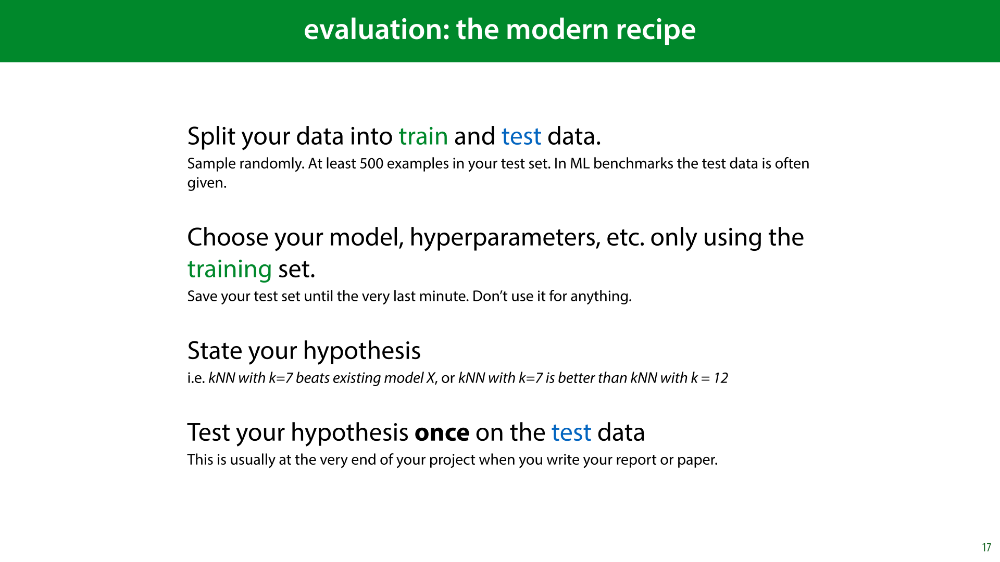

            <figcaption>
            
There are many different approaches to machine learning experimentation, and not every paper you see will follow this approach, but this is the most common one.  

It’s important to mention in your paper that you followed this approach, since the reader can’t usually see it from the presented results. 

            </figcaption>
       </section>

       <section id="slide-018">
            <a class="slide-link" href="https://mlvu.github.io/lecture03#slide-018" title="Link to this slide.">link here</a>
            

            <figcaption>
            
Just to emphasize the important point: the more you use the test data, the less reliable your conclusions become. Figure out what the end of your project is, and do not touch the test data until the end. 

In really important and long-term projects, it’s not a bad idea to withhold multiple test sets. This allows you to still test your conclusions in case you’ve ended up using the original test data too often.

            </figcaption>
       </section>

       <section id="slide-019">
            <a class="slide-link" href="https://mlvu.github.io/lecture03#slide-019" title="Link to this slide.">link here</a>
            

            <figcaption>
            
Not only does reusing test data mean that you pick the wrong model, it also means that the error estimate you get is probably much lower that the error you would actually get if you gathered some more test data. 

            </figcaption>
       </section>

       <section id="slide-019" class="anim">
            <a class="slide-link" href="https://mlvu.github.io/lecture03#slide-020" title="Link to this slide.">link here</a>
            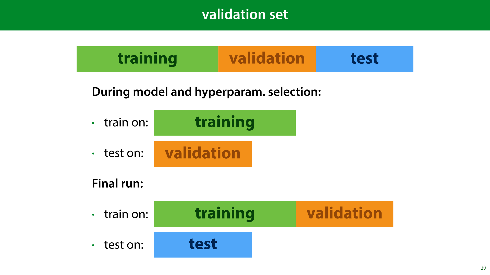

            <figcaption>
            
This means that you need to test which model to use, which hyperparameters to give it, and how to extract your features <strong>only on the training data</strong>. In order not to evaluate on the training data for these evaluations, you usually split the training data <strong>again</strong>: into a (new) <strong class="green">training set</strong> and<strong class="orange"> a validation set</strong>. 

Ideally, your validation data is the same size as your test set, but you can make it a little smaller to get some more training data. 

This means that you need to <strong>carefully plan your research process</strong>. If you start out with just a single split and keep testing on the same test data, there’s no going back (you can’t unsee your test data). And usually, you don’t have the means to gather some new dataset. 

It’s usually fine in the final run to append the validation data to your training data. This is not always the case however, so if you use a standard benchmark you should check if this is allowed, and if you use your own dataset, you should describe carefully whether you do this. 

Note that this approach by itself doesn't in itself <em>prevent</em> multiple testing. It just provides for a final failsafe to <em>detect</em> it. Before you make the decision to try your model on the test data, you should first convince yourself that the results you see are not down to multiple testing. You can do this by not testing too many hyperparameter values, or if you fear that you have, by rerunning your experiment on a different train/validation split to double-check. 

There's always a bit of a tense moment when you run the experiment on the test data, and you get to find out how close the real numbers you'll get to report are to the numbers you've seen for the validation. However, if your datasets are large, and you haven't done anything strange in the hyperparameter tuning phase, they will usually be very close together.

            </figcaption>
            click image for animation
       </section>

       <section id="slide-021">
            <a class="slide-link" href="https://mlvu.github.io/lecture03#slide-021" title="Link to this slide.">link here</a>
            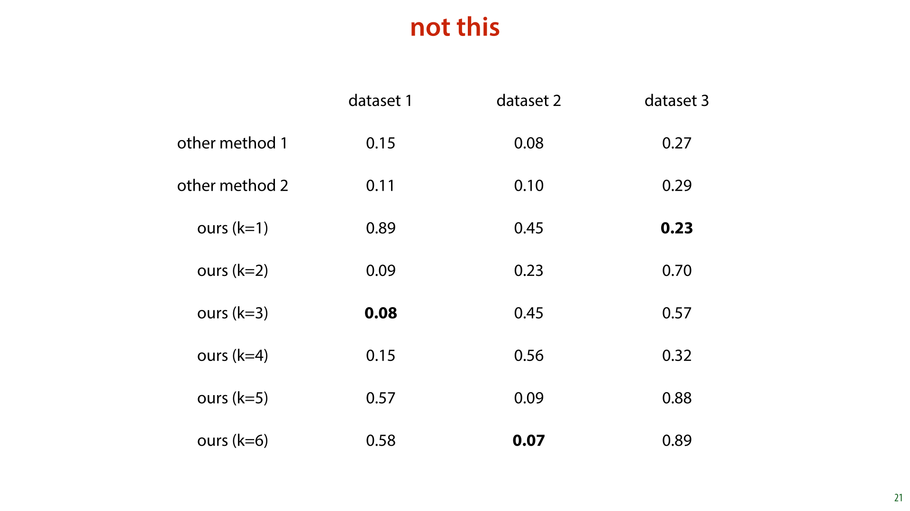

            <figcaption>
            
This may seem like a simple principle to follow, but it goes wrong <strong>a lot</strong>. Not just in student papers, also in published research. 

Here’s what you might come across in a bad machine learning paper. In this (fictional) example, the authors are introducing a new method (labeled <em>ours</em>) which has a hyperparameter k. They are claiming that their model beats every baseline, because their numbers are higher (for specific hyperparameters). 

These numbers create three impressions that are not actually validated by this experiment: 

That the authors have a better model than the two other methods shown.  

That if you want to run the model on dataset 1,  you should use k=3 

That if you have data like dataset 1, you can then expect an error of 0.08. 

None of these conclusions can be drawn from this experiment, because we have not ruled out multiple testing. 

            </figcaption>
       </section>

       <section id="slide-022">
            <a class="slide-link" href="https://mlvu.github.io/lecture03#slide-022" title="Link to this slide.">link here</a>
            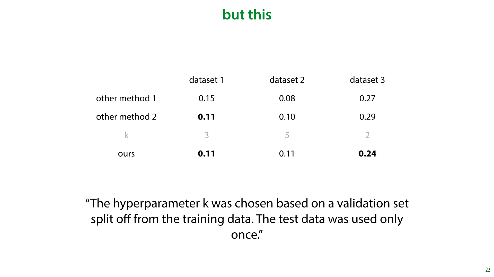

            <figcaption>
            
Here is what we should do instead. We should use the training data (with validation withheld) to select our hyperparameters, make a single choice for k for each different dataset, and then estimate the accuracy of only that model.  

Note that the numbers have changed, because in the previous example the authors gave themselves an advantage by multiple testing. With a proper validation split, that advantage disappears. These numbers are worse, but more accurate. (I made these numbers up, but this is the sort of thing you might see) 

Now, we can actually draw the conclusions that the table implies: 

On dataset 3, the new method is the best. 

If we want to use the method on dataset 3 (or similar data) we should use k=2 

If our data is similar to that of dataset 3, we could expect a performance around 0.24 

Even though most people now use this approach, you should still mention exactly what you did in your report (so people don’t assume you got it wrong).

            </figcaption>
       </section>

       <section id="slide-023">
            <a class="slide-link" href="https://mlvu.github.io/lecture03#slide-023" title="Link to this slide.">link here</a>
            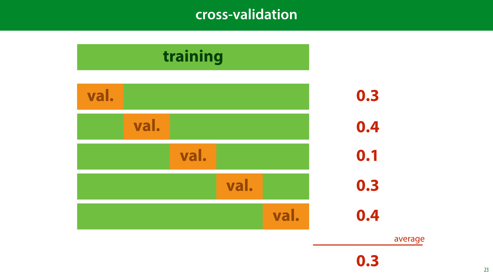

            <figcaption>
            
After you’ve split off a test and validation set, you may be left with very little training data. If this is the case, you can make better use of your training data by performing<strong> cross-validation</strong>. You split your data into 5 chunks (“folds”) and for each specific choice of hyperparameters that you want to test, you do five runs: each with one of the folds as validation data. You then average the scores of these runs. 

This can be costly (because you need to train five times as many classifiers), but you ensure that every instance has been used as a training example once. 

After selecting your hyperparameters with crossvalidation, you still test once on the test data. 

You may occasionally see papers that estimate error of their finally chosen model by cross validation as well (splitting off multiple test sets), but this is a complicated business, and has fallen out of fashion. We won’t go into in this course.

            </figcaption>
       </section>

       <section id="slide-024">
            <a class="slide-link" href="https://mlvu.github.io/lecture03#slide-024" title="Link to this slide.">link here</a>
            

            <figcaption>
            
If your data has special attributes, like a meaningful temporal ordering of the instances, you need to take this into account. In the case of temporal data, training on samples that are in the future compared to the test set is unrealistic, so you can’t sample your test set randomly. You need to maintain the ordering. 

Sometimes data has a timestamp, but there’s no meaningful information in the ordering (like in email classification, seeing emails from the future doesn’t usually give you much of an unfair advantage in the task). In such cases, you can just sample the test set randomly. 

            </figcaption>
       </section>

       <section id="slide-024" class="anim">
            <a class="slide-link" href="https://mlvu.github.io/lecture03#slide-025" title="Link to this slide.">link here</a>
            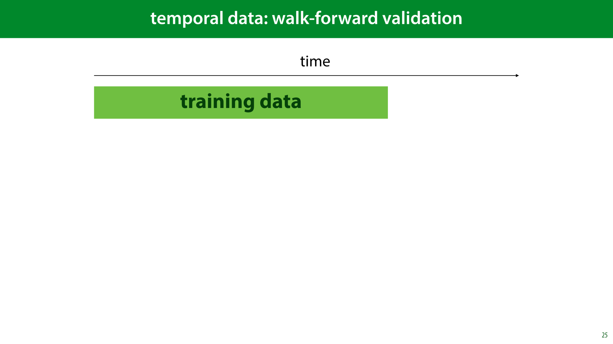

            <figcaption>
            
If you want to do cross-validation in such time sensitive data, you’ll have to slice the dataset like this. 

            </figcaption>
            click image for animation
       </section>

       <section id="slide-026">
            <a class="slide-link" href="https://mlvu.github.io/lecture03#slide-026" title="Link to this slide.">link here</a>
            

            <figcaption>
            
In general, don’t just apply split testing and cross validation blindly. <em>Think</em> about how you will ultimately train and use your model “in production”. Production may be an actual software production environment, or some other place where you intend to employ your model. Your evaluation on the test set is essentially a <em>simulation</em> of that setting.  

If you're doing something in evaluation that you won't be able to do in production (like training on instances from the future), then you are cheating your evaluation.  

Your validation is essentially a simulation of the evaluation. If you want validation results that accurately predict your evaluation results, then your validation should mimic the evaluation as closely as possible.  

Here, however, you are allowed to deviate a little. For instance, you can make your validation data a little smaller than your test data. This is a tradeoff: you are reducing the certainty of your validation results, but you are gaining a little extra training data, which will improve your results in the end. Such tradeoffs are fine, so long as you are honest in your final evaluation on the test data. 

In general, when in doubt make sure that the evaluation setting accurately simulates production, and that the validation setting accurately simulates the evaluation setting.

            </figcaption>
       </section>

       <section id="slide-027">
            <a class="slide-link" href="https://mlvu.github.io/lecture03#slide-027" title="Link to this slide.">link here</a>
            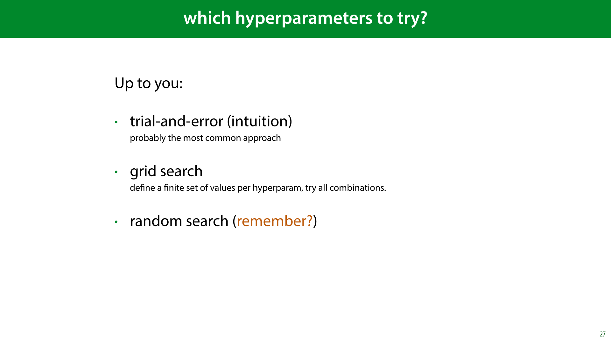

            <figcaption>
            
So, now that we know how to experiment, what experiments should we run? Which values should we try for the hyperparameters? So long as we make sure not to look at our test set, we can do what we like. We can try a few values, we can search a grid of values exhaustively, or we can even use methods like random search, or simulated annealing.  
<aside    >We should only. be cautious not to try to many different hyperparameter values if our test and validation sets are small. </aside>
It’s important to mention: <strong>trail and error is fine, and it’s the approach that is most often used</strong>. It’s usually the most effective, because you (hopefully) have an intuitive understanding of what your hyperparameters mean. You can use this understanding to guide your search in a way that automated methods can't.

            </figcaption>
       </section>

       <section id="slide-028">
            <a class="slide-link" href="https://mlvu.github.io/lecture03#slide-028" title="Link to this slide.">link here</a>
            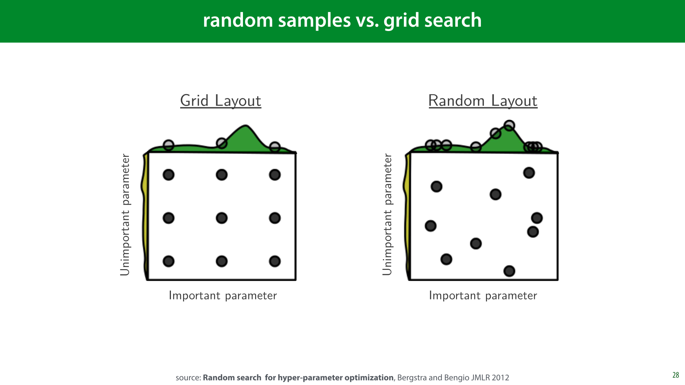

            <figcaption>
            
If you are going to use some kind of automated search, trying a bunch of different combinations of hyperparameter values, and then trying random samples in the hyper parameter space is often better than exhaustively checking a grid. This picture neatly illustrates why. If one parameter turns out not to be important, and another does, a grid search restricts us to only three samples over the important parameter, at the cost training nine different models. 

If we randomize the samples, we get nine different values of each parameter at the same cost. 

source: <a href="http://www.jmlr.org/papers/volume13/bergstra12a/bergstra12a.pdf"><strong class="blue">http://www.jmlr.org/papers/volume13/bergstra12a/bergstra12a.pdf</strong></a> (recommended reading) 

            </figcaption>
       </section>

       <section class="video" id="video-028">
           <a class="slide-link" href="https://mlvu.github.io/lecture03#video-28">link here</a>
           <iframe
                src="https://www.youtube.com/embed/BfoeXjX2v0Q?modestbranding=1&showinfo=0&rel=0"
                title="YouTube video player"
                frameborder="0" allow="accelerometer; autoplay; clipboard-write; encrypted-media; gyroscope; picture-in-picture"
                allowfullscreen>
           </iframe>

       </section>

       <section id="slide-029">
            <a class="slide-link" href="https://mlvu.github.io/lecture03#slide-029" title="Link to this slide.">link here</a>
            

            <figcaption>
            
<lnbr></lnbr>

            </figcaption>
       </section>

       <section id="slide-030">
            <a class="slide-link" href="https://mlvu.github.io/lecture03#slide-030" title="Link to this slide.">link here</a>
            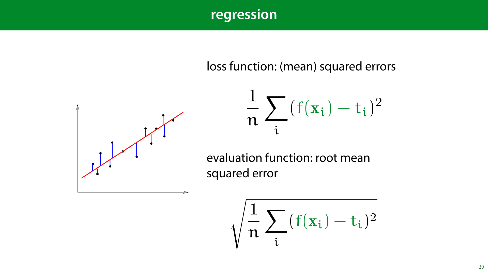

            <figcaption>
            
As noted in the first lecture, statistics an ML are very closely related. It’s surprising, then that when we perform ML experiments, we use relatively little of the statistics toolkit. We don’t often do <strong>significance tests</strong>, for instance.

            </figcaption>
       </section>

       <section id="slide-031">
            <a class="slide-link" href="https://mlvu.github.io/lecture03#slide-031" title="Link to this slide.">link here</a>
            

            <figcaption>
            
Note everybody agrees. Hypothesis testing comes with a lot of downsides. Given that we usually have very big sample sizes (10000 instances in the test set), our efforts may be better spent elsewhere. 

Another consideration is that the ultimate validation of research is replication, not statistical significance. Somebody else should repeat your research and get the same results. Because all of our experimentation is computer code, a basic replication could be as simple as downloading and running a docker image. After that it’s easy to try the same on new data, or check the model for bugs. 

Since the community is so divided on the question, we won’t emphasise statistical testing too much in this course. However, there are a few important statistical concepts to be aware of, even if we don't use the whole statistical toolbox to interrogate them rigorously.

            </figcaption>
       </section>

       <section id="slide-031" class="anim">
            <a class="slide-link" href="https://mlvu.github.io/lecture03#slide-032" title="Link to this slide.">link here</a>
            

            <figcaption>
            
The first is the difference between the true metric of a problem or task, and the value you measure. Let's take classification accuracy as an example. 

We usually imagine that the data is <strong>sampled</strong> from some distribution p(x). In this view we're not really interested in training a classifier that does well on the dataset we have, even on the test data. What we really want is a classifier that does well on any data sampled from p(x).  

Imagine sampling one instance from the data distribution and classifying it with some classifier C. If you do this, there is a certain probability that C will be correct. This is called the<strong> true accuracy</strong>. It is not something we can ever know or compute (except in very specific cases). The only thing we can do is take a large number of samples from p(x), classifiy them with C, and approximate the true accuracy with the relative frequency of correct classifications in our sample. This is what we are doing when we compute the accuracy of a classifier on the test set of the validation set: <strong>we are estimating the true accuracy</strong>. To explicitly distinguish this estimate from the true accuracy, we sometimes call this the<strong> sample accuracy</strong>. 

The accuracy is just the simplest example. We can apply the same idea to any metric, like the MSE loss of a regression model, or the many metrics for classifiers we will see in the following videos. They all have a <strong>true value</strong> defined on the data distribution, which we can't observe, and an estimate which we can compute from the test set. 
<aside    >This is a probabilistic view of machine learning. It's not strictly necessary to view your problem this way, but it's almost always the most fruitful.</aside><aside    ></aside>
            </figcaption>
            click image for animation
       </section>

       <section id="slide-033">
            <a class="slide-link" href="https://mlvu.github.io/lecture03#slide-033" title="Link to this slide.">link here</a>
            

            <figcaption>
            
This is the brings us to the main question that statistical analysis is meant to answer. If we do things properly, and we have a large dataset, our estimate will be close to the true value. Often, we can even prove how close it is likely to be. But there will be some difference, which will be entirely random. 

So, when we estimate the test accuracy of models A and B and we see that classifier A is better than classifier B because their estimated accuracies on the test set are .997 and .998 respectively, can we really trust that statement? Maybe this random noise we get when we compute the estimate of the accuracy caused this difference. In other words, <strong>how sure can we be, from these values, that the true accuracy of A is also higher than the true accuracy of B? </strong>

 

quote source: <a href="http://www.icmla-conference.org/icmla11/PE_Tutorial.pdf"><strong class="blue">http://www.icmla-conference.org/icmla11/PE_Tutorial.pdf</strong></a>

<a href="http://www.icmla-conference.org/icmla11/PE_Tutorial.pdf"><strong class="blue"></strong></a>

            </figcaption>
       </section>

       <section id="slide-033" class="anim">
            <a class="slide-link" href="https://mlvu.github.io/lecture03#slide-034" title="Link to this slide.">link here</a>
            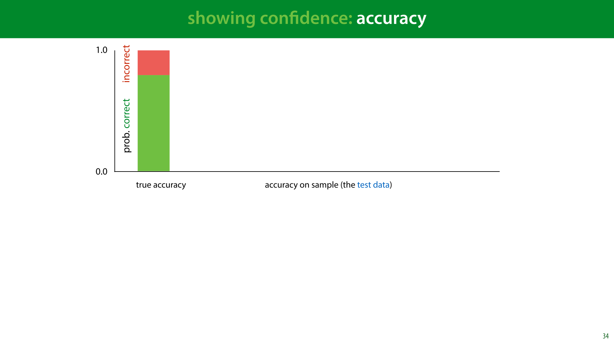

            <figcaption>
            
One way of doing this is to compute a <strong>confidence interval</strong>. Here we see the process of computing a sample accuracy in a simple animation: we start with the true accuracy (for some given classifier, on the data distribution) which is somewhere between 0 and 1. We sample a bunch of points from the data distribution (our test set), and take the relative frequency of correctly classified instances as the <strong>sample accuracy</strong>. 

Here, in the top half of the slide we model the process of taking one instance of our test set and seeing whether the classifier classifies it correctly as a single random draw resulting in the outcome correct or incorrect. <em>We'll see in the next lecture that this type of distribution is called a Bernoulli distribution.</em> 

The whole process of sampling the entire test set and computing the sample accuracy is also a random process. If we were to repeat it, sampling a new test set, we'd get a different value for the sample accuracy. To simplify this, we can look at the total number of instances in our sample that the classifier classified correctly (so we don't divide by N). In that case, it turns out we can work out the distribution of this process as well: the number of "correct"s we get in N samples of from a Bernoulli distribution forms what is known as a Binomial distribution. 

The technical details aren't important. The main message is that we can define precisely what distribution we can expect on the value of the sample accuracy of we keep the classifier and the true accuracy fixed, but resample the test data. In this case, we see that for a true accuracy of 0.8, and a test set of N=10 instances, we are most likely to see that the classifier correct classifies 7 instances in our sample (as we did in the top half of the slide). However, it's also perfectly possible to see 5, 6, or 8 instances classified correctly. 
<aside    >This is a complicated picture with multiple random processes going on. Take a little time to wrap your head around this before moving on. </aside>
Imagine that if we have two classifiers, and we compute sample accuracies for both on a test set of 10 instances. We get 5/10 correct for one classifier and 8/10 correct for the other. can we conclude that the first is definitely worse than the second? What we see here is that if they both have a true accuracy of 0.8, it would we perfectly likely to see these numbers. In short, with such little test data, we have much uncertainty around our estimate of the true accuracy. 

One way to quantify this uncertainty is to draw a <strong>confidence interval</strong>. This is simply any interval on the values of our sample accuracy that captures a given proportion of the probability mass, usually 95%. You can draw the confidence interval anywhere you like so long as you decide how to draw it before seeing the data. The most common approach is symmetrically around the mean, but you can also start at the mean and extend it to the right as far as possible or to the left as far as possible. 

The condfidence interval captures our uncertainty. We don't know the true value of the accuracy, and we can't estimate it very accurately, but we know it's most likely one of these values. 

            </figcaption>
            click image for animation
       </section>

       <section id="slide-035">
            <a class="slide-link" href="https://mlvu.github.io/lecture03#slide-035" title="Link to this slide.">link here</a>
            

            <figcaption>
            
The size of this confidence interval depends on two factors: the true accuracy and the size of the test set. Here are some examples for different accuracies and test set sizes. 

This tells us that if the true success probability (accuracy) of a classifier is 0.5, and the test set contains 100 examples, our confidence interval has size 0.2. This means that even if we report 0.5 as the accuracy, we may well be wrong by as much as 0.1 either side. 

Even if these confidence intervals are usually not reported, you can easily work them out (or look them up) yourself. So, if you see someone say that classifier A is better than classifier B because A scored 60% accuracy and and B score 59%, on a test set of 100 instances, you have reason to be sceptical. 

In short, this is why large test sets are important. Without at least 1000 instances in your test data, you cannot reliably tell the difference between two classifiers.

            </figcaption>
       </section>

       <section id="slide-036">
            <a class="slide-link" href="https://mlvu.github.io/lecture03#slide-036" title="Link to this slide.">link here</a>
            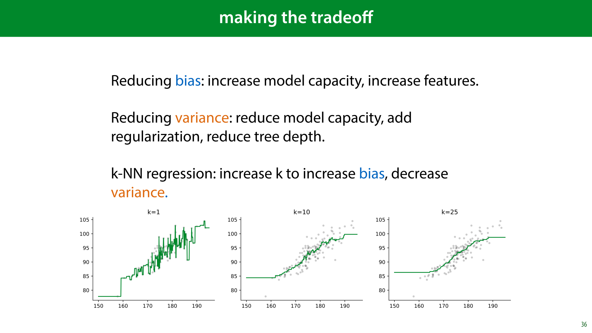

            <figcaption>
            
Here are the full curves, in case you every need to look it up.

            </figcaption>
       </section>

       <section id="slide-037">
            <a class="slide-link" href="https://mlvu.github.io/lecture03#slide-037" title="Link to this slide.">link here</a>
            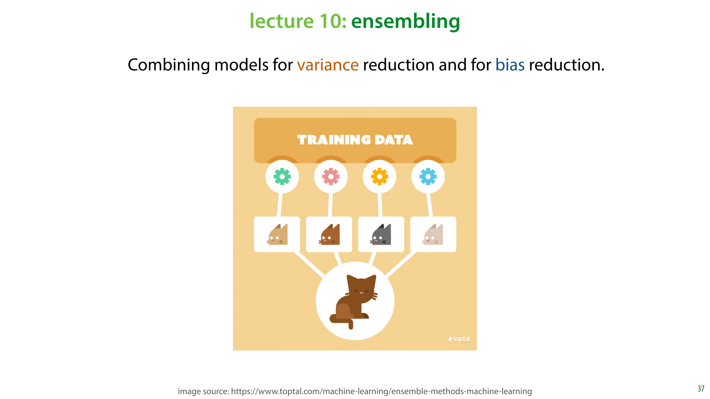

            <figcaption>
            
If you don’t have the luxury of a large test set, you may need to do some statistical testing to see whether the effect you’ve observed (classifier A is better than classifier B) is genuine or down to random chance. It’s generally accepted that Alpaydin’s 5x2 cross validation is the best test for this purpose. It’s out of scope for this course, but follow<a href="https://www.cmpe.boun.edu.tr/~ethem/files/papers/NC110804.PDF"><strong class="blue"> the link</strong></a> if you run into this problem.

            </figcaption>
       </section>

       <section id="slide-037" class="anim">
            <a class="slide-link" href="https://mlvu.github.io/lecture03#slide-038" title="Link to this slide.">link here</a>
            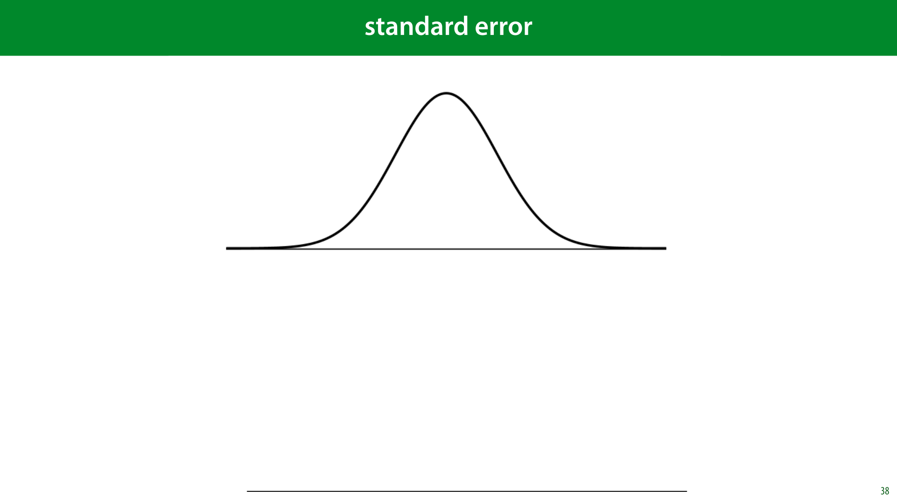

            <figcaption>
            
If we are computing a continuous value, like the mean squared error loss of a regression model, the same principle applies. For now, let's forget about the details and assume that we are computing some number representing the difference between the true regression value of an instances and the predicted regression value. We'll call this number <strong>m</strong>.  

<em>In this case m is the error of a model, but it could be any measurement of any phenomenon.</em>  

We can often assume that m, computed for a single randomly sampled instance, is normally distributed. The likely values are clustered around a mean value, or expectation of m. This is the distribution drawn in the top half of the slide. 

If we sample a test set and compute the mean of m for all instances in the test data, we get an estimate for the true expectation of m. This is an estimate of the mean of the distribution at the top. Note that the estimated mean is slightly different from the true mean. 

This, again, is a random process. If we sample another test set, keeping the model and the true mean fixed, we get a slightly different estimate for the mean. The distribution on the values we get for the <strong>sample mean </strong>is drawn at the bottom. Note that its mean is the same as the true mean, but its peak is more narrow.  
<aside    >This is not a normal distribution, but a so called Student's t distribution. For test sets larger than ~30 instances, the difference becomes negligable.  </aside>
The standard deviation of the distribution at the bottom is the variance of the one at the top, divided by the square of the number of instances in our test set. The more instances, the narrower the peak becomes, and the less uncertainty we have around our estimate. This standard deviation is called the <strong>standard error of the mean (sem)</strong>. 

            </figcaption>
            click image for animation
       </section>

       <section id="slide-039">
            <a class="slide-link" href="https://mlvu.github.io/lecture03#slide-039" title="Link to this slide.">link here</a>
            

            <figcaption>
            
As you may know, the region of four standard deviations around the mean of a normal distribution contains roughly 95% of the probability mass. This means that the interval from two standard error to the left of your mean to two standard errors to the right of your mean is a 95% confidence interval.

            </figcaption>
       </section>

       <section id="slide-040">
            <a class="slide-link" href="https://mlvu.github.io/lecture03#slide-040" title="Link to this slide.">link here</a>
            

            <figcaption>
            
These are good concepts to help us think about what we are measuring when we compute metrics on our test data. But it's important to realize that these are unobservable values. We can only work out the true confidence interval for the sample accuracy if we know the true accuracy. This puts the confidence intervals we've talked about so far in the unobservable column. 

So what about all those confidence intervals you see reported in the literature? These are estimated confidence intervals. They are usually computed in the same way as the true confidence interval, but wherever we need the true value of some metric, we replace it by its estimate. This gives us a confidence interval that isn't as correct as the true confidence interval, and one that would change slightly if we were to resample the test set, but we can at least compute it, and it generally behaves in roughly the same way as the true confidence interval.

            </figcaption>
       </section>

       <section id="slide-041">
            <a class="slide-link" href="https://mlvu.github.io/lecture03#slide-041" title="Link to this slide.">link here</a>
            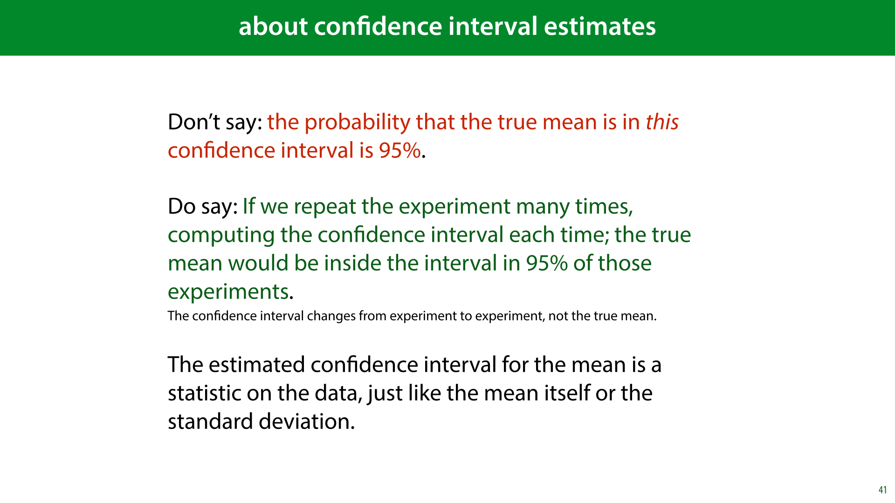

            <figcaption>
            
When we use the phrase confidence interval to refer to this kind of estimate, it's important to speak about it correctly.  

There is no probability associated with the true mean at all. It is simply an objective, determined value (which we don’t know). The probability comes from sampling, and from computing the interval from a sample. 

So instead of having a fixed interval, with the true mean jumping around probabilistically, we have a fixed true mean around which we get an interval that jumps around if we resample the data The probability of it jumping so much that it no longer contains the true mean is 5%.

            </figcaption>
       </section>

       <section id="slide-042">
            <a class="slide-link" href="https://mlvu.github.io/lecture03#slide-042" title="Link to this slide.">link here</a>
            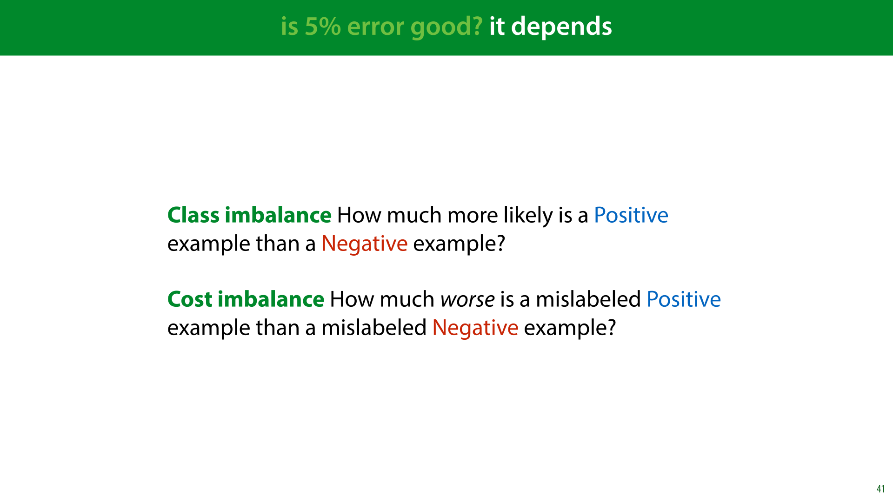

            <figcaption>
            
If you see a picture like this, showing the mean runtime of an experiment, measured for three models, and averaged over a number of runs, what would you imagine the error bars denote? We've seen standard deviations, standard errors and confidence intervals. What do error bars represent?

            </figcaption>
       </section>

       <section id="slide-042" class="anim">
            <a class="slide-link" href="https://mlvu.github.io/lecture03#slide-043" title="Link to this slide.">link here</a>
            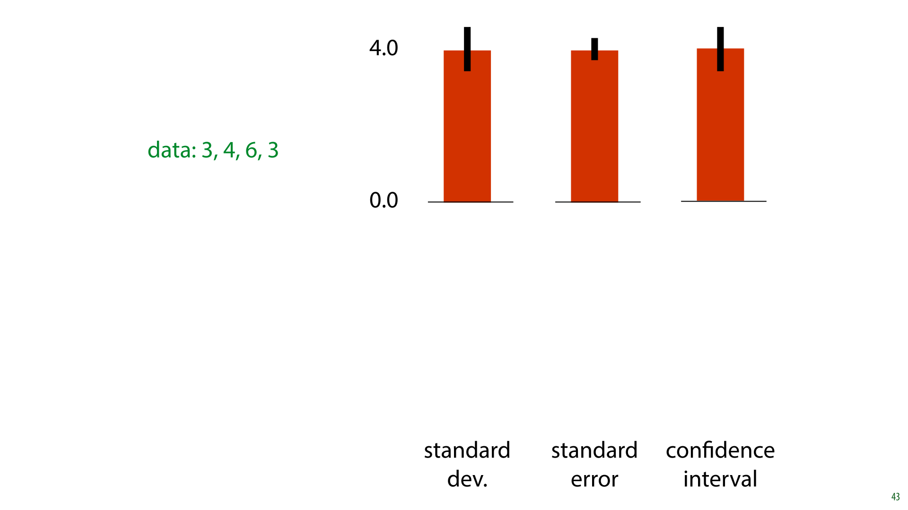

            <figcaption>
            
The truth is, that there is no standard definition for what error bars denote, and if the authors didn’t specify what their error bars indicate, the authors messed up. 

These are the three most common options. If you didn't quite get all the details of the previous slides, this slide illustrates the most important distinction: If we sample more data, the estimate of our<strong> standard deviation </strong>becomes <em>more accurate</em>. It’s an estimate of a property of our data distribution. The error bars don't get smaller, the just get closer to their correct size (which may be very wide around the head of the bar). 

The standard error and the confidence interval are indicators of how confident we are about our estimate of the value the bar represents. for these, the more data we have,<em> the smaller they get</em>. As we saw earlier, <em>under the right assumptions</em>, the confidence interval is just twice the standard error.

            </figcaption>
            click image for animation
       </section>

       <section id="slide-044">
            <a class="slide-link" href="https://mlvu.github.io/lecture03#slide-044" title="Link to this slide.">link here</a>
            

            <figcaption>
            

            </figcaption>
       </section>

       <section id="slide-045">
            <a class="slide-link" href="https://mlvu.github.io/lecture03#slide-045" title="Link to this slide.">link here</a>
            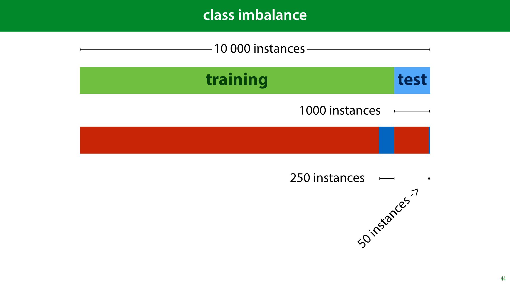

            <figcaption>
            
Under certain assumptions, the standard error of two estimates can tell you whether a Student's t test allow you to reject the null hypothesis that the two distributions are the same. This would allow you to say, for instance, that there is a statistically significant difference between the accuracy estimates on two classifiers. As we said before, such testing is not very popular in machine learning, so we won't go into it in detail, but this can offer an additional perspective on error bars. 

Say you plot the mean squared error for regression models <strong class="orange red">A</strong> and <strong class="blue">B</strong>, together with some error bars. Does the the fact that the error bars overlap or not tell you whether the measured difference between the two models is statistically significant? That is, does it indicate whether we can conclude that <strong class="orange red">A</strong> is a better model than <strong class="blue">B</strong>? 

Yes, for standard error bars, the existence of overlap implies that there is no significant difference between the two effects (i.e. the possibility that the difference is due to random chance is high, and a repeat of the experiment on new data may show a different result). If you plot confidence interval error bars, and there is no overlap, you may conclude that the difference between the models is significant. If you repeat the experiment on fresh data, it is very likely that model <strong class="orange red">A</strong> would beat model <strong class="blue">B</strong> again. 

In both cases, the converse does not hold. If the SEM  error bars do not overlap, there may or may not be a significant difference. If the confidence interval error bars do overlap, there may still be a significant difference, depending on how much they overlap. 
<aside    >All of this requires the assumption that the original values for which the bar indicates the mean are normally distributed and that there are more than 30, so that the Student's t distribution looks enough like a normal distribution.</aside><aside    ></aside>
            </figcaption>
       </section>

       <section id="slide-046">
            <a class="slide-link" href="https://mlvu.github.io/lecture03#slide-046" title="Link to this slide.">link here</a>
            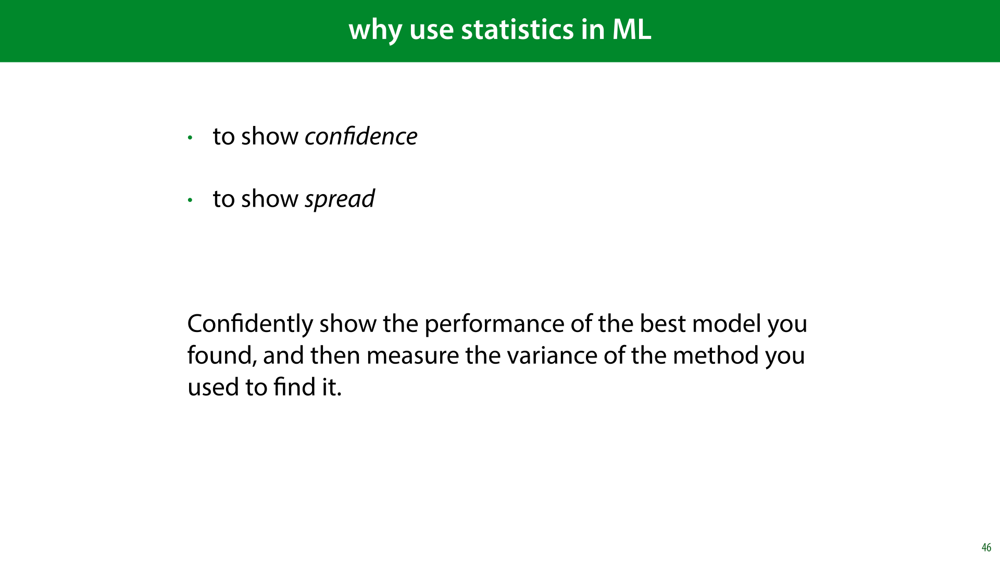

            <figcaption>
            
All of this was about <strong>showing confidence</strong>: showing how reliable our numbers are. 

<strong>Showing spread</strong> is more about providing insight to the reader. Say I train a classifier by gradient descent. If I have a big test set, I can very <em>confidently</em> measure and report the accuracy of this particular classifier. However, gradient descent uses <em>random </em>initialization. If I repeat the training process, I may end up in a different local minimum, and get a different classification performance. It’s likely that I also want to communicate how much the measured performance is dependent on<em> this</em> randomness. In short, how lucky did we get in our choice of classifier?

            </figcaption>
       </section>

       <section id="slide-047">
            <a class="slide-link" href="https://mlvu.github.io/lecture03#slide-047" title="Link to this slide.">link here</a>
            

            <figcaption>
            
If we have a large enough test set, we know that the confidence interval is small enough. But we do want to know how much the randomness in our process affects the result. What is the probability that repeating the process (on the same data, or on new data) produces wildly different results? 

For factors like the initialisation of gradient descent, this is easy to test: you just rerun a few times on the same data. But how do you test how robust the result are against sampling a new dataset?

            </figcaption>
       </section>

       <section id="slide-048">
            <a class="slide-link" href="https://mlvu.github.io/lecture03#slide-048" title="Link to this slide.">link here</a>
            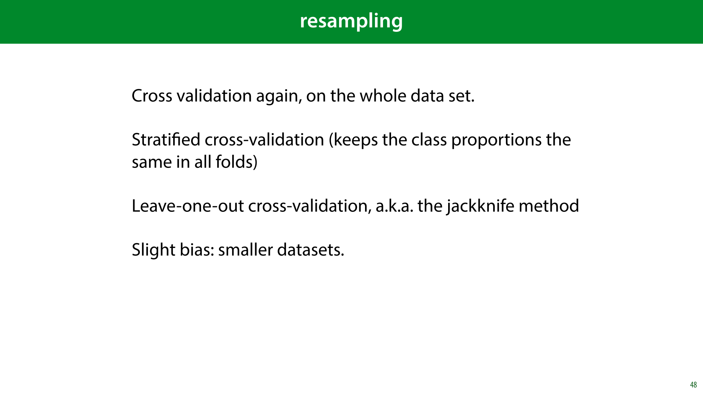

            <figcaption>
            
The cross validation that we have already seen provides some indication of spread. If we do five-fold cross validation, we are repeating our training five times on slightly different datasets. This provides some indication of how differently the algorithm may perform if we repeat on new data. 

Note, however that it's not quite a perfect simulation of resampling our data: the datasets are slightly smaller, and there is a lot of overlap between the five different datasets. If we want more repeats, we get more overlap and a smaller test set, making this bias hard to control.

            </figcaption>
       </section>

       <section id="slide-049">
            <a class="slide-link" href="https://mlvu.github.io/lecture03#slide-049" title="Link to this slide.">link here</a>
            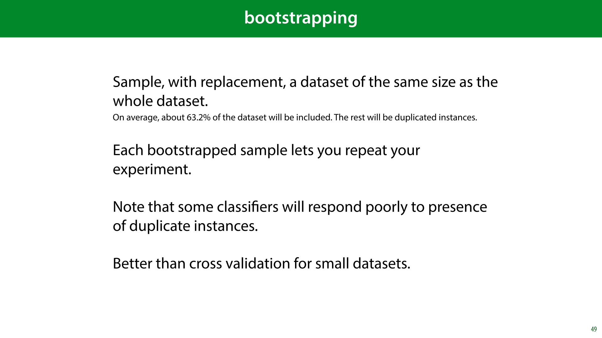

            <figcaption>
            
A different approach is bootstrapping. Here, we resample the data<strong> with replacement</strong>. This allows us to sample a dataset that is exactly the same size as the original data. We can also resample as often as we'd like, without affecting the size of the test data or the amount of overlap between the datasets. 

We will see in a later lecture that bootstrapping approximates the data distribution in a very precisely defined way.

            </figcaption>
       </section>

       <section id="slide-050">
            <a class="slide-link" href="https://mlvu.github.io/lecture03#slide-050" title="Link to this slide.">link here</a>
            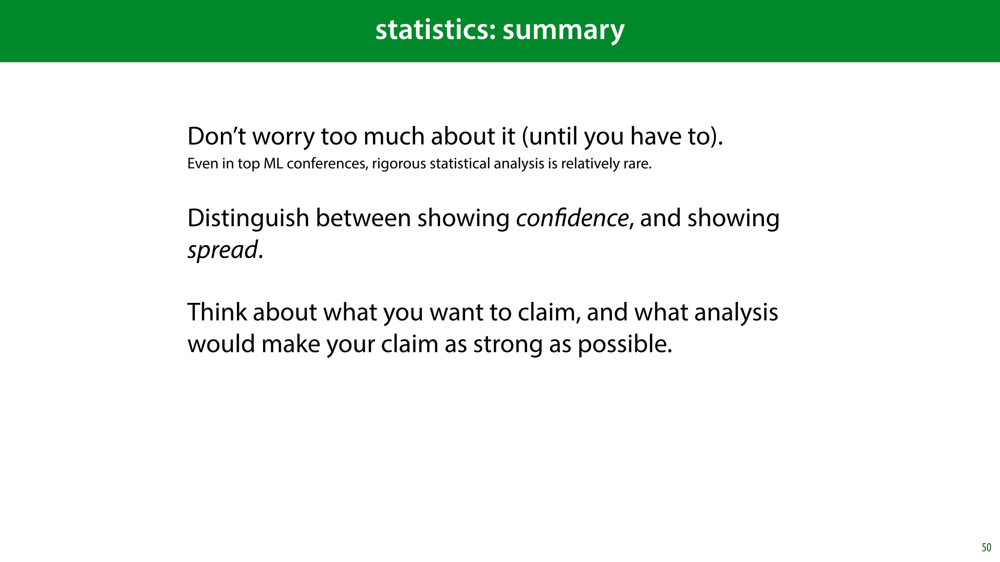

            <figcaption>
            

            </figcaption>
       </section>

       <section id="slide-051">
            <a class="slide-link" href="https://mlvu.github.io/lecture03#slide-051" title="Link to this slide.">link here</a>
            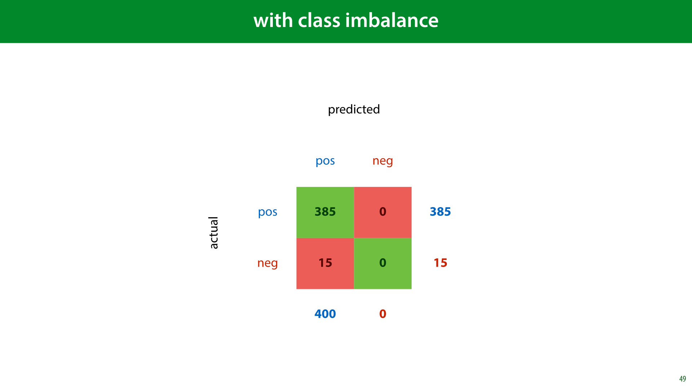

            <figcaption>
            
If you’re interested in the difference between machine learning and statistics, I can recommend<a href="https://projecteuclid.org/journals/statistical-science/volume-16/issue-3/Statistical-Modeling--The-Two-Cultures-with-comments-and-a/10.1214/ss/1009213726.full"><strong class="blue"> this paper by Leo Breiman</strong></a>. It shows the difference between the two cultures. It makes clear that the machine learning approach of measuring models purely for predictive accuracy on a large test set, has a lot of benefits and makes the business of statistics a lot simpler and more effective. 

            </figcaption>
       </section>

       <section class="video" id="video-051">
           <a class="slide-link" href="https://mlvu.github.io/lecture03#video-51">link here</a>
           <iframe
                src="https://www.youtube.com/embed/oZdWt_Mrg_8?modestbranding=1&showinfo=0&rel=0"
                title="YouTube video player"
                frameborder="0" allow="accelerometer; autoplay; clipboard-write; encrypted-media; gyroscope; picture-in-picture"
                allowfullscreen>
           </iframe>

       </section>

       <section id="slide-052">
            <a class="slide-link" href="https://mlvu.github.io/lecture03#slide-052" title="Link to this slide.">link here</a>
            

            <figcaption>
            
In this video we'll look at how to evaluate regression and classification experiments. There will be a few pointers on regression, but the main topic will be classification experiments. 

<lnbr></lnbr>

            </figcaption>
       </section>

       <section id="slide-053">
            <a class="slide-link" href="https://mlvu.github.io/lecture03#slide-053" title="Link to this slide.">link here</a>
            

            <figcaption>
            
One thing to pay attention to is that if you use MSE loss, you may want to <em>report </em>the square root (the RMSE). The RMSE is minimised at the same places as the MSE, but it’s easier to interpret, because it has the same units as the original output value. 

For instance, if your outputs are in meters, then your MSE is measured in square meters, but your RMSE is also measured in meters.

            </figcaption>
       </section>

       <section id="slide-053" class="anim">
            <a class="slide-link" href="https://mlvu.github.io/lecture03#slide-054" title="Link to this slide.">link here</a>
            

            <figcaption>
            
Bias and variance are good concepts to keep in mind when thinking about regression performance. The bias is the difference between your optimal MSE and the true MSE. This is the part of your error that is down to fundamental problems with your model: for instance, you are fitting a line trough data with a parabolic pattern. This part stays the same if you resample your data. 

The variance is the difference between the true MSE and the measured MSE. This is the part of your error that is down to aspects of the random sampling of the data. This part changes when you resample your data. 

Normally, we train a regression model once, and get one MSE value. This gives us one dot on the axis above. Without repeating the process on freshly sampled data, we can't tell how our error falls apart in bias and variance. However, we can usually get some contextual clues, or investigate using resampling.

            </figcaption>
            click image for animation
       </section>

       <section id="slide-054" class="anim">
            <a class="slide-link" href="https://mlvu.github.io/lecture03#slide-055" title="Link to this slide.">link here</a>
            

            <figcaption>
            

            </figcaption>
            click image for animation
       </section>

       <section id="slide-056">
            <a class="slide-link" href="https://mlvu.github.io/lecture03#slide-056" title="Link to this slide.">link here</a>
            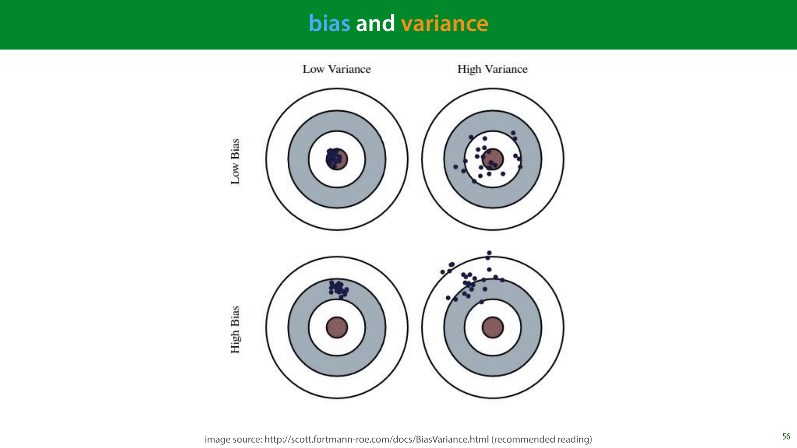

            <figcaption>
            
Here is a metaphor that is often used to describe bias and variance: a dartboard. 

Remember, this is a metaphor for our RMSE error estimate. That means that normally, we have only one dart and we can’t tell whether our error is due to high bias or high variance.  

image source: <a href="http://scott.fortmann-roe.com/docs/BiasVariance.html"><strong class="blue">http://scott.fortmann-roe.com/docs/BiasVariance.html</strong></a> (recommended reading) 

            </figcaption>
       </section>

       <section id="slide-057">
            <a class="slide-link" href="https://mlvu.github.io/lecture03#slide-057" title="Link to this slide.">link here</a>
            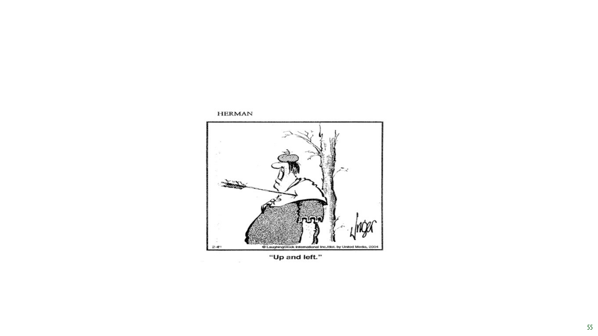

            <figcaption>
            
High bias tends to happen when the model is too simple to follow the true "shape" of the data. Linear models in low-dimensional spaces often have this problem. Here, we see that the data has a slight curve, which is clearly part of its natural pattern, and something the model should learn. Since it's restricted to a line, however, it cannot make this shape.

            </figcaption>
       </section>

       <section id="slide-058">
            <a class="slide-link" href="https://mlvu.github.io/lecture03#slide-058" title="Link to this slide.">link here</a>
            

            <figcaption>
            
High variance happens when the model has the capacity to follow the shape of the data perfectly, but it does so so perfectly that it tends to get thrown off by small fluctuations.  

Here, the model doesn't just follow the natural curve of the data, it goes in and out of every random fluctuation to model every single point perfectly. 

Even though this model (a regression tree) fits the data perfectly, if we resample the data, we are stuck with all sorts of weird peaks that won’t fit the new data. This is where the <em>variance</em> comes from. The true error varies wildly, because the model captures every single random fluctuation in the training data. These fluctuation will cause a large error in the test data, which we put down to variance rather than bias.

            </figcaption>
       </section>

       <section id="slide-059">
            <a class="slide-link" href="https://mlvu.github.io/lecture03#slide-059" title="Link to this slide.">link here</a>
            

            <figcaption>
            
We will see techniques for all of these in the coming weeks. Note that often, it really is a tradeoff: reducing the bias, increases the variance and vice versa. 

For some algorithms, there is a single parameter that allows us to make the bias/variance tradeoff. kNN is one example: low k values give us high variance, high k values give us high bias.  
<aside    >In the strictest definition of bias and variance, these concepts only apply to the mean squared error, where they explictly appear as terms if you rewrite the error in a certain way. However, in general machine learning parlance, the terms are applied to any regression error, and they are roughly synonymous with under- and overfitting.</aside><aside    ></aside>
            </figcaption>
       </section>

       <section id="slide-060">
            <a class="slide-link" href="https://mlvu.github.io/lecture03#slide-060" title="Link to this slide.">link here</a>
            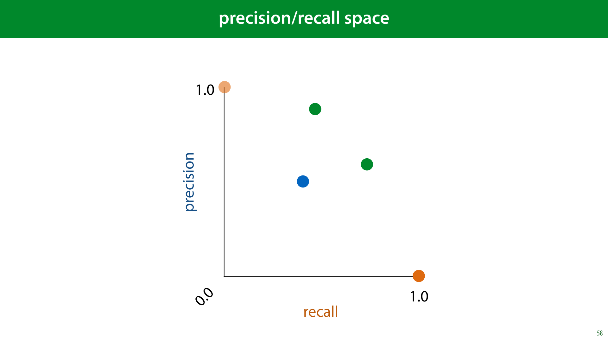

            <figcaption>
            
In a later lecture, we'll look at <strong>ensembling</strong>. This is a method that allows us to combine different models, so as to control the problems of high bias and high variance. 

image source: <a href="https://www.toptal.com/machine-learning/ensemble-methods-machine-learning"><strong class="blue">https://www.toptal.com/machine-learning/ensemble-methods-machine-learning</strong></a> 

            </figcaption>
       </section>

       <section id="slide-061">
            <a class="slide-link" href="https://mlvu.github.io/lecture03#slide-061" title="Link to this slide.">link here</a>
            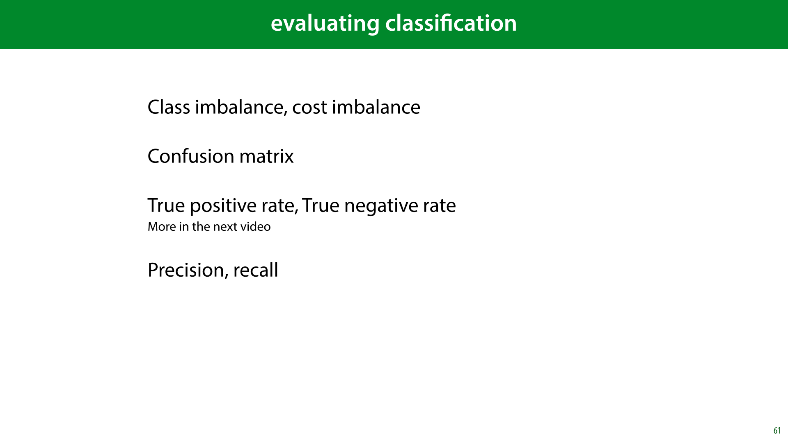

            <figcaption>
            
Let's now move to classification. We'll start by explaining these four topics.

            </figcaption>
       </section>

       <section id="slide-062">
            <a class="slide-link" href="https://mlvu.github.io/lecture03#slide-062" title="Link to this slide.">link here</a>
            

            <figcaption>
            
Here's one example domain: breast cancer screening 

A recurring discussion in the Dutch media is the question whether all women over 50 be screened for breast cancer. This is an analogy for classification: the instances are people and the target label is “has cancer” or “has no cancer.” You may think that this is a no-brainer: the more tests we do, the more lives saved. But we need to take into account how good the classifier is, and how bad the consequences are of it making a mistake. 

The first problem this example illustrates is <strong>class imbalance</strong>. Unlike the classifiers we've seen so far, this example has, thankfully, far more negatives than positives. In a given year the people in this age group for whom breast cancer will manifest is about half a percent. This includes men, for whom breast cancer is rare (but not impossible), so when we talk about screening for women over 50, we should probably assume about 1% positives. 

This means that we need to be very careful when interpreting the reported performance of any breast cancer detection method. We may think that an accuracy of 99% sounds impressive, but this is the accuracy we would get if we just called everything negative: that is, if we just diagnosed all women with no cancer. 

source: <a href="https://www.volkskrant.nl/wetenschap/redt-preventieve-screening-op-borstkanker-levens~a3761451/"><strong class="blue">https://www.volkskrant.nl/wetenschap/redt-preventieve-screening-op-borstkanker-levens~a3761451/</strong></a> 

            </figcaption>
       </section>

       <section id="slide-063">
            <a class="slide-link" href="https://mlvu.github.io/lecture03#slide-063" title="Link to this slide.">link here</a>
            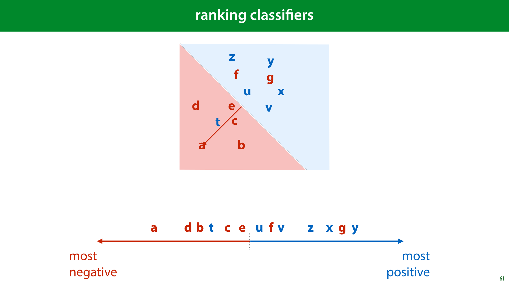

            <figcaption>
            
Imagine that somebody tells you about a machine learning project they’re doing, and they proudly state that they get a classification error (on their validation set) of 0.01 (1% of the validation set is misclassified). Should you be impressed?  

The answer is it depends. The first thing it depends on is the<strong> class imbalance</strong> in the data.

            </figcaption>
       </section>

       <section id="slide-064">
            <a class="slide-link" href="https://mlvu.github.io/lecture03#slide-064" title="Link to this slide.">link here</a>
            

            <figcaption>
            
So the next time you see a headline like this, your first question should be: what was the class distribution in the training data? If 90% of the cases in the training data are acquittals, this is not a very impressive result. 
<aside    >As it happens, in this case the classes were balanced 50/50, so 80 percent is at least notable. However, now we have a classifier trained on artificially balanced data. In a production environment (whatever that means here), the classes are likely not balanced 50/50, so this specific classifier will be of no further use. </aside>
Here is the original paper: <a href="https://peerj.com/articles/cs-93/#fn-6"><strong class="blue">https://peerj.com/articles/cs-93/#fn-6</strong></a> There are some issues with this  research beyond the class balance. 

            </figcaption>
       </section>

       <section id="slide-065">
            <a class="slide-link" href="https://mlvu.github.io/lecture03#slide-065" title="Link to this slide.">link here</a>
            

            <figcaption>
            
Another reason to mistrust accuracy is<strong> cost imbalance</strong>. In breast cancer screening are two types of misclassification: diagnosing a healthy person with cancer and diagnosing a person with cancer as healthy. Both come with a cost but not the same cost.  

We can either miss a cancer diagnosis (a <em>false negative</em>), which means the cancer will be caught much later and be much harder to treat. However, diagnosing a healthy person with cancer (a <em>false positive</em>) means they will be sent for unnecessary invasive testing and suffer great psychological stress. The cost of this is much less that the cost of missing a positive, but it isn't zero. 

This is what the discussion in the media centers on. If the screening causes many more false negatives than false positives, it may mean that the cost to human lives balances out, and the net effect of the screening isn't to save more lives. 

There is of course, also the financial cost of screening a large part of the population. Most people would of course put any financial cost far below the cost of a human life, but if it turns out that the classifier is weak enough that the gains in human lives saved are negligible, we'd look at the financial cost and say the program would need to end.

            </figcaption>
       </section>

       <section id="slide-066">
            <a class="slide-link" href="https://mlvu.github.io/lecture03#slide-066" title="Link to this slide.">link here</a>
            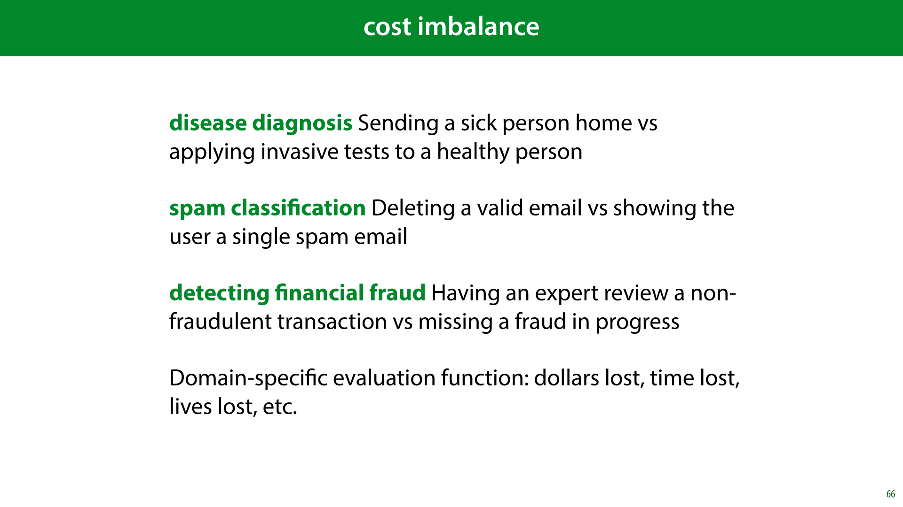

            <figcaption>
            
Here are some examples of problems with cost imbalance 

In all these cases, one misclassification one way costs much more than a misclassification the other way. But both cost <em>something</em>. The time of an expert reviewer is not free, even though five minutes of his time may be much cheaper than the cost of letting a single fraud go unchecked. In such a case, you may decide that missing one fraud is as costly as having an expert review 500 harmless transactions. This is then the general balance you are hoping for: one false negative for every 500 false positives. 

If you’re lucky, both types of misclassification have the same unit, and you can turn your error (an estimate of the number of misclassifications) into a domain specific evaluation function (like estimated dollars lost, or time saved). <strong>You simply assign a cost to each type if misclassification, and multiply it by how often that misclassification occurs in the test set. </strong>The total is the evaluation function you want to minimize.<strong> </strong>

If the units are not the same (money saved vs. lives saved) making such a choice can seem very unethical if you're literally equating a human life with an amount of money. On the other hand, any classifier you decide to deploy will <em>implicity </em>make such a choice even if you don't do the sums yourselves. Even if you decide not to use machine learning, the alternative (a doctor using their own judgement) is also a “classifier”, with its own cost balance.

            </figcaption>
       </section>

       <section id="slide-067">
            <a class="slide-link" href="https://mlvu.github.io/lecture03#slide-067" title="Link to this slide.">link here</a>
            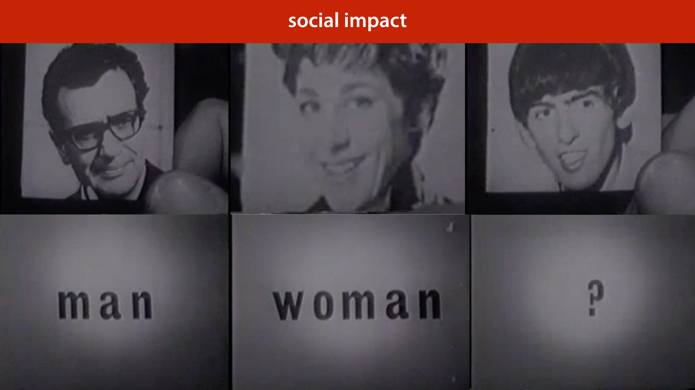

            <figcaption>
            
Cost imbalance is particularly important when we consider matters of social impact. If we predict a person’s sex from their physical appearance perfectly, and we use that as a prediction for their gender, we may easily achieve 99% accuracy.  

However the 1% we then misclassify is precisely that part of the part of the population for which gender is likely to be a sensitive attribute. Just because our classifier has high accuracy, doesn’t mean it can do no harm. In a large part because the mistakes it makes are not uniformly distributed. They are focused squarely on the vulnerable part of the population.

            </figcaption>
       </section>

       <section id="slide-068">
            <a class="slide-link" href="https://mlvu.github.io/lecture03#slide-068" title="Link to this slide.">link here</a>
            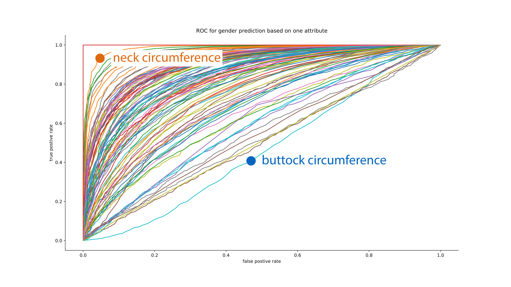

            <figcaption>
            
Here is a pretty imbalanced dataset (though still not as imbalanced as the cancer/not cancer problem). It looks pretty difficult. What would be a good performance on this task?

            </figcaption>
       </section>

       <section id="slide-069">
            <a class="slide-link" href="https://mlvu.github.io/lecture03#slide-069" title="Link to this slide.">link here</a>
            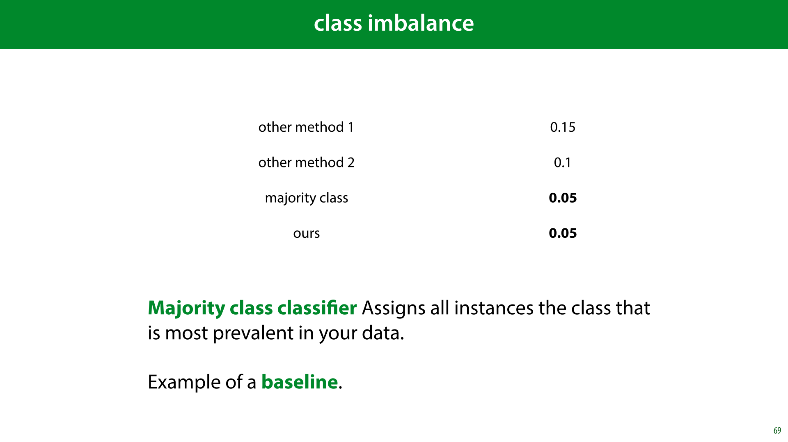

            <figcaption>
            
As we've seen, even though an error of 0.05 might sound pretty good, but on an imbalanced dataset like this, there is a very simple classifier that gets that performance easily. The classifier that assigns anything the class with the most instances. We call this the<strong> majority class classifier</strong>. 

The majority class classifier is an example of a <strong>baseline</strong>, a simple method that is not meant to be used as a real model, but that can help you calibrate the performance scores. In this case, it tells you that you’re really only interested in in the error range from 0  to 0.05. Any higher error than that is pretty useless.

            </figcaption>
       </section>

       <section id="slide-070">
            <a class="slide-link" href="https://mlvu.github.io/lecture03#slide-070" title="Link to this slide.">link here</a>
            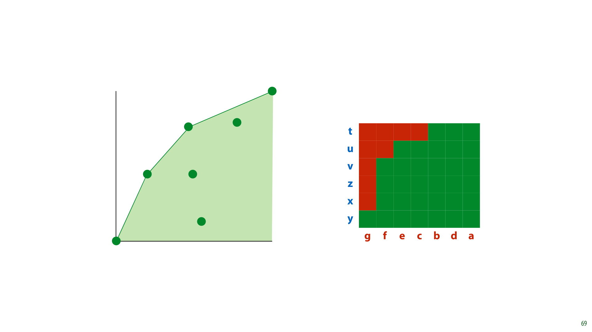

            <figcaption>
            
Here is another way that class imbalance can screw things up for you. You might think you have a pretty decent amount of data with 10 000 instances. However if you split off a test set of 1 000 instances, you'd be left with just 50 instances of the positive class in your data. Practically, your final evaluation will just be a question of how many of these 50 positives you detect. This means that you can really only have 50 “levels of performance” that you can distinguish between. 

You can make a bigger test set of course (and you probably should) but that leads to problems in your training data. Since you’re essentially building a detector for positives, it doesn’t help if you can only give it 100 examples of what a positive looks like. 

In the next lecture, we’ll look at some tricks we can use to boost performance on such imbalanced data.

            </figcaption>
       </section>

       <section id="slide-071">
            <a class="slide-link" href="https://mlvu.github.io/lecture03#slide-071" title="Link to this slide.">link here</a>
            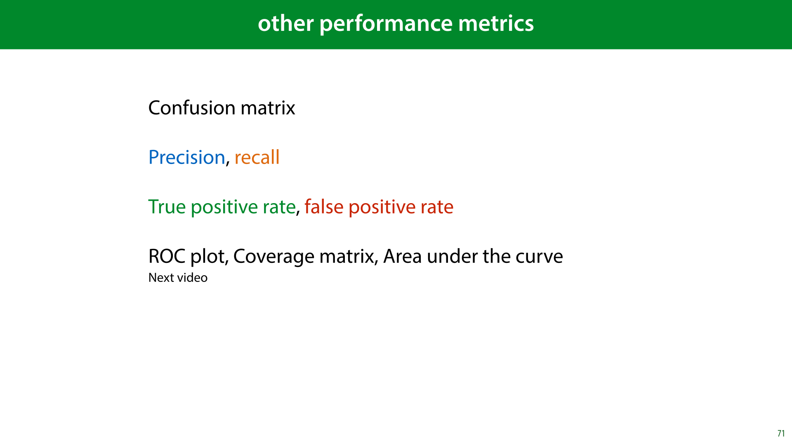

            <figcaption>
            
The best thing to do under class and cost imbalance, is to look at your performance in more detail. We’ll look at six different ways to measure classifier performance. 

Most of these are only relevant if you have class or cost imbalance. If you have a nice, balanced dataset, it’s likely that error or accuracy is all you need.

            </figcaption>
       </section>

       <section id="slide-071" class="anim">
            <a class="slide-link" href="https://mlvu.github.io/lecture03#slide-072" title="Link to this slide.">link here</a>
            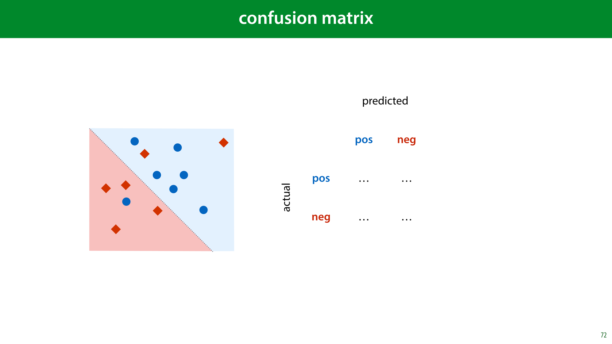

            <figcaption>
            
This is a <strong>confusion matrix</strong> (also known as a contingency table). It's simply a table with the actual classes on the rows, and the predicted classes on the columns, and a tally in each cell of how often each actual class is given a particular prediction. On the diagonal we tally all the correct classifications and off the diagonal we tally all the possible mistakes.  

A confusion matrix doesn’t give you a single number, so it’s more difficult to compare two classifiers by their confusion matrices, but it’s a good way to get insight into what your classifier is actually doing.  

Note that for a binary classification problem, we are getting the two types of mistakes (false positives and false negatives) along the second diagonal. If we have cost imbalance, the balance between these two values gives us a quick insight into how well the classifier is aligned with our estimate for the misclassification costs. 

You can plot the confusion matrix for either the training, validation or test data. All three can be informative. 

The margins of the table give us four totals: the actual number of each class present in the data, and the number of each class predicted by the classifier. 

            </figcaption>
            click image for animation
       </section>

       <section id="slide-072" class="anim">
            <a class="slide-link" href="https://mlvu.github.io/lecture03#slide-073" title="Link to this slide.">link here</a>
            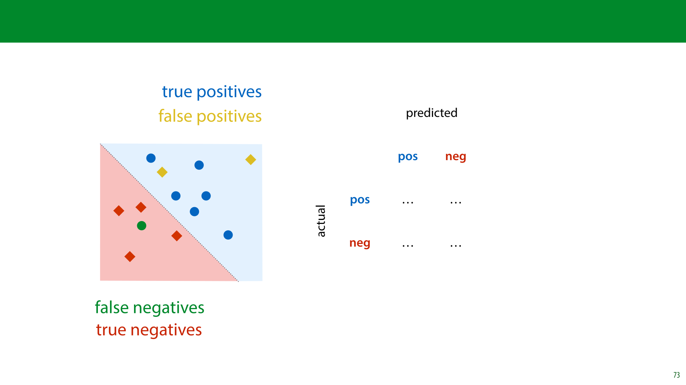

            <figcaption>
            
We  call accurately classified instances <strong class="blue">true positives</strong> and<strong> </strong><strong class="orange red">true negatives</strong>. Misclassifications are called <strong>false positives</strong> and <strong class="green">false negatives</strong>. 

            </figcaption>
            click image for animation
       </section>

       <section id="slide-074">
            <a class="slide-link" href="https://mlvu.github.io/lecture03#slide-074" title="Link to this slide.">link here</a>
            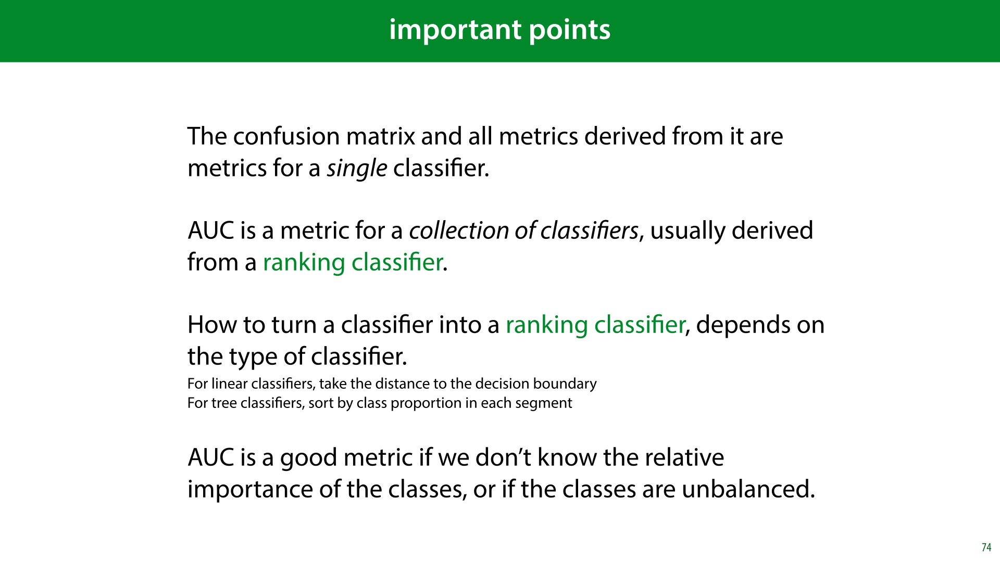

            <figcaption>
            
Here we see the confusion matrix for the majority class baseline (the classifier that calls everything positive) in a problem with high class imbalance.

            </figcaption>
       </section>

       <section id="slide-075">
            <a class="slide-link" href="https://mlvu.github.io/lecture03#slide-075" title="Link to this slide.">link here</a>
            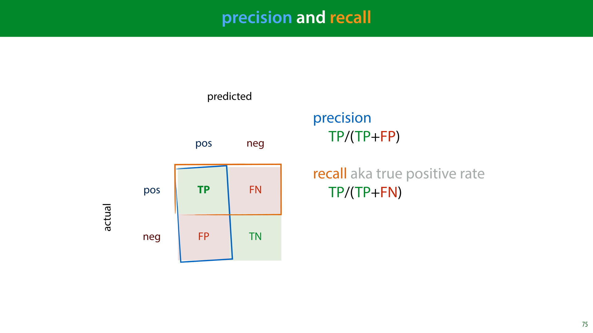

            <figcaption>
            
Precision and recall are two metrics that express a tradeoff between the two types of mistakes. 

<strong>Precision</strong>: what proportion of the returned positives are actually positive? 

<strong>Recall</strong>: what proportion of the existing positives did we find? 

The idea is that we usually want to find as many positives as possible, so we should be eager to label things positive, increasing the recall, but if we are too eager, we will label lots of negatives as positive as well, which will hurt our precision. Our main challenge in designing a classifier in the face of cost and class imbalance, is to find the right tradeoff between precision and recall.

            </figcaption>
       </section>

       <section id="slide-076">
            <a class="slide-link" href="https://mlvu.github.io/lecture03#slide-076" title="Link to this slide.">link here</a>
            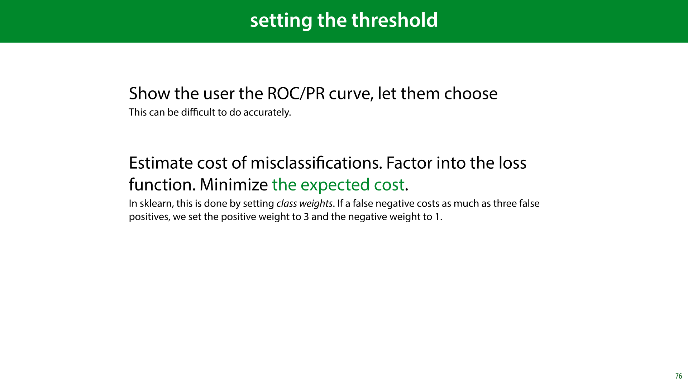

            <figcaption>
            
It always takes me a minute to figure out what precision and recall mean in any given situation, and I usually consult this diagram from Wikipedia to help me out.  

The idea is that the goal of the classifier is to select the positives in the dataset. The more it selects, the higher its recall, but the lower its precision, as more negatives end up in the selection. 

source: By Walber - own work, CC BY-SA 4.0, <a href="https://commons.wikimedia.org/w/index.php?curid=36926283"><strong class="blue">https://commons.wikimedia.org/w/index.php?curid=36926283</strong></a> 

            </figcaption>
       </section>

       <section id="slide-077">
            <a class="slide-link" href="https://mlvu.github.io/lecture03#slide-077" title="Link to this slide.">link here</a>
            

            <figcaption>
            
There are many more metrics which you can derive from the confusion matrix. Wikipedia provides a helpful table, in case you ever come across them. For most purposes, <strong>precision</strong>, <strong>recall</strong>, <strong>accuracy</strong> and <strong>balanced accuracy</strong> are sufficient. 

Note that some terms, like recall, go by<em> many</em> different names.

            </figcaption>
       </section>

       <section id="slide-078">
            <a class="slide-link" href="https://mlvu.github.io/lecture03#slide-078" title="Link to this slide.">link here</a>
            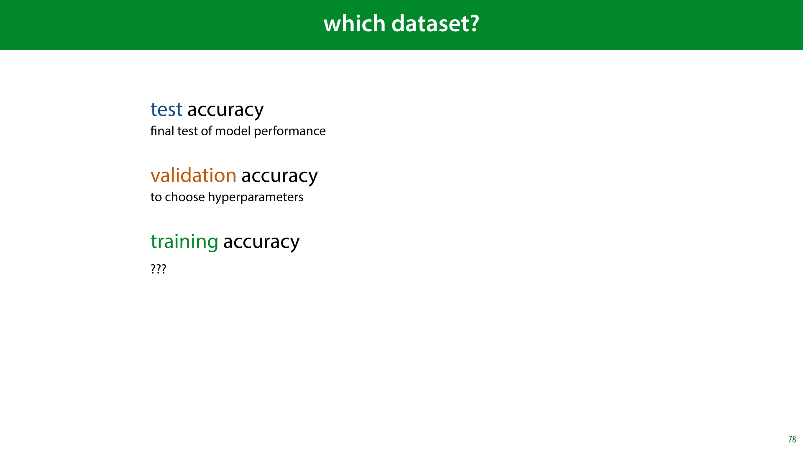

            <figcaption>
            
All of these metrics can be applied to different datasets. When we compute (say) accuracy on the test set, we talk about<strong> test accuracy</strong>. This is computed, only once,  at the very end of our project, to show that our conclusions are true. 

When we compute it on the validation set we call it <strong>validation accuracy</strong>. We compute this to help us choose good hyperparameters. 

And, predictably, when we compute it on the training data, we call it <strong>training accuracy</strong>. Remember that in the first lecture I said, emphatically, that you should never judge your model on how it performs on the training set. Why then, would you ever want to compute the training accuracy (or any other metrics on the training data)?

            </figcaption>
       </section>

       <section id="slide-078" class="anim">
            <a class="slide-link" href="https://mlvu.github.io/lecture03#slide-079" title="Link to this slide.">link here</a>
            

            <figcaption>
            
The answer is that the difference between your validation error and your training error, will tell you whether or not your model is <strong>overfitting</strong> (matching the data too well) or underfitting (not matching the data well enough). 

The difference between the training and validation sets is called the generalization gap. As in, it's the amount of performance that won't generalize to data that isn't your training data.

            </figcaption>
            click image for animation
       </section>

       <section id="slide-080">
            <a class="slide-link" href="https://mlvu.github.io/lecture03#slide-080" title="Link to this slide.">link here</a>
            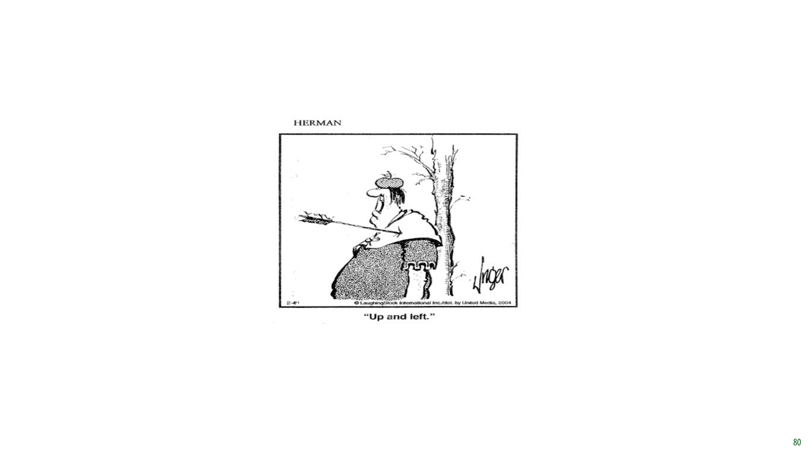

            <figcaption>
            
source: Jim Unger, Herman.

            </figcaption>
       </section>

       <section class="video" id="video-080">
           <a class="slide-link" href="https://mlvu.github.io/lecture03#video-80">link here</a>
           <iframe
                src="https://www.youtube.com/embed/UrqPyE4H2bI?modestbranding=1&showinfo=0&rel=0"
                title="YouTube video player"
                frameborder="0" allow="accelerometer; autoplay; clipboard-write; encrypted-media; gyroscope; picture-in-picture"
                allowfullscreen>
           </iframe>

       </section>

       <section id="slide-081">
            <a class="slide-link" href="https://mlvu.github.io/lecture03#slide-081" title="Link to this slide.">link here</a>
            

            <figcaption>
            
<lnbr></lnbr>

            </figcaption>
       </section>

       <section id="slide-082">
            <a class="slide-link" href="https://mlvu.github.io/lecture03#slide-082" title="Link to this slide.">link here</a>
            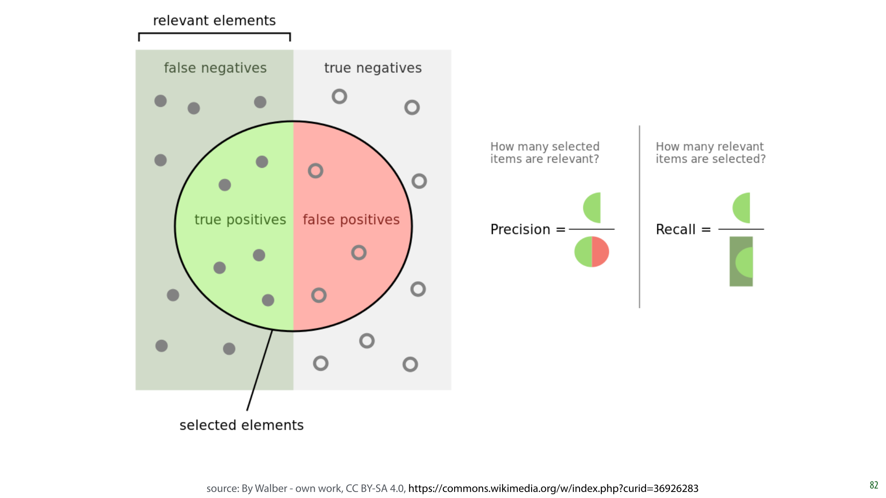

            <figcaption>
            
Let's return to the metrics of precision and recall. We often have to make a tradeoff between high precision and high recall. We can boost our recall by calling more things positive. The drawback is that our recall will go down. We can boost our precision by calling fewer things positive, which will hurt our recall.  

How exactly we make the tradeoff depends on our cost imbalance, and our class imabalance. To help us investigate, we can plot the precision and recall we get from different classifiers. 

source: By Walber - own work, CC BY-SA 4.0, <a href="https://commons.wikimedia.org/w/index.php?curid=36926283"><strong class="blue">https://commons.wikimedia.org/w/index.php?curid=36926283</strong></a> 

            </figcaption>
       </section>

       <section id="slide-083">
            <a class="slide-link" href="https://mlvu.github.io/lecture03#slide-083" title="Link to this slide.">link here</a>
            

            <figcaption>
            
The points in the corners represent our most extreme options. We can easily get a 1.0 recall by calling everything positive (ensuring that all true positives are among the selected elements). We can get a very likely 1.0 precision by calling only the instance we’re most sure about positive. If we’re wrong we get a precision of 0, but if we’re right we get 1.0. 

Whether we prefer the left or the right green classifier depends on our preferences. However, whatever our preference, we should always prefer either green classifier to the blue classifier since both have better precision <em>and</em> recall than the blue classifier. 

            </figcaption>
       </section>

       <section id="slide-083" class="anim">
            <a class="slide-link" href="https://mlvu.github.io/lecture03#slide-084" title="Link to this slide.">link here</a>
            

            <figcaption>
            
Another pair of metrics that provides this kind of tradeoff are the true positive and false negative rate. 

<strong>true positive rate</strong>: what proportion of the actual positives did we get <em>right</em>. The higher the better. I.e. How many of the people with cancer did we detect. 

<strong>false positive rate</strong>: what proportion of the actual negatives did we get <em>wrong</em> (by labelling them as positives). The lower the better. I.e. How many healthy people did we diagnose with cancer.

            </figcaption>
            click image for animation
       </section>

       <section id="slide-085">
            <a class="slide-link" href="https://mlvu.github.io/lecture03#slide-085" title="Link to this slide.">link here</a>
            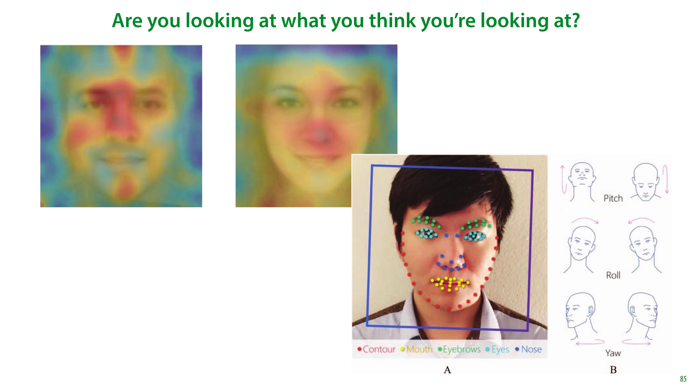

            <figcaption>
            
We want to get the TPR as high as possible, and the FPR as low as possible. That means the TPR/FPR space has the best classifier in the top left corner. This space is called ROC space. 

Again, the orange points are the extremes, and easy to achieve.  
<aside    >ROC stands for receiver-operating characteristic<strong>.  </strong>Like so many names in machine learning , this is a historical artifact, a leftover from its invention in WWII to improve the detection of Japanese aircraft from radar signals.</aside><aside    ></aside>
            </figcaption>
       </section>

       <section id="slide-086">
            <a class="slide-link" href="https://mlvu.github.io/lecture03#slide-086" title="Link to this slide.">link here</a>
            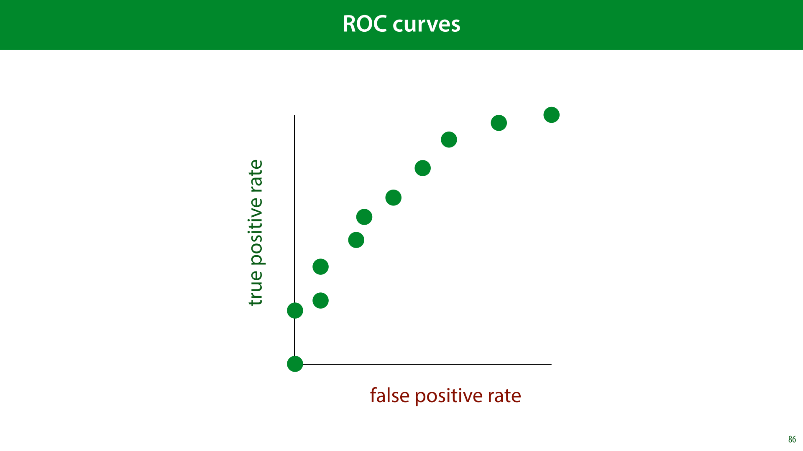

            <figcaption>
            
So far we’ve tough of FRP/TPR and precision/recall as a way to analyze a given set of models. 

However, what if we had a <em>single</em> classifier, but we could control how eager it was to call things positive? If we made it entirely timid, it would classify nothing as positive and start in the bottom left corner. As it grew more brave, it would start classifying some things as positive, but only if it was really sure, and its true positive rate would go up. If we made it even more daring, it would start getting some things wrong and both the tpr and the fpr would increase. Finally, it would end up classifying everything as positive, and end up on the top right corner.  

The curve this classifier would trace out, would give us an indication of its performance, <em>independent </em>of how brave or how timid we make it. How can we build such a classifier?

            </figcaption>
       </section>

       <section id="slide-087">
            <a class="slide-link" href="https://mlvu.github.io/lecture03#slide-087" title="Link to this slide.">link here</a>
            

            <figcaption>
            
We can achieve this by turning a regular classifier into a<strong> ranking classifier</strong><em> </em>(also known as a <strong>scoring classifier</strong>). A ranking classifier doesn’t just provide classes, it also give a score of <em>how</em> negative or <em>how</em> positive a point is. We can use this to rank the points from most negative to most positive. 

How to do this depends on the classifier. Here’s how to do it for a linear classifier. We simply measure the distance to the decision boundary.We can now scale our classifier from timid to bold by moving the decision boundary from left to right. 

After we have a ranking, we can scale the eagerness of the classifier to make things positive. by moving the threshold (the dotted line) from left to right, the classifier becomes more eager to call things negative. This allows us to trade off the true positive rate and the false positive rate.

            </figcaption>
       </section>

       <section id="slide-088">
            <a class="slide-link" href="https://mlvu.github.io/lecture03#slide-088" title="Link to this slide.">link here</a>
            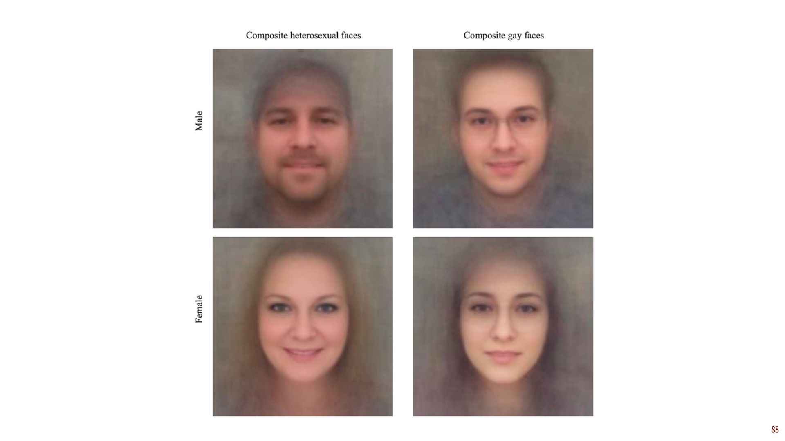

            <figcaption>
            
Now, we can’t test a ranking on our test data, because we don’t know what the correct ranking is. We don’t get a correct ranking, just a correct<em> labeling</em>.  

However, we can indicate for specific pairs that they are ranked the wrong way around: all pairs of different labels. For instance, <strong class="blue">t</strong> and <strong class="orange red">f</strong> form a ranking error: <strong class="blue">t</strong> is ranked as more negative than <strong class="orange red">f</strong>, even though <strong class="blue">t</strong> is positive and <strong class="orange red">f</strong> is negative. 

Note: a ranking error is a <em>pair </em>of instances that is ranked the wrong way around. A single instance can be part of multiple ranking errors.

            </figcaption>
       </section>

       <section id="slide-089">
            <a class="slide-link" href="https://mlvu.github.io/lecture03#slide-089" title="Link to this slide.">link here</a>
            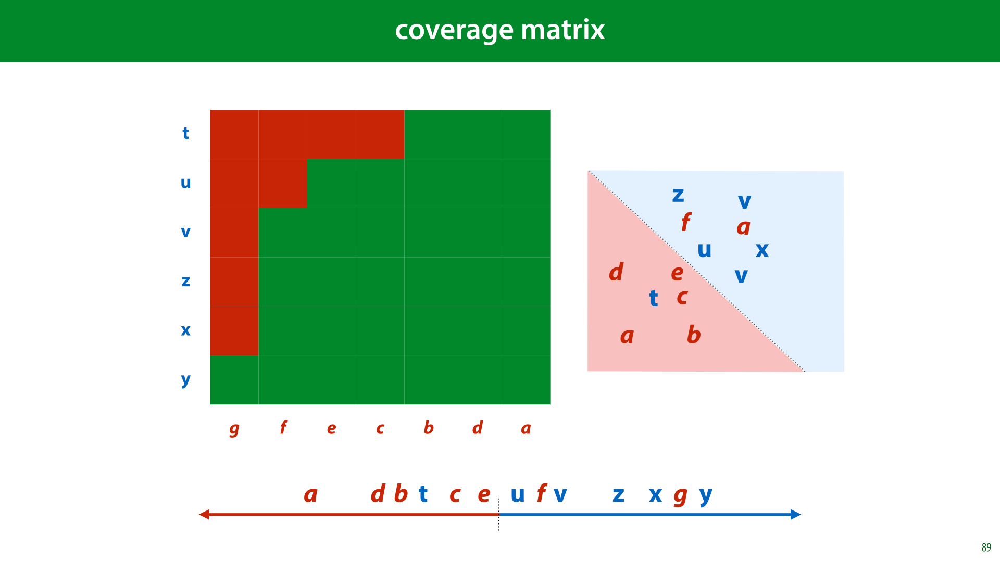

            <figcaption>
            
We can make a big matrix of all the pairs for which we know how they should be ranked: negative points on the horizontal axis, positive on the vertical. The more sure we are that a point is positive, the closer we put it to the bottom left corner. This is called a <strong>coverage matrix</strong>. We color a cell green if the corresponding points are ranked the right way round, and red if they are ranked the wrong way round. 

Note that the proportion of this table that is red, is the probability of making a ranking error.

            </figcaption>
       </section>

       <section id="slide-089" class="anim">
            <a class="slide-link" href="https://mlvu.github.io/lecture03#slide-090" title="Link to this slide.">link here</a>
            

            <figcaption>
            
The coverage matrix shows us exactly what happens to the true positive rate and the false positive rate if we move the threshold from the right to the left. We get exactly the kind of behaviour we talked about earlier. We move from the all-positive classifier step by step to the all-negative classifier.

            </figcaption>
            click image for animation
       </section>

       <section id="slide-091">
            <a class="slide-link" href="https://mlvu.github.io/lecture03#slide-091" title="Link to this slide.">link here</a>
            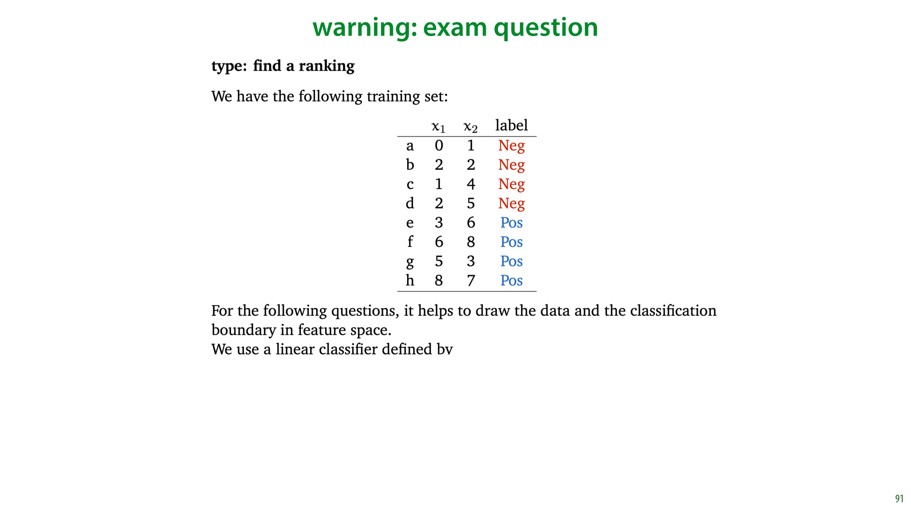

            <figcaption>
            
This is one of the question types on the exam. People very often make mistakes in this question, so make sure you understand what a ranking error is<strong>. It's not a misclassified example.</strong> It's a property of a pair of example. 

There are more details in the third homework.

            </figcaption>
       </section>

       <section id="slide-092">
            <a class="slide-link" href="https://mlvu.github.io/lecture03#slide-092" title="Link to this slide.">link here</a>
            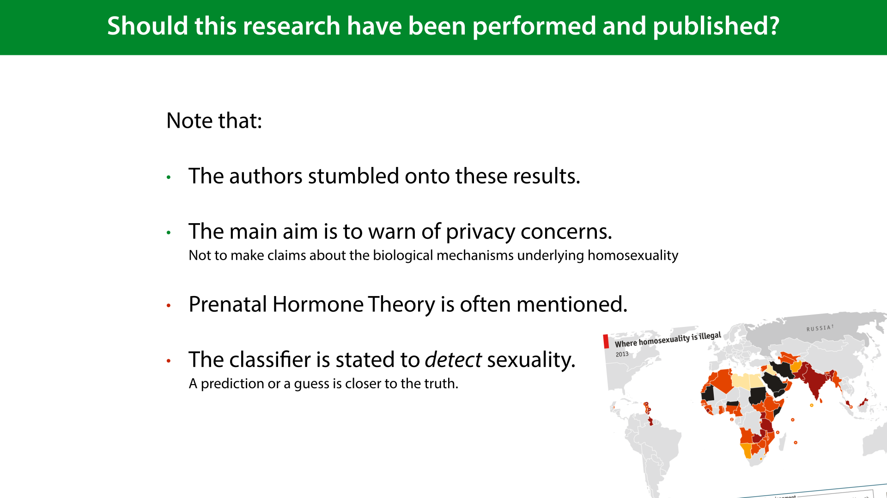

            <figcaption>
            
 

If we draw a line between two classifiers we know we can create, we can also create a classifier for every point on that line simply by picking the output of one of the classifiers at random. If we pick with 50/50 probability we end up precisely halfway between the two. 

If we vary the probability we can get closer to either classifier.

            </figcaption>
       </section>

       <section id="slide-093">
            <a class="slide-link" href="https://mlvu.github.io/lecture03#slide-093" title="Link to this slide.">link here</a>
            

            <figcaption>
            
This means we can create any classifier in this green area, called the convex hull of the set of green dots. This is called the area under the (ROC) curve. 

The AUC is a good indication of the quality of the classifier. The bigger this area, the more useful classifiers we can achieve. If we have no idea of how we want to make the tradeoff between the TPR and the FPR, the AUC may be a good way to compare classifiers in general.  

 

            </figcaption>
       </section>

       <section id="slide-094">
            <a class="slide-link" href="https://mlvu.github.io/lecture03#slide-094" title="Link to this slide.">link here</a>
            

            <figcaption>
            
As we saw before: normalizing the coverage matrix gives us the ROC space (barring some small differences that disappear for large datasets). The area under the ROC curve is an estimate of the green proportion of the coverage matrix. This gives us a good way to interpret the AUC.  

<strong>The AUC (in ROC space) is an estimate of the probability that a ranking classifier puts a randomly drawn pair of positive and negative examples in the correct order. </strong>

<strong></strong>

            </figcaption>
       </section>

       <section id="slide-094" class="anim">
            <a class="slide-link" href="https://mlvu.github.io/lecture03#slide-095" title="Link to this slide.">link here</a>
            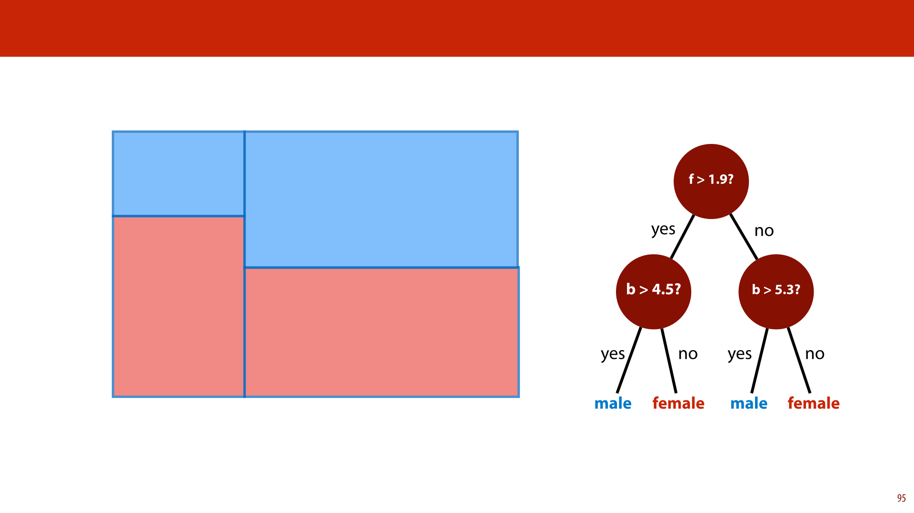

            <figcaption>
            
Let's look at how this works for another type of classifier. To re-iterate, <strong>how we get a ranking from a classifier depends entirely on the model</strong>. 

The decision tree is an example of a <em>partitioning </em>classifier. Is splits the feature space into partitions, and assigns each partition, also known as a <strong class="blue">segment</strong>, a class. All instances in the segment get the same class.

            </figcaption>
            click image for animation
       </section>

       <section id="slide-096">
            <a class="slide-link" href="https://mlvu.github.io/lecture03#slide-096" title="Link to this slide.">link here</a>
            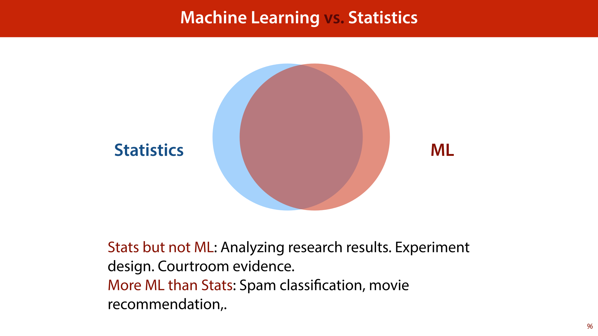

            <figcaption>
            
In this example we have an instance space that has been split into four segments by a decision tree. We rank the segments by the proportion of positive points. We then put all points in one region on the same level in the ranking. 

In this example, <strong class="orange red">b</strong> is more negative than <strong class="orange red">a</strong>, because <strong class="orange red">b</strong>’s segment contains only negative examples, whereas <strong class="orange red">a</strong>’s segment contains a mix of positive and negative examples.

            </figcaption>
       </section>

       <section id="slide-097">
            <a class="slide-link" href="https://mlvu.github.io/lecture03#slide-097" title="Link to this slide.">link here</a>
            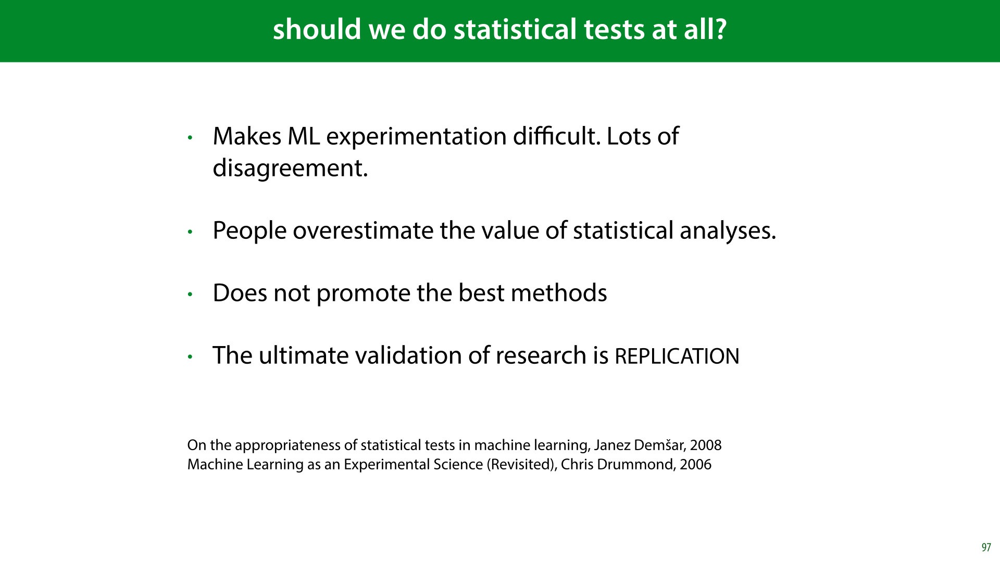

            <figcaption>
            
This means that for some pairs (like <strong class="orange red">f</strong>,<strong class="blue">z</strong>), the classifier ranks them as “the same”. We’ll color these cells <strong class="orange">orange</strong> in the coverage matrix.  

For large datasets, these regions will not contribute much to the  total area under the curve.

            </figcaption>
       </section>

       <section id="slide-098">
            <a class="slide-link" href="https://mlvu.github.io/lecture03#slide-098" title="Link to this slide.">link here</a>
            

            <figcaption>
            
To interpret the AUC, you should know not just what classifier was used, but how it was made into a collection of classifiers. You should also know whether it’s a the area under an ROC curve, or a precision/recall curve.

            </figcaption>
       </section>

       <section id="slide-099">
            <a class="slide-link" href="https://mlvu.github.io/lecture03#slide-099" title="Link to this slide.">link here</a>
            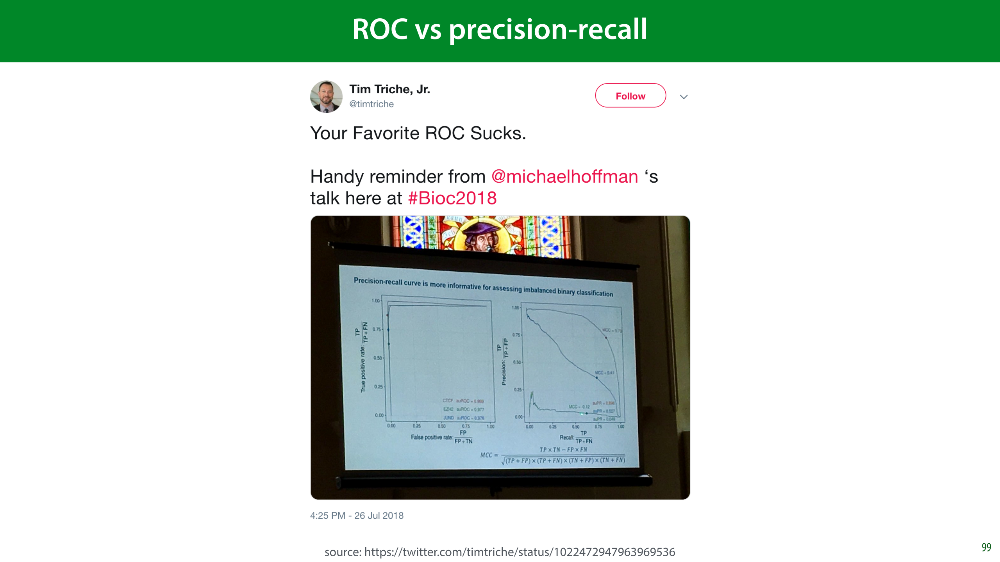

            <figcaption>
            
An alternative to the ROC is the <strong>precision/recall curve</strong>. It works in exactly the same way, but has precision and recall on the axes. 

As you can see in this tweet, in many settings the PR curve can be much more informative, especially when you’re a plotting the curves. Practically, it’s little effort to just plot both, and judge which one is more informative.  

ROC has the benefit of an intuitive interpretation for the AUC (the probability of ordering a random pair the right way round). I haven’t yet found a similar interpretation for the PR-AUC.

            </figcaption>
       </section>

       <section id="slide-100">
            <a class="slide-link" href="https://mlvu.github.io/lecture03#slide-100" title="Link to this slide.">link here</a>
            

            <figcaption>
            
To put a classifier into production, a ranking may not be enough. Sometimes, you just need to produce a single answer. In that case, you can still use the ROC and PR curves to tune your hyperparameters and choose your model, but ultimately, you’ll need to choose a threshold as well: the point at which you decide to call something a positive. 

This is more of a software development issue than a scientific choice. Often, you have to look carefully at the curves, perhaps together with the end users, to make a decision. 

The second approach works best with probabilistic classifiers, which we’ll discuss next lecture.

            </figcaption>
       </section>

       <section id="slide-101">
            <a class="slide-link" href="https://mlvu.github.io/lecture03#slide-101" title="Link to this slide.">link here</a>
            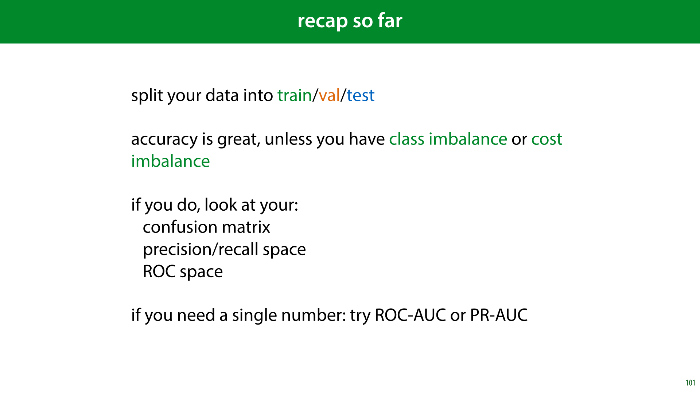

            <figcaption>
            

            </figcaption>
       </section>

       <section class="video" id="video-101">
           <a class="slide-link" href="https://mlvu.github.io/lecture03#video-101">link here</a>
           <iframe
                src="https://www.youtube.com/embed/XJ_StAFefUk?modestbranding=1&showinfo=0&rel=0"
                title="YouTube video player"
                frameborder="0" allow="accelerometer; autoplay; clipboard-write; encrypted-media; gyroscope; picture-in-picture"
                allowfullscreen>
           </iframe>

       </section>

       <section id="slide-102">
            <a class="slide-link" href="https://mlvu.github.io/lecture03#slide-102" title="Link to this slide.">link here</a>
            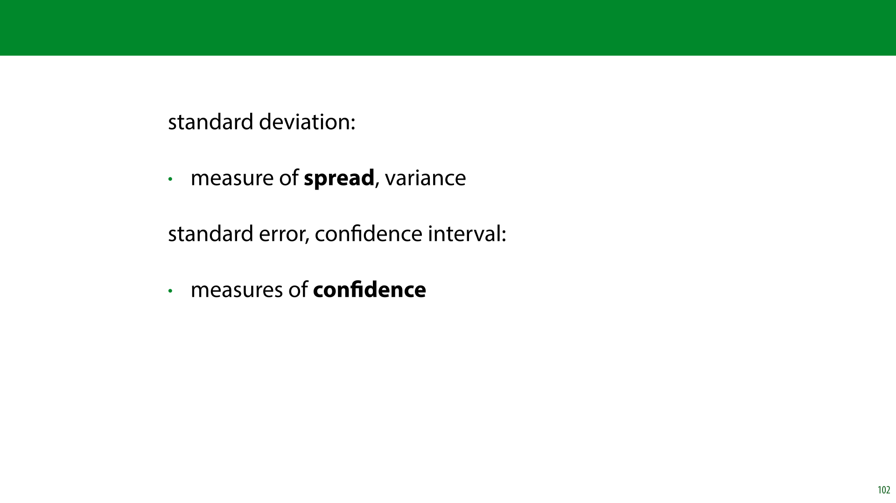

            <figcaption>
            
<lnbr></lnbr> 

Model evaluation is not just about showing how well your model works. It’s also about working out what it <em>means</em> to get a certain performance. And more importantly, what it doesn’t mean.

            </figcaption>
       </section>

       <section id="slide-103">
            <a class="slide-link" href="https://mlvu.github.io/lecture03#slide-103" title="Link to this slide.">link here</a>
            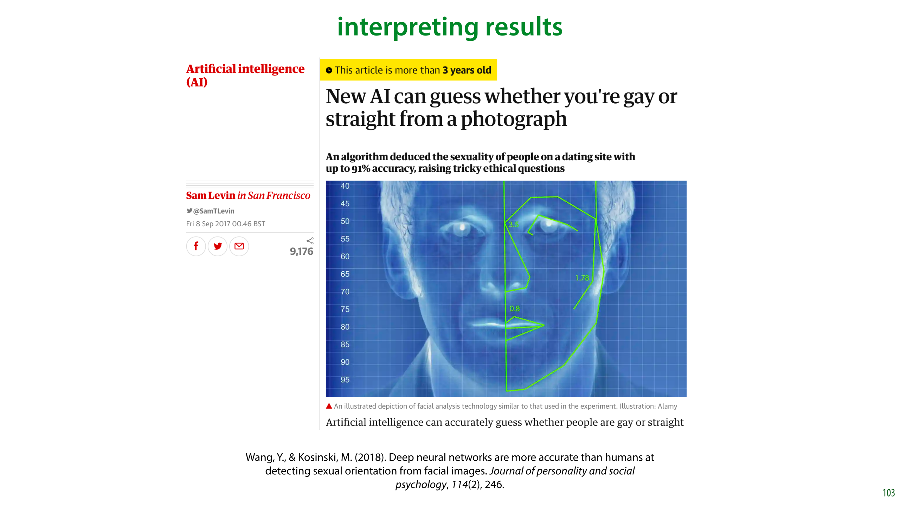

            <figcaption>
            
In this video, we will use the following research as a running example. In 2017 researchers from Stanford built a classifier that predicted sexual orientation (restricted to the classes “heterosexual” and “gay”) from profile image taken from a dating site. They reported 91% ROC-AUC on men and 83% ROC-AUC on women. 

The results were immediately cited as evidence of a biological link between biology and sexual orientation. The following important caveats were largely overlooked in media reports: 

Some of theperformance came from facial landmarks (roundness, length of nose, distance between eyes, etc), but some came from superficial details like hairstyle, lighting and grooming. The accuracy  

The results were true when averaged over a large population. It’s true that women live longer than men on average, but that doesn’t mean that there are no old men. Likewise,  the fact that you can guess orientation based on, say, the length of the nose, with better than chance accuracy, may only be due to a very small difference between the two distributions, with plenty of overlap. 

~90% ROC-AUC may sound impressive, but it basically means that you will make 1 ranking error for every 10 attempts. 

The study authors make may of these points themselves, but that didn’t stop the paper from being wildly misrepresented: <a href="https://docs.google.com/document/d/11oGZ1Ke3wK9E3BtOFfGfUQuuaSMR8AO2WfWH3aVke6U/edit#"><strong>https://docs.google.com/document/d/11oGZ1Ke3wK9E3BtOFfGfUQuuaSMR8AO2WfWH3aVke6U/edit#</strong></a> 

            </figcaption>
       </section>

       <section id="slide-104">
            <a class="slide-link" href="https://mlvu.github.io/lecture03#slide-104" title="Link to this slide.">link here</a>
            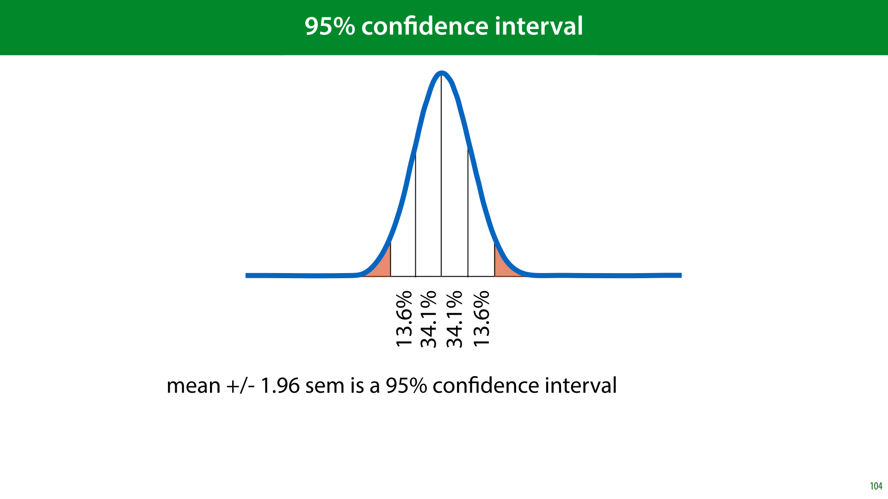

            <figcaption>
            
Like in the previous video, we’ll look at some important questions to ask yourself when you come up against a topic like this. Let’s ask the same questions again (with some new ones thrown in for good measure).

            </figcaption>
       </section>

       <section id="slide-105">
            <a class="slide-link" href="https://mlvu.github.io/lecture03#slide-105" title="Link to this slide.">link here</a>
            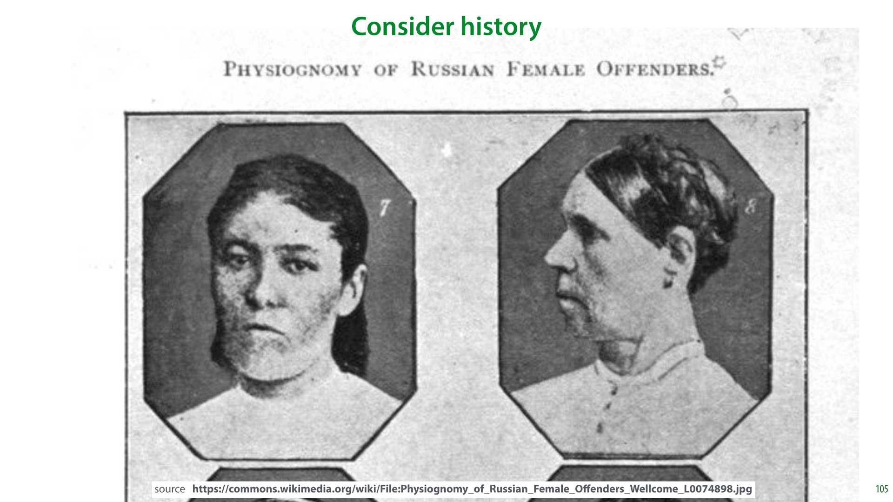

            <figcaption>
            
In these cases, it’s important to know your history. Physiognomy is the study which attempts to infer character from facial features. 

In this case there’s is a long history of scientists claiming to be able to divine personal attributes (most often “criminality”) from the structure of a subject’s face. This is called physiogmony and almost any claim made has been conclusively disproven as false, and based on poor scientific practice and spurious correlations. 

That doesn’t mean, of course, that the entire idea of physiognomy is conclusively disproven. But is does mean that when we are stumbling into the same area with new tools, we should be aware of the mistake made in the past and, so that we can be careful not to repeat them.

            </figcaption>
       </section>

       <section id="slide-106">
            <a class="slide-link" href="https://mlvu.github.io/lecture03#slide-106" title="Link to this slide.">link here</a>
            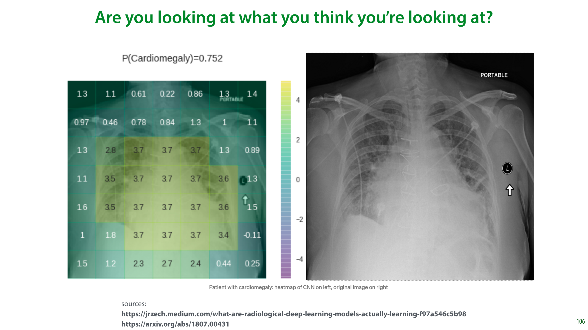

            <figcaption>
            
The first thing to be aware of is what you’re looking at. This is especially important with modern systems that can look at raw image data without extracting specific, interpretable features. 

Here a visualization of a classifier looking at a chest x-ray and making a prediction of whether the patient has Cardiomegaly (an enlarged heart). The positive values in the heat map indicate that those regions are important for the current classification. The largest values are near the heart, which is what we expect.  

However, the classifier is also getting a positive contribution from the “PORTABLE” label in the top right corner and the marker on the right. These indicate that the x-ray was taken with a portable scanner. Such scanners are only used when a patient’s condition has progressed so far that they can’t leave their house. In such cases it’s a safe bet that they have Cardiomegaly.

            </figcaption>
       </section>

       <section id="slide-107">
            <a class="slide-link" href="https://mlvu.github.io/lecture03#slide-107" title="Link to this slide.">link here</a>
            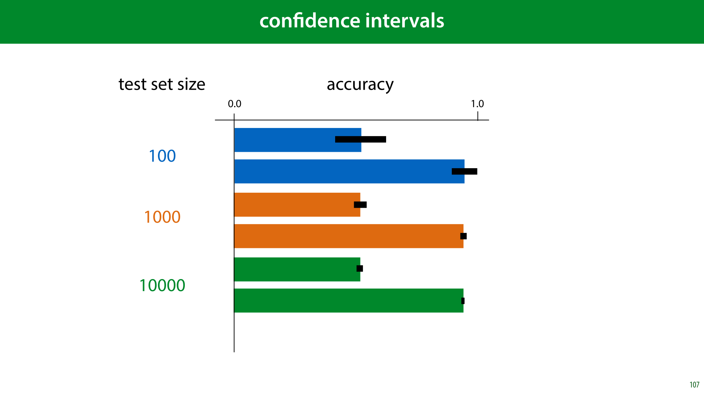

            <figcaption>
            
These problems are often called “Clever Hans” effects. Clever Hans, or der Kluge Hans, was an early-20th century German horse, who appeared to be able to do arithmetic. 

As it turned out, Hans was not doing arithmetic, but just reading the body language of its handler, to see whether it was moving towards the right answer. This is impressive in itself,  of course, but it does mean that Hans didn’t show the kind of intelligence that was being attributed to him.  

Crucially, this was <em>not</em> a hoax. The handler truly believed that Hans was able to do arithmetic, and had no idea that he was guiding him subconsciously. This, incidentally is also why double-blind experiments are so important in other fields. 

For us, Hans serves as a powerful reminder that just because we’re seeing the <em>performance</em> we were hoping for, doesn’t mean we’re seeing it for the<em> reasons </em>we were hoping for as well.

            </figcaption>
       </section>

       <section id="slide-107" class="anim">
            <a class="slide-link" href="https://mlvu.github.io/lecture03#slide-108" title="Link to this slide.">link here</a>
            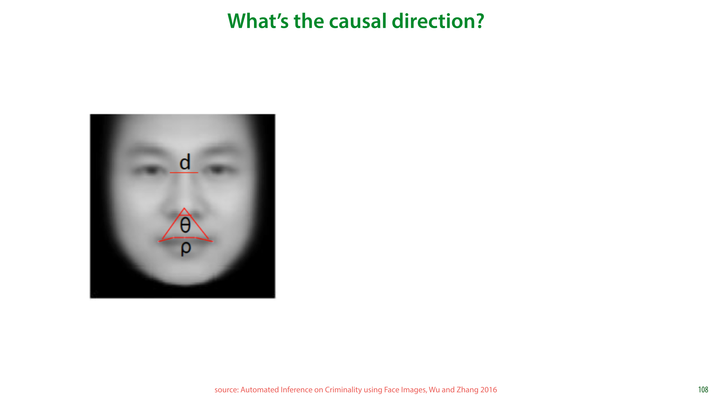

            <figcaption>
            
A related question you should ask when you find that you can successfully predict X from Y is <strong>which causes which</strong>? 

The image on the left shows a feature that researchers found when attempting to predict criminality based on a dataset of faces of criminals and non-criminals. One of their  findings is that the angle made by the corners of the mouth and the tip of the nose is a highly predictive feature. The authors suggest that such facial features are indicative of criminality 

However, when we look at the dataset we see that it’s not the features of the face, so much as the expression that differs. In the “non-criminal” photographs, the subjects hold a light smile, as is common, whereas in the criminal set the expressions have a more explicitly relaxed jaw. What we’re seeing here are not facial <em>features</em>, so much as facial <em>expressions</em>. 

This is important, because it changes the interpretation of the results completely. The physiognomical interpretation is that there is a biological mechanism that causes both criminality and a particular wideness of the mouth, and that this is determined at birth. The alternative explanation is that when people with a criminal background have their photographs taken, they are more likely to prefer a menacing expression than the average person is. 

Note, incidentally, that the photos of criminals are not mugshots. The are described as “normal ID photos” by the authors. 

Further discussion: <a href="https://www.callingbullshit.org/case_studies/case_study_criminal_machine_learning.html"><strong>https://www.callingbullshit.org/case_studies/case_study_criminal_machine_learning.html</strong></a> 

 

            </figcaption>
            click image for animation
       </section>

       <section id="slide-109">
            <a class="slide-link" href="https://mlvu.github.io/lecture03#slide-109" title="Link to this slide.">link here</a>
            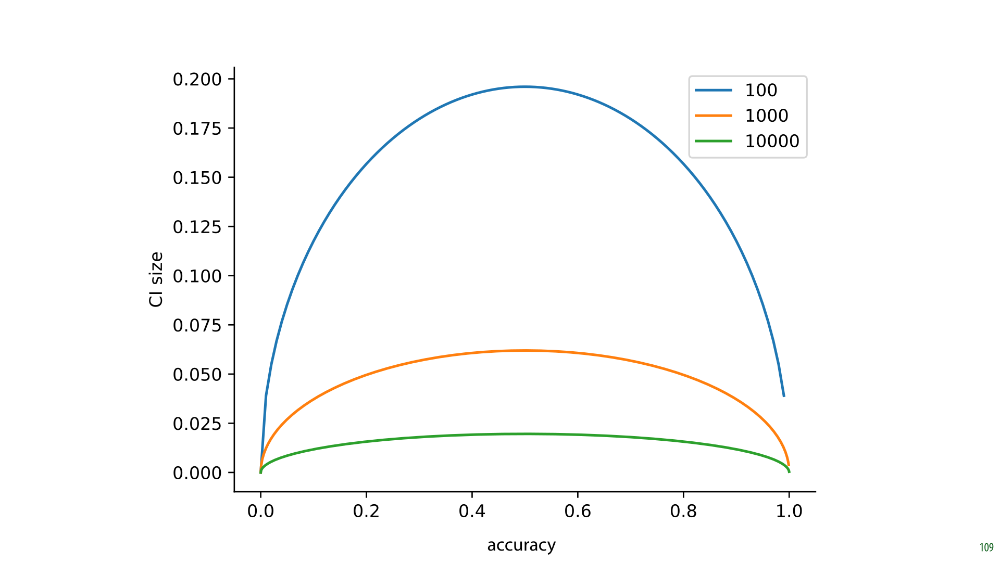

            <figcaption>
            
Let’s go back to the sexuality classifier. what might a Clever Hans effect look like here? In the most extreme case, you might expect a classifier just to look at the background of the image. The authors were more careful here than you might expect: 

The background of the image was blurred and the the facial features (eyes, nose, mouth) were detected and aligned.  

The focus of the classifier was investigated with saliency maps (indicators of where the model is looking). This is a fallible method, but it does show a general focus on the face. 

A second classifier was fed only facial landmarks: the position of the eyes, roundness of the jaw, etc. The suggestion being that this prevents Clever Hans effects. 

The deep neural network used to extract features from pixels was not trained on this data, but on another facial dataset. Only its<em> features </em>were fed to a shallow classifier that learned from these labels. This limits the ability of the classifier to pick up on surface detail.

            </figcaption>
       </section>

       <section id="slide-110">
            <a class="slide-link" href="https://mlvu.github.io/lecture03#slide-110" title="Link to this slide.">link here</a>
            

            <figcaption>
            
Another question we suggested in the last video is whether the target label you’ve chosen is saying what you think it’s saying. 

Here, the authors inferred sexuality from the stated preference in the dating profile. This is clearly correlated with sexuality, but not the same thing. Firstly, sexuality is one of those attributes (like movie genre) that can only be crudely approximated by a set of finite categories. Moreover, for many people it’s not a fixed attribute, and it is subject to some evolution throughout their life. 

The stated preference on a dating profile also means that you are capturing only those gay people who are willing to live (relatively) openly as gay. This may be highly dependent on social background. It’s certainly conceivable that in poorer subcultures, people are less likely to come out as gay, either to their community or to themselves. 

This means that what we’re detecting when we’re classifying a face in this dataset as “gay” is more likely a combination of factors that are correlation to that label. 

Incidentally, note the size of the dataset. One thing the authors can’t be accused of is finding spurious correlations. It’s a question of what the correlations that they found mean, but with this amount of data, as we saw before, we get very small confidence intervals, so the observed effects are definitely there.

            </figcaption>
       </section>

       <section id="slide-110" class="anim">
            <a class="slide-link" href="https://mlvu.github.io/lecture03#slide-111" title="Link to this slide.">link here</a>
            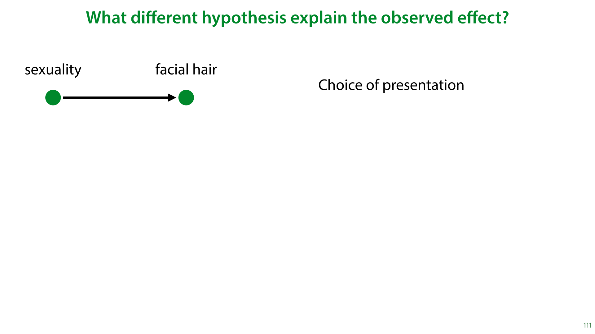

            <figcaption>
            
So, what kind of hypotheses can we think of for what is causing the performance of the classifier? 

The authors observe that in their dataset the heterosexual men are more likely have facial hair. That’s most likely to be a grooming choice, based on the differences in gay and heterosexual subcultures.  

For other correlations, such as that between sexuality and nose length, the authors suggest the prenatal hormone theory, a theory that relates prenatal hormone levels in the mother with the sexuality of the subject. In short, a biological mechanism that is responsible for both the (slight) variation in facial features and the variation in sexual preference. 

But that’s not the only possibility. In the previous slide, we saw that it’s difficult to separate facial features from facial expressions. However, even if we somehow eliminate the expression, that doesn’t mean that every facial feature we see is determined at birth. For instance, the roundness of the jaw is also influenced by body weight, which is strongly influenced by social class (for instance, whether somebody grows up poor or rich). And while there’s no evidence that social class influences the probability of <em>being gay</em>, it most likely does influence how likely a gay person is to end up setting up a dating profile. 

Note that these are purely hypotheses, intended to show which kinds of causalities can cause these correlations. I’m not in the least bit qualified to say which is more likely to be true. 

            </figcaption>
            click image for animation
       </section>

       <section id="slide-112">
            <a class="slide-link" href="https://mlvu.github.io/lecture03#slide-112" title="Link to this slide.">link here</a>
            

            <figcaption>
            
The authors plotted the four averages faces for the classes male/female and gay/heterosexual in their dataset. Here are the four options. It’s a peculiar property of datasets of (aligned) faces that the mean is often quite a realistic face itself. 

Consider this plot with the hypotheses on the previous slide. What differences do you see? Pay particular attention to the differences in skin tone, grooming, body weight, and the presence of glasses.  

I’ll leave you to decide which you think is the more likely explanation for these difference: choice of presentation, social class, or sexuality.  

 

            </figcaption>
       </section>

       <section id="slide-113">
            <a class="slide-link" href="https://mlvu.github.io/lecture03#slide-113" title="Link to this slide.">link here</a>
            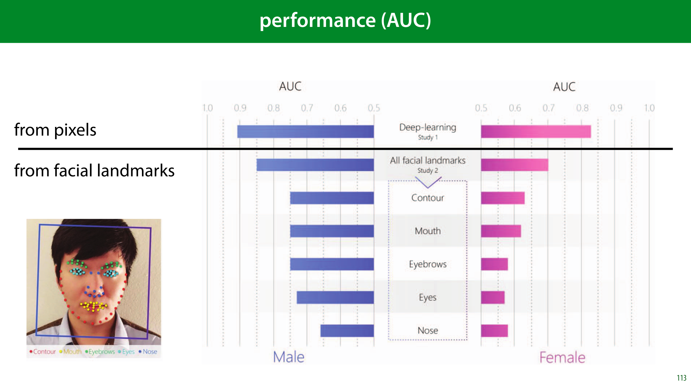

            <figcaption>
            
The authors repeated their experiments by classifying based purely on facial landmarks. The idea is that we can detect landmarks very accurately, and classifying on these alone removes a lot of sources for potential Clever Hans effects. 

We see that all subsets of the face landmarks allow for some predictive performance, but there is a clear difference between them. Note that just because we are isolating landmarks, doesn’t mean that we are focusing only on biological causes. As we saw earlier, the shape of the mouth is determined more by expression than by facial features, and the roundness of the jaw is partly determined by body weight, which is correlated with social class. 

We will discuss the AUC metric in the third lecture. For now, you can think of a classifier with 81% AUC as one that, given a random pair of gay and heterosexual instances from the data, will successfully select the gay instance 81% of the time. 

Let’s assume that the shape of the nose is mostly unaffected by grooming and expression. I have no idea whether this assumption is valid, but say that it is. Focusing purely on the shape of the nose, we see that performance drops to 0.65 AUC for men and 0.56 AUC for women. This is still better than chance level.  

Can we say that homosexuality can be<em> detected</em> based on the shape of the nose? Can we conclude a biological relation based on this correlation? 

            </figcaption>
       </section>

       <section id="slide-113" class="anim">
            <a class="slide-link" href="https://mlvu.github.io/lecture03#slide-114" title="Link to this slide.">link here</a>
            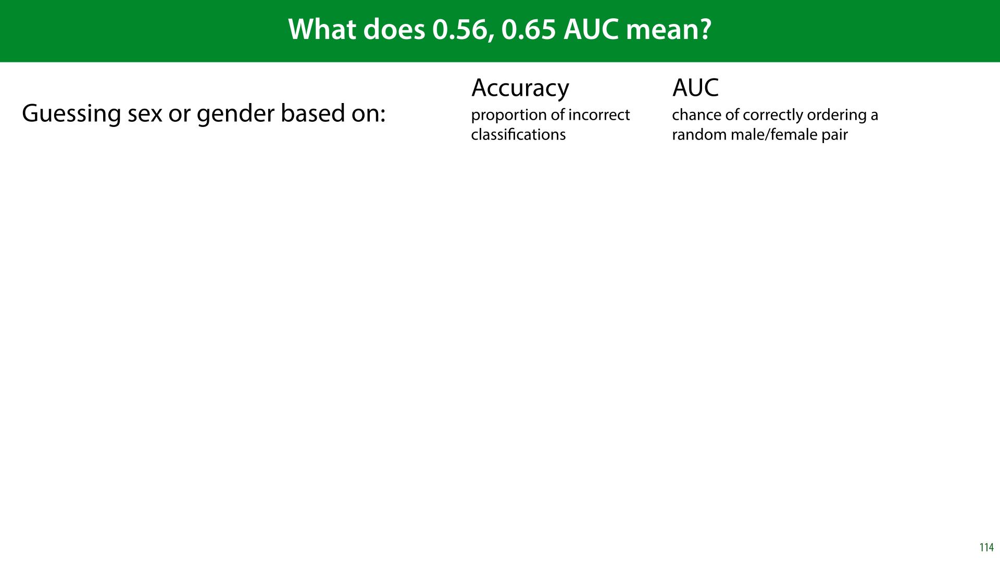

            <figcaption>
            
To interpret numbers like these, it’s good to get some points of reference. If we try to guess somebody’s gender or sex (the distinction doesn’t matter much for such a crude guess), <strong>while knowing nothing about them except their age</strong>, the best we can expect to do is slightly better than chance level (51% of our guesses will be correct). The reason we can get better than chance level is that women tend to live longer than men. This means that if we guess “female” for older people, we are a little bit more likely to be correct. 

If we restrict ourselves to older people, the effect becomes more pronounced and we can get to the level the sexuality classifier achieved (based purely on noses in the female part of the data). This can help us to interpret the AUC the authors managed. Note that this accuracy is achieved by calling everybody female, and the AUC is achieved by guessing that the older person in a pair is always female. Think about that. <strong>If you walk into a care home blindfolded and simply call everybody female, can you really claim to be </strong><em>detecting </em><strong>their gender? </strong>

If we look purely at people’s height, we get an accuracy and AUC that is comparable to what the authors achieved from the pixel data. This is also an important point to consider. Height and gender are correlated, but that doesn’t mean that there are no tall women or short men. It also doesn’t make tall women “masculine”, or short men “feminine”. It’s just a slight correlation that allows us to make an educated guess for certain parts of the range of heights. 

This is how you should always interpret accuracy and AUC values in the range 0.8 to 0.95: it's as impressive as guessing somebody's sex or gender based purely on their height. Yes, it can be done better than chance level, and yes there is a definite correlation, but it doesn't much more than that there is a very subtle correlation. 
<aside    >NB: In the ANSUR II data, the subjects are soldiers. It’s possible that some sex differences are more pronounced in this population due to selection effects or physical training. Here, we balanced the ANSUR data by subsampling to make the numbers of male and female subjects equal.</aside><aside    ></aside>
            </figcaption>
            click image for animation
       </section>

       <section id="slide-115">
            <a class="slide-link" href="https://mlvu.github.io/lecture03#slide-115" title="Link to this slide.">link here</a>
            

            <figcaption>
            
To provide some points of references for ROC curves, here are all the curves you can achieve for sex/gender classification based on a single physical measurement. For some of these we get very impressive looking curves. But is the word "detection" really apropriate when you are making one physical measurement and predicting sex or gender based on that? 

The lowest AUC comes from using buttock circumference as a feature, and the highest from using neck circumference. Since these are soldiers, it's likely that differences due to muscle volume are more pronounced here than they would be generally. This plot is for the complete data so there is a 4:1 class imbalance (male:female).

            </figcaption>
       </section>

       <section id="slide-116">
            <a class="slide-link" href="https://mlvu.github.io/lecture03#slide-116" title="Link to this slide.">link here</a>
            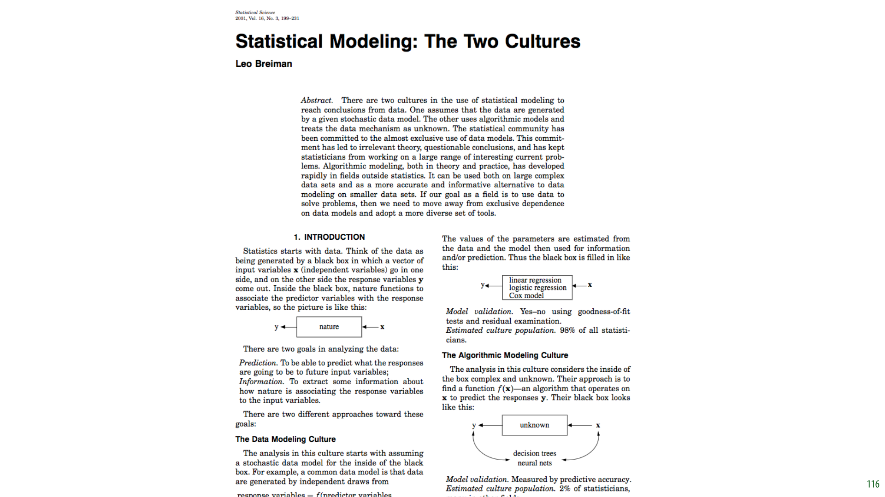

            <figcaption>
            
Here are the histograms per sex or gender for the ANSUR data. There is a big discrepancy, but notice also how big the area of overlap is.  

This is always what we should imagine when people say that property A is predictive for attribute B. Just because there’s some difference between the populations doesn’t mean that there are no short men or tall women. And most importantly it doesn’t mean that being short makes you in some way more feminine or being tall makes you in some way more masculine.

            </figcaption>
       </section>

       <section id="slide-117">
            <a class="slide-link" href="https://mlvu.github.io/lecture03#slide-117" title="Link to this slide.">link here</a>
            

            <figcaption>
            
So, are we really justified in calling this a detector? 

Are you really <em>detecting</em> gender when you call somebody male just because they’re tall? The authors compare their classifiers to medical diagnostic tools to provide an interpretation of the AUC scores. 

This is where we must make a clear distinction between what a classifier like this does and what a diagnostic test does. A test like that for breast cancer looks explicitly only at one particular source of information. In this case the mammogram. The clinician will likely take the result of this test, and factor in contextual clues like age and lifestyle if the test is unclear. The test can be said to <strong>detect</strong> something, because it is strictly confined to look at only one thing.  

The clinician is then <strong>predicting</strong> or <strong>guessing</strong> something based on different factors. One of which is the test. 

The diagnosis of Parkinson’s is different. It much more similar to the way this classifier works, there is no unambiguous diagnostic tool like a blood test, so the diagnostician can only look at contextual clues like symptoms, medical history, age and risk factors.  

There is still a difference, however, in that the features are made more explicit. The pixel-based sexuality classifier may be inferring social class from the image, but it’s not <em>telling</em> us that it’s doing this. A doctor may be guilty of such subconscious inferences as well, but we can expect a greater level of <em>interpretability</em> from them. 
<aside    >NB: The authors use the word accuracy to refer to ROC-AUC.</aside><aside    ></aside>
            </figcaption>
       </section>

       <section id="slide-118">
            <a class="slide-link" href="https://mlvu.github.io/lecture03#slide-118" title="Link to this slide.">link here</a>
            

            <figcaption>
            
After all that, it’s natural to ask whether this research project was a mistake. In short, were the authors wrong to do this, and if so in what way? This is a question of values rather than science, so it’s up to you to decide. I’ll just note some important points to consider. 

Firstly, the authors weren’t looking to prove this point one way or another, and they initially stumbled on to their findings. Given that a result has been established, it’s most often unethical <em>not </em>to report it. So long as that reporting is done carefully and responsibly, of course. 

The stated aim of the paper is not to make any claims about causal mechanisms. The authors are less interested in whether the classifier picks up on grooming choices of biological features, than in whether the guess can be made with some success at all.  

If we decide that the result did need to be reported, we may consider whether the authors were guilty of poor framing. The use of the word <em>detecting </em>is subject to misinterpretation. To be fair, that’s something I only became aware of when looking into this matter including all the fallout from this particular paper, so for me at least it would be hypocritical to be too judgemental of poor word choice. 

Another odd thing, is that in both the paper and the explanatory notes, <em>prenatal hormone theory </em>a suggested biological causal mechanism for homosexuality, is often mentioned. As we have seen the experiments shown here provide no evidence for one causal hypothesis over another, so it would probably have been better to make no claims about causal effect whatsoever.

            </figcaption>
       </section>

       <section id="slide-118" class="anim">
            <a class="slide-link" href="https://mlvu.github.io/lecture03#slide-119" title="Link to this slide.">link here</a>
            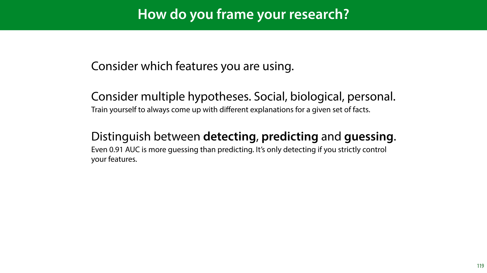

            <figcaption>
            
If you find yourself in the unfortunate situation of having to publish something controversial like this, or having to interpret somebody else's work on a controversial topic, keep these tips in mind.  

Finally, and this is a personal opinion, so make of it what you will: if you read about research like this in a newspaper, or on social media, remember that you are an <em>academic</em> (or at least you will be when you graduate). That comes with a certain responsibility to dig into the primary research before you make a judgment. Don't just trust the journalists, or worse, the commenters on Twitter. If you really want to give your opinion on a situation like this, dig out the original paper and read it. If you don't, the most honest thing to do is to withhold judgment. 

What you you will find when you dig down, is almost always that the truth is much more subtle than the news and social media make it look. In this specific case, the majority of criticism leveled at the authors was simply inaccurate. There are valid and serious criticisms of the paper, but you really need to dig down to get past a lot of invalid criticisms. The truth, as is so often the case is subtle and complex. Our job as academics is to embrace that complexity, and to simplify it as much as possible, but no further.

            </figcaption>
            click image for animation
       </section>

       <section id="slide-120">
            <a class="slide-link" href="https://mlvu.github.io/lecture03#slide-120" title="Link to this slide.">link here</a>
            

            <figcaption>
            
I’m indebted to people on twitter for helping me to see the different angles on this topic. 

            </figcaption>
       </section>

       <section class="video" id="video-120">
           <a class="slide-link" href="https://mlvu.github.io/lecture03#video-120">link here</a>
           <iframe
                src="https://www.youtube.com/embed/gnmCkRYrlEA?modestbranding=1&showinfo=0&rel=0"
                title="YouTube video player"
                frameborder="0" allow="accelerometer; autoplay; clipboard-write; encrypted-media; gyroscope; picture-in-picture"
                allowfullscreen>
           </iframe>

       </section>

       <section id="slide-121">
            <a class="slide-link" href="https://mlvu.github.io/lecture03#slide-121" title="Link to this slide.">link here</a>
            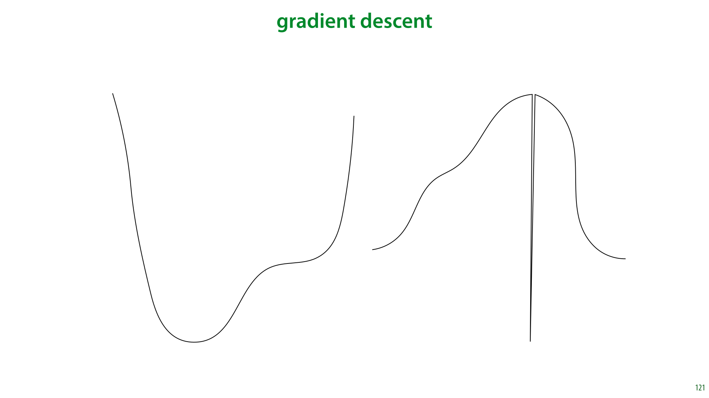

            <figcaption>
            
<lnbr></lnbr>

            </figcaption>
       </section>

       <section id="slide-122">
            <a class="slide-link" href="https://mlvu.github.io/lecture03#slide-122" title="Link to this slide.">link here</a>
            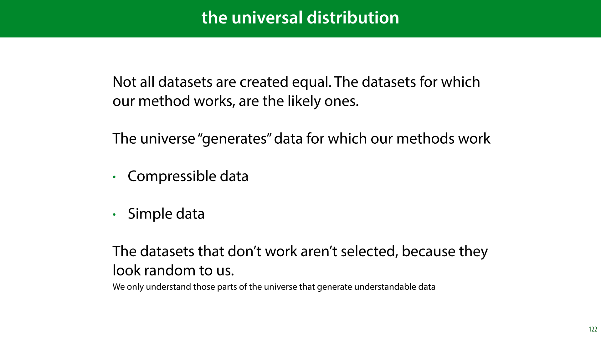

            <figcaption>
            
We end with a very short, but important discussion.   

A question that often arises is: <em>which classifier, model, search method, etc. is the best, independent of the data?</em> Before we see the data, can we make a best guess for which approaches to try? Are there some methods that always work really well?

            </figcaption>
       </section>

       <section id="slide-123">
            <a class="slide-link" href="https://mlvu.github.io/lecture03#slide-123" title="Link to this slide.">link here</a>
            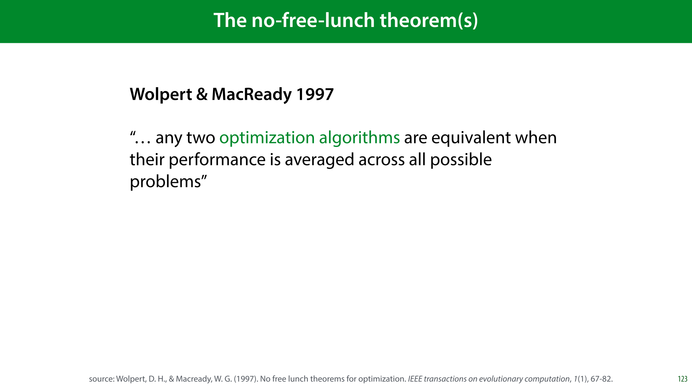

            <figcaption>
            
In the 90s two researchers, named Wolpert and MacReady published a proof of an important theorem. The details are technical, but it basically stated that if we look at optimization algorithms (of which machine learning algorithms are a specific instance), by averaging their performance over all possible tasks, they all perform exactly the same.  That is, if we want to know which algorithm is the best independent of the task, we canot tel them apart by their performance.

            </figcaption>
       </section>

       <section id="slide-124">
            <a class="slide-link" href="https://mlvu.github.io/lecture03#slide-124" title="Link to this slide.">link here</a>
            

            <figcaption>
            
Let's look at some examples of what this means in practice. For instance, gradient descent is a pretty intuitive algorithm, and we've seen already that there are many tasks for which it works well. Let's imagine the polar opposite algorithm: gradient ascent. We are still looking for the lowest point on the loss surface, but instead of descending, we <em>climb</em>. Intuitively, this is a ridiculous algorithm, 

However, according to the no free lunch theorem, both gradient descent and gradient ascent should work equally well when their performance is averaged over all problems. This means that for every task on which gradient descent works well, and gradient ascent works terribly, we should be able to find a task where the roles are reversed.  

The slide shows the kind of landscape that might result in this situation. On the left we have a typical loss landscape, with a lowest point that gradient descent should easily find. On the right we have the opposite. A reverse loss landscape that you need to climb to get near the lowest point. Gradient descent would go nowhere near the optimimum. Gradient ascent, with just the right hyperparameters, will climb all the way to the top, and in its last step fall into the crevice and get stuck on the plateau at the bottom.

            </figcaption>
       </section>

       <section id="slide-125">
            <a class="slide-link" href="https://mlvu.github.io/lecture03#slide-125" title="Link to this slide.">link here</a>
            

            <figcaption>
            
Here is another example, that should show you what a strange result the no free lunch theorem is. The common practice of dataset splitting and choosing a model by its test set performance is also an algorithm. We do it manually, but we could also program it into a computer. Let's say we want to choose between two methods A and B. We can follow the normal approach: split the data, apply both and choose whichever performs best. Call this method C. 

We can also do a ridiculous, counter-intuitive thing and choose the method that performs <em>worst</em>. Call this method D. 

The no free lunch theorem says that method D should outperform method C just as often as the other way around.  

The kind of datasets where this happens are the ones where the test set happens to behave very differently from the training set. Since we usually make the split randomly, these would be very unusual or unlikely datasets, and we feel justified in using method C. Still, this only works because we are able to make certain <em>assumptions</em> about our data.

            </figcaption>
       </section>

       <section id="slide-126">
            <a class="slide-link" href="https://mlvu.github.io/lecture03#slide-126" title="Link to this slide.">link here</a>
            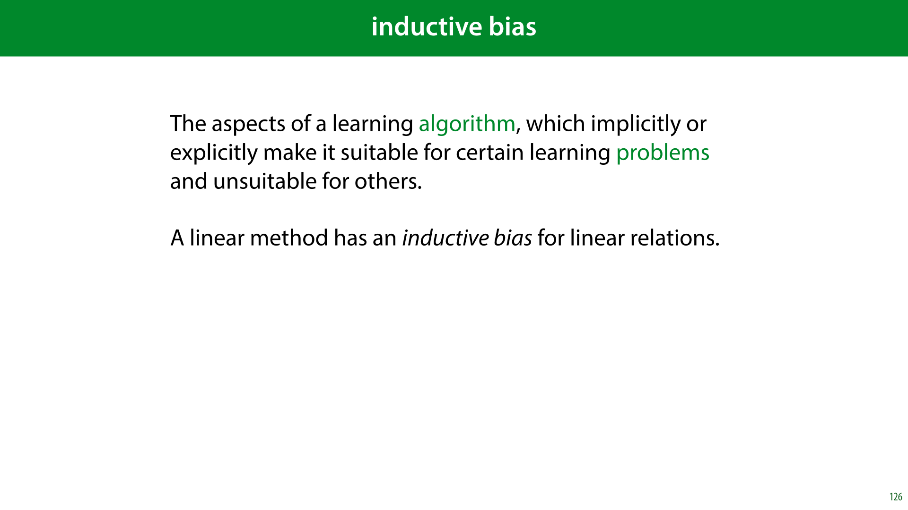

            <figcaption>
            
In a way, we’re back to the problem of induction. For any given situation where a learning method works, there’s a situation where it doesn’t. Induction (aka. learning from experience) works in practice, but there are exceptions, and we can't tell just by looking at the data when it will and won't work. 

Note that if there were some algorithm that could tell us which situation we were in, we could just use this algorithm to select our learning method, and beat the NFL theorem. 

In short, we need to make some <strong>assumptions</strong> about the nature of whatever it was that created our data. Without such assumptions, learning doesn't work.

            </figcaption>
       </section>

       <section id="slide-127">
            <a class="slide-link" href="https://mlvu.github.io/lecture03#slide-127" title="Link to this slide.">link here</a>
            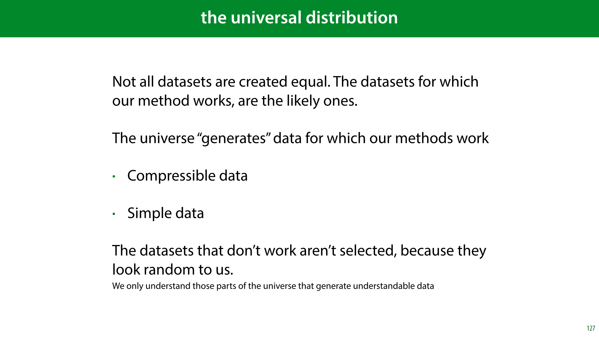

            <figcaption>
            
This is an increasingly important phrase in machine learning. The inductive bias of a method or model are those assumptions about the domain that are, explicitly or implicitly, hardcoded into the model. 

For instance, in a linear regression model, the assumption is that all instances lie on a line (or the higher-dimensional equivalent). If this assumption isn't violated too much, the model is a good fit for the data. If the assumption is violated very badly,  we need to look for ways to change the inductive bias, for instance by picking a different model, or by enriching the linear model with extra features, like we will do in the next lecture. 

We can summarize the business of machine learning and data science as follows. The business of the machine learning researcher is create a variety of models with helpful inductive biases. The business of the data scientist is to figure out which of the available inductive biases is helpful for any given problem.

            </figcaption>
       </section>

       <section id="slide-128">
            <a class="slide-link" href="https://mlvu.github.io/lecture03#slide-128" title="Link to this slide.">link here</a>
            

            <figcaption>
            
One “out” to the NFL Theorem, is that there is a “universal distribution” governing all processes that create data. 

The NFL Theorem implicitly assumes that all datasets are equally likely. Since this is not the case, there is some other, non-uniform distribution that tells us which datasets are more likely than others, averaged over all possible settings. 

Using such a universal data distribution, we could (in theory) work out a universally best learning algorithm. 

            </figcaption>
       </section>

       <section id="slide-129">
            <a class="slide-link" href="https://mlvu.github.io/lecture03#slide-129" title="Link to this slide.">link here</a>
            

            <figcaption>
            
We don't have too many practical ideas about the properties of such a universal distribution, but one thing that crops up a lot is that<strong> simple data</strong> is necessarily more likely than complex data. 

This suggests that in learning we should have a <strong>simplicity bias</strong>. If there are two models that both fit the data, one very simple, like a linear model, and one very complex, like a very big decision tree, then it's more likely that the simple model generated the data. 

Such simplicity biases can be implemented in many different ways, and we'll see some concrete examples as the course progresses.

            </figcaption>
       </section>

       <section id="slide-130">
            <a class="slide-link" href="https://mlvu.github.io/lecture03#slide-130" title="Link to this slide.">link here</a>
            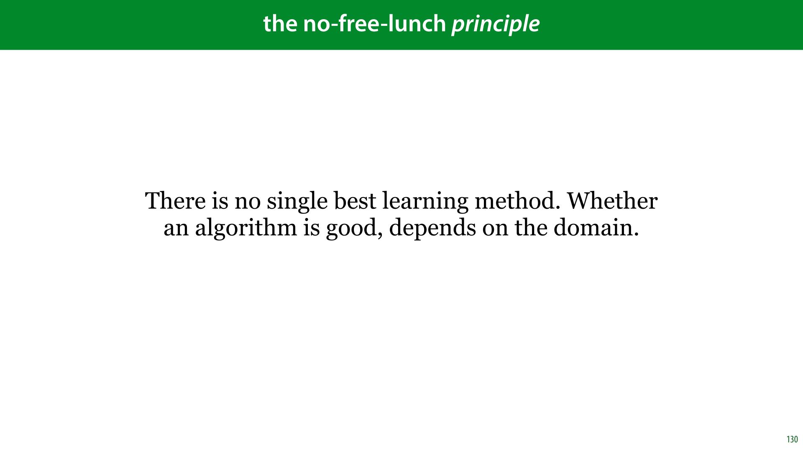

            <figcaption>
            
Whether or not the NFL theorem means anything for us in practice, it has also given rise to a general <strong>principle</strong>, commonly followed in machine learning practice. The principle is that we should choose our method to deal with the task at hand, and not look for a universally best method. 

Note that this is distinct from the NFL theorem, because everybody still uses data splitting universally to evaluate <em>which of these many methods</em> is the best. And by the NFL theorem, model selection by data splitting is also not a universal algorithm. So the NFL theorem and the NFL principle are really two very different things. 

In practice, the NFL theorem shouldn't keep you awake at night. It's an interesting thought to return to occasionally, and a reminder that by choosing a model, we are making assumptions about the source of our data. 

The NFL <em>principle</em> is an important concept to keep in mind when selecting models. Don't just run gradient boosted decision trees by default, just because somebody somewhere dais it was the best approach. Investigate your task. Figure out what makes it special, try different approaches and tailor your approach to the problem at hand. 

            </figcaption>
       </section>

       <section id="slide-131">
            <a class="slide-link" href="https://mlvu.github.io/lecture03#slide-131" title="Link to this slide.">link here</a>
            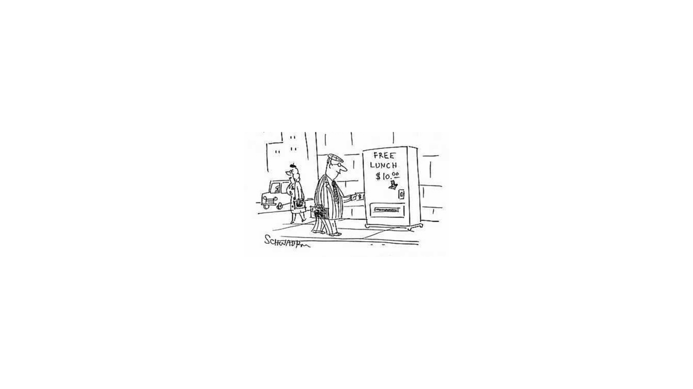

            <figcaption>
            

            </figcaption>
       </section>

</article>
