<nav class="menu">
    <ul>
        <li class="home"><a href="/">Home</a></li>
        <li class="name">Lecture 5: Probabilistic models</li>
            <li><a href="#video-000">What is probability?</a></li>
            <li><a href="#video-036">Learning with probability</a></li>
            <li><a href="#video-054">(Naive) Bayes classifiers</a></li>
            <li><a href="#video-073">Logistic regression</a></li>
            <li><a href="#video-100">Information theory</a></li>
        <li class="pdf"><a href="https://mlvu.github.io/lectures/31.ProbabilisticModels1.annotated.pdf">PDF</a></li>
    </ul>
</nav>

<article class="slides">
       <section class="video" id="video-000">
           <a class="slide-link" href="https://mlvu.github.io/lecture05#video-0">link here</a>
           <iframe
                src="https://www.youtube.com/embed/9rWoBVnVuLQ?modestbranding=1&showinfo=0&rel=0"
                title="YouTube video player"
                frameborder="0" allow="accelerometer; autoplay; clipboard-write; encrypted-media; gyroscope; picture-in-picture"
                allowfullscreen>
           </iframe>

       </section>

       <section id="slide-001">
            <a class="slide-link" href="https://mlvu.github.io/lecture05#slide-001" title="Link to this slide.">link here</a>
            

            <figcaption>
            
Probability is an important tool in Machine Learning. We expect that you have been taught probability theory already, but since it’s a subtle concept, with complicated foundations, we’ll go over the basics again in this first video. 

If you have never done <em>any</em> probability before, please consult the homework exercises and the recommended reading to brush up first. 

<lnbr></lnbr>

            </figcaption>
       </section>

       <section id="slide-002">
            <a class="slide-link" href="https://mlvu.github.io/lecture05#slide-002" title="Link to this slide.">link here</a>
            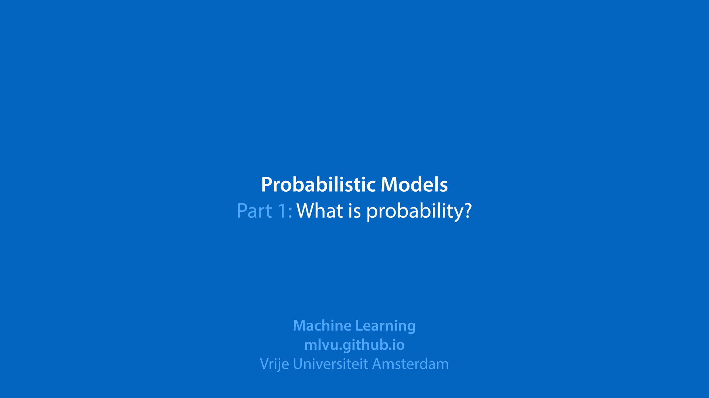

            <figcaption>
            
To start, let’s look at the way we use probability <em>informally</em>. 

Let’s say you are a concerned parent, you read this headline and you are shocked by it. You turn to your partner, and you say “that means that the probability that our son is gambling online is 12.5%”. Your partner disagrees, you have a good handle on your son’s behaviour and his spending. Unless he has a credit card you don’t know about, and the probability of that is much lower. 

Well, then the probability that Josh, his closest friend, gambles online must be 12.5%. If one in eight teenage boys is gambling, they must be hiding <em>somewhere</em>. Your partner disagrees again: probability doesn’t enter in to it. Josh is either gambling or he isn’t. 

Clearly, we need to look at what we mean when we say that a probability of something is such-and-so. There are two commonly accepted ways of looking at it: objective and subjective probability. We’ll start with <strong>objective probability</strong>.  

image source: <a href="https://www.theguardian.com/society/2016/sep/20/one-in-eight-european-teenage-boys-gamble-online-says-survey"><strong class="blue">https://www.theguardian.com/society/2016/sep/20/one-in-eight-european-teenage-boys-gamble-online-says-survey</strong></a>

<a href="https://www.theguardian.com/society/2016/sep/20/one-in-eight-european-teenage-boys-gamble-online-says-survey"><strong class="blue"></strong></a>

            </figcaption>
       </section>

       <section id="slide-003">
            <a class="slide-link" href="https://mlvu.github.io/lecture05#slide-003" title="Link to this slide.">link here</a>
            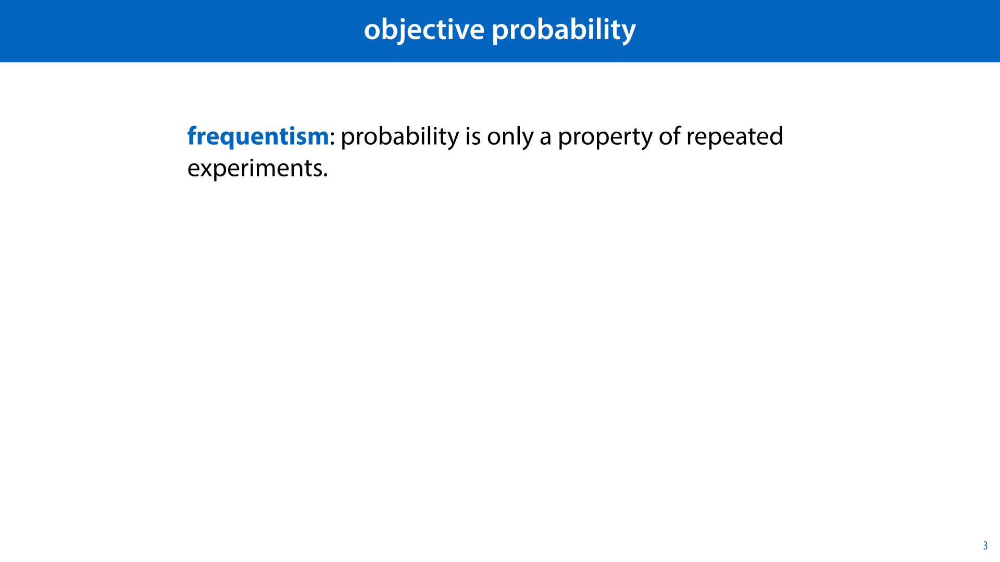

            <figcaption>
            
In <strong>objective probability</strong>, “the probability that X is the case” represents an<em> objective truth</em>: whatever a probability is, it must be the same for everybody. You and I may disagree over a probability, but only because one of us is wrong. There is one true probability. An example is the probability that a coin-toss will land heads. If nothing unusual is going on, everybody should agree that the outcome is uncertain and that the probability will be 50%. We can't have a situation  where one person thinks it's 10% and the other thinks it's 90%<em> and they're both right</em>. 

The most common form of objective probability is<strong> frequentism</strong>. Under the frequentist definition, probability is a property of a (hypothetical) repeated experiment.  For instance, take the statement “the probability of rolling 6 with a fair die, is one in six.”  

The experiment is rolling a die. The outcome we are discussing is the roll resulting in a 6. If we were to repeat the experiment a large number of times, N, then the proportion of times we observe the discussed outcome is close to 1 in 6. More precisely, as N grows, the proportion <em>converges</em> to 1 in 6. 

Under a frequentist interpretation, saying “the probability is one in six", is equivalent to saying “if I roll the die repeatedly, the relative frequency of sixes will converge to 1 in 6 as the number of rolls grows.” 

 

            </figcaption>
       </section>

       <section id="slide-004">
            <a class="slide-link" href="https://mlvu.github.io/lecture05#slide-004" title="Link to this slide.">link here</a>
            

            <figcaption>
            
Under objective probability the statement “the probability that Josh is gambling is 12.5%” is indeed nonsense. There is no experiment we can imagine where Josh “turns out" to be a gambler one in 8 times. He either gambles or he doesn’t. 

What we <em>can</em> say is that the probability that a teenage boy drawn randomly from the European population gambles online is 12.5%. This is an experiment we can repeat, and at every repetition, we choose a different boy, so we get a different outcome.

            </figcaption>
       </section>

       <section id="slide-005">
            <a class="slide-link" href="https://mlvu.github.io/lecture05#slide-005" title="Link to this slide.">link here</a>
            

            <figcaption>
            
The alternative to objectivism is <strong>subjectivism</strong>. It states that probability expresses our uncertainty. If X is a boolean variable, one that is true or not true, and we are uncertain whether X is true, we can assign a probability to X being true. A probability of 0.5 means we are entirely ambivalent, a probability of 0.75 means we think X is pretty likely, and a probability of 1 means we’re entirely sure that X is true.  

In this case, different people can have different probabilities for the same thing being true. You and I may "assign" different probabilities to something being true and both be right. If you have information I don’t have, your probability may be closer to certainty than mine. 

<strong>Bayesianism</strong> is the main form of subjective probability. It builds on Bayes’ rule, which we will discuss later, to tell us how we should use observations to <em>update</em> our beliefs.

            </figcaption>
       </section>

       <section id="slide-006">
            <a class="slide-link" href="https://mlvu.github.io/lecture05#slide-006" title="Link to this slide.">link here</a>
            

            <figcaption>
            
Under subjectivism, we <em>can</em> say “the probability that our son is gambling is 12.5%” We don’t know precisely what he gets up to, so even though there is a definite objective answer, <em>we</em> are uncertain. If we know only this headline, we may well pick 12.5% as our belief that our son is gambling. Of course, as noted before we have a lot more knowledge about <em>our </em>son than about other teenage boys. We know he goes to bed on time, we know where gets his money,  and we know he probably doesn’t have a secret credit card. So even though the probability for a random teenage boy would be 12.5%, the probability for our son is actually much lower, because we have extra information. 

This is the fundamental difference between the two views: under frequentism, probability is defined as an objective property of the world. The probability of X is the same for all people regardless of what we know or don’t know. Under Bayesianism, probability is an expression of a subjective property: it can change from one person to the next, and if we learn new information, it can change from one moment to the next. If we find out that our son <em>does </em>have a secret credit card, the probability that he is gambler, suddenly jumps up dramatically, even though nothing about him has changed, only our knowledge about him. 

Note that Bayesianism, in a sense encompasses frequentism. If we define probability as the outcome of a repeated experiment, then before we do the experiment we are uncertain about its outcome. If we understand the experiment perfectly, then the Bayesian probability we assign to the outcomes will coincide with the frequentist probabilities of the outcomes.

            </figcaption>
       </section>

       <section id="slide-007">
            <a class="slide-link" href="https://mlvu.github.io/lecture05#slide-007" title="Link to this slide.">link here</a>
            

            <figcaption>
            
So, at heart subjectivism and objectivism are disambiguations. The word probability is ambiguous, and these allow you to make precise what you mean. 

Note that you don’t have to commit to one view or another. At heart subjective and objective probability are just ways to be more precise about what the word probability actually means. You can use the subjective definition one day and the objective definition the next (especially in informal settings). 

However, once you start doing statistics, the two definitions lead to fundamentally different approaches (which we’ll see in more detail later). And in the statistical community there are definitely two camps: the frequentists and the Bayesians, and arguments between the two can get very heated. 

Since machine learning is often seen as another form of statistics, you may ask whether it is usually seen as using subjective or objective probability. I can’t give you a commonly accepted answer, I think opinions differ. 

My view (which is definitely not shared by everyone) is that Machine Learning, while being statistical in nature, is not fundamentally probabilistic. The fundamental principles of machine learning can be defined and explained without recourse to probability theory (and indeed, we have done so for most of the start of the course). The fundamental goal of (offline) machine learning is to minimise test set loss given only a training set, and some hint as to the relation between the two datasets. This definition does not require probability. 

Of course, even if machine learning is not fundamentally probabilistic, probability has proven to be a very powerful tool (much like linear algebra and calculus), in helping us solve this problem. The consequence, is that we can borrow whatever methods are most helpful to us at the time. We’ll use the frequentist methods when we need them, and the Bayesian methods when they prove most helpful. We’ll even happily mix the two in a single model.

            </figcaption>
       </section>

       <section id="slide-008">
            <a class="slide-link" href="https://mlvu.github.io/lecture05#slide-008" title="Link to this slide.">link here</a>
            

            <figcaption>
            
All that was about the<em> interpretation</em> of probabilities. This is what the field of <strong>statistics</strong> is about. We have frequentist statistics and Bayesian statistics. 

The<em> mathematical </em>definition of probability, studied in the field of <strong>probability theory</strong>, which is very different from statistics,<strong> </strong>is entirely distinct from the question of how probability applies to the real world. Both frequentists and Bayesians use the same mathematical framework to express probability as a number between 0 and 1. The only difference between them is in what this number is taken to represent. 

We’ll go through the basic ingredients of probability theory quickly. This is a complex field, and a complete basis is too technical for this course. We'll handwave some of the details, and you can hopefully get by with a little bit of intuition. 

If you plan to make machine learning your main expertise, should probably  resolve to return to the fundamentals of probability theory at some point and learn how everything is properly defined.

            </figcaption>
       </section>

       <section id="slide-008" class="anim">
            <a class="slide-link" href="https://mlvu.github.io/lecture05#slide-009" title="Link to this slide.">link here</a>
            

            <figcaption>
            
First the <strong>sample space</strong>. These are the single outcomes or truths that we wish to model. If we flip a coin, our sample space is the set of the two outcomes <em>heads</em> and <em>tails</em>. 

We can have discrete sample spaces or continuous ones. In a continuous space, you can imagine that in between any two values there is always another value (like when we measure someone's height very precisely). In a discrete sample space this isn't usually the case.* 

A discrete sample space can also be infinite: consider flipping a coin and counting how many flips it takes to see tails. In this case any number of flips is possible, so the sample space is the  natural numbers (although any number larger than 20 will get an astronomically small probability). 

* As we said before, this is not a proper definition of a continuous space, and there are some odd exceptions, but it should be enough to tell the most common continuous and discrete spaces apart. The proper definition is a bit too technical at this point.

            </figcaption>

            click image for animation
            
       </section>

       <section id="slide-010">
            <a class="slide-link" href="https://mlvu.github.io/lecture05#slide-010" title="Link to this slide.">link here</a>
            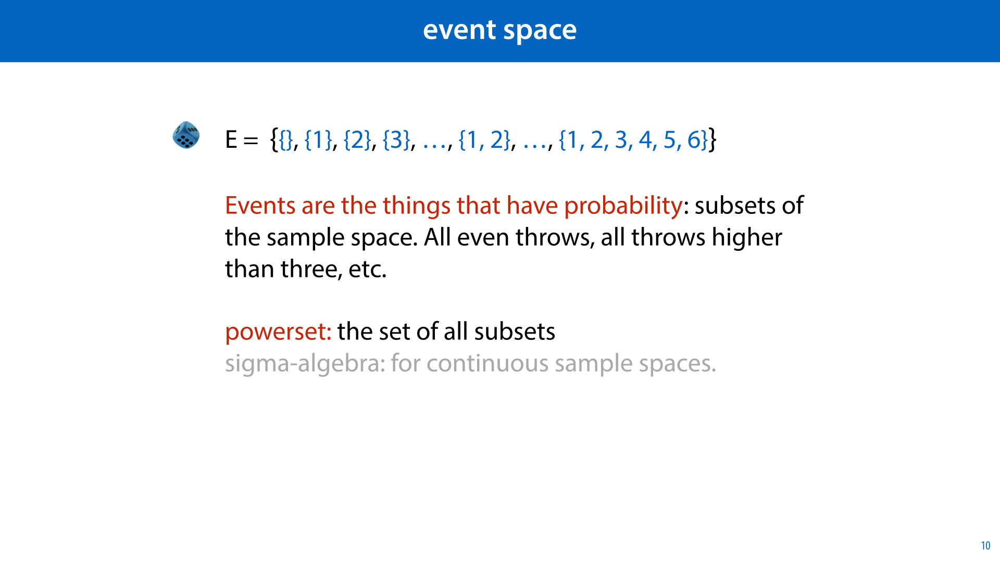

            <figcaption>
            
From the sample space, we construct the <strong>event space</strong>. Events are those things that can have probabilities. These include the elements of the sample space, like the probability of rolling a six with a die, but they also include sets of multiple elements of the sample space, like the event of "rolling  a one or a six" and the event of "rolling an even number". Even the empty set and the set of all six numbers are events. As we will see, these will get probabilities 0 and 1 respectively. 

The events containing only one element of the sample space, like "rolling a 1", are called <strong>atomic events</strong>. 

How the event space is constructed is a technical business. For our purposes, we can simply say that if the sample space is discrete then the event space is the powerset of the sample space: the set of all possible subsets we can make. 

For continuous sample spaces, not every subset can be an event. We need to make sure that our event space is a thing called a “sigma algebra.” We won’t need to worry about this in this course. We can simply trust that if we don't try to assign probability to any particularly unusual subsets of the sample space, everything will work: these will be in the sigma algebra, so they will be events, and we can assign a probability to them.

            </figcaption>
       </section>

       <section id="slide-011">
            <a class="slide-link" href="https://mlvu.github.io/lecture05#slide-011" title="Link to this slide.">link here</a>
            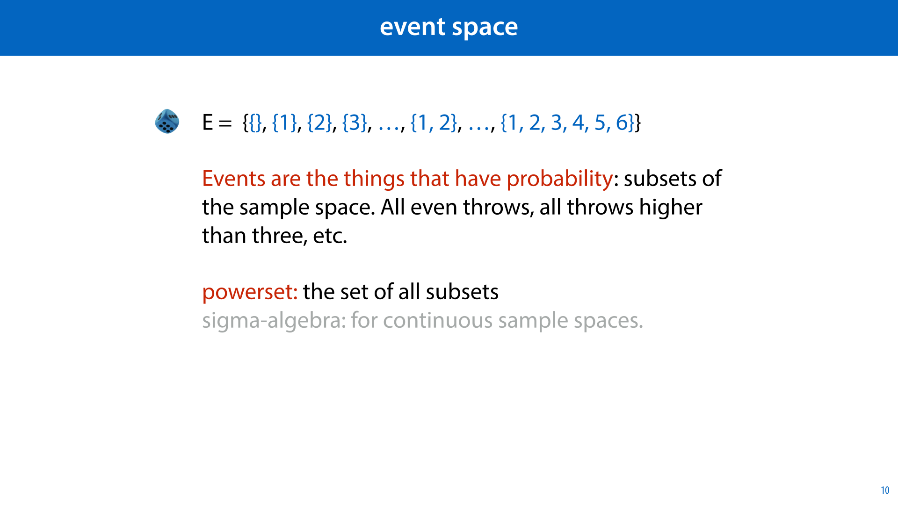

            <figcaption>
            
Random variables have a confusing and convoluted definition, so we’ll just give you the intuitive interpretation.  

<strong>Random variables</strong> help us to describe events. We can think of a random variable D as something that takes the values in the sample space, so that we can use it to describe events: instead of describing an event like "rolling a number larger than three" in natural language, we can describe it symbolically using the random variable D as "D &gt; 3". This usually makes our notation more concise and precise.  

We usually use capital, non-bold letters for random variables, and lowercase letters for traditional variables. A statement like "D=d" refers to the event that the random variable takes the value that the normal variable d currently represents. 

Once we have a way to describe the events we are interested in, we can assign a probability to each event. We do this  with a <strong>probability function p. </strong>This function must satisfy several constraints, but we’ll take those as read for now, and just say that it takes an event, and maps it to a value between 0 and 1 (inclusive). 

In probabilistic machine learning, it’s common to model features, target labels, and sometimes even model parameters as random variables. If we are referring to a dataset of multiple instances, we model each as a separate random variable with the same distribution. We'll see some examples later in this lecture. 

            </figcaption>
       </section>

       <section id="slide-012">
            <a class="slide-link" href="https://mlvu.github.io/lecture05#slide-012" title="Link to this slide.">link here</a>
            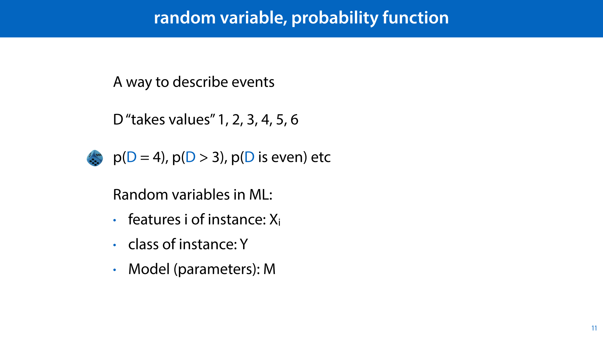

            <figcaption>
            
Interpreting what a statement including a probability function means depends on whether all variables are “filled in.”  

In the first line, X=0 refers to a single, well-defined event, so p(X=0) refers to a single value between 0 and 1. In the second line we have a classical variable x, so the statement “X=x” can refer to different events, depending on what x is. In other words, here “p(X=x)” is a function of x. For example, if x can take one of two values, -1 or 1, then the function p(X=x) has a range of only two values as shown here.  

Note that this is is not the <em>complete </em>probability function p, since that also assigns probabilities to events like "X=-1 or X=1" and the empty event.  

However, if X=-1 and X=1 are the only two members of the sample space, you can work out the complete probability function from the definition given here. 

            </figcaption>
       </section>

       <section id="slide-013">
            <a class="slide-link" href="https://mlvu.github.io/lecture05#slide-013" title="Link to this slide.">link here</a>
            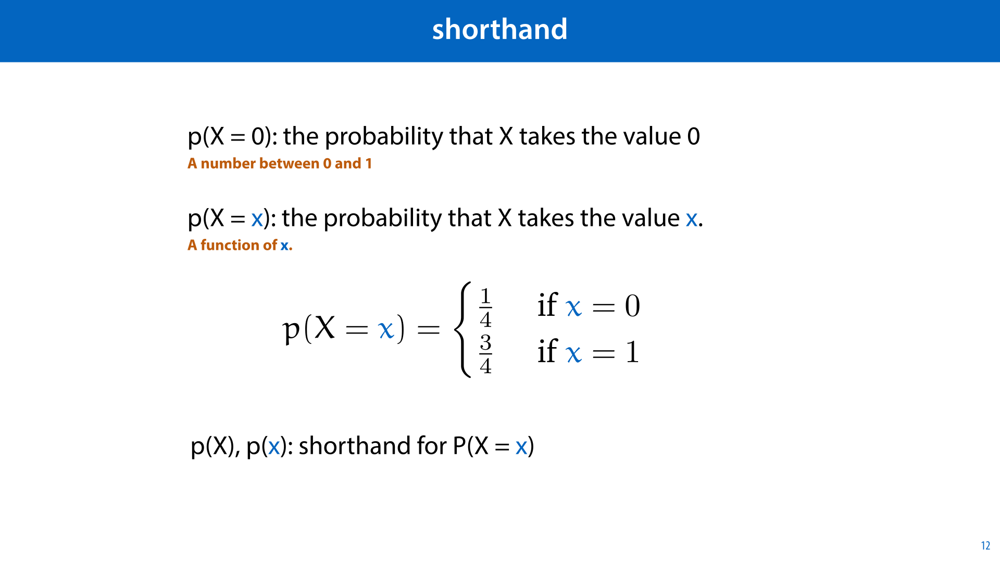

            <figcaption>
            
Since we usually know which outcomes belong to which random variables, p(X) and p(x) can both be used as shorthand for p(X=x). 

If we have a Boolean random variable, which takes values true or false, people often use a different shorthand, where p(X) represents the probability that X is true and p(¬X) represents the probability that it is false.  

All these conflicting shorthands may be a little confusing at times, but there is usually enough information in the context to figure out what the author means (and writing everything out in unambiguous notation usually leads to an unreadable mess).

            </figcaption>
       </section>

       <section id="slide-013" class="anim">
            <a class="slide-link" href="https://mlvu.github.io/lecture05#slide-014" title="Link to this slide.">link here</a>
            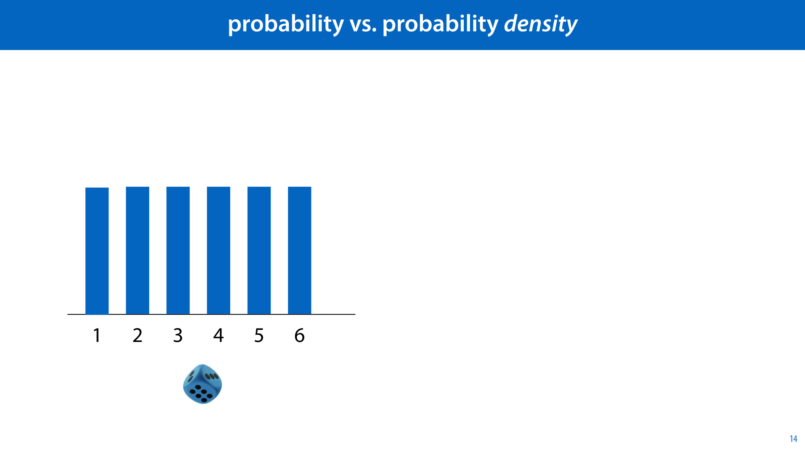

            <figcaption>
            
On both discrete and continuous sample spaces, <strong>the events we describe have probability</strong>. Where they differ, in an important way, is in whether a meaningful probability is assigned to the elements of the sample space. Here is how such probabilities are usually visualized: discrete on the left, continuous on the right. In both cases, we are look at the sample space. 

On the left, we are seeing the probabilities assigned to each element of the sample space. Using this, we can easily work out the probabilities of every event as well (just add up all the probabilities of all the atomic events in the event). 

However, when we look at a graph like the one on the right, describing a normal distribution, it’s important to realize that <strong>this function does not express a probability</strong>. If I ask you, under this distribution, which has the higher probability, 0 or 1, the answer is that <em>they both have probability 0</em>. This should make intuitive sense: What is the probability of meeting somebody who is exactly 2m tall? Surely, if you measure more and more precisely, the probability of getting <em>exactly</em> 2m goes further and further down. 

In short, when it comes to probability distributions on continuous spaces, the atomic events normally all have probability 0. The things that have nonzero probability are <em>ranges</em> of values. The probability of somebody being between 2.0m and 2.1m tall is more than 0, no matter how precisely you measure them.  

So what does this curve express? Not probability but probability <em>density</em>. The probabilities can be retrieved by integration. For instance, the probability of getting a sample between 0 and 1 from this distribution is equal to the area highlighted in the slide. The total area between -∞ and ∞ is exactly 1. 

These integrals can usually not be worked out analytically so we use numeric approximations. In the old days, you'd look these up in tables, but nowadays, we usually let the computer do it for us on the fly. 

            </figcaption>

            click image for animation
            
       </section>

       <section id="slide-015">
            <a class="slide-link" href="https://mlvu.github.io/lecture05#slide-015" title="Link to this slide.">link here</a>
            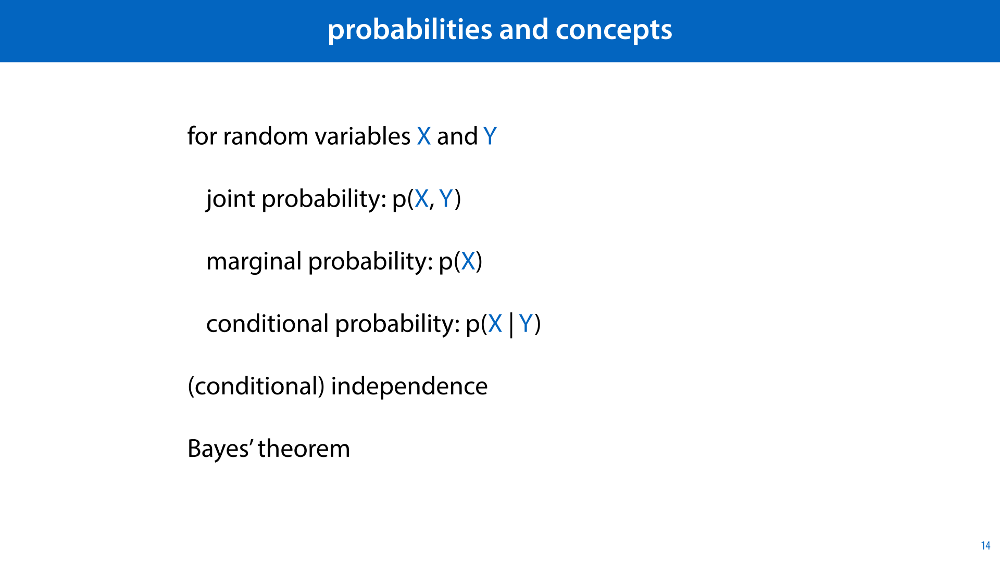

            <figcaption>
            
Now that we have the basic language of probability theory in place, we can look at some of the most important concepts. We will quickly review these five. 

Note that even though we have multiple random variables, we still have a <em>single</em> sample space and event space, and the random variables X and Y will help us describe the events that we’re interested in. Think of the <em>single</em> sample space for rolling <em>two</em> dice. You could use X for the result of the first die, and Y for the result of the second to describe events in this situation.

            </figcaption>
       </section>

       <section id="slide-016">
            <a class="slide-link" href="https://mlvu.github.io/lecture05#slide-016" title="Link to this slide.">link here</a>
            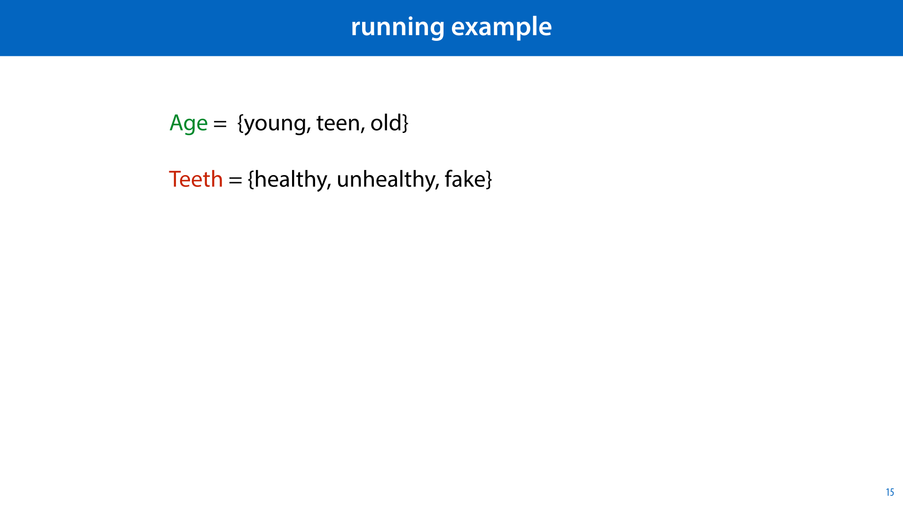

            <figcaption>
            
We will use the following running example: we sample a random person from the Dutch population and we check their age and the health of their teeth (binning the results into three categories for each variable). 

We want to ask questions like: 

what is the probability of seeing an old person? 

what is the probability that a young person has fake teeth? 

does a person’s age influence the health of their teeth, or is there no relation? 

The sample space is the set of the nine different pairs of values we can observe, and the event space is the powerset of that. The random variables Age and Teeth will help us describe these events.

            </figcaption>
       </section>

       <section id="slide-017">
            <a class="slide-link" href="https://mlvu.github.io/lecture05#slide-017" title="Link to this slide.">link here</a>
            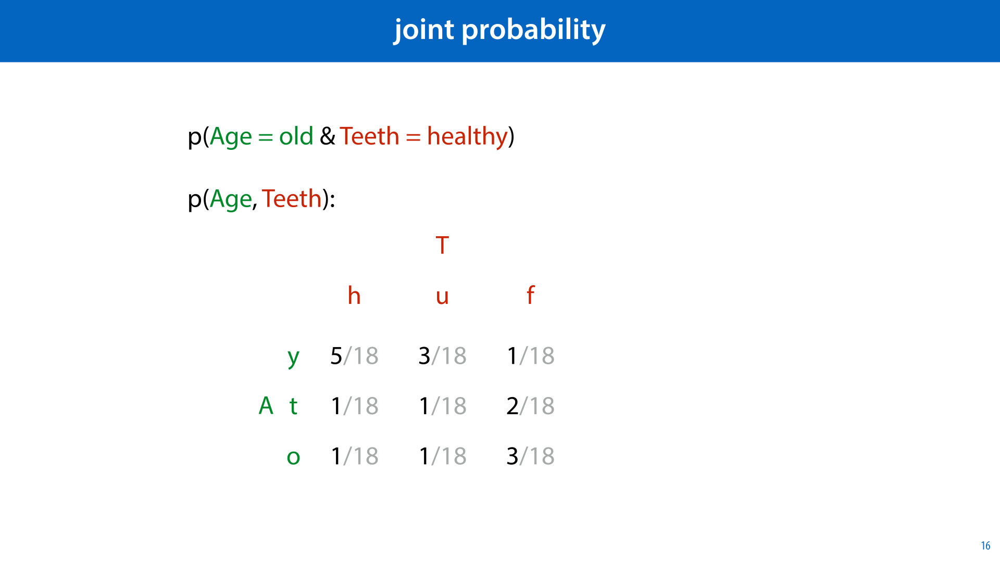

            <figcaption>
            
The joint distribution is the most important distribution. It tells us the probability of each <strong>atomic event</strong>: each event that contains a single element in our sample space.  

Since we have two random variables in our example, which together capture the whole sample space, we can specify the joint distribution in a small table. The probabilities of all these events sum to one. 

Note that p(Age = old &amp; Teeth = healthy) refers to a single value (1/18), because we have specified the event. p(Age, Teeth) does not refer to a single value, because the variables are not instantiated, it represents <em>a function of two variables, </em>i.e. the whole table.

            </figcaption>
       </section>

       <section id="slide-017" class="anim">
            <a class="slide-link" href="https://mlvu.github.io/lecture05#slide-018" title="Link to this slide.">link here</a>
            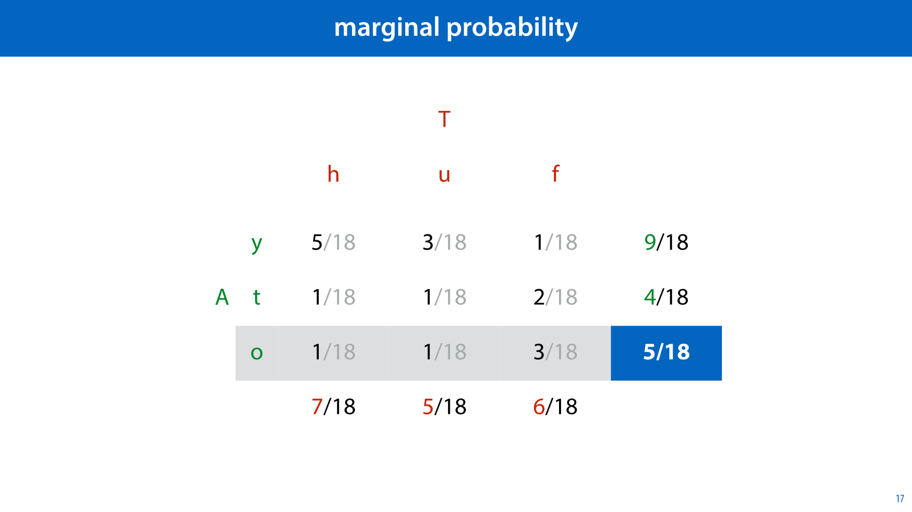

            <figcaption>
            
If we want to focus on just one random variable, all we need to do is sum over the rows or columns.  

For instance, the probability that Age=old, regardless of the value of Teeth, is the probability of the event {(o,h), (o,u), (o,f)}. Because we can write these sums in the <em>margins</em> of our joint probability table, this process of “getting rid” of a variable is also called <strong>maginalizing out</strong> (as in “we marginalize out the variable Teeth”). The resulting distribution over the remaining variable(s) is called a <strong>marginal distribution</strong>. 

            </figcaption>

            click image for animation
            
       </section>

       <section id="slide-018" class="anim">
            <a class="slide-link" href="https://mlvu.github.io/lecture05#slide-019" title="Link to this slide.">link here</a>
            

            <figcaption>
            
This is what marginalizing looks like in symbols: we sum the joint probabilities for all values of one of the random variables, keeping the value of the other fixed. 

Remember that p(X) and P(x) are both shorthand for p(X=x).

            </figcaption>

            click image for animation
            
       </section>

       <section id="slide-020">
            <a class="slide-link" href="https://mlvu.github.io/lecture05#slide-020" title="Link to this slide.">link here</a>
            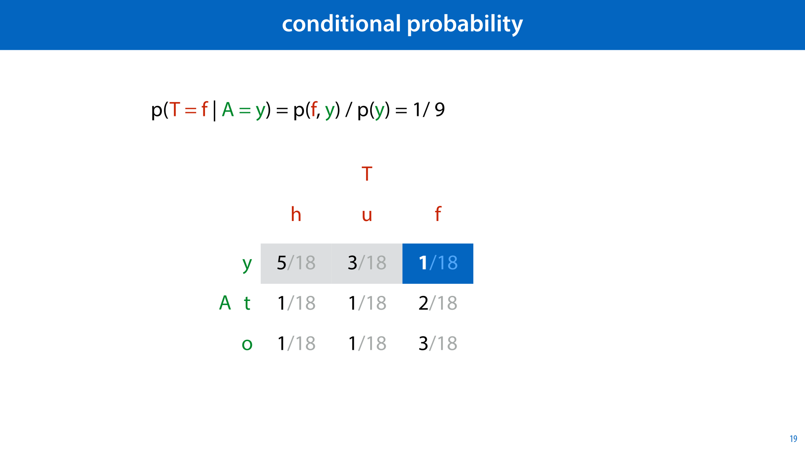

            <figcaption>
            
If we know that somebody is young, we know that the probability of them having false teeth must be much lower. This is called<strong> conditional probability</strong>, our knowledge of one random variable, given that some other variable takes some specific value. This is expressed with a vertical bar, with the known part, the <strong>conditional</strong> on the right. 

The conditional probability p(X=x|Y=y) is computed taking the joint probability of (x, y) and normalising by the sum of the probabilities in the row or column corresponding to the part that’s given in the conditional. 

Imagine we’re throwing darts at this table, and the probability of hitting a certain cell is the joint probability indicated in the cell. The conditional probability p(T=f|A=y) is the probability that the dart hits the (y, f) cell, given that it’s hit the y row. 

Note that  a statement about conditional probability tells us nothing about <strong>causality</strong>. In our example age causes bad teeth, but het can express both the probability that somebody has bad teeth given that they are old (in the causal direction), and the probability that somebody is old given that they have bad teeth (in the opposite direction).

            </figcaption>
       </section>

       <section id="slide-020" class="anim">
            <a class="slide-link" href="https://mlvu.github.io/lecture05#slide-021" title="Link to this slide.">link here</a>
            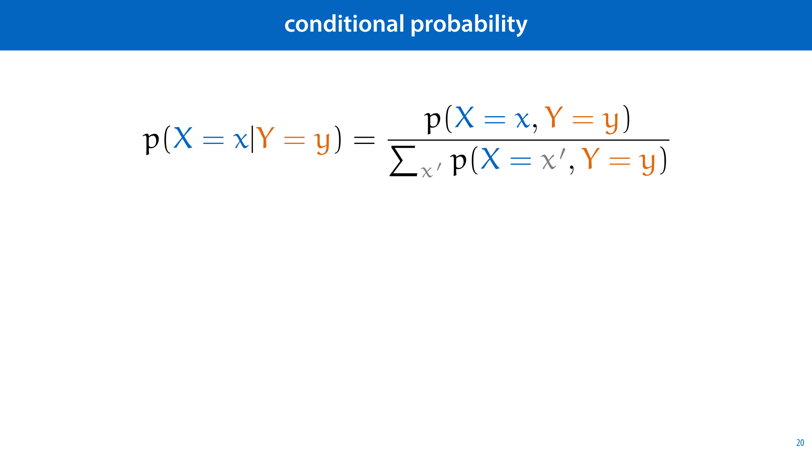

            <figcaption>
            
Here is what conditional probability looks like in abstract, symbolic terms. Note that the denominator is just the marginal probability

            </figcaption>

            click image for animation
            
       </section>

       <section id="slide-022">
            <a class="slide-link" href="https://mlvu.github.io/lecture05#slide-022" title="Link to this slide.">link here</a>
            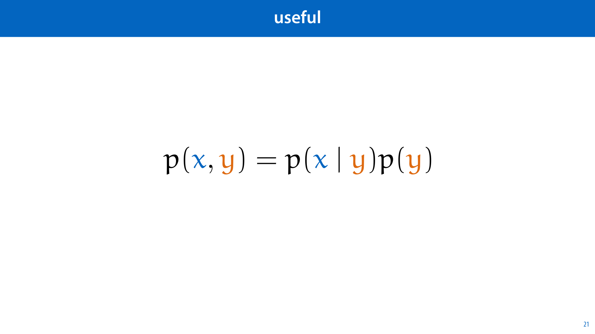

            <figcaption>
            
If we re-arrange the factors in the definition of the conditional probabilty, we get this equation, showing a kind of <em>decomposition</em> of the joint probability. This comes up <strong>a lot</strong>, so make a note of it. 

For a specific example, the probability of seeing an old person with false teeth, is the probability that an old would have false teeth, times the probability of seeing a old person at all. The probability that an old person has false teeth may be very high, but if the probability of seeing an old person is very small, there's still a very small probability of seeing an old person with false teeth. 

Note that the same decomposition works with the reverse conditional, the probability that someone with false teeth would be old. Try it. 

            </figcaption>
       </section>

       <section id="slide-023">
            <a class="slide-link" href="https://mlvu.github.io/lecture05#slide-023" title="Link to this slide.">link here</a>
            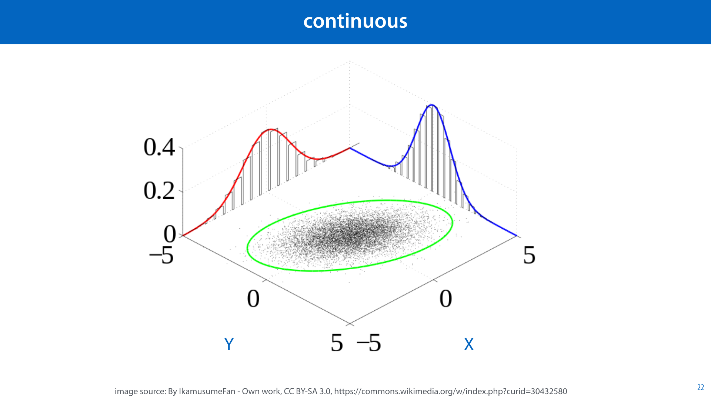

            <figcaption>
            
Here is what these concepts look like with <em>continuous </em>random variables (a bivariate normal distribution in this case). The joint probability distribution is represented by the point cloud in the middle. These are the values of X and Y that are likely. 

<strong>Marginalizing </strong>out either variable results in a univariate normal (the red and blue distributions), the projection of the multivariate distribution onto the X and Y axes. 

The<strong> conditional distribution </strong>corresponds to a vertical or horizontal <em>slice </em>through the joint distribution (and also results in a univariate normal). 

image source: By IkamusumeFan - Own work, CC BY-SA 3.0, <a href="https://commons.wikimedia.org/w/index.php?curid=30432580"><strong class="blue">https://commons.wikimedia.org/w/index.php?curid=30432580</strong></a> 

            </figcaption>
       </section>

       <section id="slide-024">
            <a class="slide-link" href="https://mlvu.github.io/lecture05#slide-024" title="Link to this slide.">link here</a>
            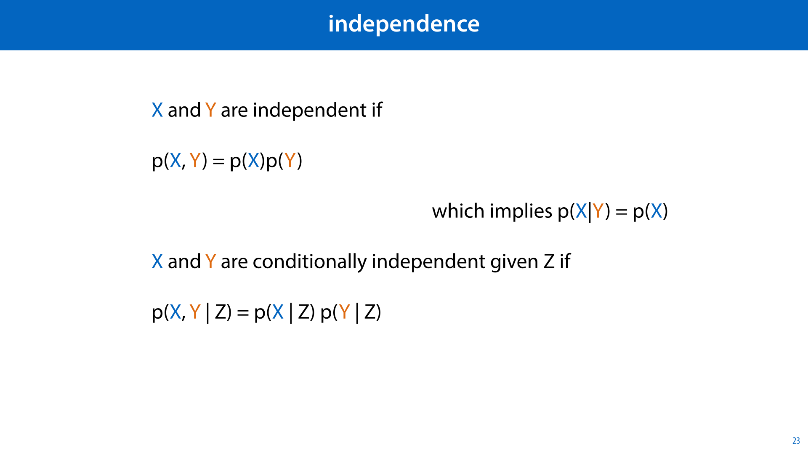

            <figcaption>
            
If two variables X and Y are <strong>independent</strong>, then knowing Y will not change what we know about X. More formally, the conditional distribution p(X|Y) is the same as the distribution P(X): knowing the value of Y doesn't affect our knowledge of the value of X.  

If we fill in the definition of conditional probability and re-arrange the factors, we see that this implies that the joint probability of X and Y is just the product of the marginal probabilities p(X) and p(Y). Have a look at the joint probability of the age/teeth example. Are these independent random variables? What would it mean for the example if they were? 

<strong>Conditional independence </strong>means that the two variables<em> can</em> be<em> </em>dependent, but their dependence is entirely explained by a third variable Z. If we condition on Z, the variables become dependent.

            </figcaption>
       </section>

       <section id="slide-025">
            <a class="slide-link" href="https://mlvu.github.io/lecture05#slide-025" title="Link to this slide.">link here</a>
            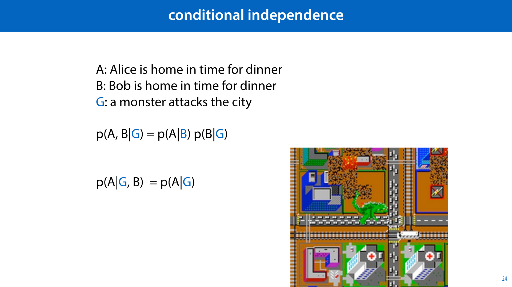

            <figcaption>
            
Conditional independence comes up a lot, and it can be tricky to wrap your head around at first, so here’s an example. 

Imagine two people who work in different areas of a very big city. In principle, they work so far apart that whether or not they arrive home in time for dinner is completely independent. Knowing whether or not Alice is late for dinner tells you nothing about whether Bob is home in time for dinner. No aspect of their lives (weather, traffic) intersect in a meaningful way, except one.  

Very rarely, a large monster attacks the city. In that case, all traffic shuts down and everybody is late for dinner. That means that if we know that Bob is late for dinner, there is a slight chance that it’s because of the monster, which should slightly raise the possibility that Alice is late for dinner. However, once we know whether or not the monster has attacked, knowing that Bob is late provides no additional information. 

            </figcaption>
       </section>

       <section id="slide-026">
            <a class="slide-link" href="https://mlvu.github.io/lecture05#slide-026" title="Link to this slide.">link here</a>
            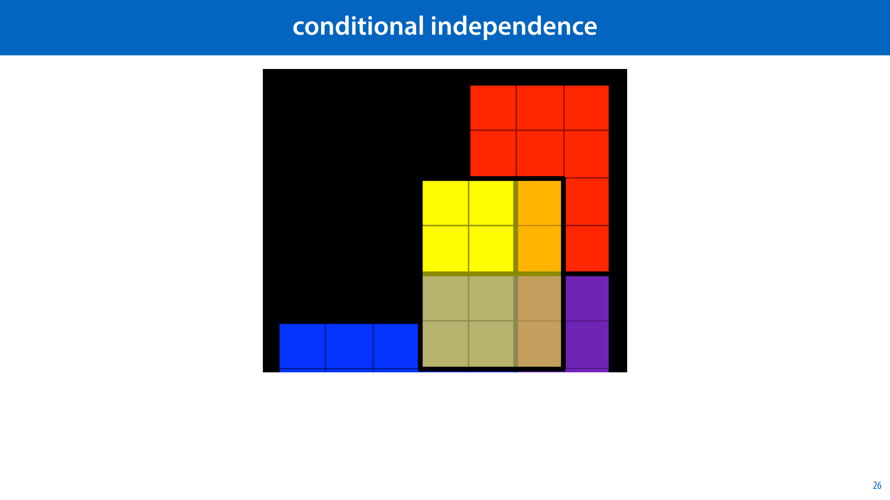

            <figcaption>
            
Here is another visualization, taken from Wikipedia. This one is more abstract, but sometimes, sitting down with an abstract example and trying to work through it can help a lot to train your brain to get used to complex concepts. <em>If you're in a hurry, you can skip this one.</em> 

Imagine throwing a dart at the square on the right. We look at the probability of hitting a yellow, red or blue square (the purple ones are both red and blue). Describe these events by boolean random variables Y, R and B. 

We have p(R) = 16/49 and p(B) = 18/49.  These probabilities are <strong>not independent</strong>. We can work this out by counting all the squares for the event (R, B) (R, ¬B), (¬R, B) and (¬R, ¬B) and seeing if they are the product of the marginal probabilities, but we can also tell directly by looking at the picture: if we know that we've hit a blue square, there is a certain probability that that blue square is purple (i.e. also a red square). If we know that we haven't hit a blue square, there is also a certain probability that that square is red. The proportion of red inside the blue region looks different to the proportion of reds inside the non-blue region, so knowing whether we are in a blue square tells us something about how likely we are to be in a red square. 

Now, let's condition on Y. Somebody tells us the dart landed in a yellow square. Now that we know this, does knowing whether the square is blue still tell us anything about whether the square is also red? <strong>Note that within the yellow block, the proportion of red within the blues is the same as the proportion of reds within the non-blues. </strong>Once we're inside the yellow block, it doesn't matter anymore whether the block is blue. The probability of red is the same either way. Conditional on the knowledge that Y=true, the probabilities of red and blue are independent. 

What about when we hear that the dart has landed outside the yellow block? It's harder to see, but the proportions are 4/12 for the blue blocks and 8/25 for the nonblue. Thus the probabilities of blue and red are<strong> not conditionally independent given that </strong><strong class="orange">Y=false</strong>. 

By AzaToth at English Wikipedia, CC BY-SA 3.0, <a href="https://commons.wikimedia.org/w/index.php?curid=3206668"><strong class="blue">https://commons.wikimedia.org/w/index.php?curid=3206668</strong></a>

<a href="https://commons.wikimedia.org/w/index.php?curid=3206668"><strong class="blue"></strong></a>

            </figcaption>
       </section>

       <section id="slide-027">
            <a class="slide-link" href="https://mlvu.github.io/lecture05#slide-027" title="Link to this slide.">link here</a>
            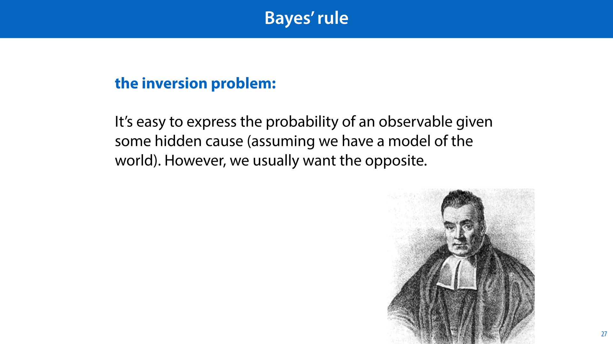

            <figcaption>
            
Now that we have a decent understanding of conditional probability, let's look at Bayes' rule, probably the most important application of conditional probabilities. 

Bayes' rule is a solution to the inversion problem. What usually happens is that we have some idea of the mechanics of the world, and we observe some outcome, that could have happened through these mechanics in different ways. We didn't observe how it happened: that's the part that is hidden, and the part that we'd like to reason about. It's usually easy to reason about the probabilities of the outcomes given the observables (because we know the mechanics of the world) but we'd like to reverse this. 

For example imagine that you call a restaurant to book a table, and nobody picks up. This is unusual, and you wonder if it means the restaurant has burned down. You can easily reason <strong>forward</strong>, from the cause to the effect. If the restaurant has burned down, you would be sure that nobody would pick up the phone. If it hasn't, you would be quite sure that somebody would pick up the phone, but not certain. This is how you would reason if you <em>observed</em> whether or not the restaurant burned down and had to guess whether or not the phone would be answer. You are reasoning in the causal direction, so you use your understanding of the mechanics of the world to arrive at an intuitive conclusion. 

The problem is that we usually want to do <strong>backward</strong> reasoning. We observe the <em>outcome</em> of some event and we don't observe the <em>cause</em>. What we want to figure out is how to assign probabilities to the different causes. In this case, given that we observe nobody answering the phone, what is the probability that the restaurant has burned down? 

In short, we need a way to “turn around” the conditional probability. If we know p(X|Y), how do we work out p(Y|X)?

            </figcaption>
       </section>

       <section id="slide-028">
            <a class="slide-link" href="https://mlvu.github.io/lecture05#slide-028" title="Link to this slide.">link here</a>
            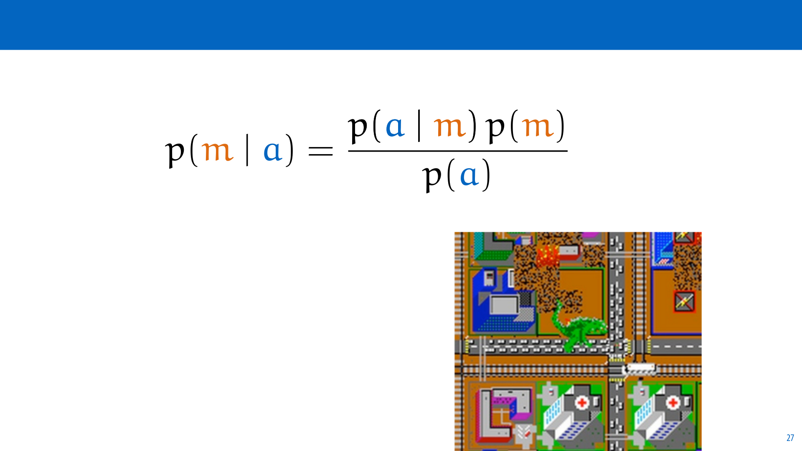

            <figcaption>
            
To do this, we need some additional probabilities. This makes sense if you think about our example. If the restaurant has burned down, we are sure that the phone won't be answered, but if we observe that the phone wasn't answered, we can't be sure that the restaurant has burned down. We need to take into account the fact that it's very rare for a restaurant to burn down, even though it would definitely lead to this observation. We also need to take into account the probability that something else has caused the restaurant to burn down.  

If the cause and effect are labeled Y and X, then the marginal probabilities p(Y) and p(X) capture all this information.  

This equation is the way Bayes' rule is usually written. You can prove that this is true very simply by starting with the definition of conditional probability and using the equation in slide 22 to rewrite the numerator.

            </figcaption>
       </section>

       <section id="slide-029">
            <a class="slide-link" href="https://mlvu.github.io/lecture05#slide-029" title="Link to this slide.">link here</a>
            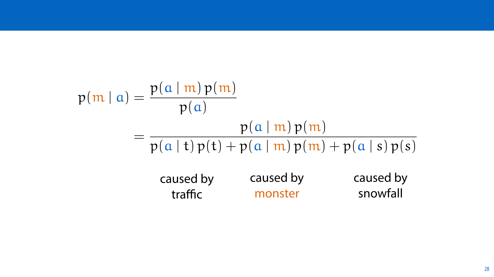

            <figcaption>
            

            </figcaption>
       </section>

       <section id="slide-030">
            <a class="slide-link" href="https://mlvu.github.io/lecture05#slide-030" title="Link to this slide.">link here</a>
            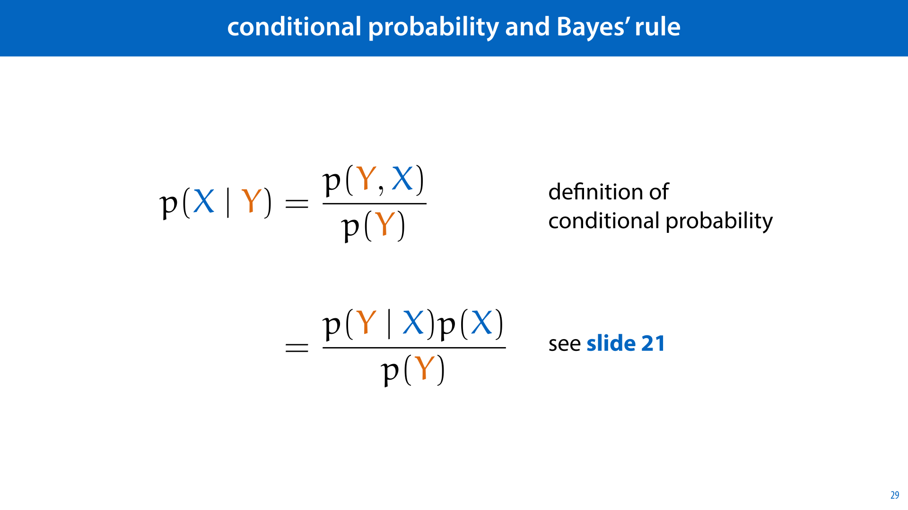

            <figcaption>
            
To build an intuitive understanding of why this formula works, let's return to the example of the monster attack. We'll focus on Alice only, and forget about Bob.  

Let’s say that we observe that Alice is late for dinner (and we observe nothing else). Does this tell us anything about whether a monster has attacked the city? It doesn’t tell us much; it’s extremely rare that a monster attacks the city so it’s almost certain that Alice is late for other reasons. Still, if Alice were on time, we’d know that a monster couldn’t. have attacked the city, since that would certainly make her late. So we may not know much, but we know something. 

In this case it’s easy for us to work out the probability that Alice is late given the monster attack. This is because the conditional is the cause of the observable. The opposite is usually what we are interested in, since we have the observable and want to reason about its cause. This is where Bayes’ rule comes in. 

Say that we know the probability that we observe Alice being late, given that a monster attack happened, p(a | m), is somewhere near 1. Bayes’ rule tells us how to use this to calculate the opposite conditional p(m | a). This is<em> not</em> near 1, because we multiply it by the marginal probability of a monster attack p(m), which is really low. We then divide by the probability of Alice being late in general p(a): the more likely Alice is to be late due to other causes, the lower the probability that it is caused by a monster attack. 

 

            </figcaption>
       </section>

       <section id="slide-031">
            <a class="slide-link" href="https://mlvu.github.io/lecture05#slide-031" title="Link to this slide.">link here</a>
            

            <figcaption>
            
If there are three possible reasons for Alice to be late: traffic, monster or snowfall. Then we can see the denominator as a sum marginalizing out the cause for Alice’s lateness. The proportion of this sum  given by the middle term is the probability that Alice’s lateness is caused by a monster attack. 

Consider the situation where both traffic and snowfall are far more likely than a monster attack, so p(t) and p(s) are much higher than p(m), but neither traffic nor snowfall ever cause Alice to be late, perhaps  because she cycles home from work, and has a bike with good snow tires. In that case both the first and last term in the sum become zero, and despite the fact that monster attacks are really rare, we can still conclude that a monster has attacked if we notice that Alice is late for dinner.

            </figcaption>
       </section>

       <section id="slide-031" class="anim">
            <a class="slide-link" href="https://mlvu.github.io/lecture05#slide-032" title="Link to this slide.">link here</a>
            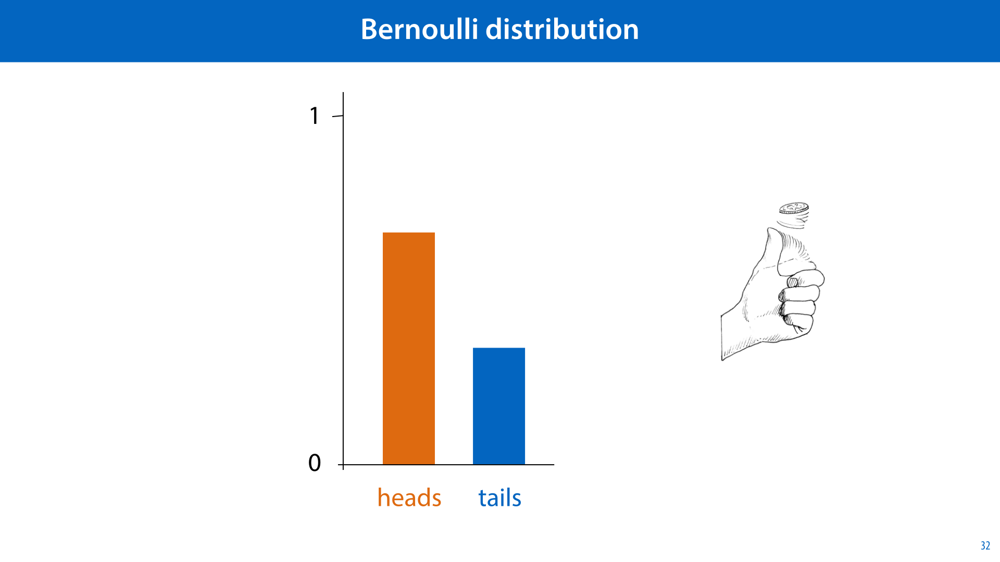

            <figcaption>
            
To finish up, we'll look at some of the most common probability distributions we'll see throughout the course. Most of these you should know already, but we'll summarize them here briefly for the sake of completeness. 

The simplest is probably the Bernoulli distribution. It's any a distribution with two outcomes. You can think of it as modelling the outcome of a coin flip with a (possibly) bent coin, but the outcome could also be true/false, guilty/innocent or positive/negative. 

Every distribution like this, with its probabilties set to some pair of values summing to 1 is <em>a</em> Bernoulli distribution. To specify which Bernoulli distribution we are talking about we specify one of the probabilities by a number. The other probability is then also defined, since they must sum to one.  

The numbers we use to specify which specific distribution we are talking about in a family like the Bernoulli distributions, are called the <strong>parameters</strong>, and often indicated by the greek letter theta, θ.You can think of θ as a set of vector of numbers. In the case of the Bernoulli distribution theta is just a single number. 

            </figcaption>

            click image for animation
            
       </section>

       <section id="slide-033">
            <a class="slide-link" href="https://mlvu.github.io/lecture05#slide-033" title="Link to this slide.">link here</a>
            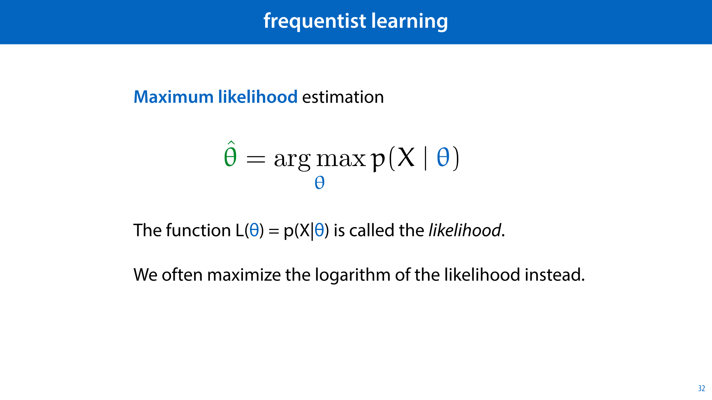

            <figcaption>
            
If we have more than two outcomes, but still a finite number, we can assign each a separate probability so that they sum to one. For instance, if we want to model the outcome of rolling a loaded die, it might look like this. This is called a <strong>categorical distribution</strong>. Other examples are modeling which team will win the next world cup, which child in a classroom will score the highest on a test, or what the hair color of a random person from Ireland is.  

To specify a categorical distribution with n outcomes we strictly need only n-1 probabilities. We can work out the n-th probability from the knowledge that all probabilities sum to one. However, this is usually more trouble than it's worth, and instead we tend to represent categorical distributions by the slightly redundant complete set of n probabilities.

            </figcaption>
       </section>

       <section id="slide-033" class="anim">
            <a class="slide-link" href="https://mlvu.github.io/lecture05#slide-034" title="Link to this slide.">link here</a>
            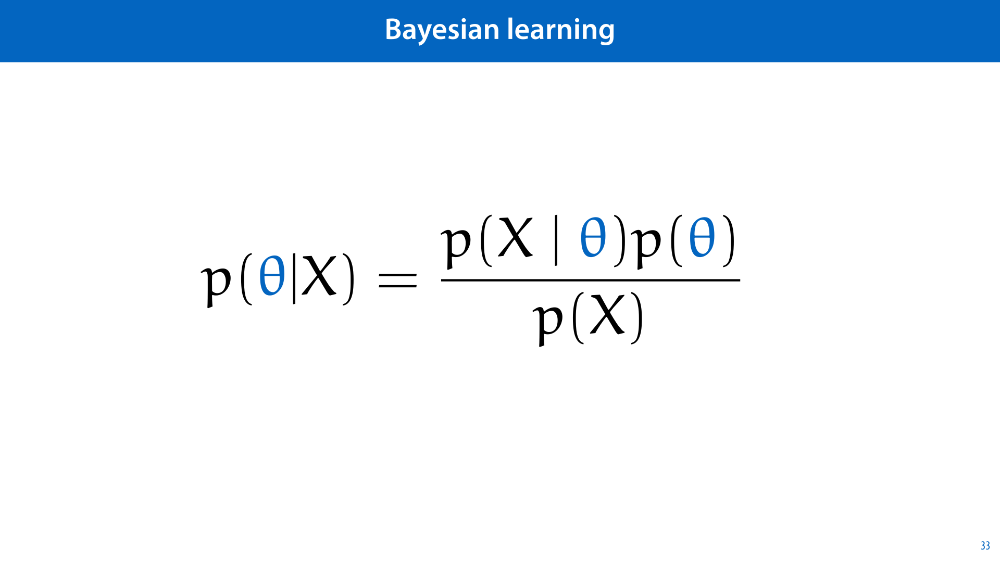

            <figcaption>
            
The <strong>normal distribution</strong> or<strong> Gaussian</strong> is probably the most common distribution on a continuous sample space. It is defined by this complex looking function. Don't worry about the formula too much now, we'll dig into that later. For now just remember that the curve it describes is the probability <em>density</em>. 

Its parameters are the mean μ, which tells us where the peak is, and the variance σ2 or standard deviation σ, which tells us how widely spread out the normal distribution is.  

The<em> standard</em><strong> normal distribution</strong> is the specific distribution with mean 0 and variance/standard deviation 1. 

The normal distribution is particularly useful for anything that has a <em>definite scale</em>. Consider, for instance height: people have all kinds of different heights, but if we get far enough away from the average, the probability gets so low it may as well be zero. We can say with near certainty that there are no 4 meter tall people and no 10cm tall people. If there were a hundred times as many people, that would still be true. 

An example of an attribute that doesn't have such a definite scale is income. In a small population there may be millionaires but no billionaires, but if we zoom out to the population of a small country, we will see billionaires appear. In a large country will we see people with fortunes in the order of 10 billion dollars and in the whole world we will see fortunes of 100 billion dollars. In short, the largest grows exponentially with the population size.  

In such cases, as we've seen, the normal distribution is not a good choice. We won't discuss them in this course, but so called fat-tailed distributions like the log-normal, Zipf or power law distributions may be more suitable.

            </figcaption>

            click image for animation
            
       </section>

       <section id="slide-035">
            <a class="slide-link" href="https://mlvu.github.io/lecture05#slide-035" title="Link to this slide.">link here</a>
            

            <figcaption>
            
If our sample space consists of multiple numbers, for instance when we have a dataset with multiple features, we can draw this as an n-dimensional Euclidean space, like the plane shown here. A distribution over such a space can be defined by a probability density function over it, which, in the 2D case looks like a surface over the plane. 

The <strong>multivariate normal distribution</strong><em> </em>is an extension of the normal distribution to multiple dimensions. It takes the shape of a kind of bell over our sample space. For higher dimensions it's harder to visualize, just think of an ellipsoidal region in space taking most of the probability mass, with the probability density decaying quickly in all directions. 

Again, don't worry too much about the complicated formula for the probability density. We'll see where that comes from and what all the parts mean later. 

Its parameters are the mean <strong class="orange">μ</strong>, a vector which provides the center, and the covariance matrix <strong class="blue">Σ</strong>, which tells us how much the probability decays in each direction.  

            </figcaption>
       </section>

       <section id="slide-035" class="anim">
            <a class="slide-link" href="https://mlvu.github.io/lecture05#slide-036" title="Link to this slide.">link here</a>
            

            <figcaption>
            
Here is an illustration of the way the covariance matrix affects the data we get from a multivariate normal distribution. The mean is at (0, 0) in all four examples.  

If the covariance is the identity matrix, we get the standard normal distribution. This is called a spherical distribution, because the variance along all axes is the same, and there is no correlation between axes, giving the data roughly spherical shape.  

More precisely the lines of equal probability density are circles in 2D and spherical surfaces in higher dimensions. 

If we change the values on the diagonal, we stretch this sphere into an ellipse, but only along the axes. There is still no correlation: knowing the value along one axis tells us nothing about the value along the others.  

If we change the off-diagonal values to positive values we get <strong>correlation</strong>. In this case having a high value along one axis makes it more likely that the value along the other axis is also high. Note that the coviarance matrix needs to be symmetric, so the value on one side of the diagonal must be the same as the value on the other side. 

If the off-diagonal value is negative, we get <strong>anti-correlation</strong>. A high positive value on one axis most likely corresponds to a high negative value along the other axis. 

If we have more than 2 dimensions, say n, then there are (n^2 - n)/2 possible pairs of axes between which we can define a correlation. This corresponds exactly to the number of values above the diagonal in an n x n matrix.

            </figcaption>

            click image for animation
            
       </section>

       <section class="video" id="video-036">
           <a class="slide-link" href="https://mlvu.github.io/lecture05#video-36">link here</a>
           <iframe
                src="https://www.youtube.com/embed/IubHHpzM32Y?modestbranding=1&showinfo=0&rel=0"
                title="YouTube video player"
                frameborder="0" allow="accelerometer; autoplay; clipboard-write; encrypted-media; gyroscope; picture-in-picture"
                allowfullscreen>
           </iframe>

       </section>

       <section id="slide-037">
            <a class="slide-link" href="https://mlvu.github.io/lecture05#slide-037" title="Link to this slide.">link here</a>
            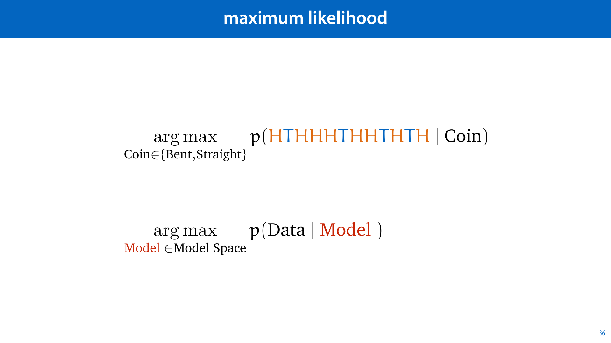

            <figcaption>
            
In this video we'll start to connect probability theory with machine learning. We will first focus on <em>model selection</em>. We will not yet worry about abstract tasks like classification or regression, we will simply look a the case where we see some data, and we use probability theory to select a <em>model</em> for that data. In the next video, we will see how this translates to the abstract tasks we already know. 

<lnbr></lnbr>

            </figcaption>
       </section>

       <section id="slide-037" class="anim">
            <a class="slide-link" href="https://mlvu.github.io/lecture05#slide-038" title="Link to this slide.">link here</a>
            

            <figcaption>
            
Here is an analogy for the way probability is usually applied in statistics and machine learning. We assume some “machine” (which could be any process, the universe, or an actual machine) has <em>generated</em> our data, by a process that is partly deterministic and partly random. The configuration of this machine is determined by its <strong>parameters </strong>(theta). Theta could be a single number, several numbers or even a complicated data structure. 

We know how the machine works, so if we know theta, we know the probability of each dataset. The problem is that we only observe the data. 

In practice, the "machine" takes the form of a probability distribution, and the configuration of the machine is determined by its parameters θ.

            </figcaption>

            click image for animation
            
       </section>

       <section id="slide-039">
            <a class="slide-link" href="https://mlvu.github.io/lecture05#slide-039" title="Link to this slide.">link here</a>
            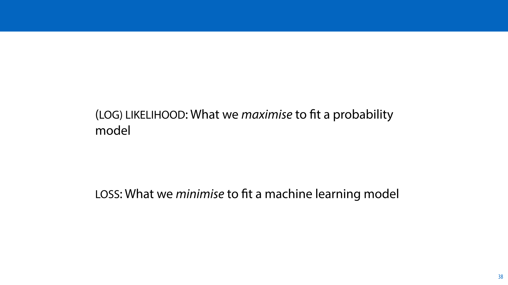

            <figcaption>
            
In <strong>frequentist learning</strong>, we are given some data and our job is to guess the true model (out of a model class) that generated some data. In other words, pick the right parameters θ so that the probability distribution fits the data well. 

In the frequentist view of the world, the true model is not subject to probability. Which model generated the data doesn’t change if we repeat the experiment, so we shouldn’t apply probability to it. We just try to guess which one it is. We won;t be exactly right, but we can hopefully get close. This is typical of frequentist approaches: we build algorithms that gives us a <strong>point estimate</strong> for our model parameters. That is , they return <em>one </em>point in our model space. One guess for θ. 

One of the most common criterion is that we should guess the model for which the probability of seeing the data that we saw is highest. This is called the<em> </em><strong>maximum likelihood principle</strong>. Under the maximum likelihood principle, picking a model becomes an optimization problem. 

            </figcaption>
       </section>

       <section id="slide-040">
            <a class="slide-link" href="https://mlvu.github.io/lecture05#slide-040" title="Link to this slide.">link here</a>
            

            <figcaption>
            
To explain both maximum likelihood fitting, let’s look at a simple example. We have two coins, a bent one and a straight one. Flipping these coins gives us different probabilities of heads and tails.  

We ask a friend to pick a random coin once without showing us, and to flip it twelve times. The resulting sequence has more heads than tails, but not such a disparity that you would never expect it from a fair coin. If we had to guess which coin our friend had picked, which should we guess? 

image source: <a href="https://www.magictricks.com/bent.html"><strong class="blue">https://www.magictricks.com/bent.html</strong></a> 

            </figcaption>
       </section>

       <section id="slide-041">
            <a class="slide-link" href="https://mlvu.github.io/lecture05#slide-041" title="Link to this slide.">link here</a>
            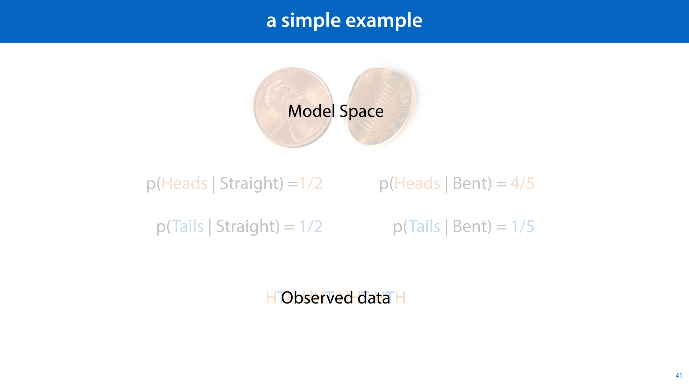

            <figcaption>
            
This is a simple version of a <strong>model selection</strong> problem. Our model class consists of two models (the two coins) and our data consists of 12 instances (the results of the coin flips). 

In more technical terms, the coins are Bernoulli distributions with parameter 1/2 and  and 4/5 respetively. We could also look at the model space of all Bernoulli distributions, but to simplify matters we are looking at just these two. 

Under the frequentist view, we cannot assign probability to which coin produced this specific data, we can only provide a best guess which coin we consider most likely.

            </figcaption>
       </section>

       <section id="slide-042">
            <a class="slide-link" href="https://mlvu.github.io/lecture05#slide-042" title="Link to this slide.">link here</a>
            

            <figcaption>
            
The maximum likelihood principle tells us to pick the coin for which the likelihood is the greatest. There are other principles (called <em>estimators</em>), but the maximum likelihood is usually the first thing to try. We simply compute, for both coins, the probability of the data that we saw given the coin. The coin that gives us the highest value is the coin we choose.

            </figcaption>
       </section>

       <section id="slide-043">
            <a class="slide-link" href="https://mlvu.github.io/lecture05#slide-043" title="Link to this slide.">link here</a>
            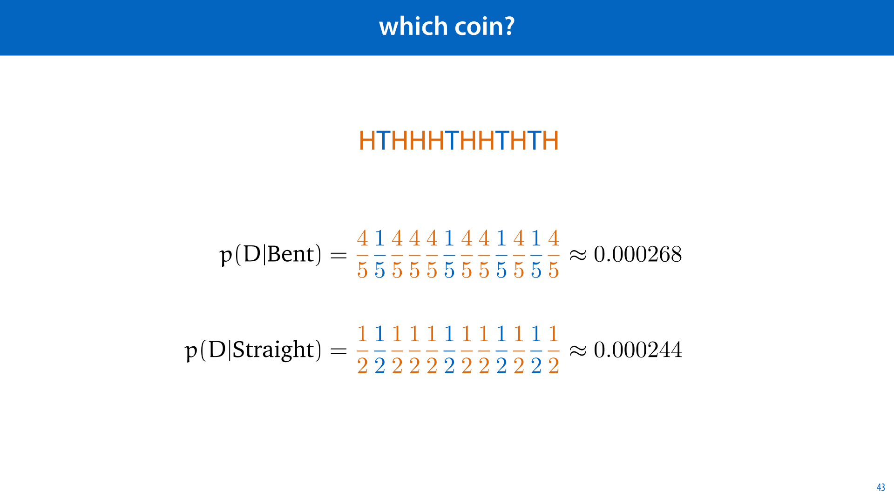

            <figcaption>
            
Since the coin flips are independent, the probability over the whole sequence is just the product over the probabilities of the individual flips. There’s not much in it, but the likelihood for the <em>bent </em>coin is slightly higher, so that’s the preferred model under the maximum likelihood criterion.

            </figcaption>
       </section>

       <section id="slide-044">
            <a class="slide-link" href="https://mlvu.github.io/lecture05#slide-044" title="Link to this slide.">link here</a>
            

            <figcaption>
            
When we do this kind of computation, we often take the logarithm of the likelihood, instead of the plain likelihood. The logarithm is a monotonic function (it gets bigger if the input gets bigger) so the likelihood and the log-likelihood have their maxima in the same place, but the log-likelihood is often easier to manipulate symbolically (see the first homework exercise). It can also provide a smoother loss landscape for methods like gradient descent. 

The log-likelihood of a probability distribution is a lot like the loss functions we’ve already encountered many times. 

In fact, if we want to fit a probability distribution with a gradient based method, we usually take the <em>negative</em> log-likelihood, so that we can do gradient <em>descent</em> to find the optimum.  

We could also use gradient ascent on the log-likelihood, but it's nice to keep the convention that you always minimize functions, and as we will see at the end of the lecture, the negative logarithm of a probability actually has a very natural interpretation.

            </figcaption>
       </section>

       <section id="slide-045">
            <a class="slide-link" href="https://mlvu.github.io/lecture05#slide-045" title="Link to this slide.">link here</a>
            

            <figcaption>
            
As a second example of maximum likelihood, let's look at the univariate (i.e. 1D) normal distribution. This is defined by a complicated probability density function, which we don't fully understand yet. What we want to show here is how much of this complexity disappear just by taking the logarithm. 

The probability density of our whole data, given some mean and standard deviation, is simply the product of all individual probability densities. This follows from the assumption that instance data is independently drawn from the same distribution.   

            </figcaption>
       </section>

       <section id="slide-045" class="anim">
            <a class="slide-link" href="https://mlvu.github.io/lecture05#slide-046" title="Link to this slide.">link here</a>
            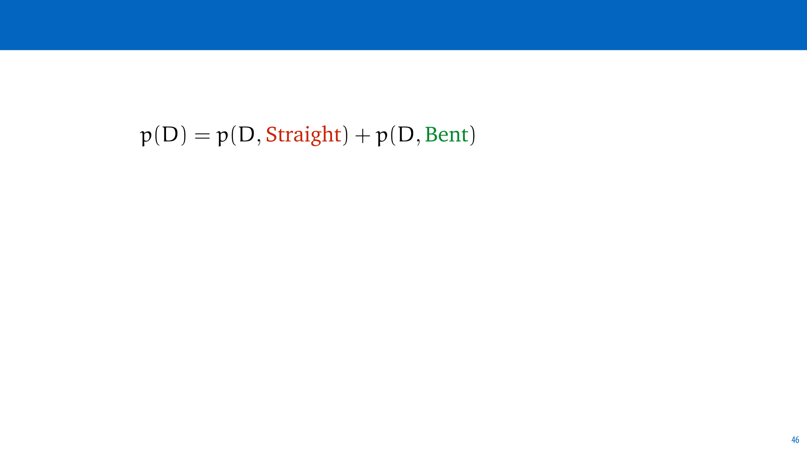

            <figcaption>
            
We assume that X is a list of single numbers. We want to find the parameters that maximize the log probability density of this data given the parameters. The probability density of the whole dataset is simply the product of the individual probability densities, if we assume that the data was independently drawn from the same distribution. 

Since there's a factor factor raised to the power of e inside this function, we'll use the natural logarithm (base e). With a bit of luck, these will cancel out. 

We can turn this product into a sum by moving the logarithm inside. <em>This is explained in detail in the first homework.</em> 

We fill in the definition of the actual probability density function we’re using (line 3). This function is the product of two factors (the division and the exponent). Both of these become terms if we work them out of the logarithm. In the second term the exponent cancels against the logarithm. Already the function we are maximizing looks a lot simpler. 

            </figcaption>

            click image for animation
            
       </section>

       <section id="slide-047">
            <a class="slide-link" href="https://mlvu.github.io/lecture05#slide-047" title="Link to this slide.">link here</a>
            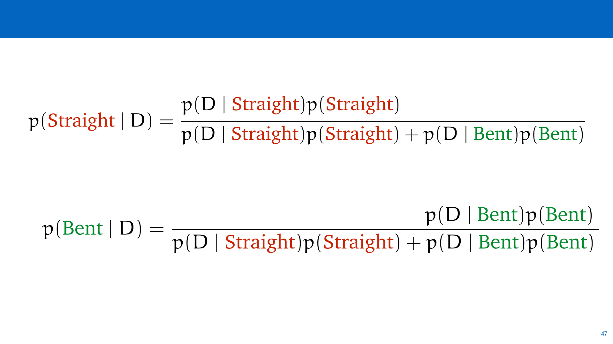

            <figcaption>
            
This is enough to show that with the log likelihood we have another “landscape” on top of our model space. If we didn’t want to work out the rest analytically, we could just find the optimum by gradient descent or even random search.

            </figcaption>
       </section>

       <section id="slide-047" class="anim">
            <a class="slide-link" href="https://mlvu.github.io/lecture05#slide-048" title="Link to this slide.">link here</a>
            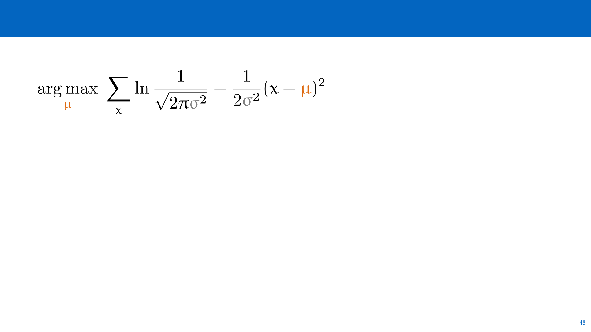

            <figcaption>
            
If we look at each parameter individually, we can reduce the problem even more. 

We can remove the first term, since it doesn't contain the mean. The factor 1/(2σ2) can be moved outside the sum and then removed (since a positive mulitplicative factor won't affect where the maximum is). 

Maximizing a function is the same as minimizing the negative of that function, so we can remove the minus and turn the argmax into an argmin. 

This shows that the maximum likelihood solution for the mean is just the value that minimizes the sum of the squared distances between the mean and the values in the dataset. This is how assuming a normal distribution leads to a least squares loss. If you work this out analytically, as we'll do in the next lecture, you'll see that the minimum for this is the (arithmetic) of the data, as you'd normally compute it.  

This connection between the normal distribution, the least squares loss and the artihmetic mean is a deep one. Don't worry if you don't quite get it yet, we'll come back to this a few more times. For instance we'll see that historically, the order was the other way around, Gauss started with the arithmetic mean which was a tried and tested approach, worked out that it implied the least squares principle, and then built the normal distribution on top of that. But that's for later. For now, just make sure that you understand the basic principle of maximizing the likelihood.

            </figcaption>

            click image for animation
            
       </section>

       <section id="slide-048" class="anim">
            <a class="slide-link" href="https://mlvu.github.io/lecture05#slide-049" title="Link to this slide.">link here</a>
            

            <figcaption>
            
We'll finish up with a quick look at <strong>Bayesian learning</strong>. Here, we are free to talk about the probability of the true model parameters taking a particular value. We don’t know the true parameters, but the data gives us some idea, so we express that uncertainty a probability distribution <em>over the model space</em>. 

That is, we'd like to know the distribution p(θ|D): a distribution over all available models, given the data that we've observed. As usual, the distribution with the reverse conditional p(D|θ) is much easier to work out. So the first thing we do is apply Bayes' rule to relate the two conditionals to one another. 

The distribution we want to work out is called the <strong>posterior distribution</strong>. Posterior means "after", as in: this is our belief about the true model <em>after</em> we've seen the data. 

The three parts of the right-hand side have these names. The <strong>prior distribution</strong> is a name you’ll hear often. Prior means before, as in: this is our belief about the true model <em>before</em> we've seen the data. For instance if we do spam classification in a Bayesian way, we might have a prior belief about the probability of getting a spam email, which we then <strong>update</strong> by looking at the content of the email (the data). Our beliefs about the parameters after seeing the data, is expressed by the posterior distribution.  

Note that Bayesian learning does, in principle, not require us to search or optimize anything. If we can work out the function on the right hand side of this equation, we get the posterior distribution and that gives us everything we need. If we need a good model, we can pick the one to which p(θ|X) assigns the highest probability, or we can sample a model and get a good fit with high probability. We can also study other properties of the distribution: for instance the variance of this distribution is a good indication of how uncertain we still are about the parameters of the model.  

In some cases, like for normal distributions, we can work all of this out analytically. For more complicated models, it’s usually impossible to work out the posterior analytically, and we have to make do with a function that approximates it, or with a number of individual  <em>samples </em>from the posterior. At that point, working out the posterior usually starts to look a lot like the searching we have to do in frequentist method and general machine learning.

            </figcaption>

            click image for animation
            
       </section>

       <section id="slide-049" class="anim">
            <a class="slide-link" href="https://mlvu.github.io/lecture05#slide-050" title="Link to this slide.">link here</a>
            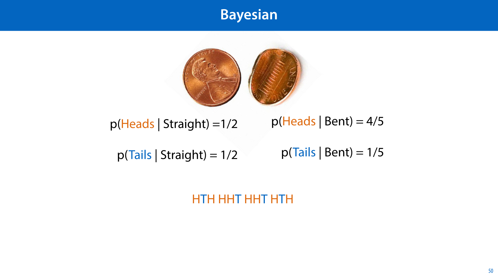

            <figcaption>
            
That may all sound a little abstract, so let's return to our coin example and see what a Bayesian approach would look like there. 

We first need to establish a prior. What is the probability of each coin in our model space? We said that we’d asked a friend to pick a coin at random. If we assume that he follows our instructions, then we believe each coin is equally likely so both get 0.5 probability. If we had two fair coins and one bent one, we could set the prior to 1/3 for bent and 2/3 for fair. Or if we expected our friend to have a preference for the bent coin, we might set our prior differently. 

This is an important thing to understand about choosing a prior: it allows us to encode our assumptions about the problem. As we will see again and again, encoding your assumptions is the most important part of designing machine learning models.

            </figcaption>

            click image for animation
            
       </section>

       <section id="slide-050" class="anim">
            <a class="slide-link" href="https://mlvu.github.io/lecture05#slide-051" title="Link to this slide.">link here</a>
            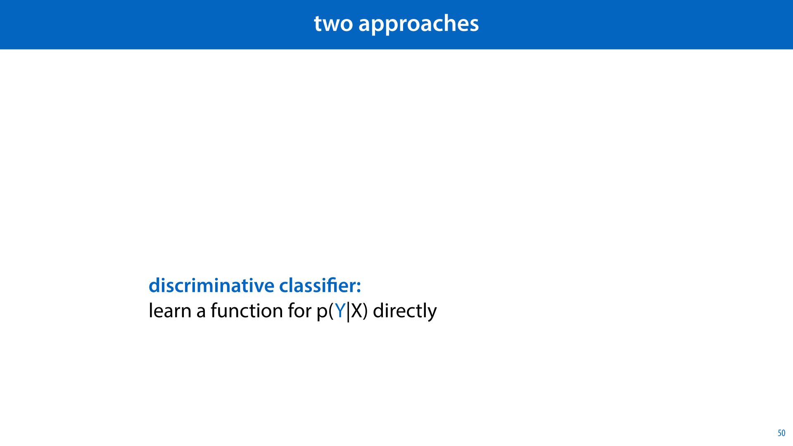

            <figcaption>
            
After the prior, we need to work out the model evidence p(D). This is the probability of the data with the model marginalized out. Independent of the model, how likely are we to see this data at all? We work this out by making the marginalization explicit, and replacing the joint probabilities by their conditionals.

            </figcaption>

            click image for animation
            
       </section>

       <section id="slide-052">
            <a class="slide-link" href="https://mlvu.github.io/lecture05#slide-052" title="Link to this slide.">link here</a>
            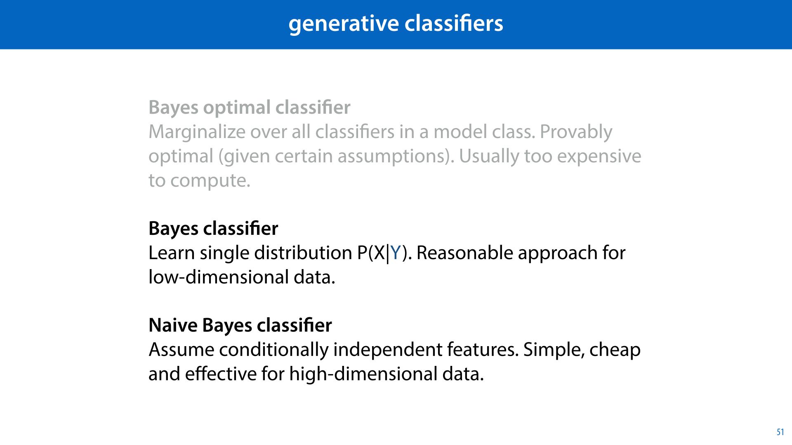

            <figcaption>
            
This is one way to think about Bayes’ rule: we’ve observed an outcome, in this case the data, which can have a number of causes. 

 The joint probability of a cause with an outcome in the prior of the cause times the probability of the outcome given the cause. If we sum up all these joint probabilties, the the proportion in that sum for cause X is the probability of the cause given the observation.

            </figcaption>
       </section>

       <section id="slide-052" class="anim">
            <a class="slide-link" href="https://mlvu.github.io/lecture05#slide-053" title="Link to this slide.">link here</a>
            

            <figcaption>
            
If we choose a  uniform prior (each model gets the same probability), then the priors cancel out and we are just left with a sum over the conditional data probabilities.

            </figcaption>

            click image for animation
            
       </section>

       <section id="slide-054">
            <a class="slide-link" href="https://mlvu.github.io/lecture05#slide-054" title="Link to this slide.">link here</a>
            

            <figcaption>
            
Filling these in gives us posterior probabilities for the straight and the bent coins. 

Note the difference with the maximum likelihood case. There, even though the differences between the two likelihoods were minimal, we only got<em> one </em>choice for the true model. In the Bayesian approach we get a distribution on the model space. It tells us not just that Bent is the more likely model, but also that<em> both models</em> are still quite likely. In this sense, getting a posterior distribution is a much more valuable result than getting a point estimate for your model. 

The downside of Bayesian analysis is that as the models get more complex, it gets more and more difficult to accurately approximate the posterior, and trying to do so is what has led to some of the most complicated material in machine learning.

            </figcaption>
       </section>

       <section class="video" id="video-054">
           <a class="slide-link" href="https://mlvu.github.io/lecture05#video-54">link here</a>
           <iframe
                src="https://www.youtube.com/embed/fK6dQYkeVqA?modestbranding=1&showinfo=0&rel=0"
                title="YouTube video player"
                frameborder="0" allow="accelerometer; autoplay; clipboard-write; encrypted-media; gyroscope; picture-in-picture"
                allowfullscreen>
           </iframe>

       </section>

       <section id="slide-055">
            <a class="slide-link" href="https://mlvu.github.io/lecture05#slide-055" title="Link to this slide.">link here</a>
            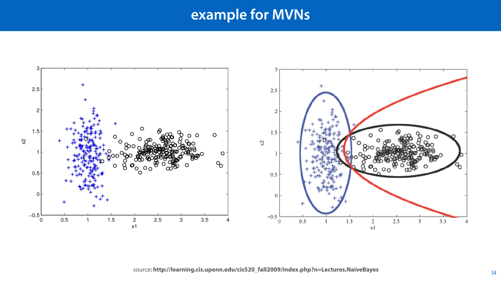

            <figcaption>
            
In this video we’ll try to connect this probability business to the abstract tasks of machine learning.  

<lnbr></lnbr>

            </figcaption>
       </section>

       <section id="slide-056">
            <a class="slide-link" href="https://mlvu.github.io/lecture05#slide-056" title="Link to this slide.">link here</a>
            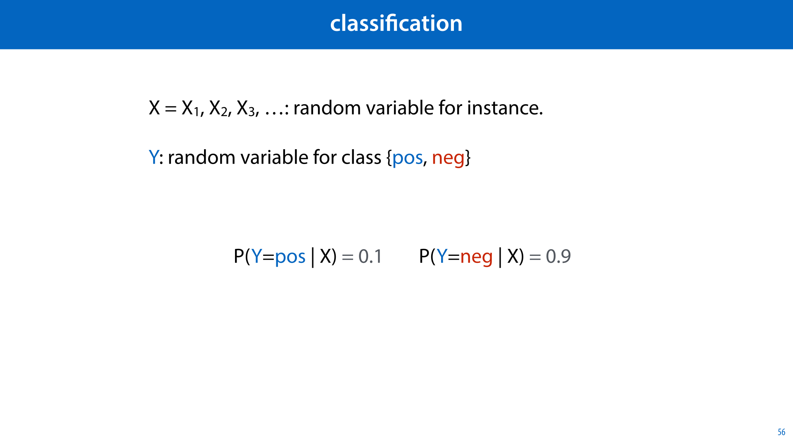

            <figcaption>
            
We will focus on building <strong>probabilistic classifiers</strong>. These are classifiers that return not just a class for a given instance x (or a ranking) but a probability over all classes. 

This can be very useful. We can use the probabilities to extract a ranking (and plot an ROC curve) or we can use the probabilities to assess how certain the classifier is. If we don’t want the probabilities, we can just turn it into a regular classifier by picking the class with the highest probability. 

Note that a probabilistic classifier is also immediately a ranking classifier (if we rank by how likely the positive class is) and a regular classifier (if we pick the class with the highest probability).

            </figcaption>
       </section>

       <section id="slide-056" class="anim">
            <a class="slide-link" href="https://mlvu.github.io/lecture05#slide-057" title="Link to this slide.">link here</a>
            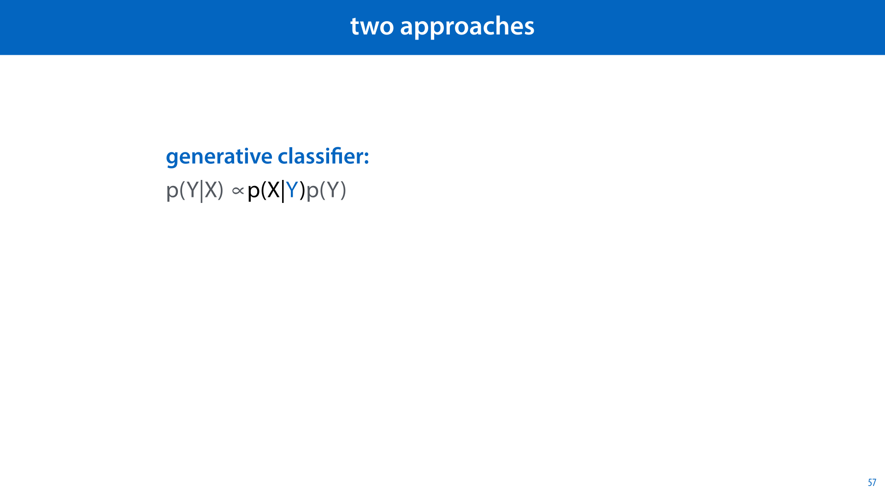

            <figcaption>
            
There are two approaches to casting the classification problem in probabilistic terms. A <strong>generative classifier</strong> focuses on learning a distribution on the feature space given the class p(X|Y). This distribution is then combined with Bayes’ rule to get the probability over the classes, conditioned on the data. 

A<strong> discriminative classifier</strong> learns the function p(Y|X) directly with X as input and class probabilities as output. It functions as a kind of regression, mapping x to a vector of class probabilities. 

 We’ll look at some simple generative classifiers first. 

 

            </figcaption>

            click image for animation
            
       </section>

       <section id="slide-058">
            <a class="slide-link" href="https://mlvu.github.io/lecture05#slide-058" title="Link to this slide.">link here</a>
            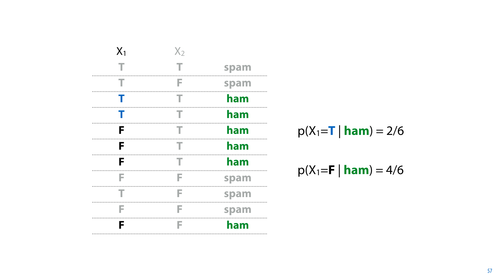

            <figcaption>
            
Here are three approaches, arranged from impractical but entirely correct to highly practical, but based on largely incorrect assumptions. 

We won’t discuss the Bayes optimal classifier in this course, but it’s worth knowing that it exists, and that it means something different than a (naive) Bayes classifier.

            </figcaption>
       </section>

       <section id="slide-059">
            <a class="slide-link" href="https://mlvu.github.io/lecture05#slide-059" title="Link to this slide.">link here</a>
            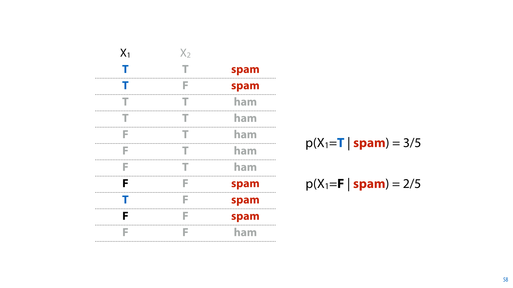

            <figcaption>
            
For the Bayes classifier, we start with the probability we’re interested in p(Y|X): the probability of the class given the data. We then rewrite this using Bayes’ rule. From the final form, we see that if we compute the probability functions p(X|Y), the data given the class and p(Y), the prior probability of the class, we can compute the probabilites we;re interested in: the class probabilities given the data. 

So the task becomes to learn functions for those two probabilties.

            </figcaption>
       </section>

       <section id="slide-059" class="anim">
            <a class="slide-link" href="https://mlvu.github.io/lecture05#slide-060" title="Link to this slide.">link here</a>
            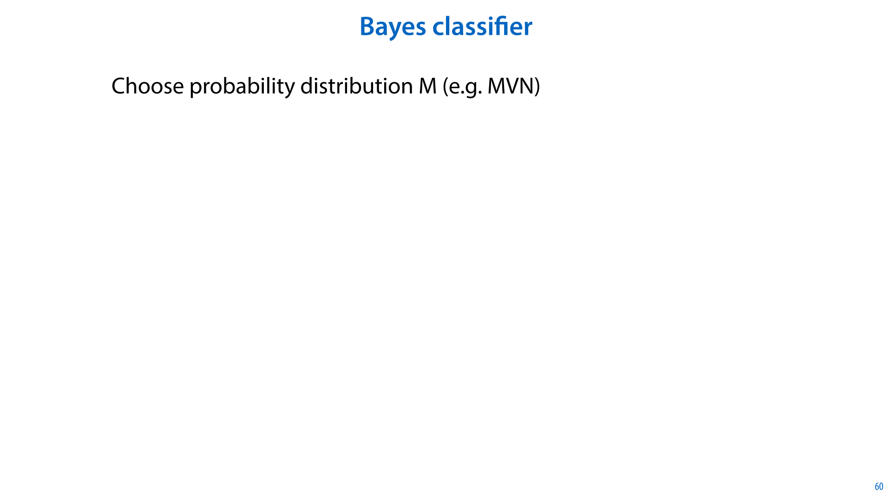

            <figcaption>
            
So here is the algorithm for a simple Bayes classifier. We choose a model class for P(X|Y), for instance multivariate normal distributions. We fit such a model separately to each class to gie us one distribution 

            </figcaption>

            click image for animation
            
       </section>

       <section id="slide-061">
            <a class="slide-link" href="https://mlvu.github.io/lecture05#slide-061" title="Link to this slide.">link here</a>
            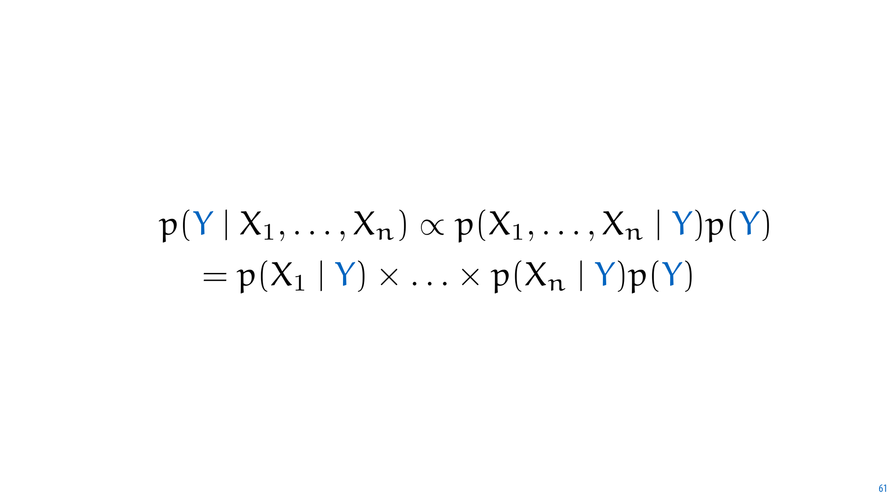

            <figcaption>
            
Here is an example of what that looks like with 2 features. On the left we have two classes, blue and black. We fit a 2D normal distribution to each. Then, for a new point, we see which assigns the new point the highest probability density. 

The red line provides the decision boundary. 

 

            </figcaption>
       </section>

       <section id="slide-062">
            <a class="slide-link" href="https://mlvu.github.io/lecture05#slide-062" title="Link to this slide.">link here</a>
            

            <figcaption>
            
This works well for small numbers of features, but if we have many features, modelling the dependence between each pair of features gets very expensive.  

A crude, but very effective solution is Naive Bayes. NB just assumes that all features are independent, conditional on the class. 

Note that we do not assume that the features are independent: it’s perfectly possible for one feature to be dependent on another feature, but the are conditionally independent. Informally, the dependency between the features is “caused” by the class and nothing else. Just like Alice and Bob in the first video: their lateness had only one possible shared cause, the monster, and once we’d isolated that, their lateness was independent.

            </figcaption>
       </section>

       <section id="slide-063">
            <a class="slide-link" href="https://mlvu.github.io/lecture05#slide-063" title="Link to this slide.">link here</a>
            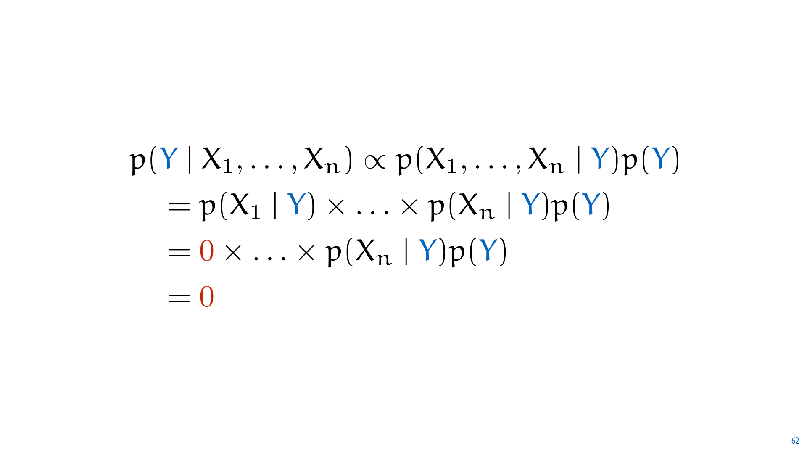

            <figcaption>
            
Here is an example dataset, with binary features. Each feature indicates whether a particular word occurs in that instance. 

We will build a naive Bayes classifier for this data by simply fitting a bernoulli distribution to each feature. That is, we will estimate p(“pill”|spam) as the relative frequency with which the “pill” feature was true for spam emails.

            </figcaption>
       </section>

       <section id="slide-064">
            <a class="slide-link" href="https://mlvu.github.io/lecture05#slide-064" title="Link to this slide.">link here</a>
            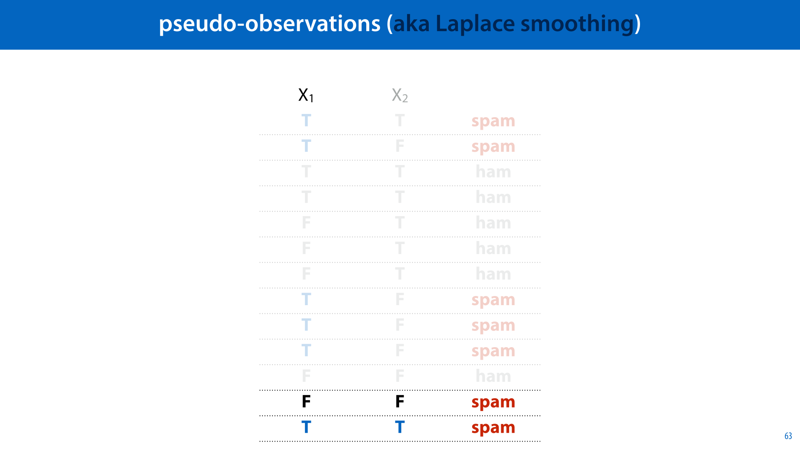

            <figcaption>
            
Here is what Naive Bayes does: it selects all emails of one class, and then estimates the probability that X1 will be T as the relative frequency of emails for which X1 was T in the training set. 

Strictly speaking, we are modelling X1 as a Bernoulli distribution whose parameter we estimate as 2/6

            </figcaption>
       </section>

       <section id="slide-065">
            <a class="slide-link" href="https://mlvu.github.io/lecture05#slide-065" title="Link to this slide.">link here</a>
            

            <figcaption>
            
We do the same for the spam class and for the other feature.

            </figcaption>
       </section>

       <section id="slide-066">
            <a class="slide-link" href="https://mlvu.github.io/lecture05#slide-066" title="Link to this slide.">link here</a>
            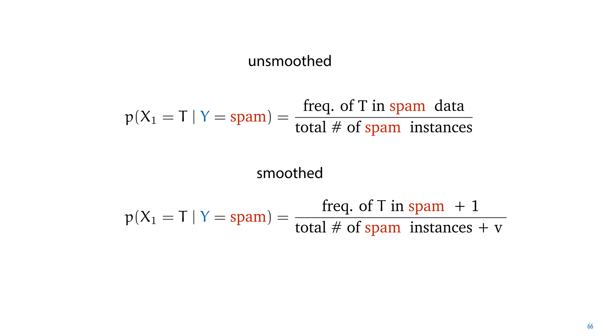

            <figcaption>
            
This is the naive Bayes assumption formulaically. We simply factor p(X1,…Xn) into n separate, independent probabilities.

            </figcaption>
       </section>

       <section id="slide-066" class="anim">
            <a class="slide-link" href="https://mlvu.github.io/lecture05#slide-067" title="Link to this slide.">link here</a>
            

            <figcaption>
            

            </figcaption>

            click image for animation
            
       </section>

       <section id="slide-068">
            <a class="slide-link" href="https://mlvu.github.io/lecture05#slide-068" title="Link to this slide.">link here</a>
            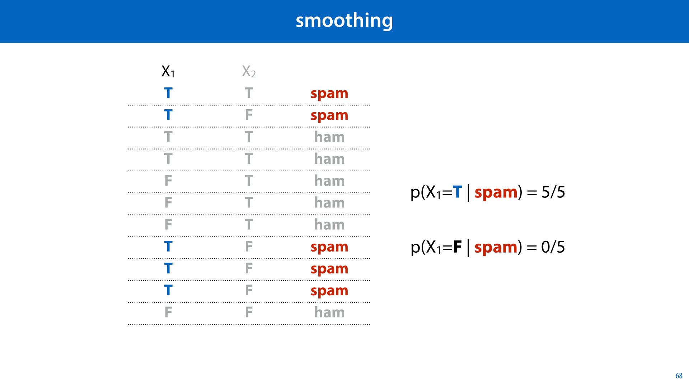

            <figcaption>
            
While Naive Bayes can work surprisingly well (given how strong and incorrect the assumption is), we do run into a problem if for some feature a particular value does not occur. In that case, we estimate the probability as 0.

            </figcaption>
       </section>

       <section id="slide-069">
            <a class="slide-link" href="https://mlvu.github.io/lecture05#slide-069" title="Link to this slide.">link here</a>
            

            <figcaption>
            
Since the whole estimate of our probability is just a long product, if one of the factors becomes zero, the whole things collapses. Even if all the other features gave this class a very high probability, that information is lost. 

            </figcaption>
       </section>

       <section id="slide-070">
            <a class="slide-link" href="https://mlvu.github.io/lecture05#slide-070" title="Link to this slide.">link here</a>
            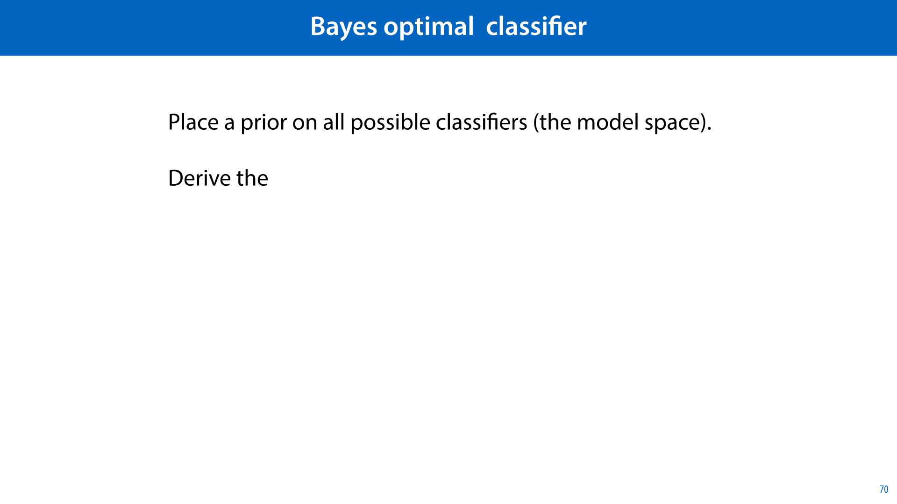

            <figcaption>
            
To remedy this, we need to apply smoothing. The simplest was to do that is to add pseudo-observations. For each possible value, we add an instance where all the features have that value. 

(We should do the same for the class ham).

            </figcaption>
       </section>

       <section id="slide-071">
            <a class="slide-link" href="https://mlvu.github.io/lecture05#slide-071" title="Link to this slide.">link here</a>
            

            <figcaption>
            
This changes our estimates as shown here (i.e. we don’t actually need to add the pseudo-observations, we just change our estimator). 

 

Here, v is the number of different values X1 can take. 

In practice, we often reduce the weight of 

            </figcaption>
       </section>

       <section id="slide-071" class="anim">
            <a class="slide-link" href="https://mlvu.github.io/lecture05#slide-072" title="Link to this slide.">link here</a>
            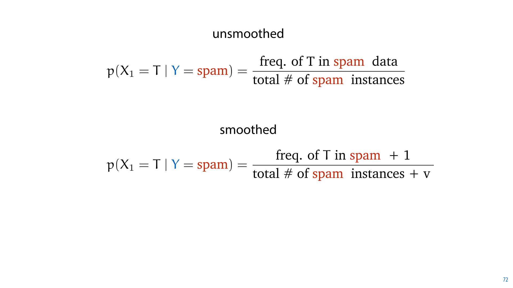

            <figcaption>
            
Naive Bayes is commonly associated with categorical features (to which Bernoulli or Categorical distributions are fitted), but it can also be used with numerical features. If we use normal distributions, then the independence assumption means that we fit a univariate normal distribution to each feature independently. The distribution over the whole space for each class then becomes a multivariate normal whose covariance matrix is diagonal (all off diagonal elements are zero). Visually, this means that the distribution looks like an ellipsoid that is stretched along the axes.  

The kind of ellipse shown on the bottom, which is stretched in an abitrary direction <em>is</em> a multivariate normal, but not one where the features are independent. So this kind of fit would only be allowed in a non-naive Bayes classifier. Not that this required a full covariance matrix to specify, where the naive version only require us to specify the n elements along the diagonal, making it much more parameter efficient. 

 

source: <a href="http://learning.cis.upenn.edu/cis520_fall2009/index.php?n=Lectures.NaiveBayes"><strong class="blue">http://learning.cis.upenn.edu/cis520_fall2009/index.php?n=Lectures.NaiveBayes</strong></a>

<a href="http://learning.cis.upenn.edu/cis520_fall2009/index.php?n=Lectures.NaiveBayes"><strong class="blue"></strong></a>

            </figcaption>

            click image for animation
            
       </section>

       <section id="slide-073">
            <a class="slide-link" href="https://mlvu.github.io/lecture05#slide-073" title="Link to this slide.">link here</a>
            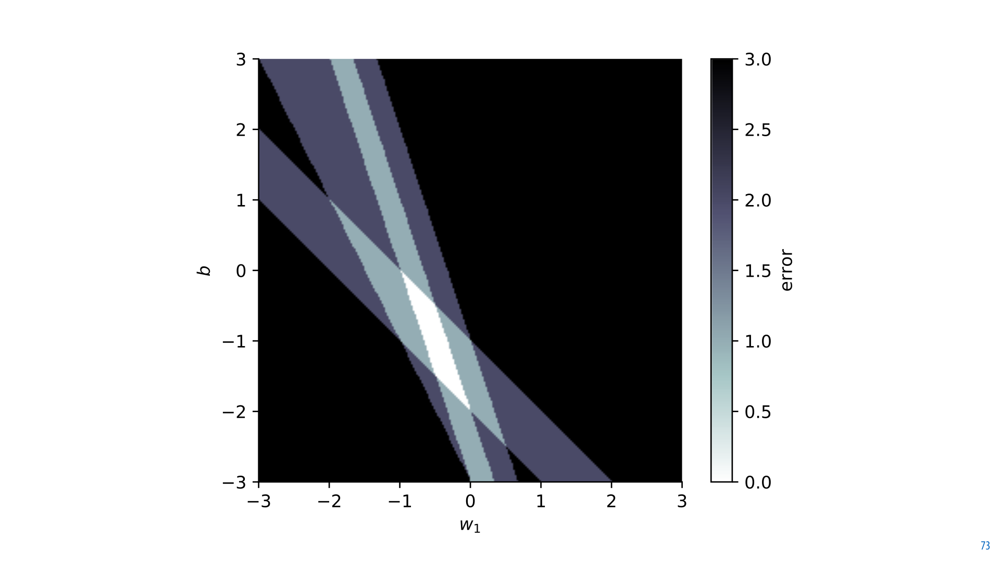

            <figcaption>
            

            </figcaption>
       </section>

       <section class="video" id="video-073">
           <a class="slide-link" href="https://mlvu.github.io/lecture05#video-73">link here</a>
           <iframe
                src="https://www.youtube.com/embed/EYhxR22Ta88?modestbranding=1&showinfo=0&rel=0"
                title="YouTube video player"
                frameborder="0" allow="accelerometer; autoplay; clipboard-write; encrypted-media; gyroscope; picture-in-picture"
                allowfullscreen>
           </iframe>

       </section>

       <section id="slide-074">
            <a class="slide-link" href="https://mlvu.github.io/lecture05#slide-074" title="Link to this slide.">link here</a>
            

            <figcaption>
            
<lnbr></lnbr> 

            </figcaption>
       </section>

       <section id="slide-075">
            <a class="slide-link" href="https://mlvu.github.io/lecture05#slide-075" title="Link to this slide.">link here</a>
            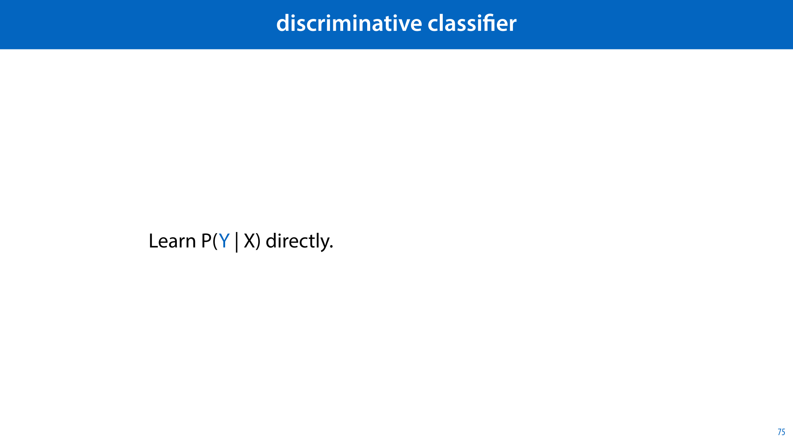

            <figcaption>
            
In this video we’ll look at an example of a discriminative classifier. This is a classifier that learns to map the features directly to class probabilities, without using Bayes’ rule to reverse the conditional probability. 

            </figcaption>
       </section>

       <section id="slide-076">
            <a class="slide-link" href="https://mlvu.github.io/lecture05#slide-076" title="Link to this slide.">link here</a>
            

            <figcaption>
            
Remember that we were still on the lookout for good loss functions for the classification problem. We’ll use the language of probability to define one for us.

            </figcaption>
       </section>

       <section id="slide-077">
            <a class="slide-link" href="https://mlvu.github.io/lecture05#slide-077" title="Link to this slide.">link here</a>
            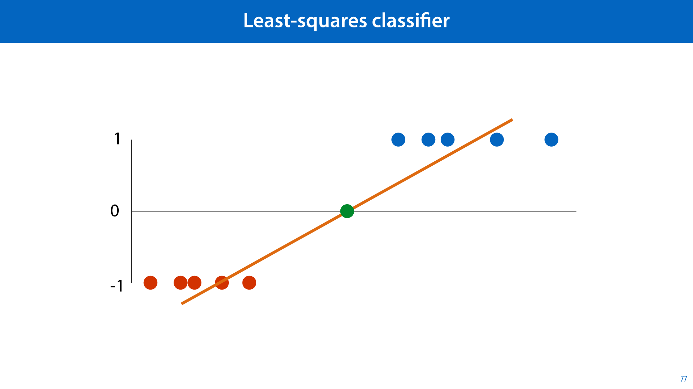

            <figcaption>
            
This was our last attempt: the least squares loss. 

Our thinking was: the hyperplane classifier checks if <strong class="orange">w</strong><strong>x </strong>+ b is positive or negative, to decide whether to assign classes blue or red, respectively. Why not just give blue and red some arbitrary positive and negative values, and treat it as a regression problem.

            </figcaption>
       </section>

       <section id="slide-078">
            <a class="slide-link" href="https://mlvu.github.io/lecture05#slide-078" title="Link to this slide.">link here</a>
            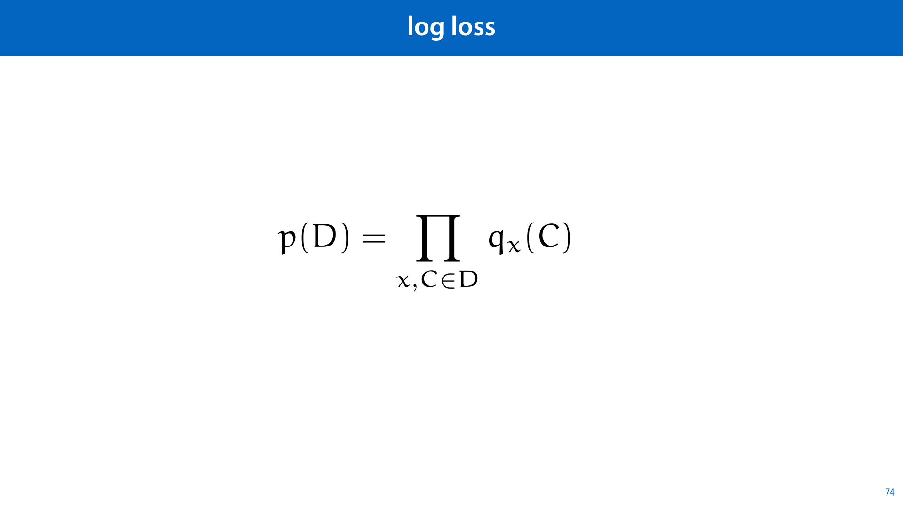

            <figcaption>
            
Here is another option: instead of giving negative and positive arbitrary values, we given them <em>probabilities</em>: the probability of being positive, which is 1 for all blue points and 0 for all red points. (In other words, we move the red points from -1 to 0). 

This doesn’t look substantially different to our linear classifier because our function <strong class="orange">w</strong>T<strong>x </strong>+ b still ranges from negative infinity to positive infinity. It doesn’t produce probabilities, except over a very narrow range. 

What we need, is a way to squeeze that whole range into the range [0, 1], so that the model only ever produces valid probabilities.

            </figcaption>
       </section>

       <section id="slide-078" class="anim">
            <a class="slide-link" href="https://mlvu.github.io/lecture05#slide-079" title="Link to this slide.">link here</a>
            

            <figcaption>
            
For this purpose, we will use the <strong>logistic sigmoid</strong>. Note that its domain is the entire real number line, and its range is [0,1]. 

An interesting property of the logistic sigmoid is the symmetry given in the second line. Basically the remainder between sigma(t) and 1, is itself a sigmoid running in the other direction. In other words: flipping the sigmoid horizontally, 1 - σ(t), gives us the same function as flipping the sigmoid vertically,  σ(-t). We’ll make frequent use of this later. 

 

source: By Qef (talk) - Created from scratch with gnuplot, Public Domain, <a href="https://commons.wikimedia.org/w/index.php?curid=4310325"><strong class="blue">https://commons.wikimedia.org/w/index.php?curid=4310325</strong></a> 

            </figcaption>

            click image for animation
            
       </section>

       <section id="slide-080">
            <a class="slide-link" href="https://mlvu.github.io/lecture05#slide-080" title="Link to this slide.">link here</a>
            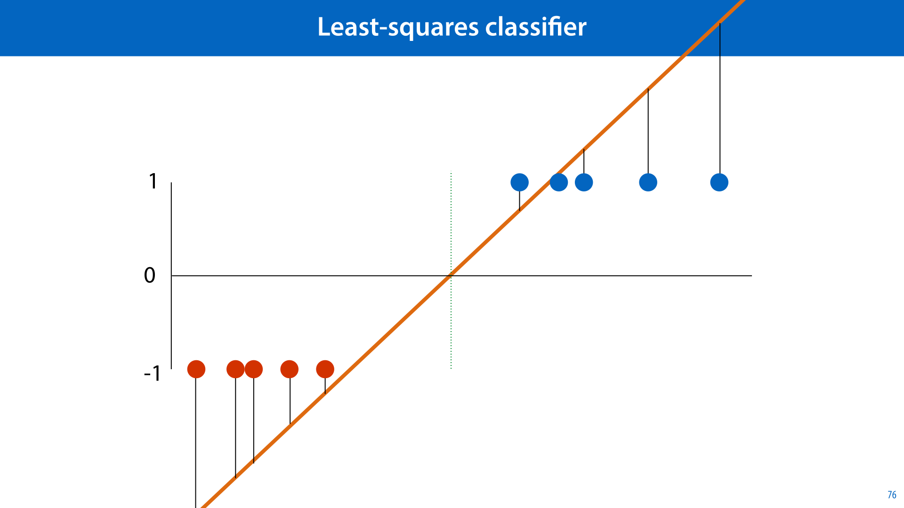

            <figcaption>
            
This is our new classifier: we compute the linear function as before, but we apply the logistic sigmoid to the result, squeezing it into the interval [0, 1]. This means that we can interpret the output as the probability of the positive class. This may be a very accurate probability, or a very inaccurate one, depending on how we choose <strong class="orange">w</strong> and b, but it’s always a value between 0 and 1. 

Now all we need is a<strong> loss function</strong> that tells us which probabilities match the data.

            </figcaption>
       </section>

       <section id="slide-081">
            <a class="slide-link" href="https://mlvu.github.io/lecture05#slide-081" title="Link to this slide.">link here</a>
            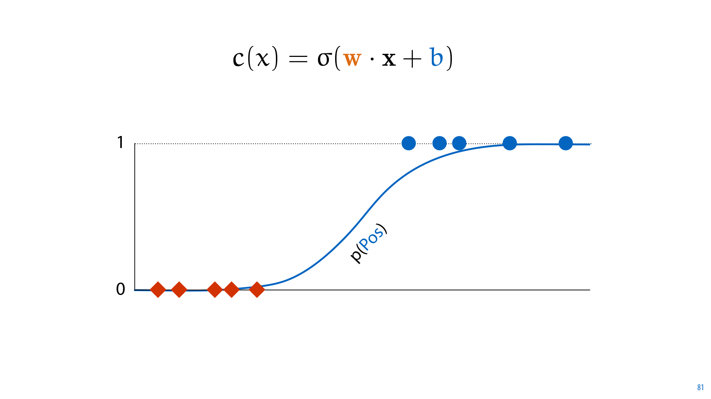

            <figcaption>
            
Clearly, we want a classifier that assigns high probability to the true label, and low probability to the false one. If we treat the classifier as a model for our data, we can compute the probability of the 

            </figcaption>
       </section>

       <section id="slide-082">
            <a class="slide-link" href="https://mlvu.github.io/lecture05#slide-082" title="Link to this slide.">link here</a>
            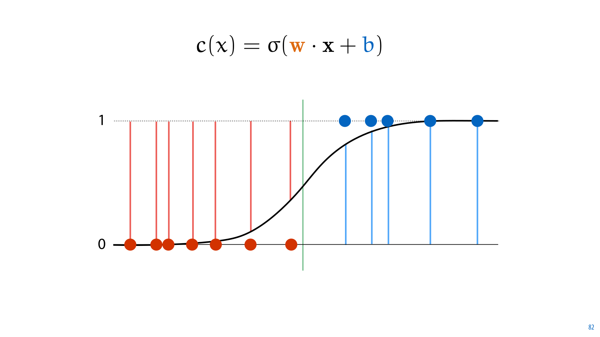

            <figcaption>
            

            </figcaption>
       </section>

       <section id="slide-082" class="anim">
            <a class="slide-link" href="https://mlvu.github.io/lecture05#slide-083" title="Link to this slide.">link here</a>
            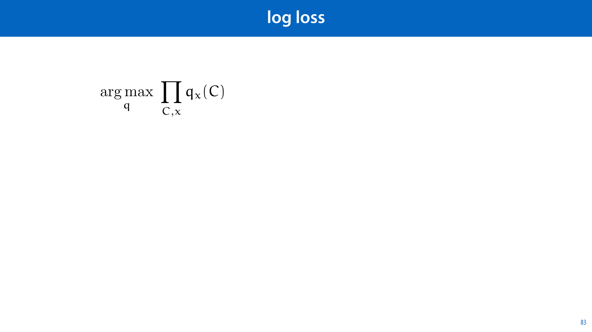

            <figcaption>
            

            </figcaption>

            click image for animation
            
       </section>

       <section id="slide-084">
            <a class="slide-link" href="https://mlvu.github.io/lecture05#slide-084" title="Link to this slide.">link here</a>
            

            <figcaption>
            
In the least-squares case, the loss function could be thought of in terms of the residuals between the prediction and the true values. They pull on the line like rubber bands.

            </figcaption>
       </section>

       <section id="slide-085">
            <a class="slide-link" href="https://mlvu.github.io/lecture05#slide-085" title="Link to this slide.">link here</a>
            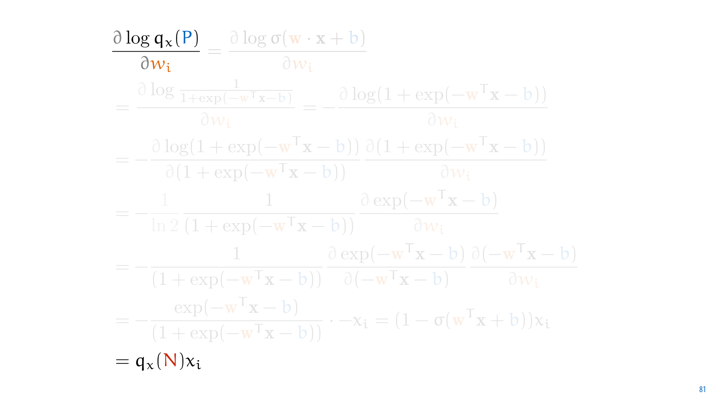

            <figcaption>
            
For the cross entropy loss, we can imagine the residuals for logistic regression as the lines drawn here. The logarithmic loss tries to maximise these lines by maximizing their logarithm (or minimizing their negative logarithm). 

You can think of them as little rods pushing the sigmoid towards the red and blue points.

            </figcaption>
       </section>

       <section id="slide-086">
            <a class="slide-link" href="https://mlvu.github.io/lecture05#slide-086" title="Link to this slide.">link here</a>
            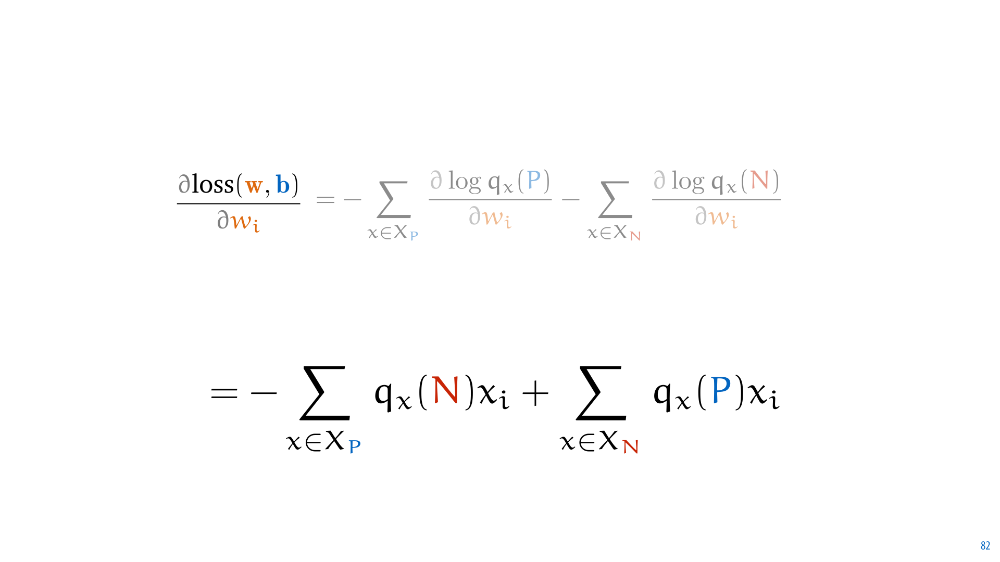

            <figcaption>
            
Remember that in the least squares loss we squared the residuals before summing them, to punish outliers. Taking the logarithm has a similar effect. Low probabilities are disproportionately punished. 

Note that any instance far away from the decision boundary (on the right side of it) has a rod length near 1, which means its contribution to the loss is almost zero.

            </figcaption>
       </section>

       <section id="slide-087">
            <a class="slide-link" href="https://mlvu.github.io/lecture05#slide-087" title="Link to this slide.">link here</a>
            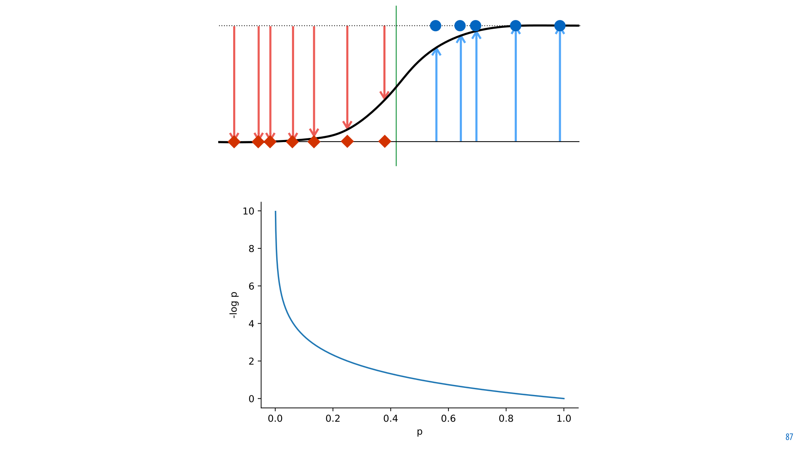

            <figcaption>
            
The next couple of slides show a complicated derivation. You should do your best to go through this step by step. There are a couple more of these coming up in the course, so you had better get used to them.  

You don't. however, have to understand this <em>right away</em>. If you struggle to follow along, just look at the start and end points. Try to figure out what the derivation is trying to show and why this is important. Then, move on to the rest of the lecture and come back to the details later. 

            </figcaption>
       </section>

       <section id="slide-087" class="anim">
            <a class="slide-link" href="https://mlvu.github.io/lecture05#slide-088" title="Link to this slide.">link here</a>
            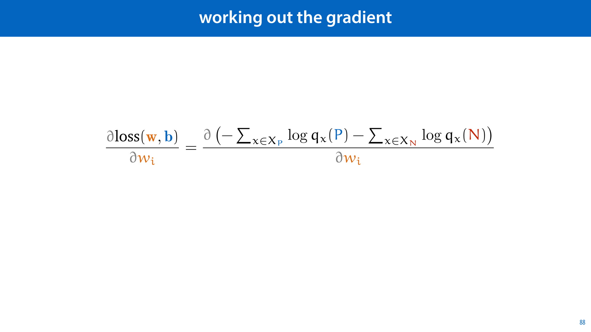

            <figcaption>
            
We’ll show you the basics of working out the gradient for logistic regression. The loss breaks apart in separate terms for the positive and negative points. Let’s look at one of the positive terms (the negative can be derived in a similar way).

            </figcaption>

            click image for animation
            
       </section>

       <section id="slide-088" class="anim">
            <a class="slide-link" href="https://mlvu.github.io/lecture05#slide-089" title="Link to this slide.">link here</a>
            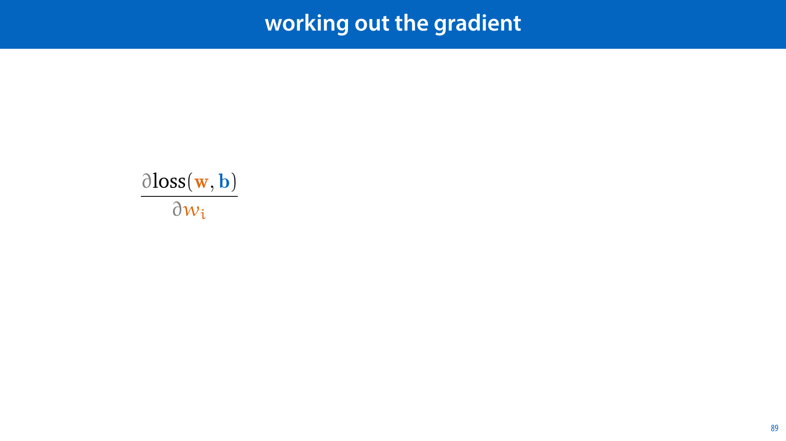

            <figcaption>
            
Note that.d logb(x)/ dx = (1 /(ln b)) (1/x) 

If we use the binary logarithm, we get a constant multiplier (1/ln2) in the fourth line. We can ignore this, because it doesn’t change the direction of the gradient, only the magnitude. When we apply gradient descent we scale the gradient by a constant multiplier anyway, so we can ignore it. 

If we use the natural logarithm, this multiplier disappears (but then we lose an interpretation of the log loss that we will discuss in the next part).

            </figcaption>

            click image for animation
            
       </section>

       <section id="slide-090">
            <a class="slide-link" href="https://mlvu.github.io/lecture05#slide-090" title="Link to this slide.">link here</a>
            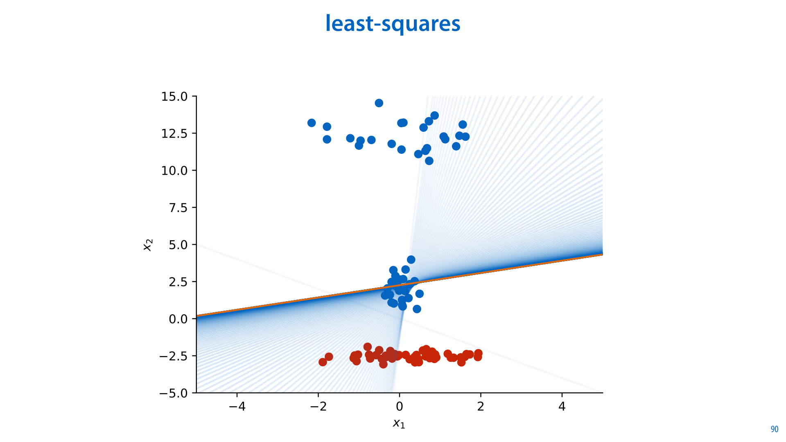

            <figcaption>
            
Note that despite the intimidating formulas in the middle, the result is actually very simple. This is one of the pleasing properties of the logistic sigmoid, it tends to cancel itself out when the derivative is taken. 

d logb(x)/ dx = (1 /(ln b)) (1/x)

            </figcaption>
       </section>

       <section id="slide-091">
            <a class="slide-link" href="https://mlvu.github.io/lecture05#slide-091" title="Link to this slide.">link here</a>
            

            <figcaption>
            
There we have it: the gradient for a linear classifier, fed through a sigmoid function, producting a logarithmic loss.

            </figcaption>
       </section>

       <section id="slide-092">
            <a class="slide-link" href="https://mlvu.github.io/lecture05#slide-092" title="Link to this slide.">link here</a>
            

            <figcaption>
            
<em>Regression</em> is a bit of misnomer, since we’re building a classifier. I suppose the confusing terminology comes from the fact that we’re fitting a (curved) line through the probability values in the data. 

Let's see it in action.

            </figcaption>
       </section>

       <section id="slide-093">
            <a class="slide-link" href="https://mlvu.github.io/lecture05#slide-093" title="Link to this slide.">link here</a>
            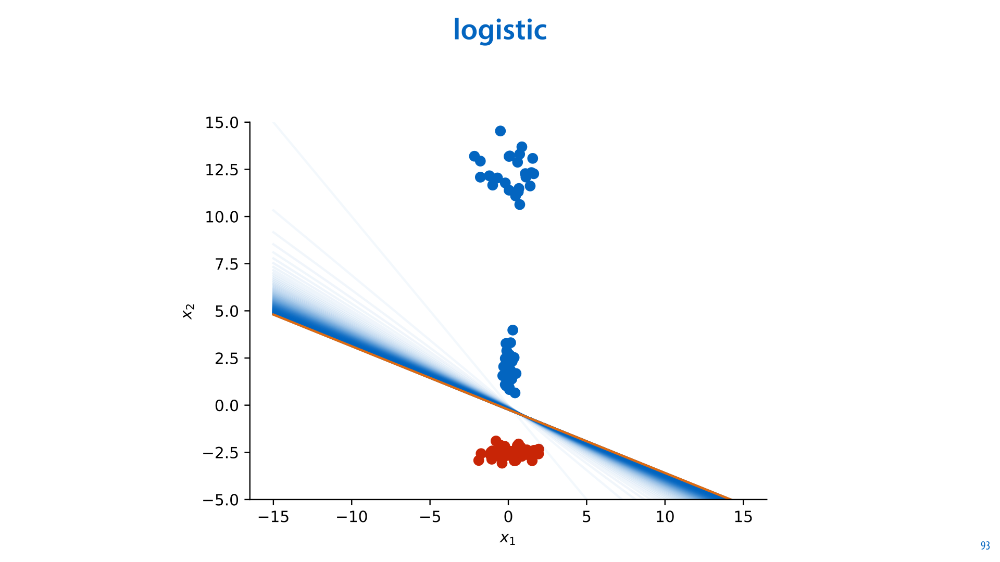

            <figcaption>
            
Here is a 2D dataset that shows a common failure case for the least squares classifier. The points at the top are so far away from the ideal decision boundary that they will have huge residuals under the least squares model.

            </figcaption>
       </section>

       <section id="slide-094">
            <a class="slide-link" href="https://mlvu.github.io/lecture05#slide-094" title="Link to this slide.">link here</a>
            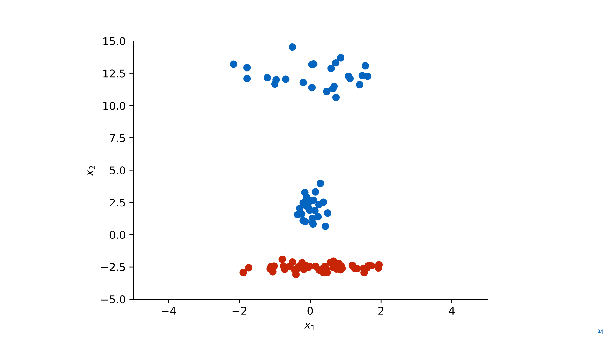

            <figcaption>
            
Here is what the least-square regression converges to. Clearly, this is not a satisfying solution for such an easily separable dataset. The blue points at the top are so far from the decision boundary. 

In the linear models 1 lecture, we fixed one of the parameters to 1, so that we could plot the loss surface. This time, we’re optimizing all three parameters. 

            </figcaption>
       </section>

       <section id="slide-095">
            <a class="slide-link" href="https://mlvu.github.io/lecture05#slide-095" title="Link to this slide.">link here</a>
            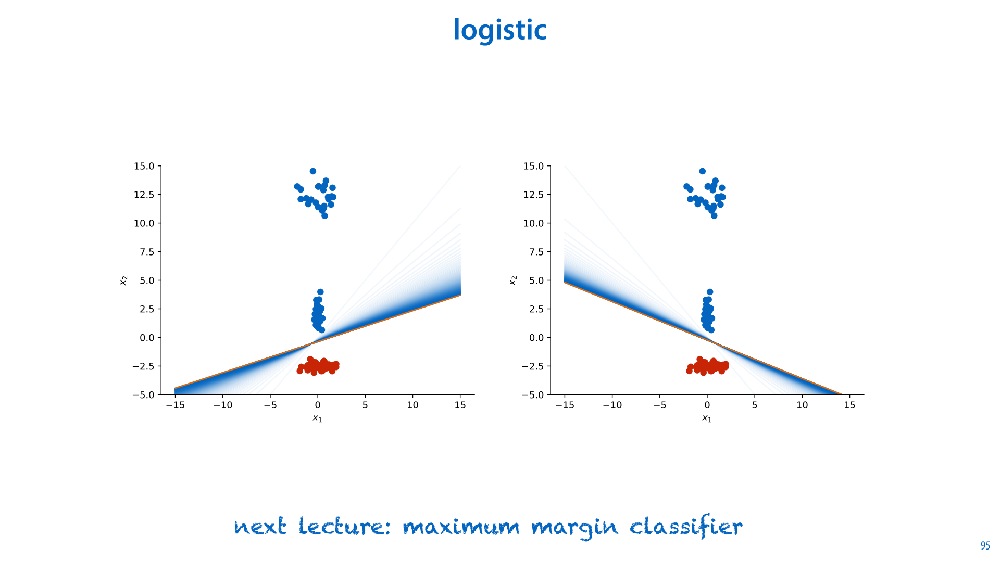

            <figcaption>
            
Here is a 1D view of a similar situation. The green bar is the decision boundary that we want, but any line that the cross the horizontal axis there has really big residuals for the far away points. These pull on the line with a quadratic strength, so the decision boundary will always be pulled toward them

            </figcaption>
       </section>

       <section id="slide-095" class="anim">
            <a class="slide-link" href="https://mlvu.github.io/lecture05#slide-096" title="Link to this slide.">link here</a>
            

            <figcaption>
            
The logistic model doesn’t have this problem.If the model fits well around the ideal decision boundary, it doesn’t have to worry at all about points that are far away (if they’re on the right side of the boundary),

            </figcaption>

            click image for animation
            
       </section>

       <section id="slide-097">
            <a class="slide-link" href="https://mlvu.github.io/lecture05#slide-097" title="Link to this slide.">link here</a>
            

            <figcaption>
            
And here is the logistic regression classifier. 

            </figcaption>
       </section>

       <section id="slide-098">
            <a class="slide-link" href="https://mlvu.github.io/lecture05#slide-098" title="Link to this slide.">link here</a>
            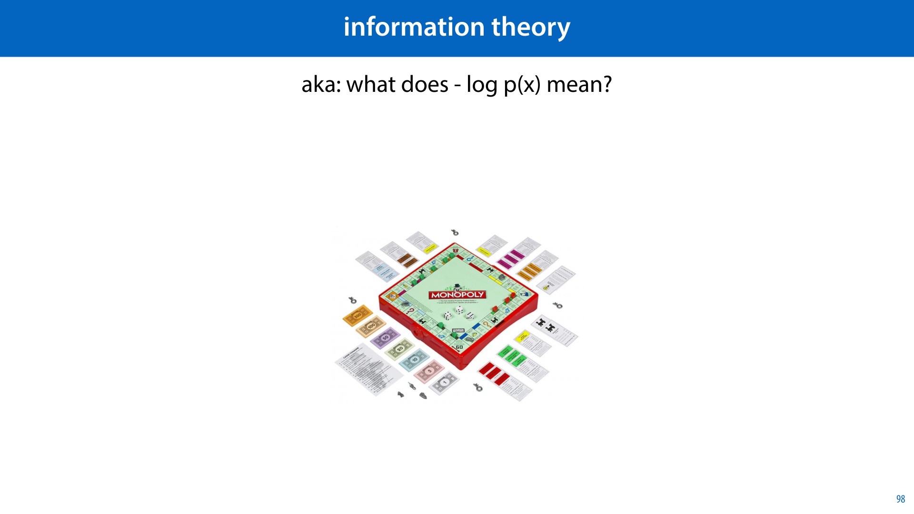

            <figcaption>
            
And here is the probability function (blue is high probability of positive, red is high probability of negative).

            </figcaption>
       </section>

       <section id="slide-099">
            <a class="slide-link" href="https://mlvu.github.io/lecture05#slide-099" title="Link to this slide.">link here</a>
            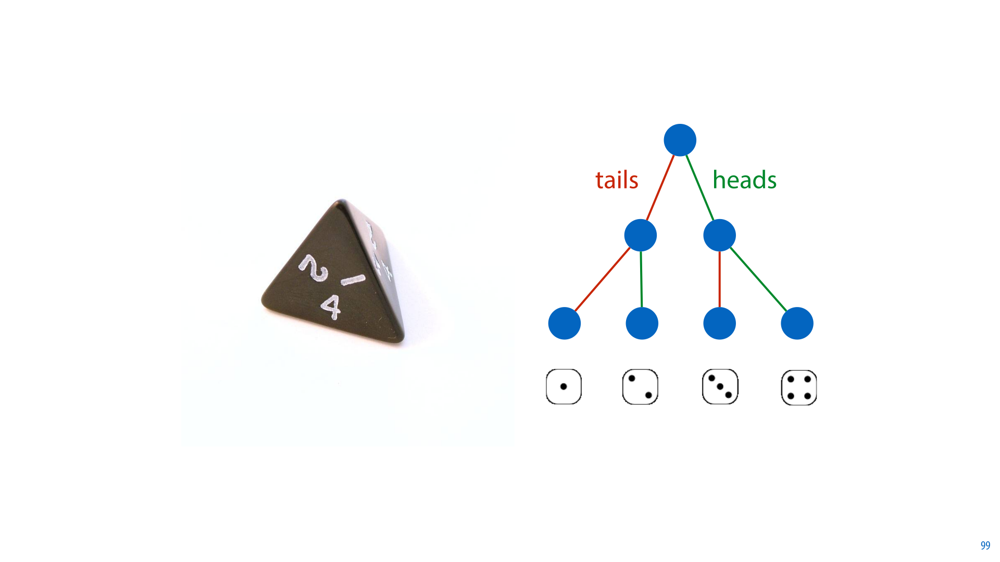

            <figcaption>
            
Note that for such well-separable classes, there are many suitable classifier, and logistic regression has no reason to prefer one over the other (all points are assigned the correct probability very close to 1). We’ll see a solution to this problem next lecture, when we meet our final loss function: the SVM loss.

            </figcaption>
       </section>

       <section id="slide-100">
            <a class="slide-link" href="https://mlvu.github.io/lecture05#slide-100" title="Link to this slide.">link here</a>
            

            <figcaption>
            

            </figcaption>
       </section>

       <section class="video" id="video-100">
           <a class="slide-link" href="https://mlvu.github.io/lecture05#video-100">link here</a>
           <iframe
                src="https://www.youtube.com/embed/mSneVjDvzNQ?modestbranding=1&showinfo=0&rel=0"
                title="YouTube video player"
                frameborder="0" allow="accelerometer; autoplay; clipboard-write; encrypted-media; gyroscope; picture-in-picture"
                allowfullscreen>
           </iframe>

       </section>

       <section id="slide-101">
            <a class="slide-link" href="https://mlvu.github.io/lecture05#slide-101" title="Link to this slide.">link here</a>
            

            <figcaption>
            
The last video was all about defining a probability p(x) and then taking the negative logarithm of that probability. We justified this by saying that the logarithm of the likelihood is easier to work with, and that as a convention we tend to minimize rather than maximize in machine learning  so we took the negative of the log likelihood. All very pragmatic. 

But actually, there is a very concrete meaning to the negative log likelihood of a probability, that can really help to deepen our understanding of what we are doing when we use probabilities in machine learning. To understand this, we need to dig briefly into the topic of information theory. This will not just help us understand probability from a new perspective, it will also provide us with the concept of <strong>entropy</strong>, which is an important toll we will use at different points in the course. 

<lnbr></lnbr> 

            </figcaption>
       </section>

       <section id="slide-102">
            <a class="slide-link" href="https://mlvu.github.io/lecture05#slide-102" title="Link to this slide.">link here</a>
            

            <figcaption>
            
Imagine you’re on holiday, and you’ve brought your travel monopoly. Unfortunately, the dice have gone missing. You do however, have a coin with you. Can you use the coin flip to simulate the throw of a six sided  die?

            </figcaption>
       </section>

       <section id="slide-103">
            <a class="slide-link" href="https://mlvu.github.io/lecture05#slide-103" title="Link to this slide.">link here</a>
            

            <figcaption>
            
For a four sided die, the solution is easy. We flip the coin twice, and assign a number to each possible outcome. 

source: <a href="http://www.midlamminiatures.co.uk/blackpolydice/D4Black.html"><strong class="blue">http://www.midlamminiatures.co.uk/blackpolydice/D4Black.html</strong></a>

<a href="http://www.midlamminiatures.co.uk/blackpolydice/D4Black.html"><strong class="blue"></strong></a>

            </figcaption>
       </section>

       <section id="slide-104">
            <a class="slide-link" href="https://mlvu.github.io/lecture05#slide-104" title="Link to this slide.">link here</a>
            

            <figcaption>
            
A six sided die is more tricky. We’ll show the solution for three “sides” (you can just add another coin flip to decide whether it’ll be 1,2,3 or 4,5,6.) 

The trick is to assign the fourth outcome to a “reset”. If you throw two heads in a row, you just start again. Theoretically you could be coin flipping forever, but the probability of resetting more than five times is already less than one in one-thousand. 

For now let’s stick with trees where each outcome is represented by only one leaf (and accept that the six-sides die cannot be perfectly modelled with a coin). What distributions can we model with a coin in this way, if we require each outcome to be represented by one leaf in the tree?

            </figcaption>
       </section>

       <section id="slide-105">
            <a class="slide-link" href="https://mlvu.github.io/lecture05#slide-105" title="Link to this slide.">link here</a>
            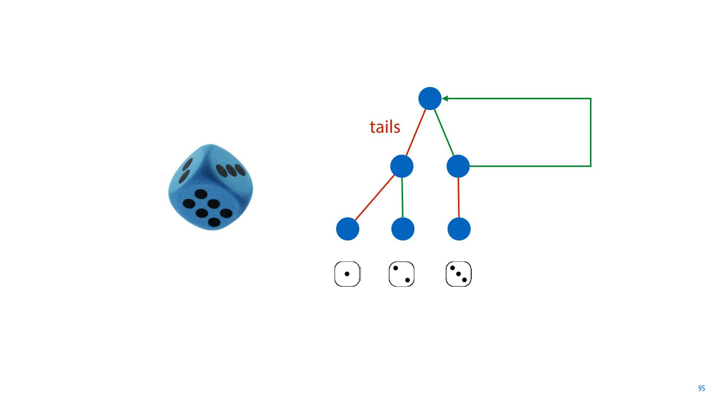

            <figcaption>
            
Here are two examples: an exponentially decaying distribution, and a (roughly) polynomially decaying one.

            </figcaption>
       </section>

       <section id="slide-105" class="anim">
            <a class="slide-link" href="https://mlvu.github.io/lecture05#slide-106" title="Link to this slide.">link here</a>
            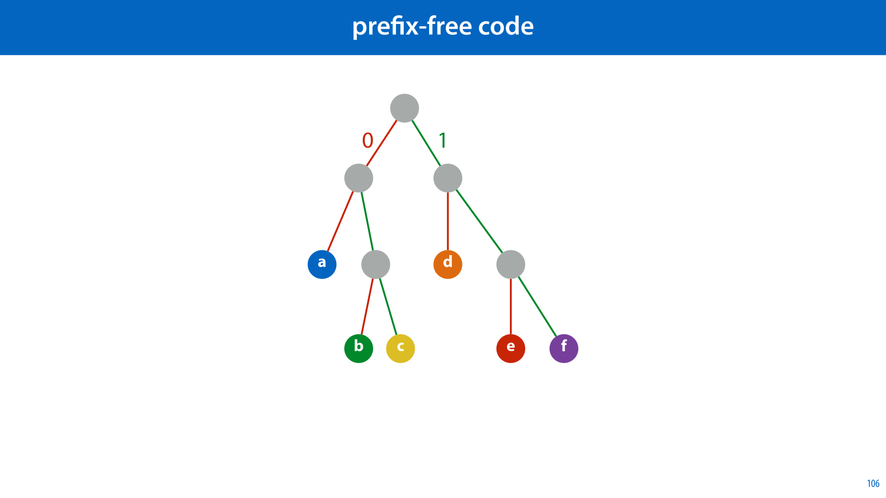

            <figcaption>
            
These kinds of trees are called prefix-free trees, because they assign a <em>prefix free code</em> to the set of outcomes (we just replace heads and tails with zeros and ones). The benefit is that if we want to encode a sequence of these outcomes, we can just stick the code one after another and we won’t need any delimiters. A decoder will know exactly where each codeword ends and the next begins.

            </figcaption>

            click image for animation
            
       </section>

       <section id="slide-106" class="anim">
            <a class="slide-link" href="https://mlvu.github.io/lecture05#slide-107" title="Link to this slide.">link here</a>
            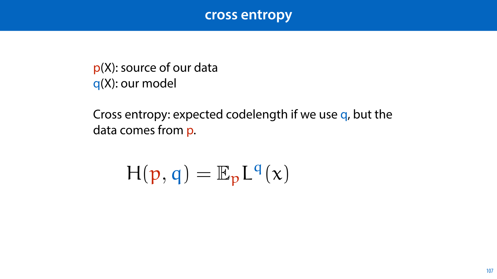

            <figcaption>
            
Every prefix tree defines a probability distribution and a code. What about the other way around? Can we find a tree for any given probability distribution?  

We already saw that some distributions (like a six-sided die) cannot be represented exactly. But how close can we get?

            </figcaption>

            click image for animation
            
       </section>

       <section id="slide-108">
            <a class="slide-link" href="https://mlvu.github.io/lecture05#slide-108" title="Link to this slide.">link here</a>
            

            <figcaption>
            
It turns out we can model any distribution in such a way that the biggest difference in codelength is no larger than a bit. 

If we handwave this difference, we can equate codes with probability distributions: every code gives us a distribution and every distribution gives us a code. The higher the probability of an outcome, the shorter its codelength.

            </figcaption>
       </section>

       <section id="slide-108" class="anim">
            <a class="slide-link" href="https://mlvu.github.io/lecture05#slide-109" title="Link to this slide.">link here</a>
            

            <figcaption>
            
The entropy of a distribution is the expected codelength of an element sampled from that distribution.

            </figcaption>

            click image for animation
            
       </section>

       <section id="slide-109" class="anim">
            <a class="slide-link" href="https://mlvu.github.io/lecture05#slide-110" title="Link to this slide.">link here</a>
            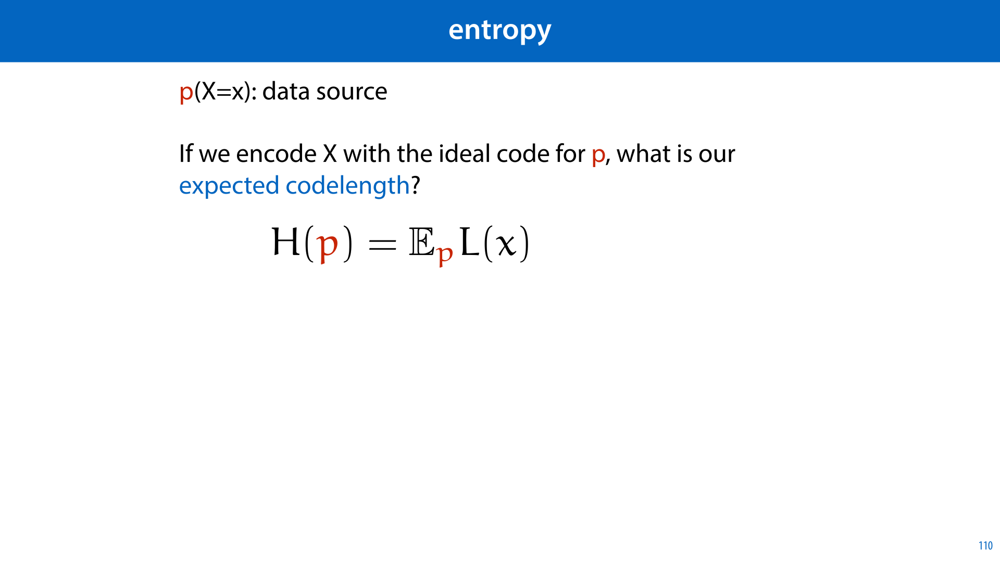

            <figcaption>
            
The more uniform our distribution is (the more unsure we are) the higher the entropy. 

In the middle, we know something about our distribution, for instance that a is very likely, so we can make the codeword for a a little shorter, reducing the expected codelength (the entropy). On the left, we have no such options, so the entropy is maximal (equal to log2 N). 

            </figcaption>

            click image for animation
            
       </section>

       <section id="slide-110" class="anim">
            <a class="slide-link" href="https://mlvu.github.io/lecture05#slide-111" title="Link to this slide.">link here</a>
            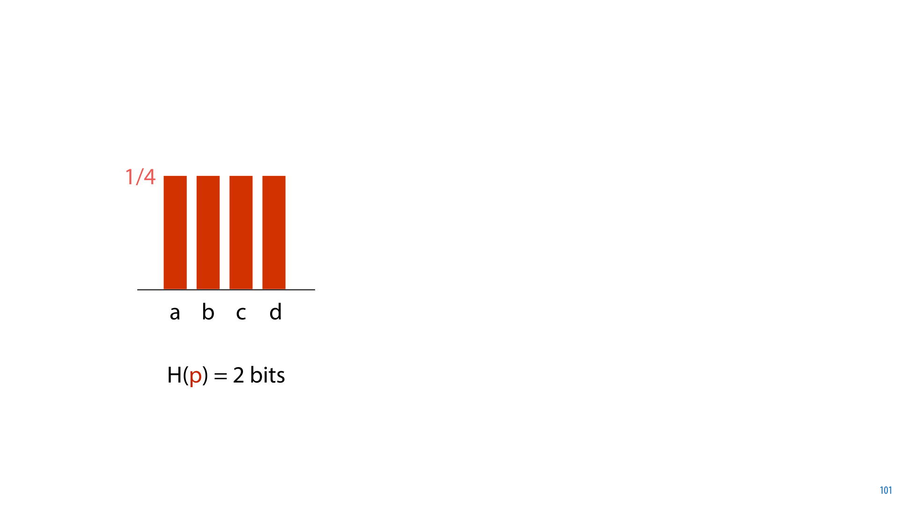

            <figcaption>
            
What if we don’t use the code that corresponds to the source of our data p to encode our data, but some other code based on distribution q. What is our expected codelength then? This is called the<em> cross entropy</em>. 

  

The cross entropy is minimal when p=q (and equal to the entropy). We can conclude two things: 

The code corresponding to p provides the best expected codelength. 

The cross entropy is a good way to <strong>quantify the distance between two distributions</strong> (because it’s minimal when the two are the same).

            </figcaption>

            click image for animation
            
       </section>

       <section id="slide-112">
            <a class="slide-link" href="https://mlvu.github.io/lecture05#slide-112" title="Link to this slide.">link here</a>
            

            <figcaption>
            
The cross entropy is a nice measure, but it’s not zero when p and q are equal. Instead, it’s equal to the entropy of p. 

To get a measure that is zero when the two are equal, we can just subtract the the entropy of p. This is called the Kulback-Leibler (KL) divergence. The KL divergence is zero when our model is perfect.

            </figcaption>
       </section>

       <section id="slide-112" class="anim">
            <a class="slide-link" href="https://mlvu.github.io/lecture05#slide-113" title="Link to this slide.">link here</a>
            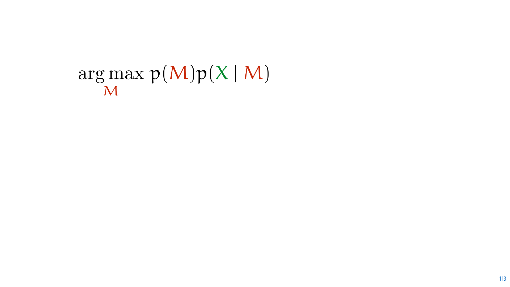

            <figcaption>
            
This way, we can prove that cross entropy loss is the same as log loss. And indeed this loss function is often called cross entropy loss. 

This is not just a curiosity tying information theory to machine learning, it has practical consequences. It tells us what we should do in the case where the dataset actually provides class probabilities instead of class labels. In that case, we should minimize the cross entropy betwene the predicted distribution and the one given in the data.

            </figcaption>

            click image for animation
            
       </section>

       <section id="slide-114">
            <a class="slide-link" href="https://mlvu.github.io/lecture05#slide-114" title="Link to this slide.">link here</a>
            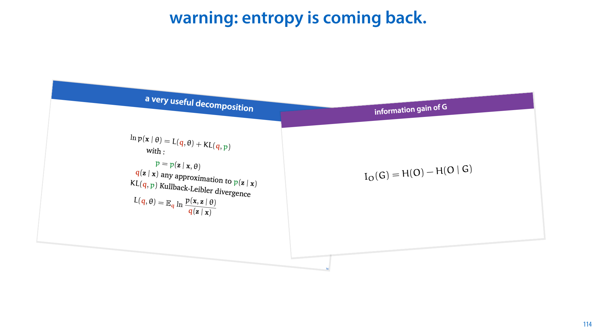

            <figcaption>
            
Just a little head up: entropy is an important subject. It may feel a little abstract now, and it's fine if you don't quite get it, but we will see it in use a number of times throughout the course.  

We will practice it in the homework exercises, so you'll get another chance to get comfortable with it.

            </figcaption>
       </section>

       <section id="slide-115">
            <a class="slide-link" href="https://mlvu.github.io/lecture05#slide-115" title="Link to this slide.">link here</a>
            

            <figcaption>
            
This leads us to the <strong>minimum description length principle</strong>, which informally states that <em>compression</em> and <em>learning</em> are strongly related.

            </figcaption>
       </section>

       <section id="slide-116">
            <a class="slide-link" href="https://mlvu.github.io/lecture05#slide-116" title="Link to this slide.">link here</a>
            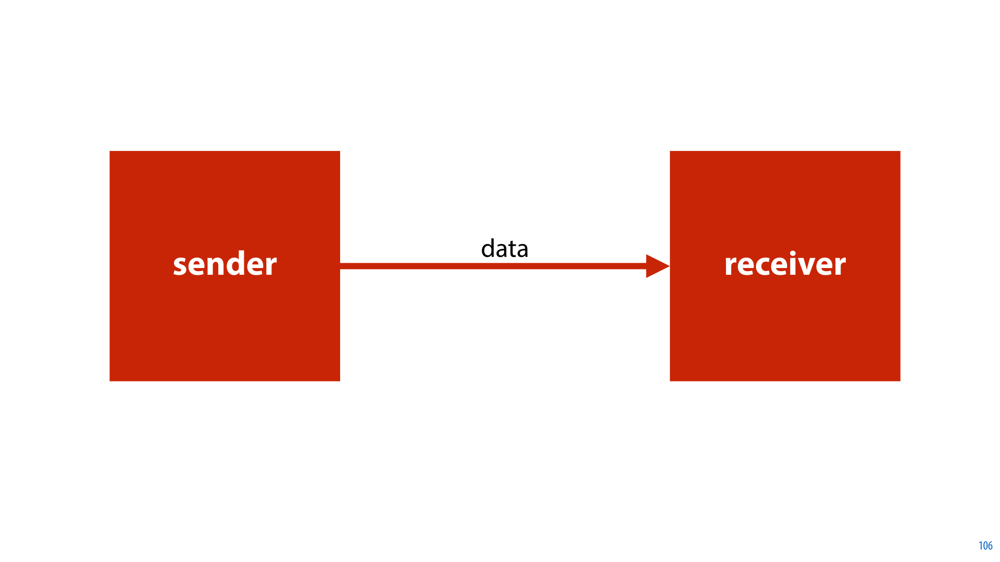

            <figcaption>
            
The best way to think of MDL model selection is in a sender and receiver framework. The sender is going to see some data, and is going to send it to the receiver. Before observing the data, the sender and receiver are allowed to come up with any scheme they like. But afterwards, the data must be sent using the scheme, and in a way that is perfectly decodable by the receiver without further communication. 

We usually assume that there is some language to describe a model that the sender chooses. The sender describes the model and then the data given the model.

            </figcaption>
       </section>

       <section id="slide-116" class="anim">
            <a class="slide-link" href="https://mlvu.github.io/lecture05#slide-117" title="Link to this slide.">link here</a>
            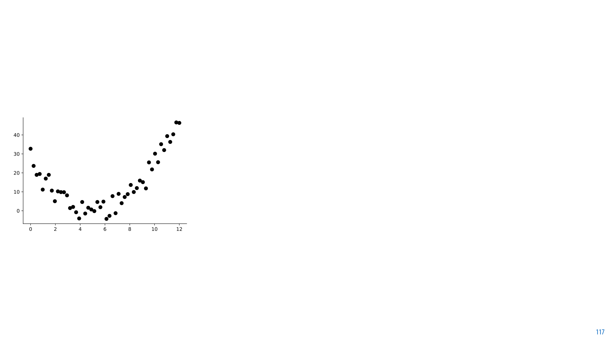

            <figcaption>
            
We won’t go into the technical details of MDL, but here we see a broad illustration of how MDL can balance over- and underfitting in a regression problem.  

In a regression (or classification) problem, we can take the instances and their features as fixed: both the sender and receiver have access to them. The data that we want to send over the wire is the target labels; in this case the numbers. How you encode a continuous value is a technical matter that requires some assumptions. For now we can just discretize range of outptus, and assume that we are using a code that means that <strong>bigger number cost more bits</strong>. The same goes for the parameters of the model: these are also continuous values, but we’ll discretize them somehow. Here we only need to assume that using more parameters in your model takes more bits. 

Once we’ve chosen a model we can reconstruct the data by sending the model parameters and the residual values. On the left, we see that if we pick a linear model we have many large residuals to transmit. On the other hand, our model is described by only two parameters, so we can transmit that part very cheaply. If we make our model a parabola, we require three numbers to transmit it, so that part of  our message gets bigger, but because the model fits so much better, the residuals are much smaller, and the overal length of our message gets much smaller. 

If we make our model a 15-th order polynomial, we get a slightly tighter fit, but not by much, and the price we pay in storing the 16 numbers required to describe our model means that our message length is bigger than for the parabola. So overall we prefer the model in  the middle, according to the minimum description length principle. 

            </figcaption>

            click image for animation
            
       </section>

       <section id="slide-117" class="anim">
            <a class="slide-link" href="https://mlvu.github.io/lecture05#slide-118" title="Link to this slide.">link here</a>
            

            <figcaption>
            
There are many correspondences between using MDL and using Bayes. In fact they are often perspectives on the same thing. For instance, if we choose the model that maximizes the posterior probability, we can rewrite, by introducing a logarithm to show that we are also choosing the model that minimizes the codelength

            </figcaption>

            click image for animation
            
       </section>

       <section id="slide-119">
            <a class="slide-link" href="https://mlvu.github.io/lecture05#slide-119" title="Link to this slide.">link here</a>
            

            <figcaption>
            
When we talked about the problem of induction and the no free lunch theorem, we noted that <em>some assumption</em> about the source of our data was necessary to make learning possible at all. Some aspects of our problem we need to assume before we start learning. 

You can think of MDL as encoding a simplicity assumption. We prefer simple solutions over complex ones, and we define a simple solution as one that compresses the data well. The assumption we make about the universe, is that it generated compressible data for us.

            </figcaption>
       </section>

       <section id="slide-120">
            <a class="slide-link" href="https://mlvu.github.io/lecture05#slide-120" title="Link to this slide.">link here</a>
            

            <figcaption>
            

            </figcaption>
       </section>

</article>
