<nav class="menu">
    <ul>
        <li class="home"><a href="/">Home</a></li>
        <li class="name">Lecture 5: Probabilistic models</li>
            <li><a href="#video-000">What is probability?</a></li>
            <li><a href="#video-029">Learning with probability</a></li>
            <li><a href="#video-047">(Naive) Bayes classifiers</a></li>
            <li><a href="#video-065">Logistic regression</a></li>
            <li><a href="#video-091">Logistic regression</a></li>
        <li class="pdf"><a href="https://mlvu.github.io/lectures/31.ProbabilisticModels1.annotated.pdf">PDF</a></li>
    </ul>
</nav>

<article class="slides">
       <section class="video" id="video-000">
           <a class="slide-link" href="https://mlvu.github.io/lecture05#video-0">link here</a>
           <iframe
                src="https://www.youtube.com/embed/9rWoBVnVuLQ?modestbranding=1&showinfo=0&rel=0"
                title="YouTube video player"
                frameborder="0" allow="accelerometer; autoplay; clipboard-write; encrypted-media; gyroscope; picture-in-picture"
                allowfullscreen>
           </iframe>

       </section>

       <section id="slide-001">
            <a class="slide-link" href="https://mlvu.github.io/lecture05#slide-001">link here</a>
            

            <figcaption>
            
Probability is an important tool in Machine Learning. We expect that you have been taught probability theory already, but since it’s a subtle concept, with complicated foundations, we’ll go over the basics again in this first video. 

If you have never done any probability before, please consult the homework exercises and the recommended reading on Canvas to brush up first. 

<lnbr></lnbr>

            </figcaption>
       </section>

       <section id="slide-002">
            <a class="slide-link" href="https://mlvu.github.io/lecture05#slide-002">link here</a>
            

            <figcaption>
            
To start, let’s look at the way we use probability <em>informally</em>. 

Let’s say you are a concerned parent, you read this headline and you are shocked by it. You turn to your partner, and you say “that means that the probability that our son is gambling online is 12.5%”. Your partner disagrees, you have a good handle on your son’s behaviour and his spending. Unless he has a credit card you don’t know about, and the probability of that is much lower. 

Well, then the probability that Josh, his closest friend, gambles online must be 12.5%. If one in eight teenage boys is gambling, they must be hiding <em>somewhere</em>. Your partner disagrees again: probability doesn’t enter in to it. Josh is either gambling or he isn’t. 

Clearly, we need to look at what we mean when we say that a probability of something is such-and-so. There are two commonly accepted ways of looking at it: objecttive and subjective probability. We’ll start with <strong>objective probability</strong>.  

 

image source: <a href="https://www.theguardian.com/society/2016/sep/20/one-in-eight-european-teenage-boys-gamble-online-says-survey"><strong class="blue">https://www.theguardian.com/society/2016/sep/20/one-in-eight-european-teenage-boys-gamble-online-says-survey</strong></a>

<a href="https://www.theguardian.com/society/2016/sep/20/one-in-eight-european-teenage-boys-gamble-online-says-survey"><strong class="blue"></strong></a>

            </figcaption>
       </section>

       <section id="slide-003">
            <a class="slide-link" href="https://mlvu.github.io/lecture05#slide-003">link here</a>
            

            <figcaption>
            
In <strong>objective probability</strong>, “the probability that X is the case” represents an<em> objective truth</em>: whatever a probability is, it must be the same for everybody. You and I may disagree over a probability, but only because one of us is wrong. There is one true probability. 

The most common form of objective probability is<strong> frequentism</strong>. Under the frequentist definition, probability is a property of a (hypothetical) repeated experiment.  For instance, take the statement “the probability of rolling 6 with a fair die, is one in six.”  

The experiment is rolling a die (the singular of dice). The outcome we are discussing is the roll resulting in a 6. If we were to repeat the experiment a large number of times, N, then the proportion of times we observe the discussed outcome is close to 1 in 6. More precisely, as N grows, the proportion <em>converges</em> to 1 in 6. 

Under a frequentist interpretation, saying “the probability is one in six", is equivalent to saying “if I roll the die repeatedly, the relative frequency of sixes will converge to 1 in 6 as the number of roll grows.” 

 

            </figcaption>
       </section>

       <section id="slide-004">
            <a class="slide-link" href="https://mlvu.github.io/lecture05#slide-004">link here</a>
            

            <figcaption>
            
Under objective probability the statement “the probability that Josh is gambling is 12.5%” is indeed nonsense. There is no experiment we can imagine where Josh “turns out" to be a gambler one in 8 times. He either gambles or he doesn’t. 

What we <em>can</em> say is that the probability that a teenage boy drawn randomly from the European population gambles online is 12.5%. This is an experiment we can repeat, and at every repetition, we choose a different boy, so we get a different outcome. 

We should also note that our statement is not <em>precisely</em> correct. The actual probability is a number we don’t know. This is what happens in practice: the probability of X happening is p. We don’t know p, but we do know that there is some experiment for which the proportion of successful trials (X happens) converges to p with repeated trials. We repeat a large number of trials, check the proportion of times p happened, and use that as an estimate of the true p. That is also what happened in the research behind this article. We don’t know precisely how many teenage boys gamble online, so the researchers found a way to estimate the total proportion

            </figcaption>
       </section>

       <section id="slide-005">
            <a class="slide-link" href="https://mlvu.github.io/lecture05#slide-005">link here</a>
            

            <figcaption>
            
The alternative to objectivism is <strong>subjectivism</strong>. It states that probability expresses our uncertainty. If X is a boolean variable, one that is true or not true, and we are uncertain whether X is true, we can assign a probability to X being true. A probability of 0.5 means we are entirely ambivalent, a probability of 0.75 means we think X is pretty likely, and a probability of 1 means we’re entirely sure.  

In this case, different people can have different probabilities for the same thing being true. You and I may disagree and both be right. I you have information I don’t have, your probability may be closer to certainty than mine. 

<strong>Bayesianism</strong> is the main form of subjective probability. It builds on Bayes’ rule, which we will discuss later, to tell us how we should use observations to <em>update</em> our beliefs.

            </figcaption>
       </section>

       <section id="slide-006">
            <a class="slide-link" href="https://mlvu.github.io/lecture05#slide-006">link here</a>
            

            <figcaption>
            
Under subjectivism, we <em>can</em> say “the probability that our son is gambling is 12.5%” We don’t know what he gets up to, so even though there is a definite objective answer, <em>we</em> are uncertain. If we know only this headline, we may well pick 12.5% as our belief that our son is gambling. Of course, as noted before we have a lot more knowledge about our son that about other teenage boys. We know he goes to bed on time, we know where gets his money, he probably doesn’t have a secret credit card. So even though the probability for a random teenage boy would be 12.5%, the probability for our son is actually much lower, because we have extra information. 

This is the fundamental difference between the two views: under <em>frequentism</em>, probability is defined as an objective property of the world. The probability of X is the same for all people regardless of what we know or don’t know. Under <em>Bayesianism</em>, probability is an expression of a subjective property: it can change from one person to the next, and if we learn new information, it can change from one moment to the next. If we find out that our son <em>does </em>have a secret credit card, the probability that he is gambler, suddenly jumps dramatically 

Note that Bayesianism, in a sense encompasses frequentism. We are uncertain about the outcome of some experiment, which we can express as a Bayesian belief. If we understand the experiment properlym then that belief coincides exactly with the probability that a frequentist would assign. Bayesianism just extends the definition to allow for personal beliefs that are not objectively true,

            </figcaption>
       </section>

       <section id="slide-007">
            <a class="slide-link" href="https://mlvu.github.io/lecture05#slide-007">link here</a>
            

            <figcaption>
            
So, at heart subjectivism and objectivism are disambiguations. The word probability is ambiguous, and these allow you to make precise what you mean. 

Note that you don’t have to commit to one view or another. At heart subjective and objective probability are just ways to be more precise about what the word probability actually means. You can use the subjective definition one day and the objective definition the next (especially in informal settings). 

However, once you start doing statistics, the two definitions lead to fundamentally different approaches (which we’ll see in more detail later). And in the statistical community there are definitely two camps: the frequentists and the Bayesians. 

Since machine learning is often seen as another form of statistics, you may ask whether it is usually seen as using subjective or objective probability. I can’t give you a commonly accepted answer, I think opinions differ. 

My view is that Machine Learning, while being statistical in nature, is not <em>fundamentally</em> probabilistic. The fundamental principles of machine learning can be defined and explained without recourse to probability theory (and indeed, we have done so for most of the start of the course). The fundamental goal of (offline) machine learning is to minimise test set loss given only a training set, and some hint as to the relation between the two datasets. 

Of course, even if machine learning is not fundamentally probabilistic, probability has proven to be a very powerful tool (much like linear algebra and calculus), in helping us solve this problem. The consequence, in my view, is that we can borrow whatever methods are most helpful to us at the time. We’ll use the frequentist methods when we need them, and the Bayesian methods when they prove most helpful. We’ll even, at times, mix the two in a single model.

            </figcaption>
       </section>

       <section id="slide-008">
            <a class="slide-link" href="https://mlvu.github.io/lecture05#slide-008">link here</a>
            

            <figcaption>
            
All that was about the<em> interpretation</em> of probabilities. 

The<em> mathematical </em>definition of probability, studied in the field of probability <em>theory</em>, is entirely distinct from the question of what the definition of probability is as applied to the real world. Both frequentists and Bayesians use the same mathematical framwork to express probability as a number between 0 and 1. The only difference between them is in what this number is taken to express. 

We’ll go through the basic ingredients quickly.

            </figcaption>
       </section>

       <section id="slide-008" class="anim">
            <a class="slide-link" href="https://mlvu.github.io/lecture05#slide-009">link here</a>
            

            <figcaption>
            
First the <strong>sample space</strong>. These are the single outcomes or truths that we wish to model. If we flip a coin, our sample space is the set of the two outcomes <em>heads</em> and <em>tails</em>. 

We can have discrete sample spaces or continuous ones.  

A discrete sample space can also be infinite: consider flipping a coin and counting how many flips it takes to see tails. In this case any number of flips is possible, so the sample space is the  natural numbers (although any number larger than 20 will get an astronomically small probability).

            </figcaption>

            click image for animation
            
       </section>

       <section id="slide-010">
            <a class="slide-link" href="https://mlvu.github.io/lecture05#slide-010">link here</a>
            

            <figcaption>
            
From the sample space, we construct the <strong>event space</strong>. Events are those things that can have probabilities. These include the elements of the sample space, like the probability of rolling a six with a die, but they also include sets of mulitple elements of the sample space, like the event of rolling  a one or a six and the event of rolling and even number. Even the empty set and the set of all six numbers are events. As we will see, these will get probabilities 0 and 1 respectively. 

How the event space is constructed is a technical business. For our purposes, we can simply say that if the sample space is discretem then the event space is the powerset of the sample space: the set of all possible subsets we can make. 

For continuous sample spaces, not every subset can be an event. We need to make sure that our event space is a thing called a “sigma algebra.” We won’t need to worry about this in this course.

            </figcaption>
       </section>

       <section id="slide-011">
            <a class="slide-link" href="https://mlvu.github.io/lecture05#slide-011">link here</a>
            

            <figcaption>
            
Random variables have a confusing and convoluted definition, so we’ll just give you the intuitive interpretation.  

Random variables help us to describe events. We can think of a random variable D as something that takes the values in the sample space, so that we can use it to describe events.  

We then assign a probability to each event with a probability <em>function</em> p. This function must satisfy several constaints, but we’ll take those as read for now, and just say that it produces a value between 0 and 1. 

In machine learning, it’s common to model features, target labels, and sometimes even model parameters as random variables. If we are referring to a dataset of multiple instances, we model each as a separate random variable with the same distribution. 

            </figcaption>
       </section>

       <section id="slide-012">
            <a class="slide-link" href="https://mlvu.github.io/lecture05#slide-012">link here</a>
            

            <figcaption>
            
Interpreting what a statement of a probability function means depends on whether all variables are “filled in.” In the first line, X=0 refers to a single, we’ll defined event, so p(X=0) refers to a single value between 0 and 1. In the second line we have a classical variable x, so the statement “X=x” can refer to different events, depending on what x is. In other words, here “p(X=x)” is a function of x. For example, if x can take values 0 and 1, it may refer to a simple function like the one shown here. 

Since we usually know which outcomes belong to which random variables, p(X) and p(x) can both be used as shorthand for p(X=x). Note that in these cases, x stands for some specific value, and X stands for the random variable.

            </figcaption>
       </section>

       <section id="slide-012" class="anim">
            <a class="slide-link" href="https://mlvu.github.io/lecture05#slide-013">link here</a>
            

            <figcaption>
            
On both discrete and continuous sample spaces, the events we describe have probability. 

However, when we look at a graph like the one on the right, describing a normal distribution defined on a continuous sample space, it’s important to realize that this function does not express a probability. If I ask you, under this distribution, which has the higher probability, 0 or 1, the answer is that they both have probability 0. They have different probability <em>density</em>, but what has probability in a normal distribution is an interval.  

The interval from 0 to 1 has higher probability than the interval from 1 to 2. The point 0 has higher probability density than the point 1. 

This is important because probability densities can have values larger than 1 and probabilities can’t.

            </figcaption>

            click image for animation
            
       </section>

       <section id="slide-014">
            <a class="slide-link" href="https://mlvu.github.io/lecture05#slide-014">link here</a>
            

            <figcaption>
            
Now that we have the basic language of probability theory in place, we can look at some of the most important concepts. We will quickly review these five concepts. 

Note that we have a single sample space and event space, and the random variables X and Y will help us describe the events that we’re interested in.

            </figcaption>
       </section>

       <section id="slide-015">
            <a class="slide-link" href="https://mlvu.github.io/lecture05#slide-015">link here</a>
            

            <figcaption>
            
We will use the following running example: we sample a random person from the Dutch population and we check their age and the health of their teeth (binning the results into three categories for each variable). 

We want to ask questions like: 

what is the probability of seeing an old person? 

what is the probability that a young person has fake teeth? 

does a person’s age influence the health of their teeth, or is there no relation? 

The sample space is the set of the nine different pairs of values we can observe, and the event space is the powerset of that. The random variables Age and Teeth will help us describe these events.

            </figcaption>
       </section>

       <section id="slide-016">
            <a class="slide-link" href="https://mlvu.github.io/lecture05#slide-016">link here</a>
            

            <figcaption>
            
The joint distribution is the most important distribution. It tells us the probability of each <strong>atomic event</strong>: each event that contains a single element in our sample space.  

Since we have two random variables in our example, we can specify the joint distribution in a small table. The probabilities of all these events sum to one. 

Note that p(Age = old &amp; Teeth = healthy) refers to a single value (1/18), because we have specified the event. p(Age, Teeth) does not refer to a single value, because the variables are not instantiated, it represents <em>a function of two variables </em>(i.e. the whole table).

            </figcaption>
       </section>

       <section id="slide-016" class="anim">
            <a class="slide-link" href="https://mlvu.github.io/lecture05#slide-017">link here</a>
            

            <figcaption>
            
If we want to focus on just one random variable, all we need to do is sum over the rows or columns.  

For instance, the probability that Age=old, regardless of the value of Teeth, is the probability of the event {(o,h), (o,u), (o,f)}. Because we can write these sums in the <em>margins</em> of our joint probability table, this process of “getting rid” of a variable is also called <strong>maginalizing out</strong> (as in “we marginalize out the variable Teeth”). The resulting distribution over the remaining variable(s) is called a <strong>marginal distribution</strong>. 

            </figcaption>

            click image for animation
            
       </section>

       <section id="slide-017" class="anim">
            <a class="slide-link" href="https://mlvu.github.io/lecture05#slide-018">link here</a>
            

            <figcaption>
            
This is what marginalizing looks like in symbols: we sum the joint probabilities for all values of one of the random variables, keeping the value of the other fixed.

            </figcaption>

            click image for animation
            
       </section>

       <section id="slide-019">
            <a class="slide-link" href="https://mlvu.github.io/lecture05#slide-019">link here</a>
            

            <figcaption>
            
The conditional probability is the probability over one variable, if the value of another is known.  

If we know that somebody is young, we know that the probability of them having false teeth must be much lower. 

The conditional probability p(X=x|Y=y) is computed taking the joint probability of (x, y) and normalising by the sum of the probabilities in the row or column corresponding to the part that’s given in the conditional. 

Imagine we’re throwing darts at this table, and the probability of hitting a certain cell is the joint probability indicates in the cell. The conditional probability p(T=f|A=y) is the probability that the dart hits the (y, f) cell, given that it’s hit the y row. 

            </figcaption>
       </section>

       <section id="slide-019" class="anim">
            <a class="slide-link" href="https://mlvu.github.io/lecture05#slide-020">link here</a>
            

            <figcaption>
            
Note that the denominator is just the marginal probability

            </figcaption>

            click image for animation
            
       </section>

       <section id="slide-021">
            <a class="slide-link" href="https://mlvu.github.io/lecture05#slide-021">link here</a>
            

            <figcaption>
            
If we re-arrange the factors in the definition of the conditional probabilty, we get this equation, showing a kind of decomposition of the joint probability. This comes up a lot, so it’s useful to make a mental note of it. 

            </figcaption>
       </section>

       <section id="slide-022">
            <a class="slide-link" href="https://mlvu.github.io/lecture05#slide-022">link here</a>
            

            <figcaption>
            
Here is what these concepts look like with <em>continuous </em>random variables (a bivariate normal distribution in this case). The joint probability distribution is represented by the point cloud in the middle. Marginalizing out either variable results in a univariate normal (the red and blue distributions).  

The conditional distribution corresponds to a vertical or horizontal slice through the joint distribution (and also results in a univariate normal. 

            </figcaption>
       </section>

       <section id="slide-023">
            <a class="slide-link" href="https://mlvu.github.io/lecture05#slide-023">link here</a>
            

            <figcaption>
            
If two variables X and Y are independent, then knowing Y will not change what we know about X.  

Conditional indolence means that the two variables are dependent, but their dependence is entirely explained by a third variable Z. If we condition on Z, the variables become dependent. 

For an example: consider two people a and b who work in different cities in the Netherlands. Define random variables A and B describing whether or not a and b respectively are late for dinner. They live far enough away, that the two events are entirely unrelated, except that when it snows in the Netherlands everything shuts down. Represent the event of  snow by the random variable S. Now, if I know that A was late for dinner, there is a small probability that that was caused by snow. This the probability that B was late for dinner as well slightly increases. However, if I know that it didn’t snow (I condition on S), knowing that A was late for dinner doesn’t influence the probability of B being late for dinner at all.

            </figcaption>
       </section>

       <section id="slide-024">
            <a class="slide-link" href="https://mlvu.github.io/lecture05#slide-024">link here</a>
            

            <figcaption>
            
Conditional independence comes up a lot, and it can be tricky to wrap your head around at first, so here’s an example. 

Imagine two people who work in different areas of a very big city. In principle, they work so far apart that whether or not they arrive home in time for dinner is completely independent. Knowing whether or not Alice is late for dinner tells you nothing about whether Bob is home in time for dinner. No aspect of their lives (weather, traffic) intersect in a meaningful way, except one.  

Very rarely, a large monster attacks the city. In that case, all traffic shuts down and everybody is late for dinner. That means that if we know that Bob is late for dinner, there is a slight chance that it’s because of the monster, which should slightly raise the possibility that Alice is late for dinner. However, once we know whether or not the monster has attacked, knowing that Bob is late provides no additional information. 

            </figcaption>
       </section>

       <section id="slide-025">
            <a class="slide-link" href="https://mlvu.github.io/lecture05#slide-025">link here</a>
            

            <figcaption>
            
In short, we need a way to “turn around” the conditional probability. If we know p(X|Y), how do we work out p(Y|X)?

            </figcaption>
       </section>

       <section id="slide-026">
            <a class="slide-link" href="https://mlvu.github.io/lecture05#slide-026">link here</a>
            

            <figcaption>
            
Here’s how Bayes’ rule is usually written.

            </figcaption>
       </section>

       <section id="slide-027">
            <a class="slide-link" href="https://mlvu.github.io/lecture05#slide-027">link here</a>
            

            <figcaption>
            
Here’s a simple example. Let’s say that we observe that Alice is late for dinner (and we observe nothing else). Does this tell us anything about whether a monster has attacked the city? It doesn’t tell us much; it’s extremely rare that a monster attacks the city so it’s almost certain that Alice is late for other reasons. Still, if Alice were on time, we’d know that a monster couldn’t. have attacked the city, since that would almost certainly make here late. So we may not know much, but we know something. 

In this case it’s easy for us to work out the probability that Alice is late given the monster attack. This is usually the case when the conditional is the cause of the observable. The opposite is usually what we are interested in, since we have the observable and want to reason about its cause. This is where Bayes’ rule comes in. 

Say that we know the probability that we observe Alice being late, given that a monster attack happened, p(a | m), is somewhere near 1. Bayes’ rule tells us how to use this to calculate the opposite conditional p(m | a). This is<em> not</em> near 1, because we multiply it by the marginal probability of a monster attack p(m), which is really low. We then divide by the probability of Alice being late in general p(a): the more likely Alice is to be late due to other causes, the lower the probabiltiy that it is caused by a monster attack. 

 

            </figcaption>
       </section>

       <section id="slide-028">
            <a class="slide-link" href="https://mlvu.github.io/lecture05#slide-028">link here</a>
            

            <figcaption>
            
If there are three possible reasons for Alice to be late: traffic, monster or snowfall. Then we can see the denominator as a sum marginalizaing out the cause for Alice’s lateness. The proportion of this sum  given by the middle term is the probability that Alice’s lateness is caused by a monster attack. 

Consider the situation where both traffic and snowfall are far more likeli than a monster attack, so p(t) and p(s) are much higher than p(m), but neither traffic nor snowfall ever cause Alice to be late, perhaps  because she cycles home from work, and has a bike with good snow tires. In that case both the first and last term in the sum become zero, and despite the fact that monster attacks are really rare, we can still conclude that a monster has attacked if we notice that Alice is late for dinner.

            </figcaption>
       </section>

       <section id="slide-029">
            <a class="slide-link" href="https://mlvu.github.io/lecture05#slide-029">link here</a>
            

            <figcaption>
            
If we start with the definition of conditional probability, then Bayes’ rule follows directly from filling in the equation from slide 20. 

            </figcaption>
       </section>

       <section class="video" id="video-029">
           <a class="slide-link" href="https://mlvu.github.io/lecture05#video-29">link here</a>
           <iframe
                src="https://www.youtube.com/embed/IubHHpzM32Y?modestbranding=1&showinfo=0&rel=0"
                title="YouTube video player"
                frameborder="0" allow="accelerometer; autoplay; clipboard-write; encrypted-media; gyroscope; picture-in-picture"
                allowfullscreen>
           </iframe>

       </section>

       <section id="slide-030">
            <a class="slide-link" href="https://mlvu.github.io/lecture05#slide-030">link here</a>
            

            <figcaption>
            
<lnbr></lnbr>

            </figcaption>
       </section>

       <section id="slide-030" class="anim">
            <a class="slide-link" href="https://mlvu.github.io/lecture05#slide-031">link here</a>
            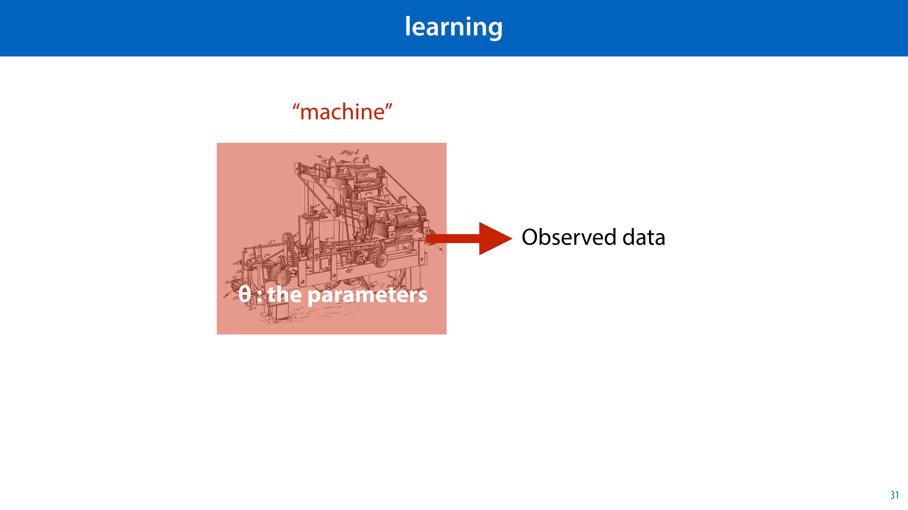

            <figcaption>
            
Here is an analogy for the way probability is usually applied in statistics and machine learning. We assume some “machine” (which could be any process, the universe, or an actual machine) has <em>generated</em> our data, by a process that is partly deterministic and partly random. The configuration of this machine is determined by its <strong>parameters </strong>(theta). Theta could be a single number, several numbers or even a complicated data structure. 

We know how the machine works, so if we know theta, we know the probability of each dataset. The problem is that we only observe the data.

            </figcaption>

            click image for animation
            
       </section>

       <section id="slide-032">
            <a class="slide-link" href="https://mlvu.github.io/lecture05#slide-032">link here</a>
            

            <figcaption>
            
In frequentist learning, we are given some data and our job is to guess to true model (out of a model class) that generated some data.  

In the frequentist view of the world, the true model is not subject to probability. It doesn’t change if we repeat the experiment, so we shouldn’t apply probability to it. We just try to guess which it is. This is typical of frequentist approaches: we build algorithms that gives us a <strong>point estimate</strong> for our model parameters. That is , they return one point in our model space. 

One of the most common criteria is that we should prefer the model (represented by theta) for which the probability of seeing the data that we saw is highest. This is called the<em> </em><strong>maximum likelihood principle</strong>. Under the maximum likelihood principle, picking a model becomes an optimization problem.  

Often, we make the problem easier by optimizing for the logarithm of the likelihood. This doesn’t move the optimum, but the log-likelihood is an easier function to deal with. 

            </figcaption>
       </section>

       <section id="slide-032" class="anim">
            <a class="slide-link" href="https://mlvu.github.io/lecture05#slide-033">link here</a>
            

            <figcaption>
            
In Bayesian learning, we can talk about the probability of the true model parameters taking a particular value. We don’t know the true parameters, but the data gives us some idea, so we express that uncertainty a probability distribution <em>over the model space</em>. 

The three parts of the right-hand side have these names. The prior distribution is a name you’ll hear often; it expresses our beliefs about the model before we’ve seen the data. For instance if we do spam classification in a Bayesian way, we might have a prior belief about the probability of spam, which we then update by looking at the content of the email (the data). Our beliefs about the parameters after seeing the data, is expressed by the posterior distribution. 

Note that Bayesian learning does, in principle, not require us to search or optimize anything. If we can work out the function on the right hand side of this equation, we have everything we need. If we need a good model, we can pick the one to which p(θ|X) assigns the highest probability, or we can sample a model and get a good fit with high probability. We can also study other properties of the distribution: for instance the variance of this distribution is a good indication of how uncertain we still are about the parameters of the model.  

In some cases, like for normal distributions, we can work all of this out analytically. For more complicated models, it’s usually impossible to work out the posterior analytically, and we have to make do with a function that approximates it, or with a number of individual  <em>samples </em>from the posterior. 

We won’t deal with pure Bayesian learning much in this course, but in machine learning the distinction between frequentist and Bayesian learning is not always adhered to religiously and concepts from both are sometimes freely combined.

            </figcaption>

            click image for animation
            
       </section>

       <section id="slide-034">
            <a class="slide-link" href="https://mlvu.github.io/lecture05#slide-034">link here</a>
            

            <figcaption>
            
To explain both maximum likelihood fitting and Bayesian learning, let’s look at a simple example. We have two coins, a bent one and a straight one. Flipping these coins gives us different probabilities of heads and tails. 

We ask a friend to pick a random coin without showing us, and to flip it twelve times. The resulting sequence has more heads than tails, but not such a disparity that you would never expect it from a fair coin. If we had to guess which coin our friend had picked, which should we guess? 

image source: <a href="https://www.magictricks.com/bent.html"><strong class="blue">https://www.magictricks.com/bent.html</strong></a> 

            </figcaption>
       </section>

       <section id="slide-035">
            <a class="slide-link" href="https://mlvu.github.io/lecture05#slide-035">link here</a>
            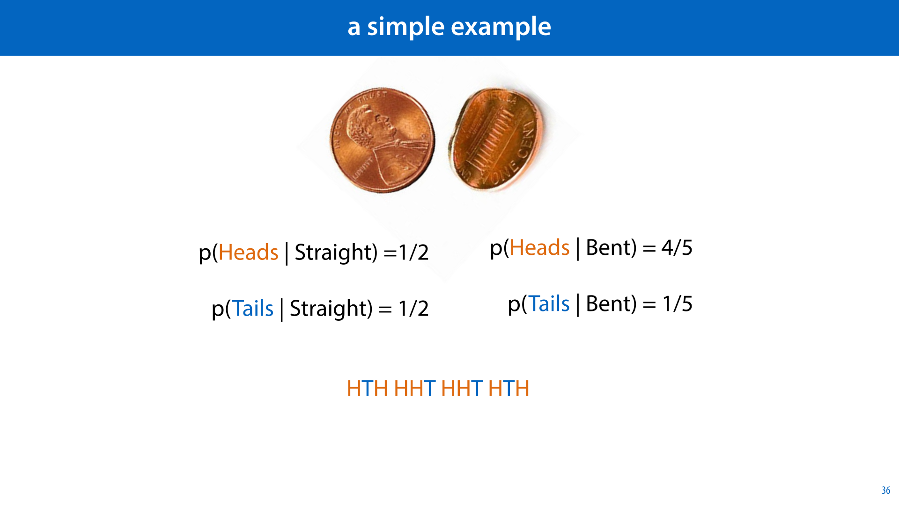

            <figcaption>
            
This is a simple version of a <strong>model selection</strong> problem. Our model class consists of two models (the two coins) and our data consists of 12 instances (the results of the coin flips). 

Note that picking just<em> one</em> coin is a frequentist approach, and giving each coin a probability is a Bayesian approach. 

image source: <a href="https://www.magictricks.com/bent.html"><strong class="blue">https://www.magictricks.com/bent.html</strong></a> 

            </figcaption>
       </section>

       <section id="slide-036">
            <a class="slide-link" href="https://mlvu.github.io/lecture05#slide-036">link here</a>
            

            <figcaption>
            
Let’s start with maximum likelihood. Here is the optimization objective. We need to work out the probability of the data given the model for each model, and pick the highest one.

            </figcaption>
       </section>

       <section id="slide-037">
            <a class="slide-link" href="https://mlvu.github.io/lecture05#slide-037">link here</a>
            

            <figcaption>
            
Since the coin flips are independent, the probability over the whole sequence is just the product over the probabilities of the individual flips. There’s not much in it, but the likelihood for the bent coin is slightly higher, so that’s the preferred model under the maximum likelihood criterion.

            </figcaption>
       </section>

       <section id="slide-038">
            <a class="slide-link" href="https://mlvu.github.io/lecture05#slide-038">link here</a>
            

            <figcaption>
            
We often take the logarithm of the likelihood. The logarithm is a monotonic function so the likelihood and the log likelihood have their minima in the same place, but the log likelihood is often easier to manipulate symbolically (see the first homework exercise). 

The log likelihood of a probability distribution is a lot like the loss functions we’ve already encountered many times. 

In fact, if we want to fit a probability distribution inside a deep learning system, we usually take the negative log likelihood, so that we can do gradient descent. 

            </figcaption>
       </section>

       <section id="slide-039">
            <a class="slide-link" href="https://mlvu.github.io/lecture05#slide-039">link here</a>
            

            <figcaption>
            
We can see how a loss function and a log-likelhood are similar when we look at a normal distribution. The likelihood function of the normal distribution is this complicated function.  

The probability density of our whole data, given some mean and standard deviation, is simply the product of all individual probability densities. This follows from the assumption that instance data is independently drawn from the same distribution.   

We take the logarithm of this product, to give us the log likelihood of some data.

            </figcaption>
       </section>

       <section id="slide-039" class="anim">
            <a class="slide-link" href="https://mlvu.github.io/lecture05#slide-040">link here</a>
            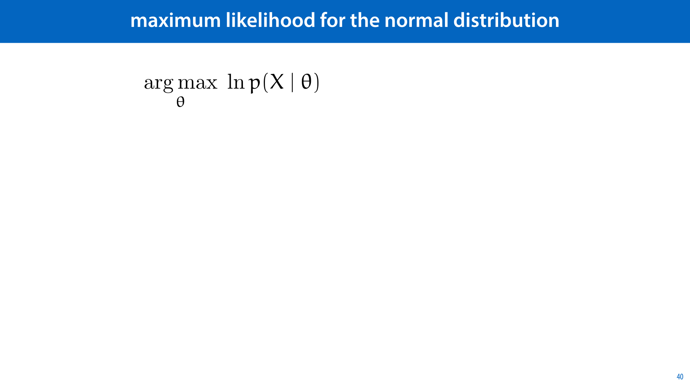

            <figcaption>
            
We want to find the mean and standard deviation for which the log likelihood is maximal. We will leave the full derivation for later, but here are the first few steps. This should show you how the logarithm simplifies things. 

First, we can turn the product into a sum by moving the logarithm inside. This is explain in detail in the first homework. 

We fill in the definition of the actual probability density function we’re using (line 3). This function is the product of two factors (the division and the exponent) which become terms if we work them out of the logarithm. In the second term the exponent cancels against the logarithm. 

We usually use a base-e logarithm, because it will cancel out against the base-e exponent in the probability density for the normal distribution. 

            </figcaption>

            click image for animation
            
       </section>

       <section id="slide-041">
            <a class="slide-link" href="https://mlvu.github.io/lecture05#slide-041">link here</a>
            

            <figcaption>
            
This is enough to show that with the log likelihood we have another “landscape” on top of our model space. If we didn’t want to work out the rest analytically, we could just find the optimum by gradient descent or even random search.

            </figcaption>
       </section>

       <section id="slide-041" class="anim">
            <a class="slide-link" href="https://mlvu.github.io/lecture05#slide-042">link here</a>
            

            <figcaption>
            

            </figcaption>

            click image for animation
            
       </section>

       <section id="slide-042" class="anim">
            <a class="slide-link" href="https://mlvu.github.io/lecture05#slide-043">link here</a>
            

            <figcaption>
            
The Bayesian approach is a little different. We won’t go into the details, but we’ll a brief outline of how it works on the coin example, just to give you a basic idea.  

We first need to establish a prior. What is the probability of each coin in our model space. We said that we’d asked a friend to pick a coin at random. If we assume that he follows our instructions, then we believe each coin is equally likely so both get 0.5 probability. If we had two fair coins and one bent one, we could set the prior to 1/3 for bent and 2/3 for fair. 

This is an important thing to understand about choosing a prior: it allows us to encode our assumptions about the problem. And as we saw when we discussed the problem of induction, these assumptions are what make learning possible at all.

            </figcaption>

            click image for animation
            
       </section>

       <section id="slide-043" class="anim">
            <a class="slide-link" href="https://mlvu.github.io/lecture05#slide-044">link here</a>
            

            <figcaption>
            

            </figcaption>

            click image for animation
            
       </section>

       <section id="slide-045">
            <a class="slide-link" href="https://mlvu.github.io/lecture05#slide-045">link here</a>
            

            <figcaption>
            
This is one way to think about Bayes’ rule: we’ve observed an outcome, in this case the data, which can have a number of causes. The joint probability of a cause with an outcome in the prior of the cause times the probability of the outcome given the cause. If we sum up all these joint probabilties, the the proportion in that sum for cause X is the probability of the cause given the observation.

            </figcaption>
       </section>

       <section id="slide-045" class="anim">
            <a class="slide-link" href="https://mlvu.github.io/lecture05#slide-046">link here</a>
            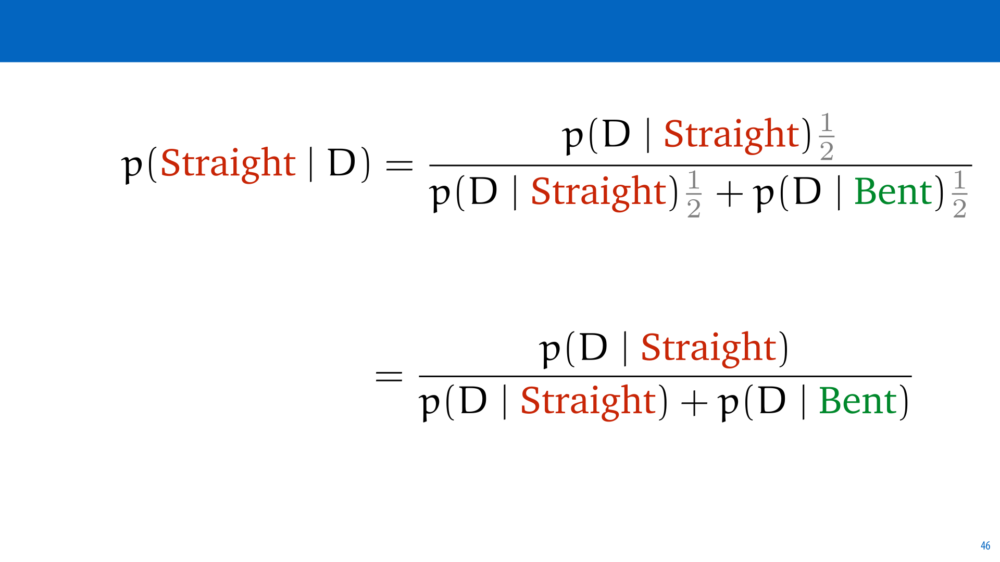

            <figcaption>
            
If we choose a  uniform prior (each model gets the same probability), then the priors cancel out and we are just left with a sum over the data probabilities, which we computed already.

            </figcaption>

            click image for animation
            
       </section>

       <section id="slide-047">
            <a class="slide-link" href="https://mlvu.github.io/lecture05#slide-047">link here</a>
            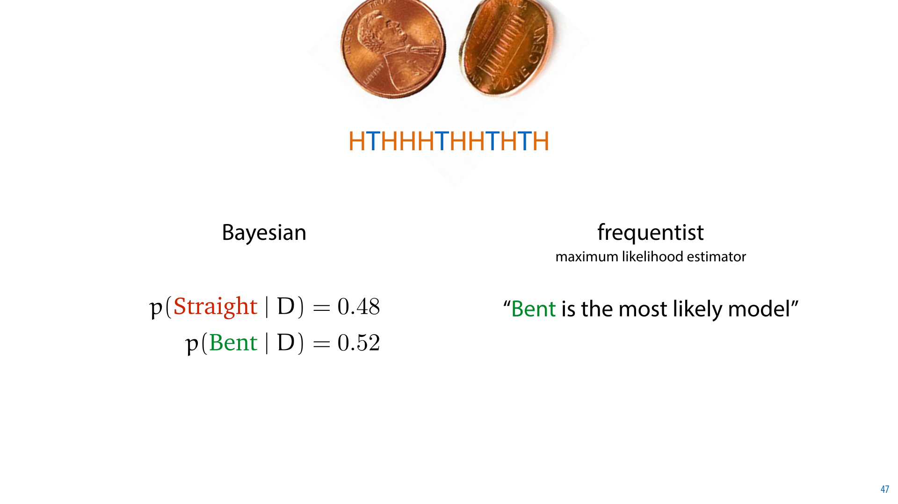

            <figcaption>
            
If we work this out, we get these probabilites for the posterior.  

Note the difference with the maximum likelihood case. Even though the differences between the two likelihoods were minimal, we only get one choice for the true model in the frequentist approach. In the Bayesian approach we get a distribution on the model space. It tells us not just that Bent is the more likely model, but also that<em> both models</em> are still quite likely. In this sense, getting a posterior distribution is a much more valuable result than getting a point estimate for your model. 

The downside of Bayesian analysis is that as the models get more complex, it gets more and more difficult to accurately approximate the posterior, and trying to do so is what has led to some of the most complicated material in machine learning.

            </figcaption>
       </section>

       <section class="video" id="video-047">
           <a class="slide-link" href="https://mlvu.github.io/lecture05#video-47">link here</a>
           <iframe
                src="https://www.youtube.com/embed/fK6dQYkeVqA?modestbranding=1&showinfo=0&rel=0"
                title="YouTube video player"
                frameborder="0" allow="accelerometer; autoplay; clipboard-write; encrypted-media; gyroscope; picture-in-picture"
                allowfullscreen>
           </iframe>

       </section>

       <section id="slide-048">
            <a class="slide-link" href="https://mlvu.github.io/lecture05#slide-048">link here</a>
            

            <figcaption>
            
In this lecture we’ll try to connect this probability business into the abstract task of classification. 

<lnbr></lnbr>

            </figcaption>
       </section>

       <section id="slide-049">
            <a class="slide-link" href="https://mlvu.github.io/lecture05#slide-049">link here</a>
            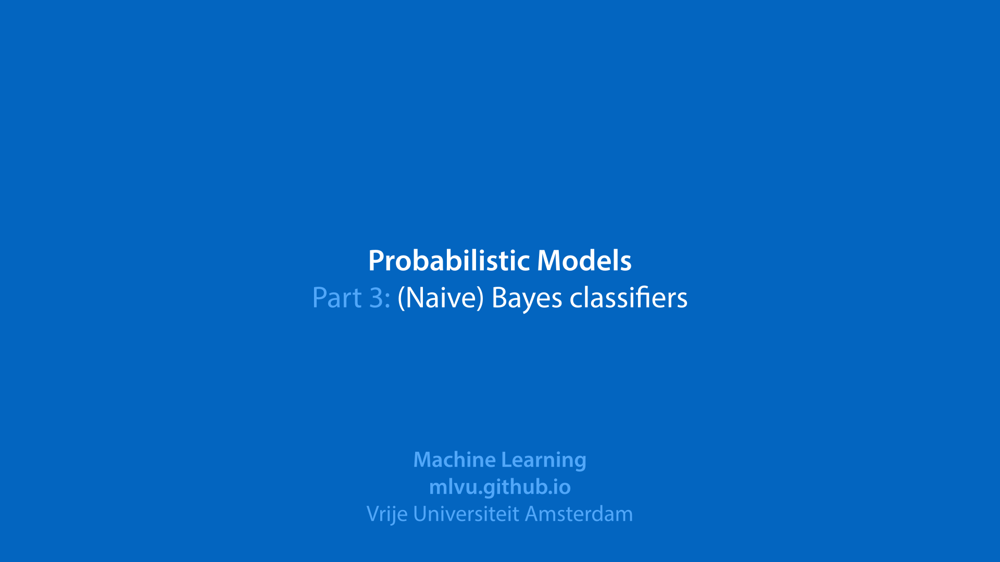

            <figcaption>
            
We will focus on building <strong>probabilistic classifiers</strong>. These are classifiers that return not just a class for a given instance x (or a ranking) but a probability over all classes. 

This can be very useful. We can use the probabilities to extract a ranking (and plot an ROC curve) or we can use the probabilities to assess how certain the classifier is. If we don’t want the probabilities, we can just turn it into a regular classifier by picking the class with the highest probability. 

Note that a probabilistic classifier is also immediately a ranking classifier (if we rank by how likely the positive class is) and a regular classifier (if we pick the class with the highest probability).

            </figcaption>
       </section>

       <section id="slide-049" class="anim">
            <a class="slide-link" href="https://mlvu.github.io/lecture05#slide-050">link here</a>
            

            <figcaption>
            
There are two approaches to casting the classification problem in probabilistic terms. A <strong>generative classifier</strong> focuses on learning a distribution on the feature space given the class p(X|Y). This distribution is then combined with Bayes’ rule to get the probability over the classes, conditioned on the data. 

A<strong> discriminative classifier</strong> learns the function p(Y|X) directly with X as input and class probabilities as output. It functions as a kind of regression, mapping x to a vector of class probabilities. 

 We’ll look at some simple generative classifiers first. 

 

            </figcaption>

            click image for animation
            
       </section>

       <section id="slide-051">
            <a class="slide-link" href="https://mlvu.github.io/lecture05#slide-051">link here</a>
            

            <figcaption>
            
Here are three approaches, arranged from impractical but entirely correct to highly practical, but based on largely incorrect assumptions. 

We won’t discuss the Bayes optimal classifier in this course, but it’s worth knowing that it exists, and that it means something different than a (naive) Bayes classifier.

            </figcaption>
       </section>

       <section id="slide-052">
            <a class="slide-link" href="https://mlvu.github.io/lecture05#slide-052">link here</a>
            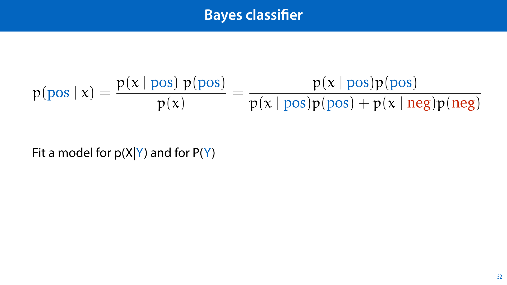

            <figcaption>
            
For the Bayes classifier, we start with the probability we’re interested in p(Y|X): the probability of the class given the data. We then rewrite this using Bayes’ rule. From the final form, we see that if we compute the probability functions p(X|Y), the data given the class and p(Y), the prior probability of the class, we can compute the probabilites we;re interested in: the class probabilities given the data. 

So the task becomes to learn functions for those two probabilties.

            </figcaption>
       </section>

       <section id="slide-052" class="anim">
            <a class="slide-link" href="https://mlvu.github.io/lecture05#slide-053">link here</a>
            

            <figcaption>
            
So here is the algorithm for a simple Bayes classifier. We choose a model class for P(X|Y), for instance multivariate normal distributions. We fit such a model separately to each class to gie us one distribution 

            </figcaption>

            click image for animation
            
       </section>

       <section id="slide-054">
            <a class="slide-link" href="https://mlvu.github.io/lecture05#slide-054">link here</a>
            

            <figcaption>
            
Here is an example of what that looks like with 2 features. On the left we have two classes, blue and black. We fit a 2D normal distribution to each. Then, for a new point, we see which assigns the new point the highest probability density. 

The red line provides the decision boundary. 

 

            </figcaption>
       </section>

       <section id="slide-055">
            <a class="slide-link" href="https://mlvu.github.io/lecture05#slide-055">link here</a>
            

            <figcaption>
            
This works well for small numbers of features, but if we have many features, modelling the dependence between each pair of features gets very expensive.  

A crude, but very effective solution is Naive Bayes. NB just assumes that all features are independent, conditional on the class. 

Note that we do not assume that the features are independent: it’s perfectly possible for one feature to be dependent on another feature, but the are conditionally independent. Informally, the dependency between the features is “caused” by the class and nothing else. Just like Alice and Bob in the first video: their lateness had only one possible shared cause, the monster, and once we’d isolated that, their lateness was independent.

            </figcaption>
       </section>

       <section id="slide-056">
            <a class="slide-link" href="https://mlvu.github.io/lecture05#slide-056">link here</a>
            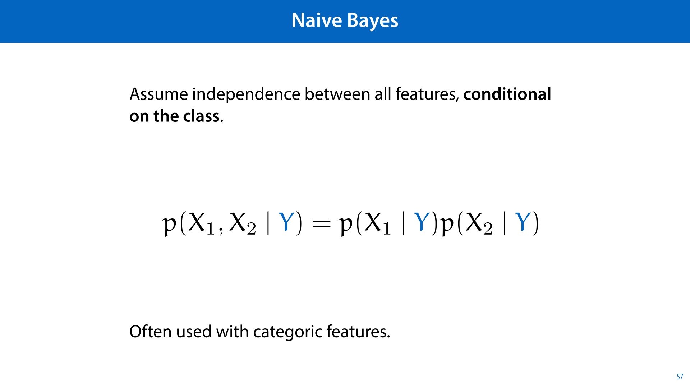

            <figcaption>
            
Here is an example dataset, with binary features. Each feature indicates whether a particular word occurs in that instance. 

We will build a naive Bayes classifier for this data by simply fitting a bernoulli distribution to each feature. That is, we will estimate p(“pill”|spam) as the relative frequency with which the “pill” feature was true for spam emails.

            </figcaption>
       </section>

       <section id="slide-057">
            <a class="slide-link" href="https://mlvu.github.io/lecture05#slide-057">link here</a>
            

            <figcaption>
            
Here is what Naive Bayes does: it selects all emails of one class, and then estimates the probability that X1 will be T as the relative frequency of emails for which X1 was T in the training set. 

Strictly speaking, we are modelling X1 as a Bernoulli distribution whose parameter we estimate as 2/6

            </figcaption>
       </section>

       <section id="slide-058">
            <a class="slide-link" href="https://mlvu.github.io/lecture05#slide-058">link here</a>
            

            <figcaption>
            
We do the same for the spam class and for the other feature.

            </figcaption>
       </section>

       <section id="slide-059">
            <a class="slide-link" href="https://mlvu.github.io/lecture05#slide-059">link here</a>
            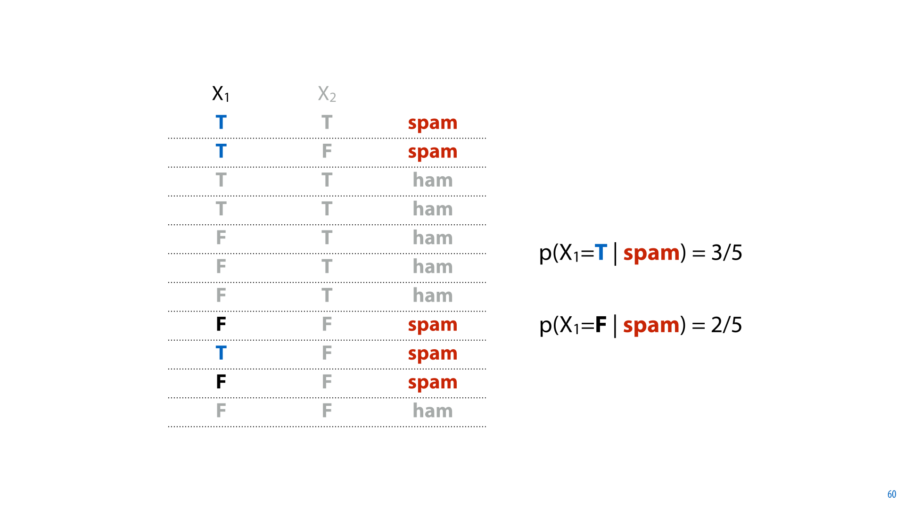

            <figcaption>
            
This is the naive Bayes assumption formulaically. We simply factor p(X1,…Xn) into n separate, independent probabilities.

            </figcaption>
       </section>

       <section id="slide-059" class="anim">
            <a class="slide-link" href="https://mlvu.github.io/lecture05#slide-060">link here</a>
            

            <figcaption>
            

            </figcaption>

            click image for animation
            
       </section>

       <section id="slide-061">
            <a class="slide-link" href="https://mlvu.github.io/lecture05#slide-061">link here</a>
            

            <figcaption>
            
While Naive Bayes can work surprisingly well (given how strong and incorrect the assumption is), we do run into a problem if for some feature a particular value does not occur. In that case, we estimate the probability as 0.

            </figcaption>
       </section>

       <section id="slide-062">
            <a class="slide-link" href="https://mlvu.github.io/lecture05#slide-062">link here</a>
            

            <figcaption>
            
Since the whole estimate of our probability is just a long product, if one of the factors becomes zero, the whole things collapses. Even if all the other features gave this class a very high probability, that information is lost. 

            </figcaption>
       </section>

       <section id="slide-063">
            <a class="slide-link" href="https://mlvu.github.io/lecture05#slide-063">link here</a>
            

            <figcaption>
            
To remedy this, we need to apply smoothing. The simplest was to do that is to add pseudo-observations. For each possible value, we add an instance where all the features have that value. 

(We should do the same for the class ham).

            </figcaption>
       </section>

       <section id="slide-064">
            <a class="slide-link" href="https://mlvu.github.io/lecture05#slide-064">link here</a>
            

            <figcaption>
            
This changes our estimates as shown here (i.e. we don’t actually need to add the pseudo-observations, we just change our estimator). 

 

Here, v is the number of different values X1 can take. 

In practice, we often reduce the weight of 

            </figcaption>
       </section>

       <section id="slide-065">
            <a class="slide-link" href="https://mlvu.github.io/lecture05#slide-065">link here</a>
            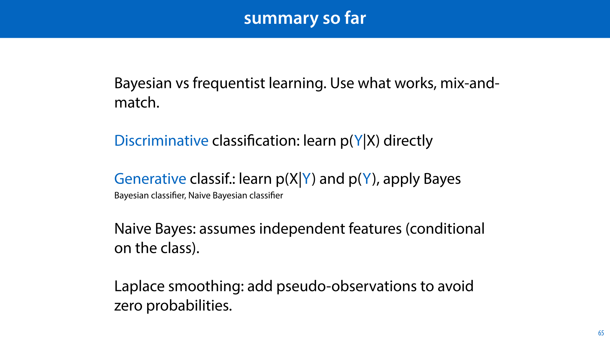

            <figcaption>
            

            </figcaption>
       </section>

       <section class="video" id="video-065">
           <a class="slide-link" href="https://mlvu.github.io/lecture05#video-65">link here</a>
           <iframe
                src="https://www.youtube.com/embed/EYhxR22Ta88?modestbranding=1&showinfo=0&rel=0"
                title="YouTube video player"
                frameborder="0" allow="accelerometer; autoplay; clipboard-write; encrypted-media; gyroscope; picture-in-picture"
                allowfullscreen>
           </iframe>

       </section>

       <section id="slide-066">
            <a class="slide-link" href="https://mlvu.github.io/lecture05#slide-066">link here</a>
            

            <figcaption>
            
<lnbr></lnbr> 

            </figcaption>
       </section>

       <section id="slide-067">
            <a class="slide-link" href="https://mlvu.github.io/lecture05#slide-067">link here</a>
            

            <figcaption>
            
In this video we’ll look at an example of a discriminative classifier. This is a classifier that learns to map the features directly to class probabilities, without using Bayes’ rule to reverse the conditional probability. 

            </figcaption>
       </section>

       <section id="slide-068">
            <a class="slide-link" href="https://mlvu.github.io/lecture05#slide-068">link here</a>
            

            <figcaption>
            
Remember that we were still on the lookout for good loss functions for the classification problem. We’ll use the language of probability to define one for us.

            </figcaption>
       </section>

       <section id="slide-069">
            <a class="slide-link" href="https://mlvu.github.io/lecture05#slide-069">link here</a>
            

            <figcaption>
            
This was our last attempt: the least squares loss. 

Our thinking was: the hyperplane classifier checks if <strong>w</strong><strong>x </strong>+ b is positive or negative, to decide whether to assign classes blue or red, respectively. Why not just give blue and red some arbitrary positive and negative values, and treat it as a regression problem.

            </figcaption>
       </section>

       <section id="slide-070">
            <a class="slide-link" href="https://mlvu.github.io/lecture05#slide-070">link here</a>
            

            <figcaption>
            
Here is another option: instead of giving negative and positive arbitrary values, we given them <em>probabilities</em>: the probability of being positive, which is 1 for all blue points and 0 for all red points. (In other words, we move the red points from -1 to 0). 

This doesn’t look substantially different to our linear classifier because our function <strong>w</strong>T<strong>x </strong>+ b still ranges from negative infinity to positive infinity. It doesn’t produce probabilities, except over a very narrow range. 

What we need, is a way to squeeze that whole range into the range [0, 1], so that the model only ever produces valid probabilities.

            </figcaption>
       </section>

       <section id="slide-070" class="anim">
            <a class="slide-link" href="https://mlvu.github.io/lecture05#slide-071">link here</a>
            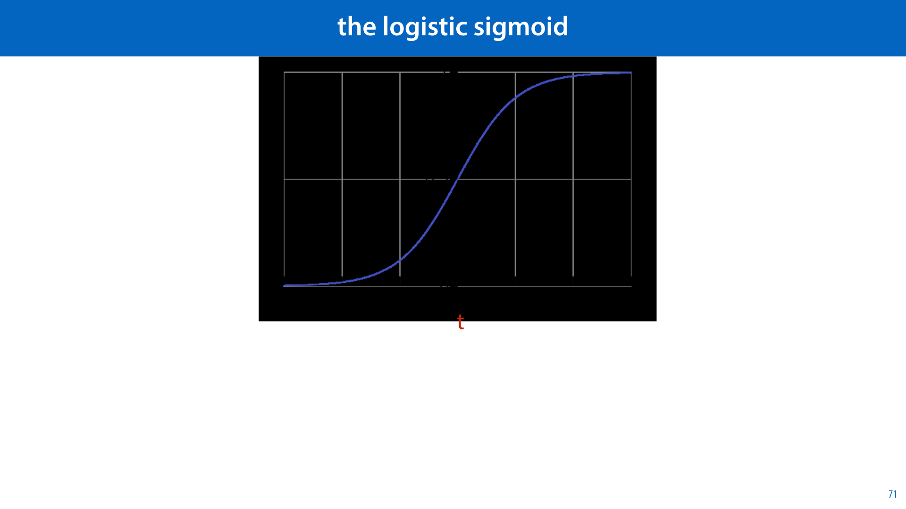

            <figcaption>
            
For this purpose, we will use the <strong>logistic sigmoid</strong>. Note that its domain is the entire real number line, and its range is [0,1]. 

An interesting property of the logistic sigmoid is the symmetry given in the second line. Basically the remainder between sigma(t) and 1, is itself a sigmoid running in the other direction. In other words: flipping the sigmoid horizontally, 1 - σ(t), gives us the same function as flipping the sigmoid vertically,  σ(-t). We’ll make frequent use of this later. 

 

source: By Qef (talk) - Created from scratch with gnuplot, Public Domain, https://commons.wikimedia.org/w/index.php?curid=4310325

            </figcaption>

            click image for animation
            
       </section>

       <section id="slide-072">
            <a class="slide-link" href="https://mlvu.github.io/lecture05#slide-072">link here</a>
            

            <figcaption>
            
This is our new classifier: we compute the linear function as before, but we apply the logistic sigmoid to the result, squeezing it into the interval [0, 1]. This means that we can interpret the output as the probability of the positive class. This may be a very accurate probability, or a very inaccurate one, depending on how we choose <strong>w</strong> and b, but it’s always a value between 0 and 1. 

Now all we need is a<strong> loss function</strong> that tells us which probabilities match the data.

            </figcaption>
       </section>

       <section id="slide-073">
            <a class="slide-link" href="https://mlvu.github.io/lecture05#slide-073">link here</a>
            

            <figcaption>
            
Clearly, we want a classifier that assigns high probability to the true label, and low probability to the false one. If we treat the classifier as a model for our data, we can compute the probability of the 

            </figcaption>
       </section>

       <section id="slide-074">
            <a class="slide-link" href="https://mlvu.github.io/lecture05#slide-074">link here</a>
            

            <figcaption>
            

            </figcaption>
       </section>

       <section id="slide-074" class="anim">
            <a class="slide-link" href="https://mlvu.github.io/lecture05#slide-075">link here</a>
            

            <figcaption>
            

            </figcaption>

            click image for animation
            
       </section>

       <section id="slide-076">
            <a class="slide-link" href="https://mlvu.github.io/lecture05#slide-076">link here</a>
            

            <figcaption>
            
In the least-squares case, the loss function could be thought of in terms of the residuals between the prediction and the true values. They pull on the line like rubber bands.

            </figcaption>
       </section>

       <section id="slide-077">
            <a class="slide-link" href="https://mlvu.github.io/lecture05#slide-077">link here</a>
            

            <figcaption>
            
For the cross entropy loss, we can imagine the residuals for logistic regression as the lines drawn here. The cross entropy loss tries to maximise these lines by minimising the negative of their logarithm. You can think of them as little rods pushing the sigmoid towards the red and blue points.

            </figcaption>
       </section>

       <section id="slide-078">
            <a class="slide-link" href="https://mlvu.github.io/lecture05#slide-078">link here</a>
            

            <figcaption>
            
Remember that in the least squares loss we squared the residuals before summing them, to punish outliers. Taking the logarithm has a similar effect. Low probabilities are disproportionately punished.

            </figcaption>
       </section>

       <section id="slide-078" class="anim">
            <a class="slide-link" href="https://mlvu.github.io/lecture05#slide-079">link here</a>
            

            <figcaption>
            
We’ll show you the basics of working out the gradient for logistic regression. The loss breaks apart in separate terms for the positive and negative points. Let’s look at one of the positive terms (the negative can be derived in a similar way).

            </figcaption>

            click image for animation
            
       </section>

       <section id="slide-079" class="anim">
            <a class="slide-link" href="https://mlvu.github.io/lecture05#slide-080">link here</a>
            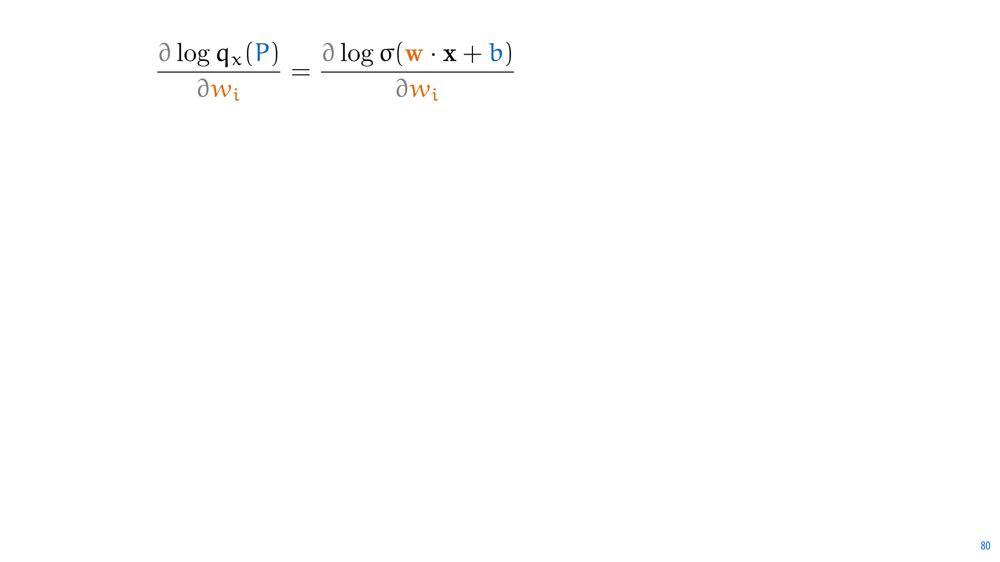

            <figcaption>
            
Let’s work the derivative for one of the weights. 

 

d logb(x)/ dx = (1 /(ln b)) (1/x)

            </figcaption>

            click image for animation
            
       </section>

       <section id="slide-081">
            <a class="slide-link" href="https://mlvu.github.io/lecture05#slide-081">link here</a>
            

            <figcaption>
            
Note that despite the intimidating formulas in the middle, the result is actually very simple. This is one of the properties of the logistic sigmoid, it tends to cancel itself out when the derivative is taken. 

We ignore the constant multiplier (1/ln2) in the fourth line, because it doesn’t change the direction of the gradient, only the magnitude. When we apply gradient descent we scale the gradient by a constant multiplier anyway, so we can ignore it. (Another option is to use the natural logarithm in the definition of the cross entropy). 

 

d logb(x)/ dx = (1 /(ln b)) (1/x)

            </figcaption>
       </section>

       <section id="slide-082">
            <a class="slide-link" href="https://mlvu.github.io/lecture05#slide-082">link here</a>
            

            <figcaption>
            

            </figcaption>
       </section>

       <section id="slide-083">
            <a class="slide-link" href="https://mlvu.github.io/lecture05#slide-083">link here</a>
            

            <figcaption>
            
<em>Regression</em> is a bit of misnomer, since we’re building a classifier. I suppose the confusing terminology comes from the fact that we’re fitting a (curved) line through the probability values in the data.

            </figcaption>
       </section>

       <section id="slide-084">
            <a class="slide-link" href="https://mlvu.github.io/lecture05#slide-084">link here</a>
            

            <figcaption>
            
Here is a 2D dataset that shows a common failure case for the least square classifier. The points at the top are so far away from the ideal decision boundary that they will have huge residuals under the least squares model.

            </figcaption>
       </section>

       <section id="slide-085">
            <a class="slide-link" href="https://mlvu.github.io/lecture05#slide-085">link here</a>
            

            <figcaption>
            
Here is what the least-square regression converges to. Clearly, this is not a satisfying solution for such an easily separable dataset. The blue points at the top are so far from the decision boundary. 

 

In the linear models 1 lecture, we fixed one of the parameters to 1, so that we could plot the loss surface. This time, we’re optimizing all three parameters. 

            </figcaption>
       </section>

       <section id="slide-086">
            <a class="slide-link" href="https://mlvu.github.io/lecture05#slide-086">link here</a>
            

            <figcaption>
            
Here is a 1D view of a similar situation.  

If we want the <strong class="green">decision boundary</strong> to be between the red and blue classes, the residuals for the far-away blue points become very big.

            </figcaption>
       </section>

       <section id="slide-086" class="anim">
            <a class="slide-link" href="https://mlvu.github.io/lecture05#slide-087">link here</a>
            

            <figcaption>
            
The logistic model doesn’t have this problem.If the model fits well around the decision boundary, it doesn’t have to worry at all about points that are far away (if they’re on the right side of the boundary),

            </figcaption>

            click image for animation
            
       </section>

       <section id="slide-088">
            <a class="slide-link" href="https://mlvu.github.io/lecture05#slide-088">link here</a>
            

            <figcaption>
            
And here is the logistic regression classifier. 

            </figcaption>
       </section>

       <section id="slide-089">
            <a class="slide-link" href="https://mlvu.github.io/lecture05#slide-089">link here</a>
            

            <figcaption>
            
And here is the probability function (blue is high probability of positive, red is high probability of negative).

            </figcaption>
       </section>

       <section id="slide-090">
            <a class="slide-link" href="https://mlvu.github.io/lecture05#slide-090">link here</a>
            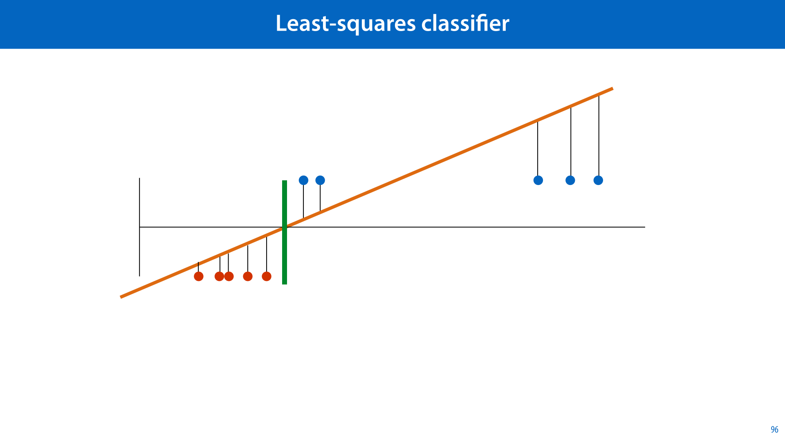

            <figcaption>
            
Note that for such well-separable classes, there are many suitable classifier, and logistic regression has no reason to prefer one over the other (all points are assigned the correct probability very close to 1). We’ll see a solution to this problem next lecture, when we meet our final loss function: the SVM loss.

            </figcaption>
       </section>

       <section id="slide-091">
            <a class="slide-link" href="https://mlvu.github.io/lecture05#slide-091">link here</a>
            

            <figcaption>
            

            </figcaption>
       </section>

       <section class="video" id="video-091">
           <a class="slide-link" href="https://mlvu.github.io/lecture05#video-91">link here</a>
           <iframe
                src="https://www.youtube.com/embed/mSneVjDvzNQ?modestbranding=1&showinfo=0&rel=0"
                title="YouTube video player"
                frameborder="0" allow="accelerometer; autoplay; clipboard-write; encrypted-media; gyroscope; picture-in-picture"
                allowfullscreen>
           </iframe>

       </section>

       <section id="slide-092">
            <a class="slide-link" href="https://mlvu.github.io/lecture05#slide-092">link here</a>
            

            <figcaption>
            
<lnbr></lnbr> 

            </figcaption>
       </section>

       <section id="slide-093">
            <a class="slide-link" href="https://mlvu.github.io/lecture05#slide-093">link here</a>
            

            <figcaption>
            
Information theory is all about the relation between encoding information and probability theory. 

Imagine you’re on holiday, and you’ve brought your travel monopoly. Unfortunately, the dice have gone missing. You do however, have a coin with you. Can you use the coin flip to simulate the throw of a six sided  die?

            </figcaption>
       </section>

       <section id="slide-094">
            <a class="slide-link" href="https://mlvu.github.io/lecture05#slide-094">link here</a>
            

            <figcaption>
            
For a four sided die, the solution is easy. We flip the coin twice, and assign a number to each possible outcome. 

source: <a href="http://www.midlamminiatures.co.uk/blackpolydice/D4Black.html"><strong class="blue">http://www.midlamminiatures.co.uk/blackpolydice/D4Black.html</strong></a>

<a href="http://www.midlamminiatures.co.uk/blackpolydice/D4Black.html"><strong class="blue"></strong></a>

            </figcaption>
       </section>

       <section id="slide-095">
            <a class="slide-link" href="https://mlvu.github.io/lecture05#slide-095">link here</a>
            

            <figcaption>
            
A six sided die is more tricky. We’ll show the solution for three “sides” (you can just add another coin flip to decide whether it’ll be 1,2,3 or 4,5,6.) 

The trick is to assign the fourth outcome to a “reset”. If you throw two heads in a row, you just start again. Theoretically you could be coin flipping forever, but the probability of resetting more than five times is already less than one in one-thousand. 

For now let’s stick with trees where each outcome is represented by only one leaf (and accept that the six-sides die cannot be perfectly modelled with a coin). What distributions can we model with a coin in this way, if we require each outcome to be represented by one leaf in the tree?

            </figcaption>
       </section>

       <section id="slide-096">
            <a class="slide-link" href="https://mlvu.github.io/lecture05#slide-096">link here</a>
            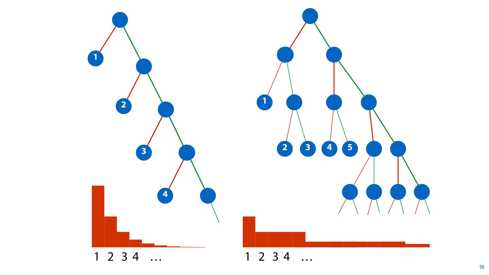

            <figcaption>
            
Here are two examples: an exponentially decaying distribution, and a (roughly) polynomially decaying one.

            </figcaption>
       </section>

       <section id="slide-096" class="anim">
            <a class="slide-link" href="https://mlvu.github.io/lecture05#slide-097">link here</a>
            

            <figcaption>
            
These kinds of trees are called prefix-free trees, because they assign a <em>prefix free code</em> to the set of outcomes (we just replace heads and tails with zeros and ones). The benefit is that if we want to encode a sequence of these outcomes, we can just stick the code one after another and we won’t need any delimiters. A decoder will know exactly where each codeword ends and the next begins.

            </figcaption>

            click image for animation
            
       </section>

       <section id="slide-097" class="anim">
            <a class="slide-link" href="https://mlvu.github.io/lecture05#slide-098">link here</a>
            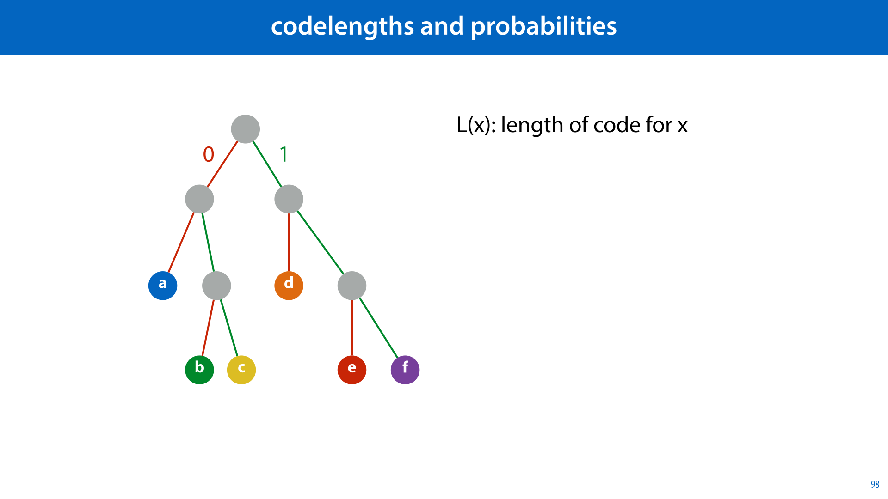

            <figcaption>
            
Every prefix tree defines a probability distribution and a code. What about the other way around? Can we find a tree for any given probability distribution?  

We already saw that some distributions (like a six-sided die) cannot be represented exactly. But how close can we get?

            </figcaption>

            click image for animation
            
       </section>

       <section id="slide-099">
            <a class="slide-link" href="https://mlvu.github.io/lecture05#slide-099">link here</a>
            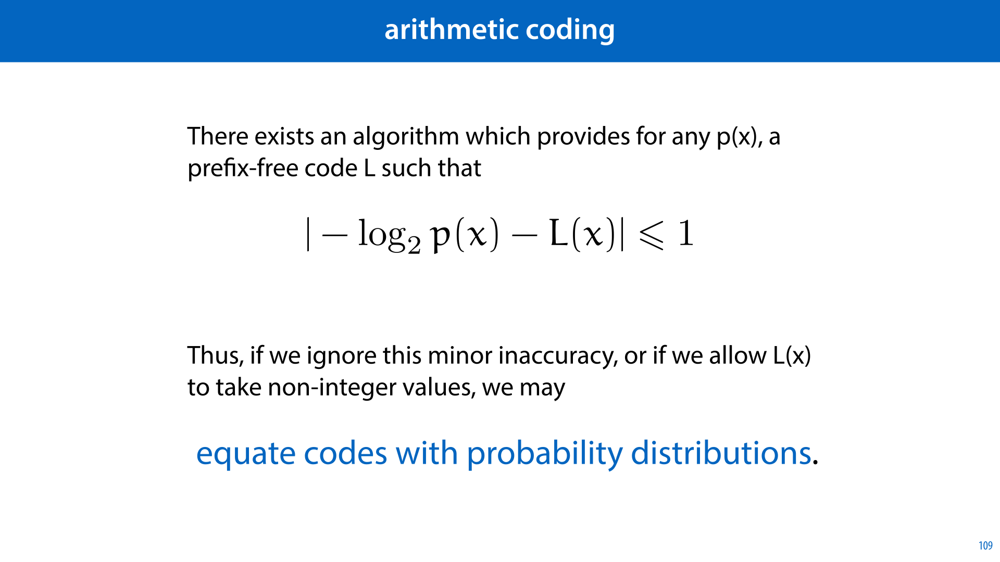

            <figcaption>
            
It turns out we can model any distribution in such a way that the biggest difference in codelength is no larger than a bit. 

If we handwave this difference, we can equate codes with probability distributions: every code gives us a distribution and every distribution gives us a code. The higher the probability of an outcome, the shorter its codelength.

            </figcaption>
       </section>

       <section id="slide-099" class="anim">
            <a class="slide-link" href="https://mlvu.github.io/lecture05#slide-100">link here</a>
            

            <figcaption>
            
The entropy of a distribution is the expected codelength of an element sampled from that distribution.

            </figcaption>

            click image for animation
            
       </section>

       <section id="slide-100" class="anim">
            <a class="slide-link" href="https://mlvu.github.io/lecture05#slide-101">link here</a>
            

            <figcaption>
            
The more uniform our distribution is (the more unsure we are) the higher the entropy. 

In the middle, we know something about our distribution, for instance that a is very likely, so we can make the codeword for a a little shorter, reducing the expected codelength (the entropy). On the left, we have no such options, so the entropy is maximal (equal to log2 N). 

            </figcaption>

            click image for animation
            
       </section>

       <section id="slide-101" class="anim">
            <a class="slide-link" href="https://mlvu.github.io/lecture05#slide-102">link here</a>
            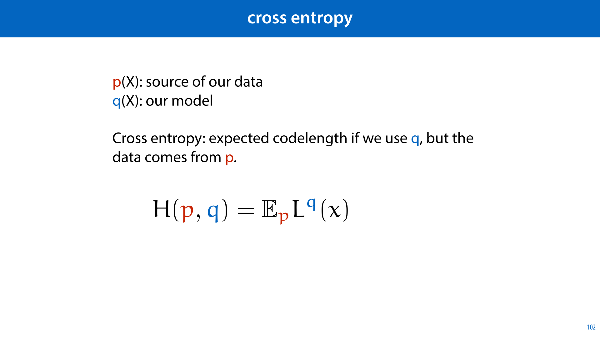

            <figcaption>
            
What if we don’t use the code that corresponds to the source of our data p to encode our data, but some other code based on distribution q. What is our expected codelength then? This is called the<em> cross entropy</em>. 

  

The cross entropy is minimal when p=q (and equal to the entropy). We can conclude two things: 

The code corresponding to p provides the best expected codelength. 

The cross entropy is a good way to <strong>quantify the distance between two distributions</strong> (because it’s minimal when the two are the same).

            </figcaption>

            click image for animation
            
       </section>

       <section id="slide-103">
            <a class="slide-link" href="https://mlvu.github.io/lecture05#slide-103">link here</a>
            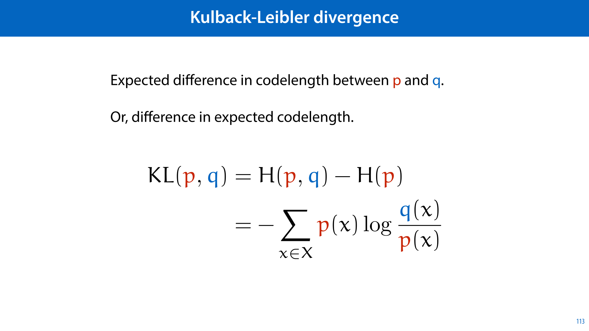

            <figcaption>
            
The cross entropy is a nice measure, but it’s not zero when p and q are equal. Instead, it’s equal to the entropy of p. 

To get a measure that is zero when the two are equal, we can just subtract the the entropy of p. This is called the Kulback-Leibler (KL) divergence. The KL divergence is zero when our model is perfect.

            </figcaption>
       </section>

       <section id="slide-103" class="anim">
            <a class="slide-link" href="https://mlvu.github.io/lecture05#slide-104">link here</a>
            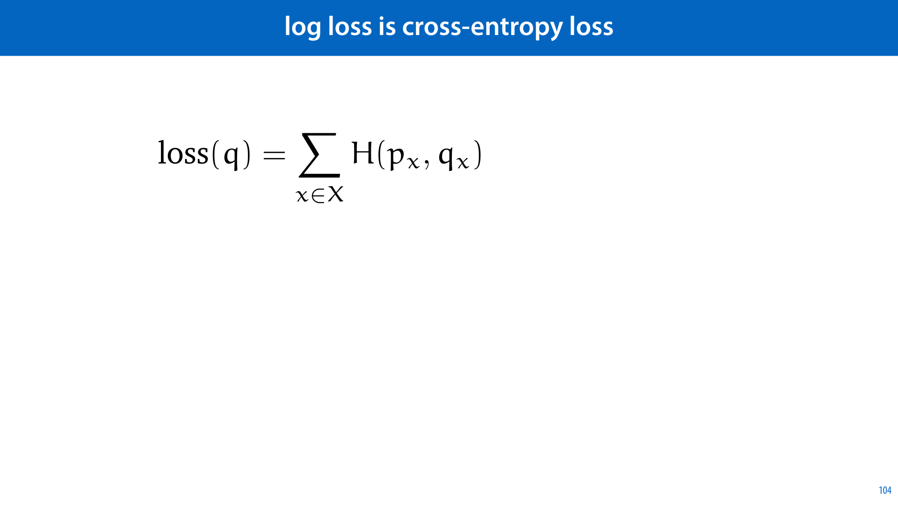

            <figcaption>
            
This way, we can prove that cross entropy loss is the same as log loss. And indeed this loss function is often called cross entropy loss. 

This is not just a curiosity tying information theory to machine learning, it has practical consequences. It tells us what we should do in the case where the dataset actually provides class probabilities instead of class labels. In that case, we should minimize the cross entropy betwene the predicted distribution and the one given in the data.

            </figcaption>

            click image for animation
            
       </section>

       <section id="slide-105">
            <a class="slide-link" href="https://mlvu.github.io/lecture05#slide-105">link here</a>
            

            <figcaption>
            
This leads us to the <strong>minimum description length principle</strong>, which informally states that <em>compression</em> and <em>learning</em> are strongly related.

            </figcaption>
       </section>

       <section id="slide-106">
            <a class="slide-link" href="https://mlvu.github.io/lecture05#slide-106">link here</a>
            

            <figcaption>
            
The best way to think of MDL model selection is in a sender and receiver framework. The sender is going to see some data, and is going to send it to the receiver. Before observing the data, the sender and receiver are allowed to come up with any scheme they like. But afterwards, the data must be sent using the scheme, and in a way that is perfectly decodable by the receiver without further communication. 

We usually assume that there is some language to describe a model that the sender chooses. The sender describes the model and then the data given the model.

            </figcaption>
       </section>

       <section id="slide-106" class="anim">
            <a class="slide-link" href="https://mlvu.github.io/lecture05#slide-107">link here</a>
            

            <figcaption>
            
We won’t go into the technical details of MDL, but here we see a broad illustration of how MDL can balance over- and underfitting in a regression problem.  

In a regression (or classification) problem, we can take the instances and their features as fixed: both the sender and receiver have access to them. The data that we want to send over the wire is the target labels; in this case the numbers. How you encode a continuous value is a technical matter that requires some assumptions. For now we can just discretize range of outptus, and assume that we are using a code that means that <strong>bigger number cost more bits</strong>. The same goes for the parameters of the model: these are also continuous values, but we’ll discretize them somehow. Here we only need to assume that using more parameters in your model takes more bits. 

Once we’ve chosen a model we can reconstruct the data by sending the model parameters and the residual values. On the left, we see that if we pick a linear model we have many large residuals to transmit. On the other hand, our model is described by only two parameters, so we can transmit that part very cheaply. If we make our model a parabola, we require three numbers to transmit it, so that part of  our message gets bigger, but because the model fits so much better, the residuals are much smaller, and the overal length of our message gets much smaller. 

If we make our model a 15-th order polynomial, we get a slightly tighter fit, but not by much, and the price we pay in storing the 16 numbers required to describe our model means that our message length is bigger than for the parabola. So overall we prefer the model in  the middle, according to the minimum description length principle. 

            </figcaption>

            click image for animation
            
       </section>

       <section id="slide-107" class="anim">
            <a class="slide-link" href="https://mlvu.github.io/lecture05#slide-108">link here</a>
            

            <figcaption>
            
There are many correspondences between using MDL and using Bayes. In fact they are often perspectives on the same thing. For instance, if we choose the model that maximizes the posterior probability, we can rewrite, by introducing a logarithm to show that we are also choosing the model that minimizes the codelength

            </figcaption>

            click image for animation
            
       </section>

       <section id="slide-109">
            <a class="slide-link" href="https://mlvu.github.io/lecture05#slide-109">link here</a>
            

            <figcaption>
            
When we talked about the problem of induction and the no free lunch theorem, we noted that <em>some assumption</em> about the source of our data was necessary to make learning possible at all. Some aspects of our problem we need to assume before we start learning. 

You can think of MDL as encoding a simplicity assumption. We prefer simple solutions over complex ones, and we define a simple solution as one that compresses the data well. The assumption we make about the universe, is that it generated compressible data for us.

            </figcaption>
       </section>

       <section id="slide-110">
            <a class="slide-link" href="https://mlvu.github.io/lecture05#slide-110">link here</a>
            

            <figcaption>
            

            </figcaption>
       </section>

</article>
