<nav class="menu">
    <ul>
        <li class="home"><a href="/">Home</a></li>
        <li class="name">Lecture 6: Beyond linear models</li>
            <li><a href="#video-000">Neural networks</a></li>
            <li><a href="#video-016">Backpropagation</a></li>
            <li><a href="#video-038">Support vector machines</a></li>
            <li><a href="#video-069">Lagrange multipliers</a></li>
            <li><a href="#video-087">The kernel trick</a></li>
        <li class="pdf"><a href="https://mlvu.github.io/lectures/32.LinearModels2.annotated.pdf">PDF</a></li>
    </ul>
</nav>

<article class="slides">
       <section class="video" id="video-000">
           <a class="slide-link" href="https://mlvu.github.io/lecture06#video-0">link here</a>
           <iframe
                src="https://www.youtube.com/embed/DeQ4STHYT3g?modestbranding=1&showinfo=0&rel=0"
                title="YouTube video player"
                frameborder="0" allow="accelerometer; autoplay; clipboard-write; encrypted-media; gyroscope; picture-in-picture"
                allowfullscreen>
           </iframe>

       </section>

       <section id="slide-001">
            <a class="slide-link" href="https://mlvu.github.io/lecture06#slide-001" title="Link to this slide.">link here</a>
            

            <figcaption>
            
<lnbr></lnbr>

            </figcaption>
       </section>

       <section id="slide-002">
            <a class="slide-link" href="https://mlvu.github.io/lecture06#slide-002" title="Link to this slide.">link here</a>
            

            <figcaption>
            
A few lectures ago, we saw how we could make a linear model more powerful, and able to learn nonlinear decision boundaries by just <em>expanding our features</em>: we add new features derived from the old ones, and depending on which combinations we add, we can learn new, non-linear decision boundaries or regression functions.

            </figcaption>
       </section>

       <section id="slide-002" class="anim">
            <a class="slide-link" href="https://mlvu.github.io/lecture06#slide-003" title="Link to this slide.">link here</a>
            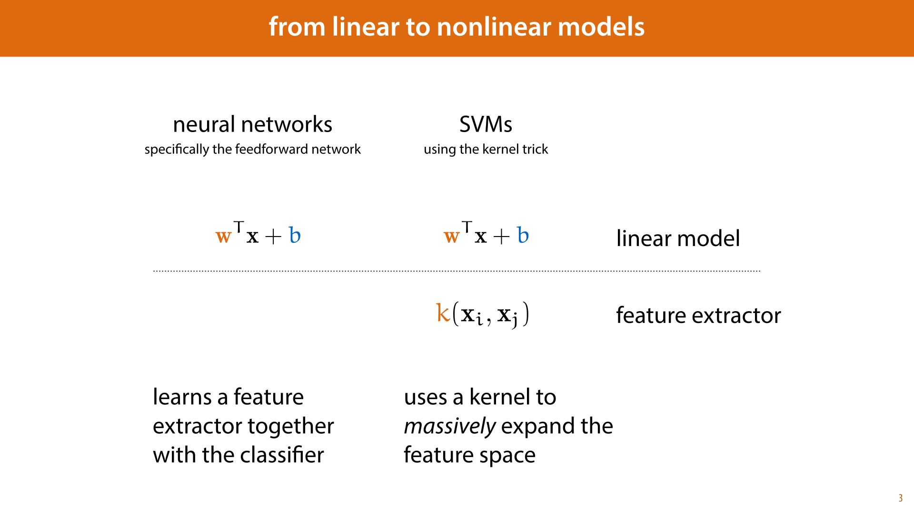

            <figcaption>
            
Both models we will see today, <strong>neural networks </strong>and<strong> support vector machines</strong>, take this idea and build on it. Neural networks are a big family, but the simplest type, the <strong>two-layer feedforward network</strong>, functions as a feature extractor followed by a linear model. In this case, we don’t choose the extended features but we <em>learn</em> them, together with the weights of the linear model. 

The support vector machine doesn’t learn the expanded features (we still have to choose them manually), but it uses a<strong> kernel function</strong> to allow us to fit a linear model in a <em>very</em> high-dimensional feature without  having to pay for actually computing all these expanded features.

            </figcaption>
            click image for animation
       </section>

       <section id="slide-004">
            <a class="slide-link" href="https://mlvu.github.io/lecture06#slide-004" title="Link to this slide.">link here</a>
            

            <figcaption>
            
The layout of today’s lecture will be largely chronological. We will focus on neural networks, which were very popular in the late eighties and early nineties.  

Then, towards the end of the nineties, interest in neural networks died down a little and support vector machines became much more popular. 

 

In the next lecture, we’ll focus on Deep Learning, which sees neural networks make a come back in a big way.

            </figcaption>
       </section>

       <section id="slide-005">
            <a class="slide-link" href="https://mlvu.github.io/lecture06#slide-005" title="Link to this slide.">link here</a>
            

            <figcaption>
            
In this video, we’ll start with the basics of neural networks.  

 

In the very early days of AI (the late 1950s), researchers decided to take a simple approach to AI: the brain is the only truly intelligent system we know, so let’s see what it’s made of, and whether that provides some inspiration for intelligent (and learning) computer systems. 

 

They started with a single brain cell: a neuron. A neuron receives multiple different signals from other cells through connections called <strong>dendrites</strong>. It processes these in a relatively simple way, deriving a single new signal, which it sends out through its single <strong>axon</strong>. The axon branches out so that this single output signal can reach different cells 

 
<aside    >image source: <a href="http://www.sciencealert.com/scientists-build-an-artificial-neuron-that-fully-mimics-a-human-brain-cell"><strong class="blue">http://www.sciencealert.com/scientists-build-an-artificial-neuron-that-fully-mimics-a-human-brain-cell</strong></a> </aside><aside    > </aside>

            </figcaption>
       </section>

       <section id="slide-006">
            <a class="slide-link" href="https://mlvu.github.io/lecture06#slide-006" title="Link to this slide.">link here</a>
            

            <figcaption>
            
These ideas needed to be radically simplified to work with computers of that age, but doing so yielded one of the first successful machine learning systems: the <strong>perceptron</strong>. This was the model we saw in action in the video in the the first lecture. 

The perceptron has a number of inputs, the <em>features</em> in modern parlance, each of which is multiplied by a weight. The result is summed, together with a bias parameter, and the sign of this result is used as the classification. 

Of course, we’ve seen this classifier already: it’s just our basic linear classifier. The training algorithm was a little different from gradient descent, but the basic principle was the same. Note that when we draw the perceptron this way, the bias can be represented as just another input that we just fix to always be 1. This is called a <strong>bias node</strong>.

            </figcaption>
       </section>

       <section id="slide-006" class="anim">
            <a class="slide-link" href="https://mlvu.github.io/lecture06#slide-007" title="Link to this slide.">link here</a>
            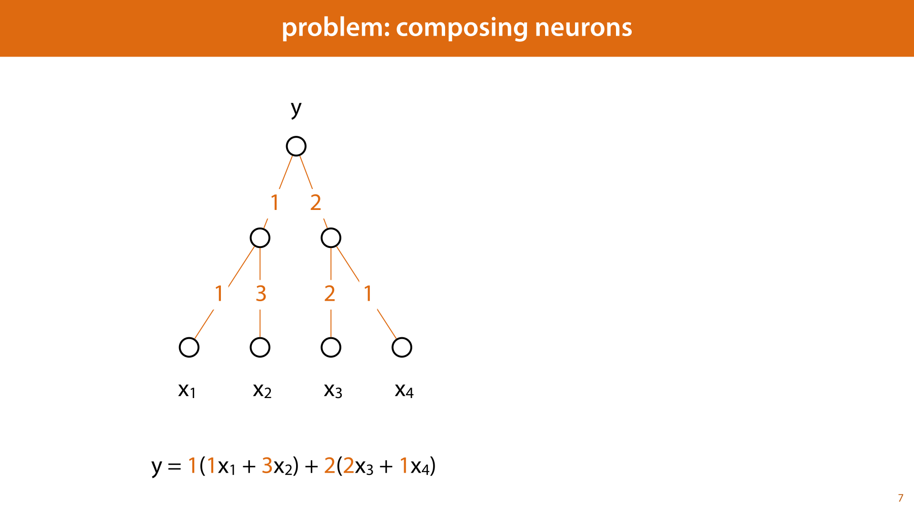

            <figcaption>
            
Of course the brain’s power does not come from the fact that a single neuron is such a powerful mechanism by itself: it’s the<em> composition</em> of many simple parts that allows it to do what it does. We make the output of one neuron the input of another, and build networks of bllions of neurons. 

And this is where the perceptron turns out to be too simple an abstraction. Because composing perceptrons doesn’t make them more powerful. Consider the graph on the left, with multiple composed preceptrons. 

Writing down the function that this graph represents, we see that we get a simple function, with the first two perceptrons in brackets. If we then multiply out the brackets, we see that the result is a linear function. This means that we can represent this function also as a single perceptron with four inputs. This is always true. No matter how many perceptrons you chain together, the result will never be anything more than a simple linear function over your inputs. We’ve removed the bias node here for simplicity, but the conclusion is the same with a bias node included. 

 

            </figcaption>
            click image for animation
       </section>

       <section id="slide-007" class="anim">
            <a class="slide-link" href="https://mlvu.github.io/lecture06#slide-008" title="Link to this slide.">link here</a>
            

            <figcaption>
            
To create perceptrons that we can chain together in such a way that the result will be more expressive than any single perceptron could be, the simplest trick is to include a<strong> non-linearity</strong>, also called <strong>an activation function</strong>. 

After all the weighted inputs have been combined, we pass the result through a simple non linear scalar function to produce the output. One popular option, especially in the early days of neural networks, is the<strong> logistic sigmoid</strong>, which we’ve seen already. Applying a sigmoid means that the sum of the inputs can range from negative infinity to positive infinity, but the output is always in the interval [0, 1].  

Another, more recent nonlinearity is the linear rectifier, or<strong> ReLU</strong> nonlinearity. This function just sets every negative input to zero, and keeps everything else the same. 

Not using an activation function is also called using a <strong>linear activation</strong>.

            </figcaption>
            click image for animation
       </section>

       <section id="slide-009">
            <a class="slide-link" href="https://mlvu.github.io/lecture06#slide-009" title="Link to this slide.">link here</a>
            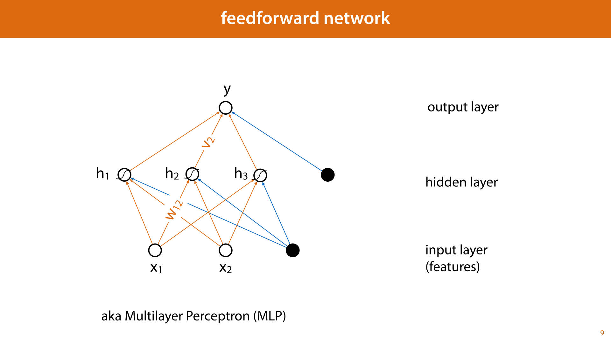

            <figcaption>
            
Using these nonlinearities, we can arrange single perceptrons into <strong>neural networks</strong>. Any arrangement of perceptrons makes a neural network, but for ease of training, this arrangement seen here was the most popular for a long time. It’s called the<strong> feedforward network </strong>or <strong>multilayer perceptron</strong>. We arrange a layer of <strong>hidden units</strong> in the middle, each of which acts as a perceptron with a nonlinearity, connecting to all input nodes. Then we have one or more output nodes, connecting to all hidden layers. Note the following points. 

There are no cycles, the network feeds forward from input to output. 

Nodes in the same layer are not connected to  each other, or to any other layer than the next and the previous one. 

Each layer is<strong> fully connected</strong> to the previous layer, every node in one layer connects to every node in the layer before it. 

In the 80s and 90s they usually had just one hidden layer, because we hadn’t figured out how to train deeper networks. 

Note that Every orange and blue line in this picture represents one parameter of the model. 

We can use networks like these to do classification or regression.

            </figcaption>
       </section>

       <section id="slide-009" class="anim">
            <a class="slide-link" href="https://mlvu.github.io/lecture06#slide-010" title="Link to this slide.">link here</a>
            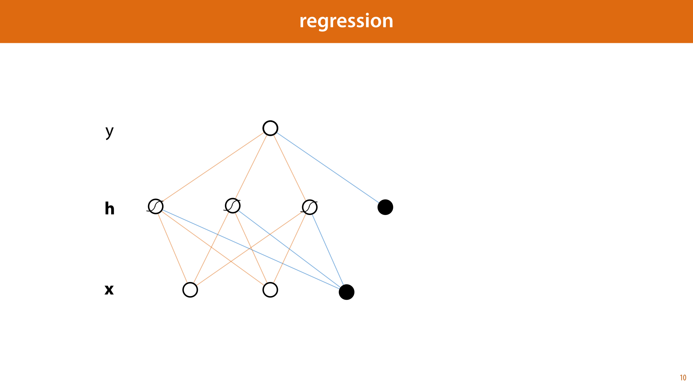

            <figcaption>
            
To build a regression model, all we need is one output node without an activation. This means that our network as a whole, describes a function from the feature space to the real number line. 

We can think of the first layer of our network as computing a <em>feature expansion</em>: the same thing we did in the fourth lecture to enable our linear regression to learn non-linear patterns, but this time, we don’t have to work out the feature expansion ourselves, we simply learn it. The second layer is then just a linear regression on this expanded feature space. 

To this output, we can then apply any loss function we like, such as least-squares loss.

            </figcaption>
            click image for animation
       </section>

       <section id="slide-010" class="anim">
            <a class="slide-link" href="https://mlvu.github.io/lecture06#slide-011" title="Link to this slide.">link here</a>
            

            <figcaption>
            
To build a classifier we can do what the perceptron did: use the sign of the output as the class. This would be like using our least squares classifier, with a feature expansion layer below it.  

These days, however, it’s much more common to take inspiration from the logistic regression. We apply the logistic sigmoid to the output and interpret the resulting value as the probability that the given input (x) is of the positive class.  

The logarithmic loss that we saw in the last lecture, can be applied here as well. 

            </figcaption>
            click image for animation
       </section>

       <section id="slide-011" class="anim">
            <a class="slide-link" href="https://mlvu.github.io/lecture06#slide-012" title="Link to this slide.">link here</a>
            

            <figcaption>
            
For multiclass classification, we can use something called a <strong>softmax activation</strong>. We create a single output node for each class, and ensure that they sum to one. 

The softmax function simply takes the exponent of each output node, to ensure that they are all positive, and then divides each by the sum total, to ensure that all outputs together sum to one. 

After the softmax we can interpret the output of node y3 as the probability that <strong>x</strong> has class 3.  

Given thes probabilities, we can apply a simple log-loss: the aim is to maximize the logarithm of the probability of the true class.

            </figcaption>
            click image for animation
       </section>

       <section id="slide-013">
            <a class="slide-link" href="https://mlvu.github.io/lecture06#slide-013" title="Link to this slide.">link here</a>
            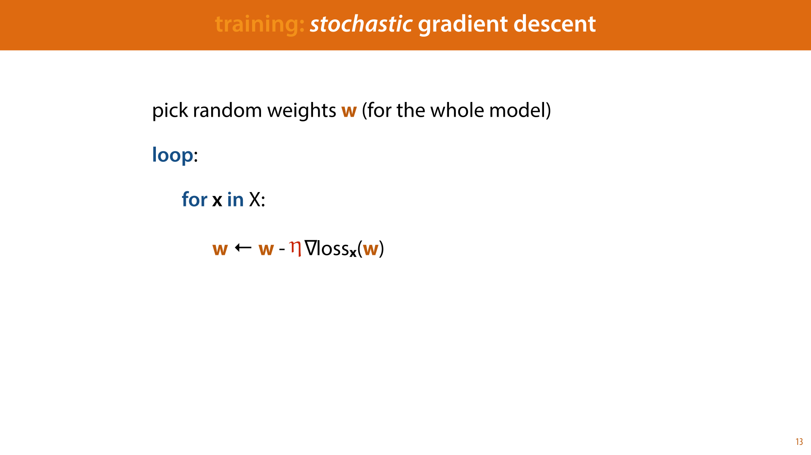

            <figcaption>
            
Because a neural networks can be expensive to compute we tend to use <strong>stochastic gradient descent</strong> to train them. 

Stochastic gradient descent is very similar to the gradient descent we’ve seen already, but we define the loss function over a<strong> single example</strong> instead of summing over the whole dataset: just use the same loss function, but pretend your data set consists of only one instance.  

Stochastic gradient descent has many advantages, including: 

Using a new instance each time adds some randomness to the process, which can help to escape local minima. 

Gradient descent works fine if the gradient is not perfect, but good on average (over many steps). This means that taking many small inaccurate steps is often much better than taking one very accurate big step.  

Computing the loss over the whole data is expensive. By computing loss over one instance, we get N steps of stochastic gradient descent for the price of one step of regular gradient descent. 

The most common approach these days is a compromise between stochastic and regular gradient descent, where we actually compute the loss for a small<strong> batch</strong> of instances (say 32 of them), and take a single step of gradient descent for each batch. This is called<strong> minibatch gradient descent,</strong> which we’ll look at more closely next lecture.

            </figcaption>
       </section>

       <section id="slide-014">
            <a class="slide-link" href="https://mlvu.github.io/lecture06#slide-014" title="Link to this slide.">link here</a>
            

            <figcaption>
            

            </figcaption>
       </section>

       <section id="slide-015">
            <a class="slide-link" href="https://mlvu.github.io/lecture06#slide-015" title="Link to this slide.">link here</a>
            

            <figcaption>
            
Before we dig into the details, we can get a sense of what this looks like in tensorflow playground.  

Note: 

How the shape of the decision boundary changes based on the activation functions we choose (curvy for sigmoid, piecewise linear for ReLU) 

That adding another layer makes the network much more difficult to train (especially with sigmoid activations).

            </figcaption>
       </section>

       <section id="slide-016">
            <a class="slide-link" href="https://mlvu.github.io/lecture06#slide-016" title="Link to this slide.">link here</a>
            

            <figcaption>
            
That’s the basic idea of neural networks. So far, it’s hopefully a pretty simple idea. The complexity of neural networks lies in computing the gradients. For such complex models, sitting down at the kitchen table with a stack of papers and a pencil, and working out a symbolic expression for the gradient is no longer feasible. If we manage it at all, we get horrible convoluted expressions that no longer reduce to noce, simple functions, as they did in the case of linear regression and logistic regression. 

To help us out, we need the backpropagation algorithm, which we’ll discuss in the next video.

            </figcaption>
       </section>

       <section class="video" id="video-016">
           <a class="slide-link" href="https://mlvu.github.io/lecture06#video-16">link here</a>
           <iframe
                src="https://www.youtube.com/embed/IZ4w-aG50nU?modestbranding=1&showinfo=0&rel=0"
                title="YouTube video player"
                frameborder="0" allow="accelerometer; autoplay; clipboard-write; encrypted-media; gyroscope; picture-in-picture"
                allowfullscreen>
           </iframe>

       </section>

       <section id="slide-017">
            <a class="slide-link" href="https://mlvu.github.io/lecture06#slide-017" title="Link to this slide.">link here</a>
            

            <figcaption>
            
<lnbr></lnbr> 

            </figcaption>
       </section>

       <section id="slide-018">
            <a class="slide-link" href="https://mlvu.github.io/lecture06#slide-018" title="Link to this slide.">link here</a>
            

            <figcaption>
            
In the last video, we saw what the structure of a very basic neural network was, and we ended on this question. How do we work out the gradient. 

For neural networks, the gradients quickly get too complex to work out by hand, so we need to automate this process.

            </figcaption>
       </section>

       <section id="slide-018" class="anim">
            <a class="slide-link" href="https://mlvu.github.io/lecture06#slide-019" title="Link to this slide.">link here</a>
            

            <figcaption>
            
There are three basic flavors of working out derivatives and gradients automatically. 

The first is to do it symbolically, What we do on pen and paper, when we work out a derivative, is a pretty mechanical process. It’s not too difficult to program this process out and let the computer do it for us. This, is what happens, when you as Wolfram alpha to work out a derivative, for instance. It has its uses, cartainly, but it won;t work for us. The symbolic expression of the gradient of a function grows exponentiall with the complexity of the original function. That means that as we build bigger and bigger networks the expression of the gradient would soon grow too big to store in memory, let alone to compute. 

An alternative approach is to forget the symbolic form of the function, and just estimate the gradient for a specific input <strong>x</strong>. We could pick some points close to <strong>x</strong> and and fit a hyperplane through the outputs. This would be a pretty good approximation of the tangent hyperplane, so we could just read out the gradient. The problem is that this is a pretty unstable business. It’s quite difficult to be sure that the answer is accurate. It’s also pretty expensive: the more dimensions in your model space, the more points you need to get an accurate estimate of your gradient, and each point requires you to recompute your model for a new input. 

Bakcpropagation is a middle ground: it does part of the work symbolically, and part of the work numerically. We get a very accurate computation of the gradient, and the cost of computation is usually only twice as expensive as computing the output for one input.

            </figcaption>
            click image for animation
       </section>

       <section id="slide-020">
            <a class="slide-link" href="https://mlvu.github.io/lecture06#slide-020" title="Link to this slide.">link here</a>
            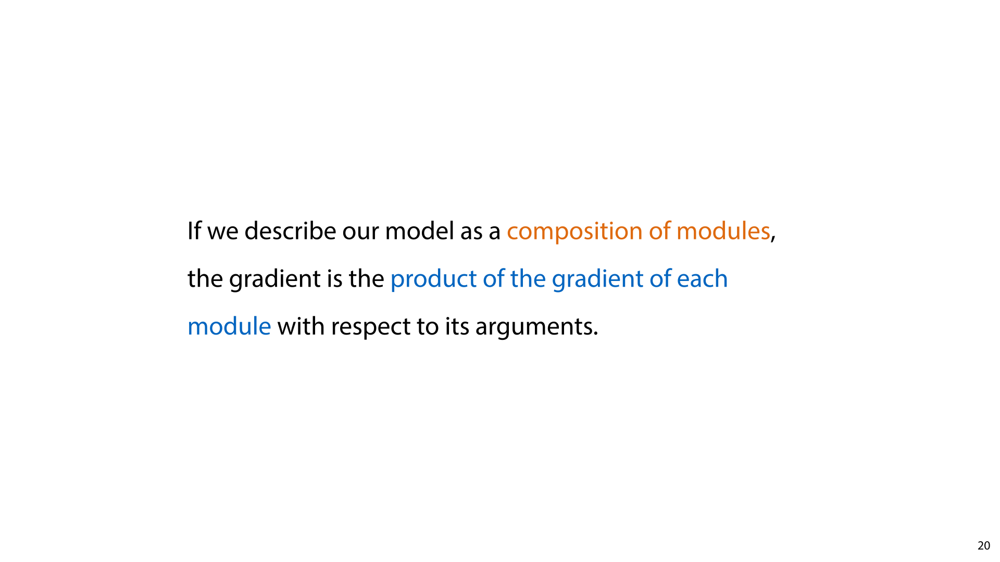

            <figcaption>
            
This is the basic principle behind backpropagation: if we have a function, that is a composition of other functions, we can write out the derivative as repeated applications of the chain rule.

            </figcaption>
       </section>

       <section id="slide-021">
            <a class="slide-link" href="https://mlvu.github.io/lecture06#slide-021" title="Link to this slide.">link here</a>
            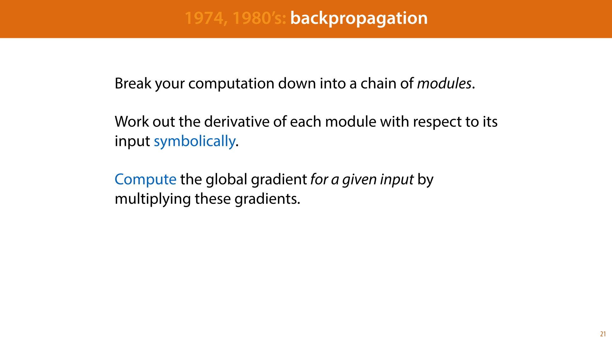

            <figcaption>
            
Here’s the three steps required to implement backpropagation for a given function.

            </figcaption>
       </section>

       <section id="slide-021" class="anim">
            <a class="slide-link" href="https://mlvu.github.io/lecture06#slide-022" title="Link to this slide.">link here</a>
            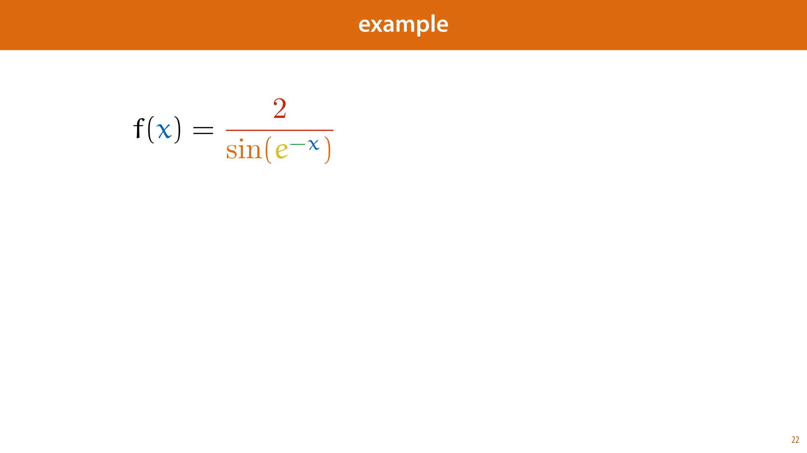

            <figcaption>
            
Let’s show how it works on a simple example. 

To show that backpropagation is a generic algorithm for working out gradients, not just a method for neural networks, we’ll first show how it works for some arbitrary scalar function.  

First we take our function f, and we break it up into smaller functions, the output of each feeding into the next. Defining the functions a, b, c, and d as shown, we can write f(x) = d(c(b(a(x)))).  

The graph on the right is a called a <strong>computation graph</strong>: each node represents a small computer program that receives an input, computes an output and passes it on to another module. 

Normally, we wouldn’t break a function up in such small modules: this is just a simple example to illustrate the principle.

            </figcaption>
            click image for animation
       </section>

       <section id="slide-022" class="anim">
            <a class="slide-link" href="https://mlvu.github.io/lecture06#slide-023" title="Link to this slide.">link here</a>
            

            <figcaption>
            
Because we’ve described our function as a composition of modules, we can work out the derivative purely by repeatedly applying the chain rule. 

Since we know for each function what the argument is, we’ll leave the arguments out to keep the notation clean.

            </figcaption>
            click image for animation
       </section>

       <section id="slide-023" class="anim">
            <a class="slide-link" href="https://mlvu.github.io/lecture06#slide-024" title="Link to this slide.">link here</a>
            

            <figcaption>
            
We’ll call the derivative of the whole function the <strong class="blue">global derivative</strong>, and the derivative of each module with respect to its input we will call a<strong class="orange"> local derivative</strong>.

            </figcaption>
            click image for animation
       </section>

       <section id="slide-024" class="anim">
            <a class="slide-link" href="https://mlvu.github.io/lecture06#slide-025" title="Link to this slide.">link here</a>
            

            <figcaption>
            
The next step is to work out the local derivatives symbolically, using the rules we know.  

The difference from what we normally do is that we stop when we have the derivatives of the output of a module in terms of the input. For instance, the derivative ∂c/ ∂b is cos b. Normally, we would fill in the definition of b and see if we could simplify any further. Here we stop once we know the derivative in terms of b.

            </figcaption>
            click image for animation
       </section>

       <section id="slide-025" class="anim">
            <a class="slide-link" href="https://mlvu.github.io/lecture06#slide-026" title="Link to this slide.">link here</a>
            

            <figcaption>
            
Then, once all the local derivatives are known, in symbolic form, we switch to <strong>numeric computation</strong>. We will take a <em>specific</em> input, in this case -4.499 and compute the gradient only for that. 

First we compute the output of the function given this input. This is known as a the <strong>forward pass</strong>. During our computation, we also retain our intermediate values a, b, c and d. These will be useful later on.

            </figcaption>
            click image for animation
       </section>

       <section id="slide-026" class="anim">
            <a class="slide-link" href="https://mlvu.github.io/lecture06#slide-027" title="Link to this slide.">link here</a>
            

            <figcaption>
            
Next up is the <strong>backward pass</strong>. We take the chain-rule derived form of the derivative, and we fill in the intermediate  values a, b, c and d. 

This gives us a function with no variables, so we can compute the output. The result is that the derivative of this function, for the specific input -4.499, is 0.

            </figcaption>
            click image for animation
       </section>

       <section id="slide-028">
            <a class="slide-link" href="https://mlvu.github.io/lecture06#slide-028" title="Link to this slide.">link here</a>
            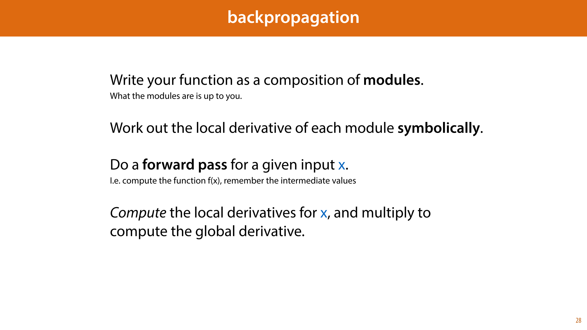

            <figcaption>
            
More fine-grained modules make the local derivatives easier to work out, but may increase the numeric instability. Less fine grained modules usually result in more accurate gradients, but if we make them too big, we end up with the problem that the symbolic expression of the gradient grows too complex.

            </figcaption>
       </section>

       <section id="slide-028" class="anim">
            <a class="slide-link" href="https://mlvu.github.io/lecture06#slide-029" title="Link to this slide.">link here</a>
            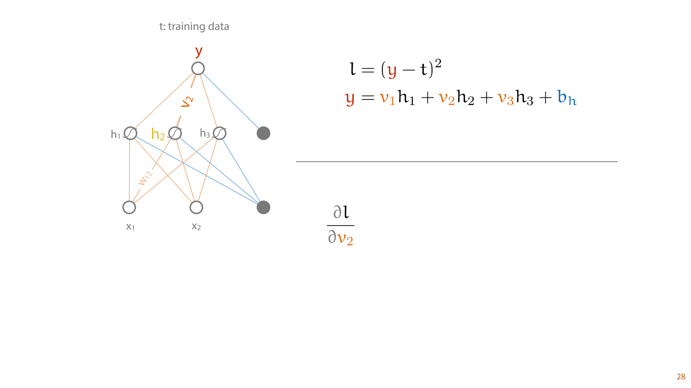

            <figcaption>
            
Let’s now see how this works for a neural net.  

It’s important to remember that we don’t care about the derivative of the output y with respect tot he inputs  x. The function we’re computing the gradient for is the loss, and the variables we want to compute the gradient for are the <strong>parameters</strong> of the network. x does end up in our computation, because it’s part of the loss, but only as a constant.

            </figcaption>
            click image for animation
       </section>

       <section id="slide-029" class="anim">
            <a class="slide-link" href="https://mlvu.github.io/lecture06#slide-030" title="Link to this slide.">link here</a>
            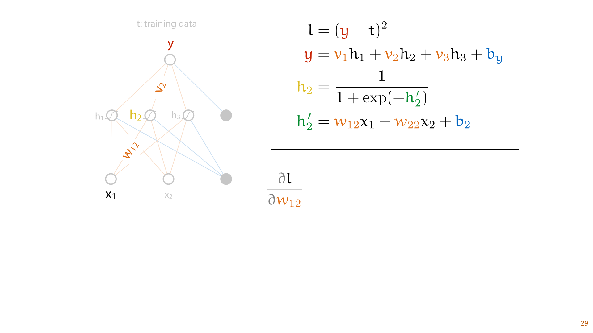

            <figcaption>
            
Here’s what the local gradients look like for the weight v2.  

The line on the bottom shows how we update v2 when we apply a single step of stochastic gradient descent for x (x may not appear in the gradient, but the values y and h2 were computed using x).

            </figcaption>
            click image for animation
       </section>

       <section id="slide-031">
            <a class="slide-link" href="https://mlvu.github.io/lecture06#slide-031" title="Link to this slide.">link here</a>
            

            <figcaption>
            
To see what this update rule means, we can use an analogy. Think of the neural network as a hierarchical structure like a government trying to make a decision. The output node is the prime minister: he provides the final decision (for instance what the tax on cigarettes should be).  

To make this decision, he listens to his ministers. His ministers don’t tell him what to do, they just shout. The louder they shout, the higher they want him to make the output. 

If he trusts a particular minister, he will weigh their advice positively, and follow their advice. If he distrusts the minister, he will do the opposite of what the minister says. The ministers each listen to a bank of civil servants and weigh their opinions in the same way the prime minister weight theirs. All ministers listen to the same civil servants, but they have their own level of trust for each. 

(We haven’t drawn the bias, but you can think of the bias as the prime minister’s own opinion; how strong the opinions of the ministers need to be to change his mind). 

 

image sources:  

<a href="https://www.government.nl/government/members-of-cabinet/mark-rutte"><strong class="blue">https://www.government.nl/government/members-of-cabinet/mark-rutte</strong></a> 

<a href="https://www.government.nl/government/members-of-cabinet/ingrid-van-engelshoven"><strong class="blue">https://www.government.nl/government/members-of-cabinet/ingrid-van-engelshoven</strong></a> 

<a href="https://www.rijksoverheid.nl/regering/bewindspersonen/kajsa-ollongren"><strong class="blue">https://www.rijksoverheid.nl/regering/bewindspersonen/kajsa-ollongren</strong></a> 

Door Photo: Yordan Simeonov (EU2018BG) - Dit bestand is afgeleid van: Informal JHA meeting (Justice) Arrivals (26031834658).jpg, CC BY-SA 2.0, <a href="https://commons.wikimedia.org/w/index.php?curid=70324317"><strong class="blue">https://commons.wikimedia.org/w/index.php?curid=70324317</strong></a> 

            </figcaption>
       </section>

       <section id="slide-032">
            <a class="slide-link" href="https://mlvu.github.io/lecture06#slide-032" title="Link to this slide.">link here</a>
            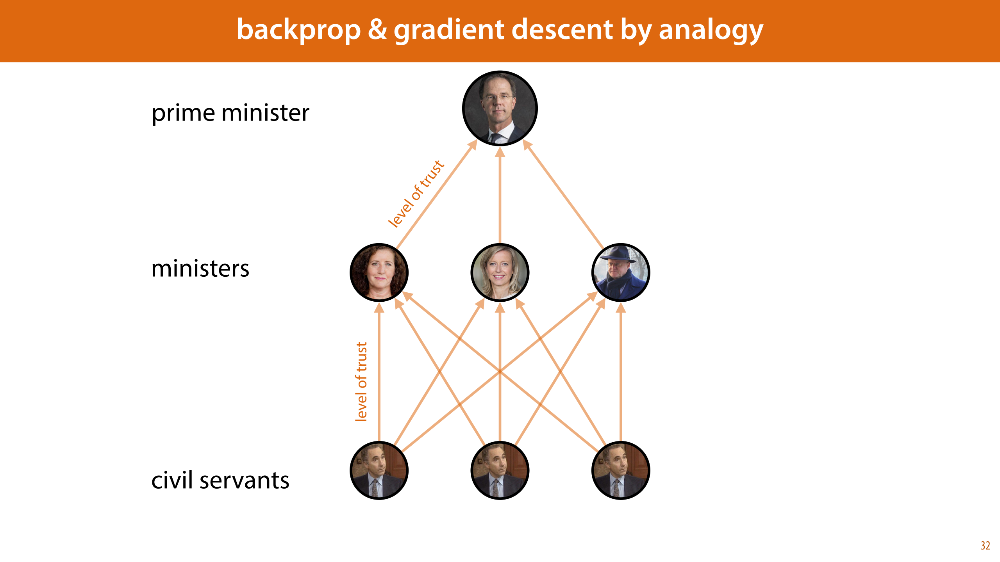

            <figcaption>
            
So let’s say the network has produced an output. The prime minister has set a tax on cigarettes y, and based on the consequences realises that he should actually have set a tax of t. He’s now going to adjust his level of trust in each of his subordinates. 

Looking at the update rule for weight v2, we can see that he takes two things into account: the error (y-t), how wrong he was, and what minister h2 told him to do. 

If  the error is positive, he set y too high. If h2 shouted loudly, he will lower his trust in her.  

If the error is negative, he set y too low. If h2 shouted loudly, he will increase his trust in her.  

If we use a sigmoid activation, the ministers can only provide values between 0 and 1. If we use an activation that allows h2 to be negative, we see that the minister takes the sign into account: if h2 was negative and the error was negative too, the trust in the minister increases (because the PM should’ve listened to her).

            </figcaption>
       </section>

       <section id="slide-033">
            <a class="slide-link" href="https://mlvu.github.io/lecture06#slide-033" title="Link to this slide.">link here</a>
            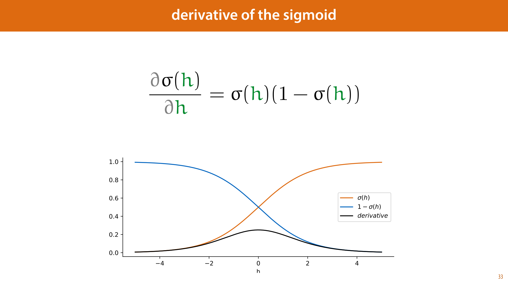

            <figcaption>
            

            </figcaption>
       </section>

       <section id="slide-033" class="anim">
            <a class="slide-link" href="https://mlvu.github.io/lecture06#slide-034" title="Link to this slide.">link here</a>
            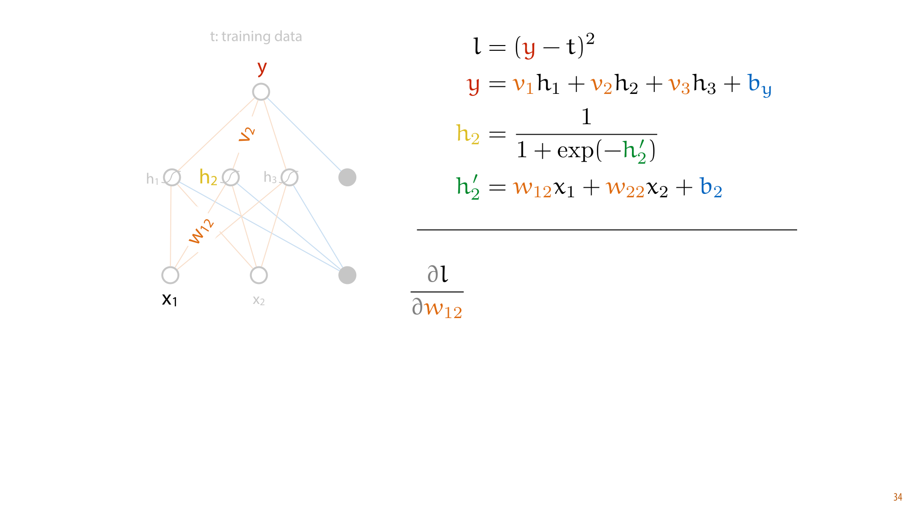

            <figcaption>
            
So far, this is no different from gradient descent on a linear model. The real power of the backpropagation algorithm shows when we look at how the error propagates back down the network (hence the name) and is used to update the weights. Lets look at the derivative for weight w12

            </figcaption>
            click image for animation
       </section>

       <section id="slide-034" class="anim">
            <a class="slide-link" href="https://mlvu.github.io/lecture06#slide-035" title="Link to this slide.">link here</a>
            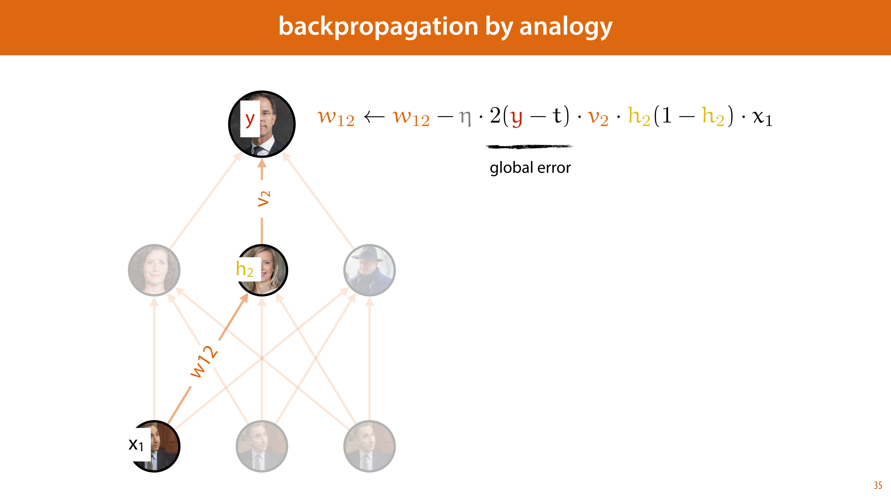

            <figcaption>
            
To see how much minister h2 needs to adjust her trust in x1, she first looks at the <em>global error</em>. To see how much she contributed to that global error, and whether she contributed negatively or positively, she multiplies by v2, her level of influence over the decision. Then she looks at how much the input from all her subordinates influenced the decision, considering the activation function (that is, if the input was very high, she’ll need a bigger adjustment to make a meaningful difference). Finally she multiplies by x1, to isolate the effect that we trust in x1 had on her decision.

            </figcaption>
            click image for animation
       </section>

       <section id="slide-036">
            <a class="slide-link" href="https://mlvu.github.io/lecture06#slide-036" title="Link to this slide.">link here</a>
            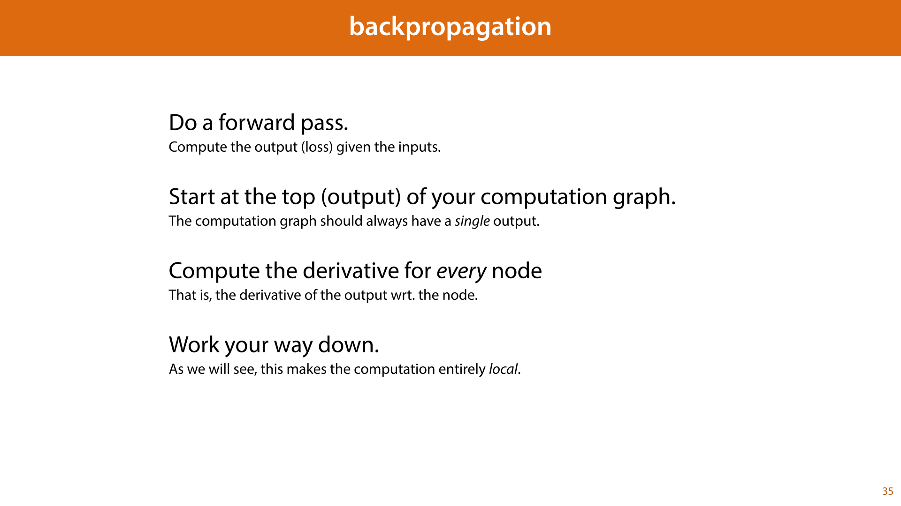

            <figcaption>
            

            </figcaption>
       </section>

       <section id="slide-037">
            <a class="slide-link" href="https://mlvu.github.io/lecture06#slide-037" title="Link to this slide.">link here</a>
            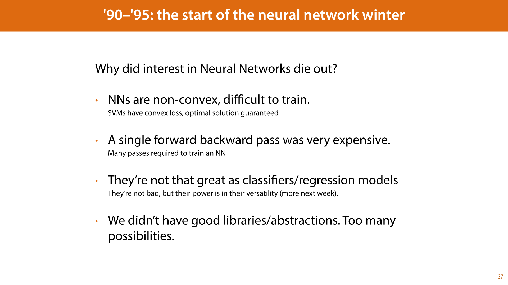

            <figcaption>
            
These weren’t just reasons not to use neural nets in production. They also slowed down the research on neural nets. SVM researchers were (probably) able to more faster, because once they’d designed a kernel, they could compute the optimal model performance and know, without ambiguity, whether it worked or not. Neural net researchers could design an architecture and spend months tuning the training algorithm without ever knowing whether the architecture would eventually perform.

            </figcaption>
       </section>

       <section id="slide-037" class="anim">
            <a class="slide-link" href="https://mlvu.github.io/lecture06#slide-038" title="Link to this slide.">link here</a>
            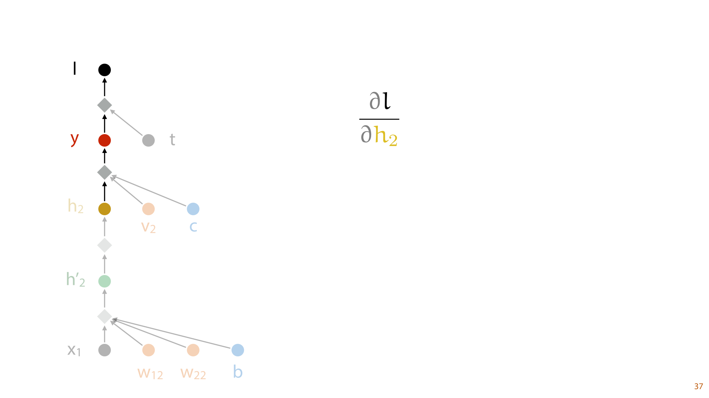

            <figcaption>
            
One important part of building such a framework is to recognise that all of this can easily be described as matrix multiplication/addition, together with the occasional element-wise non-linear operation. This allows us to write down the operation of a neural network very elegantly.  

In order to make proper use of this, we should also work out how to do the backpropagation part in terms of matrix multiplications. That’s where we’ll pick up next week in the first <strong>deep learning</strong> lecture.

            </figcaption>
            click image for animation
       </section>

       <section class="video" id="video-038">
           <a class="slide-link" href="https://mlvu.github.io/lecture06#video-38">link here</a>
           <iframe
                src="https://www.youtube.com/embed/-PvsRdlISls?modestbranding=1&showinfo=0&rel=0"
                title="YouTube video player"
                frameborder="0" allow="accelerometer; autoplay; clipboard-write; encrypted-media; gyroscope; picture-in-picture"
                allowfullscreen>
           </iframe>

       </section>

       <section id="slide-039">
            <a class="slide-link" href="https://mlvu.github.io/lecture06#slide-039" title="Link to this slide.">link here</a>
            

            <figcaption>
            
<lnbr></lnbr>

            </figcaption>
       </section>

       <section id="slide-040">
            <a class="slide-link" href="https://mlvu.github.io/lecture06#slide-040" title="Link to this slide.">link here</a>
            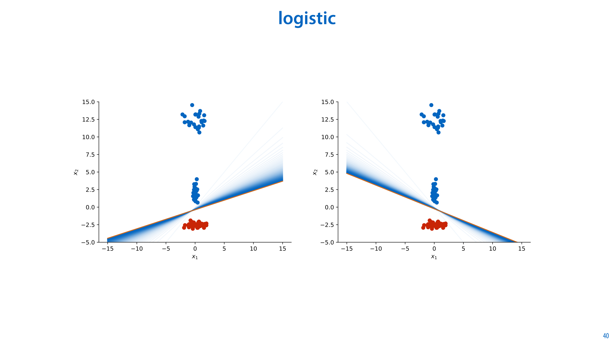

            <figcaption>
            
In lecture 5, we introduced the logistic regression model, with the logarithmic loss. We saw that it performed very well, but it had one problem: when the data are very well separable, it didn’t have any basis to choose between two models like this: both separate the training data very well. Yet, they’re very different models.

            </figcaption>
       </section>

       <section id="slide-040" class="anim">
            <a class="slide-link" href="https://mlvu.github.io/lecture06#slide-041" title="Link to this slide.">link here</a>
            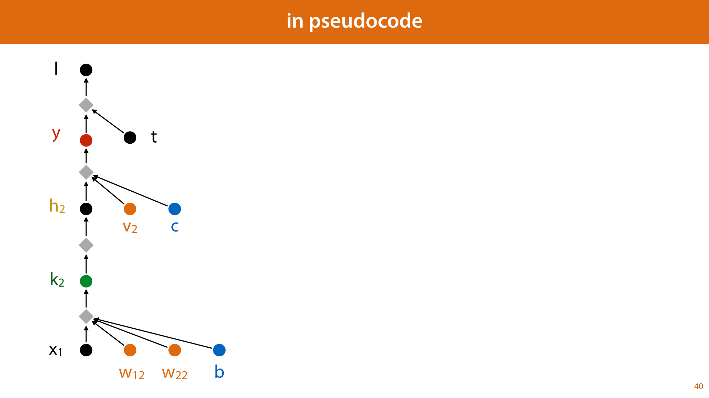

            <figcaption>
            
Here is an extreme example of the problem. We have two linearly separable classes and a decision boundary separates the data perfectly. And yet, if I see a new instance that is very similar to the rightmost red point, but with a slightly higher x1 value, it is suddenly classified as a blue point. 

This illustrates the intuition behind our final loss function: if we generate new points<em> near</em> our existing points, they should be classified the same as the existing points. One way to accomplish this is to look at the distance from the decision boundary to the nearest red and blue points, and to <em>maximize</em> that.

            </figcaption>
            click image for animation
       </section>

       <section id="slide-042">
            <a class="slide-link" href="https://mlvu.github.io/lecture06#slide-042" title="Link to this slide.">link here</a>
            

            <figcaption>
            
What we are looking for is the hyperplane that has a maximal distance to the nearest positive and nearest negative point. Here’s the optimal solution for this data.

            </figcaption>
       </section>

       <section id="slide-043">
            <a class="slide-link" href="https://mlvu.github.io/lecture06#slide-043" title="Link to this slide.">link here</a>
            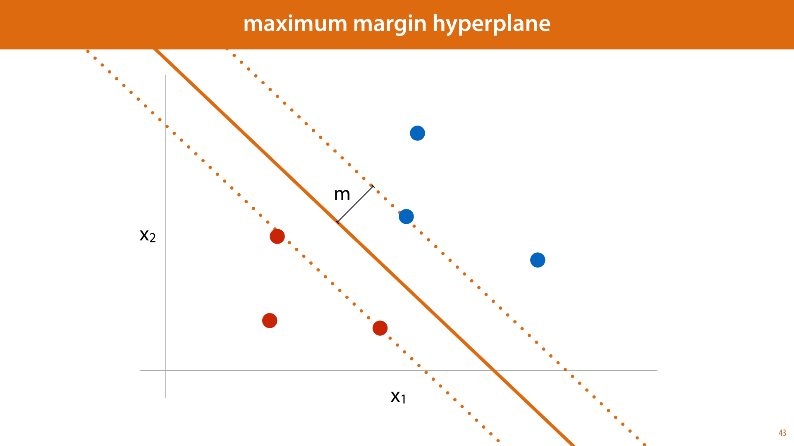

            <figcaption>
            
We measure the distance m at a right angle to the hyperplane. For the blue class, there is only one point nearest the margin, but for the red class, there are two the same distance away.

            </figcaption>
       </section>

       <section id="slide-044">
            <a class="slide-link" href="https://mlvu.github.io/lecture06#slide-044" title="Link to this slide.">link here</a>
            

            <figcaption>
            
The points closest to the decision boundary are called the <strong>support vectors</strong>. This name comes from the fact that the support vectors alone, are enough to describe the model. If I give you the support vectors, you can work out the hyperplane without seeing the rest of the data.<strong> </strong>

The distance to the support vectors is called the <strong>margin</strong>. We’ll assume that the decision boundary is chosen so that the margin is the same on both sides. 

            </figcaption>
       </section>

       <section id="slide-045">
            <a class="slide-link" href="https://mlvu.github.io/lecture06#slide-045" title="Link to this slide.">link here</a>
            

            <figcaption>
            
So, given a dataset, how do we work out which hyperplane maximizes the margin?  

This is a tricky problem, because the support vectors aren’t <em>fixed</em>. If we move the hyperplane around to maximize the distance to one set of support vectors, we may move to close to other points, making them the support vectors.  

Surprisingly, there is a way to phrase the maximum margin hyperplane objective as a relatively simple optimization problem.

            </figcaption>
       </section>

       <section id="slide-045" class="anim">
            <a class="slide-link" href="https://mlvu.github.io/lecture06#slide-046" title="Link to this slide.">link here</a>
            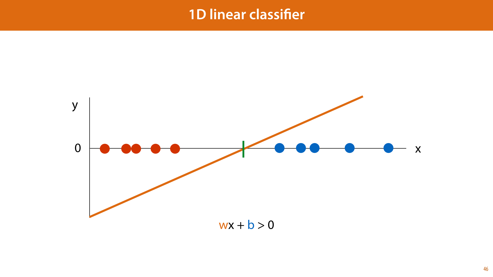

            <figcaption>
            
To work this out, let’s first review how we use a hyperplane to define a linear decision boundary. Here is the 1D case. We have a single feature and we first define a linear function form the feature space to a scalar y.  

If the function is positive we asign the positive class, if it is negative, we assign the negative class. Where this function is equal to 0, where is “intersects” the feature space, is the decision boundary (which in this case is just a point). 

Note that by defining the decision boundary this way, we have given ourselves an extra degree of freedom: the same decision boundary can be defined by infinitely many hyperplanes. We’ll use this extra degree to help us define a single hyperplane to optimize.

            </figcaption>
            click image for animation
       </section>

       <section id="slide-047">
            <a class="slide-link" href="https://mlvu.github.io/lecture06#slide-047" title="Link to this slide.">link here</a>
            

            <figcaption>
            
Here’s the picture for a two dimensional feature space. The decision boundary is the dotted line where the hyperplane intersects the (x1, x2) plane. If we rotate the hyperplane about that dotted line, we get another hyperplane defining the same decision boundary.

            </figcaption>
       </section>

       <section id="slide-047" class="anim">
            <a class="slide-link" href="https://mlvu.github.io/lecture06#slide-048" title="Link to this slide.">link here</a>
            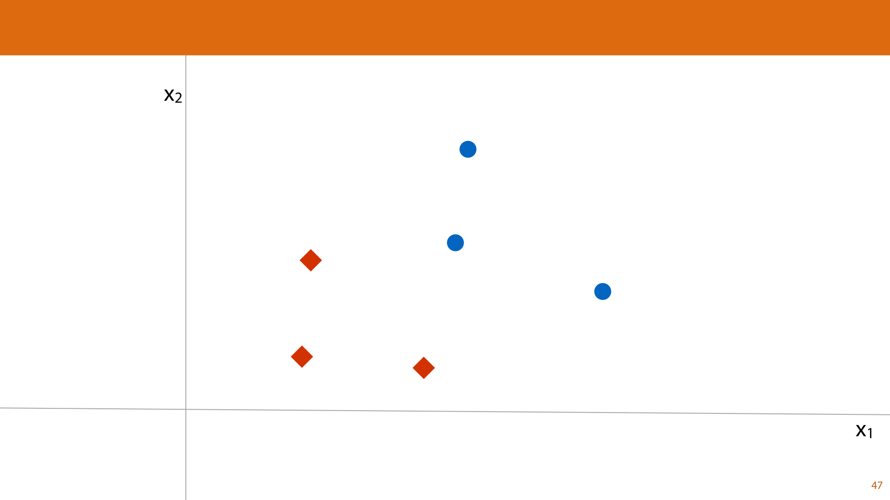

            <figcaption>
            
The hyperplane h we will choose is the one that produces 1 for the positive support vectors and -1 for the negative support vectors. Or rather, we will<em> define</em> the support vectors as those points for which the line produces 1 and -1. 

For all other negative points, h should produce values below -1 and for all other positive points, h should produce values <em>above</em> 1. 

            </figcaption>
            click image for animation
       </section>

       <section id="slide-049">
            <a class="slide-link" href="https://mlvu.github.io/lecture06#slide-049" title="Link to this slide.">link here</a>
            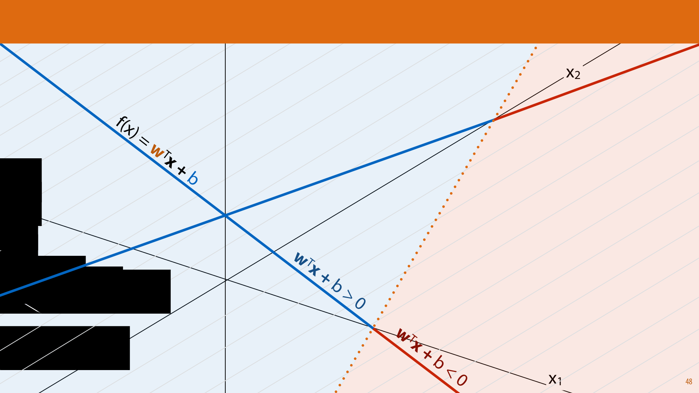

            <figcaption>
            
This is the pricture we want to end up with in 2 dimensions. The linear function evaluates to -1 the negative suport vectors, and to a lower value for all other negative points. It evaluates to 1 for the positive support vectors. 

The trick we use to achieve this is to optimize <em>with a constraint</em>. We first define the margin as the distance from the decision boundary, where h evalutez to zero, to the line where h evaluates to 1, and on the other side to the line where h evaluates to -1. 

            </figcaption>
       </section>

       <section id="slide-050">
            <a class="slide-link" href="https://mlvu.github.io/lecture06#slide-050" title="Link to this slide.">link here</a>
            

            <figcaption>
            
Here is our objective. The quantity that we want to maximize is 2 times the margin: the width of the band separating the negative from the positive support vectors. 

The constraint defines the support vectors: all positive points should evaluate to 1 or higher. All negative points should evaluate to -1 or lower. Note that if we have N instances in our data, this gives us a problem with N constraints. 

Note that this automatically ensures that the support vectors end up at -1 and 1. Why?

            </figcaption>
       </section>

       <section id="slide-051">
            <a class="slide-link" href="https://mlvu.github.io/lecture06#slide-051" title="Link to this slide.">link here</a>
            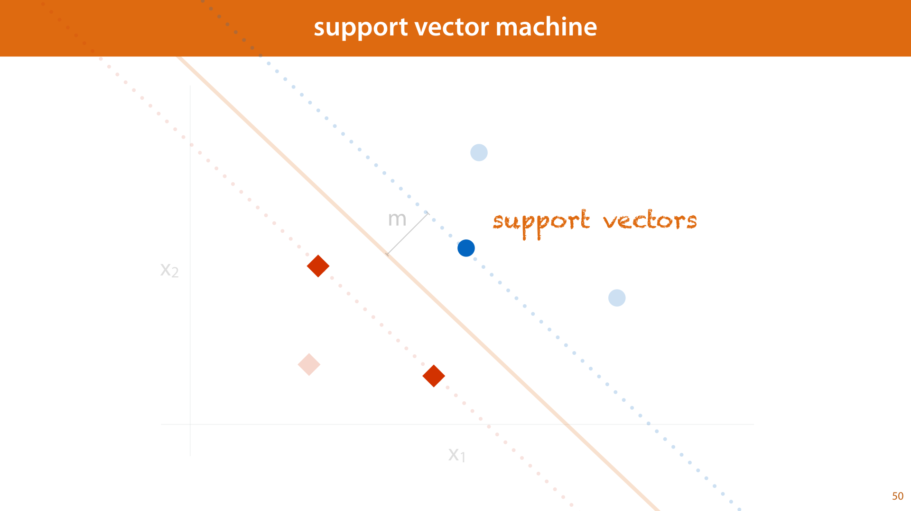

            <figcaption>
            
Here is a picture of a case where all nagative points are strictly less than -1, and all positive points are strictly large than 1. the constraints are satisfied, bu there are no points on the edges of the margin. 

In this case, we can easily make the margin bigger, pushing it out to the support vectors. Thus, any hyperplane with a maximal margin, that satisfies the constraints. must have points on the edges of its margin. These points are the support vectors.

            </figcaption>
       </section>

       <section id="slide-051" class="anim">
            <a class="slide-link" href="https://mlvu.github.io/lecture06#slide-052" title="Link to this slide.">link here</a>
            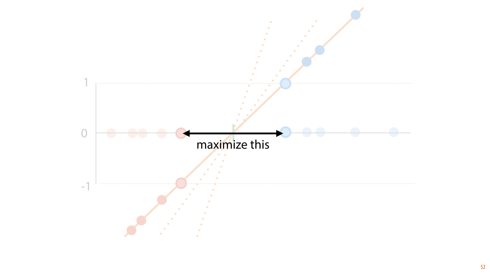

            <figcaption>
            
Here is the picture for a single feature. We want to maximize the distance between the point where the hyperplane hits -1 and where it hits 1, while keeping the negatives below -1 and the positives above 1.

            </figcaption>
            click image for animation
       </section>

       <section id="slide-052" class="anim">
            <a class="slide-link" href="https://mlvu.github.io/lecture06#slide-053" title="Link to this slide.">link here</a>
            

            <figcaption>
            
The first thing we’ll do, it to simplify the two constraints fro different points into one. 

We introduce a a label yi for each point xi which is -1 for negative points and +1 for positive points. Multiplying the left-hand side of the constraint by yi keeps it the same for positive points and takes the negative for negative points. This means that in both case, the left hand side should now be larger than or equal to one. This is the same label we introduced to define the least squares loss. 

We now have a problem with the same constraint of every instance in the data.

            </figcaption>
            click image for animation
       </section>

       <section id="slide-054">
            <a class="slide-link" href="https://mlvu.github.io/lecture06#slide-054" title="Link to this slide.">link here</a>
            

            <figcaption>
            
First, remember that in the equation <strong>w</strong>T<strong>x</strong> + b, <strong>w</strong> is the vector pointing orthogonally to the decision boundary.

            </figcaption>
       </section>

       <section id="slide-055">
            <a class="slide-link" href="https://mlvu.github.io/lecture06#slide-055" title="Link to this slide.">link here</a>
            

            <figcaption>
            
This is the value we’re insterested in. Twice the margin.

            </figcaption>
       </section>

       <section id="slide-055" class="anim">
            <a class="slide-link" href="https://mlvu.github.io/lecture06#slide-056" title="Link to this slide.">link here</a>
            

            <figcaption>
            
To make the math easier, let’s move the axes around so that the lower dotted line (belonging to the negative support vectors) crosses the origin. Doing this doesn’t change the size of the margin. 

We can now imagine a vector from the origin to the upper dotted line, which we’ll call <strong>a</strong>. The length of this vector is exactly the quantity we’re interested in. 

Remember also that the vector <strong>w</strong> points in the same direction as <strong>a</strong>, because both are perpendicular to the decision boundary.

            </figcaption>
            click image for animation
       </section>

       <section id="slide-056" class="anim">
            <a class="slide-link" href="https://mlvu.github.io/lecture06#slide-057" title="Link to this slide.">link here</a>
            

            <figcaption>
            
Because of the way we’ve moved the hyperplane, we know that the origin (0) hits the negative margin, so evaluates to -1. We also know that a hits the positive margin, so evaluates to +1. 

Subtracting the first from the second, we find that the dot product of <strong>a</strong> and <strong class="orange">w</strong> must be equal to two.  

Since <strong>a</strong> and <strong class="orange">w</strong> point in the same direction (cos α = 1), their dot product is just the product of their magnitudes (see the geometric definition of the dot product on the left). 

Re-arranging, we find that the length of <strong>a</strong> is 2 over that of <strong class="orange">w</strong>. 

 

 

            </figcaption>
            click image for animation
       </section>

       <section id="slide-058">
            <a class="slide-link" href="https://mlvu.github.io/lecture06#slide-058" title="Link to this slide.">link here</a>
            

            <figcaption>
            
So, the thing we actually want to maximise is 2/||<strong class="orange">w</strong>||. This gives us a precise optimization objective. 

Note that almost all the complexity of the loss is in the constraints. Without them we could just let all elements of <strong class="orange">w</strong> go to zero However, the constraints require the output of our model to be larger than 1 for all positive points and smaller than -1 for all negative points. This will automatically push the margin up to the support vectors, but no further.

            </figcaption>
       </section>

       <section id="slide-059">
            <a class="slide-link" href="https://mlvu.github.io/lecture06#slide-059" title="Link to this slide.">link here</a>
            

            <figcaption>
            
Since we tend to work with loss function, we take the inverse, and minimize that. The resulting classifier is called a “<strong>hard margin</strong>” <strong>support vector machine</strong> (SVM), since no points are allowed to violate the constraint and end up inside the margin. 

The hard margin SVM is nice, but it doesn’t work well when: 

We have data that is not linearly separable 

We could have a very nice decision boundary if we just ignored a few misclassified points. For instance, when there is a little noise, or a few outliers. 

            </figcaption>
       </section>

       <section id="slide-060">
            <a class="slide-link" href="https://mlvu.github.io/lecture06#slide-060" title="Link to this slide.">link here</a>
            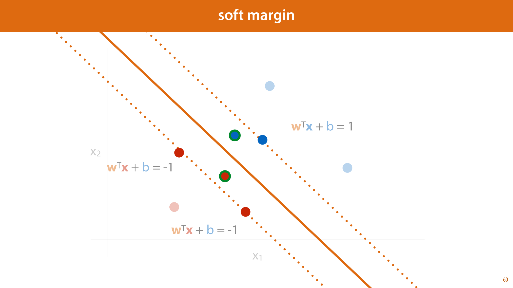

            <figcaption>
            
To deal with such situations, we can allow a <strong>soft margin</strong>. Here we allow a few points to be on the wrong side of the margin, if it helps us achieve a better fit on the rest of the points. That is, we can trade off a few violations of the constraints against a bigger margin.

            </figcaption>
       </section>

       <section id="slide-061">
            <a class="slide-link" href="https://mlvu.github.io/lecture06#slide-061" title="Link to this slide.">link here</a>
            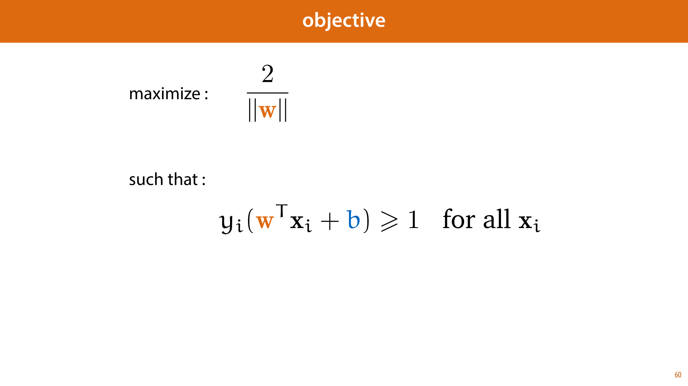

            <figcaption>
            
To achieve this, we introduce a <strong>slack parameter</strong> pi for each point <strong>x</strong>i which indicates the extent to which the constraint on <strong>x</strong>i is <em>relaxed</em><strong>.</strong> Our learning algorithm can set pi to whatever it likes. If it sets pi to zero the constraint is the same as it was for the hard margin classifier. If it sets pi higher than zero, the constraint is relaxed and the point <strong>x</strong>i can fall inside the margin. The price we pay is that pi is added to our minimization objective. 

Our search algorithm, which we will detail later, does the rest. It automatically makes the tradeoff between how much we want to violate the original constaints and how big we want the margin to be. 

C is a hyperparameter, indicating how to balance the tradeoff. Its value is positive, and we usually try values like (0.001, 0.01, 0.1, 1.0, 10). As C goes to infinity, we recover the hard margin SVM, where violating the constraints is “infinitely bad” and this never happens.

            </figcaption>
       </section>

       <section id="slide-061" class="anim">
            <a class="slide-link" href="https://mlvu.github.io/lecture06#slide-062" title="Link to this slide.">link here</a>
            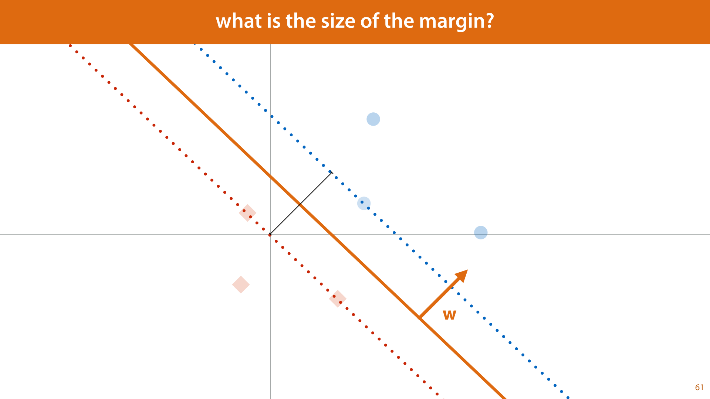

            <figcaption>
            
Here is what that looks like in 1D. The open points are the support vectors, and for each class, we have one point on the wrong side of the decision boundary, requiring us to pay the residual pi as a penalty. 

So, the objective function has a penalty added to it, but without this penalty, we would not have been able to satisfy the objective at all, since the two points are not separable 

            </figcaption>
            click image for animation
       </section>

       <section id="slide-062" class="anim">
            <a class="slide-link" href="https://mlvu.github.io/lecture06#slide-063" title="Link to this slide.">link here</a>
            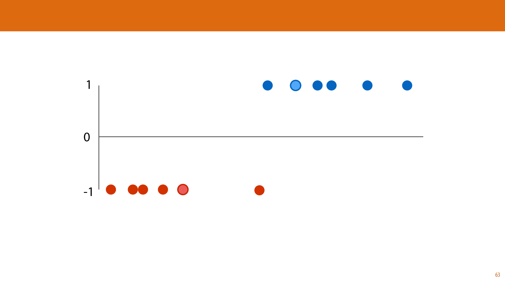

            <figcaption>
            
Even if the points <em>are</em> linearly separable, it can be good to allow a little slack.  

Here, the two points that would be the support vectors of the hard margin objective leave a very narrow margin. By allowing a little slack, we can get a much wider margin that provides a decision boundary that is more likely to generalise to unseen data.

            </figcaption>
            click image for animation
       </section>

       <section id="slide-064">
            <a class="slide-link" href="https://mlvu.github.io/lecture06#slide-064" title="Link to this slide.">link here</a>
            

            <figcaption>
            
So, now that we have made our objective precise, how do we find a good solution? We haven’t discussed constrained optimization much yet.

            </figcaption>
       </section>

       <section id="slide-064" class="anim">
            <a class="slide-link" href="https://mlvu.github.io/lecture06#slide-065" title="Link to this slide.">link here</a>
            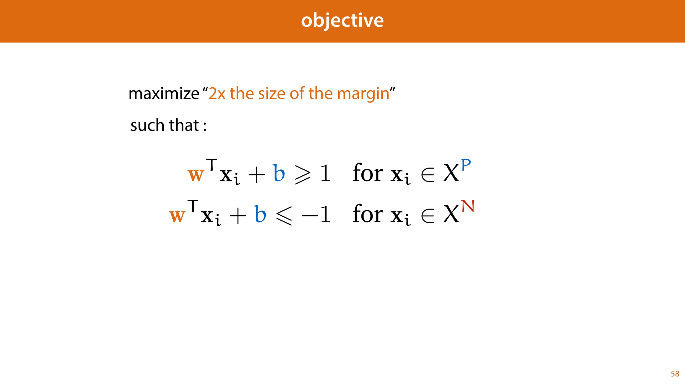

            <figcaption>
            
Here we have to options. One allows us to use the old familiar gradient descent, without having to worry about constraints.  

The other requires us to delve into constrained optimization, which we will do in the next video. The payoff for that is that it opens the door to the <strong>kernel trick</strong>. 

In the rest of this video, we will work out option one.

            </figcaption>
            click image for animation
       </section>

       <section id="slide-065" class="anim">
            <a class="slide-link" href="https://mlvu.github.io/lecture06#slide-066" title="Link to this slide.">link here</a>
            

            <figcaption>
            
To get rid of the constraints, let’s look at what we know about the value of pi. 

If the constraint for <strong>x</strong>i is violated, we can see that pi makes up the difference between what yi(<strong class="orange">w</strong>T<strong>x</strong>i+ b) should be (1) and what it is. 

If the constraint is not violated, pi becomes zero, and the value we computed above becomes negative. 

We can summarise these two conclusions in a single definition for pi. We can then simply fill this definition into the minimization objective, in place of pi.

            </figcaption>
            click image for animation
       </section>

       <section id="slide-066" class="anim">
            <a class="slide-link" href="https://mlvu.github.io/lecture06#slide-067" title="Link to this slide.">link here</a>
            

            <figcaption>
            
This gives us an <strong>unconstrained loss function</strong> we can directly apply to any model. For instance when training a neural network to classify, this makes a solid alternative to cross-entropy loss. This is sometimes called the <strong>L1-SVM</strong> (loss). There is also the <strong>L2-SVM</strong> loss where a square is applied to the pi function, to increase the weight of outliers. 

We can think of the first term as a <em>regulariser</em>. It doesn’t enforce anything about how well the plane should fit the data. It just ensures that the parameters of the plane don’t grow too big. 

The highlighted part of the second term functions as a kind of error (just as we used in least squares classification, but without the square). It computes how far the model output of yi(<strong class="orange">w</strong>T<strong>x</strong>i+ b) is away from the desired value (1).  

However, unlike the least squares classifier, we <em>only</em> compute this error for points that are sufficiently close to the decision boundary, for any points far from the boundary, we do not compute any error at all. This is achieved by cutting off any negative values. We could easily put all points far away from the decision boundary, and make all their error terms zero, but this (usually) requires a <strong>w</strong> with a high norm, so then the regulariser increases the loss massively.

            </figcaption>
            click image for animation
       </section>

       <section id="slide-068">
            <a class="slide-link" href="https://mlvu.github.io/lecture06#slide-068" title="Link to this slide.">link here</a>
            

            <figcaption>
            
And with that, we have discussed our final classification loss. Let’s review.

            </figcaption>
       </section>

       <section id="slide-069">
            <a class="slide-link" href="https://mlvu.github.io/lecture06#slide-069" title="Link to this slide.">link here</a>
            

            <figcaption>
            
Here are all our loss functions. The error, also known as zero one loss, is imply the number or proportion of misclasssified examples. It’s usually what we’re interested in, but it doesn’t give us a loss surface that is suitable for searching. 

            </figcaption>
       </section>

       <section class="video" id="video-069">
           <a class="slide-link" href="https://mlvu.github.io/lecture06#video-69">link here</a>
           <iframe
                src="https://www.youtube.com/embed/cPbsqPg-s2Y?modestbranding=1&showinfo=0&rel=0"
                title="YouTube video player"
                frameborder="0" allow="accelerometer; autoplay; clipboard-write; encrypted-media; gyroscope; picture-in-picture"
                allowfullscreen>
           </iframe>

       </section>

       <section id="slide-070">
            <a class="slide-link" href="https://mlvu.github.io/lecture06#slide-070" title="Link to this slide.">link here</a>
            

            <figcaption>
            
<lnbr></lnbr>

            </figcaption>
       </section>

       <section id="slide-070" class="anim">
            <a class="slide-link" href="https://mlvu.github.io/lecture06#slide-071" title="Link to this slide.">link here</a>
            

            <figcaption>
            
In the last video, we used some clever tricks to remove the constraints. This allows for hinge loss to be solved with plain gradient descent, and for it to be used as the last layer in a neural network, with the loss backpropagating though the network. 

In this video we’ll take another tack: we’ll keep the constraints, and rewrite the loss function so that <strong>w</strong> and b disappear. This requires us to use constrained  optimization, so we’ll need to look beyond plain gradient descent, and it doesn’t allow us to use the SVM inside a neural network anymore, but if we pay this price, we are rewarded with the ability to use<strong> the kernel trick</strong>, which has some very powerful consequences.

            </figcaption>
            click image for animation
       </section>

       <section id="slide-072">
            <a class="slide-link" href="https://mlvu.github.io/lecture06#slide-072" title="Link to this slide.">link here</a>
            

            <figcaption>
            
So we start with <strong>optimization under constraints</strong>. 

First let’s make it a little more intuitive what optimization under constraints looks like. Here, we have a simple constrained optimization problem. In this case, the constraint specifies that the solution must lie on the unit circle (that is, x and y must make a unit vector).  Within that set of points, we want to find the lowest point on some parabola in x and y.

            </figcaption>
       </section>

       <section id="slide-073">
            <a class="slide-link" href="https://mlvu.github.io/lecture06#slide-073" title="Link to this slide.">link here</a>
            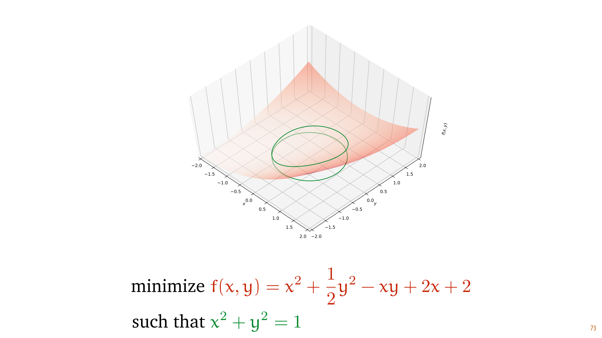

            <figcaption>
            
Projecting the constraints onto our function gives us the set of possible points over which we want to minimize: we want to find the lowest point on the green curve on our surface.

            </figcaption>
       </section>

       <section id="slide-073" class="anim">
            <a class="slide-link" href="https://mlvu.github.io/lecture06#slide-074" title="Link to this slide.">link here</a>
            

            <figcaption>
            
One way to help us visualize this problem is to draw <strong>contours</strong> for the function f. These are the curves that indicate where the function is equal to some constant k. By increasing k, we get different contour lines for the function.  

If we look down onto the xy plane, the z axis disappears, and we get a 2D plot of our function, where the contour lines give us an idea of the height of the function.  
<aside    >This principle is often used in maps to indicate elevation.</aside><aside    ></aside>
            </figcaption>
            click image for animation
       </section>

       <section id="slide-074" class="anim">
            <a class="slide-link" href="https://mlvu.github.io/lecture06#slide-075" title="Link to this slide.">link here</a>
            

            <figcaption>
            
Note that the function f gets lower towards the bottom left corner. 

Each contour line indicates a constant output value for our function: the value that we want to minimize. We can tell by this plot what we can achieve. 

The output value k1 is very low (the lowest of the contour lines in this plot), so it would make a very good solution, but it never meets the circle representing our constraints. That means that we can’t get the output as low as k1 <em>and</em> satisfy the constraints. 

The next lowest contour we've drawn value, k2, does give us a contour line that hits the circle representing our constraints. Therefore, we can satisfy our constraints and get at least as low as k2. However, the fact that it <em>crosses</em> the circle of our constrains, means that we can also get <em>lower</em> than k2. Why?

            </figcaption>
            click image for animation
       </section>

       <section id="slide-075" class="anim">
            <a class="slide-link" href="https://mlvu.github.io/lecture06#slide-076" title="Link to this slide.">link here</a>
            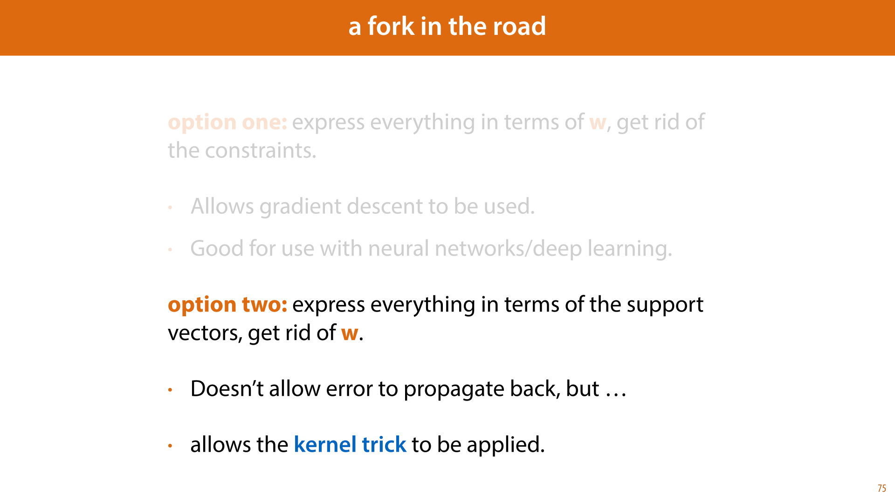

            <figcaption>
            
We can work this out based on ideas we've developed in earlier lectures: if we have a hyperplane defined by <strong class="orange">w</strong>Tx + b, then we know that <strong class="orange">w</strong> is the direction of steepest ascent, and -<strong class="orange">w</strong> is the direction of steepest descent. <strong>This tells us that the direction orthogonal to the line of </strong><strong class="orange">w</strong><strong> is the direction in which the value of the plane doesn’t change</strong>: the direction of equal value. 

This means that if we take any point on a contour line and work out the tangent hyperplane of f at that point, that is, compute the gradient, the direction orthogonal to the gradient points <em>along the contour line</em>.  

In this case, since our contour line <em>crosses</em> the circle of the constraints, the direction of equal value doesn’t point along the circle for the constraints, and we can conclude that the value of f decreases in one direction along the circle and increases in one direction.  

            </figcaption>
            click image for animation
       </section>

       <section id="slide-076" class="anim">
            <a class="slide-link" href="https://mlvu.github.io/lecture06#slide-077" title="Link to this slide.">link here</a>
            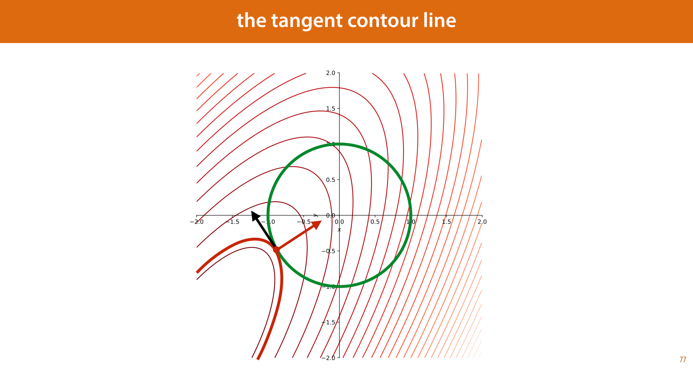

            <figcaption>
            
By this logic, the only time we can be sure that there is no lower to go along the circle is when the direction of equal value points along the circle. In other words, <strong>when the contour line is tangent to the circle</strong>: when it touches it only at one point without crossing it.  

How do we work out where this point is? By recognizing that the circle for our constraints is <em>also</em> a contour line. A contour of the function x2 + y2, for the constant value 1. This means that when the gradient of x2 + y2 points in the same or opposite direction as that of f, their contour lines are tangent. And when that happens we have a minimum or maximum for our objective. 

            </figcaption>
            click image for animation
       </section>

       <section id="slide-077" class="anim">
            <a class="slide-link" href="https://mlvu.github.io/lecture06#slide-078" title="Link to this slide.">link here</a>
            

            <figcaption>
            
If we define our problem in general with an objective function f(<strong>x</strong>) that we want to minimize and a constraint function g(<strong>x</strong>) that we need to stay equal to zero, then we can state the point we’re looking for in terms of their gradients, as shown here. 
<aside    >There may be other points where this condition is also true, like maxima and saddle points, but these are usually easy to eliminate in practice.</aside><aside    ></aside>
            </figcaption>
            click image for animation
       </section>

       <section id="slide-078" class="anim">
            <a class="slide-link" href="https://mlvu.github.io/lecture06#slide-079" title="Link to this slide.">link here</a>
            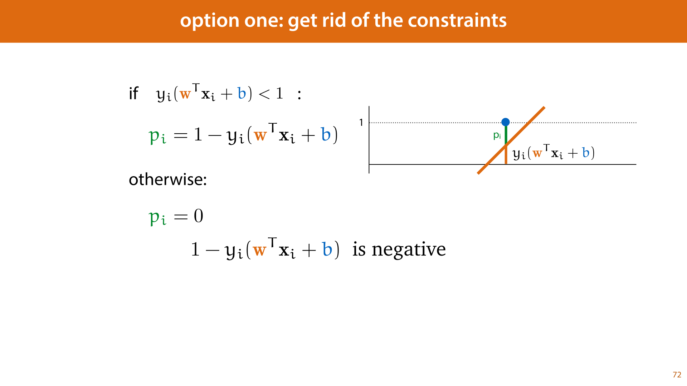

            <figcaption>
            
We are looking for gradients pointing in the same (or opposite) direction, but not necessarily of the same size. To state this formally, we say that there must be some value α, such that the gradient of f is equal to the gradient of g <em>times α</em>. 

We rewrite to get something that must be equal to zero. By moving the gradient symbol out in front (the opposite of what we usually do with gradients), we see that what we’re looking for is the point where the gradient of some function is equal to zero. This new function we will call L. It is a function of x <strong>and the additional parameter α</strong>. 

With that, we’ve turned our constrained optimization problem into an unconstrained one. The price we pay is one additional parameter to optimize.

            </figcaption>
            click image for animation
       </section>

       <section id="slide-079" class="anim">
            <a class="slide-link" href="https://mlvu.github.io/lecture06#slide-080" title="Link to this slide.">link here</a>
            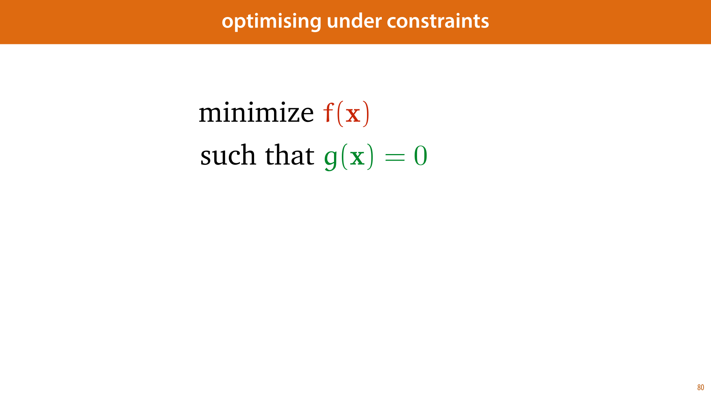

            <figcaption>
            
This is the idea of <strong>Lagrange multipliers</strong>. We rewrite the problem so that he contrainsts are some function that needs to be equal to zero. Then we create a new function L, which consists of f with α times g subtracted. For this new function <strong>x</strong> and alpha are both parameters. Then, we solve for both <strong>x</strong> and alpha  

This new function L has an optimum where the original function is minimal within the constraints. The new optimum is a <strong>saddlepoint</strong>: it’s a minimum in <strong>x</strong> and a maximum in α. This means we can’t solve it easily by basic gradient descent, we have to set its gradient equal to zero, and solve <em>analytically</em>. 

If we have multiple constraints, then we add multiple terms to L, each with their own α.

            </figcaption>
            click image for animation
       </section>

       <section id="slide-081">
            <a class="slide-link" href="https://mlvu.github.io/lecture06#slide-081" title="Link to this slide.">link here</a>
            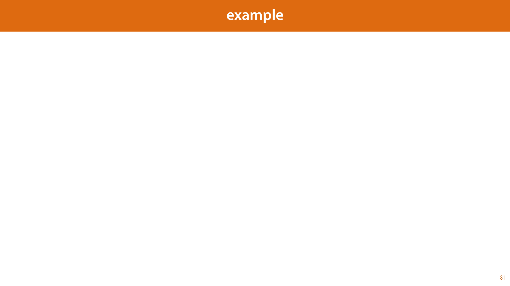

            <figcaption>
            

            </figcaption>
       </section>

       <section id="slide-082">
            <a class="slide-link" href="https://mlvu.github.io/lecture06#slide-082" title="Link to this slide.">link here</a>
            

            <figcaption>
            
If the constraint in our problem is not an equality constraint, but an <em>in</em>equality constraint, we need to keep a few more things in mind. 

In a case like this one show here, the constraint is <strong>inactive</strong>: the constraint doesn't remove the global minimum from the graph, so the solution to the problem is the same as the unconstrained one. 

 

            </figcaption>
       </section>

       <section id="slide-082" class="anim">
            <a class="slide-link" href="https://mlvu.github.io/lecture06#slide-083" title="Link to this slide.">link here</a>
            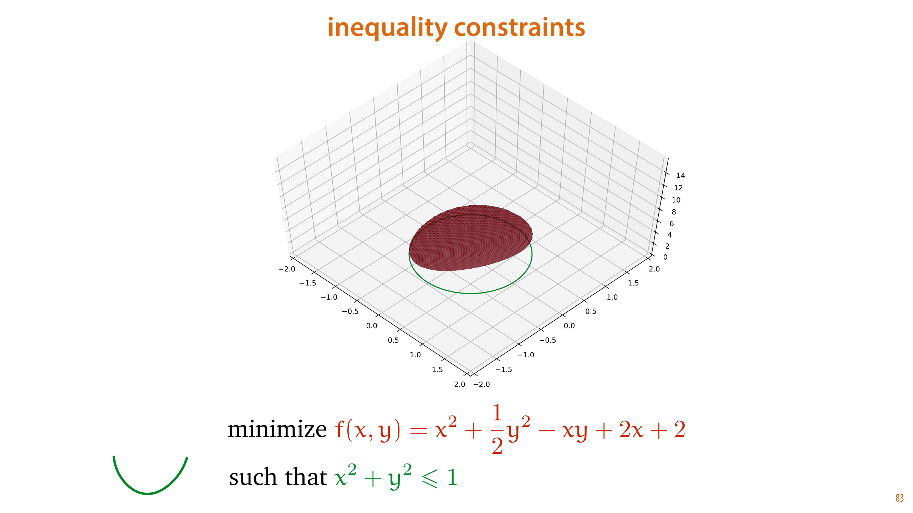

            <figcaption>
            
If we search only inside the unit circle, the constraint is <strong>active</strong>. It stops us from going where we want to go, and we end up on the boundary, just like we would if the constraint were an equality constraint. 

We first set the convention that all constraints are rewritten to be “greater than” inequalities, with zero on the right hand side. This doesn’t change the region we’re constrained to, but note that the function on left of the inequality sign had a “bowl” shape before, and now has a “hill” shape. In other words, the gradients of this function now point in the opposite direction.  

With that, there is one important thing to keep in mind, compared to the Lagrange multipliers we used for equality constraints. 

 

            </figcaption>
            click image for animation
       </section>

       <section id="slide-083" class="anim">
            <a class="slide-link" href="https://mlvu.github.io/lecture06#slide-084" title="Link to this slide.">link here</a>
            

            <figcaption>
            
If we are <strong>minimizing</strong>, we need to make sure that the gradient points<strong> into</strong> the constrained region, so that the direction of steepest descent points outside. If the direction of steepest descent pointed into the region, we could find a lower point somewhere inside, away from the boundary. Since the gradient for the constraint function points inside the region, we need to make sure that the gradients of the objective function point in the same direction. 

If we are <strong>maximizing</strong>, by the same logic, we need to make sure that the gradients point in opposite directions. 

Contrast this with case of equality constraints. There, we just needed to make sure that the gradients were on the same line, either pointing in the same direction or in opposite directions. Now, we need to be a bit more careful. Since we tend to minimize in machine learning, we'll develop that case further.

            </figcaption>
            click image for animation
       </section>

       <section id="slide-084" class="anim">
            <a class="slide-link" href="https://mlvu.github.io/lecture06#slide-085" title="Link to this slide.">link here</a>
            

            <figcaption>
            
This makes the derivation a little more complicated: we again set the gradient of the objective function equal to that of the constraint, again with an α to account for the differences is size between the two gradients, but this time around, we need to make sure that <strong>α remains positive</strong>, since a negative alpha would cause the gradient of the constraint to point in the wrong direction. 

We work out L as before, but we don’t end up with an unconstrained problem. We’ve simply traded one constrained problem for another. This new problem is sometimes called the <strong>Lagrangian dual </strong>of the original problem. A <em>dual </em>is a mathematical term for a different way of phrasing something. 

Even though we’ve not removed the constraint, we’ve simplified it a lot: it is now a linear function, even a constant one, instead of a nonlinear function. Linear constraints are much easier to handle, for instance using methods like linear programming, or gradient descent with projection.

            </figcaption>
            click image for animation
       </section>

       <section id="slide-086">
            <a class="slide-link" href="https://mlvu.github.io/lecture06#slide-086" title="Link to this slide.">link here</a>
            

            <figcaption>
            
Here then, is the method of <strong>KKT multipliers</strong>, the way to solve problems with inequality constraints.  It’s just like the Lagrangian method with two additional points we need to keep in mind: 

For a “greater than 0” inequality and a minimization problem we <strong>subtract</strong> the constraint term from the objective function. If we maximize instead of minimize we add the term. 

The resultant problem has one constraint, which is that the KKT multiplier alpha must be positive.

            </figcaption>
       </section>

       <section id="slide-087">
            <a class="slide-link" href="https://mlvu.github.io/lecture06#slide-087" title="Link to this slide.">link here</a>
            

            <figcaption>
            
In the next video, we will return to our constrained optimization objective and apply the KKT method to work out the Lagrangian dual. As we will see, this will allow us to get rid of all parameters except the KKT multipliers

            </figcaption>
       </section>

       <section class="video" id="video-087">
           <a class="slide-link" href="https://mlvu.github.io/lecture06#video-87">link here</a>
           <iframe
                src="https://www.youtube.com/embed/rILXgY0IHxA?modestbranding=1&showinfo=0&rel=0"
                title="YouTube video player"
                frameborder="0" allow="accelerometer; autoplay; clipboard-write; encrypted-media; gyroscope; picture-in-picture"
                allowfullscreen>
           </iframe>

       </section>

       <section id="slide-088">
            <a class="slide-link" href="https://mlvu.github.io/lecture06#slide-088" title="Link to this slide.">link here</a>
            

            <figcaption>
            
<lnbr></lnbr>

            </figcaption>
       </section>

       <section id="slide-089">
            <a class="slide-link" href="https://mlvu.github.io/lecture06#slide-089" title="Link to this slide.">link here</a>
            

            <figcaption>
            
Here is the original optimization objective again, before we started rewriting. We will use the method of Lagrange multipliers to rewritethis objective to its <em>Lagrangian dual</em>.

            </figcaption>
       </section>

       <section id="slide-090">
            <a class="slide-link" href="https://mlvu.github.io/lecture06#slide-090" title="Link to this slide.">link here</a>
            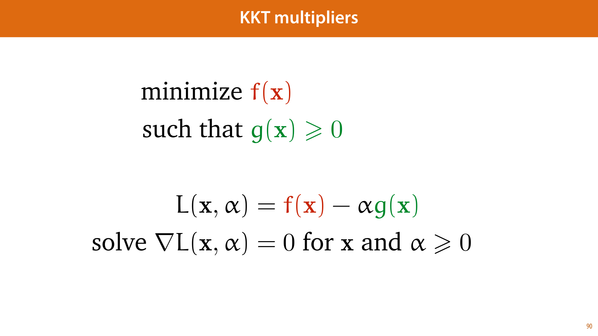

            <figcaption>
            
In the last video we learned how to solve a problem with an inequality constraint. That’s just what we have here, except that we have more than one constraint. 

The solution is simple, we add one term to L for every constraint in our problem.

            </figcaption>
       </section>

       <section id="slide-091">
            <a class="slide-link" href="https://mlvu.github.io/lecture06#slide-091" title="Link to this slide.">link here</a>
            

            <figcaption>
            
Here’s what that looks like. Each term gets its own KKT multiplier αi, and for all of these, we get a new constraint that it should be positive.

            </figcaption>
       </section>

       <section id="slide-092">
            <a class="slide-link" href="https://mlvu.github.io/lecture06#slide-092" title="Link to this slide.">link here</a>
            

            <figcaption>
            

            </figcaption>
       </section>

       <section id="slide-092" class="anim">
            <a class="slide-link" href="https://mlvu.github.io/lecture06#slide-093" title="Link to this slide.">link here</a>
            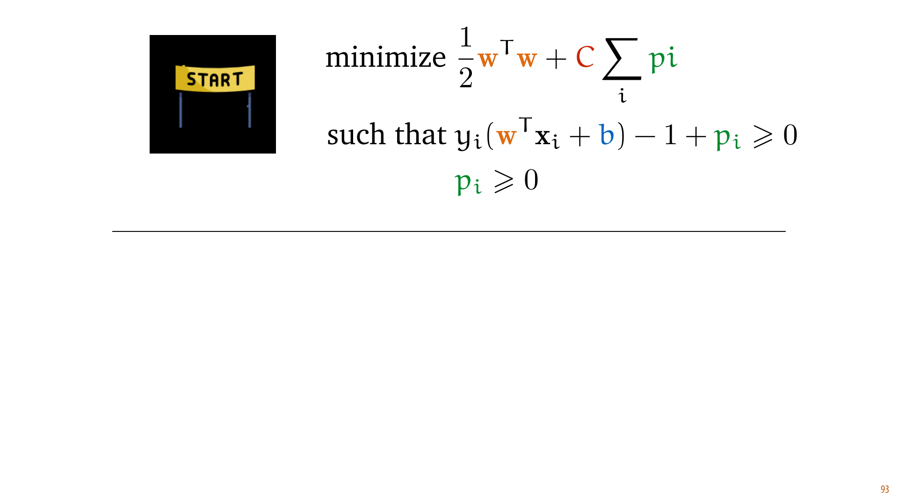

            <figcaption>
            
The derivation of our new objective is a long and complicated one, so let’s first set up what we plan to achieve. The objective above the line is the one we defined in the last video.  

 

We want to show, by the method of KKT multipliers that this objective is equivalent to the objective below the line. 

 

You can skip this derivation if it's too much for you. To be honest it's a bit much to ask of BSc students and it's included here mainly for completeness. It won't be part of the exam. If you understand the basic idea of rewriting optimization objectives using KKT multipliers, and you are willing to take my word for it that the problem above the like can be rewritten to the problem below the line, then skip ahead to slide 102, and continue from there 

 

image source: <a href="https://www.flaticon.com/free-icons/road"><strong class="blue">https://www.flaticon.com/free-icons/road</strong></a>

<a href="https://www.flaticon.com/free-icons/road"><strong class="blue"></strong></a>

            </figcaption>
            click image for animation
       </section>

       <section id="slide-093" class="anim">
            <a class="slide-link" href="https://mlvu.github.io/lecture06#slide-094" title="Link to this slide.">link here</a>
            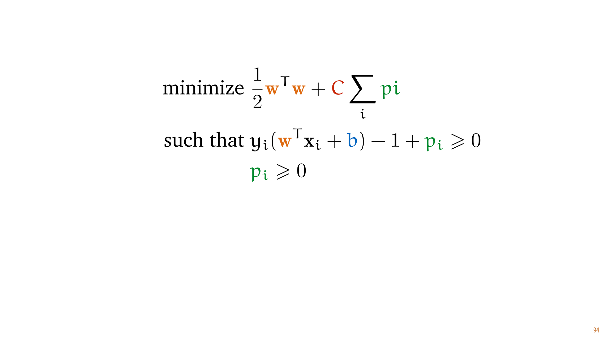

            <figcaption>
            
First, we define our L function: the optimization objective with terms added for all inequality constraints.. 

Note that we’ve changed the optimization objective from the size of the margin to its square ,which is equal to the dot product of <strong class="orange">w</strong> with itself. This doesn’t change the location of the optimum, and it makes the solution easier to work out. 

            </figcaption>
            click image for animation
       </section>

       <section id="slide-094" class="anim">
            <a class="slide-link" href="https://mlvu.github.io/lecture06#slide-095" title="Link to this slide.">link here</a>
            

            <figcaption>
            
We start by writing out our optimization objective. 

We muliply out the alphas, and then do the opposite for the p’s, taking them outside the brackets.

            </figcaption>
            click image for animation
       </section>

       <section id="slide-096">
            <a class="slide-link" href="https://mlvu.github.io/lecture06#slide-096" title="Link to this slide.">link here</a>
            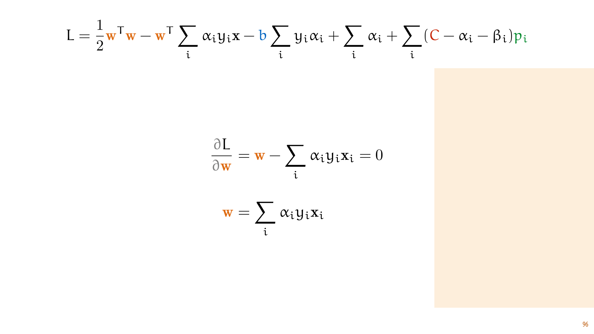

            <figcaption>
            
For this function, we take the derivative with respect to the parameters, and set them equal to zero. We haven’t discussed taking derivatives with respect to vectors, but here we’ll just use two rules that are analogous to the way we multiply scalars. 

The derivative of the dot product of <strong>w</strong> with itself, wrt to <strong>w</strong> is 2 times<strong> w</strong>. This is analogous to the derivative of the square for scalars. 

The derivative of <strong>w</strong> times some constant vector (wrt to w) is just that constant. This is similar to the constant multiplier rule for scalars. 

This gives us an expression for <strong>w</strong> at the optimum, in terms of alpha, y and <strong>x</strong>,

            </figcaption>
       </section>

       <section id="slide-097">
            <a class="slide-link" href="https://mlvu.github.io/lecture06#slide-097" title="Link to this slide.">link here</a>
            

            <figcaption>
            
If we take the derivative with respect to b, we find a simple constraint: that at the optimum, the sum of all alpha values (multiplied by their corresponding y’s) should be zero.

            </figcaption>
       </section>

       <section id="slide-097" class="anim">
            <a class="slide-link" href="https://mlvu.github.io/lecture06#slide-098" title="Link to this slide.">link here</a>
            

            <figcaption>
            
Finally, we take the derivative for pi and set that equal to zero. 

The result essentially tells us that the alpha plus the beta must equal C. If we assume that alpha is between 0 and C, then we can just take beta to be the remainder. 

            </figcaption>
            click image for animation
       </section>

       <section id="slide-098" class="anim">
            <a class="slide-link" href="https://mlvu.github.io/lecture06#slide-099" title="Link to this slide.">link here</a>
            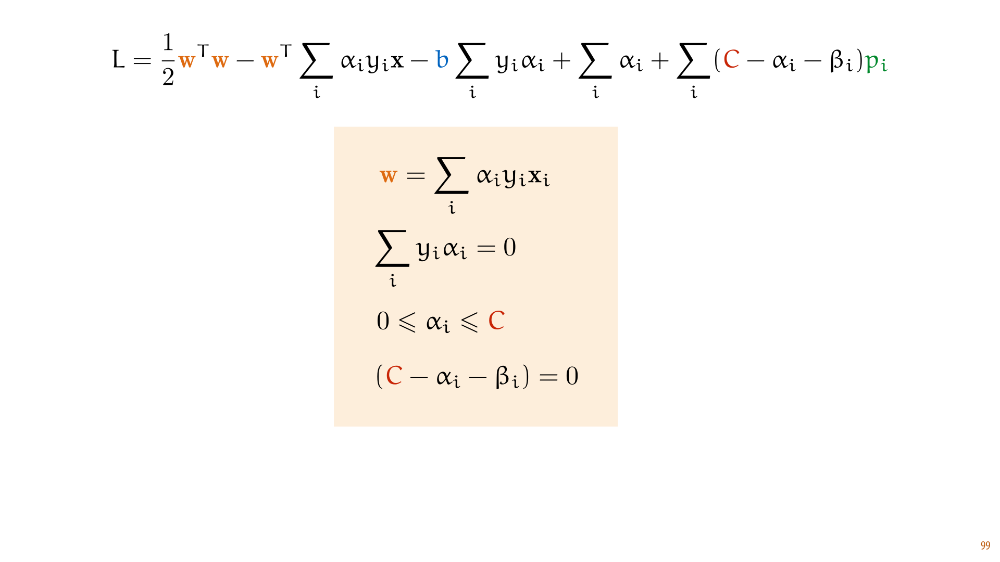

            <figcaption>
            
This (in the orange box) is what we have figured out so far about our function at the optimum.  

If we fill in the three equalities, our function simplifies a lot. This function describes the optimum, subject to the constraints on the right. These are constraints of variables in our final form, so we need to remember these. 

We can now take this expression of <strong class="orange">w</strong> and fill it into the objective function. This gives us an objective function without <strong class="orange">w</strong>.

            </figcaption>
            click image for animation
       </section>

       <section id="slide-099" class="anim">
            <a class="slide-link" href="https://mlvu.github.io/lecture06#slide-100" title="Link to this slide.">link here</a>
            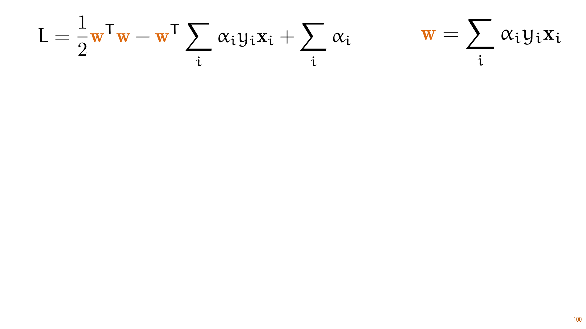

            <figcaption>
            
To simplify our function further, we first replace one of the sums in the first line with w. 

Then, we replace the final two occurrences of w, with the sum. This gives us a function purely in terms of alpha, with no reference to w or b. All we need to do is simplify it a little bit. 

Note that the square brackets here are just brackets, they have no special meaning.

            </figcaption>
            click image for animation
       </section>

       <section id="slide-100" class="anim">
            <a class="slide-link" href="https://mlvu.github.io/lecture06#slide-101" title="Link to this slide.">link here</a>
            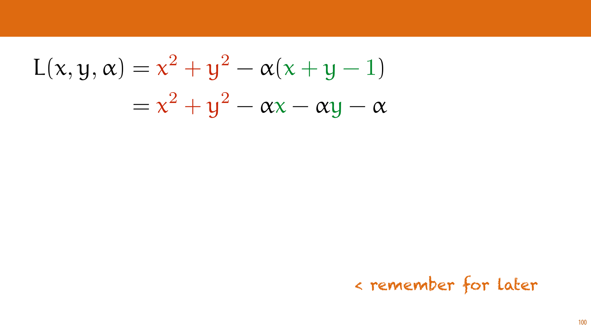

            <figcaption>
            
To simplify, we distirbute all dot products over the sums. Note that the dot product distributed over sums the same way as scalar multiplication: (a + b + c)Td -&gt; (aTd  + bTd  + cTd).  

It looks a little intimidating with the capital sigma notation, but it’s the same thing as you see on the right, except with dot products instead of of scalar mulitplication. 

            </figcaption>
            click image for animation
       </section>

       <section id="slide-101" class="anim">
            <a class="slide-link" href="https://mlvu.github.io/lecture06#slide-102" title="Link to this slide.">link here</a>
            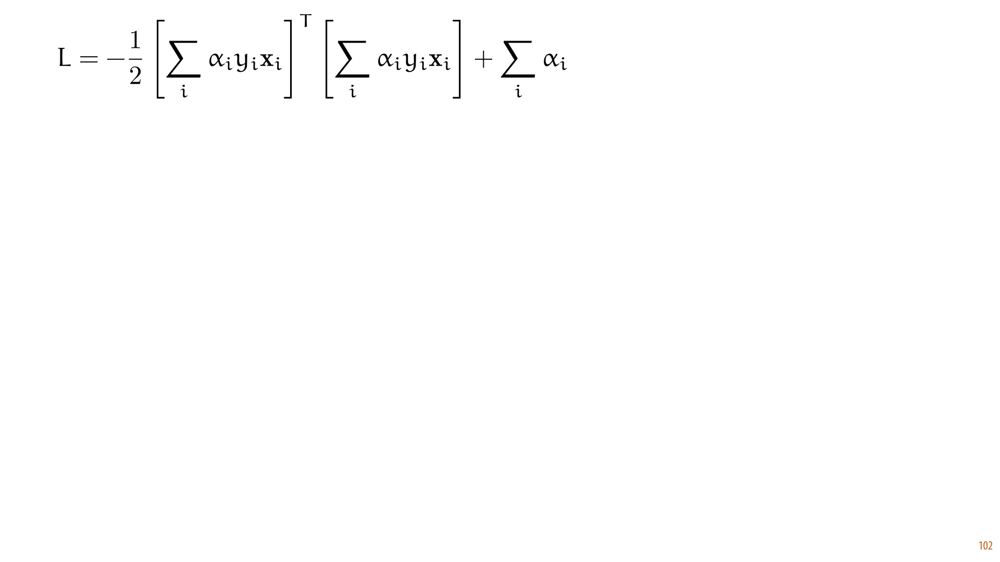

            <figcaption>
            
With that, we have achieved our objective. What has this bought us? It's still a constrained optimization problem, so we still need a fancy optimization algorithm to solve this.  

 

We wont go into the details, but a popular choice for SVMs is the relatively simple sequential minimal optimization (SMO) algorithm, a form of linear programming specifically developed for SVMs. 

 

<a href="https://en.wikipedia.org/wiki/Sequential_minimal_optimization"><strong class="blue">https://en.wikipedia.org/wiki/Sequential_minimal_optimization</strong></a>

<a href="https://en.wikipedia.org/wiki/Sequential_minimal_optimization"><strong class="blue"></strong></a>

            </figcaption>
            click image for animation
       </section>

       <section id="slide-103">
            <a class="slide-link" href="https://mlvu.github.io/lecture06#slide-103" title="Link to this slide.">link here</a>
            

            <figcaption>
            
So why did we do all this if we still need to search for a solution? We had a version that worked with gradient descent, and now we have a version that requires constrained optimizers. What have we gained? 

The main results here are twofold: 

First, notice that the hyperplane parameters <strong class="orange">w</strong> and b have <em>disappeared</em> entirely from the objective and its constraints. The only parameters that remain are one αi per instance i in our data, and the hyperparameter C. The alphas function as an encoding of the support vectors: <strong>any instance for which the corresponding alpha is not zero is a support vector</strong>. 
<aside    >We could use this to reduce the data to only its support vectors. For the purposes of the classifier, these instances define the decision boundary, and the rest can be deleted. </aside>
Second, note that the algorithm only operates on the <strong>dot products</strong> of pairs of instances. In other words, if you didn’t have access to the data, but I <em>did</em> give you the full matrix of all dot products of all pairs of instances, you would still be able to find the optimal support vectors. This allows us to use a very special trick.

            </figcaption>
       </section>

       <section id="slide-104">
            <a class="slide-link" href="https://mlvu.github.io/lecture06#slide-104" title="Link to this slide.">link here</a>
            

            <figcaption>
            
What if I didn’t give you the actual dot products, but instead gave you a different matrix of values, that <em>behaved </em>like a matrix of dot products.

            </figcaption>
       </section>

       <section id="slide-105">
            <a class="slide-link" href="https://mlvu.github.io/lecture06#slide-105" title="Link to this slide.">link here</a>
            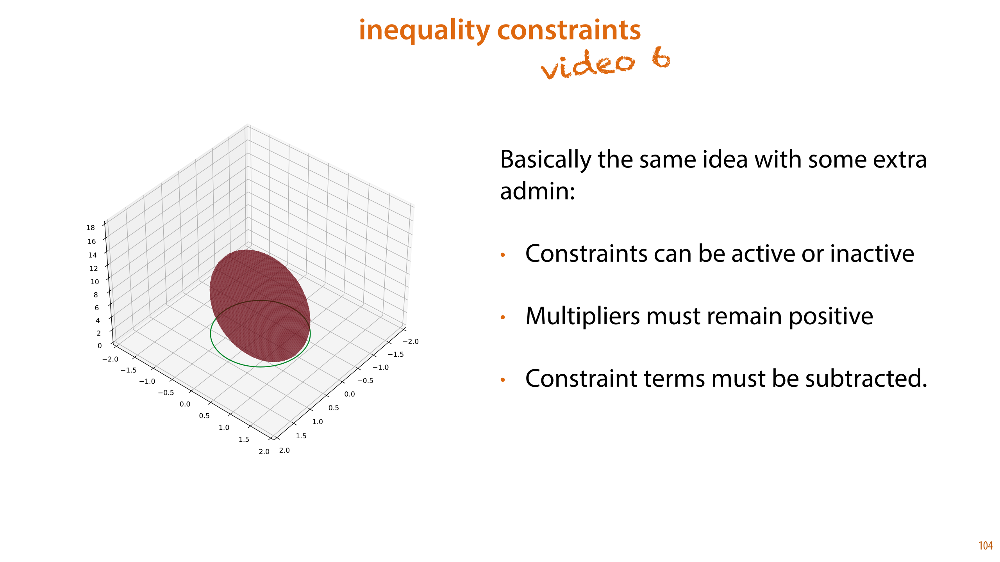

            <figcaption>
            
Remember, by adding features that are derived from the original features, we can make linear models more powerful. If the number of features we add grows very quickly (like if we add all 5-way cross products), this can becomes a little expensive (both memory and time wise). 

It turns out that for some feature expansions,<strong> we can compute the dot product between two instances without explicitly computing all expanded features</strong>.

            </figcaption>
       </section>

       <section id="slide-106">
            <a class="slide-link" href="https://mlvu.github.io/lecture06#slide-106" title="Link to this slide.">link here</a>
            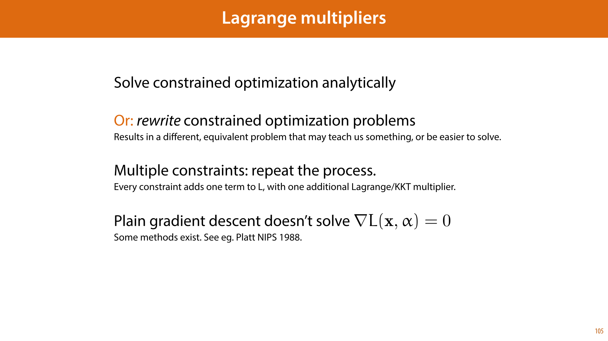

            <figcaption>
            
Let’s look at an example. The simplest way we saw to extend the feature space was to add <strong>all cross-products</strong>. This turns a 2D dataset into a 5D dataset. Let's se if we can do this, or something similar, without computing the 5D vectors.

            </figcaption>
       </section>

       <section id="slide-106" class="anim">
            <a class="slide-link" href="https://mlvu.github.io/lecture06#slide-107" title="Link to this slide.">link here</a>
            

            <figcaption>
            
Here are two 2D feature vectors. What if, instead of computing their dot product, we computed the <em>square</em> of their dot product.  

It turns out that this is equal to the dot product of two other 3D vectors <strong>a’</strong> and <strong>b’</strong>.

            </figcaption>
            click image for animation
       </section>

       <section id="slide-107" class="anim">
            <a class="slide-link" href="https://mlvu.github.io/lecture06#slide-108" title="Link to this slide.">link here</a>
            

            <figcaption>
            
The square of the dot product in the 2D feature space, is equivalent to the regular dot product in a 3D feature space. The new features in this 3D space can all be derived from the original features. They're the three cross products, with a small multiplier on the a1a2 cross product.

            </figcaption>
            click image for animation
       </section>

       <section id="slide-108" class="anim">
            <a class="slide-link" href="https://mlvu.github.io/lecture06#slide-109" title="Link to this slide.">link here</a>
            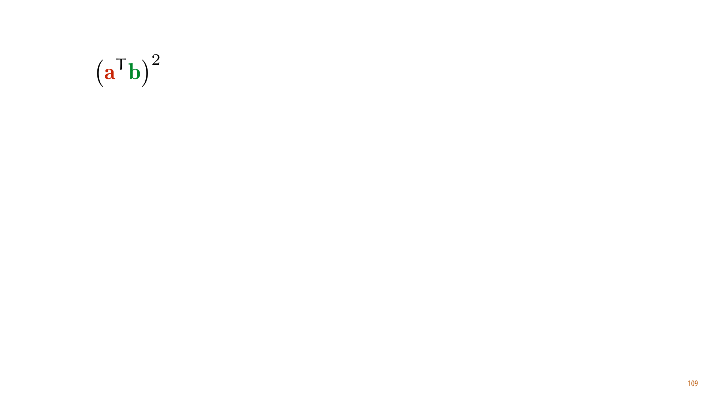

            <figcaption>
            
That is, this kernel function k doesn;t compute the dot product between two instances, but it does compute the dot proct in a feature space of <em>expanded</em> features. We could do this already, but before we had to actually <em>compute</em> the new features. <strong>Now, all we have to do is compute the dot product in the original feature space and square it.</strong>

<strong></strong>

            </figcaption>
            click image for animation
       </section>

       <section id="slide-110">
            <a class="slide-link" href="https://mlvu.github.io/lecture06#slide-110" title="Link to this slide.">link here</a>
            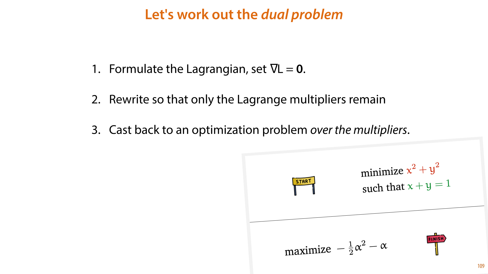

            <figcaption>
            
Since the solution to the SVM is expressed purely in terms of the dot product, we can replace the dot product this kernel function. We are now fitting a line in a higher-dimensional space, without computing any extra features explicitly. 

Note that this only works because we rewrote the optimization objective to get rid of <strong class="orange">w</strong> and b. Since <strong class="orange">w</strong> and b have the same dimensionality as the features, keeping them in means using explicit features. 

Saving the trouble of computing a few extra features may not sound like a big saving, but by choosing our kernel function cleverly we can push things a lot further.

            </figcaption>
       </section>

       <section id="slide-111">
            <a class="slide-link" href="https://mlvu.github.io/lecture06#slide-111" title="Link to this slide.">link here</a>
            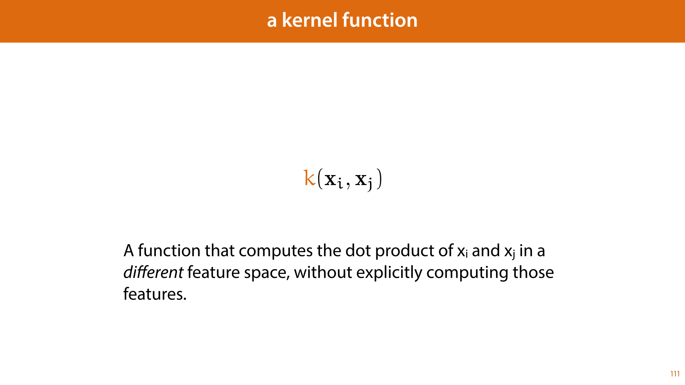

            <figcaption>
            
For some expansions to a higher feature space, we can compute the dot product between two vectors, <strong>without explicitly expanding the features</strong>. This is called a <strong>kernel function</strong>. 

There are many functions that compute the dot product of two vectors in a highly expanded feature space, but don’t actually require you to expand the features.

            </figcaption>
       </section>

       <section id="slide-112">
            <a class="slide-link" href="https://mlvu.github.io/lecture06#slide-112" title="Link to this slide.">link here</a>
            

            <figcaption>
            
Taking just the square of the dot product, we lose the original features. If we take the square of the dot product plus one, we retain them, and get all cross products. If we increase the exponent to d we get all d-way cross products. Note the main benefit: the d-th power of the dot product + 1 requires almost no more computation than the dot product itself (whatever we choose for d).  

If we did this explicitly anything over d=5 would already slow our computer to a crawl, and we would be at risk of out-of-memry error. 

d is a hyperparameter: increasing it does not make the algorithm much more expensive, but it does increase your (implicit) feature space so much that you risk overfitting, so you'll need to tune it to your data.

            </figcaption>
       </section>

       <section id="slide-112" class="anim">
            <a class="slide-link" href="https://mlvu.github.io/lecture06#slide-113" title="Link to this slide.">link here</a>
            

            <figcaption>
            
Gamma is another hyperparameter. The RBF kernel is powerful, but prone to overfitting.

            </figcaption>
            click image for animation
       </section>

       <section id="slide-114">
            <a class="slide-link" href="https://mlvu.github.io/lecture06#slide-114" title="Link to this slide.">link here</a>
            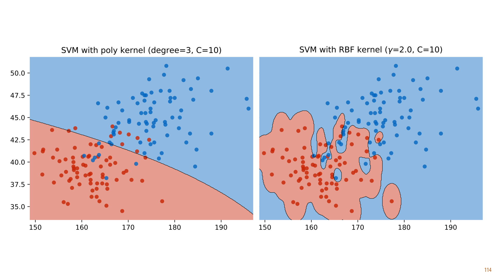

            <figcaption>
            
Here’s a plot for the dataset from the first lecture. As you can tell, the RBF kernel massively overfits for these hyperparameters, but it does give us a very nonlinear fit.

            </figcaption>
       </section>

       <section id="slide-115">
            <a class="slide-link" href="https://mlvu.github.io/lecture06#slide-115" title="Link to this slide.">link here</a>
            

            <figcaption>
            
One of the most interesting application areas of kernel methods is places where you can turn a distance metric in your data space directly into a kernel, without first extracting any features at all. 

For instance for an email classifier, you don't need to extract word frequencies, as we’ve done so far, you can just design a kernel that operates directly on strings (usually based on the edit distance).Put simply, the fewer operations we need to turn one email into another, the closer we put them together. If you make sure that such a function behaves like a dot product, you can stick it in the SVM optimizer as a kernel. This approach has often been used to analyze DNA and protein sequences in bioinformatics. 

If you’re classifying graphs, there are distance metrics like the Weisfeiler-Lehman algorithm that you can use to define kernels.

            </figcaption>
       </section>

       <section id="slide-116">
            <a class="slide-link" href="https://mlvu.github.io/lecture06#slide-116" title="Link to this slide.">link here</a>
            

            <figcaption>
            
Kernel SVMs are complicated beasts to undertsand, but they're easy to use with the right libraries. Here's a simple recipe for fitting an SVM with an RBF kernel in sklearn.

            </figcaption>
       </section>

       <section id="slide-117">
            <a class="slide-link" href="https://mlvu.github.io/lecture06#slide-117" title="Link to this slide.">link here</a>
            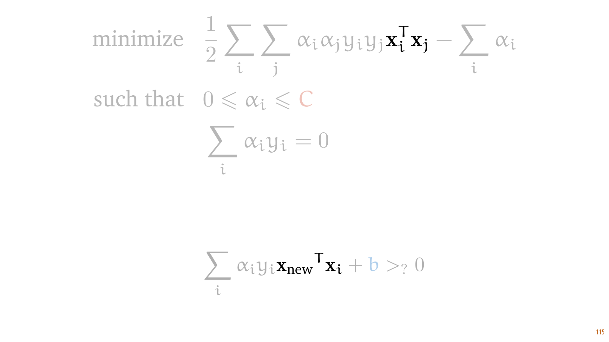

            <figcaption>
            
Neural nets require a lot of passes over the data, so it takes a big dataset before kN becomes smaller than N2, but eventually, we got there. At that point, it became more efficient to train models by gradient descent, and the kernel trick lost its luster.

            </figcaption>
       </section>

       <section id="slide-118">
            <a class="slide-link" href="https://mlvu.github.io/lecture06#slide-118" title="Link to this slide.">link here</a>
            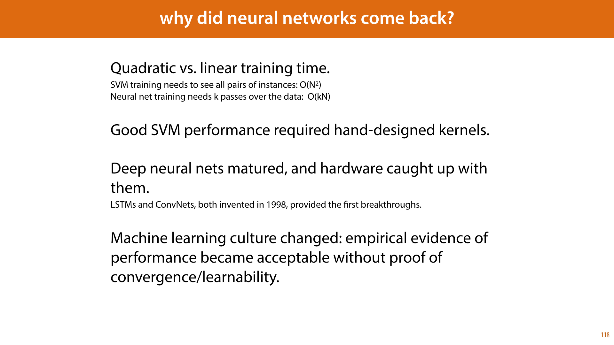

            <figcaption>
            
And when neural networks did come back, they caused a revolution. That’s where we’ll pick things up next lecture.

            </figcaption>
       </section>

</article>
