<nav class="menu">
    <ul>
        <li class="home"><a href="/">Home</a></li>
        <li class="name">Lecture 7: Deep learning</li>
                <li><a href="#video-000">Automatic differentiation</a></li>
                <li><a href="#video-019">Tensor backpropagation</a></li>
                <li><a href="#video-049">Convolutions</a></li>
                <li><a href="#video-067">Making it work</a></li>
        <li class="pdf"><a href="https://mlvu.github.io/lectures/41.DeepLearning1.annotated.pdf">PDF</a></li>
    </ul>
</nav>

<article class="slides">

        <section class="video" id="video-000">
            <a class="slide-link" href="https://mlvu.github.io/lecture07#video-0">link here</a>
           <video controls>
                <source src="https://pbm.thegood.cloud/s/FHqn4ox5FrezJCd/download/MLVU%207.1%20Deep%20learning%20and%20automatic%20differentiation.mp4" type="video/mp4" />

                Download the <a href="https://pbm.thegood.cloud/s/FHqn4ox5FrezJCd/download/MLVU%207.1%20Deep%20learning%20and%20automatic%20differentiation.mp4">video</a>.
           </video>
        </section>

       <section id="slide-001">
            <a class="slide-link" href="https://mlvu.github.io/lecture07#slide-001" title="Link to this slide.">link here</a>
            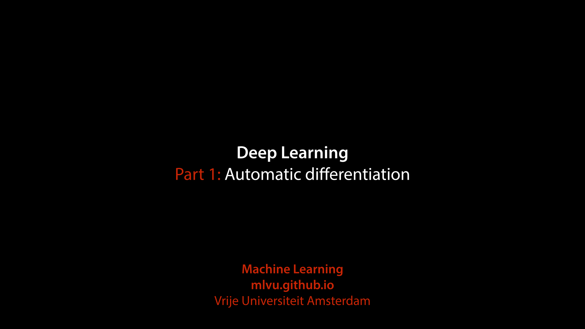

            <figcaption>
            
This is the first of several lectures that deal with deep learning. Deep learning evolved out of neural networks, but it’s slightly more than just the business of training very large and very deep neural nets. We’ll discuss exactly what makes a deep learning model at the end of the lecture.  

 

            </figcaption>
       </section>

       <section id="slide-002">
            <a class="slide-link" href="https://mlvu.github.io/lecture07#slide-002" title="Link to this slide.">link here</a>
            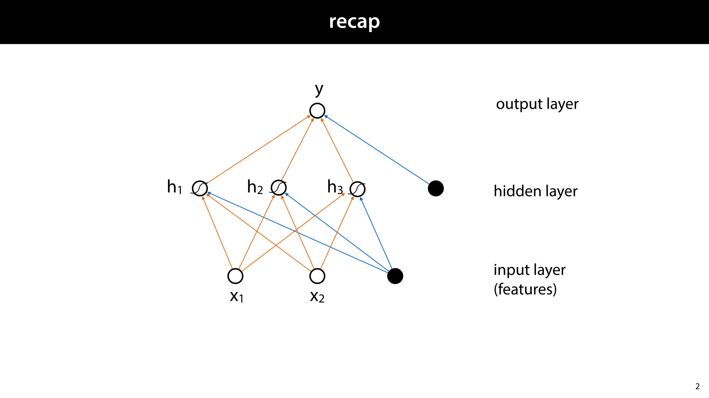

            <figcaption>
            
For now, we’ll pick up the discussion about neural networks from the last lecture, and develop the idea further. 

Here’s how we defined a neural network last time around. A neural network is a model described by a graph: each node represents a scalar value. The value of each node is computed from the incoming edges by multiplying the weight on the edge by the value of the node it connects to. 

We train the model by tuning the weights. Every orange and blue line in this picture represents one of those weights. The feedforward network, seen here,  is the simplest way of wiring up a neural net, but we will see other possibilities later. 

            </figcaption>
       </section>

       <section id="slide-003" class="anim">
            <a class="slide-link" href="https://mlvu.github.io/lecture07#slide-003" title="Link to this slide.">link here</a>
            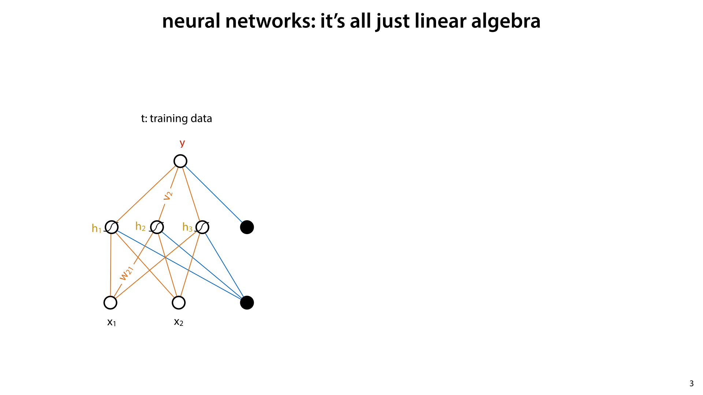

            <figcaption>
            
In addition to the graph perspective, there’s another perspective that can greatly simplify things. Most of the operations used in neural networks can also be written as matrix multiplications.  

Consider what happens in the first layer before the non-linearity, ignoring the bias nodes. If we see the input nodes and the hidden nodes as two vectors (of 2 and 3 elements respectively), then each element in the hidden vector is computed by multiplying all elements of the input vector by a unique weight, and summing them together. This is exactly the operation of a matrix multiplication. 

Adding the bias can be cast as a simple vector addition, and applying the nonlinearity is simply and element-wise non-linear operation on the vector. 

In this way, we can express the whole operation of a neural network in terms of simple linear algebra operations.

            </figcaption>
            click image for animation
       </section>

       <section id="slide-004">
            <a class="slide-link" href="https://mlvu.github.io/lecture07#slide-004" title="Link to this slide.">link here</a>
            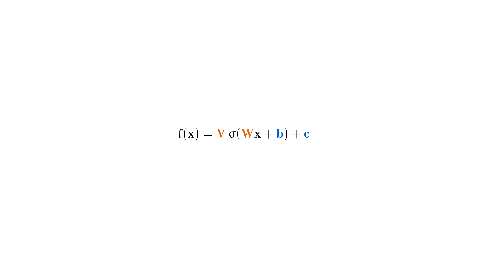

            <figcaption>
            
As you can see, this greatly simplifies our notation. It also allows for very efficient<em> implementation</em> of neural networks, since matrix multiplication can be implemented very efficiently (especially on a GPU).  

This is what we will discuss today: how to simplify the basic idea of neural networks into a very powerful and flexible framework for creating highly complex machine learning models.

            </figcaption>
       </section>

       <section id="slide-005" class="anim">
            <a class="slide-link" href="https://mlvu.github.io/lecture07#slide-005" title="Link to this slide.">link here</a>
            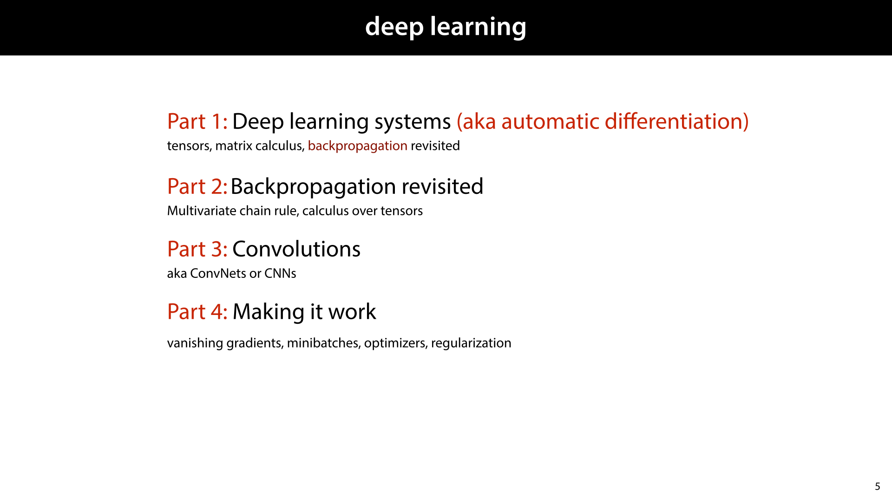

            <figcaption>
            
In this video, we’ll look at the general layout of deep learning frameworks. Specifcally, how these systems allow us to define complex models in such a way that they can be efficiently computed and that we don’t have to implement backpropagation ourselves. A large part of this, is expressing everything we do in the language of <em>tensors</em>. 

In the second video, we’ll look specifically at how we can implement backpropagation in such tensor settings. We’ve seen a scalar version of the algorithm already, where we work out the derivatives of the parameters one by one, but when we want to implement this efficiently, using tensor operations, we need to take a few more things into account. 

Deep learning works best when we don’t use fully connected layers, but when we tailor the architecture of our network to our task. In the third video, we’ll look at the first type of layer that allows us to do this: the convolution. This layer is particularly suited to image data. 

And finally, to do deep learning efficiently, we need to know a number of tricks and tools. We’ll run through the most important ones briefly in the last video. 

We don’t have time in this lecture to go into all the details. If you are doing your project on a deep learning topic, and you need to know more, you can have a look at the materials for <a href="http://dlvu.github.io"><strong>our Deep Learning course in the master</strong></a>. They discuss the same subjects, but in more detail, with more examples (in particular lectures 2, 3, and 4).

            </figcaption>
            click image for animation
       </section>

       <section id="slide-006">
            <a class="slide-link" href="https://mlvu.github.io/lecture07#slide-006" title="Link to this slide.">link here</a>
            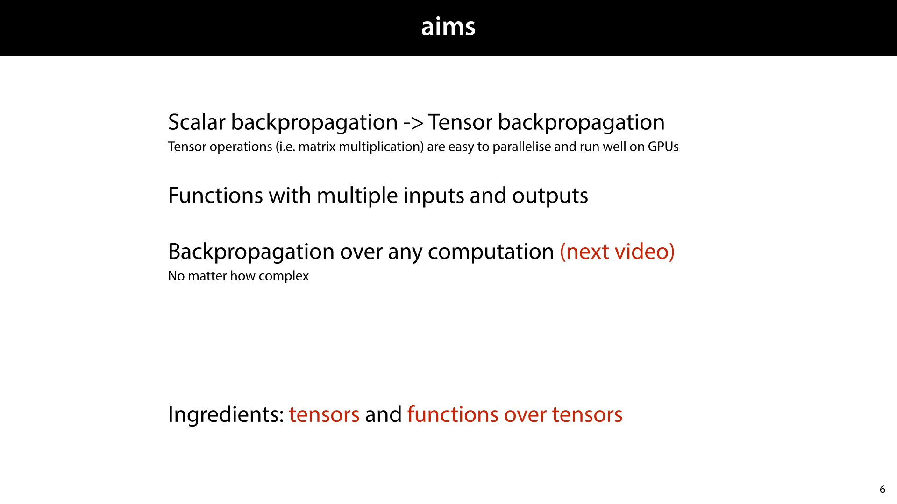

            <figcaption>
            
These are our aims for the first two videos. In order to scale up the basic principle of backpropagation on neural networks, we want to move from operations on scalars (that is on individual numbers) to the linear algebra view: everything is a vector, a matrix or a higher dimensional analog of that and all operations (including this in the backpropagation step) are operations on such objects. 

These vectors, matrices and higher dimensional analogs are called<strong> tensors</strong>. Let's start by looking at what tensors are, and how we can define functions on them.

            </figcaption>
       </section>

       <section id="slide-007" class="anim">
            <a class="slide-link" href="https://mlvu.github.io/lecture07#slide-007" title="Link to this slide.">link here</a>
            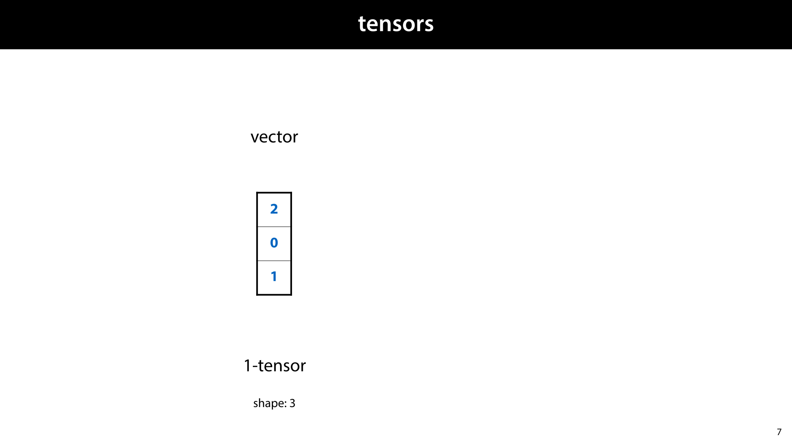

            <figcaption>
            
For our purposes, a <strong>tensor</strong> is nothing more than a straightforward generalisation of vectors and matrices to higher dimensionalities. A tensor is collection of numbers arranged in a grid. The<strong> rank </strong>of the tensor, is the number of dimensions along which the values change.  

A vector is a rank 1 tensor: a one-dimensional array. Its shape can be described by one integer: how many numbers there are arranged along one dimension. 

A matrix is a rank 2 tensor: a two dimensional array. Its shape is described by two integers: how many rows it has and how many columns. 

Following this logic, we can also think of a a single number (a scalar) as a rank 0 tensor. 

Extending this idea, we can create tensors of rank 3, 4 and higher. Above rank three, they’re not easy to visualize, but you can think of a rank 4 tensor as a collection of rank-3 tensors, arranged along an extra dimension (just like a matrix is a collection of vectors arranged along an extra dimension). 

If you’ve done the first worksheet, you’ll already know the tensor as the basic data structure of numpy. There it is more often called a <strong>multidimensional array</strong>. 

The idea of deep learning frameworks is that we can deal with any data, so long as it’s represented as one or more tensors. Let’s look at some examples of how data is represented in tensor form.

            </figcaption>
            click image for animation
       </section>

       <section id="slide-008">
            <a class="slide-link" href="https://mlvu.github.io/lecture07#slide-008" title="Link to this slide.">link here</a>
            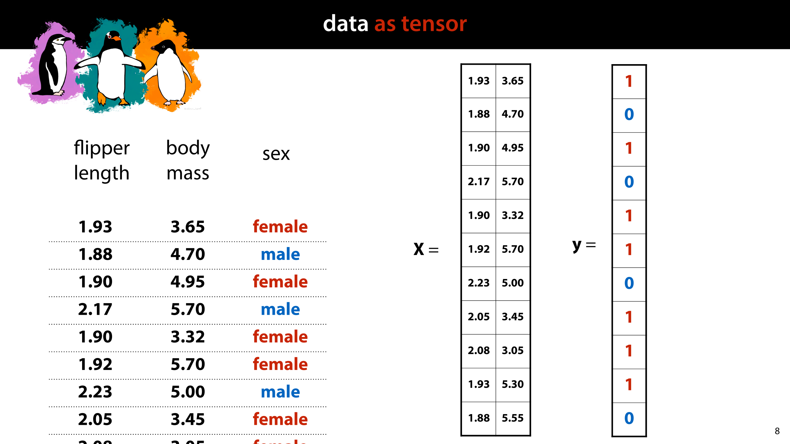

            <figcaption>
            
A simple dataset with numeric features can simply be represented as a matrix (with a corresponding vector for the labels). 

Tensors can only contain numbers, so any categoric features or labels should be converted to numeric features. This is normally by one-hot coding, as discussed in lecture 5. 

image source: <a href="https://allisonhorst.github.io/palmerpenguins/"><strong>https://allisonhorst.github.io/palmerpenguins/</strong></a> 

            </figcaption>
       </section>

       <section id="slide-009">
            <a class="slide-link" href="https://mlvu.github.io/lecture07#slide-009" title="Link to this slide.">link here</a>
            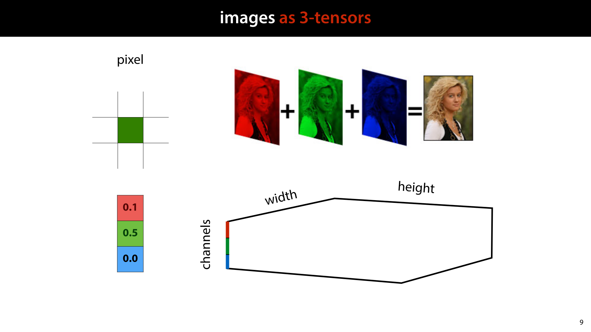

            <figcaption>
            
But the real benefit in deep learning is not just in representing our standard abstract tasks as features matrices. We want to find ways to represent the <strong>raw data</strong>, or at least something closer to the raw data, as tensors. 

One example is image data. A single image can be represented a a 3-tensor. In an RGB image, the color of a single pixel is represented using three values between 0 and 1 (how red it is, how green it is and how blue it is). This means that an RGB image can be thought of as a stack of three matrices, each representing one of the color channels as a grayscale image. This stack is a 3-tensor. 
<aside    > </aside><aside    >source: <a href="http://www.adsell.com/scanning101.html"><strong>http://www.adsell.com/scanning101.html</strong></a></aside><aside    ><a href="http://www.adsell.com/scanning101.html"><strong></strong></a></aside>
            </figcaption>
       </section>

       <section id="slide-010">
            <a class="slide-link" href="https://mlvu.github.io/lecture07#slide-010" title="Link to this slide.">link here</a>
            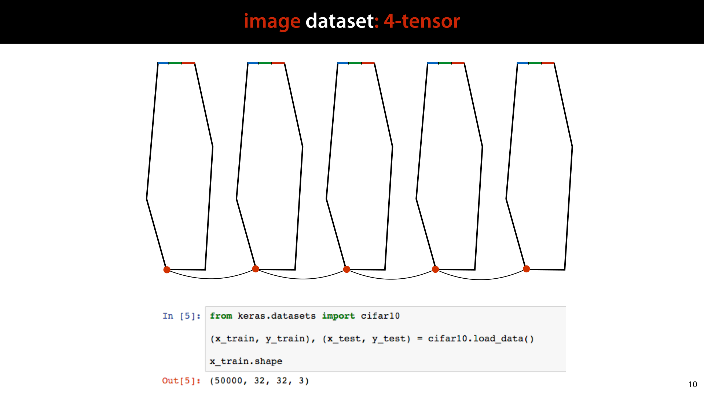

            <figcaption>
            
If we then have a <strong>dataset </strong>of multiple images, we get a 4-tensor. The three image dimensions we saw already, and one extra, indexing the different images in the dataset. 

This snippet of Keras code shows how this looks in python if we load the CIFAR 10 dataset. The training data contains 50 000 images, each 32 pixels high and 32 pixels wide and with 3 color channels.

            </figcaption>
       </section>

       <section id="slide-011" class="anim">
            <a class="slide-link" href="https://mlvu.github.io/lecture07#slide-011" title="Link to this slide.">link here</a>
            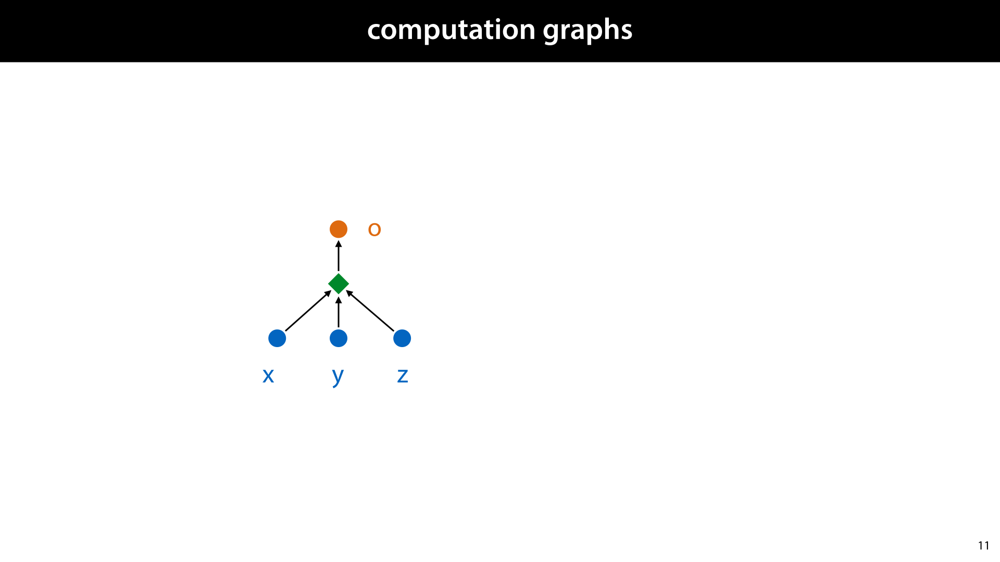

            <figcaption>
            
In the previous lecture, we introduced the concept of a <strong>computation graph</strong>. This is a graph that details the computation of our model and its loss. It consists of circular nodes that represent the inputs, intermediate nodes, and outputs of a computation, and of diamond nodes that represent the different computations we apply to these values.  

If a proper computation graph value nodes only connect to computation nodes and vice versa (they are bipartite graph). However, in the interest of clarity, we will sometimes omit the computation nodes and use the shorthand on the right. 

In the previous lecture, the computation graph was something we only drew on pen and paper to help us figure out what the correct backpropagation rules were for a given model. In this lecture, <strong>we are going to actually represent the computation graph in the computer</strong>, and let the computer figure out the backpropagation algorithm for us, based on the computations that we choose to do.

            </figcaption>
            click image for animation
       </section>

       <section id="slide-012">
            <a class="slide-link" href="https://mlvu.github.io/lecture07#slide-012" title="Link to this slide.">link here</a>
            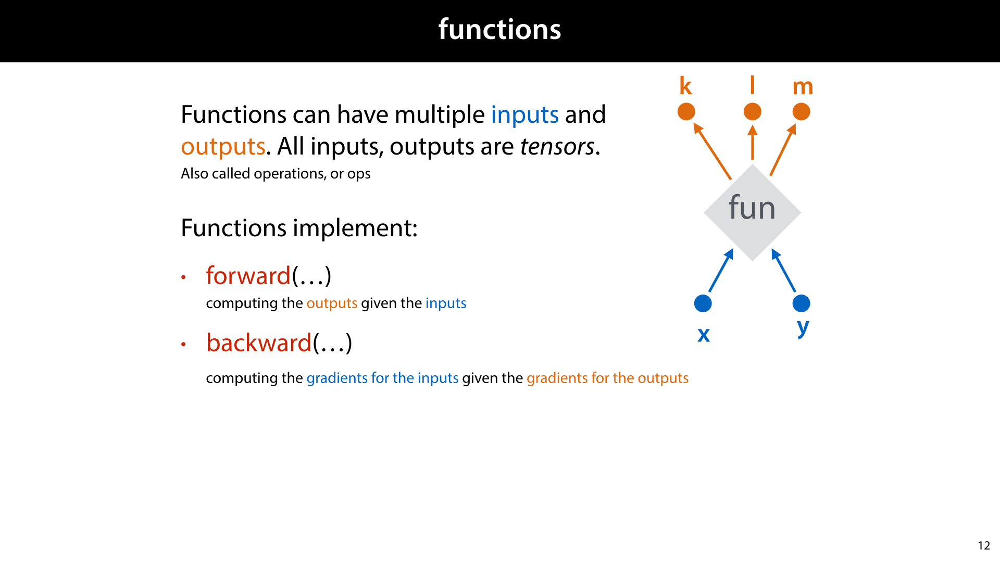

            <figcaption>
            
To build our computation graph, and to do it with tensors, we’ll need <strong>functions</strong> that consume tensors, and spit our new tensors. A function can have multiple inputs and multiple outputs, and all of them are tensors. Non-tensor inputs are sometimes allowed, but when we start computing gradients, we’ll only get gradients over the tensor inputs. 

Functions exist in many programming environments. All we usually have to do to specify a function is to define how to compute the output given the inputs. In deep learning parlance this is called the <strong>forward</strong> of the function. For a deep learning function, we need to specify one additional thing: a <strong>backward</strong> function. The backward receives the gradients for the outputs and computes the gradients for the inputs. We’ll see some examples of this in the second video. 

Putting  these two ingredients, tensors and functions, together,  we can build a model. We define some functions and we then chain them together into a <strong>computation graph</strong>.

            </figcaption>
       </section>

       <section id="slide-013" class="anim">
            <a class="slide-link" href="https://mlvu.github.io/lecture07#slide-013" title="Link to this slide.">link here</a>
            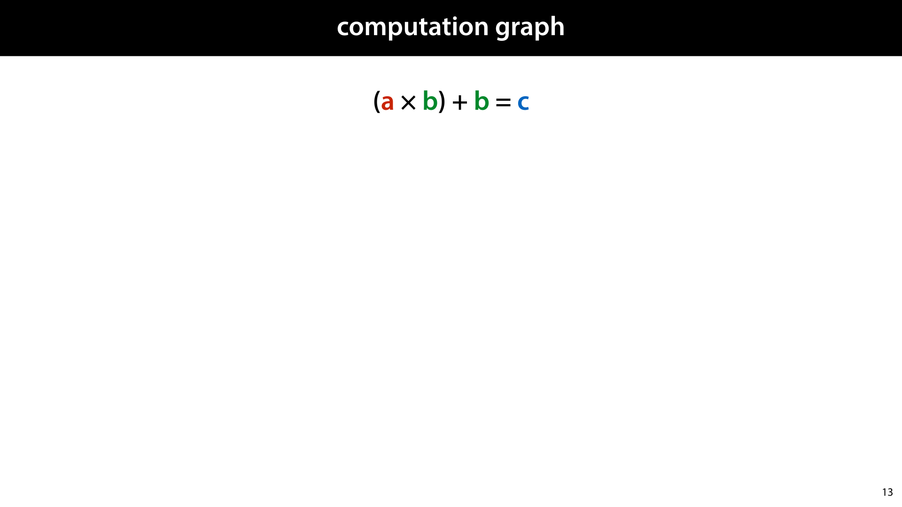

            <figcaption>
            
Here is a simple example of a <strong>computation graph</strong>, a directed acyclic graph that shows the data (scalars a, b, c, x) flowing through the functions. 

A deep learning system uses a computation graph to execute a given computation (<strong>the forward pass</strong>) and then uses the backpropagation algorithm to compute the gradients for the data nodes with respect to the output (<strong>the backward pass</strong>). 

If we are not interested in the specifics of the function being applied, we will omit the circle (as we did in the previous lecture).

            </figcaption>
            click image for animation
       </section>

       <section id="slide-014">
            <a class="slide-link" href="https://mlvu.github.io/lecture07#slide-014" title="Link to this slide.">link here</a>
            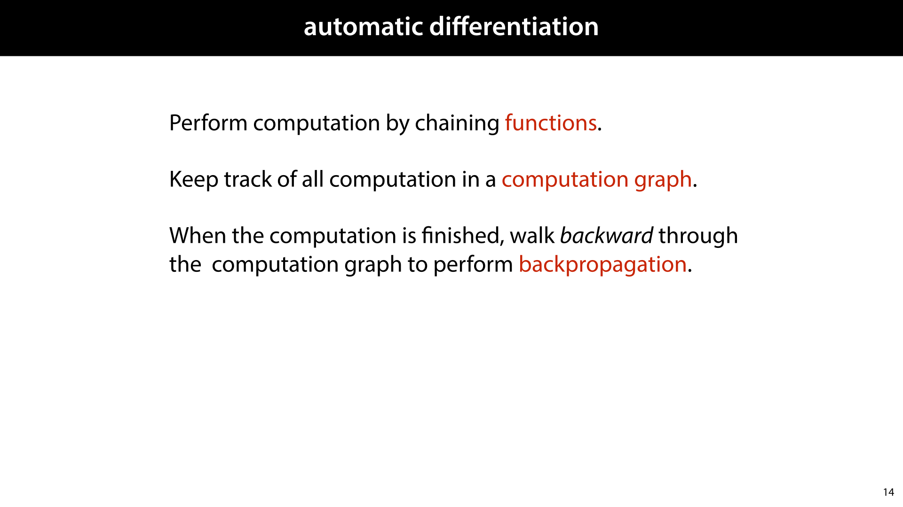

            <figcaption>
            
This is called <strong>automatic differentiation</strong>: we define our model by chaining together predefined functions that come with a forward and a backward, and then we use the backpropagation algorithm to compute gradients for the parameters of the model.

            </figcaption>
       </section>

       <section id="slide-015">
            <a class="slide-link" href="https://mlvu.github.io/lecture07#slide-015" title="Link to this slide.">link here</a>
            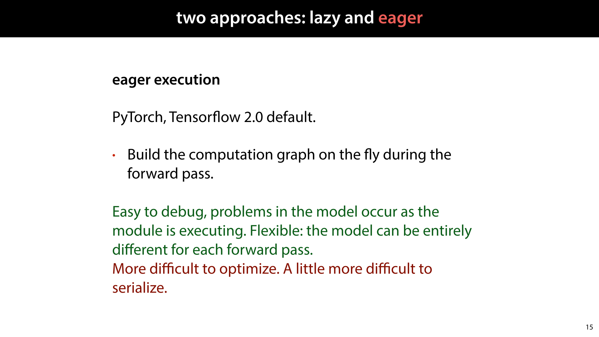

            <figcaption>
            
There are two ways of doing this. The first is to use<strong> lazy execution</strong>: you define your computation graph, but you don’t place any data in it (only nodes that will hold the data later). Then you compile the computation graph and start feeding data through it. 

The drawback of this sort of model is that when something goes wrong during the forward pass, it’s very difficult to trace the program error (which happens after you compiled the computation graph) back to where you actually made the mistake (somewhere during definition of the computation graph).

            </figcaption>
       </section>

       <section id="slide-016">
            <a class="slide-link" href="https://mlvu.github.io/lecture07#slide-016" title="Link to this slide.">link here</a>
            

            <figcaption>
            
<strong>Eager execution</strong> does not require this kind to predefining of the computation graph. You simply use programming statements to compute the forward pass, for instance multiplying two matrices. The deep learning system then ensures that your matrices are special objects, that keep track of the whole computation, so that when it comes time to do the backpropagation pass, we know how to go back through the computation we performed. 

Since eager execution seems to be fast becoming the default approach, we will focus on that, and describe in detail how an eager execution deep learning system works.

            </figcaption>
       </section>

       <section id="slide-017" class="anim">
            <a class="slide-link" href="https://mlvu.github.io/lecture07#slide-017" title="Link to this slide.">link here</a>
            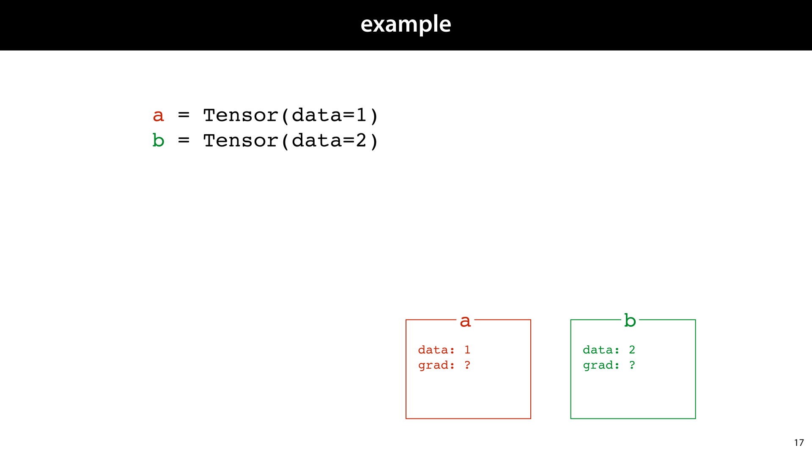

            <figcaption>
            
In eager mode deep learning systems, we create a node in our computation graph (called a Tensor here) by specifying what data it should contain. The result is a tensor object that stores <em>both </em>the data, and the gradient over that data (which will be filled later). 

Here we create the variables a and b. If we now apply a function to these, for instance to multiply their values, we can immediately compute the result: 1 * 2 = 2. We take this result and put it in another Tensor object called c. We also store references to the variables that were used to create c, and the module that created it: we perform a computation, but we also keep a history of which computation we performed in the form of a graph. 
<aside    >Note that when we want to illustrate what a value node contains, we represent it as a rectangle, rather than a circle. </aside>
Using this graph, we can perform the backpropagation from a given starting node. Here, we compute the partial derivatives of c with respect to every node in the graph (including c itself). 
<aside    >These names and this syntax are loosely inspired by those of PyTorch, but the concepts are similar for all deep learning frameworks.</aside><aside    ></aside>
            </figcaption>
            click image for animation
       </section>

       <section id="slide-018" class="anim">
            <a class="slide-link" href="https://mlvu.github.io/lecture07#slide-018" title="Link to this slide.">link here</a>
            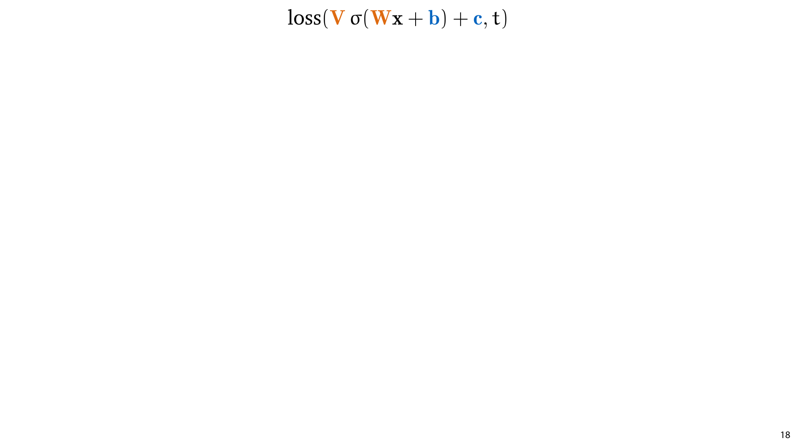

            <figcaption>
            
Here’s what a training loop would look like for a simple two-layer feedforward network. The computation graph shown below is rebuilt from scratch for every iteration of the training loop, and cleared at the end. The variables W, V, b and c,  that define our neural network contain tensor data that is saved between iterations, and updated at every step of gradient descent. Each value node contains a <em>tensor</em> (specifically, a matrix or a vector). 

Note that the output of every module is also a Tensor, with its own data and its own gradient. Note that the multiplications are now matrix multiplications 

Once we have our computation graph in place, we have everything we need to start the backpropagation algorithm. To translate what we learned in the last video to this setting we’ll need some extra insights. We’ll go over those in the next video.

            </figcaption>
            click image for animation
       </section>

       <section id="slide-019" class="anim">
            <a class="slide-link" href="https://mlvu.github.io/lecture07#slide-019" title="Link to this slide.">link here</a>
            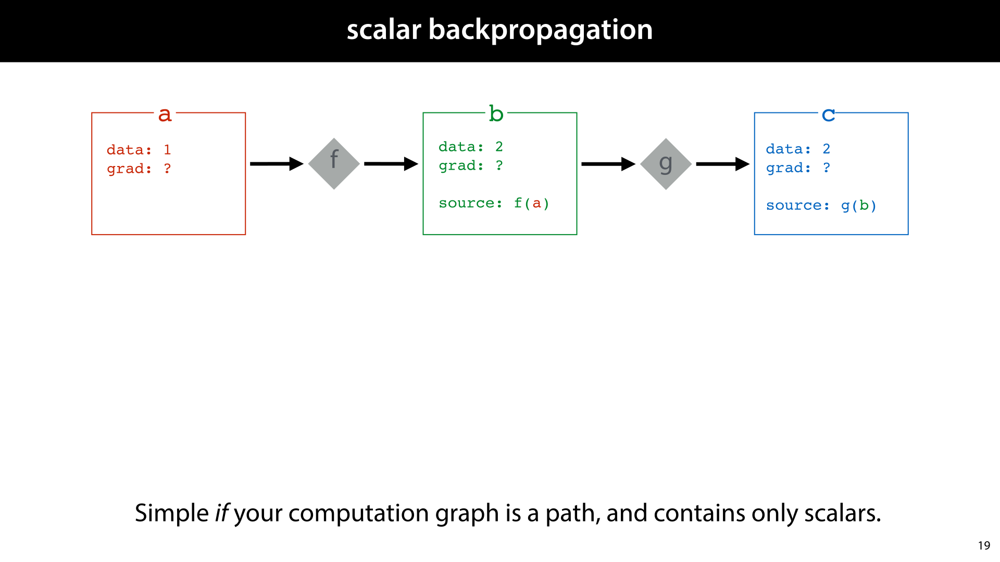

            <figcaption>
            
With a computation graph like this,<em> if all the data are scalars</em>, it’s very easy to implement backpropagation. Say we’re interested in the derivative of c over a. The chain rule tells us this is the derivative of b over a times that of c over b. c over b is the local derivative for function g, and b over a is the local derivative for function f.  

Starting at the output we can walk backward, and multiply all the local derivatives we encounter. At each step, we multiply the derivative of the output over the input.  

This is what we did manually in the last lecture: we walked backward down the computation graph, and at each computation, for each input, we multiply the derivative of the loss wrt the output by the derivative of the output wrt the input. 

Next video, we’ll see what we need to do when the computation graph has a more complicated structure, and when the data nodes can contain tensors instead of scalars.

            </figcaption>
            click image for animation
       </section>

        <section class="video" id="video-019">
            <a class="slide-link" href="https://mlvu.github.io/lecture07#video-19">link here</a>
           <video controls>
                <source src="https://pbm.thegood.cloud/s/DNCAReyxc2oSC42/download/MLVU%207.2%20Tensor%20backpropagation.mp4" type="video/mp4" />

                Download the <a href="https://pbm.thegood.cloud/s/DNCAReyxc2oSC42/download/MLVU%207.2%20Tensor%20backpropagation.mp4">video</a>.
           </video>
        </section>

       <section id="slide-020">
            <a class="slide-link" href="https://mlvu.github.io/lecture07#slide-020" title="Link to this slide.">link here</a>
            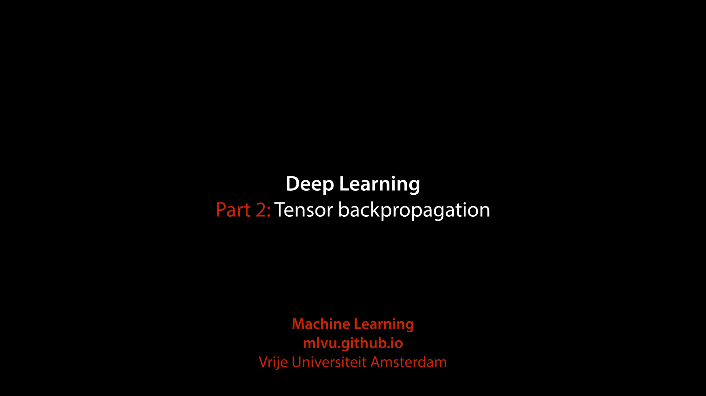

            <figcaption>
            
  

            </figcaption>
       </section>

       <section id="slide-021">
            <a class="slide-link" href="https://mlvu.github.io/lecture07#slide-021" title="Link to this slide.">link here</a>
            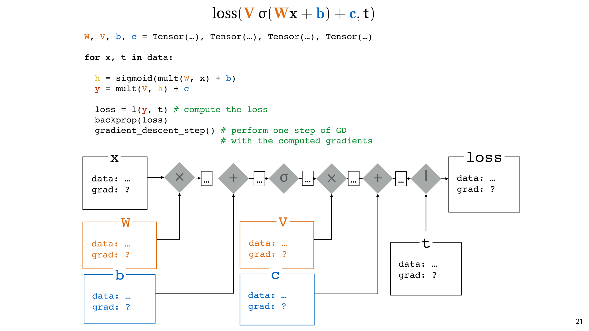

            <figcaption>
            
In the previous video we explained how deep learning systems like Pytorch and Tensorflow allow us to build up a computation graph in code. Once we have this computation graph, we can use it to implement backpropagation.

            </figcaption>
       </section>

       <section id="slide-022">
            <a class="slide-link" href="https://mlvu.github.io/lecture07#slide-022" title="Link to this slide.">link here</a>
            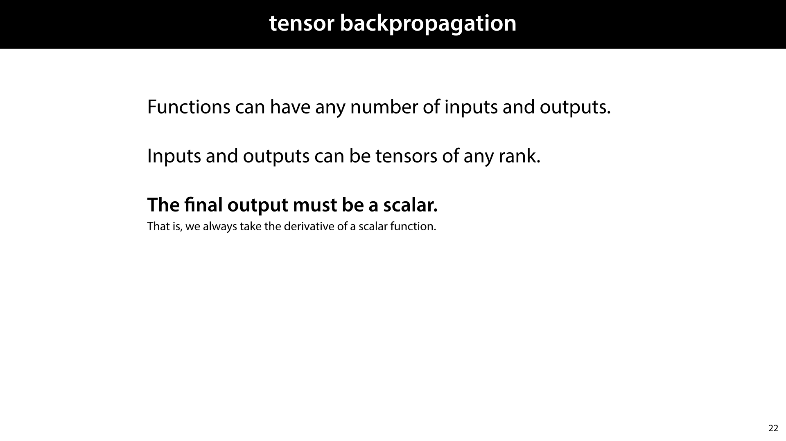

            <figcaption>
            
To do so, we will assume these three basic rules.  

The last one is essential: the function for which we compute the derivative (with respect to all values in the comp graph) <strong>must</strong> be a scalar. In our case, this will usually be the loss of the model we're training. 

As we shall, see, this property will allow us to work backwards down the graph, computing the gradients.

            </figcaption>
       </section>

       <section id="slide-023" class="anim">
            <a class="slide-link" href="https://mlvu.github.io/lecture07#slide-023" title="Link to this slide.">link here</a>
            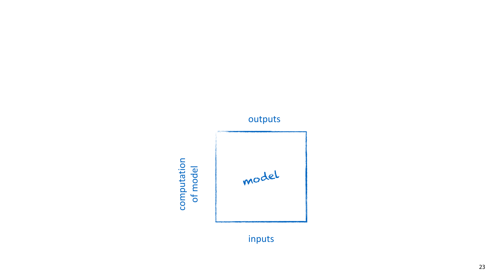

            <figcaption>
            
Note that this doesn’t mean we can only ever train neural networks with a single scalar output. That would be quite boring. Even the multiclass classification model from the previous lecture had three outputs already, and later we want to start building neural networks that generate faces and play chess. All of that is possible: our model can have any number of outputs of any shape and size.  

However, the loss we define over those outputs needs to map them all to a single scalar value. 

 The computation graph is always the model, plus the computation of the loss. This way, no matter how complex our model becomes, the computation we’re using for backpropagation<strong> always has a single scalar output</strong>. 

            </figcaption>
            click image for animation
       </section>

       <section id="slide-024">
            <a class="slide-link" href="https://mlvu.github.io/lecture07#slide-024" title="Link to this slide.">link here</a>
            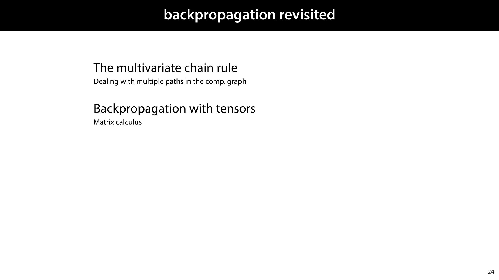

            <figcaption>
            
In order to make backpropagation flexible and robust enough to work in this setting, we need to discuss two features that we haven’t mentioned yet:  

how to perform backpropagation if the result depends on the a variable along different computation paths,  

and how to take derivatives when the variables aren’t scalars. 

We'll start with the first point. To deal with this we need to beef up the chain rule a little bit.

            </figcaption>
       </section>

       <section id="slide-025" class="anim">
            <a class="slide-link" href="https://mlvu.github.io/lecture07#slide-025" title="Link to this slide.">link here</a>
            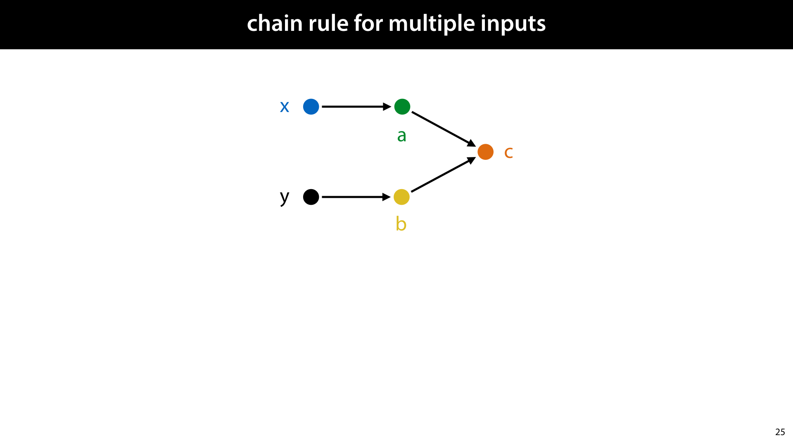

            <figcaption>
            
So far, we’ve only looked at applying the chain rule to computation graphs that look like paths: a single sequence of functions with the output of the last being the input to the next. 

If a function has <em>multiple</em> inputs, there isn’t usually a problem applying the chain rule. If we want the derivative with respect to x, we apply the chain rule over the path from x to c. for this derivative, b is a constant, so we can ignore that path in the computation graph. 

If we want the derivative with respect to y, we apply the chain rule along the other path, taking a as a constant. So far so good. 

            </figcaption>
            click image for animation
       </section>

       <section id="slide-026" class="anim">
            <a class="slide-link" href="https://mlvu.github.io/lecture07#slide-026" title="Link to this slide.">link here</a>
            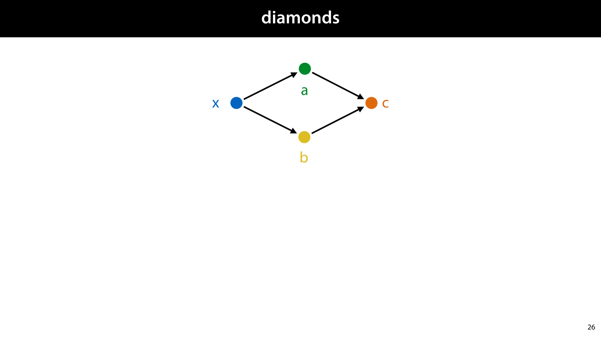

            <figcaption>
            
But what if c has two inputs,<strong> both </strong>depending on x? 

How do we apply the chain rule here?  Over a or over b?

            </figcaption>
            click image for animation
       </section>

       <section id="slide-027">
            <a class="slide-link" href="https://mlvu.github.io/lecture07#slide-027" title="Link to this slide.">link here</a>
            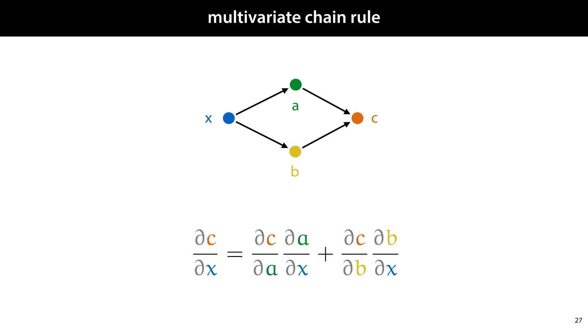

            <figcaption>
            
For such cases, we need the <strong>multivariate chain rule</strong>.  

It’s very simple: to work out the derivative of a function with multiple inputs we just take a single derivative for each input, treating the others as constants, and sum them.

            </figcaption>
       </section>

       <section id="slide-028" class="anim">
            <a class="slide-link" href="https://mlvu.github.io/lecture07#slide-028" title="Link to this slide.">link here</a>
            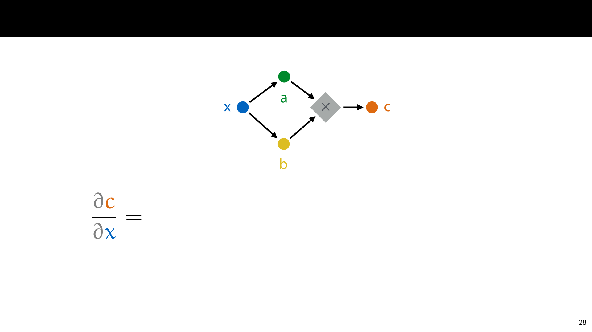

            <figcaption>
            
The multivariate chain rule can be used to derive many rules for derivatives you should already know. For instance, if we make c the product of a and b, applying the multivariate chain rule gives us the product rule.

            </figcaption>
            click image for animation
       </section>

       <section id="slide-029" class="anim">
            <a class="slide-link" href="https://mlvu.github.io/lecture07#slide-029" title="Link to this slide.">link here</a>
            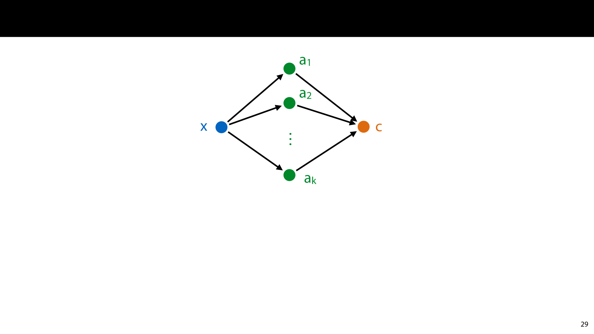

            <figcaption>
            
If c has more than two inputs, the multivariate chain tells us to sum over all of them. 
<aside    >We won't try to give you any intuition for why the multivariate chain rule works this way. You'll just have to accept it as one of the rules of differentiation. If you want more insight, there is some explanation in the second <a href="http://dlvu.github.io"><strong>DLVU</strong></a> lecture.</aside><aside    ></aside>
            </figcaption>
            click image for animation
       </section>

       <section id="slide-030">
            <a class="slide-link" href="https://mlvu.github.io/lecture07#slide-030" title="Link to this slide.">link here</a>
            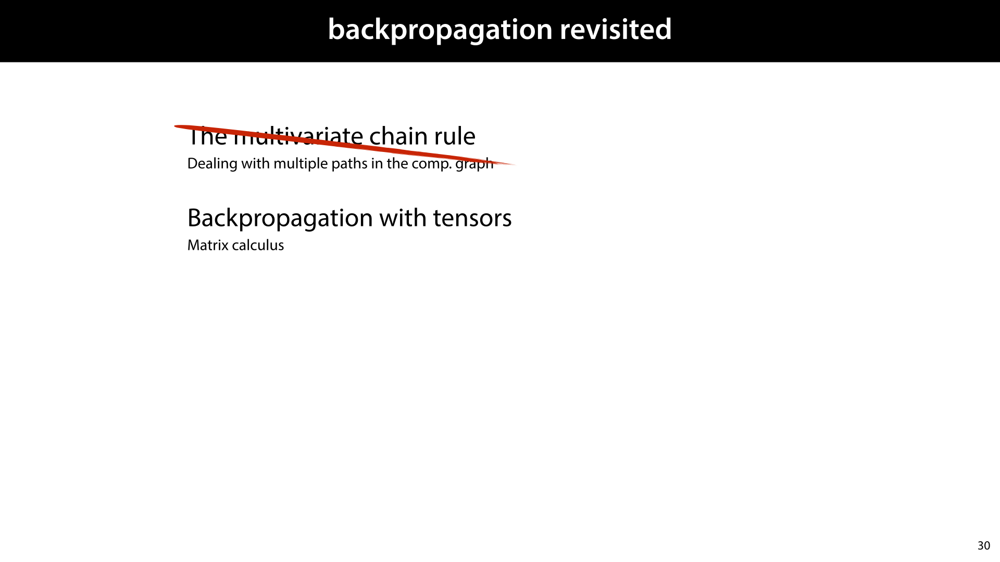

            <figcaption>
            
With that, we know how to apply the chain rule to any kind of computation graph. 

Next, we need to figure out how to make backpropagation work in settings where our inputs and outputs are <em>tensors</em>.

            </figcaption>
       </section>

       <section id="slide-031">
            <a class="slide-link" href="https://mlvu.github.io/lecture07#slide-031" title="Link to this slide.">link here</a>
            

            <figcaption>
            
Next, we need to figure out how to express backpropagation in terms of tensors. Expressing the forward pass as matrix multiplications may help to make things more efficient, but that doesn't buy us much if the backward pass still consists of a load of loops over individual scalars. The backward pass should also be expressed in a series of matrix mulitplications.

            </figcaption>
       </section>

       <section id="slide-032" class="anim">
            <a class="slide-link" href="https://mlvu.github.io/lecture07#slide-032" title="Link to this slide.">link here</a>
            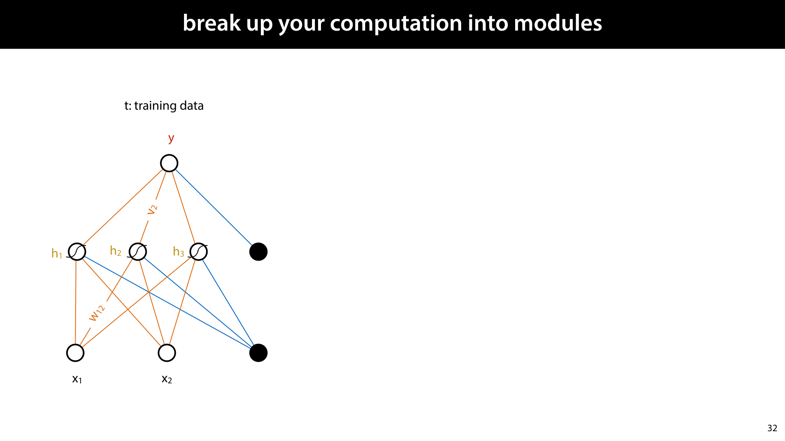

            <figcaption>
            
We'll try to apply the basic logic of backpropagation to a computation graph with nodes containing tensors, and we'll see where we get stuck. 

The first step of applying backpropagation in any setting is to break your computation into modules. For our feedforward neural network, this is a natural way to draw the computation graph. Note that both the model parameters and the inputs are tensor nodes in the computation graph. 

            </figcaption>
            click image for animation
       </section>

       <section id="slide-033" class="anim">
            <a class="slide-link" href="https://mlvu.github.io/lecture07#slide-033" title="Link to this slide.">link here</a>
            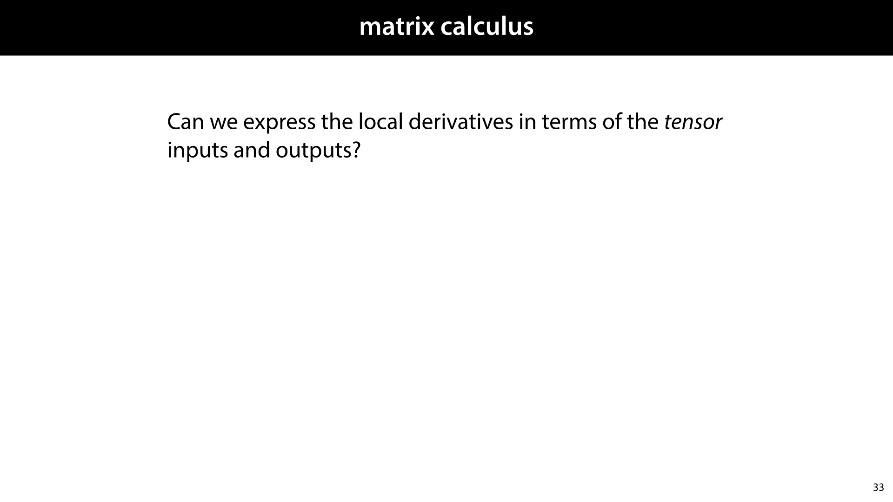

            <figcaption>
            
The next step is to work out the local derivatives. We would like to have a chain rule like the one shown on the right, and then to work out how to compute those local derivatives efficiently. 

What does it mean to take the derivative <em>of a vector</em>, or <em>with respect to a matrix</em>?

            </figcaption>
            click image for animation
       </section>

       <section id="slide-034" class="anim">
            <a class="slide-link" href="https://mlvu.github.io/lecture07#slide-034" title="Link to this slide.">link here</a>
            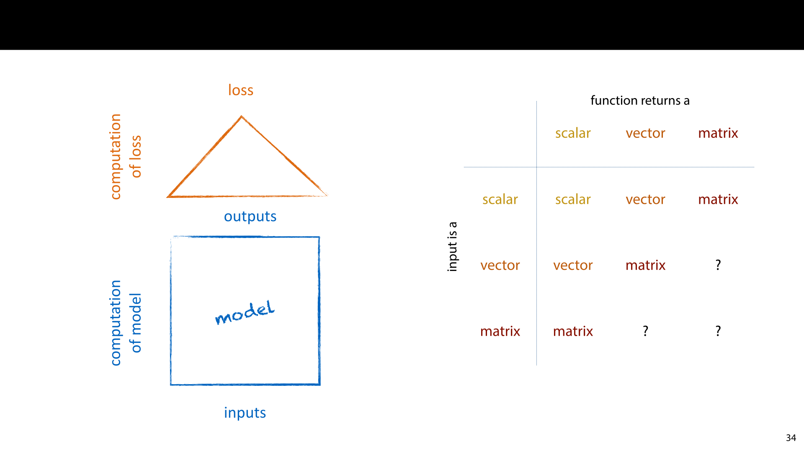

            <figcaption>
            
There are ways to define the derivative of a function with respect to a matrix or a vector. In general, if we have a function with a tensor input and a tensor output, we can take a large number of scalar derivatives by taking the derivative of one of its outputs with respect to one of its inputs. The gradient is an example of this: we have a function from a vector to a scalar, so we take all scalar derivatives of the output with respect to one of the inputs, and collect them into a vector.  

If we have a function from a vector to a scalar, we can collect all derivatives of one output with repsect to the single input. This can also be neatly represented in a vector. 

If we have a vector-to-vector function, we can take all scalar derivatives of one of the m outputs with respect to one of the n inputs. This is best represented by a n-by-m <em>matrix</em>. 

If we go higher, like a matrix-to-vector function, we get so many derivatives that we need a 3-tensor to represent them. And this is where we run into trouble.  

For matrices and vectors, multiplication is still defined, and works similarly to scalar multiplication. That means that so long as our derivatives are only matrices and vectors, we can still hope for a functional chain rule, where we can work out the local derivatives compute them and multiply them together. But this already breaks down in the case of the feedforward network. If we imagine what a chain of local derivatives for our computation graph might look like, we’d get something like this expression at the bottom. even for something so simple as a feedforward network, one of the factors is already the derivative of a vector over a matrix. This means the result should be represented in a 3-tensor, for which multiplication isn’t defined (or at least not unambiguously), so that we can never multiply all the local derivatives to give us the global derivatives. 

            </figcaption>
            click image for animation
       </section>

       <section id="slide-035" class="anim">
            <a class="slide-link" href="https://mlvu.github.io/lecture07#slide-035" title="Link to this slide.">link here</a>
            

            <figcaption>
            
Our saving grace is the fact that we assume our function<em> as a whole</em> always has a <strong>scalar output</strong>. This means that whatever we are doing, the only derivatives we ever want to end up with in the end are those of the loss (a scalar) with respect to some tensor in our computation graph. This means that we can stay in the leftmost column of this matrix.

            </figcaption>
            click image for animation
       </section>

       <section id="slide-036" class="anim">
            <a class="slide-link" href="https://mlvu.github.io/lecture07#slide-036" title="Link to this slide.">link here</a>
            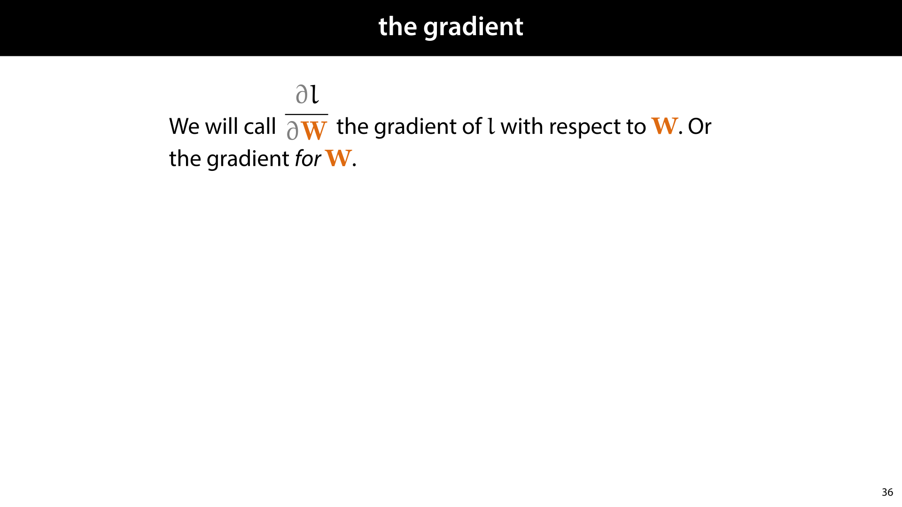

            <figcaption>
            
The only derivatives we will ever be interested in, ultimately, are the derivatives of the loss with respect to one of the inputs of the computation graph (the inputs to the network, or the parameters of the network). For these, we can always represent the the collection of all derivatives, by giving it the same shape as the tensor we’re taking the derivative over. 

In the example shown, <strong>W</strong> is a 3-tensor. The gradient of l wrt <strong>W</strong> has the same shape as W, and at element (i, j, k) it holds the scalar derivative of l wrt <strong>W</strong>ijk. 

With these rules, we can use tensors of any shape and dimension and always have a well defined gradient. <strong>The gradient of any tensor T always has the same shape as T.</strong> 
<aside    >Note that in other fields, the gradient often has a different shape from the thing we’re taking the gradient for. If the function takes column vectors, the gradient is often defined as a row vector. That’s because the gradient is used as an operator, defining a function on the original vector space. In our case, we are not interested in using the gradient in this way: it only ever defines a direction in our model space, which will help us search, so for us it makes more sense to have the gradient be the same shape and size as the points in the model space.</aside><aside    ></aside>
            </figcaption>
            click image for animation
       </section>

       <section id="slide-037" class="anim">
            <a class="slide-link" href="https://mlvu.github.io/lecture07#slide-037" title="Link to this slide.">link here</a>
            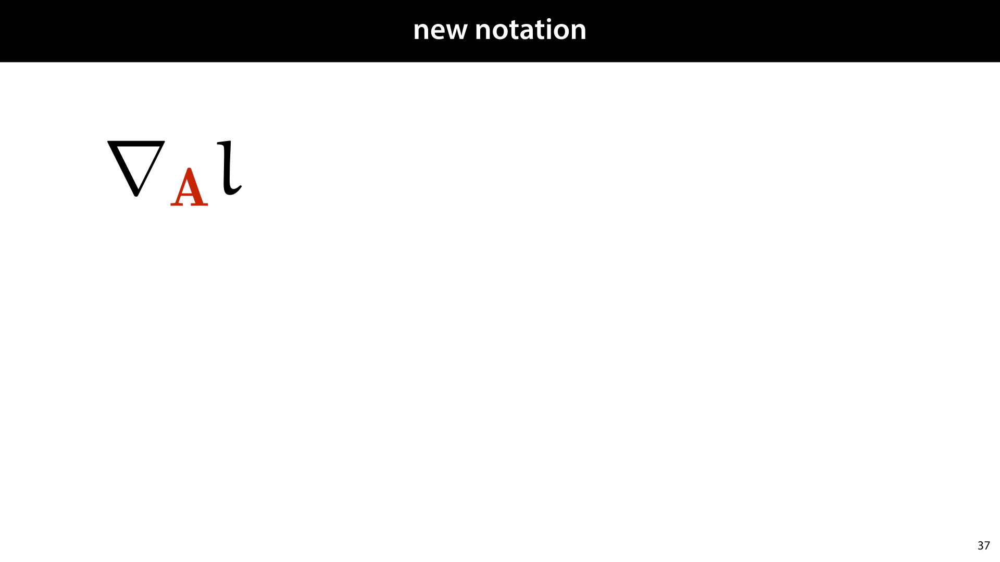

            <figcaption>
            
To simplify this picture we will introduce some new notation. This is specific to this course (and the DLVU course), so don't expect to see it anywhere else, but it should hopefully simplify things a little bit. 

We know that we are always computing the gradient with respect to the loss, so we remove that from the notation. The thing we're most interested in is the tensor that we're computing the gradient <em>for</em>. In this case <strong>A</strong>. We'll put that front and center (instead of in a asubscript) and put the nabla in the superscript (a bit like a transposition or inverse operator). The idea is that for any tensor <strong>A</strong>, the notation <strong>A</strong>∇ refers to a tensor of the same shape as <strong>A</strong>, such that each element contains the partial derivative of the loss with respect to the corresponding element in <strong>A</strong>. 

            </figcaption>
            click image for animation
       </section>

       <section id="slide-038">
            <a class="slide-link" href="https://mlvu.github.io/lecture07#slide-038" title="Link to this slide.">link here</a>
            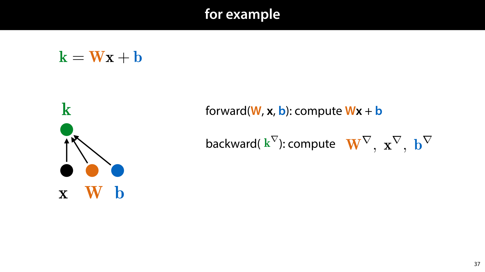

            <figcaption>
            
With these principles in place, we can apply backpropagation in a tensor-friendly way. Instead of computing the local derivatives first, and then multiplying to compute the global derivatives, we accumulate the product of the local derivatives directly. 

This is the first layer of our feedforward network. It has three inputs <strong>W</strong>, <strong>x</strong>, and <strong>b</strong>, and one output <strong>k</strong>. As we saw earlier, the local derivative, consists of a 3-tensor of scalar derivatives, so it's not practical to compute. Instead we compute the gradients of the inputs directly from the gradients of the outputs. 

The <strong>forward function</strong> computes the unactivated values of the first layer, given the inputs <strong>x</strong>, weights <strong>W </strong>and bias <strong>b</strong>. 

The <strong>backward function</strong> is given the derivative of the loss for <strong>k</strong>, and should output the derivatives of the loss for  <strong>W</strong>, <strong>x</strong>, and <strong>b</strong>.

            </figcaption>
       </section>

       <section id="slide-039" class="anim">
            <a class="slide-link" href="https://mlvu.github.io/lecture07#slide-039" title="Link to this slide.">link here</a>
            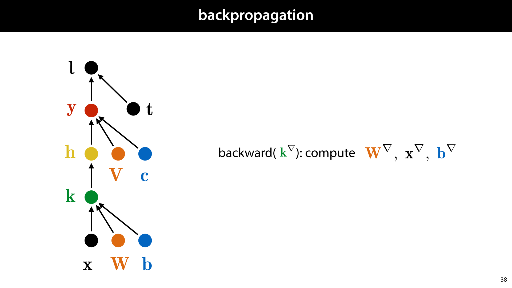

            <figcaption>
            
Once we have the computation graph, and we know all the backwards for all the functions functions, the rest of backpropagation is a breeze.  

We compute a forward pass, remembering the intermediates and then we walk backwards down the graph. At each module we call its backward() function with the gradients for its outputs and receive the gradients for its inputs. So long as we do this in the right order, we can be sure that we will compute all gradients for all nodes in the graph. 

Note that we are using the same property we used in the previous lecture. So  

The only thing we need to do now is work out how to compute these backward functions, and how to make this computation efficient.

            </figcaption>
            click image for animation
       </section>

       <section id="slide-040">
            <a class="slide-link" href="https://mlvu.github.io/lecture07#slide-040" title="Link to this slide.">link here</a>
            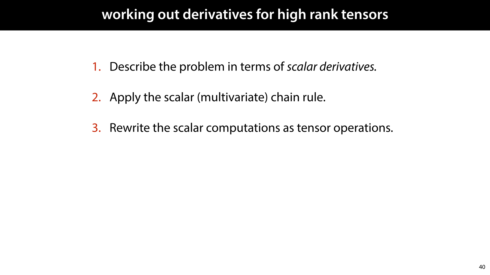

            <figcaption>
            
Here is a standard plan for working out what a backward function should be (based on the forward function).

            </figcaption>
       </section>

       <section id="slide-041" class="anim">
            <a class="slide-link" href="https://mlvu.github.io/lecture07#slide-041" title="Link to this slide.">link here</a>
            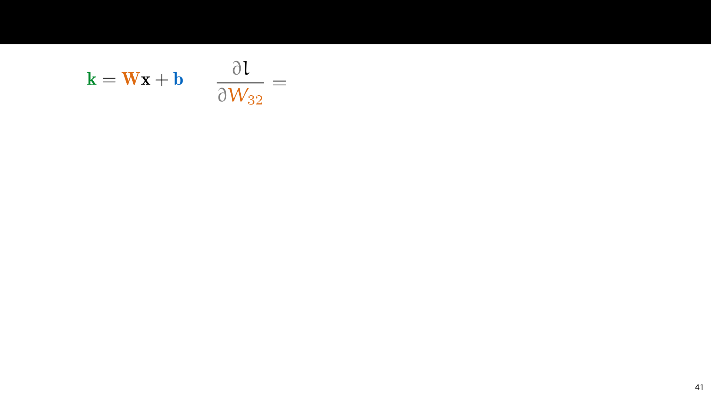

            <figcaption>
            
To work out a scalar derivative we pick an arbitrary element of <strong>W</strong>, say W32, and work out the derivative for that. Note that since we are using matrix notation W32 is the weight from input 2 to output 3. In the previous videos the subscripts were the other way around. 

If we think of this as a computation graph with scalar nodes, <strong>k</strong> just represents different inputs to the function that ultimately computes l. That means that the derivative of l over W32 is just the sum of the derivatives through each element of k. This works whatever the rank and shape of<strong> k</strong>; it could be a huge 9-tensor, and all we have to do is flatten it, and sum over its derivatives. Note that these are the derivatives that we are given. 

At the end, we see that the scalar derivative we’re interested in is the second element of the vector that we are given, times the third element of the input x.

            </figcaption>
            click image for animation
       </section>

       <section id="slide-042" class="anim">
            <a class="slide-link" href="https://mlvu.github.io/lecture07#slide-042" title="Link to this slide.">link here</a>
            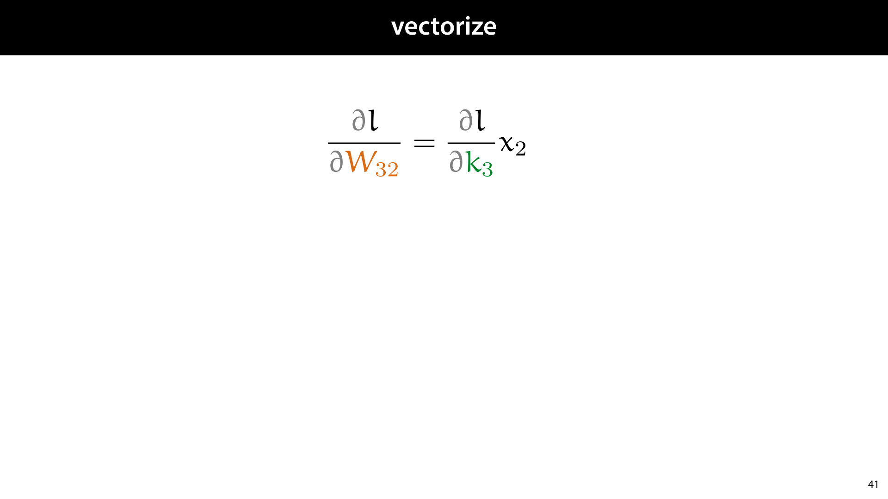

            <figcaption>
            
We don’t actually want to compute the scalar derivatives one by one like this, but at least now we know what is expected of us. We can write down what all the elements of the matrix <strong>W</strong>∇ look like, and see if we can find some clever way to figure out how to compute this matrix using simple linear algebra operations, instead of filling the elements of the matrix one by one. This is called <strong>vectorizing</strong>: expressing an algorithm in single matrix operations rather than a series of loops.  

In this case, we can note that the matrix <strong>W</strong>∇ is simply the outer product of the vector <strong>k</strong>∇ which we were given and the input vector <strong>x</strong>. Multiplying these two will give us all the derivatives we’re interested in, in a single operation. 

            </figcaption>
            click image for animation
       </section>

       <section id="slide-043" class="anim">
            <a class="slide-link" href="https://mlvu.github.io/lecture07#slide-043" title="Link to this slide.">link here</a>
            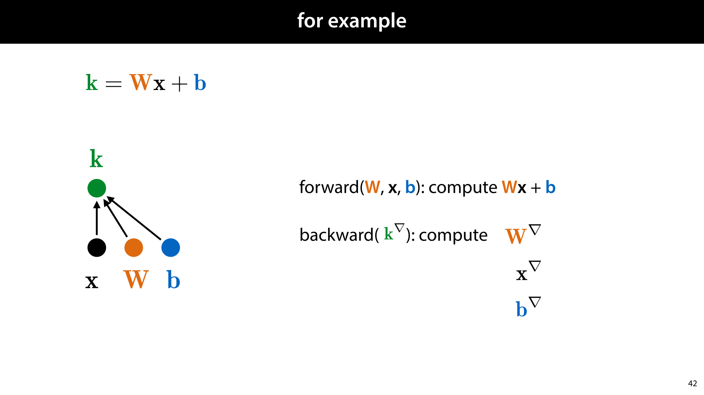

            <figcaption>
            
The gradients for <strong>x</strong> and <strong>b</strong> can be worked out in the same way.

            </figcaption>
            click image for animation
       </section>

       <section id="slide-044" class="anim">
            <a class="slide-link" href="https://mlvu.github.io/lecture07#slide-044" title="Link to this slide.">link here</a>
            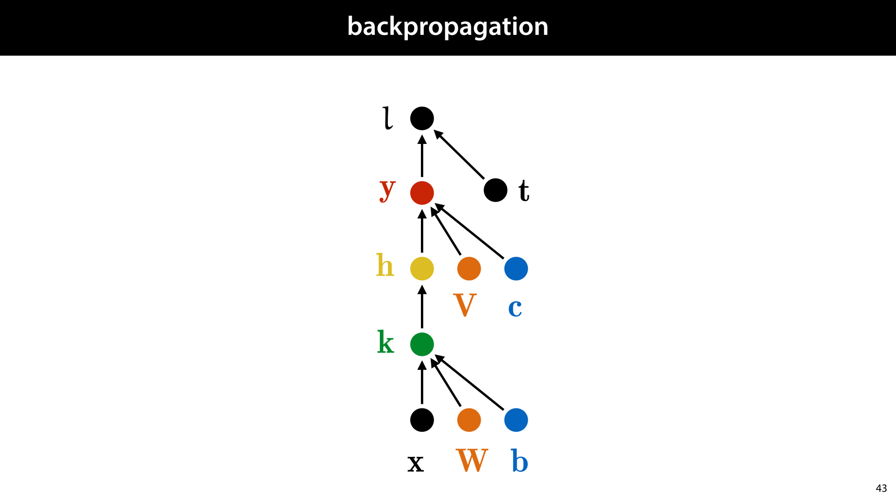

            <figcaption>
            
As we said before, once we know all the backwards' we can just walk down the computation graph from the loss to the inputs. So long as we do this in the right order, we always have the gradient that the backward needs already, and we can call the backward to give us the gradients for the nodes below.

            </figcaption>
            click image for animation
       </section>

       <section id="slide-045">
            <a class="slide-link" href="https://mlvu.github.io/lecture07#slide-045" title="Link to this slide.">link here</a>
            

            <figcaption>
            

            </figcaption>
       </section>

       <section id="slide-046">
            <a class="slide-link" href="https://mlvu.github.io/lecture07#slide-046" title="Link to this slide.">link here</a>
            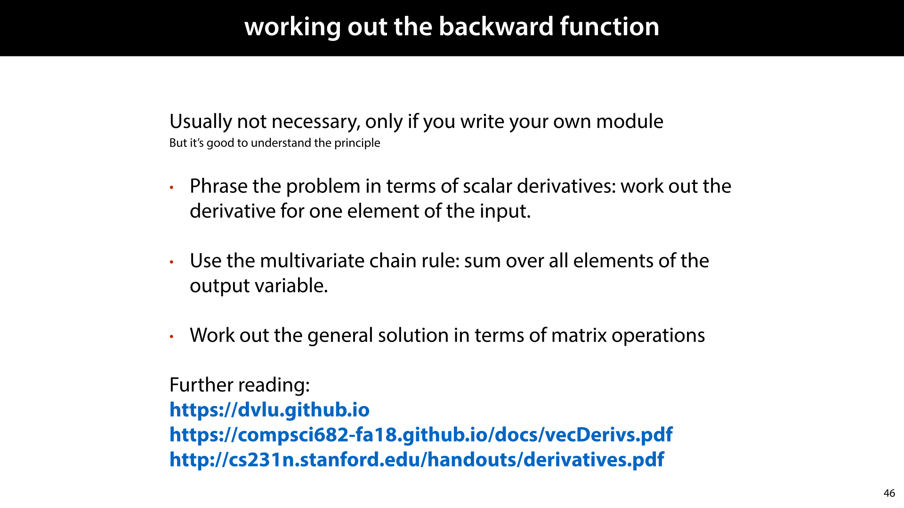

            <figcaption>
            
Working out a backward function is not usually necessary in practice: deep learning frameworks provide a large number of pre-built functions that you can chain together to do almost anything. Only when you write your own function, do you need to implement the backward and forward yourself.

            </figcaption>
       </section>

       <section id="slide-047">
            <a class="slide-link" href="https://mlvu.github.io/lecture07#slide-047" title="Link to this slide.">link here</a>
            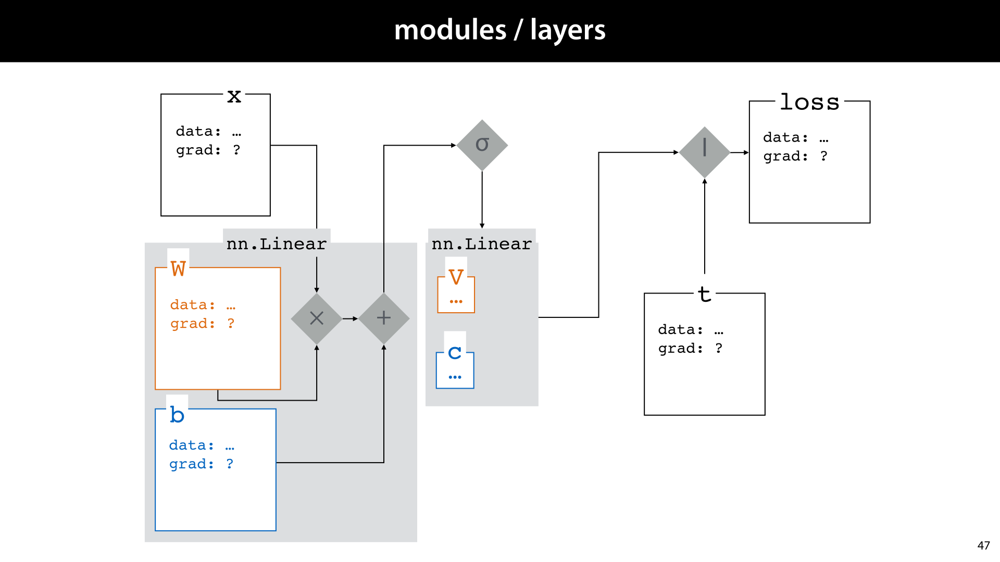

            <figcaption>
            
Most deep learning frameworks also have a way of combining model parameters and computation into a single unit, often called a<strong> module</strong> or a<strong> layer</strong>. 

In this case a Linear module (as it is called in Pytorch) takes care of implementing the computation of a single layer of a neural network (sans activation) and of remembering the weights and the bias. These modules combine existing functions together with tensors. Implementing a module is easy, you only define the forward part of the computation. The backward is done automatically, because everything is defined in terms of functions that already have a backward implemented. 

            </figcaption>
       </section>

       <section id="slide-048">
            <a class="slide-link" href="https://mlvu.github.io/lecture07#slide-048" title="Link to this slide.">link here</a>
            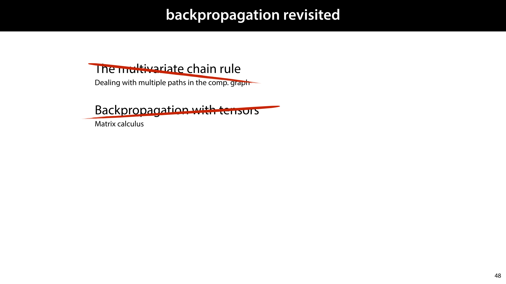

            <figcaption>
            
In order to make backpropagation flexible and robust enough to work in this setting, we need to discuss two features that we haven’t mentioned yet: how to perform backpropagation if the result depends on the dependent variable along different computation paths, and how to take derivatives when the variables aren’t scalars.

            </figcaption>
       </section>

       <section id="slide-049">
            <a class="slide-link" href="https://mlvu.github.io/lecture07#slide-049" title="Link to this slide.">link here</a>
            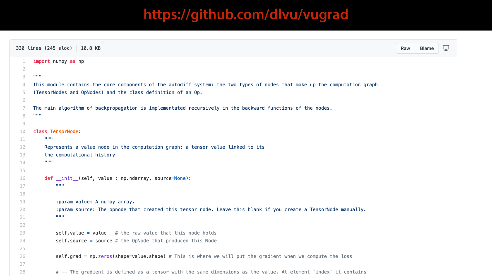

            <figcaption>
            
And with that, we have all the ingredients for a modern deep learning framework. 

If you’d like to see what this looks like in practice, <a href="https://github.com/dlvu/vugrad"><strong>click this link to see a very minimal implementation of such a deep learning system</strong></a>, in about 300 lines of code. If you’d like to get your hands dirty and start training neural networks, check out the fourth and fifth worksheets.  

In the next videos, we see what we can build in systems like this besides simple feedforward networks. Specifically, we’ll look at convolutional neural networks.

            </figcaption>
       </section>

        <section class="video" id="video-049">
            <a class="slide-link" href="https://mlvu.github.io/lecture07#video-49">link here</a>
           <video controls>
                <source src="https://pbm.thegood.cloud/s/eXbWbkg5cLbFGzf/download/MLVU%207.3%20Convolutions.mp4" type="video/mp4" />

                Download the <a href="https://pbm.thegood.cloud/s/eXbWbkg5cLbFGzf/download/MLVU%207.3%20Convolutions.mp4">video</a>.
           </video>
        </section>

       <section id="slide-050">
            <a class="slide-link" href="https://mlvu.github.io/lecture07#slide-050" title="Link to this slide.">link here</a>
            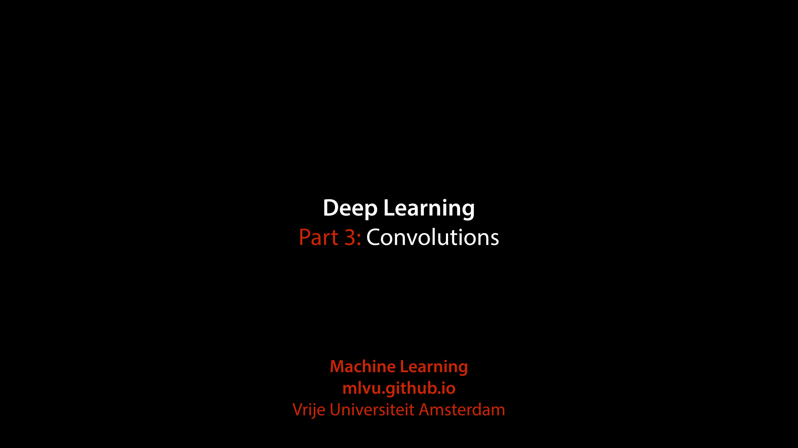

            <figcaption>
            
 

            </figcaption>
       </section>

       <section id="slide-051">
            <a class="slide-link" href="https://mlvu.github.io/lecture07#slide-051" title="Link to this slide.">link here</a>
            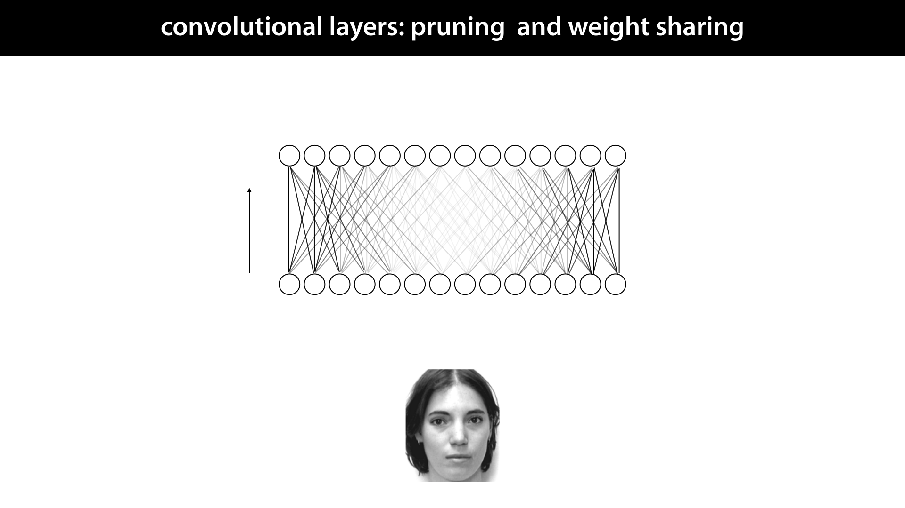

            <figcaption>
            
To get started with deep learning, let’s look at our first special layer. That is, a layer that is not just a fully connected linear transformation of a vector, but a layer whose shape is determined by some knowledge about its purpose. In the case of the convolution, its purpose is to consume <em>images.</em> 

We know that images form a grid, and we can use this information to get far fewer connections, and far fewer weights in the layer than a fully connected layer. 
<aside    >There are also convolutional layers for one dimensional grids, like a sequence of characters, or three-dimensional grids, like an MRI scan, but convolutions are most popular in the context of images.</aside><aside    ></aside>
            </figcaption>
       </section>

       <section id="slide-052" class="anim">
            <a class="slide-link" href="https://mlvu.github.io/lecture07#slide-052" title="Link to this slide.">link here</a>
            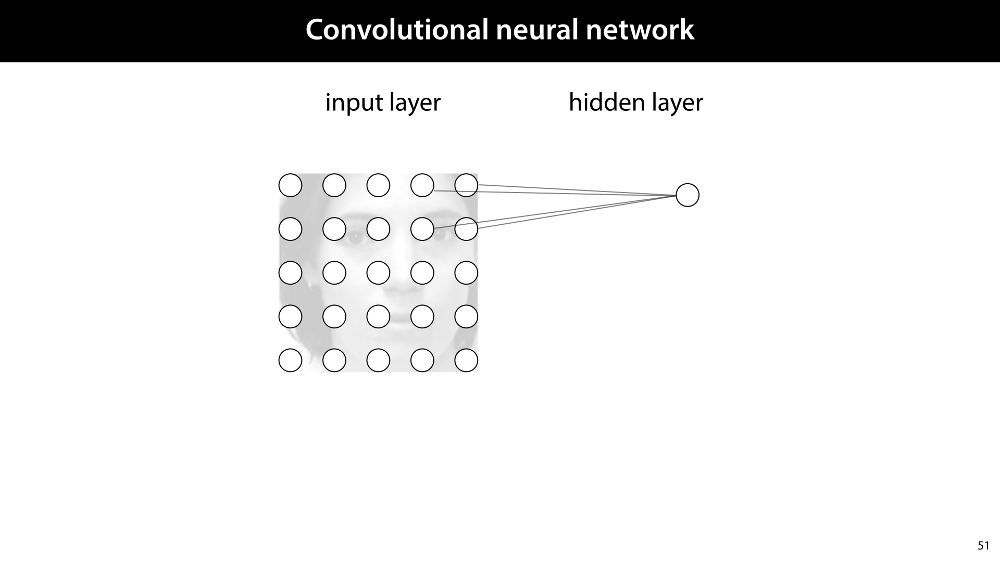

            <figcaption>
            
Image we start from the idea of a fully connected layer, where each (grayscale) pixel is one input node. Instead of connecting every hidden node with every input node, we will make the connections more sparse. We will also force certain weights to take the same values. 

We connect each node in the hidden layer just to a small n by n neighbourhood in the input (here n=2); there are no connections to any other pixels. We do this for each such n x n neighbourhood in the input. For an input image of 5 by 5 pixels, this gives us an input layer or 25 nodes, and a hidden layer of 16 nodes (which we’ve also arranged in a grid). Each node in the hidden layer has just 4 incoming connections. What’s more, we set the 4 weights of these incoming connections to be the same for each of the 16 nodes in the hidden layer.  

We are essentially dividing the image into patches of 2x2 pixels, and applying a small set of weights to turn each patch into a single hidden node. 

To extend the hidden layer, we can add additional <strong>channels</strong> to the hidden layer. For an extra channel we follow the same procedure but with 4 new weights. If, as shown here, we have a 5 by 5 input layer with 4 pixel neighbourhoods, and two maps, we get a network with 25 inputs and 32 nodes in the hidden layer.   
<aside    >In a traditional feedforward network, that would give us 25 x 32 connections with as many weights. Here, we have just 32 x 4 connections, and only 8 weights.</aside><aside    ></aside>
            </figcaption>
            click image for animation
       </section>

       <section id="slide-053">
            <a class="slide-link" href="https://mlvu.github.io/lecture07#slide-053" title="Link to this slide.">link here</a>
            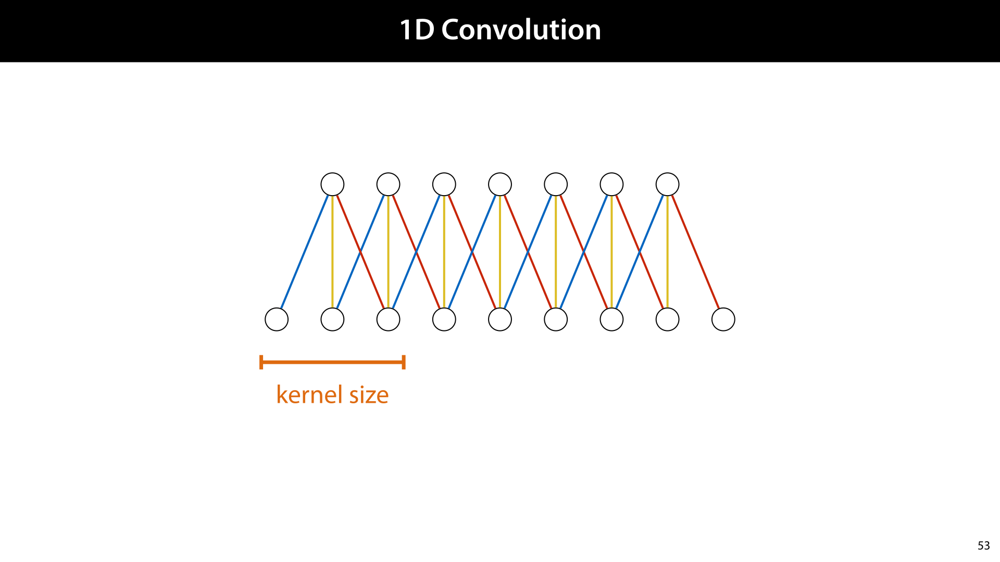

            <figcaption>
            
Here is how it looks if the input is 1D (a sequence of units rather than a grid). Note that the connection colors indicate shared weights (that is, every blue connection has the same weight). 

The set of weights we apply to each "patch" is called a kernel. The kernel size here is 3, and in the previous slide it was 2x2. 
<aside    >Not to be confused with the kernels we used in the SVM lecture, which were entirely different. </aside><aside    ></aside>
            </figcaption>
       </section>

       <section id="slide-054">
            <a class="slide-link" href="https://mlvu.github.io/lecture07#slide-054" title="Link to this slide.">link here</a>
            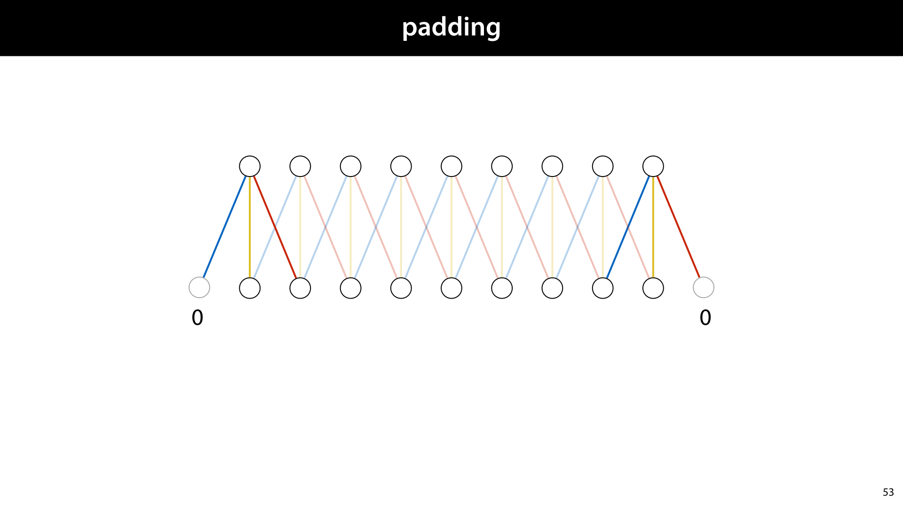

            <figcaption>
            
One drawback with the previous picture is that the inputs on the sides contribute to only one hidden unit, and the ones next to them to only two 

To combat this, we can add <em>padding</em>: extra units, usually with a fixed value set to zero. Because of this padding, the number of outputs becomes the same as the number of inputs, and the actual units on the side contribute to more nodes.  

To achieve the same number of units in the output as in the input (before padding), we must set the number of units padded on both sides to floor(kernel_size/2). This is sometimes called “same padding”.

            </figcaption>
       </section>

       <section id="slide-055">
            <a class="slide-link" href="https://mlvu.github.io/lecture07#slide-055" title="Link to this slide.">link here</a>
            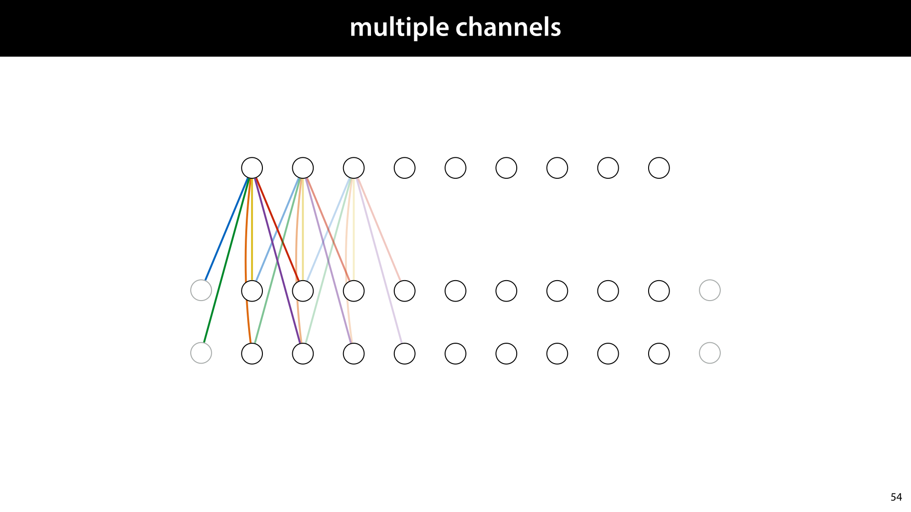

            <figcaption>
            
If our input has multiple channels (like one color channel for each pixel), the standard approach is to add new weights for the new channel. Note that these are repeated along the spatial dimension(s) just like the other weights. The same approach is used to create multiple output channels.

            </figcaption>
       </section>

       <section id="slide-056">
            <a class="slide-link" href="https://mlvu.github.io/lecture07#slide-056" title="Link to this slide.">link here</a>
            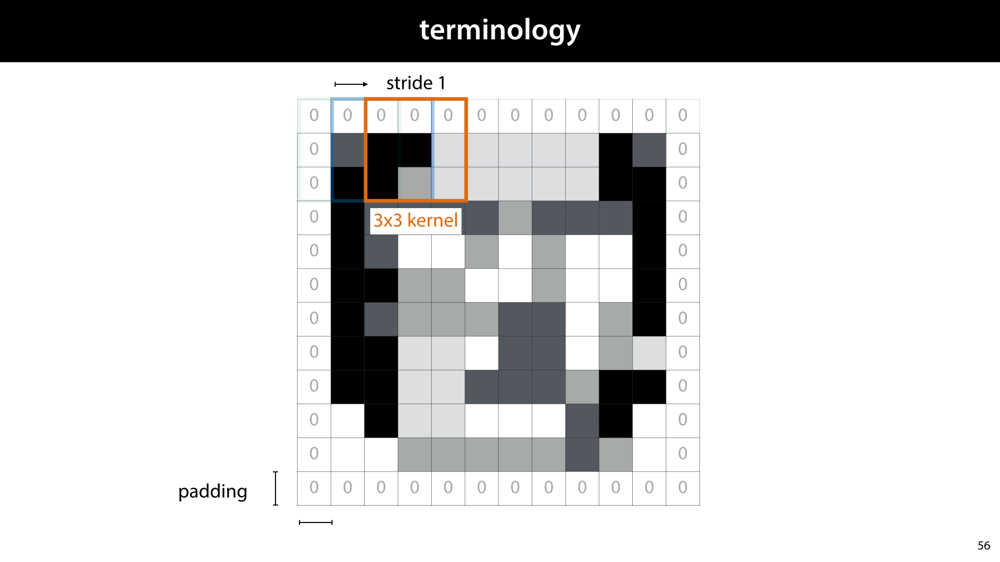

            <figcaption>
            
Here is the view in 2 dimensions. We normally slide the kernel one pixel each step (this is called a stride of 1), but we can also increase the stride to lower the output resolution.

            </figcaption>
       </section>

       <section id="slide-057">
            <a class="slide-link" href="https://mlvu.github.io/lecture07#slide-057" title="Link to this slide.">link here</a>
            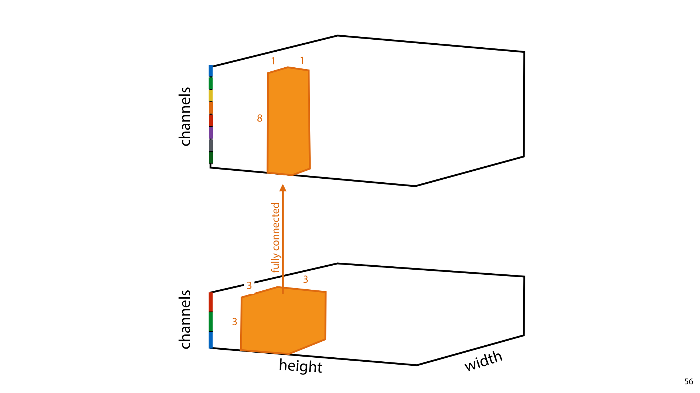

            <figcaption>
            
Used in this way, the convolution layer transforms the input, a 3-tensor, into another 3-tensor with the same resolution and potentially a different number of channels. 

Between the two orange boxes, everything is fully connected (every channel of every pixel in the lower boxer is connected by unique weight to every channel of every pixel in the top box.  
<aside    >If the input to this layer is the raw image, then the channels of the input have clear meanings: the levels or red, green and blue in each pixel of the input. This is no longer true for the channels of the tensor at the top. We still call them channels, but what they represent is entirely dependent on the weights of the network.</aside><aside    ></aside>
            </figcaption>
       </section>

       <section id="slide-058" class="anim">
            <a class="slide-link" href="https://mlvu.github.io/lecture07#slide-058" title="Link to this slide.">link here</a>
            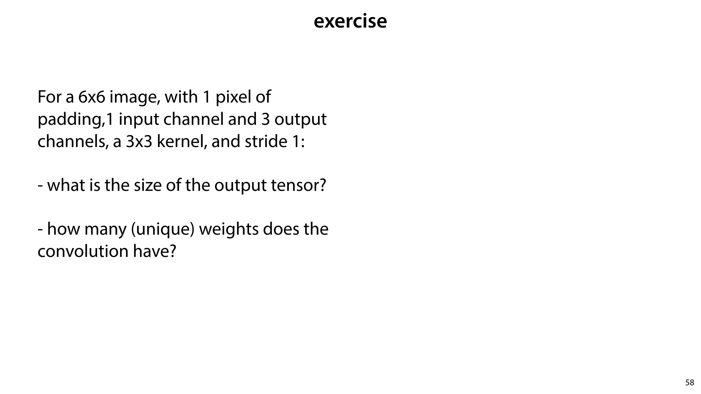

            <figcaption>
            
Here’s an exercise to see if you get the basic idea. 

Note first that the padding gives us an 8x8 image. Sliding a 3x3 kernel over this image, we see that we can fit 6 such kernels horizontally (this is one per column, minus 2 because the kernel window hits the right edge). The same thing holds for the rows, to we get 6 by 6 distinct windows. Since the output has 3 channels, we repeat this trick with 3 different kernels, so that we get an output tensor with dimensions 3 x 6 x 6. 

Each 3 x 3 kernel has 9 weights, and there are repeated at each position in the image. That means that no matter how big the image is, we never get more than 9 weights. However, the output has 3 channels, so we have 3 different kernels. The result is that we have 3 · 9 = 27 distinct weights. 
<aside    >This sort of question will come up in quiz 4, so make sure you get the idea. </aside><aside    ></aside>
            </figcaption>
            click image for animation
       </section>

       <section id="slide-059">
            <a class="slide-link" href="https://mlvu.github.io/lecture07#slide-059" title="Link to this slide.">link here</a>
            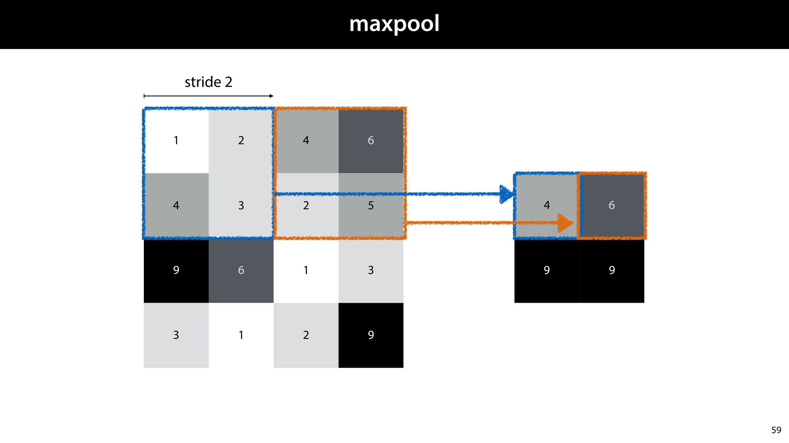

            <figcaption>
            
We chain these convolutions together, but after a while (as the number of channels grows) we’d like the resolution to decrease so we’re gradually looking at less specific parts of the image, but we have more information (more channels) about that part of the image. 

The max pooling layer does this for us, it divides the image into n-by-n squares, and returns the maximum value from each square. Average pooling (returning the average over each square) is also possible, but max pooling is usually more effective.  
<aside    >Most likely, this is because during the backward pass, the whole gradient flows back down one of the pixels, instead of dividing over all four. This gives the backpropagation a sparse character: it focuses only on the most important paths in the computation graph instead of dividing its attention over all of them. </aside>
Note that the maxpool is a layer without weights. It just removes some of the information coming in based on what the layers below it have done. We need to backpropagate through it to train the layers below, but it doesn't have any trainable properties of its own.

            </figcaption>
       </section>

       <section id="slide-060">
            <a class="slide-link" href="https://mlvu.github.io/lecture07#slide-060" title="Link to this slide.">link here</a>
            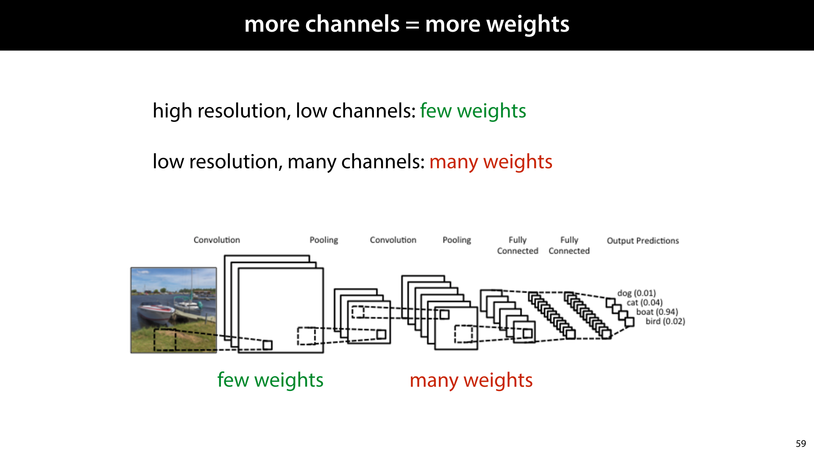

            <figcaption>
            
With the three layers we have now defined: convolutions, maxpooling and fully connected layers, we can build a convolutional network. The slide shows a diagram of a relatively standard way of building a convolutional neural net to classify images. 

At each step the maps of the layers get smaller, and we add more maps. Eventually, we add one or two fully connected layers, and a (softmax) output layer (if we’re doing image classification). 
<aside    ></aside>
            </figcaption>
       </section>

       <section id="slide-061">
            <a class="slide-link" href="https://mlvu.github.io/lecture07#slide-061" title="Link to this slide.">link here</a>
            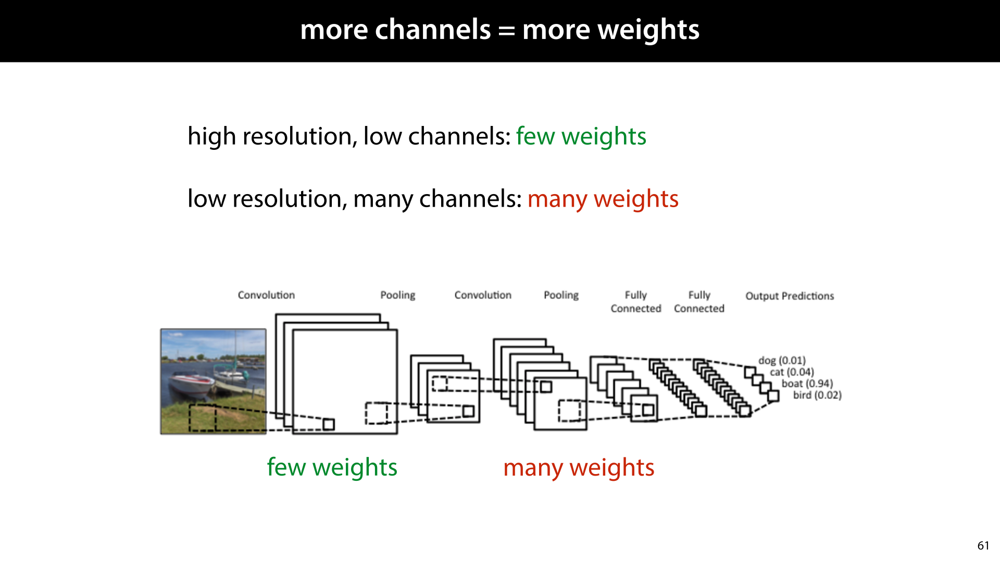

            <figcaption>
            
Note that the early layers have relatively little weights. Even though they process the largest input in terms of the width and height, the weights are repeated along these dimensions. Only when the number of channels grows do we get a large number of different weights.

            </figcaption>
       </section>

       <section id="slide-062">
            <a class="slide-link" href="https://mlvu.github.io/lecture07#slide-062" title="Link to this slide.">link here</a>
            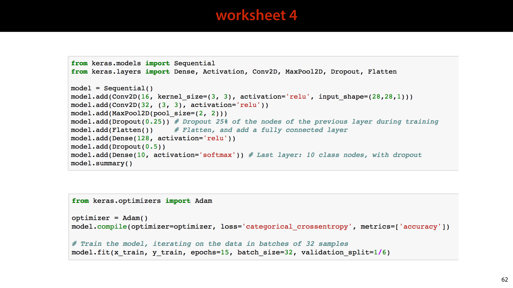

            <figcaption>
            
In worksheet 4, we show you how to build one of these convolutional networks to classify digits.

            </figcaption>
       </section>

       <section id="slide-063">
            <a class="slide-link" href="https://mlvu.github.io/lecture07#slide-063" title="Link to this slide.">link here</a>
            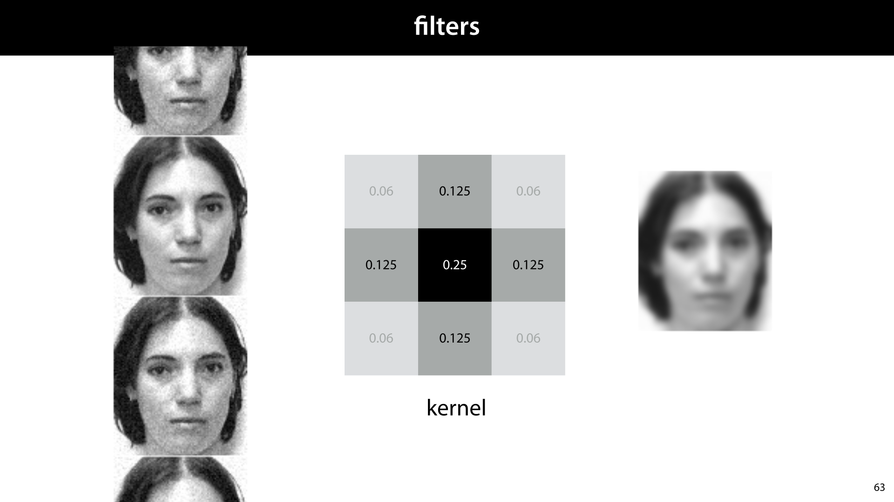

            <figcaption>
            
So what can these convolutional operations learn? How do they transform the image, for different values of the weights? To investigate we can look at the transformation from one input channel to one output channel (from one grayscale image to another). 

Here is an example: the Gaussian convolution. It takes a pixel neighbourhood and averages the pixels in it, creating a blurred result of the input. This is just one transformation that a convolution filter can perform, depending on the weights, many other operations are possible. We get this transformation in a 3x3 kernel where the middle weight is the largest and the surrounding weights are small positive values. The convolution then outputs essentially the input image, but each pixel is mixed with a little of its surrounding pixels' values. 

While Gaussian blur may seem to be throwing away valuable information, what we actually get is a representation that is <strong>invariant to noise</strong>. All these noisy input images in the left will be mapped to the same image on the right. We can do the same thing to create representations invariant to, for instance, small translations.

            </figcaption>
       </section>

       <section id="slide-064">
            <a class="slide-link" href="https://mlvu.github.io/lecture07#slide-064" title="Link to this slide.">link here</a>
            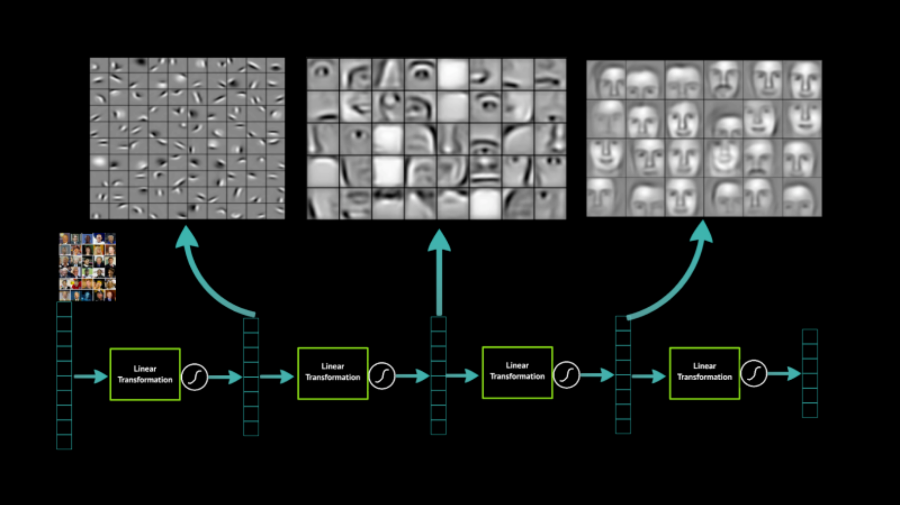

            <figcaption>
            
Here are the results of a real convolutional network trained to detect faces. The small grayscale images shows a typical image that each node in one of the layers responds to. Those for the first layers can be thought of as edge detectors: if there is a strong edge in a particular part of the image, the node lights up. The second combine these into detectors for parts of images: eyes noses, mouths, etc. The third combine these into detectors for complete faces. 

 
<aside    >source: <a href="https://devblogs.nvidia.com/parallelforall/deep-learning-nutshell-core-concepts/"><strong>https://devblogs.nvidia.com/parallelforall/deep-learning-nutshell-core-concepts/</strong></a> </aside><aside    ></aside>
            </figcaption>
       </section>

       <section id="slide-065">
            <a class="slide-link" href="https://mlvu.github.io/lecture07#slide-065" title="Link to this slide.">link here</a>
            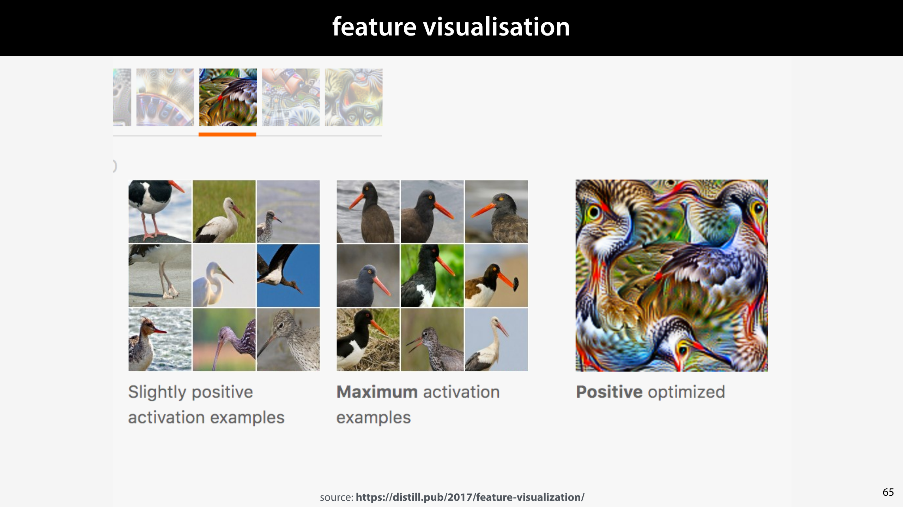

            <figcaption>
            
Here is a feature visualisation example for a more recent network trained on imagenet, a collection of 14 million images with diverse subjects. 

To find the image on the right, the authors took one node high up in the network, and instead of optimising the weights to minimise the loss, they optimised the input to maximise the activation of that node. 

They also searched the dataset for natural  images that caused a high activation in that particular node. 

You can look through these visualizations yourself at  <a href="https://distill.pub/2017/feature-visualization/"><strong>https://distill.pub/2017/feature-visualization/</strong></a>

<a href="https://distill.pub/2017/feature-visualization/"><strong></strong></a>

            </figcaption>
       </section>

       <section id="slide-066">
            <a class="slide-link" href="https://mlvu.github.io/lecture07#slide-066" title="Link to this slide.">link here</a>
            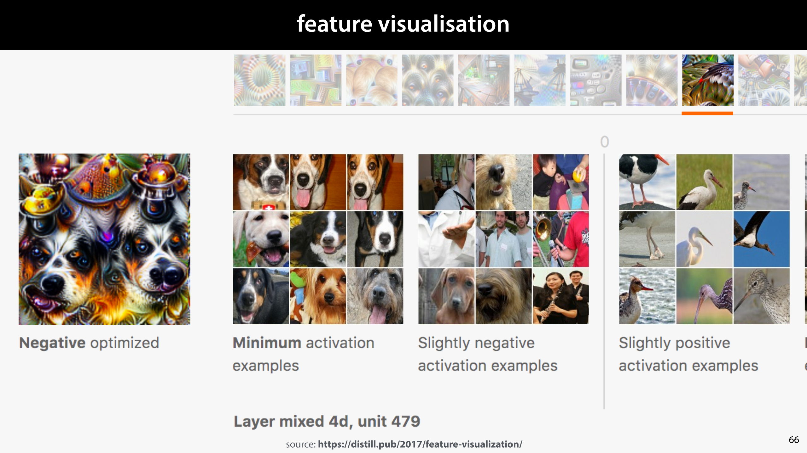

            <figcaption>
            
The opposite is also possible: searching for an input that cause minimal activation. 

<a href="https://distill.pub/2017/feature-visualization/"><strong>https://distill.pub/2017/feature-visualization/</strong></a>

<a href="https://distill.pub/2017/feature-visualization/"><strong></strong></a>

            </figcaption>
       </section>

       <section id="slide-067">
            <a class="slide-link" href="https://mlvu.github.io/lecture07#slide-067" title="Link to this slide.">link here</a>
            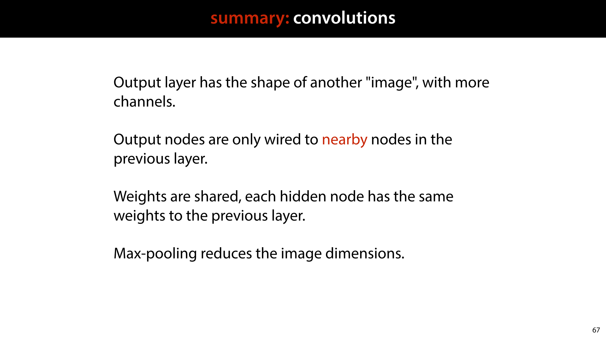

            <figcaption>
            

            </figcaption>
       </section>

        <section class="video" id="video-067">
            <a class="slide-link" href="https://mlvu.github.io/lecture07#video-67">link here</a>
           <video controls>
                <source src="https://pbm.thegood.cloud/s/WN5FGRGwjELmbtA/download/MLVU%207.4%20Making%20it%20work.mp4" type="video/mp4" />

                Download the <a href="https://pbm.thegood.cloud/s/WN5FGRGwjELmbtA/download/MLVU%207.4%20Making%20it%20work.mp4">video</a>.
           </video>
        </section>

       <section id="slide-068">
            <a class="slide-link" href="https://mlvu.github.io/lecture07#slide-068" title="Link to this slide.">link here</a>
            

            <figcaption>
            
 

            </figcaption>
       </section>

       <section id="slide-069">
            <a class="slide-link" href="https://mlvu.github.io/lecture07#slide-069" title="Link to this slide.">link here</a>
            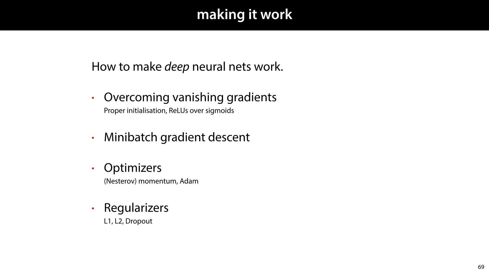

            <figcaption>
            
These are the four most important tricks that we use to train neural networks that are big (many parameters) and deep (many layers). Consequently, they are also the main features of any deep learning system.

            </figcaption>
       </section>

       <section id="slide-070">
            <a class="slide-link" href="https://mlvu.github.io/lecture07#slide-070" title="Link to this slide.">link here</a>
            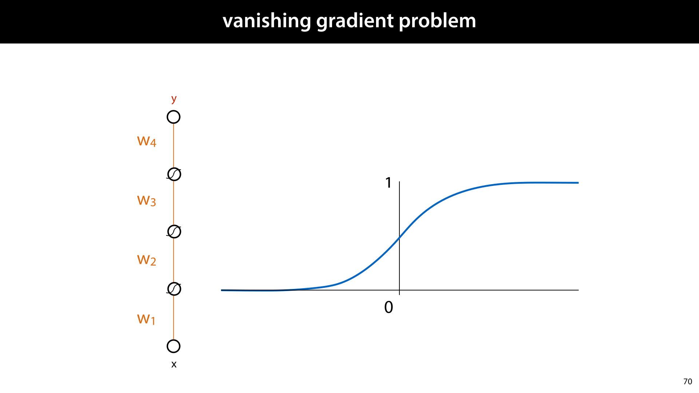

            <figcaption>
            
Here is a simple network to illustrate the problem of<strong> vanishing gradients</strong>. The question is how should we initialize its weights? If we set them too large, the activations will hit the rightmost part of the sigmoid. Consequently, the local gradient for each node will be very close to zero. That means that the network will never start learning. 

If we go the other way, and make the weights large negative numbers, then we hit the leftmost part of the sigmoid and we have the same problem.

            </figcaption>
       </section>

       <section id="slide-071" class="anim">
            <a class="slide-link" href="https://mlvu.github.io/lecture07#slide-071" title="Link to this slide.">link here</a>
            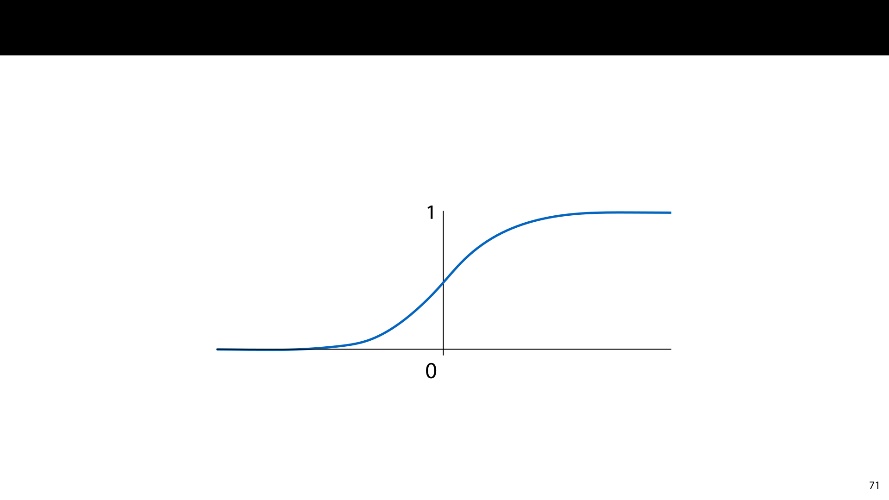

            <figcaption>
            
Even if the value going in to the sigmoid is close enough to zero, we still end up with a derivative of only one quarter. This means that propagating the gradient down the network, it will still go to zero with many layers. 

 

We could fix this by squeezing the sigmoid, so its derivative is 1, but it turns out there is a better and faster solution that doesn’t have any of these problems.

            </figcaption>
            click image for animation
       </section>

       <section id="slide-072" class="anim">
            <a class="slide-link" href="https://mlvu.github.io/lecture07#slide-072" title="Link to this slide.">link here</a>
            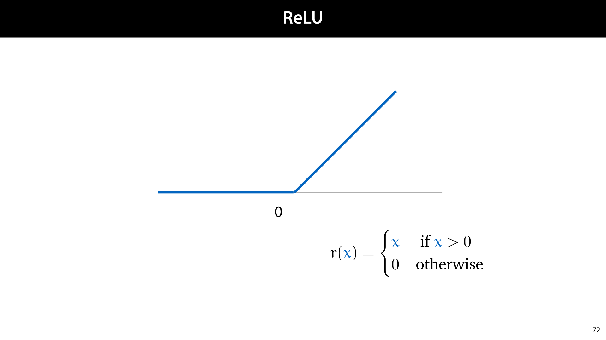

            <figcaption>
            
The rely activation preserves the derivatives for the nodes whose activations it lets through. It kills it for the nodes that produce a negative value, of course, but so long as your network is properly initialised, about half of the values in your batch will always produce a positive input for the ReLU. 

There is still the risk that during training, your network will move to a configuration where a neuron always produces negative input for every instance in your data. If that happens, you end up with a dead neuron: its gradient will always be zero and no weights below that neuron will change anymore (unless the also feed into a non-dead neuron).

            </figcaption>
            click image for animation
       </section>

       <section id="slide-073">
            <a class="slide-link" href="https://mlvu.github.io/lecture07#slide-073" title="Link to this slide.">link here</a>
            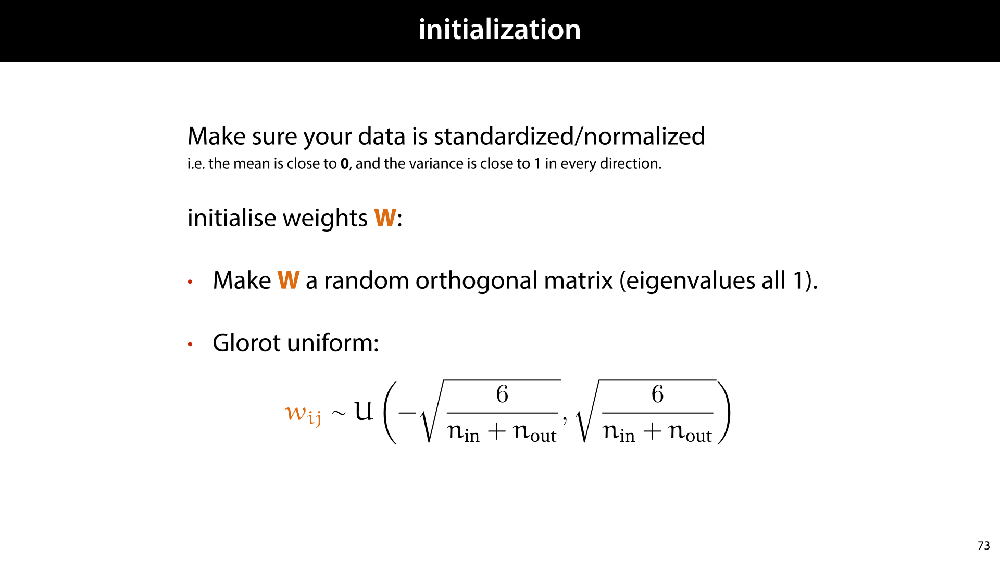

            <figcaption>
            
There are two standard initialisation mechanisms. The idea of both is that we assume that the layer input is (roughly) distributed so that its mean is 0 and the variance is 1 in every direction (we must standardise of normalise the data so this is true for the first layer). 

The initialisation is then designed to pick a random matrix that keeps these properties true (in a stochastic sense). 

 

            </figcaption>
       </section>

       <section id="slide-074">
            <a class="slide-link" href="https://mlvu.github.io/lecture07#slide-074" title="Link to this slide.">link here</a>
            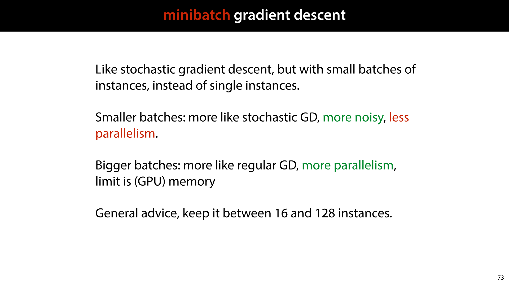

            <figcaption>
            

            </figcaption>
       </section>

       <section id="slide-075">
            <a class="slide-link" href="https://mlvu.github.io/lecture07#slide-075" title="Link to this slide.">link here</a>
            

            <figcaption>
            

            </figcaption>
       </section>

       <section id="slide-076">
            <a class="slide-link" href="https://mlvu.github.io/lecture07#slide-076" title="Link to this slide.">link here</a>
            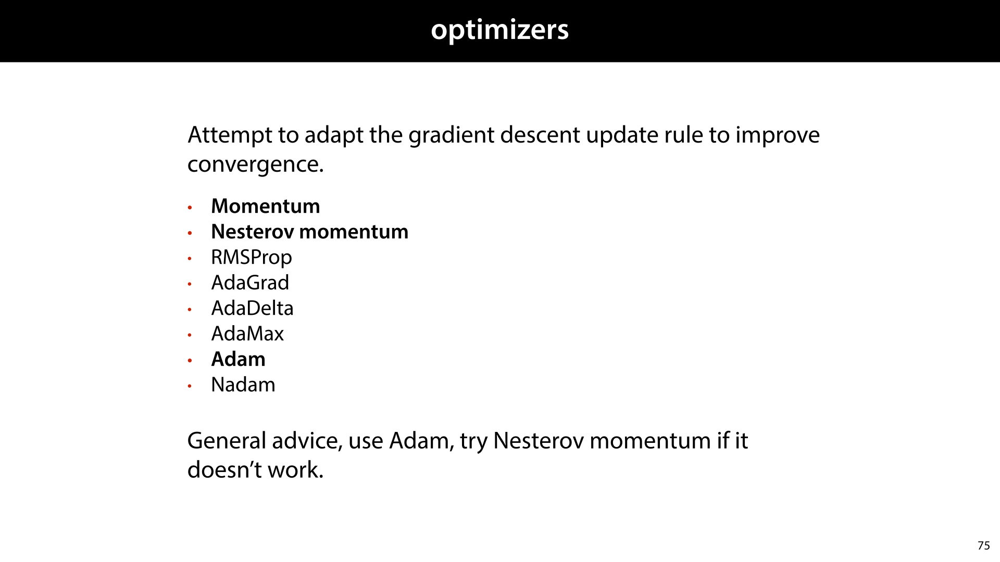

            <figcaption>
            

            </figcaption>
       </section>

       <section id="slide-077">
            <a class="slide-link" href="https://mlvu.github.io/lecture07#slide-077" title="Link to this slide.">link here</a>
            

            <figcaption>
            

            </figcaption>
       </section>

       <section id="slide-078">
            <a class="slide-link" href="https://mlvu.github.io/lecture07#slide-078" title="Link to this slide.">link here</a>
            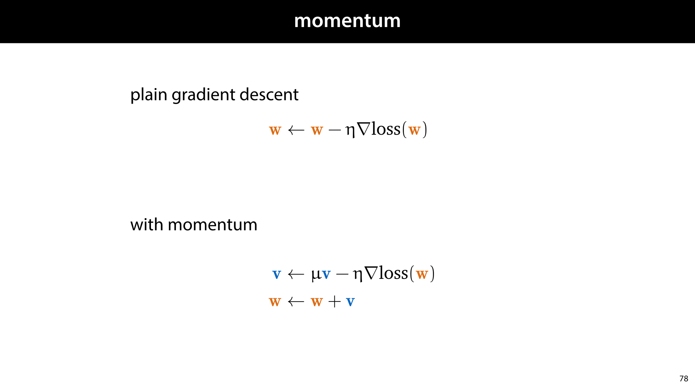

            <figcaption>
            
If gradient descent is a hiker in a snowstorm, then moment gradient descent is a boulder rolling down a hill. The gradient doesn’t affect its movement directly, it acts as a <strong>force</strong> on a moving object. If the gradient is zero, the updates continue in the same direction as the previous iteration, only slowed down by a “friction constant” mu. 

            </figcaption>
       </section>

       <section id="slide-079" class="anim">
            <a class="slide-link" href="https://mlvu.github.io/lecture07#slide-079" title="Link to this slide.">link here</a>
            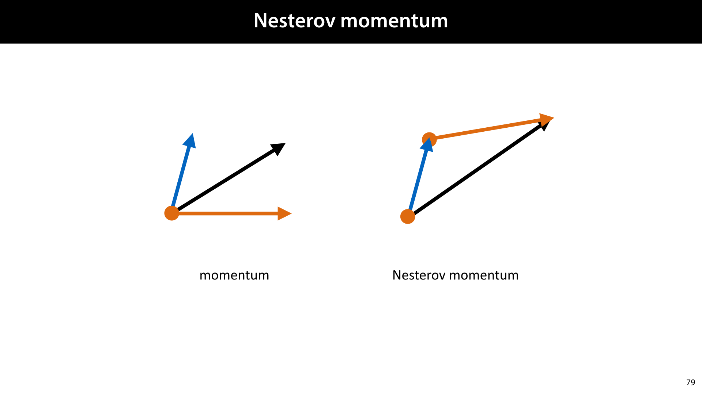

            <figcaption>
            
<strong>Nesterov momentum</strong> is a slight tweak. In regular momentum, the actual step taken is the sum of two vectors, the momentum step (representing the history of steps taken so far) and a gradient step (a step in the direction of steepest descent at the current point). 

Since we know that we are taking the momentum step anyway, we might as well take this step first, and then evaluate the gradient<em> after</em> the momentum step. This will make the gradient slightly more accurate. 
<aside    >See <a href="http://dlvu.github.io"><strong>DLVU lecture 4</strong></a> for a more detailed explanation.</aside><aside    ></aside>
            </figcaption>
            click image for animation
       </section>

       <section id="slide-080">
            <a class="slide-link" href="https://mlvu.github.io/lecture07#slide-080" title="Link to this slide.">link here</a>
            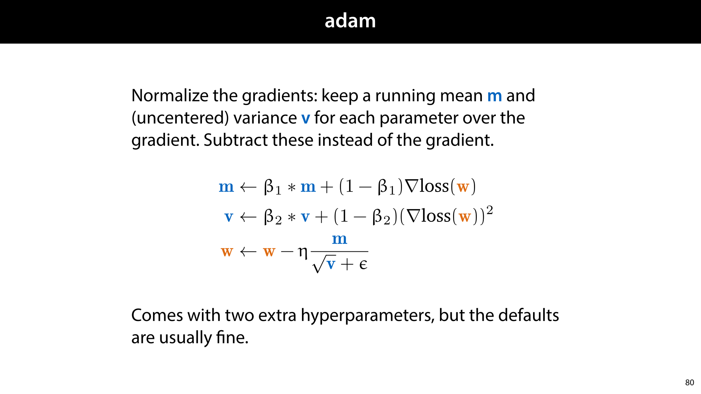

            <figcaption>
            
One way of thinking about momentum is that in large, complex networks each weight should have its own learning rate. Different weights perform very different functions, so ideally we want to look at the properties of the loss landscape for each weight (the sizes of recent gradients) and scale the “global learning rate” by these. In some ways, this is what the momentum vector is doing for us: is gives every weight a separate momentum scalar that changes how much that weight will changes separate from all the other weights. 

Adam is a method that takes this idea and adds another per-weight tuning on top of this: a scaling by the standard deviation of recent gradient values. 

The bigger the recent gradients, the bigger we want the learning rate to be (this is what momentum does for us). However, if there is a lot of variance in the recent gradients, we want to reduce the learning rate because the landscape is unpredictable. Thus, if we scale the learning rate by the mean <strong>m</strong> over the recent gradients (similar to momentum), and divide that by the square root of the variance <strong>v</strong> (plus some small epsilon to avoid division by zero), we end up with a direction that uses recent information about the loss landscape to adapt the gradient. 

<strong>m</strong> and <strong>v</strong> are computed as an exponential moving average. This means that the current gradient weights the most, and the influence of recent gradients decays exponentially (but all play <em>some </em>part in the total sum). 
<aside    >It may not be immediately obvious that the <strong>m</strong> vector is doing roughly the same thing here as the momentum <strong>m</strong> is, but with a little rewriting, you can show that they are very similar. You can think of Adam as doing "momentum plus scaling by the standard deviation".</aside><aside    ></aside>
            </figcaption>
       </section>

       <section id="slide-081">
            <a class="slide-link" href="https://mlvu.github.io/lecture07#slide-081" title="Link to this slide.">link here</a>
            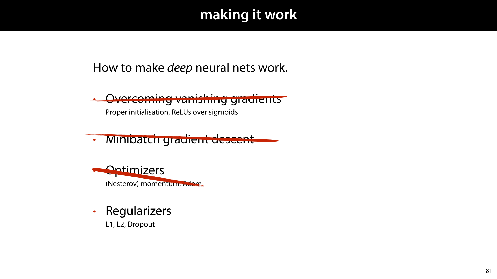

            <figcaption>
            

            </figcaption>
       </section>

       <section id="slide-082">
            <a class="slide-link" href="https://mlvu.github.io/lecture07#slide-082" title="Link to this slide.">link here</a>
            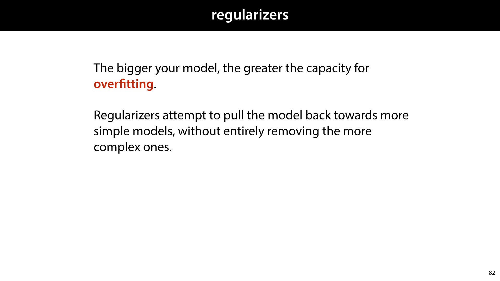

            <figcaption>
            

            </figcaption>
       </section>

       <section id="slide-083" class="anim">
            <a class="slide-link" href="https://mlvu.github.io/lecture07#slide-083" title="Link to this slide.">link here</a>
            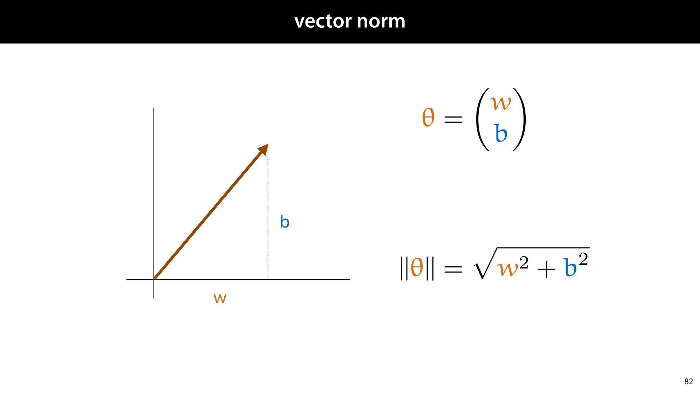

            <figcaption>
            
A simple example is the L2 regularizer. This regularizer considers models with small parameters to be simpler (and therefore preferable). It adds a  a penalty to the loss for models with larger weights. 

To implement the regularizer we simply compute the L2 norm of all the weights of the model (flattened into a vector). This is essentially the distance in model space from the origin to the model. 

With L2 loss in particular, it's common to compute the square of the norm rather than the norm itself. This works out as the dot product of the parameter vector with itself. This is easier to compute, and has some beneficial properties in analysing the resulting model mathematically.  
<aside    >The behavior of these two approaches is slightly different (the second is more sensitive to larger values), but in practice there isn't a big difference. </aside>
We then add this to the loss multiplied by hyper parameter lambda. Thus, models with bigger weights get a higher loss, but if it’s worth it (the original loss goes down enough), they can still beat the simpler models. Theta is a vector containing all parameters of the model.

            </figcaption>
            click image for animation
       </section>

       <section id="slide-084" class="anim">
            <a class="slide-link" href="https://mlvu.github.io/lecture07#slide-084" title="Link to this slide.">link here</a>
            

            <figcaption>
            
We can generalise the L2 norm to an <strong>Lp norm</strong> by replacing the squares(and the square root) with some other number p.

            </figcaption>
            click image for animation
       </section>

       <section id="slide-085">
            <a class="slide-link" href="https://mlvu.github.io/lecture07#slide-085" title="Link to this slide.">link here</a>
            

            <figcaption>
            
For the l2 norm, the set of all points that have the same distance to the origin form a circle. In higher dimensions this becomes a (hyper)sphere. This is the set of all models that receive the same regularization penalty under the L2 norm.

            </figcaption>
       </section>

       <section id="slide-086">
            <a class="slide-link" href="https://mlvu.github.io/lecture07#slide-086" title="Link to this slide.">link here</a>
            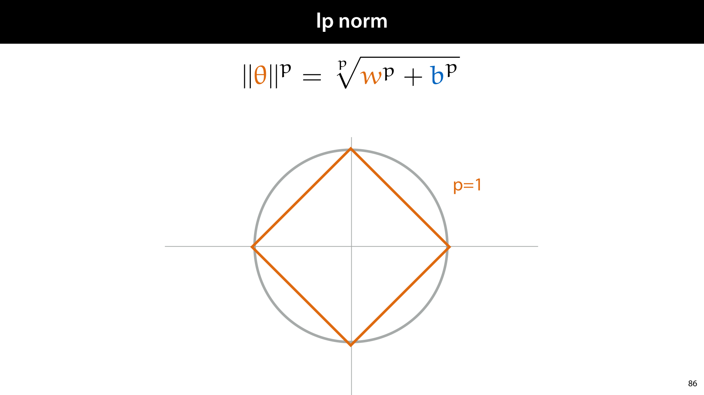

            <figcaption>
            
For the L1 norm, they form a diamond. This means that if we penalize by L1 norm, we are allowing models to get further away from the origin, if they move along one of the axes. I you keep one parameter 0, you get to move much farther away than if you keep both equally big.

            </figcaption>
       </section>

       <section id="slide-087">
            <a class="slide-link" href="https://mlvu.github.io/lecture07#slide-087" title="Link to this slide.">link here</a>
            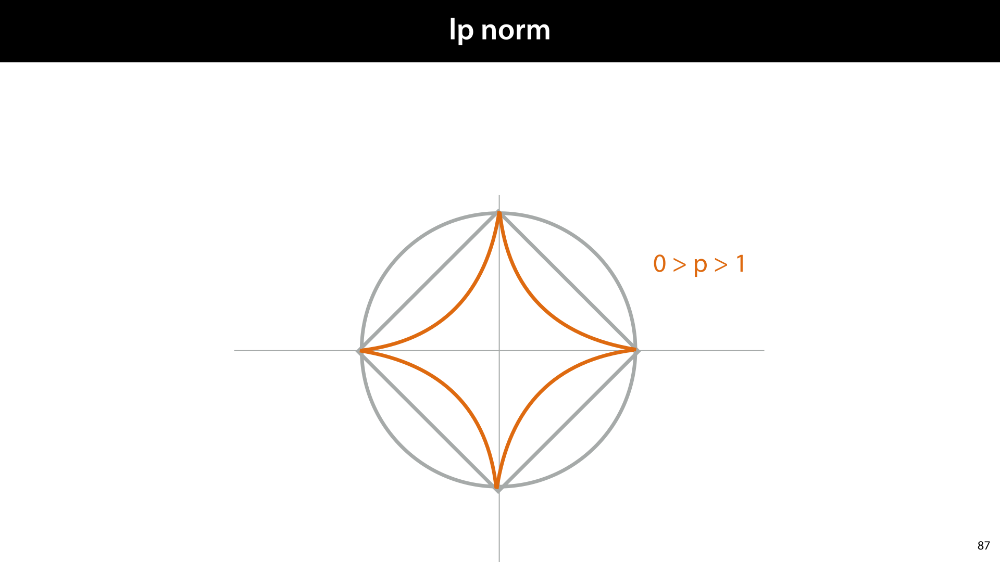

            <figcaption>
            
The smaller we make p, the more pronounced this effect gets. We usually stop at p=1, for the sake of numerical stability.

            </figcaption>
       </section>

       <section id="slide-088">
            <a class="slide-link" href="https://mlvu.github.io/lecture07#slide-088" title="Link to this slide.">link here</a>
            

            <figcaption>
            
The L1 regularizer works just the same as the L2 regularizer: we just add a weight term to the loss, with the L1 norm of the model parameters. The diamond shape of the norm has a special effect. It means that the search will have a strong preference for models that lie exactly on the axes. 

For example, the L2norm won't induce much of a preference between the model with parameters (0.01, 1) and (0, 1), but the L1 norm will show a clear preference for the latter. For this reason we say that the L1 norm prefers <strong>sparse solutions</strong>. Models where as many as possible of the parameters are exactly 0.

            </figcaption>
       </section>

       <section id="slide-089">
            <a class="slide-link" href="https://mlvu.github.io/lecture07#slide-089" title="Link to this slide.">link here</a>
            

            <figcaption>
            
Here’s an analogy. Imagine you have a bowl, and you roll a marble down it to find the lowest point. Applying l2 loss is like tipping the bowl slightly to the right. You shift the lowest point in some direction (like to the origin).

            </figcaption>
       </section>

       <section id="slide-090">
            <a class="slide-link" href="https://mlvu.github.io/lecture07#slide-090" title="Link to this slide.">link here</a>
            

            <figcaption>
            
L1 loss is like using a square bowl. It has grooves along the dimensions, so that when you tip the bowl, the marble is likely to end up in one of the grooves.

            </figcaption>
       </section>

       <section id="slide-091">
            <a class="slide-link" href="https://mlvu.github.io/lecture07#slide-091" title="Link to this slide.">link here</a>
            

            <figcaption>
            

            </figcaption>
       </section>

       <section id="slide-092">
            <a class="slide-link" href="https://mlvu.github.io/lecture07#slide-092" title="Link to this slide.">link here</a>
            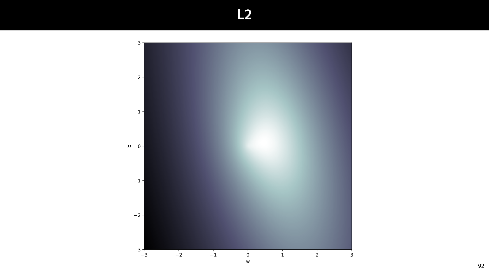

            <figcaption>
            

            </figcaption>
       </section>

       <section id="slide-093">
            <a class="slide-link" href="https://mlvu.github.io/lecture07#slide-093" title="Link to this slide.">link here</a>
            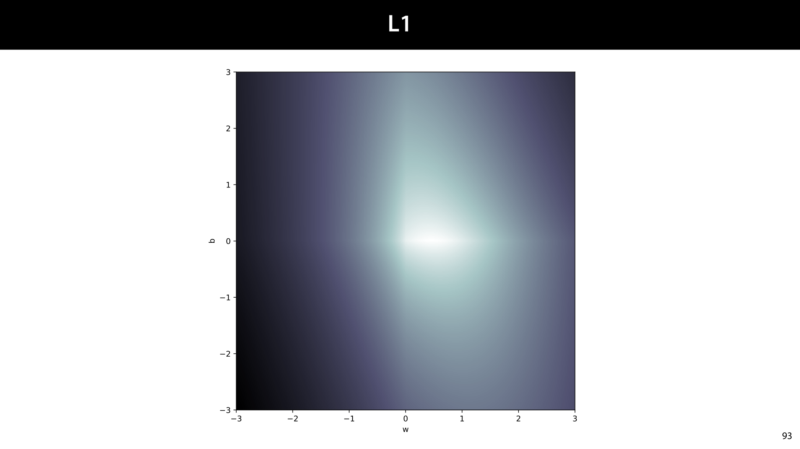

            <figcaption>
            

            </figcaption>
       </section>

       <section id="slide-094">
            <a class="slide-link" href="https://mlvu.github.io/lecture07#slide-094" title="Link to this slide.">link here</a>
            

            <figcaption>
            
We can try this in tensor flow playground. For this example (a simple logistic regression) we know that the derived features x12 and x22 contain everything we need to a linear fit. However, when we with with regularly, or with L2 regularization, we see that the weights for the other features never quite go to zero. However, with L1 regularization, we see that they become precisely zero. 

<a href="https://bit.ly/32lc6cQ"><strong>https://bit.ly/32lc6cQ</strong></a> 

            </figcaption>
       </section>

       <section id="slide-095">
            <a class="slide-link" href="https://mlvu.github.io/lecture07#slide-095" title="Link to this slide.">link here</a>
            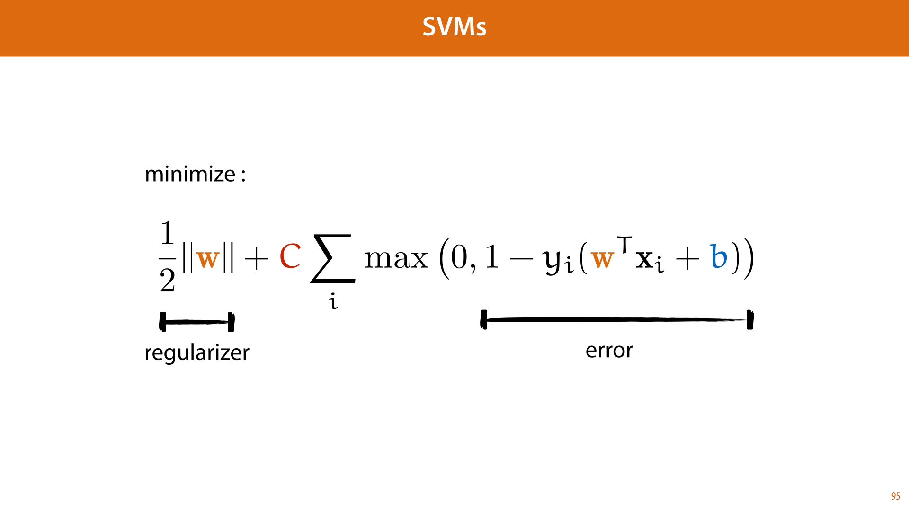

            <figcaption>
            
Sometimes a regularization term is something that you tack onto your model in an ad-hoc fashion: you see that it is overfitting, so you add a little regularization. 

Other times, it appears naturally. We saw this in the last lecture, where we rewrote the SVM soft margin loss to an error term and a regularization term. 
<aside    >Here the penalty hyperparameter C is on the error term, and not on the regularization term, but practically it doesn’t make much of a difference which term you control.</aside><aside    ></aside>
            </figcaption>
       </section>

       <section id="slide-096">
            <a class="slide-link" href="https://mlvu.github.io/lecture07#slide-096" title="Link to this slide.">link here</a>
            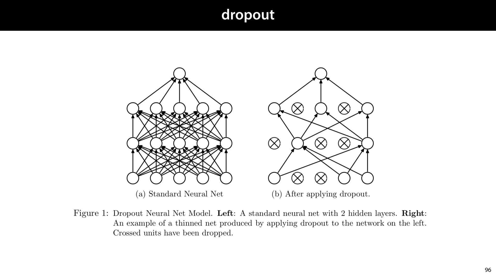

            <figcaption>
            
<strong>Dropout</strong> is a very different regularization technique for large neural nets. During training, we simply remove hidden and input nodes (each with probability <em>p</em>) by setting their values to zero. 

Memorization (aka overfitting) often depends on multiple neurons firing together in specific combinations. Dropout prevents this by randomly turning them of. 

image source: <a href="http://jmlr.org/papers/v15/srivastava14a.html"><strong>http://jmlr.org/papers/v15/srivastava14a.html</strong></a>

<a href="http://jmlr.org/papers/v15/srivastava14a.html"><strong></strong></a>

            </figcaption>
       </section>

       <section id="slide-097">
            <a class="slide-link" href="https://mlvu.github.io/lecture07#slide-097" title="Link to this slide.">link here</a>
            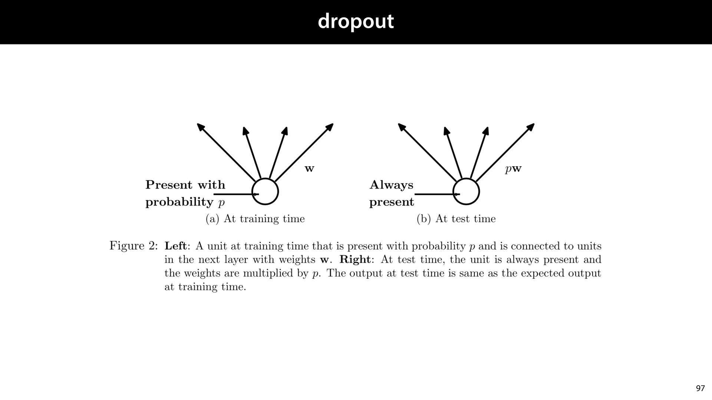

            <figcaption>
            
Once you’ve finished training and you starting using the model, you turn off dropout. Since this increases the size of the activations, you should correct by a factor of p. 
<aside    >Frameworks like Keras know when you’re using the model to train and when you’re using it to predict, and turn dropout on and off automatically. In other frameworks like Pytorch, you need to be little bit more careful to tell the network whether you're training or evaluating. </aside>
image source: <a href="http://jmlr.org/papers/v15/srivastava14a.html"><strong>http://jmlr.org/papers/v15/srivastava14a.html</strong></a>

<a href="http://jmlr.org/papers/v15/srivastava14a.html"><strong></strong></a>

            </figcaption>
       </section>

       <section id="slide-098">
            <a class="slide-link" href="https://mlvu.github.io/lecture07#slide-098" title="Link to this slide.">link here</a>
            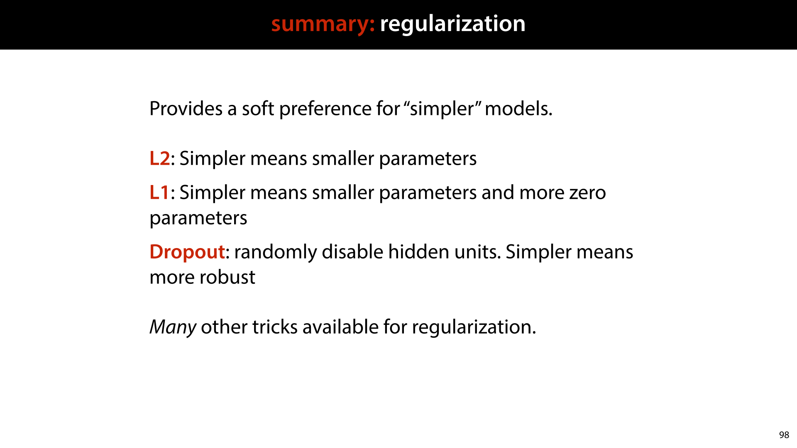

            <figcaption>
            

            </figcaption>
       </section>

       <section id="slide-099">
            <a class="slide-link" href="https://mlvu.github.io/lecture07#slide-099" title="Link to this slide.">link here</a>
            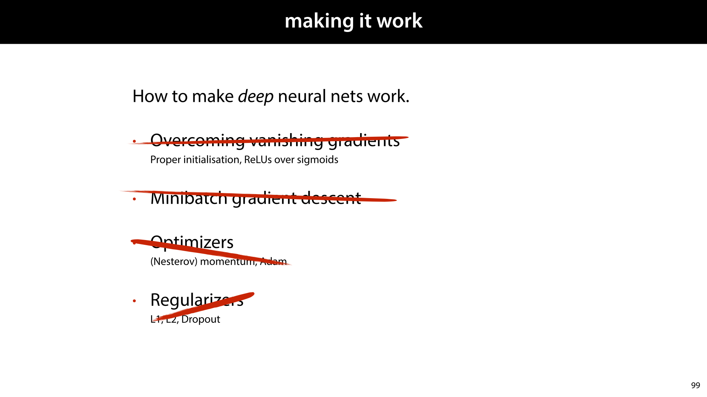

            <figcaption>
            
These are the four most important tricks that we use to train neural networks that are big (many parameters) and deep (many layers). Consequently, they are also the main features of any deep learning system.

            </figcaption>
       </section>

       <section id="slide-100">
            <a class="slide-link" href="https://mlvu.github.io/lecture07#slide-100" title="Link to this slide.">link here</a>
            

            <figcaption>
            
Once we had the basic frameworks for deep learning worked out and we started to get the hang of training big and deep networks, the deep learning revolution started to get going. Let’s look at some early successes (mostly in the visual domain).

            </figcaption>
       </section>

       <section id="slide-101">
            <a class="slide-link" href="https://mlvu.github.io/lecture07#slide-101" title="Link to this slide.">link here</a>
            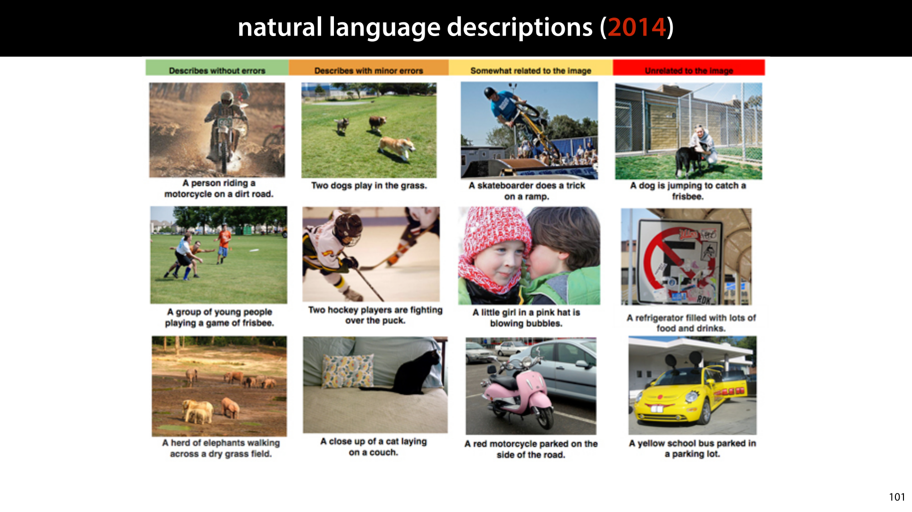

            <figcaption>
            
This is an end-to-end system for producing natural language descriptions of photographs. The system is not provided with any knowledge of the way language works, it just learns to produce captions from examples using a single neural network that consumes images and produces text, trained end-to-end. 

 
<aside    >source: <a href="https://www.engadget.com/2014/11/18/google-natural-language-image-description/"><strong>https://www.engadget.com/2014/11/18/google-natural-language-image-description/</strong></a> </aside><aside    >recommended: <a href="https://twitter.com/picdescbot"><strong>https://twitter.com/picdescbot</strong></a> </aside><aside    ></aside>
            </figcaption>
       </section>

       <section id="slide-102">
            <a class="slide-link" href="https://mlvu.github.io/lecture07#slide-102" title="Link to this slide.">link here</a>
            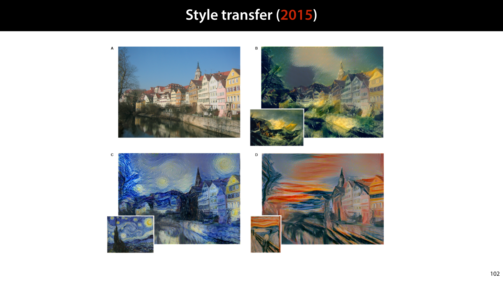

            <figcaption>
            
This example uses a convolutional network to transfer the style of one image onto another. Interestingly, this work was done with a general purpose network, trained on a general classification task (such networks are available for download). The authors took this network, and didn’t change the weights. They just built the style transfer architecture around the existing network. 

 
<aside    >source: <a href="https://research.googleblog.com/2016/10/supercharging-style-transfer.html"><strong>https://research.googleblog.com/2016/10/supercharging-style-transfer.html</strong></a> </aside><aside    >try it yourself: <a href="http://demos.algorithmia.com/deep-style/"><strong>http://demos.algorithmia.com/deep-style/</strong></a> </aside><aside    ></aside>
            </figcaption>
       </section>

       <section id="slide-103">
            <a class="slide-link" href="https://mlvu.github.io/lecture07#slide-103" title="Link to this slide.">link here</a>
            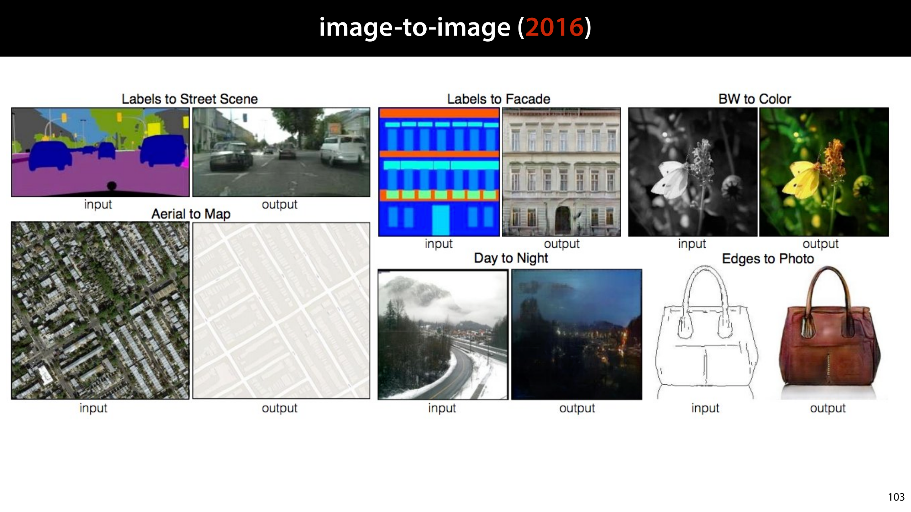

            <figcaption>
            
This is pix2pix: a network with images as inputs and images as outputs was trained on various example datasets. Note the direction of the transformation. For instance, in the top left, the street scene with labeled objects was the <em>input</em>. The car-like objects, road surface, tree etc were all generated by the neural network to fill in the coloured patches in the input. Similarly, the bottom right shows the network generating a picture of a handbag <em>from a line-drawing</em>. 

            </figcaption>
       </section>

       <section id="slide-104" class="anim">
            <a class="slide-link" href="https://mlvu.github.io/lecture07#slide-104" title="Link to this slide.">link here</a>
            

            <figcaption>
            
In some cases, we don’t have neatly paired images: like the task of transforming a horse into a zebra. We can get a big bag of pictures of horses, and a big bag of pictures of zebras, but we don’t know what a specific horse should look like as a zebra. The CycleGAN, published in 2017, could learn in this setting. 

<a href="http://gntech.ae/news/cyclegan-ai-can-turn-classic-paintings-photos/"><strong>http://gntech.ae/news/cyclegan-ai-can-turn-classic-paintings-photos/</strong></a> 

            </figcaption>
            click image for animation
       </section>

       <section id="slide-105">
            <a class="slide-link" href="https://mlvu.github.io/lecture07#slide-105" title="Link to this slide.">link here</a>
            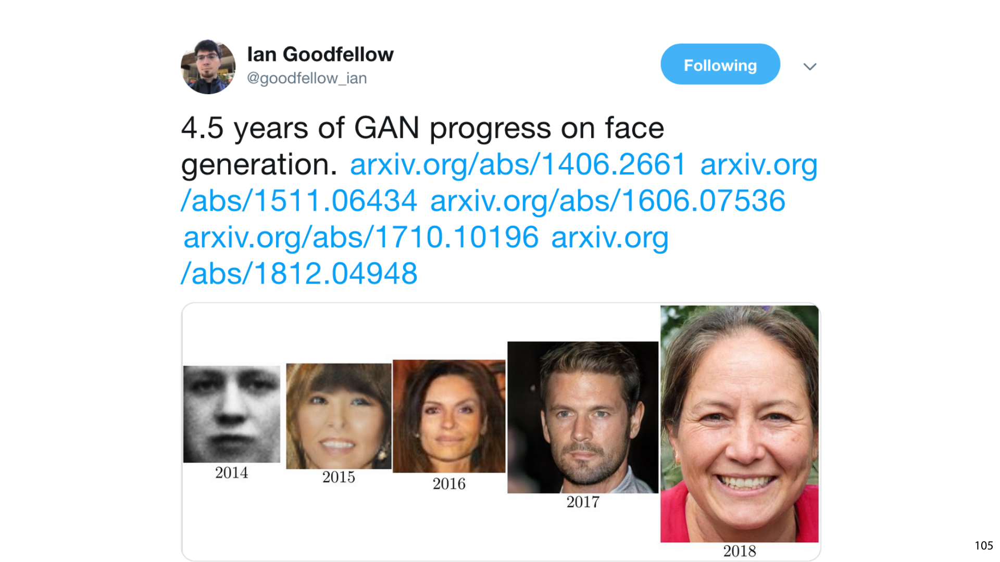

            <figcaption>
            
<a href="https://twitter.com/goodfellow_ian/status/1084973596236144640"><strong>https://twitter.com/goodfellow_ian/status/1084973596236144640</strong></a> 

            </figcaption>
       </section>

       <section id="slide-106" class="anim">
            <a class="slide-link" href="https://mlvu.github.io/lecture07#slide-106" title="Link to this slide.">link here</a>
            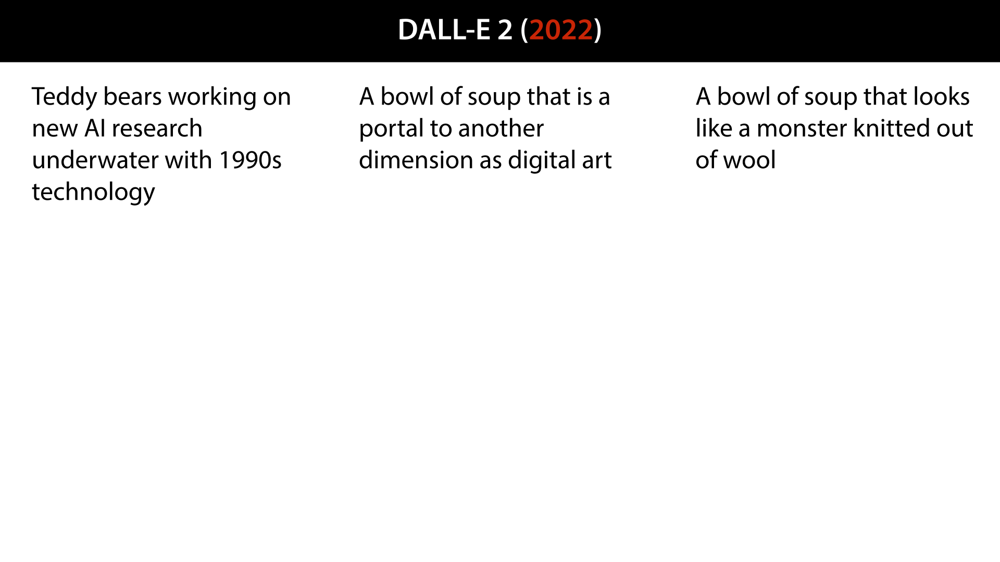

            <figcaption>
            

            </figcaption>
            click image for animation
       </section>

       <section id="slide-107">
            <a class="slide-link" href="https://mlvu.github.io/lecture07#slide-107" title="Link to this slide.">link here</a>
            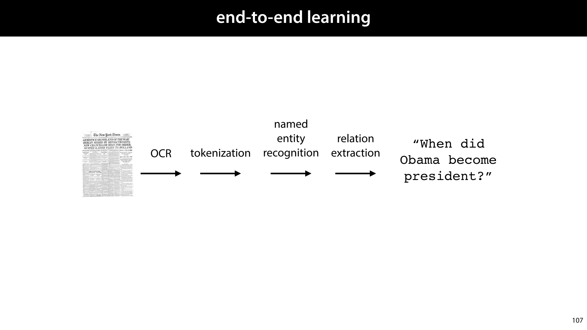

            <figcaption>
            
Finally, let’s discuss what deep learning means on a higher level; why we consider it such a departure from classical machine learning. 

Here is the kind of pipeline we would often attempt to build in the days before deep learning: we scan old news papers, perform optical character recognition, tokenise the characters into words, attempt to find named entities (like people and companies) and then try to learn the relations between these entities so that we can ask structured queries. 

Most of these steps would be solved by some form of machine learning. And after a while, we were getting pretty good at each. So good that it would, for instance, make a mistake for only 1 in a 100 instances. 

But chaining together modules that are 99% accurate does not give you a pipeline that is 99% accurate. Error <em>accumulates</em>. The tokenization works slightly less well than on its pristine test data, because it’s getting noisy input from the OCR. This makes the input for the NER  module even more noisy and so on. The end result is that all modules work well individually, but the pipeline as a whole performs very poorly.

            </figcaption>
       </section>

       <section id="slide-108">
            <a class="slide-link" href="https://mlvu.github.io/lecture07#slide-108" title="Link to this slide.">link here</a>
            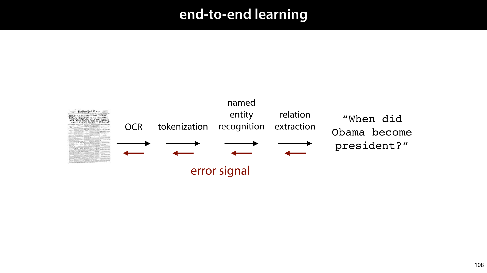

            <figcaption>
            
What deep learning allows us to do is to make each module <strong>differentiable</strong>: ensure that we can work out a local gradient so that we can also train the pipeline as<strong> a whole </strong>using backpropagation. 

This is called <strong>end-to-end learning</strong>. 
<aside    >We can still start by training each module individually, so long as we do a little fine-tuning after we chain them all together. This does mean that we need some training examples for the whole pipeline, as well as for all the individual components.</aside><aside    ></aside>
            </figcaption>
       </section>

       <section id="slide-109" class="anim">
            <a class="slide-link" href="https://mlvu.github.io/lecture07#slide-109" title="Link to this slide.">link here</a>
            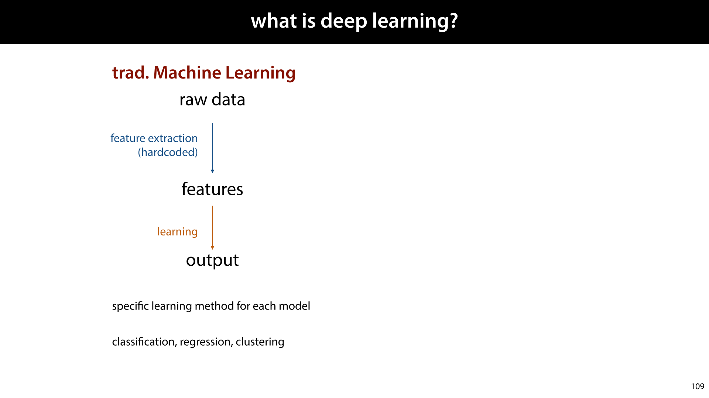

            <figcaption>
            
In traditional machine learning, the standard approach is to take our instances and to <strong>extract features</strong>. If our instances are things like images, natural language, or audio, this means we may lose information in this step. The data always has to be a matrix, so we are constrained to an inflexible abstract task. 

In deep learning, because we translate our raw data to <em>tensors </em>of any shape and size, and then design a model to deal with the specific tensor shape we’ve created, we have much more flexibility, and we can get much closer to the raw data. This means that instead of deciding what the model should pay attention to through feature design, we are allowing the model to <em>learn</em> which aspects of the raw data are relevant.

            </figcaption>
            click image for animation
       </section>

       <section id="slide-110">
            <a class="slide-link" href="https://mlvu.github.io/lecture07#slide-110" title="Link to this slide.">link here</a>
            

            <figcaption>
            
In short, deep learning is to traditional machine learning, as Lego is to Playmobil. Both can give you a school bus, but the Lego school bus can be taken apart and reconstructed into a spaceship. The Playmobil bus is single-use.  

These are different abstractions, with different purposes. Deep learning requires a little more work and insight, but you get a lot of flexibility in return. 

            </figcaption>
       </section>

</article>
