<nav class="menu">
    <ul>
        <li class="home"><a href="/">Home</a></li>
        <li class="name">Lecture 8: Density estimation</li>
                <li><a href="#video-000">Normal distributions</a></li>
                <li><a href="#video-031">Maximum likelihood estimators</a></li>
                <li><a href="#video-044">Expectation-maximization</a></li>
                <li><a href="#video-071">A formal analysis of EM</a></li>
                <li><a href="#video-096">Social impact 3</a></li>
        <li class="pdf"><a href="https://mlvu.github.io/lectures/42.ProbabilisticModels2.annotated.pdf">PDF</a></li>
    </ul>
</nav>

<article class="slides">

       <section class="video" id="video-000">
           <a class="slide-link" href="https://mlvu.github.io/lecture08#video-0">link here</a>
           <iframe
                src="https://www.youtube.com/embed/VZfAJzXu1hM?modestbranding=1&showinfo=0&rel=0"
                title="YouTube video player"
                frameborder="0" allow="accelerometer; autoplay; clipboard-write; encrypted-media; gyroscope; picture-in-picture"
                allowfullscreen>
           </iframe>

       </section>

       <section id="slide-001">
            <a class="slide-link" href="https://mlvu.github.io/lecture08#slide-001" title="Link to this slide.">link here</a>
            

            <figcaption>
            
In a few videos so far, we made use of the Normal distribution, assuming that you’d seen it before, and that you know more or less what its properties are. 

In this  video, we’ll take a step back and look at the normal distribution from first principles. It’s an important tool in what is coming up in this lecture and the next, so we need to make ourselves eminently comfortable with the ins and outs. 

<lnbr></lnbr>

            </figcaption>
       </section>

       <section id="slide-002">
            <a class="slide-link" href="https://mlvu.github.io/lecture08#slide-002" title="Link to this slide.">link here</a>
            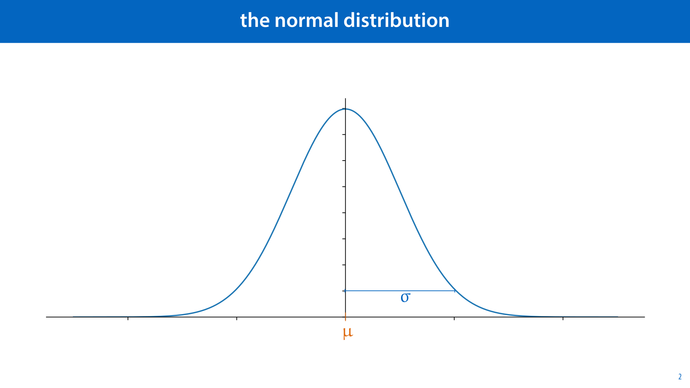

            <figcaption>
            
Here is the one dimensional normal distribution. 

One of the reasons that the normal distribution is so popular is that it has a definite <em>scale</em>. If I look at something like income distribution, the possible values cover many orders of magnitude, from 0 to billions. This is not the case with normally distributed phenomena. Take height for instance: no matter how many people I check, I will never see a person that is 5 meters tall. 

The normal distribution is a way of saying: I’m not sure about the value of x, and I can’t definitely rule any value out, but I’m almost certain it’s near this particular value. 

            </figcaption>
       </section>

       <section id="slide-003">
            <a class="slide-link" href="https://mlvu.github.io/lecture08#slide-003" title="Link to this slide.">link here</a>
            

            <figcaption>
            
This is the formula for the probability density function of the one-dimensional normal distribution.  It looks very imposing, but if you know how to interpret it, it’s actually not that complicated. Let’s first see where it came from, and then try to figure out what all the different parts mean.

            </figcaption>
       </section>

       <section id="slide-004" class="anim">
            <a class="slide-link" href="https://mlvu.github.io/lecture08#slide-004" title="Link to this slide.">link here</a>
            

            <figcaption>
            
The Normal distribution was invented, or perhaps discovered is a better word, by Carl Friedrich Gauss, undisputably one of the three greatest mathematicians in history. 

Gauss was working as an astronomer, and trying to estimate the positions and velocities from fallible measurements.  

We’ve already seen that if we have a bunch of values, such as measurements of some quantity, and if they are normally distributed, then their maximum likelihood estimate works out as the mean. Of course, this is not the order in which things were worked out historically. Taking the mean of a sequence of measurements has been done since at least the third century BC, and the Normal distribution only emerged at the end of the 18th century. 

For Gauss, the challenge was to make this derivation backwards. He knew that taking the mean of a series of measurements was an effective method of reducing measurement error. Taking the principle of maximum likelihood as a given, <strong>what kind of distribution would give rise to the mean as a maximum likelihood estimator</strong>?

            </figcaption>
            click image for animation
       </section>

       <section id="slide-005" class="anim">
            <a class="slide-link" href="https://mlvu.github.io/lecture08#slide-005" title="Link to this slide.">link here</a>
            

            <figcaption>
            
Let’s see if we can reconstruct some of his thought process. We may not have Gauss’ genius, but we do have the benefit of having taken this particular walk before in the other direction. 
<aside    >Consider this derivation as a historical exercise to see where the Normal distribution came from originally. This is a useful exercise to get comfortable with the material coming up, but if you find this hard to follow, feel free to skip it and move on. </aside>
We take the arithmetic mean as a given, together with the principle of maximum likelihood. We’ll not assume all the finer details of probability theory, since Gauss did not have access to them either. Let’s just say that μ represents the true value of something, which we are trying to measure by an imperfect process, generating a series of measurements x. There is some function f of a measurement x, in which μ is a constant that expresses how likely each x is. The large fμ(x) is, the more likely we are to see x as a measurement of μ. 

Assume that we get some measurements, and we decide to choose our guess for μ such that the product of all fμ(x) values over our series of measurements is maximal. What properties should f have for us to end up taking the mean as our guess for μ? 

We’ll start, by taking the logarithm of f. This does not change the optimum, and turns our product into a sum. It’s easier to work with and it already brings us closer to the computation of the mean.  

We know, and Gauss knew, that the derivative of our objective function is zero at the optimum. So the derivative of our objective function should be zero when μ is the mean of our observations.  

To get rid of the logarithm again, let’s say that f is simply some other function g, but exponentiated (and taking the negative). That simplifies things: the sum of the derivatives g for our observations x, should equal 0 when μ is equal to the mean. When f is large, g is small so we can think of g as an indicator of how unlikely (and hopefully bad) our measurement is. 
<aside    ></aside>
            </figcaption>
            click image for animation
       </section>

       <section id="slide-006" class="anim">
            <a class="slide-link" href="https://mlvu.github.io/lecture08#slide-006" title="Link to this slide.">link here</a>
            

            <figcaption>
            
Our job is now to take the equation describing the mean and to rewrite it so that it aligns with the equation on the left, and we can read off what the derivative of g is. 

With a little rewriting, we see that this implies that the sum of the differences between μ and the various xs, the sum of our measurement errors,  should equal one. If we make g the square of a measurement error, we see that its derivative leads to the desired question (we can freely add a constant, since we are setting the equation equal to zero. 

This means that our f function is exp(x - μ)2. And with that, we have the basic property of our distribution. It’s not a probability density, since it doesn’t sum to one, but multiplying it by a constant won’t change the minimum, so we can save that for later.

            </figcaption>
            click image for animation
       </section>

       <section id="slide-007" class="anim">
            <a class="slide-link" href="https://mlvu.github.io/lecture08#slide-007" title="Link to this slide.">link here</a>
            

            <figcaption>
            
So, if we strip away the complexity, this is the only really important part of the normal distribution. <strong>A negative exponential for the squared distance to the mean. </strong>

Everything else is adding some parameters so we can control the shape, and making sure it sums to one when we integrate.

            </figcaption>
            click image for animation
       </section>

       <section id="slide-008">
            <a class="slide-link" href="https://mlvu.github.io/lecture08#slide-008" title="Link to this slide.">link here</a>
            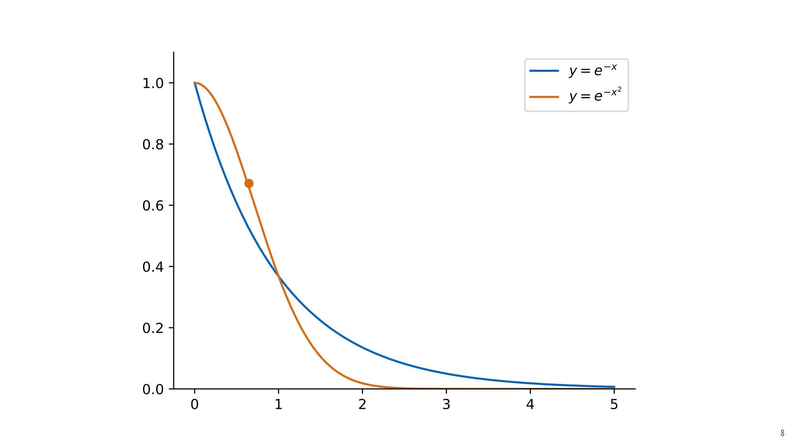

            <figcaption>
            
What does this curve look like? To illustrate, we’ll set the mean to zero for now, so that the function becomes exp(-x2) . 

Earlier, we described the normal distribution as having a <strong>definite scale</strong>. This means that we first need to make outliers incredibly unlikely. An exponentially decaying function like exp(-x) gives us that property. Each step of size 1 we take to the right more than halves the probability density. After seven steps it’s one thousandth of where we started, after fourteen steps one millionth, and after twenty-one steps one-billionth. 

Taking the negative exponential of the <em>square</em>, as our function exp(-x2)  does, results in an even stronger decay, and it has two more benefits.  
<aside    >Incidentally, if you follow Gauss’ logic for the <strong>median</strong> rather than the mean, you’ll see that the corresponding distribution follows the blue line in this picture (the so called<a href="https://en.wikipedia.org/wiki/Laplace_distribution"><strong class="blue"> Laplace distribution</strong></a>). This fits our intuition that when our data doesn’t have a definite scale (like wealth), we should use the median rather than the mean. It also shows, however, that even with the median there is still some assumption of scale: outliers are still exponentially unlikely and we know where to expect samples. To model concepts like wealth properly, we need a <a href="https://en.wikipedia.org/wiki/Power_law"><strong class="blue">power law distribution</strong></a>. Such distributions are sometimes called scale-free. They truly have no scale, and there is no value like a mean or a median that tells us where we are most likely to find a sample.</aside><aside    ></aside>
            </figcaption>
       </section>

       <section id="slide-009">
            <a class="slide-link" href="https://mlvu.github.io/lecture08#slide-009" title="Link to this slide.">link here</a>
            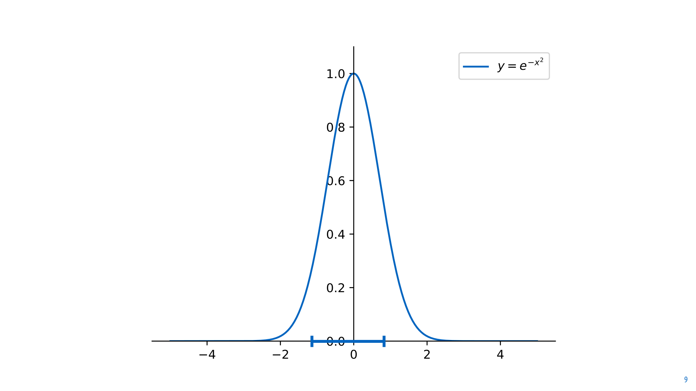

            <figcaption>
            
The first benefit is that the the function flattens out at the peak, giving us a nice bell-shaped curve, where exp(-x) instead has an ugly discontinuity at the top (if we make it symmetric). 

The second benefit is that it has an <strong>inflection point</strong>: the point (around 0.7) where the curve moves from decaying with <em>increasing</em> speed to decaying with <em>decreasing</em> speed. We can take this as a point of reference on the curve: to the left of this point, the curve looks fundamentally different than to the right of it. With the exponential decay, the function keeps looking the same as we move from left to right, every seven steps we take, the density halves. With the squared exponential decay, there is a place where the function keeps dropping ever more<em> quickly</em>, and a place where it starts dropping ever more <em>slowly</em>. We can use this to, as it were, decide where we are on the graph.  

The two inflection points are natural choices for the<strong> range </strong>bounding the “characteristic” scale of this distribution. The range of outcomes which we can reasonably expect. This is a little subjective: any outcome is possible, and the characteristic scale depends on what we’re willing to call unlikely. But given the subjectivity, the inflection points are as good a choice as anything. 

            </figcaption>
       </section>

       <section id="slide-010">
            <a class="slide-link" href="https://mlvu.github.io/lecture08#slide-010" title="Link to this slide.">link here</a>
            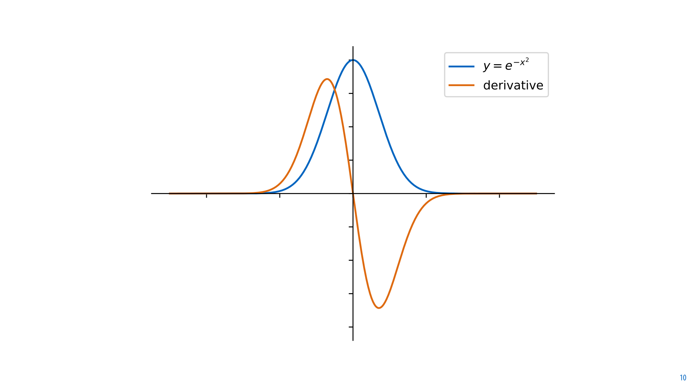

            <figcaption>
            
The inflection points are the peaks of the derivative of exp(-x2). 
<aside    >This makes sense if we think of the derivative as the rate of change. When the curve is increasing the derivative is positive and when its decreasing the derivative is negative. When the curve is increasing with increasing speed, the derivative is increasing, and when the curve is increasing with decreasing speed, the derivative is decreasing. The change between these two states is the inflection point where the derivative is neither increasing nor decreasing.</aside><aside    ></aside>
            </figcaption>
       </section>

       <section id="slide-011">
            <a class="slide-link" href="https://mlvu.github.io/lecture08#slide-011" title="Link to this slide.">link here</a>
            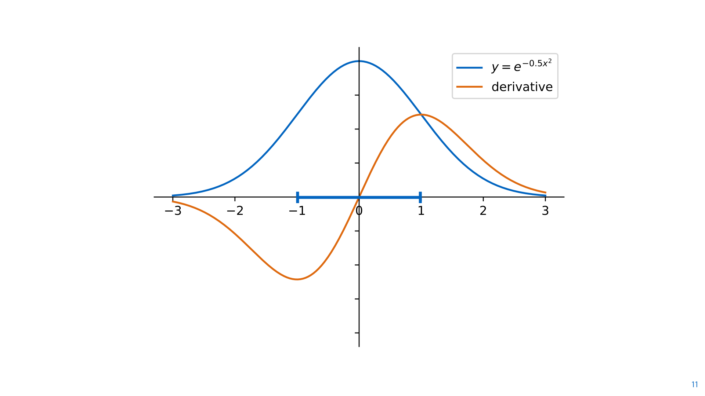

            <figcaption>
            
If we add a 0.5 multiplier to the inputs, the inflection points hit -1 and 1 exactly. This gives us a curve for which the characteristic scale is [-1, 1], which seems like a useful starting point (we can rescale this later to any range we require). 
<aside    >Additionally, when we now derive the maximum likelihood estimator for the mean, the exponent 2 will cancel out against this one half, which means we don’t even need to introduce the constant 2 multiplier when we derive the basic shape of the Gaussian.</aside><aside    ></aside>
            </figcaption>
       </section>

       <section id="slide-012" class="anim">
            <a class="slide-link" href="https://mlvu.github.io/lecture08#slide-012" title="Link to this slide.">link here</a>
            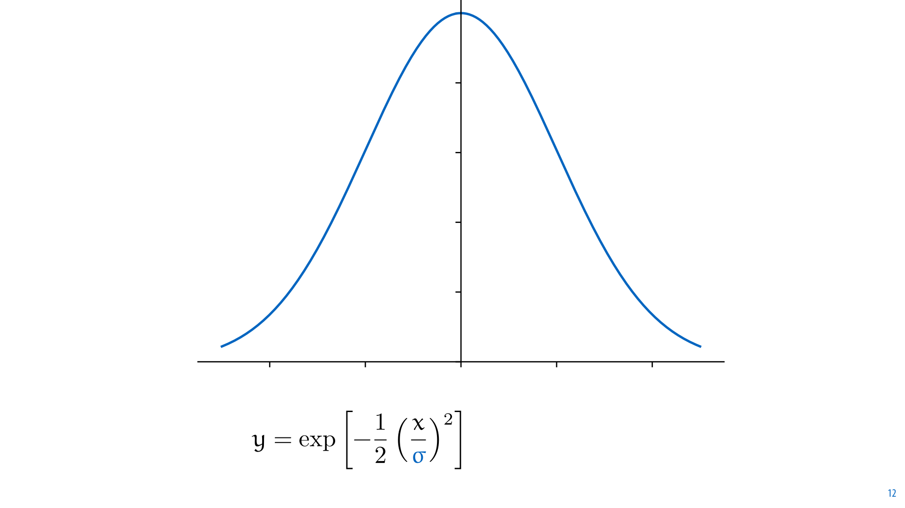

            <figcaption>
            
To change the scale, we add a parameter σ. This will end up representing the the <strong>standard deviation</strong>, but for now, we can just think of it as a way to make the bell wider or narrower. 

The square of the standard deviation is the variance. Either can be used as a parameter.

            </figcaption>
            click image for animation
       </section>

       <section id="slide-013">
            <a class="slide-link" href="https://mlvu.github.io/lecture08#slide-013" title="Link to this slide.">link here</a>
            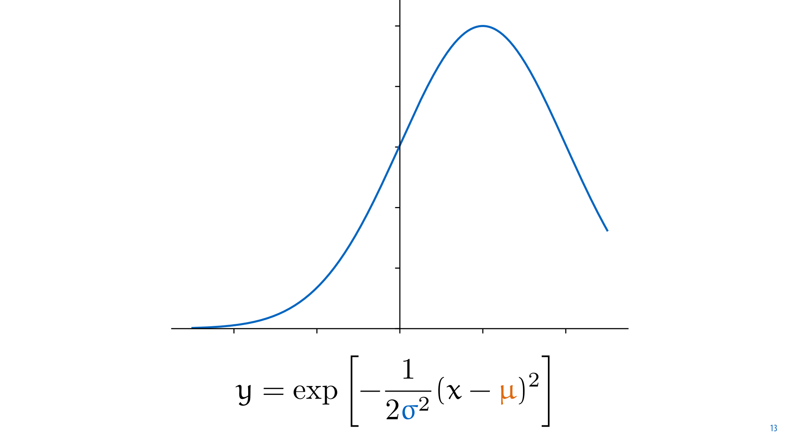

            <figcaption>
            
We can now add the mean back in, with parameter μ. This shifts the center of the bell forward or backward to coincide without the desired mean. 
<aside    >Note that shifting a curve forward by μ points is the same as shifting the coordinates backward by μ points. Likewise, we can think of the multiplication by σ as keeping the curve the same, but just drawing the ticks on the horizontal axis closer together or further apart.</aside><aside    ></aside>
            </figcaption>
       </section>

       <section id="slide-014" class="anim">
            <a class="slide-link" href="https://mlvu.github.io/lecture08#slide-014" title="Link to this slide.">link here</a>
            

            <figcaption>
            
Finally, to make this a  proper probability density function, we need to make sure the area under the curve sums to one. 

This is done by integrating over the whole real number line. If the result is Z, we divide the function at every point by Z. This gives us a function that sums to 1 over the whole of its domain. For this function, it turns out that integrating results in an area equal to the square of two times π times the variance. 
<aside    >Don't be confused by the complicated looking mulitplier. The trick here is simple. If you multiply a function by 0.5 at every point, then it integrates to half of what it did before. If the squared exponential integrates to Z before we normalize, then mulitplying it by 1/Z ensure that it integrates to 1. It just so happens that Z = sqrt(2πσ2) in this case.</aside><aside    ></aside>
            </figcaption>
            click image for animation
       </section>

       <section id="slide-015">
            <a class="slide-link" href="https://mlvu.github.io/lecture08#slide-015" title="Link to this slide.">link here</a>
            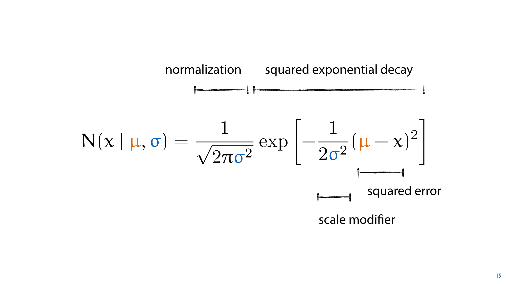

            <figcaption>
            
So that’s what the different parts of the normal distribution do. 

Imagine that we are trying to measure some true value μ, like the height of the average Dutch woman. If we pick a random person and measure them, we'll get a value that is probably near μ, and the values that are nearer μ are more likely, but all values have some probability. 

The formula for the normal distribution says that the probability that we measure the value x, depends primaly on the distance between the true value μ and x, our "measurement error". The likelihood of seeing x scales with squared exponential decay. The variance functions to scale the range of likely values. 

Everything before the exponential is just there as a multiplier for the likelihood so that it integrates to 1 over its whole domain.

            </figcaption>
       </section>

       <section id="slide-016">
            <a class="slide-link" href="https://mlvu.github.io/lecture08#slide-016" title="Link to this slide.">link here</a>
            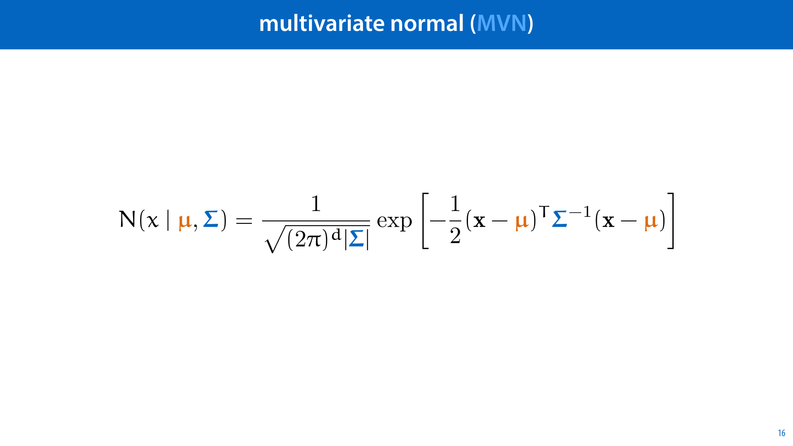

            <figcaption>
            
We can do the same thing in multiple dimensions. This gives us the <strong>multivariate normal distribution</strong>. We’ll quickly run through how the different parts generalize to higher dimensions.

            </figcaption>
       </section>

       <section id="slide-017">
            <a class="slide-link" href="https://mlvu.github.io/lecture08#slide-017" title="Link to this slide.">link here</a>
            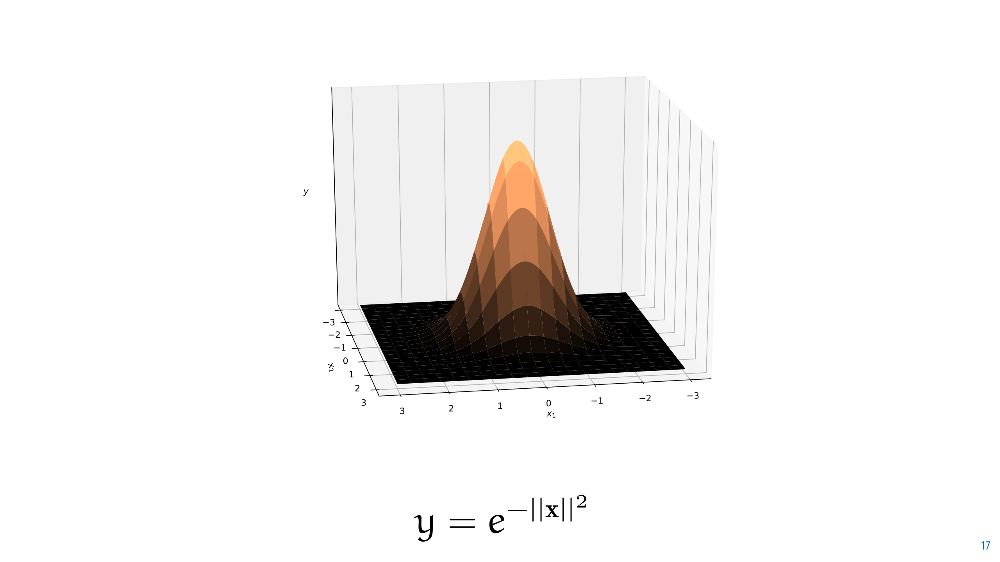

            <figcaption>
            
We start by defining a curve that decays squared-exponentially<em> in all directions</em>. Think of this as spinning our original function around the origin. To determine how likely a given point <strong>x</strong> is, we take the distance between <strong>x </strong>and the origin, and take the negative exponential of that value squared as the likelihood. 

The inflection points now become a kind of “inflection circle”, where the derivative peaks. Inside this circle lie the most likely outcomes for our distribution. This circle is a <strong>contour line </strong>on the normal distribution.

            </figcaption>
       </section>

       <section id="slide-018">
            <a class="slide-link" href="https://mlvu.github.io/lecture08#slide-018" title="Link to this slide.">link here</a>
            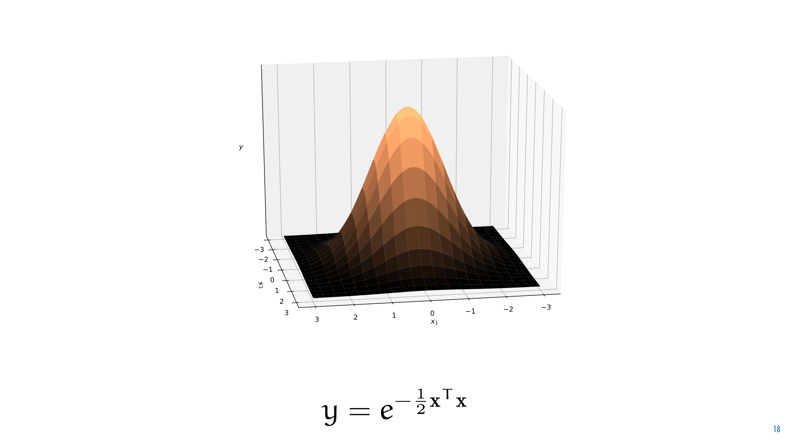

            <figcaption>
            
To give the inflection circle radius 1, we rescale the exponent, as we did before before. 

We also note that the square of the norm in the previous slide is equal to the dot product of <strong>x</strong> with itself, so we write that instead.

            </figcaption>
       </section>

       <section id="slide-019">
            <a class="slide-link" href="https://mlvu.github.io/lecture08#slide-019" title="Link to this slide.">link here</a>
            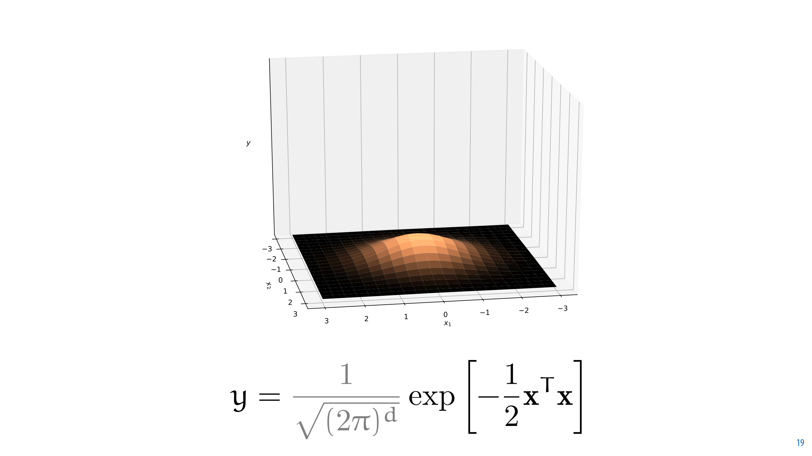

            <figcaption>
            
This time we’ll normalize first, and then introduce the parameters. 

This function is the probability density function of the <em>standard</em><strong> MVN</strong> (zero mean, and variance one in every direction).  

To define add parameters to this distribution for the mean and scale we’ll use a special trick. We’ll start with this distribution, <strong>and apply a linear transformation</strong>. We’ll see that the parameters of the linear transformation then become the parameters of the resulting multivariate normal.  

            </figcaption>
       </section>

       <section id="slide-020">
            <a class="slide-link" href="https://mlvu.github.io/lecture08#slide-020" title="Link to this slide.">link here</a>
            

            <figcaption>
            
Here’s the formal way of doing that. Imagine that we sample a point X from the standard normal distribution. We then transform that point by a linear transformation defined by matrix <strong>A</strong> and vector <strong>t</strong>, resulting in a vector Y.  

All this put together is a random process that generates a random variable Y. Whatis the density function that defines our probability on Y?

            </figcaption>
       </section>

       <section id="slide-021" class="anim">
            <a class="slide-link" href="https://mlvu.github.io/lecture08#slide-021" title="Link to this slide.">link here</a>
            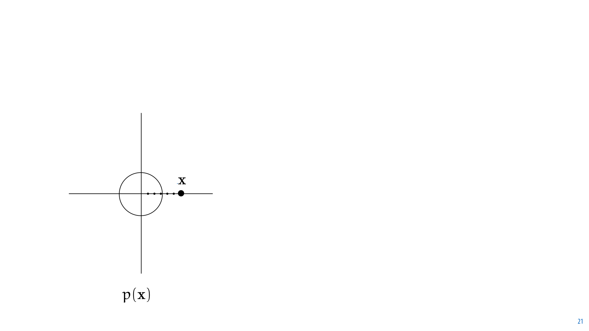

            <figcaption>
            
If we transform a sample <strong>x</strong> from the standard normal distribution into a sample <strong>y</strong>, we get a new distribution, with a new mean, and our inflection circle becomes an inflection ellipse (because a circle becomes an ellipse under a linear transformation).  

The trick is to tray and reverse the process. Say we pick a point <strong>y</strong> somewhere on the right. What’s the probability density for seeing that point after the transformation? 

Consider that the probability of ending up inside the inflection circle on the left must be the same as the probability of ending up inside the ellipse on the right. And this is true for any contour line we draw: we get a circle on the left, and an ellipse of the right, and the probabilities for both must be the same. 

This suggests that if we pick a point <strong>y</strong> on the right, and we want to know its density, we can reverse the transformation, to give us <strong>the equivalent point x on the left</strong>. The density of that point under p(<strong>x</strong>), the standard normal distribution, must be related to the density of <strong>y</strong> under q(<strong>y</strong>). In fact, it turns out that q(<strong>y</strong>) is proportional to the density of the reverse-transformed point.  

The only thing we need to correct for, is the fact that the matrix A shrinks or inflates the bell curve, so that the volume below it does not integrate to 1 anymore. From linear algebra we know that the amount by which a matrix inflates space is expressed by its <em>determinant</em>. So, if we divide the resulting density by the determinant, we find a properly normalized density. 
<aside    >This trick is a simple case of integration by substitution <a href="https://en.wikipedia.org/wiki/Integration_by_substitution#Application_in_probability"><strong class="blue">https://en.wikipedia.org/wiki/Integration_by_substitution#Application_in_probability</strong></a> In the context of probability it is also called the Change of Variable Theorem. </aside>
When dealing with Normal distributions it can be very helpful to think of them as linear transformations of the standard normal distribution. 

            </figcaption>
            click image for animation
       </section>

       <section id="slide-022" class="anim">
            <a class="slide-link" href="https://mlvu.github.io/lecture08#slide-022" title="Link to this slide.">link here</a>
            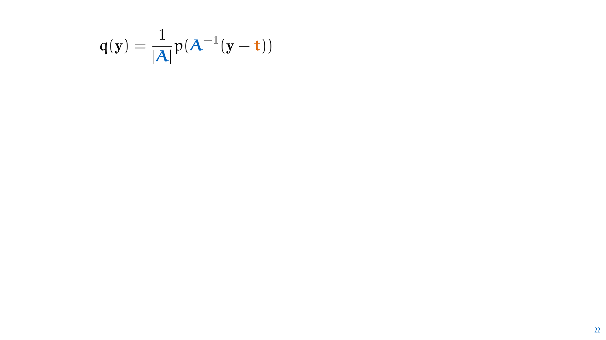

            <figcaption>
            
Here is the mathematics of what we described in the previous slide applied to the normal distribution. p(x) is the density function of the standard multivariate normal, and q(y) is the density of that distribution transformed by affine transformation <strong class="blue">A</strong><strong>x</strong> +<strong class="orange">t</strong>. 

by the logic in the previous slide, we can take the density of <strong class="blue">A</strong>-1(<strong>y</strong>-<strong class="orange">t</strong>) under the standard normal as the basis for the density of <strong>y</strong> under q . We set mu equal to t. Using the basic properties of the determinant, the transpose and the inverse (you can look these up on wikipedia if your linear algebra is rusty), we can rewrite the result to the pdf we expect.

            </figcaption>
            click image for animation
       </section>

       <section id="slide-023">
            <a class="slide-link" href="https://mlvu.github.io/lecture08#slide-023" title="Link to this slide.">link here</a>
            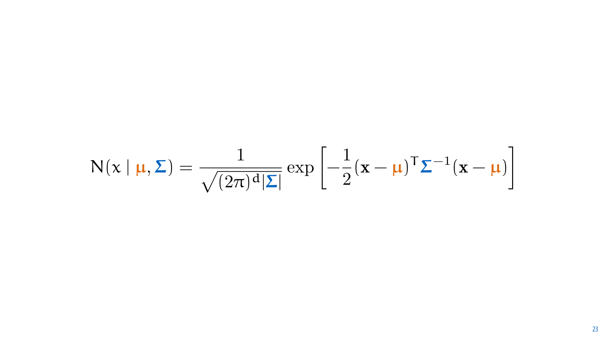

            <figcaption>
            
Here is the final functional form in terms of the mean and the covariance matrix.

            </figcaption>
       </section>

       <section id="slide-024">
            <a class="slide-link" href="https://mlvu.github.io/lecture08#slide-024" title="Link to this slide.">link here</a>
            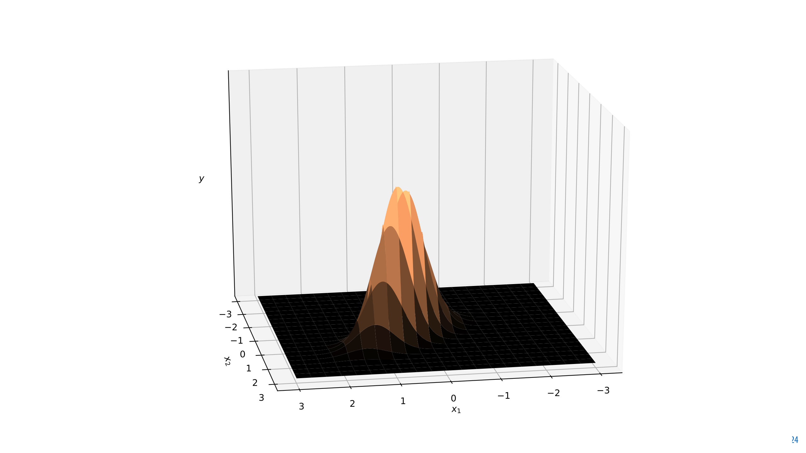

            <figcaption>
            

            </figcaption>
       </section>

       <section id="slide-025" class="anim">
            <a class="slide-link" href="https://mlvu.github.io/lecture08#slide-025" title="Link to this slide.">link here</a>
            

            <figcaption>
            
One benefit of the transformation approach we used, is that it’s now very easy to work out how to <strong>sample from an MVN</strong>. We can take the following approach.  

We’ll take sampling form a univariate standard normal as given, and assume that we have some function that will do this for us. 
<aside    >This is usually done by an algorithm called the Box-Muller transform, if you’re interested. </aside>
We can transform a sample from the standard normal distribution into a sample from a distribution with given mean and variance as shown above. 

We can then sample from the d-dimensional standard MVN by stacking d samples from the univariate normal in a vector. 

We can then transform this to a sample from an MVN with any given mean and covariance matrix by finding A and transforming as appropriate.

            </figcaption>
            click image for animation
       </section>

       <section id="slide-026">
            <a class="slide-link" href="https://mlvu.github.io/lecture08#slide-026" title="Link to this slide.">link here</a>
            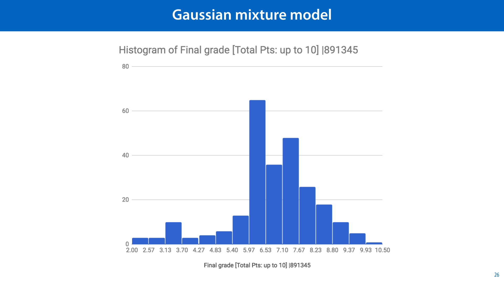

            <figcaption>
            
Finally, we'll take a look at what happens when a single Gaussian isn't enough. 

Here is the grade distribution for this course from a few years ago. It doesn’t look very normally distributed (unless you squint a lot). The main reason it doesn't look normally distributed, is because it has multiple peaks, known as <strong>modes</strong>. This often happens when your population consists of a small number of clusters, each with their own (normal) distribution. This data seems to have a multi-modal distribution: one with multiple separate peaks. 

In this year, the student population was mainly made up of two programs. We can imagine that students from one program found the course more more difficult than students from the other program giving us the two peaks above 5.5, and that the peak around 3.5 was that of students who only partially finished the course. This gives us three sub-populations, each with their own normal distribution.  

The problem is, we observe only the grades, and we can’t tell which population a student is in.Even in the high-scoring group we should expect <em>some</em> students to fail. 

We can describe this distribution with a <em>mixture</em> of several normal distributions. This is called a <strong>Gaussian mixture model</strong>. 
<aside    >These days the student population consists of many more programs and background, so the grade distribution looks more normal.</aside><aside    ></aside>
            </figcaption>
       </section>

       <section id="slide-027">
            <a class="slide-link" href="https://mlvu.github.io/lecture08#slide-027" title="Link to this slide.">link here</a>
            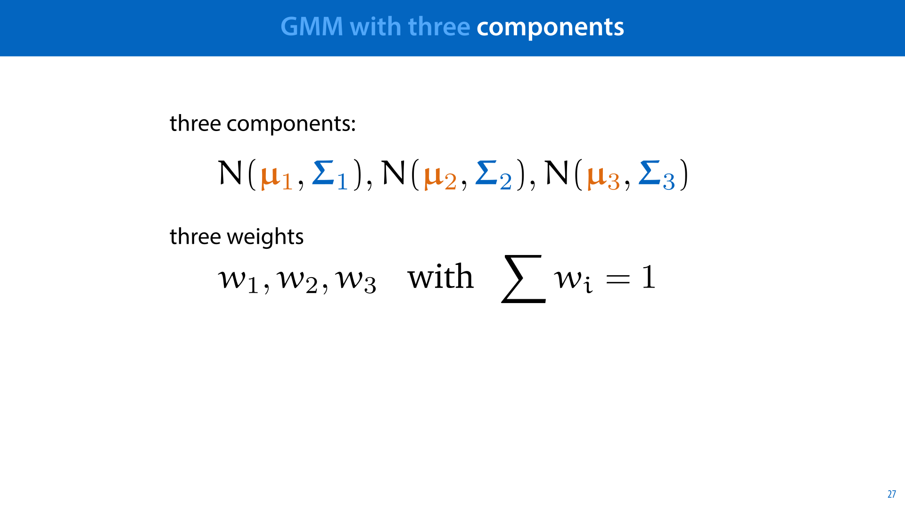

            <figcaption>
            
Here is how to define a mixture model. We define three separate normal distributions, each with their own parameters. We’ll call these<strong> components</strong>. 

In addition, we also define <strong>three weights</strong>, which we require to sum to one. These indicate the relative contributions of the components to the total. In our example, these would be the sizes of the three subpopulations of students, relative to the total. 

To sample from this distribution, we pick one of the components according to the weights, and then sample a point from that component. 

            </figcaption>
       </section>

       <section id="slide-028">
            <a class="slide-link" href="https://mlvu.github.io/lecture08#slide-028" title="Link to this slide.">link here</a>
            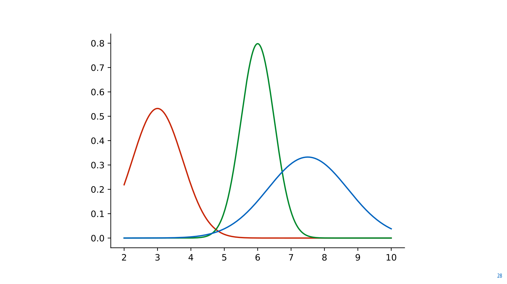

            <figcaption>
            
Here’s three components that might broadly correspond to what we saw in the grade histogram. 
<aside    >We'll see some examples in higher dimensionalities later.</aside><aside    ></aside>
            </figcaption>
       </section>

       <section id="slide-029" class="anim">
            <a class="slide-link" href="https://mlvu.github.io/lecture08#slide-029" title="Link to this slide.">link here</a>
            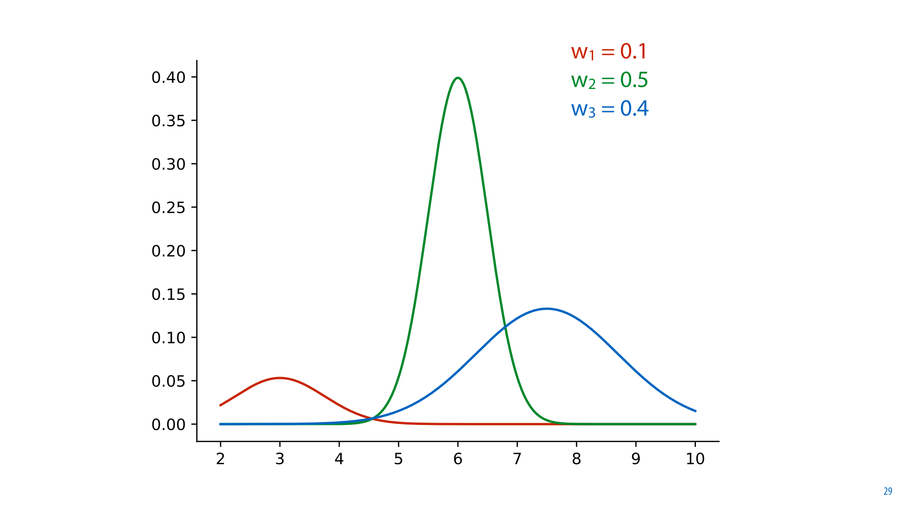

            <figcaption>
            
We scale each by their component weight. Since the areas under these curves each were 1 before we multiplied by the weights, they are now 0.1, 0.5 and 0.4 respectively.  

That means that if we sum these functions, the result is a combined function with an area under the curve of exactly 1: a new probability density with mulitple peaks.

            </figcaption>
            click image for animation
       </section>

       <section id="slide-030">
            <a class="slide-link" href="https://mlvu.github.io/lecture08#slide-030" title="Link to this slide.">link here</a>
            

            <figcaption>
            
That looks like this. For each x we observe, each component could be responsible for producing that x, but the different components have different probabilities of being <strong>responsible </strong>for each x. 

            </figcaption>
       </section>

       <section id="slide-031" class="anim">
            <a class="slide-link" href="https://mlvu.github.io/lecture08#slide-031" title="Link to this slide.">link here</a>
            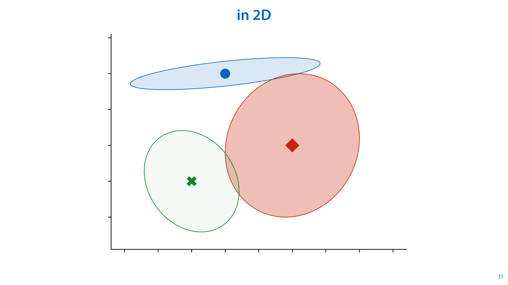

            <figcaption>
            
Here's what that looks like with multivariate normal distributions. The markers indicate the means of each component, and the ellipses indicate contour lines on the density function (corresponding to two standard deviations on the standard normal distribution). 

After we sample from this distribution, we get a set of points that is decidedly non-normal as a whole. Here, we've indicated by color and shape which component each point came from. That way, if we look at just the blue discs, we can see that these do form a normally distributed point cloud.  

The problem is that we don't normally do things this way round. All we get is the points: we are not told which components they came from. Our job is twofold: to figure out which component each point belongs to, and to figure out the parameters of the normal distribution describing that component. 
<aside    >Of course this is normally complicated by the fact that the assumption that our data came from a GMM is just that: an assumption. For now, we will just assume that this is a reasonable assumption, and that we've correctly guessed the number of components. If we can fit the model under those assumptions, we can deal with the rest by trial and error. </aside><aside    ></aside>
            </figcaption>
            click image for animation
       </section>

       <section class="video" id="video-031">
           <a class="slide-link" href="https://mlvu.github.io/lecture08#video-31">link here</a>
           <iframe
                src="https://www.youtube.com/embed/RuiHSxtb1w?modestbranding=1&showinfo=0&rel=0"
                title="YouTube video player"
                frameborder="0" allow="accelerometer; autoplay; clipboard-write; encrypted-media; gyroscope; picture-in-picture"
                allowfullscreen>
           </iframe>

       </section>

       <section id="slide-032">
            <a class="slide-link" href="https://mlvu.github.io/lecture08#slide-032" title="Link to this slide.">link here</a>
            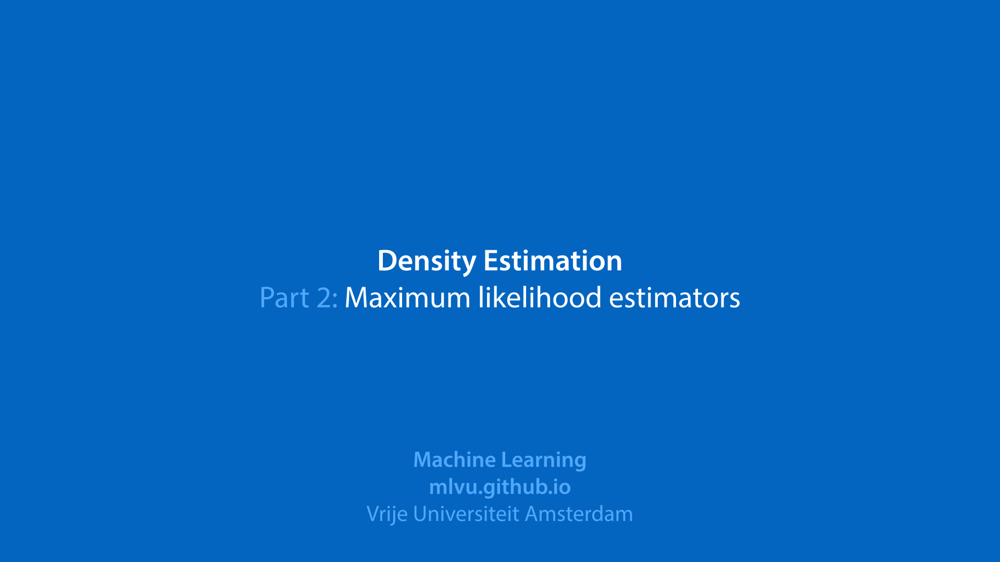

            <figcaption>
            
Now that we have a better understanding of why the normal distribution looks the way it does, let’s have another look at fitting one to our data. 

For all the examples in this video, we will use the principle of <strong>maximum likelihood</strong>. We will aim to find the parameters (mean and variance) for whih the probability of the observed data is maximal. 
<aside    >This lecture is a little heavy in algebraic derivations, and a little light in intuition and examples. This is unavoidable. You should have the intuition for what a maximum likelihood estimator is already, and the rest is really nothing more but calculus and algebra. If you have trouble making it through this one, go back to the lecture on <a href="https://mlvu.github.io/lecture04/"><strong class="blue">probabilistic models</strong></a> and make sure you understand what maximum likelihood estimation is. Then, try to pick one of the derivations, and go through it slowly, step by step. </aside>
<lnbr></lnbr>

            </figcaption>
       </section>

       <section id="slide-033">
            <a class="slide-link" href="https://mlvu.github.io/lecture08#slide-033" title="Link to this slide.">link here</a>
            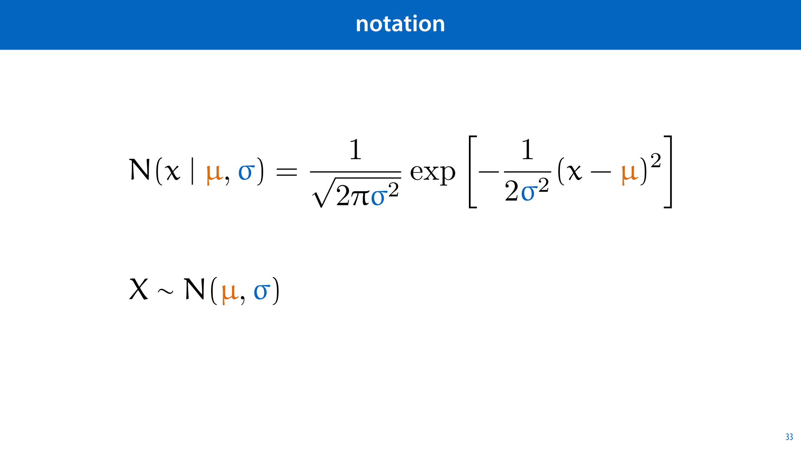

            <figcaption>
            

            </figcaption>
       </section>

       <section id="slide-034">
            <a class="slide-link" href="https://mlvu.github.io/lecture08#slide-034" title="Link to this slide.">link here</a>
            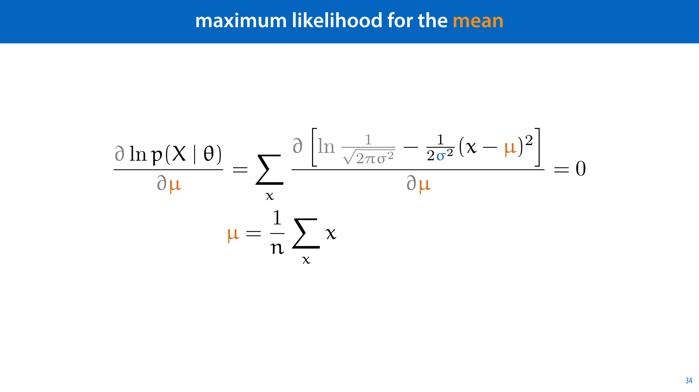

            <figcaption>
            
We’ve seen the maximum likehood estimator μ already. It’s the <strong>arithmetic mean</strong>. In fact, as we saw in the last video, this estimator was widely used for thousands of years before Gauss worked out the distribution for which is a maximum likelihood estimator.

            </figcaption>
       </section>

       <section id="slide-035" class="anim">
            <a class="slide-link" href="https://mlvu.github.io/lecture08#slide-035" title="Link to this slide.">link here</a>
            

            <figcaption>
            
For the sake of completeness, let’s work out the maximum likelihood estimator for the variance/standard deviation

            </figcaption>
            click image for animation
       </section>

       <section id="slide-036" class="anim">
            <a class="slide-link" href="https://mlvu.github.io/lecture08#slide-036" title="Link to this slide.">link here</a>
            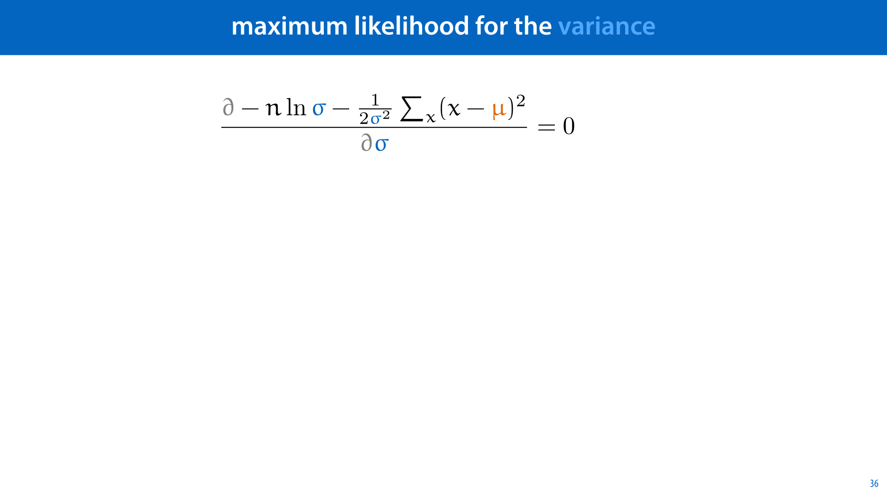

            <figcaption>
            
This is the maximum likelihood estimator for the variance. Taking the square on both sides gives us the estimator for the standard deviation. 

Note that it turns out that this estimator is biased: if we repeatedly sammple a dataset and compute the variance, our average error in the estimate doesn’t go to zero.  

For an unbiased estimator, we need to divide by n-1 instead. For large data, the difference has minimal impact.

            </figcaption>
            click image for animation
       </section>

       <section id="slide-037">
            <a class="slide-link" href="https://mlvu.github.io/lecture08#slide-037" title="Link to this slide.">link here</a>
            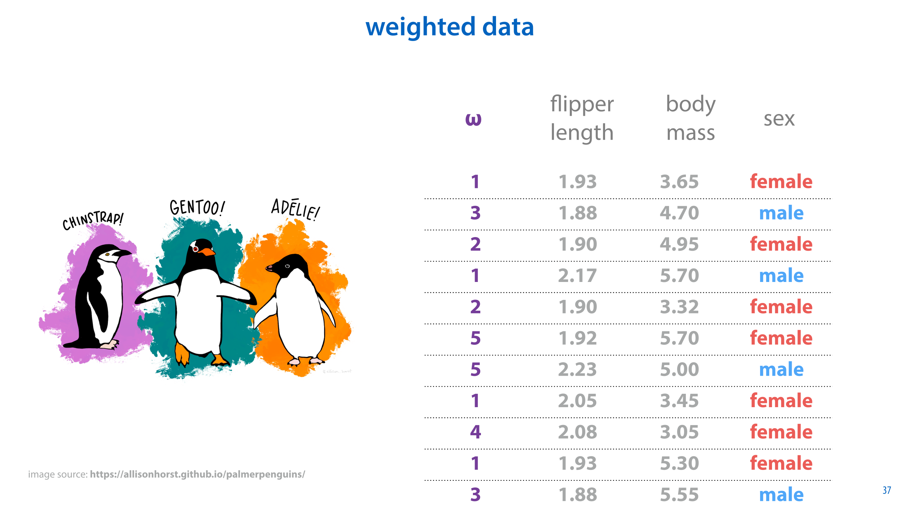

            <figcaption>
            
Sometimes we have a <strong>weighted</strong> dataset. For instance, we might trust some measurements more than others, and so downweight the ones we distrust in order to get a more appropriate model.  

For instance, in this example, we could imagine that some penguins struggled more than other as we were trying to measure them, and so we estimate how accurate we think the measurement is with a grade between 0 and 5. 

Normally, there is no upper bound to the weights, but we will usually assume that the weights are always positive and that they are<strong> proportional</strong>. That is, an instance with a weight of 5 counts five times as heavily as an instance with a weight of 1. The weights do not need to be integers. 
<aside    >We’ll see dataset weights crop up later in this lecture, and also in future lectures. </aside><aside    ></aside>
            </figcaption>
       </section>

       <section id="slide-038" class="anim">
            <a class="slide-link" href="https://mlvu.github.io/lecture08#slide-038" title="Link to this slide.">link here</a>
            

            <figcaption>
            
For weighted datasets, we can easily define a weighted maximum likelihood objective. We minimize the log likelihood as before, but we assign each term (that is, the log probability of each instance) a positive weight and maximize the weighted sum instead of the plain sum. 

For the normal distributions, the weighted maximum likelihood estimators are what you’d expect: the same as for the unweighted case, except the sum becomes a weighted sum, and we divide by the sum of the weights, instead of by n. 

If we set all the weights to 1 (or to any other positive constant), we recover the orginal maximum likelihood estimators. 
<aside    >Note that if the weights are all positive integers, we can see that these estimators correspond to simply repeating each instance according to its weight. That is, we can make an unweighted dataset where an instance with weight 3 occurs 3 times. The estimators for the unweighted data coincide exactly with these estimators for the weighted data.</aside><aside    ></aside>
            </figcaption>
            click image for animation
       </section>

       <section id="slide-039">
            <a class="slide-link" href="https://mlvu.github.io/lecture08#slide-039" title="Link to this slide.">link here</a>
            

            <figcaption>
            
We first encountered the<strong> principle of least squares</strong>, not in the context of descriptive statistics like the mean and the standard deviation, but in the context of <strong>regression</strong>. 

Since we've now seen the close relationship between the squared error and the normal distribution, you may ask whether this means that there is a normal distribution hiding somewhere in our model when we fit a line using the least squares objective.

            </figcaption>
       </section>

       <section id="slide-040">
            <a class="slide-link" href="https://mlvu.github.io/lecture08#slide-040" title="Link to this slide.">link here</a>
            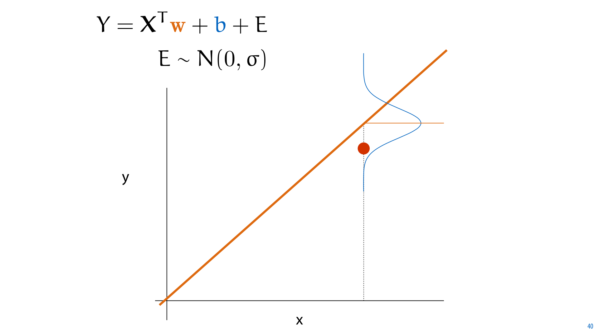

            <figcaption>
            
And indeed there is. When we fit a line using the least squares loss, we are implicitly assuming a model with noise. That noise, we are assuming to be normally distributed. 

For a linear model, it works like this: we assume that our features were generated by some random process, which we don’t know the details of. Somehow a random variable X was sampled. This sample was then transformed by a linear function, parametrized by (<strong class="orange">w</strong>, b), and to the result of that, a scalar E of normally distributed random noise was added (zero mean, with some variance). 

We don’t know the distribution that generated X and we don’t know the variance on the noise distribution. As it turns out, we can estimate  <strong class="orange">w </strong>and b without knowing these.

            </figcaption>
       </section>

       <section id="slide-041" class="anim">
            <a class="slide-link" href="https://mlvu.github.io/lecture08#slide-041" title="Link to this slide.">link here</a>
            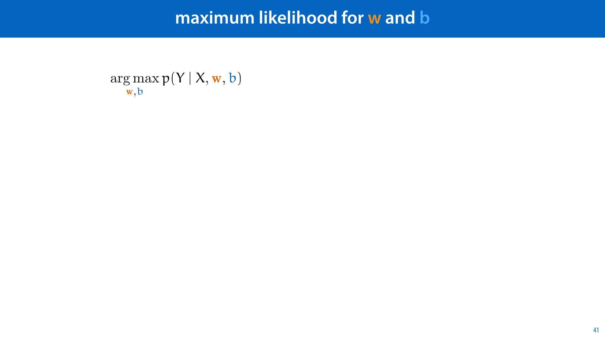

            <figcaption>
            
As we can see here, all elements from the normal distribution disappear except the square difference between the predicted output and the actual output, and the objective reduces to least squares. 

            </figcaption>
            click image for animation
       </section>

       <section id="slide-042" class="anim">
            <a class="slide-link" href="https://mlvu.github.io/lecture08#slide-042" title="Link to this slide.">link here</a>
            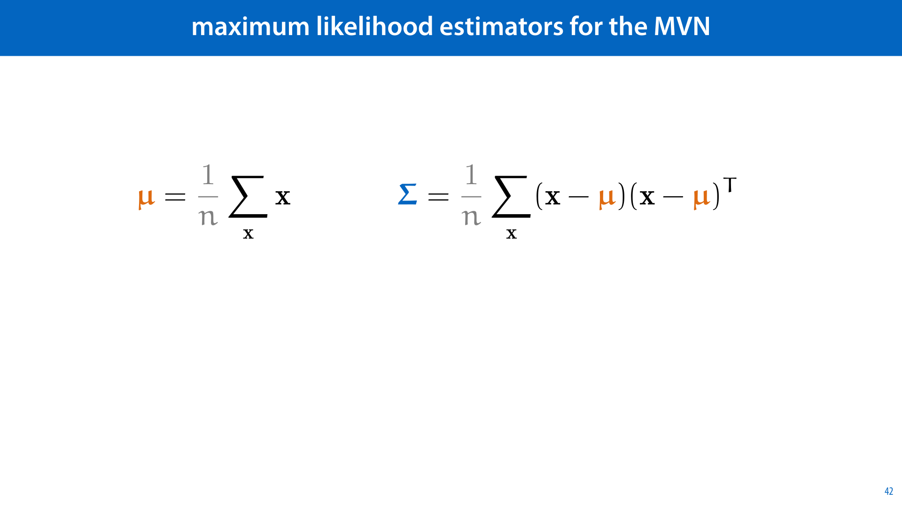

            <figcaption>
            
For the multivariate normal distribution, these are the maximum likelihood estimators. 

The same things we said for the univariate case hold here. The estimator for the covariance requires a correction if you need unbiased estimates. 

For weighted data, the sum again becomes a weighted sum, and the normalization is by the sum of the weights.

            </figcaption>
            click image for animation
       </section>

       <section id="slide-043">
            <a class="slide-link" href="https://mlvu.github.io/lecture08#slide-043" title="Link to this slide.">link here</a>
            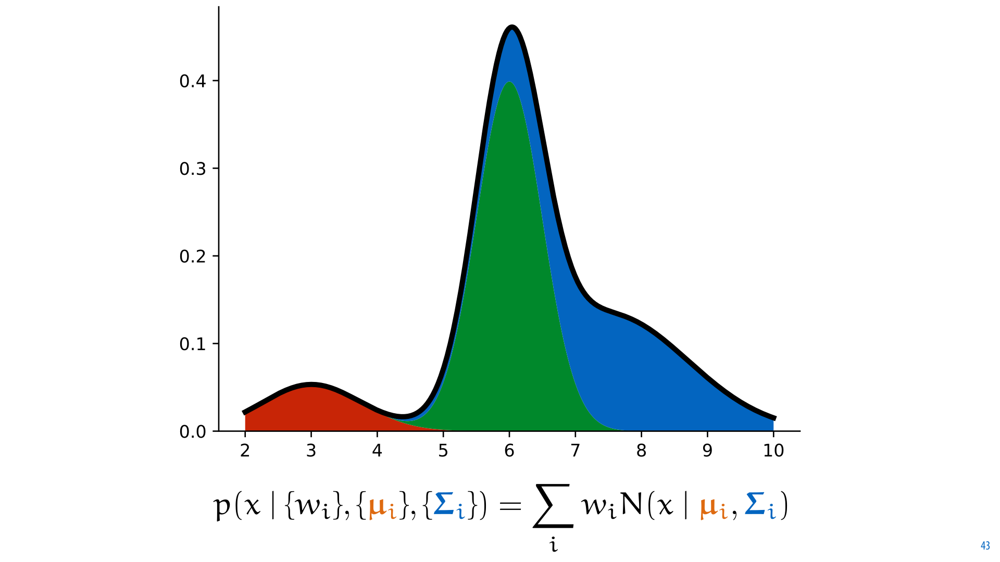

            <figcaption>
            
Finally, let’s look at the last of our modelsfrom the previous video: the Gaussian mixture model. What happens when we try to define the maximum likelhood objective for this model?

            </figcaption>
       </section>

       <section id="slide-044">
            <a class="slide-link" href="https://mlvu.github.io/lecture08#slide-044" title="Link to this slide.">link here</a>
            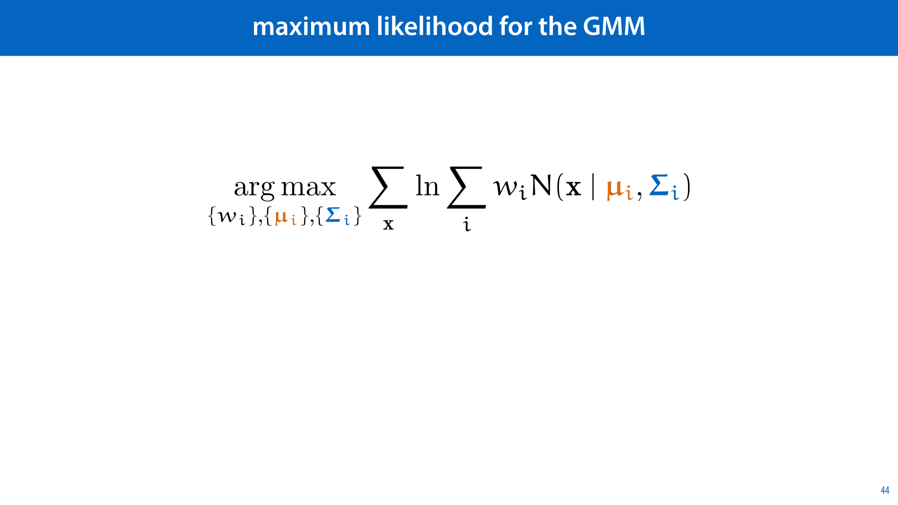

            <figcaption>
            
Here we face a problem: there’s a sum inside a logarithm. We can’t work the sum out of the logarithm, which means we won’t get a nice formulation of the derivative. We can do it anyway, and solve by gradient descent, we can even use backpropagation, so we only have to work out local derivatives, but what we’ll never get,is a functional form for the derivative that we can set equal to zero and solve analytically. 

After the break we’ll discuss the <strong>EM algorithm</strong>, which does’t give us an analytical solution, but it does allow us to use the tricks we’ve seen in this video, to help us fit a model. 

            </figcaption>
       </section>

       <section class="video" id="video-044">
           <a class="slide-link" href="https://mlvu.github.io/lecture08#video-44">link here</a>
           <iframe
                src="https://www.youtube.com/embed/Co3xlK2d_oI?modestbranding=1&showinfo=0&rel=0"
                title="YouTube video player"
                frameborder="0" allow="accelerometer; autoplay; clipboard-write; encrypted-media; gyroscope; picture-in-picture"
                allowfullscreen>
           </iframe>

       </section>

       <section id="slide-045">
            <a class="slide-link" href="https://mlvu.github.io/lecture08#slide-045" title="Link to this slide.">link here</a>
            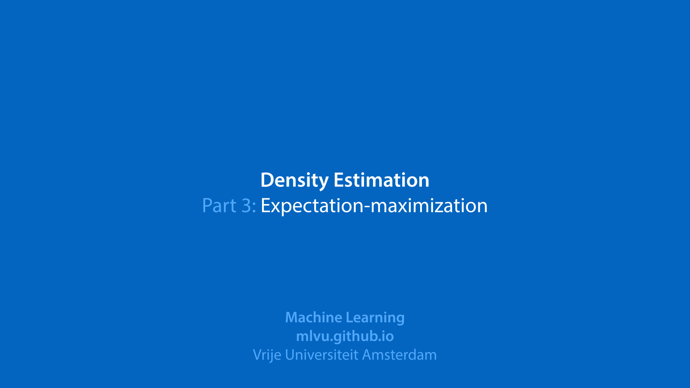

            <figcaption>
            
<lnbr></lnbr>

            </figcaption>
       </section>

       <section id="slide-046">
            <a class="slide-link" href="https://mlvu.github.io/lecture08#slide-046" title="Link to this slide.">link here</a>
            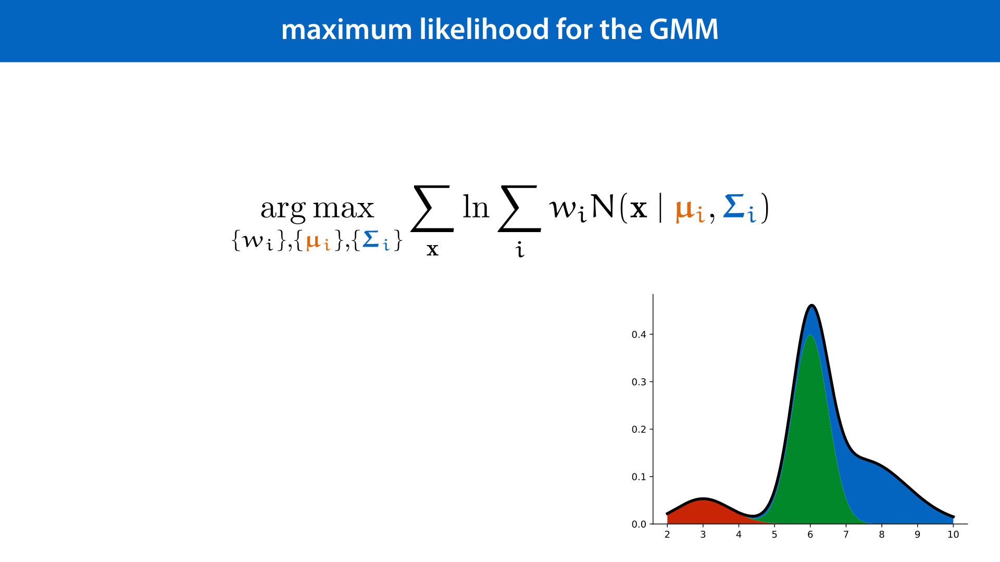

            <figcaption>
            
This is the problem that we'll deal with in this video and the next. How do we find the maximum likelihood fit for the Gaussian mixture model? The solution that we've been using so far: take the derivative and set it equal to zero, no longer works here. We can take the derivative of this function, but the result is quite complex, and setting it equal to zero doesn't give us a neat solution for the parameters.  
<aside    >We can still solve the problem using gradient descent with the complicated derivatives, or using backpropagation, but in this video, we will investigate a different approach.</aside><aside    ></aside>
            </figcaption>
       </section>

       <section id="slide-047">
            <a class="slide-link" href="https://mlvu.github.io/lecture08#slide-047" title="Link to this slide.">link here</a>
            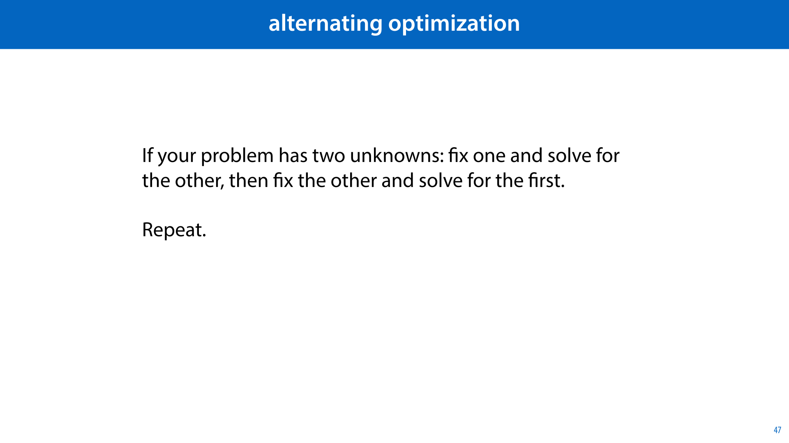

            <figcaption>
            
The EM algorithm, which we'll develop in this part, is an instance of alternating optimization. If you have a problem with two unknowns, and you could easily solve the problem is one of your unknowns were known: then just guess a value for one of them and solve for the other. Then, take your solution for the other and solve for the first. Keep repeating this, and with a bit of luck, you will converge to a good solution.

            </figcaption>
       </section>

       <section id="slide-048">
            <a class="slide-link" href="https://mlvu.github.io/lecture08#slide-048" title="Link to this slide.">link here</a>
            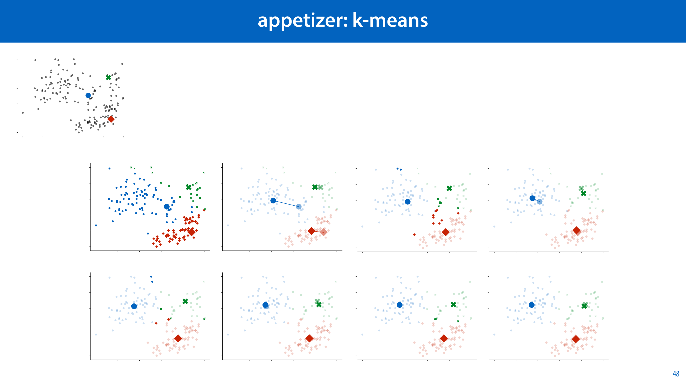

            <figcaption>
            
We’ve seen one example of alternating optimization already, in the first lecture: <strong>the k-Means algorithm</strong>. Here, the two unknowns are where the centers of our clusters are, and which cluster each point belongs to. If we knew which cluster each point belonged to, it would be easy to work out the centers of each cluster. If we knew the cluster centers, it would be easy to work out which cluster each point belongs to.  

Since we know neither, we set one of them (the cluster centers) to an arbitrary value, and then assign the points to the obvious clusters. Then we fix the cluster memberships and recompute the cluster centers. If we repeat this process, we end up converging to a good solution. 

 

            </figcaption>
       </section>

       <section id="slide-049">
            <a class="slide-link" href="https://mlvu.github.io/lecture08#slide-049" title="Link to this slide.">link here</a>
            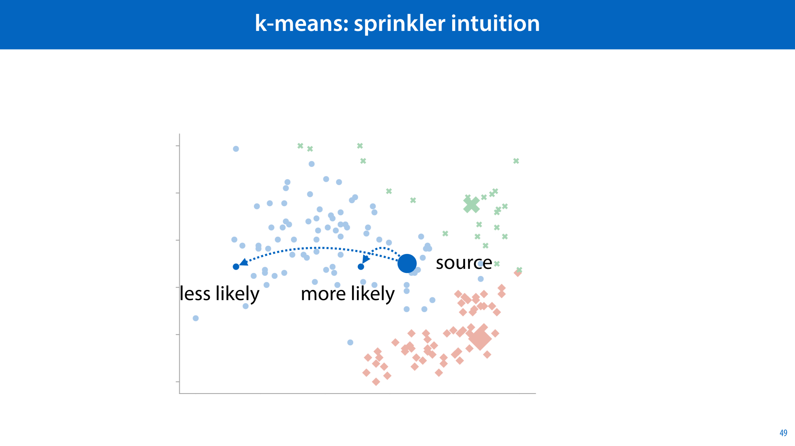

            <figcaption>
            
Let's try to develop some intuition for why the k-means algorithm works. This will help us in working up to the more complex case of the EM algorithm. 

We will imagine the following model for our data. Imagine that the data was produced by the means<strong> emitting</strong> the data points. Each mean spits out a number of instances, like a sprinkler, and that is how the data we observed came to be.  
<aside    >This is a standard modelling approach: make a number of assumptions about how your data was produced, and then try to fit your model under those assumptions. The assumptions may be incorrect, but it's as good a place to start as any. </aside>
We won't make any further assumptions about how the means spit out the data points except that they are more likely spit out points nearby than far away.

            </figcaption>
       </section>

       <section id="slide-050" class="anim">
            <a class="slide-link" href="https://mlvu.github.io/lecture08#slide-050" title="Link to this slide.">link here</a>
            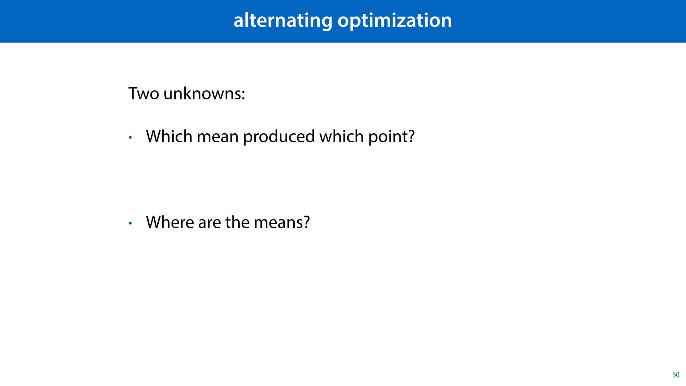

            <figcaption>
            
Under this model, we can make precise what the two unknowns of our problem are.  

First, we don't know which mean produced which point. Second, we don't know the location of the means. 

Each of these questions would be easy to answer (or at least guess) if we knew the answer to the other question. If we know the location of the means, it's pretty straightforward to guess which mean produced which point. The further the point is from the mean, the less likely it is to have been produced by that mean. So if we had to guess, we'd pick the mean that the point is closest to. 

If we know which mean produced every point, we could also make a pretty good guess for where the means should be: the bigger the distance between the points and their means, the less likely the situation becomes. The most likely situation is the one where the distance between the mean and all the points it produced is minimized. In other words, we place each mean at the average of all the points. 
<aside    >We've seen already that the mean minimizes the square of the total distances. We could also minimize the absolute distances: this is called the k-medians algorithm. </aside>
Applying the logic of alternating optimization to this problem given us the k means algorithm. We start with some random means and assign each point the most likely mean. Then we remove the means and recompute them, and repeat the procedure. 
<aside    >This still doesn't tell us why the iteration as a whole should work, but it hopefully shows that each individual step makes our solution better. It doesn't take a leap of faith to accept that a sequence of small good steps will often makes for a good walk. Later, we will build on this intuition to show more precisely what we can expect this algorithm to return.</aside><aside    ></aside>
            </figcaption>
            click image for animation
       </section>

       <section id="slide-051">
            <a class="slide-link" href="https://mlvu.github.io/lecture08#slide-051" title="Link to this slide.">link here</a>
            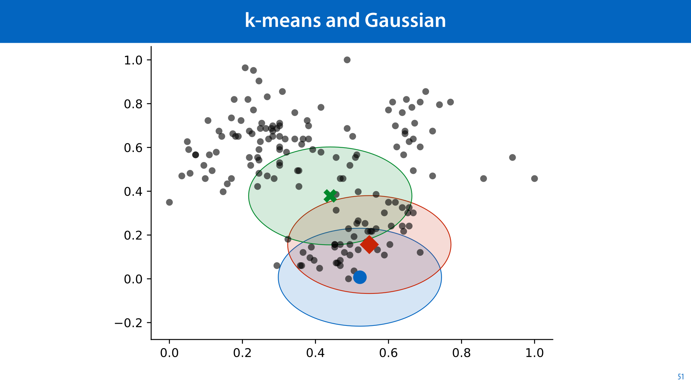

            <figcaption>
            
All we need to do to translate this into the problem of fitting a gaussian mixture model is to be slightly more precise about how each "mean", or component, produces the points. Instead of imagining a sprinkler producing the points, we assume that the points we produced by a<strong> multivariate normal distribution</strong>. That is, each component gets a mean <em>and a covariance matrix</em>. 

We also assign each component a weight. The higher the weight, the more likely the component is to produce a point. 

            </figcaption>
       </section>

       <section id="slide-052">
            <a class="slide-link" href="https://mlvu.github.io/lecture08#slide-052" title="Link to this slide.">link here</a>
            

            <figcaption>
            
Toghether, these components with their weights make a Gaussian mixture model: the sum of k weighted Gaussians.

            </figcaption>
       </section>

       <section id="slide-053" class="anim">
            <a class="slide-link" href="https://mlvu.github.io/lecture08#slide-053" title="Link to this slide.">link here</a>
            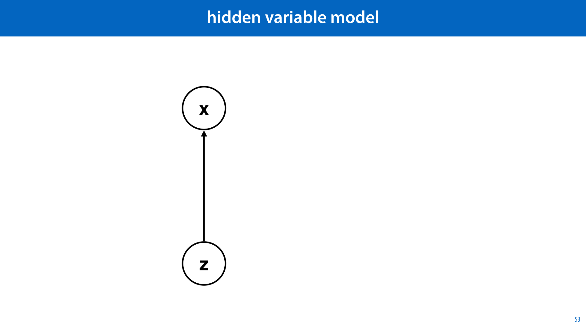

            <figcaption>
            
Here again, we have an unknown: we've assumed that the data is produced from k normal distributions, but we don't know which distribution produced which component.  

In statistics we often call this a<em> </em><strong>hidden variable model</strong>: the data is produced by picking a component, and then sampling a point from the component, but we don't see which component was used.  

We’ll indicate which component we’ve picked by a variable z. This is a discrete variable, which for a three-component model can take the values 1, 2 or 3. 

The problem is that when we see the data, we don’t know z. All we see is the sampled data, but not which component it came from. For this reason we call z a <strong>hidden variable</strong>. 

            </figcaption>
            click image for animation
       </section>

       <section id="slide-054">
            <a class="slide-link" href="https://mlvu.github.io/lecture08#slide-054" title="Link to this slide.">link here</a>
            

            <figcaption>
            
Normally when we have a distribution over two random variables, and we want a distribution over one, we just marginalize one of them out: we sum the joint probability over all values of the variable we want to get rid of. We are left with the marginal distribution over the variable we're interested in (x). Can we do that here? 

The answer is yes in theory, but no in practice. The hidden variable z assigns one component <strong>to each instance in our data</strong>. The number of such assignments blows up exponentially. Even with just two components and a tiny dataset of 30 instances, this would already require a sum with billions of terms.

            </figcaption>
       </section>

       <section id="slide-055">
            <a class="slide-link" href="https://mlvu.github.io/lecture08#slide-055" title="Link to this slide.">link here</a>
            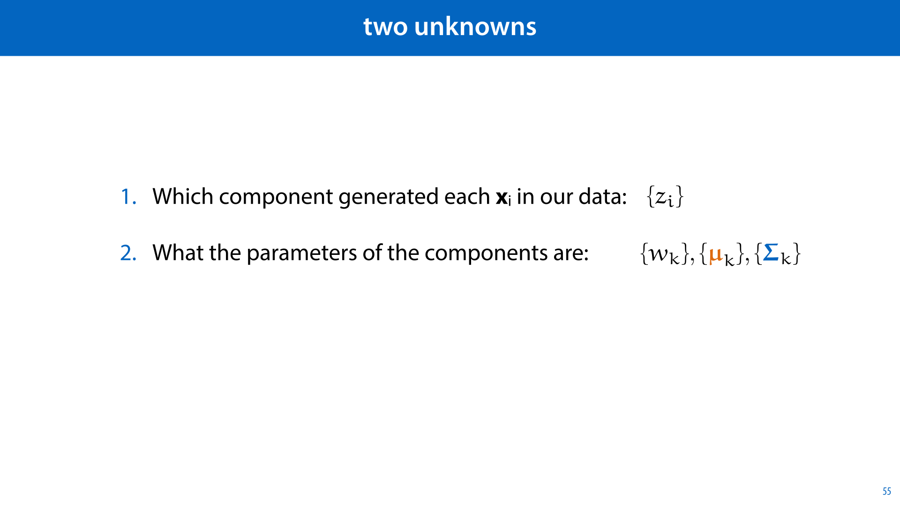

            <figcaption>
            
Instead, we’ll apply the philosophy of alternating optimization. First we state our two unknowns. 

Clearly, if we knew which component generated each point, we could easily estimate the parameters. Just partition the data by component, and use the maximum likelihood estimators on each component.  
<aside    >We don't know what the maximum likelihood estimators are for the component weights in this situation, but we'll see later that they have a very intuitive solution. </aside>
The other way around seems reasonable as well. Given the components, and their relative weight, it shouldn’t be too tricky to work out how likely each component is to be responsible for any given instance.

            </figcaption>
       </section>

       <section id="slide-056">
            <a class="slide-link" href="https://mlvu.github.io/lecture08#slide-056" title="Link to this slide.">link here</a>
            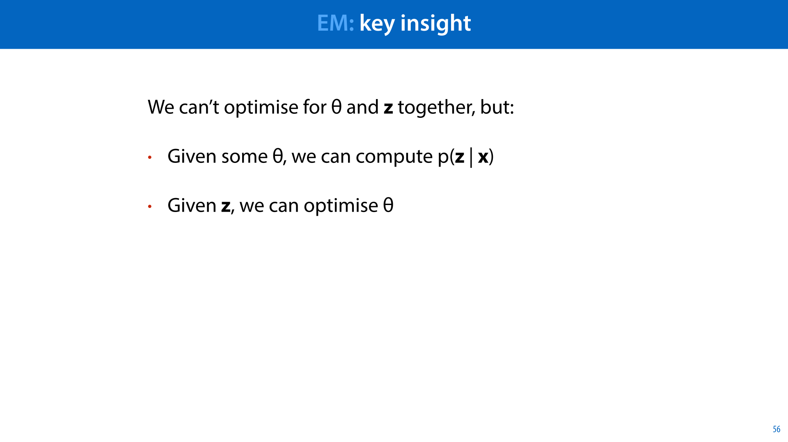

            <figcaption>
            
So, if we call the collection of all parameters of the model θ, then this is the key insight to the EM algorithm.

            </figcaption>
       </section>

       <section id="slide-057">
            <a class="slide-link" href="https://mlvu.github.io/lecture08#slide-057" title="Link to this slide.">link here</a>
            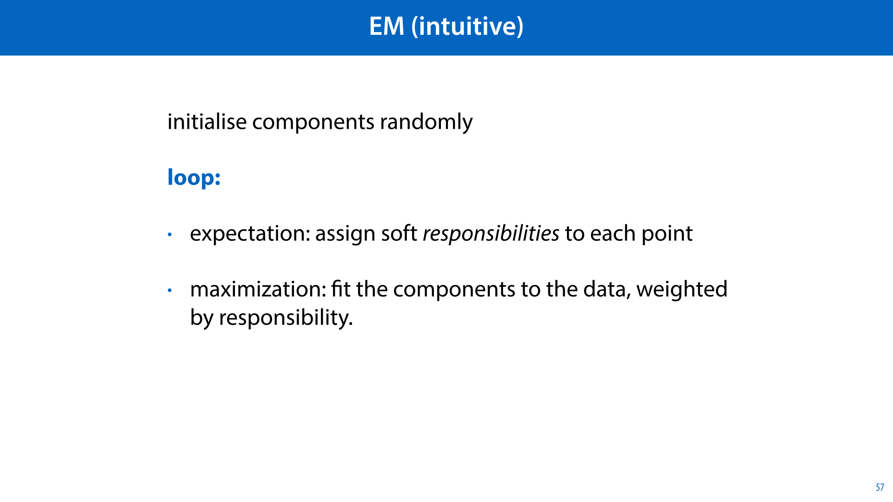

            <figcaption>
            
Here is the informal statement of the EM algorithm. The two steps are called expectation and maximization, which is where algorithm gets its name. 

In the k-means algorithm, we assigned the single most likely component to each point. Here, we are a little bit more gentle: we let each component take partial "responsibility" for each point. We never pick one component exclusively, we just say that the higher the probability density is under a component, the more likely it is that that component generated the point. But, all components always retain some probability. 

From a Bayesian perspective, you can say that we are computing a probability distribution for each point, over the three components, indicating the probability that the component produced the point. To appease the frequentists, we call this a <strong>responsibility</strong> rather than a probability. 

            </figcaption>
       </section>

       <section id="slide-058" class="anim">
            <a class="slide-link" href="https://mlvu.github.io/lecture08#slide-058" title="Link to this slide.">link here</a>
            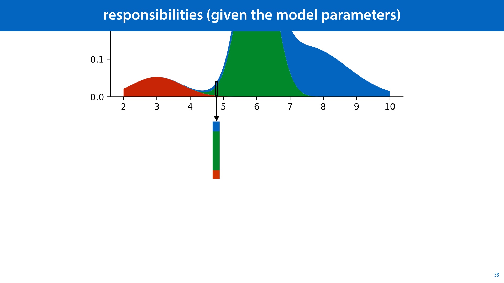

            <figcaption>
            
Here is how we define the<strong> responsibility</strong> taken for some point x by a particular component when the parameters of the components are given. We simply look at the three weighted densities for point x. The sum of these defines the total density for x under the GMM. The proportion of this sum that component 2 claims, is the responsibility that we assign to component 2 for producing x. 

If you allow subjective probability, this is just Bayes’ rule in action, the probability of component 2 being responsible given that we’ve observed x. If you want a purely frequentist interpretation of the EM algorithm, you have to be strict in calling these responsibilities and not probabilities. We cannot express a probability over which component generated x, since it is a hidden true value, which is not subject to chance. 

For now, we’ll just take this as a pretty intuitive way to work out responsibility, and see what it gets us. In the next video, we’ll see a more rigorous derivation that even a frequentist can get behind. 

In this case, the green component takes most of the responsibility for point x.

            </figcaption>
            click image for animation
       </section>

       <section id="slide-059">
            <a class="slide-link" href="https://mlvu.github.io/lecture08#slide-059" title="Link to this slide.">link here</a>
            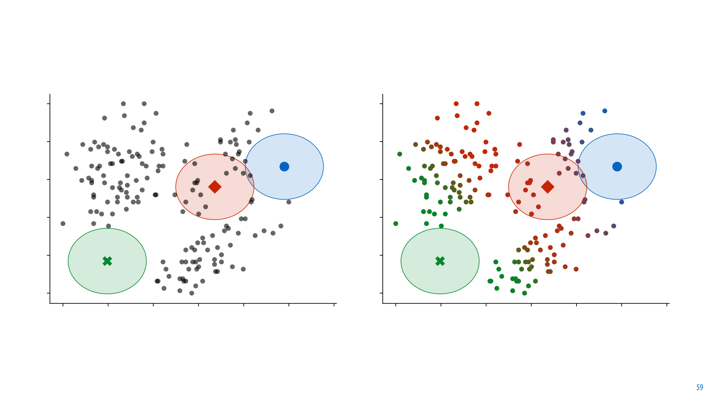

            <figcaption>
            
We can now take the first step in our EM algorithm. Here it is in two dimensions. We have some data and we will try to fit a two-component GMM to it. The number of components is a hyperparameter that we have to choose ourselves, based on intuition or basic hyperparameter optimization methods. 

We start with three arbitrary components. Given these components, we then assign responsibilities to each of our points. For points that are mostly blue, the blue component claims the most responsibility and for points that are mostly red, the red component claims the most responsibility, and so on. Note however, that in between the red and blue components, we find purple points. for these, the red and the blue components claim about equal responsibility. In between the green and blue components, we find teal components, where we divide the responsibioity equally between the green and the blue component. 

 

            </figcaption>
       </section>

       <section id="slide-060">
            <a class="slide-link" href="https://mlvu.github.io/lecture08#slide-060" title="Link to this slide.">link here</a>
            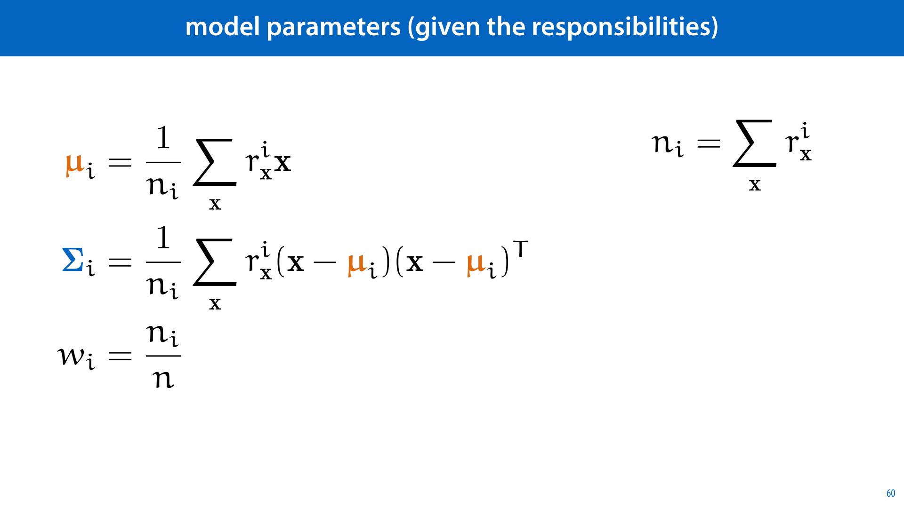

            <figcaption>
            
For each component i, we now discard the parameters mu and sigma, and<em> recompute</em> them to fit the subset of the data that the component has taken responsibility for.  

Since, unlike the k-means algorithm, we never strictly partition the data, every point belongs to each component<em> to some extent</em>. What we get is a weighted dataset, where the responsibility component i takes for each point becomes the weight of that point. Now we can simply use our weighted MLEs that we defined in the previous part. 

Our model isn’t just the parameters of the components, we also need to work out the component <em>weights</em>. For now, we’ll appeal to intuition, and say that it seems pretty logical to use the total amount of responsibility claimed by the component over the whole data. In the next video, we’ll be a bit more rigorous. 

With this, we have the two steps of our alternating optimization worked out: given components, we can assign responsibilities, and given responsibilities, we can fit components.

            </figcaption>
       </section>

       <section id="slide-061" class="anim">
            <a class="slide-link" href="https://mlvu.github.io/lecture08#slide-061" title="Link to this slide.">link here</a>
            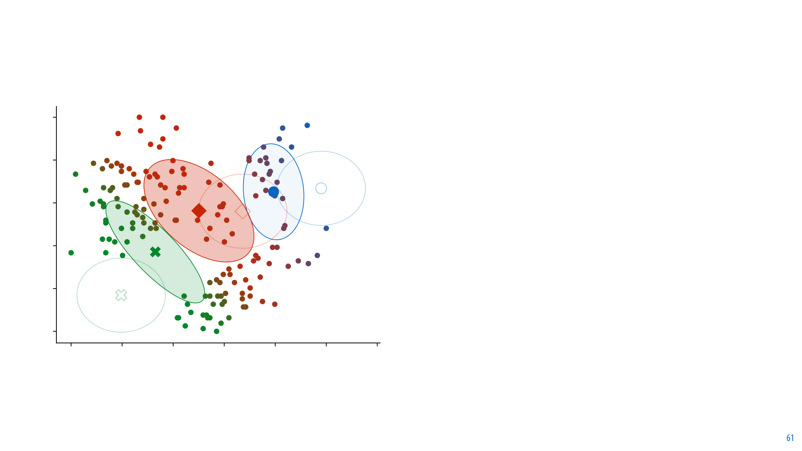

            <figcaption>
            
In the left, we see out new components, fitted to the weighted data. The blue mean is still the mean over the whole dataset (all points regardless of color), but the blue points pull on it with much greater force than the others. 

Next, we repeat the procedure. We recompute the responsibilities.  
<aside    >We use the alpha channel to indicate for which points the responsibilities have changes the most. </aside><aside    ></aside>
            </figcaption>
            click image for animation
       </section>

       <section id="slide-062" class="anim">
            <a class="slide-link" href="https://mlvu.github.io/lecture08#slide-062" title="Link to this slide.">link here</a>
            

            <figcaption>
            

            </figcaption>
            click image for animation
       </section>

       <section id="slide-063" class="anim">
            <a class="slide-link" href="https://mlvu.github.io/lecture08#slide-063" title="Link to this slide.">link here</a>
            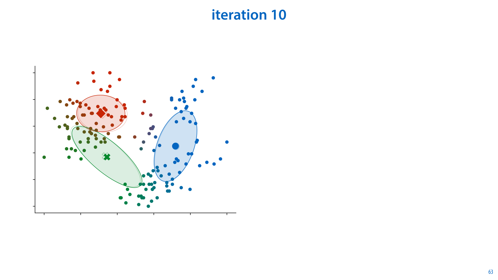

            <figcaption>
            
At iteration 10, we see the red component moving to the top left. As it does so, it leaves responsibility for the top right points to the blue component, and claiming more responsibility for the points on the left from the green component. This will push the green component towards the points at the bottom where it has the most responsibility. This in turn will claim responsibility from the blue component, pushing that up into its own cluster at the top right.

            </figcaption>
            click image for animation
       </section>

       <section id="slide-064" class="anim">
            <a class="slide-link" href="https://mlvu.github.io/lecture08#slide-064" title="Link to this slide.">link here</a>
            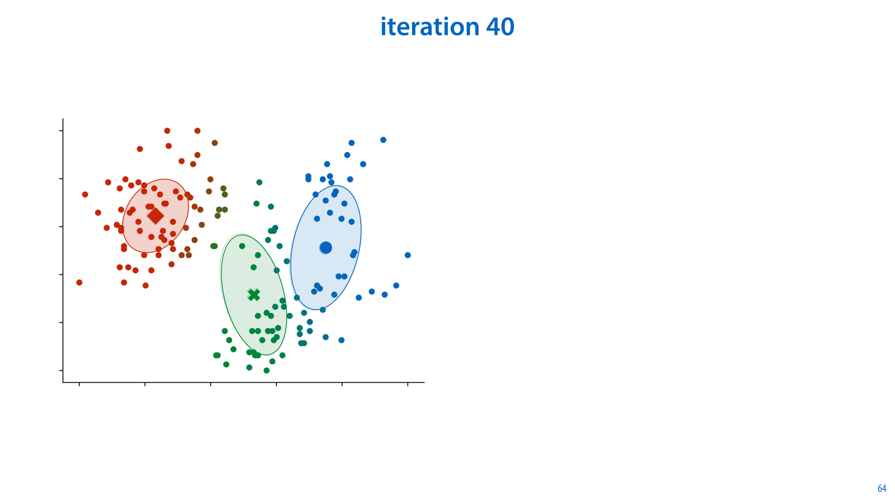

            <figcaption>
            
At 40 iterations, the green component has been pushed out of the red cluster.

            </figcaption>
            click image for animation
       </section>

       <section id="slide-065" class="anim">
            <a class="slide-link" href="https://mlvu.github.io/lecture08#slide-065" title="Link to this slide.">link here</a>
            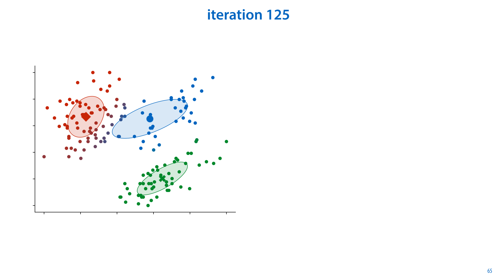

            <figcaption>
            
At 125 iterations, the changes have become microscopic and we decide the algorithm has converged. The components are remarkably close to the penguin species labels (which we had, but didn't show to the algorithm). 

Note that even though the algorithm has converged, there are plenty of points it's uncertain about. Between the red and blue components, there are many points that could be either an Adelie or a Chinstrap penguin.

            </figcaption>
            click image for animation
       </section>

       <section id="slide-066" class="anim">
            <a class="slide-link" href="https://mlvu.github.io/lecture08#slide-066" title="Link to this slide.">link here</a>
            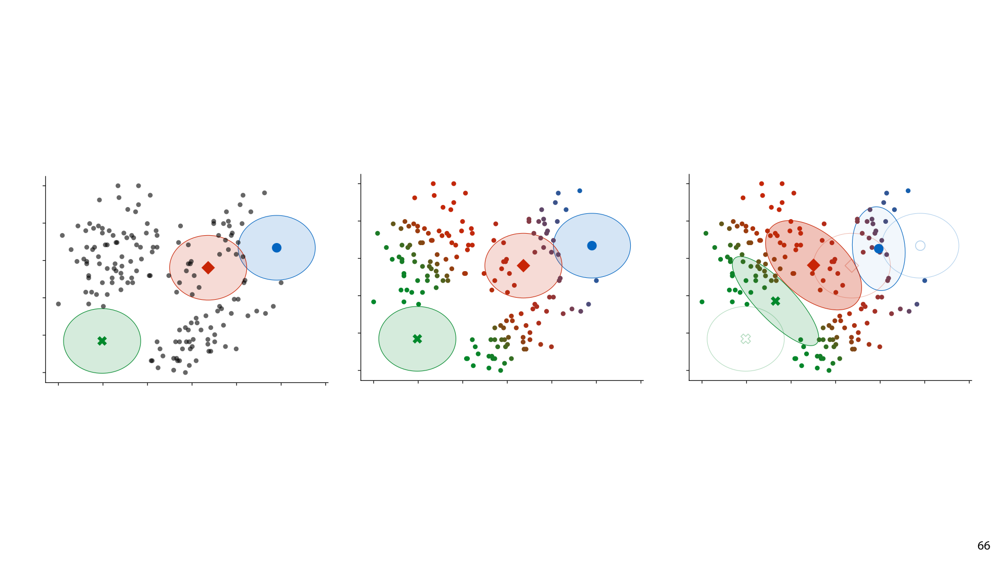

            <figcaption>
            

            </figcaption>
            click image for animation
       </section>

       <section id="slide-067">
            <a class="slide-link" href="https://mlvu.github.io/lecture08#slide-067" title="Link to this slide.">link here</a>
            

            <figcaption>
            
So, we can fit a Gaussian mixture model to a dataset. What does this buy us?

            </figcaption>
       </section>

       <section id="slide-068">
            <a class="slide-link" href="https://mlvu.github.io/lecture08#slide-068" title="Link to this slide.">link here</a>
            

            <figcaption>
            
The first way we can use this model is as a clustering algorithm. It works the same as k-means, expect that we get cluster probabilities, instead of cluster assignments. 

If the model fits well, we can also use it for density estimation use cases: look at those points in low density regions. these are the outliers, which may be worth inspection, for instance if we have a dataset of financial transations, and we are trying to detect fraud.

            </figcaption>
       </section>

       <section id="slide-069">
            <a class="slide-link" href="https://mlvu.github.io/lecture08#slide-069" title="Link to this slide.">link here</a>
            

            <figcaption>
            
But, we can also take the mixture models and use them inside a Bayesian classfier: split the data by class, and fit a gaussian mixture model to each.

            </figcaption>
       </section>

       <section id="slide-070">
            <a class="slide-link" href="https://mlvu.github.io/lecture08#slide-070" title="Link to this slide.">link here</a>
            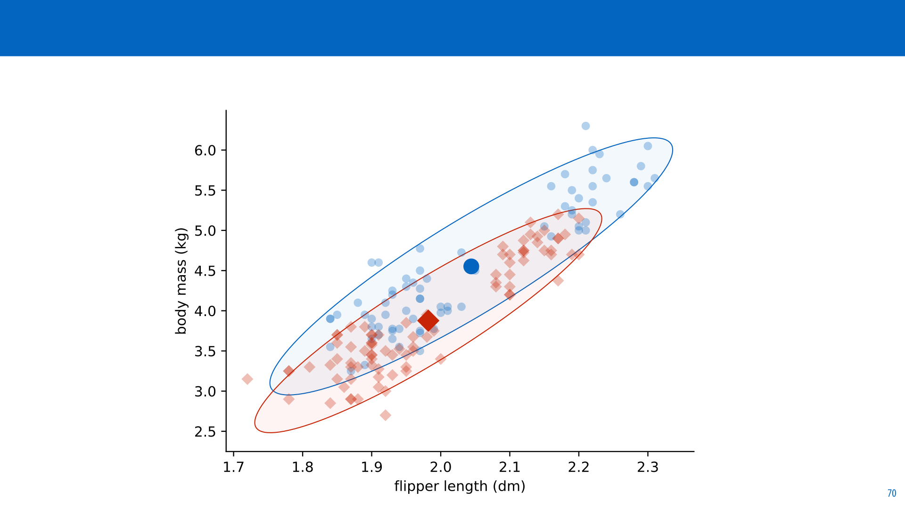

            <figcaption>
            
Here’s what a Bayesian classifier looks like with a single Gaussian per class in our sex-classification example for the penguins. Because the dataset contains multiple clusters, we can't get a clean separation this way.

            </figcaption>
       </section>

       <section id="slide-071">
            <a class="slide-link" href="https://mlvu.github.io/lecture08#slide-071" title="Link to this slide.">link here</a>
            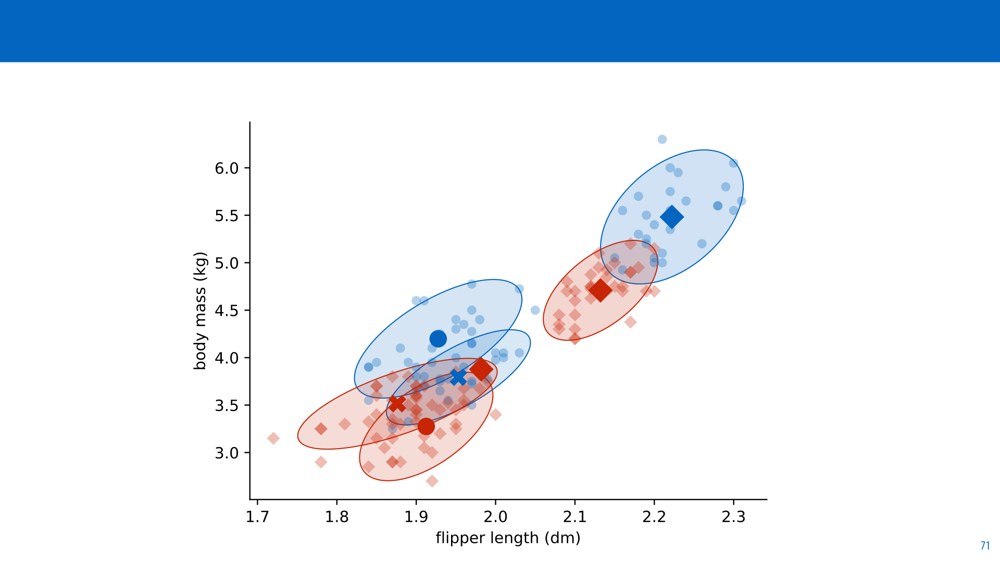

            <figcaption>
            
However, if we fit a Gaussian mixture model to each class, we can pick out the different clusters within each class and get a much better fit for the data.

            </figcaption>
       </section>

       <section class="video" id="video-071">
           <a class="slide-link" href="https://mlvu.github.io/lecture08#video-71">link here</a>
           <iframe
                src="https://www.youtube.com/embed/MFQdNuVCk4A?modestbranding=1&showinfo=0&rel=0"
                title="YouTube video player"
                frameborder="0" allow="accelerometer; autoplay; clipboard-write; encrypted-media; gyroscope; picture-in-picture"
                allowfullscreen>
           </iframe>

       </section>

       <section id="slide-072">
            <a class="slide-link" href="https://mlvu.github.io/lecture08#slide-072" title="Link to this slide.">link here</a>
            

            <figcaption>
            
In the last video, we explained how EM works to fit a GMM model. We took a pretty informal approach, and appealed to intuition for most of the decisions we made. This is most helpful to get a comfortable understanding of the algorithm, but as it happens, we can derive all of these steps formally, as approximations to the maximum likelhood estimator fo the GMM model. 

<lnbr></lnbr>

            </figcaption>
       </section>

       <section id="slide-073">
            <a class="slide-link" href="https://mlvu.github.io/lecture08#slide-073" title="Link to this slide.">link here</a>
            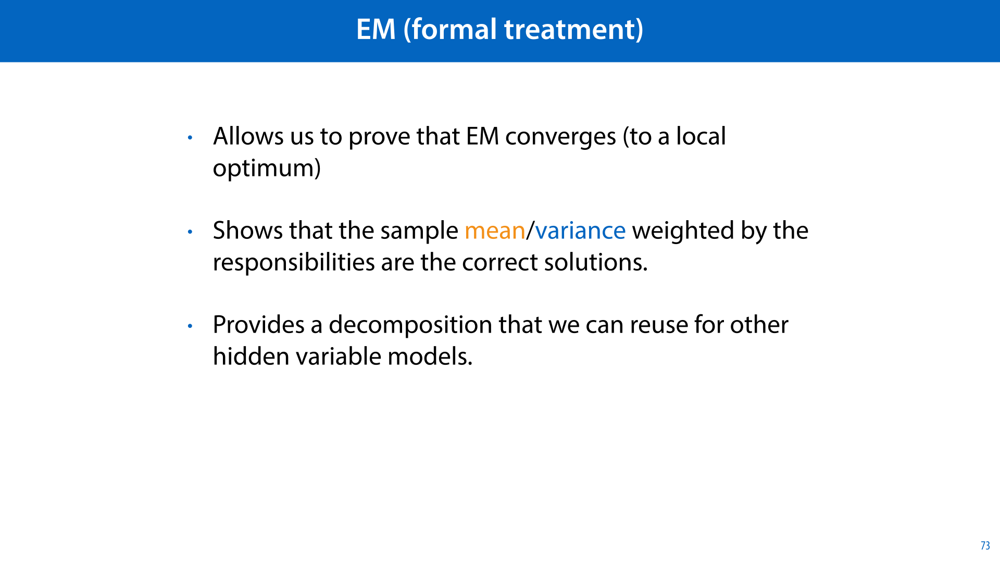

            <figcaption>
            
What do we get out of this, since we already have the EM algorithm and is seems to work pretty well? 

First, we can prove that EM converges to a local optimum. 

 Second, we can derive the responsibilities and weighted mean and variance as the correct solutions. In the last video, if  we had come up with five other ways of doing it that also seem pretty intuitive, we would have to implement and test all of them to see which worked best. With a little more theory we can save ourselves the experimentation. This is a good principle to remember: the better your grasp of theory, the smaller your search space. 

And finally, the decomposition we will use here will help us in other settings as well, starting next week we we apply the principle to deep neural networks.

            </figcaption>
       </section>

       <section id="slide-074">
            <a class="slide-link" href="https://mlvu.github.io/lecture08#slide-074" title="Link to this slide.">link here</a>
            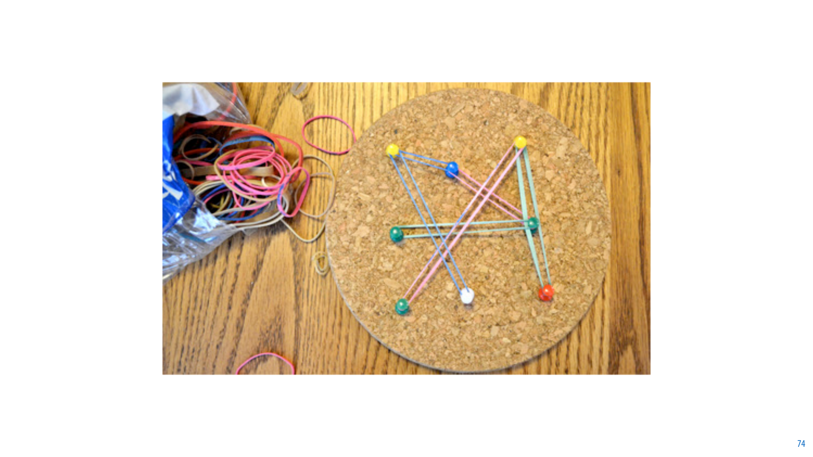

            <figcaption>
            
image source: <a href="http://www.ahappysong.com/2013/10/push-pin-geo-art.html"><strong class="blue">http://www.ahappysong.com/2013/10/push-pin-geo-art.html</strong></a>

<a href="http://www.ahappysong.com/2013/10/push-pin-geo-art.html"><strong class="blue"></strong></a>

            </figcaption>
       </section>

       <section id="slide-075">
            <a class="slide-link" href="https://mlvu.github.io/lecture08#slide-075" title="Link to this slide.">link here</a>
            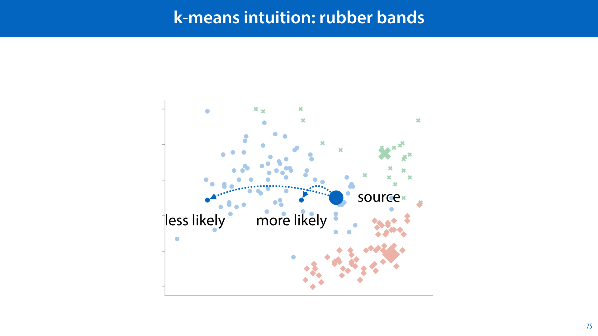

            <figcaption>
            
Before we get to the heavy math, let's have another look at the k-means algorithm. We'll show, in an informal argument why the k-means algorithm is guaranteed to converge. This argument has the same structure as the one we will apply to the EM algorithm. 

Here's the model we set up in the last part, to derive k-means: we assume that there are means (points in feature space) that are responsible for "emitting" the points in out dataset. We don't know exactly how they do this, but we do know that they are more likely to create points close to the mean than far away.  

The maximum likelihood objective says that we want to pick the model for which the data is most likely. Or, put differently, we want to reject any model under which the data is very unlikely. 

For k-means, a model consists of a set of means and an assignment of points to these means. 

            </figcaption>
       </section>

       <section id="slide-076" class="anim">
            <a class="slide-link" href="https://mlvu.github.io/lecture08#slide-076" title="Link to this slide.">link here</a>
            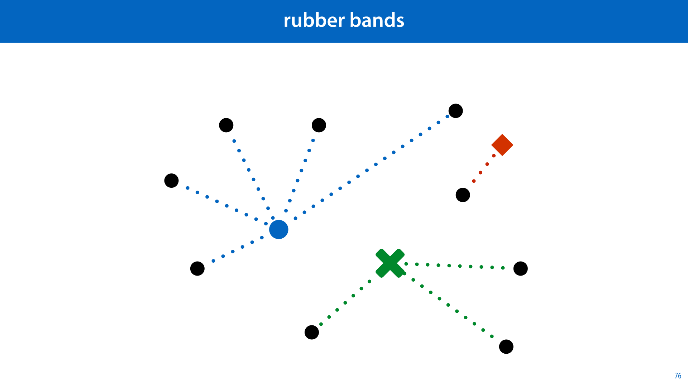

            <figcaption>
            
Here's an analogy: imagine the connection between a mean and one of the points as a <strong>rubber band</strong>. A complete model places k means somewhere in space and connects each data point to only one of the means. 

The principle we stated earlier, that points far away from the mean are less likely, now translated into <strong>the tension in the rubber bands</strong>. The more tightly we have to pull the rubber bands the less likely the model is as an explanation for the data. In this analogy, the maximum likelihood principle says that we are looking for the model where the tension in all the rubber bands, summed over all of them, is as small as possible. 

            </figcaption>
            click image for animation
       </section>

       <section id="slide-077" class="anim">
            <a class="slide-link" href="https://mlvu.github.io/lecture08#slide-077" title="Link to this slide.">link here</a>
            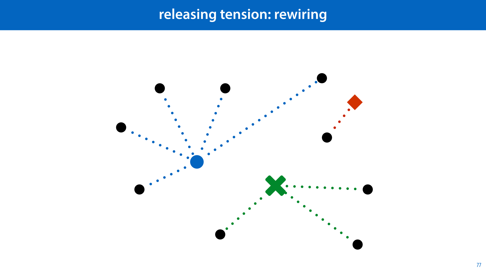

            <figcaption>
            
In this model, at least one of the rubber bands is stretched much farther than it needs to be. There are two ways we can reduce the tension.  

First, we can unhook some of the rubber bands, and <strong>tie them to a different mean</strong>. If we do this only if the new mean is closer to the point than the old mean, we know for a fact we are never increasing the sum total tension: in the new place, the rubber band will be under less tension than the old. 

This is, of course, the re-assignment step of the k-means algorithm.

            </figcaption>
            click image for animation
       </section>

       <section id="slide-078">
            <a class="slide-link" href="https://mlvu.github.io/lecture08#slide-078" title="Link to this slide.">link here</a>
            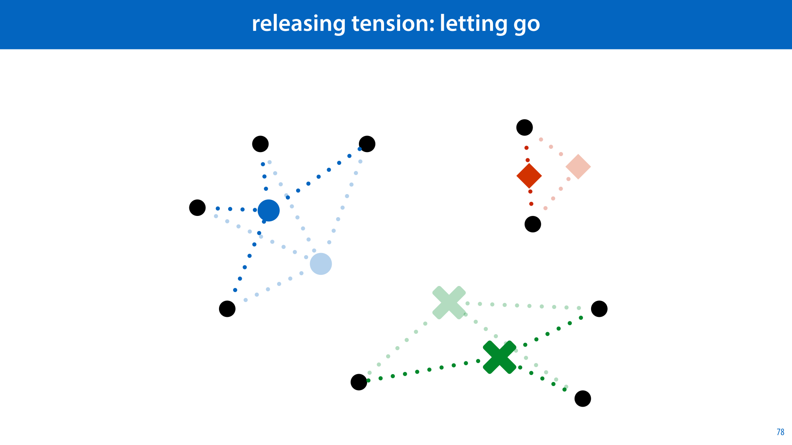

            <figcaption>
            
The other thing we can do to reduce the tension is to move the means into a better place. Imagine that so far you'd been holding the means in place against the tension of the rubber bands, and now you let them go. The rubber bands would automatically pull the means into the optimal place to reduce the tension as much as possible.  

Here again, we note that we are always guaranteed never to increase the total amount of tension in the springs. It may stay the same if the means don't move, but if they move, the total tension afterwards is less than before. 

Next, we pin the means in place again, rewire the connections while keeping the means fixed and so on.

            </figcaption>
       </section>

       <section id="slide-079">
            <a class="slide-link" href="https://mlvu.github.io/lecture08#slide-079" title="Link to this slide.">link here</a>
            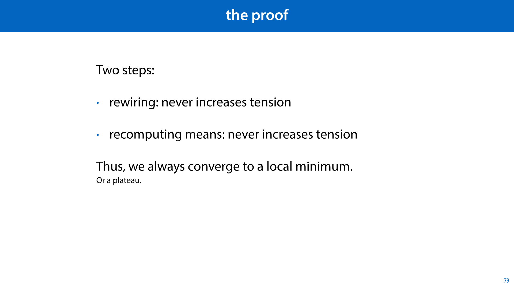

            <figcaption>
            
What we have shown is that there is some quantity, sum of total tension, that neither step of the algorithm ever increases (and in most cases, decreases). This means that if we imagine this quantity as a surface over our model space (like we do with the loss), <strong>we are always moving downhill on this surface.  </strong>

The same argument holds for the EM algorithm, but this requires a little more math. However, in working this out, we'll set up a very useful decomposition for hidden variable models that we will come back to later in the course.  
<aside    >This is not quite a complete proof that you always converge to a local minimum on the loss landscape, but it does show that you converge to a local minimum on the subset of the landscape that the algorithm visits. It is enough to show that the algorithm itself converges.<strong> </strong></aside><aside    ><strong></strong></aside>
            </figcaption>
       </section>

       <section id="slide-080">
            <a class="slide-link" href="https://mlvu.github.io/lecture08#slide-080" title="Link to this slide.">link here</a>
            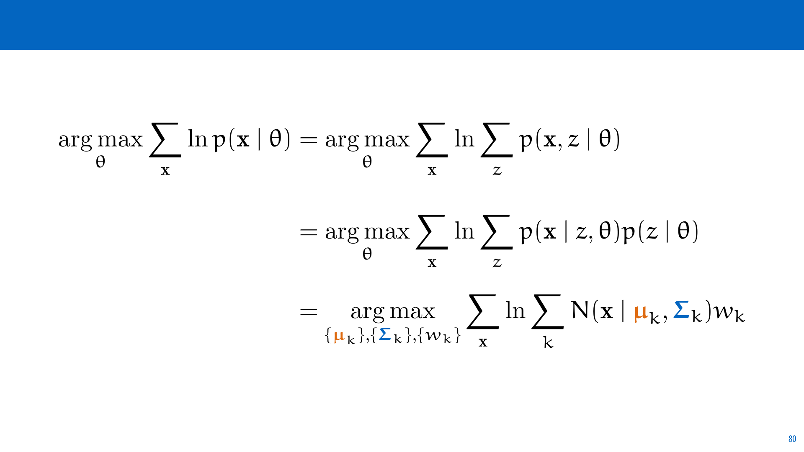

            <figcaption>
            
For a proper probabilistic model like a GMM, the equivalent of the sum total of the tensions in the rubber bands is the (log) likelihood. That is ultimately what we want to minimize. 

Let's start by writing down this objective for the Gaussian mixture model.  

Note that this is not quite analogous to the rubber bands yet, since we are no longer linking points to components. Here we just want to maximize the sum total probability mass that ends up at the points occupied by the data. The responsibilities, which are analogous to the rubber bands, come in later, as a way to help us solve this problem.

            </figcaption>
       </section>

       <section id="slide-081" class="anim">
            <a class="slide-link" href="https://mlvu.github.io/lecture08#slide-081" title="Link to this slide.">link here</a>
            

            <figcaption>
            
The problem we have to solve, as we saw before, is the hidden, or latent variable. The fact that we have to estimate both the parameters and the responsibilities of each component for each point together is what makes it impossible to find a global optimum efficiently. 

The probability distribution on the hidden variable is what's missing. If we knew that, we could solve the rest of the problem easily.

            </figcaption>
            click image for animation
       </section>

       <section id="slide-082" class="anim">
            <a class="slide-link" href="https://mlvu.github.io/lecture08#slide-082" title="Link to this slide.">link here</a>
            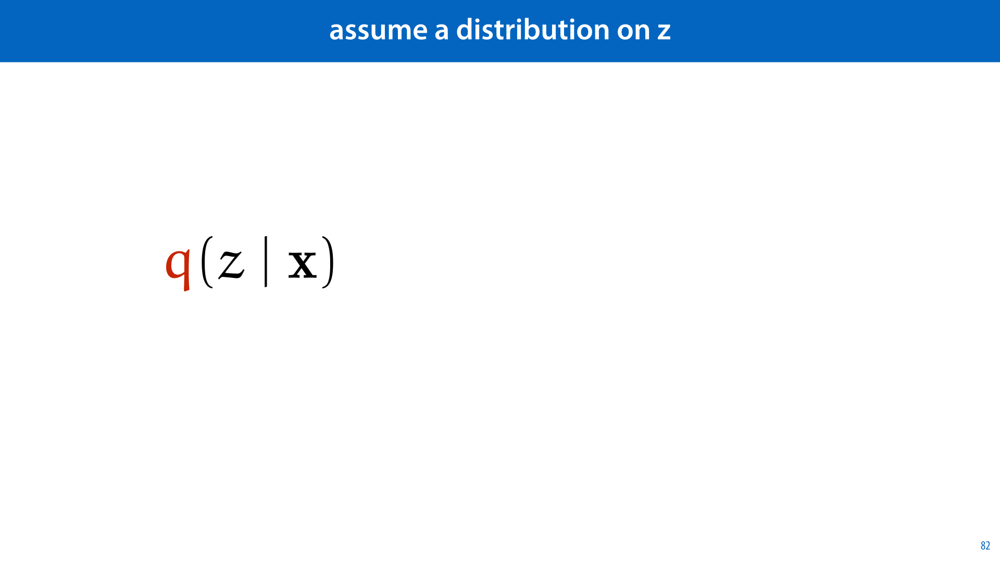

            <figcaption>
            
Our first step is to assume some arbitrary function which gives us a distribution on z for x. This distribution tells us for a given point which component we think generated it. It could be a very accurate distribution or a terrible one. Before we start looking for a <em>good</em> q, We’ll work out some properties first that hold for <em>any</em> q.  
<aside    >q is analogous to the rubber bands in the k-means example. Just like we could start with bad configuration of rubber bands, which stretches them out very far, we can start with a bad choice of q, which lead to a bad likelihood for the model. </aside>
Since in our specific example, z can take one of k values, you should think of q(z|<strong>x</strong>) as a categorical distribution over the k components in our model.  For a particular <strong>x</strong>, q tells us which components are most likely. This is the same function as the responsibilities we defined earlier, and indeed we will see that q will become the responsibilities later, but right now, we are making no assumptions about how q is computed: it could be a completely arbitrary and incorrect function. 

We can think of q(z|x) as an approximation to p(z|x, θ), the conditional distribution on the hidden variable, given the model parameters and the data.  

Why do we introduce q, when we can actually compute p(z|x, θ) using Bayes rule? Because q can be <em>any</em> function, which means it’s not tied to a particular value of θ. q is not a function of θ, which means that in our optimization, it functions as a constant. As we shall see, this can help us a great deal in our analysis. Previously we took the computation of the responsibilities as an intuitive step inspired by Bayes' rule. Now, we'll do without Bayes rule, and show how the responsibilities emerge from first principles, without appealing to intuition. 
<aside    >Remember, θ represents all the parameters of all components and their weights together in one object. </aside><aside    ></aside>
            </figcaption>
            click image for animation
       </section>

       <section id="slide-083" class="anim">
            <a class="slide-link" href="https://mlvu.github.io/lecture08#slide-083" title="Link to this slide.">link here</a>
            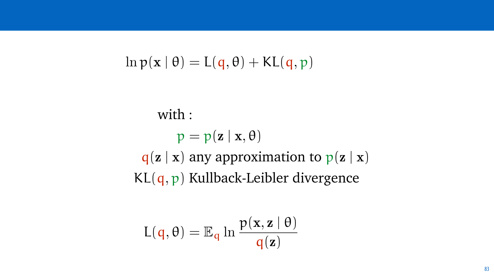

            <figcaption>
            
Remember that ultimately, we are not interested in the values of the hidden variables. We just want to pick θ to maximize  p(x | θ). The hidden variables don't even appear in this formula. the only problem is that we can't compute p(x | θ), because it would require us to marginalize over all possible values of z for all instances. This is where q comes in. 

Given any q (good or bad) we can show that the log likelihood ln p(x | θ), which we cannot easily compute, decomposes into the two terms shown in the slide. 

The KL divergence, as we saw in lecture 5, is a distance between two probability distributions. It tells us how good of an approximation q is for the distribution p(z | <strong>x</strong>, θ) we just compared it to. The worse the approximation, the greater the KL divergence. 

The second term L is just a relatively arbitrary function. There isn’t much meaning that can be divined from its definition, but we can prove that when we rewrite the log-likelihood of x into the KL divergence between p and q, L is what is “left over”. L plus the KL divergence makes the log likelihood. This means that when q is perfect approximation, and the KL divergence becomes zero, L is equal to the likelihood. The worse the approximation, the lower L is, since the KL divergence is always zero or greater. 
<aside    >In our current case, z is just a scalar, but we’ll treat it as a (boldface) vector to highlight that in general, this works for any kind of latent variable. We’ll need that when we reuse this decomposition in later lectures.</aside><aside    ></aside>
            </figcaption>
            click image for animation
       </section>

       <section id="slide-084" class="anim">
            <a class="slide-link" href="https://mlvu.github.io/lecture08#slide-084" title="Link to this slide.">link here</a>
            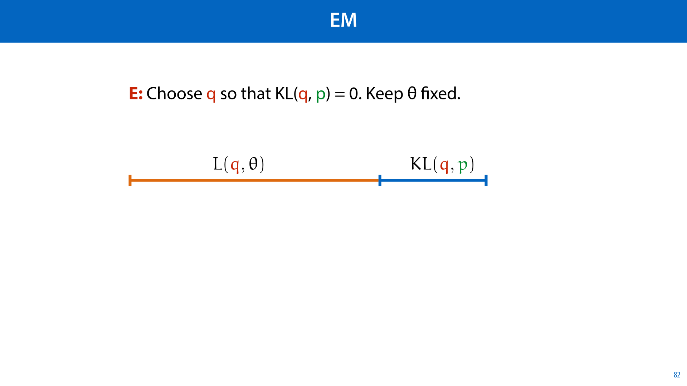

            <figcaption>
            
Here is the proof that this decomposition holds. It’s easiest to work backwards. We fill in our statement of L and KL terms, and rewrite to show that they’re equivalent to the log likelihood. 

If you're struggling to follow this, go through the explanation of the logarithm and the expectation in the first homework again, or look up their properties on wikipedia. There isn't much intuition here: it's just a purely algebraic proof that the log likelihood can be decomposed like this for any distribution q on the hidden variable. 
<aside    >We've written L and KL as sums here, but because we are only using properties of the expectation, it works for continuous distributions as well (in which case the sum becomes an integral).  </aside><aside    ></aside>
            </figcaption>
            click image for animation
       </section>

       <section id="slide-085" class="anim">
            <a class="slide-link" href="https://mlvu.github.io/lecture08#slide-085" title="Link to this slide.">link here</a>
            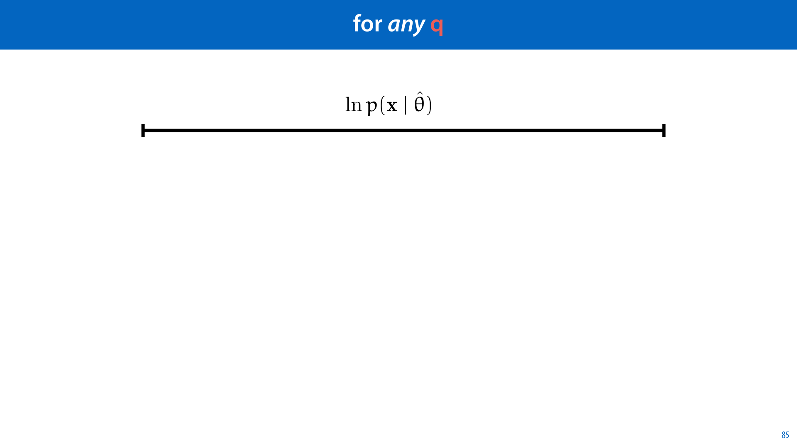

            <figcaption>
            
This is the picture that all this rewriting buys us. We have the probability of our data under the optimal model (top line) and the probability of our data under our current model (middle line). And for any q, whether it’s any good or not, the latter is composed of two terms. 

We can now build the same kind of proof as we did for the rubber bands: we can alternately shrink one of the two bars, which shows that the algorithm will converge.

            </figcaption>
            click image for animation
       </section>

       <section id="slide-086">
            <a class="slide-link" href="https://mlvu.github.io/lecture08#slide-086" title="Link to this slide.">link here</a>
            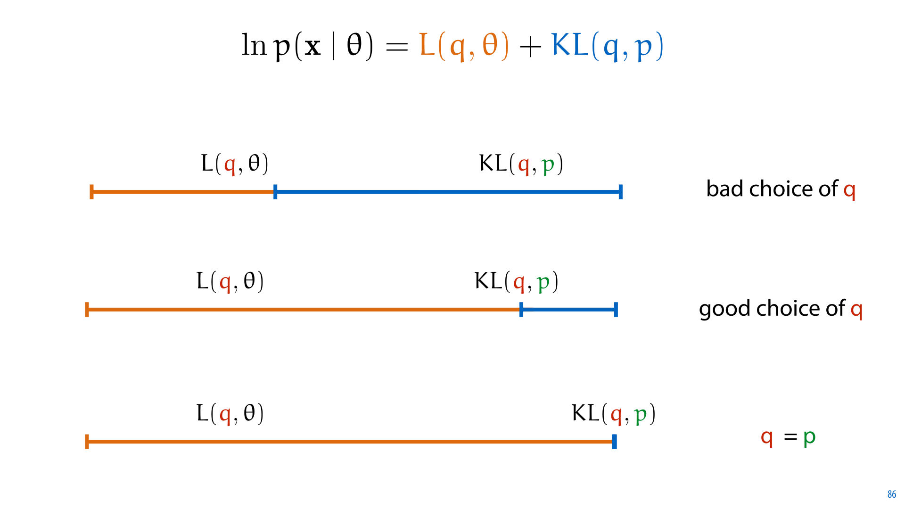

            <figcaption>
            
Note again that this is just a way of writing down the probability density of our data given the parameters (with the hidden variable z marginalized out). The sum of these two terms is always the same. The closer p is to q, the smaller the KL term gets. 

In short, L is a lower bound in the quantity that we’re interested in. The KL term tells us how good of a lower bound this is.

            </figcaption>
       </section>

       <section id="slide-087">
            <a class="slide-link" href="https://mlvu.github.io/lecture08#slide-087" title="Link to this slide.">link here</a>
            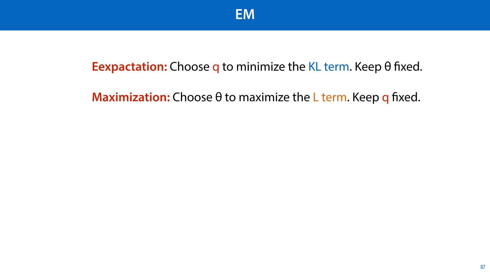

            <figcaption>
            
With this decomposition, it turns out that we can state the EM algorithm very simply, and in very general terms. 
<aside    >Note that none of this assumes anything about GMMs or about the distribution on z. This approach works for a much broader class of hidden variable models than just the GMM.</aside><aside    ></aside>
            </figcaption>
       </section>

       <section id="slide-088" class="anim">
            <a class="slide-link" href="https://mlvu.github.io/lecture08#slide-088" title="Link to this slide.">link here</a>
            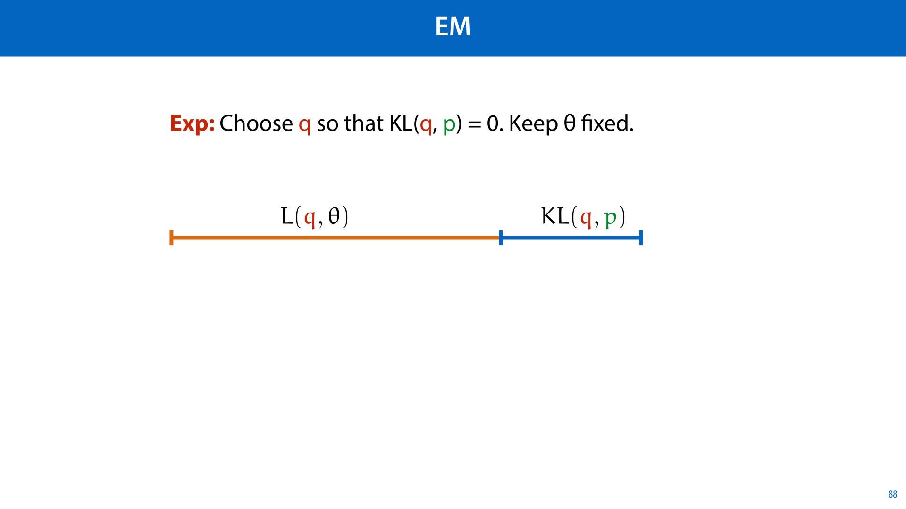

            <figcaption>
            
In the expectation step, we reset q to be the best possible approximation to p(z|x, θ) that we can find for the <em>current</em> θ. This is not the global optimum, since θ may be badly chosen, but it is never a worse choice than the previous q. We do this by minimizing the KL divergence between the two distributions.  
<aside    >Note that our objective is to maximize the sum of these two bars, so it may at first seem counter-intuitive to minimize one of them. However, the decomposition holds for any q, so if we re-select q, we don’t change the total length. We just change the proportion that the q term claims. </aside>
After this step, the total length of the two bars is unchanged, because the decomposition still holds. We have not moved to a worse place in the loss landscape.

            </figcaption>
            click image for animation
       </section>

       <section id="slide-089">
            <a class="slide-link" href="https://mlvu.github.io/lecture08#slide-089" title="Link to this slide.">link here</a>
            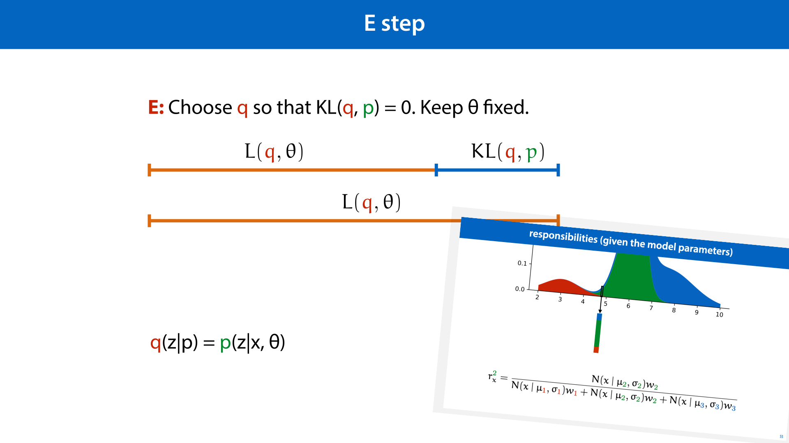

            <figcaption>
            
In the specific GMM setting, the expectation step is easy to work out. The KL divergence is minimal when q is a perfect approximation to p. Since we keep θ as a constant, we can just work out the conditional probabilities on z given the parameters θ. That is, in this setting we know p(z|x, θ), so we can just compute it and set q equal to it. 

The result is simply the responsibilities we already worked out in the previous part. 

This is analogous to rewiring the rubber bands in the k-means example: we keep the model the same, and re-assign the responsibilities in the way that is "most likely".

            </figcaption>
       </section>

       <section id="slide-090" class="anim">
            <a class="slide-link" href="https://mlvu.github.io/lecture08#slide-090" title="Link to this slide.">link here</a>
            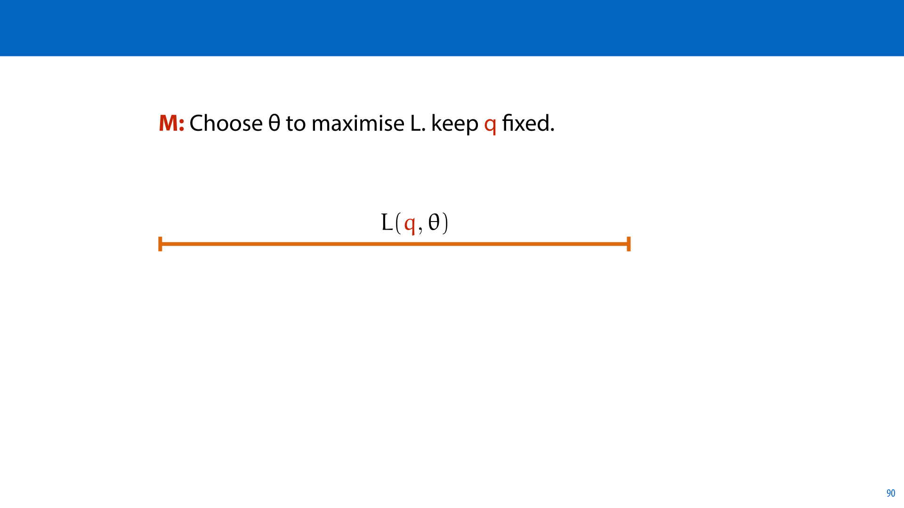

            <figcaption>
            
In the M step, we change the parameter θ which described the components and their weights. We choose the θ which maximizes L.  

This means our q function is no longer a perfect approximation to p, so the KL divergence is no longer zero. This means that the total size of the bar gets a boost both from our change of L and for a new (bigger) KL divergence. 

            </figcaption>
            click image for animation
       </section>

       <section id="slide-091" class="anim">
            <a class="slide-link" href="https://mlvu.github.io/lecture08#slide-091" title="Link to this slide.">link here</a>
            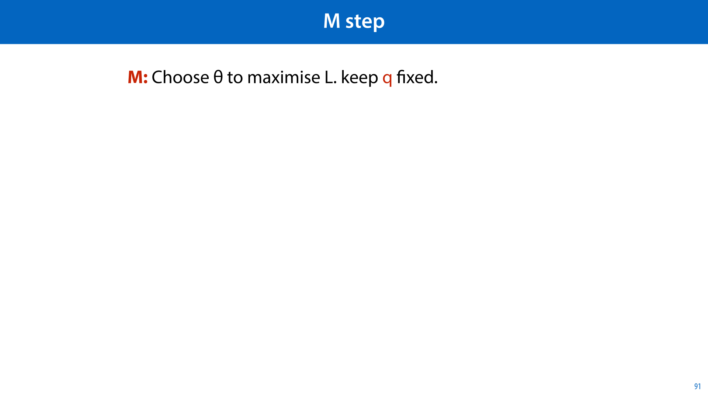

            <figcaption>
            
If we take the division out side of the logarithm, it becomes a term that does not contain θ, so we can remove it from our objective. 

The remainder is just a likelihood weighted by the responsibilities we’ve just computed.  

Note that the sum is now outside the logarithm. That means we can work out an optimal solution for the model parameters given the current q.

            </figcaption>
            click image for animation
       </section>

       <section id="slide-092" class="anim">
            <a class="slide-link" href="https://mlvu.github.io/lecture08#slide-092" title="Link to this slide.">link here</a>
            

            <figcaption>
            
Here's how that works out for the parameters of the Gaussian mixture model. If we take this criterion, and work out the maximum likelihood, we find that for the mean and covariance we get a weighted version of the maximum likelihood objective for the normal distribution. We've worked these out already in the second part (the r's here are the ω's there). 
<aside    >We work out the estimators for component 2, to make things a little more concrete. The estimators for the other components are the same, but with the component number replaced as appropriate.</aside><aside    ></aside>
            </figcaption>
            click image for animation
       </section>

       <section id="slide-093" class="anim">
            <a class="slide-link" href="https://mlvu.github.io/lecture08#slide-093" title="Link to this slide.">link here</a>
            

            <figcaption>
            
The one maximum likelihood estimator we haven't worked out yet is the one for the weights of the components. In the previous part, we just appealed to intuition and said that it makes sense to set the weights to the proportion of responsibility each component claims over the whole data. Now we can work out that this is actually the solution to the maximization objective. 

The weights should sum to one, so that part of our optimization is actually a constrained optimization problem. This gives us a good opportunity to practice our <strong>Lagrange multipliers</strong>. 

We define a Lagrangian function that includes the constraints, take its derivative with respect to all its parameters (including the multiplier α), and we set them all equal to zero. The result for the weights is an expression including α, and the result for the Lagrange multiplier recovers the constraint, as it always does. Filling the former into the latter shows us that alpha expresses the total sum of responsibility weights over all components and instances. 

This means that the optimal weight for component 2 is the amount of responsibility assigned to component 2 in the previous ste, as a proportion of the total. 

 

            </figcaption>
            click image for animation
       </section>

       <section id="slide-094" class="anim">
            <a class="slide-link" href="https://mlvu.github.io/lecture08#slide-094" title="Link to this slide.">link here</a>
            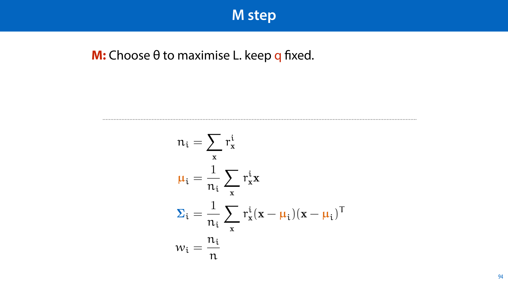

            <figcaption>
            
 

And there we have it: maximizing the log probability of the data as weighted by the responsibilites defined by q gives us exactly the estimators we came up with intuitively in the previous step.

            </figcaption>
            click image for animation
       </section>

       <section id="slide-095">
            <a class="slide-link" href="https://mlvu.github.io/lecture08#slide-095" title="Link to this slide.">link here</a>
            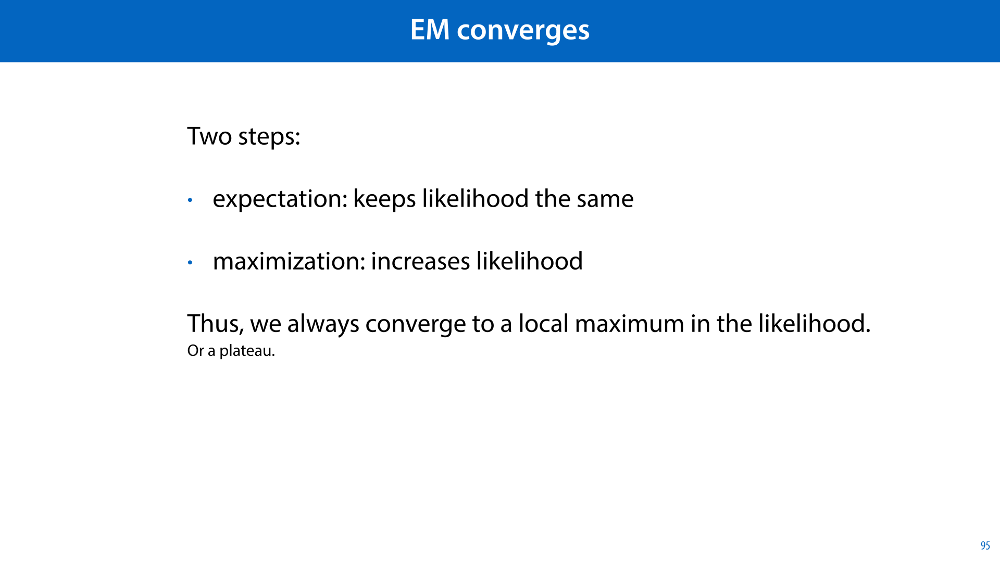

            <figcaption>
            
Thus, with the same reasoning as we saw for the rubber bands (and a lot more math), we find that we EM algorithm converged to a local maximum in the likelihood. 

Also, we have figured out a concrete way to translate the EM algorithm to other distributions. All of this works for any ditribution p and q, and it tells us exactly what to minimize and maximize in each step. So long as we can figure out how to perform those actions, we can apply the EM algorithm to any hidden variable model.

            </figcaption>
       </section>

       <section id="slide-096">
            <a class="slide-link" href="https://mlvu.github.io/lecture08#slide-096" title="Link to this slide.">link here</a>
            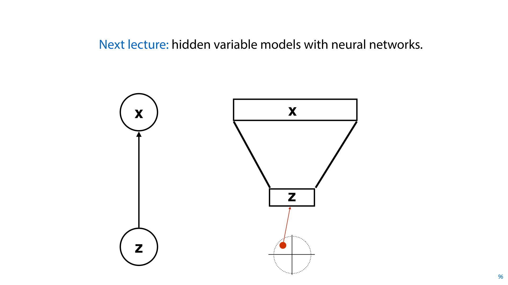

            <figcaption>
            
In the next lecture, we will return to the topic of hidden variable models. There, we'll see what to do when there's a very complicated function, like a neural network, between our hidden variable <strong>z</strong> and our observable <strong>x</strong>.

            </figcaption>
       </section>

       <section class="video" id="video-096">
           <a class="slide-link" href="https://mlvu.github.io/lecture08#video-96">link here</a>
           <iframe
                src="https://www.youtube.com/embed/r4DYGXmbk_E?modestbranding=1&showinfo=0&rel=0"
                title="YouTube video player"
                frameborder="0" allow="accelerometer; autoplay; clipboard-write; encrypted-media; gyroscope; picture-in-picture"
                allowfullscreen>
           </iframe>

       </section>

       <section id="slide-097">
            <a class="slide-link" href="https://mlvu.github.io/lecture08#slide-097" title="Link to this slide.">link here</a>
            

            <figcaption>
            
This week and the last, we’ve discussed a lot of probability theory. With these tools in hand, we can go back to our discussion on social impact, and try to make it more precise. We can now talk a lot more precisely about how to<strong> reason probabilistically</strong> and what kind of mistakes people tend to make. Unsurprisingly, such mistakes have a strong impact on the way machine learning algorithms are used and abused in society. 

<lnbr></lnbr>

            </figcaption>
       </section>

       <section id="slide-098">
            <a class="slide-link" href="https://mlvu.github.io/lecture08#slide-098" title="Link to this slide.">link here</a>
            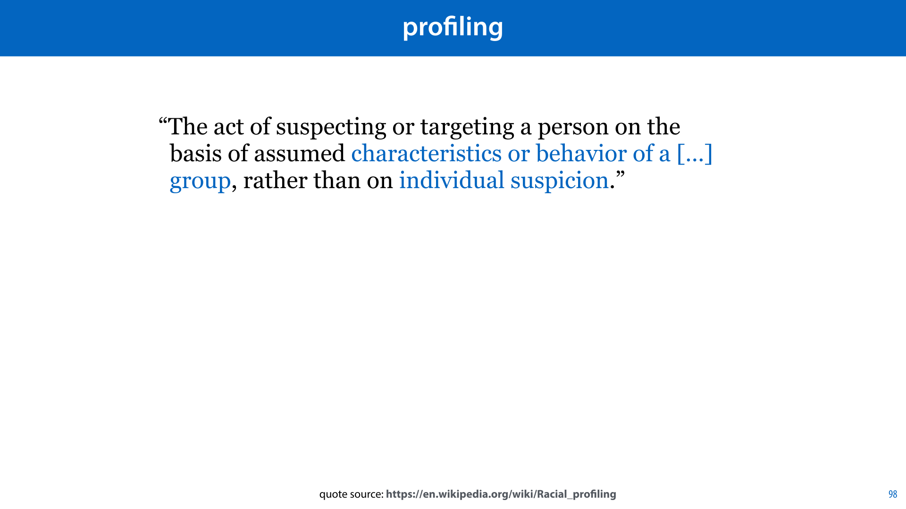

            <figcaption>
            
Specifically , in this video, we’ll look at the problem of <strong>profiling</strong>. 

When we suspect people of a crime or target them for investigation, based on their membership of a group rather than based on their individual actions, that’s called <strong>profiling</strong>.  

Probably the most common form is<strong> racial profiling</strong>; which is when the group in question is an ethnic or racial group. Examples include black people being more likely to be stopped by police, or Arabic people being more likely to be checked at airports. 

Other forms of profiling, such as gender or sexual orientation profiling also exist in various contexts.

            </figcaption>
       </section>

       <section id="slide-099">
            <a class="slide-link" href="https://mlvu.github.io/lecture08#slide-099" title="Link to this slide.">link here</a>
            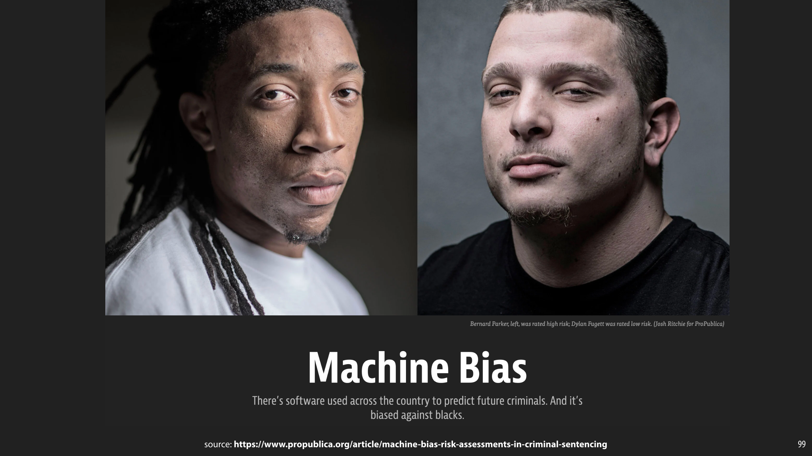

            <figcaption>
            
We saw an example of this in the first social impact video: a prediction system (essentially using machine learning) which predicted the risk of people in prison re-offending when let out. This system, built by a company called Northpointe, showed a strong racial bias.  

As we saw then, it’s not enough to just remove race as a feature. So long as race or ethnicity can be predicted from the features you do use, your model may be inferring from race.

            </figcaption>
       </section>

       <section id="slide-100">
            <a class="slide-link" href="https://mlvu.github.io/lecture08#slide-100" title="Link to this slide.">link here</a>
            

            <figcaption>
            
Profiling doesn;t just happen in automated systems. And lest you think this is a typically American problem, let’s look a little closer to home.  

A few years ago, a Dutch hip-hop artist called Typhoon was stopped by the police. The police admitted that the combination of his skin colour and the fact that he drove an expensive car played a part in the choice to stop him. This caused a small stir in the Dutch media and a nationwide discussion about racial profiling. 

The main argument usually heard is “if it works, then it is worth it.” That is, in some cases, we should accept a certain amount of racism in our criminal procedures, if it is in some way successful.  

This statements hides a lot complexity: we’re assuming that such practices are successful, and we’re not defining what being successful means in this context. Our responsibility, as academics, is to unpack such statements, and to make it more precise what is actually being said. Let’s see if we can do that here. 

We’ll focus on the supposed pros and cons of profiling and on what it means for a profiling method to be successful, regardless of whether it’s an algorithm or a human doing the profiling. 

 

            </figcaption>
       </section>

       <section id="slide-101">
            <a class="slide-link" href="https://mlvu.github.io/lecture08#slide-101" title="Link to this slide.">link here</a>
            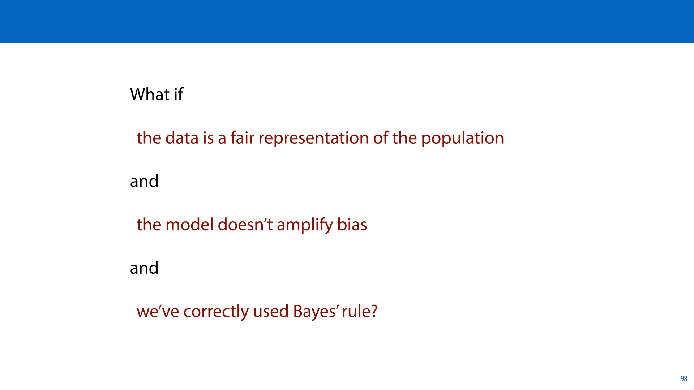

            <figcaption>
            
Since this is a sensitive subject, we’ll try to make our case as precisely as possible, and focus on a specific instance, where we have all the necessary data available: illicit drug use in the US. The US has a  system in place to record race and ethnicity in crime data. The categorization may be crude, but it’ll suffice for our purposes. 

From these graphs, we see on the left that black people engage in illicit drug use more than people of other ethnicities, and that they are also arrested for it more than people of other ethnicities. However, the rate of use is only marginally higher than that of white people, whereas the arrest rate can be as much as five times as high as that for white people,  

This points to one potential problem: racial profiling may very easily lead to disproportionate effects like those seen on the right. Even if there’s difference in the proportion with which black people and white people commit a particular crime, it’s very difficult to ensure that the profiling somehow honors that proportion. But we shouldn’t make the implicit assumption that that’s the only problem. If the proportions of the two graphs matched, would profiling then be justified? Is the problem with profiling that that we’re not doing it carefully enough, or is the problem that we’re doing it at all? 

We’ll look at some of the most common mistakes made in reasoning about profiling, one by one. 

<strong> </strong>

 

            </figcaption>
       </section>

       <section id="slide-102" class="anim">
            <a class="slide-link" href="https://mlvu.github.io/lecture08#slide-102" title="Link to this slide.">link here</a>
            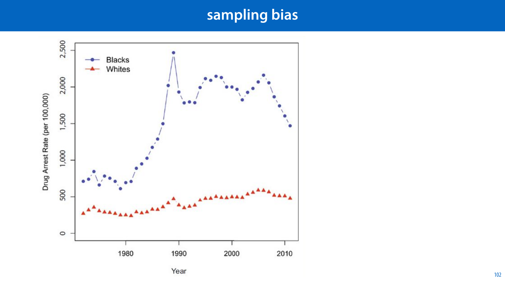

            <figcaption>
            
One problem with an automated system like that of Northpointe is that there is a strong risk of data not being sampled uniformly. If we start out with the arrest rates that we see on the right, then a system that predicts illicit drug use will see a lot more black drug users than white ones. Given such a data distribution, it’s not suprising that the system learns to associate being black with a higher rate of drug use.  

This is not because of any fundamental link between race and drug use, but purely because the data is not representative of the population. We have a<strong> sampling bias</strong>. 

It’s a bit like the example of the damaged planes in WWII we saw at the start of the fourth lecture: if we assume a uniform distribution in the data, we will conclude the wrong thing. In that case we weren’t seeing the planes that didn’t come back. Here, we aren’t seeing the white people that didn’t get arrested. 

Note that it’s not just algrithms that suffer from this problem. For instance, if we leave individual police officers to decide when to stop and search somebody, they will likely rely on their own experience, and the experience of a police officer is not uniform. There are many factors affecting human decision making, but one is that if they already arrest far more black than white people, they are extremely likely to end up with the same bias an algorithm would end up with. 

So let’s imagine that this problem is somehow solved, ande we get a perfectly representative dataset, with no sampling bias. Are we<em> then</em> justified in racial profiling? 

            </figcaption>
            click image for animation
       </section>

       <section id="slide-103" class="anim">
            <a class="slide-link" href="https://mlvu.github.io/lecture08#slide-103" title="Link to this slide.">link here</a>
            

            <figcaption>
            
You’d be forgiven for thinking that if a bias is present in the data, that the model simply reproduces that bias. In that case, given a dataset without sampling bias, we would start with the minor discrepancies on the left, and simply reproduce those. Our model would be biased, but we could make the case that it is at least reproducing biases present in society. 

However, it’s a peculiar property of machine learning models that they may actually <em>amplify</em> biases present in the data. That means that even if we start with data seen on the left, we may still end up with a predictor that disproportionately predicts drug use for black people.  

An example of this effect is seen on the right. For an image labeling tasks, the authors measured gender ratios in the training set, for subsets of particular nouns. For instances, for images containing both a wine glass and a person, we see that the probability of seeing a male or female person in the data is about 50/50, but in the predictions over a validation set, the ratio shifts to 60/40. 

It’s not entirely clear where this effect comes from. The second paper quoted shows that it’s related to our choice of inductive bias, so it’s a deep problem, that gets to the heart of the problem of induction. Even the Bayes’ optimal classifier can suffer from this problem. For our current purposes it’s enough to remember, that <strong>even if our input has biases that are representative, there’s no guarantee that our output will</strong>. 

It appears that this is a problem that may be impossible to solve. But let’s imagine, for the sake of arguments, that we somehow manage it. What if we get a perfectly representative dataset with no sampling bias, <em>and </em>we somehow ensure that our model doesn’t amplify bias. Can we then do racial profiling? 

 

            </figcaption>
            click image for animation
       </section>

       <section id="slide-104">
            <a class="slide-link" href="https://mlvu.github.io/lecture08#slide-104" title="Link to this slide.">link here</a>
            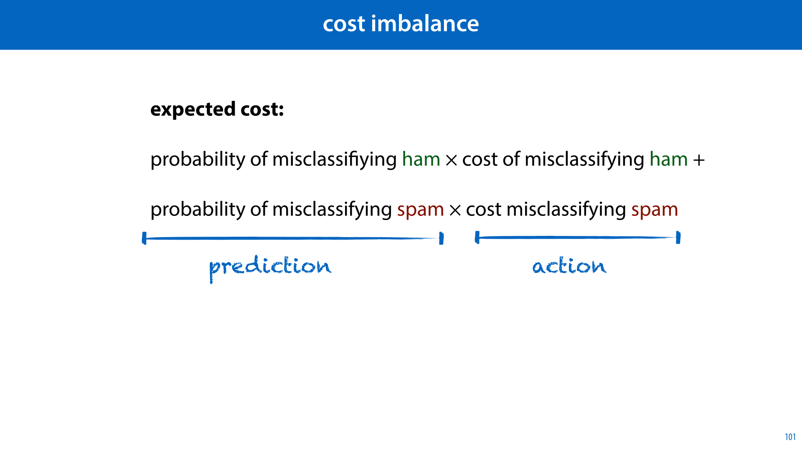

            <figcaption>
            
Much of racial profiling falls into the trap of the <strong>prosecutor’s fallacy</strong>. In this case the probability that a person uses illicit drugs, given that they’re black is very slightly higher than the probability that they do so given that they are white, so the police feel that they are justified in using ethnicity as a feature for predicting drug use (it “works”).  

However, the probability that a person uses illicit drugs given that they are black is still very much<em> lower</em> than the probability of not using illicit drugs given that they they are black. This probability is never considered.  

As we see in the previous slide the rates are around p(drugs|black) = 0.09 vs. p(~drugs|black) = 0.91. If the police blindly stop only black people, they are disadvantaging over 90% of the people they stop. 

To help you understand, consider a more extreme example of the prosecutor’s fallacy. Let’s imagine that you’re trying to find professional basketball players. The probability that somebody is tall given that they play professional basketball, p(tall| basketball) is almost precisely 1. Thus, if you’re  looking for professional basketball players, you are justified in only asking tall people. However, the probability of somebody playing professional basketball given that they’re tall, is still extremely low. That means that if you go around asking tall people whether they are profesional basketball players, you’ll end bothering a lot of people before you find your basketball player, and probably annoying quite a few of them. 

 

            </figcaption>
       </section>

       <section id="slide-105">
            <a class="slide-link" href="https://mlvu.github.io/lecture08#slide-105" title="Link to this slide.">link here</a>
            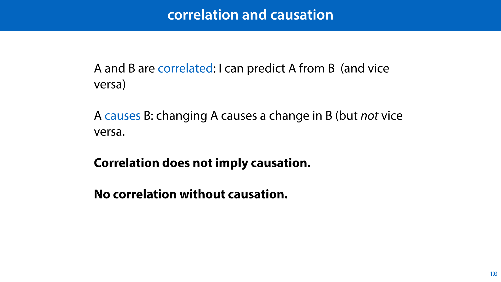

            <figcaption>
            
So, have we now covered all our bases? We get a dataset that is a fair representation, our model doesn’t amplify biases, and we correctly use Bayes’ rule.  

Can we then use the model to decide whether or not to stop black people in the street?  

The answer is still no.  

At this point, we may be certain that our <strong>predictions</strong> are accurate, and we have accurately estimated the probability accurately that a particular black person uses drugs illicitly.  

However, the fact that those predictions are accurate tells us nothing about whether the action of then stopping the person will be<strong> effective</strong>, <strong>justified</strong>, or <strong>fair</strong>. That all depends on what we are trying to achieve, and what we consider a fair and just use of police power. The accuracy of our predictions cannot help us guarantee any of this.

            </figcaption>
       </section>

       <section id="slide-106">
            <a class="slide-link" href="https://mlvu.github.io/lecture08#slide-106" title="Link to this slide.">link here</a>
            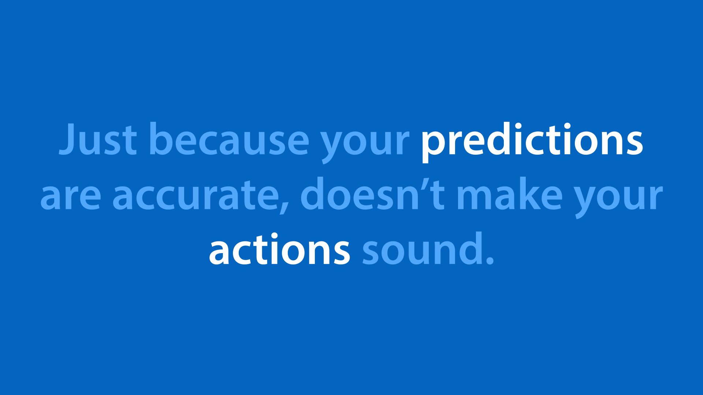

            <figcaption>
            
This is an extremely important distinction in the responsible use of AI. There is a very fundamental difference between<strong> making a prediction</strong> and<strong> taking an action </strong>based on that prediction.  

We can hammer away at our predictions until there’s nothing left to improve about them, but none of that will tell us anything about whether taking a particular action is justified. How good a prediction is and how good an action is are two entirely different questions, answered in completely different ways.

            </figcaption>
       </section>

       <section id="slide-107">
            <a class="slide-link" href="https://mlvu.github.io/lecture08#slide-107" title="Link to this slide.">link here</a>
            

            <figcaption>
            
Recall the Google translate example from the first lecture. Given a gender neutral sentence in English, we may get a prediction saying that with probability 70% the word doctor should be translated as male in Spanish and with probability 30% it should be translated as female. There are almost certainly biases in the data sampling, and there is likely to be some bias amplification in the model, but in this case we can at least define what it would mean for this probability to be accurate. For this sentence, there are true probabilities, whether frequentist or Bayesian, for how the sentence should be translated. And we can imagine an ideal model that gets those probabilities absolutely right. 

However, that tells us nothing about what we should <em>do</em> with those probabilities. Getting a 70/30 probability doesn’t mean we are justified in going for the highest probability, or in sampling by the probabilities the model suggests. Both of those options have positive consequences, such as a user getting an accurate translation, and negative consequences, such as a user getting an accurate translation and the system amplifying gender biases. 

In this case, the best solution turned out to be a clever interface design choice, rather than blindly sticking with a single output. 

            </figcaption>
       </section>

       <section id="slide-108">
            <a class="slide-link" href="https://mlvu.github.io/lecture08#slide-108" title="Link to this slide.">link here</a>
            

            <figcaption>
            
This is related to the question of cost imbalance. We may get good probabilities on whether an email is ham or spam, but until we know the cost of misclassification we don’t know which action to prefer (deleting the email or putting it in the inbox). The expected cost depends on how accurate our predictions are, but also on which actions we decide to connect to each of the predictions. This is an important point: cost imbalance is not a property of a classifier in isolation: it’s a property of a classifier, inside a larger system that takes actions. The cost imbalance for a system that deletes spam is very different from the cost imbalance in a system that moves spam to a junk folder. 

Here, we should always be on the lookout for creative solutions in how we use our predictions. Moving spam to a junk folder instead of deleting it, showing users multiple translations instead of just one, and so on. The best ways of minimizing cost don’t come from improving the model performance, but from rethinking the system around it. 

In questions of social impact, the cost of misclassification is usually extremely hard to quantify. If a hundred stop-and-searches lead to two cases of contraband found, how do we weigh the benefit of the contraband taken off the streets against the 98 stop-and-searches of innocent individuals. If the stop-and-search is done in a biased way, with all black people being searched at least once in their lifetime and most white people never being searched, then the stop-and-search policy can easily have a very damaging effect on how black people are view in society.  

It’s very easy, and very dangerous to think that we can easily quantify the cost of mistakes for systems like these. 

            </figcaption>
       </section>

       <section id="slide-109">
            <a class="slide-link" href="https://mlvu.github.io/lecture08#slide-109" title="Link to this slide.">link here</a>
            

            <figcaption>
            
<a href="https://twitter.com/OdedRechavi"><strong class="blue">https://twitter.com/OdedRechavi</strong></a> 

            </figcaption>
       </section>

       <section id="slide-110">
            <a class="slide-link" href="https://mlvu.github.io/lecture08#slide-110" title="Link to this slide.">link here</a>
            

            <figcaption>
            
A large part of choosing the right action to take based on a prediction, is separating <strong>correlation</strong> and <strong>causation</strong>. A lot of social issues, in AI and elsewhere, stem from confusions over correlation and causation, so let’s take a cerful look at these two concepts. 

Two observables, for instance, being black and using illicit drugs are correlated, if knowing the value of one can be used to predict the value of the other. It doesn’t have to be a good prediction, it just has to be better than it would be if we didn’t know the value of the first.  

This doesn’t mean that the first <strong>causes</strong> the second. I can from the smoke in my kitchen that my toast has burned, and if somebody tells me that my toaster has been on for half an hour, I can guess that there’s probably smoke in my kitchen. Only one of these causes the other. There are many technical definition of what constitutes causaility, but in general we say that A causes B if changing A causes a change in B. Turning off the toaster removes the smoke from my kitchen, but opening a window doesn’t stop my toast burning. 

 

            </figcaption>
       </section>

       <section id="slide-111">
            <a class="slide-link" href="https://mlvu.github.io/lecture08#slide-111" title="Link to this slide.">link here</a>
            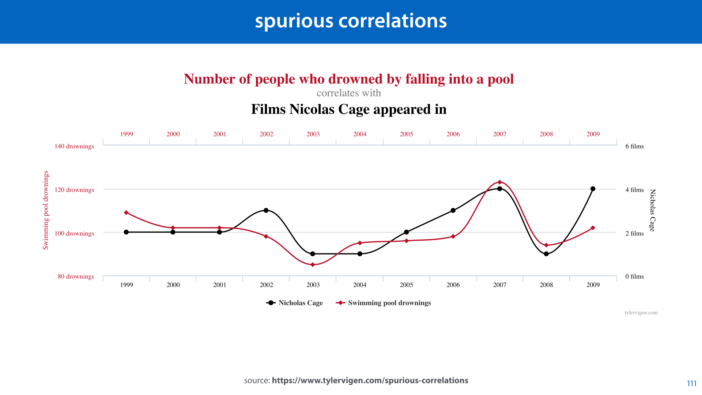

            <figcaption>
            
When talking correlation, the first thing we need to be on the lookout for is <em>spurious</em><strong> correlations</strong>. According to this data here, if we know the number of films Nicolas Cage appeared in in a given year, we can predict how many people will die by drowning in swimming pools. 

This is not because of any causal mechanism. Nicolas Cage is not driven by drowning deaths, and people do not decide to jump into their pools just because there are more Nicolas Cage movies (whatever you think of his recent career). It’s a <em>spurious correlation</em>. It looks like a relation in the data, but because we have so few examples for each, it’s possible to see such a relation by random chance (especially if you check many different potential relations).

            </figcaption>
       </section>

       <section id="slide-112">
            <a class="slide-link" href="https://mlvu.github.io/lecture08#slide-112" title="Link to this slide.">link here</a>
            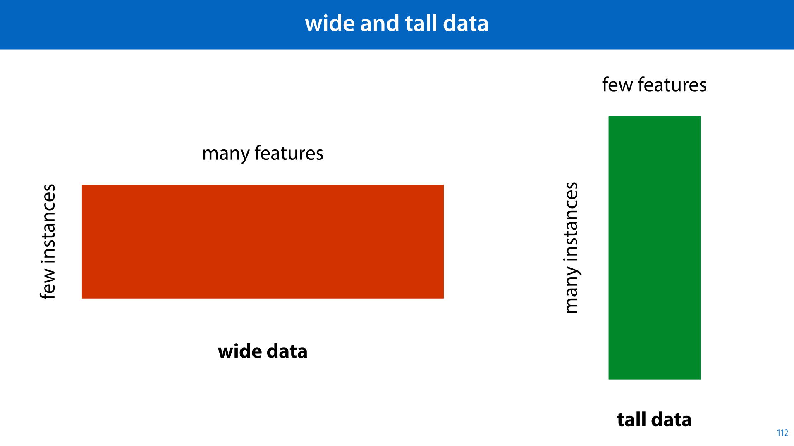

            <figcaption>
            
Gathering more data can hurt or help you here.  

The more features you have, the more likely it is that one of them can be predicted from the other purely by chance, and you will observe a correlation when there isn’t any. If we see the target label as another feature, this also tells us that using many features increases the probability of overfitting: observing good predictions on the training data without actually getting good performance. We can call this <strong>wide data</strong>. 

Adding<em> instances</em> has the opposite effect. The more instances, the more sure we can be that observed correlations are true and not spurious. We can call this <strong>tall data</strong>. 

Thus, if we are conservative with our features, and liberal with our instances, we can be more confident that any observed correlations are correct. The litmus test is to state the correlations you think are true and then<em> to test them on new data</em>. In life sciences, this is done through replication studies, where more data is gathered and the stated hypothesis from an existing piece of research is evaluated be the exact same experiment.

            </figcaption>
       </section>

       <section id="slide-113">
            <a class="slide-link" href="https://mlvu.github.io/lecture08#slide-113" title="Link to this slide.">link here</a>
            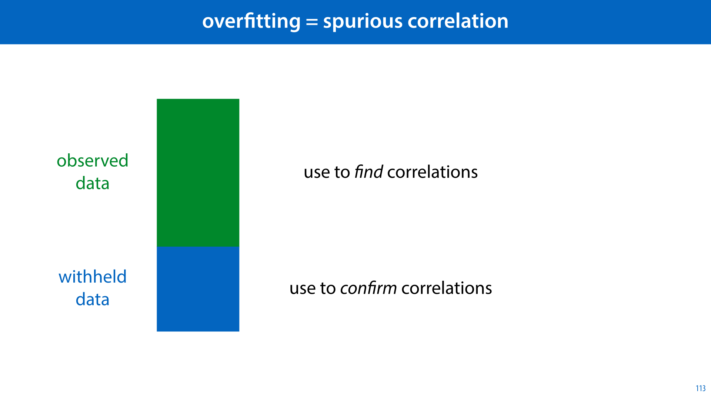

            <figcaption>
            
In machine learning, we do this whenever we withhold a test set. 

This is essentially a way of guarding against spurious correlations, or in other words, overfitting is just a spurious correlation. The definition of a spurious correlation is one that disappears when you gather more data, so if our correlation is spurious, it should not be present in the withheld data.  

A good machine learning model finds only <em>true correlations</em> and no <em>spurious correlations</em>. How to make that distinction without access to the withheld data, is the problem of induction.

            </figcaption>
       </section>

       <section id="slide-114">
            <a class="slide-link" href="https://mlvu.github.io/lecture08#slide-114" title="Link to this slide.">link here</a>
            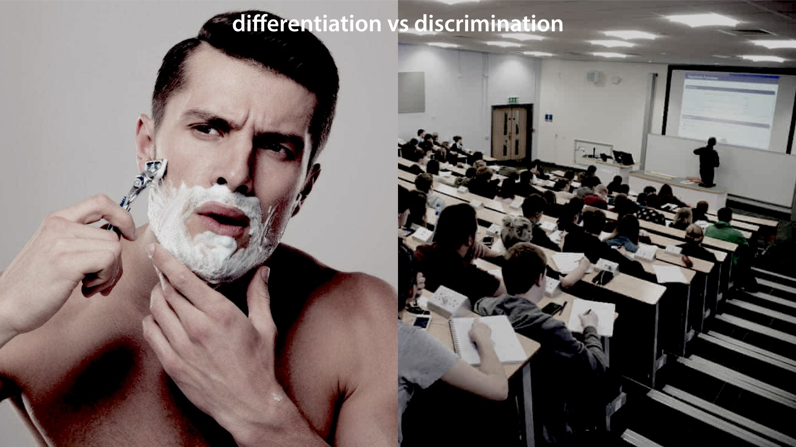

            <figcaption>
            
So if we rule out spurious correlations, what can we say that we have learned when we observe <strong>a correlation</strong>? 

If I see you have a runny nose, I can guess you have a cold. That doesn’t mean that having a runny nose causes colds. If I make the exam too difficult this year, it affects all grades, so somebody can  predict from your failing grade that other students are also likely to have a failing grade. That doesn’t mean that you caused your fellow student to fail. This is the cardinal rule of statistics: <strong>correlation is not causation</strong>. It is one that you’ve hopefully heard before. 

There is another rule, that is just as important, and a lot less famous. <strong>No correlation without causation.</strong> If we observe a correlation and we’ve proved that it isn’t spurious, there must be a causation <em>somewhere</em>. 

Simplifying things slightly, these are the ways a correlation can occur. If A and B are correlated then either A causes B, B causes A, or there is some other effect that causes both A and B (like me setting the difficulty of the exam). A cause like C is called a <strong>confounder</strong>. 

It is important to note that C doesn’t have to be a single simple cause. It could be a large network of many related causes. In fact, causal graphs like these are almost always simplifications of a more complex reality.

            </figcaption>
       </section>

       <section id="slide-115" class="anim">
            <a class="slide-link" href="https://mlvu.github.io/lecture08#slide-115" title="Link to this slide.">link here</a>
            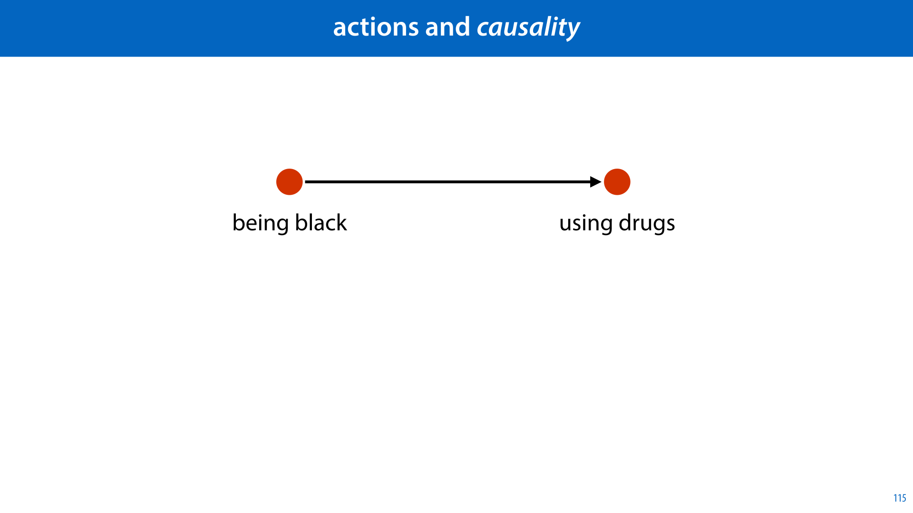

            <figcaption>
            
So let’s return to our example of illicit drug use in America. We know that there’s a small correlation between race and illicit drug use (even though there is a far greater discrepancy in arrests). What is the causal graph behind this correlation? 

At the top we see what we can call the <em>racist interpretation</em>. That is, <em>racist</em> in the literal sense: seeing race as the fundamental cause of differences in behaviour. Put simply, this interpretation assumes a fundamental, biological difference in black people that makes them more susceptible to drug addiction. Few people hold such views explicitly these days, and there is no scientific evidence for it. But it’s important to remember that this kind of thinking was much more common not too long ago. 

At the bottom, is a more modern view, backed by a large amount of scientific evidence. Being black makes you more likely to be poor, due to explicit or implicit racism in society, and being poor makes you more likely to come into contact with illicit drugs and makes you less likely to be able to escape addiction.  

There is a third effect, which I think is often overlooked: poverty begets poverty. The less money your parents have, the lower your own chances are to escape poverty. Having to live in poverty means living from paycheck to paycheck, never building up savings, never building up resilience to sudden hardship, and never being able to invest in the long term. This means that on average, you are more likely to increase your poverty than to decrease it.  

The reason all this is relevant, is that for interventions to be effective, they must be aligned to the underlying causes. In the world above, racial profiling may actually be effective (although it could still be unjust). However, in the picture below, racial profiling actually increases pressure on black people, pushing them further into poverty. Even though the police <em>feel </em>like they’re arresting more drug users, they are most likely strengthening the blue feedback loop (or one similar to it).

            </figcaption>
            click image for animation
       </section>

       <section id="slide-116" class="anim">
            <a class="slide-link" href="https://mlvu.github.io/lecture08#slide-116" title="Link to this slide.">link here</a>
            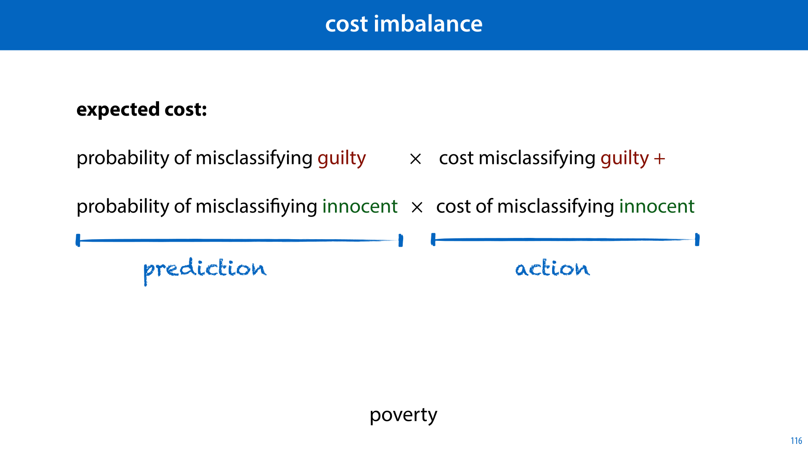

            <figcaption>
            
If we ignore data bias, and assume a perfect predictor, we still have to deal with the cost of misclassification. 

Misclassifying a guilty person can feed into this blue feedback loop. In the best case, it leads to embarrassment and loss of time for the person being searched. But there can also be more serious negative consequences.  

One subtle example is being found out for another crime than the one you were suspected of,  due to the search. For instance, imagine that the if the predictor classifies for driving a stolen car, and during the stop, marijuana is found. This may at first seem like a win: the more crimes caught, the better. However, the result of doing this <em>based on profiling</em> is again that we are feeding into the blue feedback loop. 

There is a certain level of crime that we, as society allow to pass undetected, because detecting it would have too many negative consequences. It would cost too much to detect more crime, or infringe too much on the lives of the innocent.  

This is true for any society anywhere, although every society makes the tradeoff differently. However, if we stop people because they are predicted, through profiling, to be guilty crime X, and then arrest them for crime Y, then we end up setting this level differently for black people than for white people. Essentially, by introducing a profiling algorithm for car theft, we are lowering the probability that people get away with marijuana possession, and we are lowering it further for black people than for white people. 

 

            </figcaption>
            click image for animation
       </section>

       <section id="slide-117">
            <a class="slide-link" href="https://mlvu.github.io/lecture08#slide-117" title="Link to this slide.">link here</a>
            

            <figcaption>
            
Causality plays a large role in setting the rules for what is and isn’t <em>fair</em>. In law this is described as<strong> differentiation</strong>, justly treating people differently based on their attributes and <strong>discrimination</strong>, unjustly treating people differently based on their attributes. 

For instance, if we are hiring an actor to appear in in an ad for shaving cream, we have a sound reason for preferring a male actor over a female actor, all other qualifications being the same. There is a clear, common-sense causal connection between the attribute of being male and being suitable for the role. 

If we are hiring somebody to teach machine learning at a university,  preferring a male candidate over a female one, all else being equal, is generally considered wrong, and indeed illegal.  

That is, differentiation is usually allowed, if and only if there is an unambiguous causal link between the sensitive attribute and job suitability. 

            </figcaption>
       </section>

       <section id="slide-118">
            <a class="slide-link" href="https://mlvu.github.io/lecture08#slide-118" title="Link to this slide.">link here</a>
            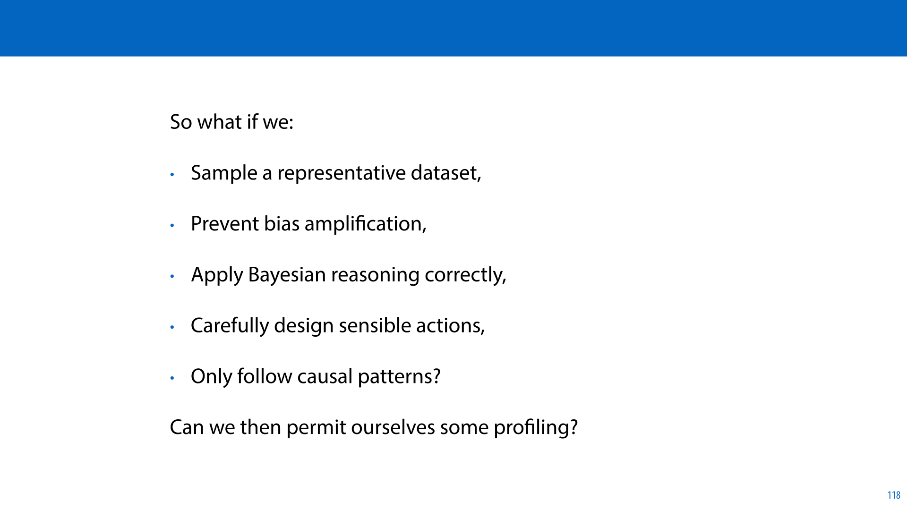

            <figcaption>
            
Let’s take one final look at our question, including everything we’ve learned. 

Say we somehow get a representative dataset, which is difficult. We somehow prevent bias amplification, which may be impossible. We apply Bayesian reasoning correctly, which is possible, we carefully design sensible actions based one some quantification of cost, which is very difficult. And we take care to consider all causal relations to avoid inadvertent costs and feedback loops,  which is difficult at best.  

Imagine a world where we can do all this, and get it right. Are we then justified in applying profiling?

            </figcaption>
       </section>

       <section id="slide-119">
            <a class="slide-link" href="https://mlvu.github.io/lecture08#slide-119" title="Link to this slide.">link here</a>
            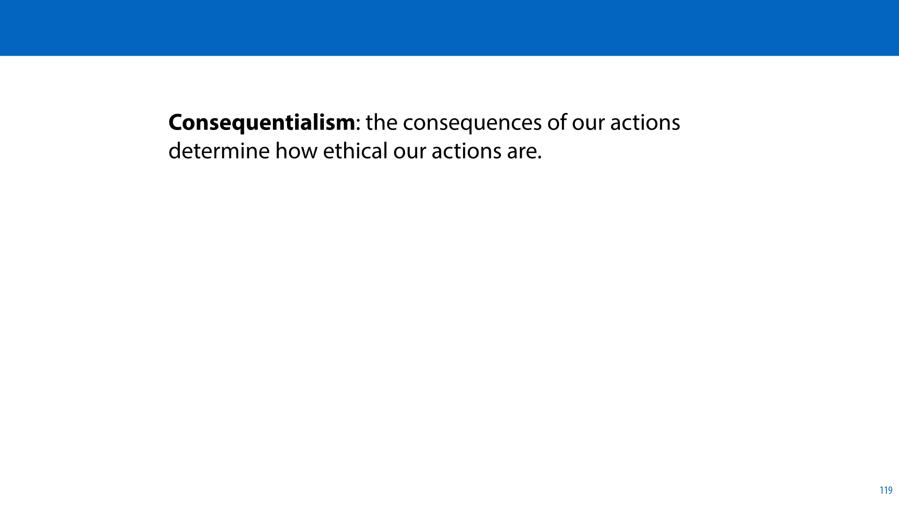

            <figcaption>
            
What we have taken so far is a purely <strong>consequentialist</strong> view. The consequences of our actions are what matters. The more positive those consequencesm the more ethical the system is, and vice versa. 

            </figcaption>
       </section>

       <section id="slide-120">
            <a class="slide-link" href="https://mlvu.github.io/lecture08#slide-120" title="Link to this slide.">link here</a>
            

            <figcaption>
            
Consider the famous trolley problem: there is a an out of control trolley thundering down the tracks towards five people, and you can throw a switch to divert it to another track with one person on it. This illustrates some of the pitfalls of consequentialist thinking. 

The consequentialist conclusion is that throwing the switch is the ethical choice. It saves five lives and sacrifices one.

            </figcaption>
       </section>

       <section id="slide-121">
            <a class="slide-link" href="https://mlvu.github.io/lecture08#slide-121" title="Link to this slide.">link here</a>
            

            <figcaption>
            
Now imagine a maverick doctor who decides that he will kill one person, harvest their organs, and use them to save five terminally ill people in need of transplants. With two kidneys, two lungs and a heart he should easily be able to find the patients to save. 

From a consequentialist perspective, this is exactly the same as the trolley problem. And yet, we can be certain that many of the people who considered throwing the switch in the trolley problem to be the ethical choice, would not be so certain now.  

Without taking a position ourselves, what is that makes the difference between these two situations? Why is the second so much less agreeable to many people?

            </figcaption>
       </section>

       <section id="slide-122">
            <a class="slide-link" href="https://mlvu.github.io/lecture08#slide-122" title="Link to this slide.">link here</a>
            

            <figcaption>
            
Without going into details, we can say that some actions are in themselves more morally disagreeable than others, regardless of the consequences. This quality, whatever it is, leads to <strong>deontological ethics</strong>. Ethical reasoning based on fundamental moral codes, regardless of consequences.  

Such codes are often tied to religion and other aspects of culture, but not always. Kant’s <em>categorical imperative</em> is an example of a rule that is not explicitly derived from some religious or cultural authority. Broadly, it states that to take an ethical action, you should only follow a rule if you would also accept it as a universal rule, applying to all. 

One aspect that crops up in deontological ethics is that of <strong>human dignity</strong>. This may be an explanation for the discrepancy between the trolley and the doctor. Flipping the switch is a brief action made under time pressure. This is in contrast to the premeditated murder and organ harvesting of an innocent person. The latter seems somehow a deeper violation of the dignity of the person, and therefore a more serious violation of ethics. 

Kant, again, considered this a foundational principle of basic morality, to treat another human being as a means to an end, rather than as an end in themselves is to violate their dignity.  

Consider the difference between killing a human being in order to eat them and killing a human being to get revenge for adultery. From a consequentialist perspective, the first has perhaps the greater utility: in both cases, someone dies, but in one of them we get a meal out of it. From the deontological perspective of human dignity, the first is the greater sin. When we cannibalize someone, we treat them as a means to filling our stomach, without regard for their humanity. When we kill out of revenge, even though it may be wrong or disproportional, we treat the other as a human being and our action is directly related to one of theirs.

            </figcaption>
       </section>

       <section id="slide-123">
            <a class="slide-link" href="https://mlvu.github.io/lecture08#slide-123" title="Link to this slide.">link here</a>
            

            <figcaption>
            
To bring this back to our example, we can now say that our analysis of racial profiling is entirely consequentialist. We have been judging the cost of our actions and trying to maximize it by building the correct kind of system. It is perhaps not surprising that a lot of AI ethics follows this kind of framework, since optimizing quantities is what we machine learning researchers do best. 

The deontological view, specifically the one focused on human dignity, gives us a completely different perspective on the problem. One that makes the correctness and efficacy of the system almost entirely irrelevant. From this perspective it is<strong> fundamentally</strong> unjust to hold a person responsible for the actions of another. If we are to be judged, it should be on our own actions, rather than on the actions of another. 

To prevent crime from being committed, or to make some reparations after a crime is committed, some people need to suffer negative consequences: this ranges from being subjected to traffic stops to paying a fine. A just system only subjects those people to these negative consequences, that committed or planned to commit the crime. From this perspective, racial profiling, even if we avoided all the myriad pitfalls, is still a fundamental violation of dignity. It treats the time and dignity of Black people as a means to an end, trading it off against some other desirable property, in this case, a reduction of crime.  

While human dignity is often posed as hard constraint: something that should never be violated, in many cases this cannot be reasonably achieved. For instance, any justice system faces the possibility of convicting innocent people for the crimes of others. The only way to avoid this is to convict no one, removing the justice system entirely. So, we allow some violation of human dignity in order that we can punish the guilty.  

However, if we do have to suffer a certain probability that our dignity will be violated, we can at least ask that such violations are doled out uniformly.

            </figcaption>
       </section>

       <section id="slide-124">
            <a class="slide-link" href="https://mlvu.github.io/lecture08#slide-124" title="Link to this slide.">link here</a>
            

            <figcaption>
            
Most of my examples in this video were from a few years ago, and our community began seriously working on these probably around the time the ProPublica piece about the Northpointe system broke, almost five years ago now. You may expect, that after all that time, and so much scrutiny, we have learned our lesson, and that at least such gross mistakes as the Northpointe scandal won’t be made again. 

Less than a month ago as this section's video was recorded, however, the Dutch government fell. In a parliamentary investigation at the end of last year, it was found that the tax service had wrongly accused an estimated 26 000 families of fraudulent claims for childcare benefits, often requiring them to pay back tens of thousand of euros, and driving them into financial difficulty. 

There were many factors at play, but an important problem that emerged was the use of what were called “self-learning systems.” In other words, machine learning. One of these, the risk-indicator, candidate lists for people to be checked for fraud. The features for this classification included, among other things the nationality of the subject (Dutch/non-Dutch). The system was a complete black box, and investigators had no insight into why people were marked as high risk. People with a risk level above 0.8 were automatically investigated, making the decision to investigate an autonomous one, made by the system without human intervention. 

<a href="https://www.groene.nl/artikel/opening-the-black-box"><strong class="blue">https://www.groene.nl/artikel/opening-the-black-box</strong></a> 

<a href="https://autoriteitpersoonsgegevens.nl/sites/default/files/atoms/files/onderzoek_belastingdienst_kinderopvangtoeslag.pdf"><strong class="blue">https://autoriteitpersoonsgegevens.nl/sites/default/files/atoms/files/onderzoek_belastingdienst_kinderopvangtoeslag.pdf</strong></a> 

 

            </figcaption>
       </section>

       <section id="slide-125">
            <a class="slide-link" href="https://mlvu.github.io/lecture08#slide-125" title="Link to this slide.">link here</a>
            

            <figcaption>
            
One of the biggest criticisms of the tax service in the child welfare scandal is how few of the people involved understood the use of algorithms in general, and the details of the algorithms they were using specifically.  

This hopefully goes some way towards explaining why we’ve felt it necessary to discuss social impact in these lectures. We’re teaching you how to build complex systems, and history has shown again and again that policy makers and project managers are happy to deploy these in critical settings without fully understanding the consequences. If those responsible for building them, that is you and me, don’t have the insight and the ability required to communicate the potential harmful social impacts of these technologies, then what chance does anybody else have? 
<aside    >image source: <a href="https://www.trouw.nl/nieuws/ouders-bij-debat-toeslagenaffaire-mijn-leven-is-naar-de-klote~bc3f3e52/"><strong class="blue">https://www.trouw.nl/nieuws/ouders-bij-debat-toeslagenaffaire-mijn-leven-is-naar-de-klote~bc3f3e52/</strong></a> </aside><aside    ></aside>
            </figcaption>
       </section>

</article>
