<nav class="menu">
    <ul>
        <li class="home"><a href="/">Home</a></li>
        <li class="name">Lecture 10: Trees and ensemblesi</li>
                <li><a href="#video-000">Decision trees</a></li>
                <li><a href="#video-021">Numeric features and targets</a></li>
                <li><a href="#video-037">Ensembling</a></li>
                <li><a href="#video-053">Boosting</a></li>
        <li class="pdf"><a href="https://mlvu.github.io/lectures/52.Trees.annotated.pdf">PDF</a></li>
    </ul>
</nav>

<article class="slides">

       <section class="video" id="video-000">
           <a class="slide-link" href="https://mlvu.github.io/lecture10#video-0">link here</a>
           <iframe
                src="https://www.youtube.com/embed/1JxBgetslSY?modestbranding=1&showinfo=0&rel=0"
                title="YouTube video player"
                frameborder="0" allow="accelerometer; autoplay; clipboard-write; encrypted-media; gyroscope; picture-in-picture"
                allowfullscreen>
           </iframe>

       </section>

       <section id="slide-001">
            <a class="slide-link" href="https://mlvu.github.io/lecture10#slide-001" title="Link to this slide.">link here</a>
            

            <figcaption>
            
We saw decision trees for the first time in the very first lectures, and we’ve seen them a few more times since. But we never actually discussed how to train them. In this lecture, we’ll look at the details of that. 

<lnbr></lnbr>

            </figcaption>
       </section>

       <section id="slide-002">
            <a class="slide-link" href="https://mlvu.github.io/lecture10#slide-002" title="Link to this slide.">link here</a>
            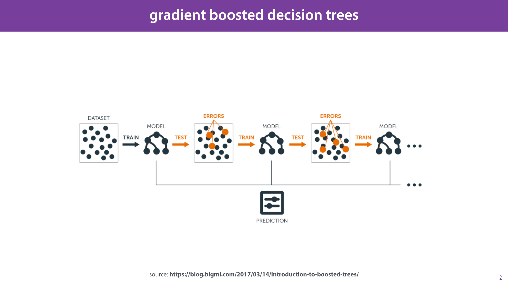

            <figcaption>
            
Decision trees by themselves are not a very popular model in modern machine learning. They are quick to train, but they can be prone to overfitting, and regularizing them hurts performance a lot.  

The main setting in which trees are used are in <strong>ensembles</strong>, a model that combines a lot of other models in order to arrive at a prediction. Spefically, the method of gradient boosted decision trees, is a very popular approach for achieving high performance with relatively little effort. In this lecture, we will build this picture up step by step: we will first discuss decision and regression trees in the first two videos, and then different ways to create model ensembles in the last two videos.

            </figcaption>
       </section>

       <section id="slide-003">
            <a class="slide-link" href="https://mlvu.github.io/lecture10#slide-003" title="Link to this slide.">link here</a>
            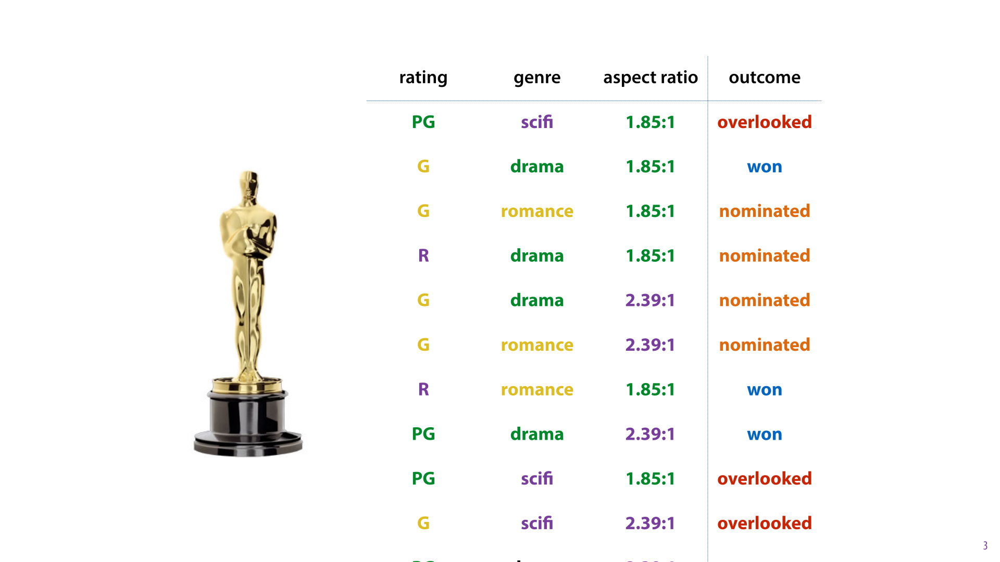

            <figcaption>
            
Decision trees in their simplest form work on data with <em>categorical</em> features. We’ll use this dataset as a running example: each instance (row) is a movie, and the target class is to predict whether a movie <strong class="blue">won</strong><strong> </strong>an oscar, was merely <strong class="orange">nominated</strong>, or <strong class="orange red">overlooked</strong>.

            </figcaption>
       </section>

       <section id="slide-004" class="anim">
            <a class="slide-link" href="https://mlvu.github.io/lecture10#slide-004" title="Link to this slide.">link here</a>
            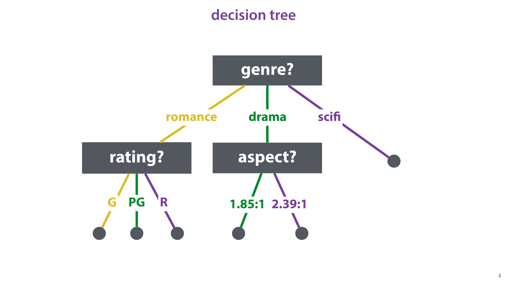

            <figcaption>
            
This is what a trained decision tree might look like. Each internal node asks the value of a particular feature, and sends the instance to one of its children dependending on the value of that feature.

            </figcaption>
            click image for animation
       </section>

       <section id="slide-005">
            <a class="slide-link" href="https://mlvu.github.io/lecture10#slide-005" title="Link to this slide.">link here</a>
            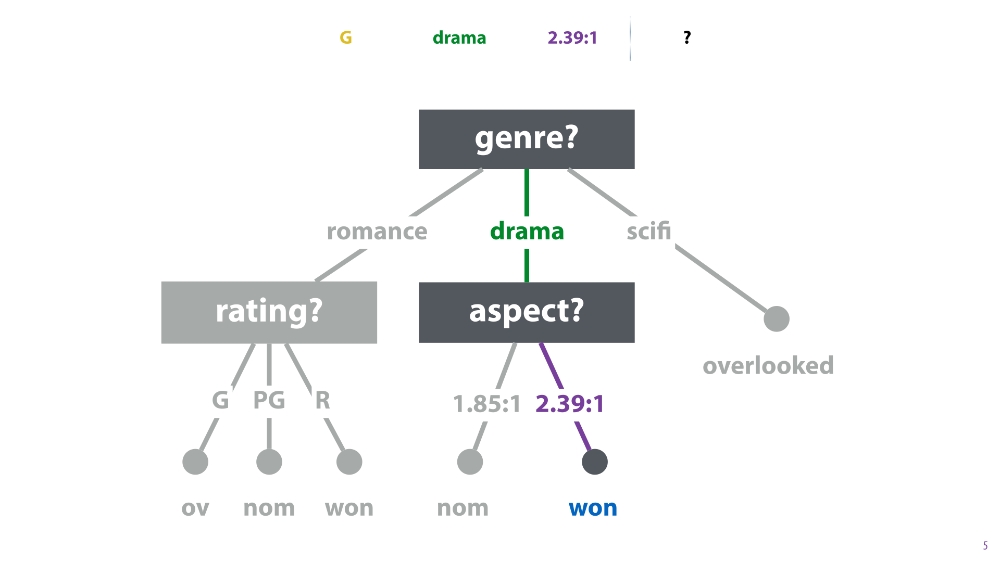

            <figcaption>
            
To classifiy an instance by this decision tree, we start at the root (the node at the top), and work our way down by answering the question in the node. 

 If we see a movie with a G rating, the genre drama, and a 2.39:1 aspect ratio, we follow the tree to the highlighted leaf node and label the example as <strong class="blue">won</strong><strong> </strong>(i.e we predict that this movie will win an oscar). 

So, given the space of all possible trees, how do we find one that fits our data well?

            </figcaption>
       </section>

       <section id="slide-006">
            <a class="slide-link" href="https://mlvu.github.io/lecture10#slide-006" title="Link to this slide.">link here</a>
            

            <figcaption>
            
This is how the basic algorithm is set up. We start with an empty tree, and add one node at a time. We don’t backtrack: once a node is added it stays in the tree, and we keep adding nodes until we can add no more. 

The node we add at any given moment, is the node that creates the <strong>least uniform distribution</strong> on the classes, after the split. Let’s look at an example to see how this works. 

            </figcaption>
       </section>

       <section id="slide-007">
            <a class="slide-link" href="https://mlvu.github.io/lecture10#slide-007" title="Link to this slide.">link here</a>
            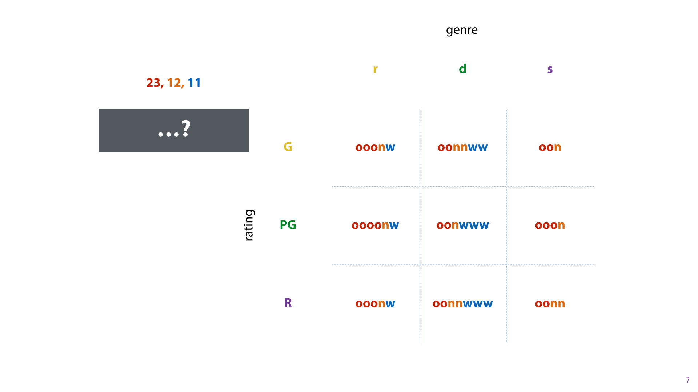

            <figcaption>
            
Here, we’ve plotted our data for two features (ignoring the third for the moment). We’re choosing the root node of our tree

            </figcaption>
       </section>

       <section id="slide-008">
            <a class="slide-link" href="https://mlvu.github.io/lecture10#slide-008" title="Link to this slide.">link here</a>
            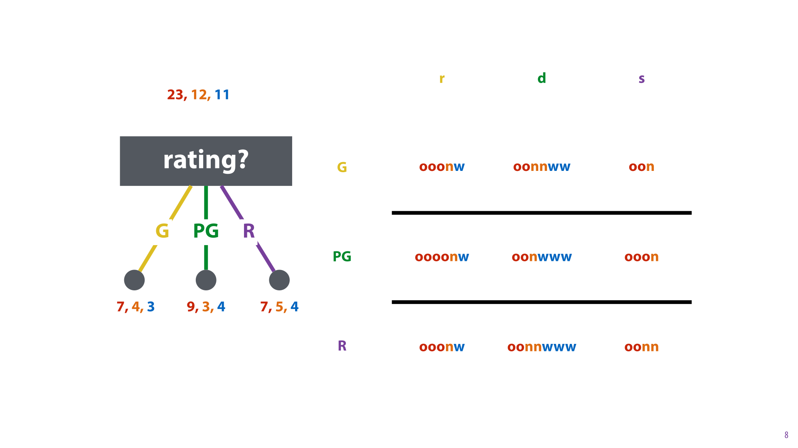

            <figcaption>
            
If we split by rating, we get three segments (the three rows on the right). Tallying up the proportions of each class, we see that the proportions of the segments are not that different from the proportions in the whole. In other words, knowing the value of the rating doesn’t doesn;doesn’t change the information we have about the class very much.

            </figcaption>
       </section>

       <section id="slide-009">
            <a class="slide-link" href="https://mlvu.github.io/lecture10#slide-009" title="Link to this slide.">link here</a>
            

            <figcaption>
            
On the other hand, if we split by genre we see that the resulting distributions are much more different: knowing that a movie has the genre <strong class="purple">scifi</strong>, allows us to say with near certainty that it won’t win an oscar.

            </figcaption>
       </section>

       <section id="slide-010">
            <a class="slide-link" href="https://mlvu.github.io/lecture10#slide-010" title="Link to this slide.">link here</a>
            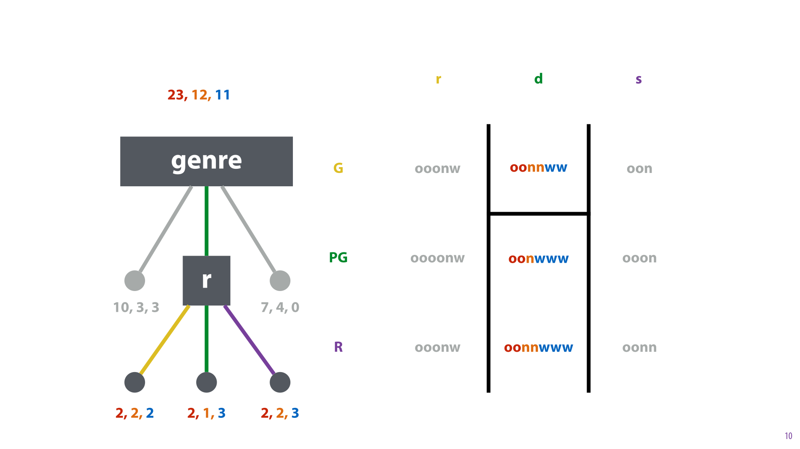

            <figcaption>
            
If we split by genre and then by rating, we get this segmentation of the instance space. Each of these regions, corresponding to a leaf node is called a <strong>segment</strong>.

            </figcaption>
       </section>

       <section id="slide-011">
            <a class="slide-link" href="https://mlvu.github.io/lecture10#slide-011" title="Link to this slide.">link here</a>
            

            <figcaption>
            
We choose a separate split for each node we extend. For each of the three children of the genre node, we may choose different features to split on.

            </figcaption>
       </section>

       <section id="slide-012">
            <a class="slide-link" href="https://mlvu.github.io/lecture10#slide-012" title="Link to this slide.">link here</a>
            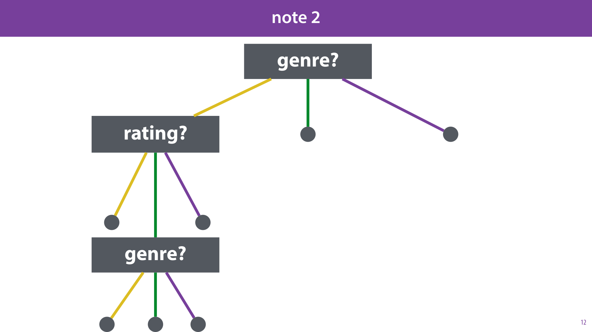

            <figcaption>
            
There’s no use (with categorical features) in splitting on the same feature twice. Every instance that encounters the lower genre node will have the yellow genre, so we’re not splitting the data at all.

            </figcaption>
       </section>

       <section id="slide-013">
            <a class="slide-link" href="https://mlvu.github.io/lecture10#slide-013" title="Link to this slide.">link here</a>
            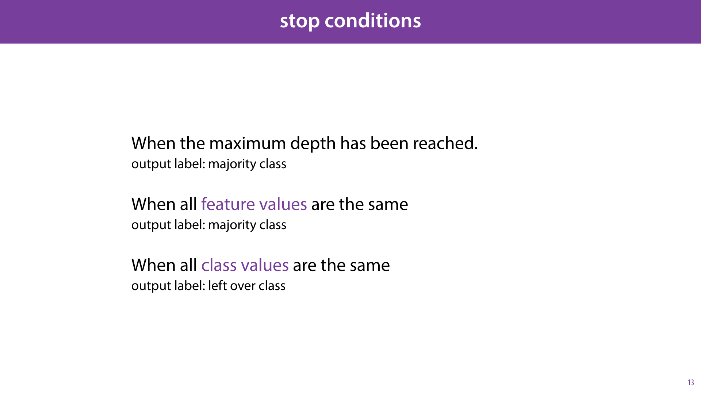

            <figcaption>
            
The maximum depth is an optional hyperparameter. We can also train without a maximum depth and rely only on the other two stop conditions.

            </figcaption>
       </section>

       <section id="slide-014">
            <a class="slide-link" href="https://mlvu.github.io/lecture10#slide-014" title="Link to this slide.">link here</a>
            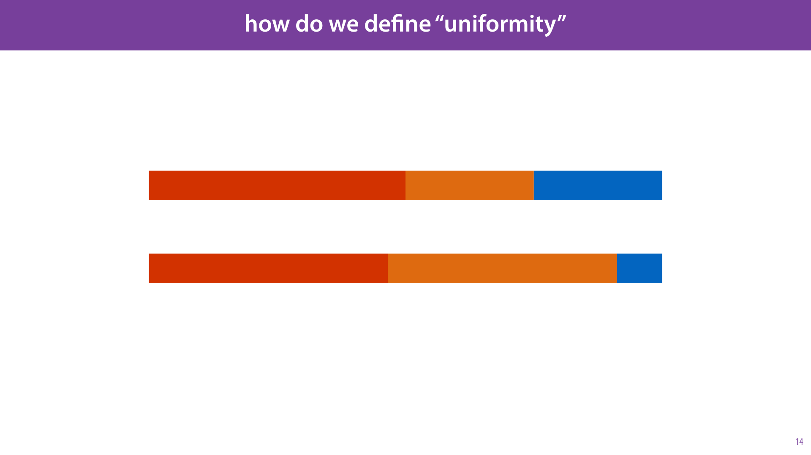

            <figcaption>
            
In order to make this into a proper algorithm we need to make this more precise. The best feature to split on is the one that creates (averaged over all child nodes) the most non-uniform class distribution in the resulting segment.  

How do we measure the non-uniformity of a distribution? It’s straightforward for two classes (the further from 50/50 the less uniform), but for more than two classes, it’s not so clear cut. Here we see two distributions. In the first, the proportion of the red class is bigger than in the second, but in the second the remainder is divided up between blue and orange in a more non uniform way. Which of these two distributions is less uniform?

            </figcaption>
       </section>

       <section id="slide-015">
            <a class="slide-link" href="https://mlvu.github.io/lecture10#slide-015" title="Link to this slide.">link here</a>
            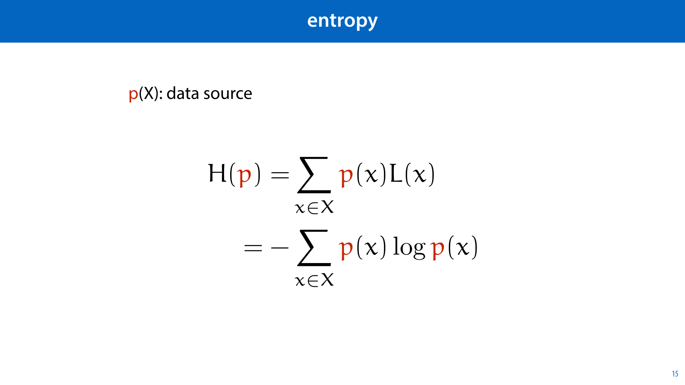

            <figcaption>
            
To answer this, we need to look back to the first probability lecture, where we encountered <em>Entropy</em>.

            </figcaption>
       </section>

       <section id="slide-016">
            <a class="slide-link" href="https://mlvu.github.io/lecture10#slide-016" title="Link to this slide.">link here</a>
            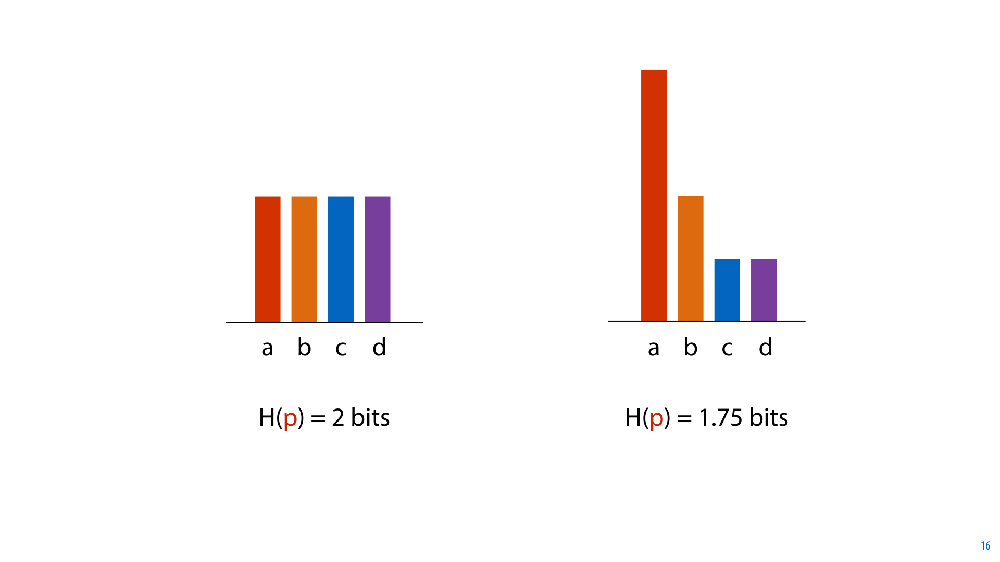

            <figcaption>
            
The more uniform our distribution is (the more unsure we are) the higher the entropy. This kind of uniformity over the class distribution is what we are trying to achieve in our splits.

            </figcaption>
       </section>

       <section id="slide-017">
            <a class="slide-link" href="https://mlvu.github.io/lecture10#slide-017" title="Link to this slide.">link here</a>
            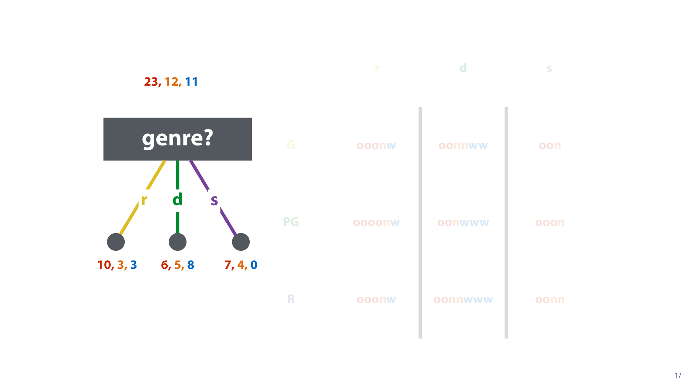

            <figcaption>
            
So we can use entropy to establish how uneven a class distribution is, and the more uneven, the better we like the split. But to evaluate this split here, we need to look at four different distributions: the three after the split and the one before (remember, we are evaluating all possible splits over the whole tree, so the incoming distribution may differ between candidates).

            </figcaption>
       </section>

       <section id="slide-018" class="anim">
            <a class="slide-link" href="https://mlvu.github.io/lecture10#slide-018" title="Link to this slide.">link here</a>
            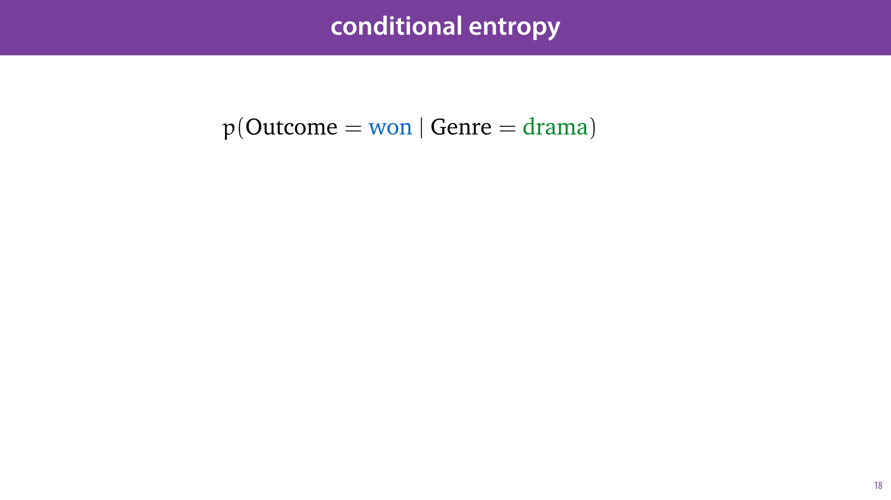

            <figcaption>
            
To apply this to the multiple children that a split creates, we can use <strong>conditional entropy</strong>. Conditional entropy is just the entropy of a conditional distribution, summed over all values of the conditional, weighted by the marginal probability of that value.

            </figcaption>
            click image for animation
       </section>

       <section id="slide-019">
            <a class="slide-link" href="https://mlvu.github.io/lecture10#slide-019" title="Link to this slide.">link here</a>
            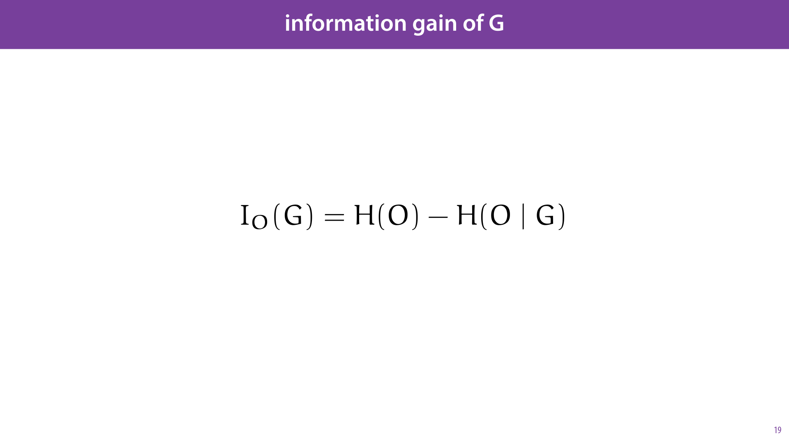

            <figcaption>
            
The <strong>information gain</strong> measures how much knowing the value of G decreases the entropy of O (i.e. increases what we know about O).

            </figcaption>
       </section>

       <section id="slide-020" class="anim">
            <a class="slide-link" href="https://mlvu.github.io/lecture10#slide-020" title="Link to this slide.">link here</a>
            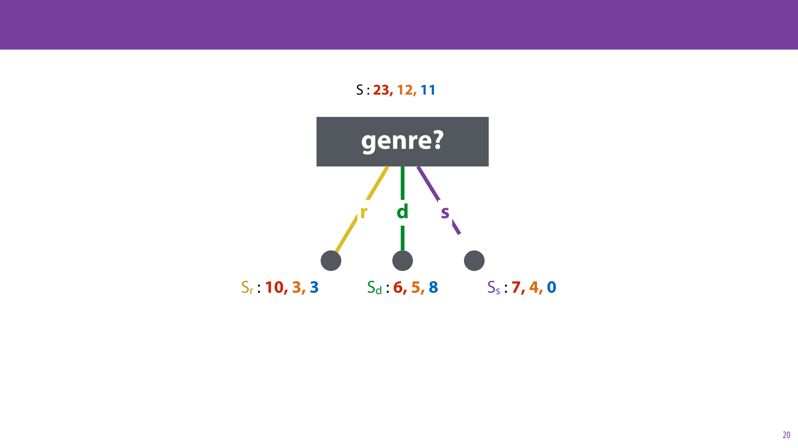

            <figcaption>
            
In practice that gives us this formula, for the information gain of a split. If the set of instances before the split is S, and the split gives us subsets Si, the information gain is the entropy of S minus the sum of the entropies of the split sets, each weighted by the proportion of instances of S contained in Si. 

When we compute the entropy of a set like S, we just use the relative frequencies to estimate the probabilities. For instance, we estimate the probability of the<strong> </strong><strong class="orange red">red class</strong><strong> </strong>in S as <strong class="orange red">23</strong>/(<strong class="orange red">23</strong>+<strong class="orange">12</strong>+<strong class="blue">11</strong>).

            </figcaption>
            click image for animation
       </section>

       <section id="slide-021">
            <a class="slide-link" href="https://mlvu.github.io/lecture10#slide-021" title="Link to this slide.">link here</a>
            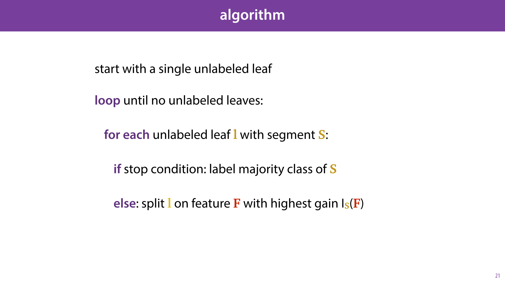

            <figcaption>
            

            </figcaption>
       </section>

       <section class="video" id="video-021">
           <a class="slide-link" href="https://mlvu.github.io/lecture10#video-21">link here</a>
           <iframe
                src="https://www.youtube.com/embed/y6pHc1iB6a0?modestbranding=1&showinfo=0&rel=0"
                title="YouTube video player"
                frameborder="0" allow="accelerometer; autoplay; clipboard-write; encrypted-media; gyroscope; picture-in-picture"
                allowfullscreen>
           </iframe>

       </section>

       <section id="slide-022">
            <a class="slide-link" href="https://mlvu.github.io/lecture10#slide-022" title="Link to this slide.">link here</a>
            

            <figcaption>
            
<lnbr></lnbr>

            </figcaption>
       </section>

       <section id="slide-023">
            <a class="slide-link" href="https://mlvu.github.io/lecture10#slide-023" title="Link to this slide.">link here</a>
            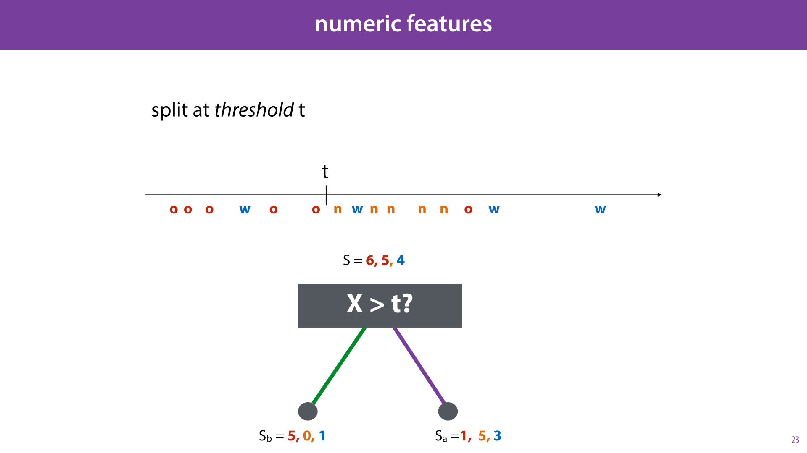

            <figcaption>
            
If our dataset contains numeric features, we can deal with this by choosing a<strong> threshold</strong> t. The node splitting on a numeric features splits the segment in two: the instance for which the feature is lower than t go to one child, and the instances for which the features is higher go to the other. 

To compute the optimal threshold we only need to look at numeric values halfway between two instances with a different class. We compute the information gain for each and choose the threshold which provides the highest information gain.

            </figcaption>
       </section>

       <section id="slide-024">
            <a class="slide-link" href="https://mlvu.github.io/lecture10#slide-024" title="Link to this slide.">link here</a>
            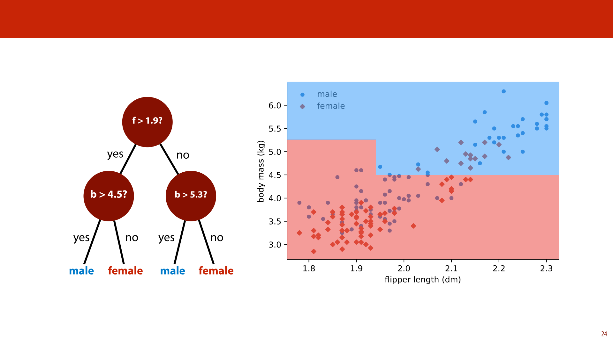

            <figcaption>
            
We saw a classifier with numeric features in the opening lecture.

            </figcaption>
       </section>

       <section id="slide-025">
            <a class="slide-link" href="https://mlvu.github.io/lecture10#slide-025" title="Link to this slide.">link here</a>
            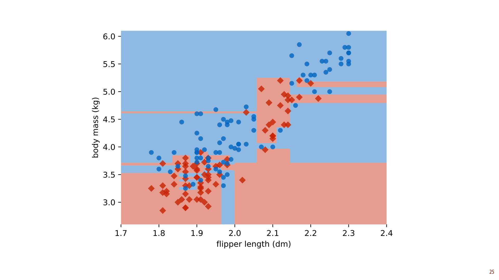

            <figcaption>
            
When training an actual decision tree on these two numeric features, we saw quite a complex decision boundary emerge.  

This is possible with only two features because with numeric features<strong> it </strong><em>does </em><strong>make sense to split twice on the same feature</strong>; we just have to split on a different threshold each time.

            </figcaption>
       </section>

       <section id="slide-026">
            <a class="slide-link" href="https://mlvu.github.io/lecture10#slide-026" title="Link to this slide.">link here</a>
            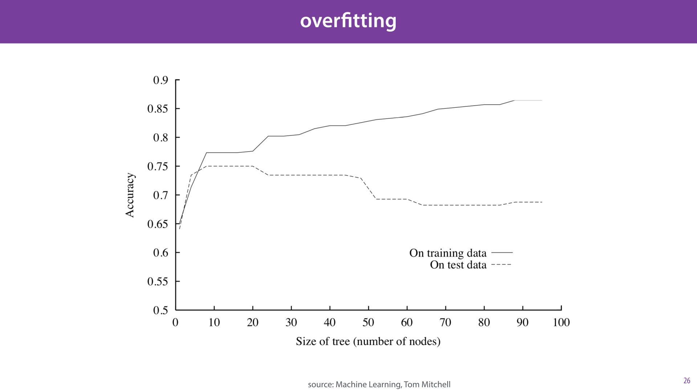

            <figcaption>
            
Which brings us to the problem of overfitting. The larger the tree grows, the more likely it is to overfit the data. For this plot, the size of the tree is limited to a particular maximum. As the maximum grows, the training accuracy increases, but the test accuracy decreases. A clear sign that the model is overfitting.  
<aside    >Source: Machine Learning, Tom Mitchell</aside><aside    ></aside>
            </figcaption>
       </section>

       <section id="slide-027">
            <a class="slide-link" href="https://mlvu.github.io/lecture10#slide-027" title="Link to this slide.">link here</a>
            

            <figcaption>
            
To reduce overfitting, we can <strong>prune</strong> a tree. 

After training the full tree, we work backwards from the leaves. For each leaf, we check (on withheld data) whether the tree classifier better with the leaf or without. If it works better without, we remove the node.We keep pruning leaves until the performance stops improving.

            </figcaption>
       </section>

       <section id="slide-028">
            <a class="slide-link" href="https://mlvu.github.io/lecture10#slide-028" title="Link to this slide.">link here</a>
            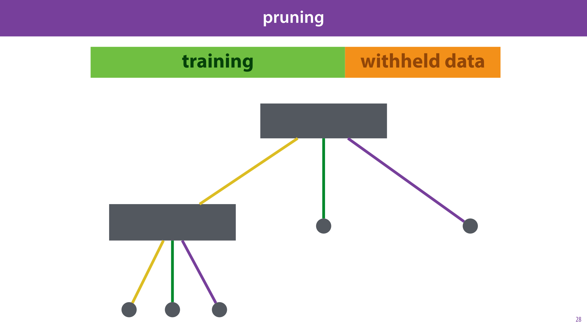

            <figcaption>
            

            </figcaption>
       </section>

       <section id="slide-029">
            <a class="slide-link" href="https://mlvu.github.io/lecture10#slide-029" title="Link to this slide.">link here</a>
            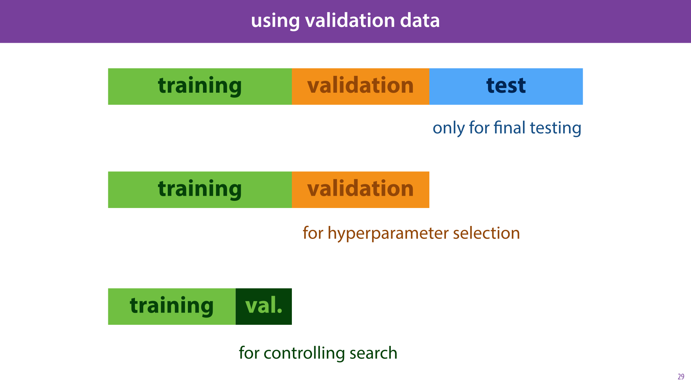

            <figcaption>
            
It’s important to note that when we use a validation set to guide search, that we are using validation data to select our model. This means that if we are also using a validation set, for instance to select whether we’ll use a kNN classifier or a decision tree, the pruning should happen on a withheld part of the training data, and not on the same validation data that we use to do our hyperparameter selection.  

To see why, imagine what happens when we train our final model (supposing that we’ve selected a decision tree). During training, we can’t use the test set to do our pruning. We can only see the test set when we’ve decided what our final model is going to be. The first train/validation split should simulate this,situation, so we can’t use the orange validation set for controlling search.  
<aside    >This also goes for early stopping in neural networks.</aside><aside    ></aside>
            </figcaption>
       </section>

       <section id="slide-030">
            <a class="slide-link" href="https://mlvu.github.io/lecture10#slide-030" title="Link to this slide.">link here</a>
            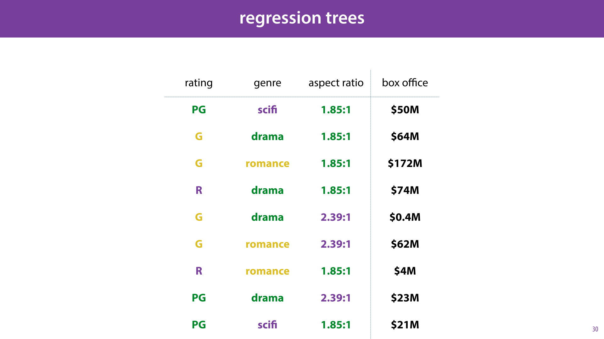

            <figcaption>
            
We’ve seen classification trees that use numerical <em>features</em>, but what if the <strong>target label</strong> is numerical? In this case, the model is called a <em>regression</em><strong> tree</strong>. 

            </figcaption>
       </section>

       <section id="slide-031" class="anim">
            <a class="slide-link" href="https://mlvu.github.io/lecture10#slide-031" title="Link to this slide.">link here</a>
            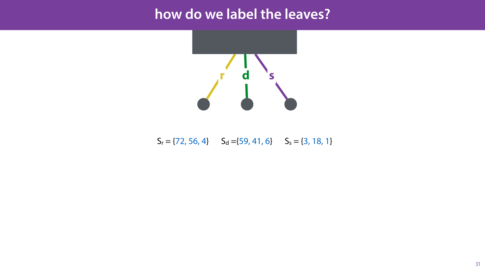

            <figcaption>
            
We can label the leaves with the mean or the median of the training instances in the resulting segment.

            </figcaption>
            click image for animation
       </section>

       <section id="slide-032" class="anim">
            <a class="slide-link" href="https://mlvu.github.io/lecture10#slide-032" title="Link to this slide.">link here</a>
            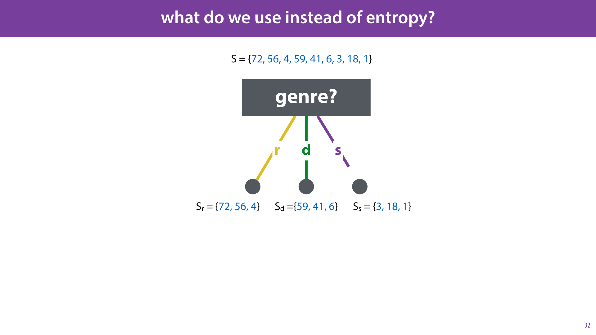

            <figcaption>
            
We can’t compute entropy over the target values because most likely, they’ll all be different. However variance measures a very similar property: the bigger the spread in the set of output labels, the less certain we are about what the value of the leaf node should be. The best split results in a large reduction of average variance over the created segments.

            </figcaption>
            click image for animation
       </section>

       <section id="slide-033">
            <a class="slide-link" href="https://mlvu.github.io/lecture10#slide-033" title="Link to this slide.">link here</a>
            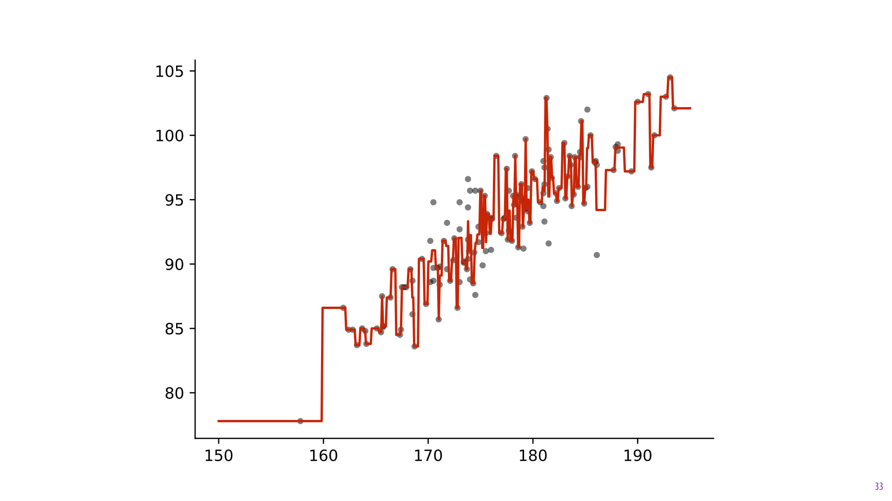

            <figcaption>
            
As we saw in the first lecture, here’s what a regression tree looks like over one numeric feature.

            </figcaption>
       </section>

       <section id="slide-034">
            <a class="slide-link" href="https://mlvu.github.io/lecture10#slide-034" title="Link to this slide.">link here</a>
            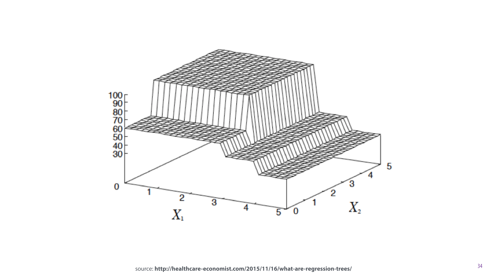

            <figcaption>
            
 

And here’s what it looks like for two numeric features. 

source: <a href="http://healthcare-economist.com/2015/11/16/what-are-regression-trees/"><strong class="blue">http://healthcare-economist.com/2015/11/16/what-are-regression-trees/</strong></a>

<a href="http://healthcare-economist.com/2015/11/16/what-are-regression-trees/"><strong class="blue"></strong></a>

            </figcaption>
       </section>

       <section id="slide-035">
            <a class="slide-link" href="https://mlvu.github.io/lecture10#slide-035" title="Link to this slide.">link here</a>
            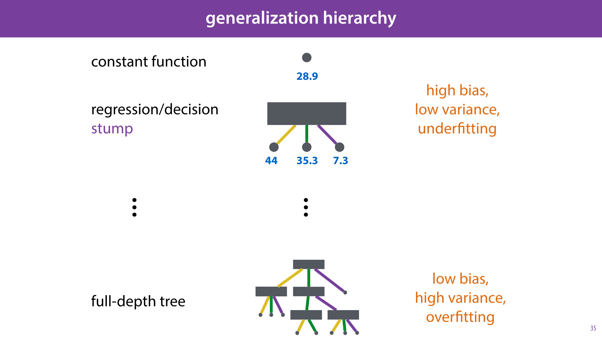

            <figcaption>
            
Tree models are a classic example of a model class that provides a <strong>generalization hierarchy</strong>. At one end, the model class provides both very simple, low capacity models like <strong>constant models</strong>, which output just one value for all instances (i.e. a tree without splits) and <strong>stumps</strong>, models that make just one split. These are low capacity models with high bias and low variance, that generalize a lot. 

At the other end are full-depth tree models, which are very likely to memorise irrelevant details of the data, and overfit a lot.

            </figcaption>
       </section>

       <section id="slide-036">
            <a class="slide-link" href="https://mlvu.github.io/lecture10#slide-036" title="Link to this slide.">link here</a>
            

            <figcaption>
            
Single decision trees are not very popular any more. To make them effective, we need to train many of them and combine them into a single model. These are called decision or regression <strong>forests</strong>, and they’re an example of a <strong>model ensemble</strong>, which we’ll discuss in the next part.

            </figcaption>
       </section>

       <section id="slide-037">
            <a class="slide-link" href="https://mlvu.github.io/lecture10#slide-037" title="Link to this slide.">link here</a>
            

            <figcaption>
            

            </figcaption>
       </section>

       <section class="video" id="video-037">
           <a class="slide-link" href="https://mlvu.github.io/lecture10#video-37">link here</a>
           <iframe
                src="https://www.youtube.com/embed/9ikKZYxsfbg?modestbranding=1&showinfo=0&rel=0"
                title="YouTube video player"
                frameborder="0" allow="accelerometer; autoplay; clipboard-write; encrypted-media; gyroscope; picture-in-picture"
                allowfullscreen>
           </iframe>

       </section>

       <section id="slide-038">
            <a class="slide-link" href="https://mlvu.github.io/lecture10#slide-038" title="Link to this slide.">link here</a>
            

            <figcaption>
            
<strong>Ensembling </strong>is the business of combining multiple models into one. The hope is that this gives you a model that is more than the sum of its parts. 

<lnbr></lnbr>

            </figcaption>
       </section>

       <section id="slide-039">
            <a class="slide-link" href="https://mlvu.github.io/lecture10#slide-039" title="Link to this slide.">link here</a>
            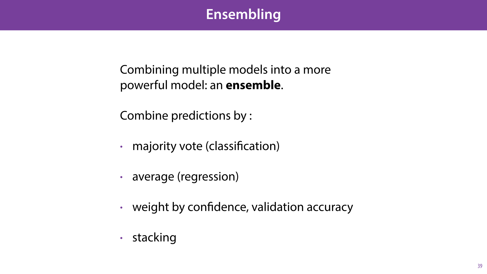

            <figcaption>
            
Your collection of models is called the ensemble. In the simplest form of ensembling, each model in the ensemble can be trained in isolation as you would normally train it. 

After you train a bunch of separate models, you need to somehow <strong>combine</strong> their predictions. The simplest approach in classification is to take a majority vote among the ensemble. The simplest approach in regression is to average the outputs. You can also take a weighted vote, perhaps giving greater weight to the predictions of models that have greater confidence, or models that perform better on a held out validation set. 

A more complex approach is <strong>stacking.</strong> 

            </figcaption>
       </section>

       <section id="slide-040" class="anim">
            <a class="slide-link" href="https://mlvu.github.io/lecture10#slide-040" title="Link to this slide.">link here</a>
            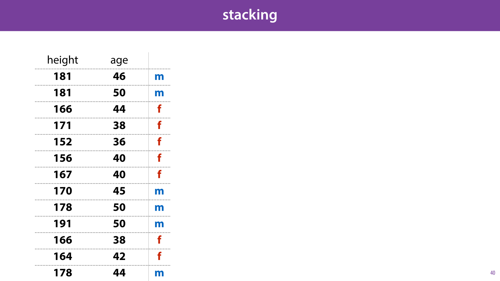

            <figcaption>
            
Imagine that we have a simple dataset, that we train three models on. These could be any three models. For instance, the three different models we saw in the first lecture, three neural networks, with different initializations, or three kNN models with different values of k. Each of them gives us a prediction for every instance in our dataset. 

            </figcaption>
            click image for animation
       </section>

       <section id="slide-041">
            <a class="slide-link" href="https://mlvu.github.io/lecture10#slide-041" title="Link to this slide.">link here</a>
            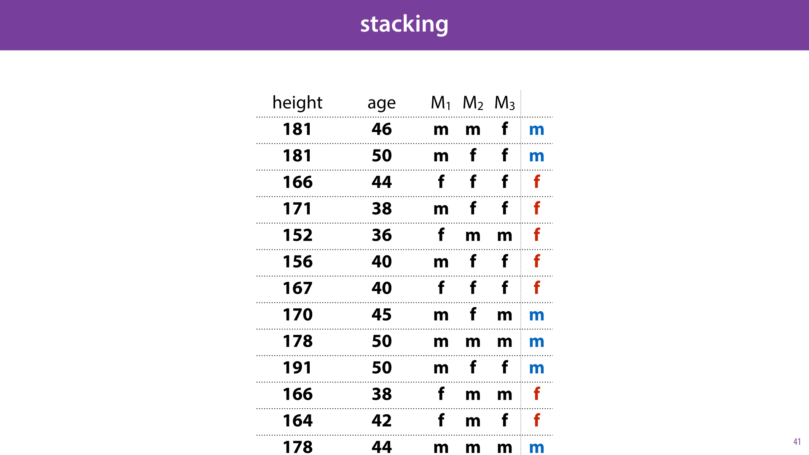

            <figcaption>
            
The idea of stacking is that we treat these predictions as features themselves, for another classifier. The simplest way to think of this is as adding these predictions to our dataset as columns.  

We then train a new model, called a <strong>combiner</strong>, on this new, extended data. The combiner can choose to how to combine the “expert advice” of the original models, and it can even use the original features to learn which expert to listen to in which part of the feature space.

            </figcaption>
       </section>

       <section id="slide-042">
            <a class="slide-link" href="https://mlvu.github.io/lecture10#slide-042" title="Link to this slide.">link here</a>
            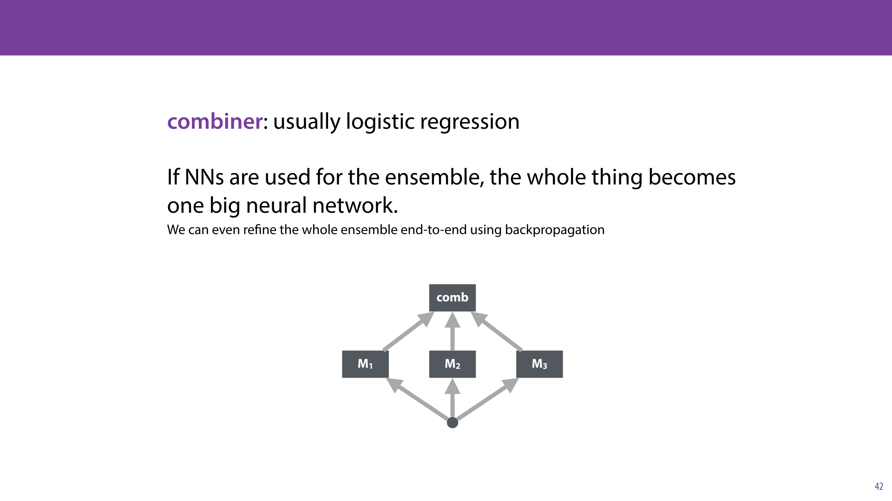

            <figcaption>
            
In general, the combiner is a simple, low-variance model like a logistic regression.  

If we use stacking in combination with differentiable models like neural nets, then the stacked model is also fully differentiable, and can be finetuned end-to-end by backpropagation.

            </figcaption>
       </section>

       <section id="slide-043">
            <a class="slide-link" href="https://mlvu.github.io/lecture10#slide-043" title="Link to this slide.">link here</a>
            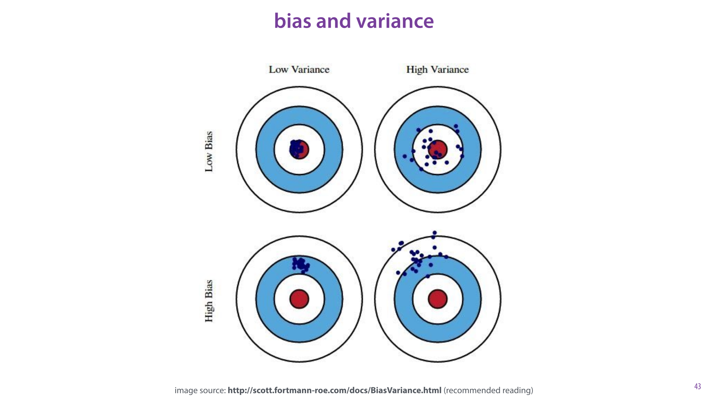

            <figcaption>
            
That is all very ad-hoc. To get a better handle on exactly what we’re trying to achieve with ensembling, we need to look back to bias and variance.  

Here is a little visual reminder.  

If we have many darts hitting close together, but far away from the bulls-eye, we have high bias. If the darts are spread out, but their average is the bulls-eye, we have high variance. It’s important to remember that in this analogy sampling a dataset and training a model together counts as one dart. To get a second dart, we need a new dataset to train a new model on. That’s not usually a luxury we have, so normally we can’t be exactly sure whether our error is due to high bias or high variance, but with tricks like resampling the data, we can often get a pretty good idea. 

image source: <a href="http://scott.fortmann-roe.com/docs/BiasVariance.html"><strong class="blue">http://scott.fortmann-roe.com/docs/BiasVariance.html</strong></a>

<a href="http://scott.fortmann-roe.com/docs/BiasVariance.html"><strong class="blue"></strong></a>

            </figcaption>
       </section>

       <section id="slide-044" class="anim">
            <a class="slide-link" href="https://mlvu.github.io/lecture10#slide-044" title="Link to this slide.">link here</a>
            

            <figcaption>
            
We’ll start with learners, a model together with its search algorithm, that have <strong>high variance</strong>. We also call these <strong>unstable learners.</strong> These may get a good performance, but slight perturbations in the data can throw that performance off. 

These are the kinds of models that tend to show overfitting, like kNN regression with a low k values, or a regression tree with no regularization. Bias and variance are only precisely defined for regression problems, but the basic intuition carries over to classification. An unstable learner is one that tends to overfit.

            </figcaption>
            click image for animation
       </section>

       <section id="slide-045">
            <a class="slide-link" href="https://mlvu.github.io/lecture10#slide-045" title="Link to this slide.">link here</a>
            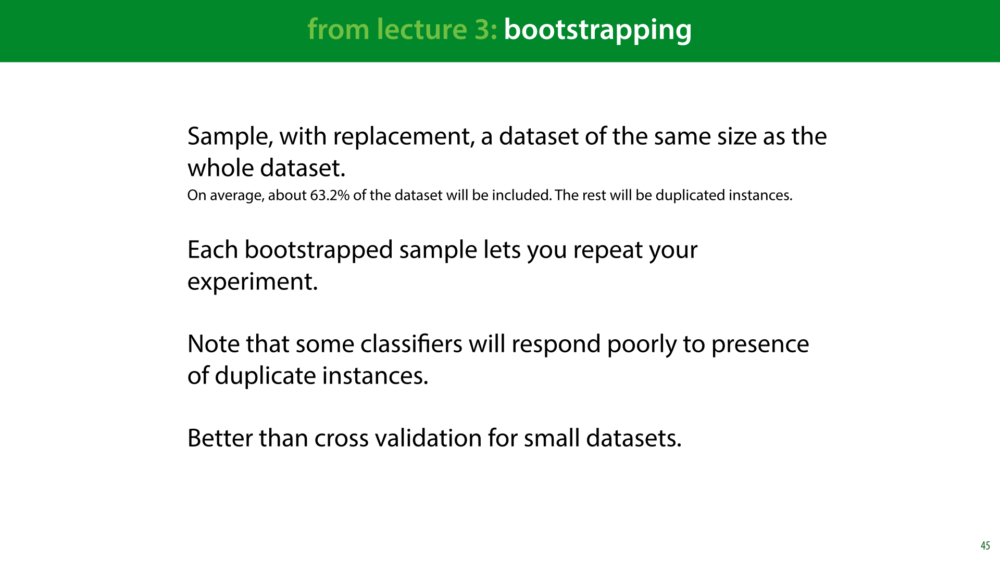

            <figcaption>
            
In lecture Methodology 2, we saw a method for simulating the sampling of multiple datasets form the source of our original data: <strong>bootstrapping</strong>. We can use bootstrapping both to get an idea of our bias/variance tradeoff and as a way to help us build an ensemble. 

Before we do that, however, lets’ see why bootstrapping works so well. It’s more than just an intuitive trick. We can make precise exactly how it approximates our data distribution.

            </figcaption>
       </section>

       <section id="slide-046">
            <a class="slide-link" href="https://mlvu.github.io/lecture10#slide-046" title="Link to this slide.">link here</a>
            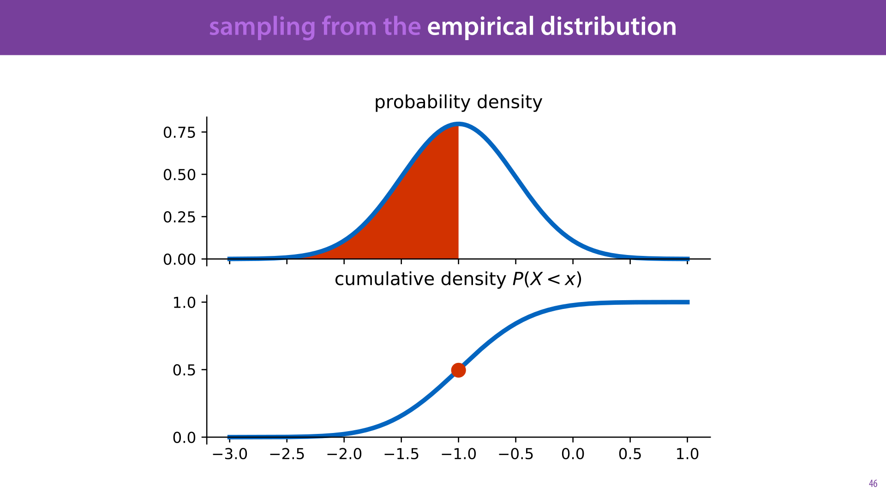

            <figcaption>
            
To make this clear, we’ll imagine that we’re sampling single scalars from a normal distribution.  

In this case, we can look at the <strong>cumulative density function </strong>(CDF). This tells us the probability of sampling a point below x. Note that this function returns a probability, not a density. It always groes from 0 to 1 over the domain of the probability distribution. Both the cumulative density function and the probability desnity function uniquely determine the probability distribution.

            </figcaption>
       </section>

       <section id="slide-047">
            <a class="slide-link" href="https://mlvu.github.io/lecture10#slide-047" title="Link to this slide.">link here</a>
            

            <figcaption>
            
If we sample 5 points from the original normal distribution, and then re-sample one point from that dataset, we are essentially sampling from the green CDF. This is called the <strong>empirical distribution</strong>: the distribution we get by resampling one point in our dataset.

            </figcaption>
       </section>

       <section id="slide-048">
            <a class="slide-link" href="https://mlvu.github.io/lecture10#slide-048" title="Link to this slide.">link here</a>
            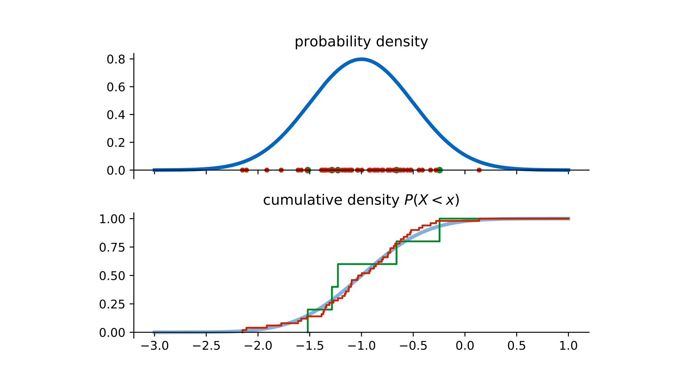

            <figcaption>
            
If we increase the size of the original data (to 50 points), we see that the empirical CDF becomes a better approximation of the true CDF

            </figcaption>
       </section>

       <section id="slide-049">
            <a class="slide-link" href="https://mlvu.github.io/lecture10#slide-049" title="Link to this slide.">link here</a>
            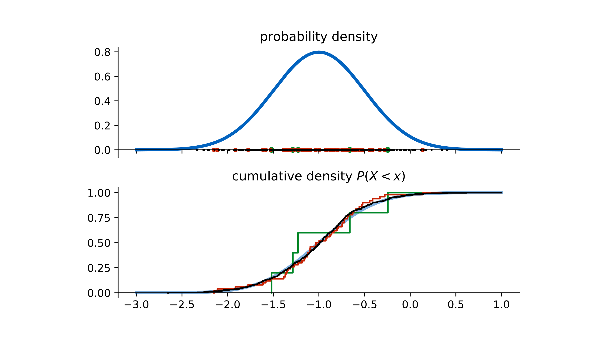

            <figcaption>
            
At 500 points, the empirical CDF and the original CDF are almost indistinguishable. This is why bootstrapping is often preferred over other resampling methods like cross validation. In this was we can show that a bootstrapped sample from a large dataset mimics the original data distribution. 

This can help us to measure the bias and variance of a learner. It can also help us to build an ensemble.

            </figcaption>
       </section>

       <section id="slide-050">
            <a class="slide-link" href="https://mlvu.github.io/lecture10#slide-050" title="Link to this slide.">link here</a>
            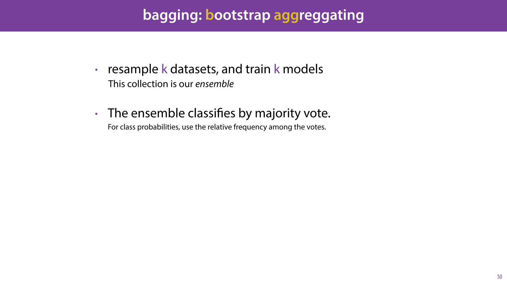

            <figcaption>
            
This is called <strong>bootstrap aggregating,</strong> or <strong>bagging</strong> for short. We  don’t change the way we train the models in our ensemble, we just resample the data by bootstrapping. 

This is most often done with classifiers. In that case, after the ensemble is trained, we simply take a majority vote to get the ensemble prediction. If we want class probabilities, we can use the relative frequencies of each class among the predictions.

            </figcaption>
       </section>

       <section id="slide-051" class="anim">
            <a class="slide-link" href="https://mlvu.github.io/lecture10#slide-051" title="Link to this slide.">link here</a>
            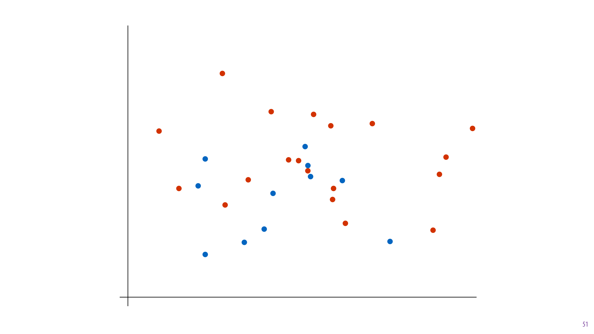

            <figcaption>
            
Here’s a simple example. We train a set of linear classifiers on bootstrap samples of our data. Each produces a slightly different linear decision boundary (indicates by a dotted line). We now build an ensemble that looks at what each of these classifiers says, and picks the majority class among those predictions. This gives us a piecewise linear decision boundary: every time two decision boundaries in the ensemble cross, the majority changes. So long as they don’t cross, we end up following one of the original linear decision boundaries. 

source: adapted from <em>Machine Learning</em> by Peter Flach, figure 11.1

            </figcaption>
            click image for animation
       </section>

       <section id="slide-052">
            <a class="slide-link" href="https://mlvu.github.io/lecture10#slide-052" title="Link to this slide.">link here</a>
            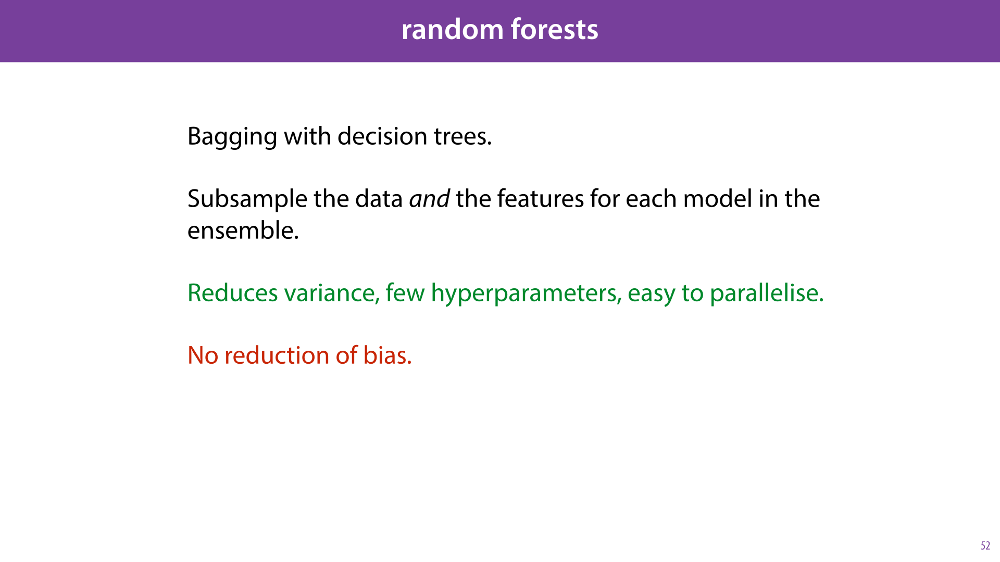

            <figcaption>
            
One simple instantiation of bagging is the <strong>random forest</strong>. Here, we train a boostrapped ensemble of decision trees and for each we subsample both the instances, and the features we include (both the rowas and the columns of the data matrix). 

            </figcaption>
       </section>

       <section id="slide-053">
            <a class="slide-link" href="https://mlvu.github.io/lecture10#slide-053" title="Link to this slide.">link here</a>
            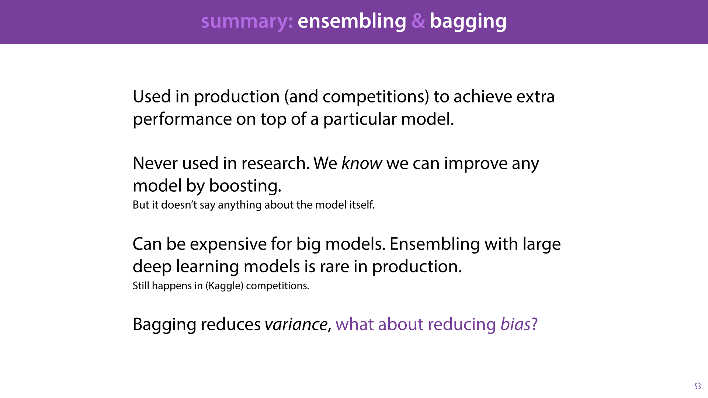

            <figcaption>
            

            </figcaption>
       </section>

       <section class="video" id="video-053">
           <a class="slide-link" href="https://mlvu.github.io/lecture10#video-53">link here</a>
           <iframe
                src="https://www.youtube.com/embed/mSLRpkynW9Y?modestbranding=1&showinfo=0&rel=0"
                title="YouTube video player"
                frameborder="0" allow="accelerometer; autoplay; clipboard-write; encrypted-media; gyroscope; picture-in-picture"
                allowfullscreen>
           </iframe>

       </section>

       <section id="slide-054">
            <a class="slide-link" href="https://mlvu.github.io/lecture10#slide-054" title="Link to this slide.">link here</a>
            

            <figcaption>
            
<lnbr></lnbr>

            </figcaption>
       </section>

       <section id="slide-055" class="anim">
            <a class="slide-link" href="https://mlvu.github.io/lecture10#slide-055" title="Link to this slide.">link here</a>
            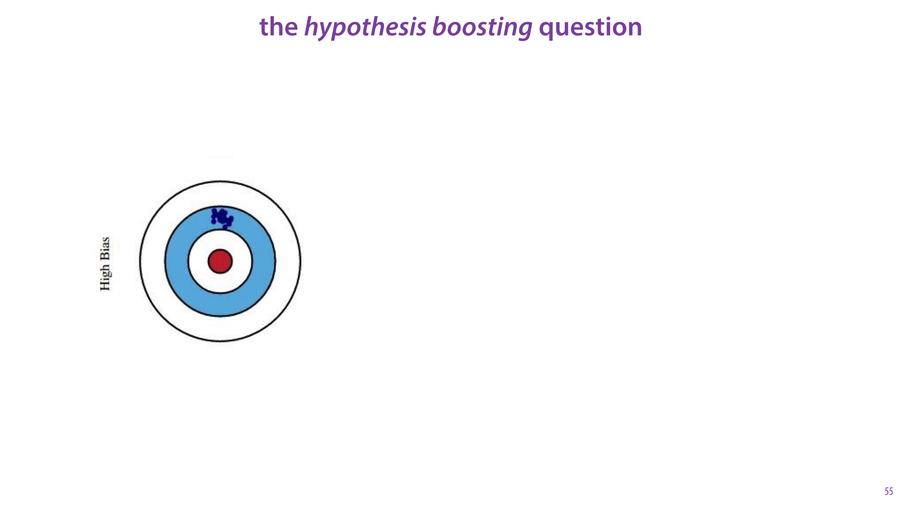

            <figcaption>
            
In the previous video, we saw the ensembling method of bagging in action. 

Bagging helps for models with high variance and low bias. If we have the opposite, a learner with high bias and low variance, can we achieve the same? This is the <strong>hypothesis boosting</strong> question , where hypothesis is a synonym for a learner or model. Is there an ensembling method that allows us to create a series of models from a family with high bias, like linear models or decision stumps, and to create an ensemble that together has low bias (possibly at the expense of a higher variance). 

In other words, can we turn an underfitting model into an ovefitting model by ensembling. Can we, for instance, put lots of linear classifiers together to draw complex, highly nonlinear shapes.

            </figcaption>
            click image for animation
       </section>

       <section id="slide-056">
            <a class="slide-link" href="https://mlvu.github.io/lecture10#slide-056" title="Link to this slide.">link here</a>
            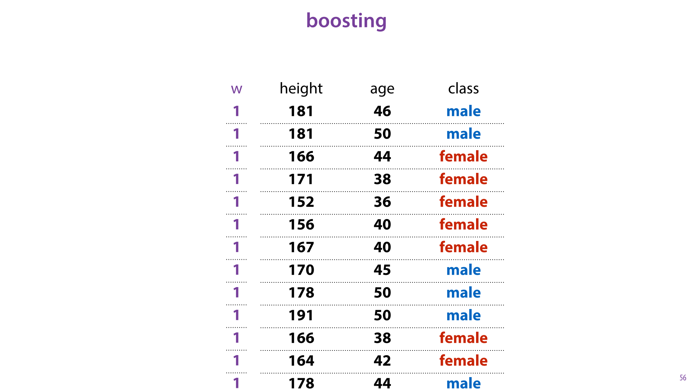

            <figcaption>
            
Most boosting methods work by adding a <strong class="purple">weight</strong> to each instance in the data.  

For each new model, we lower the weights of the points that the previous models got right, and increase the weight of the points that the previous models got wrong. We then train the next model to focus on this reweighed version of the data.

            </figcaption>
       </section>

       <section id="slide-057">
            <a class="slide-link" href="https://mlvu.github.io/lecture10#slide-057" title="Link to this slide.">link here</a>
            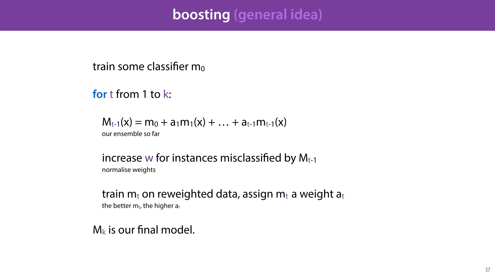

            <figcaption>
            

            </figcaption>
       </section>

       <section id="slide-058">
            <a class="slide-link" href="https://mlvu.github.io/lecture10#slide-058" title="Link to this slide.">link here</a>
            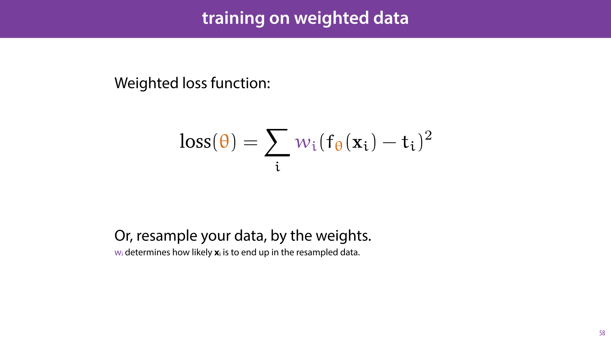

            <figcaption>
            
How do we train on a weighted dataset? If we have a loss function, we can just make the sum over the loss of each instance a weighted sum. We saw examples of weighted maximum likelihood loss in the lecture on density estimation. 

If our model isn’t trained by an explicit loss function, like for instance the tree models in the first two videos, we can resample the dataset, and make the instance with higher weights more likely to be sampled. Think of this as a kind of weighted bootstrapping.

            </figcaption>
       </section>

       <section id="slide-059">
            <a class="slide-link" href="https://mlvu.github.io/lecture10#slide-059" title="Link to this slide.">link here</a>
            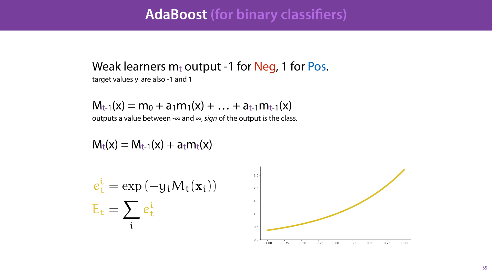

            <figcaption>
            
There are a few ways to instantiate this general idea of boosting. 

We’ll first take a look at <strong>AdaBoost</strong> (which stands for <em>adaptive</em> boosting), which is a principled derivation for how to set the weights wi, and and the model weight at. 

We assume we’ve already trained the ensemble up to model mt-1, giving us ensemble model Mt-1. We now need to make two choices: which model mt to choose (or what loss to minimize when training this model) and which model weight at to assign it.  

To do so, we first define the error (aka the loss) for the ensemble at step t, and then choose mt and at to minimize this loss.

            </figcaption>
       </section>

       <section id="slide-060" class="anim">
            <a class="slide-link" href="https://mlvu.github.io/lecture10#slide-060" title="Link to this slide.">link here</a>
            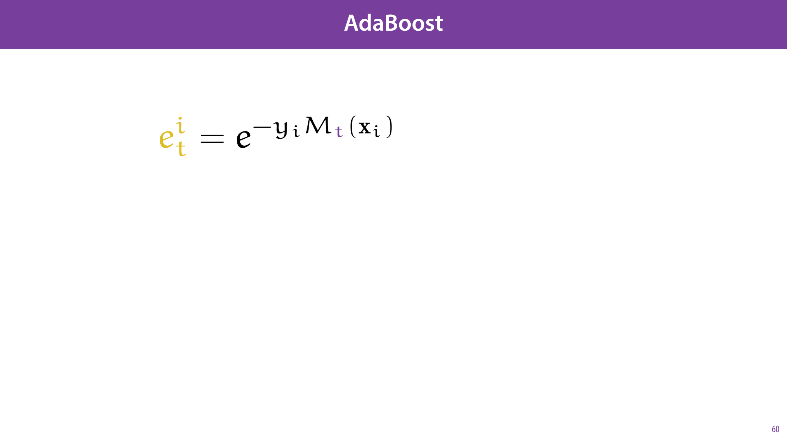

            <figcaption>
            
We can rewrite the per-instance loss to separate the error cause by the ensemble so far, and the loss caused by our choice of model mt. The first is a constant (since the ensemble up to mt-1 has already been chosen), which becomes the weight wi of instance <strong>x</strong>i.

            </figcaption>
            click image for animation
       </section>

       <section id="slide-061" class="anim">
            <a class="slide-link" href="https://mlvu.github.io/lecture10#slide-061" title="Link to this slide.">link here</a>
            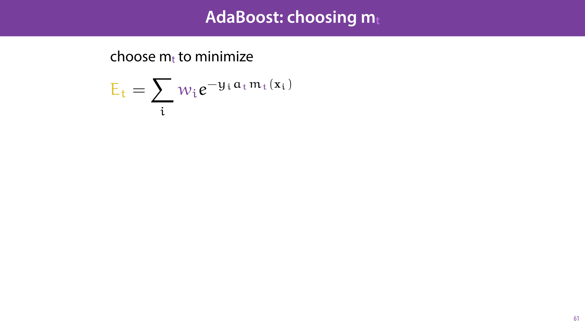

            <figcaption>
            
For the total loss, we can split the sum into the instance that are correctly classified and the instances that are incorrectly classified. This means the exponents become constants in the sum and can be move to the front. Line five is not an equal function, but minimising line four is the same as minimising line 5. In the last line, all the greyed out parts are constant with respect to mt: Wc and Wi each depend on which classifier we choose, but their sum is just the sum of all the weights provided by the ensemble so far. 

The take-away here is that choosing mt to minimize the error Et, consists of just minimising the sum of the weights of the instances misclassified by mt.

            </figcaption>
            click image for animation
       </section>

       <section id="slide-062" class="anim">
            <a class="slide-link" href="https://mlvu.github.io/lecture10#slide-062" title="Link to this slide.">link here</a>
            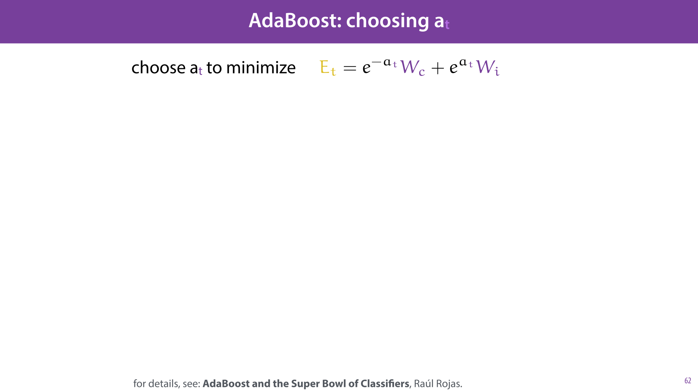

            <figcaption>
            
To choose at, we just compute the derivative of the error with respect to to at, set it to zero and solve for at. 

Intuitively, the formula for at states that the better the proportion of correct to incorrect labelings, the more model t should weigh in the ensemble. The logarithm ensures  a kind of diminishing return of weight: getting 11 instances correct instead of 10 had much more impact on the weight than getting 101 instances correct instead of 100.

            </figcaption>
            click image for animation
       </section>

       <section id="slide-063">
            <a class="slide-link" href="https://mlvu.github.io/lecture10#slide-063" title="Link to this slide.">link here</a>
            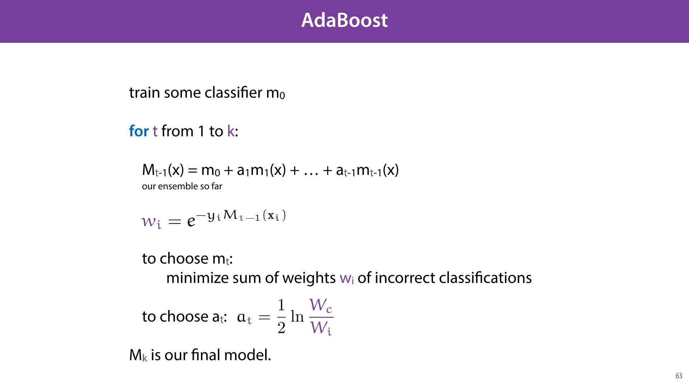

            <figcaption>
            

            </figcaption>
       </section>

       <section id="slide-064">
            <a class="slide-link" href="https://mlvu.github.io/lecture10#slide-064" title="Link to this slide.">link here</a>
            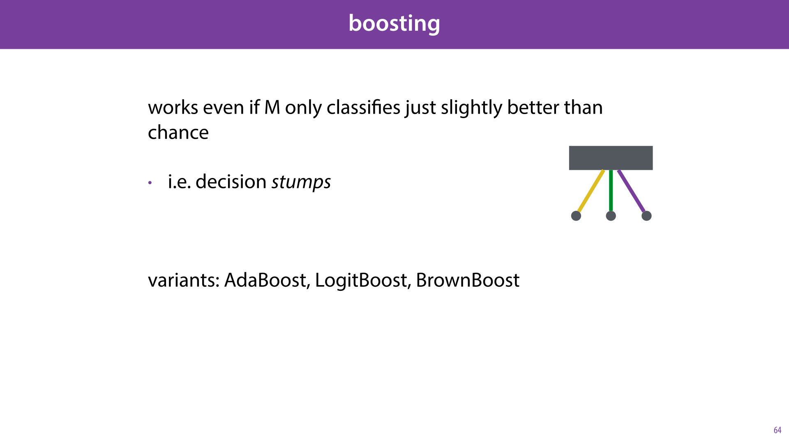

            <figcaption>
            

            </figcaption>
       </section>

       <section id="slide-065">
            <a class="slide-link" href="https://mlvu.github.io/lecture10#slide-065" title="Link to this slide.">link here</a>
            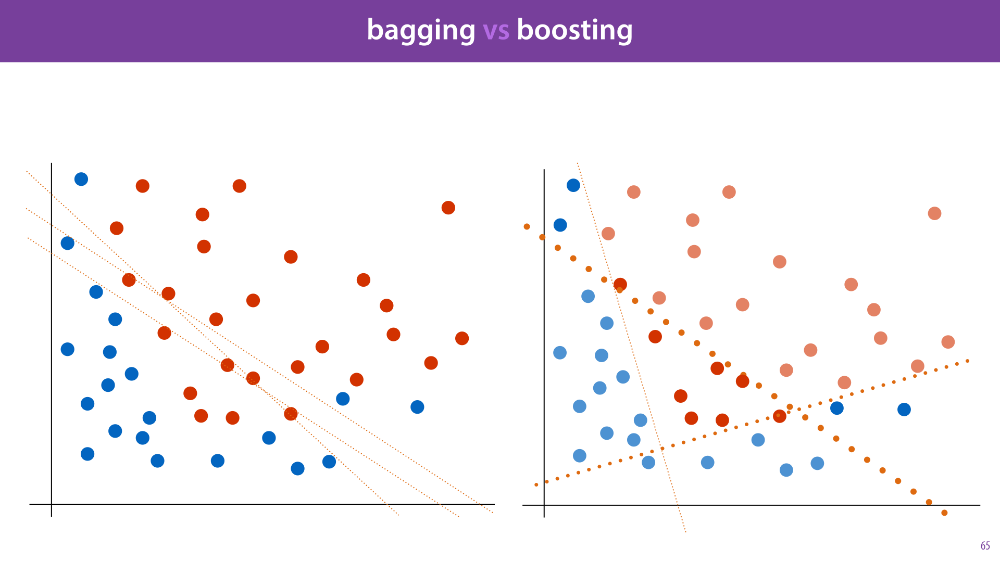

            <figcaption>
            
If we visualise the learners, we can see clearly why boosting is so much more powerful than bagging. Since bagging works in parallel, every member of the ensemble will end up looking roughly the same, providing little variation in the ensemble. If we start with underfitting classifiers (like linear ones), the ensemble decision boundary doesn’t look much different from the individual ones. 

In boosting, since each learner is trained in sequence, based on what the previous learners did, we get much more variation, giving us a combined decision boundary that can be much more powerful than what the original decision boundaries looked like. 

Adapted from Machine Learning by Peter Flach, figure 11.2

            </figcaption>
       </section>

       <section id="slide-066">
            <a class="slide-link" href="https://mlvu.github.io/lecture10#slide-066" title="Link to this slide.">link here</a>
            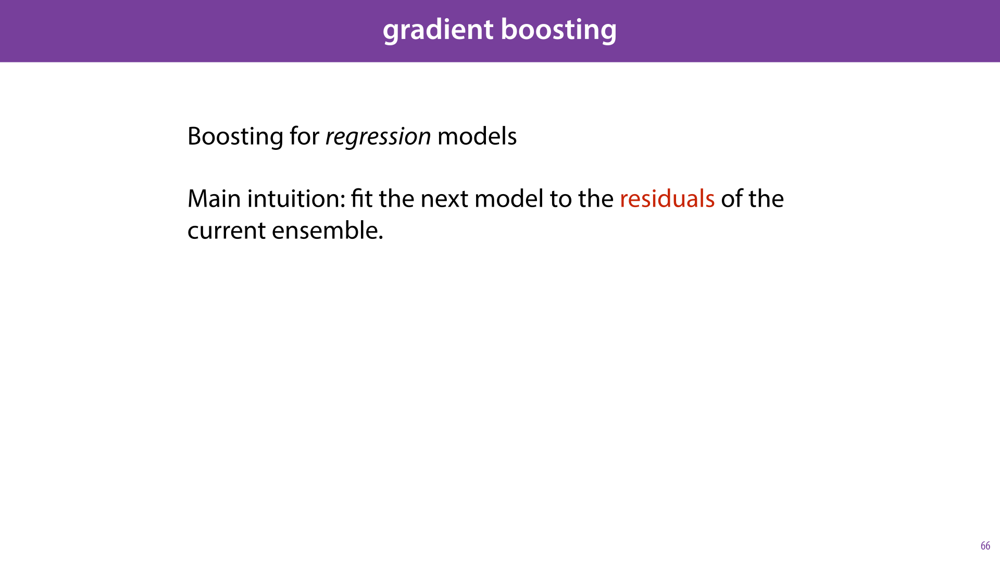

            <figcaption>
            
When we want to boost regression models, we can look to <strong>gradient boosting</strong>. The idea here is that we don’t reweight the dataset, but instead, we look at the residuals of the ensemble to far, and try to train a model to predict those. If we can keep doing this succesfully, we can eventually subtract all residuals to get a perfect prediction.

            </figcaption>
       </section>

       <section id="slide-067">
            <a class="slide-link" href="https://mlvu.github.io/lecture10#slide-067" title="Link to this slide.">link here</a>
            

            <figcaption>
            
To illustrate, let’s start with a constant model. We’ll minimize squared error, so the optimal constant is the mean of the data. 

            </figcaption>
       </section>

       <section id="slide-068">
            <a class="slide-link" href="https://mlvu.github.io/lecture10#slide-068" title="Link to this slide.">link here</a>
            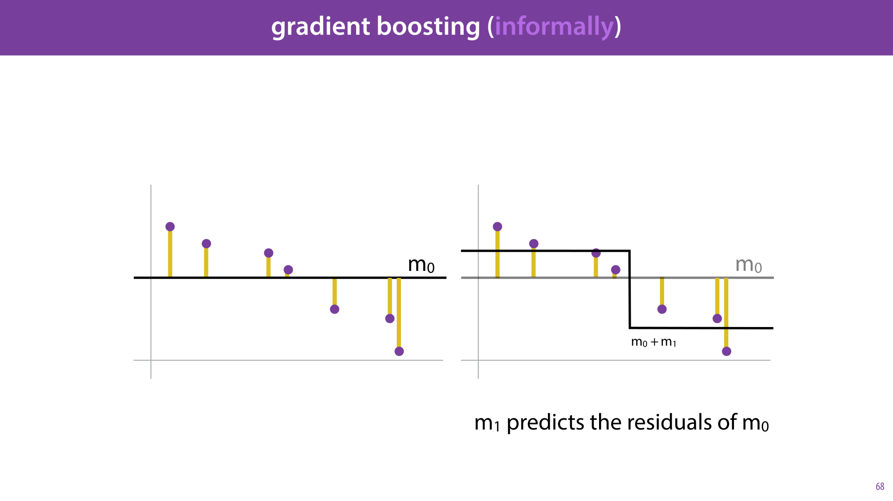

            <figcaption>
            
We take the residuals of the previous model, and train a new model, m1, to predict the residuals. The new <em>ensemble model </em>adds these predictions to the predictions of the first.

            </figcaption>
       </section>

       <section id="slide-069">
            <a class="slide-link" href="https://mlvu.github.io/lecture10#slide-069" title="Link to this slide.">link here</a>
            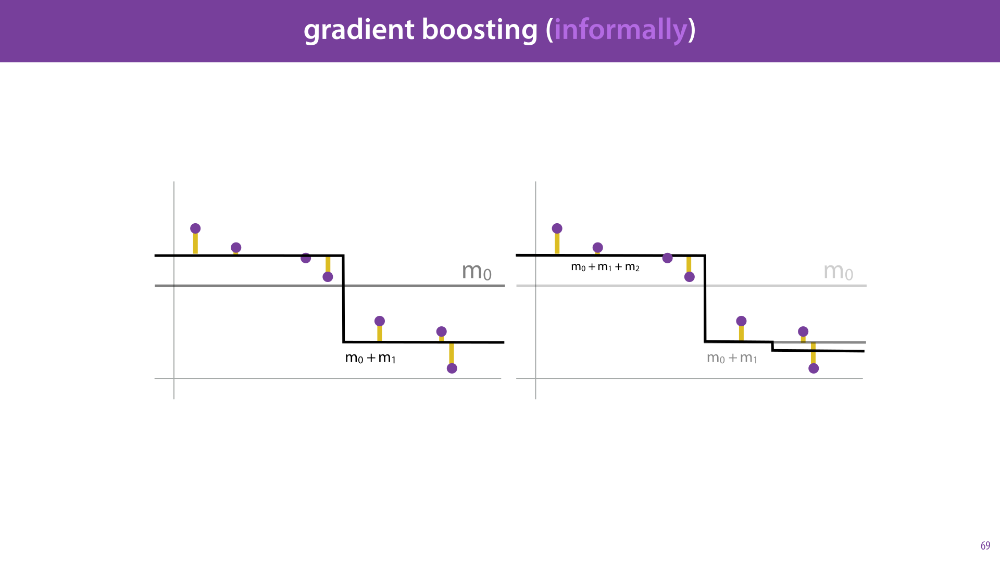

            <figcaption>
            
This ensemble model has new residuals, which we can then train another model m2 to predict, add that to the model. and so on.

            </figcaption>
       </section>

       <section id="slide-070">
            <a class="slide-link" href="https://mlvu.github.io/lecture10#slide-070" title="Link to this slide.">link here</a>
            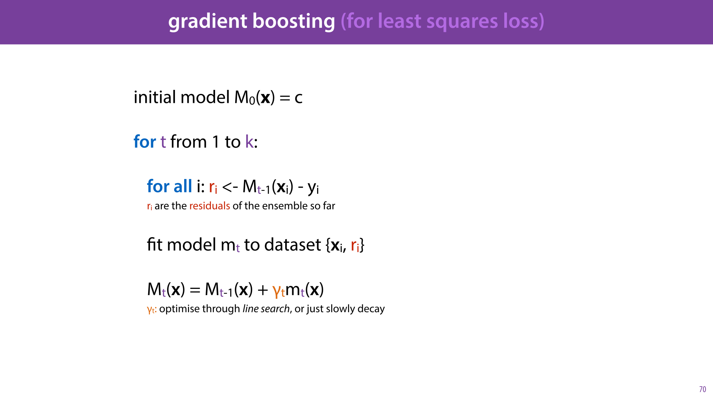

            <figcaption>
            
This is the algorithm in detail. We start with an ensemble model consisting of only a constant predictor. At each iteration, we compute the residuals for the current ensemble model, and add a predictor for the residuals to the ensemble. The new model is added with a weight gamma, which  helps us if the new model happens to fit the residuals poorly.  

In contrast to adaboost, there is no principled way to set the weights. We simply search for a good value by optimization, or slowly decay the weights.

            </figcaption>
       </section>

       <section id="slide-071">
            <a class="slide-link" href="https://mlvu.github.io/lecture10#slide-071" title="Link to this slide.">link here</a>
            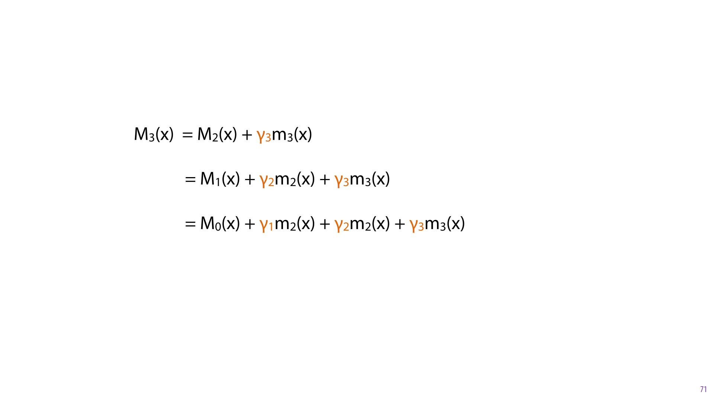

            <figcaption>
            

            </figcaption>
       </section>

       <section id="slide-072" class="anim">
            <a class="slide-link" href="https://mlvu.github.io/lecture10#slide-072" title="Link to this slide.">link here</a>
            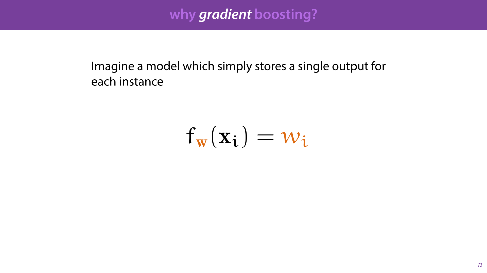

            <figcaption>
            
To see why we call it gradient boosting, imagine a model which simply stores a single value wi which is the value it will predict for instance <strong>x</strong>i. This is a perfectly overfitting model, of course, and we cannot expect it to learn anything, but we can think of its negative gradient as a kind of ideal direction for where we want a more realistic model to go. If we could control all the outputs of our model for all instances individually, we would want to follow this negative gradient to minimize the loss. 

We can’t, of course, in a realistic model, changing one parameter changes multiple predictions at the same time, but the ideally, this is the gradient on our “output space” that we want to approaximate. 

If our loss function is the mean squared error loss, then the gradient for this model are the residuals

            </figcaption>
            click image for animation
       </section>

       <section id="slide-073">
            <a class="slide-link" href="https://mlvu.github.io/lecture10#slide-073" title="Link to this slide.">link here</a>
            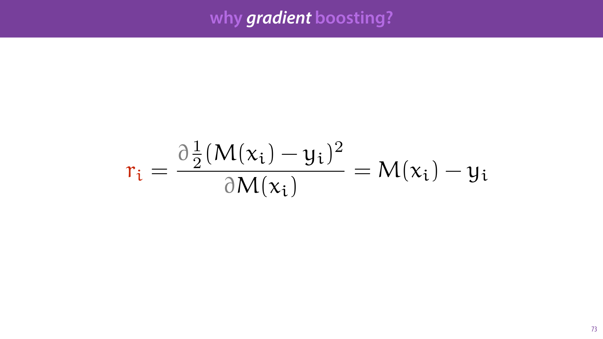

            <figcaption>
            
In other words, the residuals are the gradient of the model loss for instance i with respect to the output for instance i. 

By adding the residuals to the previous model, we are performing a kind of gradient descent for models that don’t support it (like regression trees). We are training a model to predict where we’d like to be after one step of gradient descent, and adding that model to our ensemble. the ensemble is following the approximate gradient in output space.

            </figcaption>
       </section>

       <section id="slide-074">
            <a class="slide-link" href="https://mlvu.github.io/lecture10#slide-074" title="Link to this slide.">link here</a>
            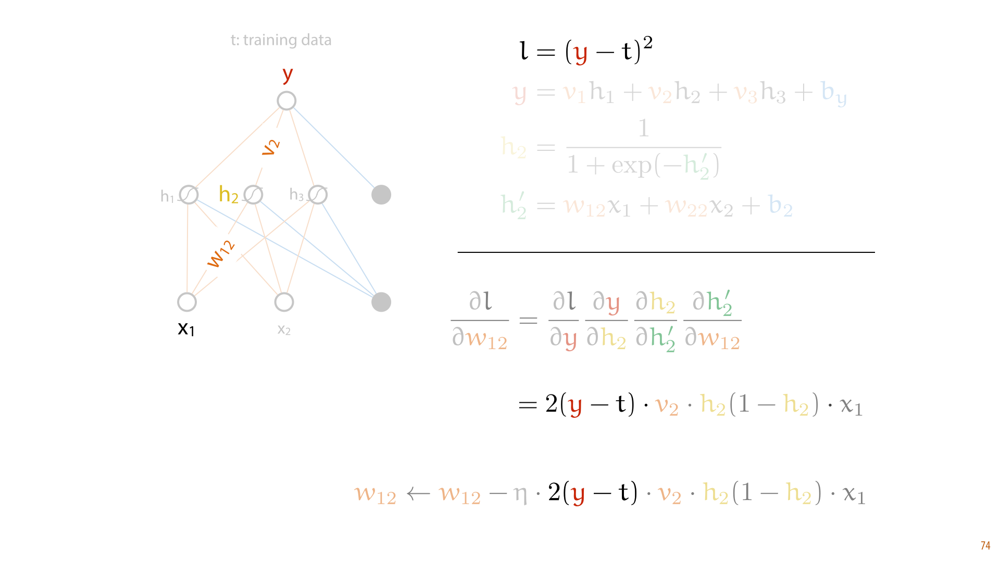

            <figcaption>
            
Compare this to what we saw in backpropagation. There, we also work out the derivative of the loss with respect to the network output y (we called it a <em>local derivative</em> in this context). 

We then took this derivative and <em>backpropagated</em> it down the network to work out derivatives for the weights. <strong>We can think of gradient boosting as a way of accomplishing this for models where backpropagation isn’t possible.</strong> Instead, we train a model to predict the effect of the gradient update step on the output space, and we bolt that model onto our original. 

            </figcaption>
       </section>

       <section id="slide-075">
            <a class="slide-link" href="https://mlvu.github.io/lecture10#slide-075" title="Link to this slide.">link here</a>
            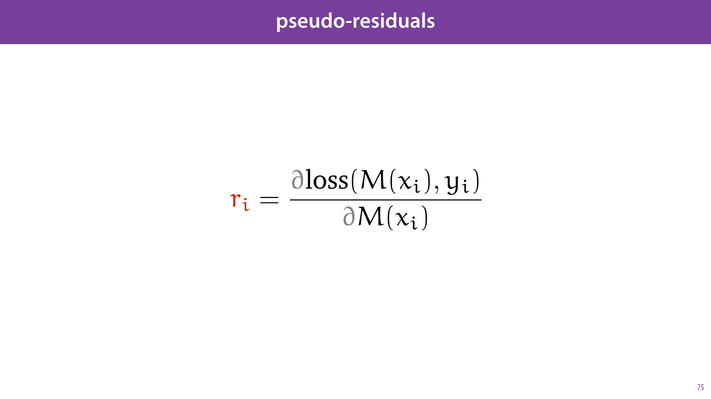

            <figcaption>
            
The benefit of this perspective is that it allows us to generalise the idea of gradient descent to other loss functions. We can simply work out this derivative, and train the next model in our ensemble to predict it. We call this a <strong>pseudo-residual</strong>.<strong> </strong>

The resulting value isn’t as intuitive as a proper residual, but training the next model to predict the pseudo residuals works just as well to minimize the loss.

            </figcaption>
       </section>

       <section id="slide-076" class="anim">
            <a class="slide-link" href="https://mlvu.github.io/lecture10#slide-076" title="Link to this slide.">link here</a>
            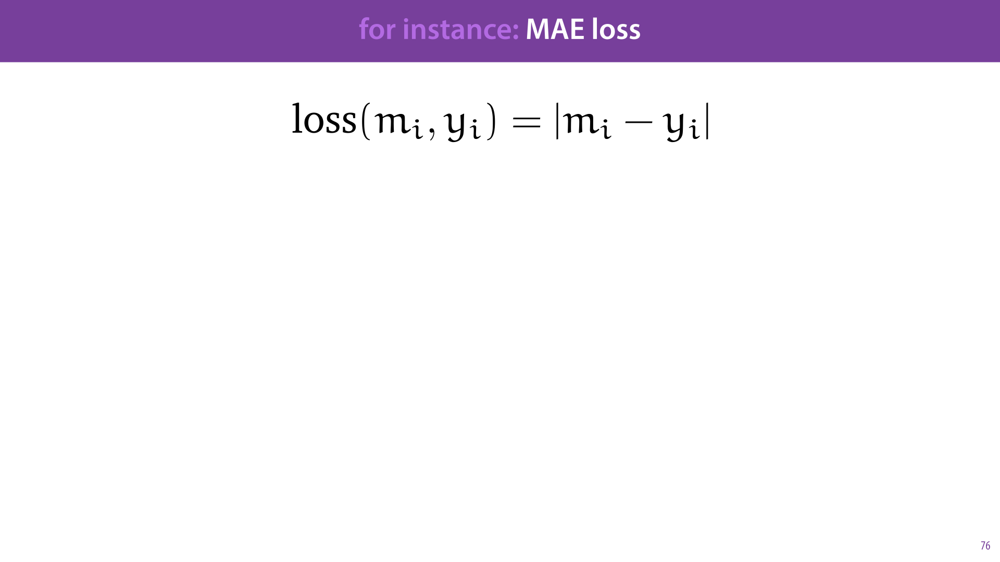

            <figcaption>
            
For instance, here is how it works for the <strong>mean absolute error</strong> loss (also known as the L1 loss): the absolute value of the difference between output and target. As we’ve seen before, minimizing absolute errors instead of squared errors, leads to gradients xomposed of the sign, and the median as a minimizer.  

Therefore, if we want to use gradient boosting to minimize the MAE loss, we should train the next model in our ensemble to predict only the <em>sign, </em>-1 or +1, of the residuals of the ensemble so far, and add that to the current predictions.

            </figcaption>
            click image for animation
       </section>

       <section id="slide-077">
            <a class="slide-link" href="https://mlvu.github.io/lecture10#slide-077" title="Link to this slide.">link here</a>
            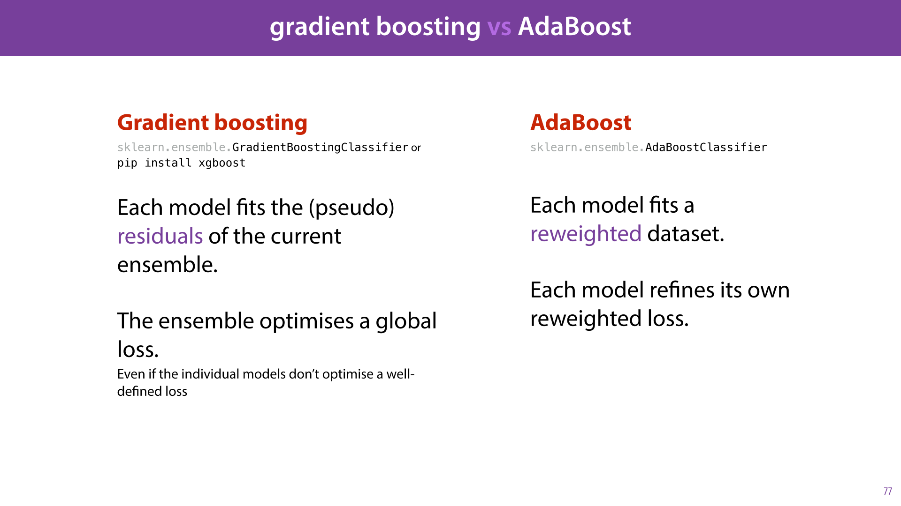

            <figcaption>
            

            </figcaption>
       </section>

       <section id="slide-078">
            <a class="slide-link" href="https://mlvu.github.io/lecture10#slide-078" title="Link to this slide.">link here</a>
            

            <figcaption>
            

            </figcaption>
       </section>

</article>
