<nav class="menu">
    <ul>
        <li class="home"><a href="/">Home</a></li>
        <li class="name">Lecture 11: Sequences</li>
                <li><a href="#video-000">Markov models</a></li>
                <li><a href="#video-031">Deep learning on sequences</a></li>
                <li><a href="#video-060">Recurrent neural networks and LSTMs</a></li>
                <li><a href="#slide-101">Transformers*</a></li>
        <li class="pdf"><a href="https://mlvu.github.io/lectures/61.SequentialModels.annotated.pdf">PDF</a></li>
    </ul>
</nav>

<article class="slides">

       <section class="video" id="video-000">
           <a class="slide-link" href="https://mlvu.github.io/lecture11#video-0">link here</a>
           <iframe
                src="https://www.youtube.com/embed/wf8D0QWe0hg"
                title="YouTube video player"
                frameborder="0" allow="accelerometer; autoplay; clipboard-write; encrypted-media; gyroscope; picture-in-picture"
                allowfullscreen>
           </iframe>

       </section>

       <section id="slide-001">
            <a class="slide-link" href="https://mlvu.github.io/lecture11#slide-001" title="Link to this slide.">link here</a>
            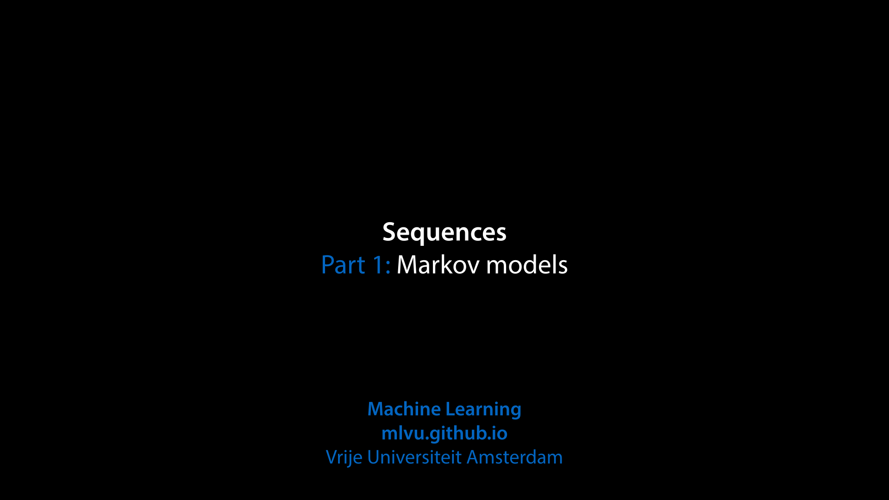

            <figcaption>
            
In this lecture we’ll look at data that naturally forms a sequence. Language, music, stock prices. All of these can be modelled most naturally as a sequence of tokens of information coming in one after the other.  

Before we look at how to model sequences, we’ll look at some basic things to take into account when interpreting such data. 

 

            </figcaption>
       </section>

       <section id="slide-002">
            <a class="slide-link" href="https://mlvu.github.io/lecture11#slide-002" title="Link to this slide.">link here</a>
            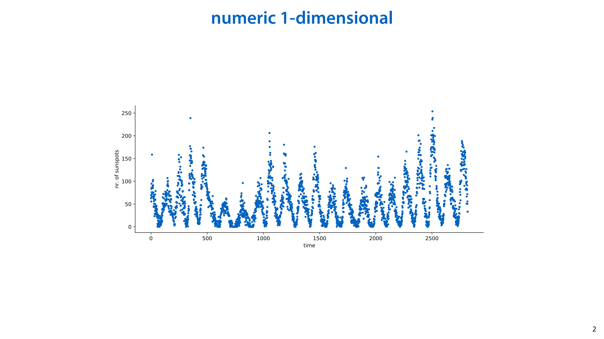

            <figcaption>
            
We’ll start by looking at the different types of sequential datasets we might encounter.  

As with the traditional setting (a table of independently sampled instances) we can divide our features into numeric and discrete.  

A single 1D sequence might look like this. We could this of a stock price over time, traffic  to a webserver, or atmospheric pressure over Amsterdam.  

In this case, the data shows the number of sunspots observed over time. 

            </figcaption>
       </section>

       <section id="slide-003">
            <a class="slide-link" href="https://mlvu.github.io/lecture11#slide-003" title="Link to this slide.">link here</a>
            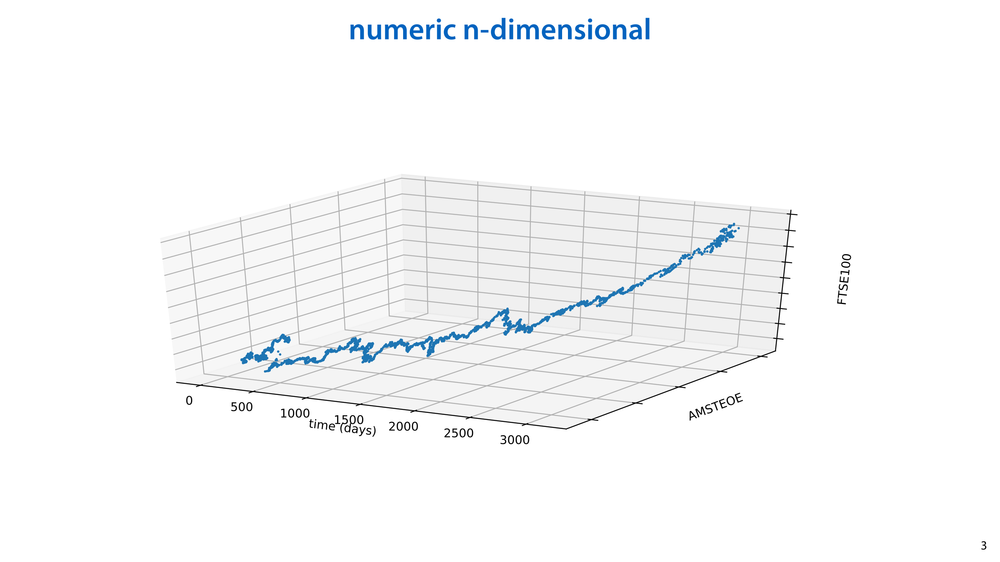

            <figcaption>
            
Sequential numeric data can also be multidimensional. In this case, we see the closing index of the AEX and the FTSE100 over time. This data is a sequence of 2D vectors.

            </figcaption>
       </section>

       <section id="slide-004">
            <a class="slide-link" href="https://mlvu.github.io/lecture11#slide-004" title="Link to this slide.">link here</a>
            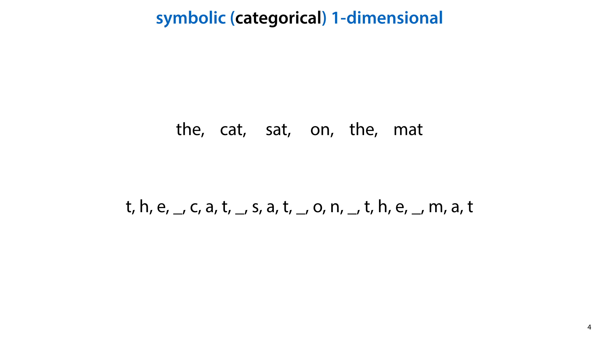

            <figcaption>
            
If the elements of our data are discrete (analogous to a categorical feature), it becomes a sequence of symbols. Language is a prime example. In fact, we can model language as a sequence in two different ways: as a sequence of <strong>words</strong>, or as a sequence of <strong>characters</strong>. 

            </figcaption>
       </section>

       <section id="slide-005" class="anim">
            <a class="slide-link" href="https://mlvu.github.io/lecture11#slide-005" title="Link to this slide.">link here</a>
            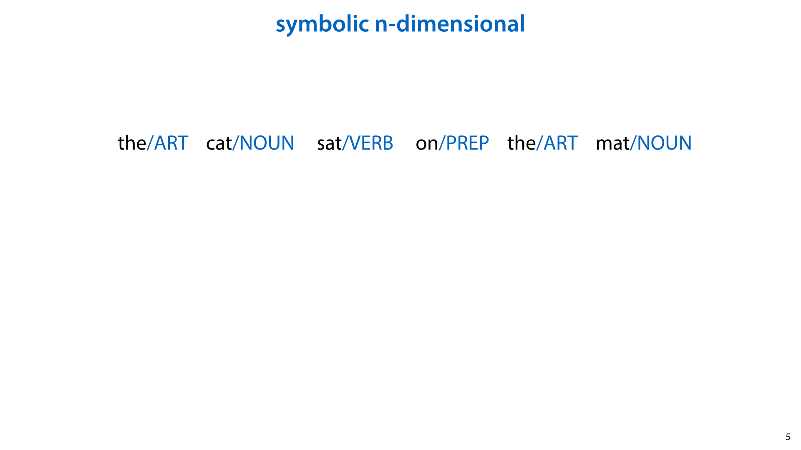

            <figcaption>
            
We can also encounter sequences with multiple categorical features per timestamp. 

For instance. music, or tagged language. The more complex the sequence grows, the more difficult it can be to represent. We’ll stick with simple examples for this lecture.

            </figcaption>
            click image for animation
       </section>

       <section id="slide-006">
            <a class="slide-link" href="https://mlvu.github.io/lecture11#slide-006" title="Link to this slide.">link here</a>
            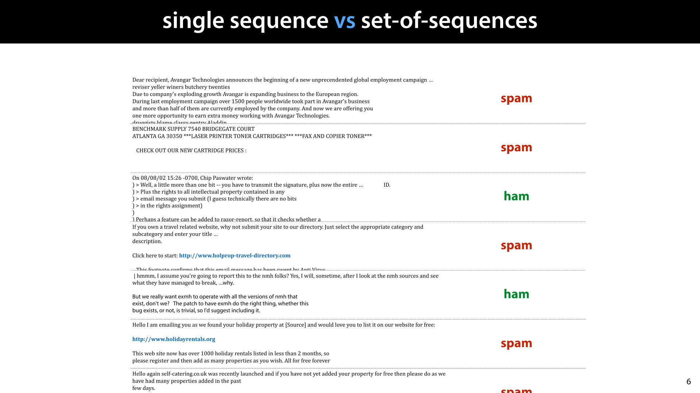

            <figcaption>
            
Then there is the question of what we’re trying to predict. 

One possibility is that we have a normal classification or regression task, but the instances are not represented by feature vectors bu by sequences. Tis slide shows a simple example: email classification. Each email is a sequence (of words or or characters), and each carries one target label (ham or spam). 

Among the instances themselves, there is not any strong sequential ordering. Emails do have a timestamp, but this ordering is usually ignored. 

            </figcaption>
       </section>

       <section id="slide-007">
            <a class="slide-link" href="https://mlvu.github.io/lecture11#slide-007" title="Link to this slide.">link here</a>
            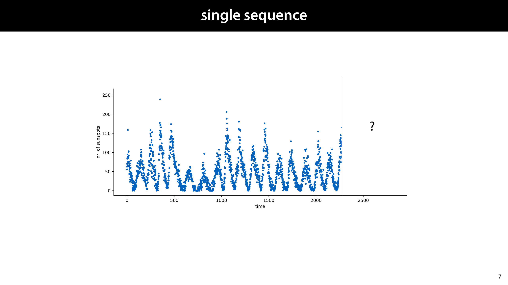

            <figcaption>
            
An entirely different setting is one where the dataset as a whole is a sequence, and the instances are the elements in the sequence. For instance, in our sunspot example, we may consider each point in our sequence as a single instance consisting of a single feature. 

In that case, we often want to predict the future values of the sequence based on what we’ve seen in the past. 

            </figcaption>
       </section>

       <section id="slide-008" class="anim">
            <a class="slide-link" href="https://mlvu.github.io/lecture11#slide-008" title="Link to this slide.">link here</a>
            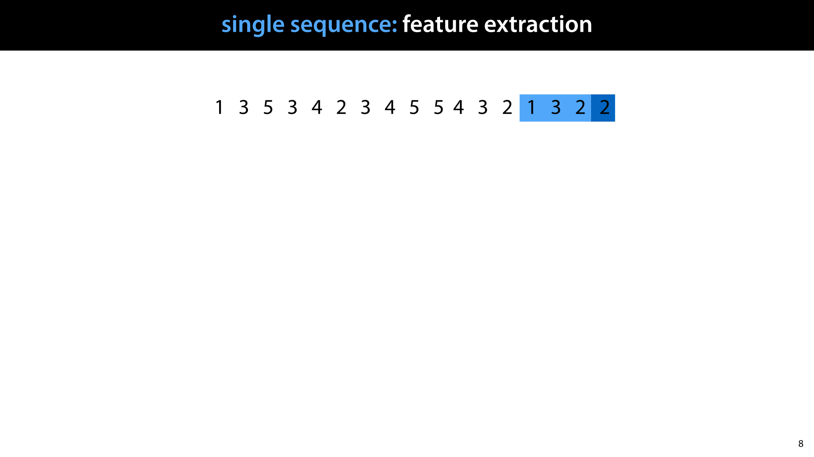

            <figcaption>
            
One simple way to achieve this, is to translate it to a classic regression problem by representing each point by a fixed number of values before it; in this case the 3 preceding values.  

This gives us a table with a target label (the value at time t) and 3 features (the 3 preceding values). With this data in hand we can grab any standard regression model, train it, and use it on the values we’re currently observing, to give us a prediction for the future. 

Many other features are possible: the mean over the whole history. The mean over the last 10 points, the variance over the last 10 points, and so on. This is a great way to solve this kind of sequence prediction task by translating it to a known abstract task, rather than designing a whole new approach, specific to the sequence setting. 

            </figcaption>
            click image for animation
       </section>

       <section id="slide-009">
            <a class="slide-link" href="https://mlvu.github.io/lecture11#slide-009" title="Link to this slide.">link here</a>
            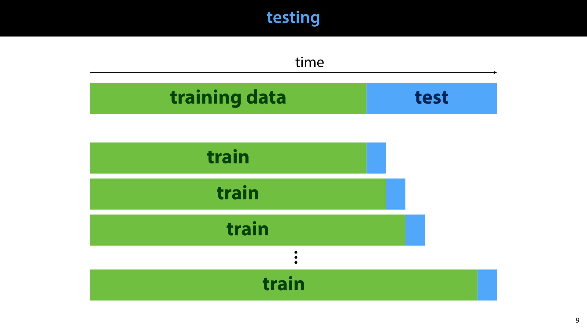

            <figcaption>
            
However, remember what we said in lecture 3: when your data has a meaningful ordering in time, you should keep it ordering in that way when you make data splits. You don’t want to train on data that is in the future comopared to your test data. In production, you won’t have that luxury, so to make your test setting a good simulation of production, you should keep your data ordered by time. 

If you can expect to retrain you model periodically, then you can simulate this in your test split, by retraining after every batch of instances instances you’ve seen of the test set, and adding them to the training data. This is called walk forward validation.

            </figcaption>
       </section>

       <section id="slide-010">
            <a class="slide-link" href="https://mlvu.github.io/lecture11#slide-010" title="Link to this slide.">link here</a>
            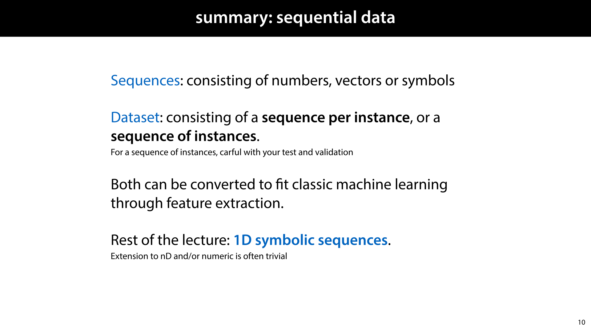

            <figcaption>
            
In the rest of the lecture, we’ll cover with methods that deal with sequences natively, without the need for feature extraction.

            </figcaption>
       </section>

       <section id="slide-011">
            <a class="slide-link" href="https://mlvu.github.io/lecture11#slide-011" title="Link to this slide.">link here</a>
            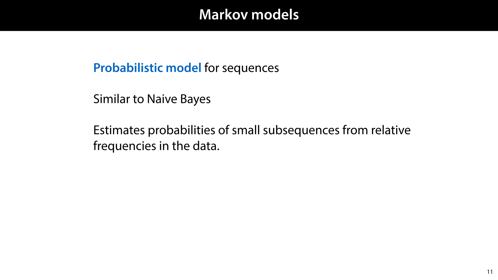

            <figcaption>
            
The first method we will look at is Markov modelling.

            </figcaption>
       </section>

       <section id="slide-012" class="anim">
            <a class="slide-link" href="https://mlvu.github.io/lecture11#slide-012" title="Link to this slide.">link here</a>
            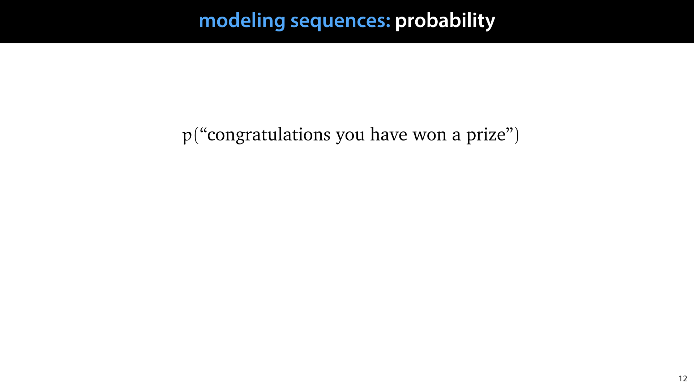

            <figcaption>
            
The fundamental idea, here, is that we want to model the probability of a sequence occurring. 

When modelling probability, we usually break the sequence up into its <strong>tokens </strong>(in this case the words of the sentence) and model each as a random variable. Note that these random variables are decidedly <em>not </em>independent: if the previous word is an article like “a”, you’re much more likely to see a noun like “prize” following it, than another article. 

This leaves us with a joint distribution over 6 variables, which we would somehow like to model and fit to a dataset. How do we use our dataset to estimate the probability that we’ll see this sentence in the future? 

            </figcaption>
            click image for animation
       </section>

       <section id="slide-013">
            <a class="slide-link" href="https://mlvu.github.io/lecture11#slide-013" title="Link to this slide.">link here</a>
            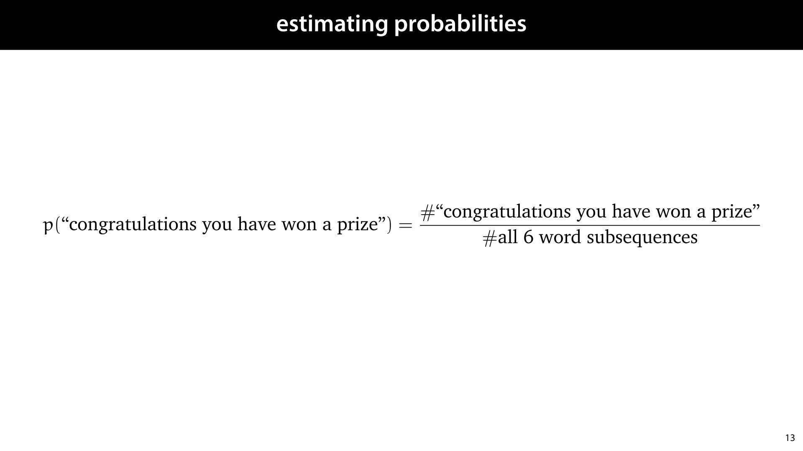

            <figcaption>
            
One simple trick we’ve used in the past to estimate probabilities is to take the relative frequencies of occurrences in the data.  

We could collect a large amount of natural language data and simply count how often the sequence “congratulations you have won a prize” occurs in the data, and then divide it by the total number of 6 word sequences in the data.  

The problem is that we’d need an extremely large amount of data for all sequences of interest to have been seen, and if our sequences get longer, like full emails, we’ll have no chance of collecting a dataset where every email we’re interested in has been seen before. 

What we need to do, is break our sequence up into subsequences, estimate their probability and combine the probabilities of the subsequences, to give us the probabilty of the whole sequence.

            </figcaption>
       </section>

       <section id="slide-014">
            <a class="slide-link" href="https://mlvu.github.io/lecture11#slide-014" title="Link to this slide.">link here</a>
            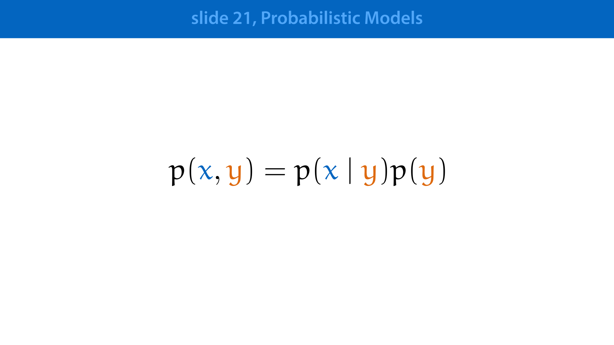

            <figcaption>
            
To do so, we’ll use this rule from the Probabilistic Models lecture. If we have a joint distribution, we can break it up into two factors: the marginal distribution on one of the variables, times the distribution with that variable in the conditional.

            </figcaption>
       </section>

       <section id="slide-015" class="anim">
            <a class="slide-link" href="https://mlvu.github.io/lecture11#slide-015" title="Link to this slide.">link here</a>
            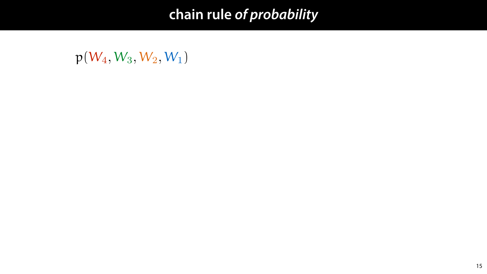

            <figcaption>
            
This gives us the<strong> chain rule of probability</strong> (which has nothing to do with the the chain rule of  calculus).  

The chain rule allows us to break a joint distribution on many variables into a product of conditional distributions. In sequences, we often apply it so that each word becomes conditioned on the words before it. We could apply it in any order we like but it makes most sense to condition each word on its preceding tokens. 

This tells us that if we build a model that can estimate the probability p(x|y, z) of a word x based on the words y, z that precede it, we can then <em>chain</em> this estimator to give us the joint probability of the whole sentence x, y, z.

            </figcaption>
            click image for animation
       </section>

       <section id="slide-016" class="anim">
            <a class="slide-link" href="https://mlvu.github.io/lecture11#slide-016" title="Link to this slide.">link here</a>
            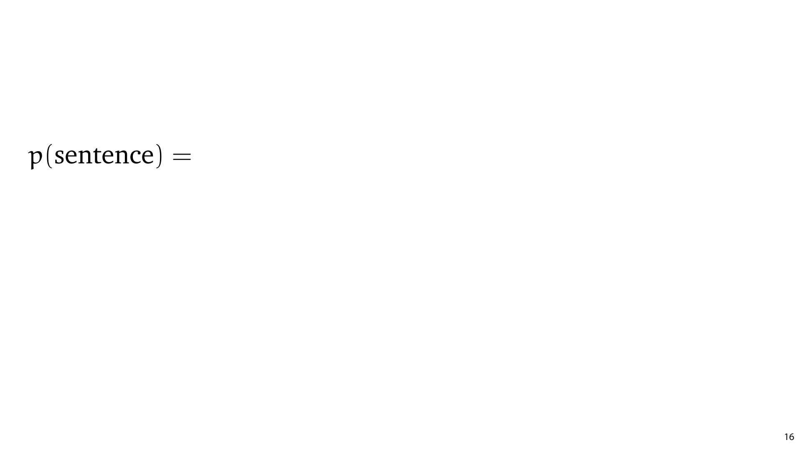

            <figcaption>
            
In other words, we can rewrite the probability of a sentences as the product of the  probability of  each word, conditioned on its history.  

If we use the log probability, this product becomes a sum. This is helpful, because these probabilities get very small, and we don’t want them underflowing to zero. 

This  view solves part of our problem. If we can figure out how to estimate the probabilties of a particular word occurring, given all the words that precede it, we can chain these probabilities together to give us the probabilities of a whole sentence, or an even longer sequence of words (like a whole email).

            </figcaption>
            click image for animation
       </section>

       <section id="slide-017" class="anim">
            <a class="slide-link" href="https://mlvu.github.io/lecture11#slide-017" title="Link to this slide.">link here</a>
            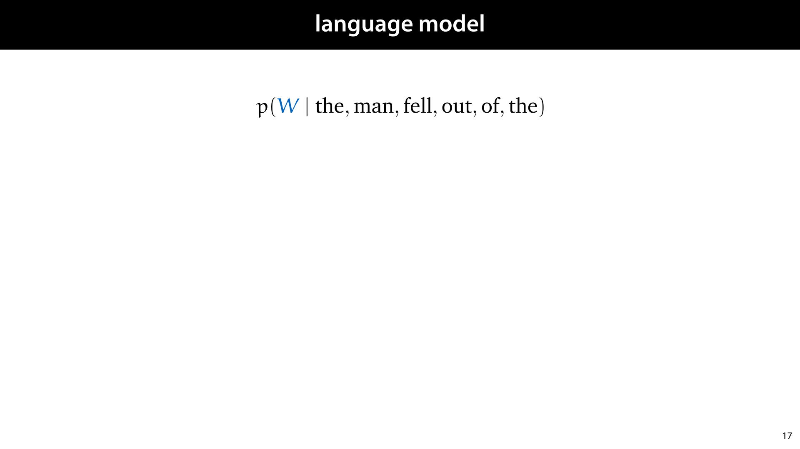

            <figcaption>
            
Note that this is no easy task.  

A perfect language model would encompass everything we know about language: the grammar, the idiom and the physical reality it describes. For instance, it would give window a very high probability, since that is a very reasonable  way to complete the sentence. Aquarium is less likely, but still physically possible and grammatically correct. A very clever language model might know that falling out of a pool is not physically possible (except under unusual circumstances), so that should get a lower probability, and finally cycling is ungrammatical, so that should get very low probability (perhaps even zero). 

The problem is most sentences of this length will never have been seen before in their entirety. A simple way to get a basic model is<strong> to limit how far back we look in the sentence</strong>.

            </figcaption>
            click image for animation
       </section>

       <section id="slide-018">
            <a class="slide-link" href="https://mlvu.github.io/lecture11#slide-018" title="Link to this slide.">link here</a>
            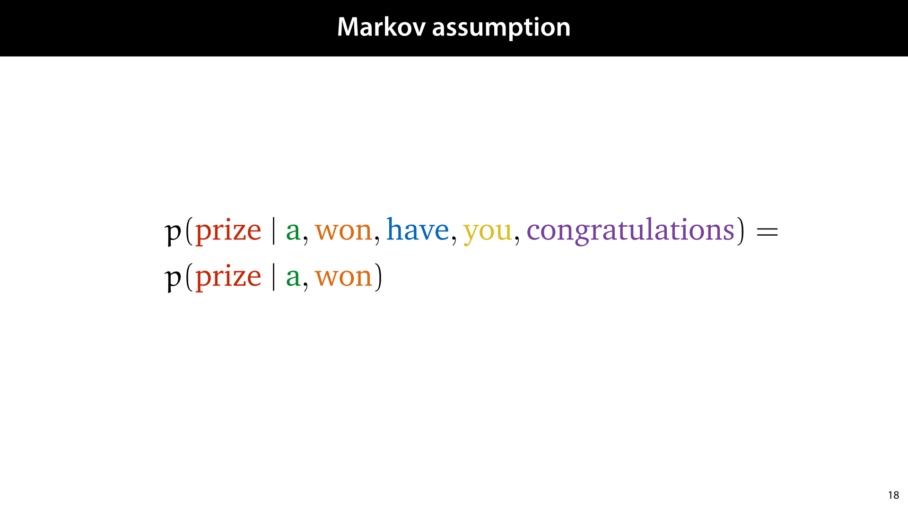

            <figcaption>
            
This is called a <strong>Markov assumption</strong>. We just take the probability of a word given all the words that precede it, and we assume that it’s equal to the probability of the word conditioned only on the k words that precede it. 

This is a bit like the naive Bayes assumption: we know it’s incorrect, but it still yields a very usable model. The number of words we retain in the conditional is called the order of the Markov model: this is a Markov assumption for a second-order Markov model.

            </figcaption>
       </section>

       <section id="slide-019" class="anim">
            <a class="slide-link" href="https://mlvu.github.io/lecture11#slide-019" title="Link to this slide.">link here</a>
            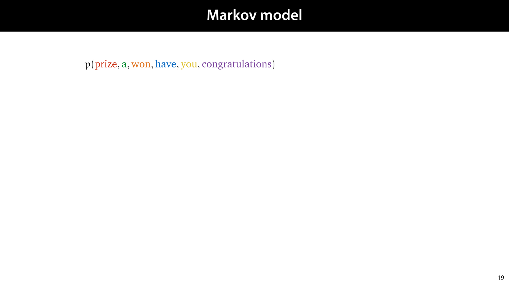

            <figcaption>
            
Using the Markov assumption and the chain rule together, we can model a sequence as limited-memory conditional probabilities. These probabilities can then be very simply estimated from a large dataset of text (called <strong>a corpus</strong>).  

To estimate the probability of prize given “won a” we just count how often “won a prize” occurs as a proportion of the times “won a” occurs. In other words, how often “won a” is followed by prize. 

These n-word snippets are called <strong>n-grams</strong>. “won a prize” is a <strong>trigram</strong>, and “won a” is a <strong>bigram</strong>. 

This type of language model is often called a <strong>Markov model</strong>, because of the Markov assumption of limited memory. The size of the memory is referred to as the <strong>order</strong> of the Markov model. The higher the order of your model, the more you can model, but the more data you’ll need, to make sure that you’ve seen all the n-grams you’re interested in often enough. 

            </figcaption>
            click image for animation
       </section>

       <section id="slide-020">
            <a class="slide-link" href="https://mlvu.github.io/lecture11#slide-020" title="Link to this slide.">link here</a>
            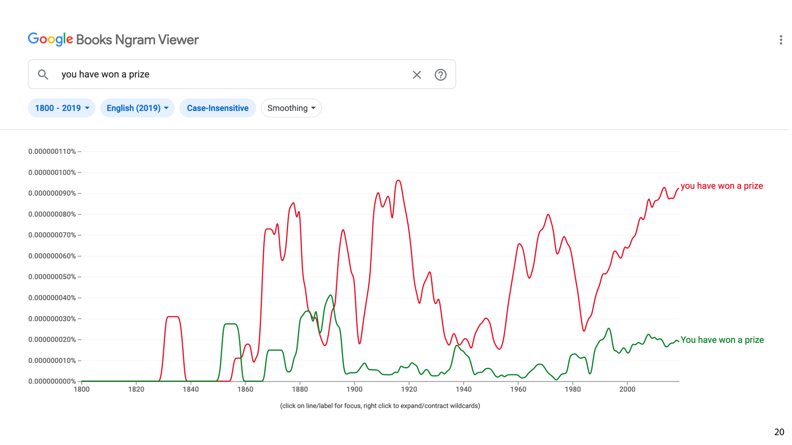

            <figcaption>
            
With the kind of datasets you can download and run yourself, you can estimate good statistics for bigrams and trigrams. If you have a larger corpus, like Google’s corpus of all books, you can easily go up to 5-grams. 

            </figcaption>
       </section>

       <section id="slide-021" class="anim">
            <a class="slide-link" href="https://mlvu.github.io/lecture11#slide-021" title="Link to this slide.">link here</a>
            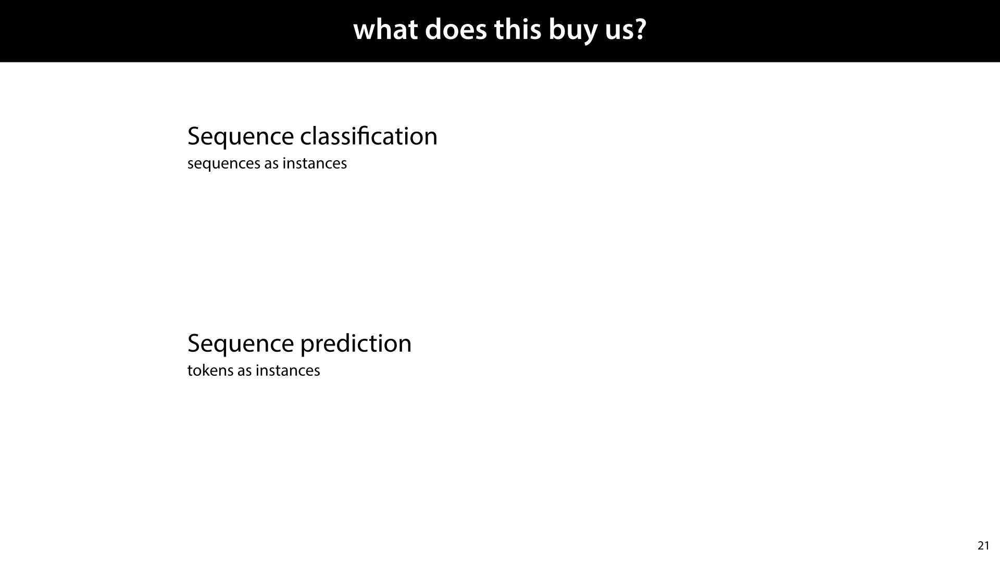

            <figcaption>
            
So, now that we have worked out a first way to approximate probabilities for sequences, what can we do with this? 

We can use this to tackle both the case where our data consists of a separate sequence per instance (like in our spam classification example), and the case where our data consists of a single sequence, and we’re trying to predict the next token.

            </figcaption>
            click image for animation
       </section>

       <section id="slide-022">
            <a class="slide-link" href="https://mlvu.github.io/lecture11#slide-022" title="Link to this slide.">link here</a>
            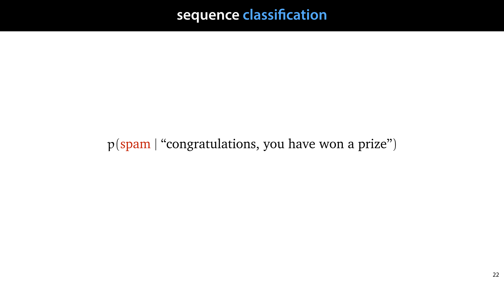

            <figcaption>
            
We’ll start with a sequence-per-instance example: the spam classification task. We’ll see how to approach this with a Markov model. 

Ultimately, what we want to know is the the probability of the class, given the contents of the message.

            </figcaption>
       </section>

       <section id="slide-023">
            <a class="slide-link" href="https://mlvu.github.io/lecture11#slide-023" title="Link to this slide.">link here</a>
            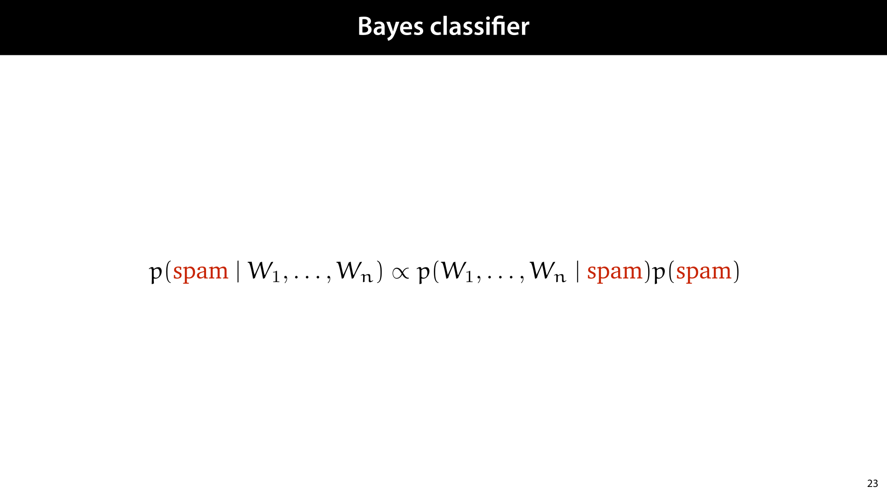

            <figcaption>
            
We’ll train a generative classifier. First, we’ll use Bayes rule to flip around the probabilties.  

The marignal probability p(spam) we can estimate as as the proportion of spam emails in our data set. For the probability of the message given the class, we’ll use our language model.

            </figcaption>
       </section>

       <section id="slide-024" class="anim">
            <a class="slide-link" href="https://mlvu.github.io/lecture11#slide-024" title="Link to this slide.">link here</a>
            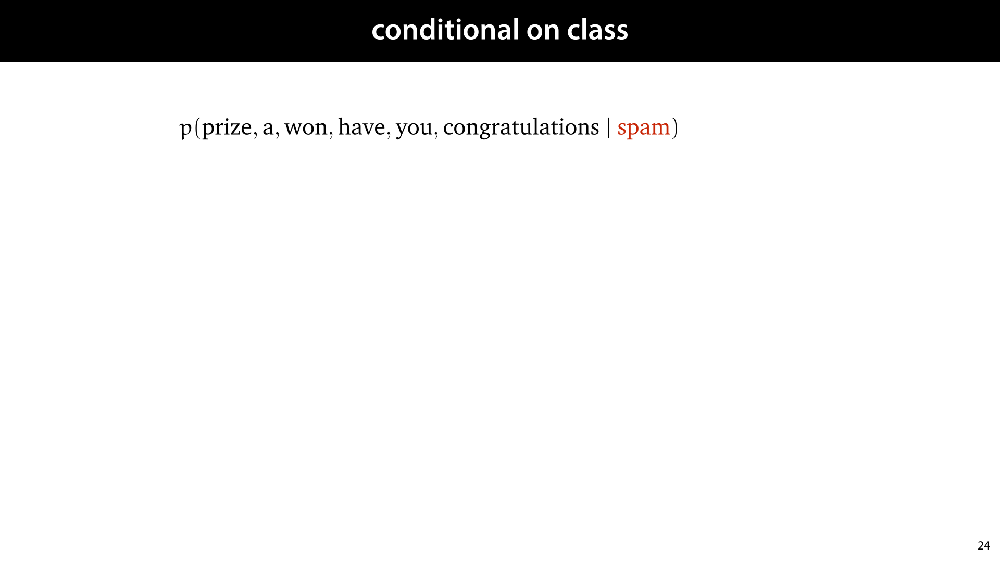

            <figcaption>
            
We use the chain rule and the Markov assumption to define the probability that a message occurs. This is exactly as before, except that now, everything is also conditioned on the class spam. 

We then estimate the different conditional probabilities by computing the relative frequencies of bigrams and trigrams, as before, but we compute them only over the <strong class="red">spam</strong> part of our data.

            </figcaption>
            click image for animation
       </section>

       <section id="slide-025" class="anim">
            <a class="slide-link" href="https://mlvu.github.io/lecture11#slide-025" title="Link to this slide.">link here</a>
            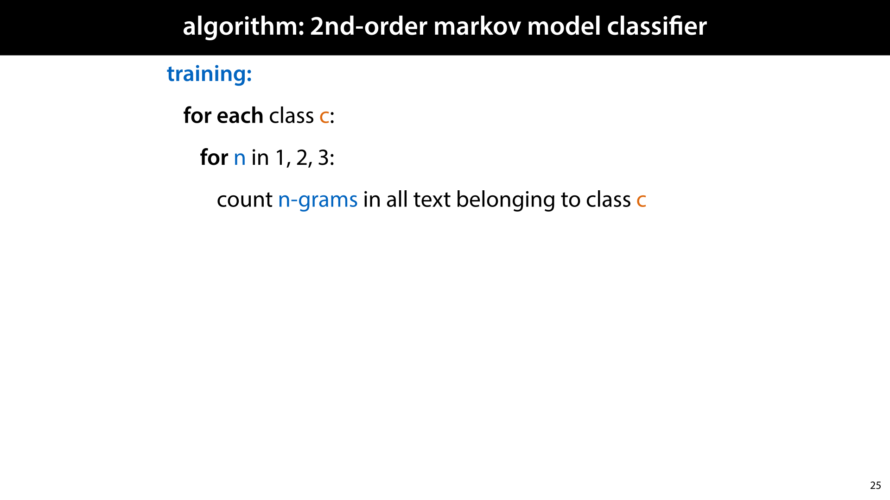

            <figcaption>
            
Here is the complete algorithm, for a classifier using a second order Markov model. First, we split our data by class. We will train a separate language model for each class. 

Then, in each of these subsets, we count all occurrences of all unigrams, bigrams and trigrams. This is all the “training” we do. 

Then, to classify a new sequence, we need to compute the probability of the sequence given the class, and multiply it by the class marginal probability.  

In practice, as noted before, we use log probabilities, to keep low probability values from underflowing.

            </figcaption>
            click image for animation
       </section>

       <section id="slide-026" class="anim">
            <a class="slide-link" href="https://mlvu.github.io/lecture11#slide-026" title="Link to this slide.">link here</a>
            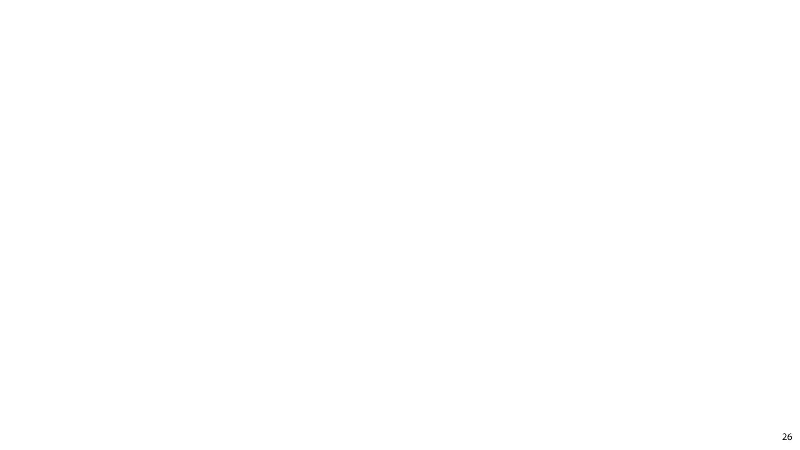

            <figcaption>
            
We can also use a Markov model on unlabelled data, to predict the future. In this case, all we need is simply a large amount of natural language text.

            </figcaption>
            click image for animation
       </section>

       <section id="slide-027" class="anim">
            <a class="slide-link" href="https://mlvu.github.io/lecture11#slide-027" title="Link to this slide.">link here</a>
            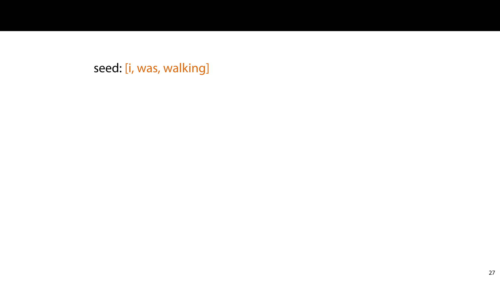

            <figcaption>
            

            </figcaption>
            click image for animation
       </section>

       <section id="slide-028">
            <a class="slide-link" href="https://mlvu.github.io/lecture11#slide-028" title="Link to this slide.">link here</a>
            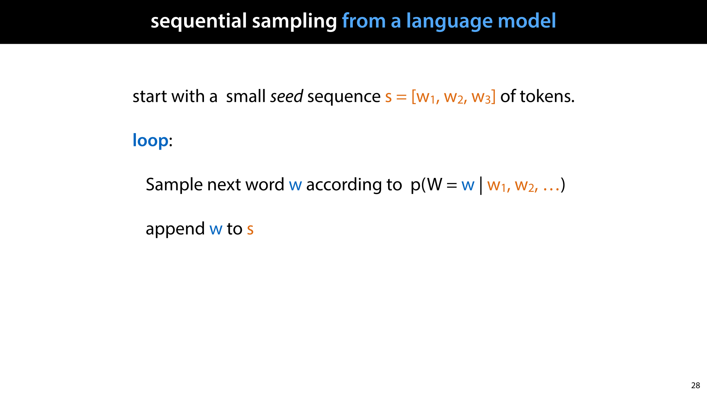

            <figcaption>
            
One interesting thing we can do with such a Markov model, is to sample from it, step by step. We start with a seed of a few words, and then work out the probability distribution over the next word, given the last n words. We sample from this distribution, append the sample to our text and repeat the process.  

Note that with the Markov assumption, we only need the last n elements of the sequence to work out the probabilities. 

<strong>Sequential sampling</strong> is also known as <strong>autoregressive sampling</strong>. In the context of Markov models, the sampling process is often called a<strong> Markov chain</strong>.

            </figcaption>
       </section>

       <section id="slide-029">
            <a class="slide-link" href="https://mlvu.github.io/lecture11#slide-029" title="Link to this slide.">link here</a>
            

            <figcaption>
            
Here is is a bit of text sampled from a Markov model trained on the works of Shakespeare. Even with such a simple language model, we can see some quite realistic patterns appearing. 

            </figcaption>
       </section>

       <section id="slide-030">
            <a class="slide-link" href="https://mlvu.github.io/lecture11#slide-030" title="Link to this slide.">link here</a>
            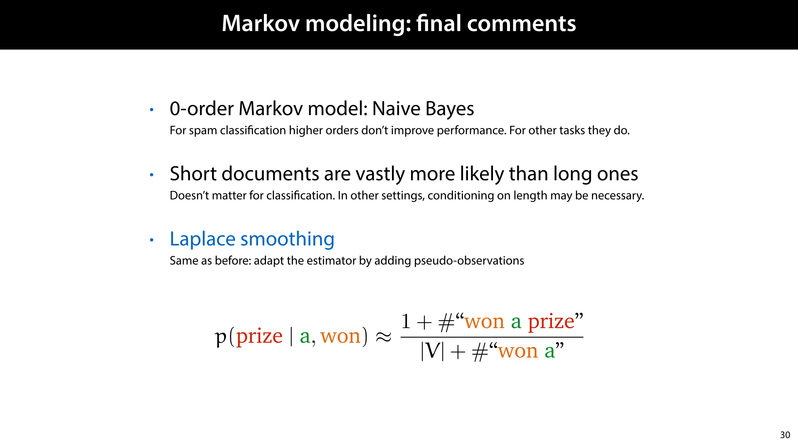

            <figcaption>
            
V is the vocabulary (the set of all n-grams to the language model). As before, we can give the pseudo observations a smaller weight than 1, to have less impact on the estimate.

            </figcaption>
       </section>

       <section id="slide-031">
            <a class="slide-link" href="https://mlvu.github.io/lecture11#slide-031" title="Link to this slide.">link here</a>
            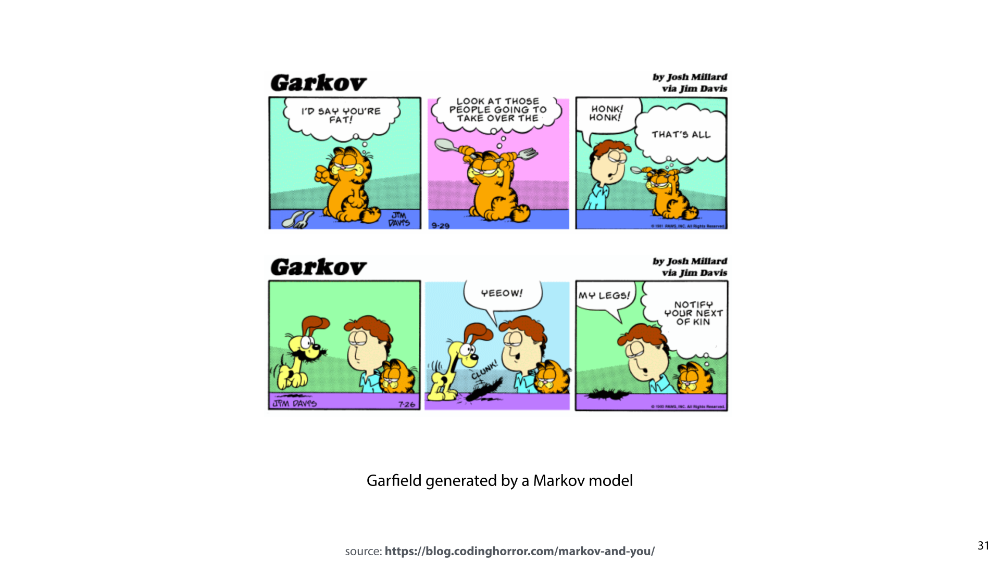

            <figcaption>
            
Sequential sampling can lead to amusing, results, but it’s unlikely to fool a human reader for very long. If we apply  

In the remainder of the lecture, we’ll look at ways of dealing with sequences in a deep learning setting. 

            </figcaption>
       </section>

       <section class="video" id="video-031">
           <a class="slide-link" href="https://mlvu.github.io/lecture11#video-31">link here</a>
           <iframe
                src="https://www.youtube.com/embed/mnkJSiS3ooc"
                title="YouTube video player"
                frameborder="0" allow="accelerometer; autoplay; clipboard-write; encrypted-media; gyroscope; picture-in-picture"
                allowfullscreen>
           </iframe>

       </section>

       <section id="slide-032">
            <a class="slide-link" href="https://mlvu.github.io/lecture11#slide-032" title="Link to this slide.">link here</a>
            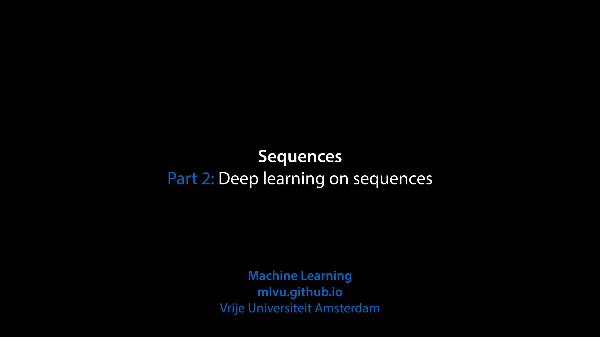

            <figcaption>
            
 

            </figcaption>
       </section>

       <section id="slide-033">
            <a class="slide-link" href="https://mlvu.github.io/lecture11#slide-033" title="Link to this slide.">link here</a>
            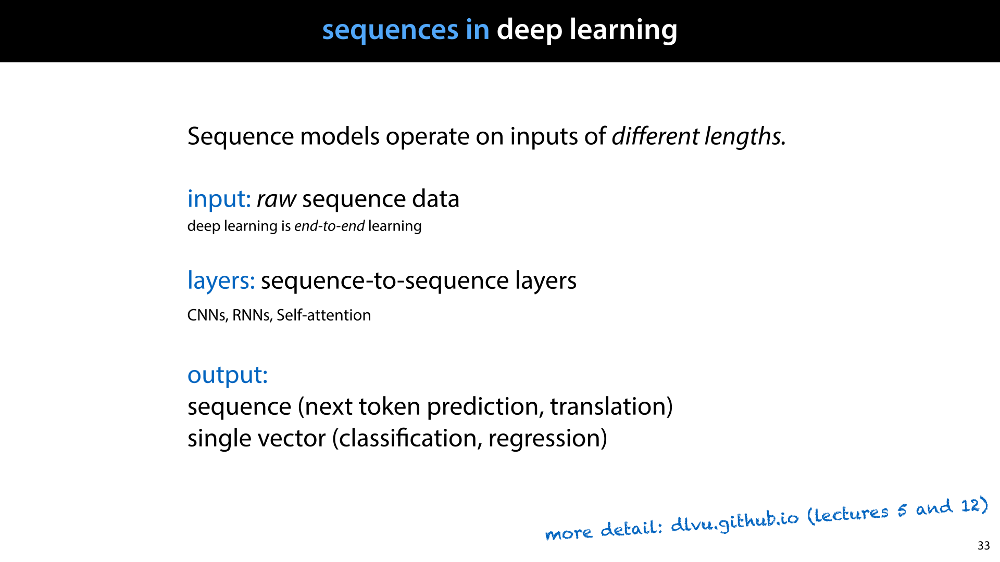

            <figcaption>
            
The basic idea of sequence models is very similar to other deep learning model. The main characteristic that we need to ensure is that the model can handle input sequences of <strong>different lengths</strong>. 

We feed the model with raw data, with no feature extraction, so that we don’t lose any information. We build our model out of sequence-to-sequence layers, of which we’ll see three examples in this lecture. These take a sequence of vectors as their input, and produce a sequence of vectors as their out 

And finally, we need to produce some output. We can either produce a sequence of the same length as the input, for instance if we want to predict the next token at each stage, or we can output a single vector to represent the whole sequence, for instance when we want to classify the sequence. 

We’ll look at each of these three stages in detail. 

As before, if you are actually implementing these things, you’ll need some details that we won’t discuss here. You can go to <a href="http://dlvu.github.io"><strong class="blue">dlvu.github.io</strong></a> to see our lectures for the MSc course deep learning, where we discuss the same subjects, but provide some of the fines details too.

            </figcaption>
       </section>

       <section id="slide-034">
            <a class="slide-link" href="https://mlvu.github.io/lecture11#slide-034" title="Link to this slide.">link here</a>
            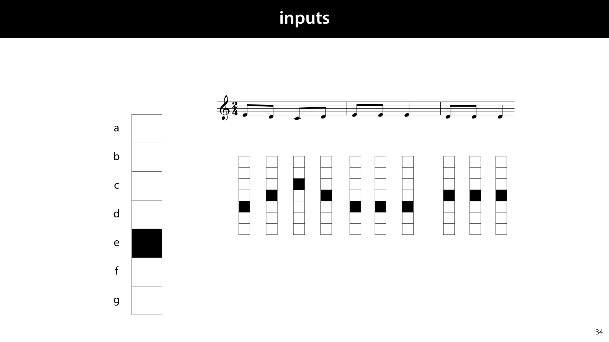

            <figcaption>
            
First, the <strong>input</strong>. As we’ve seen, when we want to do deep learning, our input should be represented as a tensor. Preferably in a way that retains all information (i.e. we want to be learning from the raw data, or something as close to it as possible). 

Here is an example: to encode a simple monophonic musical sequence, we just one-hot encode the notes, and encode the note sequence as a matrix: one dimension for time, one dimension for the notes. We can do the same thing for characters or even words in natural language sequences. 

 

source: <a href="https://violinsheetmusic.org"><strong class="blue">https://violinsheetmusic.org</strong></a>

<a href="https://violinsheetmusic.org"><strong class="blue"></strong></a>

            </figcaption>
       </section>

       <section id="slide-035" class="anim">
            <a class="slide-link" href="https://mlvu.github.io/lecture11#slide-035" title="Link to this slide.">link here</a>
            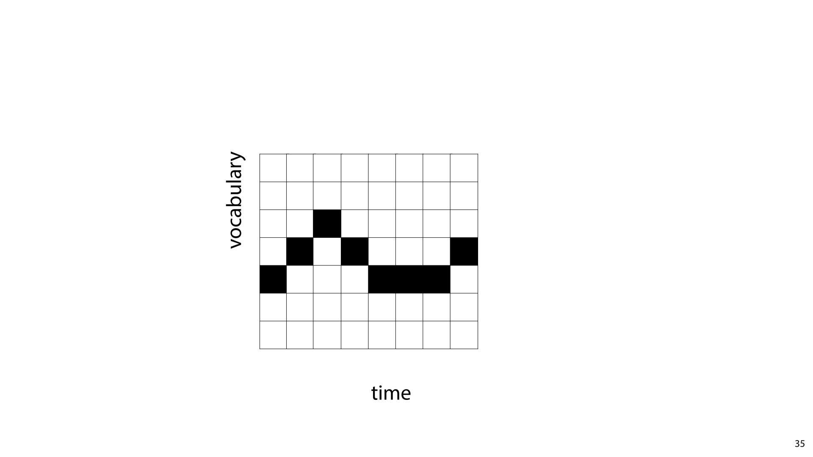

            <figcaption>
            
One thing is different from what we’ve seen so far in deep learning data: if we have multiple sequences of different lengths, this leads to a data set of matrices of different sizes.

            </figcaption>
            click image for animation
       </section>

       <section id="slide-036" class="anim">
            <a class="slide-link" href="https://mlvu.github.io/lecture11#slide-036" title="Link to this slide.">link here</a>
            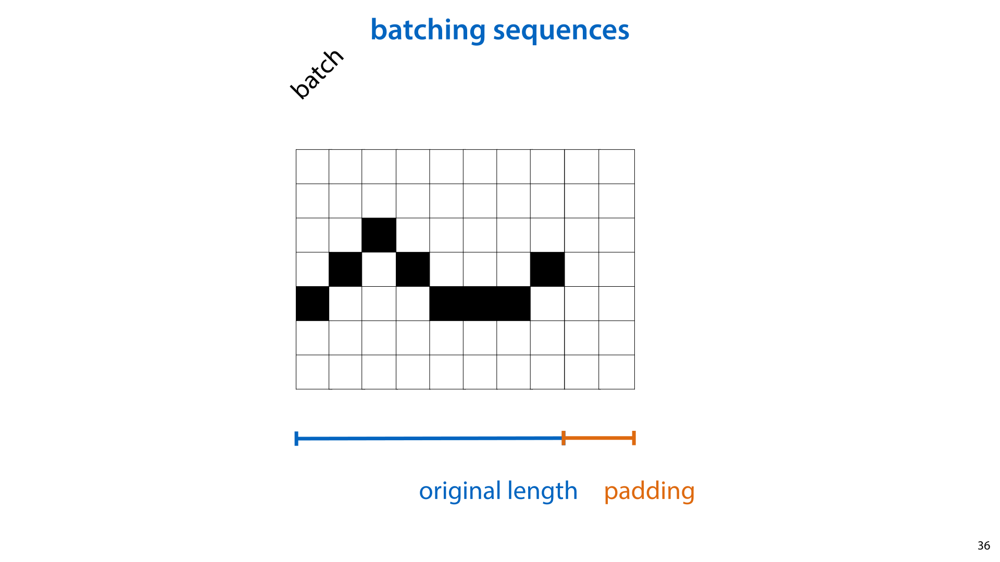

            <figcaption>
            
In principle, this is not a problem, we want to build models that can deal with sequences of any length (and can generalise over sequences of variable lengths), so they should be able to handle this. 

However, within a batch it’s usually required that all sequences have the same length. One way to deal with this, is to sequences of similar length together (for instance by sorting the data by length) and then pad the shorter sequences with zero vectors, so that all sequences are the same length. 

At this point, we have translated a batch of input sequences into a 3-tensor, which can be consumed by any deep learning model.

            </figcaption>
            click image for animation
       </section>

       <section id="slide-037" class="anim">
            <a class="slide-link" href="https://mlvu.github.io/lecture11#slide-037" title="Link to this slide.">link here</a>
            

            <figcaption>
            
One-hot vectors are fine if if you have a small vocabulary of symbols (like seven notes), but if you want to model 100 000 words, you’re using a lot of memory that is mostly filled with zeros.  

An alternative method is to use <strong>embedding vectors</strong>. The idea here is that you assign each input symbol in your vocabulary a vector of random values. You then translate a symbolic input sequence into a sequence of vectors by mapping the input symbold to their corresponding embedding vectors. The dimensionality of the embedding vectors is a hyperparameter, but it’s usually set between 64 and 1024. 

The fundamental trick of embedding vectors is that we treat these vectors<strong> as parameters of the model</strong>. We feed this input sequence to the model (we’ll describe what that looks like later), compute the loss, backpropagate, and we get gradients on all parameters of the model, including these embedding vectors. As we train, these vectors become useful representations of our words in some high dimensional space.

            </figcaption>
            click image for animation
       </section>

       <section id="slide-038">
            <a class="slide-link" href="https://mlvu.github.io/lecture11#slide-038" title="Link to this slide.">link here</a>
            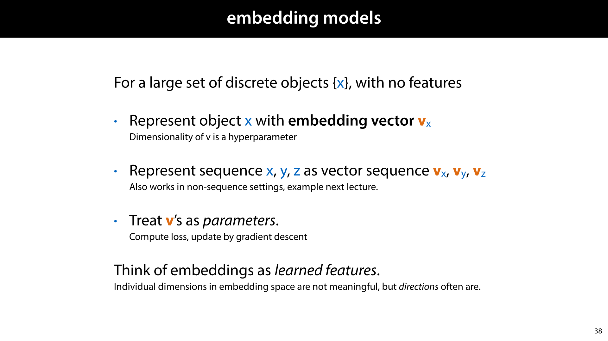

            <figcaption>
            
Embedding vectors occur in many contexts, so let’s define them more broadly. In any setting where you have a large collection of discrete objects, and no features for these objects, you can represent them with embedding vectors. You assign a unique vector to each object in your set, and use these vectors to  represent the objects you want to learn over. If you are training on a sequence of objects, you turn this into a sequence of embedding vectors.  

Once you’ve computed your loss, you update the values of the embedding vectors by gradient descent, possibly using backpropagation to compute the gradients. 

We can think of the embeddings as learned features: we don’t have features for our objects, so we simply assign them some random features, and then tweak the values of these by gradient descent.

            </figcaption>
       </section>

       <section id="slide-039">
            <a class="slide-link" href="https://mlvu.github.io/lecture11#slide-039" title="Link to this slide.">link here</a>
            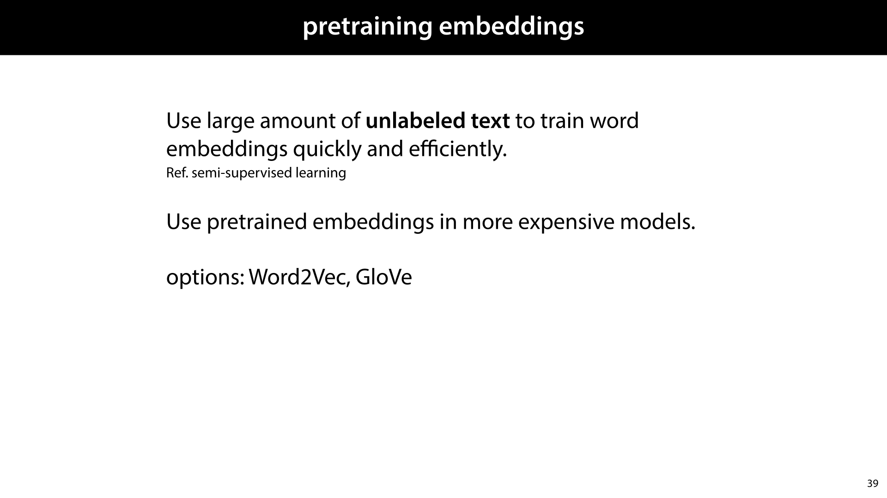

            <figcaption>
            
In addition to training embeddings together with the other parameters of our model, embeddings also provide a good opportunity for <strong>pre-training</strong>. If we have a large amount of unlabeled text available, and we can think of a cheap way to use it to train word embeddings, these can then be re-used in larger, more elaborate models. 

We’ll take a quick look at the Word2vec model as an example.

            </figcaption>
       </section>

       <section id="slide-040" class="anim">
            <a class="slide-link" href="https://mlvu.github.io/lecture11#slide-040" title="Link to this slide.">link here</a>
            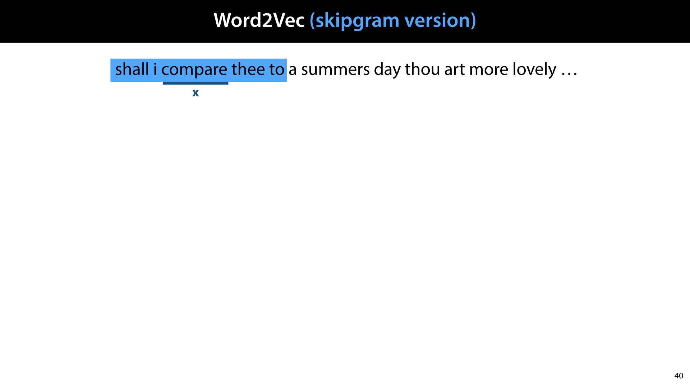

            <figcaption>
            
We start with a large corpus: a data set of natural language. From this we create a very simple dataset. We slide a window of, say, five words, along the text, and match every word to the words that appear in its context. The task is to predict, for a given input word, the distribution on the words appearing in the context. 

We model this very simply by creating embedding vectors for all words in our vocabulary. We then feed these to a single-layer neural network with one output for every word in our vocabulary and with a softmax output. If we have 100 000 words in our vocabulary, then we can think of this as a one-layer classification network with 100 000 classes, and the embedding as input features. We train both the embedding and the weight of the network in concert.  

If training is succesful, we know that our embedding vectors now contain the information about which words are likely to appear in their context. The basic idea is that this information captures a lot of their meaning (this is sometimes called the distributional hypothesis).  

 

The softmax activation over 100K outputs is very expensive to compute, and you need some clever tricks to make this feasible (called<em> hierarchical </em>softmax or negative sampling). We won’t go into them here.

            </figcaption>
            click image for animation
       </section>

       <section id="slide-041" class="anim">
            <a class="slide-link" href="https://mlvu.github.io/lecture11#slide-041" title="Link to this slide.">link here</a>
            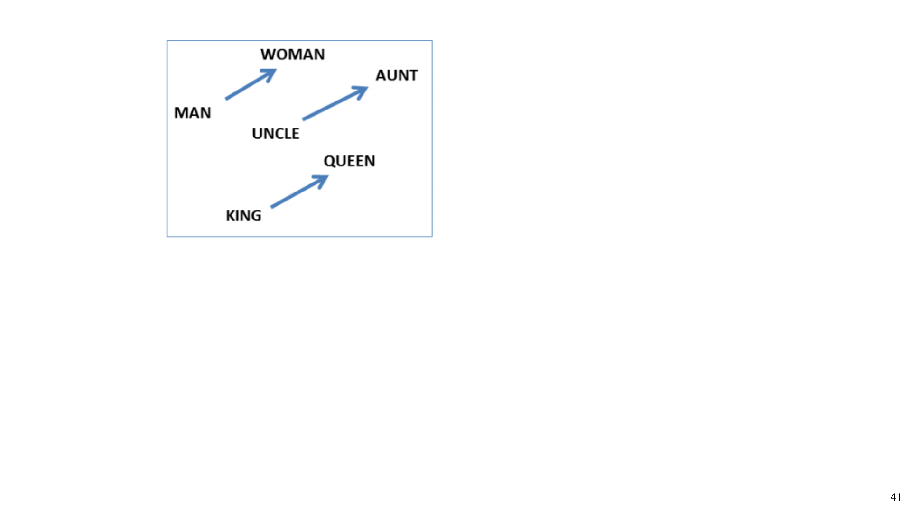

            <figcaption>
            
If we investigate what the Word2Vec embeddings look like after training, we can tease out some interesting properties. For instance, it seems like there is a direction in the resulting embedding space, that, if we move along this direction, pushes male words towards their female counterparts. What’s more, if we subtract the embedding of the word woman from the embedding of the word man, we we find roughly this direction. 

Compare this with the “smiling vector” we saw in the autoencoder lecture. Word2Vec isn’t an autoencoder, but we are learning a similar kind of latent space model.

            </figcaption>
            click image for animation
       </section>

       <section id="slide-042">
            <a class="slide-link" href="https://mlvu.github.io/lecture11#slide-042" title="Link to this slide.">link here</a>
            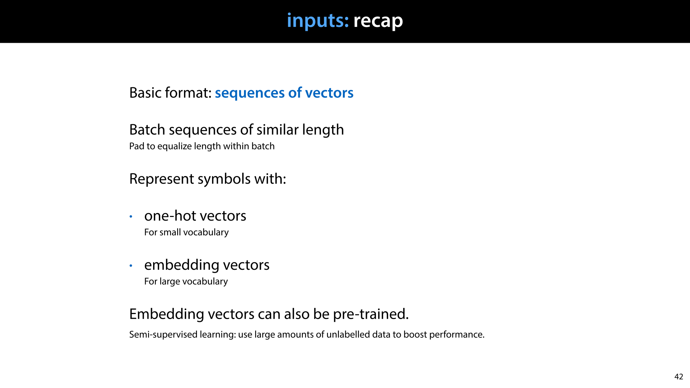

            <figcaption>
            
So, these are the most important methods for representing input sequences so that deep learning models can understand them. We need to somehow translate our input to a sequence of vectors. 

If we have a symbolic input, we can do this by representing the symbols with <strong>one-hot vectors</strong> if the vocabulary is small, and with <strong>embedding vectors</strong> if the vocabulary is larger. 

Pre-training your embedding 

            </figcaption>
       </section>

       <section id="slide-043">
            <a class="slide-link" href="https://mlvu.github.io/lecture11#slide-043" title="Link to this slide.">link here</a>
            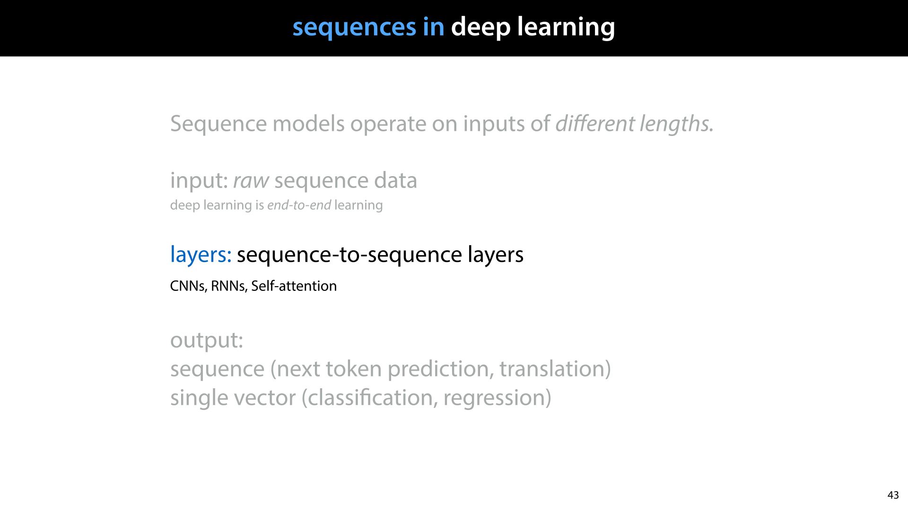

            <figcaption>
            
Now that we know how to represent our input, we need some layers that we can stack together to build a deep neural net for sequences.

            </figcaption>
       </section>

       <section id="slide-044">
            <a class="slide-link" href="https://mlvu.github.io/lecture11#slide-044" title="Link to this slide.">link here</a>
            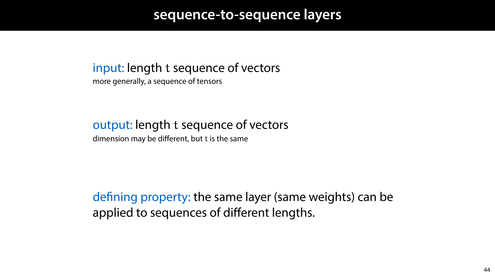

            <figcaption>
            
The next ingredient we need is layers that we can stack on top of each other. These need to be <strong>sequence-to-sequence layers</strong>. These are layers that take sequence of vectors as input and produce a new sequence of vectors as output. The input and output  

The defining property of a sequence-to-sequence layer is that they can consume sequences of different lengths with the same set of weights. That is, in one iteration of gradient descent, we can feed the layer a sequence of 5 words, get a loss and update its weights, and the next iteration we can feed it a sequence of 15 words, and get a loss and a gradient<em> on the same weights</em>.

            </figcaption>
       </section>

       <section id="slide-045" class="anim">
            <a class="slide-link" href="https://mlvu.github.io/lecture11#slide-045" title="Link to this slide.">link here</a>
            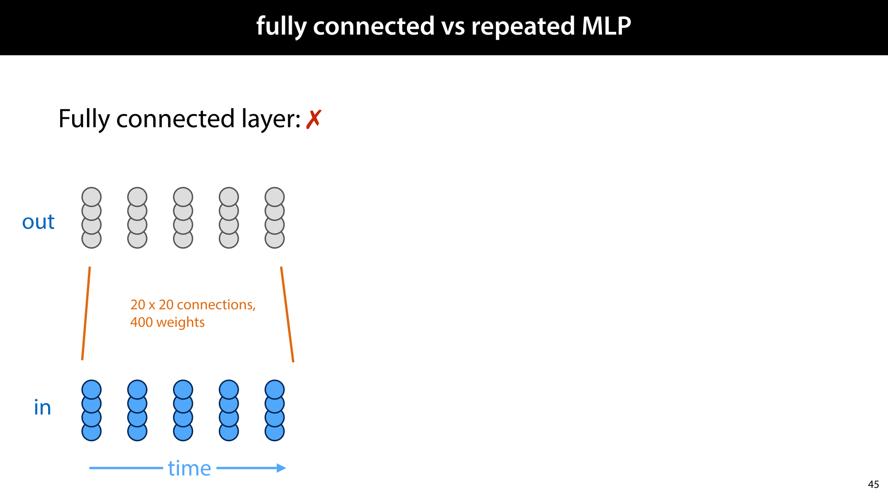

            <figcaption>
            
Here is an example: imagine that we need a layer that consumes a sequence of five vectors with four elements each and produces another sequence of five vectors with four elements each. 

A fully connected layer would simply connect every input with every output, giving us 400 connections with a weight each. This is<em> not </em>a sequence-to-sequence layer. Why not? Imagine that the next instance has 6 vectors: we wouldn’t be able to feed it to this layer without adding extra weights. 

The version on the right also uses an MLP, but only applies it to each vector in isolation: this gives us 4x4=16 connections per vector and 80 in total. These eighty connection share only 16 unique weights, which are repeated at each step. 

This is a sequence-to-sequence layer. If the next instance has 6 vectors, we can simple repeat the same MLP again, we don’t need any extra weights. This is the basic idea of the sequence-to-sequence layer. If we see an input with a new length, we can take the layer, keep the weights the same, but configure the layer to accept a sequence of the required length. 

Of course, this second option may technically be a sequence-to-sequence layer, but it doesn’t actually learn over the time dimension. The value of vector 5 is in no way influenced by the values of input vectors 1 through 4, because there are no connections between them. Luckily, there is a layer that we’ve seen already, that is a sequence-to-sequence layer and allows for information to be propagated along the time dimension. 

 

NB: We call the sequence dimension “time”, but it doesn’t necessarily always represent time. 

            </figcaption>
            click image for animation
       </section>

       <section id="slide-046">
            <a class="slide-link" href="https://mlvu.github.io/lecture11#slide-046" title="Link to this slide.">link here</a>
            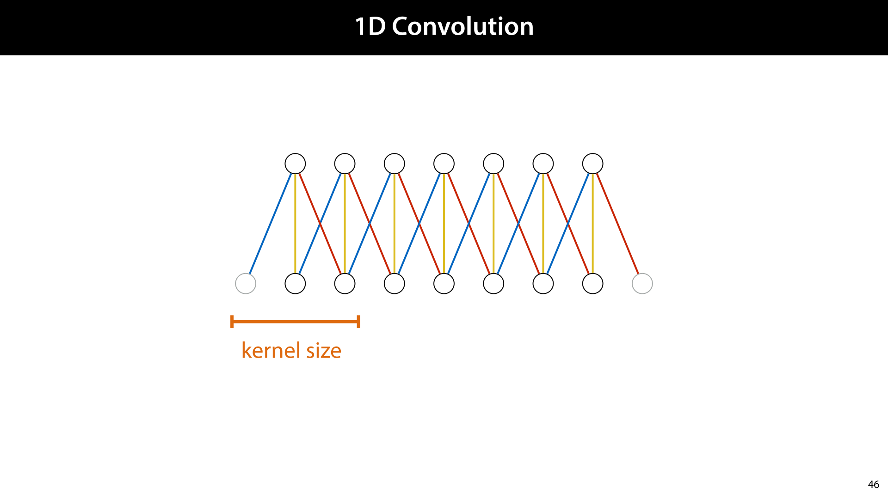

            <figcaption>
            
This is the 1D convolution that we first saw in the deep learning lecture. 

Note that the number of (distinct) weights depends only on the size of the kernel and the number of input and output channels. If we see a longer or shorter sequence, we just repeat the same kernel more often, but we don’t need extra weights. 

All we need to do to fit our definition of a sequence to sequence layer is to add a little padding so that the input and output have the same length. 

Note that even though we are now allowing information to propagate from one position in the input to another position in the output, we’re only allowing this over a finite distance. This is a bit like the finite memory of the Markov model. We can use the history (and future) of the sequence but only a fixed, finite part of it. 

NB: Note that the MLP example from the last slide is equal to a 1d convolution with a kernel size of 1.

            </figcaption>
       </section>

       <section id="slide-047">
            <a class="slide-link" href="https://mlvu.github.io/lecture11#slide-047" title="Link to this slide.">link here</a>
            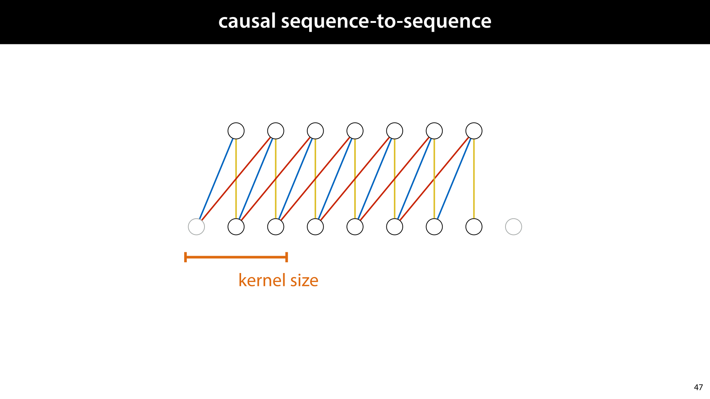

            <figcaption>
            
In many settings, it’s not reasonable to let the model look into the future. For instance when you only have this information for your training data, but you don’t expect to have it in production. In that case it’s important to wire up your sequence to sequence layer so that each output node only has connections to the corresponding input node and to ones before it.  

This is called <strong>causal sequence to sequence layer</strong>. And pictured here is a a <strong>causal convolution</strong>. 
<aside    >Note that this doesn’t imply that we’re performing causal inference: that is, we’re not making guaranteed distinctions between correlation and causation, as we discussed in the social impact videos. It’s simply a way of ensuring that the model can’t see “into the future.”</aside><aside    ></aside>
            </figcaption>
       </section>

       <section id="slide-048">
            <a class="slide-link" href="https://mlvu.github.io/lecture11#slide-048" title="Link to this slide.">link here</a>
            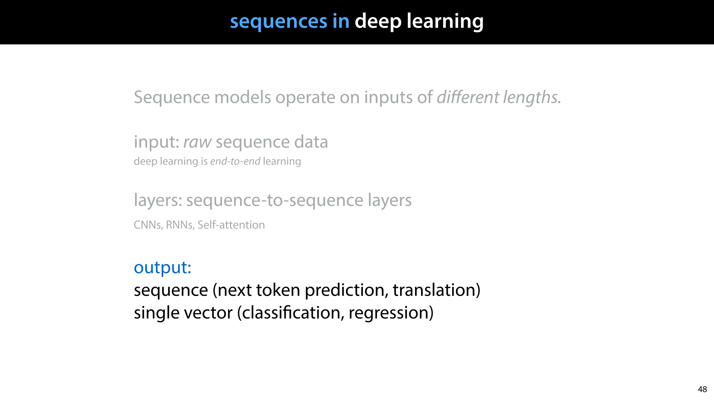

            <figcaption>
            
The convolution layer is hopefully enough to give you a concrete idea of what a sequence to sequence layer looks like. In the next video we’ll see another way of building seuqence to sequence layers. 

So, now we have an input format: a sequence of vectors, and a type of layer, which translates a sequence of vectors to another sequence of vectors. Finally, we need to give our network some output: something that allows it to compute a single loss, so that we can start our backpropagation. 

            </figcaption>
       </section>

       <section id="slide-049">
            <a class="slide-link" href="https://mlvu.github.io/lecture11#slide-049" title="Link to this slide.">link here</a>
            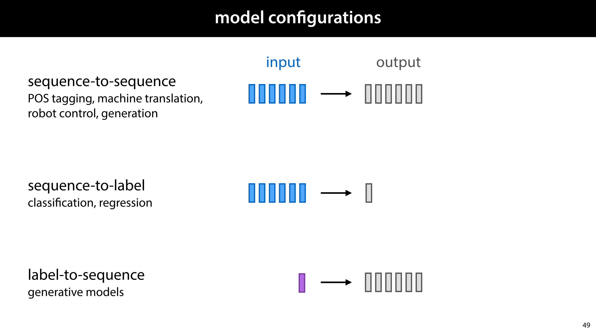

            <figcaption>
            
There’s number of ways we can configure our model, depending on what we’re trying to achieve.  

Here are three basic configurations we may want to build.

            </figcaption>
       </section>

       <section id="slide-050" class="anim">
            <a class="slide-link" href="https://mlvu.github.io/lecture11#slide-050" title="Link to this slide.">link here</a>
            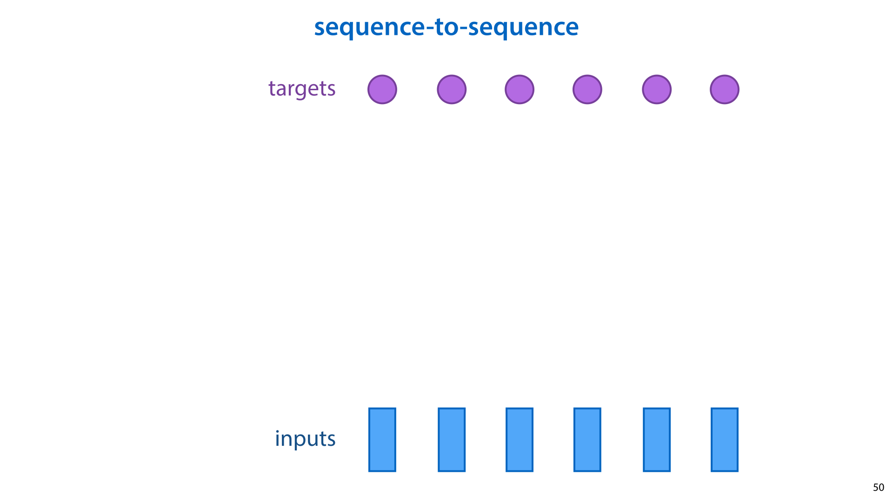

            <figcaption>
            
A sequence-to-sequence task is probably the simplest set-up. Our dataset consists of a set of input and target sequences.  

We simply create a model by stacking a bunch of sequence to sequence layers, and our loss is the difference between the target sequence and the output sequence.

            </figcaption>
            click image for animation
       </section>

       <section id="slide-051" class="anim">
            <a class="slide-link" href="https://mlvu.github.io/lecture11#slide-051" title="Link to this slide.">link here</a>
            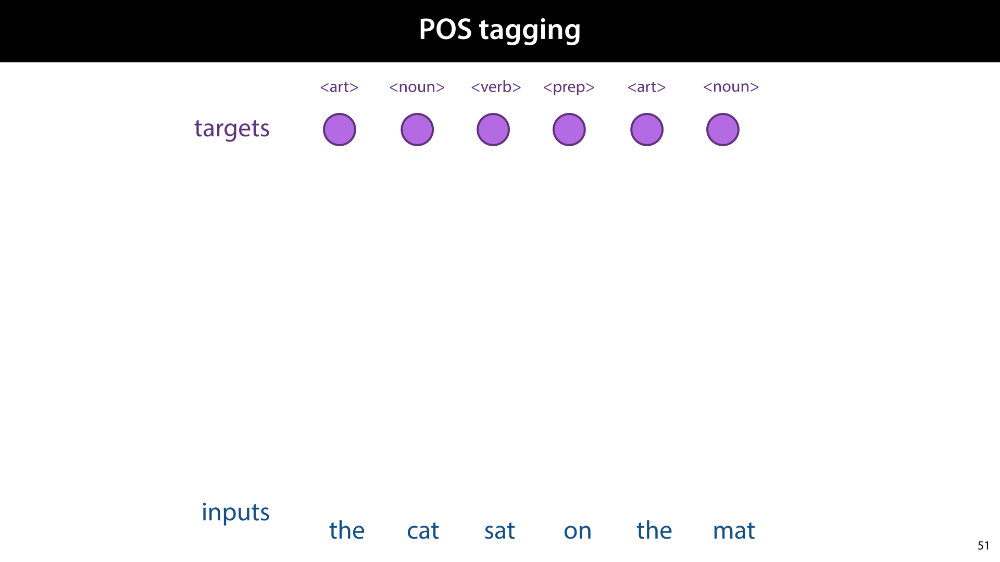

            <figcaption>
            
Here’s a simple example of a sequence to sequence task: tag each word in a sentence with its grammatical category. This is known as part-of-speech tagging. All we need is a large collection of sentences that have been tagged. 

For the embedding layer, we convert our input sequence to positive integers. We have to decide beforehand what the size of our vocabulary is. If we keep a vocabulary of 10 000 tokens, the embedding layer will create 10 000 embedding vectors for us.  

It then takes a sequence of positive integers and translates this to a sequence of the corresponding embedding vectors. These are fed to a stack of s2s layers, which produce a sequence of vectors with al many elements as output tokens. After applying a softmax activation to each vector in this sequence, we get a sequence of probabilities over the target tokens. 

In the rest of the lecture we will omit the embedding layer, assuming that some suitable input representation has been chosen.

            </figcaption>
            click image for animation
       </section>

       <section id="slide-052" class="anim">
            <a class="slide-link" href="https://mlvu.github.io/lecture11#slide-052" title="Link to this slide.">link here</a>
            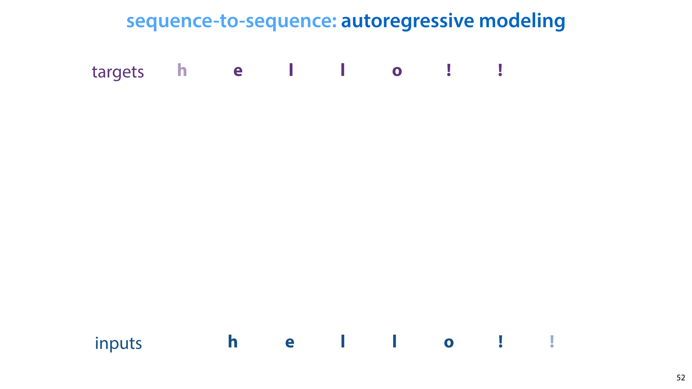

            <figcaption>
            
One interesting thing we can build with a sequence-to-sequence model is an <strong>autoregressive model</strong>. 

We feed some sequence, and to set the target as the same sequence, shifted one token to the left. We then feed the input through several causal layers, so that the network can only look backward in the sequence. And we produce a probability distribution on the output characters. 

This effectively trains the model to predict the next character in the sequence, but it does so for the whole sequence in parallel. 

Note that this only works with causal models, because non-causal models can just look ahead in the sequence to see the next character.

            </figcaption>
            click image for animation
       </section>

       <section id="slide-053">
            <a class="slide-link" href="https://mlvu.github.io/lecture11#slide-053" title="Link to this slide.">link here</a>
            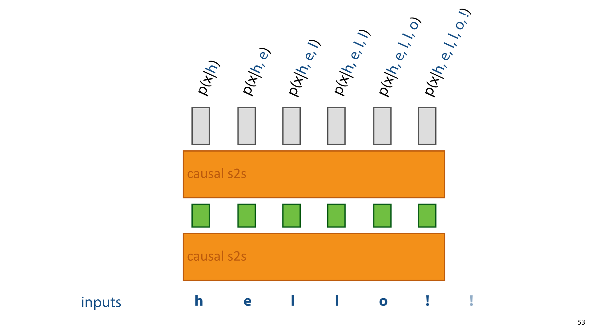

            <figcaption>
            
Each of these outputs gives us the probability of the next character in the sequence, given the preceding characters. 

            </figcaption>
       </section>

       <section id="slide-054" class="anim">
            <a class="slide-link" href="https://mlvu.github.io/lecture11#slide-054" title="Link to this slide.">link here</a>
            

            <figcaption>
            
After the network is trained, we can start with a small seed of tokens, and sequentially sample a likely sequence. This is exactly what we did with the Markov model, but now we have a potentially much more powerful model, with a potentially infinite memory. 

After training, we feed the model the whole seed each time and look only at its last output to give us a probability distribution on what the next token will be. The other outputs are only used during training. 

 

We’ll see some examples of data generated this way this after we’ve explained LSTM networks. 

            </figcaption>
            click image for animation
       </section>

       <section id="slide-055">
            <a class="slide-link" href="https://mlvu.github.io/lecture11#slide-055" title="Link to this slide.">link here</a>
            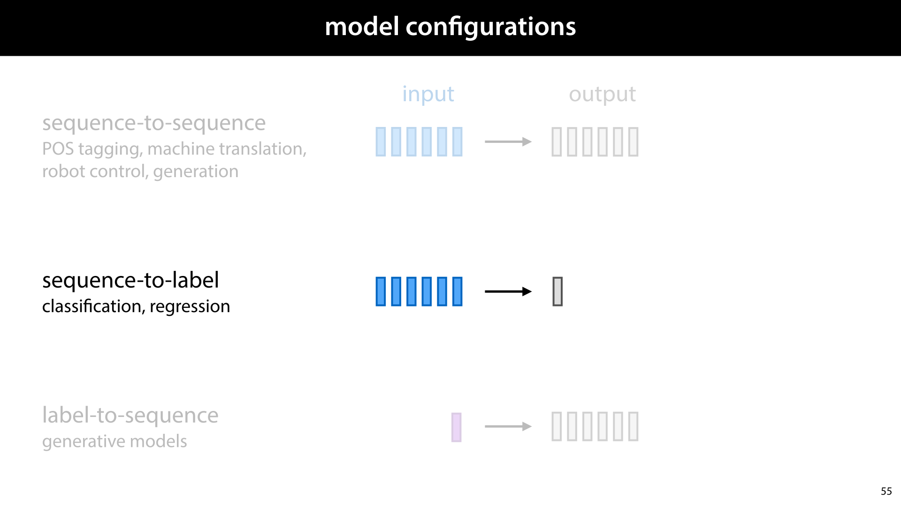

            <figcaption>
            
So that’s what we can do with sequence-to-sequence model.  

If we have a sequence labeling task, like the email spam classification example we saw earlier, We’ll need to construct a model that consumes sequences of variable lengths, but at some stages reduces them down to a single label (like a class promability vector).

            </figcaption>
       </section>

       <section id="slide-056" class="anim">
            <a class="slide-link" href="https://mlvu.github.io/lecture11#slide-056" title="Link to this slide.">link here</a>
            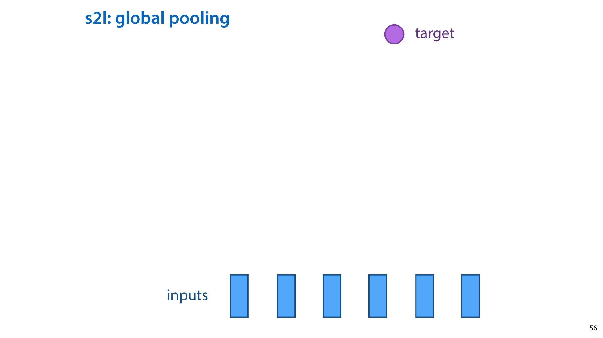

            <figcaption>
            

            </figcaption>
            click image for animation
       </section>

       <section id="slide-057">
            <a class="slide-link" href="https://mlvu.github.io/lecture11#slide-057" title="Link to this slide.">link here</a>
            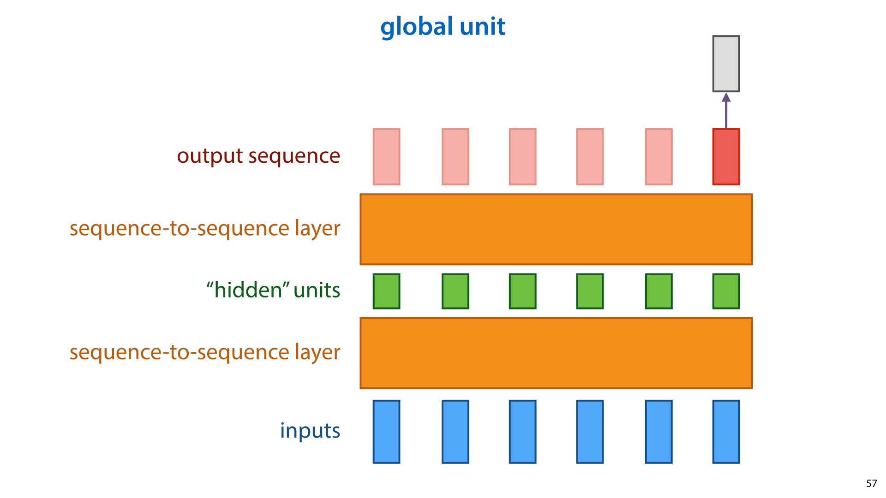

            <figcaption>
            
Another approach is to simply take one of the vectors in the output sequence, use that as the output vector and ignore the rest. If we train the neural network to classify only on this unit, it will hopefully learn to put the right information into this output vector. 

If you have causal s2s layers, it’s important that you use the last vector, since that’s the only one that gets to see the whole input sequence. 

For some layers (like recurrent ones), this kind of approach puts more weight on the end of the sequence, since the early nodes have to propagate through more intermediate steps in the s2s layer. For others (like self-attention), all inputs in the sequence are treated equally, and there is little difference between a global unit and a pooling layer.

            </figcaption>
       </section>

       <section id="slide-058">
            <a class="slide-link" href="https://mlvu.github.io/lecture11#slide-058" title="Link to this slide.">link here</a>
            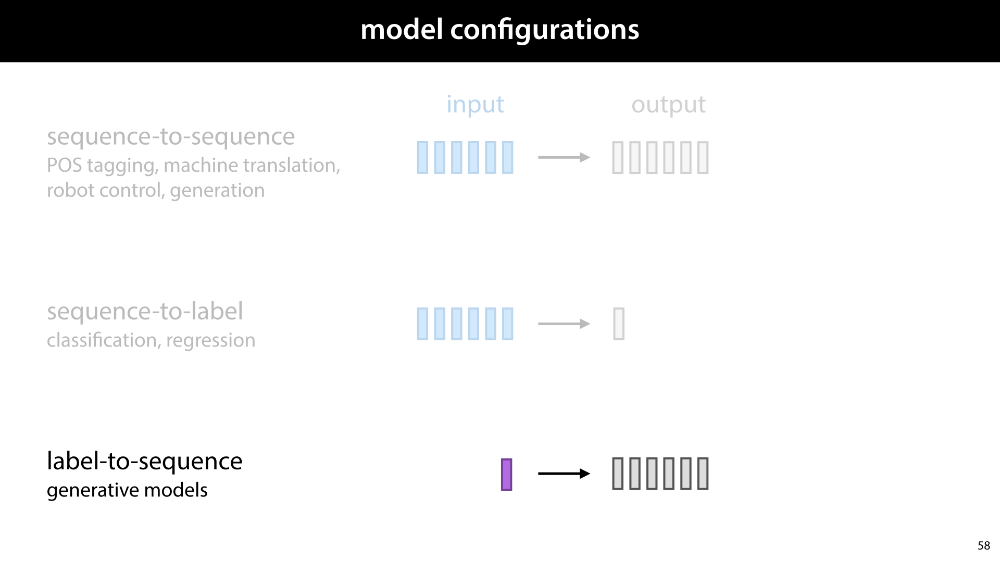

            <figcaption>
            
Finally, if we want to train a generative model on sequences, we may want to start with a label, for instance a latent vector, or a representation of the type of thing we want to sample, and map that to a sequence.

            </figcaption>
       </section>

       <section id="slide-059">
            <a class="slide-link" href="https://mlvu.github.io/lecture11#slide-059" title="Link to this slide.">link here</a>
            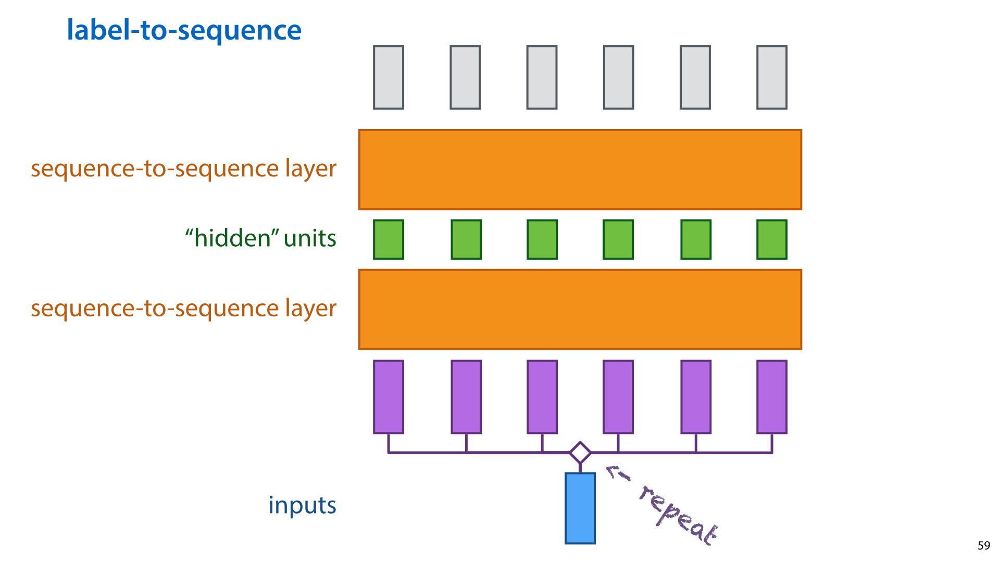

            <figcaption>
            
The simplest way to achieve this, is just to take your input vector and to repeat it into a sequence of the same vector over and over again. 

For some layers, like recurrent ones, there are other ways to feed a single vector in addition to the input sequence, but we won’t detail that here.

            </figcaption>
       </section>

       <section id="slide-060">
            <a class="slide-link" href="https://mlvu.github.io/lecture11#slide-060" title="Link to this slide.">link here</a>
            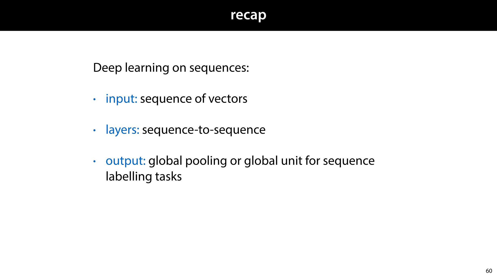

            <figcaption>
            

            </figcaption>
       </section>

       <section class="video" id="video-060">
           <a class="slide-link" href="https://mlvu.github.io/lecture11#video-60">link here</a>
           <iframe
                src="https://www.youtube.com/embed/KUjsy7Hp8fE"
                title="YouTube video player"
                frameborder="0" allow="accelerometer; autoplay; clipboard-write; encrypted-media; gyroscope; picture-in-picture"
                allowfullscreen>
           </iframe>

       </section>

       <section id="slide-061">
            <a class="slide-link" href="https://mlvu.github.io/lecture11#slide-061" title="Link to this slide.">link here</a>
            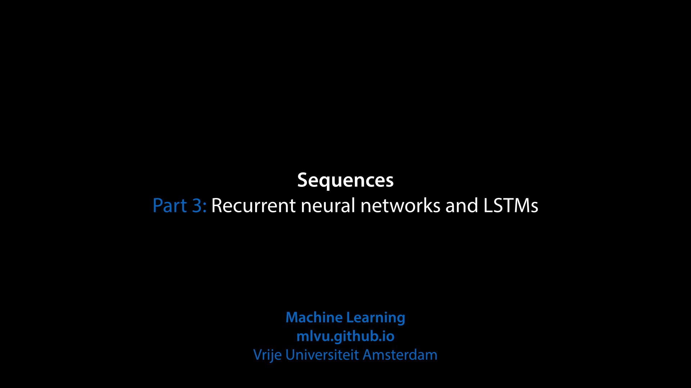

            <figcaption>
            
 

            </figcaption>
       </section>

       <section id="slide-062">
            <a class="slide-link" href="https://mlvu.github.io/lecture11#slide-062" title="Link to this slide.">link here</a>
            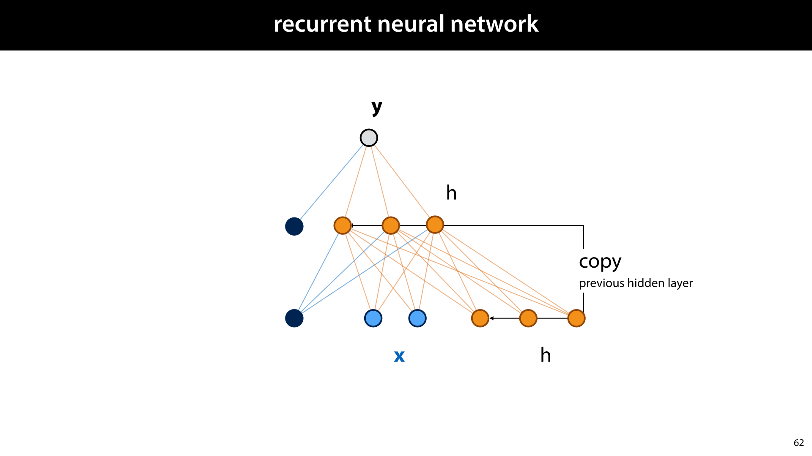

            <figcaption>
            
One of the most popular neural networks for sequences is the<strong> recurrent neural network</strong>. This is a generic name for any neural network with cycles in it. 

The figure shows a popular configuration. It’s a basic fully connected network, except that its input x is extended by three nodes to which the hidden layer is copied.

            </figcaption>
       </section>

       <section id="slide-063">
            <a class="slide-link" href="https://mlvu.github.io/lecture11#slide-063" title="Link to this slide.">link here</a>
            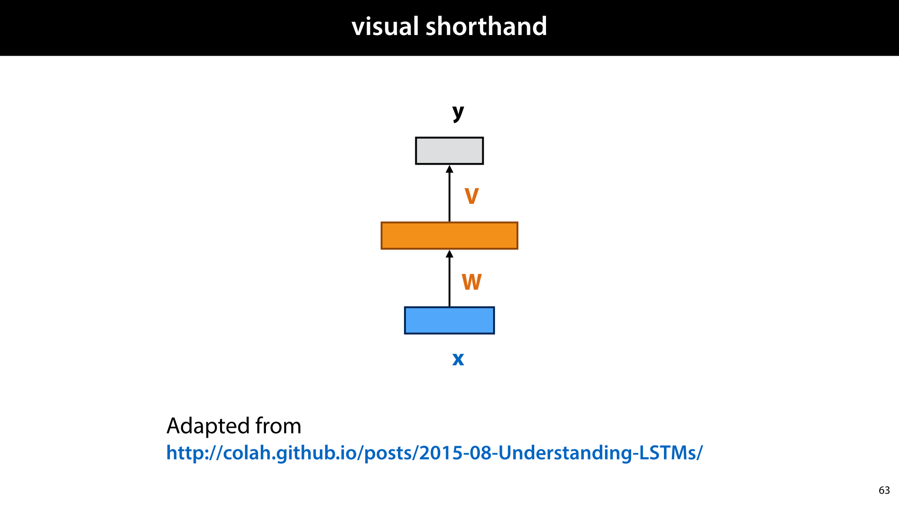

            <figcaption>
            
To keep things clear we will adopt this visual shorthand: a rectangle represents a vector of nodes, and an arrow feeding into such a rectangle annotated with a weight matrix represents a fully connected transformation. 

We will assume bias nodes are included without drawing them.

            </figcaption>
       </section>

       <section id="slide-064" class="anim">
            <a class="slide-link" href="https://mlvu.github.io/lecture11#slide-064" title="Link to this slide.">link here</a>
            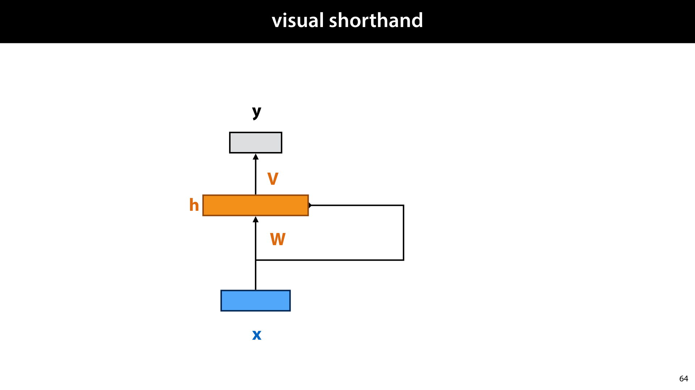

            <figcaption>
            
A line with no weight matrix represents a copy of the input vector. When two lines flow into each other, we concatenate their vectors.  

Here, the added line copies h, concatenates it to x, and applies weight matrix W. 

            </figcaption>
            click image for animation
       </section>

       <section id="slide-065">
            <a class="slide-link" href="https://mlvu.github.io/lecture11#slide-065" title="Link to this slide.">link here</a>
            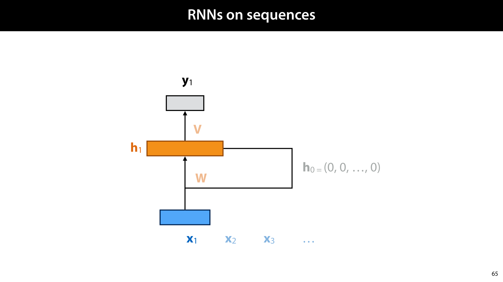

            <figcaption>
            
We can now apply this neural network to a sequence. We feed it the first input, x1, result in a first value for the hidden layer, h1, and retrieve the first output y1. 

The hidden nodes are initialise to zero, so at first the network behaves just like a fully connected network.

            </figcaption>
       </section>

       <section id="slide-066">
            <a class="slide-link" href="https://mlvu.github.io/lecture11#slide-066" title="Link to this slide.">link here</a>
            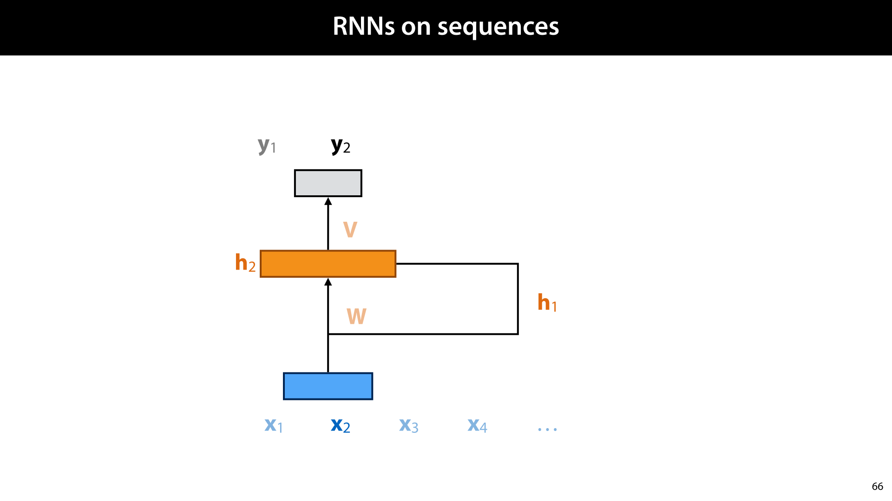

            <figcaption>
            
We then feed the second input in the sequence, x1. We now receive the <em>previous </em>hidden layer, h1, concatenate it to the input, and multiply it by W, to produce the second hidden layer h2. This is multiplied by V to produce the second output.

            </figcaption>
       </section>

       <section id="slide-067">
            <a class="slide-link" href="https://mlvu.github.io/lecture11#slide-067" title="Link to this slide.">link here</a>
            

            <figcaption>
            
And so on.

            </figcaption>
       </section>

       <section id="slide-068">
            <a class="slide-link" href="https://mlvu.github.io/lecture11#slide-068" title="Link to this slide.">link here</a>
            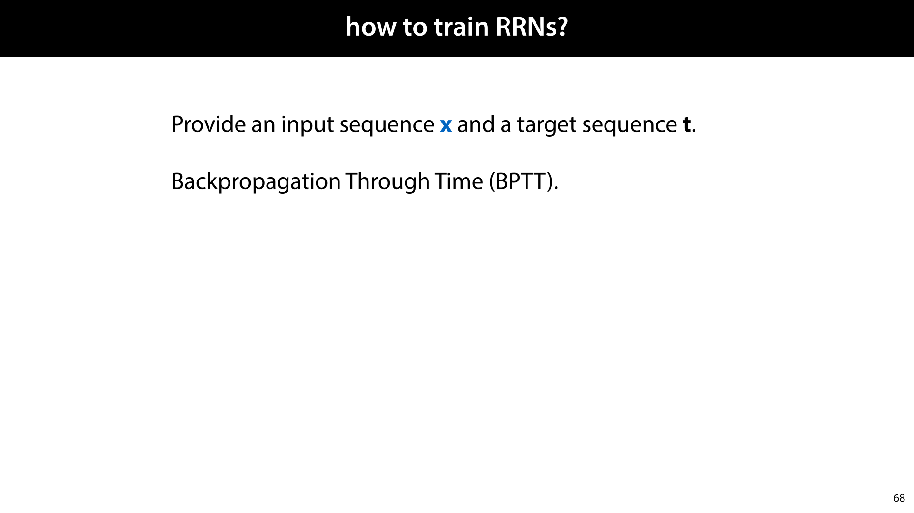

            <figcaption>
            
In principle, we 

            </figcaption>
       </section>

       <section id="slide-069" class="anim">
            <a class="slide-link" href="https://mlvu.github.io/lecture11#slide-069" title="Link to this slide.">link here</a>
            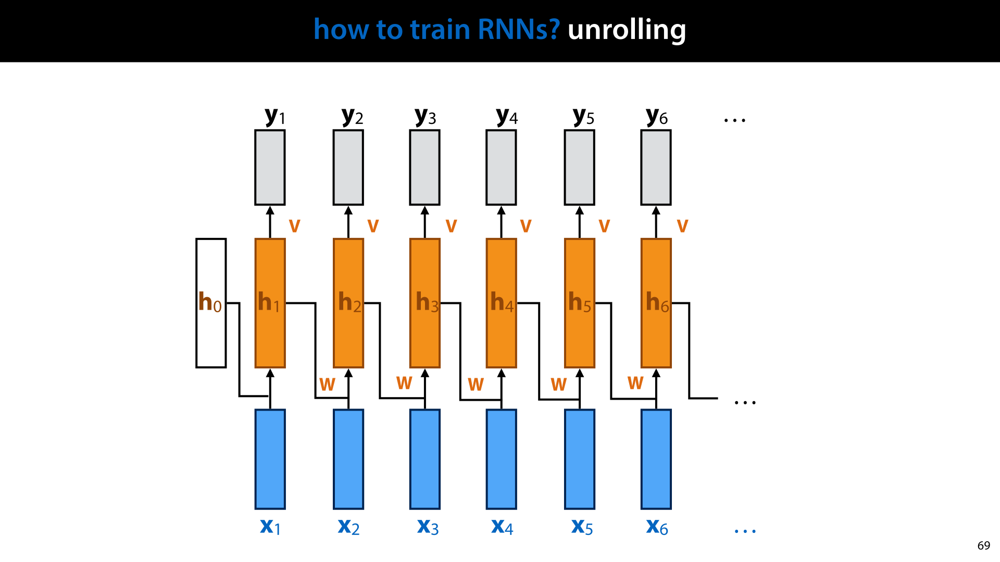

            <figcaption>
            
Instead of visualising a single small network, applied at every time step, we can <strong>unroll</strong> the network. Every step in the sequence is applied in parallel to a copy of the network, and the recurrent connection flows from the previous copy to the next. 

Now the whole network is just one big, complicated<strong> feedforward net</strong>, that is, a network<em> without </em>cycles. Note that we have a lot of shared weights, but we know how to deal with those. 

The hidden layer is initialised to the zero vector. 

            </figcaption>
            click image for animation
       </section>

       <section id="slide-070">
            <a class="slide-link" href="https://mlvu.github.io/lecture11#slide-070" title="Link to this slide.">link here</a>
            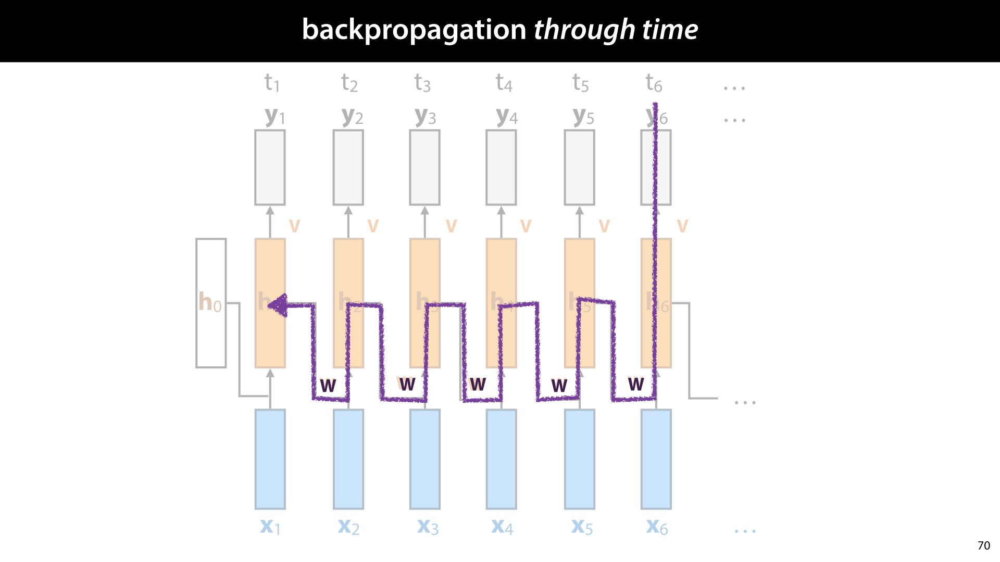

            <figcaption>
            
Now the whole network is just one big, complicated feedforward net. Note that we have a lot of shared weights, but we know how to deal with those. 

            </figcaption>
       </section>

       <section id="slide-071">
            <a class="slide-link" href="https://mlvu.github.io/lecture11#slide-071" title="Link to this slide.">link here</a>
            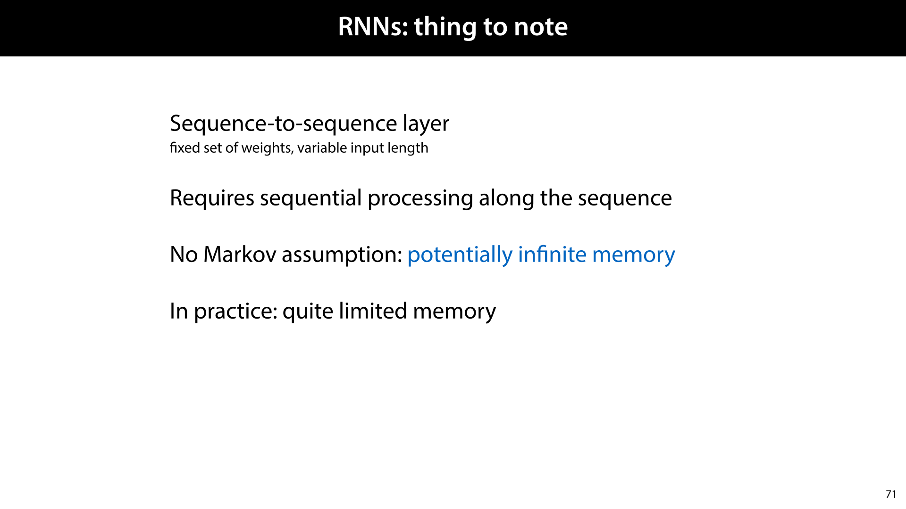

            <figcaption>
            

            </figcaption>
       </section>

       <section id="slide-072">
            <a class="slide-link" href="https://mlvu.github.io/lecture11#slide-072" title="Link to this slide.">link here</a>
            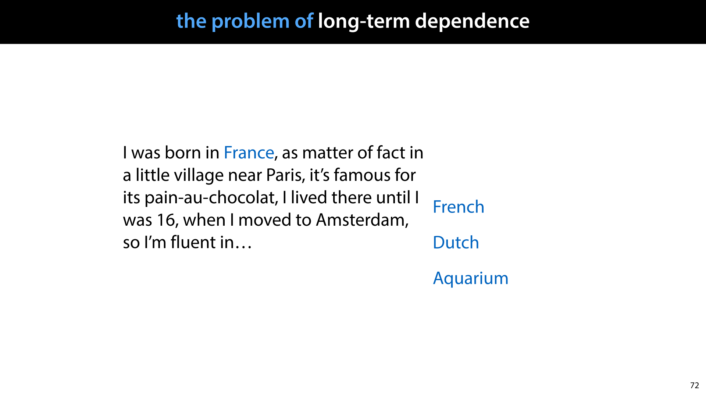

            <figcaption>
            
Basic RNNs work pretty well, but they do not learn to remember information for very long. Technically they can, but the gradient vanished too quickly over the timesteps. 

You can’t have a long term memory for everything. You need to be selective, and you need to learn to select words to be stored for the long term when you first see them.  

In order to remember things long term you need to forget many other things.

            </figcaption>
       </section>

       <section id="slide-073">
            <a class="slide-link" href="https://mlvu.github.io/lecture11#slide-073" title="Link to this slide.">link here</a>
            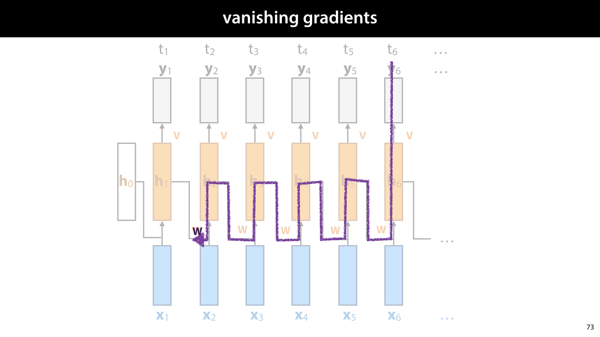

            <figcaption>
            
One of the reasons that neural networks don remember too well is that the weights between an input long ago and the current output get a gradient that has to travel through a lot of layers in our network. If these are sigmoid activated layers, these gradients will vanish much more strongly than the gradients between input 6 and output 6, so the network will always learn more from short term correlations between the input and the output than from long term correlations. 

We could fix this with ReLU activations and other tricks, but in the late 1990s most of this tricks weren’t available yet. Instead the LSTM was invented, which solved this problem, by moving the activations out of the way of the gradient travelling backwards in time.

            </figcaption>
       </section>

       <section id="slide-074">
            <a class="slide-link" href="https://mlvu.github.io/lecture11#slide-074" title="Link to this slide.">link here</a>
            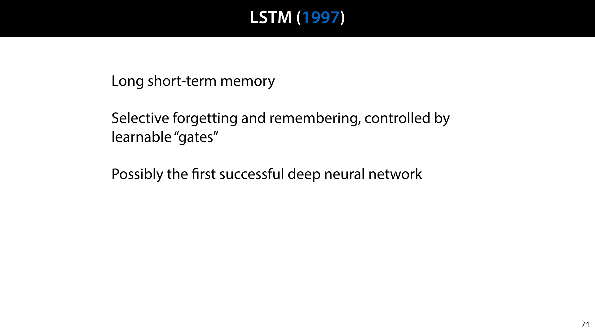

            <figcaption>
            
An enduring solution to the problem are LSTMs. LSTMs have a complex mechanism, which we’ll go through step by step. To do so, we’ll first set up a visual notation.

            </figcaption>
       </section>

       <section id="slide-075">
            <a class="slide-link" href="https://mlvu.github.io/lecture11#slide-075" title="Link to this slide.">link here</a>
            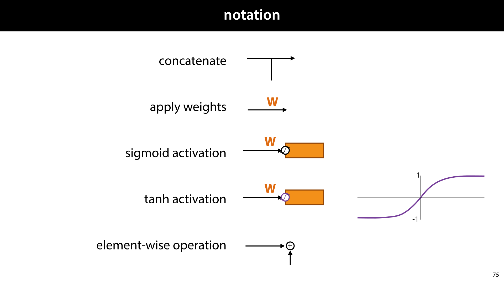

            <figcaption>
            
Here is our visual notation.

            </figcaption>
       </section>

       <section id="slide-076" class="anim">
            <a class="slide-link" href="https://mlvu.github.io/lecture11#slide-076" title="Link to this slide.">link here</a>
            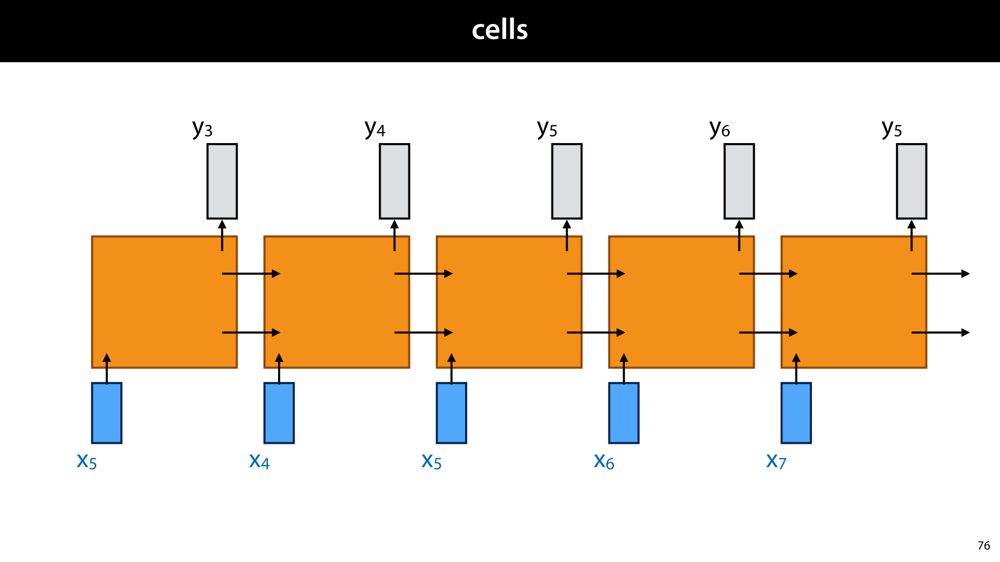

            <figcaption>
            
The basic operation of the LSTM is called a cell (the orange square, which we’ll detail later). Between cells, there are two recurrent connections, y, the current output, and C the <strong>cell state</strong>.

            </figcaption>
            click image for animation
       </section>

       <section id="slide-077">
            <a class="slide-link" href="https://mlvu.github.io/lecture11#slide-077" title="Link to this slide.">link here</a>
            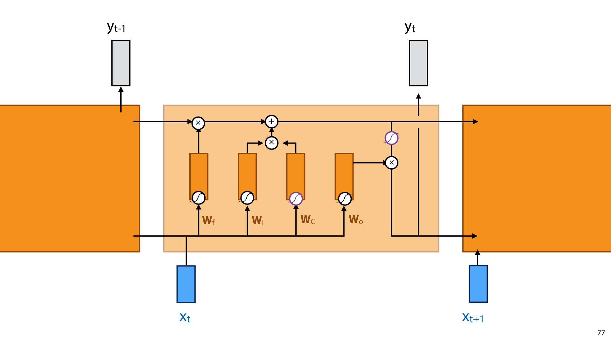

            <figcaption>
            
Here is what happens inside the cell. It looks complicated, but we’ll go through all the elements step by step.

            </figcaption>
       </section>

       <section id="slide-078">
            <a class="slide-link" href="https://mlvu.github.io/lecture11#slide-078" title="Link to this slide.">link here</a>
            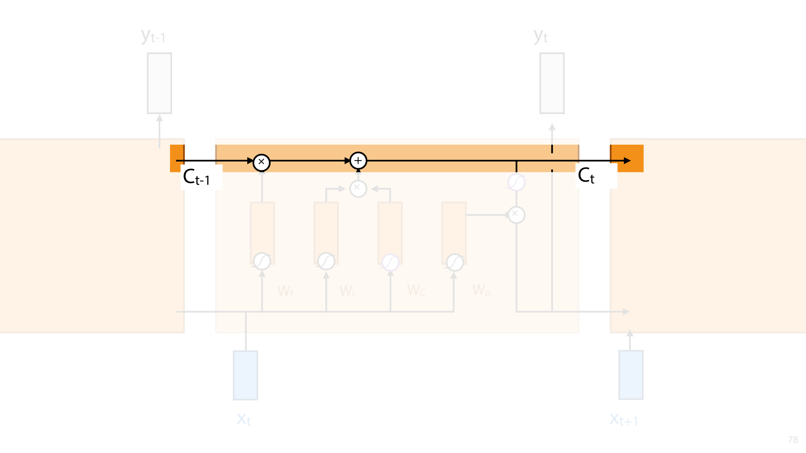

            <figcaption>
            
The first is the “conveyor belt”. It passes the previous cell state to the next cell. Along the way, the current input can be used to manipulate it.  

 

Note that the connection from the previous cell to the next has <em>no activations</em>. This means that along this path, gradients do not decay. It’s also very easy for an LSTM cell  to ignore the current information and just pass the information along the conveyor belt.

            </figcaption>
       </section>

       <section id="slide-079">
            <a class="slide-link" href="https://mlvu.github.io/lecture11#slide-079" title="Link to this slide.">link here</a>
            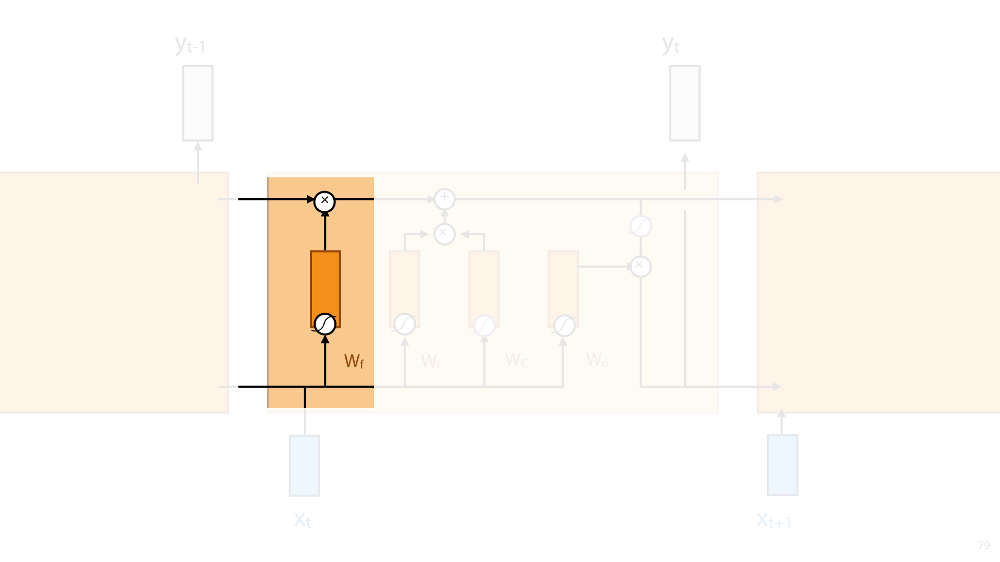

            <figcaption>
            
Here is the first manipulation of the conveyor belt. This is called the <strong>forget gate</strong>. 

It looks at the current input, concatenated with the previous output, and applies an element-wise scaling to the current value in the conveyor belt. Outputting all 1s will keep the current value on the belt what it is, and outputting all values near 0, will decay the values (forgetting what we’ve seen so far, and allowing it to be replaces by our new values in the next step).

            </figcaption>
       </section>

       <section id="slide-080">
            <a class="slide-link" href="https://mlvu.github.io/lecture11#slide-080" title="Link to this slide.">link here</a>
            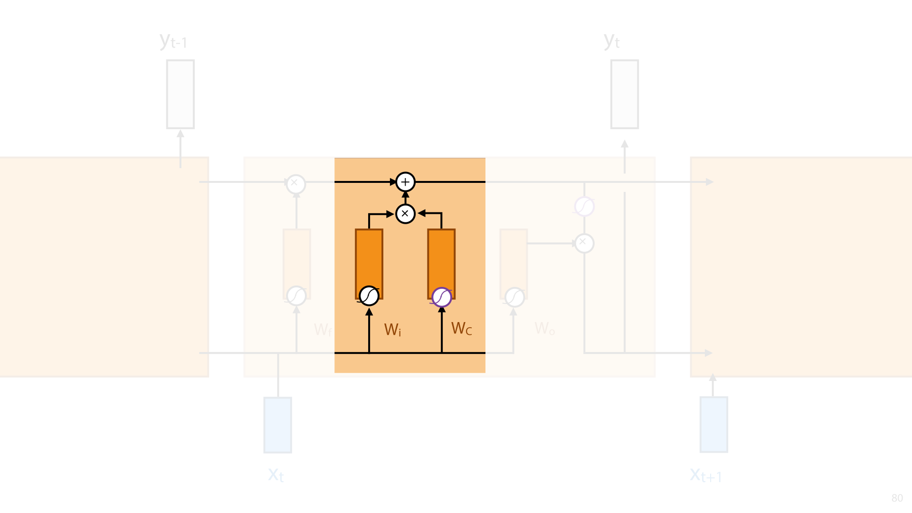

            <figcaption>
            
in the next step, we pass the current input into two transformations that yield two vectors one sigmoid activated (between 0 and 1) and one tanh activated (between -1 and 1). There are element-wise multiplied and added to the conveyor belt. 

This is called a <strong>gating mechanism</strong>, and it essentially decides for each dimension what should be added to the conveyor belt (the tanh-ed vector) and <em>how much</em> of it should be added (the sigmoided vector). You can think of the sigmoided vector as a kind of "soft mask" over the tanh-ed vector. 

            </figcaption>
       </section>

       <section id="slide-081">
            <a class="slide-link" href="https://mlvu.github.io/lecture11#slide-081" title="Link to this slide.">link here</a>
            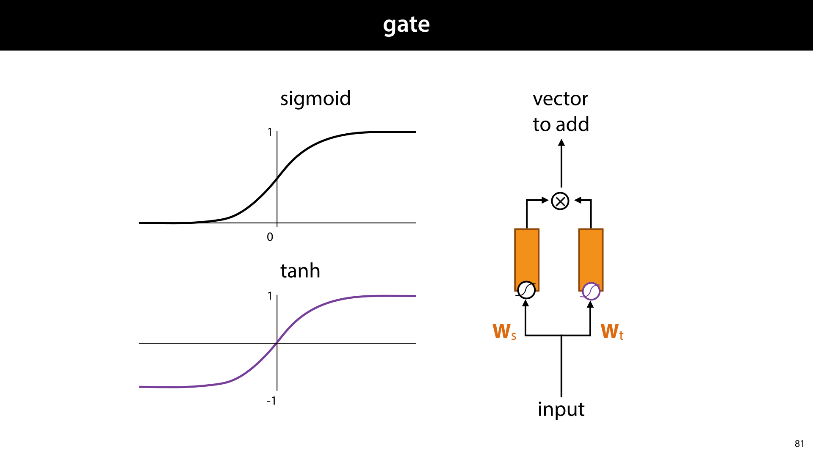

            <figcaption>
            
The gating mechanism takes a single input vector, projects it to two different vectors, one using a sigmoid and one using a  a tanh activation.  

The gate is best understand as producing an additive value: we want to figure out how much of the input to add to some other vector, in this case the one on the converyor belt. If the current input is important  we want to add most of it, at the risk of forgetting what we have in memory, and it the current input is unimportant, we want to ignore it. 

The tanh should be though of as a mapping of the input to the range [-1, 1]. This is the value we will add to the conveyor belt.  

The sigmoid acts as a selection or attention vector. For elements of the input that are important, it outputs 1,  retaining all the input in the addition vector. For elements of the input that are not important, it outputs 0, so that they are zeroed out. The sigmoid and tanh vectors are element-wise multiplied. 

            </figcaption>
       </section>

       <section id="slide-082">
            <a class="slide-link" href="https://mlvu.github.io/lecture11#slide-082" title="Link to this slide.">link here</a>
            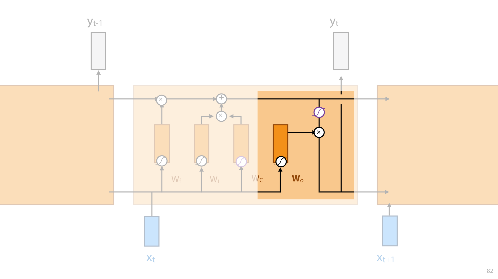

            <figcaption>
            
Finally, we need to decide what to output now. We take the current value of the conveyor belt, tanh it to rescale, and element-wise multiply it by another sigmoid activated layer. This layer is sent out as the current output, and sent to the next cell along the second recurrent connection.

            </figcaption>
       </section>

       <section id="slide-083">
            <a class="slide-link" href="https://mlvu.github.io/lecture11#slide-083" title="Link to this slide.">link here</a>
            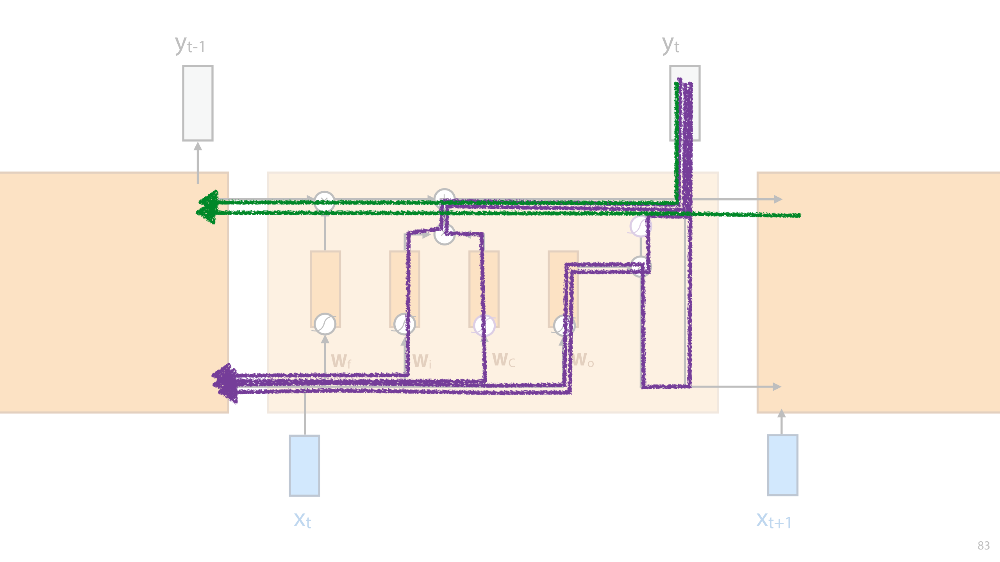

            <figcaption>
            
Now, when we look at all the paths that the gradients take back down the network, we see that there are many of them, in purple that cross activations, and these will likely die out over a few cells, and never contribute to learning long range dependencies. 

However, there are also paths for the gradient, in green, that travel over the conveyor belt and only encounter linear operations. This means that these gradients are perfectly preserved as they travel back through time, and can be used to pick up on long range dependencies. This is where the name comes from. The conveyor belt functions as a long term memory preserving good gradients, and the rest of the functions as a short term memory, making nonlinear projections of the input and using them to manipulate the output and the contents of the conveyor belt.

            </figcaption>
       </section>

       <section id="slide-084" class="anim">
            <a class="slide-link" href="https://mlvu.github.io/lecture11#slide-084" title="Link to this slide.">link here</a>
            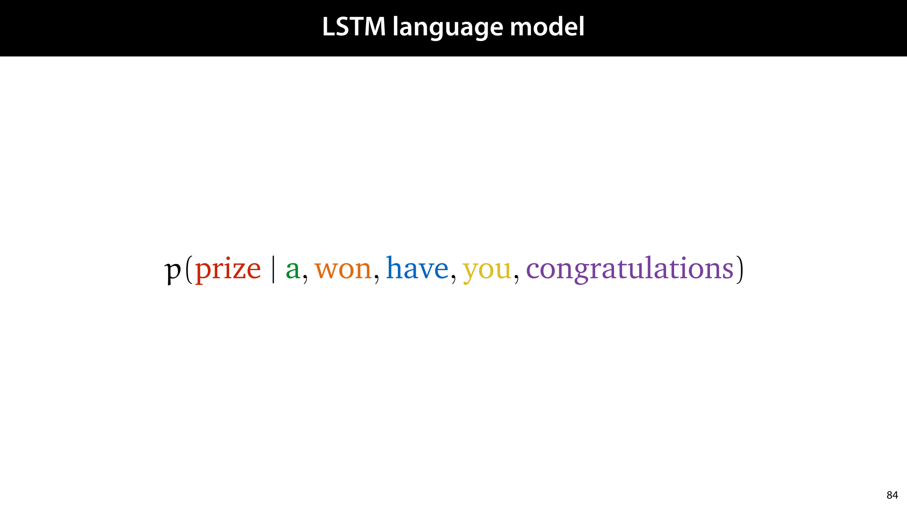

            <figcaption>
            
That’s a lot of complexity. Let’s see what it buys us. The best way, by far, to illustrate the power of LSTMs is to apply the sequential sampling trick.

            </figcaption>
            click image for animation
       </section>

       <section id="slide-085">
            <a class="slide-link" href="https://mlvu.github.io/lecture11#slide-085" title="Link to this slide.">link here</a>
            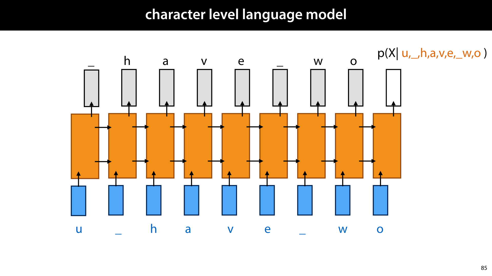

            <figcaption>
            
So, now that we have a powerful, recurrent sequence-to-sequence layer, let’s see what it can do. We’ll train a languange model autoregressively, as we did with the markov model, but this time we’ll train it at character-level. 

We cut a corpus of text into large chunks of character sequences, and we feed these to our model, teaching it to predict the next character at each position in the sequence. 

 

            </figcaption>
       </section>

       <section id="slide-086">
            <a class="slide-link" href="https://mlvu.github.io/lecture11#slide-086" title="Link to this slide.">link here</a>
            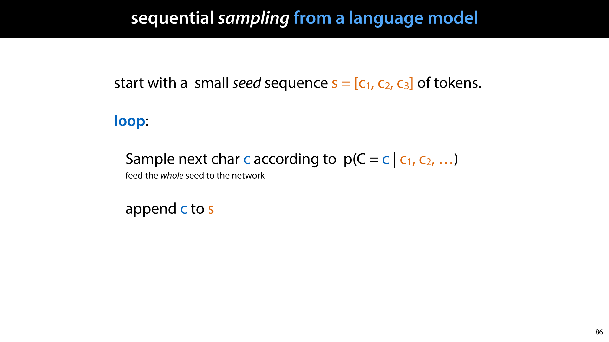

            <figcaption>
            
After training, we start with a small seed of characters, and we sample sequentially. Note that this time we have no Markov assumption, so we keep feeding the whole sequence to the network very time we sample.

            </figcaption>
       </section>

       <section id="slide-087">
            <a class="slide-link" href="https://mlvu.github.io/lecture11#slide-087" title="Link to this slide.">link here</a>
            

            <figcaption>
            

            </figcaption>
       </section>

       <section id="slide-088">
            <a class="slide-link" href="https://mlvu.github.io/lecture11#slide-088" title="Link to this slide.">link here</a>
            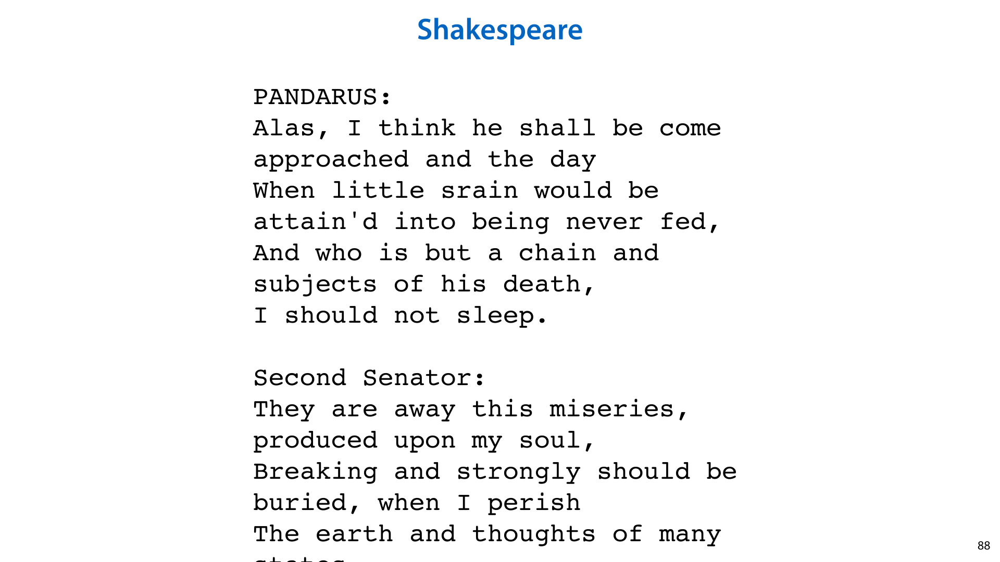

            <figcaption>
            
Remember, this is a <strong>character level</strong> language model.

            </figcaption>
       </section>

       <section id="slide-089">
            <a class="slide-link" href="https://mlvu.github.io/lecture11#slide-089" title="Link to this slide.">link here</a>
            

            <figcaption>
            
Note that not only is the language natural, the wikipedia markup is also correct (link brackets are closed properly, and contain key concepts).

            </figcaption>
       </section>

       <section id="slide-090">
            <a class="slide-link" href="https://mlvu.github.io/lecture11#slide-090" title="Link to this slide.">link here</a>
            

            <figcaption>
            
The network can even learn to generate valid (looking) URLs for external links.

            </figcaption>
       </section>

       <section id="slide-091">
            <a class="slide-link" href="https://mlvu.github.io/lecture11#slide-091" title="Link to this slide.">link here</a>
            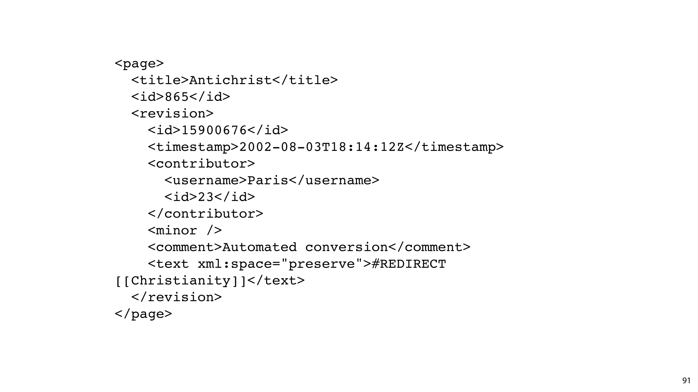

            <figcaption>
            
Sometimes wikipedia text contains bits of XML for structured information. The model can generate these flawlessly.

            </figcaption>
       </section>

       <section id="slide-092">
            <a class="slide-link" href="https://mlvu.github.io/lecture11#slide-092" title="Link to this slide.">link here</a>
            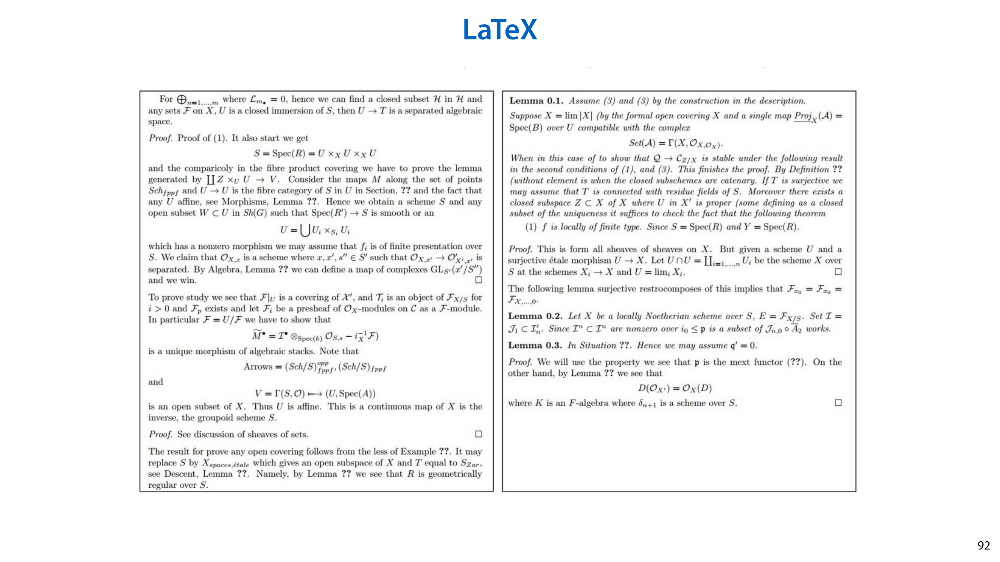

            <figcaption>
            

            </figcaption>
       </section>

       <section id="slide-093">
            <a class="slide-link" href="https://mlvu.github.io/lecture11#slide-093" title="Link to this slide.">link here</a>
            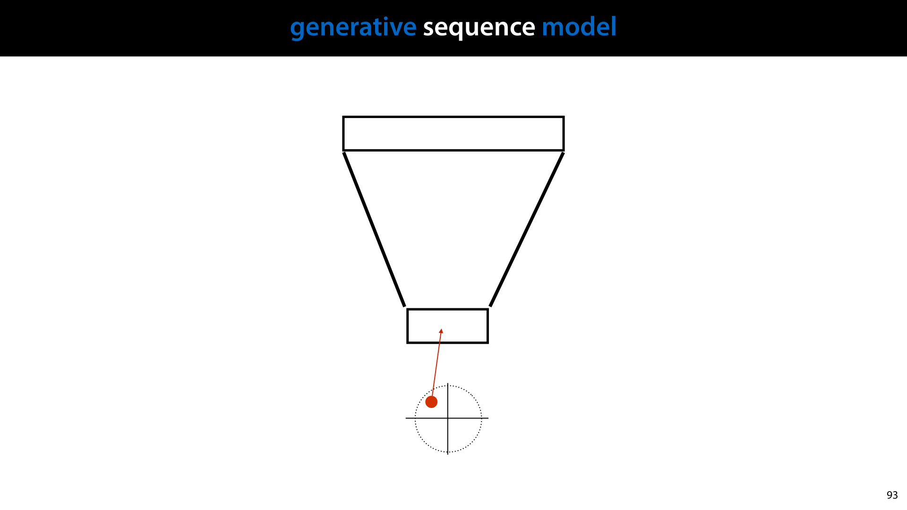

            <figcaption>
            
Another way to train a model to generate sequences is to use the generator network that we saw previously. We sample a <em>single</em> vector from a standard normal distribution and feed it to a sequence-to-sequence network

            </figcaption>
       </section>

       <section id="slide-094">
            <a class="slide-link" href="https://mlvu.github.io/lecture11#slide-094" title="Link to this slide.">link here</a>
            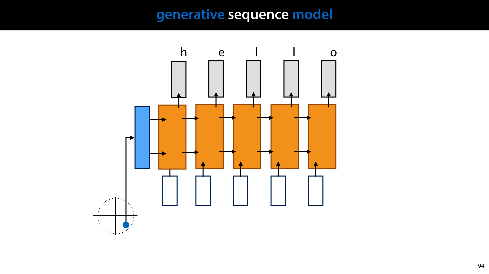

            <figcaption>
            
In the previous video we saw that we could achieve this by repeating the input vector into a sequence, but when we use RNNs, there is another option. We can feed the latent vector to the network as the initial hidden state. We canthen set the input sequence to zero, or as we will see later, use it for something else.

            </figcaption>
       </section>

       <section id="slide-095">
            <a class="slide-link" href="https://mlvu.github.io/lecture11#slide-095" title="Link to this slide.">link here</a>
            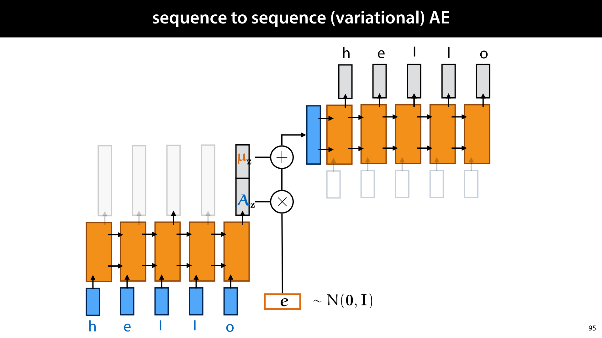

            <figcaption>
            
Of course, if we want to train a generator network we’ll need either a discriminator or an encoder.  

For an autoencoder we can simply use a sequence-to-label network as our encoder, and interpret the last vector of the output as the latent vector representing the whole input.

            </figcaption>
       </section>

       <section id="slide-096">
            <a class="slide-link" href="https://mlvu.github.io/lecture11#slide-096" title="Link to this slide.">link here</a>
            <iframe
                src="https://www.youtube.com/embed/G5JT16flZwM"
                title="YouTube video player"
                frameborder="0" allow="accelerometer; autoplay; clipboard-write; encrypted-media; gyroscope; picture-in-picture"
                allowfullscreen>
            </iframe>

            <figcaption>
            
Here's an example of such a sequence VAE trained on small snippets of MIDI music. The starting and end snippets (A and B) are two very different styles of music. The video shows an interpolation between the two. It shows that at each step, a realistic sample of music is produced. If we do this interpolation in the data space rather than the latent space (see the link below for an example), most of the intermediate samples are much less musical. 

 

source: <a href="https://magenta.tensorflow.org/music-vae"><strong class="blue">https://magenta.tensorflow.org/music-vae</strong></a>

<a href="https://magenta.tensorflow.org/music-vae"><strong class="blue"></strong></a>

            </figcaption>
       </section>

       <section id="slide-097" class="anim">
            <a class="slide-link" href="https://mlvu.github.io/lecture11#slide-097" title="Link to this slide.">link here</a>
            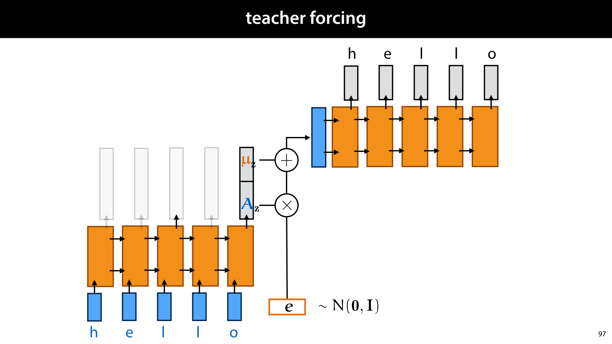

            <figcaption>
            
This works well for music but we’ve lost the fine touch of the sequential/autoregressive sampling, where we could build up a sentence character by character, finetuning the details one at a time.  

Instead a single small latent vector now needs to represent all information in the sequence: this is great to capture the global pattern, but not for deciding on the finer details. This is similar to what we saw with images: the VAE reconstructions we recognizable people but the finer details of the image had been washed out. 

Here, we can combine the best of both worlds, in a method called <strong>teacher forcing</strong>. Since we’d left the input sequence to the decoder blank, we can feed the decoder a character-shifted version of the input <strong>as well as the latent vector</strong>. This way, we are training a decoder that gets global information from the latent vector, and generates the finer details by autoregressive sampling.

            </figcaption>
            click image for animation
       </section>

       <section id="slide-098">
            <a class="slide-link" href="https://mlvu.github.io/lecture11#slide-098" title="Link to this slide.">link here</a>
            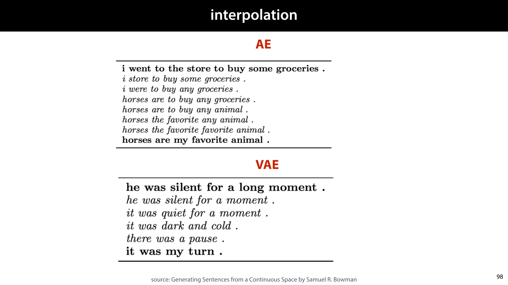

            <figcaption>
            
The example we saw in the autoencoder lecture was also trained in this way: using a variational autoencoder with teacher forcing. 

 
<aside    >source: Generating Sentences from a Continuous Space by Samuel R. Bowman, Luke Vilnis, Oriol Vinyals, Andrew M. Dai, Rafal Jozefowicz, Samy Bengio </aside><aside    >https://arxiv.org/abs/1511.06349 </aside>

            </figcaption>
       </section>

       <section id="slide-099">
            <a class="slide-link" href="https://mlvu.github.io/lecture11#slide-099" title="Link to this slide.">link here</a>
            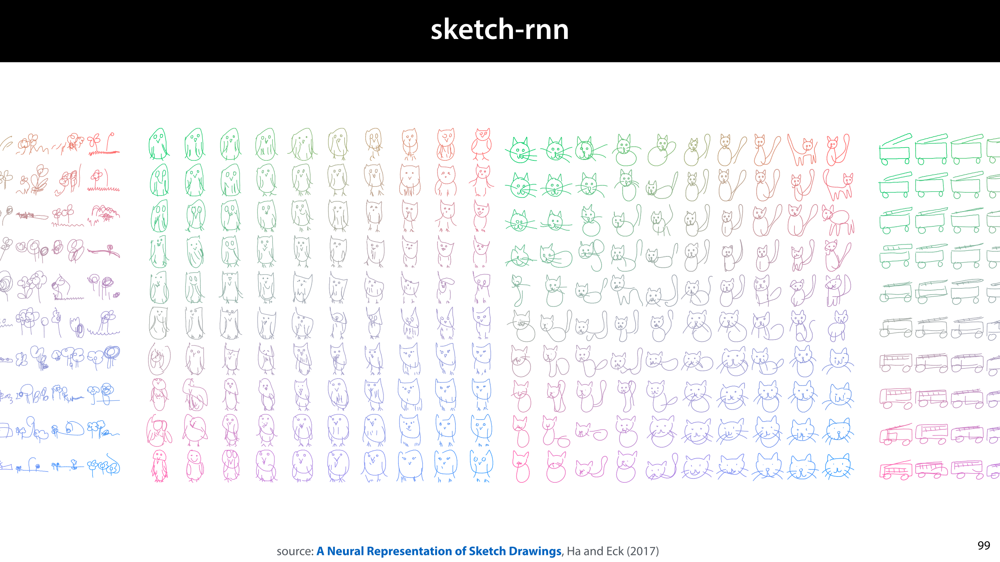

            <figcaption>
            
Here is another sequence-to-sequence autoencoder. To gather data, Google <a href="https://quickdraw.withgoogle.com/"><strong class="blue">set up a website</strong></a>, where it challenged users to quickly draw a sketch of something using their mouse. The drawing was captured as a<em> sequence</em> of points in the plane. 

Researchers then trained a variational sequence-to-sequence autoencoder with teacher forcing and a mixture density output at each step of the sequence. In short, quite a complex model. The result, however was worth it. Here, we see two interpolation grids from the latent space of this model, smoothly interpolating between vairous ways of drawing cats and various ways of drawing owls. 

source: <a href="https://arxiv.org/abs/1704.03477"><strong class="blue">A Neural Representation of Sketch Drawings</strong></a>, Ha and Eck (2017) 

            </figcaption>
       </section>

       <section id="slide-100">
            <a class="slide-link" href="https://mlvu.github.io/lecture11#slide-100" title="Link to this slide.">link here</a>
            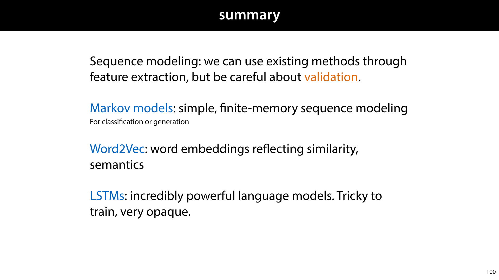

            <figcaption>
            

            </figcaption>
       </section>

       <section id="slide-101">
            <a class="slide-link" href="https://mlvu.github.io/lecture11#slide-101" title="Link to this slide.">link here</a>
            

            <figcaption>
            
In this part, we will discuss one of the more exciting developments of the last few years: transformer models. 
<aside    >This section is not exam material this year (2022), but these models are becoming prevalent, so if you plan to do more machine learning in the future, you should definitely give it a skim. </aside>
 

            </figcaption>
       </section>

       <section id="slide-102">
            <a class="slide-link" href="https://mlvu.github.io/lecture11#slide-102" title="Link to this slide.">link here</a>
            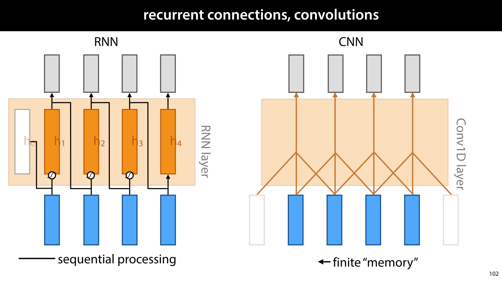

            <figcaption>
            
We’ve seen two examples of (non-trivial) sequence-to-sequence layers so far: recurrent neural networks, and  convolutions. RNNs have the benefit that they can potentially look infinitely far back into the sequence, but they require fundamentally sequential processing, making them slow. Convolution don’t have this drawback—we can compute each output vector in parallel if we want to—but the downside is that they are limited in how far back they can look into the sequence. 

Self-attention is another sequence-to-sequence layer, and one which provides us with the best of both worlds: parallel processing and a potentially infinite memory. 

 

            </figcaption>
       </section>

       <section id="slide-103">
            <a class="slide-link" href="https://mlvu.github.io/lecture11#slide-103" title="Link to this slide.">link here</a>
            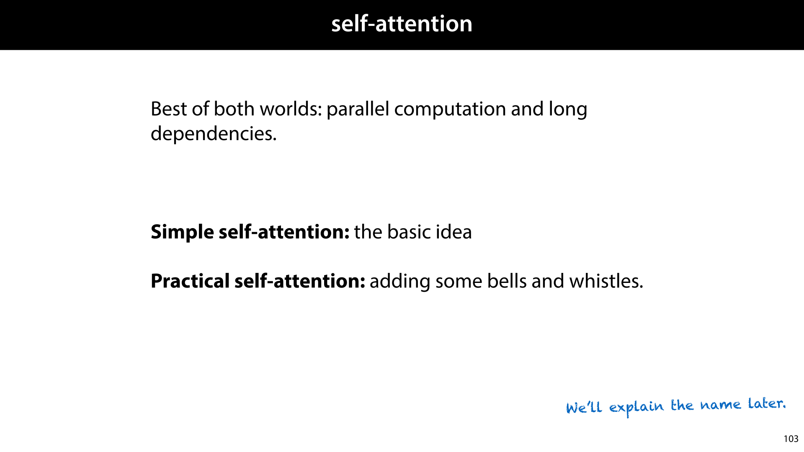

            <figcaption>
            

            </figcaption>
       </section>

       <section id="slide-104" class="anim">
            <a class="slide-link" href="https://mlvu.github.io/lecture11#slide-104" title="Link to this slide.">link here</a>
            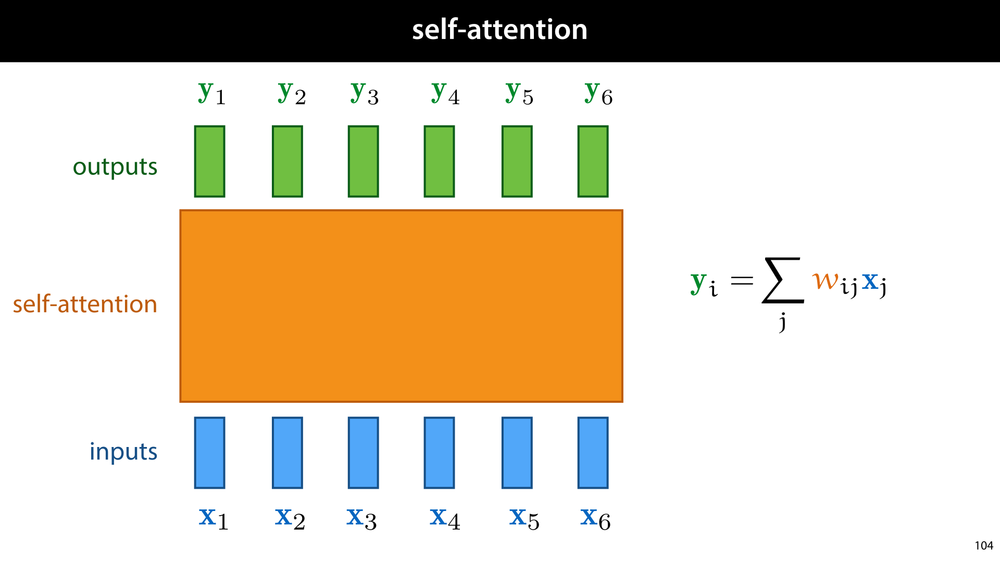

            <figcaption>
            
At heart, the operation of self-attention is very simple. Every output is simply a weighted sum over the inputs. The trick is that the weights in this sum are not parameters. They are derived from the inputs. 

Note that this means that the input and output dimensions of a self-attention layer are always the same. If we want to transform to a different dimension, we’ll need to add a projection layer.

            </figcaption>
            click image for animation
       </section>

       <section id="slide-105" class="anim">
            <a class="slide-link" href="https://mlvu.github.io/lecture11#slide-105" title="Link to this slide.">link here</a>
            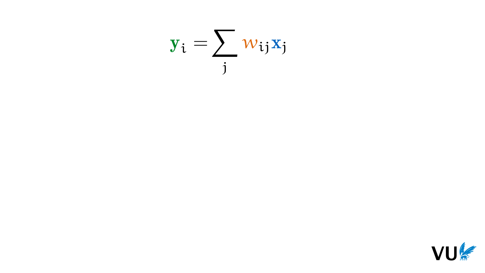

            <figcaption>
            

            </figcaption>
            click image for animation
       </section>

       <section id="slide-106" class="anim">
            <a class="slide-link" href="https://mlvu.github.io/lecture11#slide-106" title="Link to this slide.">link here</a>
            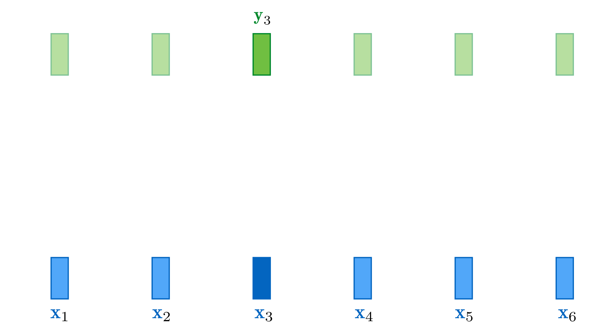

            <figcaption>
            

            </figcaption>
            click image for animation
       </section>

       <section id="slide-107">
            <a class="slide-link" href="https://mlvu.github.io/lecture11#slide-107" title="Link to this slide.">link here</a>
            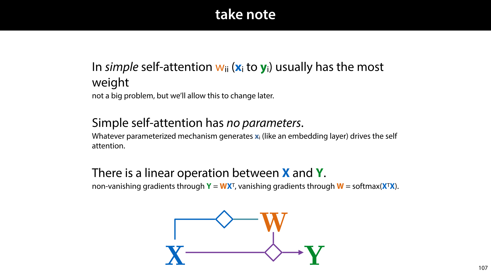

            <figcaption>
            

            </figcaption>
       </section>

       <section id="slide-108">
            <a class="slide-link" href="https://mlvu.github.io/lecture11#slide-108" title="Link to this slide.">link here</a>
            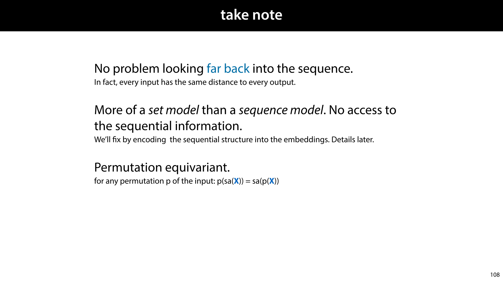

            <figcaption>
            

            </figcaption>
       </section>

       <section id="slide-109">
            <a class="slide-link" href="https://mlvu.github.io/lecture11#slide-109" title="Link to this slide.">link here</a>
            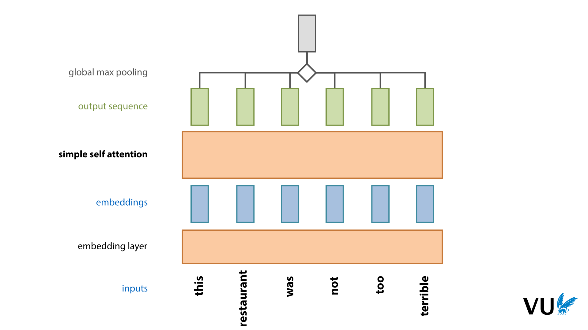

            <figcaption>
            
As a simple example, let’s build a sequence classifier consisting of just one embedding layer followed by a global maxpooling layer. We’ll imagine a sentiment classification task where the aim is to predict whether a restaurant review is positive or negative. 

If we did this without the self-attention layer, we would essentially have a model where each word can only contribute to the output score independently of the other. This is known as a bag of words model. In this case, the word terrible would probably cause us to predict that this is a negative review. In order to see that it might be a positive review, we need to recognize that the meaning of the word terrible is moderated by the word not. This is what the self-attention can do for us.

            </figcaption>
       </section>

       <section id="slide-110">
            <a class="slide-link" href="https://mlvu.github.io/lecture11#slide-110" title="Link to this slide.">link here</a>
            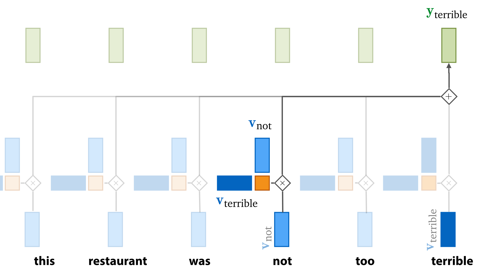

            <figcaption>
            
If the embedding vectors of <em>not</em> and <em>terrible</em> have a high dot product together, the weight of the input vector for <em>not</em> becomes high, allowing it to influence the meaning of the word <em>terrible</em> in the output sequence. This could help the model learn, for instance that the negative sentiment carried by the word <em>terrible</em> is flipped around to a positive sentiment by the word <em>not</em>.

            </figcaption>
       </section>

       <section id="slide-111">
            <a class="slide-link" href="https://mlvu.github.io/lecture11#slide-111" title="Link to this slide.">link here</a>
            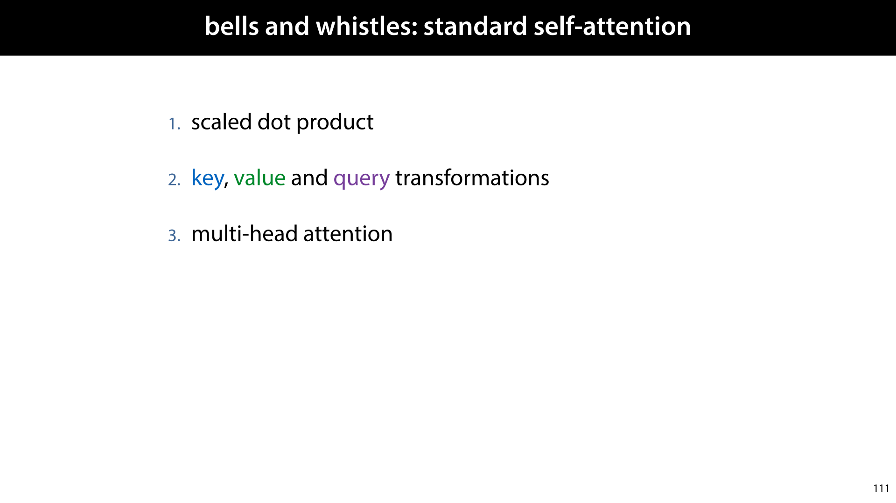

            <figcaption>
            
The standard self-attention adds some bells and whistles to this basic framework. We’ll discuss the three most important additions. 

            </figcaption>
       </section>

       <section id="slide-112">
            <a class="slide-link" href="https://mlvu.github.io/lecture11#slide-112" title="Link to this slide.">link here</a>
            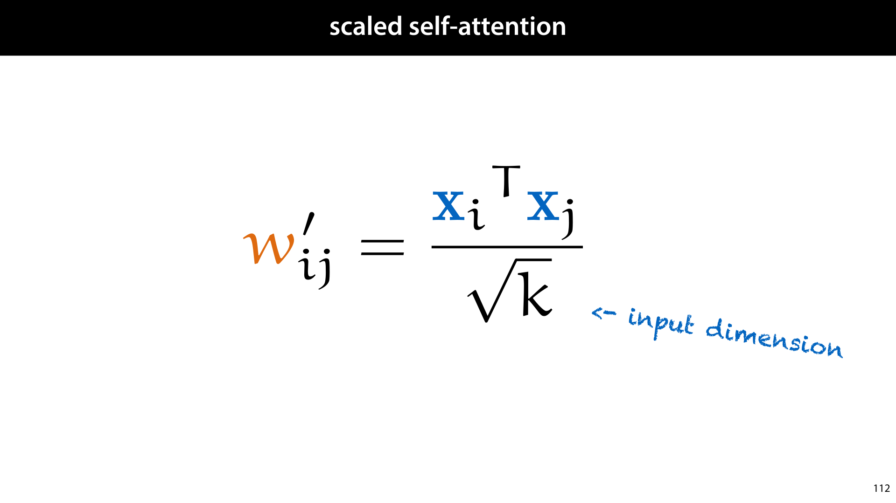

            <figcaption>
            
Scaled self attention is very simple: instead of using the dot product, we use the dot product<strong> scaled by the square root of the input dimension</strong>. This ensures that the input and output of the self attention operation have similar variance. 

Why √k? Imagine a vector in ℝk with values all c. Its Euclidean length is √kc. Therefore, we are dividing out the amount by which the increase in dimension increases the length of the average vectors.  
<aside    >Transformer models usually apply normalization at every layer, so we can assume that the input is standard-normally distributed.</aside><aside    ></aside>
            </figcaption>
       </section>

       <section id="slide-113">
            <a class="slide-link" href="https://mlvu.github.io/lecture11#slide-113" title="Link to this slide.">link here</a>
            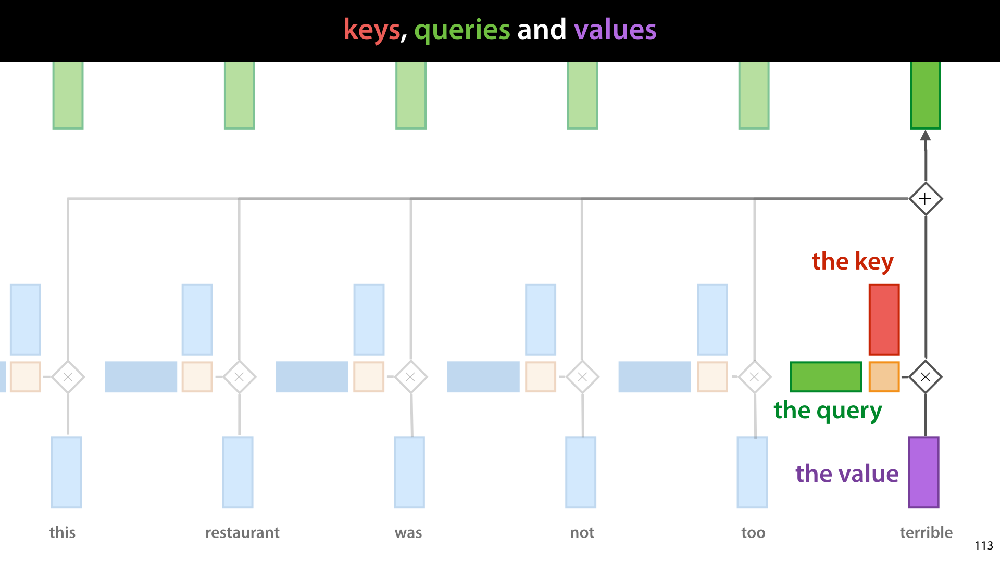

            <figcaption>
            
In each self attention computation, every input vector occurs in three distinct roles: 

<strong class="purple">the value</strong>: the vector that is used in the weighted sum that ultimately provides the output 

<strong class="green">the query</strong>: the input vector that corresponds to the current output, matched against every other input vector. 

<strong class="red">the key</strong>: the input vector that the query is matched against to determine the weight. 

This is where we'll add some parameters. We will slightly manipulate the input vector, based on which role it appears in.

            </figcaption>
       </section>

       <section id="slide-114" class="anim">
            <a class="slide-link" href="https://mlvu.github.io/lecture11#slide-114" title="Link to this slide.">link here</a>
            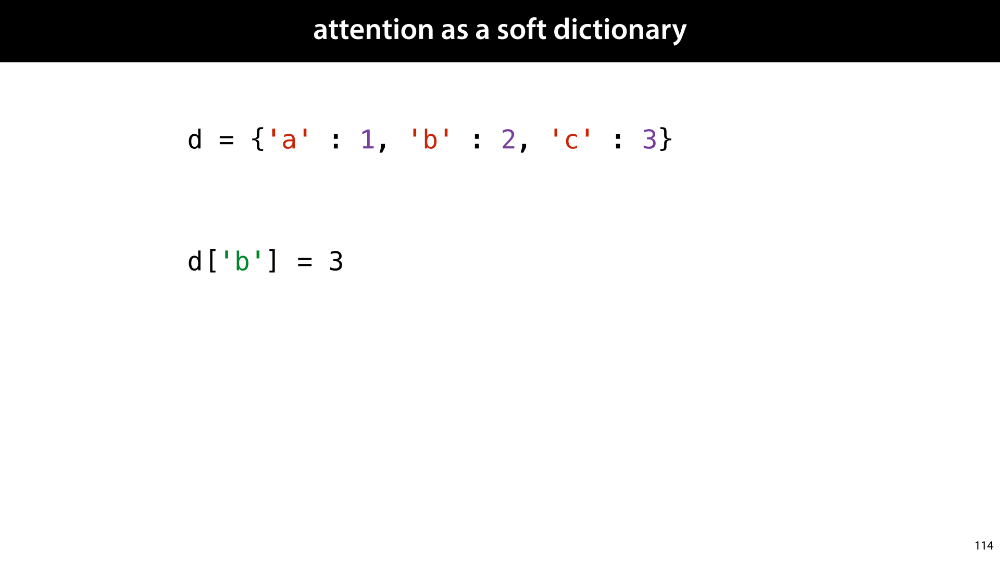

            <figcaption>
            
In a dictionary, all the operations are discrete: a query only matches a single key, and returns only the value corresponding to that key.

            </figcaption>
            click image for animation
       </section>

       <section id="slide-115">
            <a class="slide-link" href="https://mlvu.github.io/lecture11#slide-115" title="Link to this slide.">link here</a>
            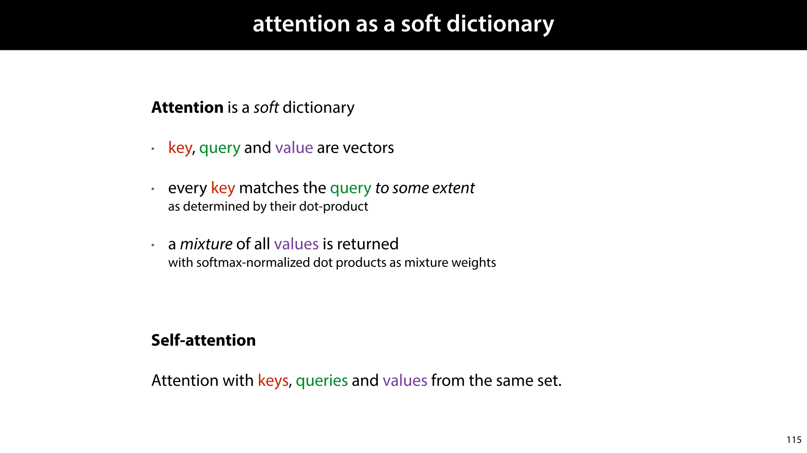

            <figcaption>
            
If the dot product of only one query/key pair is non-zero, we recover the operation of a normal dictionary.

            </figcaption>
       </section>

       <section id="slide-116">
            <a class="slide-link" href="https://mlvu.github.io/lecture11#slide-116" title="Link to this slide.">link here</a>
            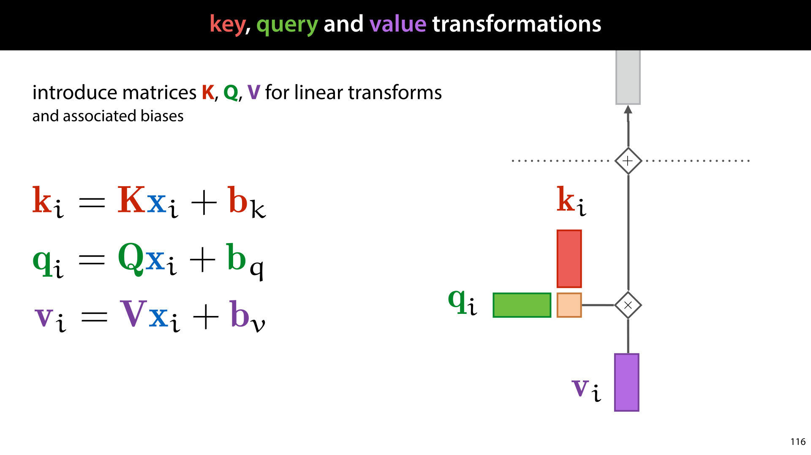

            <figcaption>
            
To give the self attention some more flexibility in determining its behavior, we multiply each input vector by three different k-by-k parameter matrices, which gives us a different vector to act as key query and value. 

Note that this makes the self attention operation a layer with parameters (where before it had none).

            </figcaption>
       </section>

       <section id="slide-117">
            <a class="slide-link" href="https://mlvu.github.io/lecture11#slide-117" title="Link to this slide.">link here</a>
            

            <figcaption>
            
In many sentences, there are different relations to model. Here, the word meaning of the word “terrible” is inverted by “not” and moderated by “too”. Its relation to the word restaurant is completely different: it describes a property of the restaurant. 

The idea behind multi-head self-attention is that multiple relations are best captured by different self-attention operations.

            </figcaption>
       </section>

       <section id="slide-118">
            <a class="slide-link" href="https://mlvu.github.io/lecture11#slide-118" title="Link to this slide.">link here</a>
            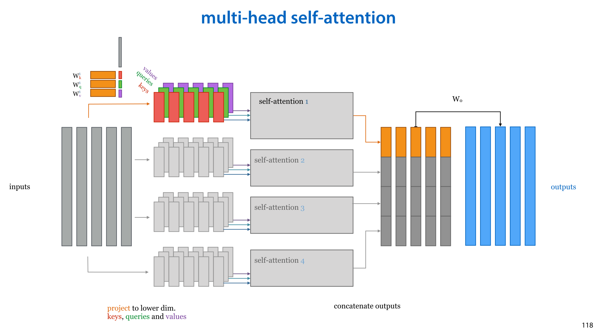

            <figcaption>
            
The idea of multi-head attention, is that we apply h self attentions (with different K, Q, V matrices and biases) <strong>in parallel</strong>. This is usually done in a way that requires roughly the same number of parameters are a one single-head self-attention on the same input. To achieve this, the data is projected down to separate keys, queries and values of dimensionality of k/h, where k is the original input dimension. Each of these smaller inputs is fed to a separate self-attention and the results are concatenated. 
<aside    >If you implement this cleverly (see <a href="http://dlvu.github.io"><strong class="blue">DLVU lecture 12</strong></a> for details), you will end up with exactly the same number of parameters as the original single-head self attention, except for the additional W0 matrix at the end.</aside><aside    ></aside>
            </figcaption>
       </section>

       <section id="slide-119">
            <a class="slide-link" href="https://mlvu.github.io/lecture11#slide-119" title="Link to this slide.">link here</a>
            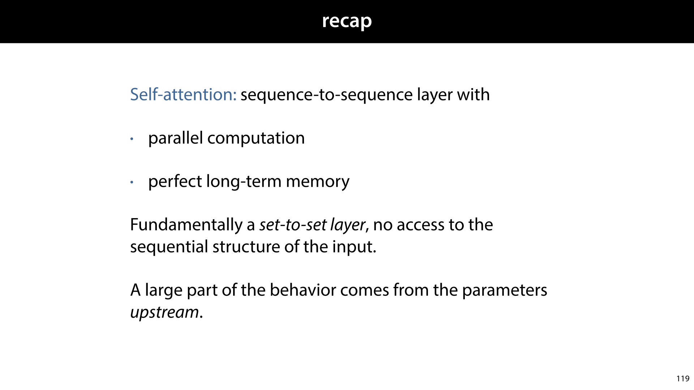

            <figcaption>
            

            </figcaption>
       </section>

       <section id="slide-120">
            <a class="slide-link" href="https://mlvu.github.io/lecture11#slide-120" title="Link to this slide.">link here</a>
            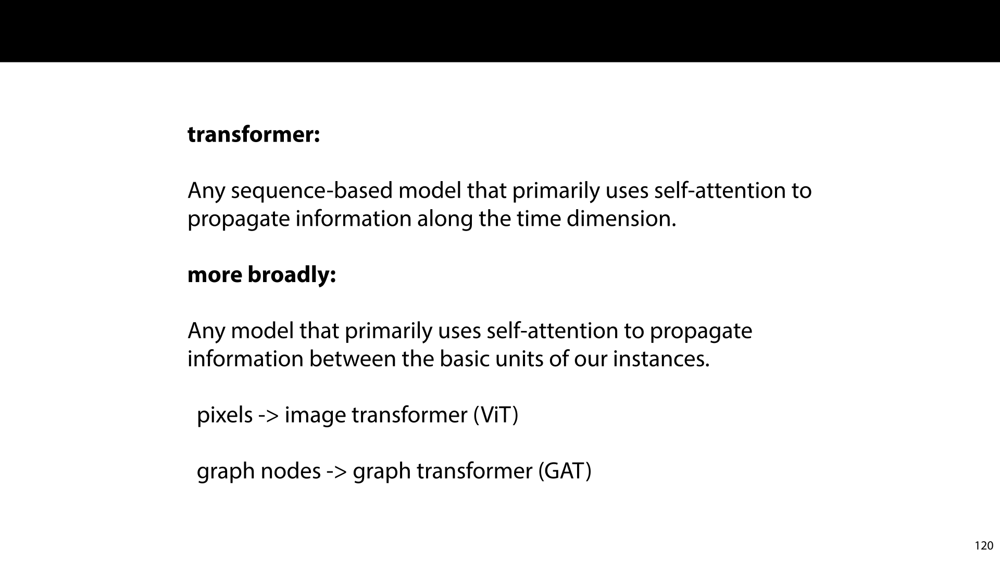

            <figcaption>
            
Now that twe have a self-attention operation defined, we can start building it into a full model. Such models are called <strong>transformers</strong>. It's not precisely defined what makes a transformer a transformer, but we'll stick with the definition that a transformer is a sequence model where the only or primary operation that propagates information along the time dimension is self attention. There may be other operations,  but these only look at each token by itself, without taking into account what its neighbors do. 

The idea of transformers started in the domain of sequential data, but it has been extended to other domains as well. There are now, for instance transformers for images and for graphs. Here the idea is that the input data consists of some basic <strong>units</strong> that are connected together in some regular way. In natural language, the units are are the characters or words that are strung together in a sequence. In images these are the pixels, which are connected together in a grid, and in a graph, these are the nodes that are connected together in the graph structure. 

In all cases, a transformer is a model that learns vector representations of these units, in such a way that the only operation that propagates information <em>between </em>the units is some form of self attention. 
<aside    >We'll stick with sequence transformers for the rest of the lecture, but the translation to other domains is usually quite straightforward.</aside><aside    ></aside>
            </figcaption>
       </section>

       <section id="slide-121">
            <a class="slide-link" href="https://mlvu.github.io/lecture11#slide-121" title="Link to this slide.">link here</a>
            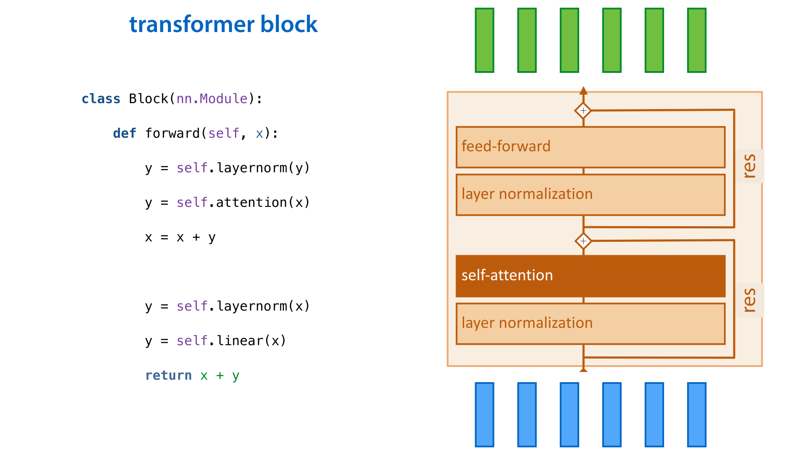

            <figcaption>
            
The basic building block of transformer models is usually a simple <strong>transformer block</strong>.  

The details differ per transformer, but the basic ingredients are usually:  

Self-attention 

A feed-forward layer applied individually to each token in the sequence. 

A layer normalization. This is a slight variation on the batch normalization we saw earlier. 

Residual connections. These are connections that add the value before an operation to the value after the operation. We won't go into the details, but the idea is that at the start of training, a strong, non-vanishing gradient can propagate over the residual connection, so the lower layers get a strong training signal while the gradient through the operation slowly trains the operation itself. 

Layer normalization and residual connections are simple tricks that are useful for training big networks. They don't materially affect what the network learns, they just help us to stak more of these transformer blocks together. 

On the left is what such a block would look like implemented in Pytorch.

            </figcaption>
       </section>

       <section id="slide-122" class="anim">
            <a class="slide-link" href="https://mlvu.github.io/lecture11#slide-122" title="Link to this slide.">link here</a>
            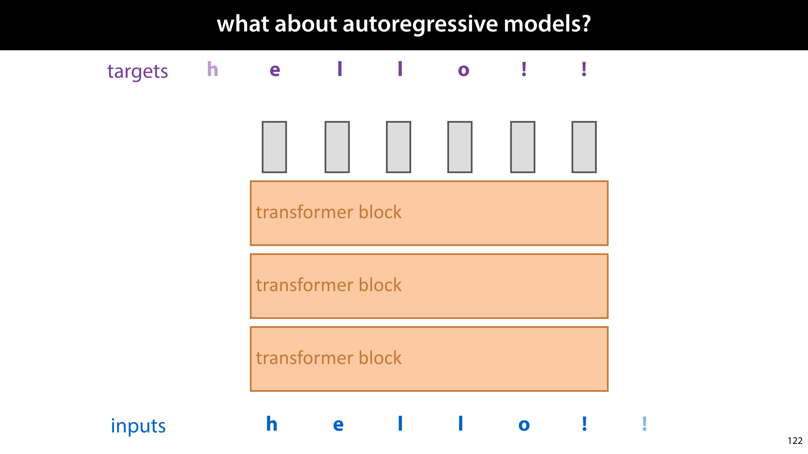

            <figcaption>
            
If we want to do something like sequence classification, all you need to do is stack together a bunch of transformer blocks. 

If you want to do autoregressive modeling, however, plain transformer blocks won't work, because they are not <strong>causal</strong>. The self-attention operation can just look ahead in the sequence to predict what the next model will be. We will never learn to predict the future <strong>from the past</strong>. 

This was not a problem with LSTMs, because they are fundamentally causal. But like convolutions, self-attention needs to be<strong> made causal </strong>in order to be used in autoregressive settings.

            </figcaption>
            click image for animation
       </section>

       <section id="slide-123">
            <a class="slide-link" href="https://mlvu.github.io/lecture11#slide-123" title="Link to this slide.">link here</a>
            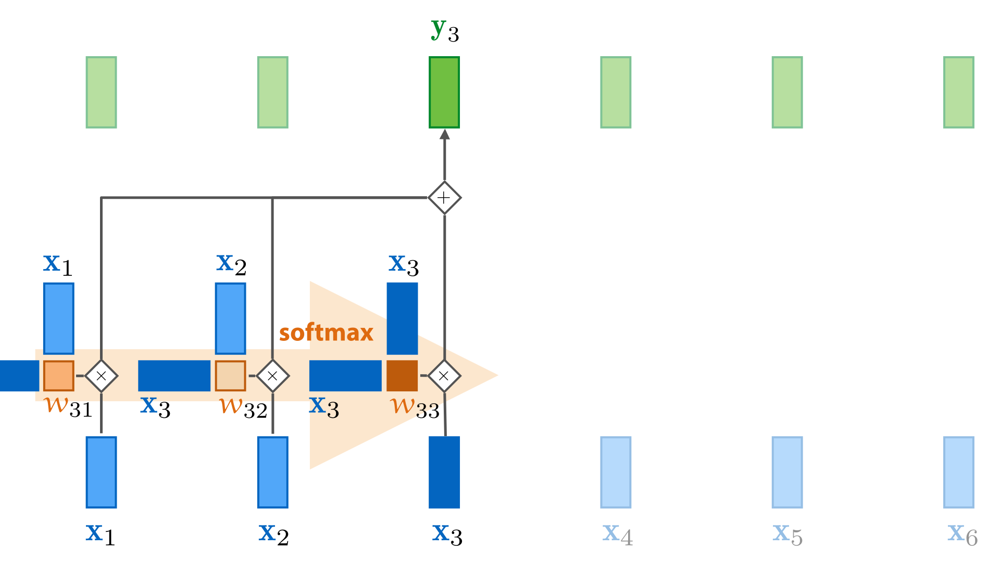

            <figcaption>
            
The solution is simple: when computing the third output, we simply apply the self-attention only over the first three elements. Anything further in the sequence than the element we're currently predicting for is ignored. 
<aside    >In practice, it's often more efficient to compute all weights, and then mask out the weights that should be ignored. If we set them to negative infinity then after the softmax the weight will be zero, and the corresponding elements will be ignored in the weighted sum.</aside><aside    ></aside>
            </figcaption>
       </section>

       <section id="slide-124">
            <a class="slide-link" href="https://mlvu.github.io/lecture11#slide-124" title="Link to this slide.">link here</a>
            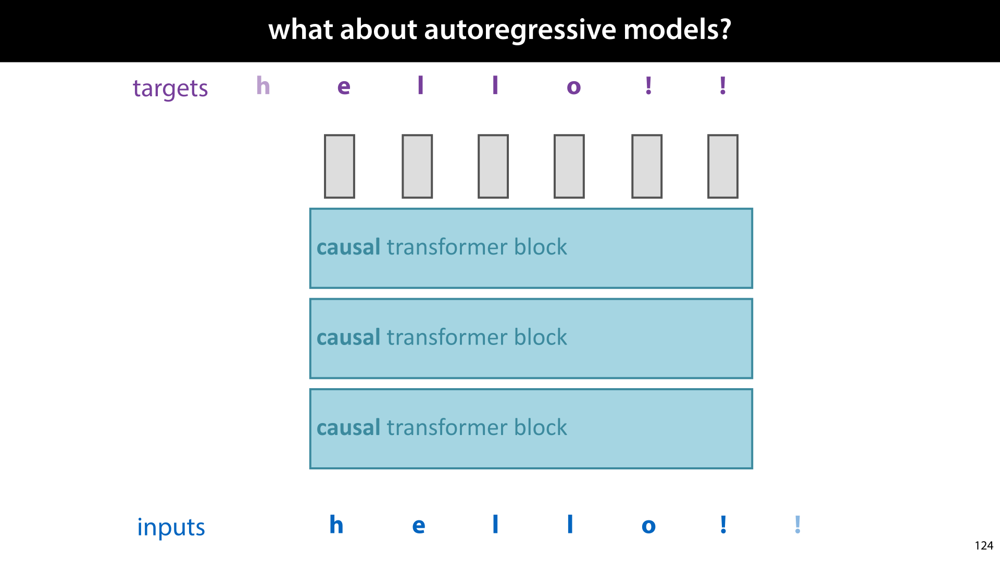

            <figcaption>
            
Since the self attention is the only part of the transformer block that propagates information across the time dimension, making that part causal, makes the whole block causal. 

With a stack of causal transformer blocks, we can easily build an autoregressive model.

            </figcaption>
       </section>

       <section id="slide-125">
            <a class="slide-link" href="https://mlvu.github.io/lecture11#slide-125" title="Link to this slide.">link here</a>
            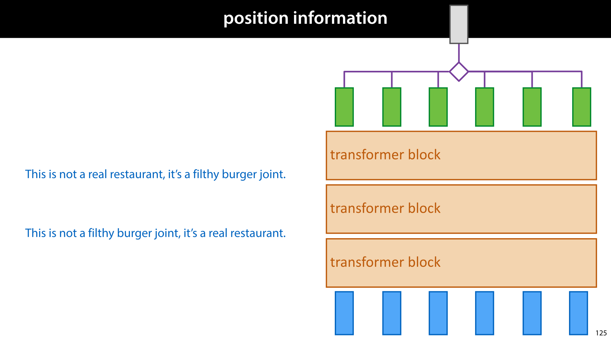

            <figcaption>
            
To really interpret the meaning of the sentence, we need to be able to access the position of the words within the sentence. Two sentences with their words shuffled can mean the exact opposite thing. 

If we feed these sentences, tokenized by word, to the architecture on the right, their output label will be the same, whatever the parameters of the model are. The self-attention produces the same output vectors, with just the order differing in the same way they do for the two inputs, and the global pooling just sums or averages all the vectors irrespective of position. 

This is what we mean when we say that the self-attention is fundamentally a <strong>set-operation</strong>. It treats the input as a set, and it can't look at the ordering of the tokens. If we want the model to pay attention to the way the tokens are ordered, <strong>we need to tell it how they are ordered in the first place</strong>.

            </figcaption>
       </section>

       <section id="slide-126" class="anim">
            <a class="slide-link" href="https://mlvu.github.io/lecture11#slide-126" title="Link to this slide.">link here</a>
            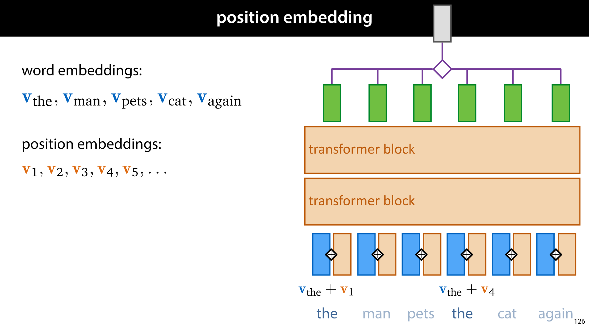

            <figcaption>
            
The idea behind position embeddings is simple. Just like we assign each word in our vocabulary an embedding vector, which is always the same regardless of where the word appears, we also assign each position in the sentence an embedding vector, which is always the same <strong>regardless of with word appears at that position</strong>. 

This way, the input vectors for the first “the” in the input sequence and the second “the” are different, because the first is added to the position embedding v1 and the second is added to the input embedding v2. 

This break our equivariance: the position information becomes part of our embedding vectors, and is fed into the self attention. This is very effective, and very easy to implement. The only drawback is that we can’t run the model very well on sequences that are longer than the largest position embedding observed during training. 
<aside    >Alternative approaches are position encodings, where the values in the vectors representing the position aren't learned but set to some standard encoding function, and relative position embeddings and encodings, where clever tricks are used to encode the position relative to the current output token.</aside><aside    ></aside>
            </figcaption>
            click image for animation
       </section>

       <section id="slide-127">
            <a class="slide-link" href="https://mlvu.github.io/lecture11#slide-127" title="Link to this slide.">link here</a>
            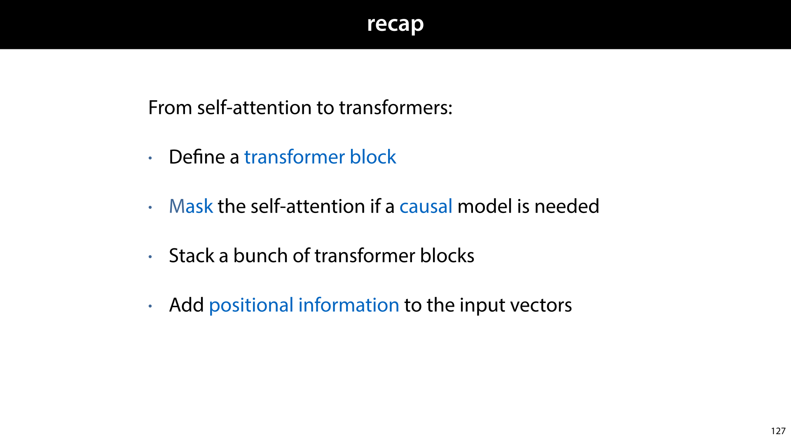

            <figcaption>
            
This is the basic idea behind most transformer models. The simplicity and homogeneity compared to models based on LSTMs are a great benefit of the model family: this means that transformers are easier to scale up to huge numbers of parameters. Most claims you will see of models with hundreds of billions of parameters being trained refer to transformer models.

            </figcaption>
       </section>

       <section id="slide-128" class="anim">
            <a class="slide-link" href="https://mlvu.github.io/lecture11#slide-128" title="Link to this slide.">link here</a>
            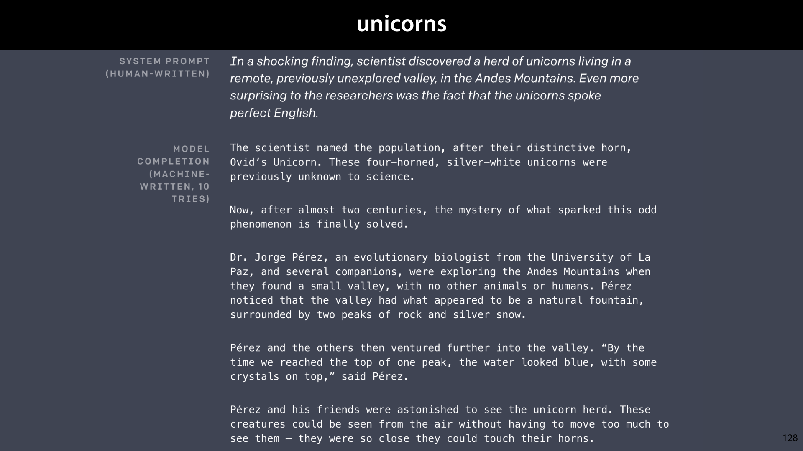

            <figcaption>
            
Here is one breakthrough moment in the development of transformers: GPT-2. We've seen already that LSTMs can be used to generate language that is stylistically quite realistic. However, the place where they always fell down was in long term coherence. For instance, they could generate realistic looking Shakespeare, but the character names would never stay the same from one paragraph to the next. 

GPT-2, quite a modestly sized model by today's standards, was the first model that showed the ability to generate long passages of text with an internally coherent structure. Here, for instance, GPT-2 continues the seed sequence (or prompt) shown in italics. the resulting news article is not only quite realistic, but it also keeps returning to the theme of the piece. The subject of unicorns keeps coming back, but it also invents a Bolivian researcher with a Spanish name, remembers this name, and refers back to it in a consistent, but varied manner.

            </figcaption>
            click image for animation
       </section>

       <section id="slide-129">
            <a class="slide-link" href="https://mlvu.github.io/lecture11#slide-129" title="Link to this slide.">link here</a>
            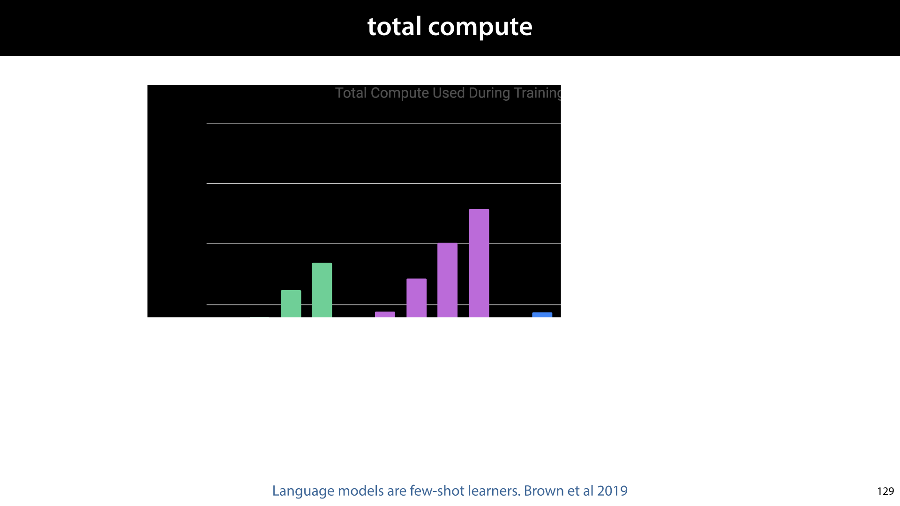

            <figcaption>
            
GPT-2 contained about 1.5 billion parameters. A vast amount at the time, but quickly surpassed by larger models. This is graph from the paper of GPT-3, which was more than 100 times the size of GPT-3. Just the final training run of GPT-3 alone is estimated to have cost around 10 million dollars in compute. 

It's important to note that this is not just an exercise in building bigger models for the sake of it (although sometimes it seems that way). Transformer models seem to be subject to a kind of emergent behavior that only appears at very large scales. That is, we can build models that can do stuff we could never do before, but it only happens at the scale of billions of parameters and tens to hundreds of gigabytes of data.  

So far, we don't seem to have found the ceiling to this effect yet. The next biggest model, if we can build it, may show us yet more impressive behavior. This is leading to a lot of excitement and a kind of "race to the top" among big industry labs.  

The results can indeed be impressive, but in all this, the questions of social impact become more pronounced as well: with such massive datasets, it's hard to control what ends up in the data, which people are represented and how. The larger the model is, the less transparent it becomes and the more difficult it is to oversee the consequences of putting it blindly into a production system. 

source: <a href="https://arxiv.org/abs/2005.14165"><strong class="blue">Language models are few-shot learners.</strong></a> Brown et al 2019

            </figcaption>
       </section>

       <section id="slide-130">
            <a class="slide-link" href="https://mlvu.github.io/lecture11#slide-130" title="Link to this slide.">link here</a>
            

            <figcaption>
            

            </figcaption>
       </section>

</article>
