<nav class="menu">
    <ul>
        <li class="home"><a href="/">Home</a></li>
        <li class="name">Lecture 13: Reinforcement learning</li>
                <li><a href="#video-000">The abstract task</a></li>
                <li><a href="#video-021">Random search and policy gradients</a></li>
                <li><a href="#video-043">Deep Q learning</a></li>
                <li><a href="#video-061">Tree search</a></li>
                <li><a href="#video-092">Social Impact 4</a></li>
        <li class="pdf"><a href="https://mlvu.github.io/lectures/71.Reinforcement%20Learning.annotated.pdf">PDF</a></li>
    </ul>
</nav>

<article class="slides">

       <section class="video" id="video-000">
           <a class="slide-link" href="https://mlvu.github.io/lecture13#video-0">link here</a>
           <iframe
                src="https://www.youtube.com/embed/EEqO13EKuFg"
                title="YouTube video player"
                frameborder="0" allow="accelerometer; autoplay; clipboard-write; encrypted-media; gyroscope; picture-in-picture"
                allowfullscreen>
           </iframe>

       </section>

       <section id="slide-001">
            <a class="slide-link" href="https://mlvu.github.io/lecture13#slide-001" title="Link to this slide.">link here</a>
            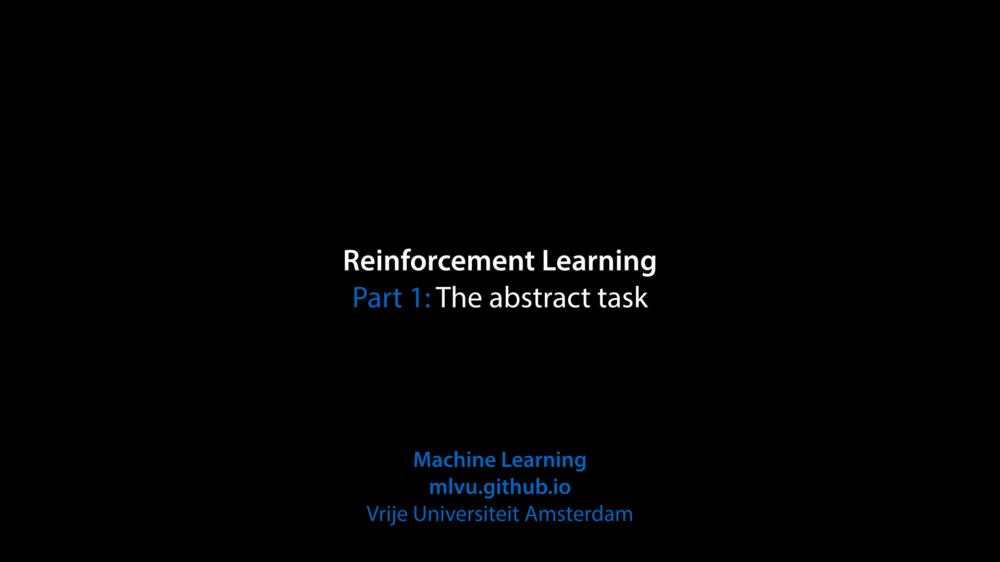

            <figcaption>
            
In this lecture we’ll look at <strong>reinforcement learning</strong>. Reinforcement learning is first and foremost an <em>abstract task</em>: like regression, classification or recommendation. 

<lnbr></lnbr>

            </figcaption>
       </section>

       <section id="slide-002">
            <a class="slide-link" href="https://mlvu.github.io/lecture13#slide-002" title="Link to this slide.">link here</a>
            

            <figcaption>
            
The first thing we did, in the first lecture, when we first discussed the idea of machine learning, was<strong> to take it offline</strong>. We simplified the problem of learning by assuming that we have a training set from which we learn a model once. We reduced the problem of adaptive intelligence by removing the idea of interacting with an outside world, and by removing the idea of continually learning and acting at the same time. 

Sometimes those aspects cannot be reduced away. In such cases we can use the framework of r<strong>einforcement Learning</strong>. Reinforcement learning is the practice of training agents (e.g. robots) that interact with a dynamic world, and to train them to learn <em>while</em> they’re interacting.

            </figcaption>
       </section>

       <section id="slide-003">
            <a class="slide-link" href="https://mlvu.github.io/lecture13#slide-003" title="Link to this slide.">link here</a>
            

            <figcaption>
            
Reinforcement learning (RL) is an <strong>abstract task</strong>, and it is one of the most generic abstract tasks available.. Almost any learning problem you encounter can be modelled as a reinforcement learning problem. 
<aside    >This doesn't mean it's always the best way to model your problem. If you can also model your problem as, say,  a classification task, that's much simpler, so that's at least a better place to start. </aside>
The source of examples to learn from in RL is called<strong class="blue"> the environment</strong>. The thing doing the learning is called <strong class="orange red">the agent</strong>. The agent finds itself in a <strong class="blue">state</strong>, and takes an <strong class="orange red">action</strong>. In return, the environment tells the agent its new state, and provides a <strong class="blue">reward</strong><strong>. </strong>The reward is single number, the higher the better.  
<aside    >This is pretty much the same thing as the loss in other abstract tasks. For cultural reasons, reinforcement learning is usually phrased in terms of a value we want to maximize, a reward, and the rest of machine learning is phrased in terms of things we want to minimize, a loss. You could easily translate on into the other, so there's no meaningful difference. </aside>
The agent chooses its action by a <strong class="orange red">policy</strong>: a function that maps a state to the action to take in that state. The policy is essentially the model that we learn. As the agent interacts with the world the <strong class="orange red">learner</strong> adapts the policy in order to maximise the expectation of future rewards. 

In order to translate your problem to the RL abstract task you must decide what your states and actions are, and how to learn the policy. 

The only true constraint that RL places on your problem is that for a given state, the optimal policy may not depend on the states that came before. Only the information in the current state counts. This is known as a <strong>Markov decision process</strong>. 
<aside    >In practice this is not a great limitation. If we'd like to use information from one or two states back, we can just extend our definition of what the state of the world is to include what happened in the last two moments. The only thing we really can't do is include information from arbitrarily far back.</aside><aside    ></aside>
            </figcaption>
       </section>

       <section id="slide-004" class="anim">
            <a class="slide-link" href="https://mlvu.github.io/lecture13#slide-004" title="Link to this slide.">link here</a>
            

            <figcaption>
            
Here is a very simple example for a floor cleaning robot. The robot is in a room, which has six positions for the robot to be in, and in one of these, there is a pile of dust. The job of the robot is to find the dust. 

For now, we assume that the position of the dust is fixed, and the only job of the robot is to get to the dust as quickly as possible. Once the robot finds the dust, the world is reset, and the robot and the dust are placed back at the starting position.  

The environment has six states (the six squares). The actions are: up, down, left and right. Moving to any state yields a reward of zero,  except for the G state, in which case it gets a reward of 1. 

It's not very realistic for the world to be this static, but it shows the basic principle of reinforcement learning in the simplest possible setting. The robot doesn't know anything about the world when it starts, except the actions it can take. It has to try these actions, to see what happens. 
<aside    >In such a simple example, the robot can ultimately just learn for every state what the best move is, until, after a few trials, it has found the path to the dust, and it has "solved" the environment. In a more realistic example, the starting position and the dust would be randomized, and the robot would perhaps be able to sense the dust from a distance. For now, the simplicity of this example, will allow us to explain the more complex RL methods in detail.</aside><aside    ></aside>
            </figcaption>
            click image for animation
       </section>

       <section id="slide-005" class="anim">
            <a class="slide-link" href="https://mlvu.github.io/lecture13#slide-005" title="Link to this slide.">link here</a>
            

            <figcaption>
            
<strong>Game-playing agents </strong>can also be learned through reinforcement learning.  

In the case of a perfect information, turn-based two player game like tic-tac-toe (or chess or Go), the states are simple board positions. The <strong class="orange red">available actions</strong> are the moves the player is allowed to make. After an action is chosen, <strong class="blue">the environment chooses the opponent’s move</strong>, and returns the resulting state to the agent. All states come with reward 0, except the states where the game is won by the agent (reward=1) or the game is lost (reward=-1). A draw also yields reward 0. 

Note that the environment <strong>doesn't give us intermediate rewards for good moves</strong>. The reward is always zero until the game comes to an end, and there is a winner. Only then do we learn whether the moves we made to get there have been any good at all.

            </figcaption>
            click image for animation
       </section>

       <section id="slide-006" class="anim">
            <a class="slide-link" href="https://mlvu.github.io/lecture13#slide-006" title="Link to this slide.">link here</a>
            

            <figcaption>
            
We can also use reinforcement learning to train an agent to control a physical vehicle. Here is the <strong>cart pole challenge</strong>, also known as the <strong>inverted pendulum</strong>: this is a bit like balancing a broomstick on your hand, except that your hand is replaced by a small robotic cart that moves left and right, and is connected to a pole by a hinge. The aim is to keep the pole from falling over: when the pole starts to lilt right, the cart should move right quickly to compensate, and vice versa. 

The agent controls the cart by moving it left or right. The state it is given is the angle of the pole. The reward is -1 if the pole is vertical. In that case, the agent has "lost" the game. Otherwise the reward is 0. Like the previous example, we don't find out how good our intermediate actions are. Only when we lose the game do we learn that we must have made a mistake somewhere.  

Note also that this is a game we can <strong>only lose</strong>. There is only one nonzero reward and it's negative. The best the agent can do is to put off getting that negative reward as long as possible. 

In physical control settings like these, the cycle between the environment and and the agent needs to be very short, updating at least several times per second.

            </figcaption>
            click image for animation
       </section>

       <section id="slide-007">
            <a class="slide-link" href="https://mlvu.github.io/lecture13#slide-007" title="Link to this slide.">link here</a>
            <iframe
                src="https://www.youtube.com/embed/VCdxqn0fcnE?modestbranding=1&showinfo=0&rel=0"
                title="YouTube video player"
                frameborder="0" allow="accelerometer; autoplay; clipboard-write; encrypted-media; gyroscope; picture-in-picture"
                allowfullscreen>
            </iframe>

            <figcaption>
            
Here is another example with a fast rate of actions: <strong>controlling a helicopter</strong>. The helicopter is fitted with a variety of sensors, telling it which way up it is, how high it is, its speed and so on. The combined values for all these sensors at a given moment form the state. The actions following this state are the possible speeds of the main and tail rotor. The rewards, at least in theory, are zero unless the helicopter crashes, in which case it gets a negative reward.  

In practice, it would take too long to train a helicopter entirely "from scratch" like that, and it would be difficult to teach it specific tricks. In this case the helicopter was mostly trained to copy the behaviors of human pilots executing various manoeuvres. 

 

video source: <a href="https://www.youtube.com/watch?v=VCdxqn0fcnE"><strong class="blue">https://www.youtube.com/watch?v=VCdxqn0fcnE</strong></a><lnbr></lnbr>paper: <a href="http://www.robotics.stanford.edu/~ang/papers/ijrr10-HelicopterAerobatics.pdf"><strong class="blue">Autonomous Helicopter Aerobatics through Apprenticeship Learning</strong></a>, Pieter Abbeel, Adam Coates,  and Andrew Y. Ng, 2010 

            </figcaption>
       </section>

       <section id="slide-008">
            <a class="slide-link" href="https://mlvu.github.io/lecture13#slide-008" title="Link to this slide.">link here</a>
            <iframe
                src="https://www.youtube.com/embed/V1eYniJ0Rnk?modestbranding=1&showinfo=0&rel=0"
                title="YouTube video player"
                frameborder="0" allow="accelerometer; autoplay; clipboard-write; encrypted-media; gyroscope; picture-in-picture"
                allowfullscreen>
            </iframe>

            <figcaption>
            
One benefit of RL is that a single system can be developed for many different tasks, so long as the interface between the world and the learner stays the same. Here is a famous experiment by DeepMind, the company behind AlphaGo. The environment is an Atari simulator. The state is a single image, containing everything that can be seen on the screen. The actions are the four possible movements of the joystick and the pressing of the fire button. The reward is determined by the score shown on the screen. 

This means that one architecture can be used to learn different games, without changing anything in between to fit the architecture to the details of the next game. For several of the games, the system learned play the game better than the top human performance. 
<aside    > </aside>
source: <a href="https://www.youtube.com/watch?v=V1eYniJ0Rnk">https://www.youtube.com/watch?v=V1eYniJ0Rnk</a> 

 

 

            </figcaption>
       </section>

       <section id="slide-009">
            <a class="slide-link" href="https://mlvu.github.io/lecture13#slide-009" title="Link to this slide.">link here</a>
            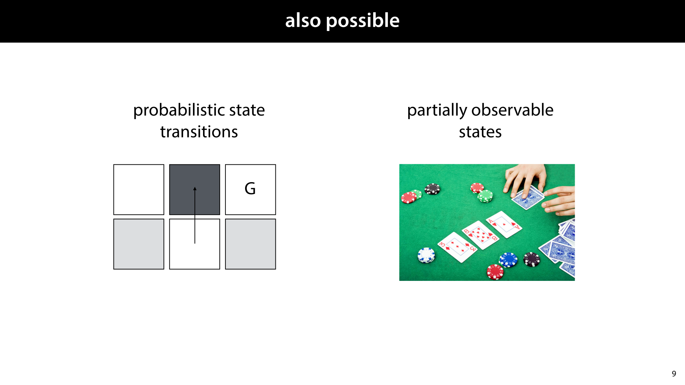

            <figcaption>
            
Here are some extensions to reinforcement lear ning that we won’t go into (too much) today.  

 

Sometimes the state transitions are<strong> probabilistic</strong>. Consider the example of controlling a robot: the agent might tell its left wheel to spin 5 mm, but on a slippery floor the resulting movement may be anything from 0 to 5 mm. 

 

Another thing you may want to model is <strong>partially observable states</strong>. For example, in a poker game, there may be five cards on the table, but three of them might be face down.  

 
<aside    >In this lecture we will mostly focus on deep reinforcement learning, where these distinctions don't have much impact. We will simply train a neural network to learn a good policy function, and if the state information is incomplete, or the environment behaves probabilistically, we trust that the neural net can learn how to work around that. These distinctions only become important when you want to do a more theoretical analysis of reinforcement learning problems. </aside>
 
<aside    >image source: <a href="http://www.dwaynebaraka.com/blog/2013/10/03/why-most-csr-budgets-are-wasted/">http://www.dwaynebaraka.com/blog/2013/10/03/why-most-csr-budgets-are-wasted/</a> </aside><aside    ></aside>
            </figcaption>
       </section>

       <section id="slide-010">
            <a class="slide-link" href="https://mlvu.github.io/lecture13#slide-010" title="Link to this slide.">link here</a>
            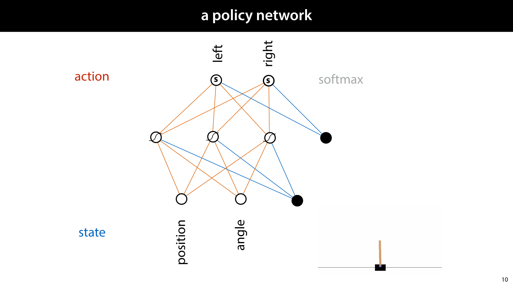

            <figcaption>
            
Before we decide how to train our model, the policy, let’s decide what it <strong>is</strong>, first.  

There are many ways to represent RL models, but most of the recent breakthroughs have come from using <strong>neural networks</strong>. We'll focus on solving reinforcement learning with neural networks in this lecture. This is sometimes called deep reinforcement learning. Surprisingly, this approach allows us to skip a lot of the technical details of reinforcement learning. 

The job of an agent is to map states to actions, or states to a <em>distribution</em> over actions. Since this function is called the policy in reinforcement learning, we call the network we will learn that implements this function a <strong>policy network</strong>. 

Here's an example for the cart pole challenge. We represent the state by two numbers (the position of the cart and the angle of the pole) and we use a softmax output layer to produce a probability distribution over the two possible actions. In the picture we just use a simple two-layer MLP, but this could of course be a network with any architecture. 

If we somehow figure out the right weights, this is all we need to solve the problem: for every state, we simply feed it through the network and either choose the action with the highest probability, or sample from the outputs.

            </figcaption>
       </section>

       <section id="slide-011">
            <a class="slide-link" href="https://mlvu.github.io/lecture13#slide-011" title="Link to this slide.">link here</a>
            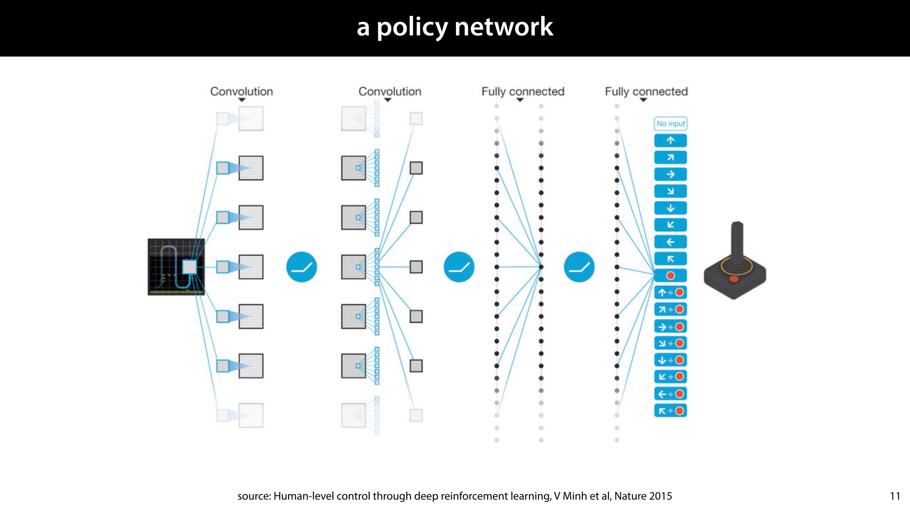

            <figcaption>
            
Here's what a policy network for the Atari problem might look like.  
<aside    >In this research something slightly different, called a q-network, was used, but a policy network for the problem would look the same at this level of abstraction. </aside>
We see that the input consists simply of the raw pixels from the screen. The intermediate layers are a series of convolutions, ReLU activated, followed by a series of fully connected layers. The output layer has a node for every possible action. This this includes moving the joystick and pressing the fire button, the combinations of moving the joystick and pressing the button also get separate nodes. The actions of doing nothing also gets an output node. 

In a policy network, we would apply a softmax activation to the output layer, giving us a categorical distribution over these 18 possible actions 

Once we have our policy network designed. All we need is a way to figure out the correct weights. 

source: Human-level control through deep reinforcement learning, V Minh et al, Nature 2015

            </figcaption>
       </section>

       <section id="slide-012">
            <a class="slide-link" href="https://mlvu.github.io/lecture13#slide-012" title="Link to this slide.">link here</a>
            

            <figcaption>
            
Before we look at some specific algorithms for training the weights of a policy network, we'll sketch out how such training usually proceeds and why it's such a difficult problem compared to the learning we've been doing so far. 

Even though reinforcement learning agents can theoretically learn in an online mode, where they continuously update their model while they explore the world, this can be a very difficult setting to control, and it may lead to very unpredictable behaviors. In practice this is rarely how agents are trained. 

A more common setting is that of <strong>episodic learning</strong>. We define a particular activity that we’d like the robot to learn, and call that an <strong>episode</strong>. This could be one game of chess, one helicopter flight of a fixed length, or one Atari game for as long as the agent can manage to stay alive. 

We then let the agent act one episode, based on its current policy. We observe the <strong>total reward</strong> at the end of the policy, use that to update the parameters of the policy (to learn) and then start another episode. 

Often after training like this for a while, when we are convinced we have a good policy, we keep it fixed when we roll it out to production. That is, when you buy a robot vacuum cleaner, it may contain a policy trained by reinforcement learning, but it almost certainly won’t update its weights as it’s vacuuming your floors.  
<aside    >This means that even though the framework of reinforcement learning is fully online in theory, allowing agents to update themselves as they explore the world and the consequences of their actions, in practice this is too poorly controlled to work in productions settings, and we still end up, in some sense, taking our training offline. </aside>
We will assume episodic learning for the rest of the lecture and consider true online reinforcement learning out of scope. 

            </figcaption>
       </section>

       <section id="slide-013">
            <a class="slide-link" href="https://mlvu.github.io/lecture13#slide-013" title="Link to this slide.">link here</a>
            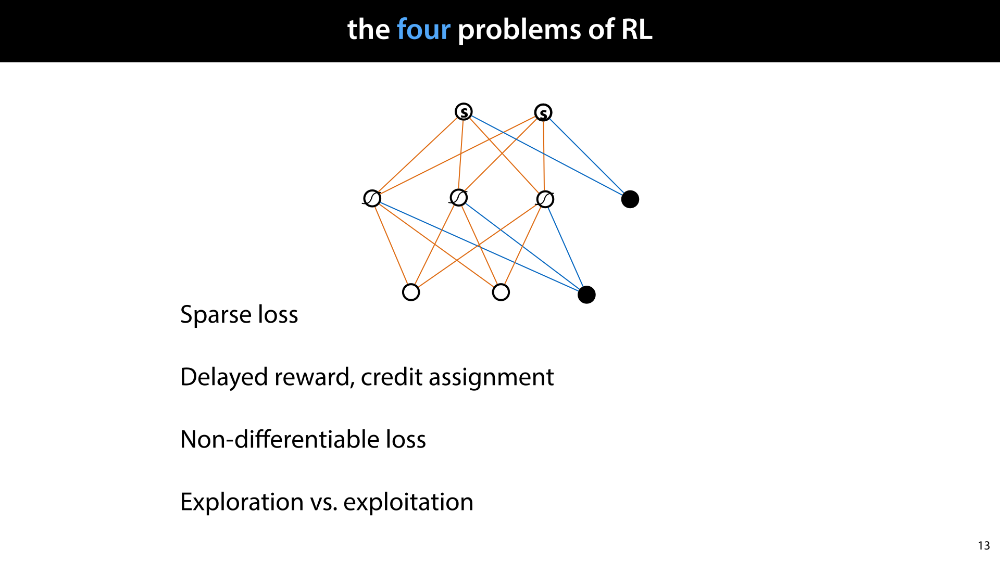

            <figcaption>
            
So what’s the big problem? We know how to find good weights for a neural network already: we use minibatch gradient descent and use backpropagation to work out the gradient. 

There are four problems that make it difficult to apply gradient descent as we know it to reinforcement learning problems.

            </figcaption>
       </section>

       <section id="slide-014">
            <a class="slide-link" href="https://mlvu.github.io/lecture13#slide-014" title="Link to this slide.">link here</a>
            

            <figcaption>
            
The problem of <strong>sparse rewards</strong> (or sometimes sparse loss) is the issue that very few states have a meaningful reward. This is not always the case, but it is very common. 

In a chess game, there are three states with meaningful loss: lost, won or  a draw. All other states, while the game is still in progress, provide no meaningful reward. We could of course <em>estimate</em> the value of these states to help our model learn (more about that later), but we might estimate these values wrong. If we can learn purely from the sparse reward signal (the rewards that  we <em>know</em> to be correct), we can be sure that we’re not inadvertently sending the model in the wrong direction. 

Sparse loss is an especially critical problem at the start of training. When a policy network for playing chess is initialized with random weights, it will simply make random moves. Somehow, it needs to reason all the way backward from a losing position to the starting moves of a chess match to figure out which starting moves reduce the likelihood of losing.

            </figcaption>
       </section>

       <section id="slide-015">
            <a class="slide-link" href="https://mlvu.github.io/lecture13#slide-015" title="Link to this slide.">link here</a>
            

            <figcaption>
            
Even the best reinforcement learning systems have trouble learning  some tasks purely from a sparse loss. Some tricks can be employed to help the model along.  

Imitation learning This is the practice of training the model just to copy whatever good players have done in the past. For instance, if we have a large database of chess games, we can just train the policy network to predict the human move for a given state. This reduces the problem to plain supervised learning. Once we've trained a network with imitation learning, it will play pretty reasonably in the reinforcement learning setting from the start, and we can expect the reinforcement learning to be more efficient. 

Reward shaping means replacing the sparse reward with a hand-crafted reward that is less sparse. For instance, in a chess playing problem, we could look at material advantage. If the player has many more pieces than the opponent in a given state, we can give that state a reward somewhere between 0 and 1. The player hasn't won, but it seems to be doing pretty well.  
<aside    >This has a few downsides. First, it requires handcrafted knowledge that is specific to the problem. This means our solution becomes less general. If we want to use the same approach to learn to play go, we need a different reward function. Second, our knowledge may be wrong. In some cases, a good chess player sacrifices material for a tactical advantage. We don't want to inadvertently steer the agent away from such solutions. Ultimately, we want the agent to learn things we don't know yet. Otherwise, we wouldn't need the agent in the first place. </aside>
Auxiliary goals are a bit like reward shaping, but framed differently. If we train the agent to learn many different things, even if all of them have a sparse reward, the overall reward becomes less sparse. For instance, instead of training the chess player only to win, we could train it to stay alive for as long as possible. This is a simpler task which the agent can learn more quickly. Once it has mastered this trick, it is likely to have some of the basic skills required to start actually winning a chess game. 

One active area of research is how to train agents that have a sense of "curiosity": a kind of in-built reward function that allows them to meaningfully explore an environment without being told what the task is at all. This leads to a kind of "unsupervised" reinforcement learning. As an auxiliary goal, this can help the agent explore until it's learned enough to start dealing with the sparse reward. 

 

Good explanation of reward shaping: <a href="https://www.youtube.com/watch?v=xManAGjbx2k"><strong class="blue">https://www.youtube.com/watch?v=xManAGjbx2k</strong></a> 

            </figcaption>
       </section>

       <section id="slide-016">
            <a class="slide-link" href="https://mlvu.github.io/lecture13#slide-016" title="Link to this slide.">link here</a>
            

            <figcaption>
            
The problem of <strong>delayed reward</strong> is that we have to decide on our immediate <em>action</em>, but we don’t get immediate<em> feedback</em>.  

In the cart pole task, when the pole falls over, it may be because we made a mistake 20 timesteps ago, but we only get the negative reward when the pole finally hits the ground. Once the pole started tipping over to the right, we may have moved right twenty times: these were good actions, which should be rewarded, but they were just too late to save the situation. 

Another example is crashing a car. If we’re learning to drive, this is a bad outcome that should carry a negative reward. However most people brake just before they crash. These are good actions that simply failed to prevent a bad outcome. We shouldn’t learn not to brake before a crash, we should work backward to where we went wrong (like taking a turn at too high a speed) and apply the negative feedback to only those actions. 

This is also called the<strong> credit assignment problem</strong>, and in many ways, it’s what reinforcement learning is all about.  

            </figcaption>
       </section>

       <section id="slide-017">
            <a class="slide-link" href="https://mlvu.github.io/lecture13#slide-017" title="Link to this slide.">link here</a>
            

            <figcaption>
            
If we draw a run of our policy like this, we are essentially unrolling the execution of the network over time, much like we did with the recurrent neural nets. If we could apply backpropagation through time, we could let the backpropagation algorithm deal with credit assignment for us. We take the reward at each point, and backpropagate it through the run to compute the gradients over the weights. 

Here unfortunately, a lot of parts of the model <strong>aren’t differentiable</strong>, chief among them <strong class="blue">the environment</strong>. Even if the environment were a differentiable function (which it usually isn't) we are not supposed to know exactly how it works. The whole point of reinforcement learning is that we have to <strong>learn </strong>how the environment works through exploration. So here, the trick of unrolling time and using backpropagation doesn't work for us.

            </figcaption>
       </section>

       <section id="slide-018">
            <a class="slide-link" href="https://mlvu.github.io/lecture13#slide-018" title="Link to this slide.">link here</a>
            

            <figcaption>
            
Of course, if we could solve the problem of non-differentiable loss, we could update our weights in a much more <em>directed</em> fashion.  We could follow the gradient of the reward rather than take random steps in model space. While we can't make the loss differentiable directly, what we can do is <strong>estimate</strong> what backpropagation would do if the loss were differentiable.  

The two main algorithms to do this are <strong>policy gradients</strong> and<strong> Q-learning</strong>. We’ll look at both in the next two videos.

            </figcaption>
       </section>

       <section id="slide-019" class="anim">
            <a class="slide-link" href="https://mlvu.github.io/lecture13#slide-019" title="Link to this slide.">link here</a>
            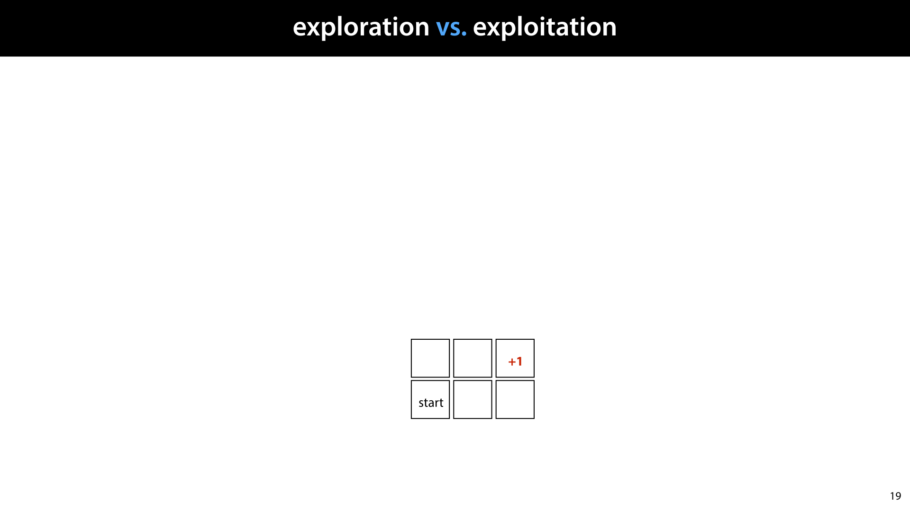

            <figcaption>
            
The final problem in RL is the <strong>exploration vs. exploitation </strong>tradeoff.  

In this scenario drawn here the squares are states, and the agent moves from state to state to find a reward. Each time the agent finds a reward it is reset to the start state. This is like the floor cleaning robot example. 

An agent stumbling around randomly will most likely find the +1 reward first.  After a few resets it will have figured out how to return to the +1 reward. If it exploits only the things it has learned so far, it will keep coming back for the +1 reward, never reaching the +100 reward at the end of the long tunnel. An agent that follows a more random policy, that sometimes moves away from known rewards will <strong>explore </strong>more and eventually find the bigger treasure. At first, however, the exploring agent does markedly worse than the exploiting agent. 

This is the exploration/exploitation trade-off. The more we exploit what we've learned so far, the higher the rewards in the immediate future. However, if we deviate from what we know, and explore a little more, the reduction in immediate reward may be offset by the increased reward we get in the far future from understanding the environment better.  
<aside    >If you look for it, you'll see the exploration/exploitation tradeoff crop up everywhere. Not just in reinforcement learning, but also in other AI problems and in general planning and strategy problems. For instance, if you set up a software company. Perhaps your software is perfect for one group of users. If you do your best to sell to them, you will always have great success, but the amount of customers remains limited. If you try a different group of users, you may not do so well, but it does allow you to learn what these new users are missing in your software. If you make the investment to talk to a new userbase, it will lead to lower profits in the short term, but a broader userbase in the long term. </aside><aside    >Or imagine a soccer team that always plays in a 4-3-3 formation. They play this so often that they are very good at it. However, it also makes them exploitable, since the opponents know what to expect. If they start playing alternative set ups like 3-4-3, they will start losing in the immediate future, because they are unused to playing like this. In the long term, however, they will learn this new style of play, and the added variety in their playbook will make them less exploitable by opponents.</aside><aside    ></aside>
            </figcaption>
            click image for animation
       </section>

       <section id="slide-020">
            <a class="slide-link" href="https://mlvu.github.io/lecture13#slide-020" title="Link to this slide.">link here</a>
            

            <figcaption>
            
So, these are the four main problems that RL algorithms must deal with. 

If your problem has any of these properties, it can pay to tackle it in a reinforcement learning setting, even if the problem as a whole doesn’t look like a reinforcement learning task to begin with.  

For instance, a network architecture with a non-differentiable sampling step in the middle could be trained using reinforcement learning methods, even if the task doesn’t really have “actions” or an “environment”.

            </figcaption>
       </section>

       <section id="slide-021">
            <a class="slide-link" href="https://mlvu.github.io/lecture13#slide-021" title="Link to this slide.">link here</a>
            

            <figcaption>
            
In the remainder of the video, we'll look at a few ways to solve the abstract task of reinforcement learning.

            </figcaption>
       </section>

       <section class="video" id="video-021">
           <a class="slide-link" href="https://mlvu.github.io/lecture13#video-21">link here</a>
           <iframe
                src="https://www.youtube.com/embed/tbV2udJmssM"
                title="YouTube video player"
                frameborder="0" allow="accelerometer; autoplay; clipboard-write; encrypted-media; gyroscope; picture-in-picture"
                allowfullscreen>
           </iframe>

       </section>

       <section id="slide-022">
            <a class="slide-link" href="https://mlvu.github.io/lecture13#slide-022" title="Link to this slide.">link here</a>
            

            <figcaption>
            
In this video, we’ll look at two simple methods for training a policy network: random search and policy gradients. 

<lnbr></lnbr>

            </figcaption>
       </section>

       <section id="slide-023" class="anim">
            <a class="slide-link" href="https://mlvu.github.io/lecture13#slide-023" title="Link to this slide.">link here</a>
            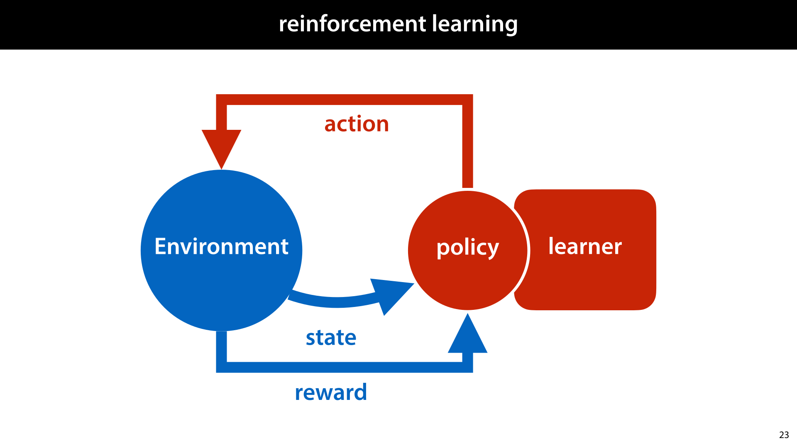

            <figcaption>
            
So, now that we understand the abstract task of reinforcement learning and what makes it difficult, how do we solve it?  

We'll assume that the policy takes the form of some neural network. We'll need to think a little bit about how to represent the state and the actions as tensors, but we won't focus much on the internals of the neural network. They could be fully connected layers, recurrent layers, convolutions, etc. The methods we develop here will work regardless of the internals.

            </figcaption>
            click image for animation
       </section>

       <section id="slide-024">
            <a class="slide-link" href="https://mlvu.github.io/lecture13#slide-024" title="Link to this slide.">link here</a>
            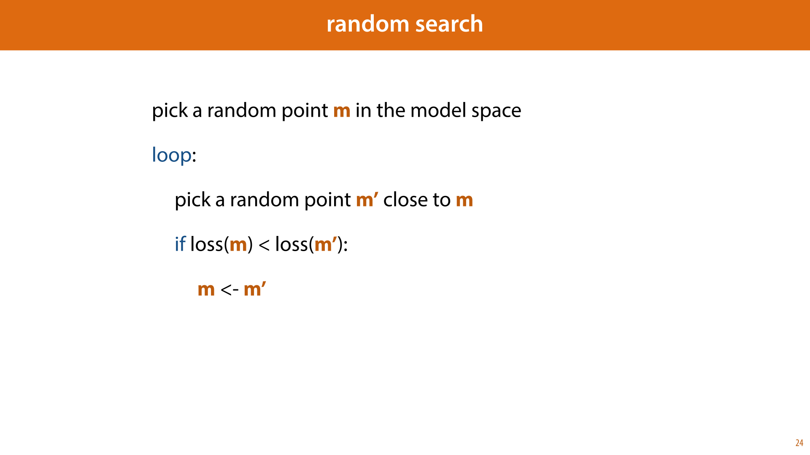

            <figcaption>
            
Let’s start with a very simple example: random search. 

To refresh your memory, this is a pure black box method. All we need is a way to compute <strong>the loss</strong>. We start with a random model, perturb it a little bit, and if the perturbed model has a better loss we stick with that, and if not, we go back to the previous model. 

In episodic reinforcement learning we can just let the model execute a few episodes, and sum up its total reward. We perturb the model and if the reward goes up (i.e. the "loss" goes down), we change to the new model.

            </figcaption>
       </section>

       <section id="slide-025" class="anim">
            <a class="slide-link" href="https://mlvu.github.io/lecture13#slide-025" title="Link to this slide.">link here</a>
            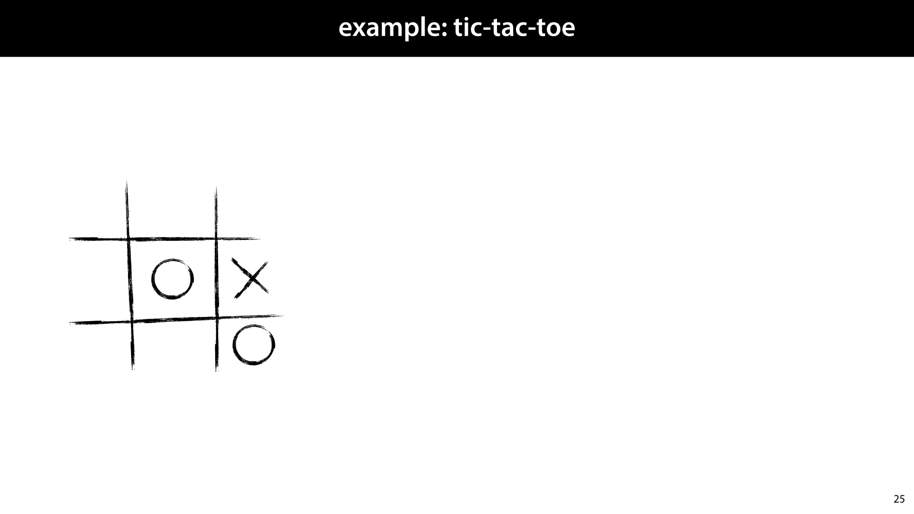

            <figcaption>
            
As an example, let’s look at how we might learn to play tic-tac-toe by framing it as a reinforcement learning problem and solving it with random search. 

 We’ll return to this example for every reinforcement learning algorithm we introduce.

            </figcaption>
            click image for animation
       </section>

       <section id="slide-026" class="anim">
            <a class="slide-link" href="https://mlvu.github.io/lecture13#slide-026" title="Link to this slide.">link here</a>
            

            <figcaption>
            
The first thing we need to decide on is what the environment will be. To keep things simple, we’ll assume that we have some fixed opponent that we are going to try to beat. This could be some algorithmic player we’ve built based on simple rules. If we don’t have any such algorithm available, we could just start with an opponent that plays random moves, train a policy network that beats that player, and then iterate: we make our trained network the new opponent and train a new network to beat it.  
<aside    >In practice, it’s a good idea to maintain a pool of opponents and sample one at random for each episode, so that the network doesn’t overfit to beating one opponent, but maintains a good general strategy. Once we've converged to a good model, we just add the current model to the pool, and continue training. </aside>
 The episodes are simple games against the opponent. The state is simply the game board at any given moment, and an action is placing our symbol in one of the squares.  

We model our policy by a neural network, a policy network. We represent the board as a 3x3 matrix, containing 0s for empty squares, -1s for squares occupied by the opponent, and 1s for squares we occupy. We can flatten this matrix into a vector and feed it to a fully connected network, or keep it a 2 tensor and feed it to a convolutional neural net. The output layer of the network also contains 9 units that represent the squares of the board. We softmax the output layer and interpret the resulting probabilities as a probabilistic policy: the probability on the first output node is the probability that we’ll place a cross in the top left corner square. 

We then play a game by taking our current policy network, and <strong>sampling from the output distribution</strong> over the possible actions. We could also choose the action with the highest probability, but remember that at the start of learning, these probability ar completely arbitrary. If we assign a low probability to a good action, we should take that action occasionally to learn that the probability should actually be higher. 
<aside    >We needn’t worry about forcing the neural network not to make illegal moves, like placing a cross where there already was a symbol. If we simply set the rules so that an illegal move always results in instant loss of the game, then it’s likely that the neural network learns not to place crosses in those squares. In short, we don’t hardcode the rules, we let the network <strong>learn </strong>the rules. </aside><aside    ></aside>
            </figcaption>
            click image for animation
       </section>

       <section id="slide-027" class="anim">
            <a class="slide-link" href="https://mlvu.github.io/lecture13#slide-027" title="Link to this slide.">link here</a>
            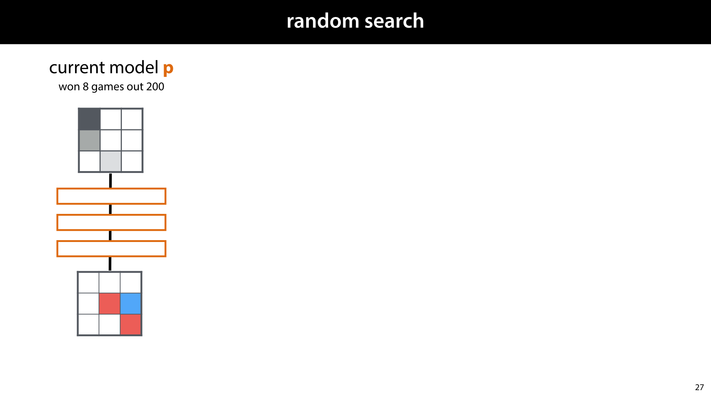

            <figcaption>
            
Training this model by random search is very simple. We gather up all the weights of the policy network into a vector <strong class="orange">p</strong> and call that our current model. We run a few episodes, that is games against the opponent, and we see how many it wins. More precisely, what its average reward is over all the episodes. We then apply a small perturbation to <strong class="orange">p</strong>, like some random noise, and call the resulting policy <strong class="orange">p</strong><strong>’</strong>. We check the average reward for <strong class="orange">p’</strong>, and if it’s higher that that for<strong> </strong><strong class="orange">p</strong>, we call <strong class="orange">p’</strong> the new current model.  

If it isn’t higher, we discard <strong class="orange">p’</strong> and keep <strong class="orange">p</strong> as the current model. 

We iterate for as long as we have patience and see if the resulting model is any good.

            </figcaption>
            click image for animation
       </section>

       <section id="slide-028">
            <a class="slide-link" href="https://mlvu.github.io/lecture13#slide-028" title="Link to this slide.">link here</a>
            <iframe
                src="https://www.youtube.com/embed/CGHgENV1hII?modestbranding=1&showinfo=0&rel=0"
                title="YouTube video player"
                frameborder="0" allow="accelerometer; autoplay; clipboard-write; encrypted-media; gyroscope; picture-in-picture"
                allowfullscreen>
            </iframe>

            <figcaption>
            
This is an exceedingly simple method, but for some games, like the Atari game Frostbite, it already works very well.  
<aside    >Remember that the Atari challenge is "from pixels." You're looking at a substantial convolutional neural network trained entirely by random search. No calculus required. </aside>
video source: <a href="https://www.youtube.com/watch?v=CGHgENV1hII"><strong class="blue">https://www.youtube.com/watch?v=CGHgENV1hII</strong></a> 

            </figcaption>
       </section>

       <section id="slide-029">
            <a class="slide-link" href="https://mlvu.github.io/lecture13#slide-029" title="Link to this slide.">link here</a>
            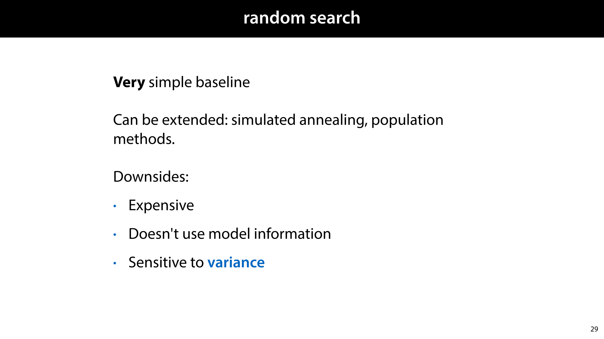

            <figcaption>
            
Random search functions as an extremely simple baseline. In theory, you now have everything you need to solve a complex reinforcement learning problem. In practice, this method is very sensitive to the hyperparameters you use, and it can be very complex to train a neural net to do something at simple as just making legal moves in tic-tac-toe. 

To make the method a little more powerful, we can apply all the tricks we used in the second lecture: we can use simulated annealing, branching random search or even population methods. 

The downside of the method is that since it's relatively stupid, it may take a long time to learn anything. We already know a lot about how to "open up" the black box and use the information about how our model is composed, to come up with a good direction in model space to move. If we can work some of those methods into the reinforcement learning setting, we can expect to learn more efficiently. 

A final downside, which plagues many reinforcement learning problems is that of variance. If model <strong class="orange">p</strong> wins 8 out of 200 games, and model <strong class="orange">p'</strong> wind 13 out of 200 games, can we really be sure that <strong class="orange">p'</strong> is the better model? There is some randomness in these games, so it's very possible that<strong class="orange"> p'</strong> just got lucky, and both models perform the same or even worse, <strong class="orange">p'</strong> actually performs better. Since we are only making very small perturbations, we end up with very small differences in our models, so the differences in performance will be very small too. Even a little bit of variance is enough to entirely eclipse such a small difference. 

In the long run, we still end up with a movement in model space that is more likely to be pulled towards well performing models, but the higher the variance, the weaker this effect, and the longer wee need to train.

            </figcaption>
       </section>

       <section id="slide-030">
            <a class="slide-link" href="https://mlvu.github.io/lecture13#slide-030" title="Link to this slide.">link here</a>
            

            <figcaption>
            
Let's look at a method that uses a little more information about what our model actually looks like and what its doing. The method of <strong>policy gradients</strong>. 

In the last video, we noted two things:  

We can<strong> unroll </strong>the computation of an episode in our learning process. 

We cannot backpropagate through this unrolled computation graph, because parts of it are <strong>not differentiable</strong>. Specifically the sampling of actions from the output of the neural net is not differentiable, and the computation of the environment is not even accessible to us: it’s essentially a secret that we are meant to discover by learning.

            </figcaption>
       </section>

       <section id="slide-031" class="anim">
            <a class="slide-link" href="https://mlvu.github.io/lecture13#slide-031" title="Link to this slide.">link here</a>
            

            <figcaption>
            
<strong>Policy gradient descent</strong> is a simple way to estimate what backpropagation would do if we could backpropagate through the whole unrolled history. We run an episode, compute the total reward at the end, and apply that as the feedback for <strong>all the steps in our run</strong>. If  we had a high reward at the end we compute the gradient for a high value and follow that, and if we had a low reward we compute the gradient for a low value and follow that. 

This essentially completely ignores the problem of credit assignment. Many of the actions that led to a bad outcome may in fact have been good, and only one of the actions led to disaster. In policy gradient descent, we don’t care. If the episode ended badly we punish the network blindly for all of its actions, good or bad. 

The idea is that if some of the actions we punish the network for are good,  then <em>on averag</em>e they will occur more often in episodes ending with a positive reward, and on average they will be labeled bad more often than good. We let the averaging effect over many episodes take care of the credit assignment problem.  

This implies that we should be sure to explore without too much bias. Consider the example of the car crash. There, we should make sure the agent investigates the sequences where it doesn’t brake before a crash as well (preferably in a simulated environment). Averaging over all sequences, braking before the crash results in less damage than not braking so the agent will eventually learn that braking is a good idea. If we only explore the situations where the agent brakes and crashes, it will still learn that braking is a bad idea.

            </figcaption>
            click image for animation
       </section>

       <section id="slide-032" class="anim">
            <a class="slide-link" href="https://mlvu.github.io/lecture13#slide-032" title="Link to this slide.">link here</a>
            

            <figcaption>
            
Here’s asketch of what that looks like for an episode with a policy network. We compute the actions from the states, sample an action, and observe a reward and a new state. We keep going until the episode ends and then we look at the total reward.  

Now, the question is <strong>how exactly do we apply the reward to each network</strong>? Once we have a loss for each instance of the network we can backpropagate based on the values from the forward pass. But is it best to just backpropapagate the reward? Should we scale it somehow? How should it interact with the different probabilities that the network produced for the actions? If we sampled a low probability action, should we apply less of the reward? Do we backpropagate only from the node corresponding to the action we chose, or from all output nodes? 

All of these approaches may or may not work. As we’ve seen in the past, it can help to derive an intuitive approach more formally, to help us make some of these decisions. Luckily, such a formal derivation exists from policy gradients, and it’s relatively simple. 

            </figcaption>
            click image for animation
       </section>

       <section id="slide-033">
            <a class="slide-link" href="https://mlvu.github.io/lecture13#slide-033" title="Link to this slide.">link here</a>
            

            <figcaption>
            
To start, let's formalize the problem a little more. What we're really interested in maximizing is the expected reward over an episode. The is a lot of randomness going on: first, our agent produces probabilities on the possible actions, from which we sample a single action. Second, the environment may add in randomness of our own. for instance, if we're playing tic tac toe, and our opponent also samples its moves randomly from a distribution produced by a policy network. 

What we're really interested in maximizing, is the <strong>expected reward</strong> under all this randomness. We want to set the parameters of our policy network in such a way that the expected total reward at the end of an episode is maximal.  

There are a few problems that stop us from doing this naively, by just computing the expected total reward, and using gradient descent. 

First, this expectation is impossible to compute explictly. It's a sum over all probabilities involved. Even if the environment were completely discrete, every move we make in the episode multiplies the number of terms in this sum by the number of actions, leading to an exponential increase in terms with the length of the episode. If the environment is partially random, then we have a probability distribution involved that we can only sample from, so we can't even compute the expectation at all. 

The solution is M<strong>onte Carlo sampling</strong>. This is a fancy name for a very simple idea. For an expectation E f(x) with x drawn from probability distribution p, we estimate the expectation by sampling a bunch of x's from p and averaging the values f(x). This provides a guaranteed unbiased estimate of E f(x). 

In reinforcement learning this boils down to playing a bunch of episodes, sampling actions randomly from the distributions provided by our policy net, and averaging the total rewards of all episodes. This gives us a good estimate of our expected total reward under the current policy. 

The second problem is a more serious one. If we want to do gradient ascent on this reward, we need to figure out the gradient of the expected reward. but that doesn't tell us which loss to backpropagate down our neural networks. We can't just set the reward as the loss: in order to use gradient descent, we need a loss function that is a direct, differentiable function <strong>of the output of our network</strong>. In short, we can work out gradients with respect to p(a), but not with respect to the total reward r(a). <strong>We need to move r(</strong><strong class="orange red">a</strong><strong>) outside of the gradient operator.</strong>

<strong></strong>

            </figcaption>
       </section>

       <section id="slide-034" class="anim">
            <a class="slide-link" href="https://mlvu.github.io/lecture13#slide-034" title="Link to this slide.">link here</a>
            

            <figcaption>
            
We call r the final reward at the end of the episode. Our network produces probabilities from which we sample, so the final reward is a probabilistic value (a random variable). Two episodes with the same initial state may lead to different total rewards due to different actions sampled. In practice, the environment may also add in some randomness of its own, making the expected reward even more uncertain. 

The <strong>expectation of that reward</strong> under all this uncertainty is what we’re really interested in maximizing. 

We start by writing out the reward. Here p(a) is the probability that our neural network gives to action a. The expectation over that reward is a sum over all actions, and we can freely move the gradient inside the sum.  

Multiplying by p(a)/p(a) gives us a factor in the middle which we can recognize as the derivative of the natural logarithm. Filling this in, and rewriting, we see that the derivative of the expected reward after taking action a is equal to the expectation of the reward after taking a times the gradient of the log-probability of a. 

What has this bought us? We started with <strong>the gradient over an expectation</strong>. This, we could not work out or estimate easily. After all this rewriting, we have an<strong> expectation over a gradient. </strong>This means we can work out the gradients inside the expectation for each sample, and then average those to get a Monte Carlo estimate of the gradient we're interested in. 

And this expectation we can approximate by sampling k actions from the output distribution of our network, and averaging this quantity. The derivative of ln p(ai) is simply the derivative of the logarithm of one of the outputs of the neural net with respect to the weights. This we know how to work out by backpropagation

            </figcaption>
            click image for animation
       </section>

       <section id="slide-035">
            <a class="slide-link" href="https://mlvu.github.io/lecture13#slide-035" title="Link to this slide.">link here</a>
            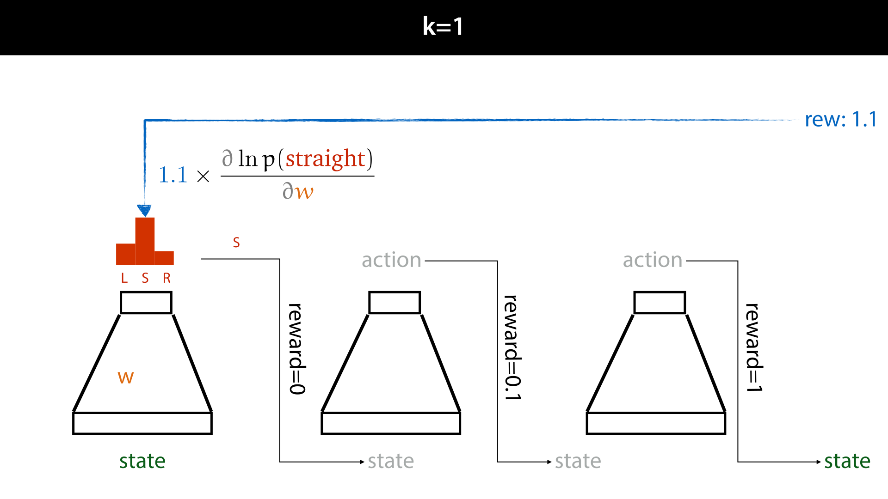

            <figcaption>
            
To simplify things, let’s approximate the expectation with a single sample: k= 1 and look only at the gradient for the first instance of the policy network. 

Imagine that our network outputs three actions: <em>left</em>, <em>straigh</em>t and <em>right</em>. And we sample the action <em>straight</em>. We complete the episode, and observe a total reward of 1.  

 If we look at the derivative for a single weight w, somewhere in the neural net, we see that its estimated partial derivative is 1.1 times the derivative of the logarithm of p(straight) with respect to w. This is a derivative purely in terms of the local information: the parameters and outputs of <strong>this copy </strong>of the network. With a little backpropagation, we can easily work out what this derivative is in numerical terms. 
<aside    >Note that to apply backpropagation, we need to remember all intermediate values of all copies of the network that computed and action in our episode. This can lead to high memory use, but we can solve that, for instance, by only doing the backpropagation on a random subset of the copies in our episode. </aside><aside    ></aside>
            </figcaption>
       </section>

       <section id="slide-036" class="anim">
            <a class="slide-link" href="https://mlvu.github.io/lecture13#slide-036" title="Link to this slide.">link here</a>
            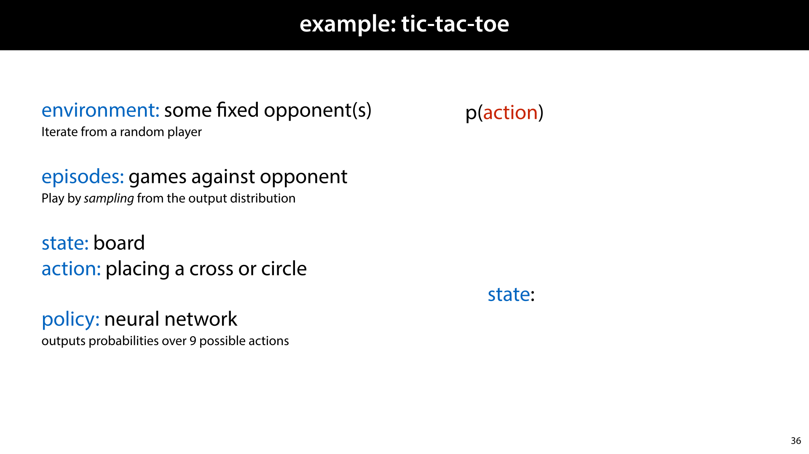

            <figcaption>
            
To finish up, let’s see what this looks like in our our tic-tac-toe example. 

            </figcaption>
            click image for animation
       </section>

       <section id="slide-037" class="anim">
            <a class="slide-link" href="https://mlvu.github.io/lecture13#slide-037" title="Link to this slide.">link here</a>
            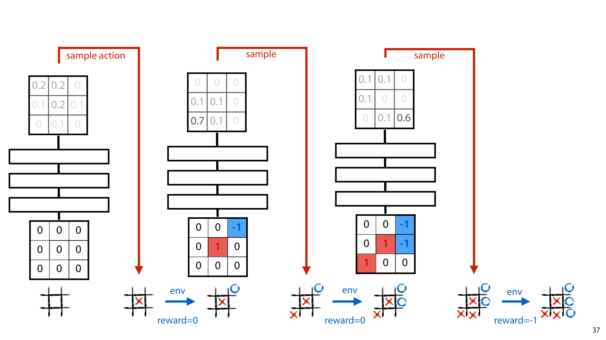

            <figcaption>
            
Here's an illustration of a full episode (again, a sample of 1). We end up losing the game, and getting a reward of -1. To estimate our gradient with respect to this reward, we mulitply it by the derivative of ln p(a) wrt w for each parameter w in the network. 

            </figcaption>
            click image for animation
       </section>

       <section id="slide-038">
            <a class="slide-link" href="https://mlvu.github.io/lecture13#slide-038" title="Link to this slide.">link here</a>
            

            <figcaption>
            <aside    >In many deep learning systems, like pytorch, you can't just set a gradient estimate on the output of your neural net and tell the system to backpropagate it. The trick is to set a loss for which our gradient estimate is the local derivative, and then tell the system to backpropagate on that proxy loss. If you do this right, the result is equivalent to the correct gradient estimate.</aside><aside    ></aside>
            </figcaption>
       </section>

       <section id="slide-039">
            <a class="slide-link" href="https://mlvu.github.io/lecture13#slide-039" title="Link to this slide.">link here</a>
            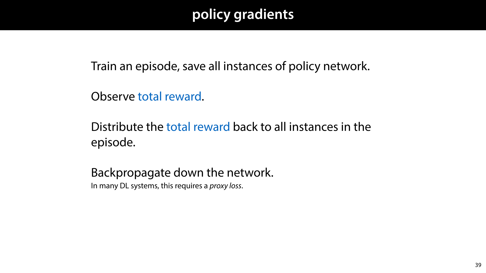

            <figcaption>
            

            </figcaption>
       </section>

       <section id="slide-040">
            <a class="slide-link" href="https://mlvu.github.io/lecture13#slide-040" title="Link to this slide.">link here</a>
            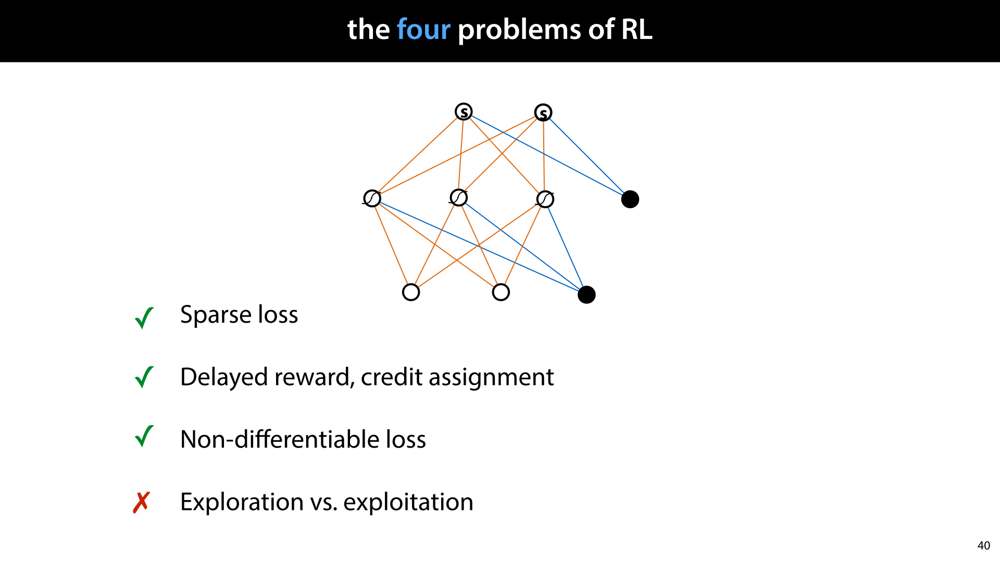

            <figcaption>
            
So, which parts of our problem do random search and policy gradients solve? We have a solution to some extent for the sparse loss, credit assignment and non-differentiable, since the we only focus on the total loss over an episode. We may need many episodes for the effects to average out properly, but in principle, this is the start of a solution. 

It’s important to note, however, that we haven’t solved the <strong>exploration vs. exploitation problem</strong>. If we always follow our currently best policy, we are still very likely to be seduced by early successes  and end up just repeating a known formula for a quick and low reward, rather than finding a more complex path towards a higher reward. Put simply, we quickly get stuck in local minima. 

The optimal tradeoff between exploration and exploration is not easy to define, and in some sense, it’s a subjective choice: how much immediate gain are we willing to trade off against long-term gain. Nevertheless, there are simple ways to at least give yourself control over the behavior of your learner.

            </figcaption>
       </section>

       <section id="slide-041">
            <a class="slide-link" href="https://mlvu.github.io/lecture13#slide-041" title="Link to this slide.">link here</a>
            

            <figcaption>
            
One trick is <strong>Boltzmann exploration</strong>. Instead of sampling from the normal softmax output, we introduce a new softmax with a <strong>temperature</strong> parameter. The temperature is divided by the elements before they are exponentiated and normalized.  

The higher we set the temperature, the more likely we are to select those actions that we currently think are poor. This may lead to low immediate reward, but it increases the probability of findign routes to new parts of our state space that ultimately lead to higher rewards. 

We can set a fixed temperature, or schedule the temperature to start high, and decrease towards the end of our training run, so that we start by exploring, and end up optimizing for the part of the state space we've observed.

            </figcaption>
       </section>

       <section id="slide-042">
            <a class="slide-link" href="https://mlvu.github.io/lecture13#slide-042" title="Link to this slide.">link here</a>
            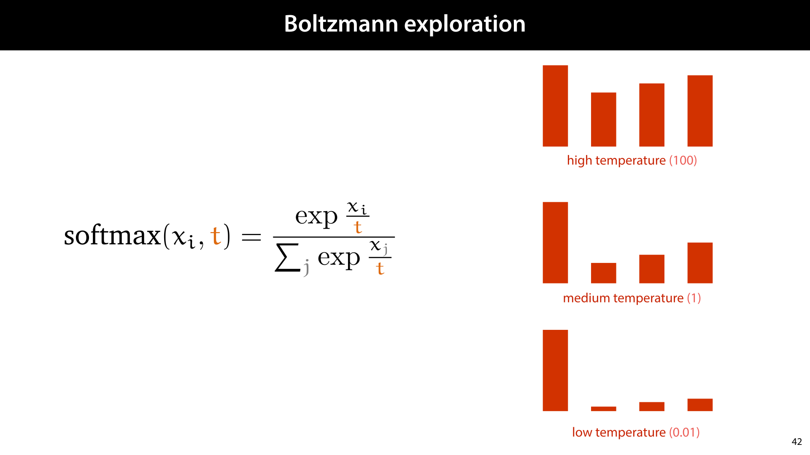

            <figcaption>
            
Another approach is epsilon greedy sampling. Here, we never sample from the probability distribution given by the policy. Instead, we just always pick the highest-probability actions. Except, with some small probability we pick a totally random action.

            </figcaption>
       </section>

       <section id="slide-043">
            <a class="slide-link" href="https://mlvu.github.io/lecture13#slide-043" title="Link to this slide.">link here</a>
            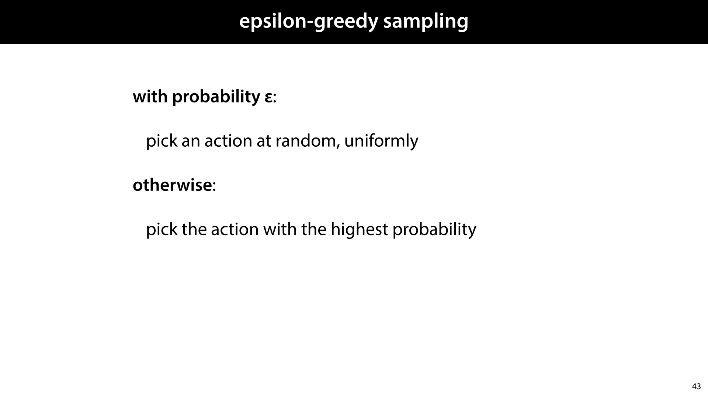

            <figcaption>
            
Policy gradients allow us to use a little more information about our model architecture, but it's still treating the environment as little more than a black box. We are saying very little about what it would mean to solve a reinforcement learning  problem, or what we're actually learning about the state space, how we're navigating the state space, and so on. 

In the next video, we'll look at Q-Learning: an algorithm that is a little more complex, but that more explicitly explores the state space.

            </figcaption>
       </section>

       <section class="video" id="video-043">
           <a class="slide-link" href="https://mlvu.github.io/lecture13#video-43">link here</a>
           <iframe
                src="https://www.youtube.com/embed/xf_MHXxzf1Y"
                title="YouTube video player"
                frameborder="0" allow="accelerometer; autoplay; clipboard-write; encrypted-media; gyroscope; picture-in-picture"
                allowfullscreen>
           </iframe>

       </section>

       <section id="slide-044">
            <a class="slide-link" href="https://mlvu.github.io/lecture13#slide-044" title="Link to this slide.">link here</a>
            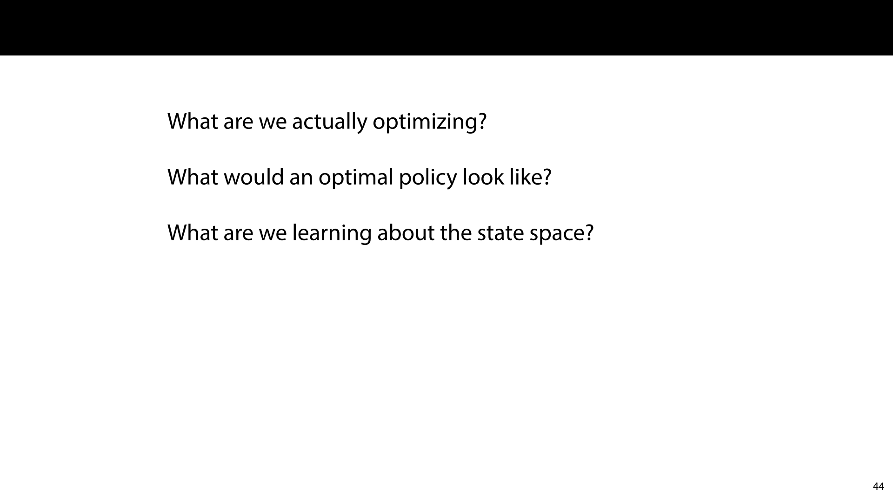

            <figcaption>
            
<lnbr></lnbr>

            </figcaption>
       </section>

       <section id="slide-045" class="anim">
            <a class="slide-link" href="https://mlvu.github.io/lecture13#slide-045" title="Link to this slide.">link here</a>
            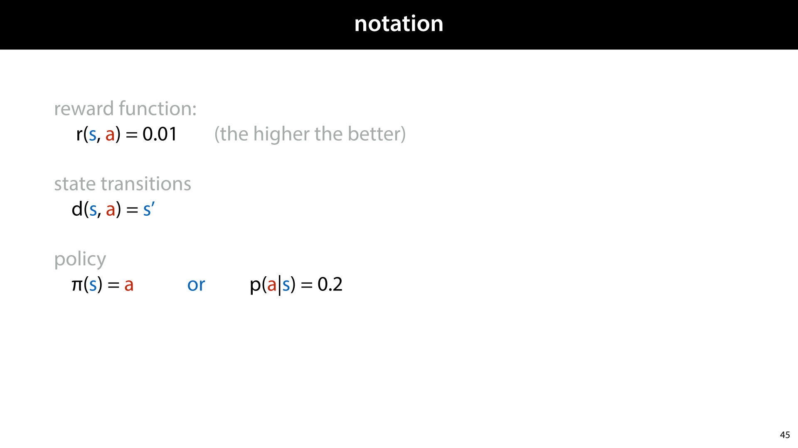

            <figcaption>
            
Since we're digging a little more into the specifics of reinforcement learning, we'll start by setting up some more formal notation for the various elements of the abstract task. 

The reward function r(s, a) determines the reward that the environment gives for taking a particular action in a particular state. The state transition d(s, a) function tells us how the environment decides what state we end up in after taking some ation. d(s, a) = s' means that if we're in state s and we take action a, we will end up in state s'. 
<aside    >This assumes that the environment is entirely deterministic. When we move to deep q-learning , we will see that we can use probabilistic environments without changing our method, but for now we will stick with this assumption. </aside>
In most cases, the agent will not have access to the reward function or the transition function and it will have to take actions to observe them.  

Sometimes, the agent will learn a deterministic policy, where every state is always followed by the same action. In other cases it’s better to learn a<strong> probabilistic policy </strong>where all actions are possible, but certain ones have a higher probability. For now, we will assume that we are learning a <strong>deterministic policy</strong>. 
<aside    >For policy gradients the probabilistic policy is a requirement. Q-Learning works with both approaches.</aside><aside    ></aside>
            </figcaption>
            click image for animation
       </section>

       <section id="slide-046" class="anim">
            <a class="slide-link" href="https://mlvu.github.io/lecture13#slide-046" title="Link to this slide.">link here</a>
            

            <figcaption>
            
While policy gradient descent is a nice trick, it doesn’t really get to the heart of reinforcement learning. To understand the problem better let’s look at Q-learning, which is what was used in the Atari challenge. 

The example we’ll use is the robotic hoover, also used in the first lecture. We will make the problem so simple that we can write out the policy explicitly: the room will have two states, the hoover can move left or right, and one of the states has dust in it. Once the hoover finds the dust, we reset. (The robot is reset to state A, and the dust is replaced, but the robot keeps its learned experience). 

If we just write down in a table what action we will take in every single state, we can specify a full policy. By directly learning all the values in such a table, we can axtually solve a simple reinforcement learning problem. This kind of analysis is often called<strong> tabular reinforcement learning</strong>.  
<aside    >Tabular RL can be used in practice, if the problem isn't too complex. However, it's not usually a good approach, because it doesn't generalize between states. If two states are very similar, for instance two tic-tac-toe positions that are rotations of one another, a good model should recognize that the best action to take should also be similar.  In tabular learning similarities between states are not taken into account. Once we replace the tabular policy with a neural network, we will get the best of both worlds. For now, we'll assume that we have a tabular policy.</aside><aside    ></aside>
            </figcaption>
            click image for animation
       </section>

       <section id="slide-047">
            <a class="slide-link" href="https://mlvu.github.io/lecture13#slide-047" title="Link to this slide.">link here</a>
            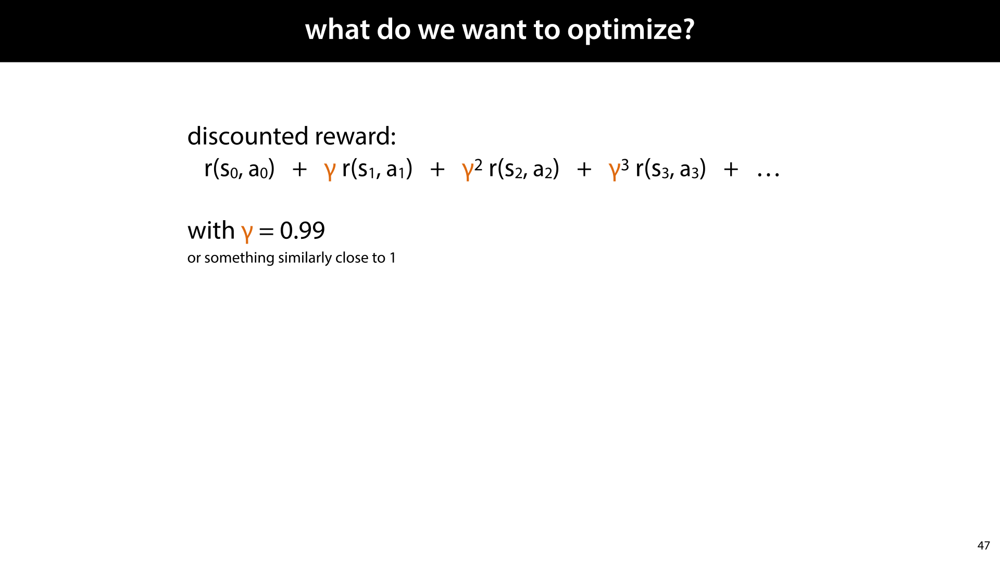

            <figcaption>
            
If we fix our policy to some table matching states to actions, then we know for a given policy what all the future states are going to be, and what rewards we are going to get. The discounted reward is the value we will try to optimise for: we want to find the policy that gives us the greatest discounted reward for all states. Note that this can be an infinite sum. 
<aside    >We can only do this if we have access to the transition function and the reward function, so the agent can't compute this value, but we can at least define it as a value that exist, and that we can try to estimate. Note also that we are limiting ourselves here to deterministic policies: for a fixed policy we always do the same thing in the same state. </aside>
If our problem is finished after a certain state is reached (like a game of tic-tac-toe) the discounted reward has a finite number of terms. If the problem can (potentially) go on forever (like the cart pole) the sum has an infinite number of terms. In that case the discounting ensures that the sum still converges to a finite value. 
<aside    >You can think of γ as a hyperparameter. We can set it to different values to get slightly different "optimal" behaviors.</aside><aside    ></aside>
            </figcaption>
       </section>

       <section id="slide-048" class="anim">
            <a class="slide-link" href="https://mlvu.github.io/lecture13#slide-048" title="Link to this slide.">link here</a>
            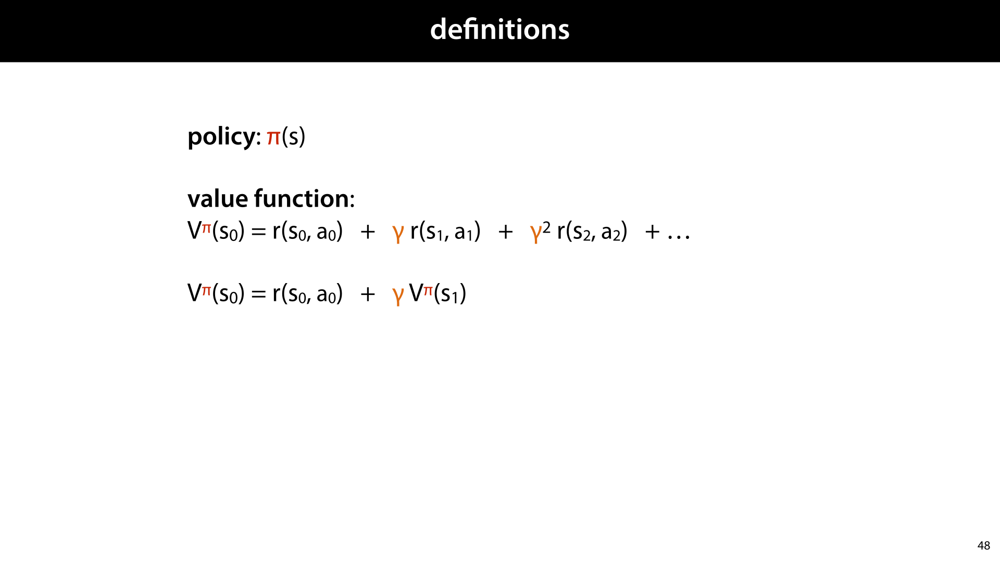

            <figcaption>
            
The discounted reward we get from state s for a given policy π is called Vπ(s0), the <strong>value function </strong>for the policy π. This represents the <strong>value</strong> of state s: how much we like to be in state s, given that we stick to policy π. If we get a high reward in the future when we start in state s, then state s has a high value for us. 

Using the value function, we can define our <strong>optimal policy</strong>, π*. This the policy that gives us the highest value function for all states.  
<aside    >You may wonder whether this is always a single policy. What if policy A gives us the highest reward from state s, and policy B gives us the highest reward from state q? The answer is that we can simply define a new policy C that follows a if we're in s and B if we're in q. </aside>
Once we've defined the optimal policy π*, we can define the value function V*(s), which is just the value function for the optimal policy.  

In some sense, V* gives us the <em>objective </em>value of a state. This is the reward we could get out of the state if we were smart enough to follow the optimal policy. If we can't it's our own fault for having a suboptimal policy.

            </figcaption>
            click image for animation
       </section>

       <section id="slide-049" class="anim">
            <a class="slide-link" href="https://mlvu.github.io/lecture13#slide-049" title="Link to this slide.">link here</a>
            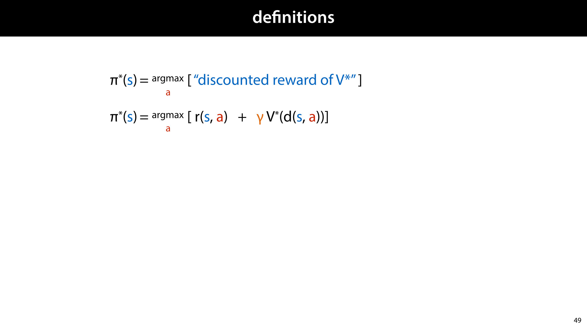

            <figcaption>
            
Using V* we can rewrite π* as a <em>recursive</em> definition.  
<aside    >This is going to get a little complicated, so make sure to go through these steps slowly. If you get stuck, go back to the previous slide and make sure you have a good intuition for what π* and V* mean. </aside>
The optimal policy is the one that chooses the action which maximises the future reward, assuming that we follow the optimal policy. We fill in the optimal value function to get rid of the infinite sum. We’ve now defined the optimal policy in a way that depends on what the optimal policy is. While this doesn’t allow us to compute π*, it does <em>define</em> it. If someone gives us a policy, we can recognise it by checking if this equality holds. 

To make this easier, we take the part inside the argmax and call it Q*(s, a). We then rewrite the definitions of the optimal policy and the optimal value function in terms of Q*(s,a). 

How has this helped us? Q*(s,a) is a function from state-action pairs to a number expressing how good that particular pair is. If we were given Q*, we could automatically compute the optimal policy, <em>and</em> the optimal value function. And it turns out, that in many problems it’s much easier to learn the Q*-function, than it is to learn the policy directly.

            </figcaption>
            click image for animation
       </section>

       <section id="slide-050">
            <a class="slide-link" href="https://mlvu.github.io/lecture13#slide-050" title="Link to this slide.">link here</a>
            

            <figcaption>
            
In order to see how the Q* function can be <em>learned</em>, we rewrite it. Earlier, we rewrote the V functions in terms of the Q function, now we plug that definition back into the Q function. We now get a recursive definition of Q*.  

Again, this may be a little difficult to wrap your head around. If so, think of it this way: If we were given a random Q-function, mapping state-action pairs to numbers, how could we tell whether it was actually Q*? We don’t know π* or V* so we can’t use the original definitions. But this equality must hold true for any Q function that is optimal! If we loop over all possible states and actions, and plug them into this equality, we must get the same number on both sides.  

Let’s try it that for a simple example. 

            </figcaption>
       </section>

       <section id="slide-051" class="anim">
            <a class="slide-link" href="https://mlvu.github.io/lecture13#slide-051" title="Link to this slide.">link here</a>
            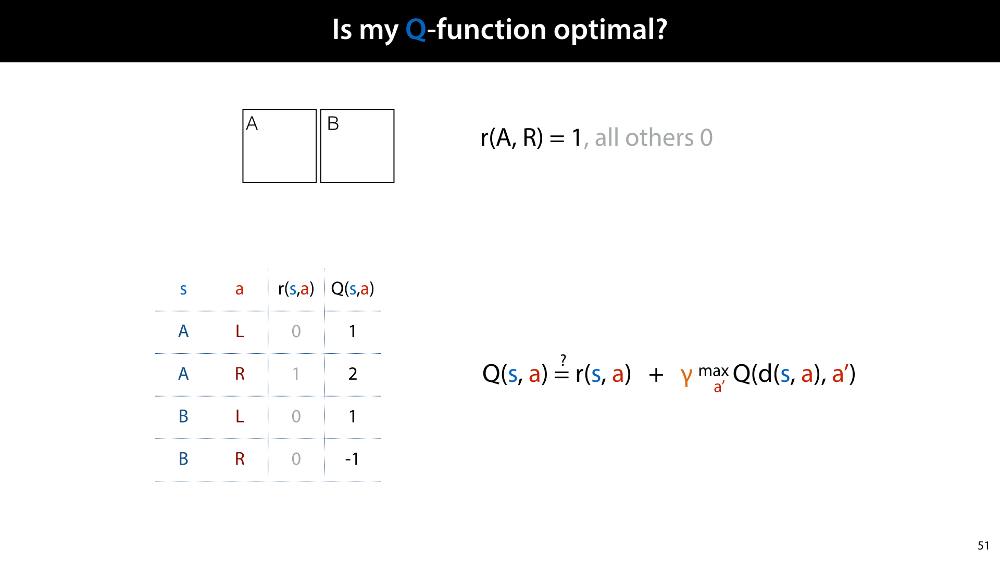

            <figcaption>
            
This is the two-state hoover problem again. We have states A and B, and actions left and right. The agent only gets a reward when moving from A to B. On the bottom left we see some random policy, generated by assigning random numbers to each state action pair.  

Did we get lucky and stumble on the optimal policy? Try it for yourself and see. (take γ = 0.9) If the equation on the right holds for all state action pairs, then this Q function is equal to the optimal Q function Q*. 

In theory, this allows us to find Q. We just randomly sample Q functions and check if we've found Q*. 

<lnbr></lnbr>

            </figcaption>
            click image for animation
       </section>

       <section id="slide-052" class="anim">
            <a class="slide-link" href="https://mlvu.github.io/lecture13#slide-052" title="Link to this slide.">link here</a>
            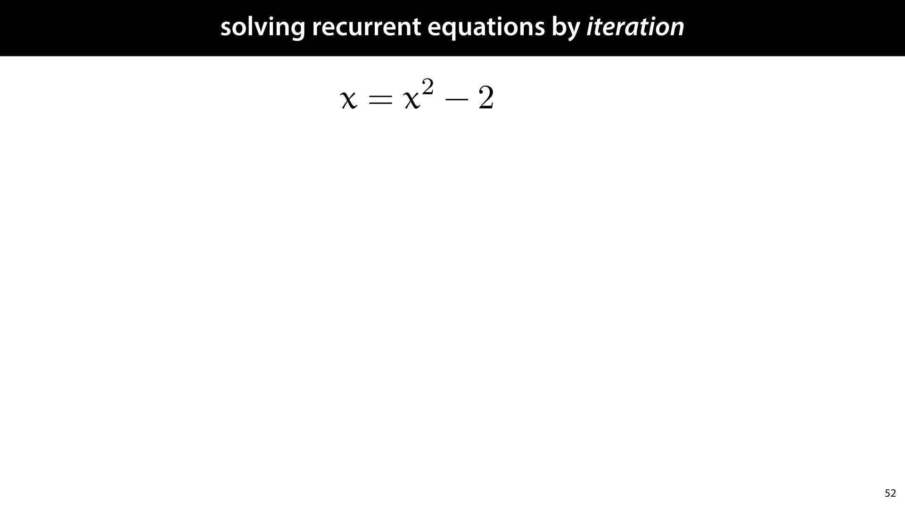

            <figcaption>
            
Of course, random sampling of policy functions is not an efficient search method. How do we get from a recursive definition to the value that satisfies that definition?  

Let's move briefly away from whole functions, and see how we might do something like this when the thing we're looking for is a <strong>single number </strong>x. 

Define x as the value for which x = x2 - 2 holds. This is analogous to the definition above: we have one x on the left and a function of x on the right. 

 Of course, we all learned in high school how to solve this by rewriting, but we can also solve it by <em>iteration</em>. We replace the equals sign by an arrow and write: x &lt;- x2 - 2. We start with some randomly chosen value of x, compute x2 - 2, and replace x by the new value. We iterate this and we end up with a functions for which the definition holds. 
<aside    >Note that in this example infinity also counts as a "solution," so if you pick the wrong starting state you may end up with larger and larger numbers. For other functions, there may be stable states that jump back from one point to another, or even chaotic states (see <a href="https://en.wikipedia.org/wiki/Logistic_map"><strong class="blue">https://en.wikipedia.org/wiki/Logistic_map</strong></a> for more information if you’re interested, but this is not exam material).  </aside>
This is known as the <strong>iteration method</strong> for solving recurrences (recursive definitions). And this approach also works if x is a function instead of a single number.

            </figcaption>
            click image for animation
       </section>

       <section id="slide-053">
            <a class="slide-link" href="https://mlvu.github.io/lecture13#slide-053" title="Link to this slide.">link here</a>
            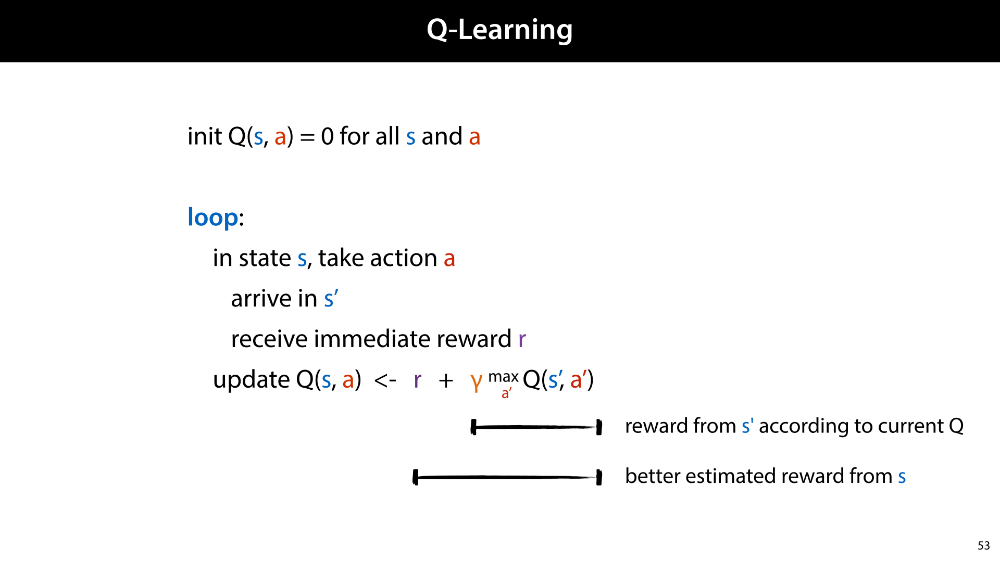

            <figcaption>
            
When we apply this approach to the recursive definition of the optimal Q function, we get the Q-learning algorithm shown here.  

We use some policy to explore the world and we observe the consequences of taking action a in state s. Whenever we do this, we use the recursive definition of Q as an update rule: we compute on the right hand side what Q(s, a) currently is, and we compute  

Note that the algorithm does not tell you how to choose the action. It may be tempting to use your current policy to choose the action, but that may lead you repeat early successes with out learning much about the world.  
<aside    >If the environment allows, you don't even need to follow episodes. You could just jump around to random states and take random actions. </aside><aside    >NB:While we are learning a deterministic policy here, the function that decides which actions to take can be anything, and should contain some randomness. </aside>
 

            </figcaption>
       </section>

       <section id="slide-054" class="anim">
            <a class="slide-link" href="https://mlvu.github.io/lecture13#slide-054" title="Link to this slide.">link here</a>
            

            <figcaption>
            
To see how Q learning operates, we'll go back to the six-state environment. 

Imagine setting a robot in the bottom-left square (A) in the figure shown and letting it explore. The robot chooses the actions up, right, right and when it reaches the goal state (E) it gets reset to the start state. It gets +1 immediate reward for entering the goal state and 0 reward for any other action. 

What we see is that the Q function stays 0 for all values until the robot enters the goal state. At that point Q(C, R) was updated to value one. In the next run, Q(B, R) gets updated to 0.9. In the next run after, Q(A, U) is updated to 0.9 * 0.9.  

This is how Q-learning updates. In every run of the algorithm the immediate rewards from the previous runs are propagated back to their prior states.

            </figcaption>
            click image for animation
       </section>

       <section id="slide-055">
            <a class="slide-link" href="https://mlvu.github.io/lecture13#slide-055" title="Link to this slide.">link here</a>
            

            <figcaption>
            
In contrast to policy gradients, where the standard approach is to follow your current policy, Q-learning completely separates exploration used to learn the Q function and exploitation of the Q function once it’s been learned.  

Any policy that has a sufficient randomness will converge to us learning the same Q function, and once we’ve learned it, we can use it to explore. Epsilon greedy is still a common approach, but you can also get creative, and use , for instance, a pool of explorers from previous training runs to help you explore the current state space.

            </figcaption>
       </section>

       <section id="slide-056" class="anim">
            <a class="slide-link" href="https://mlvu.github.io/lecture13#slide-056" title="Link to this slide.">link here</a>
            

            <figcaption>
            
Here's how Q learning explores the game tree of a game of tic tac-toe. Each episode explores one path from the starting state to a leaf node where the game is finished. As the same states are visited again and again, the information about what conclusions particular states lead to is propagated from the leaves to the root until eventually, we start getting some knowledge about which actions are good in the starting state.

            </figcaption>
            click image for animation
       </section>

       <section id="slide-057">
            <a class="slide-link" href="https://mlvu.github.io/lecture13#slide-057" title="Link to this slide.">link here</a>
            

            <figcaption>
            
The algorithm we've sketched so far requires a <strong>tabular policy</strong>. One that maps every state to the action to take in that state, or to a probability distribution over actions. 

            </figcaption>
       </section>

       <section id="slide-058">
            <a class="slide-link" href="https://mlvu.github.io/lecture13#slide-058" title="Link to this slide.">link here</a>
            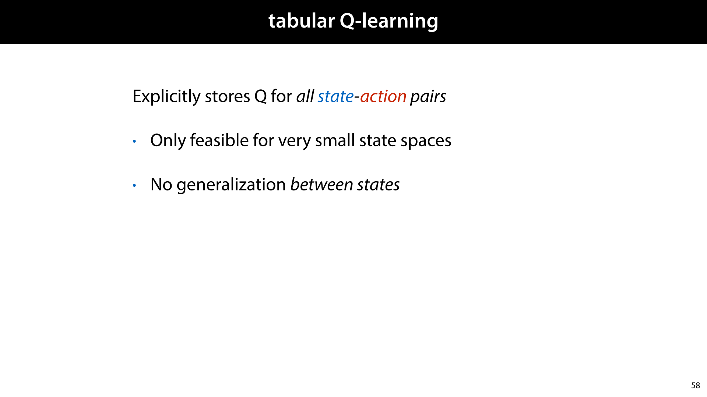

            <figcaption>
            
The main idea behind Deep Q learning is that we can take the policy network, and instead of  softmaxing the outputs and interpreting them as a distribution on the actions, we can use a linear activation, and interpret it as a prediction of the Q value. For a given input s, we take the output for action a to be an estimate of the value Q(s, a). 

We can then take the same output rule we used in tabular Q learning, and apply it here. On a high level, the rule states that the network produces Q(s, a) for a particular state-action pair, but what it <em>should have produced</em> is r + γ max Q(s’, a’).  

In tabular Q learning, we compute this value which the network should have produced, and replace it by the old value. With a neural network that is not so easy to do. But what we can do, is nudge the network a little closer to producing the value it should have produced. We just set the righ-hand-side as the target value of the network, compute a loss between what it did produce and what it should have produced (for instance the squared difference between the two) and we backpropagate the loss. 

            </figcaption>
       </section>

       <section id="slide-059" class="anim">
            <a class="slide-link" href="https://mlvu.github.io/lecture13#slide-059" title="Link to this slide.">link here</a>
            

            <figcaption>
            
Here how that might look in the tic-tac-toe example. 

We play a game, usually by an epsilon greedy following of our current policy. After each move we make, we observe a reward, and we compute a target value for our network. This consists of the observed reward r, and the discounted future reward in the new state s’. The first we can observe directly. In this case, it's 0 because we have not yet finished the game. The second, we can compute if we feed the new state to the policy network. We were going to this anyway, to compute the next move, so it's no extra computation. The network computes all Q values for all actions a' we can take in state s'. All we need to do is take the maximum, and use that to compute our target value. 

We add these together and this becomes a target value for the output node corresponding to a, the action we took. We compute the difference between this output and the output we observed (by some loss function) and we can backpropagate. 
<aside    >In the Atari project, Minh et al used the squared error between the output of the network and the target shown here as the loss function. </aside>
Note the difference with policy gradients: there we had to keep our intermediate values in memory until we’d observed the total reward for the episode. Here, we can immediately do an update after we’ve made our move (and the one after it). This is because we don't wait until the end of the episode to work out what the future holds. In essence, <strong>we use the Q network to predict the future for us. </strong>Then we update based on the current immediate reward, and whatever future rewards the network predicts for us.  

At first, this second term is just random noise, and we're only teaching the network to predict immediate rewards. However, as the network gets better at predicting immediate rewards, the second term becomes a better predictor of future rewards as well. 

Note the benefit of the neural network over the tabular policy. Because it can generalize over states, the future rewards don't just get better over the states it's explicitly visited. Tabular Q-Learning needs to visit the whole state graph mulrtiple times to get a complete picture. Deep Q Learning can generalize to parts of the state graph it has never visited. 
<aside    >Note also that the outputs of the network aren't probabilities (unlike those of the policy network we used in the policy gradients method. This is because the do not represent probabilities: they represent an estimate of the future discounted reward for taking action a in state s. This means that the Q network should not have a softmax activation like the policy network does.</aside><aside    ></aside>
            </figcaption>
            click image for animation
       </section>

       <section id="slide-060">
            <a class="slide-link" href="https://mlvu.github.io/lecture13#slide-060" title="Link to this slide.">link here</a>
            

            <figcaption>
            
These slides hopefully give you an overview of the basic mechanisms of deep reinforcement learning. However, if you want to use these algorithms to do more than learn to play tic-tac-toe, You’ll need to know a lot more tricks of the trade. Reinforcement learning is one of those domains that requires a lot of experience to make it work well.  

<a href="http://dlvu.github.io"><strong class="blue">Our lectures in the master course deep learning</strong></a> provide more details on the extra methods you need to use in addition to the base gradient estimators like policy gradients and Q-learning. 

<a href="https://spinningup.openai.com/en/latest/index.html"><strong class="blue">OpenAI spinning up</strong></a> is a good website that goes through all of this information step by step and tells you what you need to know to write implementations yourself. 

And finally, <a href="https://gym.openai.com/"><strong class="blue">OpenAI gym</strong></a> is a nice resource that saves you the considerable effort of writing an environment yourself. You can just download many different environments and focus on writing a policy networks together with a training method.

            </figcaption>
       </section>

       <section id="slide-061">
            <a class="slide-link" href="https://mlvu.github.io/lecture13#slide-061" title="Link to this slide.">link here</a>
            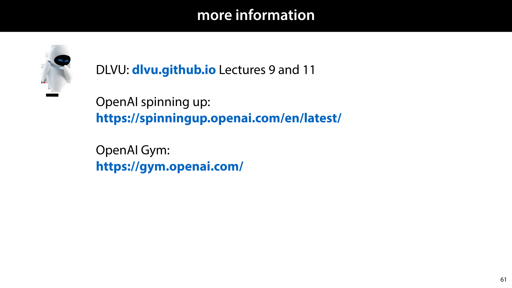

            <figcaption>
            
source: <a href="https://warandpeas.com/2016/10/09/robot/"><strong class="blue">https://warandpeas.com/2016/10/09/robot/</strong></a>

<a href="https://warandpeas.com/2016/10/09/robot/"><strong class="blue"></strong></a>

            </figcaption>
       </section>

       <section class="video" id="video-061">
           <a class="slide-link" href="https://mlvu.github.io/lecture13#video-61">link here</a>
           <iframe
                src="https://www.youtube.com/embed/R4souHAdRP4"
                title="YouTube video player"
                frameborder="0" allow="accelerometer; autoplay; clipboard-write; encrypted-media; gyroscope; picture-in-picture"
                allowfullscreen>
           </iframe>

       </section>

       <section id="slide-062">
            <a class="slide-link" href="https://mlvu.github.io/lecture13#slide-062" title="Link to this slide.">link here</a>
            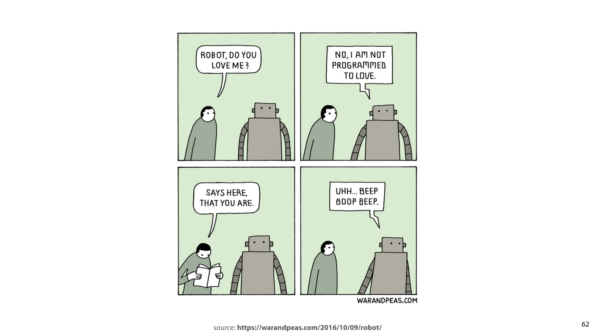

            <figcaption>
            
So far, we've assumed that we have no control over the environment we're learning in. All we can do is take an action, and observe the result.  

This is not always true. In many cases, we have some, or even perfect access to the transition function and the reward. Consider, for instance the case of playing a game like tic-tac-toe or chess against a computer opponent. We don't have to play a single game from start to finish, never considering alternatives or trying different approaches. We can actually explore different paths and try different approaches to see what the consequences are.  

We can use this during training to try and explore the state space more efficiently. We can also use it during<em> in production</em> (for instance when we are playing a human opponent) to make our policy network more powerful: we try different moves observe what a computer player would do, and search a few moves ahead. In general, this is a good way to improve the judgements made by a policy network. 

In general, we'll call such methods tree search. From the perspective of the agent, the space of possible future scenarios has the shape of a tree: all the actions we can take, all the states that can follow those actions, all the actions we can take in all of those states and so on. If we have access to the state transition function, or a good simulation of it, we can use that to explore the state space ahead of us a little bit before comitting to an action. 

<lnbr></lnbr>

            </figcaption>
       </section>

       <section id="slide-063">
            <a class="slide-link" href="https://mlvu.github.io/lecture13#slide-063" title="Link to this slide.">link here</a>
            

            <figcaption>
            
The combination of deep reinforcement learning and tree search has led to one of the most important breakthroughs in AI in recent years.  In 2016 AlphaGo, a Go playing computer developed by the company DeepMind beat the world champion Lee Sedol. Many AI researchers were convinced that this AI breakthrough was at least decades away. 

image source: <a href="http://gadgets.ndtv.com/science/news/lee-sedol-scores-surprise-victory-over-googles-alphago-in-game-4-813248"><strong class="blue">http://gadgets.ndtv.com/science/news/lee-sedol-scores-surprise-victory-over-googles-alphago-in-game-4-813248</strong></a>

<a href="http://gadgets.ndtv.com/science/news/lee-sedol-scores-surprise-victory-over-googles-alphago-in-game-4-813248"><strong class="blue"></strong></a>

            </figcaption>
       </section>

       <section id="slide-064">
            <a class="slide-link" href="https://mlvu.github.io/lecture13#slide-064" title="Link to this slide.">link here</a>
            

            <figcaption>
            
The main concept we will be building on in this section is the <strong>game tree</strong>. This is a tree with the start state at the root. Its child nodes are the states that can be reached in one move by the player who moves first. For each of these children all their children are the states that can be reached by the player who moves second, and so on until we get to the leaf nodes: those states where the game has ended.  
<aside    >Even for a game as simple as tic tac toe, the full game tree is too big to show in a slide like this. What we've shown here is just a small part of the full tree. </aside>
The key idea to tree search methods is that by exploring this tree, from the node representing the current state of the game, we can reason about which moves are likely to lead to better outcomes. 
<aside    >This is similar to the state space we get when we cast this as a reinforcement learning problem but not quite the same. In that case we only see states where the opponent has moved, so only half of these nodes are states the the RL agent would observe.</aside><aside    ></aside>
            </figcaption>
       </section>

       <section id="slide-065">
            <a class="slide-link" href="https://mlvu.github.io/lecture13#slide-065" title="Link to this slide.">link here</a>
            

            <figcaption>
            
Since even the tic tac toe game tree is too complex to fully plot, we will use this game tree as a simple example. It doesn't correspond to any particular realistic game, but you can hopefully map the idea presented here to the move realistic game trees of tic tac toe, chess and go.

            </figcaption>
       </section>

       <section id="slide-066">
            <a class="slide-link" href="https://mlvu.github.io/lecture13#slide-066" title="Link to this slide.">link here</a>
            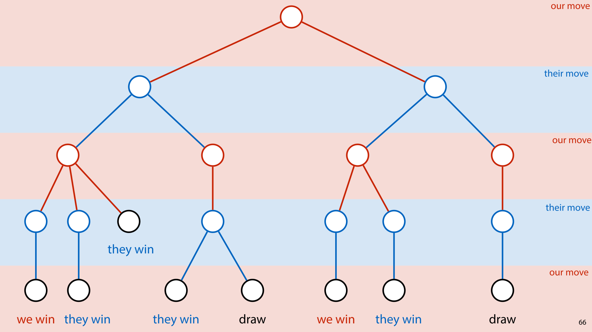

            <figcaption>
            
Since we're using Go as a target for these methods, here is some intuition about how Go works. The rules are very simple: players (black and white) move, one after the other, placing stones on a 19 by 19 grid. The aim of the game is to have as many stones on the board, when no more stones can be placed. The only way to remove stones is to encircle your opponent. 

The general structure of this game is the same as tic-tac-toe or chess: it's: 

<strong>two player</strong>, <strong>turn-based</strong> 

<strong>perfect information</strong>, both players can see all there is to know about the state of the game by looking at the board. 

<strong>zero sum</strong> if one player loses, the other wins and vice versa. If a state is good for one player it is precisely equally<em> bad</em> for the other player. 

The reason Go was considered so difficult to solve compared to chess was simply that the game tree was so broad and deep: at any given point a player must choose between hundred of possible moves and and a game has 211 turns on average. Compare this to chess, which has about 20 possible moves at any one point and lasts about 40 moves on average. 
<aside    >It's sometimes said that the sheer number of possible positions in Go is larger than the number of atoms in the universe and that that is what. makes it so difficult. This is partly misleading and partly false. The number of possible chess positions is also vast (1046 possible distinct positions and 10120 nodes in the game tree, with the number of atoms in the universe somewhere in between) and we managed to solve that just fine without any learning at all. </aside><aside    >What makes Go so difficult is partly it breadth. The number of possible moves per turn is what makes it impossible to search the full tree even two moves ahead moves ahead. Moreover, humans seem to use a kind of visual intuition to break through this complexity which is very hard to capture in simple rules, which suggests that learning may be a worthwhile approach.</aside><aside    ></aside>
            </figcaption>
       </section>

       <section id="slide-067">
            <a class="slide-link" href="https://mlvu.github.io/lecture13#slide-067" title="Link to this slide.">link here</a>
            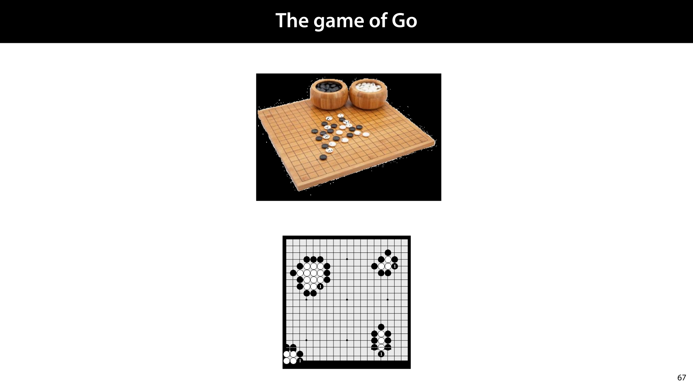

            <figcaption>
            
We'll look at a few simple methods of tree search. These by themselves are not reinforcement learning methods. They aren't even learning methods in any meaningful way. All of them just explore the game tree as much as possible, and try to come up with a good move.  

This is how many of the earliest game playing engines worked: they just search the game tree from the current state, return a good move and play it. The opponent plays their move, and they start the whole process again. 

For each of them we will first see how they work by themselves, and then we will see how we can use them to improve an existing policy during play, and how to use it during training to improve a policy network. 

            </figcaption>
       </section>

       <section id="slide-068" class="anim">
            <a class="slide-link" href="https://mlvu.github.io/lecture13#slide-068" title="Link to this slide.">link here</a>
            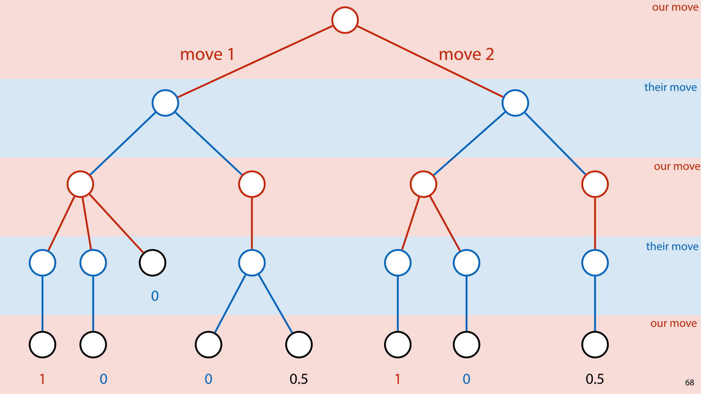

            <figcaption>
            
We start with a simple, but powerful idea: <strong>random rollouts</strong>. 

First, we label the leaf nodes with their value. This is 1 if we win in that node, 0.5 if there is a draw, and 0 if the opponent wins.  
<aside    >In the previous sections we used -1, 0 and 1 as rewards, but the difference is arbitrary for almost all algorithms. The current values serve to make the exposition clearer when we get to the MCTS algorithm. </aside>
In this picture, we have the next move, so we need to decide between move 1 and move 2.  

The way random rollouts work is that for every node we reach by one of the moves we're considering, we simply simulate a series of random games starting at that node. This means that we just play random moves for both players until we reach a leaf node. This is called a <strong>random rollout</strong>. We then average all the values we get at the end of each rollout per starting node. In this example, we get -2/3 for move 1, and 0 for move 2. We take thise as estimates for the values of the two nodes we reach by playing the two moves. 

In this case, the node following move 2 gives us the highest estimated value, so we choose to play move 2. 

            </figcaption>
            click image for animation
       </section>

       <section id="slide-069">
            <a class="slide-link" href="https://mlvu.github.io/lecture13#slide-069" title="Link to this slide.">link here</a>
            

            <figcaption>
            
Here is the algorithm in pseudocode. 

It may seem a little mysterious why random rollouts work at all against a non-random player, since these random games will be so different. One way to think about it is that we're evaluating different <em>subtrees. </em>If the subtree below node 1 has many more leaf nodes where we win, than the subtree below node2, then it can't be <em>too</em> bad to move to node 1, since at the very least there are many opportunities to win from that node.  

Perhaps the opponent is too smart to let us get to any of those opportunities, but for such a simple method it gives us a pretty good opportunity. 

            </figcaption>
       </section>

       <section id="slide-070">
            <a class="slide-link" href="https://mlvu.github.io/lecture13#slide-070" title="Link to this slide.">link here</a>
            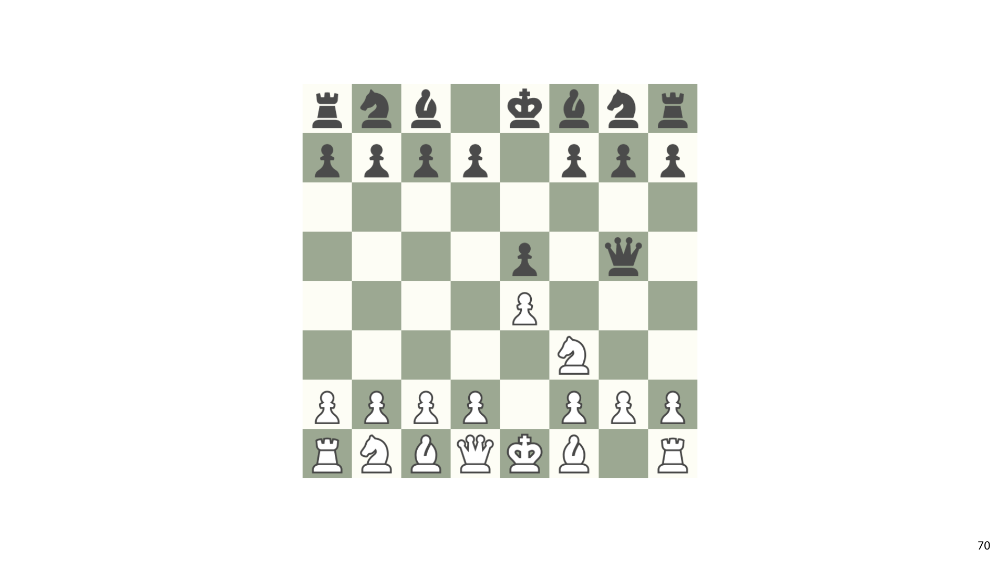

            <figcaption>
            
Here is an illustration for why even random play can be informative. Chess is a particularly illustrative example, since random play is very unlikely to end in anything but a draw. 

In this chess position, black has just made a tremendous blunder, but moving its queen in the path of the white knight. White can take the queen with no repercussions. Can random rollouts identify that this is a good move? 

If white doesn't take the queen, and moves, say, one of its pawns instead, all the rollouts from that point are games with equal material, and they will likely  all end in a draw. If white takes the queen, all random rollouts are played with a massive material advantage for white, and even though most of them will still end in a draw, the probability that we will see a few checkmates increases. With enough random rollouts, we should be able to tell the difference. 

Of course, the difference is still minimal, and for such an obviously good move, we'd like to draw our conclusions a little quicker.

            </figcaption>
       </section>

       <section id="slide-071">
            <a class="slide-link" href="https://mlvu.github.io/lecture13#slide-071" title="Link to this slide.">link here</a>
            

            <figcaption>
            
To improve rollouts, and tree search methods, we can re-introduce two functions we've seen already in the context of Q learning: policies and value functions. 

Here, we will not give them a particular definition. A policy function just maps all states to a distribution. This could be used to simulate the behavior of a particular agent, or it could be used to represent the probability of winning from a particular state. A policy will mean different things in different contexts. 

The same goes for a value function. In Q learning the value was specifically defined as the expected future reward for playing a policy. Here, we'll just define it as anything that assigns a value to all states.  

This allows us to use policy functions and value functions as simple heuristics to improve our search. For instance, we could define a policy function that plays entirely randomly, but assigns a little more probability to moves that capture a piece. Likewise with the value function: we could write simple value function that assigns -1, 0 and 1 to lost, drawn and won states respectively, but assigns values in [-1, 0] for states where the opponent has a material advantage, and states in [0, 1] for states where we have a material advantage. 
<aside    >Another difference is that policies in reinforcement learning were only defined from the perspective of one player. There are simple fixed for this. If we have a policy for white in chess, we can, for instance simply invert the board (making white pieces black and vice versa) to get a policy for black. The precise details depend on what the implementation looks like, but the zero sum nature of these games means that a good policy for one player is always automatically also a good policy for another player. The move player 1 likes a move, the less player 2 likes it.</aside><aside    ></aside>
            </figcaption>
       </section>

       <section id="slide-072" class="anim">
            <a class="slide-link" href="https://mlvu.github.io/lecture13#slide-072" title="Link to this slide.">link here</a>
            

            <figcaption>
            
If we now look at the random rollout algorithm again, we see that we are implicitly already using a very simple policy and a very simple value function. The policy function we are using is simply a fully random one. And the value function is one that only assigns non-zero values to leaf nodes. 

We can now improve the algorithm by replacing these with a better policy function and a better value function to improve the rollouts. 

            </figcaption>
            click image for animation
       </section>

       <section id="slide-073">
            <a class="slide-link" href="https://mlvu.github.io/lecture13#slide-073" title="Link to this slide.">link here</a>
            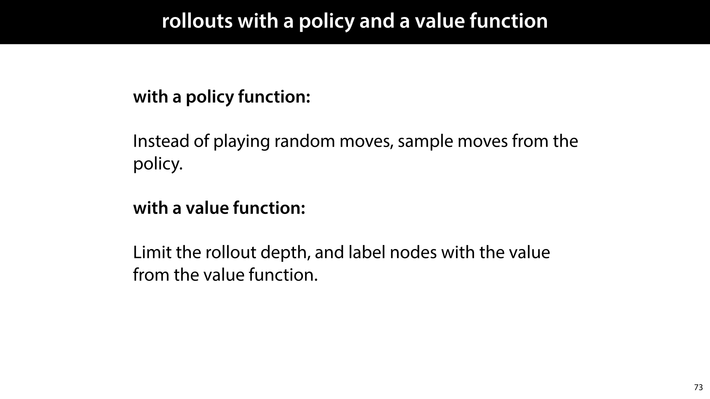

            <figcaption>
            
We replacing the random moves with moves sampled from the policy. As noted before, it's usually a simple matter to turn a policy for player 1 into a similar policy for player 2. 

If we have a value function, what we can do is limit the depth of the rollout (either to a fixed value or a random one). This allows for faster rollouts, meaning that we can do more rollouts in the same time, but it also allows us to recognize that we have an advantage without going through all the highly particular steps of the endgame. In particular in a game like chess, it's unlikely that a mostly random policy will find a checkmate, but if we have a strong material advantage, the value function can let us know that much earlier. 

            </figcaption>
       </section>

       <section id="slide-074" class="anim">
            <a class="slide-link" href="https://mlvu.github.io/lecture13#slide-074" title="Link to this slide.">link here</a>
            

            <figcaption>
            

            </figcaption>
            click image for animation
       </section>

       <section id="slide-075" class="anim">
            <a class="slide-link" href="https://mlvu.github.io/lecture13#slide-075" title="Link to this slide.">link here</a>
            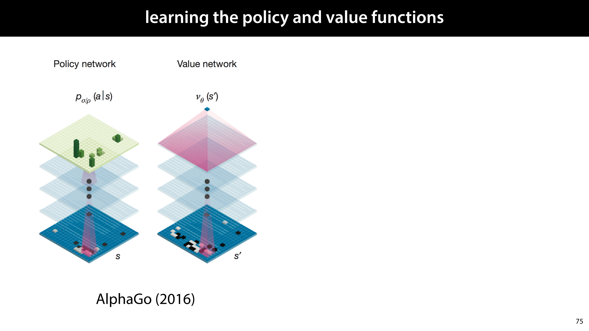

            <figcaption>
            
Of course, these policy and values functions don't need to be hand-written. They can also be <strong>learned</strong>. And this is where we start to connect reinforcement learning to tree search. 

These are rough illustrations of the network structures that DeepMind used for their first AlphaGo instance. Both treated the Go board as a grid, passing it through a series of convolutional layers. The policy network then outputs the same grid, softmaxing it to provide a probability distribution over all the positions where the player can place a stone. The value network uses an aggregation function to reduce the output to a single numerical value. 

Using the methods we've already discussed, like policy gradients, q-learning, and imitation learning, these networks can then be trained to provide a decent, fast player (the policy network) and a good indication of the value of a particular state. 
<aside    >In Q learning we trained a policy network and a value network in one. We didn't discuss how to train a value network through policy gradients. The idea used by DeepMind in the first AlphaGo was that the value network V predicts for state s the value of the game played from s by the policy against itself. That is, we simply observe a game of the policy network playing against itself and afterwards we assign the result as the target that V should predict for s. </aside><aside    >In this sense, the two networks are linked. The value network predicts the value for the current policy. It's unclear from the paper whether in this version of AlphaGo the policy network also uses the value network in training, or only plays full games.  </aside>
In a later version, called AlphaZero, the researcher hit on the bright idea of making the lower layers of the two networks <em>shared</em>. The idea here is that the lower layers to neural networks tend to extract generic features that are largely task-independent. By using the same layers for both tasks, these parts of the network get a stronger training signal.

            </figcaption>
            click image for animation
       </section>

       <section id="slide-076">
            <a class="slide-link" href="https://mlvu.github.io/lecture13#slide-076" title="Link to this slide.">link here</a>
            

            <figcaption>
            
Ok, so let's imagine we've managed to train up a policy network and a value network somehow. How do we use the idea of rollouts? 

The first is to use it <strong>during play</strong>. That is, when we're training, we don't use tree search at all, but when the time comes to face off against a human player, we take our policy network and we take our value network and we put them into the rollout algorithm. Then <strong>we play the moves that the rollout algorithm returns</strong>. 

The idea here is that we could play whatever the policy network suggests directly, but with the right hyperparameters, the rollout algorithm should do better than the plain policy algorithm it uses internally. We use the rollout algorithm to <em>improve</em> the policy. 
<aside    >This is more or less how the first AlphaGo worked. It used a different tree search algorithm (which we'll discuss later), but the basic idea was the same: during training use policy gradients and simple reinforcement learning to train a policy network and a value network, and then during play, use those inside a tree network.</aside><aside    ></aside>
            </figcaption>
       </section>

       <section id="slide-077">
            <a class="slide-link" href="https://mlvu.github.io/lecture13#slide-077" title="Link to this slide.">link here</a>
            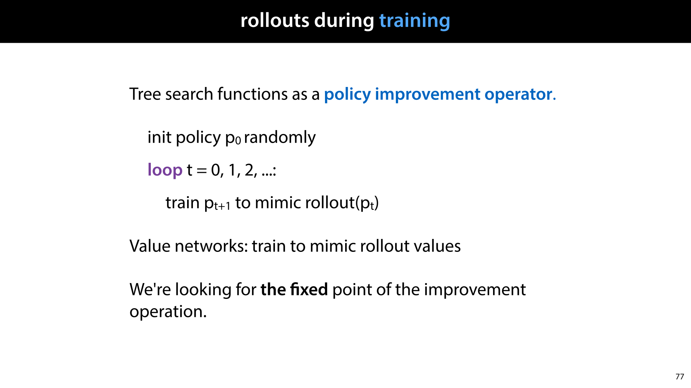

            <figcaption>
            
In contrast to this approach we can also use the tree search<strong> during training</strong>. The key insight here is that if we trust that the move chosen by our policy + rollouts is always better than that chosen by our policy alone, then we can use the move chosen by the rollout algorithm<strong> as a training target</strong>, for the next iteration of our algorithm. 

That is, starting with policy p0, we train the next policy p1 to mimic what the rollout algorithm does when augmented with p1. When this learning has converged (or simply afetr a few steps), we discard p0, and train a new policy p2 to mimic what the rollout algorithm does when augmented with p1, and so on. 

For the value network we can do the same thing. The average value over all the rollouts should be a better value function than the value function we start with, so we can train the next value network to mimic the average values returned by the rollouts using the old value network. 

One benefit of this approach is that it stops working when we have found a fixed point of the policy improvement operator. If the rollout algorithm returns the same move probabilities and values as the policy and value networks we started out with, the policy improvement operator has become useless, and the policy by itself contains all we need. This means that (if we can be sure we've reached a fixed point), we can actually <em>discard</em> the tree search during play, and play only with the policy network, which is a lot faster. 
<aside    >The idea of using tree search as a policy improvent operator during training was introduced in AlphaZero. </aside><aside    ></aside>
            </figcaption>
       </section>

       <section id="slide-078" class="anim">
            <a class="slide-link" href="https://mlvu.github.io/lecture13#slide-078" title="Link to this slide.">link here</a>
            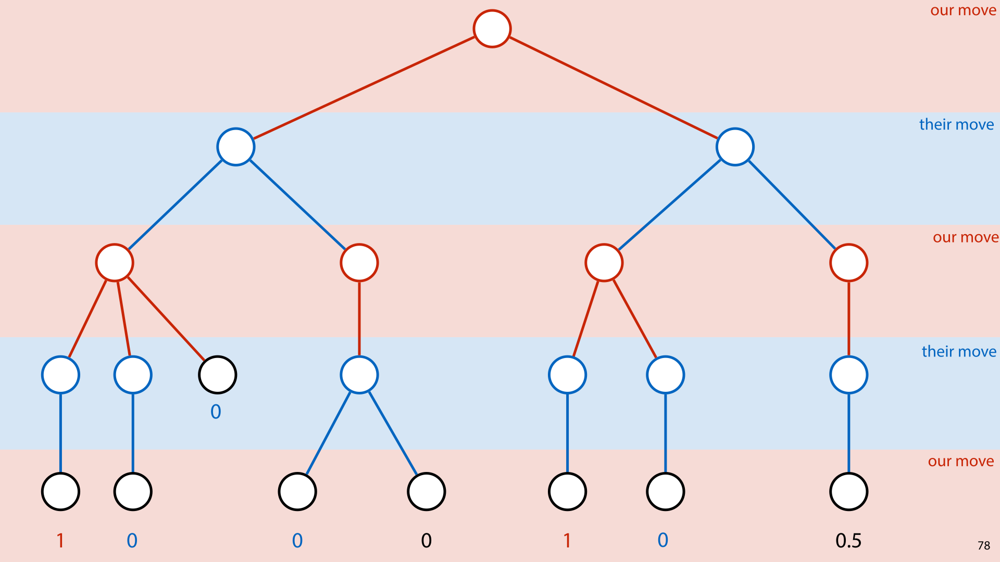

            <figcaption>
            
The next tree search algorithm we'll look at is called minimax. The basic idea here is that if we had sufficient compute to search the whole tree, we should be able to play perfectly: if it's possible to guarantee a win, we should win.  

Assuming that we can search the whole tree, how should we choose our move? The idea of minimax is that the player whose turn it is labels each node <strong>with the best score they can guarantee from that node</strong>. For us, this is the maximum score, and for the opponent, this is the minimum score.  
<aside    >This is why the algorithm is called minimax: we are maximizing the score, and the opponent is minimizing the score. </aside>
For the nodes at the top we have no idea what we can guarantee, but for the nodes one step away from the leaves, it's easy to see. In most of these nodes, it's the opponent's turn, so we know that if we hit these nodes, there is only one move left, and the opponent chooses that. In short, whatever the lowest outcome is among the children, we know that the opponent can guarantee that. 

For instance, in the highlighted node, there are two children, with outcomes 0 and 0.5. The opponent prefers the minimum, so we know that from this node, the opponent can guarantee an outcome of 0, and there's nothing we can do about it. Unless the opponent plays sub-optimally, we know the value of this node is 0.  

With this logic, we can label all nodes that are one opponent move away from the leaf node. No matter what we do, if the opponent plays their best, this is the outcome. Note that some of these nodes still have a value of 1. If we maneuver the opponent into this state, we've already won. Even though they still have a move left, there's nothing they can do to avoid us winning. 

Now that we know the value of these nodes for a fact, we can move up the tree. This time it's our turn. For every parent of a set of nodes whose value we know, we simply label it with the maximum of all the values of the children. Again, in some cases, we cannot avoid a loss, despite the fact that we're in control. 
<aside    >Note that we're always taking the maximum or the minimum. Unlike in rollouts, where we were averaging over all nodes visited, here only one leaf node ultimately decided the value of the internal nodes. </aside>
Moving up the tree like this, we see that despite the fact that there are many branches where we can force a win, if the opponent plays optimally, the can guarantee that we never visit those branches. Unless we get lucky and they make a mistake, the best we can do is to force a draw.

            </figcaption>
            click image for animation
       </section>

       <section id="slide-079">
            <a class="slide-link" href="https://mlvu.github.io/lecture13#slide-079" title="Link to this slide.">link here</a>
            

            <figcaption>
            
Here is a recursive, depth-first implementation of minimax.  
<aside    >Usually breadth-first is a more flexible way to implement minimax, but this leads to the simplest pseudocode. In practice you can also work out that certain parts of the tree don't need exploring (because some player can already guarantee a better score somewhere else that that part of the tree can offer). This is called alpha-beta pruning. </aside><aside    ></aside>
            </figcaption>
       </section>

       <section id="slide-080">
            <a class="slide-link" href="https://mlvu.github.io/lecture13#slide-080" title="Link to this slide.">link here</a>
            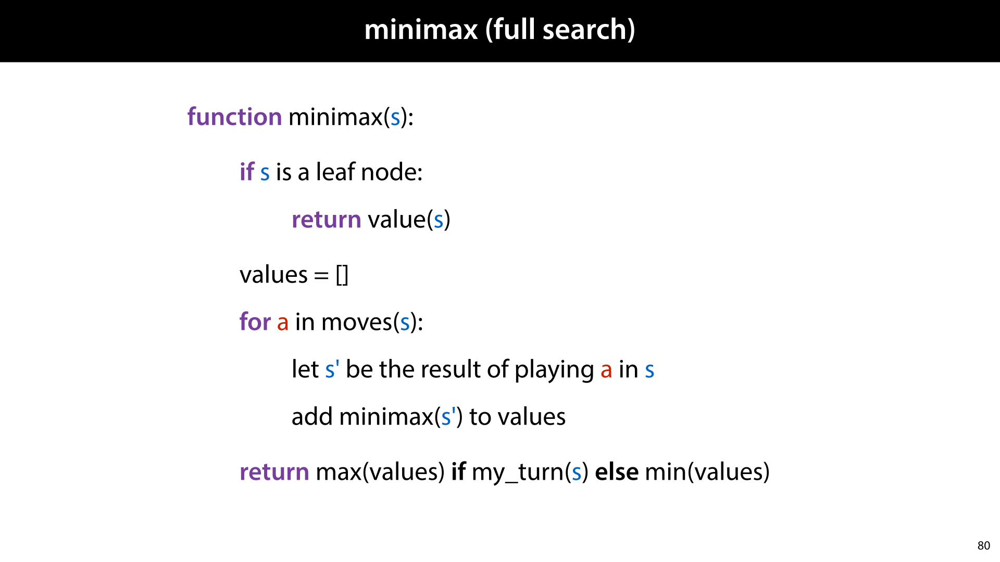

            <figcaption>
            
In practice, tic-tac-toe is about the only game for which you can realistically search the whole game tree. In practice, we limit our search to a subtree. 

The traditional way to do this is with a value function. We search the whole tree but only up to a maximum depth. At this depth, we use the value function to label the nodes, and then work these back up the tree. 
<aside    >This simple algorithm formed the basis for Deep Blue, the first chess computer to beat a grandmaster. IBM simply spent a lot of time developing a very strong, hand tuned value function, and then built custom hardware to implement the minimax algorithm very efficiently. </aside>
It's less popular in combination with minimax, but we could also include a policy function here. This could, for instance allow us to prioritize certain nodes over others, searching them first. In real chess matches, time is a factor, so chess computers need to search as much of the tree as they can, within a particular time limit. A policy function can help us determine which moves are more likely to yield good results.

            </figcaption>
       </section>

       <section id="slide-081">
            <a class="slide-link" href="https://mlvu.github.io/lecture13#slide-081" title="Link to this slide.">link here</a>
            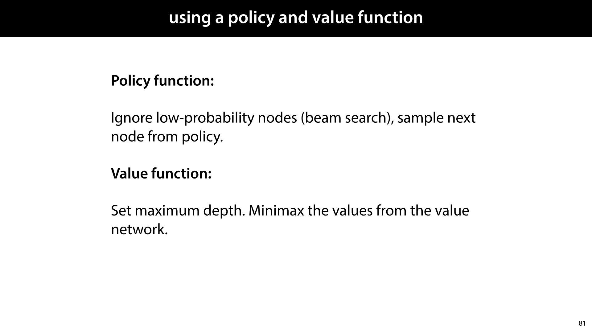

            <figcaption>
            
If we have learned policies and value functions, we can use the same approaches we used before. We can train the policy and value network using basic reinforcement learning, and then during play, given them a little boost by using them to search the game tree with minimax. 

But, we can also use minimax as a policy improvement operator. If we can trust that the moves chosen, and the values assigned by minimax are really better than those of the plain networks by themselves, we can simply set them as targets for a new iteration of the policy and value network. 

            </figcaption>
       </section>

       <section id="slide-082" class="anim">
            <a class="slide-link" href="https://mlvu.github.io/lecture13#slide-082" title="Link to this slide.">link here</a>
            

            <figcaption>
            
As you may have concluded yourself already, minimax and rollouts are at something of a spectrum. Minimax search the whole tree. Using a value function and a policy, we can limit this search to a subtree. Rollouts is the most extreme case of searching just a subtree: we search only a single path, but, we do it multiple times and average the results. We can, of course, come up with a variety of algorithms that are somewhere in between: always searching subtrees probabilistically, and repeating the search to reduce variance. 

One of the more elegant algorithms to combine the best of both worlds is<strong> monte carlo tree search </strong>(MCTS). Here's how it works.  

We will build a subtree of the game tree in memory step by step. At first this will be just the root node, which we will extend with one child at a time. Each node, we will label with a probability: the times we've won from that node, over the total times we've visited that node. At the start this value is 0/0 for the root node, and there are no other nodes in the tree. 

We then iterate the following four steps 

<strong>Selection:</strong> select an unexpanded node. At first, this will be the root node. But once the tree is further expanded we perform a random walk from the root down to one of the leaves. 

<strong>Expansion: </strong>Once we hit a leaf, we add one of its children to the tree, and label it with the value 0/0 

<strong>Simulation:</strong> From the expanded child we do a rollout. 

<strong>Backup</strong>: If we win the rollout let v = 1 otherwise v = 0. For the new child and everyone of its parents update the value. If the old value was a/b, the new value is a+v / b+1. The value is the proportion of simulated games crossing that state that we’ve won. This could be with a policy and a value network, or just a random rollout down to a leaf. 
<aside    >Backup is sometimes. called backpropagation, which is not to be confused with the backpropagation used in neural networks. </aside><aside    ></aside>
            </figcaption>
            click image for animation
       </section>

       <section id="slide-083" class="anim">
            <a class="slide-link" href="https://mlvu.github.io/lecture13#slide-083" title="Link to this slide.">link here</a>
            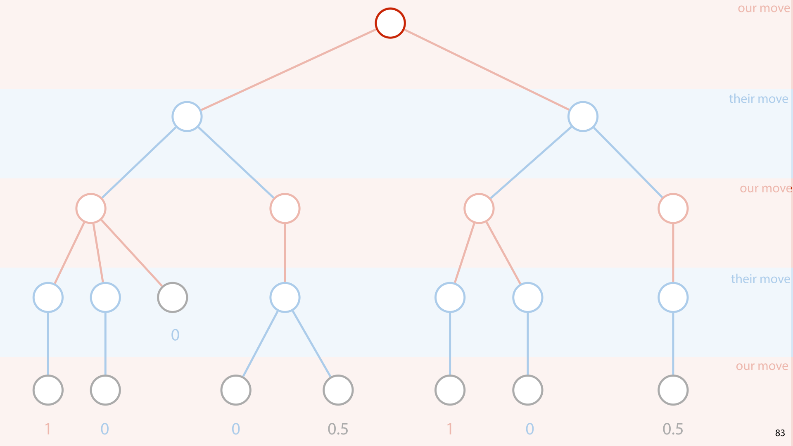

            <figcaption>
            
In the next step we expand another node. This could be any child of a node already expanded. Currently, we have three options, the two children of the node we just added, of the second child of the root node. 
<aside    >We could choose a node uniformly at random, or according to the values of the nodes we have so far established. This is an exploration/exploitation tradeoff, and a large part of using MCTS effectively boils down to making this tradeoff carefully. The most common techniques are too technical for this course, but <a href="https://en.wikipedia.org/wiki/Monte_Carlo_tree_search"><strong class="blue">the wikipedia article on MCTS</strong></a> provides some pointers. </aside>
We proceed as before: we do a random rollout from the new node, observe whether we've won the rollout and update the values of all ancestors of the current node: we always increment the number of times visited by one, and the number of wins only if we won the rollout. If we drew (as in this case), we increment by 0.5.

            </figcaption>
            click image for animation
       </section>

       <section id="slide-084" class="anim">
            <a class="slide-link" href="https://mlvu.github.io/lecture13#slide-084" title="Link to this slide.">link here</a>
            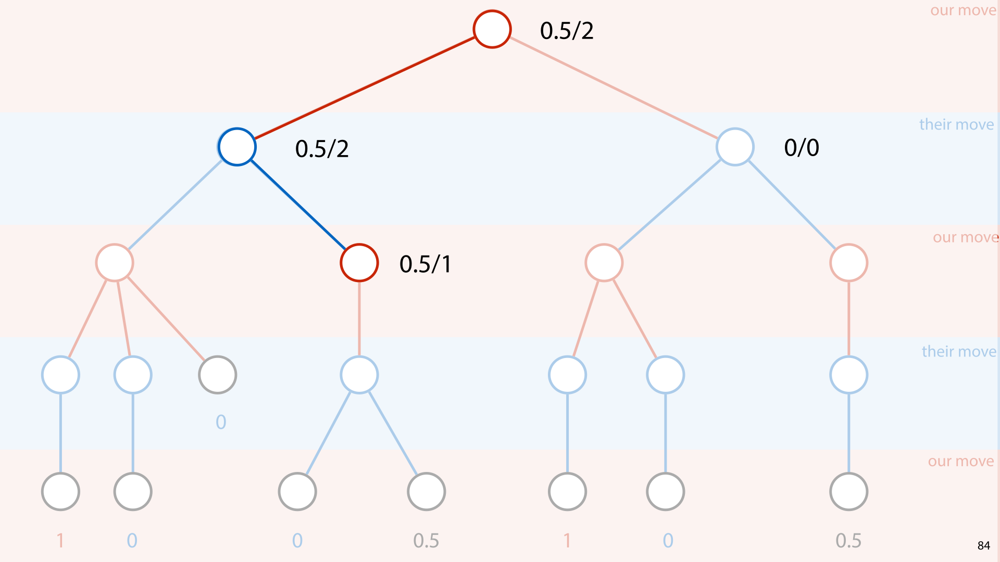

            <figcaption>
            
In the next iteration, we again add a node. Note that we again have three options for nodes to add. We pick the second child of the root node.  

We do another rollout and this time we win.  

Note how the values are backed up: only the newly expanded node and the root note change their values, but<strong> not the other two nodes in the tree</strong>. 

You can think of the values on each node as an estimate of the probability of winning when starting at that node. The other two nodes were not part of this path, so their estimates aren't affected by the trial.

            </figcaption>
            click image for animation
       </section>

       <section id="slide-085">
            <a class="slide-link" href="https://mlvu.github.io/lecture13#slide-085" title="Link to this slide.">link here</a>
            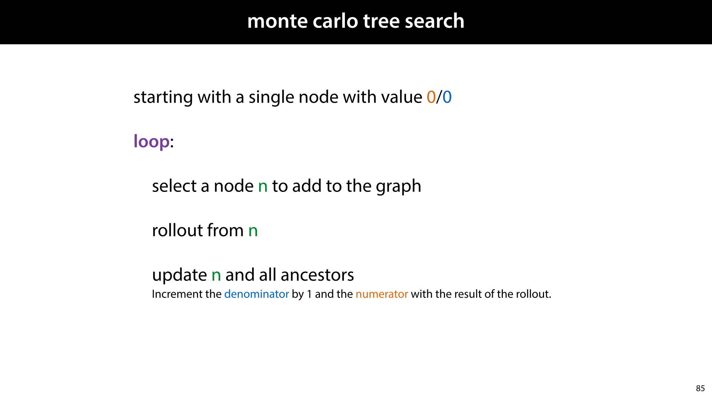

            <figcaption>
            
After iterating for a while (usually determined by the game clock), we have both a value for the root node, and an idea of what the best move is (the one that leads to the child node with the highest value).

            </figcaption>
       </section>

       <section id="slide-086" class="anim">
            <a class="slide-link" href="https://mlvu.github.io/lecture13#slide-086" title="Link to this slide.">link here</a>
            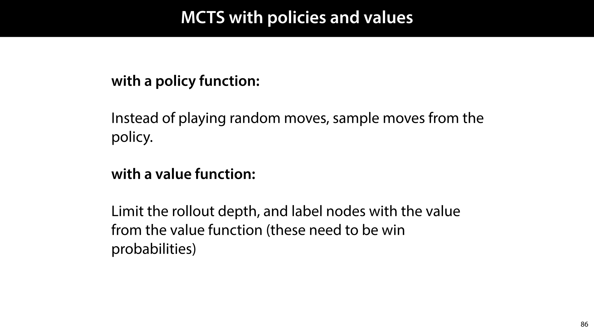

            <figcaption>
            
The way we insert a policy function and a value function into MCTS is the same as it was for the plain rollout algorithm. We replace the random rollout with a policy rollout and we use the value function by limiting the rollout depth and backing up the values provided by the value function. This works best if the values can be interpreted as win probabilities (i.e. they're between 0 and 1).

            </figcaption>
            click image for animation
       </section>

       <section id="slide-087">
            <a class="slide-link" href="https://mlvu.github.io/lecture13#slide-087" title="Link to this slide.">link here</a>
            

            <figcaption>
            
Again, we can use MCTS during play to boost the strength of the learned policy and value networks. This is what the original AlphaGo did when it beat Lee Sedol in 2016. 

But, as before, we can also view MCTS as a way of improving a given policy and value function. The strategy is exactly the same as before, each new iteration is trained to mimic the behavior of the MCTS used with the previous iteration. 

            </figcaption>
       </section>

       <section id="slide-088">
            <a class="slide-link" href="https://mlvu.github.io/lecture13#slide-088" title="Link to this slide.">link here</a>
            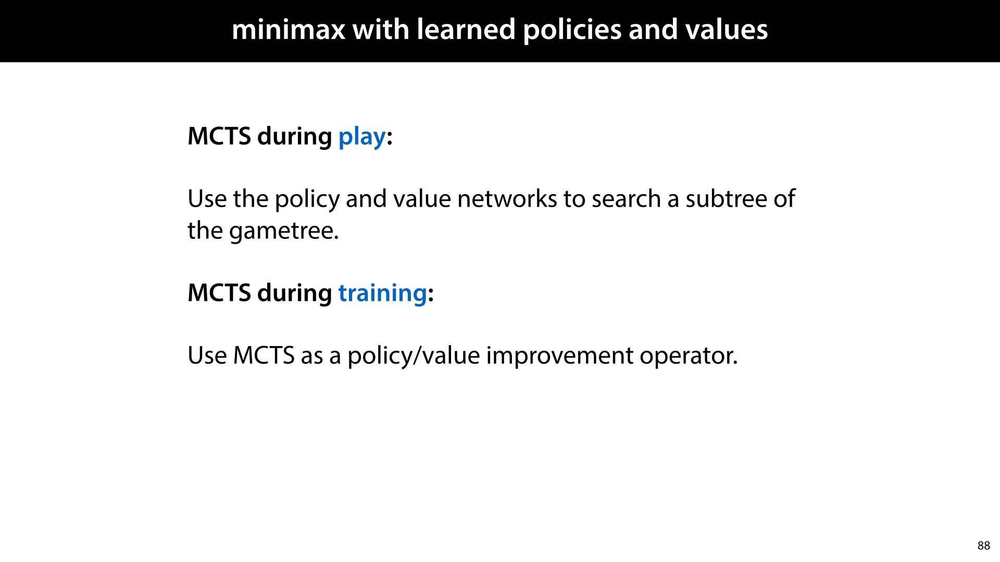

            <figcaption>
            
These were the basic ingredients of the first AlphaGo. It used two policy networks, a fast one and a slow one, and a value network. These were first trained by imitation learning from a large database of Go games, and then by self play, using reinforcement learning. 

After training, during gameplay, the performance was boosted by using the policy and value networks in a complicated MCTS algorithm. 

            </figcaption>
       </section>

       <section id="slide-089">
            <a class="slide-link" href="https://mlvu.github.io/lecture13#slide-089" title="Link to this slide.">link here</a>
            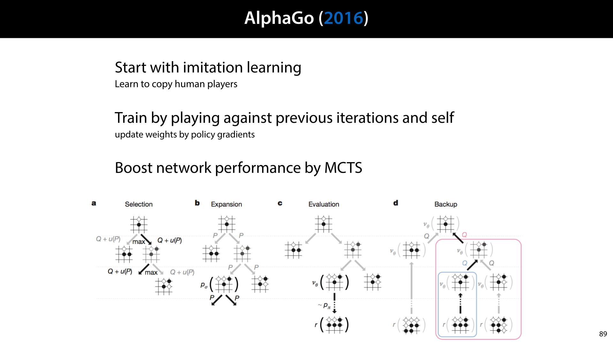

            <figcaption>
            

            </figcaption>
       </section>

       <section id="slide-090">
            <a class="slide-link" href="https://mlvu.github.io/lecture13#slide-090" title="Link to this slide.">link here</a>
            

            <figcaption>
            
In 2017, DeepMind introduced an updated version: AlphaZero. The key achievement of this system is that it eliminated imitation learning entirely. It could learn to play go entirely from scratch by playing against itself. DeepMind also showed that the same tricks could be used to learn Chess and Shogi (a Japanese game that is similar to chess). 

Deepmind indicated in their paper that these were the main improvements they introduced in AlphaGo. 

The first two, we have already discussed. 

Residual connections and batch normalization are two basic tricks for training deeper neural networks more quickly. It is likely that they simply weren't available or well enough understood at the time of the first Alphago. These are not specific to reinforcement learning, and can be used in any neural network.

            </figcaption>
       </section>

       <section id="slide-091">
            <a class="slide-link" href="https://mlvu.github.io/lecture13#slide-091" title="Link to this slide.">link here</a>
            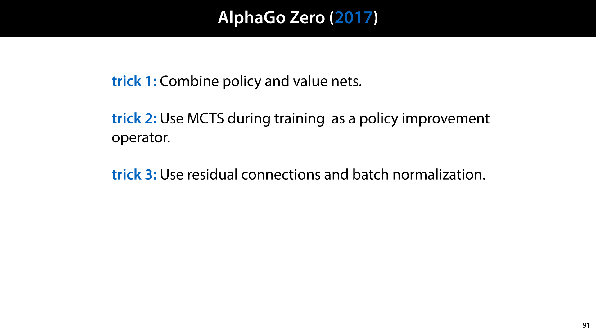

            <figcaption>
            
After 21 days of self-play (on a large computing cluster), AlphaZero surpassed the performance of the version that beat Lee Sedol.

            </figcaption>
       </section>

       <section id="slide-092">
            <a class="slide-link" href="https://mlvu.github.io/lecture13#slide-092" title="Link to this slide.">link here</a>
            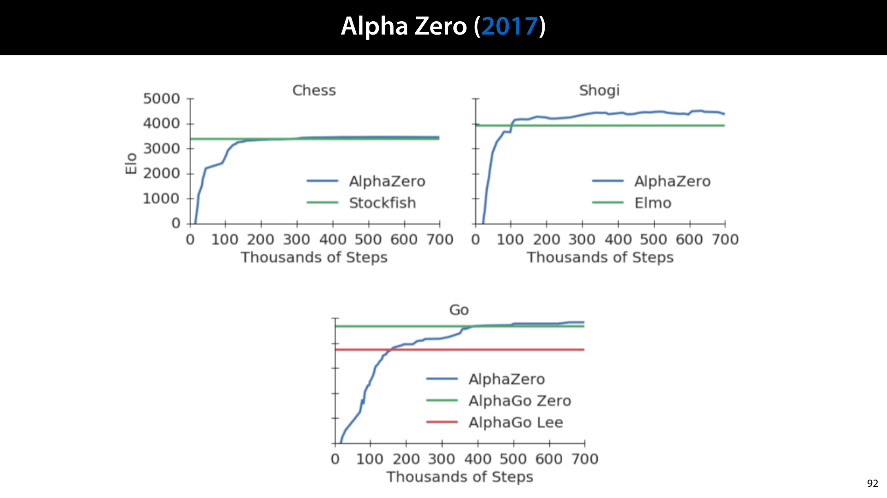

            <figcaption>
            

            </figcaption>
       </section>

       <section class="video" id="video-092">
           <a class="slide-link" href="https://mlvu.github.io/lecture13#video-92">link here</a>
           <iframe
                src="https://www.youtube.com/embed/fh2aozmj2F4"
                title="YouTube video player"
                frameborder="0" allow="accelerometer; autoplay; clipboard-write; encrypted-media; gyroscope; picture-in-picture"
                allowfullscreen>
           </iframe>

       </section>

       <section id="slide-093">
            <a class="slide-link" href="https://mlvu.github.io/lecture13#slide-093" title="Link to this slide.">link here</a>
            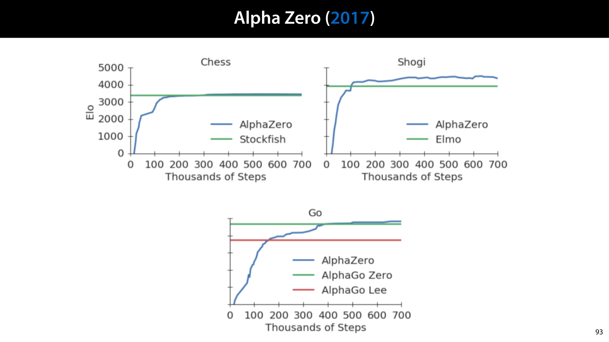

            <figcaption>
            
In the previous videos on social impact, we’ve looked primarily at sensitive attributes and parts of the population that are particularly at risk of careless use of machine learning. 

In this final social impact video, we’ll zoom out a bit, and look at the ways society <em>as a whole</em> may be at risk. 

<lnbr></lnbr>

            </figcaption>
       </section>

       <section id="slide-094" class="anim">
            <a class="slide-link" href="https://mlvu.github.io/lecture13#slide-094" title="Link to this slide.">link here</a>
            

            <figcaption>
            
Since the 1950s, people have been talking about artificial intelligence: the idea that we may build automata that have cognitive abilities, rivalling that of humans. In fiction, examples of this are often very human in appearance: they are embodied in human bodies and they function very much the way humans do, if with a slightly metallic voice. The more more imaginative examples were AI’s like 2001’s HAL, which embodied a space ship rather than a humanoid body, and spoke with a natural voice. Nevertheless, it still represented a single, quite human intelligence. And the peril in that movie, still came from the intelligence behaving against the interests of the humans in a direct, adversarial way. 

As we began to solve some of the problems of intelligence, the intelligent software that entered our lives did not take the form of robotic housemaids, but of simpler tool, far less intelligent tools that could augment our intelligence. A search engine is good example: it has no deep intelligence, but it helps us to use our own intelligence more effectively. This is the use of intelligent software that has rapidly increased since the 1990s. 

A few years ago, machine learning researcher Michael Jordan coined the phrase <strong>Intelligent Infrastructure</strong> to capture the era we are entering now. An era when human-level intelligence is still some way off, but more and more components of of our national and international infrastructure are being replaced by semi-autonomous, intelligent components. These include: 

Tax services automatically generating candidates for fraud investigations. 

Hospitals automatically assigning risk profiles to patients to allocate doctor’s time. 

Recommender systems highlighting relevant news stories and analysis 

Banks predicting the risk of loan defaults and setting the interest rates accordingly.   

Infrastructure here refers not just to the flow of traffic, although that’s included, but also to the flow of people in general, the flow of money and most importantly the flow of  of information. Like artificial intelligence, intelligent infrastructure comes with risks. But here the risk is not so simple as the AI not opening the pod bay doors when we tell it to. The risks come primarily from unintended consequences that stay hidden, and are difficult to measure.  

An intelligent infrastructure is not a system that is built and tested all at once. It’s something that emerges step by step as people replace human decision making with automated decision making. It’s not just controlled by engineers, but also by project managers, third parties, company managers. At the largest level, the network doesn’t even come under the control of one government. Even if Europe gets ahead of the curve, large parts of the infrastructure we use may be hosted in the US, or in China, where different rules apply and different levels of oversight are possible. 

 

 

image source: photo by Ian Beckley from Pexels 

            </figcaption>
            click image for animation
       </section>

       <section id="slide-095">
            <a class="slide-link" href="https://mlvu.github.io/lecture13#slide-095" title="Link to this slide.">link here</a>
            

            <figcaption>
            
These are probably the three main categories of issues to be wary of  when you’re working on some piece of infrastructure that will make decisions automatically. 

We’ve seen examples of each already, in the lectures in general and in the previous social impact videos. We’ll look at some new examples to highlight the risks specifically from the perspective of intelligent infrastructure.

            </figcaption>
       </section>

       <section id="slide-096" class="anim">
            <a class="slide-link" href="https://mlvu.github.io/lecture13#slide-096" title="Link to this slide.">link here</a>
            

            <figcaption>
            
We’ll start with a classic example. In the early 90s, Pittsburgh Medical Center started a project to investigate ways to make their health care more cost effective: to achieve better results with the same resources. One thing they decided to focus on was community acquired pneumonia (CAP). A lung infection acquired from other people outside of the hospital.  

Pneumonia is sometimes relatively benign and sometimes leads to sudden and quite severe adverse reactions, and even death. The reasoning was that if risk factors could be identified that predicted such highly adverse reactions, patients could be monitored in a more effective way, and perhaps deaths could be prevented. 

The researchers trained a rule based system: a type of machine learning that learns discrete if-then rules that hold for a majority of the data. Such systems are less popular today, since their performance tends to be much lower than that of modern methods, but they do have one advantage. If you keep the number of rules small, the model becomes very easy to inspect. You can see exactly what your model has learned in a very interpretable format. 

One of the rules the model learned was this one: <strong>patients with asthma had a much</strong><em> lower</em><strong> risk of developing strongly adverse affects from pneumonia.</strong> 

This was a counter-intuitive result. Asthma is a lung condition, and any doctor will tell you that catching pneumonia is much more dangerous for an asthmatic person than for others. What happened here, was that doctors and asthmatic patients were already being much more careful. Patients with asthma know that they should be more watchful for signs of pneumonia, and doctors know that such patients require more active care. 

Nevertheless, if the result had been less obviously wrong, if we had trusted the system blindly, or if we had used a neural network which would not have allowed us to inspect it in this way, we would have ended up lowering our vigilance for the most at-risk part of our population. 

This is yet another example of our data coming from a biased distribution, like the planes in world war 2: we are not seeing what would happen to asthma patients if they were treated the same as everybody else, so our inference is biased. Here, as then, our <strong>predictions</strong> are entirely accurate: we can predict very well where planes coming back will be hit, and we can predict very accurately what will happen to asthmatic patients admitted to hospital with signs of pneumonia. 

What’s going wrong are the <strong>actions</strong> we take based on that prediction. More often than not, this is not a conscious choice and we simply confuse accurate predictions with sound actions.

            </figcaption>
            click image for animation
       </section>

       <section id="slide-097" class="anim">
            <a class="slide-link" href="https://mlvu.github.io/lecture13#slide-097" title="Link to this slide.">link here</a>
            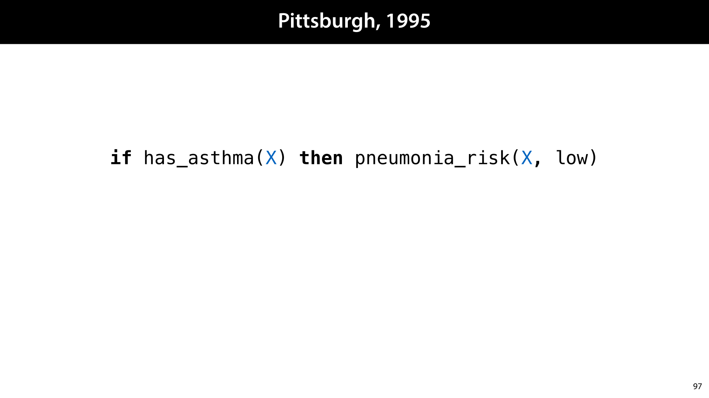

            <figcaption>
            
If we take a situation like this, and misinterpret what the predictions mean, not only do our actions cause harm, like reducing vigilance for vulnerable patients, we should also consider how our actions then affect the bias of the data we are creating from then on. When actions change the data, which is then used to inform future actions, we are in danger of creating <strong>feedback loops</strong>. 

To help us understand the impact of our actions, we can try to sketch out the basic positive and negative feedbacks happening between different aspects of the system. This is just a hypothesis, there's no direct proof that this is a correct model of the system, but it may help us to see potential problems before the happen. 

Before we introduce our system, there is positive feedback from having Asthma to the hospital staff being more vigilant. This improves outcomes. When we train our system it picks up on the resulting correlation, and having asthma leads to a better predicted outcome. This is a correct inference. 

However, if we use that prediction to take action naively, we reduce the vigilance of doctors towards asthma patients, worsening the outcomes. 

            </figcaption>
            click image for animation
       </section>

       <section id="slide-098" class="anim">
            <a class="slide-link" href="https://mlvu.github.io/lecture13#slide-098" title="Link to this slide.">link here</a>
            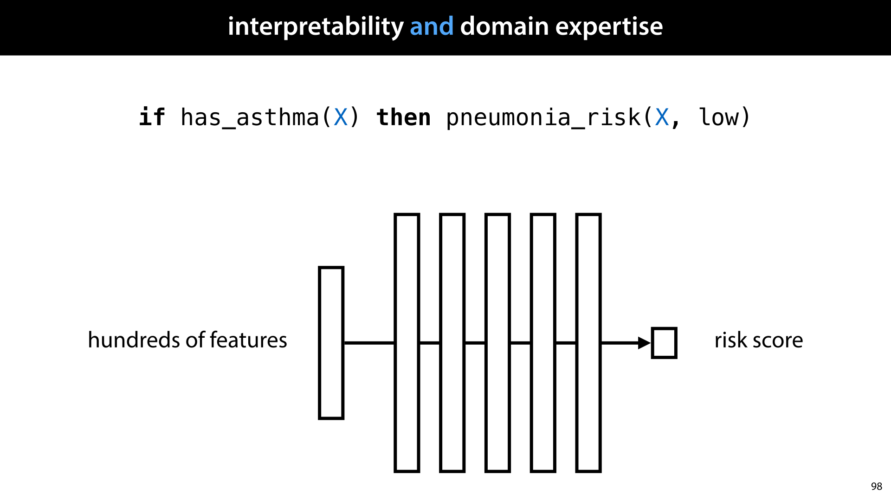

            <figcaption>
            
In this case, there are two important factors stopping this feedback loop from being put into production, and costing lives. First the fact that a rule based system was used. This allowed us to inspect what the system was learning and to pick up on the fact that a counter-intuitive rule was coming out. 

Second, the fact that domain experts were consulted, in this case, doctors. A doctor can look at rules like these and tell you that they’re wrong, which helps you to see that you’ve made a fundamental mistake in your  reasoning. In this case the people most affected by the system, asthma patients, would also have been to tell you this. We call the people that are affected by the system <strong>stakeholders</strong>, and the people who study the domain of the data  <strong>domain experts</strong>. Both should be consulted in the design of a system. 

Note that domain experts and stakeholders can only be involved if the system is made interpretable in some way. That doesn’t mean your model needs to consist of discrete rules, but it does mean that you somehow need to make the behavior of your system inspectable for people that don’t have a machine learning background. How to do this is an active area of research.

            </figcaption>
            click image for animation
       </section>

       <section id="slide-099">
            <a class="slide-link" href="https://mlvu.github.io/lecture13#slide-099" title="Link to this slide.">link here</a>
            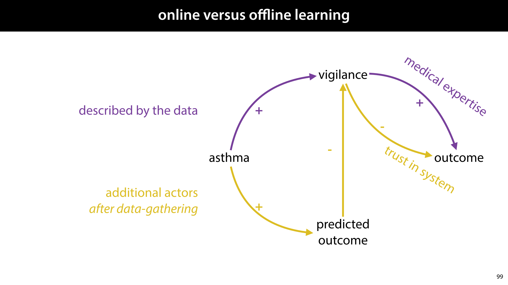

            <figcaption>
            
A key problem here is that when we are using offline learning to make predictions, we are taking our data as a static snapshot of the world.  

That snapshot may accurately describe the world, but only the world <strong>without our system in it</strong>. Once we take actions based on the predictions, our system  becomes an additional actor in the world, and our data does not represent the world with that actor in it.  

In theory, we could deploy the system, gather more data, retrain the system. deploy and repeat. If we’re lucky, the system will eventually converge to a stable state where it has the right idea about how asthma influences the outcome. We have a positive and a negative feedback loop, so these could balance out. But it only learns this after it has reduced vigilance for a sizeable number of patients, likely costing lives. 

            </figcaption>
       </section>

       <section id="slide-100" class="anim">
            <a class="slide-link" href="https://mlvu.github.io/lecture13#slide-100" title="Link to this slide.">link here</a>
            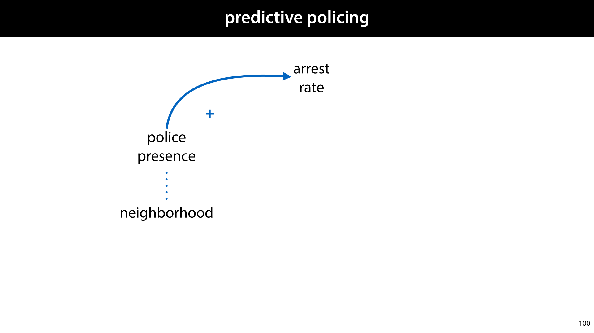

            <figcaption>
            
Here is another example, <strong>predictive policing</strong>. This is strongly related to the profiling question we discussed in the last social impact video, but it shows that we have a problem even if we take race out of the equation.  

If we increase the police presence in a particular neighborhood, that will increase the arrest rate. Regardless of whether it’s a tranquil or crime-ridden neighborhood, the more police, the more arrests. 

Imagine that we want to train a model to predict where the crime in a city is most likely to appear. We don’t know exactly where crime is most likely, since many crimes go undetected. An obvious measure to use instead is the number of arrests in a neighborhood. This is called a<strong> proxy measure</strong>: something that doesn’t quite measure what you want to measure, but is close enough, and is easier to measure accurately. In this case, it’s quite likely that people use arrest rate as a proxy for crime rate without realizing that they’re doing it. 

Of course, you know where this is going. If we build a predictor that includes the neighborhood as a feature, and predicts the arrest rate, we end up with a system that, accurately, predicts high arrest rates for neighborhoods with police presence. If we then interpret arrest rate as crime rate and increase police presence in areas where the predicts predicts more arrests, we just end up increasing the disparity in police presence between neighborhoods. If there is some bias to start with in neighborhood police presence, we end up compounding the problem.  

Note that this is a case where gathering more data and retraining will not solve the problem. We only have positive feedback loops, so if we blindly follow the system, every time we retrain, we end up with more concentration of the police presence, until all the police and all the arrests are in one neighborhood in the city. The system will be making perfect predictions at that point, but it’s unlikely to lead to a safer city.

            </figcaption>
            click image for animation
       </section>

       <section id="slide-101">
            <a class="slide-link" href="https://mlvu.github.io/lecture13#slide-101" title="Link to this slide.">link here</a>
            

            <figcaption>
            
All this shows an important difference between reinforcement learning and classical offline learning. A reinforcement learning model has the option to model itself as an agent in the world. It learns to act rather than to predict, so in theory, it can control the consequences of its actions, even if those actions change the distribution of the data.

            </figcaption>
       </section>

       <section id="slide-102">
            <a class="slide-link" href="https://mlvu.github.io/lecture13#slide-102" title="Link to this slide.">link here</a>
            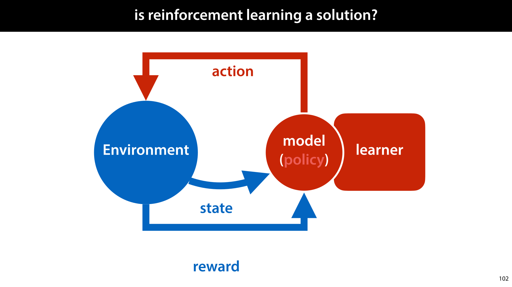

            <figcaption>
            
Of course all of this is easier said than done. Just letting a neural network loose in the world and letting it learn by optimization is unlikely to make the world a safer place. 

First of all, such an algorithm learns by <strong>exploration</strong>: it needs to try things and observe the consequences. Basically, it learns by making mistakes, and usually lots of them. Letting it reduce the vigilance on asthmatic pneumonia patients may eventually lead to sounds actions, but if we let it do this in the real world, it will take a long time before it figures out things that we already know. Safe reinforcement learning is an active field, but it’s in its infancy. 

Another thing we need to worry about, is that the model works on an accurate model of the world. Imagine a self-driving car should given the objective to get to its destination as fast as possbile without running red lights. If its red light detector is a neural network, then we need to make sure that it doesn’t optimize its performance by getting <em>wors</em>e at detecting red lights. After all, if its red light detector doesn’t fire, it can get to its destination a lot faster. 

<strong>Finally</strong>, and most importantly, reinforcement learning still optimizes a <strong>single metric</strong>. If we pick that metric wrongly, we can still build a very dangerous system. Take the predictive policing case. We could build a reinforcement learning system to maximize the arrest rate, but what we’re actually interested in minimizing the crime rate. These are not the same thing, and maximizing the arrest rate is much more likely to lead to police nuisance than to actual reductions in crime.

            </figcaption>
       </section>

       <section id="slide-103">
            <a class="slide-link" href="https://mlvu.github.io/lecture13#slide-103" title="Link to this slide.">link here</a>
            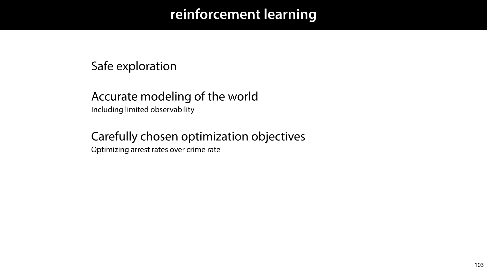

            <figcaption>
            
Another example is student evaluations: taken together with other metrics, these can help to paint a complete picture of a teacher’s performance. If, however, we look only at evaluations, then we are just pressuring teachers to make students happy. For instance, setting too easy an exam, to reduce the possibility of complaints. 

            </figcaption>
       </section>

       <section id="slide-104">
            <a class="slide-link" href="https://mlvu.github.io/lecture13#slide-104" title="Link to this slide.">link here</a>
            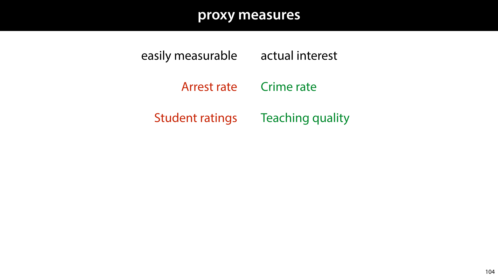

            <figcaption>
            
A relevant adage here is Goodhart’s law, which is usually stated in the more pithy phrasing of Marilyn Strathern. Often a proxy measure is a really good way to measure what we’re interested in. So long as the proxy and the true quantity are correlated and we’re a bit careful, we can get quite a good idea of what’s going on and where the potential improvements are. The problem happens when we put pressure on people to minimize or maximize the proxy measure. Then it stops being a reliable indicator of what we’re actually trying to measure. 

For instance,  in many cases the arrest rate in a neighborhood may be a reasonable proxy for the crime rate.  It’s not perfect, but it’s often close enough, especially when we look at different factors like income, substance abuse and financial security as well. However, often the police is actively pressured to either minimize the arrest rate (to show that crime has reduced), or to maximize it (to show that progress is being made). In that case, the crime rate stops being a useful proxy, and we need to look to other measurements to see if the pressure is actually working, or if people are just fudging the statistics, or even worse, arresting people that shouldn’t be arrested.

            </figcaption>
       </section>

       <section id="slide-105">
            <a class="slide-link" href="https://mlvu.github.io/lecture13#slide-105" title="Link to this slide.">link here</a>
            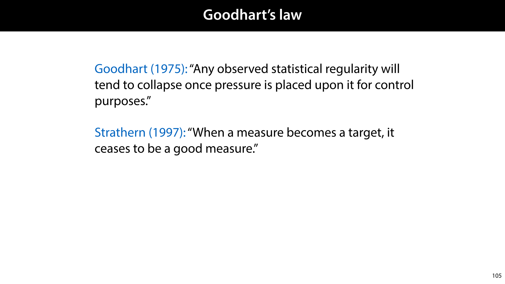

            <figcaption>
            
Here’s another example: “chuggers,” short for charity muggers, are the people with clipboards that charities use to get people to donate in the street. 

Before deciding to employ these tactics, the charity likely kept an eye on how many people sign up to donate. This is an important measure for a charity: it indicates how much income they get, how able they are to survive, to affect change and also how positive people feel about them. 

However, the implementation of a tactic like this is likely based on a violation of Goodhart’s law. The charity decides to employ chuggers, and sees an uptick in registrations concluding that the method must work. In doing so, they forget that donations are just a proxy measure for what they actually care about. If one in twenty people sign up to donate, we’ll get an uptick in donations, but what about the nineteen people that didn’t sign up? If they were annoyed by the chugger, their appreciation of the charity will be diminished. They will come away thinking less of the charity, and being less receptive to its message in the long run. 

This illustrates an important effect behind many instances of Goodhart’s law being violated: we care about many different things that are hard to measure, so we end up optimizing for a single thing that is easy to measure. 

In many ways, people with machine learning and computer science backgrounds are at an extra risk of this, since they are so used to optimizing for single metrics.

            </figcaption>
       </section>

       <section id="slide-106" class="anim">
            <a class="slide-link" href="https://mlvu.github.io/lecture13#slide-106" title="Link to this slide.">link here</a>
            

            <figcaption>
            
A strongly related problem is the<strong> McNamara fallacy</strong>. Robert McNamara was the US secretary of Defence for most of the sixties and oversaw a large part of the Vietnam war. 

McNamara was an early pioneer of data driven management, first as a manager at Ford, and then in the US government. During the Vietnam war, the focus was entirely on measurable metrics. Often such gruesome ones as the numbers of Vietcong and US soldiers killed. All processes and policy decisions were shaped around such statistics. This had two detrimental effects. 

First, it ignored things that were difficult to measure, such as the Vietnamese sentiment towards the US, which turned the general population against the US, and towards the Vietcong. 

Second, it incentivised the military to present positive numbers. This lead to generals putting arbitrary caps on what numbers of enemy troops could be reported, and redrawing categories like the army command structure to make the progress of the war look better, so that congress would commit to more sending more troops abroad. 

For more than a decade, the data suggested that the US was winning the war. And, then, in the early 70s, around the time Goodhart first formulated his principle, the US was forced to withdraw from the war. 

In short, since quantitative measurement is such a powerful tool, it can become addictive, to the point where only easily measured quantities are used to guide policies and decisions. 

source: <a href="https://www.forbes.com/sites/jonathansalembaskin/2014/07/25/according-to-big-data-we-won-the-vietnam-war/?sh=33dc487f3f21"><strong class="blue">https://www.forbes.com/sites/jonathansalembaskin/2014/07/25/according-to-big-data-we-won-the-vietnam-war/?sh=33dc487f3f21</strong></a> 

            </figcaption>
            click image for animation
       </section>

       <section id="slide-107">
            <a class="slide-link" href="https://mlvu.github.io/lecture13#slide-107" title="Link to this slide.">link here</a>
            

            <figcaption>
            
Here’s another example, a little closer to home. Somewhere in the early 2010s, executives at YouTube decided that they shouldn’t optimize their recommendation algorithm for clicks on videos, they should instead optimize for the total amount of time people spent watching video.  

This was, in general, a good idea: it’s a better proxy measure. Optimizing for clicks lead to people using clickbait titles and thumbnails, with little content behind it. Optimizing for viewing time requires video makers to put the work into the content of the video, and to keep users watching, if they want to be promoted by the youtube recommender system. But, it’s still a proxy measure.  

What’s more, youtube set an arbitrary goal of a billion hours of video watched per day. They didn’t just make hours watched the objective for the recommendation algorithm, they made it the objective for the company as a whole. Reading interviews from people working for Youtube at the time shows how overriding this target was in all decisions. 

            </figcaption>
       </section>

       <section id="slide-108">
            <a class="slide-link" href="https://mlvu.github.io/lecture13#slide-108" title="Link to this slide.">link here</a>
            

            <figcaption>
            
Youtube boosted its recommendation engine with deep neural networks and reinforcement learning. All with a single goal: to increase engagement. To keep people watching. 

The precise effects are difficult to ascertain. Youtube is not forthcoming with details about its algorithm, and researchers only began to study the system quantitatively from the outside in around 2019, by which time Youtube seemed to have already tempered its hunger for engagement. 

Nevertheless, in the years between 2012 and 2019, youtube faced an extreme amount of scrutiny from the media. Its recommender system was recommending unsuitable content to children, favouring more politically extreme content, and doing everything it could to keep people hooked on its videos.  

sources: 

<a href="https://www.bloomberg.com/news/features/2019-04-02/youtube-executives-ignored-warnings-letting-toxic-videos-run-rampant"><strong class="blue">https://www.bloomberg.com/news/features/2019-04-02/youtube-executives-ignored-warnings-letting-toxic-videos-run-rampant</strong></a> 

<a href="https://www.nytimes.com/2018/03/10/opinion/sunday/youtube-politics-radical.html"><strong class="blue">https://www.nytimes.com/2018/03/10/opinion/sunday/youtube-politics-radical.html</strong></a> 

 

 

 

            </figcaption>
       </section>

       <section id="slide-109">
            <a class="slide-link" href="https://mlvu.github.io/lecture13#slide-109" title="Link to this slide.">link here</a>
            <iframe
                src="https://www.youtube.com/embed/lYcDR8z-rRY?start=4559?modestbranding=1&showinfo=0&rel=0"
                title="YouTube video player"
                frameborder="0" allow="accelerometer; autoplay; clipboard-write; encrypted-media; gyroscope; picture-in-picture"
                allowfullscreen>
            </iframe>

            <figcaption>
            
By contrast, here is Neil Hunt chief strategy officer at Netflix, in 2014 giving a keynote about the content strategy at Netflix.  

source: <a href="https://youtu.be/lYcDR8z-rRY?t=4559"><strong class="blue">https://youtu.be/lYcDR8z-rRY?t=4559</strong></a> 

 

 

 

 

            </figcaption>
       </section>

       <section id="slide-110">
            <a class="slide-link" href="https://mlvu.github.io/lecture13#slide-110" title="Link to this slide.">link here</a>
            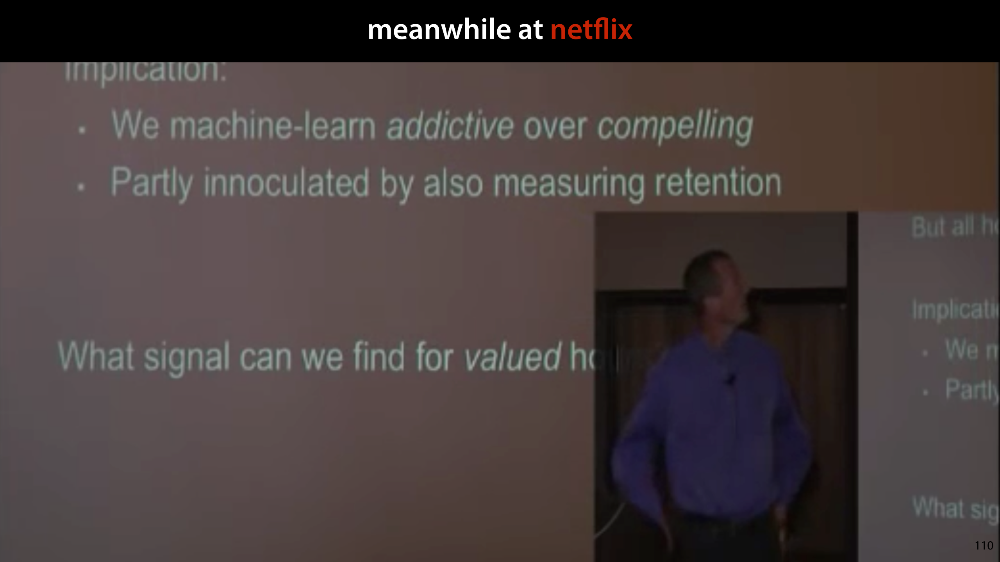

            <figcaption>
            
Note that he explictly talks about: 

The tradeoff between optimizing for new customers and keeping your existing customers happy 

The importance of non-measurable metrics like word-of-mouth. 

That Netflix doesn’t optimize for total hours viewed. Since this is proportional to the average, optimizing for it means paying disproportionate attention to outliers: the people who are already spending hours and hours on your service. Optimizing for the mean focuses your attention on those customers who are spending a moderate amount. 

The fact that the recommender system doesn’t know the difference between <em>addictive</em> and <em>compelling</em> content. One hour of  of content may be a life changing experience, while six hours of bingeing 1990s sit coms may leave you feeling empty and ready to cancel your subscription 

Making your users addicted to your product makes them unhappy in the long term. For a service like Netflix, that is ultimately counterproductive. 

These two very different strategies were followed by Netflix and Youtube more or less at the same time. The picture of Youtube is one of a single-metric strategy being pushed top-down by management, and shaping the corporate culture as well as the algorithms that it produces. 

The Netflix picture is one of  a management that actively thinks about the limitations of its algorithms. About the things it cares about that are difficult, or hard to measure, and even about how its technology is affecting the lives of their customers beyond engagement. 

Of course, Netflix has the luxury position that it’s not driven by advertisements, but then the combination of advertising and recommender systems may itself be part of the problem.

            </figcaption>
       </section>

       <section id="slide-111">
            <a class="slide-link" href="https://mlvu.github.io/lecture13#slide-111" title="Link to this slide.">link here</a>
            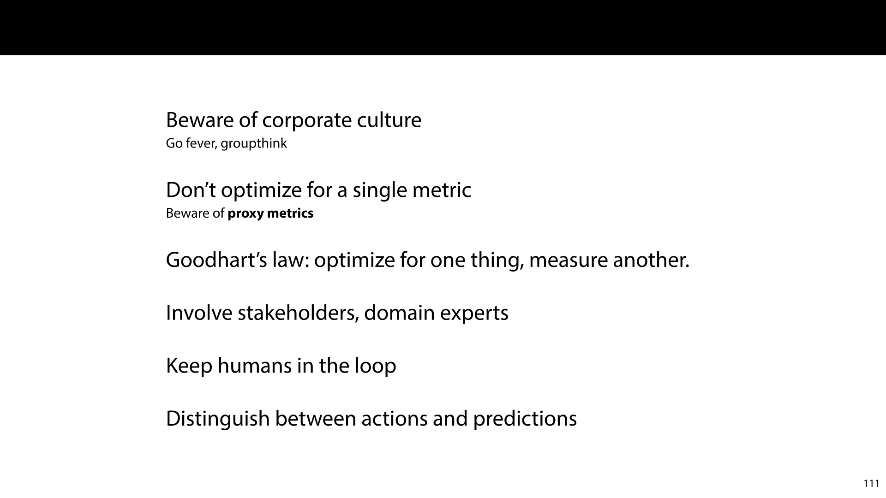

            <figcaption>
            

            </figcaption>
       </section>

       <section id="slide-112" class="anim">
            <a class="slide-link" href="https://mlvu.github.io/lecture13#slide-112" title="Link to this slide.">link here</a>
            

            <figcaption>
            
Many of these effects aren’t new. In fact, Goodhart’s law was first formulated in 1975 long before automated decision making became prevalent. Most of the biases, feedback loops and blind optimization approaches we’ve discussed during these four videos on social impact predate computers and happen just as often in organizations made up purely of human agents. 

The dangers in intelligent infrastructure are in the compounding of all these feedback loops, the lack of human oversight, the monoculture effect of such software being rolled out uniformly across the globe, and finally the danger that each institution optimizes its own systems for local benefits like revenue, without looking at the global effects.

            </figcaption>
            click image for animation
       </section>

       <section id="slide-113">
            <a class="slide-link" href="https://mlvu.github.io/lecture13#slide-113" title="Link to this slide.">link here</a>
            

            <figcaption>
            
Many of the examples in this video were borrowed from <a href="https://www.coursera.org/learn/optimize-machine-learning-model-performance"><strong class="blue">Anna Koop’s coursera course optimizing machine learning</strong></a>, which I highly recommend if you’re interested in building production machine learning systems responsibly.

            </figcaption>
       </section>

</article>
