<nav class="menu">
    <ul>
        <li class="home"><a href="/">Home</a></li>
        <li class="name">Lecture 2: Linear Models and Search</li>
                <li><a href="#video-000">Linear regression</a></li>
                <li><a href="#video-019">Searching for a good model</a></li>
                <li><a href="#video-046">Gradient descent</a></li>
                <li><a href="#video-073">Gradient Descent and Classification</a></li>
        <li class="pdf"><a href="https://mlvu.github.io/lectures/12.LinearModels1.annotated.pdf">PDF</a></li>
    </ul>
</nav>

<article class="slides">

        <section class="video" id="video-000">
            <a class="slide-link" href="http://mlvu.github.io/linear#video-0">link here</a>
           <video controls>
                <source src="https://surfdrive.surf.nl/files/index.php/s/WFvDwltABNZVm60/download" type="video/mp4" />

                Download the <a href="https://surfdrive.surf.nl/files/index.php/s/WFvDwltABNZVm60/download">video</a>.
           </video>
        </section>

       <section id="slide-001">
            <a class="slide-link" href="http://mlvu.github.io/linear#slide-001" title="Link to this slide.">link here</a>
            

            <figcaption>
            
 

            </figcaption>
       </section>

       <section id="slide-002">
            <a class="slide-link" href="http://mlvu.github.io/linear#slide-002" title="Link to this slide.">link here</a>
            

            <figcaption>
            
Here is the "basic recipe" for machine learning we saw in the last lecture. In this lecture, we’ll have a look at <strong>linear models</strong>, both for regression and classification. We’ll see how to define a linear model, how to formulate a loss function and how to search for a model that minimizes that loss function. 

Most of the lecture will be focused on <em>search methods</em>. The linear models themselves aren’t that strong, but because they’re pretty simple, we can use them to explain various search methods that we can also apply to more complex models as the course progresses. Specifically, the method of <strong>gradient descent</strong>, which we'll introduce here, will be the search method used for almost all approaches we will discuss.

            </figcaption>
       </section>

       <section id="slide-003" class="anim">
            <a class="slide-link" href="http://mlvu.github.io/linear#slide-003" title="Link to this slide.">link here</a>
            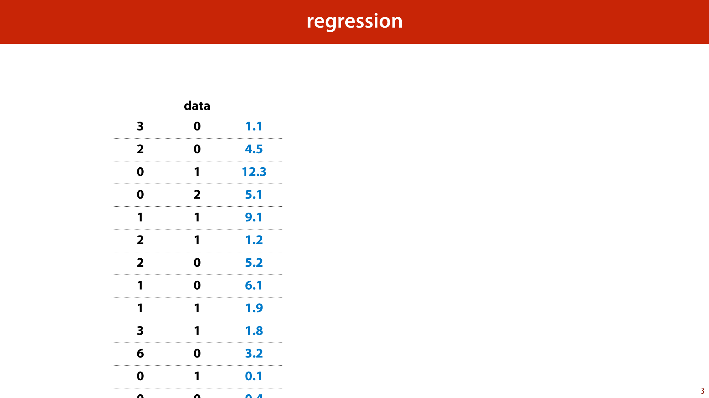

            <figcaption>
            
We’ll start with <strong>regression</strong>. Here’s how we explained regression in the last lecture.

            </figcaption>
            click image for animation
       </section>

       <section id="slide-004">
            <a class="slide-link" href="http://mlvu.github.io/linear#slide-004" title="Link to this slide.">link here</a>
            

            <figcaption>
            
This is is the example data we used to illustrate regression: predicting the body mass of a penguin from its flipper length. 

data source: <a href="https://allisonhorst.github.io/palmerpenguins/"><strong>https://allisonhorst.github.io/palmerpenguins/</strong></a>, <a href="https://github.com/mcnakhaee/palmerpenguins"><strong>https://github.com/mcnakhaee/palmerpenguins</strong></a> (python package) 

image source: <a href="https://allisonhorst.github.io/palmerpenguins/"><strong>https://allisonhorst.github.io/palmerpenguins/</strong></a>

<a href="https://allisonhorst.github.io/palmerpenguins/"><strong></strong></a>

            </figcaption>
       </section>

       <section id="slide-005">
            <a class="slide-link" href="http://mlvu.github.io/linear#slide-005" title="Link to this slide.">link here</a>
            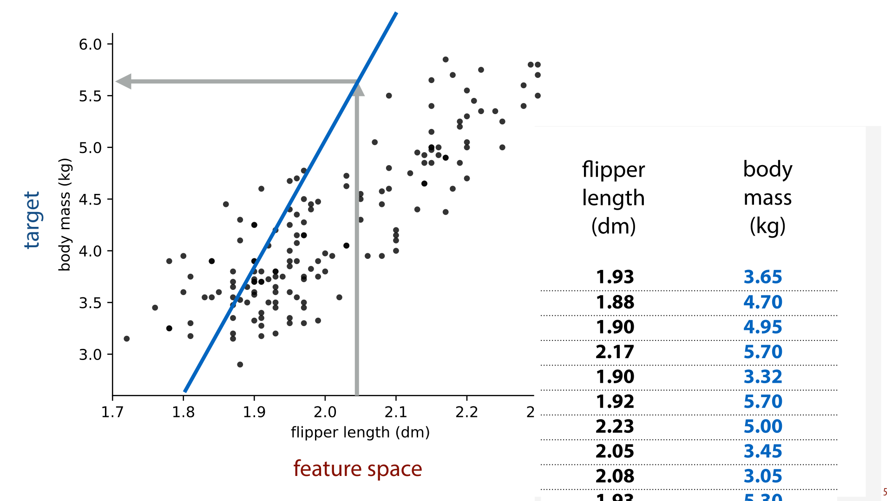

            <figcaption>
            
As we saw, the <strong>linear regression model</strong> is simply a linear function that maps the feature(s) to the target value. In the case of one feature, such a function looks like a line. The only decision we have to make is <em>which line fits the data best</em>.

            </figcaption>
       </section>

       <section id="slide-006">
            <a class="slide-link" href="http://mlvu.github.io/linear#slide-006" title="Link to this slide.">link here</a>
            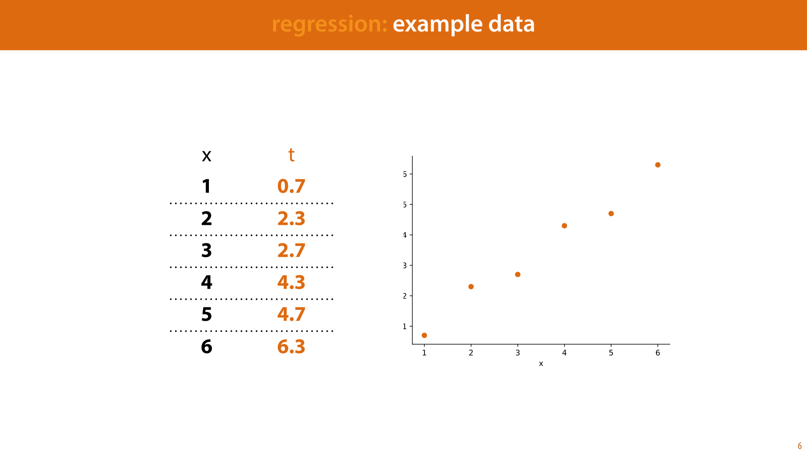

            <figcaption>
            
To simplify things we'll  use this very simple data set in the rest of this lecture. There is one input feature <strong>x</strong>, one output value <strong>t</strong> (for target) and we have six instances. 

We will assume that all our features are <em>numeric</em>. In a later lecture we will see how best to convert categoric features to numeric ones. We will develop linear regression for an arbitrary number of features m, but we will keep visualizing what we’re doing on this one-feature dataset.

            </figcaption>
       </section>

       <section id="slide-007" class="anim">
            <a class="slide-link" href="http://mlvu.github.io/linear#slide-007" title="Link to this slide.">link here</a>
            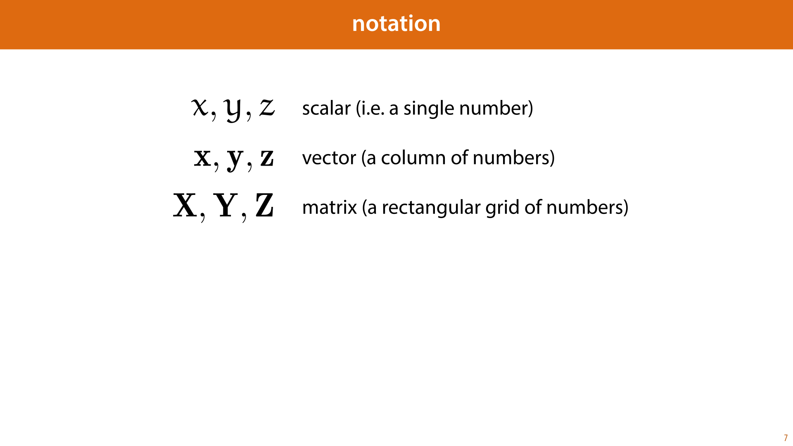

            <figcaption>
            
Throughout the course, we will use the following notation: lowercase non-bold for scalars, lowercase <strong>bold</strong> for vectors and uppercase bold for matrices. 

When we’re indexing <em>individual elements</em> of vectors and matrices, these are scalars, so they are non-bold. 

            </figcaption>
            click image for animation
       </section>

       <section id="slide-008" class="anim">
            <a class="slide-link" href="http://mlvu.github.io/linear#slide-008" title="Link to this slide.">link here</a>
            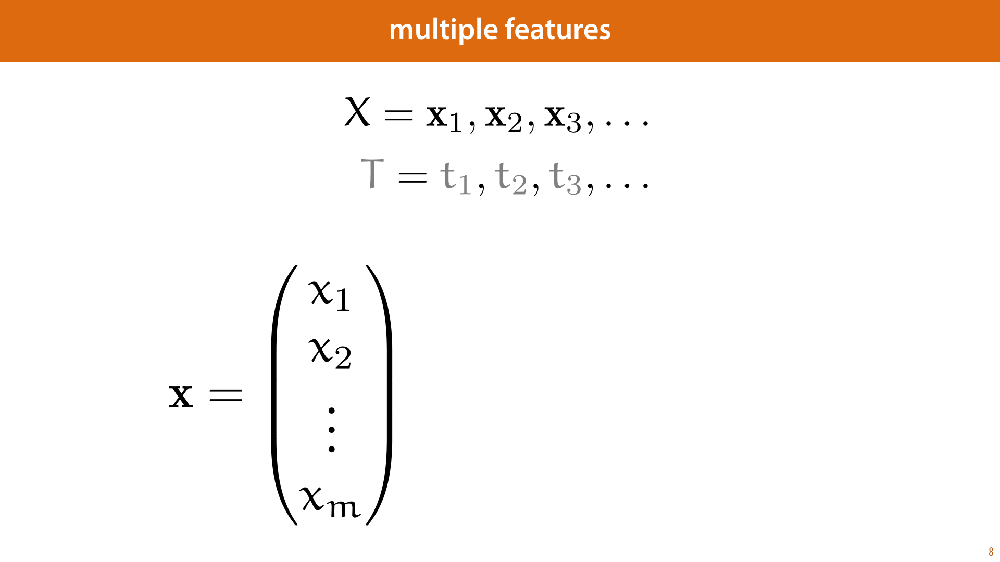

            <figcaption>
            
As we saw in the last lecture, an instance in machine learning is described by m <em>features</em> (with m fixed for a given dataset). We will represent this as a <strong>vector</strong> for each instance, with each element of the vector representing a feature.  

This can be a little confusing, since we sometimes want to index the instance within the dataset and sometimes the features of a given instance. Pay attention to whether the letter we’re indexing is bold or non-bold: a bold letter <strong>x</strong> with a subscript i refers to the i-th instance in the data (containinig all features). A non-bold letter x with an index i refers to the i-th scalar feature of some instance <strong>x</strong>. 

In the rare cases where we need to refer to both the index of the instance, and the index of the feature within the instance, we will usually use an uppercase X. This makes sense if you imagine the data as a big matrix <strong>X</strong>, with the instances  as rows, and the features as columns. 

We’ll occasionally deviate from this notation when doing so makes things clearer, but we’ll point it out when that happens.

            </figcaption>
            click image for animation
       </section>

       <section id="slide-009">
            <a class="slide-link" href="http://mlvu.github.io/linear#slide-009" title="Link to this slide.">link here</a>
            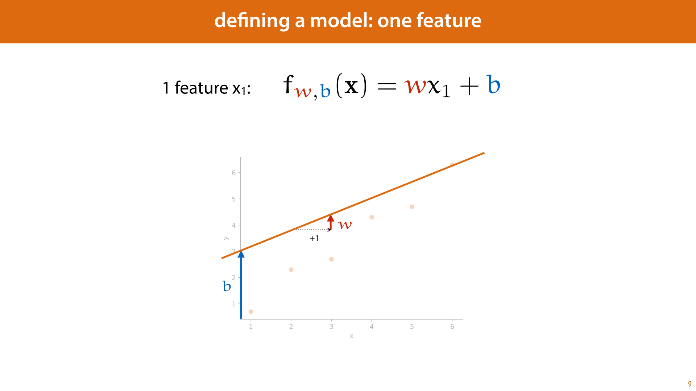

            <figcaption>
            
If we have one feature (as in this example) a standard linear regression model has two <em>parameters </em>(the numbers that determine which line we fit through our data): w the <strong>weight</strong> and b<strong>, </strong>the <strong>bias</strong>. The the weight is also sometimes called the<em> slope </em>and the bias is also sometimes called the <em>intercept</em>. 

b determines where the line crosses the vertical axis. That is, what value f takes when x = 0. 

w determines how much the line rises if we move one step to the right (i.e. increase x by 1) 

For the line drawn here, we have b=3 and w=0.5.  

Note that this isn’t a very good fit for the data. Our job is to find better numbers w and b.

            </figcaption>
       </section>

       <section id="slide-010">
            <a class="slide-link" href="http://mlvu.github.io/linear#slide-010" title="Link to this slide.">link here</a>
            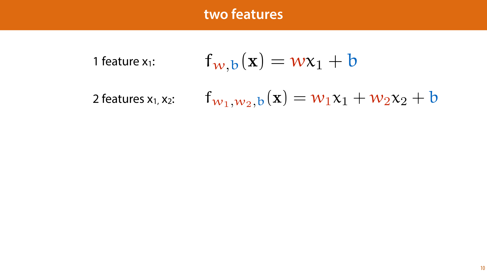

            <figcaption>
            
If we have multiple features, each feature gets its own <strong>weight</strong> (also known as a<em> coefficient</em>)

            </figcaption>
       </section>

       <section id="slide-011">
            <a class="slide-link" href="http://mlvu.github.io/linear#slide-011" title="Link to this slide.">link here</a>
            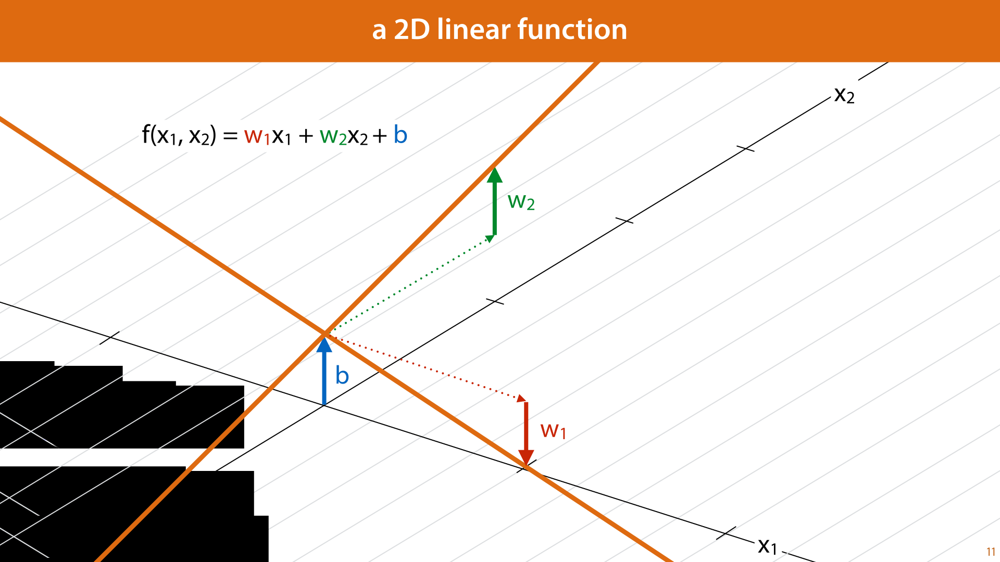

            <figcaption>
            
Here’s what that looks like. The thick orange lines together indicate a plane (which rises in the x2 direction, and declines in the x1 direction). The parameter<strong> </strong>b describes how high above the origin this plane lies (what the value of f is if <em>both features</em> are 0). The value w1 indicates how much f increases if we take a step of 1 along the x1 axis, and the value w2 indicates how much f increases if we take a step of size 1 along the x2 axis. 

            </figcaption>
       </section>

       <section id="slide-012" class="anim">
            <a class="slide-link" href="http://mlvu.github.io/linear#slide-012" title="Link to this slide.">link here</a>
            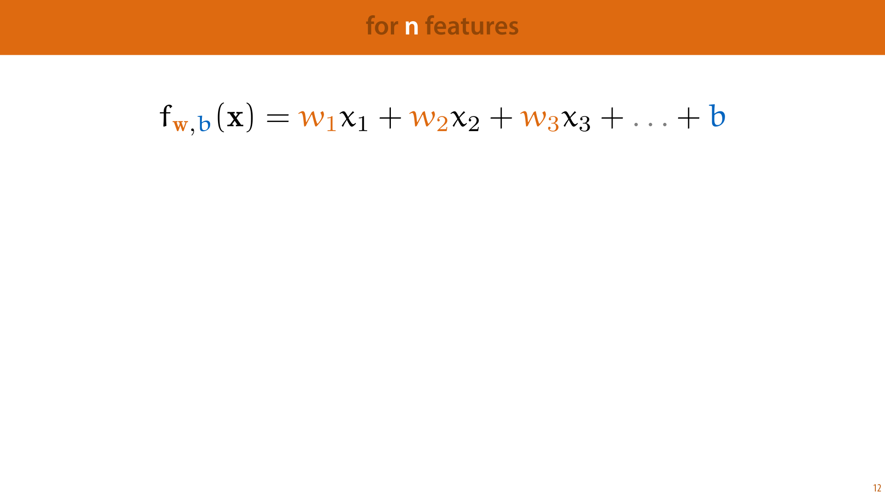

            <figcaption>
            
For an arbitrary number of features, the pattern continues as you’d expect. We summarize the w’s in a vector <strong>w</strong> with the same number of elements as <strong>x</strong>. 

We call the w’s the weights, and b the bias. The weights and the bias are the <em>parameters </em>of the model. We need to choose these to fit the model to our data. 

The operation of multiplying elements of <strong>w</strong> by the corresponding elements of <strong>x</strong> and summing them is the <strong>dot product</strong> of <strong>w</strong> and <strong>x</strong>.

            </figcaption>
            click image for animation
       </section>

       <section id="slide-013" class="anim">
            <a class="slide-link" href="http://mlvu.github.io/linear#slide-013" title="Link to this slide.">link here</a>
            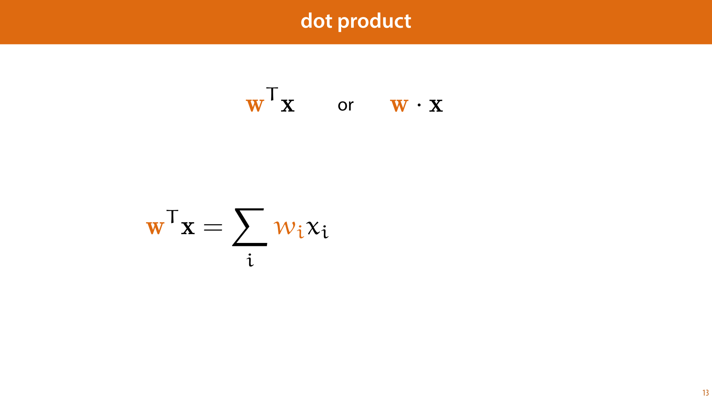

            <figcaption>
            
The <strong>dot product</strong> of two vectors is simply the sum of the products of their elements. If we place the features into a vector and the weights, then a linear function is simply their dot product (plus the b parameter). 

The transpose (superscript T) notation arises from the fact that if we make one vector a row vector and one a column vector, and matrix-multiply them, the result is the dot product (try it). 

The dot product also has a geometric interpretation: the dot product is equal to the lengths of the two vectors, multiplied by the cosine of the angle between them. We won't give you a proof, but we'll occasionally make use of this form of the dot product, so make sure you remember this.  
<aside    >The proof that the two definitions are equivalent is given in the preliminaries lecture. </aside>
The dot product will come back <em>a lot </em>in the rest of the course. We don't have time to discuss it in depth, but if your memory is hazy, we strongly recommend that you take a minute to go back to your linear algebra book and look up the various interpretations of what the dot product means.

            </figcaption>
            click image for animation
       </section>

       <section id="slide-014">
            <a class="slide-link" href="http://mlvu.github.io/linear#slide-014" title="Link to this slide.">link here</a>
            

            <figcaption>
            
To build some intuition for the meaning of the weights <strong>w</strong>, let’s look at an example. Imagine we are trying to predict the risk of high blood pressure based on these three features. We’ll assume that the features are expressed in some number that measures these properties.

            </figcaption>
       </section>

       <section id="slide-015">
            <a class="slide-link" href="http://mlvu.github.io/linear#slide-015" title="Link to this slide.">link here</a>
            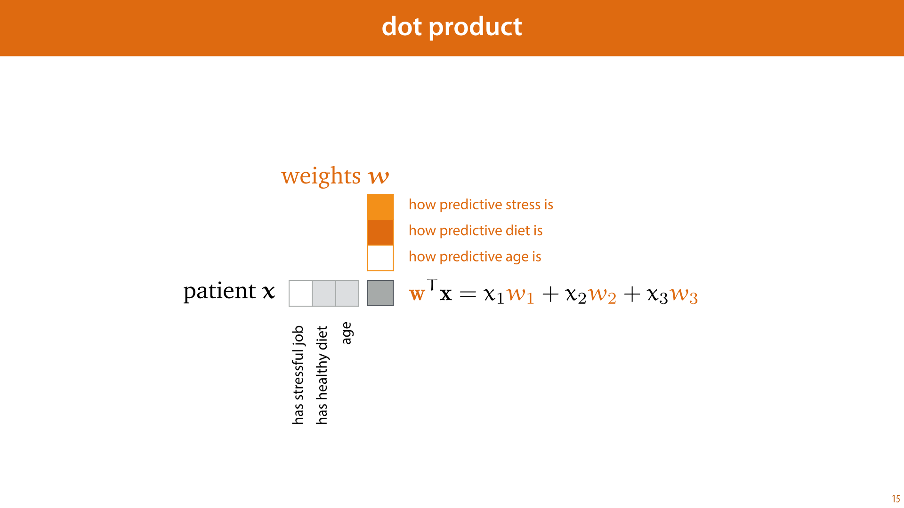

            <figcaption>
            
Here’s what the dot product expresses. For some features, like job stress, we want to learn a positive weight (since more job stress should contribute to higher risk of high blood pressure). For others, we want to learn a negative weight (the healthier your diet, the lower your risk of high blood pressure). Finally, we can control the <em>magnitude </em>of the weights to control their relative importance: if age and job stress both contribute positively, but age is the bigger risk factor, we make both weights positive, but we make the weight for age bigger.

            </figcaption>
       </section>

       <section id="slide-016">
            <a class="slide-link" href="http://mlvu.github.io/linear#slide-016" title="Link to this slide.">link here</a>
            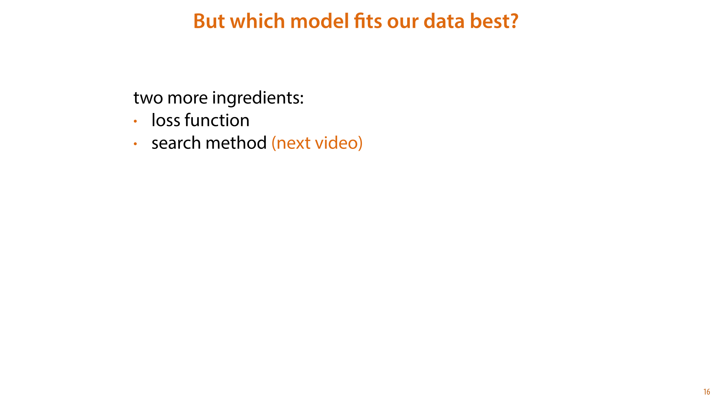

            <figcaption>
            
So, that's our model defined in detail. But we still don't know <em>which</em> model to choose for a given dataset. Given some data, which values should we choose for the parameters <strong class="red">w</strong> and b? 

In order to answer this question, we need two more ingredients. First, we need a<strong> loss function</strong>, which tells us how well a particular choice of model does (for the given data) and second, we need a way to <strong>search</strong> the space of all models for a particular model that results in a low loss (a model for which the loss function returns a low value).

            </figcaption>
       </section>

       <section id="slide-017" class="anim">
            <a class="slide-link" href="http://mlvu.github.io/linear#slide-017" title="Link to this slide.">link here</a>
            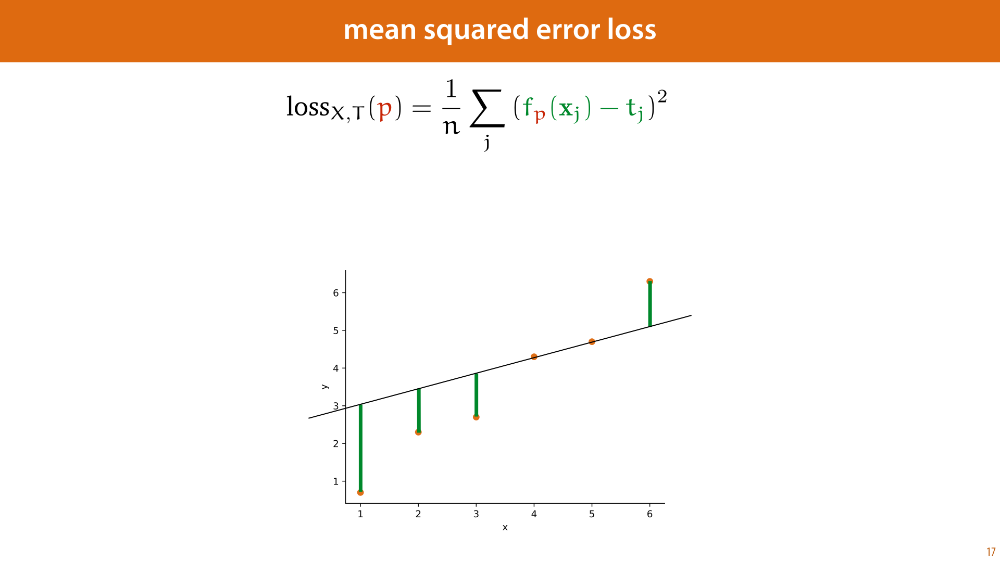

            <figcaption>
            
Here is a common loss function for regression: the <strong>mean-squared error</strong> (MSE) loss. We saw this briefly already in the previous lecture. 

Note that the loss function takes a <em>model</em> as its argument. The model maps the data to the output, the loss function maps a model to a loss value. The data is a constant in the loss function. 

The main thing a regression loss should do is to compare the model predictions to the actual values in our dataset, and return a large value if they are all very different, and a small value if they are all very close together. The difference between the prediction and the actual value is called the <strong>residual</strong>. We've drawn these here as green bars. 

The MSE loss takes the residual for each instance in our data, squares them, and returns the average. One reason for the squaring step is to ensure that negative and positive residuals don’t cancel out (giving us a small loss even though we have big residuals). But that's not the only reason. 

            </figcaption>
            click image for animation
       </section>

       <section id="slide-018">
            <a class="slide-link" href="http://mlvu.github.io/linear#slide-018" title="Link to this slide.">link here</a>
            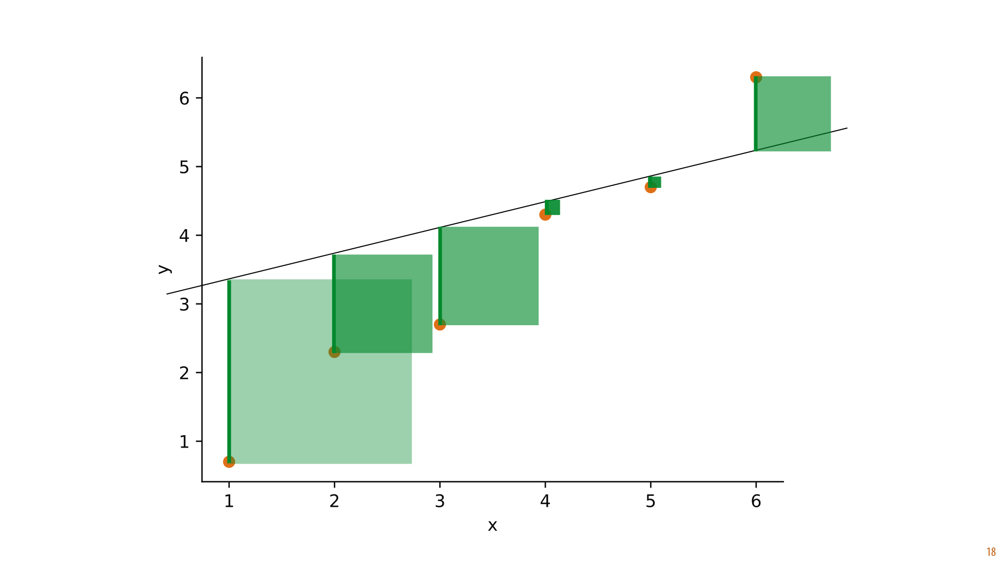

            <figcaption>
            
The squares also ensure that big errors affect the loss more heavily than small errors. You can visualise this as shown here: the mean squared error is the mean of the areas of the green squares (it’s also called <em>sum-of-squares loss</em>). 

When we search for a well-fitting model, the search will try to reduce the big squares much more than the small squares. 

If we think of the residuals as rubber bands, pulling on the regression line to pull it closer to the points, the rubber band on the bottom left pulls much harder than all the other ones. Therefore, any search algorithm trying to minimize this loss will be much more interested in moving the left of the line down than in moving the right of the line up. 

It's not guaranteed that this is a good thing. Sometimes this behavior is desirable and sometimes it isn't. For now, this is just a simple loss function to get us started. 

In later lectures, we will say more about when this kind of loss is appropriate and when it isn't. We will also see that this loss function follows from the assumption  that our data contains noise coming from a <em>normal distribution</em>. 

visualization stolen from <a href="https://machinelearningflashcards.com/"><strong class="blue">https://machinelearningflashcards.com/</strong></a> 

 

            </figcaption>
       </section>

       <section id="slide-019">
            <a class="slide-link" href="http://mlvu.github.io/linear#slide-019" title="Link to this slide.">link here</a>
            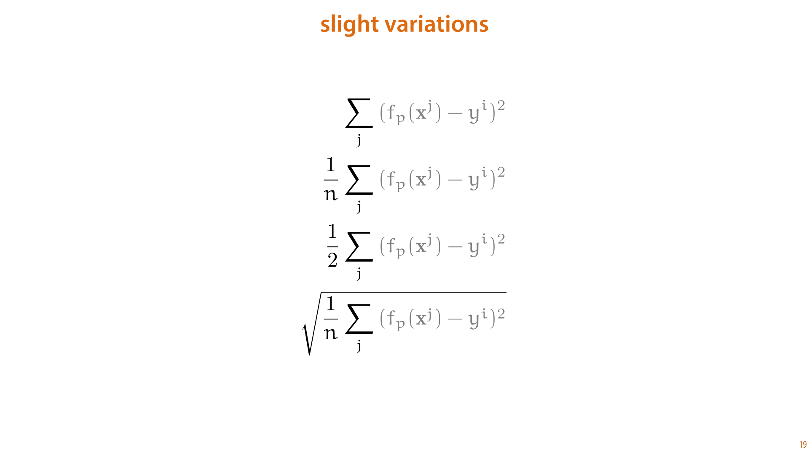

            <figcaption>
            
You may see slightly different versions of the MSE loss: sometimes we take the average of the squares, sometimes just the sum. Sometimes we multiply by 1/2 to make the derivative simpler. In practice, the differences don’t mean much because we’re not interested in the <em>absolute</em> value, just in how the loss changes from model to another. 

We will switch between these based on what is most useful in a given context.

            </figcaption>
       </section>

        <section class="video" id="video-019">
            <a class="slide-link" href="http://mlvu.github.io/linear#video-19">link here</a>
           <video controls>
                <source src="https://surfdrive.surf.nl/files/index.php/s/wOMpuP3y06K5hc3/download" type="video/mp4" />

                Download the <a href="https://surfdrive.surf.nl/files/index.php/s/wOMpuP3y06K5hc3/download">video</a>.
           </video>
        </section>

       <section id="slide-020">
            <a class="slide-link" href="http://mlvu.github.io/linear#slide-020" title="Link to this slide.">link here</a>
            

            <figcaption>
            
 

            </figcaption>
       </section>

       <section id="slide-021">
            <a class="slide-link" href="http://mlvu.github.io/linear#slide-021" title="Link to this slide.">link here</a>
            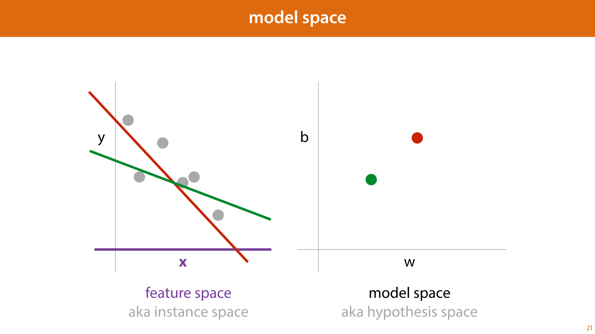

            <figcaption>
            
Remember the two most important spaces of machine learning: the <strong>feature space</strong> and the <strong>model space</strong>. The loss function maps every point in the model space to a loss value.  

In a single-feature regression problem plotted like this, the<strong> </strong>feature space is just the horizontal axis.

            </figcaption>
       </section>

       <section id="slide-022" class="anim">
            <a class="slide-link" href="http://mlvu.github.io/linear#slide-022" title="Link to this slide.">link here</a>
            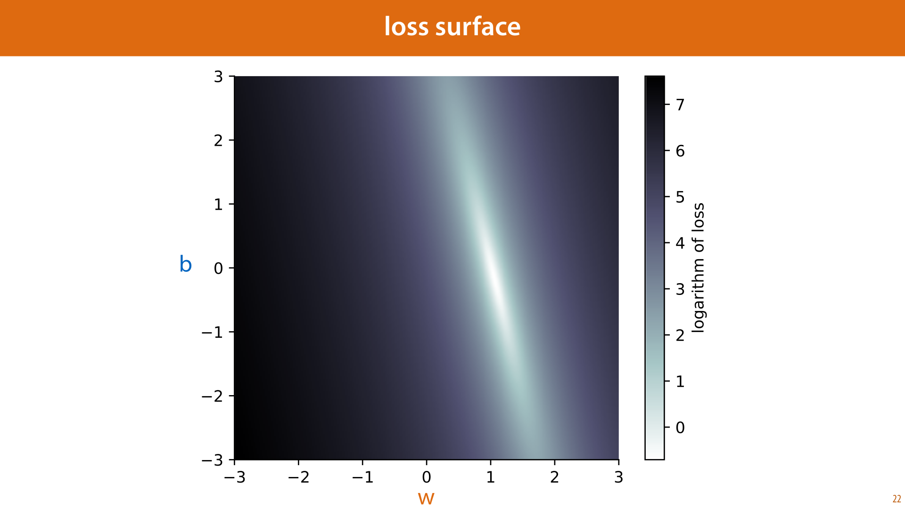

            <figcaption>
            
As we saw in the previous lecture, we can plot the loss for every point in our model space. This is called the <strong>loss surface</strong> or sometimes the <strong>loss landscape</strong>. If you imagine a 2D model space, you can think of the loss surface as a landscape of rolling hills (or sometimes of jagged cliffs). 

Here is what that actually looks like for the two parameters of the one-feature linear regression. Note that this is specific to the data we saw earlier. For a different dataset, we get a different loss landscape. 

To minimize the loss, we need to search this space to find the brightest point in this picture. Or, the lowest point in the loss landscape. Remember that, normally, we may have hundreds of parameters so it isn’t as easy as it looks. Any method we come up with, needs to work in any number of dimensions. 
<aside    >We’ve plotted the logarithm of the loss as a trick to make this image visually easier to understand (it maps the values that are easy to tell apart to the values we care about). The logarithm is a monotonic function so log(loss(<strong class="red">w</strong>, b)) has its minimum at the same place as loss(<strong class="red">w</strong>, b).</aside><aside    ></aside>
            </figcaption>
            click image for animation
       </section>

       <section id="slide-023">
            <a class="slide-link" href="http://mlvu.github.io/linear#slide-023" title="Link to this slide.">link here</a>
            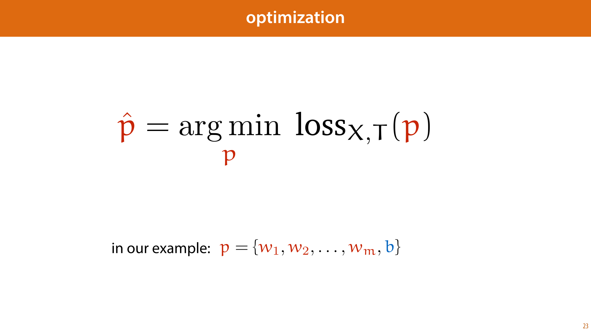

            <figcaption>
            
The mathematical name for this sort of search is <strong>optimization</strong>. That is, we are trying to find the input (<strong class="red">p</strong>, the model parameters) for  which a particular function (the loss) is at its optimum (a maximum or minimum, in this case a minimum). Failing that, we’d like to find as low a value as possible. 

We’ll start by looking at some very simple approaches.

            </figcaption>
       </section>

       <section id="slide-024">
            <a class="slide-link" href="http://mlvu.github.io/linear#slide-024" title="Link to this slide.">link here</a>
            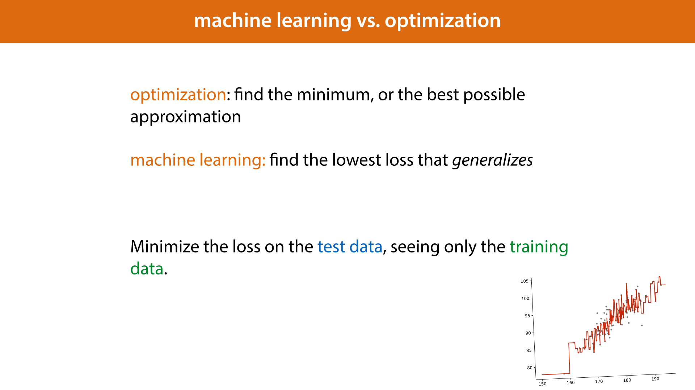

            <figcaption>
            
We often frame machine learning as an optimization problem, and we use many techniques from optimization, but it’s important to recognize that there is a difference between optimization and machine learning. 

<strong>Optimization</strong> is concerned with finding the absolute minimum (or maximum) of a function. The lower the better, with no ifs or buts. In <strong>machine learning</strong>, if we have a very expressive model class (like the regression tree from the last lecture), the model that actually minimizes the loss on the training data is the one that overfits. In such cases, we’re not looking to minimize the loss on the training data, since that would mean overfitting, we’re looking to minimize the loss on the <em>test data</em>. Of course, we don’t get to see the test data, so we use the training data as a stand in, and try to control against overfitting as best we can. 

In the case of underpowered models like the linear model, this distinction isn’t too important, since they’re very unlikely to overfit. Here, the model that minimizes the loss on the training data is likely the model that minimizes the loss on the test data as well. For now, we'll just try some simple optimization algorithms to find the absolute minimum of the loss, and worry about overfitting later.

            </figcaption>
       </section>

       <section id="slide-025">
            <a class="slide-link" href="http://mlvu.github.io/linear#slide-025" title="Link to this slide.">link here</a>
            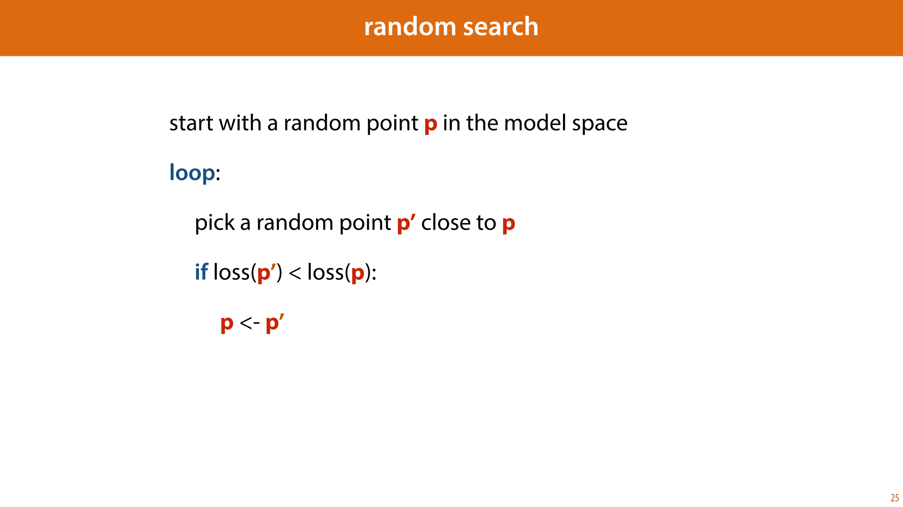

            <figcaption>
            
Let’s start with a very simple example:<strong> random search</strong>. We simply make a small step to a nearby point. If the loss goes up, we move back to our previous point. If it goes down we stay in the new point. Then we repeat the process. 

We usually stop the loop when the loss gets to a pre-defined level, or we just run it for a fixed number of iterations, and we see how well we've done. 

            </figcaption>
       </section>

       <section id="slide-026">
            <a class="slide-link" href="http://mlvu.github.io/linear#slide-026" title="Link to this slide.">link here</a>
            

            <figcaption>
            
A common analogy is a<em> hiker in a snowstorm</em>. Imagine you’re hiking in the mountains, and you’re caught in a snowstorm. You can’t see a thing, and you’d like to get down to your hotel in the valley, or failing that, you’d like to get to as low a point as possible. 

You take a step in a random direction. If you're moving up, you step back to where you came from, if you're moving down, you repeat the process with a new random direction. This is, in effect, what random search is doing. More importantly, it’s how <em>blind </em>random search is to the larger structure of the landscape. It can only see what's right in front of it. 

image source: <a href="https://www.wbur.org/hereandnow/2016/12/19/rescue-algonquin-mountain">https://www.wbur.org/hereandnow/2016/12/19/rescue-algonquin-mountain</a> 

            </figcaption>
       </section>

       <section id="slide-027" class="anim">
            <a class="slide-link" href="http://mlvu.github.io/linear#slide-027" title="Link to this slide.">link here</a>
            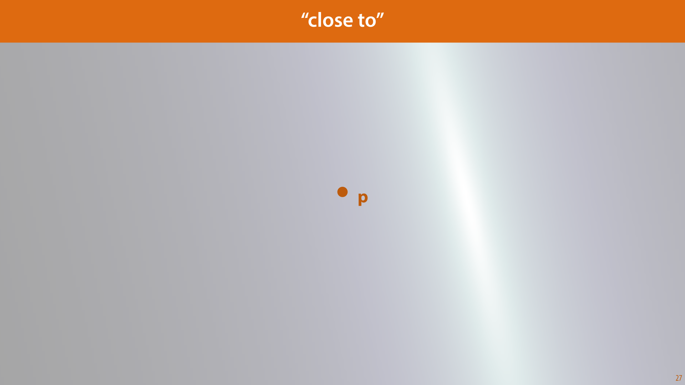

            <figcaption>
            
To implement the random search we need to define how to pick a point “close to” another in model space. 

One simple option is to choose the next point by sampling uniformly among all points with some pre-chosen distance <em>r</em> from the current point.  
<aside    >Put more formally: we pick from the hypersphere (or circle, in 2D) with radius r, centered on <strong>p</strong>. </aside><aside    ></aside>
            </figcaption>
            click image for animation
       </section>

       <section id="slide-028">
            <a class="slide-link" href="http://mlvu.github.io/linear#slide-028" title="Link to this slide.">link here</a>
            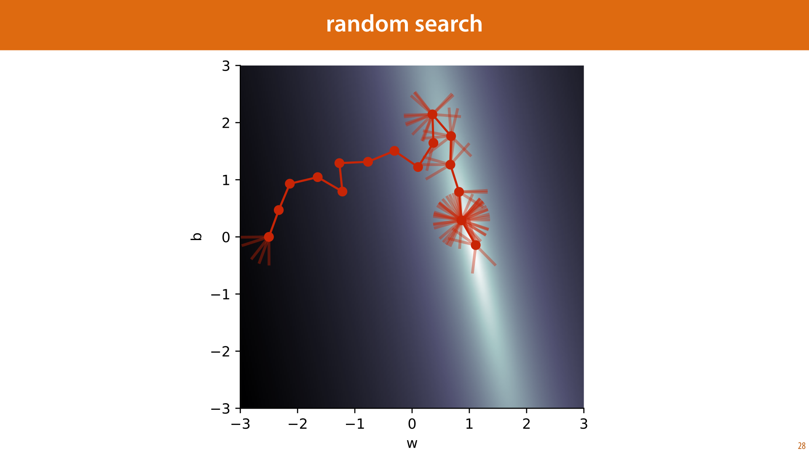

            <figcaption>
            
Here is random search in action. The transparent red offshoots are steps that turned out to be worse than the current point (steps that went uphill). The algorithm starts on the left, and slowly (with a bit of a detour) stumbles in the direction of the low loss region. 

As we can see, it doesn't exactly make a beeline for the lowest point, but it gets there eventually. 

            </figcaption>
       </section>

       <section id="slide-029">
            <a class="slide-link" href="http://mlvu.github.io/linear#slide-029" title="Link to this slide.">link here</a>
            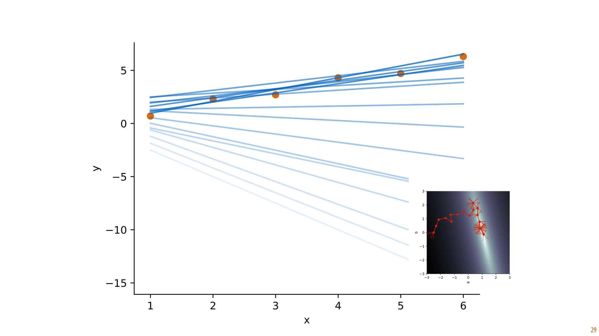

            <figcaption>
            
Here is what it looks like in <strong>feature space</strong>. The first model (bottom-most line) is entirely wrong, and the search slowly moves, step by step, towards a reasonable fit on the data. 

Every blue line in this image corresponds to a red dot in the model space (inset).

            </figcaption>
       </section>

       <section id="slide-030" class="anim">
            <a class="slide-link" href="http://mlvu.github.io/linear#slide-030" title="Link to this slide.">link here</a>
            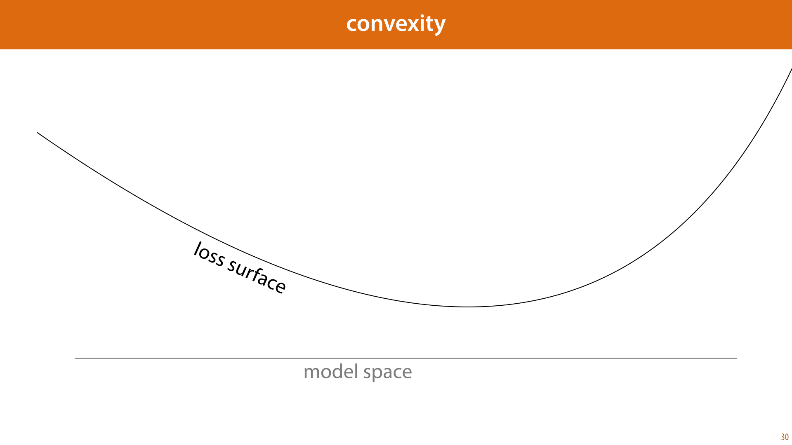

            <figcaption>
            
One of the reasons such a simple approach works well enough here is that our problem is <strong>convex</strong>. A surface (like our loss landscape) is convex if a line drawn between any two points on the surface lies entirely above the surface. One of the implications of convexity is that any point that looks like a minimum locally (because all nearby points are higher), it must be the <strong>global minimum</strong>: it’s lower than any other point on the surface. 

This means that so long as we know we’re moving down (to a point with lower loss), we can be sure we’re moving towards the global minimum: the best of all possible models.

            </figcaption>
            click image for animation
       </section>

       <section id="slide-031" class="anim">
            <a class="slide-link" href="http://mlvu.github.io/linear#slide-031" title="Link to this slide.">link here</a>
            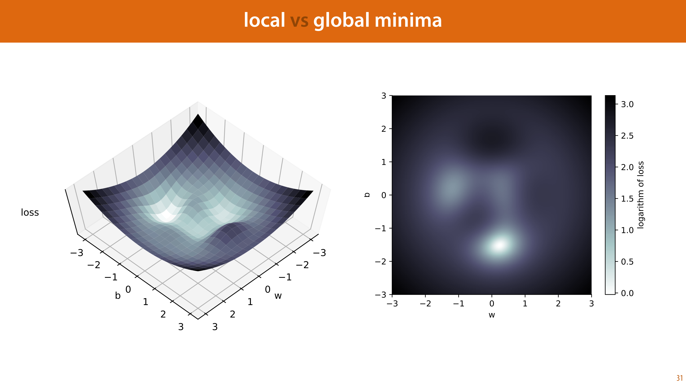

            <figcaption>
            
Let’s look at what happens if the loss surface<em> isn’t</em> convex: what if the loss surface has multiple<em> </em><strong>local minima</strong>? These are points that are lower than all nearby points, but if we move far enough away from them, we <em>can</em> find a point that is even lower. 

Here’s a loss surface with a more complex structure.  The two purple diamonds are the lowest point in their respective <em>neighborhoods</em>, but the red disc is the lowest point globally. 
<aside    >This loss surface isn't based on actual data. It's just some function that illustrates the idea.</aside><aside    ></aside>
            </figcaption>
            click image for animation
       </section>

       <section id="slide-032">
            <a class="slide-link" href="http://mlvu.github.io/linear#slide-032" title="Link to this slide.">link here</a>
            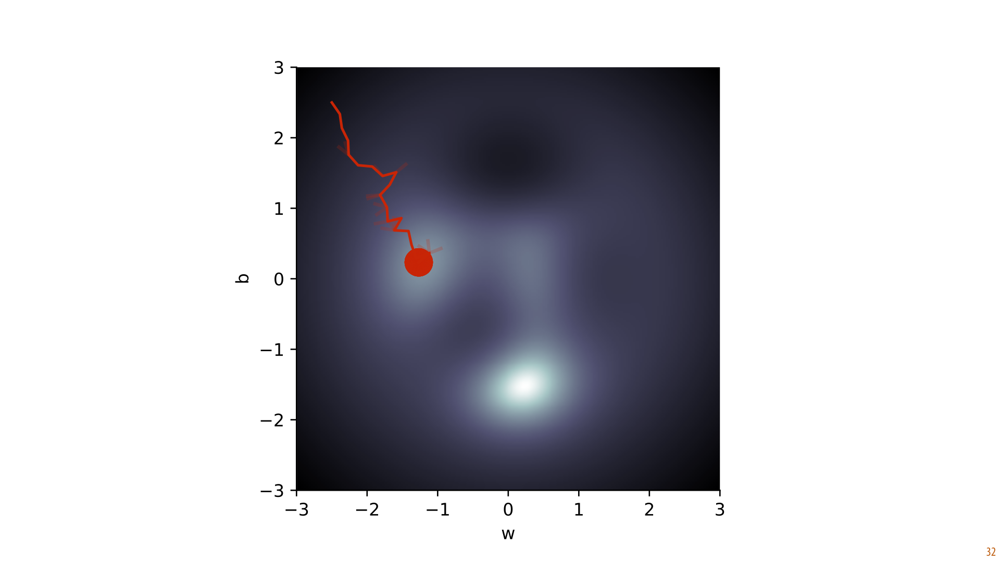

            <figcaption>
            
Here we see random search on our more complex loss surface. As you can see, it heads quickly for one of the local minima, and then gets stuck there. No matter how many more iterations we give it, it will never escape. 

Note that changing the step size will not help us here. Once the search is stuck, it stays stuck.

            </figcaption>
       </section>

       <section id="slide-033">
            <a class="slide-link" href="http://mlvu.github.io/linear#slide-033" title="Link to this slide.">link here</a>
            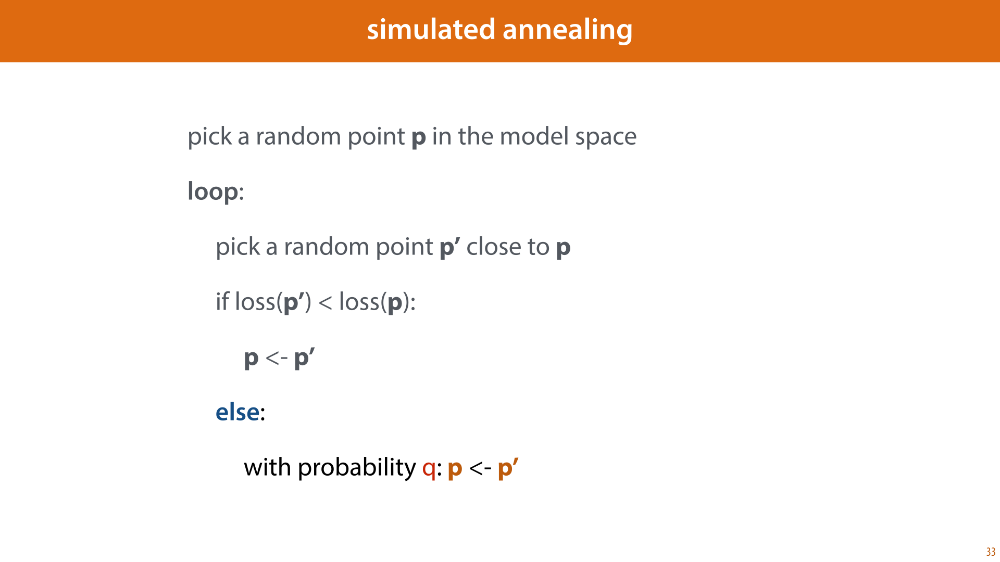

            <figcaption>
            
There are a few tricks that can help us to escape local minima. Here’s a popular one, called <strong>simulated annealing</strong>: if the next point chosen isn’t better than the current one, we still pick it, but only with some small probability. In other words, we allow the algorithm to<em> occasionally </em>travel uphill.  

This means that whenever it gets stuck in a local minimum, it still has some probability of escaping, and finding the global minimum. 
<aside    >The name "simulated annealing" is a bit of a historical accident, so don't read too much in to it. It comes from the fact that this algorithm can be used to simulate the cooling of a material like metal. The carefully controlled cooling of a material to promote the growth of particular kinds of crystals is called annealing. In physical terms this is like looking for the minimum in an energy landscape, which is mathematically similar to our loss landscape. </aside><aside    ></aside>
            </figcaption>
       </section>

       <section id="slide-034">
            <a class="slide-link" href="http://mlvu.github.io/linear#slide-034" title="Link to this slide.">link here</a>
            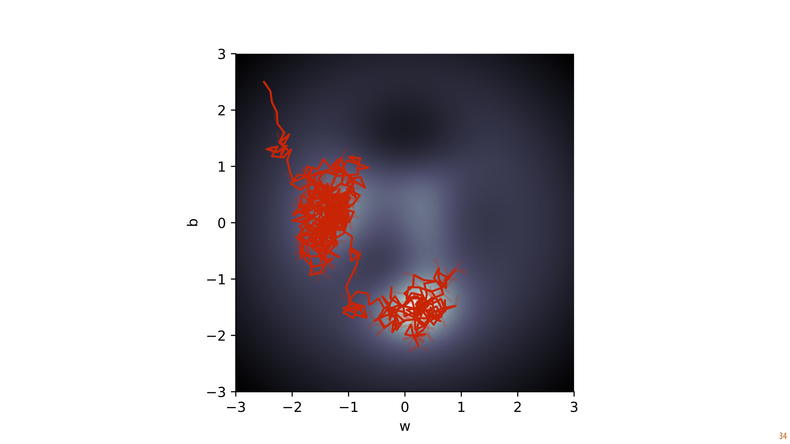

            <figcaption>
            
Here is a run of simulated annealing on our non-convex problem. We see that it still hits the local minimum first, but after a while it manages to jump out, and to find the global minimum. 

Of course, with this algorithm, there is always the possibility that it will jump out of the global minimum again and move to a worse minimum. That shouldn’t worry us, however, so long as we remember the best model we’ve observed over the entire run. Then we can just let simulated annealing jump around the model space driven partly by random noise, and partly by the loss surface.

            </figcaption>
       </section>

       <section id="slide-035">
            <a class="slide-link" href="http://mlvu.github.io/linear#slide-035" title="Link to this slide.">link here</a>
            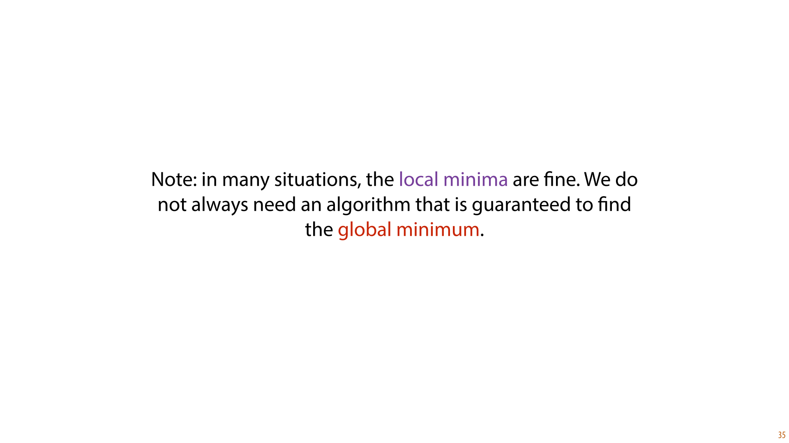

            <figcaption>
            
All this talk about global minima may suggest that the local minima are always terrible. Remember, however that if we have a complex model, the global minimum will probably overfit. In such cases, we may actually be more interested in finding a good local minimum. 

In short, we want to think carefully about whether our algorithm can escape <em>bad</em> local minima, but that doesn't mean that local minima are always bad solutions.

            </figcaption>
       </section>

       <section id="slide-036">
            <a class="slide-link" href="http://mlvu.github.io/linear#slide-036" title="Link to this slide.">link here</a>
            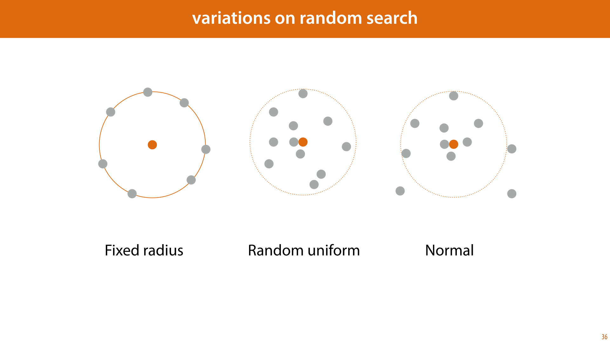

            <figcaption>
            
The fixed step size we used so far is just one way to sample the next point. To allow the algorithm to occasionally make smaller steps, you can sample <strong>p</strong>’ so that it is <em>at most</em> some distance away from <strong>p</strong>, instead of <em>exactly</em>. Another approach is to sample the distance from <strong>a Normal distribution</strong>. That way, most points will be close to the original <strong>p</strong>, but every point in the model space can theoretically be reached in one step.

            </figcaption>
       </section>

       <section id="slide-037">
            <a class="slide-link" href="http://mlvu.github.io/linear#slide-037" title="Link to this slide.">link here</a>
            

            <figcaption>
            
Here is what random search looks when the steps are sampled from a normal distribution. Note that the “failed” steps all have different sizes.

            </figcaption>
       </section>

       <section id="slide-038">
            <a class="slide-link" href="http://mlvu.github.io/linear#slide-038" title="Link to this slide.">link here</a>
            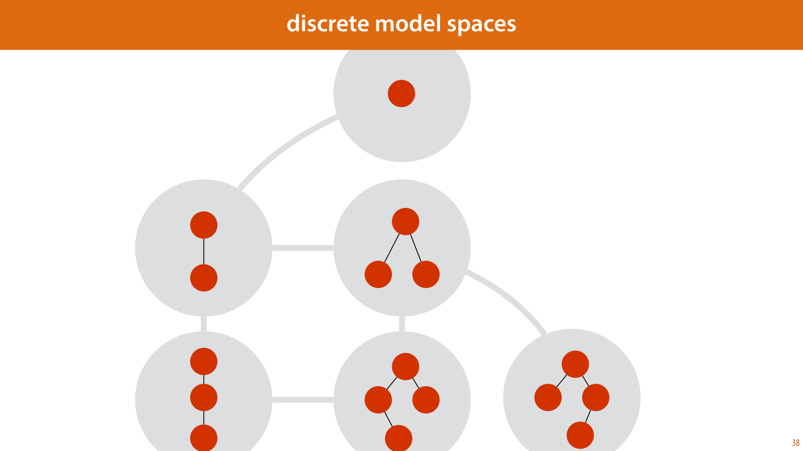

            <figcaption>
            
The space of linear models is <strong>continuous</strong>: between every two models, there is always another model, no matter how close they are together. *  

The alternative is a<strong> discrete model space</strong>. For instance, the space of all trees is discrete. If our model takes the form of a tree (like the decision tree we saw in the last lecture), then we don't always have another model "in between" any two given models. In this case, some search algorithms no longer work, but random search and simulated annealing can still be used.   

You just need to define which models are “close” to each other. In this slide, we've decided that two trees are close if I can turn one into the other by adding or removing a single node. 

Random search and simulated annealing can now be used to search this space to find the tree model that gives the best performance. 
<aside    >In practice, we usually use a different method to search for decision trees and regression trees, which we will introduce in a later lecture. The point here is just that if you are searching a discrete space, random search and simulated annealing still work. </aside><aside    >* Strictly speaking, this is not a complete definition of a continuous space, but it's the property that matters for us.</aside><aside    ></aside>
            </figcaption>
       </section>

       <section id="slide-039">
            <a class="slide-link" href="http://mlvu.github.io/linear#slide-039" title="Link to this slide.">link here</a>
            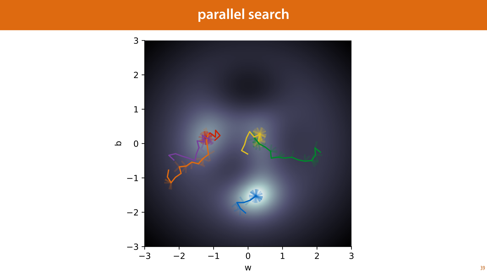

            <figcaption>
            
Another thing you can do is just to run random search a couple of times independently (one after the other, or in parallel). If you’re lucky one of these runs may start you off close enough to the global minimum. 

For simulated annealing, doing multiple runs makes less sense. We can show that there’s not much difference between 10 runs of 100 iterations and one run of 1000. The only reason to do multiple runs of simulated annealing is because it’s easier to parallelize over multiple cores or machines.

            </figcaption>
       </section>

       <section id="slide-040">
            <a class="slide-link" href="http://mlvu.github.io/linear#slide-040" title="Link to this slide.">link here</a>
            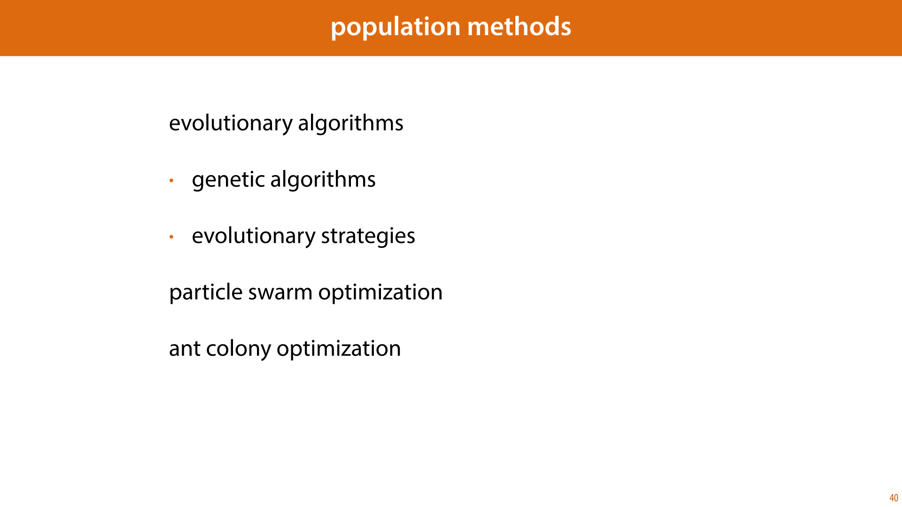

            <figcaption>
            
To make parallel search even more useful, we can introduce some form of communication or synchronization between the searches happening in parallel. If we see the parallel searches as a <em>population</em> of agents that occasionally “communicate” in some way, we can guide the search a lot more. Here are some examples of such <strong>population methods</strong>. we won’t go into this too deeply. We will only take a (very) brief look at evolutionary algorithms. 

Often, there are specific variants for discrete and for continuous model spaces.

            </figcaption>
       </section>

       <section id="slide-041">
            <a class="slide-link" href="http://mlvu.github.io/linear#slide-041" title="Link to this slide.">link here</a>
            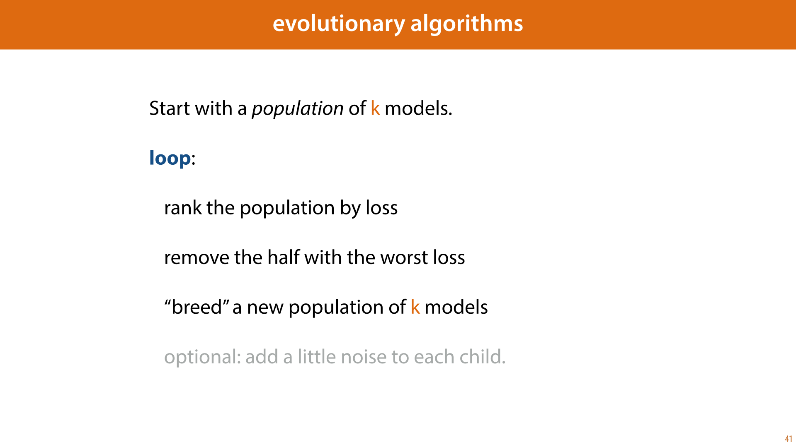

            <figcaption>
            
Here is a basic outline of an evolutionary method (although many other variations exist). We start with a population of models, we remove the half with the worst loss, and pair up the remainder to breed a new population. 

In order to instantiate this, we need to define what it means to “breed” a population of new models from an existing population. A common approach is to select to random parents and to somehow average their models. This is easy to do in a continuous model space: we can literally average the two parent models to create a child.  

In a discrete model space, it’s more difficult, and it depends more on the specifics of the model space. In such case, designing the breeding process (sometimes called the <strong>crossover operator</strong>) is usually the most difficult part of designing an effective evolutionary algorithm.

            </figcaption>
       </section>

       <section id="slide-042" class="anim">
            <a class="slide-link" href="http://mlvu.github.io/linear#slide-042" title="Link to this slide.">link here</a>
            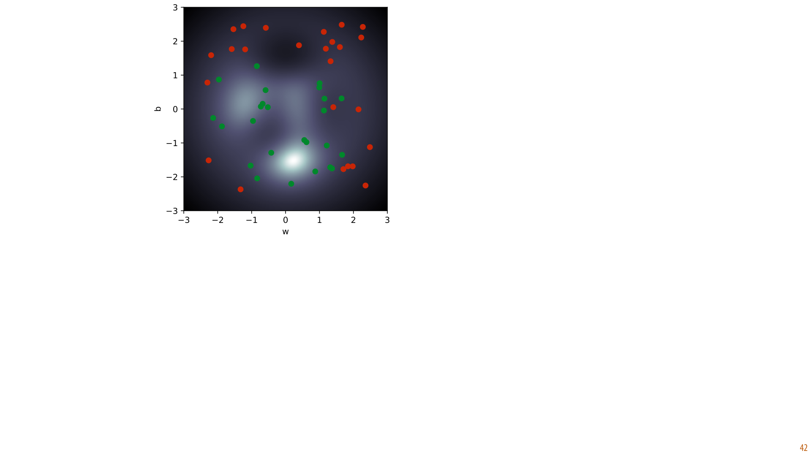

            <figcaption>
            
Here’s what a very basic evolutionary search looks like on our non-convex loss surface. We start with a population of 50 models, and compute the loss for each. We kill the worst 50% (the red dots) and keep the best 50% (the green dots).  

We then create a new population (the blue crosses), by randomly pairing up parents from the green population, and taking the point halfway between the two parents, with a little noise added. Finally, we take the blue crosses as the new population and repeat the process.

            </figcaption>
            click image for animation
       </section>

       <section id="slide-043">
            <a class="slide-link" href="http://mlvu.github.io/linear#slide-043" title="Link to this slide.">link here</a>
            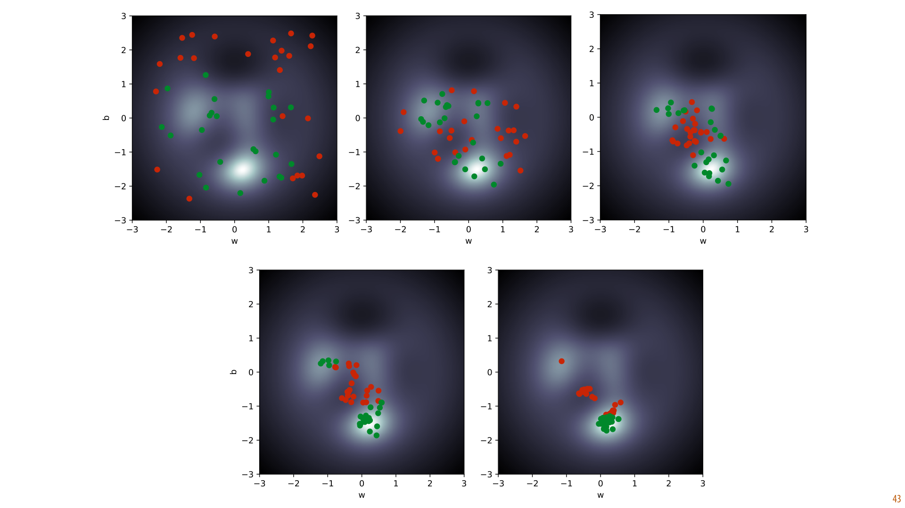

            <figcaption>
            
Here are five iterations of the algorithm. Note that in the intermediate stages, the population covers both the local and the global minima.

            </figcaption>
       </section>

       <section id="slide-044">
            <a class="slide-link" href="http://mlvu.github.io/linear#slide-044" title="Link to this slide.">link here</a>
            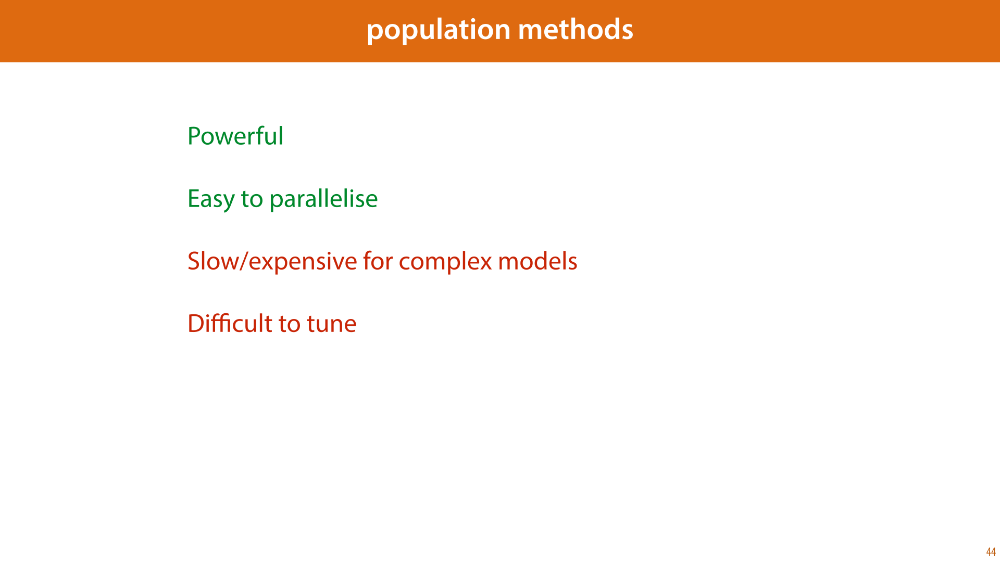

            <figcaption>
            
Population methods are very powerful, but computing the loss for so many different models is often expensive. They can also come with a lot of different parameters to control the search, each of which you will need to carefully tune.

            </figcaption>
       </section>

       <section id="slide-045">
            <a class="slide-link" href="http://mlvu.github.io/linear#slide-045" title="Link to this slide.">link here</a>
            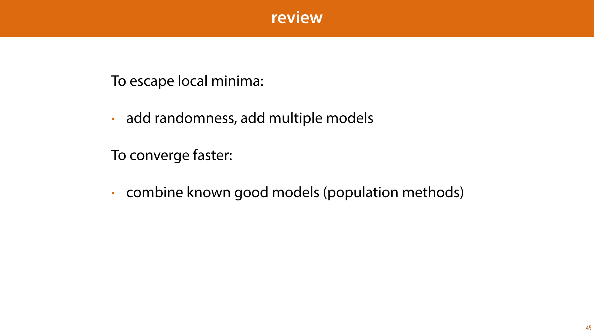

            <figcaption>
            

            </figcaption>
       </section>

       <section id="slide-046">
            <a class="slide-link" href="http://mlvu.github.io/linear#slide-046" title="Link to this slide.">link here</a>
            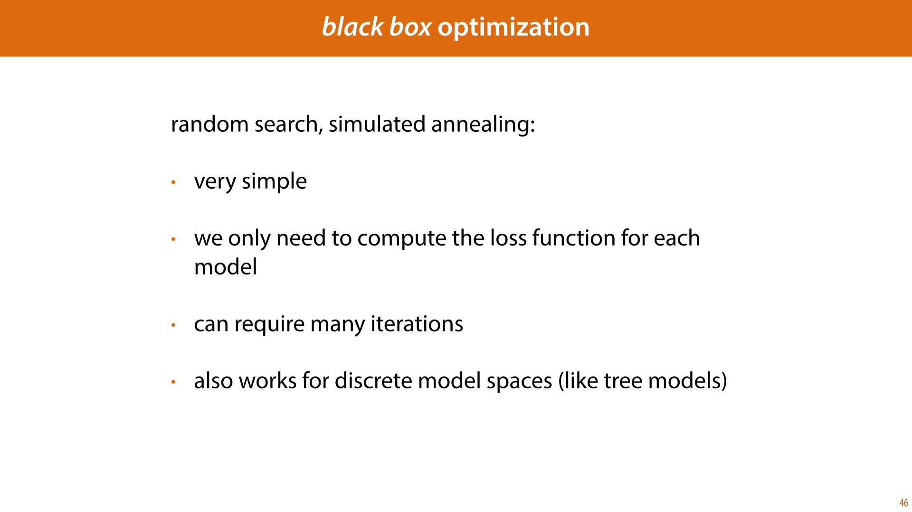

            <figcaption>
            
All these search methods are instances of <strong>black box optimization</strong>. 

Black box optimization refers to those methods that only require us to be able to compute the loss function. We don’t need to know anything about the internals of the model. These are usually very simple starting points. Often, there is some knowledge about your model that you can add to improve the search, but sometimes the black box approach is good enough. If nothing else, they serve as a good starting point and point of comparison for the more sophisticated approaches. 

In the next video we’ll look at a way to improve the search by opening up the black box for continuous models: gradient descent.

            </figcaption>
       </section>

        <section class="video" id="video-046">
            <a class="slide-link" href="http://mlvu.github.io/linear#video-46">link here</a>
           <video controls>
                <source src="https://surfdrive.surf.nl/files/index.php/s/0WVzpZvce6RqVl4/download" type="video/mp4" />

                Download the <a href="https://surfdrive.surf.nl/files/index.php/s/0WVzpZvce6RqVl4/download">video</a>.
           </video>
        </section>

       <section id="slide-047">
            <a class="slide-link" href="http://mlvu.github.io/linear#slide-047" title="Link to this slide.">link here</a>
            

            <figcaption>
            
 

            </figcaption>
       </section>

       <section id="slide-048">
            <a class="slide-link" href="http://mlvu.github.io/linear#slide-048" title="Link to this slide.">link here</a>
            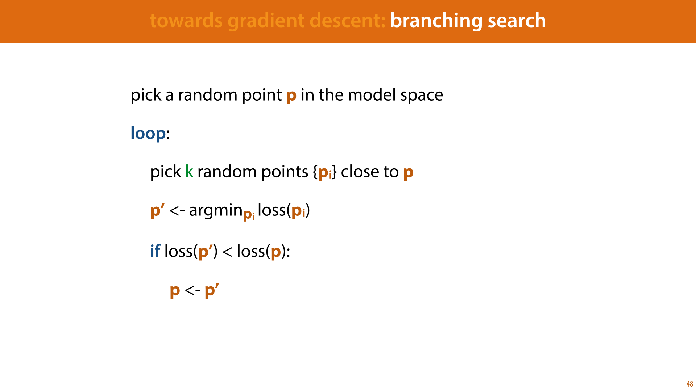

            <figcaption>
            
As a stepping stone to what we’ll discuss in this video, let’s take the random search from the previous video, and add a little more inspection of the local neighborhood before taking a step. Instead of taking one random step, we’ll look at k random steps and move in the direction of the one that gives us the lowest loss. 

In the hiker analogy, you can think of this algorithm as the case where the hiker taps his foot on the ground in a couple of random directions, and then moves in the direction with the strongest downward slope.

            </figcaption>
       </section>

       <section id="slide-049">
            <a class="slide-link" href="http://mlvu.github.io/linear#slide-049" title="Link to this slide.">link here</a>
            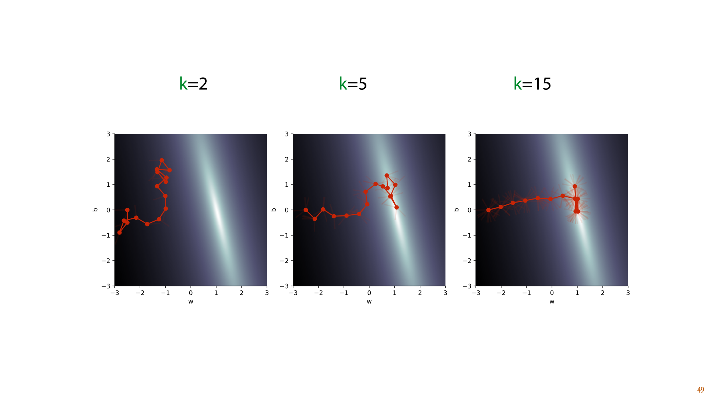

            <figcaption>
            
Here's what that looks like for a few values of k. 

As you can see, the more samples we take, the more directly we head for the region of  low loss. The more closely we inspect our local neighbourhood, to determine in which direction the function decreases quickest, the faster we converge. 

The lesson here is that the better we know in which direction the loss decreases, the faster our search converges. In this case we pay a steep price: we have to evaluate our function 15 times to work out a better direction.

            </figcaption>
       </section>

       <section id="slide-050">
            <a class="slide-link" href="http://mlvu.github.io/linear#slide-050" title="Link to this slide.">link here</a>
            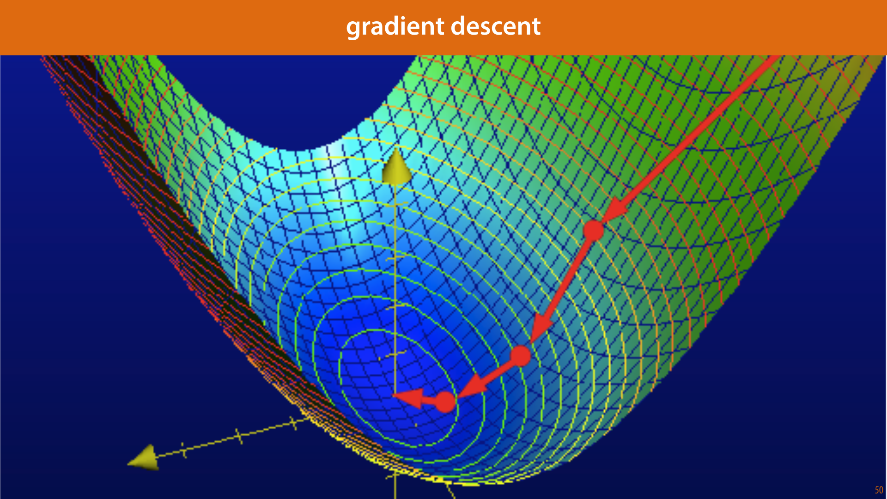

            <figcaption>
            
However, if our model space is continuous, and if our loss function is smooth, we don’t<em> need </em>to take multiple samples to guess the direction of fastest descent: <em>we can simply derive it, using calculus</em>. This is the basis of the <strong>gradient descent algorithm</strong>. 

image source: <a href="http://charlesfranzen.com/posts/multiple-regression-in-python-gradient-descent/"><strong class="blue">http://charlesfranzen.com/posts/multiple-regression-in-python-gradient-descent/</strong></a>

<a href="http://charlesfranzen.com/posts/multiple-regression-in-python-gradient-descent/"><strong class="blue"></strong></a>

            </figcaption>
       </section>

       <section id="slide-051">
            <a class="slide-link" href="http://mlvu.github.io/linear#slide-051" title="Link to this slide.">link here</a>
            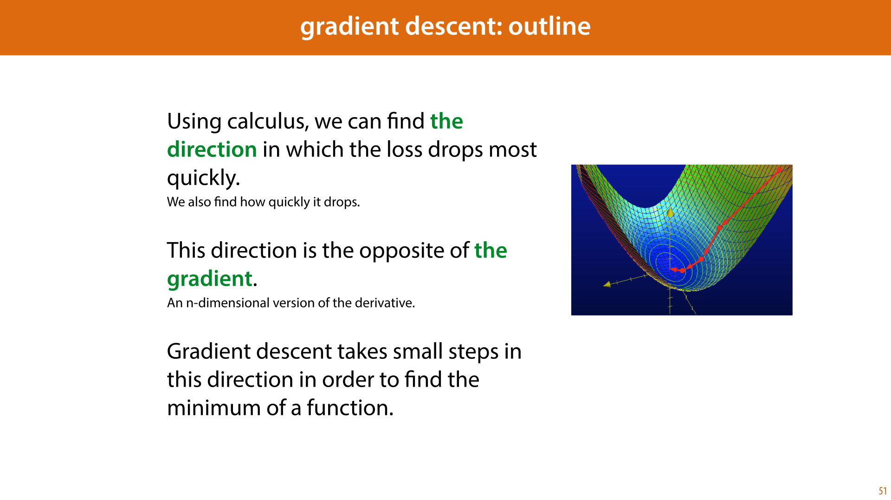

            <figcaption>
            
The idea of gradient descent is relatively simple, but it’s easy to get blinded by the mathematical notation. Here are the main ideas to keep in mind. 

            </figcaption>
       </section>

       <section id="slide-052">
            <a class="slide-link" href="http://mlvu.github.io/linear#slide-052" title="Link to this slide.">link here</a>
            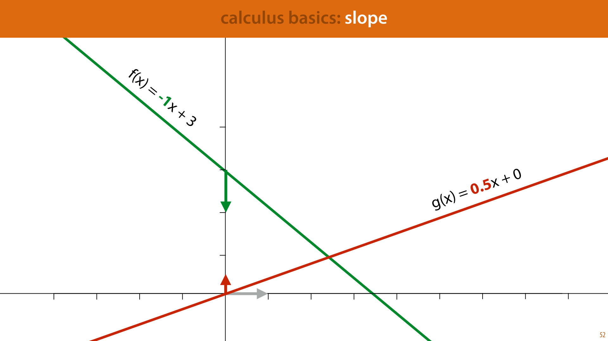

            <figcaption>
            
Before we dig in to the gradient descent algorithm, let’s review some basic principles from calculus. First up, <strong>slope</strong>. The slope of a linear function is simply <strong>how much it moves up</strong> if we move one step to the right. In the case of f(x) in this picture, the slope is <em>negative</em>, because the line moves down. 
<aside    >In our 1D regression model, the parameter w was the slope. In this case, however we will investigate the slope of a linear function approximation the loss landscape, not of the model (be sure not to confuse these two).</aside><aside    ></aside>
            </figcaption>
       </section>

       <section id="slide-053" class="anim">
            <a class="slide-link" href="http://mlvu.github.io/linear#slide-053" title="Link to this slide.">link here</a>
            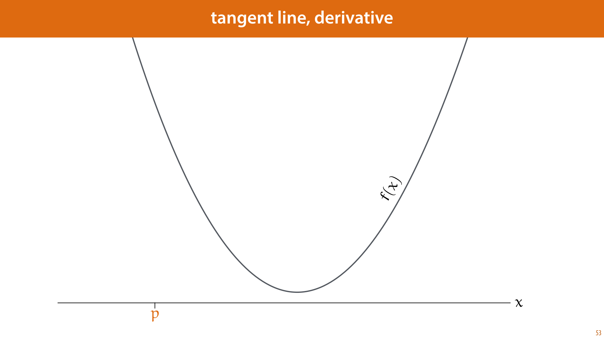

            <figcaption>
            
The <strong>tangent line </strong>of a function at particular point p is the line that just touches the function at <strong>x</strong> without crossing it. The tangent line is a kind of <strong>approximatio</strong>n to our function. So long as we stay close to p, the function f(x) and the tangent line g(x) behave very similarly. 

This is where the <strong>derivative</strong> f’(x) comes in. The<strong> derivative of a function gives us the slope of the tangent line</strong>. Since the slope tells us how quickly a function rises, and the tangent line is an approximation to f(x) at p, the slope of the tangent line tells us how quickly f(x) rises around the point p. 

Traditionally, we find the minimum of a function by setting the derivative equal to 0 and solving for x. This gives us the point where the tangent line has slope 0, and is therefore horizontal.  

For complex models, it may not be possible to solve for x in this way. However, we can still use the derivative to <em>search </em> for the minimum. Looking at the example in the slide, we note that the tangent line moves down (i.e. the slope is negative). This tells us that we should move to the right to follow the function downward. As we take small steps to the right, the derivative stays negative, but gets smaller and smaller as we close in on the minimum. This suggests that the <em>magnitude</em> of the slope lets us know how big the steps are that we should take. That is, if the slope of the tangent line is big, the function is dropping quickly, and we can take a big step. If the slope of the tangent line is small, the function is dropping more slowly, and we might be getting closer to the minimum. 
<aside    >This assumes that a function doesn’t suddenly change from dropping very steeply to flattening out. That’s not always true, but it’s a reasonable hypothesis to start from. As we will see later, gradient descent can always correct if the assumption is wrong. </aside>
The first thing we need to do, is to extend this idea to functions of multiple inputs. 

            </figcaption>
            click image for animation
       </section>

       <section id="slide-054" class="anim">
            <a class="slide-link" href="http://mlvu.github.io/linear#slide-054" title="Link to this slide.">link here</a>
            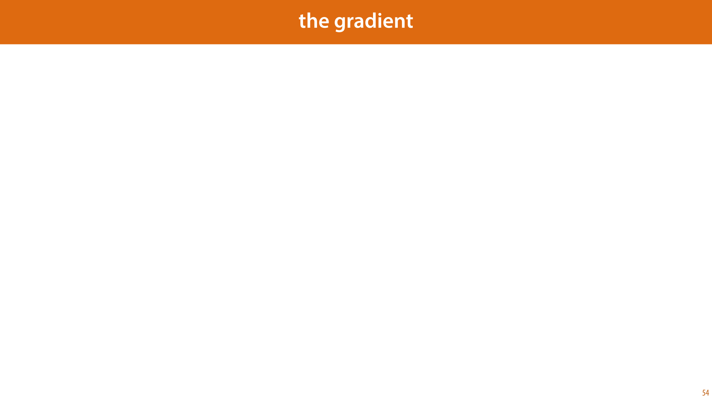

            <figcaption>
            
To apply this principle in machine learning, we’ll need to generalize it for loss functions with multiple inputs (i.e. for models with multiple parameters). We do this by generalizing the tangent line to a tangent (hyper)plane. The derivative then becomes a <strong>gradient</strong> vector that describes the way this hyperplane is angled. 

Once we have this hyperplane, we can use it to work out in which direction the function grows and shrinks the quickest. As in the one-dimensional case, the tangent hyperplane is a <strong>local approximation of the function</strong>. Zoomed out like this, the hyperplane and the function look nothing alike, but if we zoom in close enough on the point where they touch, they behave almost exactly the same.  

This is useful, because in a hyperplane it's very easy to see in which direction it goes down the quickest. Much easier than it is for a complicated beast like our loss function itself. Since the hyperplane approximates the loss function, this is also the direction in which the loss decreases the quickest. At least, so long as we don't move away too far from the neighborhood where the hyperplane is a good approximation of the loss function. 

            </figcaption>
            click image for animation
       </section>

       <section id="slide-055" class="anim">
            <a class="slide-link" href="http://mlvu.github.io/linear#slide-055" title="Link to this slide.">link here</a>
            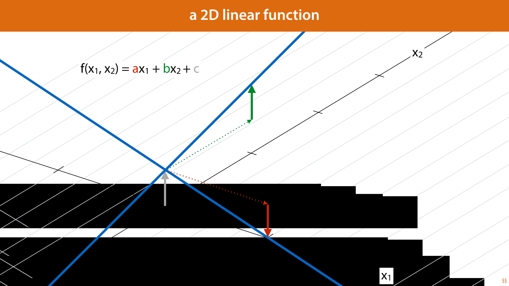

            <figcaption>
            
Remember, that this is how we express a linear function in n dimensions: we assign each dimension a slope, and add a single bias (c). 

In this image, the two weights of the linear function (a and b) are just one slope per dimension. If we move one step in the direction of  x1, we move up by a, and if we move one step in the direction of  x2, we move up by b. 
<aside    >This is the same picture we saw earlier for the linear function, but we're using it in a different way. Earlier, it represented a model with two features and three parameters. Here, it will serve as a linear approximation for a loss surface for a model with two parameters. That is, the plane x1, x2 is our model space, not our feature space, and the hyperplane is not a single model, but a stand-in for our loss function. </aside>
 

            </figcaption>
            click image for animation
       </section>

       <section id="slide-056" class="anim">
            <a class="slide-link" href="http://mlvu.github.io/linear#slide-056" title="Link to this slide.">link here</a>
            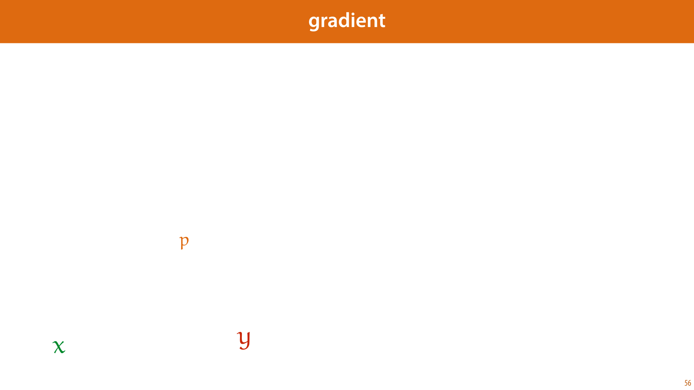

            <figcaption>
            
We are now ready to show haw the gradient can be worked out. Any function from n inputs to one output has n variables for which we can take the derivative. These are called <strong>partial derivatives</strong>: they work the same way as regular derivatives, except that you when you take the derivative with respect to one variable x, you treat the other variables (y) as constants. 

One thing that is sometimes a little confusing is that the gradient of a function f(·) is often written as another function ∇f(·). This ∇f(·) tells us not what the gradient is at a specific point but for all points. This is the same with the derivative: at a particular point, the derivative is some numerical value, but over all points, the derivative of f(x) is another function f’(x). If we take the gradient to be a function like this, then the tangent hyperplane of f(<strong>x</strong>) <em>at point </em><em>p</em> is the function g(<strong>x</strong>) = ∇f(<strong>p</strong>)T<strong>x</strong> + c. 

It is on this linear function, g(<strong>x</strong>) that we want to work out the direction of steepest ascent. The answer will be that the gradient ∇f(<strong>p</strong>) points exactly in that direction. 
<aside    >The gradient is sometimes defined as a row vector, and sometimes as a column vector. In machine learning contexts, the latter usually makes most sense.</aside><aside    ></aside>
            </figcaption>
            click image for animation
       </section>

       <section id="slide-057" class="anim">
            <a class="slide-link" href="http://mlvu.github.io/linear#slide-057" title="Link to this slide.">link here</a>
            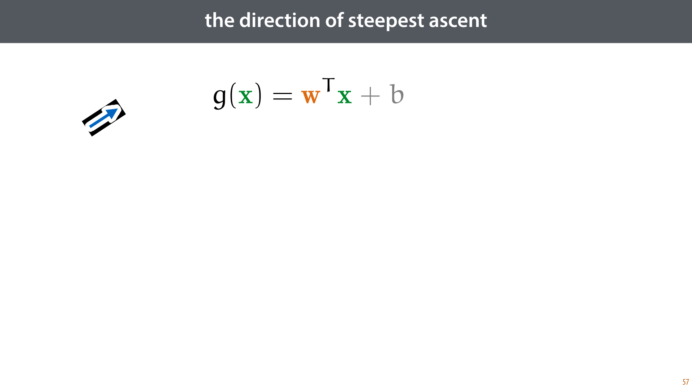

            <figcaption>
            
To make this clear, we will write <strong>w</strong> = ∇f(<strong>p</strong>), so that g(<strong>x</strong>) looks like a plain old linear function. All we want to show is that w is the direction in which this function grows the quickest. 

Since g(<strong>x</strong>) is linear, many details don’t matter: we can set the bias b to zero, since that just translates the hyperplane up or down. Next, It doesn’t matter <em>how big </em>a step we take in any direction, so we’ll take a step of size 1. Finally, it doesn’t matter where we start from, so we will just start from the origin. So the question becomes: for which input <strong>x</strong> of magnitude 1 (which unit vector) does g(<strong>x</strong>) provide the biggest output? 

To see the answer, we need to use the geometric definition of the dot product. Since we required that ||<strong>x</strong>||= 1<strong>,</strong> this disappears from the equation, and we only need to maximize the quantity ||<strong>w</strong>|| cos(α) (where only α depends on our choice of <strong>x</strong>, and <strong>w</strong> is the gradient we computed). cos(α) is maximal when α is zero: that is, when <strong>x</strong> and <strong>w</strong> are pointing in the same direction. 

In short: w, the gradient,  <em>is</em> the direction of steepest ascent. This means that -w is the direction of steepest <em>descent</em>. 

            </figcaption>
            click image for animation
       </section>

       <section id="slide-058">
            <a class="slide-link" href="http://mlvu.github.io/linear#slide-058" title="Link to this slide.">link here</a>
            

            <figcaption>
            

            </figcaption>
       </section>

       <section id="slide-059">
            <a class="slide-link" href="http://mlvu.github.io/linear#slide-059" title="Link to this slide.">link here</a>
            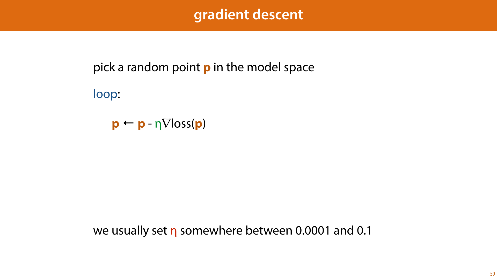

            <figcaption>
            
Here is the <strong>gradient descent algorithm</strong>. Starting from some candidate <strong>p</strong>, we simply compute the gradient at <strong>p</strong>, subtract it from the current choice, and iterate this process: 

We<em> subtract</em>, because the gradient points <em>uphill</em>. Since the gradient is the direction of steepest ascent, the negative gradient is the direction of steepest <em>de</em>scent. 

Since the gradient is only a<em> local approximation </em>to our loss function, the bigger our step, the more we go wrong because the approximation is incorrect. Usually, we scale down the step size indicated by the gradient by multiplying it by a value η (eta),  called the<strong> learning rate</strong>. This value is chosen by trial and error, and remains constant throughout the search (at least in the simplest version of the algorithm). 

<strong>Note again a potential point of confusion:</strong> we have two linear functions here.  One is the <em>model</em>, whose parameters are indicated by <strong class="red">w</strong> and b. The other is the tangent hyperplane to the loss function, whose slope is indicated by ∇loss(<strong>p</strong>) here. These are different functions on different spaces. 

We can iterate for a fixed number of iterations, until the loss gets low enough, or until the gradient gets close enough to the zero vector, which implies we've reached a local minimum.

            </figcaption>
       </section>

       <section id="slide-060">
            <a class="slide-link" href="http://mlvu.github.io/linear#slide-060" title="Link to this slide.">link here</a>
            

            <figcaption>
            

            </figcaption>
       </section>

       <section id="slide-061">
            <a class="slide-link" href="http://mlvu.github.io/linear#slide-061" title="Link to this slide.">link here</a>
            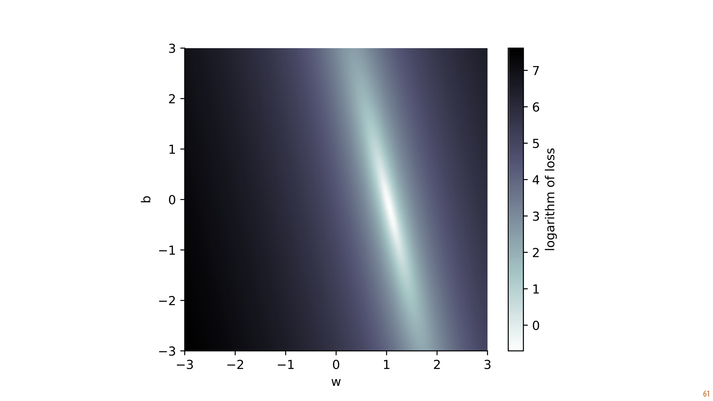

            <figcaption>
            
Let’s go back to our example problem, and see how we can apply gradient descent here. 

Unlike random search, it’s not enough to just compute the loss for a given model,<strong> we need the gradient of the loss</strong>. We'll start by working this out.

            </figcaption>
       </section>

       <section id="slide-062" class="anim">
            <a class="slide-link" href="http://mlvu.github.io/linear#slide-062" title="Link to this slide.">link here</a>
            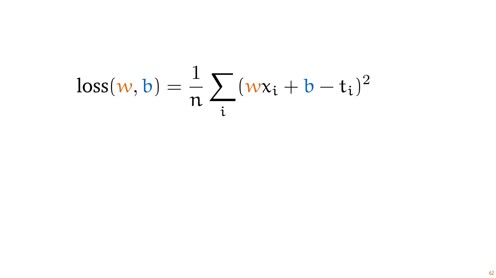

            <figcaption>
            
Here is our loss function again. The gradient is just a vector of all the partial derivatives we can take for it: one for the parameter w and one for the parameter b. 
<aside    >To simplify the notation we’ve let xi refer to the only feature of instance i.</aside><aside    ></aside>
            </figcaption>
            click image for animation
       </section>

       <section id="slide-063" class="anim">
            <a class="slide-link" href="http://mlvu.github.io/linear#slide-063" title="Link to this slide.">link here</a>
            

            <figcaption>
            
Here are the derivations of the two partial derivatives: 

first we use the <em>sum rule</em>, moving the derivative inside the sum symbol 

then we use the <em>chain rule</em>, to split the function into the composition of computing the residual and squaring, computing the derivative of each with respect to its argument. 

The second homework exercise, and the formula sheet both provide a list of the most common rules for derivatives. 
<aside    >On your first pass through the slides, it's ok to take my word for it that these are the derivatives and to skip the derivation. However, there are a lot more derivations like these coming up, so you should work through every step before moving on to the next lecture, or you'll struggle in the later parts of the course.</aside><aside    ></aside>
            </figcaption>
            click image for animation
       </section>

       <section id="slide-064" class="anim">
            <a class="slide-link" href="http://mlvu.github.io/linear#slide-064" title="Link to this slide.">link here</a>
            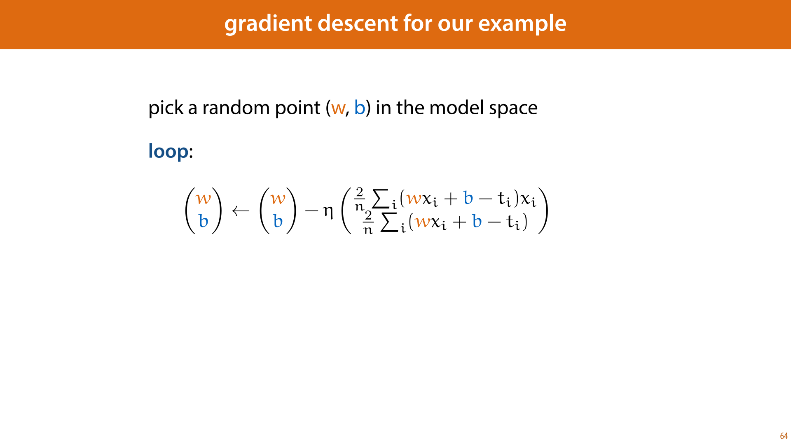

            <figcaption>
            
Here's what we've just worked out. Gradient descent, but specific to this particular model. We start with some initial guess, compute the gradient of the loss with the two functions we've just worked out, and we subtract that vector (times some scalar η) from our current guess.  

Hopefully, repeating this process a number of times in small steps will directly follow the loss surface down to a (local) minimum.

            </figcaption>
            click image for animation
       </section>

       <section id="slide-065">
            <a class="slide-link" href="http://mlvu.github.io/linear#slide-065" title="Link to this slide.">link here</a>
            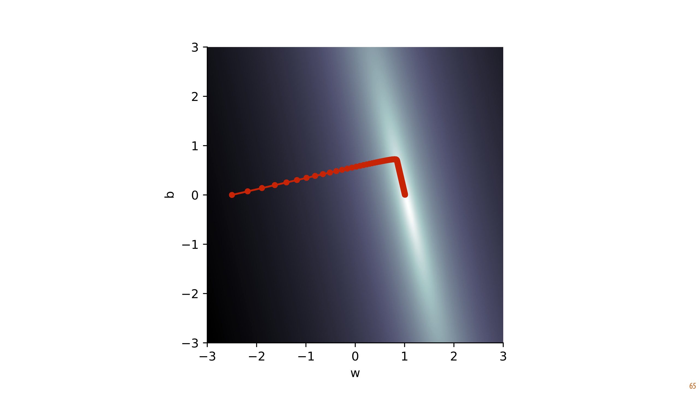

            <figcaption>
            
Here is the result on our dataset. Note how the iteration converges directly to the minimum. Note also that we have no <em>rejections</em> anymore. The algorithm is fully deterministic: it computes the optimal step, and takes it. There is no trial and error. 

Note also that the gradient gives us a direction and a <strong>step size</strong>. As we get closer to the minimum, the function <em>flattens out</em> and the magnitude of the gradient decreases. The effect is that as we approach the minimum, the algorithm automatically takes smaller and smaller steps, preventing us from overshooting the optimum.

            </figcaption>
       </section>

       <section id="slide-066">
            <a class="slide-link" href="http://mlvu.github.io/linear#slide-066" title="Link to this slide.">link here</a>
            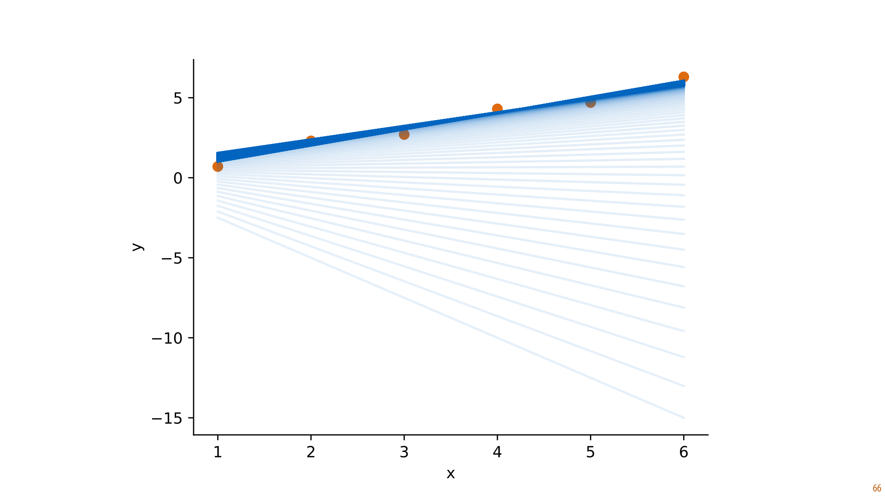

            <figcaption>
            
Here is what it looks like in feature space.

            </figcaption>
       </section>

       <section id="slide-067">
            <a class="slide-link" href="http://mlvu.github.io/linear#slide-067" title="Link to this slide.">link here</a>
            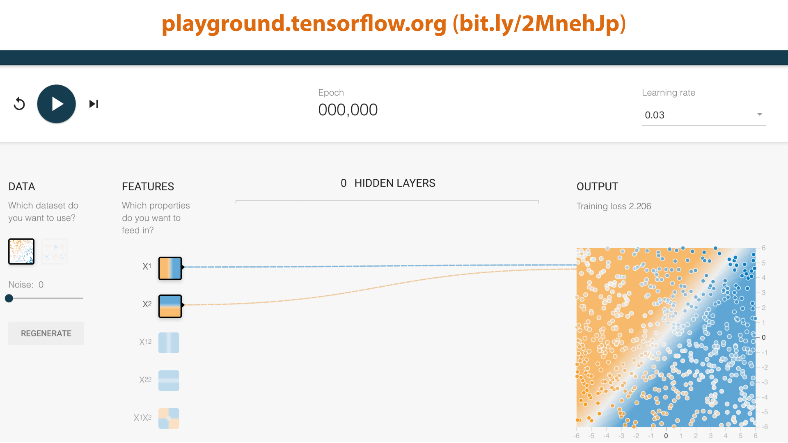

            <figcaption>
            
Here is a very helpful little browser app that we’ll return to a few times during the course. It contains a few things that that we haven't discussed yet, but if you remove all hidden layers, and set the target to regression, you'll get a linear classifier of the kind that we've been discussing. Click the following link to see a version with only the currently relevant features: <a href="http://playground.tensorflow.org/#activation=tanh&amp;batchSize=10&amp;dataset=circle&amp;regDataset=reg-plane&amp;learningRate=0.001&amp;regularizationRate=0&amp;noise=0&amp;networkShape=&amp;seed=0.16598&amp;showTestData=false&amp;discretize=false&amp;percTrainData=50&amp;x=true&amp;y=true&amp;xTimesY=false&amp;xSquared=false&amp;ySquared=false&amp;cosX=false&amp;sinX=false&amp;cosY=false&amp;sinY=false&amp;collectStats=false&amp;problem=regression&amp;initZero=false&amp;hideText=false&amp;showTestData_hide=false&amp;activation_hide=true&amp;numHiddenLayers_hide=true&amp;batchSize_hide=true&amp;stepButton_hide=false&amp;problem_hide=true&amp;noise_hide=false&amp;discretize_hide=false&amp;regularization_hide=true&amp;regularizationRate_hide=true&amp;percTrainData_hide=false"><strong class="blue">playground.tensorflow.com</strong></a> We will enable different additional features as we discuss them in the course. 

The output for the data is indicated by the color of the points, the output of the model is indicated by the colouring of the plane. 
<aside    >Note that the page calls this model a neural network (which we won’t discuss for a few more weeks). Linear models are just a very simple neural network.</aside><aside    ></aside>
            </figcaption>
       </section>

       <section id="slide-068">
            <a class="slide-link" href="http://mlvu.github.io/linear#slide-068" title="Link to this slide.">link here</a>
            

            <figcaption>
            
If our function is non-convex, gradient descent doesn’t help us with the problem of local minima. As we see here, it heads straight for the nearest minimum and stays there. To make the algorithm more robust against this type of thing, we need to add a little randomness back in, preferably without destroying the behaviour of moving so cleanly to a minimum once one is found. 

We can also try multiple runs from different starts. Later we will see <em>stochastic</em> gradient descent, which computes the gradient only over subsets of the data (making the algorithm more efficient, and adding a little randomness at the same time).

            </figcaption>
       </section>

       <section id="slide-069">
            <a class="slide-link" href="http://mlvu.github.io/linear#slide-069" title="Link to this slide.">link here</a>
            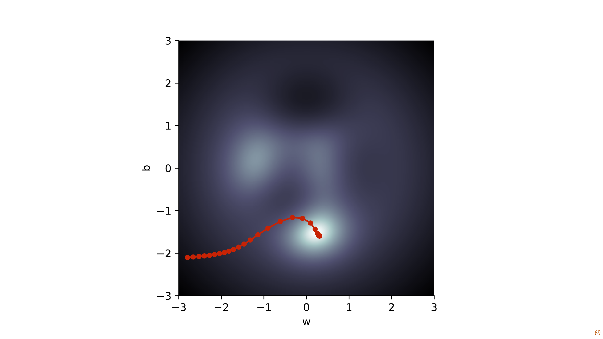

            <figcaption>
            
Here is a run with a more fortunate starting point. 
<aside    >The point of convergence seems a little off in these images. The partial derivatives for this function are very complex (I used<a href="https://goo.gl/zbeidi"><strong class="blue"> Wolfram Alpha</strong></a> to find them), so most likely, the implementation has some numerical instability.</aside><aside    ></aside>
            </figcaption>
       </section>

       <section id="slide-070">
            <a class="slide-link" href="http://mlvu.github.io/linear#slide-070" title="Link to this slide.">link here</a>
            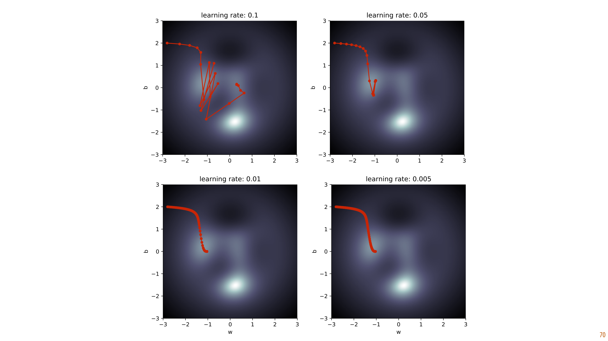

            <figcaption>
            
Here, we see the effect of the learning rate. If we set if too high, the gradient descent jumps out of the first minimum it finds. A little lower and it stays in the neighborhood of the first minimum, but it sort of bounces from side to side, only very slowly moving towards the actual minimum. 

At 0.01, we find a sweet spot where it finds the local minimum pretty quickly. At 0.005 we see the same behavior, but we need to wait much longer, because the step sizes are so small. 

The best value of the learning rate is different for each dataset and each model. You'll usually have to find it by trial and error. We'll talk a little more about how this looks in practice in the next lecture.

            </figcaption>
       </section>

       <section id="slide-071">
            <a class="slide-link" href="http://mlvu.github.io/linear#slide-071" title="Link to this slide.">link here</a>
            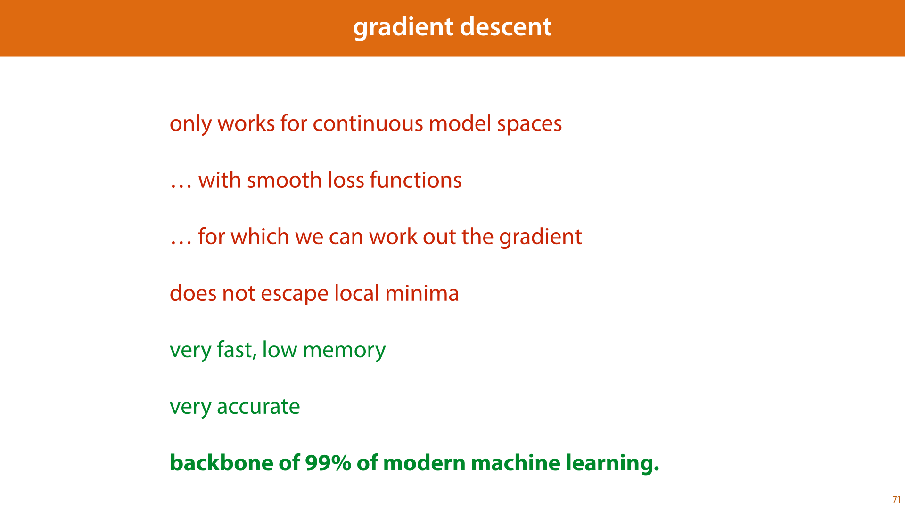

            <figcaption>
            

            </figcaption>
       </section>

       <section id="slide-072">
            <a class="slide-link" href="http://mlvu.github.io/linear#slide-072" title="Link to this slide.">link here</a>
            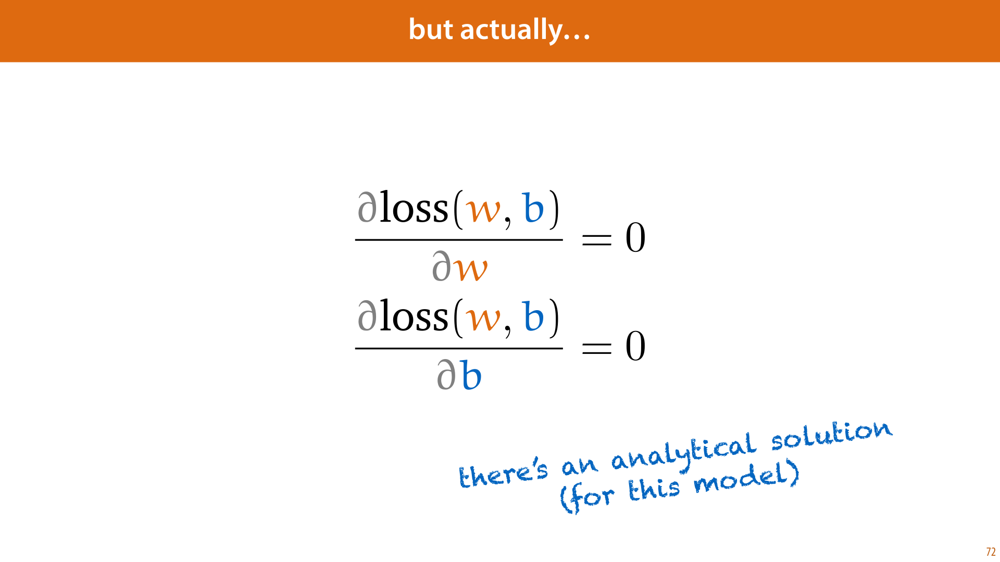

            <figcaption>
            
It’s worth saying that for <strong>linear regression</strong>, although it makes a nice, simple illustration, none of this <em>searching</em> is actually necessary. For linear regression, we can set the derivatives equal to zero and solve explicitly for <strong>w</strong> and for b. This would give us the optimal solution directly without searching. 
<aside    >However, this trick requires more advanced linear algebra to work out than we want to introduce here. You should learn about this in most linear algebra courses, where the problem is called ordinary least squares, and is solved by computing the pseudo-inverse of the data matrix. We won't go down this route in this course because it'll stop working very quickly once we start looking at more complicated models.</aside><aside    ></aside>
            </figcaption>
       </section>

       <section id="slide-073">
            <a class="slide-link" href="http://mlvu.github.io/linear#slide-073" title="Link to this slide.">link here</a>
            

            <figcaption>
            

            </figcaption>
       </section>

        <section class="video" id="video-073">
            <a class="slide-link" href="http://mlvu.github.io/linear#video-73">link here</a>
           <video controls>
                <source src="https://surfdrive.surf.nl/files/index.php/s/xpcqJFUDWMy4E3N/download" type="video/mp4" />

                Download the <a href="https://surfdrive.surf.nl/files/index.php/s/xpcqJFUDWMy4E3N/download">video</a>.
           </video>
        </section>

       <section id="slide-074">
            <a class="slide-link" href="http://mlvu.github.io/linear#slide-074" title="Link to this slide.">link here</a>
            

            <figcaption>
            
 

            </figcaption>
       </section>

       <section id="slide-075">
            <a class="slide-link" href="http://mlvu.github.io/linear#slide-075" title="Link to this slide.">link here</a>
            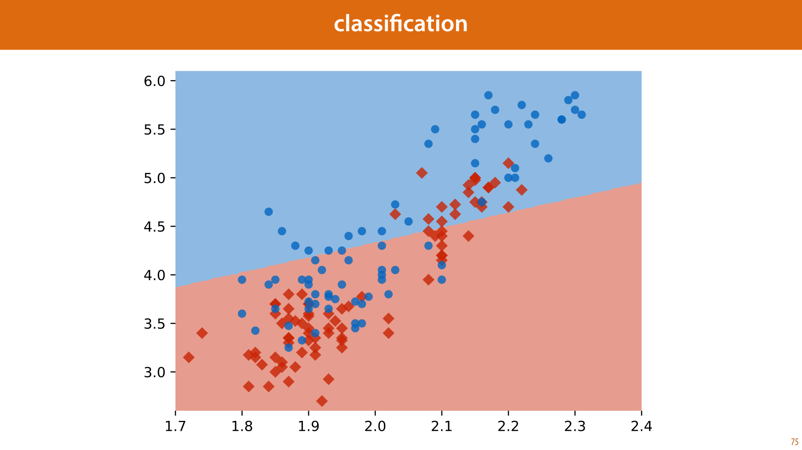

            <figcaption>
            
Now, let’s look at how this works for classification.  

The first question we need to answer is how do we <em>define</em> a linear classifier: that is, a classifier whose decision boundary is always a line (or hyperplane) in feature space.

            </figcaption>
       </section>

       <section id="slide-076">
            <a class="slide-link" href="http://mlvu.github.io/linear#slide-076" title="Link to this slide.">link here</a>
            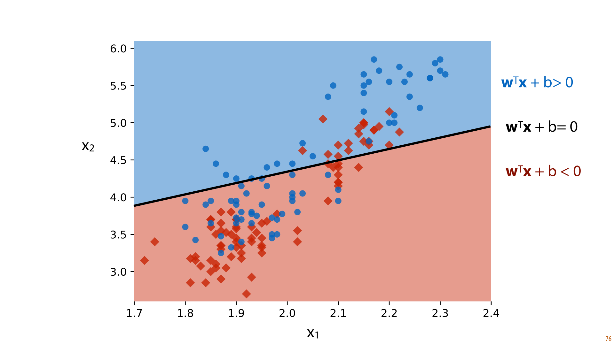

            <figcaption>
            
To define a linear decision boundary, we take the same functional form we used for the linear regression: some weight vector <strong>w</strong>, and a bias b.  

The way we define the decision boundary is a little different than the way we defined the regression line. Here, we say that if <strong>w</strong>T<strong>x</strong> + b is larger than 0, we call <strong>x </strong>one class, if  it is smaller than 0, we call it the other (we’ll stick to binary classification for now). 
<aside    >Note that we are drawing a line again, but in a different space: in the regression example we draw a line in the combined feature and output space (a function from the feature to the output). Here, we have two features, and we are drawing a line in only the feature space.</aside><aside    ></aside>
            </figcaption>
       </section>

       <section id="slide-077">
            <a class="slide-link" href="http://mlvu.github.io/linear#slide-077" title="Link to this slide.">link here</a>
            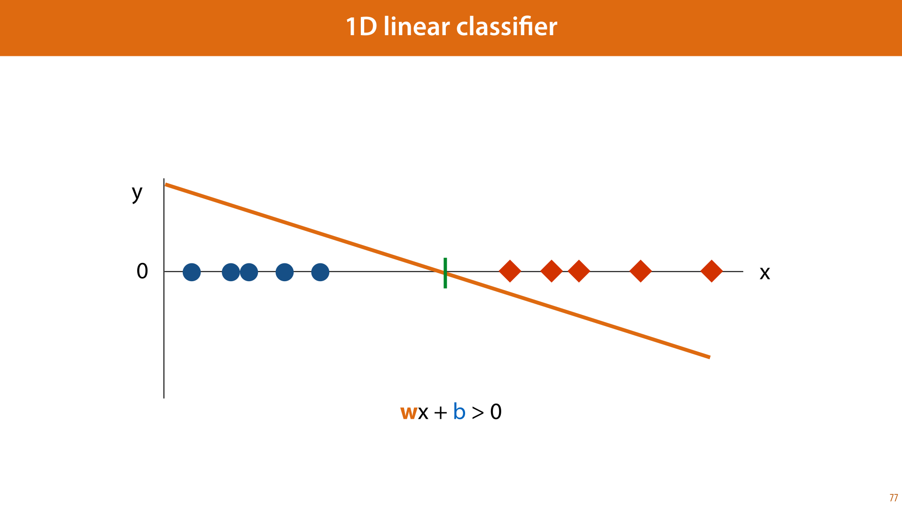

            <figcaption>
            
The actual hyperplane this function y = <strong>w</strong>T<strong>x</strong> + b defines can be thought of as lying above and below the feature space.  

Here it is visualized for the case of one feature. We are defining a linear function from the feature to some output y. Wherever this line lies above the feature space (i.e. is positive), we classify things as the blue/disc class, and wherever the line lies below the feature space (i.e. is negative) we classify them as the red/diamond class.

            </figcaption>
       </section>

       <section id="slide-078">
            <a class="slide-link" href="http://mlvu.github.io/linear#slide-078" title="Link to this slide.">link here</a>
            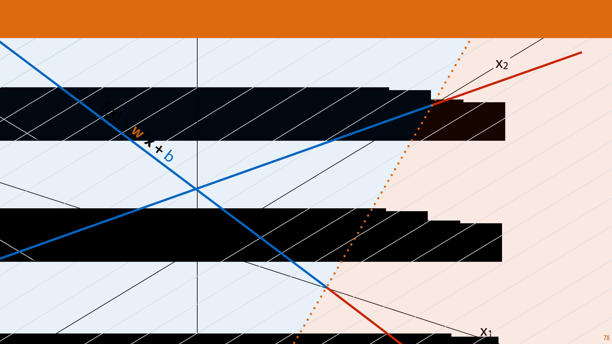

            <figcaption>
            
Here it is in 2D: <strong>w</strong>T<strong>x</strong> + b describes a plane that<strong> intersects</strong> the feature space. The line of intersection is our decision boundary.

            </figcaption>
       </section>

       <section id="slide-079">
            <a class="slide-link" href="http://mlvu.github.io/linear#slide-079" title="Link to this slide.">link here</a>
            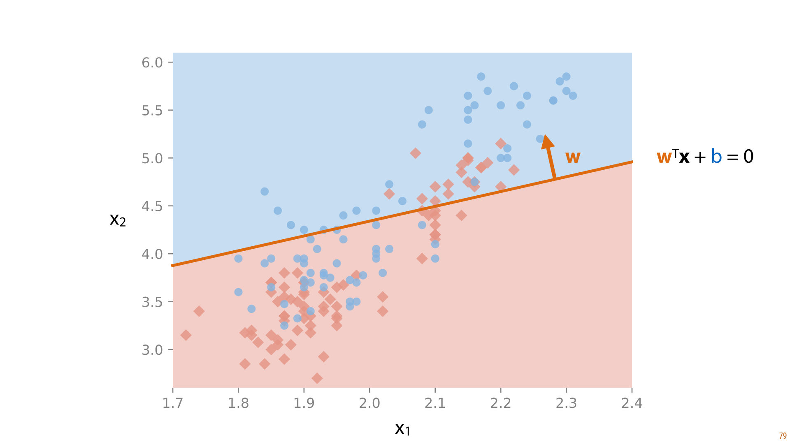

            <figcaption>
            
This also shows us another interpretation of <strong>w</strong>. Since it is the direction of steepest ascent on this hyperplane, it is the vector <strong>perpendicular to the decision boundary</strong>, pointing to the class we assigned to the case where  <strong>w</strong>T<strong>x</strong> + b is larger than 0 (the blue class in this case). 
<aside    >We never want to "ascend" this plane like we do with the hyperplane approximating the loss landscape, but it's useful for our geometric intuition to know where <strong>w</strong> points, relative to our decision boundary. We will use this fact at different points in the future.</aside><aside    ></aside>
            </figcaption>
       </section>

       <section id="slide-080">
            <a class="slide-link" href="http://mlvu.github.io/linear#slide-080" title="Link to this slide.">link here</a>
            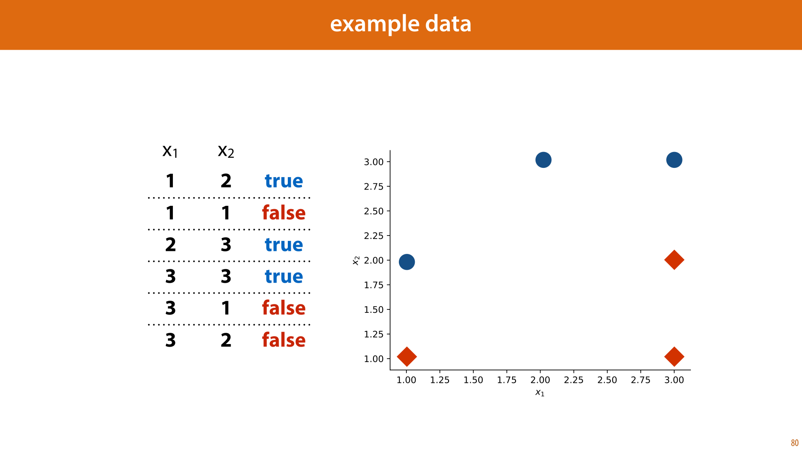

            <figcaption>
            
Here is a simple classification dataset, which we’ll use to illustrate the principle.

            </figcaption>
       </section>

       <section id="slide-081">
            <a class="slide-link" href="http://mlvu.github.io/linear#slide-081" title="Link to this slide.">link here</a>
            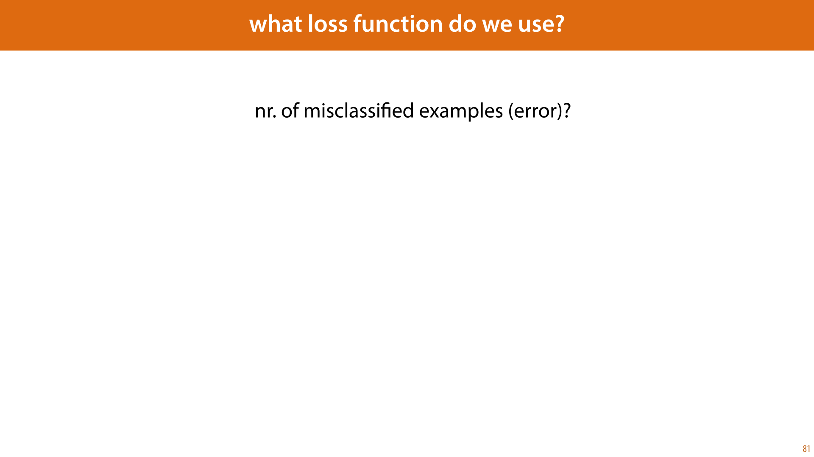

            <figcaption>
            
This gives us a model space, but how do we decide the quality of any particular model? What is our<strong> loss function</strong> for classification? 

The thing we are usually trying to minimize is the <strong>error</strong>: the number of misclassified examples. Sometimes we are looking for something else, but in the simplest classification problems, this is what we are ultimately interested in: a classifier that makes as few mistakes as possible. So let's start there: <em>can we use the error as a loss function?</em>

<em></em>

            </figcaption>
       </section>

       <section id="slide-082">
            <a class="slide-link" href="http://mlvu.github.io/linear#slide-082" title="Link to this slide.">link here</a>
            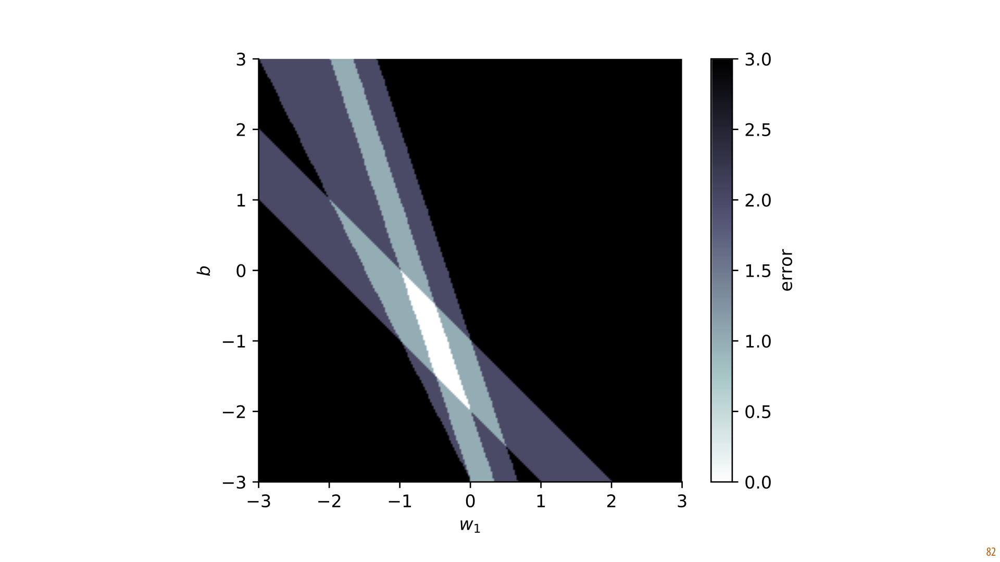

            <figcaption>
            
This is what our loss surface looks like for the error function on our simple dataset. Note that it consists almost entirely of flat regions. This is because changing a model a tiny bit will usually not change the number of misclassified examples. And if it does, the loss function will suddenly jump a lot. 

In these flat regions, random search would have to do a random walk, stumbling around until it finds a ridge by accident.  

Gradient descent would fare even worse: the gradient is zero everywhere in this picture, except exactly on the ridges, where it is undefined. Gradient descent would either crash, or simply never move. 
<aside    >Note that our model now has three parameters w1, w2 and b, so the loss surface is a function on a 3d space (a 4d "surface"). In order to plot it in two dimensions, we have fixed w2=1.</aside><aside    ></aside>
            </figcaption>
       </section>

       <section id="slide-083">
            <a class="slide-link" href="http://mlvu.github.io/linear#slide-083" title="Link to this slide.">link here</a>
            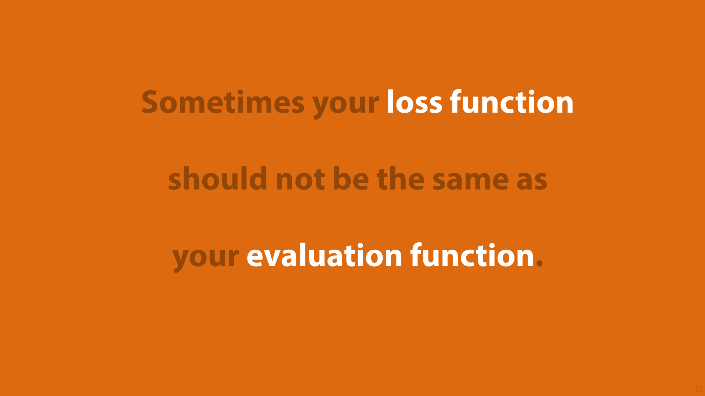

            <figcaption>
            
This is an important lesson about loss functions. They serve two purposes:  

To express what quantity we want to maximize in our search for a good model. 

To provide <strong>a smooth loss surface</strong>, so that we can find a path from a bad model to a good one. 

For this reason, it’s common not to use the error as a loss function, even when it’s the thing we’re actually interested in minimizing. Instead, we’ll replace it by a loss function that has its minimum at (roughly) the same model, but that provides a smooth, differentiable loss surface. 

After we have trained a model we can still <em>evaluate</em> it with the function we're actually interested in (that is, we can still count how many mistakes it makes). We'll discuss evaluation in-depth in the next lecture.

            </figcaption>
       </section>

       <section id="slide-084">
            <a class="slide-link" href="http://mlvu.github.io/linear#slide-084" title="Link to this slide.">link here</a>
            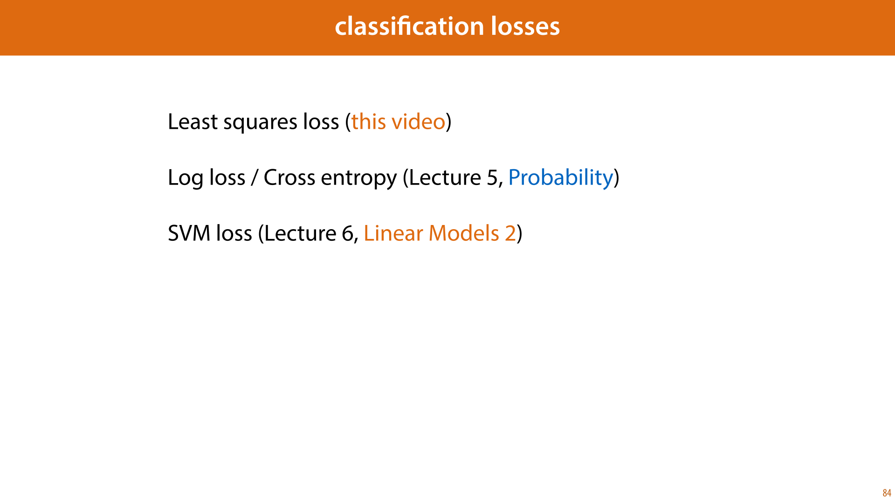

            <figcaption>
            
In this course, we will investigate three common loss functions for classification. The first, least-squares loss, is just an application of MSE loss to classification, we will discuss that in the remainder of the lecture. It's not usually that good, but it gives you an idea of what a classification loss might look like. 

The others require a bit more background, so we’ll save them for later.

            </figcaption>
       </section>

       <section id="slide-085" class="anim">
            <a class="slide-link" href="http://mlvu.github.io/linear#slide-085" title="Link to this slide.">link here</a>
            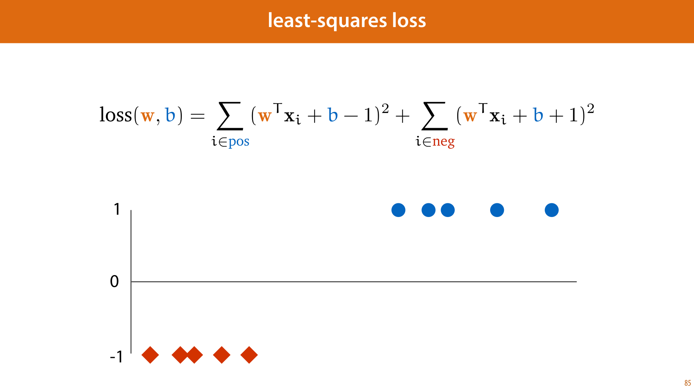

            <figcaption>
            
The least squares classifier essentially turns the classification problem into a regression problem: it assigns points in one class the numeric value +1 and points in the other class the value -1. We then use a basic MSE loss that we saw before the break to train a regression model to predict these numeric values.  

Performing gradient descent with this loss function will result in a line that minimizes the green residuals. Hopefully the points are far enough apart that the decision boundary (the <strong>single point </strong>where the orange line crosses the x axis) separates the two classes. 

As you can see, we always get very big residuals whatever we do. That is because the points simply do not lie on a single line, so the linear model is not appropriate. Still, with a little luck, the best fitting line will be positive for the +1 class and negative for the -1 class. If so the classifier will make the right predictions, even if the model is way off as a regression model for the numeric labels we introduced.

            </figcaption>
            click image for animation
       </section>

       <section id="slide-086" class="anim">
            <a class="slide-link" href="http://mlvu.github.io/linear#slide-086" title="Link to this slide.">link here</a>
            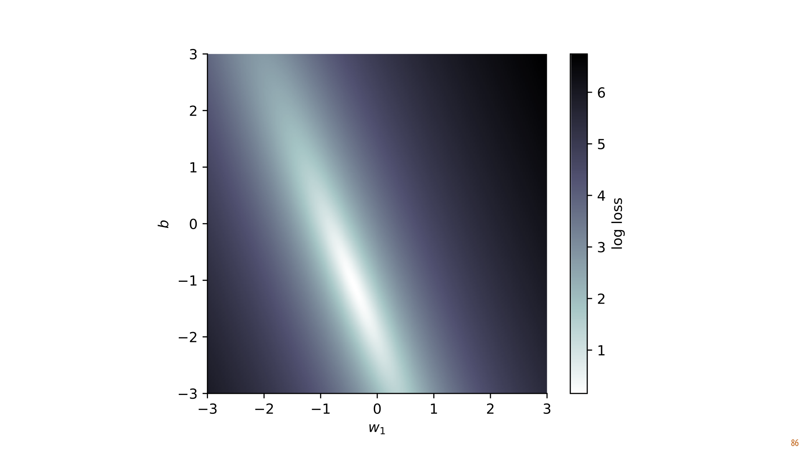

            <figcaption>
            
With this loss function, we note that our loss surface is perfectly smooth. If we overlay the error loss, we see that the minima of the two losses coincide pretty well (for this dataset at least).

            </figcaption>
            click image for animation
       </section>

       <section id="slide-087">
            <a class="slide-link" href="http://mlvu.github.io/linear#slide-087" title="Link to this slide.">link here</a>
            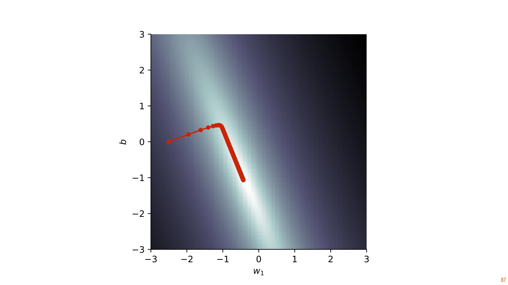

            <figcaption>
            
And gradient descent has no problem finding a solution.  
<aside    >Note, however that the optimum under this loss function may not always perfectly separate the classes, even if they are linearly separable. It does in our case, but this result is not guaranteed.</aside><aside    ></aside>
            </figcaption>
       </section>

       <section id="slide-088">
            <a class="slide-link" href="http://mlvu.github.io/linear#slide-088" title="Link to this slide.">link here</a>
            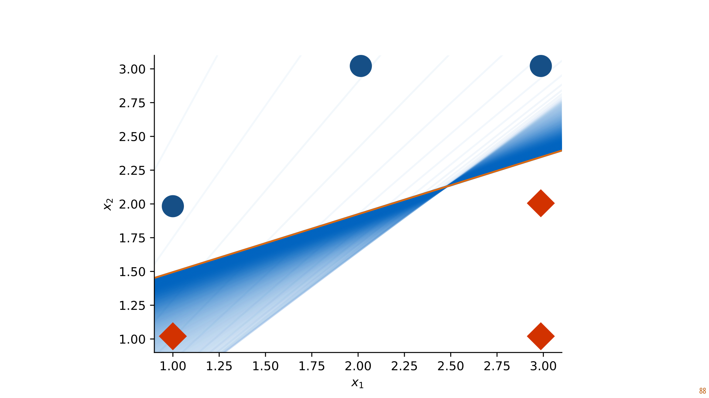

            <figcaption>
            
Here is the result in feature space, with the final decision boundary in orange.

            </figcaption>
       </section>

       <section id="slide-089">
            <a class="slide-link" href="http://mlvu.github.io/linear#slide-089" title="Link to this slide.">link here</a>
            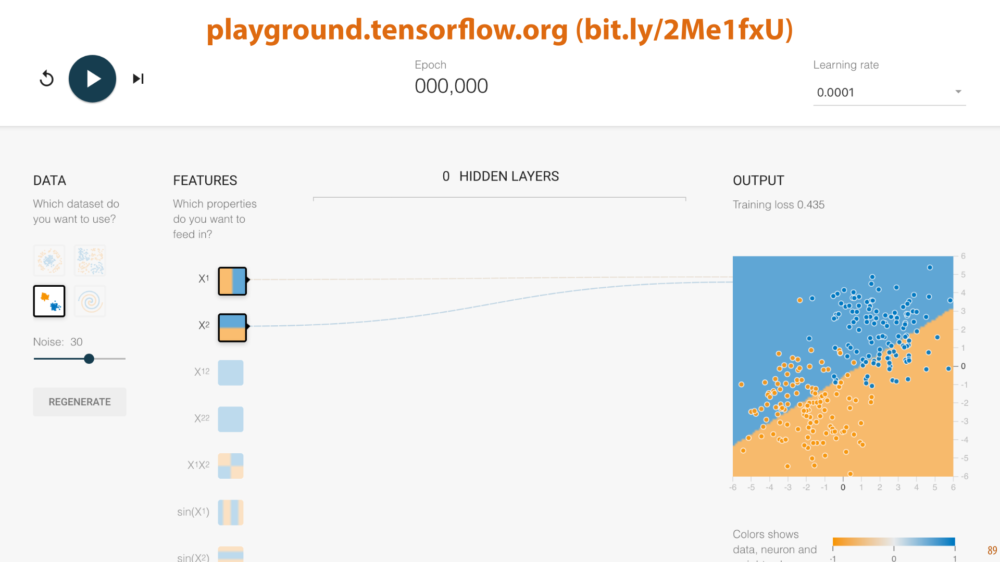

            <figcaption>
            
The tensorflow playground also allows us to play around with linear classifiers. Note that only for one of the two datasets, the linear decision boundary is appropriate. 

Here is <a href="http://playground.tensorflow.org/#activation=tanh&amp;batchSize=10&amp;dataset=gauss&amp;regDataset=reg-plane&amp;learningRate=0.001&amp;regularizationRate=0&amp;noise=35&amp;networkShape=&amp;seed=0.21248&amp;showTestData=false&amp;discretize=true&amp;percTrainData=50&amp;x=true&amp;y=true&amp;xTimesY=false&amp;xSquared=false&amp;ySquared=false&amp;cosX=false&amp;sinX=false&amp;cosY=false&amp;sinY=false&amp;collectStats=false&amp;problem=classification&amp;initZero=false&amp;hideText=false&amp;showTestData_hide=false&amp;activation_hide=true&amp;numHiddenLayers_hide=true&amp;batchSize_hide=true&amp;stepButton_hide=false&amp;problem_hide=false&amp;noise_hide=false&amp;discretize_hide=true&amp;regularization_hide=true&amp;regularizationRate_hide=true&amp;percTrainData_hide=false"><strong class="blue">a link with the relevant features enabled</strong></a>. 
<aside    >This example actually uses a logarithmic loss, rather than a least squares loss, but it should still be intructive to play around with it. We’ll discuss the logarithmic loss in the first probability lecture.</aside><aside    ></aside>
            </figcaption>
       </section>

       <section id="slide-090">
            <a class="slide-link" href="http://mlvu.github.io/linear#slide-090" title="Link to this slide.">link here</a>
            

            <figcaption>
            

            </figcaption>
       </section>

</article>
