<nav class="menu">
    <ul>
        <li class="home"><a href="/">Home</a></li>
        <li class="name">Lecture 0: Preliminaries</li>
                <li><a href="#slide-001">Logs, sums and expectations </a></li>
                <li><a href="#slide-024">Linear Algebra</a></li>
                <li><a href="#slide-058">Calculus</a></li>
                <li><a href="#video-091">Probability</a></li>
        <li class="pdf"><a href="https://mlvu.github.io/lectures/00.Preliminaries.annotated.pdf">PDF</a></li>
    </ul>
</nav>

<article class="slides">

       <section id="slide-001">
            <a class="slide-link" href="https://mlvu.github.io/preliminaries#slide-001" title="Link to this slide.">link here</a>
            

            <figcaption>
            
In this lecture, we'll go over some of the mathematical <em>preliminaries</em>.  The stuff you should know before you start doing machine learning. 

            </figcaption>
       </section>

       <section id="slide-002">
            <a class="slide-link" href="https://mlvu.github.io/preliminaries#slide-002" title="Link to this slide.">link here</a>
            

            <figcaption>
            
The preliminaries we cover in this lecture are just that: preliminaries. They are the things <strong>you should know already</strong>, either from prior courses you've followed, or from your high school education. However, since this course caters to many programs, we cannot fully ensure that all the preliminaries have been perfectly covered in all cases. This lecture describes and explains the basics. If you've never seen this material before, this treatment is probably too brief to get a deep understanding.  

Think of this as a <em>recap</em>: if there's anything in this lecture you've never seen before, make sure to take some time to dig into it a little deeper. If you ever get stuck at any point in the course, it may be that there are some preliminaries you didn't quite cover. 

If you basically know this stuff already, feel free to get started with the lectures, and see how far you get. We try to start slow, and gently ramp up the complexity as the course progresses. With a bit of luck, every step is just enough preparation for the next. If not, and you get stuck on a particularly hairy bit of math, remember that you can always come back here. Perhaps another look at the basic properties of these fundamentals can help you to see what we're doing.  
<aside    >In general, everything we do in the slides is an application of the basic mechanisms presented in this lecture. However, there's a difference between stacking a few bricks together and building a house. At a certain level of complexity, you may lose track of the big picture even if you understand all the individual steps. The key to understanding the complexity, is to get<strong> familiar</strong> with the basic building blocks.</aside><aside    ></aside>
            </figcaption>
       </section>

       <section id="slide-003">
            <a class="slide-link" href="https://mlvu.github.io/preliminaries#slide-003" title="Link to this slide.">link here</a>
            

            <figcaption>
            
Before we get started, a note on what it means to "understand" a mathematical topic. To illustrate, here is a controversial quote from mathematician John von Neumann.  
<aside    >He was speaking to Felix Klein, who had admitted to him that he didn't really understand a certain field of mathematics.  </aside>
Many math teachers hate this quote, because it implies something about rote learning over intuitive understanding. However, von Neumann was no idiot, and there is certainly a deep truth to this statement. 

For me, the key principle he's getting at is the difference between understanding the <em>principle</em> of something and being thoroughly<em> familiar </em>with it, to the extent that you can even use it without conscious effort. As a metaphor, imagine a musical score (i.e. sheet music). I had some lessons as a child, so I understand the principle of sheet music entirely. With some time I can find any note indicated in the score. What I cannot do is <em>sight read</em>: look at a score and play it directly, or hear in my head what it sounds like. That takes more than understanding: it takes <em>practice</em>. 

The same is true for mathematics. You probably understand the ideas of logarithms and sums pretty well already, and after this lecture hopefully a little better. However, to really follow along with complex derivations, you'll need to get so familiar with them that they feel like second nature: like reading, or typing on a keyboard: the sort of thing you can do while concentrating on something else. 

In learning mathematics, sometimes you understand first and then you slowly get used to. Sometimes it's the other way around, and you need to take something you don't fully understand, and play around with it. The more you get used to it, the more you feel like you understand. 
<aside    >It can be quite instructive to read a bit how different mathematicians think about the role of understanding. <a href="https://math.stackexchange.com/questions/11267/what-are-some-interpretations-of-von-neumanns-quote"><strong class="blue">This discussion on the mathematics stackexchange about von Neumann's quote</strong></a> provides a nice selection of perspectives. If you have trouble grasping mathematical concepts, have read through some of the answers. Perhaps your experience is not so different from that of the professionals as you thought. </aside>
To sufficiently "get used" to certain concepts, your need to practice enough to work them into your muscle memory. For all the concepts discussed in this lecture, that is required if you really want to understand machine learning, and we offer some exercises to help you do that. 

 

            </figcaption>
       </section>

       <section id="slide-004">
            <a class="slide-link" href="https://mlvu.github.io/preliminaries#slide-004" title="Link to this slide.">link here</a>
            

            <figcaption>
            
Here is an example of a particularly complex derivation that will come up in one of the later lectures. Without the required context it will be impossible to understand what this is about, or what we're doing here. Don't worry about that. The reason we show this here is to emphasize that even though this looks very complicated, it's using only a few very basic mechanisms that you should be familiar with already: 

Sum (capital sigma) notation 

Logarithms 

Expectations 

(Conditional) probabilities 

Even if you don't understand what this is about, the basic properties of the above four concepts should be enough to tell you how every line follows from the previous. 

Don't worry if that's too much at the moment, we'll work up to this level of complexity step by step. However this hopefully indicates that it's crucial to not just understand these four concepts  but to really <em>get used</em> to them, in the sense of von Neumann. If you do that for the topics covered in this lecture, you should be able to follow along, even with very complex derivations like these.

            </figcaption>
       </section>

       <section id="slide-005">
            <a class="slide-link" href="https://mlvu.github.io/preliminaries#slide-005" title="Link to this slide.">link here</a>
            

            <figcaption>
            
We have a separate section of this lecture dedicated to probabilities. The other three topics from the previous slide, we will discuss here:  logarithms and sum notation. Topics you probably are already a bit familiar with, but which you will need to <em>get used to</em> as well. 

 

            </figcaption>
       </section>

       <section id="slide-006">
            <a class="slide-link" href="https://mlvu.github.io/preliminaries#slide-006" title="Link to this slide.">link here</a>
            

            <figcaption>
            
Here is the basic idea of the logarithm. It's simply the inverse of the the exponent function. If 64 is 2 raised to some power x, what is that number? I'ts log2(64) = 6. 

This doesn't however, go very far to explaining why the logarithm is so special. And special is what it is. 

            </figcaption>
       </section>

       <section id="slide-007">
            <a class="slide-link" href="https://mlvu.github.io/preliminaries#slide-007" title="Link to this slide.">link here</a>
            

            <figcaption>
            
In fact you may not even think of something so simple as an inverse function to require "invention". And yet the invention of the logarithm (or perhaps <em>the method of logarithms</em> is more accurate) by John Napier was a great watershed for the natural sciences. 

This quote (from a book on navigation in from 1958) refers to a small book that Napier published containing simple tables of logarithms. This was a watershed because it allowed people to quickly compute things that would have been terribly laborious before.  

The fundamental reason for this is that logarithms turn<strong> multiplications</strong>, which are complex and laborious to perform without a computer, into <strong>additions</strong>, which are a much simpler business.

            </figcaption>
       </section>

       <section id="slide-008" class="anim">
            <a class="slide-link" href="https://mlvu.github.io/preliminaries#slide-008" title="Link to this slide.">link here</a>
            

            <figcaption>
            
Here is why that is the case. Imagine that we have three positive numbers a, b and c, for which we know that ab = c.  

The trick behind logarithms is that we can choose to refer to a, b and c simply by different names. We know that there must be some number x such that 2x = a. Whatever that number is, we call it x, and we create similar numbers y and z to refer to b and c.  

How does the knowledge that ab = c translate to this new set of names for our numbers? Filling in the multiplication, we get 2x2y = 2z. Now, It is a basic property of exponentation that 2x2y = 2x+y. 
<aside    >If this is news to you, or you've forgotten why this is the case, just try it with some integer exponents: 2324 = 2·2·2·2·2·2·2 = 23 + 4. </aside>
That is, with our new names, <strong>the multiplication has become a sum</strong>. This is why Napier is so famous (at least in certain circles). If you have some horrendous multiplication to compute, all you have to do is <em>rename your numbers</em>. After the renaming, you can sum them and you get a solution for your multiplication in the renamed form, for which you can then look up the original name. The renaming back and forth is what Napier's "little book" allowed people to do: all they had to do was look up the right numbers in a table. 

The renaming function that create these well-behaved numbers is the logarithm. We've used base-2 logarithms here, but any other base would do just as well. 
<aside    >If you want something more concrete try substituting a=16, b=32 and c=512.</aside><aside    ></aside>
            </figcaption>
            click image for animation
       </section>

       <section id="slide-009">
            <a class="slide-link" href="https://mlvu.github.io/preliminaries#slide-009" title="Link to this slide.">link here</a>
            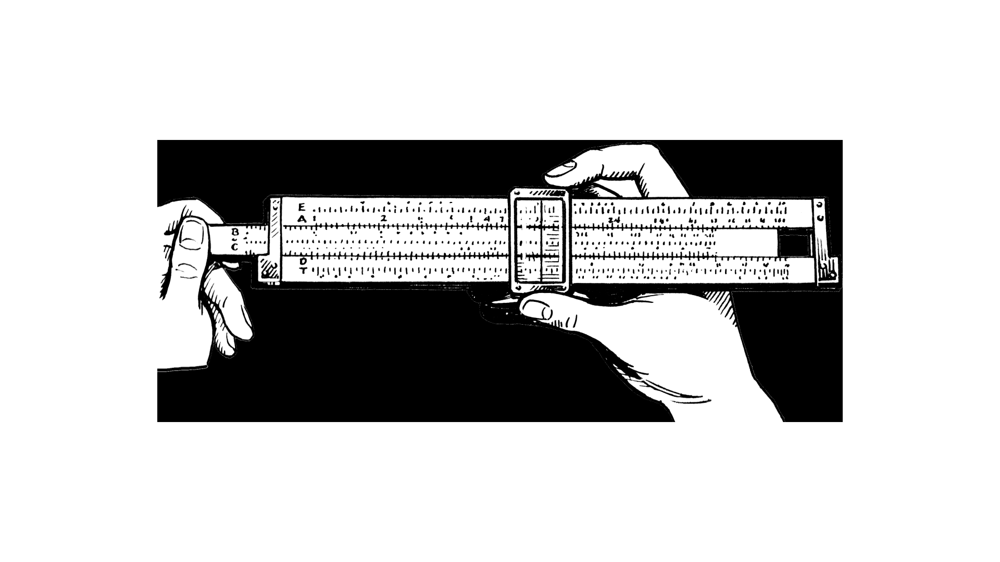

            <figcaption>
            
This principle is how people could calculate quickly before computers became commonplace. First by using large pre-computed tables of logarithms, and then by using <em>slide rules</em>. The idea is that it's very easy to use the sliding action of two rulers to mimic a summation. If you then label the rules with logarithms rather than linearly spaced numbers, you can use the slide rule to "look up" multiplications. 
<aside    >If you're a VU student, you can see a very large model of a slide rule in one of the stairwells of the W&amp;N building. </aside>
Image source: <a href="https://commons.wikimedia.org/wiki/Category:Slide_rules#/media/File:Slide_Rule_(PSF).png"><strong class="blue">https://commons.wikimedia.org/wiki/Category:Slide_rules#/media/File:Slide_Rule_(PSF).png</strong></a>

<a href="https://commons.wikimedia.org/wiki/Category:Slide_rules#/media/File:Slide_Rule_(PSF).png"><strong class="blue"></strong></a>

            </figcaption>
       </section>

       <section id="slide-010">
            <a class="slide-link" href="https://mlvu.github.io/preliminaries#slide-010" title="Link to this slide.">link here</a>
            

            <figcaption>
            
Another way to think of the logarithm is as indicating the <em>number of digits</em> you'll need to write a number down. The slide shows an example: for each of these numbers, if we take the base ten logarithm and round it up, we get the number of digits. 

Why should this be the case? Ask yourself how many numbers you can write down with three digits. There are ten options for the first digit, ten for the second and ten for the third, so the answer is 10 · 10 · 10 = 103. That is, the first number that you can't write down with three digits is exactly 103. The same reasoning holds for any number of digits: the first number that you can't write down with n digits is 10n. Or, put differently<em> if a number is smaller than 10</em>n<em>, you can write it down in n digits or fewer</em>. The function floor(log10(x)+1) gives us the first integer n such that x is smaller than 10n. In other words, the number of digits we need to write down x. 

This provides a natural interpretation to the "multiplication to sum" property of logarithms. Imagine the multiplication of 100000 (105) by 1000 (103). Despite these being very large numbers, the multiplication is easy to do. We just <strong>add</strong> the zeroes of the second number to those of the first. The length of the result, written down in Arabic numerals is roughly the length of the first number plus the length of the second number. This is roughly true for any multiplication, if we count the length as the logarithm of a number. 

You can also use this to provide crucial interpretation for the binary logarithm log2. When we asked how many different numbers you can write with three digits, 10·10·10, we used the fact that there are exactly 10 digits. What if we didn't have ten symbols but only 2? Say, 0 and 1. In such a situation we could represent only two numbers with such a "two-digit" after which we would need to add more to represent a third number. With three of such two-digits, we could represent 2·2·2 = 23 numbers. Two-digits of course, are called <em>bits</em>. The binary logarithm of x indicates how many bits we need to represent x (by the same formula as above). 
<aside    >Bits have a surprising, but crucial role to play in machine learning. For this reason, we will see the binary logarithm being used a lot. </aside>
 

            </figcaption>
       </section>

       <section id="slide-011" class="anim">
            <a class="slide-link" href="https://mlvu.github.io/preliminaries#slide-011" title="Link to this slide.">link here</a>
            

            <figcaption>
            
Here are the most important properties of the logarithm to remember. These are the main things you'll need to work into your muscle memory.  

For the last property, we've given a little proof to show how it follows from the previous two properties.

            </figcaption>
            click image for animation
       </section>

       <section id="slide-012">
            <a class="slide-link" href="https://mlvu.github.io/preliminaries#slide-012" title="Link to this slide.">link here</a>
            

            <figcaption>
            
One final base that we'll often use for our logarithms is <a href="https://en.wikipedia.org/wiki/E_(mathematical_constant)"><strong class="blue">e ≈ 2.1718...</strong></a> . This is because the function ex is a particularly special one. We can show why this function is special later in the course. For now, just remember that this is one particular base we will often use. 

            </figcaption>
       </section>

       <section id="slide-013" class="anim">
            <a class="slide-link" href="https://mlvu.github.io/preliminaries#slide-013" title="Link to this slide.">link here</a>
            

            <figcaption>
            
Ok, so that's why logarithms are <em>historically</em> important. Why do we still use them so much nowadays? We have calculators aplenty to multiply numbers for us, so why put logarithms front and center among our preliminaries? 

There are two reasons. The first is in <em>analysis</em>. When we are analysing our formulas and algorithms, we deal with a lot of complicated expressions. Here is an example: the famous <em>normal distribution</em>. Its probability likelihood curve looks like this. It's defined by the complicated formula on the left (this normal function has mean 0 and variance 1). 
<aside    >If that looks way too complicated to understand, don't worry, that's sort of the point. We will talk about how to read this formula at length later on. For now, just take it as an example of a complicated formula. </aside>
The only thing we need to worry about now is that it's positive everywhere, so we can take its logarithm. This changes the function, but in a very predictable way: for instance, because the logarithm only ever increases, that means that where ever the normal function increases, so does its logarithm. This means that, for example, the peak is in the same place for both functions. 

So, if we start with the complicated function on the left, and take its (natural) logarithm, we end up with the function on the left. See if you can show this with the properties from the previous slide, it's good practice. 

In "log space" the function still has some complicated bits, like the part in gray, but we can note that these do not depend on x. It's just some number. That means that this logarithmic function is just a simple parabola: the most complicate part is just the square of x. Parabolas should be much more familiar to you than the complicated function on the left. 

This is the first reason to use logarithms. <strong>For many of the functions we will want to analyse, taking their logarithm retains the important properties, but simplifies their expression</strong>. 

            </figcaption>
            click image for animation
       </section>

       <section id="slide-014" class="anim">
            <a class="slide-link" href="https://mlvu.github.io/preliminaries#slide-014" title="Link to this slide.">link here</a>
            

            <figcaption>
            
The other reason we use logarithms often is for numerical precision. In the platonic ideal of mathematical thought, we don't need to worry about this. We can imagine a number that is arbitrarily small, for instance, as close to zero as we like. Even if it would take billions of 0's to write it as 0.0000....000000001, we can still imagine it.  

When we actually want to compute with a number like that, things don't work quite so neatly. Try and put this number in a computer (using the standard so-called<em> floating point</em> representation), and the computer essentially won't have room for that many zeros. The result is that the number <em>becomes</em> 0. We call this an <em>underflow</em>. 

This is especially problematic if you want to deal with large products of potentially small probabilities. Imagine for instance that you pick a random word from a random wikipedia article. The probability of seeing the word <em class="red">the</em> is 0.1 and the probability of seeing the word <em class="green">cat</em> is 0.01. 

You repeat the experiment a few times. Which is more likely, seeing the word <em class="red">the</em> 400 times in a row, or seeing the word <em class="green">cat</em> 300 times in a row? Let's ask python. To do so, we just multiply the value 0.1 by itself 400 times, and 0.01 by itself 300 times. 

Sadly, python thinks both probabilities are 0, we cannot compare them. They <em>aren't</em> zero, it's just that the smallest number that the python representation can handle is about 10-323. Smaller than that, and we underflow. 

For this reason, we almost never store raw probabilities like these.Instead, we store the logarithms of probabilities. We'll use base 10 here, for clarity, but any base would do. With these numbers, we can compute the <strong>log</strong> probability of seeing "the" 400 times in a row and seeing "cat" 300 times in a row. All we need to do is add where would would normally multiply, so we add -1 to itself 400 times and we add -2 to itself 300 times. This gives us the <em>log probability</em> of seeing <em class="red">the</em> 400 times (-400) and the<em> log probability</em> of seeing <em class="green">cat</em> 300 times (-600). Because the logarithm is monotonically increasing we know that when log x is smaller than log y, x is also smaller than y (i.e. 10-400 &gt; 10-600) From this we can get our answer. 
<aside    >This is exactly the renaming trick we used before. Instead of referring to numbers in normal decimal notation (or floating point representation), we refer to them by their logarithm. If we can only refer to a limited set of numbers (as is the case in any computer representation), this changes the set of numbers we can refer to. In this case, the log tirck allows us to refer to much larger and much smaller numbers. We lose some precision elsewhere, of course, nothing comes for free. However, in statistics we are much more interested in telling apart 10-300 from 10-400 than in telling apart 0.1 from 0.1+10-17 (which we could still do with regular floating points, but not in logspace). </aside><aside    ></aside>
            </figcaption>
            click image for animation
       </section>

       <section id="slide-015">
            <a class="slide-link" href="https://mlvu.github.io/preliminaries#slide-015" title="Link to this slide.">link here</a>
            

            <figcaption>
            

            </figcaption>
       </section>

       <section id="slide-016" class="anim">
            <a class="slide-link" href="https://mlvu.github.io/preliminaries#slide-016" title="Link to this slide.">link here</a>
            

            <figcaption>
            
Another topic you should make sure you get used to is <strong>sum notation</strong>. You've probably seen it a few times before already: it's the big capital letter Sigma (the greek s, for "sum").  

It works as follows: whenever you have a sum with many terms, you figure out if you can write a single expression that shows what each term looks like. For instance, if we have a sequence of numbers (a1, a2, a3) which we want to sum, a1 + a2 + a3, then we can write each term in this sum as ai, where the variable i takes the value i=1, i=2 or i=3. 

The sigma notation allows us to express a sum like this. Below the sigma, we define the starting value for i, and above it, we define the final value. Then, to the right, we define what each term looks like when phrased in terms of i. 

Of course, for this example, the explicit sum looks much simpler, and easier to understand. This is an important point to understand: we don't just write things in sigma notation because it looks more fancy. There are <a href="https://linear.axler.net/"><strong class="blue">very advanced math books</strong></a> that  almost never touch the sigma notation, and write all their sums explicitly, and they are much clearer for it.  

However, as sums get more complex, this balance may shift: some formulas look much clearer in sigma notation. Especially those that have an arbitrary number of terms, or even an infinite number of terms. This is the case in machine learning, and you will see a lot of sigmas in our research papers and text books.

            </figcaption>
            click image for animation
       </section>

       <section id="slide-017" class="anim">
            <a class="slide-link" href="https://mlvu.github.io/preliminaries#slide-017" title="Link to this slide.">link here</a>
            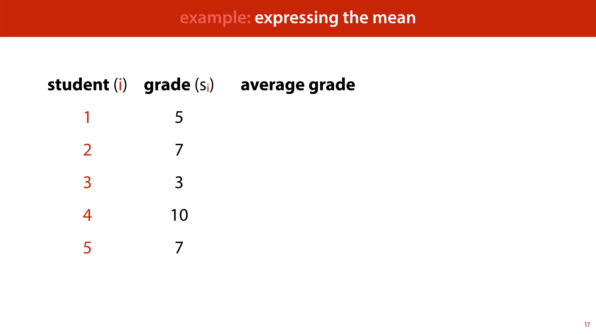

            <figcaption>
            
Here's an example you'll see <em>a lot</em> in the course: computing the average (or mean) of a bunch of numbers. 

Imagine we have a small group of 5 students, who have all received a grade on an exam. We name the students 1, 2, 3, 4, and 5, and we name their grades s1, s2, s3, s4 and s5. You hopefully know how to compute the average of a set of numbers: sum them all up, and divide by how many there are. We can write that as an explicit sum. but we can also write it in the sigma notation. 

The second example shows one of the benefits of the sigma notation: the formula doesn't change much if we don't know how many students we have. We just replace 5 by n. And everything stays the same. 
<aside    >We could write this in the explicit notation as (s1 + s2 + ... + sn)/n. This is sometimes clearer, but it's also a little more ambiguous. We need to guess what happens in the place of the ..., and we need to guess how the formula works for 1, 2, or 3 students since the explicit notation strictly speaking doesn't apply in those cases. The explicit notation also requires us to repeat at least two terms. The more complicated the terms are, the more of a hassle this becomes, and the cleaner the sigma notation becomes by comparison.</aside><aside    ></aside>
            </figcaption>
            click image for animation
       </section>

       <section id="slide-018" class="anim">
            <a class="slide-link" href="https://mlvu.github.io/preliminaries#slide-018" title="Link to this slide.">link here</a>
            

            <figcaption>
            
Here are some simple examples for you to test your understanding on.

            </figcaption>
            click image for animation
       </section>

       <section id="slide-019" class="anim">
            <a class="slide-link" href="https://mlvu.github.io/preliminaries#slide-019" title="Link to this slide.">link here</a>
            

            <figcaption>
            
In order to get properly <em>used to </em>sum notation, it's important to internalize the following rules. They follow very clearly from what you know already about regular sums, so they shouldn't be very surprising. In practice, to follow a derivation, you'll often need to do something like identifying a constant factor inside the sigma, and take it outside, as the first rule lets you do. Or, to take a constant inside the sum applying the rule in reverse order.

            </figcaption>
            click image for animation
       </section>

       <section id="slide-020" class="anim">
            <a class="slide-link" href="https://mlvu.github.io/preliminaries#slide-020" title="Link to this slide.">link here</a>
            

            <figcaption>
            
It's important to note that the sum notation can be a little ambiguous. Like here: is the second sigma "inside" the first, or outside? 

That is, do we first sum the a's,and then the b's and then sum these together? Or do we take the sum of b and add it to every element of a before summing these? The sum notation doesn't specify. If a sum is written like this, both could be true. Hopefully the context provides sufficient hints to figure out what is going on. 

Often, we prefer the ambiguity to the extra brackets if it's clear from context what we mean. In many cases, however, you can avoid both the brackets <em>and</em> the ambiguity by cleverly arranging your formula.

            </figcaption>
            click image for animation
       </section>

       <section id="slide-021" class="anim">
            <a class="slide-link" href="https://mlvu.github.io/preliminaries#slide-021" title="Link to this slide.">link here</a>
            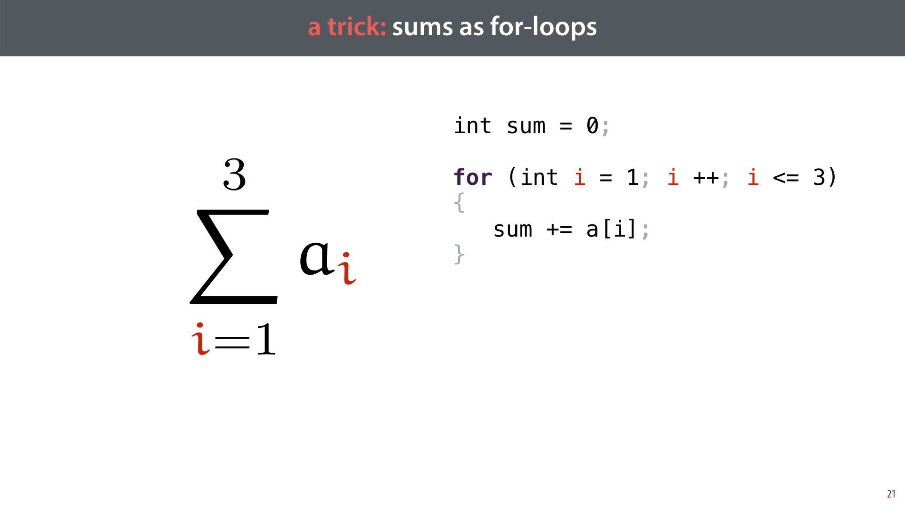

            <figcaption>
            
For people who are more comfortable with programming than with math, it can often be helpful to think of sum notation as a kind of mathematical notation for a for-loop.  

If this works for you, it can be a great shortcut to get comfortable with this kind of notation. However, you should note that while the two are similar, they actually express fundamentally different things. A sum is simply a mathematical quantity to refer to, while a program is a set of instructions for <em>computing</em> that quantity. A sum can have infinitely many terms, or terms that are incomputable, and yet the sum remains a perfectly viable statement, even if the corresponding for loop becomes nonsense 

In short, it can be very helpful to translate mathematical statements to computer programs, to help you understand them, but you must always keep in the back of your mind that they are not the same thing.

            </figcaption>
            click image for animation
       </section>

       <section id="slide-022">
            <a class="slide-link" href="https://mlvu.github.io/preliminaries#slide-022" title="Link to this slide.">link here</a>
            

            <figcaption>
            
Here are some variations of the sum notation that you are likely to encounter. From left to right: 

Summing over sets. If you want to sum over the elements of a set, you only need to indicate what set you are getting your elements from and what you'll call those elements. That looks like it does on the left. Note that you don't need to specify in which <em>order</em> you are getting the elements from the set, since the value of the sum is the same in whatever order you sum the elements together. 

Simplified sum notation. Let's be honest: the full sum notation is a hairy beast. It looks intimidating and it's difficult to parse. More often than not, it's perfectly clear from context what the starting point and end point are. In such case, all you really need to do is to specify which letter indicates how the formula on the right changes from term to term.  

Infinite sums. One particularly powerful option of the sum notation is to write <em>infinite sums</em>. We do this by simply replacing the top element by an infinity symbol. This doesn't  always mean that the sum itself becomes infinite as well. For instance, the value of the sum you see here is 1.

            </figcaption>
       </section>

       <section id="slide-023">
            <a class="slide-link" href="https://mlvu.github.io/preliminaries#slide-023" title="Link to this slide.">link here</a>
            

            <figcaption>
            
Here's a little illustration of how an infinite sum can have a finite value (if you've never seen that before). 

The square with sides of 1x1 has area 1. The first term (1/2) corresponds to a rectangle with proportions 2:1 that fills half the square, leaving another rectangle of the same size. The next term corresponds to half that, so we can cut the remaining rectangle into two equal squares: one corresponding to the next term and one corresponding to the remainder. The remainder is a square the same size as the previous square. We can cut another rectangle corresponding to the next term, leaving another rectangle of the same size. We can continue this forever: whenever the remainder is a square, we cut it into two rectangles, and whenever it's a rectangle we cut it into two squares. 

In the limit, we get closer and closer to filling the entire square. 
<aside    >If you want to be very rigorous, you can say that for any point in the interior of the square , there is a finite n, such that the n-th step covers that point. But we only want to give some visual intuition here, for rigorous proofs, there are better approaches. </aside>
NB. Slides like these, with gray headers are slides that contain non-essential stuff. You can skip them if you're in a hurry, but if you have time, working through examples like these can be just the thing that can help to get to grips with the subtler details of the material.

            </figcaption>
       </section>

       <section id="slide-024">
            <a class="slide-link" href="https://mlvu.github.io/preliminaries#slide-024" title="Link to this slide.">link here</a>
            

            <figcaption>
            
In this part we'll discuss the basics of linear algebra. For our purposes, linear algebra is just a convenient way of talking about lists and tables (or grids) of numbers. Machine learning deals with <em>data</em>, which often comes in the form of a list or a table of numbers, and linear algebra allows us to represent and manipulate these efficiently. 

            </figcaption>
       </section>

       <section id="slide-025">
            <a class="slide-link" href="https://mlvu.github.io/preliminaries#slide-025" title="Link to this slide.">link here</a>
            

            <figcaption>
            
These are the topics we'll briefly discuss. As before, this is just the tip of the iceberg, but hopefully just enough to understand what's coming.  

Pay particular attention to the slides about<strong> the dot product</strong>. That is going to come up a lot.

            </figcaption>
       </section>

       <section id="slide-026" class="anim">
            <a class="slide-link" href="https://mlvu.github.io/preliminaries#slide-026" title="Link to this slide.">link here</a>
            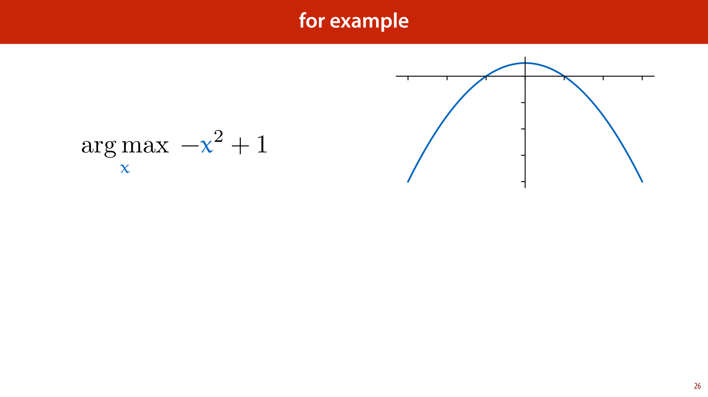

            <figcaption>
            
Let's start with <strong>vectors</strong>. A vector is a list of numbers. That's all. There's a lot we can do with vectors, and a lot of meaning we can assign to it, but for our purposes, all a vector is at heart is a simple list of numbers. 
<aside    >In other (more mathematical) settings a vector may be defined as a member of a "vector space": a set that follows certain rules. This is the definition taken in <a href="https://linear.axler.net/"><strong class="blue">abstract linear algebra</strong></a>. This is a fascinating and worthwhile subject, but it's level of abstraction we won't need. We'll deal strictly in what you might call "concrete linear algebra" where a vector is nothing more or less than a list of numbers. </aside>
When we refer to a vector we will use a <strong>bold</strong> lowercase letter, like <strong>x</strong> here. 

How many numbers there are in a vector (in this case 3), is called its <strong>dimension</strong> or<strong> dimensionality</strong>. Usually, we need vectors to have the same dimension for them to meaningfully interact with one another. 

The reason for this name is that a vector with dimension n can represent a point in an n-dimensional space. In the slide, we have a 3 dimensional space. To find the point that the vector (2,4, 1) represents, we take two steps along the first axis, 4 steps along the second and 1 along the third. 

We also use vectors to represent <strong>arrows</strong> in  this space. Arrows have a direction and a magnitude (the length of the arrow). This makes them useful for many things: for instance to represent the speed of something. If you're driving a car, your speed has a certain magnitude (say 80 km/h), but it also has a direction (hopefully the direction of the road). We  can represent both with a single arrow. 

When we use vectors to represent an arrow, the convention is that we are talking about the arrow from the origin (0, 0, 0) to the point represented by the vector. That is, every arrow represented by a single vector starts at the origin. 
<aside    >If we want to represent arrows that start somewhere else, we need to specify a starting point separately. </aside>
When we want to refer to a specific element of a vector, we put the index of that element in the subscript, and use a <strong>non-bold</strong> letter for the vector. For instance x2 = 4. 

            </figcaption>
            click image for animation
       </section>

       <section id="slide-027">
            <a class="slide-link" href="https://mlvu.github.io/preliminaries#slide-027" title="Link to this slide.">link here</a>
            

            <figcaption>
            
Vectors are used to represent many different things in machine learning, but to make things a bit more concrete, here is one example. In machine learning we deal with<strong> instances</strong>: examples of some sort of thing we're trying to learn about. For example, we might be trying to learn about employees of a construction company. If we represent each employee with three numbers: their productivity on a scale from 0 to 1, the number of sick days they've take this year, and their age, then every employee in our company becomes one vector of dimension 3. 

The set of all employees then becomes a cloud of points in a 3 dimensional space.

            </figcaption>
       </section>

       <section id="slide-028" class="anim">
            <a class="slide-link" href="https://mlvu.github.io/preliminaries#slide-028" title="Link to this slide.">link here</a>
            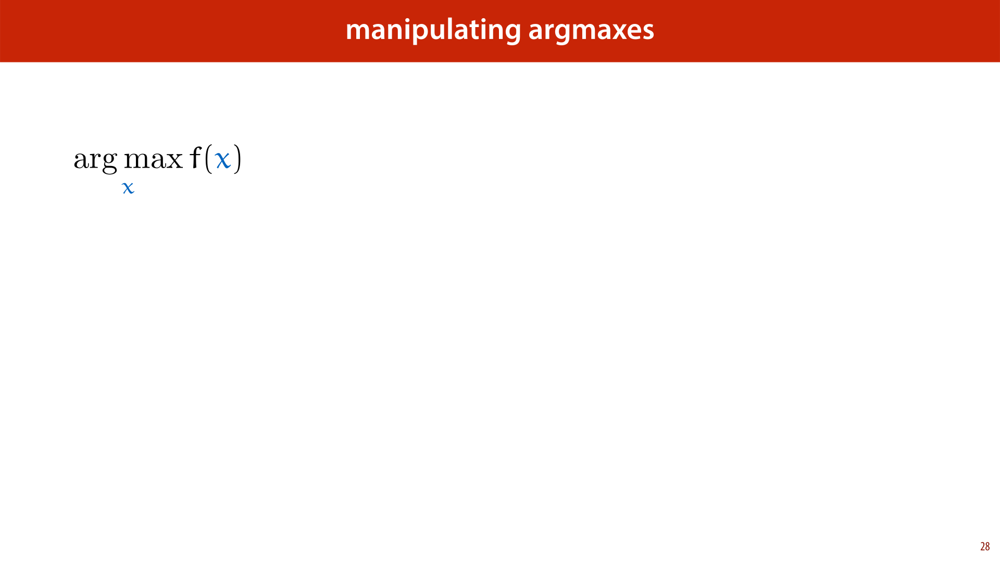

            <figcaption>
            
The simplest way to compute with vectors is to use <strong>element-wise operations</strong>. Whenever two vectors have the same dimension, we can make a third vector by, for instance, adding every element from the first to the corresponding element of the second. Or by multiplying, subtracting or dividing these elements. 

This is called element-wise addition, element-wise multiplication, and so on. For every operation that takes to numbers and produces a third, we can also apply it element-wise to two vectors of the same length.

            </figcaption>
            click image for animation
       </section>

       <section id="slide-029" class="anim">
            <a class="slide-link" href="https://mlvu.github.io/preliminaries#slide-029" title="Link to this slide.">link here</a>
            

            <figcaption>
            
<strong>Vector addition </strong>is a particularly important element-wise operation on vectors. We can easily visualize what happens when we add two vectors <strong class="orange">a</strong> and <strong class="blue">b</strong>: we take the base of the arrow of <strong class="blue">b</strong> and place it at the tip of the arrow of <strong class="orange">a</strong>. The tip of this shifted copy of <strong class="blue">b</strong> is then the tip of the arrow of <strong class="orange">a</strong> + <strong class="blue">b</strong>.

            </figcaption>
            click image for animation
       </section>

       <section id="slide-030" class="anim">
            <a class="slide-link" href="https://mlvu.github.io/preliminaries#slide-030" title="Link to this slide.">link here</a>
            

            <figcaption>
            
This also gives us a very natural way to think of <strong>vector subtraction</strong>. When a, b, and c are numbers then c - b is the number a such that a + b =c. 

For vectors <strong class="green">c</strong> - <strong class="blue">b</strong> is the  vector a such that <strong class="orange">a</strong> + <strong class="blue">b</strong> = <strong class="green">c</strong>. That is, the vector we need to add onto the end of <strong class="blue">b</strong>, in order to get to <strong class="green">c</strong>.

            </figcaption>
            click image for animation
       </section>

       <section id="slide-031" class="anim">
            <a class="slide-link" href="https://mlvu.github.io/preliminaries#slide-031" title="Link to this slide.">link here</a>
            

            <figcaption>
            
The <strong>length</strong> or <strong>magnitude</strong> of a vector (not to be confused with its dimension) is the length of the arrow it represents. That is, the distance between the origin and the <em>point </em>it represents. 

We write the length of <strong class="green">x</strong>, also known as its<em> </em><strong>Euclidean norm</strong> as, ||<strong class="green">x</strong>||. 

In 2 dimensions, this value is given very simply by the pythagorean theorem. The value of the first element x1, the second element x2 and the arrow the vector represents together form a right-angled triangle. Thus, by Pythagoras, we have ||<strong class="green">x</strong>||2 = x12 + x22. Taking the square to the other side, we see that the length is the square root of the sum of the squares of the individual elements.  
<aside    >Since the square root often gets in the way (and looks a bit messy), we will often just talk about the square of the length of a vector ||<strong class="green">x</strong>||2. It's a similar function, with a simpler expression. </aside>
This idea generalizes to vectors of higher dimension in a natural way: the square of the length is the the sum of the the squares of the individual elements. 

            </figcaption>
            click image for animation
       </section>

       <section id="slide-032" class="anim">
            <a class="slide-link" href="https://mlvu.github.io/preliminaries#slide-032" title="Link to this slide.">link here</a>
            

            <figcaption>
            
The length of a vector often comes in when we need to<strong> normalize</strong> a vector. That is, we want to keep it pointing in the same direction, but other change its length to be equal to one 1 (either by shrinking or expanding it as the case may be). 

The operation that achieves this, is to <strong>divide each element of the vector </strong><strong class="green">x</strong><strong> by the vector's norm </strong>||<strong class="green">x</strong>||. You can prove this algebraically by starting with the norm of this new vector, ||(<strong class="green">x</strong>/||<strong class="green">x</strong>||)||, filling in the definitions, and rewriting until you get the answer 1. This is a good exercise to get comfortable with the notation, and we suggest you try, but it isn't very intuitive. 

The <em>intuitive</em> explanation for why this is the case, is a fundamental principle of geometry: if you draw a picture and uniformly scale it, the the lengths of all line segments in the picture are scaled by the same factor. That is if you make any picture half as wide <em>and</em> half as high, all distances in the picture will be half of what they were before.  

In this case, we can image the picture being defined by the components of <strong class="green">x</strong>: how far they extend along each axis. When we scale these so that <strong class="green">x</strong> becomes <strong class="green">x</strong>/||<strong class="green">x</strong>||, all line segments are scaled by the same factor, including the line segment from the origin to the tip of <strong class="green">x</strong>. Since its length was ||<strong class="green">x</strong>|| before, and we scale it by 1/||<strong class="green">x</strong>||, it must be 1 now. 

            </figcaption>
            click image for animation
       </section>

       <section id="slide-033" class="anim">
            <a class="slide-link" href="https://mlvu.github.io/preliminaries#slide-033" title="Link to this slide.">link here</a>
            

            <figcaption>
            
We can now express the <strong>distance</strong> between two vectors <strong class="orange">a</strong> and <strong class="blue">b</strong> simply as the norm of the vector <strong class="green">c</strong> that stretches from the tip of <strong class="orange">a</strong> to the tip of <strong class="blue">b</strong>, or: ||<strong class="orange">a</strong> - <strong class="blue">b</strong>||. The square of the distance has a particularly neat expression (and is used as often as the distance itself). 

The distance between two vectors is one way to measure how similar they are. But there is another measure of similarity that we tend to use a lot more…

            </figcaption>
            click image for animation
       </section>

       <section id="slide-034" class="anim">
            <a class="slide-link" href="https://mlvu.github.io/preliminaries#slide-034" title="Link to this slide.">link here</a>
            

            <figcaption>
            
We call this operation the <strong>dot product</strong>. It takes two vectors of the same dimension, and returns a single number (like the distance). It is computed very simply by element-wise multiplying the two vectors and then summing the result over all elements. 

It's hard to overstate quite how crucial the dot product is. It's going to come back <strong>a lot</strong>. Honestly, the majority of modern machine learning is built on just the basic properties of this one simple function one way or another.  

Given that, let's take some time to really dig deep into the dot product. Let's look at various intuitions and definitions.

            </figcaption>
            click image for animation
       </section>

       <section id="slide-035">
            <a class="slide-link" href="https://mlvu.github.io/preliminaries#slide-035" title="Link to this slide.">link here</a>
            

            <figcaption>
            
One way to think of the dot product is as an expression of how<em> similar </em>one vector is to another. In machine learning we often have multiple instances that we compare to a template. 
<aside    >The Euclidean distance is another measure of similarity, but for many reasons, the dot product is probably used more often. </aside>
Imagine, for instance that you want to hire somebody for a job. You set a few criteria you want to evaluate on: how<em> friendly</em> somebody is, how <em>efficient</em> somebody is and how <em>risk-averse</em> somebody is. You represent what you want with a vector of dimension three. If you want somebody who is very friendly, you set the first value to a high positive value, and if you want somebody who is very unfriendly (perhaps you are looking for a bouncer or a bodyguard) you set it to a high negative value. If you don't really care, you set it to a value near 0. You do the same for the other two attributes. 

Then, you represent each candidate with such a vector as well: if they are very friendly, the first element is high and positive, if they are unfriendly it is high and negative, and if they are neither, it is somewhere near zero. 

We can now take a given candidate and take the dot product with the template to see how well they match.  

Look at the first term. Imagine that you are looking for a very <em>un</em>friendly person. In that case the first element of <strong class="orange">t</strong> is a large negative number. If the candidate is very friendly, the first element of <strong class="blue">c</strong> is a large positive number. Multiplying the two together, we see that the first term of the dot product is large and negative, so this particular mismatch in attributes results in a large lowering of the dot product. If the two had matched, we would have a high positive first term. 

What if you don't really care about friendliness? Well, then t1 is close to zero, so whatever the value of c1, the first term is (relatively) close to zero as well, and the term does not contribute much to the dot product. 
<aside    >This kind of diagram is probably the most crucial interpretation of how the dot product is used in machine learning. We'll show it again at least twice, with slightly different settings.</aside><aside    ></aside>
            </figcaption>
       </section>

       <section id="slide-036">
            <a class="slide-link" href="https://mlvu.github.io/preliminaries#slide-036" title="Link to this slide.">link here</a>
            

            <figcaption>
            
Here are some basic properties of the dot product. You should study each carefully to see if you understand what it means, and how you can derive it from the definitions we have given so far. 

In the third line, <strong>0</strong> stands for the vector filled with zeros. 

In the property of homogeneity c represents a scalar value (i.e. a number not a vector). Multiplying a vector by a scalar is done simply by multiplying each element by that scalar. 

Pay particular attention to the property of distributivity. We'll come back to that one.

            </figcaption>
       </section>

       <section id="slide-037">
            <a class="slide-link" href="https://mlvu.github.io/preliminaries#slide-037" title="Link to this slide.">link here</a>
            

            <figcaption>
            
One remarkable feature of the dot product is that it can also be expressed with an entirely <em>different </em>formula, which at first sight has nothing to do with the definition we just gave. We call this the <strong>geometric definition</strong>, and the earlier version the <strong>algebraic definition</strong>. 

The geometric definition states that the dot product <strong class="orange">x</strong>T<strong class="blue">y</strong> is <em>also</em> the product of the lengths of <strong class="orange">x</strong> and <strong class="blue">y</strong> and the cosine of the angle between them. 
<aside    >Note that even if two vectors have high dimension, any two vectors will still lie in a shared plane. This means that whatever the dimension, there will always be a unique single angle between two vectors. </aside>
We’ll first look at some of the consequences of this definition, and then show that the two are equivalent.

            </figcaption>
       </section>

       <section id="slide-038">
            <a class="slide-link" href="https://mlvu.github.io/preliminaries#slide-038" title="Link to this slide.">link here</a>
            

            <figcaption>
            
Before we look into how to get from one definition to another, let's see how this definition chimes with the intuition we already have. We'll return to the example of finding candidates for a job, but we'll stick to just the first two properties, so we can easily plot the resulting vectors. 

This gives us an idea of how the similarity work geometrically. Candidate 2 is pointing in the exact opposite direction of our template. This makes the angle between the two vectors as big as possible, giving us a cosine of -1, leading to a large , negative dot product. The more we pivot the candidate vector towards the template, the closer we get to a cosine of 1, giving us the maximal dot product.

            </figcaption>
       </section>

       <section id="slide-039" class="anim">
            <a class="slide-link" href="https://mlvu.github.io/preliminaries#slide-039" title="Link to this slide.">link here</a>
            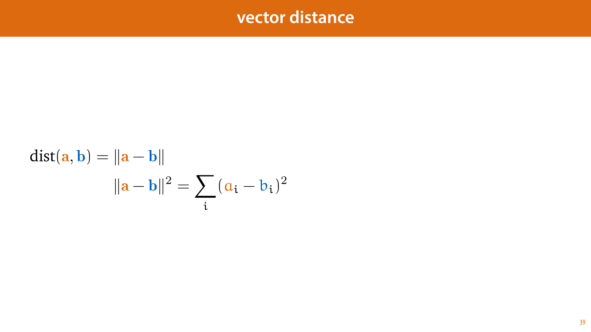

            <figcaption>
            
From this definition, we can look back to our list of properties and see what they mean with the geometric picture in mind. Some of them now become a lot simpler to show, some less so. Distributivity, in particular, is a lot easier to prove with the former definition. 

We can also add one more property, which is almost impossible to see with the first definition. If neither a nor b is the zero vector, then the only way their dot product can be zero is if the angle between them is 90 degrees. That is they are<strong> orthogonal </strong>to one another. 

This may seem a fairly arbitrary fact, but when we use the dot product to measure similarity between vectors, an angle of 90 degrees in a way represents the <em>lowest similarity</em>. Orthogonal eigenvectors represent things that have nothing to do with each other. This represents a kind of<em> independence</em>. 
<aside    >This has even entered <a href="https://www.abajournal.com/news/article/supreme_court_word_of_the_day_orthogonal"><strong class="blue">common parlance</strong></a> (to some extent): for instance, people talk about problems being orthogonal to one another, when the solution to one is independent of the solution to the other.  </aside>
On the previous slide we compared candidates to instances. You may think that the candidate that pointed in the exact opposite direction to the template was the least similar. And that's a fair point, but in many ways they are still related. The candidate is the unique opposite of the template. An orthogonal vector is more like the "most unrelated" vector possible.  
<aside    >Note that there are more orthogonal vectors than opposite vectors. Our template has one opposite vector, but two orthogonal vectors (and it's one vs infinitely many in 3 dimensions).</aside><aside    ></aside>
            </figcaption>
            click image for animation
       </section>

       <section id="slide-040" class="anim">
            <a class="slide-link" href="https://mlvu.github.io/preliminaries#slide-040" title="Link to this slide.">link here</a>
            

            <figcaption>
            
One final view of the dot product is that it expresses the<em> projection</em> of one vector onto another. Projections are extremely important in many areas of linear algebra, especially in the ones related to machine learning. This is because they define how close you can get to some target while being constrained to some subspace. 

For example, ask yourself how close you can get to the tip of <strong class="blue">a</strong>, while staying on the line of <strong class="orange">b</strong> (its arrow extended in both directions). The answer is given by the point where the line between your chosen point on b and the tip of a makes a right angle with <strong class="orange">b</strong>. This is called the <em>projection</em> of <strong class="blue">a</strong> onto <strong class="orange">b</strong> (which we'll denote <strong class="blue">a</strong>b) 

We won't prove it here, but <a href="https://peterbloem.nl/blog/pca#one-dimensional-pca"><strong class="blue">if you're interested, it all boils down to Pythagoras</strong></a>. 
<aside    >The relevance to machine learning is that we often have a function that we want to get as close as possible to the example given by the data, under some constraints. If you frame it correctly, and the problem is simple enough, that boils down to finding the projection of the target onto a linear subspace of possibilities. To find that solution, we use projections of one vector onto many other vectors. </aside>
This projection is related to the dot product as follows. By basic geometry, the cosine is the quotient of the length of <strong class="blue">a</strong> by the length of <strong class="blue">a</strong>b. We rewrite this to isolate the length of <strong class="blue">a</strong>b, and then multiply by ||<strong class="orange">b</strong>||/||<strong class="orange">b</strong>||. This shows that the length of <strong class="blue">a</strong>b is equal to cos θ ||<strong class="blue">a</strong>||, which is equal to the dot product <strong class="blue">a</strong>T<strong class="orange">b</strong> divided by ||<strong class="orange">b</strong>||. Since the multiplier 1/||<strong class="orange">b</strong>|| is just a scalar, we can work it into the dot product, making the second argument <strong class="orange">b</strong>/||<strong class="orange">b</strong>||, or the normalized version of <strong class="orange">b</strong>.  

That is, when we project <strong class="blue">a</strong> onto <strong class="orange">b</strong>, <em>the length of the resulting vector is the dot product of </em><strong class="blue">a</strong><em> with the normalized </em><strong class="orange">b</strong>. 
<aside    >By following the same derivation with <strong class="blue">a</strong> and <strong class="orange">b</strong> interchanged, we see that the reverse also holds. </aside>

            </figcaption>
            click image for animation
       </section>

       <section id="slide-041">
            <a class="slide-link" href="https://mlvu.github.io/preliminaries#slide-041" title="Link to this slide.">link here</a>
            

            <figcaption>
            
This doesn't just give us a interpretation of the dot product: by re-arranging the factors, we also get this third way of expressing the dot product, which we’ll call the <strong>projection definition</strong>. 

The dot product between <strong class="blue">a</strong> and <strong class="orange">b</strong> is the length of <strong class="blue">a</strong> projected on to <strong class="orange">b</strong>, multiplied by the length of <strong class="orange">b</strong>. 

            </figcaption>
       </section>

       <section id="slide-042">
            <a class="slide-link" href="https://mlvu.github.io/preliminaries#slide-042" title="Link to this slide.">link here</a>
            

            <figcaption>
            
This leaves us with three definitions of the dot product. We have shown that the second follows from the first. What about the third? How can we unify the <em>algebraic</em> and the <em>geometric</em> definitions? 

The proof is a little involved, and you don't <em>have</em> to know it, to do machine learning (you can skip these three slides), but following it is a good exercise in getting comfortable with linear algebra. 

The plan is as follows: We will start with the geometric/projection definition. From that we will show that distributivity holds. This is the hard part: distributivity is much easier to show using the algebraic definition, but we haven't proved yet that they're equivalent. 

Then once we have distributivity, we can follow some simple rewriting steps using a set of vectors called the <em>standard basis vectors</em>.

            </figcaption>
       </section>

       <section id="slide-043">
            <a class="slide-link" href="https://mlvu.github.io/preliminaries#slide-043" title="Link to this slide.">link here</a>
            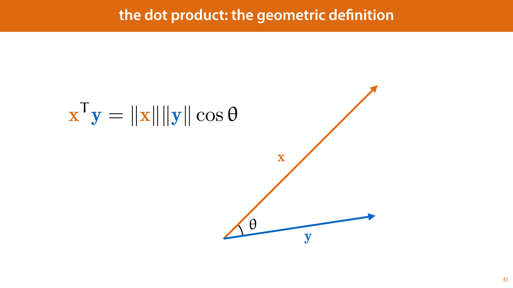

            <figcaption>
            
What we want to show is that (<strong class="orange">b</strong> + <strong class="green">c</strong>)T<strong class="blue">a</strong> = <strong class="orange">b</strong>T<strong class="blue">a</strong> + <strong class="green">c</strong>T<strong class="blue">a</strong>. That is, the dot product <em>distributes</em> over the sum.  

The first line rewrites the dot product in the projection formulation (which we know follows from the geometric definition). The second line is the hard part. How do we show that <strong class="orange">b</strong> +<strong> </strong><strong class="green">c</strong> projected on to <strong class="blue">a</strong> has the same length as<strong> </strong><strong class="orange">b</strong> projected onto <strong class="blue">a</strong> plus <strong class="green">c</strong> projected onto <strong class="blue">a</strong>? First, we draw a picture, as seen on the right. 

Now, imagine rotating this picture so that the vector <strong>a</strong> is aligned with one of the axes, say the 1st axis. In that case, the projection of <strong class="orange">b</strong> on to <strong class="blue">a</strong> is just element b1, the projection of <strong class="green">c</strong> onto a is just element c1 and the projection of <strong class="orange">b</strong>+<strong class="green">c</strong> on to a is element 1 of <strong class="orange">b</strong>+<strong class="green">c</strong>, or b1 + c1. That is, if the whole picture is rotated so that <strong class="blue">a</strong> points along axis 1, the result follows directly from the way we add vectors. And, since a rotation doesn't change any of the distances in the picture, <em>the same must be true if we don't rotate</em>. This shows that the second line is true in general. 

Now, the third line is simply applying distributivity to the multiplication of scalars, and the final line follows from recognizing that the two terms are now separate dot products, in the projection formulation. 

With that, we have shown that distributivity follows from the geometric definition. 
<aside    >This kind of reasoning perhaps appeals to intuition a little too much to count as a real proof, but if you want something more rigorous, it shouldn’t be too much work to fill in the blanks. We’re not so much trying to convince you that this is true, as trying to give you an intuition for why it is true. </aside><aside    ></aside>
            </figcaption>
       </section>

       <section id="slide-044">
            <a class="slide-link" href="https://mlvu.github.io/preliminaries#slide-044" title="Link to this slide.">link here</a>
            

            <figcaption>
            
Now, we can show that the two definitions are equivalent. We will assume the geometric definition and derive the algebraic one. The first thin we will need is the<strong> standard basis vectors</strong><em> </em>(also known as <strong>one-hot vectors</strong>). These are vectors that are zero everywhere, except in one place. We call the standard basis vector that has a 1 in place i the vector <strong>e</strong>i. 

Note that in <strong>e</strong>i the letter e is <strong>bold</strong> so this does not refer to the i-th element of a vector but to the i-th vector in some collection of vectors. 

With the standard basis vectors we can write any vector as the sum over its elements, each multiplied by the requisite basis vector.  
<aside    >This may seem a little redundant at the moment, but it will help us later on. </aside>
We also know that the dot product of x with basis vector <strong>e</strong>i is just the i-th element of <strong class="green">x</strong>. Why? Note the projection perspective: the dot product of x with <strong>e</strong>i is the projection of <strong class="green">x</strong> on to <strong>e</strong>i, times the length of <strong>e</strong>i. The projection of <strong>x</strong> onto axis i is just the i-th element of <strong>x</strong> and the length of <strong>e</strong>i is 1. 
<aside    >If you're not convinced, Wikipedia <a href="https://en.wikipedia.org/wiki/Dot_product#Application_to_the_law_of_cosines"><strong class="blue">has the same proof</strong></a>, but with some more technical detail.</aside><aside    ></aside>
            </figcaption>
       </section>

       <section id="slide-045" class="anim">
            <a class="slide-link" href="https://mlvu.github.io/preliminaries#slide-045" title="Link to this slide.">link here</a>
            

            <figcaption>
            
And with that, we have our ducks in a row. Now, it's just a matter of rewriting. 

We start with the dit product (which we take to represent the geometric formulation). In the first line, we rewrite b as a sum over the basis vectors. 

In the second line, we used the distributive property, which we showed holds for the geometric definition. 

On the third line, we work the scalar bi out of the dot product (this is allowed by the property of homogeneity). 

In the third line, we use the fact that a dot product with a standard basis vectors selects an element of the vector (in this case the dot product <strong class="blue">a</strong>T<strong>e</strong>i selects the element ai). This gives us the algebraic definition, which completes our proof.

            </figcaption>
            click image for animation
       </section>

       <section id="slide-046">
            <a class="slide-link" href="https://mlvu.github.io/preliminaries#slide-046" title="Link to this slide.">link here</a>
            

            <figcaption>
            
A <strong>matrix</strong> is a grid of numbers. Like a vector, it can represent a lot of things, but at heart, that's all it is. When we refer to a matrix, we use a bold, uppercase letter. 

This matrix has 3 rows and 2 columns. Whenever we talk about the elements of a matrix, we always take<strong> the vertical dimension first and then the horizontal</strong>. For instance, we say this is a 3 x 2  matrix (pronounced as "three <em>by</em> two"), and the element at index (2, 1) is 4 while the element at index (1, 2) is 1. 

When we want to refer to a specific element of a matrix, we take this index, and put it in the subscript, using the non-bold version of the letter we use to refer to the whole matrix. 
<aside    >We can think of a vector as a matrix with one dimension equal to 1. When we do so, we will adopt the convention that the width is 1: that is, our vectors are "column vectors" unless otherwise indicated.</aside><aside    ></aside>
            </figcaption>
       </section>

       <section id="slide-047">
            <a class="slide-link" href="https://mlvu.github.io/preliminaries#slide-047" title="Link to this slide.">link here</a>
            

            <figcaption>
            
Element-wise operations work the same as they do on vectors. If we have two matrices <strong class="blue">A</strong> and <strong class="orange">B</strong> <strong>of the same size</strong>, we can add them and the result will have at index (i, j) the value Aij + Bij.

            </figcaption>
       </section>

       <section id="slide-048" class="anim">
            <a class="slide-link" href="https://mlvu.github.io/preliminaries#slide-048" title="Link to this slide.">link here</a>
            

            <figcaption>
            
An important way to manipulate a matrix is to take its <strong>transpose</strong>. This simply means interchanging the horizontal and the vertical indices. We indicate this with a superscript T. 

You can think of this as flipping the matrix across the diagonal element (2 and 0  in this case). The rows become columns and the columns become rows. 

Note however, that the <em>order</em> of the elements in the rows and columns is not changed. In the example above, 4 is the first element in its <em>row</em> before the transposition and its the first element in its <em>column</em> after the transposition.

            </figcaption>
            click image for animation
       </section>

       <section id="slide-049" class="anim">
            <a class="slide-link" href="https://mlvu.github.io/preliminaries#slide-049" title="Link to this slide.">link here</a>
            

            <figcaption>
            
A particularly common operation on matrices which<em> isn't</em> element-wise is <strong>matrix multiplication</strong>. 
<aside    >This is different from what we did two slides ago which you should always call element-wise matrix multiplication (or the Hadamard product if you want to sound fancy). </aside>
Matrix multiplication takes two matrices <strong class="blue">A</strong> and <strong class="orange">B</strong> where <strong class="blue">A</strong> has the same number of columns as <strong class="orange">B</strong> has rows, can produces the product <strong class="green">C</strong> = <strong class="blue">A</strong><strong class="orange">B</strong>, which has as many rows as <strong class="blue">A</strong> and as many columns as <strong class="orange">B</strong>.  

The clearest way to illustrate this is to draw a multiplication diagram like we've done on the left. Note that the horizontal dimension of <strong class="blue">A</strong> needs to match the vertical dimension of<strong> </strong><strong class="orange">B</strong>. The other two dimensions can be anything, and these become the height and width of <strong class="green">C</strong>. 

The simplest way to define the contents of <strong class="green">C</strong> (we've only defined its size so far) is in terms of dot products. Note that for every element of <strong class="green">C</strong> there is one corresponding row of <strong class="blue">A</strong> and one corresponding column of <strong class="orange">B</strong> (and vice versa). Its content is the dot product of the row of <strong class="blue">A</strong> and the column of <strong class="orange">B</strong>. 
<aside    >We can now also see where the notation for the dot product comes from. It's just a matrix multiplication of a row vector with a column vector.</aside><aside    ></aside>
            </figcaption>
            click image for animation
       </section>

       <section id="slide-050" class="anim">
            <a class="slide-link" href="https://mlvu.github.io/preliminaries#slide-050" title="Link to this slide.">link here</a>
            

            <figcaption>
            
Another way to define matrix multiplication is as <strong>the sum of outer products</strong>. This is less intuitive, but it's sometimes useful in analyses. 

The outer product is what happens when we multiply a column vector with a row vector (the opposite of a dot product, which is also called an<em> inner </em>product). The result is a matrix where element i, j is the product of ai and bj.  

The outer product essentially arranges all ways of multiplying one element of <strong class="blue">a</strong> with one element of <strong class="orange">b</strong> in a grid. 

The relevance to matrix multiplication is that we can also write the matrix mulitplication <strong class="blue">A</strong><strong class="orange">B</strong> as the sum of all outer products of one column of <strong class="blue">A</strong> with the corresponding row of <strong class="orange">B</strong>. 

If we denote the k-th column of <strong class="blue">A</strong> as A·k and the k-th row of <strong class="orange">B</strong> as Bk·, then we get the definition on the right for matrix multiplication based on outer products. The lines below that are a short proof that it's equivalent to the dot product definition. 
<aside    >In the first like we fill in the outer product definition of matrix multiplication. In the second we note that when we sum a series of matrices element-wise the element i, j of the result is the sum of the elements i, j of each term. Finally we use the definition of the outer product; the element i, j of the resulting matrix is the i-th element of the first vector times the j-th element of the second.</aside><aside    ></aside>
            </figcaption>
            click image for animation
       </section>

       <section id="slide-051">
            <a class="slide-link" href="https://mlvu.github.io/preliminaries#slide-051" title="Link to this slide.">link here</a>
            

            <figcaption>
            
These are the main rules to remember about matrix multiplication.  
<aside    >As an exercise see if you can quickly prove these to yourself, or illustrate them with some explicit examples of matrices.</aside><aside    ></aside>
            </figcaption>
       </section>

       <section id="slide-052" class="anim">
            <a class="slide-link" href="https://mlvu.github.io/preliminaries#slide-052" title="Link to this slide.">link here</a>
            

            <figcaption>
            
Matrix-by-vector multiplication is a specific case of matrix multiplication (if we think of the vector as an n-by-1 matrix). As we see in the multiplication diagram, this yields another vector. If the matrix is square, both vectors have the same dimension. This allows us to think of the matrix as a map: a function that transports every vector in our space to a new position.

            </figcaption>
            click image for animation
       </section>

       <section id="slide-053">
            <a class="slide-link" href="https://mlvu.github.io/preliminaries#slide-053" title="Link to this slide.">link here</a>
            

            <figcaption>
            
We can think of this as a<em> transformation </em>of our space. Here is a visualization of that in 2D. We start by taking a gird of points, and coloring them according to some image. If the grid is fine enough, it simply looks like we've overlayed the image over the plane. 
<aside    >This is sometimes called domain coloring. </aside>
 Then, we multiply every vector <strong class="orange">b</strong> in our grid by the matrix <strong class="blue">A</strong>, resulting in a new vector <strong class="green">c</strong>. The resulting grid of vectors looks like a squished and stretched version of our original image. 

Which transformations can we represent in this way, by a single matrix multiplication? Exactly those transformations that keep the origin where it is, and for which every line before the transformation is still a line after the transformation (or a point). These are the so-called<strong> linear transformations</strong>. 
<aside    >In more general term, anything that keeps the origin in place and maps every linear subspace (a point, a line, a plane etc through the origin) to another linear subspace (possibly of a different dimension) is a linear transformation. </aside>
Some examples of transformations that you can represent by matrix multiplication are scaling, rotation, flipping and <a href="https://en.wikipedia.org/wiki/Shear_mapping"><strong class="blue">skewing</strong></a>, and combinations of these.

            </figcaption>
       </section>

       <section id="slide-054">
            <a class="slide-link" href="https://mlvu.github.io/preliminaries#slide-054" title="Link to this slide.">link here</a>
            

            <figcaption>
            
If you don't want to keep the origin where it is, you can simply add a translation vector to your function. This turns it from <em>linear</em> to <strong>affine </strong>(although in machine learning we often use the term linear to apply to both). 

We see linear and affine functions a lot in machine learning. This is because they are the easiest to learn. Even the most modern models are based on linear and affine functions, with just enough non-linearity thrown in to make things a little more interesting, but not so much that the function becomes difficult to learn.

            </figcaption>
       </section>

       <section id="slide-055">
            <a class="slide-link" href="https://mlvu.github.io/preliminaries#slide-055" title="Link to this slide.">link here</a>
            

            <figcaption>
            
The identity matrix is the square matrix that is zero everywhere with 1's along the diagonal. It plays the same role in matrix multiplication as the number 1 does in regular multiplication: multiplying anything by I doesn't change it. 

The determinant of a square matrix is a number that expresses how much it shrinks or inflates space (viewed as a transformation). For instance, in the previous slides, if the picture of the Mona Lisa is twice has twice the area after the transformation as it did before, then the determinant of the transformation matrix is 2. 

The trace of a square matrix is the sum of its diagonal elements. It doesn't have a very intuitive meaning, but it comes up occasionally. 

The inverse of a square matrix A is a matrix A-1 such that AA-1 = I. 

An orthogonal matrix is a matrix for which its inverse is equal to its transpose. This is equivalent to saying that all its columns are unit vectors that are all orthogonal to one another (which implies that this also holds for the rows). As transformations, the orthogonal vectors correspond to the rotations, mirrorings and the identity. 

Finally, note that when we distribute the transpose or the inverse over a multiplication of matrices, this is allowed, but the order of the multiplication changes (in the case of the inverse we assume that the inverse is defined for all factors). 
<aside    >This may look odd but it becomes perfectly natural when you draw a multiplication diagram. You'll see that this must be the case for the transpose if the dimensions are going to match. For the inverse, just consider what happens to the product of orthogonal matrices.</aside><aside    ></aside>
            </figcaption>
       </section>

       <section id="slide-056" class="anim">
            <a class="slide-link" href="https://mlvu.github.io/preliminaries#slide-056" title="Link to this slide.">link here</a>
            

            <figcaption>
            
In the lectures, we will start writing increasingly complicated equations, using matrices and vectors. Here’s a relatively simple example. If you come up against an equation like this, and you have trouble understanding what it means, or you need to rewrite it in some way, and you don’t know how, there are two time tested techniques to help you figure out what is happening. 

The first is to <strong>express the equation in a diagram</strong>. This will help you visualize the computation. It’s also a particularly good way to check that all the dimensions match. For instance, in this case, we see that this equation only works if <strong class="green">C</strong> and <strong class="orange">B</strong> are square (that is, they have the same height and width), because the result of <strong class="blue">A</strong>T<strong class="blue">A</strong> will always be square. 
<aside    >We will do our best to draw these diagrams in the slides whenever possible. However, you should get used to doing this yourself whenever you come up against an equation you have difficulty with. </aside>
The other option is to remember that this is just a concise way of expressing a large number of  scalar equations. With a little elbow grease you can always rewrite the equation in purely scalar terms. The safest way to do this is to just put indices on both sides of the equation: both sides represent a matrix, with all elements on the left equal to the corresponding element on the right. This means that the scalar equation top right expresses the same thing.  
<aside    >In fact it’s a set of scalar equations, one for every possible pair i, j. </aside>
The right hand side still contains a bunch of matrix operations. We can get rid of this by working the indices inside the brackets step by step. First, the ij-th element of a matrix that is the result of summing two other matrices is just the ij-th element of the first plus the ij-th element of the second. Next, we have the ij-th element of <strong class="blue">A</strong>T<strong class="blue">A</strong>. This is just a matrix multiplication of <strong class="blue">A</strong>T by <strong class="blue">A</strong>. We can fill in the definition of a matrix multiplication from slide 49. Finally, this leaves us with the ik-th element of <strong class="blue">A</strong>T. Since transposing is just interchanging the rows and columns, this is the ki-th element of <strong class="blue">A</strong>. 

And with that, we have an entirely scalar equation: Cij = Σk AkiAkj + Bij .  
<aside    >Of course it still looks like a matrix equation, because of all the lowercase indices, but what we mean is that we are no longer using matrix multiplications, transposes and other matrix operations. All we’re doing, is taking a large collection of scalar variables and multiplying and adding them together. </aside>
The second trick is a little more involved, but it can be very useful when you have some operation that you want to apply, like taking the derivative, and you know how it works for scalar equations, but not how it works for matrix equations. Then, you can always write the matrix equation as a scalar equation and apply the knowledge you have.  

            </figcaption>
            click image for animation
       </section>

       <section id="slide-057" class="anim">
            <a class="slide-link" href="https://mlvu.github.io/preliminaries#slide-057" title="Link to this slide.">link here</a>
            

            <figcaption>
            
Whenever you get stuck on something involving linear algebra, remember that it's just a concise way of writing down an equation involving lots of variables, which are being multiplied and added. If you don't know how something works in the domain of linear algebra, you can always rewrite it in scalar terms.  

It'll be more involved, but it will let you figure out what's happening.

            </figcaption>
            click image for animation
       </section>

       <section id="slide-058">
            <a class="slide-link" href="https://mlvu.github.io/preliminaries#slide-058" title="Link to this slide.">link here</a>
            

            <figcaption>
            
Calculus (short for <em>the calculus of infinitesimals</em>) is the branch of mathematics that deals with <strong>differentiation</strong> and <strong>integration</strong>. Fortunately for us, integration rarely comes up in machine learning, so we'll only need to explain differentiation. The flipside of that coin is that we will need to understand differentiation<em> really well</em>. 

The reason is that differentiation is an almost magical method for optimization: finding the minimum or maximum of a function. In machine learning we want to fit shapes to data. If we can express as a function how well a shape fits some data, then maximizing that expression will give us an optimal fit. Maybe that all sounds too abstract right now, but that's the big picture. 

            </figcaption>
       </section>

       <section id="slide-059">
            <a class="slide-link" href="https://mlvu.github.io/preliminaries#slide-059" title="Link to this slide.">link here</a>
            

            <figcaption>
            

            </figcaption>
       </section>

       <section id="slide-060">
            <a class="slide-link" href="https://mlvu.github.io/preliminaries#slide-060" title="Link to this slide.">link here</a>
            

            <figcaption>
            
There is an old joke that goes something like this. Someone is speeding and is pulled over by the cops. The officer goes "The speed limit is 70 miles an hour, and you were going 90 miles an hour" The driver goes "90 miles an hour? But I've only been driving for 15 minutes." 

Ok, so maybe it's not a very <em>good</em> joke. But it highlights an important point about how strange the notion of <em>speed</em> is when you think about it. Let's imagine the cop trying to answer. They might say something like 

“Sure, but if you had been going for an hour at this speed, you would have traveled 90 miles.” 

The driver would reply: "Not really, because when I started driving I was standing still. And at that off-ramp over there, I would have slowed down. How do you even know what I was doing fifteen minutes ago, you were nowhere near me." 

Let's see if we can give the officer a more rigorous answer. It would go something like this.  

“Sure. But what I did to establish your speed was to measure how far you traveled over a small interval of time, say one second. Over such a small interval you can't meaningfully change your speed, so we can treat it as constant. We then extrapolate: how far would you travel if you kept going like that for an hour: if you had traveled the same distance you traveled in that second for the remaining 3599 seconds. This is what we call your speed in miles-per-hour.” 

It's a bit of a mouthful, and it may be hard for the police officer to maintain their natural authority through an answer like this. But it shows us that something quite subtle is happening when we talk about speed.

            </figcaption>
       </section>

       <section id="slide-061" class="anim">
            <a class="slide-link" href="https://mlvu.github.io/preliminaries#slide-061" title="Link to this slide.">link here</a>
            

            <figcaption>
            
Here's a little diagram to help us understand. We'll assume that the driver drove away from home in a straight line, so we can measure their position as a single number on the vertical axis. 

We see here that at no point did the driver have a constant speed. That is, at no interval, no matter how small, did they cover the same distance in the first half of the interval as the second. What we can say, however, is that as the interval gets smaller, the difference becomes smaller as well. That is, the more we zoom in, the more the curve looks like a straight line. 
<aside    >This is not always true. It's a property of this curve, the property of smoothness, and it's required for calculus. If a curve isn't smooth, we can't do calculus on it. </aside>
Like our cop in the previous example, we can take the linear way that the function behaves in this tiny interval, and extend it: we imagine that the driver drove the way they did in the interval for a longer amount of time: at a constant speed. The further we get from our interval, the less this looks like what actually happened, but near our interval, it's a pretty good approximation.  

 

            </figcaption>
            click image for animation
       </section>

       <section id="slide-062" class="anim">
            <a class="slide-link" href="https://mlvu.github.io/preliminaries#slide-062" title="Link to this slide.">link here</a>
            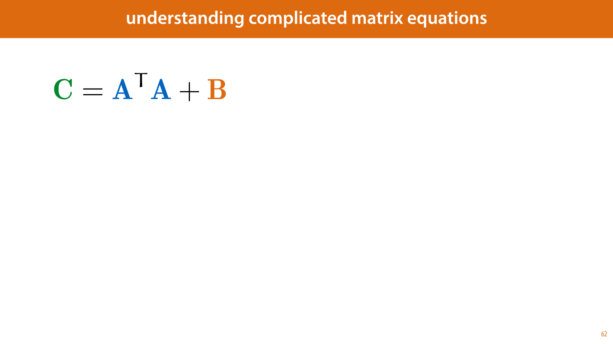

            <figcaption>
            
To make this more precise, we start with an interval defined by two points. We draw a line through the two values of our function at that point. As the points get closer to each other (the interval gets smaller), this line becomes a better and better approximation to our curve, within the interval. 

In the limit, as the points gets closer and closer together, we get a line that <em>just</em> touches the curve at a single point. This is called a <em class="orange">tangent</em> line.

            </figcaption>
            click image for animation
       </section>

       <section id="slide-063" class="anim">
            <a class="slide-link" href="https://mlvu.github.io/preliminaries#slide-063" title="Link to this slide.">link here</a>
            

            <figcaption>
            
We want to specify what this tangent line actually looks like. The specific property of the tangent that we're interested in is the <em>slope</em>. How much it rises if we take a step of size 1 to the right. 

Let's say our leftmost point is x and the other point is a distance of h to the right of it, at x + h. We mark two points on the curve of f at these points and draw a line through them. What is the slope of this line, and what happens to that slope as we make h smaller and smaller? 

Over the space from x to x+h this line rises from f(x) to f(x+h). That is, over a horizontal interval of size h, the line rises by f(x + h) - f(x). If we want to know the vertical change for one unit of horizontal change (one step to the right), we divide f(x+h) - f(x) by h. This is the slope of the orange line. The horizontal distance, the size of our interval, we'll call h. In this case h is bigger than 1, but the formula works the same for h smaller than 1. The question is, what slope do we <em>converge to</em> if h gets smaller and smaller? 
<aside    >If this seems abstract, consider the example of the speeding driver. To work out their speed at the moment of measurement, we assume that the driver maintains that speed for 1 unit (hour) and see how much the function changes over the vertical axis. In this case, we measure their distance traveled over a certain time, and divide by that time to get the distance traveled over one unit of time, which is how we express the speed. </aside>
The problem is that once the two points come together, with h=0, there is no longer a single unique line through it/them. This shows in the formula by the fact that we get a division by zero. The whole thing becomes undefined. 

We need to figure out what the tangent <em>converges</em> to. We make the distance between the two points smaller and smaller, without letting it get to zero, and we look at the behavior of the line through them. This line will eventually get closer and closer to one specific line, as the two points get closer and closer to each other. This is how we define the tangent line. 

The slope of the tangent is called the <em>derivative</em>. It is the slope of the line we get in the limit if we shrink the distance between x and x' to be smaller and smaller.

            </figcaption>
            click image for animation
       </section>

       <section id="slide-064" class="anim">
            <a class="slide-link" href="https://mlvu.github.io/preliminaries#slide-064" title="Link to this slide.">link here</a>
            

            <figcaption>
            
What the slope of the tangent is, depends on where we are on our function, just like our driver's speed was different at every point in time. 

Just like we can plot a driver's speed over time, we can plot the slope of the tangent of f(x) for every x. This gives us a second function of x, which is often labeled f'(x) and called the <em>derivative</em>. Working out what a derivative looks like is called <em>differentiation </em>(or "taking the derivative") . 

We can work out some basic rules about what to expect from the derivative, based on what we know: 

If the function f(x) increases at x, then its derivative should be <em>positive </em>at x, f'(x) &gt; 0. This is because the slope measure how much the tangent increases if we take one step to the right. If it does increase, this is a positive number. 

Likewise, if f(x) decreases at x, then its derivative should be <em>negative</em> at f'(x). 

Finally, if f(x) neither increases, nor decreases, that is when f(x) is the tip of a peak, the bottom of a valley, or simply a flat region, then the derivative should be exactly zero. 
<aside    >These three properties are why culculus is so important in machine learning, so remember them well. The key idea is that we often want to find a minimum or a maximum of a function. For instance, if we have some points in space, and we want to fit a line through those points, to predict where the next point will be, then we want the difference between the line and the points to be as small as possible. </aside><aside    >If we can work out how to express this difference as a function, then the derivative of that function can tell us how to find the point where that function is as small as possible: at that point the derivative should be zero. And if it isn't zero, the derivative can tell us in which direction to move.</aside><aside    ></aside>
            </figcaption>
            click image for animation
       </section>

       <section id="slide-065">
            <a class="slide-link" href="https://mlvu.github.io/preliminaries#slide-065" title="Link to this slide.">link here</a>
            

            <figcaption>
            
Here's how all of that translates to a <em>mathematical </em>definition. We take the definition of the slope over an interval (x, x+h) that we saw earlier, and we see what that slope <em>converges to </em>as we make the interval smaller and smaller.  

This is what the "lim" operator does: it says take the process at the bottom (h -&gt; 0) and finds out what the thing on the right converges to under this process. In this case, we can't set h = 0, because we would get a division by zero, but we can let<strong> </strong><strong class="orange">h</strong><strong> go to 0</strong>.  
<aside    >Since we haven't specified what x should be, the result of this limit is a function of x. That is, we want some expression that tells us what this limit is for any given value of x. </aside>
One of the great achievements of calculus is that if we happen to have a functional form for f(x), that is we can express it in a formula like f(x) = x2 + x +1, then we can also work out the functional form of the derivative f'(x). This is called taking a derivative. 

The way we do this is by starting with this definition and applying some simple rules that we know always work for limits. This has led to a set of general rules for taking derivatives, which we can use to get from almost any function f(x) to its derivative f'(x).

            </figcaption>
       </section>

       <section id="slide-066">
            <a class="slide-link" href="https://mlvu.github.io/preliminaries#slide-066" title="Link to this slide.">link here</a>
            

            <figcaption>
            
To work out the following examples, we'll need to know how to think about <em>limits</em>. In a proper calculus course, we'd take you through both the intuition behind them and then derive the rules for correctly working out algebraic derivations with them.  
<aside    >These <a href="https://en.wikipedia.org/wiki/Limit_of_a_function#Properties"><strong class="blue">aren't complex</strong></a>, so if you've never seen them, it's worth having a look. </aside>
However, once we've used limits to derive the rules for differentiation, we won't see them again in the rest of the course, so we can allow ourselves a little shortcut. There are only three things we need to understand about how limits work. 

First, the function for which we take the limit, g(x) here, can be rewritten using any of the rules of algebra. This just turns it into the same function, expressed differently, so it doesn't change the limit we're expressing with the notation "lim g(x)". 

If the function to the right of the "lim" is a sum of two other functions, like x2 + x is a sum of the functions x2 and x, then the limit of that sum is just the limit of the first term by itself plus the limit of the second term by itself. 

If our limit is for h going to zero, and the function to the right of "lim" is just h by itself, then the result is just 0. This hopefully makes intuitive sense: if we make h smaller and smaller so that it converges to zero, then the function "h" becomes zero. 

If the function c to the right of "lim" is constant with respect to h. That is, it cany be any expression, with any number of variables, but it doesn't contain h, then the result is just c. Again, this should make intuitive sense. If we make h smaller and smaller, but its value doesn't affect c, then the result will just be c. 

To properly work out all limits you might encounter, you'll need a little more than this (not much though), but to illustrate the principle we can make do with these four rules. 

            </figcaption>
       </section>

       <section id="slide-067" class="anim">
            <a class="slide-link" href="https://mlvu.github.io/preliminaries#slide-067" title="Link to this slide.">link here</a>
            

            <figcaption>
            
As an example  example for the simple function f(x) = x2. 

First, we write down what it is we're interested in: f'(x). The only thin we know so far is the definition of the derivative, so we fill that in. 

Next, we notice that f(x+h) and f(x) appear. These we can replace using the definition of f(x). This is just rewriting the function to the right of the "lim" into something equivalent. That means that the limit we had before we rewrote it is the same as the limit afterwards. 

Next up, we can rewrite the term (x + h)2 into x2 + 2xh + h2.  
<aside    >This is the expansion of a square of a sum. See an <a href="https://gestalt.ink/square-sum"><strong class="blue">explanation here</strong></a>. </aside>
The first and last term are x2 and -x2, so these cancel each other out. Next up, we are dividing by h, so we remove one factor of h from each of the terms above the division line. 

Finally, we are left with the limit of 2x + h as h goes to zero. This limit we can solve by the rule from the previous slide, and setting h=0. 
<aside    >We can also appeal to intuition. Perhaps we can't immediately see what the limit at the top should be, but once we've rewritten it to this, it's pretty clear. As we make h smaller and smaller, the only thing that remains is 2x. There are no divisions by zero or any other difficult consequences of letting h go to zero, so the answer is plain to see. </aside><aside    ></aside>
            </figcaption>
            click image for animation
       </section>

       <section id="slide-068" class="anim">
            <a class="slide-link" href="https://mlvu.github.io/preliminaries#slide-068" title="Link to this slide.">link here</a>
            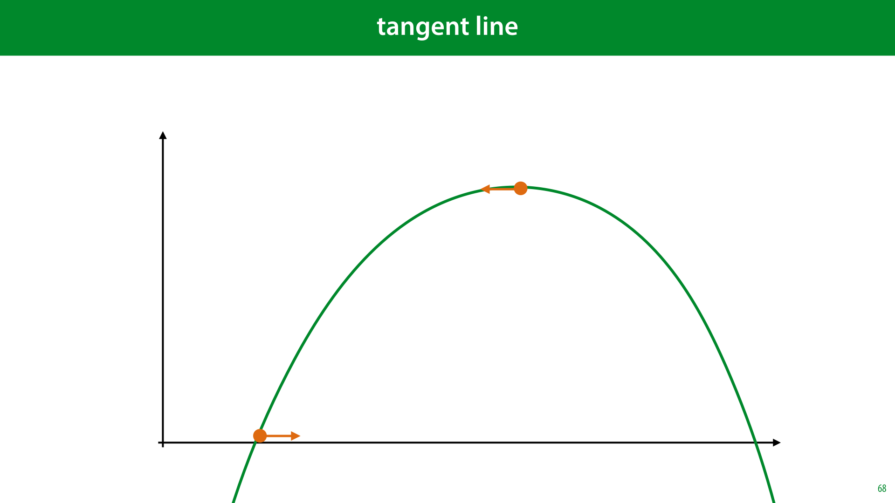

            <figcaption>
            
Here is another example. This shows a powerful principle: we can often work out basic rules, by not specifying what all the details of a function are. In this case, we don't specify what f(x) is, we just say that it is the fum of a function g(x) and another function k(x). Anything we can work out about what f'(x) looks like without specifying the details of g(x) and k(x), must then hold for all functions that look like this. 
<aside    >For example any rule we derive this way must apply to x2 + x but also to sin(x) + cos(x) and to x + 3 and any other function that can be written as the sum of two others. </aside>
We start by filling in the definition of the derivative, and filling in the definition of f(x) (lines 1 and 2). 

We then group the terms for g and the terms for k together, and split the division into two divisions (lines 3 and 4). 

We can now apply the sum-rule for limits, and split the limit into the sum of the limit for g and the limit for k. (line 5) 

Finally, and this is the magic trick, we recognize that these two terms both correspond to the definition of a derivative. We can do the opposite of "filling in the definition" that we did in the first line. We replace the definition of g'(x) with the label g'(x) and likewise for k'(x) 

The end result is <strong>the sum rule</strong>. It states that if our function is the sum of two others functions, then its derivative is the sum of their derivatives. 

            </figcaption>
            click image for animation
       </section>

       <section id="slide-069" class="anim">
            <a class="slide-link" href="https://mlvu.github.io/preliminaries#slide-069" title="Link to this slide.">link here</a>
            

            <figcaption>
            
That hopefully give you some intuition for where the rules come from. The rest of the rules we will just give you to memorize.  
<aside    >In most calculus courses, you would go through each one and prove it from the definition. It’s worth trying if you’ve never done that before. </aside>
Pay particular attention to the second exponent rule. It tells us that the derivative of the exponential function bx is <em>proportional to itself</em>. That is, it's just the same function again, but multiplied by some constant independent of x (a constant that happens to be ln b). This suggests that if there is some value of b for which this constant is equal to 1, we get a function that is <em>equal to its own derivative</em>. It turns out that this happens is b = 2.7182818284... This number we call "e", Euler's number. The logarithm with base e, we call the natural logarithm (we already saw this in the first part of the lecture). 
<aside    >Obviously, this is a bit of an open door if you already know that the constant in the other exponent rule is the natural logarithm of b. You have to imagine that people in Euler's time only knew that bx was proportional to itself, but they didn't have a good way to express the constant by which it was multiplied. Then they figured out that the constant was equal to 1 for a particular number, and then they realised that the constant must be loge b. </aside>
The other rule that you should pay attention to is <strong>the chain rule</strong>. It is no exaggeration to say that the method that drives 90% of modern machine learning is derived from this one simple rule. It's hard to convey exactly why just yet, except to say that when we design complex models, we do it by chaining functions together: making the output of one the input of the next (much like we build computer programs). The chain rule gives us a derivative over such chains of functions. 
<aside    >There are some more rules, but these are the ones we will use most often in the course.</aside><aside    ></aside>
            </figcaption>
            click image for animation
       </section>

       <section id="slide-070" class="anim">
            <a class="slide-link" href="https://mlvu.github.io/preliminaries#slide-070" title="Link to this slide.">link here</a>
            

            <figcaption>
            
The notation on the left, using f' to indicate the derivative of f, is probably the most precise notation, and the best suited for explaining the principles of calculus in general. 

However, in machine learning, the notation we use almost exclusively is the one on the right:<strong> Leibniz's notation</strong>. It can be a little bit more work to get used to this way of writing derivatives. All I can say, at this point is that it pays off eventually. For now, let's take a closer look at where this notation comes from and at how exactly it's defined.

            </figcaption>
            click image for animation
       </section>

       <section id="slide-071" class="anim">
            <a class="slide-link" href="https://mlvu.github.io/preliminaries#slide-071" title="Link to this slide.">link here</a>
            

            <figcaption>
            
Leibniz is one of the two inventors of calculus, the other being Newton. Neither of them were particularly obsessed with mathematical rigour. They worked things out based on intuition and guesswork, being as much physicists as mathematicians. They were looking for the fundamental rules that governed the world, and a lucky guess followed by an experimental verification on a few examples was perfectly acceptable. 

The way both of them though about calculus was in terms of <strong>infinitesimal quantities</strong>. Numbers that are as close to zero as you can possibly get, but not equal to zero: something infinitely small. 

It was in terms to these infinitesimals that Leibniz developed his calculus. For a function f(x), an infinitesimal change to x, which he called dx, would <em>cause</em> an infinitesimal change to f(x). The latter would also be infinitely small, but still potentially <em>different</em> from dx.  

If this all sounds a bit fuzzy, modern mathematics agrees with you, but the key property that Leibniz cared about was that<strong> the quotient between the two quantities</strong> (one divided by the other) could be worked out.

            </figcaption>
            click image for animation
       </section>

       <section id="slide-072">
            <a class="slide-link" href="https://mlvu.github.io/preliminaries#slide-072" title="Link to this slide.">link here</a>
            

            <figcaption>
            
And in this respect, Leibniz wasn't wrong. This is still the idea behind the derivative: we make a small change to x and see how much f(x) changes as a result. Then we divide the latter by the former. If the result converges to some fixed value as the small change goes to zero, we have a well-defined derivative. 

It's just that the language of limits had not been established yet, so Leibniz couldn't write his ideas down with the rigour we have available today.

            </figcaption>
       </section>

       <section id="slide-073" class="anim">
            <a class="slide-link" href="https://mlvu.github.io/preliminaries#slide-073" title="Link to this slide.">link here</a>
            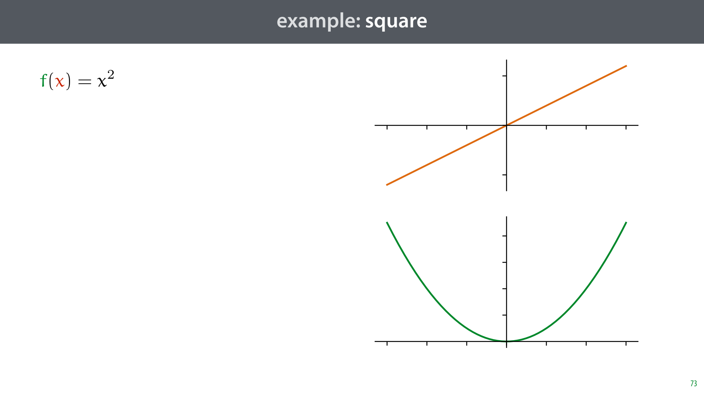

            <figcaption>
            
For this reason the Leibniz notation is usually re-interpreted from how it was originally intended. It looks like we’re dividing one quantity by another, but that's not what it represents.  

The d·/d· notation actually represents an operator, it takes a function as its argument, written to the right or above the line, and returns another function: the derivative of the argument. The letter below the line (x) represents the variable that we take the derivative <em>for</em>. 
<aside    >It's perfectly fine to still think of dx and df(x) as infinitesimal quantities that somehow exist independent of their quotient. In physics, people often think this way, and explain concepts this way. However, you should remember that such thinking is usually more akin to a guess than a derivation. To confirm that your guess is correct, and that you haven't been tripped up somewhere by the impossibilities of infinitesimals, you should translate your result to the proper definition. </aside><aside    >There are <a href="https://en.wikipedia.org/wiki/Infinitesimal"><strong class="blue">modern, rigorously defined number systems</strong></a> that actually allow infinitesimal quantities, so that Leibniz' intuition may be used with rigour. It's debatable however, whether this makes the exposition of calculus more intuitive, and they are not widely adopted in our field.</aside><aside    ></aside>
            </figcaption>
            click image for animation
       </section>

       <section id="slide-074" class="anim">
            <a class="slide-link" href="https://mlvu.github.io/preliminaries#slide-074" title="Link to this slide.">link here</a>
            

            <figcaption>
            
The main benefit of the Leibniz notation is that you don't have to refer to your function by an explicit name like "f(x)". You can just fill in its formula directly into the operator. Here we say that for f(x) = x2 the derivative is f'(x) = 2x in one single statement. This is one reason we prefer the Leibniz notation in machine learning: it makes long derivations simpler to write down. 
<aside    >In the Lagrange notation this is occasionally done with a notation like [x2]' = 2x but this is not commonly accepted.</aside><aside    ></aside>
            </figcaption>
            click image for animation
       </section>

       <section id="slide-075" class="anim">
            <a class="slide-link" href="https://mlvu.github.io/preliminaries#slide-075" title="Link to this slide.">link here</a>
            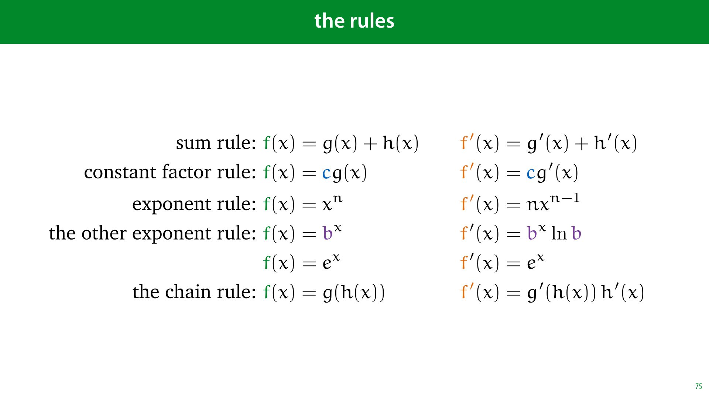

            <figcaption>
            
Here are two forms of shorthand we will occasionally allow ourselves, to simplify the notation. At the top, if it is clear that the result of f is a function of x, we will omit its argument. You can think of this in Leibniz's terms if you like: we divide the change in f by the change in x. What is left more implicit by this notation is that we create the change in x, and observe the resulting change in f. 
<aside    >In other words, we think of f as referring both to the function, and a variable representing its output. This is a little ambiguous, but if it's clear from context what we man, it simplifies things a lot. </aside>
The second line shows what happens when we fill in the explicit functional form of f in terms of x. We will do this very often. Technically, we need to put brackets around the whole function, or the statement might be ambiguous (especially if we write the function to the right of the division line as in the previous slide). In practice, things look a lot clearer without the brackets, so if the potential ambiguity is minimal, or can easily be resolved from context, we allow ourselves to leave the brackets out.

            </figcaption>
            click image for animation
       </section>

       <section id="slide-076" class="anim">
            <a class="slide-link" href="https://mlvu.github.io/preliminaries#slide-076" title="Link to this slide.">link here</a>
            

            <figcaption>
            
Here are some examples. The first two lines show the derivatoves we've already worked out in the Lagrange notation. 

The right part of the second line shows how much clearer things can become when we assume that we know which variable is dependent on which. The notation is more ambiguous, but a lot clearer. 

The third line shows the benefit of indicating the independent variable. The variables a, b, c are indicated with letters in the function, but we treat them as constants: x is the only variable we change to observe the resulting change in the function above the line. The rest is treated the same way as the 3 in the exponent is.  
<aside    >This can get a little confusing when we combine it with the shorthand from the second line. We assume that the reader knows whether a is a constant, or a function of a(x). If things get too ambiguous, we can always spell them out more explicitly.</aside><aside    ></aside>
            </figcaption>
            click image for animation
       </section>

       <section id="slide-077">
            <a class="slide-link" href="https://mlvu.github.io/preliminaries#slide-077" title="Link to this slide.">link here</a>
            

            <figcaption>
            
Here are the basic rules again, but this time in Leibniz notation.  

Pay particular attention to what we're doing for the chain rule. In the first factor on the right hand side, we are taking the derivative <em>with respect to a function of x</em>, not x itself. This can be a little tricky to wrap your head around, but it's a very powerful way of writing derivatives. Let's look at a simple example.

            </figcaption>
       </section>

       <section id="slide-078" class="anim">
            <a class="slide-link" href="https://mlvu.github.io/preliminaries#slide-078" title="Link to this slide.">link here</a>
            

            <figcaption>
            
The function (x-3)2. We can see this as the function x-3 fed to the function that squares its input. 

Applying the chain rule means first taking the derivative of this “squaring function” <em>with respect to its input</em>.The input to the squaring function here is not x, it's (x-3). So we want to take the derivative of (x-3)2, but treat the whole expression x-3 as the input. This is what the factor in blue represents: we are taking the derivative with respect to (x-3). When we look at it like that, the exponent rule applies, and the result is simply 2(x-3). 

We then multiply this derivative with the derivative of x-3 over x, which is 1. 

We will use the chain rule <strong>a lot</strong>, and always write it like this. Make sure you understand what is happening in this slide. 

            </figcaption>
            click image for animation
       </section>

       <section id="slide-079">
            <a class="slide-link" href="https://mlvu.github.io/preliminaries#slide-079" title="Link to this slide.">link here</a>
            

            <figcaption>
            
The final subject we will need to discuss is <strong>multivariate</strong> or <strong>multivariable calculus</strong>. 

This is the kind of calculus you use when your function has multiple inputs and/or multiple outputs. Luckily, the basic principle is almost the same as for functions of one variable. 

We will see a lot of functions with multiple outputs, but we will never apply calculus to them. We will only ever take derivatives of functions with a single output. Happily, this simplifies things a little bit.

            </figcaption>
       </section>

       <section id="slide-080">
            <a class="slide-link" href="https://mlvu.github.io/preliminaries#slide-080" title="Link to this slide.">link here</a>
            

            <figcaption>
            
The simplest example is a function with two inputs and one output. Here's some arbitrary polynomial in arguments x and y, 
<aside    >Put more technically, a scalar function of two arguments. </aside>

            </figcaption>
       </section>

       <section id="slide-081">
            <a class="slide-link" href="https://mlvu.github.io/preliminaries#slide-081" title="Link to this slide.">link here</a>
            

            <figcaption>
            
We can use vectors to easily express a function of multiple variables. Here is the same function as before, but now expressed using a single vector argument.

            </figcaption>
       </section>

       <section id="slide-082">
            <a class="slide-link" href="https://mlvu.github.io/preliminaries#slide-082" title="Link to this slide.">link here</a>
            

            <figcaption>
            
One particularly simple type of vector function, which we will see a lot is a<strong> linear function</strong>. In this function, we take the dot product of the input vector with some other constant vector (and possibly add a constant scalar). Such a function draws a flat plane. 

If the function has more than 2 arguments, we call the resulting structure a<em> </em><strong>hyperplane.</strong>  

            </figcaption>
       </section>

       <section id="slide-083">
            <a class="slide-link" href="https://mlvu.github.io/preliminaries#slide-083" title="Link to this slide.">link here</a>
            

            <figcaption>
            
Here's how to interpret the parameters of a linear function. Note that in a 1D linear function, f(x) = wx + b, the constant w is the <em>slope</em>, how much the function moves up if you take one step to the right, in a 2D function the values w1 and w2 provide two slopes. How much the plane moves up if you take a step of 1 along the x1 axis and how much the plane moves up if you take a step of 1 along the x2 axis. 

The term b doesn't change the angle of the plane, but serves to translate it up and down.

            </figcaption>
       </section>

       <section id="slide-084">
            <a class="slide-link" href="https://mlvu.github.io/preliminaries#slide-084" title="Link to this slide.">link here</a>
            

            <figcaption>
            
One fact that will become very important is the <em>meaning </em>of the vector <strong class="orange">w</strong> in linear functions like these. It has a simple interpretation. When we view it as an arrow in the x1/x2 plane, it's <strong>the direction in which the (hyper)plane of our function increases the quickest</strong>. Wherever you are, if you want f(<strong>x</strong>) to increase as much as possible, move in the direction of <strong class="orange">w</strong>. 
<aside    >The reason that this will become important, again, is that we will try to find the highest and lowest points of functions. We will do this by approximating them with a linear function, and then in that linear function using the constant <strong class="orange">w</strong> to tell us in which direction the function increases and decreases the quickest.</aside><aside    ></aside>
            </figcaption>
       </section>

       <section id="slide-085" class="anim">
            <a class="slide-link" href="https://mlvu.github.io/preliminaries#slide-085" title="Link to this slide.">link here</a>
            

            <figcaption>
            
To prove this, we can first make a few simplfiying assumptions. The question is, in which direction does f(<strong>x</strong>) = <strong>x</strong>T<strong class="orange">w</strong><strong> + </strong>b increase the quickest. The scalar b only translates the hyperplane up and down, it doesn't change its angle. Therefore, the answer is the same for f(<strong>x</strong>) = <strong>x</strong>T<strong class="orange">w</strong><strong> + </strong>b as for f(<strong>x</strong>) =  <strong>x</strong>T<strong class="orange">w</strong>. 

To make our question more precise, we need to state what we mean by a <em>direction</em>. We can represent this by a unit vector <strong>u</strong> (a vector with length 1). The question is then for which unit vector u is f(<strong>x</strong> + <strong>u</strong>) the largest.  

Finally, note that in a hyperplane, it doesn't matter where we <em>start</em>. The direction of greatest ascent is the same at all points. So we can set <strong>x</strong>=<strong>0</strong>. The question then becomes for which unit vector <strong>u</strong> is the value f(<strong>u</strong>) = <strong>u</strong>T<strong class="orange">w</strong> the greatest? 

The question is easily answered by switching to the geometric definition of the dot product. The question then becomes, for which unit vector <strong>u</strong> is f(<strong>u</strong>) = ||<strong>u</strong>|| ||<strong class="orange">w</strong>|| cos θ the  greatest. Since u is a unit vector, this becomes f(<strong>u</strong>) = ||<strong class="orange">w</strong>|| cos θ. The only part of this expression that the choice of <strong>u</strong> affects is θ, the angle between <strong>u</strong> and <strong class="orange">w</strong>. We maximize cos θ by making the angle minimal, which means that we maximize f(<strong>u</strong>) if <strong>u</strong> points in the same direction as <strong class="orange">w</strong>, which completes our proof.

            </figcaption>
            click image for animation
       </section>

       <section id="slide-086" class="anim">
            <a class="slide-link" href="https://mlvu.github.io/preliminaries#slide-086" title="Link to this slide.">link here</a>
            

            <figcaption>
            
Now, let's look at what a derivative means in the context of a multivariate function. The first thing we define is a<strong> partial derivative</strong>.  

This is simply the derivative as we already know it, with respect to one of the arguments of the function, treating the other as a constant. For a function f(x, y) with two arguments, we can take two partial derivatives. One with respect to x and one with respect to y. 
<aside    >For a function with n inputs and one output, we can take n partial derivatives. </aside>
When we take a partial derivative, we replace the d from the Leibniz notation with the symbol ∂. This has the exact same meaning, it only signifies that the function you are taking derivatives over has more than one symbol, and that you are treating the others as constants. Since almost all functions in our course are multivariate, we will always use the ∂ symbol from now on. 
<aside    >They are sometimes used together with different meanings in differential equations, but we won't use those in this course. So long as you use the Leibniz notation as an operator (as shown earlier) the two symbols mean exactly the same thing.</aside><aside    ></aside>
            </figcaption>
            click image for animation
       </section>

       <section id="slide-087">
            <a class="slide-link" href="https://mlvu.github.io/preliminaries#slide-087" title="Link to this slide.">link here</a>
            

            <figcaption>
            
Here is an example (the function for which we plotted the surface earlier). 

When we take the partial derivative with respect to x, we treat all the ys as constants. This means that when we get to the term xy, The result is y times the derivative of x over x, which is 1, so the derivative for that term is y. 

When we then take the derivative with respect to y, the opposite happens, and the derivative is x.

            </figcaption>
       </section>

       <section id="slide-088" class="anim">
            <a class="slide-link" href="https://mlvu.github.io/preliminaries#slide-088" title="Link to this slide.">link here</a>
            

            <figcaption>
            
Here's a visualization of what it means to take the partial derivative as a point x=0, y=5, <em class="red">with respect to x</em>. 

We let the function vary with x, keeping y fixed. This gives us a kind of "slice" through the surface f. The result is that we have a one-dimensional function again, for which we can take the derivative. We do this by only caring about the way f changes if we change x. In other words, by treating y as a constant. 

Then we do the same for y, treating x as a constant. 

For both curves, the derivatives give us the slope of the tangent line. We've shown these as dotted lines here. 

These lines cross the same point, so together, they lie in a shared <em>plane</em>. In higeher dimensions, the tangent lines of all partial derivatives lie in a shared <em>hyperplane</em>. This is the <em>tangent hyperplane</em>. The hyperplane that <em>just</em> touches the surface of f.  

How do we describe the tangent hyperplane? Note what the tangent slopes indicate: how much the plane moves up if we take a step of 1 along the x axis and how much the plane moves up if we take a step along the y axis. These are exactly the roles of the constants in the function xw1 + yw2 + b. Or, in vector notation the elements of the vector w in the function <strong>x</strong>T<strong class="orange">w</strong> + b. 

This tells us that if we take all of our partial derivatives and stick them in a vector <strong class="orange">w</strong>, the function that will describe our tangent hyperplane is <strong>x</strong>T<strong class="orange">w</strong> + b (for some value of b, which we don't usually care about). 

            </figcaption>
            click image for animation
       </section>

       <section id="slide-089" class="anim">
            <a class="slide-link" href="https://mlvu.github.io/preliminaries#slide-089" title="Link to this slide.">link here</a>
            

            <figcaption>
            
Here is the whole process again in a simple animation. 

We start with a function with two inputs and one output. In this case the function f(x, y) = x2 + y2 - ¼xy + x - y +1 

We pick a point on the function, in this case (10, 20). 

We can define two partial derivatives. One is the derivative of f as x varies and y is kept fixed. 

The other is the derivative of f as y varies and x is kept fixed. 

Both of these are functions of one variable, so we can apply what we know univariate calculuse to work out the derivatives. At our point (10, 20), this gives us a tangent line touchingred function and a tangent line touchting the blue function.  

Since these lines cross, they lie in a shared hyperplane. That is the plane that (in most cases) just touches but does not cross f. Like the tangent line, the tangent hyperplane functions as a locally linear approximation of f: in a small enighborhood around the point (10, 20), it behaves as much like f as any linear function can.

            </figcaption>
            click image for animation
       </section>

       <section id="slide-090">
            <a class="slide-link" href="https://mlvu.github.io/preliminaries#slide-090" title="Link to this slide.">link here</a>
            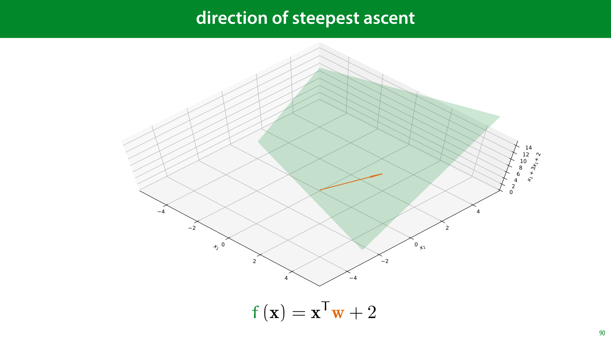

            <figcaption>
            
This vector, containing all partial derivatives, is called the gradient. 

The gradient is the "slope vector" in the function describing the tangent hyperplane.

            </figcaption>
       </section>

       <section id="slide-091">
            <a class="slide-link" href="https://mlvu.github.io/preliminaries#slide-091" title="Link to this slide.">link here</a>
            

            <figcaption>
            
On the left is a screenshot of one of the most popular online magazines about machine learning. It's called <a href="https://thegradient.pub/"><strong class="blue">The Gradient</strong></a>. This should tell you that the gradient is a<em> very</em> central idea in machine learning. 

The reason is the same as before. In machine learning, the main thing we care about is optimization, finding the highest or the lowest point of a complicated function. The tangent hyperplane is a<em> local approximation</em> of a function. In general it behaves nothing like the function, but a very small neighborhood where the two just touch, the tangent hyperplane is a great approximation. That means that so long as we stay in that neighborhood, we know where to move it we want the function to increase. 

The idea is that we take a small step in that direction, and then recompute the gradient. This gives us a new, slightly different direction to move in, which allows us to take another small step and so on. So long as we take only small steps before recomputing the gradient, we will always be following our function. This is called gradient ascent. If we want to find the minimum of a function, we take the small steps in the opposite direction  
<aside    >image source: <a href="http://charlesfranzen.com/posts/multiple-regression-in-python-gradient-descent/"><strong class="blue">http://charlesfranzen.com/posts/multiple-regression-in-python-gradient-descent/</strong></a></aside><aside    ><a href="http://charlesfranzen.com/posts/multiple-regression-in-python-gradient-descent/"><strong class="blue"></strong></a></aside>
            </figcaption>
       </section>

       <section class="video" id="video-091">
           <a class="slide-link" href="https://mlvu.github.io/preliminaries#video-91">link here</a>
           <iframe
                src="https://www.youtube.com/embed/9rWoBVnVuLQ"
                title="YouTube video player"
                frameborder="0" allow="accelerometer; autoplay; clipboard-write; encrypted-media; gyroscope; picture-in-picture"
                allowfullscreen>
           </iframe>

       </section>

       <section id="slide-092">
            <a class="slide-link" href="https://mlvu.github.io/preliminaries#slide-092" title="Link to this slide.">link here</a>
            

            <figcaption>
            
Probability is an important tool in Machine Learning. We expect that you have been taught probability theory already, but since it’s a subtle concept, with complicated foundations, we’ll go over the basics again in this first video. 

If you have never done <em>any</em> probability before, please consult the homework exercises and the recommended reading to brush up first. 

 

            </figcaption>
       </section>

       <section id="slide-093">
            <a class="slide-link" href="https://mlvu.github.io/preliminaries#slide-093" title="Link to this slide.">link here</a>
            

            <figcaption>
            
To start, let’s look at the way we use probability <em>informally</em>. 

Let’s say you are a concerned parent, you read this headline and you are shocked by it. You turn to your partner, and you say “that means that the probability that our son is gambling online is 12.5%”. Your partner disagrees, you have a good handle on your son’s behaviour and his spending. Unless he has a credit card you don’t know about, and the probability of that is much lower. 

Well, then the probability that Josh, his closest friend, gambles online must be 12.5%. If one in eight teenage boys is gambling, they must be hiding <em>somewhere</em>. Your partner disagrees again: probability doesn’t enter in to it. Josh is either gambling or he isn’t. 

Clearly, we need to look at what we mean when we say that a probability of something is such-and-so. There are two commonly accepted ways of looking at it: objective and subjective probability. We’ll start with <strong>objective probability</strong>.  

image source: <a href="https://www.theguardian.com/society/2016/sep/20/one-in-eight-european-teenage-boys-gamble-online-says-survey"><strong class="blue">https://www.theguardian.com/society/2016/sep/20/one-in-eight-european-teenage-boys-gamble-online-says-survey</strong></a>

<a href="https://www.theguardian.com/society/2016/sep/20/one-in-eight-european-teenage-boys-gamble-online-says-survey"><strong class="blue"></strong></a>

            </figcaption>
       </section>

       <section id="slide-094">
            <a class="slide-link" href="https://mlvu.github.io/preliminaries#slide-094" title="Link to this slide.">link here</a>
            

            <figcaption>
            
In <strong>objective probability</strong>, “the probability that X is the case” represents an<em> objective truth</em>: whatever a probability is, it must be the same for everybody. You and I may disagree over a probability, but only because one of us is wrong. There is one true probability. An example is the probability that a coin-toss will land heads. If nothing unusual is going on, everybody should agree that the outcome is uncertain and that the probability will be 50%. We can't have a situation  where one person thinks it's 10% and the other thinks it's 90%<em> and they're both right</em>. 

The most common form of objective probability is<strong> frequentism</strong>. Under the frequentist definition, probability is a property of a (hypothetical) repeated experiment.  For instance, take the statement “the probability of rolling 6 with a fair die, is one in six.”  

The experiment is rolling a die. The outcome we are discussing is the roll resulting in a 6. If we were to repeat the experiment a large number of times, N, then the proportion of times we observe the discussed outcome is close to 1 in 6. More precisely, as N grows, the proportion <em>converges</em> to 1 in 6. 

Under a frequentist interpretation, saying “the probability is one in six", is equivalent to saying “if I roll the die repeatedly, the relative frequency of sixes will converge to 1 in 6 as the number of rolls grows.” 

 

            </figcaption>
       </section>

       <section id="slide-095">
            <a class="slide-link" href="https://mlvu.github.io/preliminaries#slide-095" title="Link to this slide.">link here</a>
            

            <figcaption>
            
Under objective probability the statement “the probability that Josh is gambling is 12.5%” is indeed nonsense. There is no experiment we can imagine where Josh “turns out" to be a gambler one in 8 times. He either gambles or he doesn’t. 

What we <em>can</em> say is that the probability that a teenage boy drawn randomly from the European population gambles online is 12.5%. This is an experiment we can repeat, and at every repetition, we choose a different boy, so we get a different outcome.

            </figcaption>
       </section>

       <section id="slide-096">
            <a class="slide-link" href="https://mlvu.github.io/preliminaries#slide-096" title="Link to this slide.">link here</a>
            

            <figcaption>
            
The alternative to objectivism is <strong>subjectivism</strong>. It states that probability expresses our uncertainty. If X is a boolean variable, one that is true or not true, and we are uncertain whether X is true, we can assign a probability to X being true. A probability of 0.5 means we are entirely ambivalent, a probability of 0.75 means we think X is pretty likely, and a probability of 1 means we’re entirely sure that X is true.  

In this case, different people can have different probabilities for the same thing being true. You and I may "assign" different probabilities to something being true and both be right. If you have information I don’t have, your probability may be closer to certainty than mine. 

<strong>Bayesianism</strong> is the main form of subjective probability. It builds on Bayes’ rule, which we will discuss later, to tell us how we should use observations to <em>update</em> our beliefs.

            </figcaption>
       </section>

       <section id="slide-097">
            <a class="slide-link" href="https://mlvu.github.io/preliminaries#slide-097" title="Link to this slide.">link here</a>
            

            <figcaption>
            
Under subjectivism, we <em>can</em> say “the probability that our son is gambling is 12.5%” We don’t know precisely what he gets up to, so even though there is a definite objective answer, <em>we</em> are uncertain. If we know only this headline, we may well pick 12.5% as our belief that our son is gambling. Of course, as noted before we have a lot more knowledge about <em>our </em>son than about other teenage boys. We know he goes to bed on time, we know where gets his money,  and we know he probably doesn’t have a secret credit card. So even though the probability for a random teenage boy would be 12.5%, the probability for our son is actually much lower, because we have extra information. 

This is the fundamental difference between the two views: under frequentism, probability is defined as an objective property of the world. The probability of X is the same for all people regardless of what we know or don’t know. Under Bayesianism, probability is an expression of a subjective property: it can change from one person to the next, and if we learn new information, it can change from one moment to the next. If we find out that our son <em>does </em>have a secret credit card, the probability that he is gambler, suddenly jumps up dramatically, even though nothing about him has changed, only our knowledge about him. 

Note that Bayesianism, in a sense encompasses frequentism. If we define probability as the outcome of a repeated experiment, then before we do the experiment we are uncertain about its outcome. If we understand the experiment perfectly, then the Bayesian probability we assign to the outcomes will coincide with the frequentist probabilities of the outcomes.

            </figcaption>
       </section>

       <section id="slide-098">
            <a class="slide-link" href="https://mlvu.github.io/preliminaries#slide-098" title="Link to this slide.">link here</a>
            

            <figcaption>
            
So, at heart subjectivism and objectivism are disambiguations. The word probability is ambiguous, and these allow you to make precise what you mean. 

Note that you don’t have to commit to one view or another. Subjective and objective probability are just ways to be more precise about what the word probability means. You can use the subjective definition one day and the objective definition the next. 

However, once you start doing statistics, the two definitions lead to fundamentally different approaches (which we’ll see in more detail later). And in the statistical community there are definitely two camps: the frequentists and the Bayesians, and arguments between the two can get very heated. 

Since machine learning is often seen as another form of statistics, you may ask whether it is usually seen as using subjective or objective probability. I can’t give you a commonly accepted answer, I think opinions differ. 
<aside    >My view (which is definitely not shared by everyone) is that Machine Learning, while being statistical in nature, is not fundamentally probabilistic. The fundamental principles of machine learning can be defined and explained without recourse to probability theory (and indeed, we have done so for most of the start of the course). The fundamental goal of (offline) machine learning is to minimise test set loss given only a training set, and some hint as to the relation between the two datasets. This definition does not require probability. </aside><aside    >Of course, even if machine learning is not fundamentally probabilistic, probability has proven to be a very powerful tool (much like linear algebra and calculus), in helping us solve this problem. The consequence, is that we can borrow whatever methods are most helpful to us at the time. We’ll use the frequentist methods when we need them, and the Bayesian methods when they prove most helpful. We’ll even happily mix the two in a single model.</aside><aside    ></aside>
            </figcaption>
       </section>

       <section id="slide-099">
            <a class="slide-link" href="https://mlvu.github.io/preliminaries#slide-099" title="Link to this slide.">link here</a>
            

            <figcaption>
            
All that was about the<em> interpretation</em> of probabilities. This is what the field of <strong>statistics</strong> is about. We have frequentist statistics and Bayesian statistics. 

The<em> mathematical </em>definition of probability, studied in the field of <strong>probability theory</strong>, which is very different from statistics,<strong> </strong>is entirely distinct from the question of how probability applies to the real world. Both frequentists and Bayesians use the same mathematical framework to express probability as a number between 0 and 1. The only difference between them is in what this number is taken to represent. 

We’ll go through the basic ingredients of probability theory quickly. This is a complex field, and a complete basis is too technical for this course. We'll handwave some of the technical details, and you can hopefully get by with a little bit of intuition. 
<aside    >If you plan to make machine learning your main expertise, should probably resolve to return to the fundamentals of probability theory at some point and learn how everything is properly defined.</aside><aside    ></aside>
            </figcaption>
       </section>

       <section id="slide-100" class="anim">
            <a class="slide-link" href="https://mlvu.github.io/preliminaries#slide-100" title="Link to this slide.">link here</a>
            

            <figcaption>
            
First the <strong>sample space</strong>. These are the single outcomes or truths that we wish to model. If we flip a coin, our sample space is the set of the two outcomes <em>heads</em> and <em>tails</em>. 

We can have <strong>discrete</strong> sample spaces or <strong>continuous</strong> ones. In a continuous space, you can imagine that in between any two values there is always another value (like when we measure someone's height very precisely). In a discrete sample space this isn't usually the case.* 

A discrete sample space can also be infinite: consider flipping a coin and counting how many flips it takes to see tails. In this case any number of flips is possible, so the sample space is the natural numbers (although any number larger than 40 will get an astronomically small probability). 
<aside    >* As we said before, this is not a proper definition of a continuous space, and there are some odd exceptions, but it should be enough to tell the most common continuous and discrete spaces apart. The proper definition is a bit too technical at this point.</aside><aside    ></aside>
            </figcaption>
            click image for animation
       </section>

       <section id="slide-101">
            <a class="slide-link" href="https://mlvu.github.io/preliminaries#slide-101" title="Link to this slide.">link here</a>
            

            <figcaption>
            
From the sample space, we construct the <strong>event space</strong>. Events are those things that can have probabilities. These include the elements of the sample space, like the probability of rolling a six with a die, but they also include sets of multiple elements of the sample space, like the event of "rolling  a one or a six" and the event of "rolling an even number". Even the empty set and the set of all six numbers are events. As we will see, these will get probabilities 0 and 1 respectively. 

The events containing only one element of the sample space, like "rolling a 1", are called <strong>atomic events</strong>. 

How the event space is constructed is a technical business. For our purposes, we can simply say that if the sample space is discrete, then the event space is the powerset of the sample space: the set of all possible subsets we can make. 

For continuous sample spaces, not every subset can be an event. We need to make sure that our event space is a thing called a “sigma algebra.” We won’t need to worry about this in this course. We can simply trust that if we don't try to assign probability to any particularly unusual subsets of the sample space, everything will work: these will be in the sigma algebra, so they will be events, and we can assign a probability to them.

            </figcaption>
       </section>

       <section id="slide-102">
            <a class="slide-link" href="https://mlvu.github.io/preliminaries#slide-102" title="Link to this slide.">link here</a>
            

            <figcaption>
            <aside    >Random variables have a confusing and convoluted definition, so we’ll just give you the intuitive interpretation.  </aside>
<strong>Random variables</strong> help us to describe events. We can think of a random variable D as something that takes the values in the sample space, so that we can use it to describe events: instead of describing an event like "rolling a number larger than three" in natural language, we can describe it symbolically using the random variable D as "D &gt; 3". This usually makes our notation more concise and precise.  

We usually use capital, non-bold letters for random variables, or a capitalized word, and lowercase letters for traditional variables. A statement like "D=d" refers to the event that the random variable takes the value that the regular variable d currently represents. 

Once we have a way to describe the events we are interested in, we can assign a probability to each event. We do this  with a <strong>probability function p. </strong>This function must satisfy several constraints, but we’ll take those as read for now, and just say that it takes an event, and maps it to a value between 0 and 1 (inclusive). 

In probabilistic machine learning, it’s common to model features, target labels, and sometimes even model parameters as random variables. If we are referring to a dataset of multiple instances, we model each as a separate random variable with the same distribution. We'll see some examples later in this lecture.

            </figcaption>
       </section>

       <section id="slide-103">
            <a class="slide-link" href="https://mlvu.github.io/preliminaries#slide-103" title="Link to this slide.">link here</a>
            

            <figcaption>
            
Interpreting what a statement including a probability function means depends on whether all variables are “filled in.”  

In the first line, X=0 refers to a single, well-defined event, so p(X=0) refers to a single value between 0 and 1. In the second line we have a regular variable x, so the statement “X=x” can refer to different events, depending on what x is. In other words, here “p(X=x)” is a function of x. For example, if x can take one of two values, -1 or 1, then the function p(X=x) has a range of only two values as shown here.  
<aside    >Note that this is is not the complete probability function p, since that also assigns probabilities to events like "X=-1 or X=1" and the empty event. However, if X=-1 and X=1 are the only two atomic events, you can work out the complete probability function from the definition given here.</aside><aside    ></aside>
            </figcaption>
       </section>

       <section id="slide-104">
            <a class="slide-link" href="https://mlvu.github.io/preliminaries#slide-104" title="Link to this slide.">link here</a>
            

            <figcaption>
            
Since we usually know which outcomes belong to which random variables, p(X) and p(x) can both be used as shorthand for p(X=x). 

If we have a <em>Boolean</em> random variable, which takes values true or false, people often use a different shorthand, where p(X) represents the probability that X is true and p(¬X) represents the probability that it is false.  

All these conflicting shorthands may be a little confusing at times, but there is usually enough information in the context to figure out what the author means (and writing everything out in unambiguous notation usually leads to an unreadable mess).

            </figcaption>
       </section>

       <section id="slide-105" class="anim">
            <a class="slide-link" href="https://mlvu.github.io/preliminaries#slide-105" title="Link to this slide.">link here</a>
            

            <figcaption>
            
On both discrete and continuous sample spaces, <strong>the events we describe have probability</strong>. Where they differ, in an important way, is in whether a meaningful probability is assigned to the elements of the <em>sample space</em>. Here is how such probabilities are usually visualized: discrete on the left, continuous on the right. In both cases, we are looking at the sample space. 

On the left, we are seeing the probabilities assigned to each element of the sample space. Using this, we can easily work out the probabilities of every event as well (just add up all the probabilities of all the atomic events in the event). 

However, when we look at a graph like the one on the right, describing a normal distribution, it’s important to realize that <strong>this function does not express a probability</strong>. If I ask you, under this distribution, which has the higher probability, 0 or 1, the answer is that <em>they both have the same probability: 0</em>. This should make intuitive sense: What is the probability of meeting somebody who is exactly 2m tall? Surely, if you measure more and more precisely, the probability of getting <em>exactly</em> 2m goes further and further down, converging to 0. 

In short, when it comes to probability distributions on continuous spaces, the atomic events normally all have probability 0. The things that have nonzero probability are <em>ranges</em> of values. The probability of somebody being between 2.0m and 2.1m tall is more than 0, no matter how precisely you measure them.  

So what does this curve express? Not probability but <strong>probability </strong><em>density</em>. The probabilities can be retrieved by integration. For instance, the probability of getting a sample between 0 and 1 from this distribution is equal to the area highlighted in the slide. The total area between -∞ and ∞ is exactly 1. 
<aside    >These integrals can usually not be worked out analytically so we use numeric approximations. In the old days, you'd look these up in tables, but nowadays, we usually let the computer do it for us on the fly. You don't have to worry about the technical details in this course, but you do need to understand the principle. </aside><aside    ></aside>
            </figcaption>
            click image for animation
       </section>

       <section id="slide-106">
            <a class="slide-link" href="https://mlvu.github.io/preliminaries#slide-106" title="Link to this slide.">link here</a>
            

            <figcaption>
            
Now that we have the basic language of probability theory in place, we can look at some of the most important concepts. We will quickly review these five. 
<aside    >Note that even though we have multiple random variables in some of these examples, we still have a single sample space and event space, and the random variables X and Y will help us describe the events that we’re interested in. Think of the single sample space for rolling two dice. You could use X for the result of the first die, and Y for the result of the second to describe events in this situation.</aside><aside    ></aside>
            </figcaption>
       </section>

       <section id="slide-107">
            <a class="slide-link" href="https://mlvu.github.io/preliminaries#slide-107" title="Link to this slide.">link here</a>
            

            <figcaption>
            
We will use the following running example: we sample a random person from the Dutch population and we check their age and the health of their teeth (binning the results into three categories for each variable). 

We want to ask questions like: 

what is the probability of seeing an old person? 

what is the probability that a young person has fake teeth? 

does a person’s age influence the health of their teeth, or is there no relation? 

The sample space is the set of the nine different pairs of values we can observe, and the event space is the powerset of that. The random variables A(ge) and T(eeth) will help us describe these events.

            </figcaption>
       </section>

       <section id="slide-108">
            <a class="slide-link" href="https://mlvu.github.io/preliminaries#slide-108" title="Link to this slide.">link here</a>
            

            <figcaption>
            
The joint distribution is the most important distribution. It tells us the probability of each <strong>atomic event</strong>: each event that contains a single element in our sample space.  

Since we have two random variables in our example, which together capture the whole sample space, we can specify the joint distribution in a small table. The probabilities of all 9 events sum to one. 

Note that p(Age = old &amp; Teeth = healthy) refers to a single value (1/18), because we have fully specified the event. p(Age, Teeth) does not refer to a single value, because the variables are not instantiated, it represents <em>a function of two variables, </em>i.e. the whole table.

            </figcaption>
       </section>

       <section id="slide-109" class="anim">
            <a class="slide-link" href="https://mlvu.github.io/preliminaries#slide-109" title="Link to this slide.">link here</a>
            

            <figcaption>
            
If we want to focus on just one random variable, all we need to do is sum over the rows or columns.  

For instance, the probability that Age=old, regardless of the value of Teeth, is the probability of the event {(o,h), (o,u), (o,f)}. Because we can write these sums in the <em>margins</em> of our joint probability table, this process of “getting rid” of a variable is also called <strong>maginalizing out</strong> (as in “we marginalize out the variable Teeth”). The resulting distribution over the remaining variable(s) is called a <strong>marginal distribution</strong>. 

            </figcaption>
            click image for animation
       </section>

       <section id="slide-110" class="anim">
            <a class="slide-link" href="https://mlvu.github.io/preliminaries#slide-110" title="Link to this slide.">link here</a>
            

            <figcaption>
            
This is what marginalizing looks like in symbols: we sum the joint probabilities for all values of one of the random variables, keeping the value of the other fixed. 

Remember that p(X) and P(x) are both shorthand for p(X=x).

            </figcaption>
            click image for animation
       </section>

       <section id="slide-111">
            <a class="slide-link" href="https://mlvu.github.io/preliminaries#slide-111" title="Link to this slide.">link here</a>
            

            <figcaption>
            
If we know that somebody is young, we know that the probability of them having false teeth must be low. This is called<strong> conditional probability</strong>: our knowledge of one random variable, given that some other variable takes some specific value. This is expressed with a vertical bar, with the known part, the <strong>conditional</strong> on the right. 

The conditional probability p(X=x|Y=y) is computed taking the joint probability of (x, y) and normalising by the sum of the probabilities in the row or column corresponding to the part that’s given in the conditional. 

Imagine we’re throwing darts at this table, and the probability of hitting a certain cell is the joint probability indicated in the cell. The conditional probability p(T=f|A=y) is the probability that the dart hits the (y, f) cell, given that it’s hit the y row. 

Note that  a statement about conditional probability tells us nothing about <strong>causality</strong>. In our example age causes bad teeth, but we can express both the probability that somebody has bad teeth given that they are old (in the causal direction), and the probability that somebody is old given that they have bad teeth (in the opposite direction).

            </figcaption>
       </section>

       <section id="slide-112" class="anim">
            <a class="slide-link" href="https://mlvu.github.io/preliminaries#slide-112" title="Link to this slide.">link here</a>
            

            <figcaption>
            
Here is what conditional probability looks like in abstract, symbolic terms. Note that the denominator is just the marginal probability

            </figcaption>
            click image for animation
       </section>

       <section id="slide-113">
            <a class="slide-link" href="https://mlvu.github.io/preliminaries#slide-113" title="Link to this slide.">link here</a>
            

            <figcaption>
            
If we re-arrange the factors in the definition of the conditional probabilty, we get this equation, showing a kind of <em>decomposition</em> of the joint probability. This comes up <strong>a lot</strong>, so make a note of it. 

For a specific example, the probability of seeing an old person with false teeth, is the probability that an old would have false teeth, times the probability of seeing a old person at all. The probability that an old person has false teeth may be very high, but if the probability of seeing an old person is very small, there's still a very small probability of seeing an old person with false teeth. 

Note that the same decomposition works with the reverse conditional, the probability that someone with false teeth would be old. Try it. 

            </figcaption>
       </section>

       <section id="slide-114">
            <a class="slide-link" href="https://mlvu.github.io/preliminaries#slide-114" title="Link to this slide.">link here</a>
            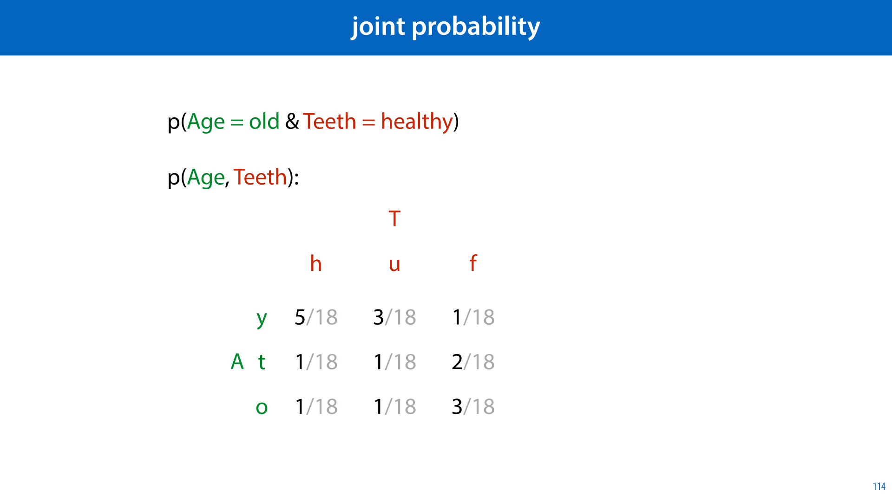

            <figcaption>
            
Here is what these concepts look like with <em>continuous </em>random variables (a bivariate normal distribution in this case). The joint probability distribution is represented by the point cloud in the middle. These are the values of X and Y that are likely. 

<strong>Marginalizing </strong>out either variable results in a univariate normal (the red and blue distributions), the projection of the multivariate distribution onto the X and Y axes. 

The<strong> conditional distribution </strong>corresponds to a vertical or horizontal <em>slice </em>through the joint distribution (and also results in a univariate normal). 
<aside    >We won't go into the definitions, but it boils down to replacing sums with integrations. </aside>
image source: By IkamusumeFan - Own work, CC BY-SA 3.0, <a href="https://commons.wikimedia.org/w/index.php?curid=30432580"><strong class="blue">https://commons.wikimedia.org/w/index.php?curid=30432580</strong></a> 

            </figcaption>
       </section>

       <section id="slide-115">
            <a class="slide-link" href="https://mlvu.github.io/preliminaries#slide-115" title="Link to this slide.">link here</a>
            

            <figcaption>
            
If two variables X and Y are <strong>independent</strong>, then knowing Y will not change what we know about X. More formally, the conditional distribution p(X|Y) is the same as the distribution P(X): knowing the value of Y doesn't affect our knowledge of the value of X.  

If we fill in the definition of conditional probability and re-arrange the factors, we see that this implies that the joint probability of X and Y is just the product of the marginal probabilities p(X) and p(Y). Have a look at the joint probability of the age/teeth example. Are these independent random variables? What would it mean for the example if they were? 

<strong>Conditional independence </strong>means that the two variables<em> can</em> be<em> </em>dependent, but their dependence is entirely explained by a third variable Z. If we condition on Z, the variables become dependent.

            </figcaption>
       </section>

       <section id="slide-116">
            <a class="slide-link" href="https://mlvu.github.io/preliminaries#slide-116" title="Link to this slide.">link here</a>
            

            <figcaption>
            
Conditional independence comes up a lot, and it can be tricky to wrap your head around at first, so here’s an example. 

Imagine two people who work in different areas of a very big city. In principle, they work so far apart that whether or not they arrive home in time for dinner is completely independent. Knowing whether or not Alice is late for dinner tells you nothing about whether Bob is home in time for dinner. No aspect of their lives (weather, traffic) intersect in a meaningful way, except one.  

Very rarely, a large monster attacks the city. In that case, all traffic shuts down and everybody is late for dinner. That means that if we know that Bob is late for dinner, there is a slight chance that it’s because of the monster, which should slightly raise the possibility that Alice is late for dinner. However, once we know whether or not the monster has attacked, knowing that Bob is late provides no additional information. 

            </figcaption>
       </section>

       <section id="slide-117">
            <a class="slide-link" href="https://mlvu.github.io/preliminaries#slide-117" title="Link to this slide.">link here</a>
            

            <figcaption>
            
Here is another visualization, taken from Wikipedia. This one is more abstract, but sometimes, sitting down with an abstract example and trying to work through it can help a lot to train your brain to get used to complex concepts. <em>If you're in a hurry, you can skip this one.</em> 

Imagine throwing a dart at the square on the right. We look at the probability of hitting a yellow, red or blue square (the purple ones are both red and blue). Describe these events by boolean random variables Y, R and B. 

We have p(R) = 16/49 and p(B) = 18/49.  These probabilities are <strong>not independent</strong>. We can work this out by counting all the squares for the event (R, B) (R, ¬B), (¬R, B) and (¬R, ¬B) and seeing if they are the product of the marginal probabilities, but we can also tell directly by looking at the picture: if we know that we've hit a blue square, there is a certain probability that that blue square is purple (i.e. also a red square). If we know that we haven't hit a blue square, there is also a certain probability that that square is red. The proportion of red inside the blue region looks different to the proportion of reds inside the non-blue region, so knowing whether we are in a blue square tells us something about how likely we are to be in a red square. 

Now, let's condition on Y. Somebody tells us the dart landed in a yellow square. Now that we know this, does knowing whether the square is blue still tell us anything about whether the square is also red? <strong>Note that within the yellow block, the proportion of red within the blues is the same as the proportion of reds within the non-blues. </strong>Once we're inside the yellow block, it doesn't matter anymore whether the block is blue. The probability of red is the same either way. Conditional on the knowledge that Y=true, the probabilities of red and blue are independent. 

What about when we hear that the dart has landed outside the yellow block? It's harder to see, but the proportions are 4/12 for the blue blocks and 8/25 for the nonblue. Thus the probabilities of blue and red are<strong> not conditionally independent given that </strong><strong class="orange">Y=false</strong>. 

By AzaToth at English Wikipedia, CC BY-SA 3.0, <a href="https://commons.wikimedia.org/w/index.php?curid=3206668"><strong class="blue">https://commons.wikimedia.org/w/index.php?curid=3206668</strong></a>

<a href="https://commons.wikimedia.org/w/index.php?curid=3206668"><strong class="blue"></strong></a>

            </figcaption>
       </section>

       <section id="slide-118">
            <a class="slide-link" href="https://mlvu.github.io/preliminaries#slide-118" title="Link to this slide.">link here</a>
            

            <figcaption>
            
Now that we have a decent understanding of conditional probability, let's look at Bayes' rule, probably the most important application of conditional probabilities. 

Bayes' rule is a solution to the inversion problem. What usually happens is that we have some idea of the mechanics of the world, and we observe some outcome, that could have happened through these mechanics in different ways. We didn't observe how it happened: that's the part that is hidden, and the part that we'd like to reason about. It's usually easy to reason about the probabilities of the outcomes given the observables (because we know the mechanics of the world) but we'd like to reverse this. 

For example imagine that you call a restaurant to book a table, and nobody picks up. This is unusual, and you wonder if it means the restaurant has burned down. You can easily reason <strong>forward</strong>, from the cause to the effect. If the restaurant has burned down, you would be sure that nobody would pick up the phone. If it hasn't, you would be quite sure that somebody would pick up the phone, but not certain. This is how you would reason if you <em>observed</em> whether or not the restaurant burned down and had to guess whether or not the phone would be answered. You are reasoning in the causal direction, so you use your understanding of the mechanics of the world to arrive at an intuitive conclusion. 

The problem is that we usually want to do <strong>backward</strong> reasoning. We observe the <em>outcome</em> of some event and we don't observe the <em>cause</em>. What we want to figure out is how to assign probabilities to the different causes. In this case, given that we observe nobody answering the phone, what is the probability that the restaurant has burned down? 

In short, we need a way to “turn around” the conditional probability. If we know p(X|Y), how do we work out p(Y|X)?

            </figcaption>
       </section>

       <section id="slide-119">
            <a class="slide-link" href="https://mlvu.github.io/preliminaries#slide-119" title="Link to this slide.">link here</a>
            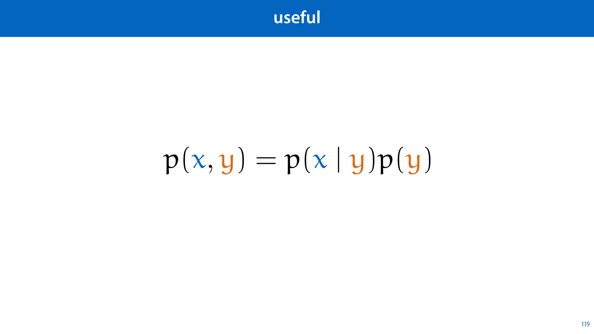

            <figcaption>
            
To do this, we need some additional probabilities. This makes sense if you think about our example. If the restaurant has burned down, we are sure that the phone won't be answered, but if we observe that the phone wasn't answered, we can't be sure that the restaurant has burned down. We need to take into account the fact that it's very rare for a restaurant to burn down, even though it would definitely lead to this observation. We also need to take into account the probability that something else has caused the restaurant not to answer. Intuitively, you probably wouldn't jump to the conclusion that  the restaurant has burned down because this is an unlikely event, and there are many other reasons for the phone not being picked up. 

If the cause and effect are labeled Y (the restaurant burning down) and X (the phone going unanswered), then the marginal probabilities p(Y) and p(X) capture all this information indirectly (we'll see how in a bit). Combining them this allows us to reverse the conditional from the probability of the effect given the cause to the probability of the cause given the effect. 

This the way Bayes' rule is usually written. You can prove that this is true very simply by starting with the definition of conditional probability and using the equation in slide 22 to rewrite the numerator.

            </figcaption>
       </section>

       <section id="slide-120">
            <a class="slide-link" href="https://mlvu.github.io/preliminaries#slide-120" title="Link to this slide.">link here</a>
            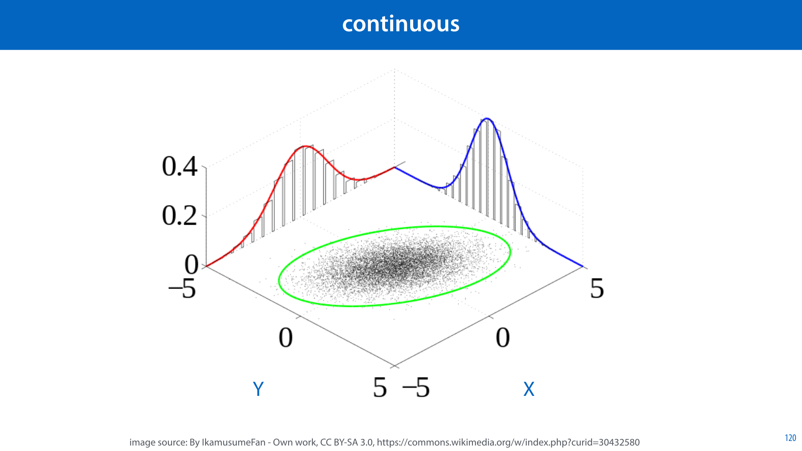

            <figcaption>
            
Here's the two-step proof. It probably won't convey much intuition for why Bayes' rule looks the way it does, but it should at least convince your inner mathematician that it is true. 

            </figcaption>
       </section>

       <section id="slide-121">
            <a class="slide-link" href="https://mlvu.github.io/preliminaries#slide-121" title="Link to this slide.">link here</a>
            

            <figcaption>
            
To build a more intuitive understanding of how this formula works, let's return to the example of the monster attack. We'll focus on Alice only, and forget about Bob.  

Let’s say that we observe that Alice is late for dinner (and we observe nothing else). Does this tell us anything about whether a monster has attacked the city? It doesn’t tell us much; it’s extremely rare that a monster attacks the city so it’s almost certain that Alice is late for other reasons. Still, if Alice were on time, we’d know that a monster couldn’t. have attacked the city, since that would certainly make her late. So we may not know much, but we know something. 

In this case it’s easy for us to work out the probability that Alice is late (the effect) given the monster attack (the cause). This is because in p(a|m), the conditional m is the cause of the observable a. The opposite is usually what we are interested in, since we have the observable and want to reason about its cause. This is where Bayes’ rule comes in. 

Say that we know the probability that we observe Alice being late, given that a monster attack happened, p(a | m), is somewhere near 1. Bayes’ rule tells us how to use this to calculate the opposite conditional p(m | a). This is<em> not</em> near 1, because we multiply it by the marginal probability of a monster attack p(m), which is really low. We then divide by the probability of Alice being late in general p(a): the more likely Alice is to be late<em> due to other causes</em>, the lower the probability that it is caused by a monster attack. 

 

            </figcaption>
       </section>

       <section id="slide-122">
            <a class="slide-link" href="https://mlvu.github.io/preliminaries#slide-122" title="Link to this slide.">link here</a>
            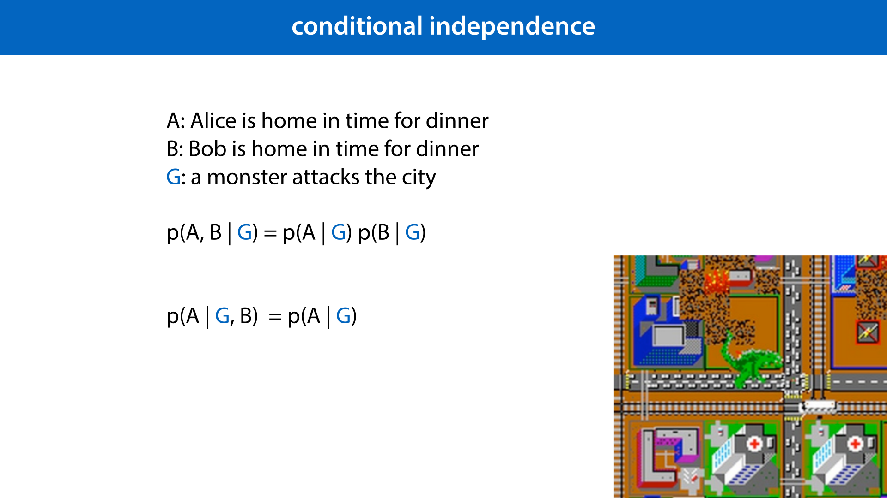

            <figcaption>
            
If there are three possible reasons for Alice to be late: traffic, monster or snowfall. Then we can see the denominator as a sum marginalizing out the cause for Alice’s lateness. The proportion of this sum given by the middle term is the probability that Alice’s lateness is caused by a monster attack. 

Consider the situation where both traffic and snowfall are far more likely than a monster attack, so p(t) and p(s) are much higher than p(m), but neither traffic nor snowfall ever cause Alice to be late, perhaps  because she cycles home from work, and has a bike with good snow tires. In that case both the first and last term in the sum become zero, and despite the fact that monster attacks are really rare, we can still conclude that a monster has attacked if we notice that Alice is late for dinner. 
<aside    >There is nothing causal about Bayes rule: we could also marginalize out the effects at the bottom, and work out the effect conditioned on the cause. In practice, however, you will usually see Bayes rule applied to work out the probability of the cause given the effect.</aside><aside    ></aside>
            </figcaption>
       </section>

       <section id="slide-123" class="anim">
            <a class="slide-link" href="https://mlvu.github.io/preliminaries#slide-123" title="Link to this slide.">link here</a>
            

            <figcaption>
            
To finish up, we'll look at some of the most common probability distributions we'll see throughout the course. Most of these you should know already, but we'll summarize them here briefly for the sake of completeness. 

The simplest is probably the Bernoulli distribution. It's any a distribution with two outcomes. You can think of it as modelling the outcome of a coin flip with a (possibly) bent coin, but the outcome could also be true/false, guilty/innocent or positive/negative. 

Every distribution like this, with its probabilties set to some pair of values summing to 1 is <em>a</em> Bernoulli distribution. To specify which Bernoulli distribution we are talking about we specify one of the probabilities by a number. The other probability is then also defined, since they must sum to one.  

The numbers we use to specify which specific distribution we are talking about in a family like the Bernoulli distributions, are called the <strong>parameters</strong>, and often indicated by the greek letter theta, θ.You can think of θ as a set of vector of numbers. In the case of the Bernoulli distribution theta is just a single number. 

            </figcaption>
            click image for animation
       </section>

       <section id="slide-124">
            <a class="slide-link" href="https://mlvu.github.io/preliminaries#slide-124" title="Link to this slide.">link here</a>
            

            <figcaption>
            
If we have more than two outcomes, but still a finite number, we can assign each a separate probability so that they sum to one. For instance, if we want to model the outcome of rolling a loaded die, it might look like this. This is called a <strong>categorical distribution</strong>. Other examples are modeling which team will win the next world cup, which child in a classroom will score the highest on a test, or what the hair color of a random person from Ireland is.  

To specify a categorical distribution with n outcomes we strictly need only n-1 probabilities. We can work out the n-th probability from the knowledge that all probabilities sum to one. However, this is usually more trouble than it's worth, and instead we tend to represent categorical distributions by the slightly redundant complete set of n probabilities.

            </figcaption>
       </section>

       <section id="slide-125">
            <a class="slide-link" href="https://mlvu.github.io/preliminaries#slide-125" title="Link to this slide.">link here</a>
            

            <figcaption>
            
The <strong>normal distribution</strong> or<strong> Gaussian</strong> is probably the most common distribution on a continuous sample space. It is defined by this complex looking function. Don't worry about the formula too much now, we'll dig into that later. For now just remember that the curve it describes is the probability <em>density</em>. 

Its parameters are the mean μ, which tells us where the peak is, and the variance σ2 or standard deviation σ, which tells us how widely spread out the normal distribution is.  

The<em> standard</em><strong> normal distribution</strong> is the specific distribution with mean 0 and variance/standard deviation 1. 

The normal distribution is particularly useful for anything that has a <em>definite scale</em>. Consider, for instance height: people have all kinds of different heights, but if we get far enough away from the average, the probability gets so low it may as well be zero. We can say with near certainty that there are no 4 meter tall people and no 10cm tall people. If there were a hundred times as many people, that would still be true. 

An example of an attribute that doesn't have such a definite scale is income. In a small population there may be millionaires but no billionaires, but if we zoom out to the population of a small country, we will see billionaires appear. In a large country will we see people with fortunes in the order of 10 billion dollars and in the whole world we will see fortunes of 100 billion dollars. In short, the largest grows exponentially with the population size.  

In such cases, as we've seen, the normal distribution is not a good choice. We won't discuss them in this course, but so called fat-tailed distributions like the log-normal, Zipf or power law distributions may be more suitable.

            </figcaption>
       </section>

       <section id="slide-126">
            <a class="slide-link" href="https://mlvu.github.io/preliminaries#slide-126" title="Link to this slide.">link here</a>
            

            <figcaption>
            
If our sample space consists of multiple numbers, for instance when we have a dataset with multiple features, we can draw this as an n-dimensional Euclidean space, like the plane shown here. A distribution over such a space can be defined by a probability density function over it, which, in the 2D case looks like a surface over the plane. 

The <strong>multivariate normal distribution</strong><em> </em>is an extension of the normal distribution to multiple dimensions. It takes the shape of a kind of bell over our sample space. For higher dimensions it's harder to visualize, just think of an ellipsoidal region in space taking most of the probability mass, with the probability density decaying quickly in all directions. 

Again, don't worry too much about the complicated formula for the probability density. We'll see where that comes from and what all the parts mean later. For now, just focus on the shape, and how the parameters affect that shape. 

The parameters are the mean <strong class="orange">μ</strong>, a vector which provides the center, and the covariance matrix <strong class="blue">Σ</strong>, which tells us how much the probability decays in each direction.  

            </figcaption>
       </section>

       <section id="slide-127" class="anim">
            <a class="slide-link" href="https://mlvu.github.io/preliminaries#slide-127" title="Link to this slide.">link here</a>
            

            <figcaption>
            
Here is an illustration of the way the covariance matrix affects the data we get from a multivariate normal distribution. The mean is at (0, 0) in all four examples.  

If the covariance is the identity matrix, we get the standard normal distribution. This is called a spherical distribution, because the variance along all axes is the same, and there is no correlation between axes, giving the data roughly spherical shape.  
<aside    >More precisely the lines of equal probability density are circles in 2D and spherical surfaces in higher dimensions. </aside>
If we change the values on the diagonal, we stretch this sphere into an ellipse, but only along the axes. There is still no correlation: knowing the value along one axis tells us nothing about the value along the others.  

If we change the off-diagonal values to positive values we get <strong>correlation</strong>. In this case having a high value along one axis makes it more likely that the value along the other axis is also high. Note that the coviarance matrix needs to be symmetric, so the value on one side of the diagonal must be the same as the value on the other side. 

If the off-diagonal value is negative, we get <strong>anti-correlation</strong>. A high positive value on one axis most likely corresponds to a high negative value along the other axis. 

If we have more than 2 dimensions, say n, then there are (n^2 - n)/2 possible pairs of axes between which we can define a correlation. any of these could be positive, negative or 0. This corresponds exactly to the number of values above the diagonal in an n x n matrix.

            </figcaption>
            click image for animation
       </section>

       <section id="slide-128">
            <a class="slide-link" href="https://mlvu.github.io/preliminaries#slide-128" title="Link to this slide.">link here</a>
            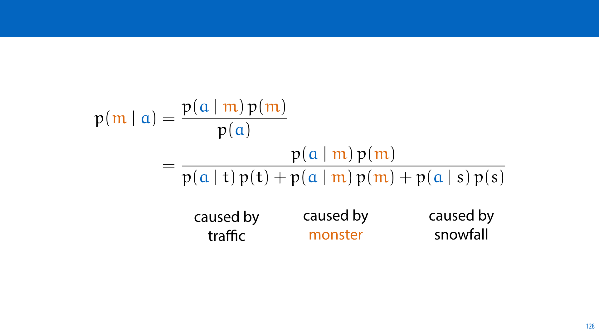

            <figcaption>
            

            </figcaption>
       </section>

</article>
