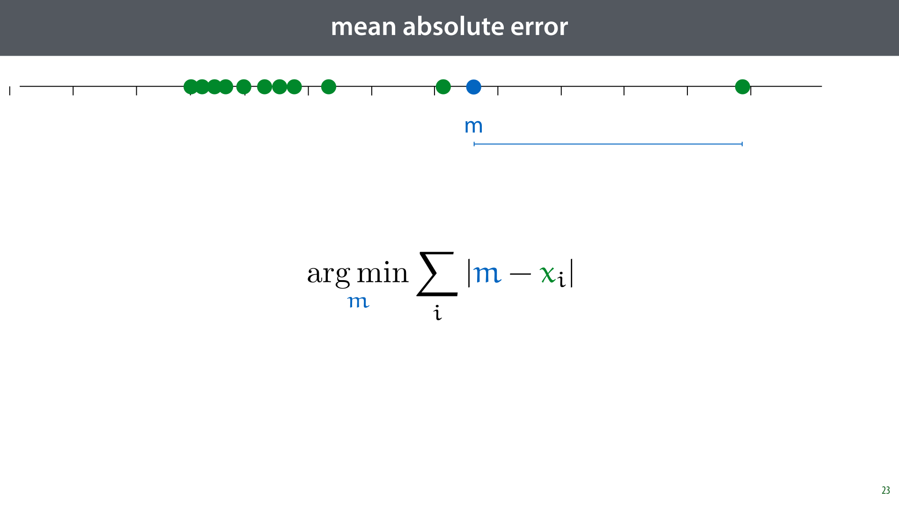
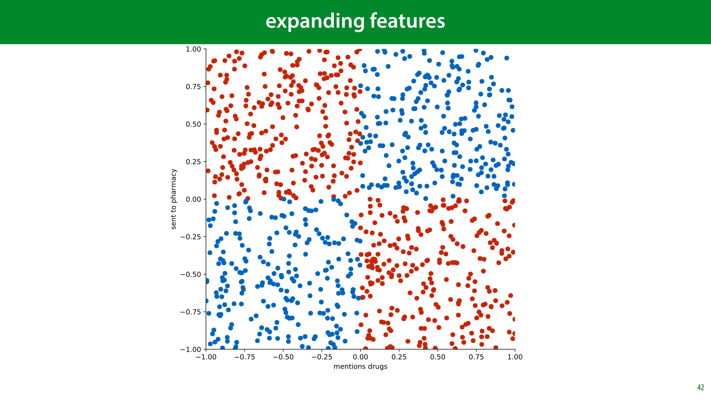
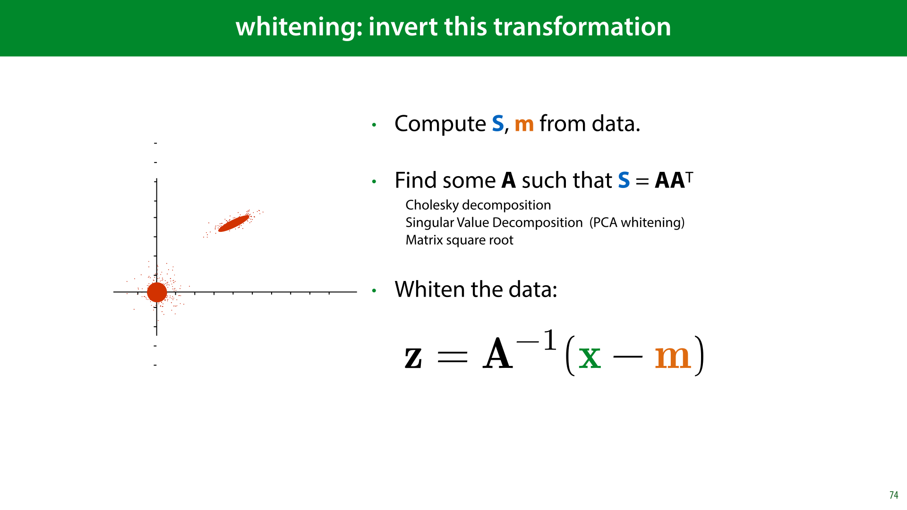

<nav class="menu">
    <ul>
        <li class="home"><a href="/">Home</a></li>
        <li class="name">Lecture 5: Data Pre-processing</li>
                <li><a href="#video-000">Missing values and outliers</a></li>
                <li><a href="#video-030">Class imbalance and feature design</a></li>
                <li><a href="#video-053">Normalization</a></li>
                <li><a href="#video-075">Principal Component Analysis</a></li>
        <li class="pdf"><a href="https://mlvu.github.io/lectures/22.Methodology2.annotated.pdf">PDF</a></li>
    </ul>
</nav>

<article class="slides">

        <section class="video" id="video-000">
            <a class="slide-link" href="https://mlvu.github.io/preprocessing#video-0">link here</a>
           <video controls>
                <source src="https://surfdrive.surf.nl/files/index.php/s/v4BiYSB6ClEjvpk/download" type="video/mp4" />

                Download the <a href="https://surfdrive.surf.nl/files/index.php/s/v4BiYSB6ClEjvpk/download">video</a>.
           </video>
        </section>

       <section id="slide-001">
            <a class="slide-link" href="https://mlvu.github.io/preprocessing#slide-001" title="Link to this slide.">link here</a>
            

            <figcaption>
            
  

            </figcaption>
       </section>

       <section id="slide-002">
            <a class="slide-link" href="https://mlvu.github.io/preprocessing#slide-002" title="Link to this slide.">link here</a>
            

            <figcaption>
            
To motivate this lecture, let’s look at a famous historical case of operations research. In the second World War, the allies executed many bombing runs, and often, their planes came back looking like this. 

To investigate where they should reinforce their planes, investigators made a tally of the most common points on the plane they were seeing damage.

            </figcaption>
       </section>

       <section id="slide-003">
            <a class="slide-link" href="https://mlvu.github.io/preprocessing#slide-003" title="Link to this slide.">link here</a>
            

            <figcaption>
            
The initial instinct was to reinforce those places that registered the most hits. 

However, it was soon pointed out (by a man called Abraham Wald) that this ignores a crucial aspect of the <em>source</em> of the data. They weren’t tallying where planes were most likely to be hit, they were tallying where planes were most likely to be hit <em>and come back</em>. 

The places where they weren’t seeing <em>any</em> hits were exactly the places that should be reinforced, since the planes that were hit there didn’t make it back. 

This specific effect is called <a href="https://en.wikipedia.org/wiki/Survivorship_bias"><strong class="blue">survivorship bias</strong></a>, and it’s worth keeping in mind, but the more general lesson for today, is that you should <strong>not take your data at face value</strong>. Don’t just load your data into an ML model and check the predictive performance: consider what you’re ultimately trying to achieve, and consider how the source of your data will affect that goal. 

By McGeddon - Own work, CC BY-SA 4.0, <a href="https://commons.wikimedia.org/w/index.php?curid=53081927"><strong class="blue">https://commons.wikimedia.org/w/index.php?curid=53081927</strong></a>

<a href="https://commons.wikimedia.org/w/index.php?curid=53081927"><strong class="blue"></strong></a>

            </figcaption>
       </section>

       <section id="slide-004">
            <a class="slide-link" href="https://mlvu.github.io/preprocessing#slide-004" title="Link to this slide.">link here</a>
            

            <figcaption>
            
Imagine that I gave you four datasets, each with two features x and y. For all datasets all of the following statistics give the same value: the mean and variance of x, the mean and variance of y, the correlation between x and y, the parameters of the linear regression line that best fits, and the r2 of the correlation. 

You would conclude that the datasets must be pretty similar, right?

            </figcaption>
       </section>

       <section id="slide-005">
            <a class="slide-link" href="https://mlvu.github.io/preprocessing#slide-005" title="Link to this slide.">link here</a>
            

            <figcaption>
            
One important aspect of not taking the data at face value is to <em>look</em> at it.  

These are the four datasets from the previous slide. They are a common example, called Anscombe’s quartet. Only when we look at the datasets, do we see how different they are.  

More importantly, only when we look at the data, do we see the patterns that define them. These are the patterns we want to get at if we want to understand the data. And none of them are revealed by the descriptive statistics of the previous slide. 

source: By Schutz: Avenue - Anscombe.svg, CC BY-SA 3.0, <a href="https://commons.wikimedia.org/w/index.php?curid=9838454"><strong class="blue">https://commons.wikimedia.org/w/index.php?curid=9838454</strong></a> 

            </figcaption>
       </section>

       <section id="slide-006">
            <a class="slide-link" href="https://mlvu.github.io/preprocessing#slide-006" title="Link to this slide.">link here</a>
            

            <figcaption>
            
Here is a more modern variant: the datasaurus dozen. 

Recommended reading: <a href="https://www.autodeskresearch.com/publications/samestats"><strong class="blue">https://www.autodeskresearch.com/publications/samestats</strong></a> 

            </figcaption>
       </section>

       <section id="slide-007" class="anim">
            <a class="slide-link" href="https://mlvu.github.io/preprocessing#slide-007" title="Link to this slide.">link here</a>
            

            <figcaption>
            
In machine learning and data science, our datasets are rarely two-dimensional, so we don’t have the luxury of simply doing a scatter plot. Looking at our data, in a way that provides insight almost always requires a lot of ingenuity and creativity.  

For high-dimensional, multivariate data, of the kind we’ve been dealing with so far, a good place to start is to produce a <strong>scatter plot matrix</strong>. This is simply a large grid of every scatter plot you can produce between any two features in your data. Often, only the plots below or above the diagonal are shown. The scatterplot matrix gives you a good idea of how the features relate to each other. 

If you have a target value (a class or a regression target), it’s a good idea to include it among the features for the scatter plot matrix. That way, you can see what relation each feature has with the target in isolation from the other features. 

On the right, we see the data as a 3D point cloud (in blue), together with the three projections to 2d (in yellow red and green) that the scatterplot matrix gives us. 

source: RIDC NeuroMat, CC BY-SA 4.0 <a href="https://creativecommons.org/licenses/by-sa/4.0"><strong class="blue">https://creativecommons.org/licenses/by-sa/4.0</strong></a>, via Wikimedia Commons 

            </figcaption>
            click image for animation
       </section>

       <section id="slide-008">
            <a class="slide-link" href="https://mlvu.github.io/preprocessing#slide-008" title="Link to this slide.">link here</a>
            

            <figcaption>
            
In the rest of this video, we’ll look at ways you can clean up your data, to make it useable for a classification or a regression task.

            </figcaption>
       </section>

       <section id="slide-009">
            <a class="slide-link" href="https://mlvu.github.io/preprocessing#slide-009" title="Link to this slide.">link here</a>
            

            <figcaption>
            
We’ll start with missing data. Quite often, your data will look like this.  

You will need to do something about those gaps, before any machine learning algorithm will accept this data.

            </figcaption>
       </section>

       <section id="slide-010">
            <a class="slide-link" href="https://mlvu.github.io/preprocessing#slide-010" title="Link to this slide.">link here</a>
            

            <figcaption>
            
What approach you should take is different, depending on whether values from the feature columns are missing, or values from the target column are missing.

            </figcaption>
       </section>

       <section id="slide-011">
            <a class="slide-link" href="https://mlvu.github.io/preprocessing#slide-011" title="Link to this slide.">link here</a>
            

            <figcaption>
            
If you have missing values in one of your features, the simplest way to get rid of them is to just remove the feature(s) for which there are values missing. If you’re lucky, the feature is not important anyway. 

You can also remove the instances with missing data. Here you have to be careful. If the data was not corrupted uniformly, removing rows with missing values will change your data distribution. 

For example, you might have data gathered by volunteers in the street using some electronic equipment. If the volunteer in Amsterdam had problems with their hardware, then their data will contain missing values, and the collected data will not be representative of Amsterdam. 

Another way you might get non-uniformly distributed missing data is if your data comes from a questionnaire, where people sometimes refuse to answer certain questions. For instance, if only rich people refuse to answer questions about their taxes, removing these instances will remove a lot of rich people from your data and give you a different distribution. 

<strong>How can you tell if data is missing uniformly?</strong> There’s no surefire way, but usually you can get a good idea by plotting a histogram of how much data is missing against some other feature. For instance if the number of instance with missing features against income is very different from the regular histogram over income, you can assume that your data was not corrupted uniformly.  

Of course it also helps if you can work out why your data has missing values. Again, don't take the data at face value, look into where it came from, and what the details of that process can tell you.

            </figcaption>
       </section>

       <section id="slide-012">
            <a class="slide-link" href="https://mlvu.github.io/preprocessing#slide-012" title="Link to this slide.">link here</a>
            

            <figcaption>
            
Let’s zoom out a little before we move on. Whenever you have questions about how to approach something like this, it’s best to think about the <strong>real-world setting </strong>where you might apply your trained model. We often call this “production”, a term used in software development for the system that will be running the final deployed version of the software. Some machine learning models literally end up in a production environment, but we might also use machine learning models to perform business analytics, clinical decision support or in a scientific experiment. Wherever your model is meant to end up after you’ve finished your experimentation, that’s what we’ll call <strong>production</strong>. 

And production is what you’re trying to simulate, when you train your model and test it on a test set. So the choices you make, should make your experiment as close of a <em>simulation</em> of your production setting as you can manage.  

For example, in the case of missing values, the big question is: <strong>can you expect missing data in production?</strong> Or, will your production data be clean, and are the test data just noisy because the production environment isn’t ready yet? 

Examples of production systems that should expect missing data are situations where data comes from a web form with optional values or situations where data is merged from different sources (like online forms and phone surveys).  

You may even find yourself in a situation where the test data has no missing values (since it was carefully gathered) but the production system <em>will</em> have missing values (because there, the data will come from a web form). In that case, you may want to introduce missing values artificially in your test data, to simulate the production setting and study the effect of missing data. 

So remember, whenever you’re stuck on how to process your data: think what the production setting is that you’re trying to simulate, and make your choices based on that.

            </figcaption>
       </section>

       <section id="slide-013">
            <a class="slide-link" href="https://mlvu.github.io/preprocessing#slide-013" title="Link to this slide.">link here</a>
            

            <figcaption>
            
 

If you expect to see missing in production, then your model needs to be able to <em>consume </em>missing values, and you should keep them in the test set. For categorical features, the easiest way to do this is to add a category for missing values. For numerical features, we’ll see some options in the next slide. 

If your production setting won’t have missing values, then that’s the setting you want to simulate. If at all possible, you should get a test set without missing values, even if the training set has them. You can then freely test what method of dealing with the missing training values gives the best performance on the test set. 
<aside    >Or rather, on the validation set first, and then later on the test set. For now, we’ll talk about test set performance to keep things simple, and take it as read, that you will use a validation set as a proxy to guard against multiple testing. </aside>
If you cannot get a test set without missing values, one thing you can do is to report performance on both the data that has the instances with missing values removed and the data that has the missing values filled in by some mechanism. Neither are ideal simulations of the production setting, but the combination of both numbers hopefully gives you some idea.

            </figcaption>
       </section>

       <section id="slide-014">
            <a class="slide-link" href="https://mlvu.github.io/preprocessing#slide-014" title="Link to this slide.">link here</a>
            

            <figcaption>
            
At some point, either in the training data or the test data, we will probably need to fill in the missing values. This is called <strong>imputation</strong>. 

A simple way to do this in categorical data is to use the <strong>mode</strong>, the most common category. For numerical data, the <strong>mean</strong> or <strong>median</strong> are simple options. We’ll look at when you should use which later in this video. 

A more involved, but more powerful way, is to<strong> predict the missing value</strong> from the other features. You just turn the feature column in to a target column and train a classifier for categoric features, and  a regression model for numeric features. 

            </figcaption>
       </section>

       <section id="slide-015">
            <a class="slide-link" href="https://mlvu.github.io/preprocessing#slide-015" title="Link to this slide.">link here</a>
            

            <figcaption>
            
If your target label has missing values, the story is a little different. In the training set you are free to do whatever you think is best. You can remove instances, or impute the missing labels. If you have a lot of missing labels, this essentially becomes a semi-supervised learning setting as we saw in the first lecture. 

On the test set however, you shouldn’t impute or ignore the missing values, since that changes the task, and most likely makes it easier, which will give you false confidence in the performance of your model. Instead, you should <strong>report the uncertainty</strong> created by the missing values. 

In classification, this is easy: you compute the accuracy under the assumption that your classifier gets all missing values correct and under the assumption that it gets all missing values wrong: this gives you a best case and a worst case scenario, respectively. Your true accuracy on the test set is somewhere in between.

            </figcaption>
       </section>

       <section id="slide-016">
            <a class="slide-link" href="https://mlvu.github.io/preprocessing#slide-016" title="Link to this slide.">link here</a>
            

            <figcaption>
            
Another problem that we need to worry about, is <strong>outliers</strong>. Values in our data that take on unusual and unexpected values. 

Outliers come in different shapes and sizes. The most important question is whether your outliers are natural or unnatural. 

Here, the six dots to the right are so oddly, mechanically aligned that we are probably looking at some measurement error. Perhaps someone is using the value -1 for missing data.  

We can remove these, or interpret them as missing data, and use the approaches just discussed.

            </figcaption>
       </section>

       <section id="slide-017">
            <a class="slide-link" href="https://mlvu.github.io/preprocessing#slide-017" title="Link to this slide.">link here</a>
            

            <figcaption>
            
In other cases, however, the “outlier” is very much part of the distribution. This is what we call a <strong>natural outlier</strong>. Bill Gates may have a million times the net worth of anybody you are likely to meet in the street, but that doesn’t mean he isn’t part of the distribution of income.  

If we fit a normal distribution to this data, the outlier would ruin our fit, but that’s because the data <em>isn’t normally distributed</em>. What we should do is recognize that fact, and adapt our model, for instance by removing assumptions of normally distributed data.

            </figcaption>
       </section>

       <section id="slide-018">
            <a class="slide-link" href="https://mlvu.github.io/preprocessing#slide-018" title="Link to this slide.">link here</a>
            

            <figcaption>
            
Here’s a metaphor for natural and unnatural outliers. If our instances are image of faces, the image on the left, that of comedian Marty Feldman,  is an extreme of our data distribution. It looks unusual, but it‘s crucial in fitting a model to this dataset. The image on the right is clearly corrupted data. It tells us nothing about what human faces might look like, and we’re better off removing it from the data. 

However, remember the real-world use-case: if we can expect corrupted data in production as well, then we should either train the model to deal with it, or make the clean-up automatic, so we can perform it in production as well. This would require us to have some way to detect automatically, whether something is an outlier. If the outliers are rare, and we have a lot of data, it may be easier just to leave them in and hope the model can learn to work around them, even if they are unnatural outliers.

            </figcaption>
       </section>

       <section id="slide-019">
            <a class="slide-link" href="https://mlvu.github.io/preprocessing#slide-019" title="Link to this slide.">link here</a>
            

            <figcaption>
            
If you have very extreme values that are not mistakes (like Bill Gates earlier), your data is probably not normally distributed. If you use a model which assumes normally distributed data, it will be very sensitive to these kinds of “outliers”. It may be a good idea to remove this assumption from your model (or replace it by an assumption of a heavy-tailed distribution). 

Note that you have to know your model really well to know if there are assumptions of normality. For instance anything that uses <em>squared errors</em> essentially has an assumption of normality.

            </figcaption>
       </section>

       <section id="slide-020" class="anim">
            <a class="slide-link" href="https://mlvu.github.io/preprocessing#slide-020" title="Link to this slide.">link here</a>
            

            <figcaption>
            
To illustrate: let’s learn which <em>single value</em> best represents our data. We choose a value m, compute the distance to all our data points (the residuals) and try to minimise their squares. 

We can use such a single value for imputation to replace missing values or outliers, but this is also a kind of simplified picture of linear regression: if we had a regression problem with no features, the best we could do is predict the same single value for all instances. Which value should we pick to minimize the squared errors? 

            </figcaption>
            click image for animation
       </section>

       <section id="slide-021" class="anim">
            <a class="slide-link" href="https://mlvu.github.io/preprocessing#slide-021" title="Link to this slide.">link here</a>
            

            <figcaption>
            
We take the derivative of the objective function and set it equal to zero. No gradient descent required here, we’ll just solve the problem analytically. 

What we find is that the optimum is <strong>the mean</strong>. The assumption of squared errors leads directly to the use of the mean as a<em> representative example</em> of a set of points. 
<aside    >Remember the previous lecture where we showed that the maximum likelihood objective on the normal distribution led to a least squares objective for its parameter μ? You can tie that to this derivativation, and conclude that the maximum likelihood solution for μ is the arithmetic mean of the data. </aside><aside    ></aside>
            </figcaption>
            click image for animation
       </section>

       <section id="slide-022">
            <a class="slide-link" href="https://mlvu.github.io/preprocessing#slide-022" title="Link to this slide.">link here</a>
            

            <figcaption>
            
We can now see why the the assumption of squared errors is so disastrous in the case of the income distribution. 

If Bill Gates makes a million times as much as the next person in the dataset, he is not pulling on the mean a million times as much, he’s pulling 1012 times as much. 

Hence the joke: A billionaire walks into a homeless shelter and says “What a bunch of freeloaders, the average wealth in this place is more than a million dollars!”

            </figcaption>
       </section>

       <section id="slide-023">
            <a class="slide-link" href="https://mlvu.github.io/preprocessing#slide-023" title="Link to this slide.">link here</a>
            

            <figcaption>
            
To get rid of the normality assumption, or rather, replace it by another assumption, we can use the<strong> mean absolute error </strong>instead. We take the residuals, but we sum their <em>absolute value</em> instead of their <em>squared value</em>. Which is the most representative value that minimises<em> that</em> error?

            </figcaption>
       </section>

       <section id="slide-024" class="anim">
            <a class="slide-link" href="https://mlvu.github.io/preprocessing#slide-024" title="Link to this slide.">link here</a>
            

            <figcaption>
            
To work this out, we need to know the derivative of the absolute function. This function is the identity if the argument is positive (so its derivative is 1) and the negative identity if the argument is negative 

            </figcaption>
            click image for animation
       </section>

       <section id="slide-025">
            <a class="slide-link" href="https://mlvu.github.io/preprocessing#slide-025" title="Link to this slide.">link here</a>
            

            <figcaption>
            
We’ve worked out that the value m that minimizes this error is the one for which the signs of the residuals sum to zero. This happens if the sum contains as many “-1”s as “+1”s, that is, if we have as many instances to the left of m as we have to the right. In other words, <strong>the median minimizes the mean absolute error</strong>. 

            </figcaption>
       </section>

       <section id="slide-026">
            <a class="slide-link" href="https://mlvu.github.io/preprocessing#slide-026" title="Link to this slide.">link here</a>
            

            <figcaption>
            
If we use the median, Bill Gates still has a strong pull on the our representative value m, but it's proportional to his distance to m, not to the square of the distance. 

            </figcaption>
       </section>

       <section id="slide-027">
            <a class="slide-link" href="https://mlvu.github.io/preprocessing#slide-027" title="Link to this slide.">link here</a>
            

            <figcaption>
            
This mistake, of using the mean when a normal distribution is not an appropriate assumption, is sadly very common. 

For example, you might hear someone say something like “there’s no poverty in the US, it’s the third richest country in the world by average personal wealth”. 

Wikipedia allows us to fact-check this quickly and it is indeed true. But remember that Bill Gates and Jeff Bezos live in the US, and as we saw, such people have a pretty strong pull on the mean. Luckily, Wikipedia also allows us to sort the same list by <em>median</em> wealth.

            </figcaption>
       </section>

       <section id="slide-028" class="anim">
            <a class="slide-link" href="https://mlvu.github.io/preprocessing#slide-028" title="Link to this slide.">link here</a>
            

            <figcaption>
            
If we do that, we see that the US suddenly drops to 22nd place. This drop indicates how big the income inequality is. 
<aside    >The Netherlands drops from 12th to 34, incidentally. So there’s plenty of income inequality over here as well.</aside><aside    ></aside>
            </figcaption>
            click image for animation
       </section>

       <section id="slide-029">
            <a class="slide-link" href="https://mlvu.github.io/preprocessing#slide-029" title="Link to this slide.">link here</a>
            

            <figcaption>
            
Here’s an example of this fallacy in the wild. In 2019, there was a discussion in the US about unionisation in the games industry. Here, one of the heads of Take-Two suggests that because the <em>average</em> yearly salary has six figures, unions are unlikely. 

Whether rich people can benefit from unions is a question for a different series of lectures, but the fact that the average wages are high, most likely just means that there is a small number of very rich people in the industry. We’d need to know the <em>median</em> to be sure. 

source: <a href="https://twitter.com/GIBiz/status/1140900959322804224?s=20"><strong class="blue">https://twitter.com/GIBiz/status/1140900959322804224?s=20</strong></a>

<a href="https://twitter.com/GIBiz/status/1140900959322804224?s=20"><strong class="blue"></strong></a>

            </figcaption>
       </section>

       <section id="slide-030">
            <a class="slide-link" href="https://mlvu.github.io/preprocessing#slide-030" title="Link to this slide.">link here</a>
            

            <figcaption>
            
If you want to adapt your model to deal with natural outliers, beware of hidden assumptions of normality. We saw a hint last lecture already that assuming normality leads to squared error objectives. We'll look at this in detail in a later lecture. For now, keep this link in mind when you look at the distribution of your outliers. 

Consider modelling your noise with a heavy-tailed distribution instead, in other words, one which makes outliers more likely. Using the median instead of the mean is one way to do this.  

If you are doing regression and your target label is non-normally distributed then you can use the sum of absolute errors as a loss function instead of the sum of squared errors. This will also implicitly assume a more heavy-tailed distribution than the normal, but even more heavy tailed distributions are available. We'll look a little bit more at modeling data with different distributions in later lectures. 

 

            </figcaption>
       </section>

        <section class="video" id="video-030">
            <a class="slide-link" href="https://mlvu.github.io/preprocessing#video-30">link here</a>
           <video controls>
                <source src="https://surfdrive.surf.nl/files/index.php/s/o5yQd1mlGCsF8SP/download" type="video/mp4" />

                Download the <a href="https://surfdrive.surf.nl/files/index.php/s/o5yQd1mlGCsF8SP/download">video</a>.
           </video>
        </section>

       <section id="slide-031">
            <a class="slide-link" href="https://mlvu.github.io/preprocessing#slide-031" title="Link to this slide.">link here</a>
            

            <figcaption>
            
  

 

            </figcaption>
       </section>

       <section id="slide-032">
            <a class="slide-link" href="https://mlvu.github.io/preprocessing#slide-032" title="Link to this slide.">link here</a>
            

            <figcaption>
            
In the last lecture, we saw that class imbalance can be a big problem. We know what we can do to help our analysis of imbalanced problems, but how do we actually improve training?

            </figcaption>
       </section>

       <section id="slide-033">
            <a class="slide-link" href="https://mlvu.github.io/preprocessing#slide-033" title="Link to this slide.">link here</a>
            

            <figcaption>
            
We will assume that the class imbalance will happen in production as well as in your experiments. That means your test set needs to have the class imbalance in it, to be a fair simulation of the production setting. You can fiddle around with the training data all you like, but the test data (and by extension the validation data) needs to represent the natural class distribution. 

As a result, you'll need to focus on getting a large test set even more than normal: your problem is essentially that of detecting instances of the minority class. If you only have 25 of them in your test set, you won't get a very good idea of how well your classifier can detect them, even if you have 10000 majority class instances.  

This is usually a painful step, since withholding a lot of test data leaves you with very little training data. However, since you  are allowed to manipulate the training data however you like, you should prioritize the test data. There may be clever tricks to get more mileage out of the imbalanced training data, but without a proper test data, you won't be able to tell if these tricks work. 

            </figcaption>
       </section>

       <section id="slide-034">
            <a class="slide-link" href="https://mlvu.github.io/preprocessing#slide-034" title="Link to this slide.">link here</a>
            

            <figcaption>
            
The most common approach is to <strong>oversample </strong>your minority class by sampling with replacements. That is, you create a new dataset that is bigger than the original one, by adding a number of copies of randomly sampled instances of the minority class. That way, the class balance is more even in your new dataset. 

The advantage is that this leads to more data. The disadvantage is that you end up with duplicates in you dataset. This may increase the likelihood of overfitting, depending on what algorithm you are using.

            </figcaption>
       </section>

       <section id="slide-035">
            <a class="slide-link" href="https://mlvu.github.io/preprocessing#slide-035" title="Link to this slide.">link here</a>
            

            <figcaption>
            
You can also <strong>undersample</strong> your majority class. You create a copy of your dataset where some randomly selected instance of the majority class are thrown out. 

This doesn’t lead to duplicates, but it does mean you’re throwing away data. 

If you have an algorithm that makes multiple passes over the dataset (like gradient descent) it can help to resample the dataset again for every pass, so that you don’t lose the variation in the original data. 

Whether you oversample or undersample, you should be aware that you are changing the class distribution in the data. If you increase the proportion of the majority class, the classifier will be more likely to classify things by the minority class. This will be a tradeoff: you want to oversample to the point where the classifier begins to pick up on the features that indicate the minority class, but not so much that the classifier begins seeing the minority class when the features do not indicate it.  

The simplest way to achieve this is to treat the amount of resampling as a hyperparameter, and to optimize for precision/recall or ROC curves. 
<aside    >Another option is to treat the classifier as a ranking classifier, as we saw in an earlier lecture. That way, we can train on re-balanced data, and then move the threshold after training to tune how eager the classifier is to call something positive.</aside><aside    ></aside>
            </figcaption>
       </section>

       <section id="slide-036">
            <a class="slide-link" href="https://mlvu.github.io/preprocessing#slide-036" title="Link to this slide.">link here</a>
            

            <figcaption>
            
A more sophisticated approach is to oversample the minority class with <strong>new data</strong> derived from the existing data. 

SMOTE is a good example: it finds small clusters of points in the minority class, and generates their mean as a new minority class point. This way, the new point is not a duplicate of any existing point, but it is still in a region that contains a lot of points in the minority class, to keep it realistic. 

We don’t have time to go into this deeply. If you run into this problem in your project, click the link for detailed explanation. 

more information: <a href="https://www.kaggle.com/rafjaa/resampling-strategies-for-imbalanced-datasets"><strong class="blue">https://www.kaggle.com/rafjaa/resampling-strategies-for-imbalanced-datasets</strong></a>

<a href="https://www.kaggle.com/rafjaa/resampling-strategies-for-imbalanced-datasets"><strong class="blue"></strong></a>

            </figcaption>
       </section>

       <section id="slide-037">
            <a class="slide-link" href="https://mlvu.github.io/preprocessing#slide-037" title="Link to this slide.">link here</a>
            

            <figcaption>
            
Next, let's look at what we should to with the features in our dataset. 

Even if your data comes in a table, that doesn’t necessary mean that every column can be used as a feature right away (or that this would be a good approach). We'll need to look at the data provided and come up with a good way to translate it to a form in which the machine learning model is likely to learn from it. This depends both on what the data gives you, and on how your chosen model works.  

Translating your raw data into features is more an art than a science, and the ultimate test is the test set performance. We'll look at a few simple examples, to give you an idea of the general way of thinking you should adopt.

            </figcaption>
       </section>

       <section id="slide-038">
            <a class="slide-link" href="https://mlvu.github.io/preprocessing#slide-038" title="Link to this slide.">link here</a>
            

            <figcaption>
            
Some algorithms (like linear models or kNN) work only on numeric features. Some work only on categorical features, and some can accept a mix of both (like decision trees).  

            </figcaption>
       </section>

       <section id="slide-039">
            <a class="slide-link" href="https://mlvu.github.io/preprocessing#slide-039" title="Link to this slide.">link here</a>
            

            <figcaption>
            
This particular age column is integer valued, while numeric features are usually real-valued. In this case, we can just interpret the age as a real-valued number, and most algorithms won’t be affected. 

If our algorithm only accepts categoric features, we’ll have to group the data into bins. For instance, you can turn the data into a two-category feature with the categories “below the median” and “above the median”. 

We’ll lose information this way, which is unavoidable, but if you have a classifier that only consumes categorical features which works really well on the rest of your features, it may be worth it.

            </figcaption>
       </section>

       <section id="slide-040">
            <a class="slide-link" href="https://mlvu.github.io/preprocessing#slide-040" title="Link to this slide.">link here</a>
            

            <figcaption>
            
We can represent phone numbers as integers too, so you might think a direct translation to numeric values is fine. But here it makes no sense at all. Translating a phone number  to a real value would impose an <em>ordering </em>on the phone numbers that would be totally meaningless. My phone number may represent a higher number than yours, but that has no bearing on any possible target value. 

What<em> is </em>potentially useful information, is the area code. This tells us where a person lives, which gives an indication of their age, their political leanings, their income, etc. Wether or not the phone number is for a mobile or a landline may also be useful. But these are <strong>categorical features</strong>. 

Often in such cases, a single column in your raw data can yield several features for your machine learning model. For instance the phone number can give us area codes, but we can also derive from that whether the person lives in a big city or in the country side, whether the person has a cell phone or a landline, which province the person lives in, whether the person has a phone or not, etc. We could even extract a rough latitude/longitude in the form of two numeric features. 

Some of these require a little work and creativity, but they can be extremely informative features. Especially compared to the raw phone number interpreted as an integer.

            </figcaption>
       </section>

       <section id="slide-041" class="anim">
            <a class="slide-link" href="https://mlvu.github.io/preprocessing#slide-041" title="Link to this slide.">link here</a>
            

            <figcaption>
            
So what if our model only accepts numerical features? This is very common: most modern machine learning algorithms are purely numeric. How do we feed it categorical data? Here are two approaches.  

<strong>Integer coding</strong> gives us the same problem we had earlier. We are imposing a false ordering on unordered data.  

<strong>One-hot coding </strong>(also called one-of-N coding)<strong> </strong>avoids this issue, by turning <em>one </em>categorical feature into<em> several </em>numeric features. Per genre we can say whether it applies to the instance or not. 

In general, the one-hot coding approach is preferable. For almost all models, adding extra features does not substantially affect the runtime, and separating the different classes like this allows most models to use the information much more effectively.

            </figcaption>
            click image for animation
       </section>

       <section id="slide-042">
            <a class="slide-link" href="https://mlvu.github.io/preprocessing#slide-042" title="Link to this slide.">link here</a>
            

            <figcaption>
            
Once we’ve turned all our features into data that our model can handle, we can still manipulate the data further, to improve performance. 

How to get the useful information from your data into your classifier depends entirely on what your classifier can handle. The linear classifier is a good example. It’s quite limited in what kinds of relations it can represent. Essentially, each feature can only influence the classification boundary in a simple way. It can push it up or down, but it can’t let its influence depend on the values of the other features. Here is a (slightly contrived) example of when that might be necessary. 

Imagine classifying spam emails on two features: to what extent the email mentions drugs, and to what extent the email is sent to a pharmaceutical company. We'll consider the simplified case where every email that mentions drugs is spam, and every email that does not mention drugs is ham, unless the email is sent to a pharmaceutical company, in which case the roles are reversed.  

With these two features, and this logic, we get the decision boundary shown here. This problem, called the <strong>XOR problem </strong>after the Boolean relation which produces the same picture, is completely impossible for a linear classifier to solve.

            </figcaption>
       </section>

       <section id="slide-043">
            <a class="slide-link" href="https://mlvu.github.io/preprocessing#slide-043" title="Link to this slide.">link here</a>
            

            <figcaption>
            
We can switch to a more powerful model, but we can also add power to the linear classifier by <strong>adding extra features derived from the existing features</strong>.  

Here, we’ve added the cross-product of d and p (one value multplied by the other). Note the XOR relationship of the signs: two negatives or two positives both make positive, a negative and a positive make a negative.  

If we feed this three-feature dataset to a linear classifier, it can easily solve the problem. All it needs to do is to look at the sign of the third feature, and ignore the rest. We still have a simple linear classifier, which can easily and efficiently be optimally solved, but now it can learn non-linear relations in the original 2D feature space.

            </figcaption>
       </section>

       <section id="slide-044">
            <a class="slide-link" href="https://mlvu.github.io/preprocessing#slide-044" title="Link to this slide.">link here</a>
            

            <figcaption>
            
Here's what the result looks like for our data. 

This is a  linear classifier that operates in a 3D space. But since the third dimension is derived from the other two, we can colour our original 2D space with the classifications. Projected down to 2D like this, the classifier solves  our XOR problem perfectly. 

            </figcaption>
       </section>

       <section id="slide-045" class="anim">
            <a class="slide-link" href="https://mlvu.github.io/preprocessing#slide-045" title="Link to this slide.">link here</a>
            

            <figcaption>
            
Here’s one more example. In this dataset points are  given the negative class if the distance to the origin is less than 0.7. Again, this problem is not at all linearly separable.  

Using Pythagoras, however, we can express how the classes are decided: if x12 + x22 &lt; 0.72 then we classify as red, otherwise as blue. This is a linear decision boundary for the single feature x12 + x22 or for the two features x12 and x22.

            </figcaption>
            click image for animation
       </section>

       <section id="slide-046">
            <a class="slide-link" href="https://mlvu.github.io/preprocessing#slide-046" title="Link to this slide.">link here</a>
            

            <figcaption>
            
Here is how that looks in the second case. We add the two features  x12 and x22 to the dataset, making it a 4-dimensional problem. 

If we scatterplot just these two new axes, we see that the problem becomes linear. This is because deciding whether the sum of two features is larger than a particular value, is a linear problem.

            </figcaption>
       </section>

       <section id="slide-047">
            <a class="slide-link" href="https://mlvu.github.io/preprocessing#slide-047" title="Link to this slide.">link here</a>
            

            <figcaption>
            
So, if we add those features to the data, creating a 4D dataset, a linear decision boundary in that space solves our problem perfectly. This classifier can just ignore the two other features, and make its judgment purely on the values of the two new features we added.  

If we draw the decision boundary in the original space, we see that it forms a perfect circle.

            </figcaption>
       </section>

       <section id="slide-048">
            <a class="slide-link" href="https://mlvu.github.io/preprocessing#slide-048" title="Link to this slide.">link here</a>
            

            <figcaption>
            
You can try this yourself at <a href="http://playground.tensorflow.org/#activation=linear&amp;regularization=L1&amp;batchSize=10&amp;dataset=xor&amp;regDataset=reg-plane&amp;learningRate=0.03&amp;regularizationRate=0.01&amp;noise=20&amp;networkShape=&amp;seed=0.64177&amp;showTestData=false&amp;discretize=true&amp;percTrainData=50&amp;x=true&amp;y=true&amp;xTimesY=false&amp;xSquared=false&amp;ySquared=false&amp;cosX=false&amp;sinX=false&amp;cosY=false&amp;sinY=false&amp;collectStats=false&amp;problem=classification&amp;initZero=false&amp;hideText=false&amp;numHiddenLayers_hide=true&amp;percTrainData_hide=true&amp;regularizationRate_hide=true&amp;learningRate_hide=false&amp;playButton_hide=false&amp;discretize_hide=false&amp;resetButton_hide=false&amp;regularization_hide=true&amp;dataset_hide=false&amp;batchSize_hide=true&amp;noise_hide=true&amp;problem_hide=false&amp;activation_hide=true&amp;stepButton_hide=false&amp;showTestData_hide=true"><strong class="blue">playground.tensorflow.org</strong></a>. The column labeled features contains some extra features derived from the original two by various functions (including the cross product). 

Note that both the XOR and Circle dataset are present.

            </figcaption>
       </section>

       <section id="slide-049">
            <a class="slide-link" href="https://mlvu.github.io/preprocessing#slide-049" title="Link to this slide.">link here</a>
            

            <figcaption>
            
We can do the same thing with regression. Here, we have a very non-linear relation.

            </figcaption>
       </section>

       <section id="slide-050">
            <a class="slide-link" href="https://mlvu.github.io/preprocessing#slide-050" title="Link to this slide.">link here</a>
            

            <figcaption>
            
A purely linear classifier does a terrible job.

            </figcaption>
       </section>

       <section id="slide-051">
            <a class="slide-link" href="https://mlvu.github.io/preprocessing#slide-051" title="Link to this slide.">link here</a>
            

            <figcaption>
            
We<em> can</em> fit a parabola through the data much more closely. We can see this as a more powerful model (a parabola instead of a linear model), but we can also see this as a 2D linear regression problem, where the second feature (x2) is derived from the first.  

This is relevant because linear models are extremely simple to fit. By adding derived features we can have our cake and eat it too. A <em>simple</em> model that we can fit quickly and accurately, and a<em> powerful</em> model that can fit many nonlinear aspects of the data. 

If we don’t have any intuition for which extra features might be worth adding, <strong>we can just add all cross products</strong> of all features with each other and with themselves (like x2). Other functions like the sine or the logarithm may also help a lot.

            </figcaption>
       </section>

       <section id="slide-052" class="anim">
            <a class="slide-link" href="https://mlvu.github.io/preprocessing#slide-052" title="Link to this slide.">link here</a>
            

            <figcaption>
            
Adding all 2 and 3 way cross products blows up very quickly, but it’s important to not that linear classifiers are extremely cheap to fit. We can still do it very quickly and efficiently, even if we have 100 000 features or more. 

            </figcaption>
            click image for animation
       </section>

       <section id="slide-053">
            <a class="slide-link" href="https://mlvu.github.io/preprocessing#slide-053" title="Link to this slide.">link here</a>
            

            <figcaption>
            

            </figcaption>
       </section>

        <section class="video" id="video-053">
            <a class="slide-link" href="https://mlvu.github.io/preprocessing#video-53">link here</a>
           <video controls>
                <source src="https://surfdrive.surf.nl/files/index.php/s/xfpoE72AzWFlxPy/download" type="video/mp4" />

                Download the <a href="https://surfdrive.surf.nl/files/index.php/s/xfpoE72AzWFlxPy/download">video</a>.
           </video>
        </section>

       <section id="slide-054">
            <a class="slide-link" href="https://mlvu.github.io/preprocessing#slide-054" title="Link to this slide.">link here</a>
            

            <figcaption>
            
  

 

            </figcaption>
       </section>

       <section id="slide-055">
            <a class="slide-link" href="https://mlvu.github.io/preprocessing#slide-055" title="Link to this slide.">link here</a>
            

            <figcaption>
            
For some models, it’s important to make sure that all numeric features have broadly the same minimum and maximum. In other words, that they are <em>normalized</em>.  

To see why, let’s revisit the k nearest neighbors (kNN) classifier from the first lecture.

            </figcaption>
       </section>

       <section id="slide-056" class="anim">
            <a class="slide-link" href="https://mlvu.github.io/preprocessing#slide-056" title="Link to this slide.">link here</a>
            

            <figcaption>
            
Imagine we are using a 1-NN classifier (i.e. it only looks at the nearest example, and copies its class). 

In this plot, it looks like the blue and the red dot are the same distance away. 

But note the range of values for the two features: years and pupil dilation. Because years are measured in bigger units than pupils, the blue dot will always be much closer. But this distinction is not meaningful: we cannot compare durations to distances. The only thing that really matters is how close the point is to our target comapred to the other points in the data. The absolute distance in the natural units doesn't matter. 

What we want to look at is how much spread there is<em> in the data</em>, and use that as our distance. We do that by <strong>normalizing</strong> our data before feeding it to the model.

            </figcaption>
            click image for animation
       </section>

       <section id="slide-057">
            <a class="slide-link" href="https://mlvu.github.io/preprocessing#slide-057" title="Link to this slide.">link here</a>
            

            <figcaption>
            
We’ll discuss three approaches to solving this problem. <strong>Normalization</strong>, which reshapes all values to lie within the range [0, 1], <strong>standardization</strong>, which reshapes the data so that its mean and variance are those of a standard normal distribution (0 and 1 respectively) and <strong>whitening</strong>, which looks at features <em>together</em>, to make sure that as a whole their statistics are those of a multivariate standard normal distribution. 

These terms are often used interchangeably. We’ll stick to these definitions for this course, but in other contexts you should check that they mean what you think they mean.

            </figcaption>
       </section>

       <section id="slide-058" class="anim">
            <a class="slide-link" href="https://mlvu.github.io/preprocessing#slide-058" title="Link to this slide.">link here</a>
            

            <figcaption>
            
Normalization scales the data linearly so that the smallest point becomes 0 and the largest becomes 1. Note that because xmin is negative (in this example), we are actually moving all data to the right, and then rescaling it. z is the normalized version of our data. 

We do this independently for each feature.

            </figcaption>
            click image for animation
       </section>

       <section id="slide-059" class="anim">
            <a class="slide-link" href="https://mlvu.github.io/preprocessing#slide-059" title="Link to this slide.">link here</a>
            

            <figcaption>
            
Another option is standardization. We rescale the data so that the mean becomes zero, and the standard deviation becomes 1. In essence, we are transforming our data so that it looks like it was sampled from a standard normal distribution (or as much as we can with a one dimensional linear transformation). 

 

            </figcaption>
            click image for animation
       </section>

       <section id="slide-060" class="anim">
            <a class="slide-link" href="https://mlvu.github.io/preprocessing#slide-060" title="Link to this slide.">link here</a>
            

            <figcaption>
            
The standardization operation is pretty simple, and maybe you can see where it comes from intuitively (it's pretty similar to the normalization operation), but even so, it's good to derive it carefully. This will prepare us for whitening, where we will do the same thing across multiple features. 

For a rigorous derivation, we can think of the data as being "generated" from a standard normal distribution, followed by multiplication by σ, and and adding μ. The result is the distribution of the data that we observed.  You can think of all normally distributed data being generated this way: sampled from a standard normal distribution, and scaled and translated to fit some non-standard distribution.  
<aside    >If the data isn't normally distributed, we simply pretend that it is, and usually the results will still be fine. This is a common trend in machine learning, we care more about whether our assumptions work, than whether they are true. </aside>
If we then compute the mean and the standard deviation of the data, the formula in the slide is essentially <strong>inverting the transformation</strong>. We reverse the order, and replace addition by subtraction and multiplication by division. This takes the distribution that we observed and recovers <strong> </strong>the “original” data as sampled from the standard normal distribution. 

We will build on this perspective several times throughout the course. 

Of course, in practice our data may not be normally distributed at all (standard or otherwise), so we should be a bit careful with these kinds of operations that assume a normal distribution. Still, if the data is roughly equally distributed over a finite range, without any extreme outliers, standardization will work fine for most models. And, if it really fails, then normalization will probably fail too, and you'll need to think about trying more exotic approaches, or even designing your own.  

Remember, the proof is in the pudding: if the validation error is low, you probably did alright.

            </figcaption>
            click image for animation
       </section>

       <section id="slide-061" class="anim">
            <a class="slide-link" href="https://mlvu.github.io/preprocessing#slide-061" title="Link to this slide.">link here</a>
            

            <figcaption>
            
Here’s what standardization looks like if we apply it to data with two features. If the data is <em>uncorrelated</em>, we are reducing it to a nice spherical distribution, centered on the origin, with the same variance in each direction. Exactly what data from a <strong>multivariate standard normal distribution</strong> looks like. 

If, however, our data is correlated, that is; knowing the value of one feature helps us predict the value of the other, we get a different result. This is because we standardize each feature <em>independently</em>, and the features are not independent. Is there a way to achieve the same effect with the correlated data? Can we transform the features somehow so that it looks like they came from a distribution like the one top right? This is what <strong>whitening</strong> can do for us. 

Note that this is not usually necessary in practice. Normalizing or standardizing each feature independently is usually fine, especially if your model is powerful enough to learn correlations. However, whitening, normalizing across features, can sometimes give you a little boost. It will also help us understand the PCA method, which we will discuss in the next video.

            </figcaption>
            click image for animation
       </section>

       <section id="slide-062" class="anim">
            <a class="slide-link" href="https://mlvu.github.io/preprocessing#slide-062" title="Link to this slide.">link here</a>
            

            <figcaption>
            
In essence we want to transform the data top right to something that looks like the data bottom left. Or, the same question asked differently, can we express the data in another <strong>coordinate system</strong>, to that in the new coordinate system, the features are not correlated and the variance in the direction of each axis is 1? 

In order to show how to do this we need to revise some bits of linear algebra. Specifically, we need to look at <strong>linear bases</strong> (the plural of basis). 
<aside    >We'll go through it a bit quickly, because we assume that you've already covered basis transformations in linear algebra. If not, or if your memory of them is hazy, you should take some time to review them.</aside><aside    ></aside>
            </figcaption>
            click image for animation
       </section>

       <section id="slide-063" class="anim">
            <a class="slide-link" href="https://mlvu.github.io/preprocessing#slide-063" title="Link to this slide.">link here</a>
            

            <figcaption>
            
First, a quick reminder of how summing vectors works. We stick the tail of vector <strong>b</strong> onto the head of vector <strong>a</strong> and draw a line from the tail of <strong>a</strong> to the head of <strong>b</strong>. The point where we end up is the tip of the vector <strong class="red">a</strong> + <strong>b</strong>.

            </figcaption>
            click image for animation
       </section>

       <section id="slide-064">
            <a class="slide-link" href="https://mlvu.github.io/preprocessing#slide-064" title="Link to this slide.">link here</a>
            

            <figcaption>
            
We can see our basic Cartesian coordinate system as made up entirely of the two vectors (1 0) and (0 1). To describe a point in the place, we just sum a number of copies of these vectors. 

Every point in the plane is just a linear combination of these two. A coordinate like (3, 2) means: “sum three copies of <strong class="red">a</strong> and add them to two copies of <strong>b</strong>.” We call these <strong>basis vectors</strong>: vectors that allow us to describe all points in a space in terms of a multiple of each of the basis vectors. The set of points that can be described in this way is the space <strong>spanned</strong> by the basis vectors.

            </figcaption>
       </section>

       <section id="slide-065">
            <a class="slide-link" href="https://mlvu.github.io/preprocessing#slide-065" title="Link to this slide.">link here</a>
            

            <figcaption>
            
If we choose <em>different</em><strong> basis vectors</strong>, we get a different <strong>coordinate system </strong>to  express our data in. But (excepting some rare choice of basis vectors), we can still express all the same points as a number of copies of one vector, plus a number of copies of the other. 

The blue point, which was at coordinates (3, 2) in our standard basis, is at coordinates (1.6, 0.4) in this new basis.

            </figcaption>
       </section>

       <section id="slide-066">
            <a class="slide-link" href="https://mlvu.github.io/preprocessing#slide-066" title="Link to this slide.">link here</a>
            

            <figcaption>
            
If we know the coordinates <strong>x</strong>b in our non-standard coordinate system, it’s easy to find the coordinates <strong class="blue">x</strong>s in the standard basis. We just multiply the first coordinate of xb with the first basis vector, the second coordinate with the second basis vector and sum the result.

            </figcaption>
       </section>

       <section id="slide-067" class="anim">
            <a class="slide-link" href="https://mlvu.github.io/preprocessing#slide-067" title="Link to this slide.">link here</a>
            

            <figcaption>
            
The basis vectors are usually expressed as the columns of a matrix <strong>B</strong>. That way, transforming a coordinate <strong>x</strong> in basis B to the standard coordinates can be done simply by matrix multiplying <strong>B</strong> by <strong>x</strong>. It also tells us that to go the other way, to transform a standard coordinate to the basis, you multiply by the <em>inverse</em> of <strong>B</strong>. 

Since inverting a matrix is an expensive and numerically unstable business, it’s good to focus (if possible) on <strong>orthonormal bases</strong>. That is, bases for which the basis vectors are <strong>orthogonal</strong> (the angle between any two of them is 90 degrees) and <strong>normal</strong> (all vectors have length 1). In that case the matrix transpose (which is simple to compute without loss of precision) is equal to the matrix inverse, so we can switch back and forth between bases quickly, without losing information. 

Here [<strong>a</strong>,<strong>b</strong>] represents the matrix created by concatenating the vectors <strong>a</strong> and <strong>b</strong>.

            </figcaption>
            click image for animation
       </section>

       <section id="slide-068">
            <a class="slide-link" href="https://mlvu.github.io/preprocessing#slide-068" title="Link to this slide.">link here</a>
            

            <figcaption>
            
We can now re-phrase what we’re aiming to do: we want to find a set of new <em>basis vectors</em> so that we can express the data in a coordinate system where the features are not correlated, and the variance is 1 in every direction. 

Note that the latter means we can’t have an orthonormal basis (the basis vectors can’t be one).  
<aside    >We can fix this by first computing an orthonormal basis, and then scaling independently along each axis, but we won't go into that here. For now, we'll just allow for non-orthonormal bases.</aside><aside    ></aside>
            </figcaption>
       </section>

       <section id="slide-069">
            <a class="slide-link" href="https://mlvu.github.io/preprocessing#slide-069" title="Link to this slide.">link here</a>
            

            <figcaption>
            
To figure out how to find this basis, we will follow the same principle as we did with standardisation: we will assume that the data was generated by a standard multivariate normal distribution (MVN), followed by a translation and a change of basis (with the change of basis causing some features to become correlated). We will attempt to reverse the process by: 

fitting a (nonstandard) MVN to the data 

figuring out the transformation that transforms the standard MVN to this MVN 

applying the inverse of this transformation to the observed data 

A multivariate normal distribution is a generalisation of a one-dimensional normal distribution. Its mean is a single point, and its variance is determined by a symmetric matrix called a <strong>covariance matrix</strong>. The values on the diagonal indicate how much variance there is along each dimension. The off-diagonal elements indicate how much co-variance there is between dimensions. 

            </figcaption>
       </section>

       <section id="slide-070">
            <a class="slide-link" href="https://mlvu.github.io/preprocessing#slide-070" title="Link to this slide.">link here</a>
            

            <figcaption>
            
The <em>standard</em> MVN has its mean at the origin and the identity matrix as its covariance matrix (i.e. its features are uncorrelated, and the variance is 1 along every dimension).

            </figcaption>
       </section>

       <section id="slide-071">
            <a class="slide-link" href="https://mlvu.github.io/preprocessing#slide-071" title="Link to this slide.">link here</a>
            

            <figcaption>
            
The maximum likelihood estimators for the <strong>sample mean</strong> <strong>m</strong> and <strong class="blue">sample covariance S</strong> look like this. Computing these values lets you fit an MVN to your data. 
<aside    >You can derive these by starting with the probability density function we saw in the last slide, applying the maximum likelihood objective, setting the derivative equal to zero and solving for the mean and for the covariance. You don't have to be able to do this (it gets a bit technical), but you do have to understand the idea.</aside><aside    ></aside>
            </figcaption>
       </section>

       <section id="slide-072">
            <a class="slide-link" href="https://mlvu.github.io/preprocessing#slide-072" title="Link to this slide.">link here</a>
            

            <figcaption>
            
As before, we will imagine that our data originally came from a standard MVN, and was then transformed to the data we observed by multiplying each point by some matrix <strong>A</strong> (changing the basis) and then adding some vector <strong>t</strong> (moving the mean away from the origin). 
<aside    >We can sample a point <strong>z</strong> from an n-dimensional standard MVN by simply filling <strong>z</strong> with values sampled from a one-dimensional standard normal distribution. </aside>
If we then transform <strong>z</strong> by multiplying it by some matrix <strong>A</strong> and adding some vector <strong>t</strong>, the result is the same as sampling from an MVN with mean<strong> </strong><strong>t</strong><strong> </strong>and covariance <strong class="blue">AA</strong>T. 

Any MVN can be described in this way as a transformation of the standard normal distribution.

            </figcaption>
       </section>

       <section id="slide-073" class="anim">
            <a class="slide-link" href="https://mlvu.github.io/preprocessing#slide-073" title="Link to this slide.">link here</a>
            

            <figcaption>
            
Here’s what that looks like. For our data. We imagine some data sampled from a standard MVN. We multiply by some some matrix <strong>A</strong> to squish and rotate it. And then we apply a translation vector <strong>t</strong> to translate it to the right point in space.

            </figcaption>
            click image for animation
       </section>

       <section id="slide-074">
            <a class="slide-link" href="https://mlvu.github.io/preprocessing#slide-074" title="Link to this slide.">link here</a>
            

            <figcaption>
            
Now, we need to invert this. Given some data, we fit an MVN, find out which <strong>A</strong> and <strong>t</strong> match that MVN, and then invert the transformation from the standard MVN to the observed data. 

In <a href="https://mlvu.github.io/lecture05/#slide-072"><strong class="blue">slide 72</strong></a>, we saw that the covariance after our transformation was <strong>AA</strong>T, so if we  estimate the covariance <strong>S</strong> and find some matrix <strong>A</strong> such that <strong>AA</strong>T = <strong>S</strong>, we can then use that <strong>A</strong> for the inverse transformation.  
<aside    >Finding this <strong>A</strong> can be done in many ways. The most stable and popular one is the singular value decomposition (SVD), which leads to a method known as PCA whitening, discussed in the next video. </aside>
Since the multiplication by <strong>A</strong> doesn’t change the mean, we know that the translation vector <strong>t</strong> is equal to the mean <strong>m</strong>. 

Once we know <strong>A</strong> and <strong>t</strong>, we can reverse the transformation as shown here.  

Compare this to the standardization operation we saw earlier: there, we subtract the mean, and multiply by the inverse of the standard deviation. Here we do the same, but in multiple dimensions  
<aside    >Note that the standard deviation is the square root of the variance, just like the <strong>A</strong> matrix squared is the covariance.</aside><aside    ></aside>
            </figcaption>
       </section>

       <section id="slide-075">
            <a class="slide-link" href="https://mlvu.github.io/preprocessing#slide-075" title="Link to this slide.">link here</a>
            

            <figcaption>
            

            </figcaption>
       </section>

        <section class="video" id="video-075">
            <a class="slide-link" href="https://mlvu.github.io/preprocessing#video-75">link here</a>
           <video controls>
                <source src="https://surfdrive.surf.nl/files/index.php/s/G5jhEGFlwdRgvOw/download" type="video/mp4" />

                Download the <a href="https://surfdrive.surf.nl/files/index.php/s/G5jhEGFlwdRgvOw/download">video</a>.
           </video>
        </section>

       <section id="slide-076">
            <a class="slide-link" href="https://mlvu.github.io/preprocessing#slide-076" title="Link to this slide.">link here</a>
            

            <figcaption>
            
 

            </figcaption>
       </section>

       <section id="slide-077">
            <a class="slide-link" href="https://mlvu.github.io/preprocessing#slide-077" title="Link to this slide.">link here</a>
            

            <figcaption>
            
Some datasets have more features than a given model can handle. Or, maybe the model can handle it, but it's overfitting on all the noise that so many features introduce. 

In that case, there are two things we can do: we can try to find a subset of the features that is most informative, and operate on those. This has the benefit that the features retain their meaning and are still interpretable. This is called <strong>feature selection</strong>. 

The alternative is to take information from all <em>all</em> features and to map them to a new (smaller) set of derived features, which retain as much of the original information as possible. This is called <strong>dimensionality reduction</strong>. In this case, the new features don’t always have an obvious meaning, but they may still work well for machine learning purposes. 

In this video we will just look at one dimensionality reduction method: Principal Component Analysis (PCA). We won't discuss feature selection, but if you're interested, a good place to start is the methods that come with sklearn: <a href="https://scikit-learn.org/stable/modules/feature_selection.html"><strong class="blue">https://scikit-learn.org/stable/modules/feature_selection.html</strong></a> 

            </figcaption>
       </section>

       <section id="slide-078">
            <a class="slide-link" href="https://mlvu.github.io/preprocessing#slide-078" title="Link to this slide.">link here</a>
            

            <figcaption>
            
Dimensionality reduction is the opposite of the feature expansion trick we saw earlier. It describes methods that reduce the number of features in our data (the dimension) by deriving new features from the old ones, hopefully in such a way that we capture all the essential information. There are several reasons you might want to reduce the dimensionality of your data: 

<strong>Efficiency.</strong> Some machine learning methods can only handle so many features. If you have a very high dimensional dataset, you may be forced to do some dimensionality reduction in order to be able to run your chosen model. 

<strong>Reduce </strong><strong>variance</strong> of the model performance (make the bias/variance tradeoff). Feature expansion boosts the power of your model, likely giving it higher variance and lower bias. Dimensionality reduction does the opposite: it reduces the power of your model likely giving you higher bias and lower variance. 

<strong>Visualization.</strong> If you’re lucky (or if you have a very strong dimensionality reduction method), reducing down to just 2 or 3 dimensions preserves the important information in your data. If so, you can do a scatterplot, and use the power of your visual cortex to analyse your data (i.e. you can look at it). 
<aside    >We'll use x for the original features and z for the reduced features. This is the same letter we used in normalization, but as we will see later, normalization and dimensionality reduction have a lot in common.</aside><aside    ></aside>
            </figcaption>
       </section>

       <section id="slide-079" class="anim">
            <a class="slide-link" href="https://mlvu.github.io/preprocessing#slide-079" title="Link to this slide.">link here</a>
            

            <figcaption>
            
Dimensionality reduction makes most sense when there are <em>correlations</em> between your features. That is, when you can predict the value of one feature from the value of another with some success.  

Here is a very simple example: imagine a dataset of people's income that contains their income per quarter and their salary per month. In this case, one of the features is entirely redundant. This is apparent from the fact the data forms an exact line when we plot it. 

We can just store the quarterly income and multiply it by 3, or store the quarterly income and divide it by 3.  

Or, we could <strong>draw a line through the data, and describe each instance by how far far along the line it is</strong>. So long as we know what the line is, this <strong>one number</strong> z1 is enough to perfectly reconstruct both features. This is the basic idea from which we will develop principal component analysis. 

            </figcaption>
            click image for animation
       </section>

       <section id="slide-080" class="anim">
            <a class="slide-link" href="https://mlvu.github.io/preprocessing#slide-080" title="Link to this slide.">link here</a>
            

            <figcaption>
            
In practice, it's quite rare that our data is so perfectly correlated. But there is often <em>some</em> correlation. 

Imagine, for instance, that we take into account that people have other sources of income beyond their salary (perhaps bonuses, one-time jobs, or investments paying off). In that case, the salary will still be the most important source of income, but we can expect the quarterly income to be a little different from three times the salary.  

The data still lies roughly on a line, but no longer perfectly. We can't draw a perfect line through all points, but we can fit a line roughly through them. Then, we can represent each point by <strong>projecting it onto the line</strong> and measuring how far along the line the point is. This time the number z1 won't be enough to perfectly reconstruct both features, we can only reconstruct points that are exactly on the line, but if the line is a good fit through the points, our reconstruction will be pretty close. 

Here, <strong>z is the reduced feature</strong>. If we find a well-fitting line, we can use the one-dimensional feature z instead of the two features x1 and x2 and hopefully still retain enough information for machine learning algorithms to work well on this reduced data.

            </figcaption>
            click image for animation
       </section>

       <section id="slide-081" class="anim">
            <a class="slide-link" href="https://mlvu.github.io/preprocessing#slide-081" title="Link to this slide.">link here</a>
            

            <figcaption>
            
We will restrict ourselves to <strong>linear reductions</strong>. To create one of the derived features z1, the only thing we are allowed to do is to pick one number for each feature, multiply them together and sum the result. These values we multiply by the original features should be the same for all instances. 

If we arrange these multipliers in a vector <strong>c'</strong> then we can simply say that the reduced feature is the dot product of the original features <strong class="blue">x</strong> and the parameter vector <strong>c'</strong>. The vector <strong>c'</strong> determines the direction of the line in the previous slide. 

If we want more than one reduced feature, we can add additional parameter vectors. However, to keep things simple, we start with just one. 

The question is, how do we choose the elements of <strong>c'</strong>?

            </figcaption>
            click image for animation
       </section>

       <section id="slide-082" class="anim">
            <a class="slide-link" href="https://mlvu.github.io/preprocessing#slide-082" title="Link to this slide.">link here</a>
            

            <figcaption>
            
Since we're focusing on a single feature for now, we'll drop the subscript and call this feature "z". This is a single scalar value representing our entire instance <strong class="blue">x</strong>. 

The way we’ll find the parameters <strong>c'</strong> for our reduction is by optimizing the <strong>reconstruction error</strong>. We’ll come up with some function that reconstructs our data from the reduced point z. The closer this reconstruction is to the original point, the better. It hopefully makes some intuitive sense that the better we can reconstruct <strong class="blue">x</strong> from z, the more information from <strong class="blue">x</strong> has been retained in z. 

To keep things simple,<em> both</em> the function that reduces the data and the function that reconstructs the data should be <strong>linear</strong>. This means that our reconstruction is just some second vector c, which we also get to choose, multiplied by the reduced feature z. We’ll also assume that the data is <strong>mean-centered</strong>, so that we won’t need to apply any translations: the mean of the original data, the reduced data, and the reconstructed data is zero or the zero vector. 
<aside    >If the data isn't mean-centered, we just subtract the mean from each instance before we start the principal component analysis. </aside>
To recap, under these constraints, the reduction function consists of taking the dot product of our vector with some parameter vector <strong>c’</strong>, and the reconstruction function consists of multiplying our reduced representation with some other parameter vector <strong>c</strong>. 

We will try to choose our parameters <strong>c'</strong> and <strong>c</strong> in such a way that <strong class="blue">x</strong> is as close as possible to <strong class="blue">x'</strong>. Before we figure out how to do this, however, we can simplify our problem. We can show that for the optimal solution, <strong>the vectors </strong><strong>c'</strong><strong> and </strong><strong>c</strong><strong> must be the same</strong>. We'll show that first. 

            </figcaption>
            click image for animation
       </section>

       <section id="slide-083" class="anim">
            <a class="slide-link" href="https://mlvu.github.io/preprocessing#slide-083" title="Link to this slide.">link here</a>
            

            <figcaption>
            
Here is the reconstruction of x from z isolated in a diagram. Take a moment to study this picture. Note that we have fixed a line by our choice of <strong>c</strong>, and our reconstruction, because it can only be a multiple of <strong>c</strong>, must be somewhere on the line.  

We’ll work out what our functions should be in the following order. First, we will assume that we have the reconstruction function, and ask what the best reduction function is to use. Then we will work out an optimization objective for both of them together. 

Imagine that <strong>c </strong>is fixed. This could be at the optimal value, or some terrible value, but somebody has chosen <strong>c</strong> for us and we're not allowed to change it. Which value should we choose for z to put <strong class="blue">x'</strong> as close to <strong class="blue">x</strong> as possible? 

Given c, what's the closest we can get to x while staying on the line? If you remember your linear algebra you'll know that this is the point where the line between <strong class="blue">x</strong> and <strong class="blue">x’</strong> makes a right angle with the line of <strong>c</strong>. This is the <strong>orthogonal projection</strong> of <strong class="blue">x</strong> onto <strong>c</strong>. What you should also remember from linear algebra is that the length of z<strong>c</strong> in this picture is related to the dot product of <strong class="blue">x</strong> and <strong>c</strong>. Why?

            </figcaption>
            click image for animation
       </section>

       <section id="slide-084" class="anim">
            <a class="slide-link" href="https://mlvu.github.io/preprocessing#slide-084" title="Link to this slide.">link here</a>
            

            <figcaption>
            
From basic trigonometry, we know that the length of the black line is ||<strong class="blue">x</strong>|| cos α. 

For our purposes, the length of  <strong>c </strong>doesn’t matter (if we make <strong>c</strong> longer or shorter it still defines the same line),<strong> so we’ll assume that it has length 1</strong> (that is, it is a <em>unit vector</em>). 

Because ||<strong>c</strong>|| = 1, we can multiply by that without changing the value, which means that the length of the black line is equal to ||<strong>c</strong>||·||<strong class="blue">x</strong>|| cos α,  the dot product between <strong class="blue">x</strong> and <strong>c</strong>. 
<aside    >If this seems a bit magical, see <a href="http://peterbloem.nl/blog/pca"><strong class="blue">peterbloem.nl/blog/pca</strong></a> (required reading) for a more intuitive proof. It all boils down to the Pythagorean theorem in the end.</aside><aside    ></aside>
            </figcaption>
            click image for animation
       </section>

       <section id="slide-085" class="anim">
            <a class="slide-link" href="https://mlvu.github.io/preprocessing#slide-085" title="Link to this slide.">link here</a>
            

            <figcaption>
            
What this tells us, is that the orthogonal projection of <strong class="blue">x</strong> onto <strong>c</strong> is found by taking the dot product of <strong class="blue">x</strong> and <strong>c</strong>. Since <strong>c</strong> has length one, this is the value that we want to multiply <strong>c</strong> by to get to <strong>x’</strong>. 

When we started, we assumed that we had two parameter vectors: <strong>c</strong> for the reconstruction, and <strong>c'</strong> for the reduction. Now we find that whatever we choose for <strong>c</strong>, setting <strong>c'</strong> = <strong>c</strong> provides the optimal value of z. 

            </figcaption>
            click image for animation
       </section>

       <section id="slide-086">
            <a class="slide-link" href="https://mlvu.github.io/preprocessing#slide-086" title="Link to this slide.">link here</a>
            

            <figcaption>
            
This is the simplified picture: the reduction and and reconstruction now have the same parameters <strong>c</strong>. Note that this required an additional assumption: that <strong>c</strong> is a unit vector. 

So here's the model: we pick some unit vector <strong>c</strong>, project our data onto it to represent it as a single scalar z, and then, to reconstruct the data, multiply <strong>c</strong> by z. As you can see, the reconstructed data necessarily lie on a line. All we are looking to do is to get these reconstructions as close to the original points as possible. If we manage that, it's reasonable to assume that we retained some information from the original features in the single reduced feature z. 

The only remaining question is, which <strong>c</strong> should we choose to minimize the reconstruction error? 

            </figcaption>
       </section>

       <section id="slide-087">
            <a class="slide-link" href="https://mlvu.github.io/preprocessing#slide-087" title="Link to this slide.">link here</a>
            

            <figcaption>
            
Here's some randomly generated data. Remember, we assumed that the data would be mean centered. Let's first pick a random parameter <strong>c</strong>. And see what we get. 

            </figcaption>
       </section>

       <section id="slide-088" class="anim">
            <a class="slide-link" href="https://mlvu.github.io/preprocessing#slide-088" title="Link to this slide.">link here</a>
            

            <figcaption>
            
Here it is. The red points are our reconstructions. For each point, the new feature z is the distance from the origin to the red point. The grey lines indicate how far the reconstruction is from the original data. Note that these grey lines are orthogonal to the line described by <strong>c</strong>, because we are reducing our data by orthogonally projecting it onto <strong>c</strong>. 

Clearly, this is not a very good choice for <strong>c</strong>. The grey lines could be much shorter. This is how we’ll optimize for <strong>c</strong>. <strong>We’ll sum up the squares of the grey lines and minimize that sum. </strong>

We can think of optimizing <strong>c</strong> as making the grey lines rubber bands, that pull on the line representing <strong>c</strong> (which pivots around the origin).  

This is a lot like linear regression, but the task is slightly different. Note that there is no target attribute here, and the "residuals" are not parallel to one of the axes.  
<aside    >Doing regression with the residuals drawn like this is sometimes called orthogonal regression. </aside><aside    ></aside>
            </figcaption>
            click image for animation
       </section>

       <section id="slide-089" class="anim">
            <a class="slide-link" href="https://mlvu.github.io/preprocessing#slide-089" title="Link to this slide.">link here</a>
            

            <figcaption>
            
To find a better <strong>c</strong>, we will simply state our goal as an optimization objective. We want to find the <strong>c</strong> for which the squared distance between the data and the reconstructed data is minimized. We first fill in the definition of the reconstruction (line 2), and then the definition of the optimal z (line 3). 

In the definition of the Euclidean distance, the square root cancels out against the square in our optimization, so that we are left with a sum of the squares over every dimension i in every reconstructed instance <strong class="blue">x’</strong>. 

This leaves us with a simple objective to which we can apply any search algorithm, like gradient descent. One thing we must remember: we required that <strong>c</strong> is a unit vector.  
<aside    >Without this requirement we don't get <strong>c'</strong> = <strong>c</strong>. </aside>
This means we have an optimization problem with <em>a constraint</em>. This is a technical subject (have a look at the extra lecture on SMVs if you’re interested). For now, we can solve this problem with a simple trick: we apply gradient descent and normalize the vector <strong>c</strong> to scale it back to a unit vector after every gradient update. This is called the projection method for constrained optimization. It doesn’t always work, but it does here. In practice, there are much more efficient ways of computing PCA anyway, we're just using gradient descent here because it's a method we're familiar with. 

            </figcaption>
            click image for animation
       </section>

       <section id="slide-090">
            <a class="slide-link" href="https://mlvu.github.io/preprocessing#slide-090" title="Link to this slide.">link here</a>
            

            <figcaption>
            
We run gradient descent and this is the solution that we find.  It looks pretty good. It’s hard to imagine any other line <strong>c</strong> leading to shorter grey lines. 
<aside    >Note that the data is much more spread out along this line than it was for our earlier choice of <strong>c</strong>. </aside>
We call this <strong>c</strong> the<strong> first principal component</strong> of the data.

            </figcaption>
       </section>

       <section id="slide-091">
            <a class="slide-link" href="https://mlvu.github.io/preprocessing#slide-091" title="Link to this slide.">link here</a>
            

            <figcaption>
            
If we want to reduce the dimensionality to more than one dimension, we repeat the process. Keeping the first principal component fixed, the second principal component is the one orthogonal to the first that minimizes the reconstruction loss. This gives us two directions, orthogonal to one another, to project onto. Our reduced dataset then has two features. 

Each next principal component is the direction orthogonal to all the previous ones, that minimizes the loss, when the data is reconstructed <em>using all of them</em>. 
<aside    >This works well as a definition, but in practice we don't need to compute the principal components one by one. We just tell some algorithm to give us the first k principal components, and it spits them all out right away. How this works exactly, is out of scope for this course. The results are the same as solving this optimization problem one by one, just quicker. <a href="http://peterbloem.nl/blog/pca"><strong class="blue">The blog post in the required reading</strong></a> has some (non-required) follow ups that go into more detail about this.</aside><aside    ></aside>
            </figcaption>
       </section>

       <section id="slide-092">
            <a class="slide-link" href="https://mlvu.github.io/preprocessing#slide-092" title="Link to this slide.">link here</a>
            

            <figcaption>
            
If you’ve heard about PCA before, you may be surprised by this definition using reconstruction loss. Usually, the principal components are defined as the directions in which the<em> variance</em> of the projected data is maximized. The best <strong>c</strong> is the line along which the orthogonal projections are the most spread out. 

The first principal component is the line along which the variance of the data is maximal when projected onto the line. The second principal component is the line orthogonal to the first for which the variance is maximal, and so on. 

It turns out, these two definitions are equivalent.

            </figcaption>
       </section>

       <section id="slide-093" class="anim">
            <a class="slide-link" href="https://mlvu.github.io/preprocessing#slide-093" title="Link to this slide.">link here</a>
            

            <figcaption>
            
Let’s look at the one dimensional reduction again to show why. 

The variance of a one-dimensional dataset is defined as the average of the squares of all the distances to the data-mean. In our case, both the data and the reduction are mean-centered, so the variance is just the sum of all the squares of the z’s; our reduced representations. In this picture, the length of the orange vector. 

Thus, maximising the variance, means choosing c so that the (squared) length of the orange vector is maximized 

This arrangement into a right-angled triangle means that the magnitude of the original data (p, the squared distance to the mean) is related to the variance of the projected data (q) and the reconstruction error (r, in black) by the Pythagorean theorem.  

Since p, the magnitude of the original data, is a constant,  q2 + r2 is constant,  and minimizing the squared reconstruction error r2 is equivalent to maximizing the variance of the projected data q2. 

In the variance maximization view of PCA, we often talk about how much variance the reduced data <em>retains</em>, seeing the variance as a kind of “information content” in a representation of the data. A perfect reconstruction has the same total variance as the data.

            </figcaption>
            click image for animation
       </section>

       <section id="slide-094">
            <a class="slide-link" href="https://mlvu.github.io/preprocessing#slide-094" title="Link to this slide.">link here</a>
            

            <figcaption>
            
To use PCA for dimensionality reduction, we need to choose the number of dimensions to reduce to. We can just treat this as a hyperparameter and test different values.  

But if we plot the variance or the reconstruction loss against the number of components, we often see a natural <em>inflection</em> point. In this case, we can retain the majority of the variance in the data by keeping only the first three principal components. The higher components still add a little variance each, but not much. 

What happens if we keep going until the new data has the same number of features as the original? 

source: <a href="http://alexhwilliams.info/itsneuronalblog/2016/03/27/pca/"><strong class="blue">http://alexhwilliams.info/itsneuronalblog/2016/03/27/pca/</strong></a>

<a href="http://alexhwilliams.info/itsneuronalblog/2016/03/27/pca/"><strong class="blue"></strong></a>

            </figcaption>
       </section>

       <section id="slide-095">
            <a class="slide-link" href="https://mlvu.github.io/preprocessing#slide-095" title="Link to this slide.">link here</a>
            

            <figcaption>
            
If we do that, we get perfect reconstructions, but our z’s are still different from the original coordinates. We end up expressing the data in <em>another basis, </em>called the <strong>PCA basis</strong>. It turns out, that this actually gives us a <strong>whitening</strong> of the data: in the new basis, the data is uncorrelated, with variance 1 along each axis. 

The different principal components <strong>c</strong> are unit vectors, which are by definition all mutually orthogonal. This means that the vectors c form an orthonormal basis. If we multiply each with the standard deviation of the data projected onto <strong>c</strong>, we end up with a whitening basis.

            </figcaption>
       </section>

       <section id="slide-096">
            <a class="slide-link" href="https://mlvu.github.io/preprocessing#slide-096" title="Link to this slide.">link here</a>
            

            <figcaption>
            
This way of whitening is called <strong>PCA whitening</strong>. We apply PCA with the same number of target dimensions as data dimensions. This gives us an orthonormal basis in which the data is uncorrelated. If we then measure the standard deviation along each component and multiply the basis vectors by that, we get a basis in which the data is whitened. 

While σ and<strong> c</strong> together is not an orthonormal basis, <strong>c</strong> by itself is. Thus, we can still easily transform back and forth between the whitened basis and the original data coordinates. 

Note also that this implies that if we used PCA for dimensionality reduction, the data will also be whitened (if we standardize it afterwards). The first k principal components are always the same, no matter how many more we decide to compute afterwards. Thus, the PCA reduction just gives us the k most important dimensions of the PCA-whitened data.

            </figcaption>
       </section>

       <section id="slide-097">
            <a class="slide-link" href="https://mlvu.github.io/preprocessing#slide-097" title="Link to this slide.">link here</a>
            

            <figcaption>
            
If you’ve heard about PCA before, you may be wondering why I haven’t discussed eigenvectors, or the singular value decomposition. These topics are only necessary if you want to <a href="http://peterbloem.nl/blog/pca-2"><strong class="blue">know the deeper workings of PCA</strong></a>, and if you want to compute it efficiently.  

For a basic understanding of what it does, all you need is a reconstruction loss, and gradient descent. 

            </figcaption>
       </section>

       <section id="slide-098">
            <a class="slide-link" href="https://mlvu.github.io/preprocessing#slide-098" title="Link to this slide.">link here</a>
            

            <figcaption>
            

            </figcaption>
       </section>

       <section id="slide-099">
            <a class="slide-link" href="https://mlvu.github.io/preprocessing#slide-099" title="Link to this slide.">link here</a>
            

            <figcaption>
            
This may seem like a lot of math and complexity for something so simple as reducing the dimensionality of a dataset.  

But it turns out that these principal components are actually extremely versatile, and can give us a lot of insight into our data.

            </figcaption>
       </section>

       <section id="slide-100">
            <a class="slide-link" href="https://mlvu.github.io/preprocessing#slide-100" title="Link to this slide.">link here</a>
            

            <figcaption>
            
We’ll start with an example of how PCA is often used in research. Imagine you’re a palaeontologist, and you find a shoulder bone, belonging to some great ape. 

If you are a trained anatomist specialising in primates, you can easily tell for a single shoulder bone whether it’s an early hominin fossil, which is a very rare find, or a chimpanzee fossil which isn’t rare. But how do you then substantiate this? “It’s true because I can see that it is” is not very scientific. 

image source: <a href="https://science.sciencemag.org/content/338/6106/514.full"><strong class="blue">https://science.sciencemag.org/content/338/6106/514.full</strong></a>

<a href="https://science.sciencemag.org/content/338/6106/514.full"><strong class="blue"></strong></a>

            </figcaption>
       </section>

       <section id="slide-101">
            <a class="slide-link" href="https://mlvu.github.io/preprocessing#slide-101" title="Link to this slide.">link here</a>
            

            <figcaption>
            
Here’s one common approach. Take a large collection of the same specific bone (the <em>scapula,</em> or shoulder blade, in this case) from different apes and humans, and take a bunch of measurements (features) of each. Do a PCA, and plot the first two principal components. As you can see, the different species form very clear clusters, even in just two dimensions.  

When we find a new fossil, we can see where it ends up in this space, and we can then show that what we’ve found is clearly closer to human than to chimp just by measuring it, and projecting it into this space. 

Note also, that this data gives us some clues about how humans might have developed. The proto-humans <em>Australopithecus Afarensis </em>and <em>Australopithecis Sediba</em>, are both on a straight line between the cluster of Bonobos, Chimps and Gorillas on one side and modern humans on the other. These are indeed the great apes considered to be most like the ones from which we developed. 

source: Fossil hominin shoulders support an African ape-like last common ancestor of humans and chimpanzees. Nathan M. Young, Terence D. Capellini, Neil T. Roach and Zeresenay Alemseged <a href="http://www.pnas.org/content/112/38/11829"><strong class="blue">http://www.pnas.org/content/112/38/11829</strong></a> 

            </figcaption>
       </section>

       <section id="slide-102" class="anim">
            <a class="slide-link" href="https://mlvu.github.io/preprocessing#slide-102" title="Link to this slide.">link here</a>
            

            <figcaption>
            
Here is another example of what PCA can tell us about a high-dimensional dataset. 

In this research, the authors took a database of 1387 Europeans and extracted features from their DNA. They used about half a million sites on the DNA sequence where DNA varies among humans (i.e. 1387 instances: people, and 500k features: DNA markers). They also recorded where their subjects (or their immediate ancestors) were from. 

Only the DNA data was fed to the PCA algorithm, with the person’s origin only used afterward to color the points. 

It turns out that the two principal components of this data largely express how far north the person lives, and how far east the person lives. This means that if you plot the data in the first two principal components, <strong>you get a fuzzy picture of Europe</strong>.  

In short, the large scale geography of Europe can be extracted from our DNA. If I sent a large sample of European DNA to some aliens on the other side of the galaxy who’d never seen our planet, they could use it to get a rough idea of our geography.

            </figcaption>
            click image for animation
       </section>

       <section id="slide-103">
            <a class="slide-link" href="https://mlvu.github.io/preprocessing#slide-103" title="Link to this slide.">link here</a>
            

            <figcaption>
            
Finally, possibly the most magical illustration of PCA: <strong>eigenfaces</strong>.  

Here we have a dataset (which you can easily get from sklearn) containing 400 images, in 64x64 grayscale, of a number of people. The lighting is nicely uniform and the facial features are always in approximately the same place. 

We take each pixel as a feature, giving us 400 instances each represented by a 4096-dimensional feature vector. Note that this essentially flattens the image into one long vector, ignoring the grid structure of the pixels. 
<aside    >The prefix eigen- comes from the eigendecomposition often used to derive the PCA analysis. It’s out of scope for us, but you should hopefully remember eigenvectors from your linear algebra. The eigenvectors of the covariance matrix <a href="http://peterbloem.nl/blog/pca-2"><strong class="blue">are the principal components</strong></a>.</aside><aside    ></aside>
            </figcaption>
       </section>

       <section id="slide-104">
            <a class="slide-link" href="https://mlvu.github.io/preprocessing#slide-104" title="Link to this slide.">link here</a>
            

            <figcaption>
            
Here is the sample mean of our data, re-arranged back into an image.

            </figcaption>
       </section>

       <section id="slide-105">
            <a class="slide-link" href="https://mlvu.github.io/preprocessing#slide-105" title="Link to this slide.">link here</a>
            

            <figcaption>
            
Once we have the principal components, each a 4096-dimensional vector, we can take their values, assign them a color, like red for negative values, blue for positive values, and re-arrange them back into images. Remember, every dimension represents a pixel. 

These are the first 30 principal components displayed this way (top left is the first, to the right of that is the second and so on).

            </figcaption>
       </section>

       <section id="slide-106">
            <a class="slide-link" href="https://mlvu.github.io/preprocessing#slide-106" title="Link to this slide.">link here</a>
            

            <figcaption>
            
Here is one way to interpret the principal components: the basis vectors that are most natural for our data. Remember, PCA is also a whitening operation.  

The first principal component is the direction that captures most of the variance of our data. Or, projecting our data down to the first principal component gives us the lowest reconstruction error.  

We can visualize this space, by starting at the data mean, and adding a small bit of the nth principal component. 

            </figcaption>
       </section>

       <section id="slide-107" class="anim">
            <a class="slide-link" href="https://mlvu.github.io/preprocessing#slide-107" title="Link to this slide.">link here</a>
            

            <figcaption>
            
Starting from the mean face (in the middle column), we take little steps along the direction of one of our principal components (or in the opposite direction). These are the first five. 

We see that moving along the first principal component roughly corresponds to ageing the face. Moving along the fourth seems to make the face more feminine.

            </figcaption>
            click image for animation
       </section>

       <section id="slide-108">
            <a class="slide-link" href="https://mlvu.github.io/preprocessing#slide-108" title="Link to this slide.">link here</a>
            

            <figcaption>
            
Instead of starting at the mean face, we can also start at some other point, like one of our instances, and add or subtract small bits of the principal components. 
<aside    >The reason that we can add the principal components directly to the data like this is that the reduction and reconstruction are linear operations. If we use nonlinear versions of PCA, this trick won't work anymore. Details in the reading materials.</aside><aside    ></aside>
            </figcaption>
       </section>

       <section id="slide-109" class="anim">
            <a class="slide-link" href="https://mlvu.github.io/preprocessing#slide-109" title="Link to this slide.">link here</a>
            

            <figcaption>
            
The middle column represents the starting point. To the right we add the k-th principal component, to the left we subtract it. Note, in particular the effect of the fifth principal component: subtracting it opens the mouth, and adding it seems to push the lips closer together.

            </figcaption>
            click image for animation
       </section>

       <section id="slide-110" class="anim">
            <a class="slide-link" href="https://mlvu.github.io/preprocessing#slide-110" title="Link to this slide.">link here</a>
            

            <figcaption>
            
To reconstruct a point, we start with the mean, and add a bit of the first principal component, then of the second principal component and so on. 

If we think of our principal components as a new<strong> basis</strong> for our data, then we are just looking up our point by first moving some distance along the first axis, then along the second axis and so on. Just like we would look up a point given its coordinates in the standard basis.  

 

            </figcaption>
            click image for animation
       </section>

       <section id="slide-111">
            <a class="slide-link" href="https://mlvu.github.io/preprocessing#slide-111" title="Link to this slide.">link here</a>
            

            <figcaption>
            
Here’s what that looks like. Top left is the mean. To the right of it is the reconstruction from just the first principal component. Next is what we get if we add the second principal component to that and so on.

            </figcaption>
       </section>

       <section id="slide-112">
            <a class="slide-link" href="https://mlvu.github.io/preprocessing#slide-112" title="Link to this slide.">link here</a>
            

            <figcaption>
            
After 60 principal components out of a possible 4096, the image starts to look pretty recognizable. We’ve reduced our data from 4096 dimensions to just 60 dimensions, and still retained enough information to tell people apart.

            </figcaption>
       </section>

       <section id="slide-113">
            <a class="slide-link" href="https://mlvu.github.io/preprocessing#slide-113" title="Link to this slide.">link here</a>
            

            <figcaption>
            

            </figcaption>
       </section>

       <section id="slide-114">
            <a class="slide-link" href="https://mlvu.github.io/preprocessing#slide-114" title="Link to this slide.">link here</a>
            

            <figcaption>
            
One final thought to consider:the bias/variance view can cast a new light on the topics we've seen today. Imagine if you have a dataset and you train a linear model on it. We've seen that a linear model can be perfectly optimized by analytical means, so this should be a very efficient approach. 

We've also seen that you can expand its features to make the model more expressive. For instance, this allows a linear model to take the shape of a parabola in the original feature space. We are increasing the model expressivity by doing this. This means that the bias will shrink, because the model will fit the data better, but also that we risk an increase in variance, because the model may begin to overfit. 

The key insight here is that dimensionality reduction, like that provided by PCA, is the opposite of this. If we start with a lot of features already (like all the pixels in an image), then even a simple linear model may already overfit, and put us in the high variance regime. PCA allows us to reduce the features to a mixture that retains only the crucial information: we take information from all features, but we throw away the noise that the model would otherwise overfit on. This pushes us away from the high variance regime, and, if we go too far, towards the high bias regime.

            </figcaption>
       </section>

       <section id="slide-115">
            <a class="slide-link" href="https://mlvu.github.io/preprocessing#slide-115" title="Link to this slide.">link here</a>
            

            <figcaption>
            

            </figcaption>
       </section>

</article>
