<nav class="menu">
    <ul>
        <li class="home"><a href="/">Home</a></li>
        <li class="name">Lecture 4: Probabilistic models</li>
                <li><a href="#video-000">Learning with probability</a></li>
                <li><a href="#video-021">(Naive) Bayes classifiers</a></li>
                <li><a href="#video-042">Logistic regression</a></li>
                <li><a href="#video-070">Information theory</a></li>
        <li class="pdf"><a href="https://mlvu.github.io/lectures/31.ProbabilisticModels1.annotated.pdf">PDF</a></li>
    </ul>
</nav>

<article class="slides">

        <section class="video" id="video-000">
            <a class="slide-link" href="https://mlvu.github.io/probability#video-0">link here</a>
           <video controls>
                <source src="https://surfdrive.surf.nl/files/index.php/s/zRr6EpCfNiPLmtn/download" type="video/mp4" />

                Download the <a href="https://surfdrive.surf.nl/files/index.php/s/zRr6EpCfNiPLmtn/download">video</a>.
           </video>
        </section>

       <section id="slide-001">
            <a class="slide-link" href="https://mlvu.github.io/probability#slide-001" title="Link to this slide.">link here</a>
            

            <figcaption>
            
In this video we'll start to connect <strong>probability theory</strong> with machine learning. We will first focus on <em>model selection</em>. We will not yet worry about abstract tasks like classification or regression, we will simply look a the case where we see some data, and we use probability theory to select a <em>model</em> for that data. In the next video, we will see how this translates to classification. 

 

            </figcaption>
       </section>

       <section id="slide-002">
            <a class="slide-link" href="https://mlvu.github.io/probability#slide-002" title="Link to this slide.">link here</a>
            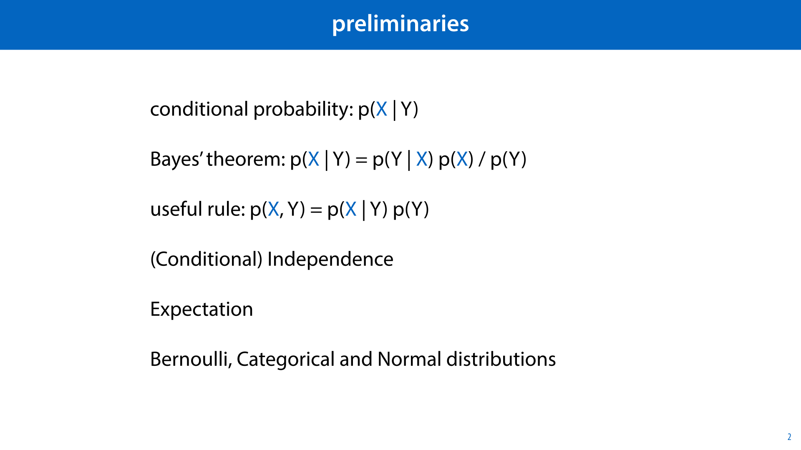

            <figcaption>
            
Before we start, note that we assume a certain familiarity with probability theory. There is a video in <a href="https://mlvu.github.io/preliminaries/"><strong class="blue">the preliminaries lecture</strong></a> to help you brush up on the basics. 
<aside    >As you may be able to tell, that part of the preliminaries lecture used to be part of this lecture, so it should work very well as an introduction to the basics. Be sure to look at it if you feel lost in the early part of this lecture. </aside>
The concepts shown here are probably the most important for this course. 

            </figcaption>
       </section>

       <section id="slide-003" class="anim">
            <a class="slide-link" href="https://mlvu.github.io/probability#slide-003" title="Link to this slide.">link here</a>
            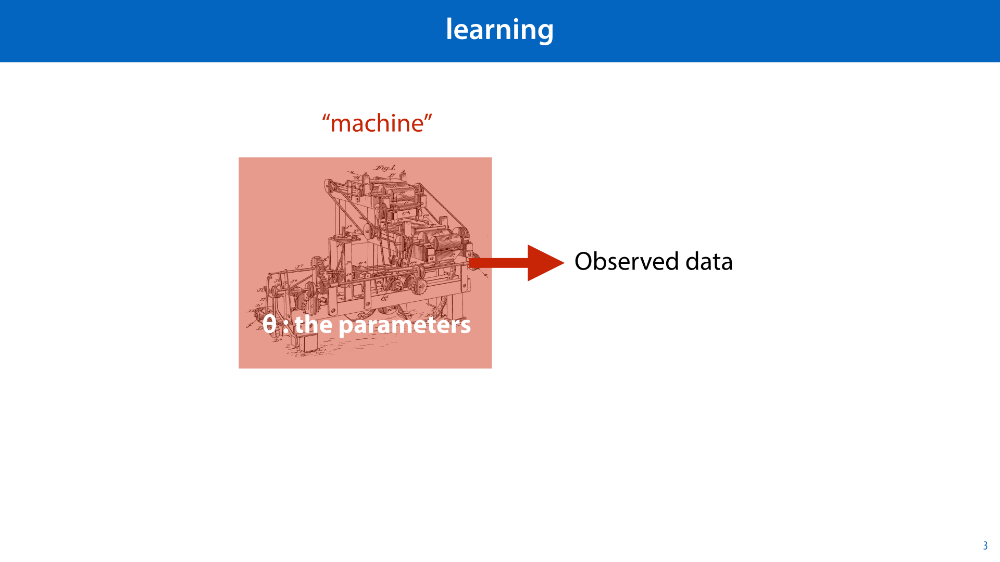

            <figcaption>
            
Here is an analogy for the way probability is usually applied in statistics and machine learning. We assume some “machine” (which could be any natural process, the universe, or an actual machine) has <em>generated</em> our data, by a process that is partly deterministic and partly random. The configuration of this machine is determined by its <strong>parameters </strong>(theta). θ could be a single number, several numbers in a vector, or even a complicated data structure containing a lot of numbers in a complex arrangement. 

We know how the machine works, so if we know θ, we know the probability of seeing any given dataset. Given θ, we can easily work out the probability of all possible datasets. The problem is that we are not given θ, we are given the data, and we want to work out the state of the machine.  

In practice, the "machine" takes the form of a probability distribution, and the configuration of the machine is determined by its parameters θ.

            </figcaption>
            click image for animation
       </section>

       <section id="slide-004" class="anim">
            <a class="slide-link" href="https://mlvu.github.io/probability#slide-004" title="Link to this slide.">link here</a>
            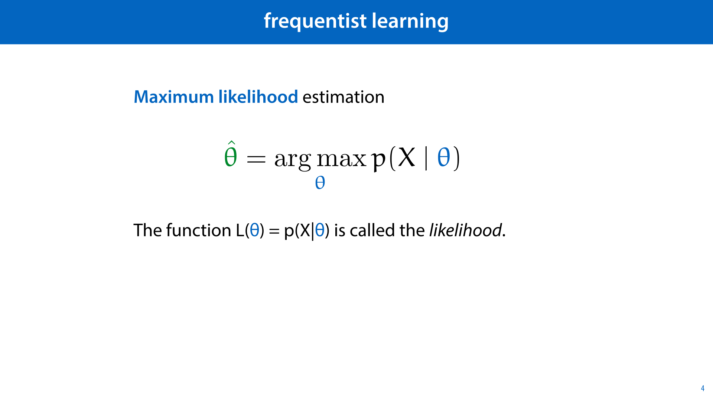

            <figcaption>
            
In <strong>frequentist learning</strong>, we are given some data and our job is to guess the true model (out of a set of models) that generated some data. In other words, pick the right parameters θ so that the probability distribution fits the data well. 

In the frequentist view of the world, <strong>the true model is not subject to probability</strong>. Which model generated the data doesn’t change if we repeat the experiment, so we shouldn’t apply probability to it. We just try to guess which one it is. We won't be exactly right, but we can hopefully get close. This is typical of frequentist approaches: we build algorithms that gives us a <strong>point estimate</strong> for our model parameters. That is, they return <em>one </em>point in our model space. One guess for θ. 

We can use different criteria to decide which model we want to pick. Probably the most common criterion is that we should guess the model for which the probability of seeing the data that we saw is highest. This is called the<em> </em><strong>maximum likelihood principle</strong>. Under the maximum likelihood principle picking a model becomes an<em> optimization </em>problem. 
<aside    >It’s fine if this sounds a little abstract right now, we’ll look at plenty of examples. Note however, that this single idea is how almost every modern machine learning model defines its loss function. It is going to come back again and again in the course, so you’ll need to become very familiar with this idea.</aside><aside    ></aside>
            </figcaption>
            click image for animation
       </section>

       <section id="slide-005">
            <a class="slide-link" href="https://mlvu.github.io/probability#slide-005" title="Link to this slide.">link here</a>
            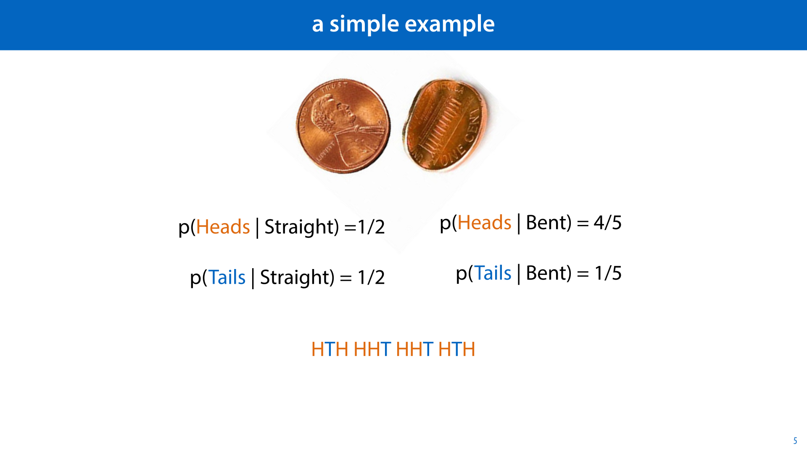

            <figcaption>
            
To explain maximum likelihood fitting, let’s look at a simple example. We have two coins, a bent one and a straight one. Flipping these coins gives us different probabilities of heads and tails.  

We ask a friend to pick a random coin once without showing us, and to flip it twelve times. The resulting sequence has more heads than tails, but not such a disparity that you would never expect it from a fair coin. If we had to guess which coin our friend had picked, which should we guess? 

image source: <a href="https://www.magictricks.com/bent.html"><strong class="blue">https://www.magictricks.com/bent.html</strong></a> 

            </figcaption>
       </section>

       <section id="slide-006">
            <a class="slide-link" href="https://mlvu.github.io/probability#slide-006" title="Link to this slide.">link here</a>
            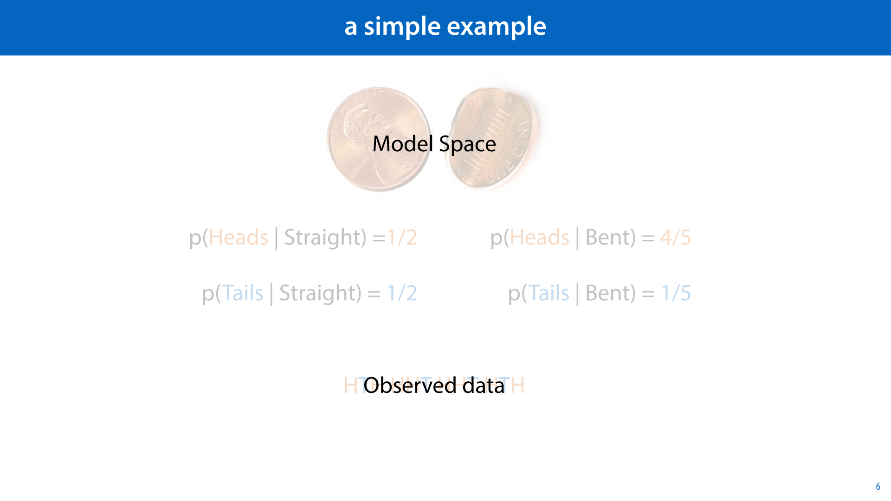

            <figcaption>
            
This is a simple version of a <strong>model selection</strong> problem. Our model class consists of two models (the two coins) and our data consists of 12 instances (the results of the coin flips). 

In more technical terms, the coins are Bernoulli distributions with parameter 1/2 and  and 4/5 respectively. We could also look at the model space of all Bernoulli distributions, but to simplify matters we are looking at just these two.  

            </figcaption>
       </section>

       <section id="slide-007">
            <a class="slide-link" href="https://mlvu.github.io/probability#slide-007" title="Link to this slide.">link here</a>
            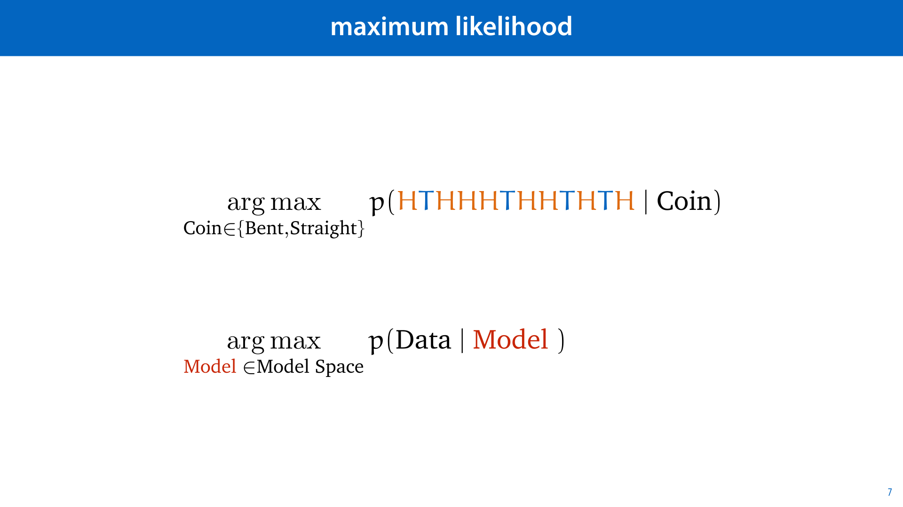

            <figcaption>
            
The maximum likelihood principle tells us to pick the coin for which the likelihood is the greatest. We simply compute, for both coins, the probability of the data that we saw given the coin. The coin that gives us the highest value is the coin we choose.

            </figcaption>
       </section>

       <section id="slide-008">
            <a class="slide-link" href="https://mlvu.github.io/probability#slide-008" title="Link to this slide.">link here</a>
            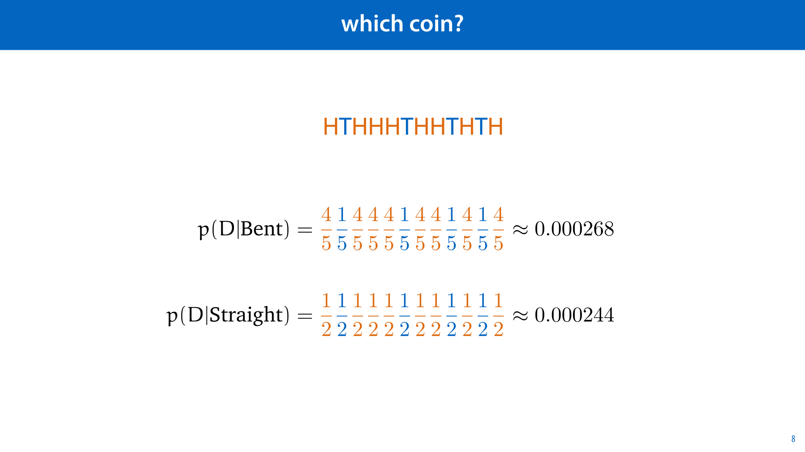

            <figcaption>
            
Since the coin flips are independent, the probability over the whole sequence is just the product over the probabilities of the individual flips. There’s not much in it, but the likelihood for the <em>bent </em>coin is slightly higher, so that’s the preferred model under the maximum likelihood criterion.

            </figcaption>
       </section>

       <section id="slide-009">
            <a class="slide-link" href="https://mlvu.github.io/probability#slide-009" title="Link to this slide.">link here</a>
            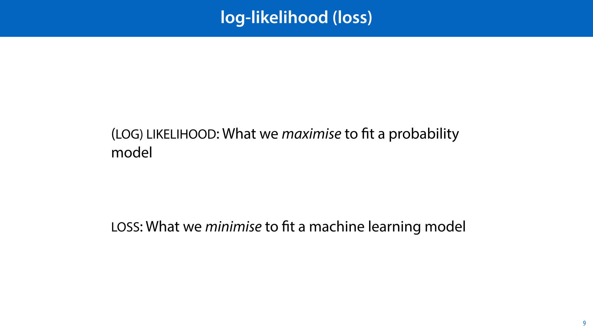

            <figcaption>
            
When we do this kind of computation, we often take the <strong>logarithm of the likelihood</strong>, instead of the plain likelihood. The logarithm is a monotonic function (it always gets bigger if the input gets bigger) so the likelihood and the log-likelihood have their maxima in the same place, but the log-likelihood is often easier to manipulate symbolically (see the first homework exercise). It can also provide a smoother loss landscape for methods like gradient descent. 

The log-likelihood of a probability distribution is a lot like the loss functions we’ve already encountered. 

In fact, if we want to fit a probability distribution with a gradient based method, we usually take the <em>negative</em> log-likelihood, so that we can do gradient <em>descent</em> to find the optimum.  
<aside    >We could also use gradient ascent on the log-likelihood, but it's nice to keep the convention that you always minimize functions, and as we will see at the end of the lecture, the negative logarithm of a probability actually has a very natural interpretation.</aside><aside    ></aside>
            </figcaption>
       </section>

       <section id="slide-010">
            <a class="slide-link" href="https://mlvu.github.io/probability#slide-010" title="Link to this slide.">link here</a>
            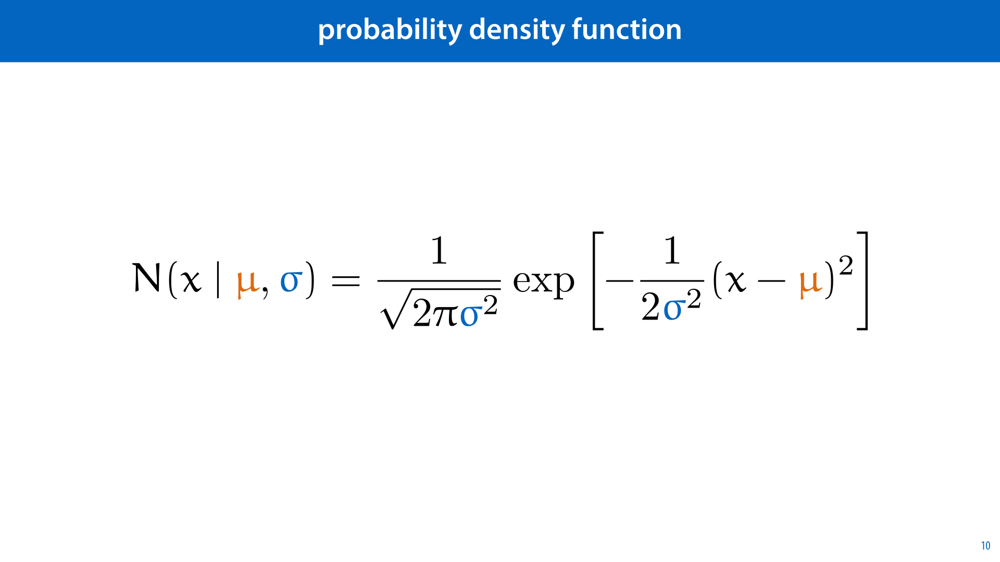

            <figcaption>
            
As a second example of maximum likelihood, let's look at the univariate (i.e. 1D) normal distribution. This is defined by a complicated probability density function, which we don't fully understand yet. What we want to show here is how much of this complexity disappear just by taking the logarithm. 

The probability density of our whole data, given some mean and standard deviation, is simply the product of all individual probability densities. This follows from the assumption that instance data is independently drawn from the same distribution.   

            </figcaption>
       </section>

       <section id="slide-011" class="anim">
            <a class="slide-link" href="https://mlvu.github.io/probability#slide-011" title="Link to this slide.">link here</a>
            

            <figcaption>
            
 

Here’s an illustration of what it looks like to find the maximum likelihood value for the mean of a normal distribution (in one dimension). We will fix the variance to some arbitrary value, and worry about that later. 

If we pick some arbitrary mean on the left side, we see that all the data points on the right side get a very low probability density. This means that the likelihood of the whole dataset under this model is probably poor (that is, a relatively low value). 

If we pick a mean on the right side of the axis, the data points on the left are given low probability density, and we get equally low likelihood for this data. 

To find a model which gives the data a high likelihood, we need to align the cluster of datapoints in the middle with the region of high probability density in the middle of the bell curve. 

            </figcaption>
            click image for animation
       </section>

       <section id="slide-012">
            <a class="slide-link" href="https://mlvu.github.io/probability#slide-012" title="Link to this slide.">link here</a>
            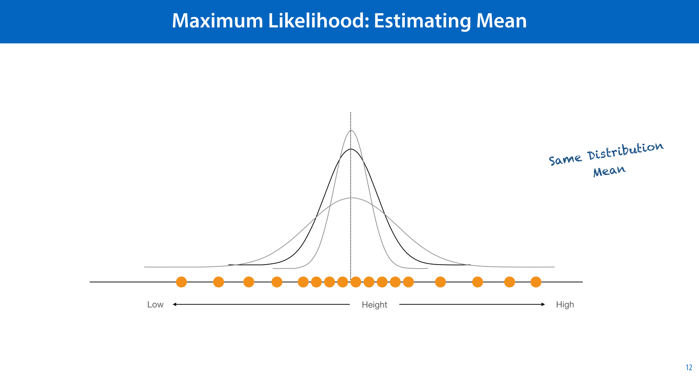

            <figcaption>
            
If we keep the mean fixed, and look at the variance, we see that there is a tradeoff: high variance gives the outliers a high density, but hurts the density we get from the cluster in the middle. 

The maximum likelihood objective balances this tradeoff for us, putting most of the density in the middle, without letting the density of any point get too low.

            </figcaption>
       </section>

       <section id="slide-013" class="anim">
            <a class="slide-link" href="https://mlvu.github.io/probability#slide-013" title="Link to this slide.">link here</a>
            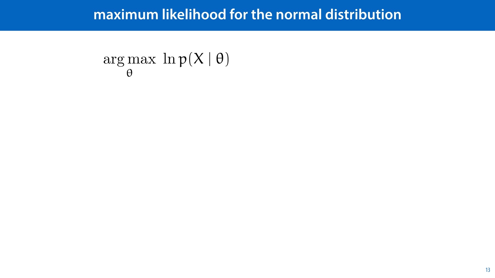

            <figcaption>
            
Here’s how that idea works out mathematically. 

We assume that X is a list of single numbers. We want to find the parameters that maximize the log probability density of this data given the parameters. The probability density of the whole dataset is simply the product of the individual probability densities, if we assume that the data was independently drawn from the same distribution. 

Since there's a factor raised to the power of <em>e</em> inside this function, we'll use the natural logarithm (base e). With a bit of luck, these will cancel out. 

We can turn this product into a sum by moving the logarithm inside. <em>This is explained in detail in the first homework.</em> 

We fill in the definition of the actual probability density function we’re using (line 3). This function is the product of two factors (the division and the exponent). Both of these become terms if we work them out of the logarithm. In the second term the exponent cancels against the logarithm. Already the function we are maximizing looks a lot simpler. 

            </figcaption>
            click image for animation
       </section>

       <section id="slide-014">
            <a class="slide-link" href="https://mlvu.github.io/probability#slide-014" title="Link to this slide.">link here</a>
            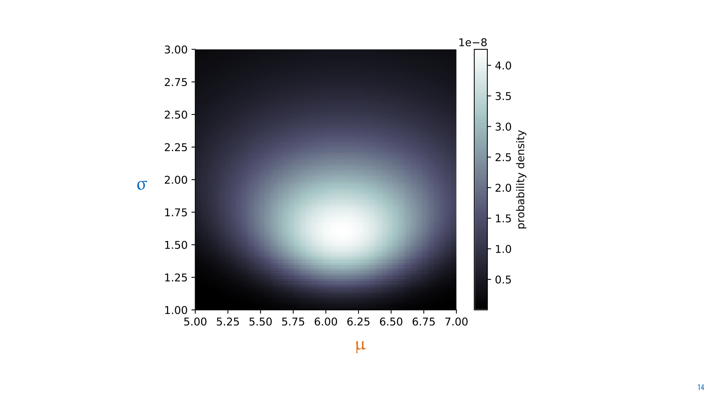

            <figcaption>
            
This is enough to show that with the log likelihood we have another “landscape” on top of our model space. The mean and variance that give us the best fit to our data (under the maximum likelihood principle) are in the center of the bright area. 

If we didn’t want to work out the rest analytically, we could just find the optimum by gradient descent or even by random search.  
<aside    >In statistics courses, you will often take the derivative of the objective function and set it equal to zero to find that the optimal value for the mean is actually the mean of your sample, and the optimal value for the variance is actually the variance of your sample.</aside><aside    ></aside>
            </figcaption>
       </section>

       <section id="slide-015" class="anim">
            <a class="slide-link" href="https://mlvu.github.io/probability#slide-015" title="Link to this slide.">link here</a>
            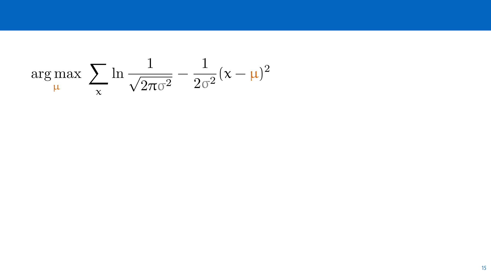

            <figcaption>
            
If we look at each parameter individually, we can reduce the problem even more. We'll try this for the mean just to show the principle. 

We can remove the first term, since it doesn't contain the mean. The factor 1/(2σ2) can be moved outside the sum and then removed (since a positive constant factor won't affect where the maximum is). 

Maximizing a function is the same as minimizing the negative of that function, so we can remove the minus and turn the argmax into an argmin. 

This shows that the maximum likelihood solution for the mean is just the value that minimizes the sum of the squared distances between the mean and the values in the dataset. This is how assuming a normal distribution leads to a least squares loss. For now, the main message is that even if your likelihood function looks really complicated, it's often the case that when you take the logarithm and maximize it, all that complexity disappears. 
<aside    >If you work this out analytically, as we'll do in the next lecture, you'll see that the minimum for this is the (arithmetic) mean of the data.  </aside><aside    >This connection between the normal distribution, the least squares loss and the artihmetic mean is a deep one. Don't worry if you don't quite get it yet, we'll come back to this a few more times.</aside><aside    ></aside>
            </figcaption>
            click image for animation
       </section>

       <section id="slide-016" class="anim">
            <a class="slide-link" href="https://mlvu.github.io/probability#slide-016" title="Link to this slide.">link here</a>
            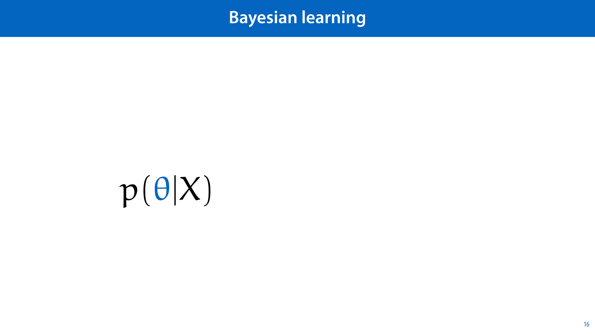

            <figcaption>
            
We'll finish up with a quick look at <strong>Bayesian learning</strong>. We are now using subjectivist probability, so <strong>we are free to assign each potential model a probability</strong>. We don’t know the true parameters, but the data gives us some idea, so we express that uncertainty with a probability distribution <em>over the model space</em>. 

That is, we'd like to know the distribution p(θ|D): a distribution over all available models, given the data that we've observed. As usual, the distribution with the reverse conditional p(D|θ) is much easier to work out. So the first thing we do is apply Bayes' rule to relate the two conditionals to one another. 

The distribution we want to work out is called the <strong>posterior distribution</strong>. Posterior means "after", as in: this is our belief about the true model <em>after</em> we've seen the data. 

The three parts of the right-hand side have these names. The <strong>prior distribution</strong> is a name you’ll hear often. Prior means before, as in: this is our belief about the true model <em>before</em> we've seen the data. For instance, if we do spam classification in a Bayesian way, we might have a prior belief about the probability of getting a spam email, which we then <strong>update</strong> by looking at the content of the email (the data). Our beliefs about the parameters after seeing the data, is expressed by the posterior distribution.  

Note that Bayesian learning does, in principle, not require us to search or optimize anything. If we can work out the function on the right hand side of this equation, we get the posterior distribution and that gives us everything we need. If we need a good model, we can pick the one to which p(θ|X) assigns the highest probability, or we can sample a model and get a good fit with high probability. We can also study other properties of the distribution: for instance the variance of this distribution is a good indication of how uncertain we still are about the parameters of the model.  
<aside    >In some cases, like for normal distributions, we can work all of this out analytically, and we get a formula expressing the posterior distribution. For more complicated models, it’s usually impossible to work out the posterior analytically, and we have to make do with a function that approximates it, or with an algorithm that samples from the posterior. At that point, working out the posterior usually starts to look a lot like the searching we have to do in frequentist methods and general machine learning.</aside><aside    ></aside>
            </figcaption>
            click image for animation
       </section>

       <section id="slide-017" class="anim">
            <a class="slide-link" href="https://mlvu.github.io/probability#slide-017" title="Link to this slide.">link here</a>
            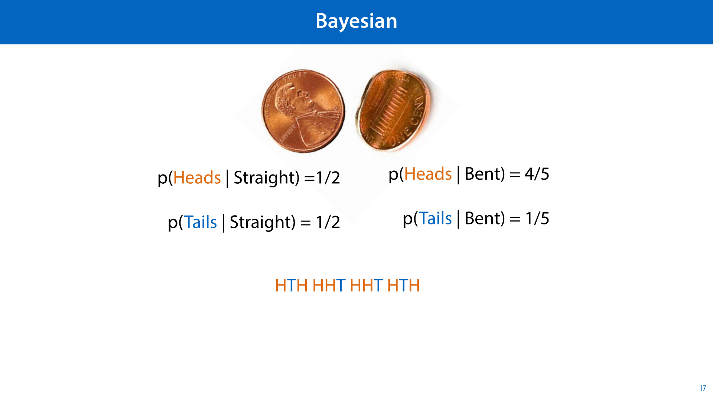

            <figcaption>
            
That may all sound a little abstract, so let's return to our coin example and see what a Bayesian approach would look like there. 

We first need to establish a prior. What is the probability of each coin in our model space? We said that we’d asked a friend to pick a coin at random. If we assume that he follows our instructions, then we believe each coin is equally likely so both get 0.5 probability. If we had two fair coins and one bent one, we could set the prior to 1/3 for bent and 2/3 for fair. Or, if we expected our friend to have a preference for the bent coin, we might set our prior differently. 

This is an important thing to understand about choosing a prior: <strong>it allows us to encode our </strong><em>assumptions</em><strong> about the problem</strong>. As we will see again and again, encoding your assumptions is a very important part of designing machine learning models.

            </figcaption>
            click image for animation
       </section>

       <section id="slide-018" class="anim">
            <a class="slide-link" href="https://mlvu.github.io/probability#slide-018" title="Link to this slide.">link here</a>
            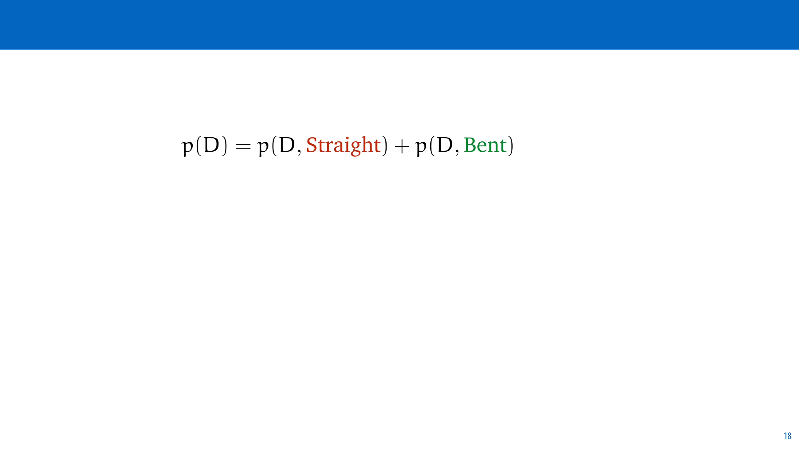

            <figcaption>
            
After the prior, we need to work out the model evidence p(D). This is the probability of the data with the model marginalized out. Independent of the model, how likely are we to see this data at all? We work this out by making the marginalization explicit, and replacing the joint probabilities by their conditionals. 

Then, the posterior is just the proportion of one of the terms in this sum to the total.

            </figcaption>
            click image for animation
       </section>

       <section id="slide-019">
            <a class="slide-link" href="https://mlvu.github.io/probability#slide-019" title="Link to this slide.">link here</a>
            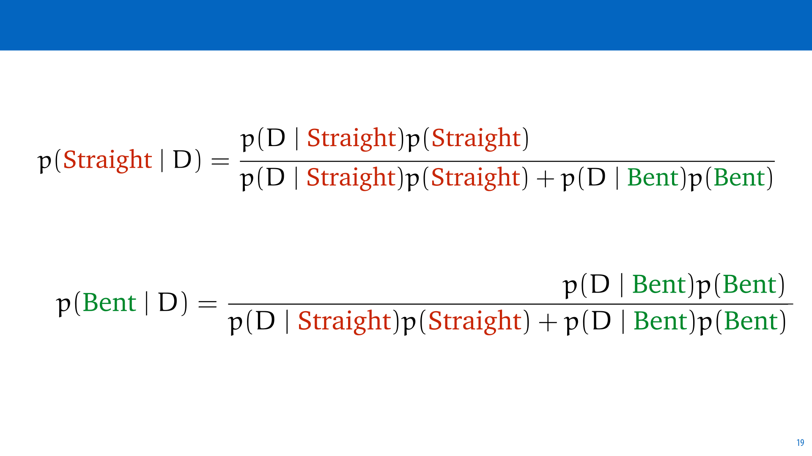

            <figcaption>
            
Here's how we looked at Bayes' rule before. 

We see the available models (bent and straight) as the two possible causes for our data. The marginal probability of seeing this data is the probability of picking straight and seeing it plus picking bent and seeing it. The proportion of the straight term in this sum is the probability of seeing straight given the data. 

            </figcaption>
       </section>

       <section id="slide-020" class="anim">
            <a class="slide-link" href="https://mlvu.github.io/probability#slide-020" title="Link to this slide.">link here</a>
            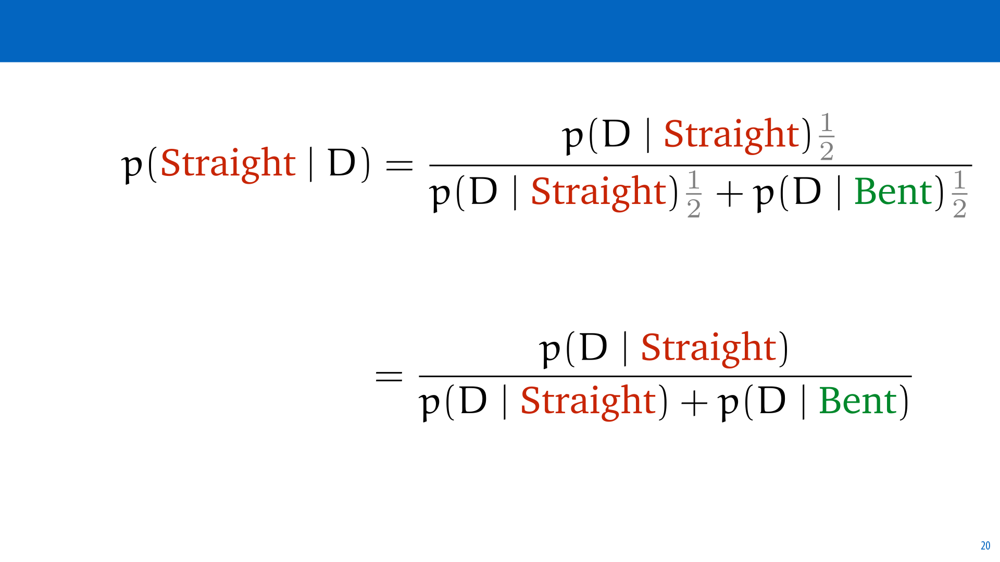

            <figcaption>
            
If we choose a  uniform prior (each model gets the same probability), then the priors cancel out and we are just left with a function of the conditional data probabilities that we've worked out already for the frequentist example.

            </figcaption>
            click image for animation
       </section>

       <section id="slide-021">
            <a class="slide-link" href="https://mlvu.github.io/probability#slide-021" title="Link to this slide.">link here</a>
            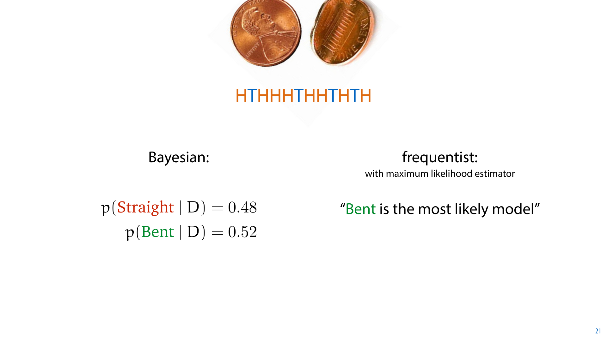

            <figcaption>
            
Filling these in gives us these posterior probabilities for the straight and the bent coins. 

Compare this with the maximum likelihood case. Both approaches prefer the bent model as an explanation for the data. 

However, in the maximum likelihood case, even though the differences between the two likelihoods were small, we only provided<em> one </em>guess for the true model. In the Bayesian approach we get a <em>distribution</em> on the model space. It tells us not just that bent is the more likely model, but also that<em> both models</em> are still quite likely. In this sense, getting a posterior distribution is a much more valuable result than getting a point estimate for your model. 

The downside of Bayesian analysis is that as the models get more complex, it gets more and more difficult to accurately approximate the posterior, and trying to do so is what has led to some of the most complicated material in machine learning. Working out the posterior for the mean of a normal distribution is already a bit too technical for this course, but it's a good exercise to try and imagine what it would involve.

            </figcaption>
       </section>

        <section class="video" id="video-021">
            <a class="slide-link" href="https://mlvu.github.io/probability#video-21">link here</a>
           <video controls>
                <source src="https://surfdrive.surf.nl/files/index.php/s/JBXnid4OXnbfZQM/download" type="video/mp4" />

                Download the <a href="https://surfdrive.surf.nl/files/index.php/s/JBXnid4OXnbfZQM/download">video</a>.
           </video>
        </section>

       <section id="slide-022">
            <a class="slide-link" href="https://mlvu.github.io/probability#slide-022" title="Link to this slide.">link here</a>
            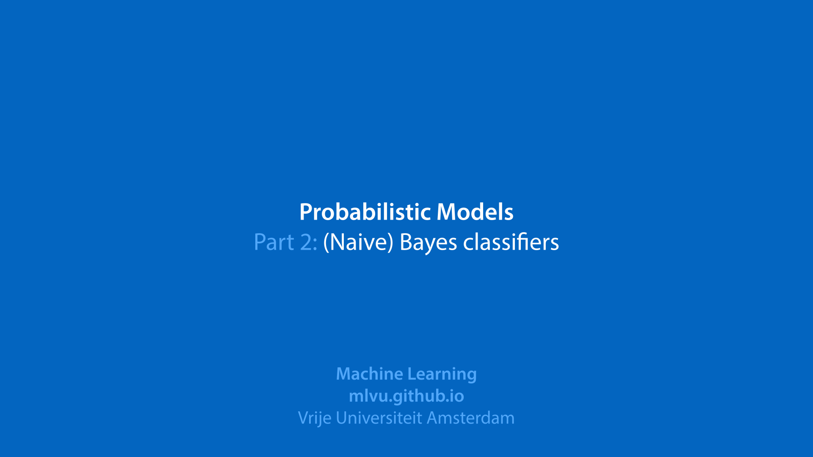

            <figcaption>
            
In this video we’ll try to connect this probability business to the abstract tasks of machine learning. Specifically, we’ll look at <strong>classification</strong>. 

 

            </figcaption>
       </section>

       <section id="slide-023">
            <a class="slide-link" href="https://mlvu.github.io/probability#slide-023" title="Link to this slide.">link here</a>
            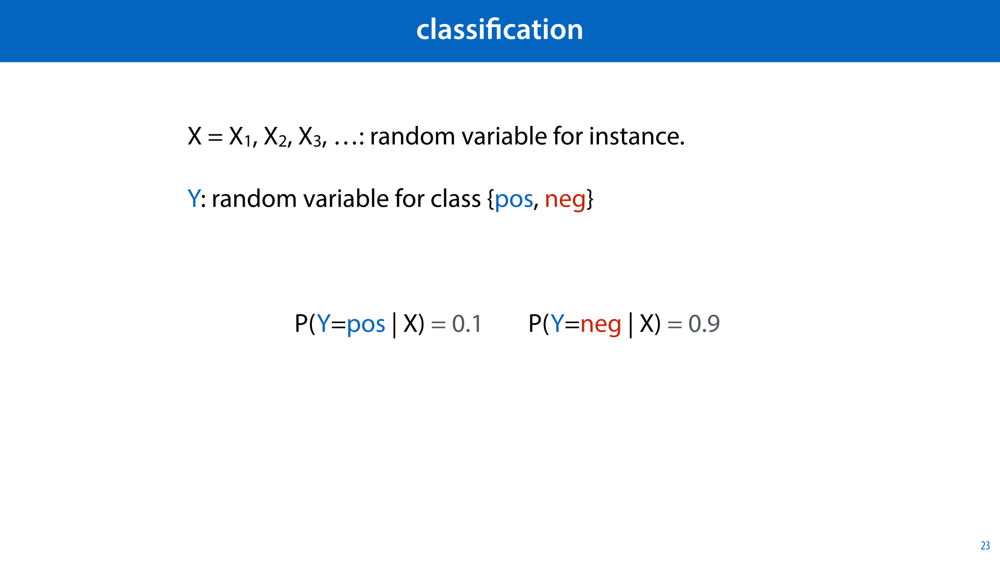

            <figcaption>
            
We will focus on building <strong>probabilistic classifiers</strong>. These are classifiers that return not just a class for a given instance x (or a ranking) but a <em>probability over all classes</em>. 

This can be very useful. We can use the probabilities to extract a ranking (and plot an ROC curve) or we can use the probabilities to assess how certain the classifier is about its judgement.  

Note that a probabilistic classifier is also immediately a ranking classifier (if we rank by how likely the positive class is) and a regular classifier (if we pick the class with the highest probability).

            </figcaption>
       </section>

       <section id="slide-024" class="anim">
            <a class="slide-link" href="https://mlvu.github.io/probability#slide-024" title="Link to this slide.">link here</a>
            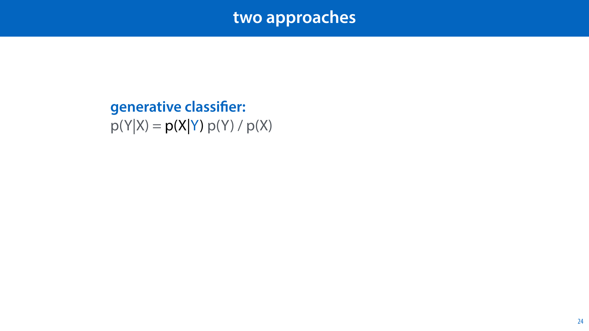

            <figcaption>
            
There are two approaches to casting the classification problem in probabilistic terms.  

A <strong>generative classifier</strong> focuses on learning a distribution on the feature space given the class p(X=<strong>s</strong>|Y). This distribution is then combined with Bayes’ rule to get the probability over the classes, conditioned on the data.  
<aside    >The key part of this process is to work out the probability of the instance X given that its class is Y. We can think of this as a probability distribution that generates the data (hence the name). </aside>
A<strong> discriminative classifier</strong> learns the function p(Y|X=<strong>x</strong>) directly with X as input and class probabilities as output. It functions as a kind of regression, mapping <strong>x</strong> to a vector of class probabilities. 

 We’ll look at some simple generative classifiers in this video, and then we'll describe a discriminative classifier in the next video. 

 

            </figcaption>
            click image for animation
       </section>

       <section id="slide-025">
            <a class="slide-link" href="https://mlvu.github.io/probability#slide-025" title="Link to this slide.">link here</a>
            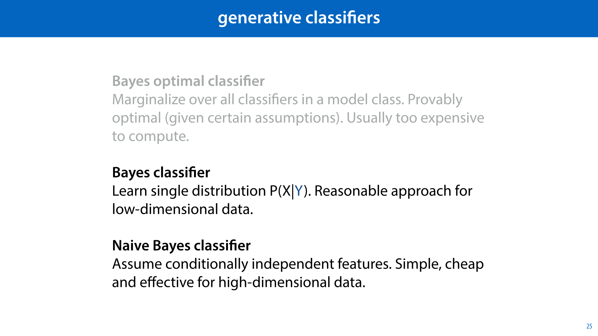

            <figcaption>
            
Here are three approaches, arranged from impractical but entirely correct to highly practical, but based on largely incorrect assumptions. 

We won’t discuss the Bayes optimal classifier in this course, but it’s worth knowing that it exists, and that it means something different than a (naive) Bayes classifier.

            </figcaption>
       </section>

       <section id="slide-026">
            <a class="slide-link" href="https://mlvu.github.io/probability#slide-026" title="Link to this slide.">link here</a>
            

            <figcaption>
            
For the Bayes classifier, we start with the probability we’re interested in p(Y|X): the probability of the class given the data. Note that X in the conditional refers to a single instance. 
<aside    >We'll focus on binary classification to make things concrete, but the methods in this video translate naturally to multiclass problems. </aside>
We rewrite p(Y|X) using Bayes’ rule. From the final form, we see that if we compute, for all classes, the probability functions p(X|Y), the data given the class and p(Y), the prior probability of the class, we can compute the probabilities we are interested in: the class probabilities given the data. 

So, the task becomes to learn functions for those two probabilities. The most important part will be P(X|Y). We can model this by separating the data by class and fitting a probability distribution to each subset individually.

            </figcaption>
       </section>

       <section id="slide-027" class="anim">
            <a class="slide-link" href="https://mlvu.github.io/probability#slide-027" title="Link to this slide.">link here</a>
            

            <figcaption>
            
 

For this example, we will use a multivariate normal distribution (MVN). This is just an extension of the normal distribution to multiple dimensions. Its density curve (for a two dimesnsional space) looks like a rotation of the familiar bell curve, as shown on the left. 

In two dimensions we often draw MVNs as ellipses, since this is a natural way of expressing where most of the probability mass is concentrated. The picture on the right shows three MVNs fitted to three subsets of a data set. 

The formula for the MVN is given below. It’s a complicated beast, but all you really need to know is that for a given dataset, of N features, we can work out analytically which vector <strong>μ</strong> and which matrix <strong class="blue">Σ</strong> give us the best fitting MVN (under the maximum likelihood principle). As you might expect, these are the sample mean, and the sample covariance matrix. If you can compute those, you can fit an MVN to your dataset.

            </figcaption>
            click image for animation
       </section>

       <section id="slide-028" class="anim">
            <a class="slide-link" href="https://mlvu.github.io/probability#slide-028" title="Link to this slide.">link here</a>
            

            <figcaption>
            
Here is the algorithm for a simple Bayes classifier. We choose a model class for P(X|Y). In this case, multivariate normal distributions (MVNs), but other distributions would work too. 

We then separate the points by classes and fit a separate MVN to each of these subsets of the data. We use the maximum likelihood estimates to fit the MVNs to the instances.  
<aside    >Note that this make the Bayes classifier a bit of a Bayesian/frequentist chimera: we are using Bayes' rule to reverse the conditional, but we are using point esitmates to fit our distributions. </aside>
The <strong>class prior</strong> p(Y) is a simple categorical distribution over the classes. We can estimate this from the data, or use some kind of prior knowledge that we have about the domain. 

Strictly speaking, we are mixing probabilities and probability densities, but in this case that doesn't cause any problems. The resulting probability on the classes is a categorical distribution. 
<aside    >When we compute the class probabilities, we can compute the term p(x | class)p(class) once for each term, and then re-use them in the computation of each class probability. If we are only interested in the most probable class or in the ranking, we can omit the computation of the denominator.</aside><aside    ></aside>
            </figcaption>
            click image for animation
       </section>

       <section id="slide-029">
            <a class="slide-link" href="https://mlvu.github.io/probability#slide-029" title="Link to this slide.">link here</a>
            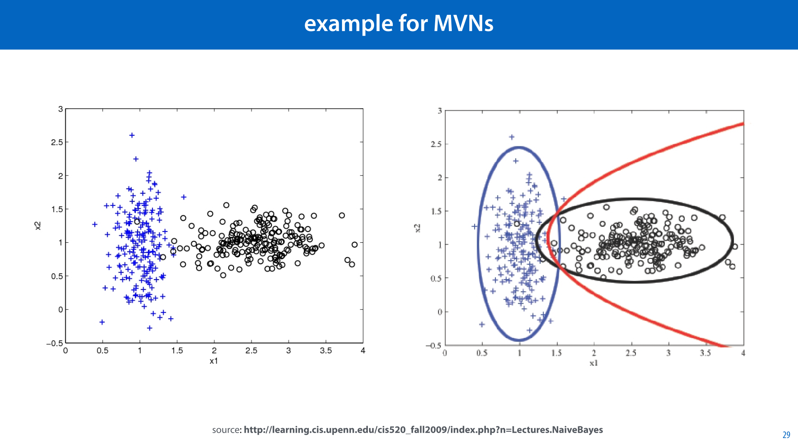

            <figcaption>
            
Here is an example of what that looks like with 2 features. On the left we have two classes, blue and black. We fit a 2D normal distribution to each, represented by the blue and black ellipses. Then, for a new point, we see which assigns the new point the highest probability density, or compute the full probabilities. 

The red line provides the decision boundary: the points where the two probability densities are exactly equal. 

source: <a href="http://learning.cis.upenn.edu/cis520_fall2009/index.php?n=Lectures.NaiveBayes"><strong class="blue">http://learning.cis.upenn.edu/cis520_fall2009/index.php?n=Lectures.NaiveBayes</strong></a> 

 

 

            </figcaption>
       </section>

       <section id="slide-030">
            <a class="slide-link" href="https://mlvu.github.io/probability#slide-030" title="Link to this slide.">link here</a>
            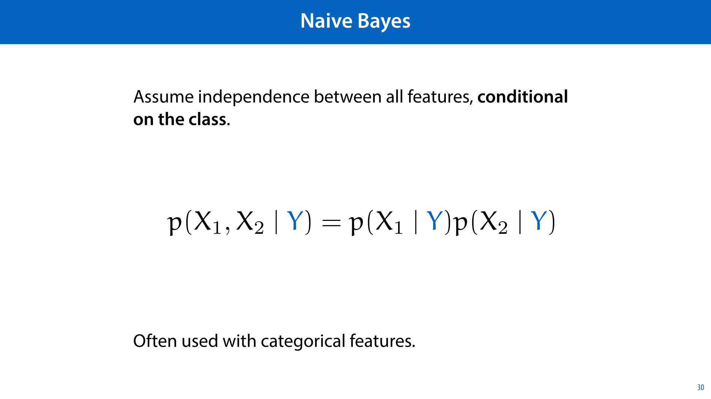

            <figcaption>
            
This works well for small numbers of features, but if we have many features, modelling the dependence between each pair of features gets very expensive.  

A crude, but very effective solution is <strong>naive Bayes</strong>. This just assumes that all features are independent, conditional on the class (for all classes). 

Note that <em>we do not assume that the features are independent</em>: it’s perfectly possible for one feature to be dependent on another feature, but they are <em>conditionally</em> independent. Informally, the dependency between the features is “caused” by the class and nothing else. Just like Alice and Bob in the first video: their lateness had only one possible shared cause, the monster, and once we’d isolated that, their lateness was independent. 

Since naive Bayes is often used with<strong> categorical features</strong>, we'll work out an example on those. 

            </figcaption>
       </section>

       <section id="slide-031">
            <a class="slide-link" href="https://mlvu.github.io/probability#slide-031" title="Link to this slide.">link here</a>
            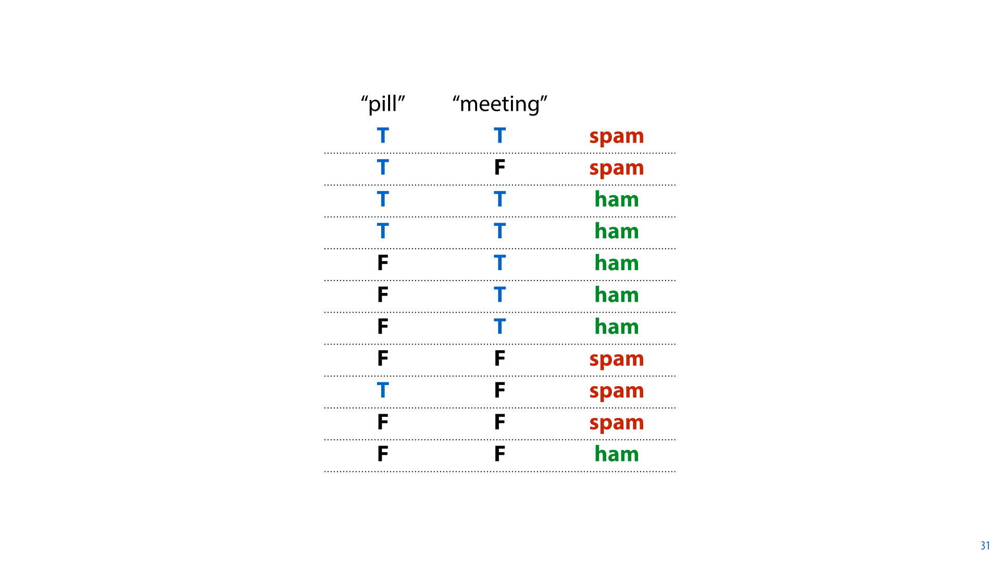

            <figcaption>
            
Here is an example dataset with binary features. The instances are emails to be classified as ham or spam, and each feature indicates whether a particular word occurs in that instance. 

We are building a generative classifier, so we should start by estimating the probability of the data given the class. The Naive Bayes assumption says that we can do this for each feature independently and just multiply the probabilities.  

We will estimate p(“pill”|spam) as the relative frequency with which the “pill” feature was true for spam emails, and similar for the other feature. That is, we simply count the number of times this occurred in the dataset, divided by the total number of spam emails in the dataset.

            </figcaption>
       </section>

       <section id="slide-032">
            <a class="slide-link" href="https://mlvu.github.io/probability#slide-032" title="Link to this slide.">link here</a>
            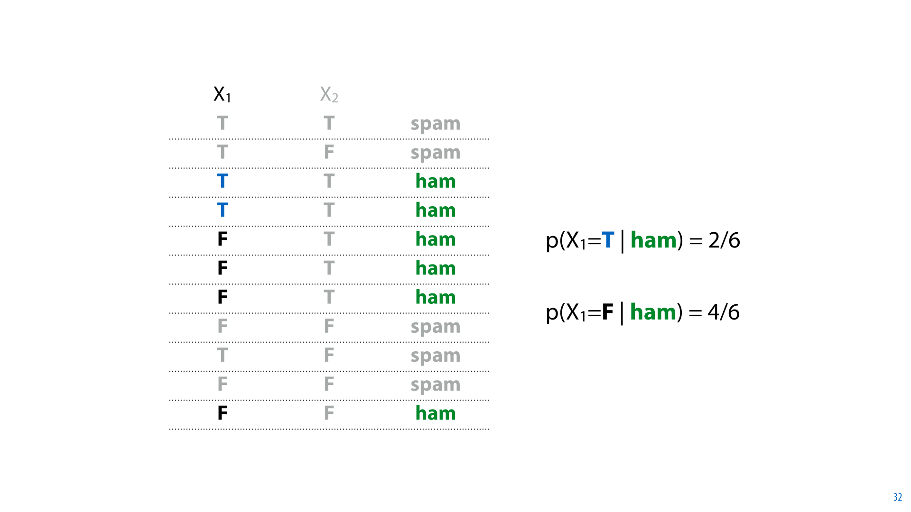

            <figcaption>
            
Here's what those estimates look like. 
<aside    >More formally, we could say we are modelling X1 as a Bernoulli distribution whose parameter we estimate as 2/6. This estimation, using the relative frequency of outcome x as the probability of x, is the maximum likelihood estimate for the Bernoulli distribution. If that sounds too complicated, it hopefully also makes intuitive sense to estimate the probabilities this way.</aside><aside    ></aside>
            </figcaption>
       </section>

       <section id="slide-033">
            <a class="slide-link" href="https://mlvu.github.io/probability#slide-033" title="Link to this slide.">link here</a>
            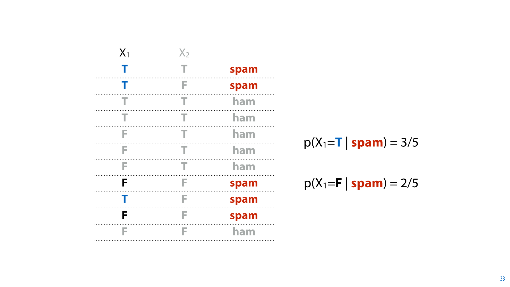

            <figcaption>
            
We do the same for the spam class and for the other feature.

            </figcaption>
       </section>

       <section id="slide-034">
            <a class="slide-link" href="https://mlvu.github.io/probability#slide-034" title="Link to this slide.">link here</a>
            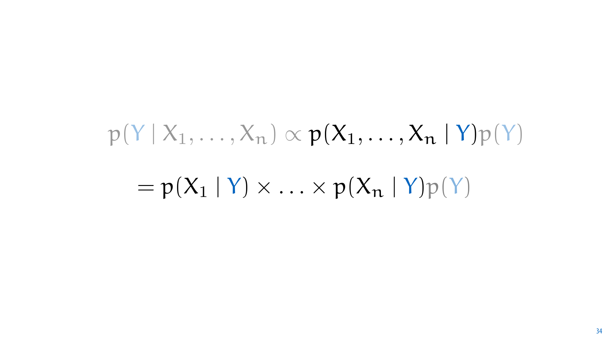

            <figcaption>
            
This is the naive Bayes assumption formulaically. We simply factor p(X1,…Xn) into n separate, independent probabilities. That means we can take our estimates for the probability of each feature, and multiply them together to get the probability of the whole instance.

            </figcaption>
       </section>

       <section id="slide-035" class="anim">
            <a class="slide-link" href="https://mlvu.github.io/probability#slide-035" title="Link to this slide.">link here</a>
            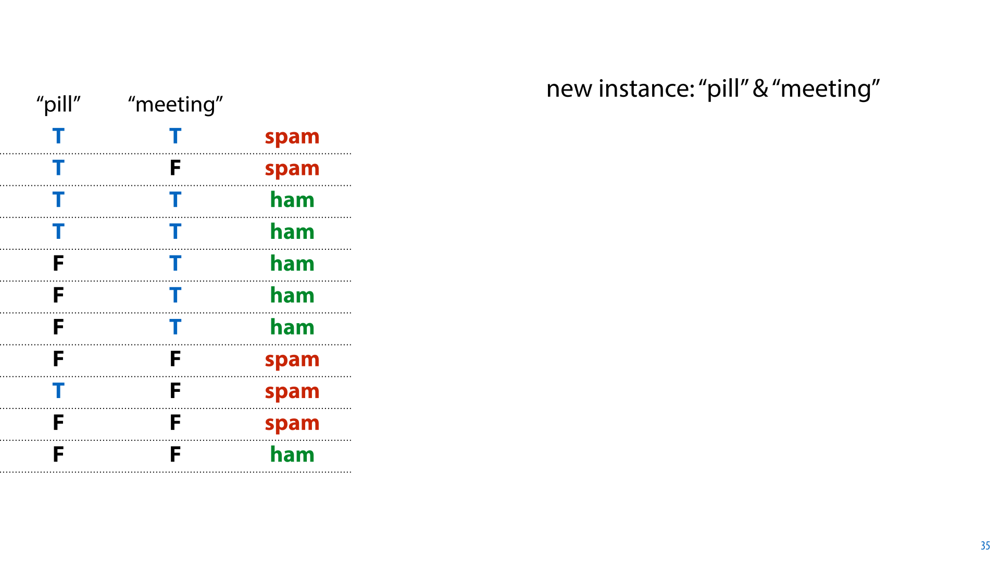

            <figcaption>
            
This gives us a probability for the whole instance space. Now, let's imagine a new email comes in, one which contains the words <em>pill</em> and <em>meeting</em>. What class do we think it is?  

The probability of it being ham is proportional to the probability of seeing a ham email with these characteristics times the probability of seeing a ham email at all. The first factor breaks up by the naive Bayes assumption, and we can simply fill in our three probability estimates. We do the same thing for spam and report wich class gets the high probability  
<aside    >Note that we are only computing the numerator of Bayes' rule. This is enough to work out which class gets the higher probability.</aside><aside    ></aside>
            </figcaption>
            click image for animation
       </section>

       <section id="slide-036" class="anim">
            <a class="slide-link" href="https://mlvu.github.io/probability#slide-036" title="Link to this slide.">link here</a>
            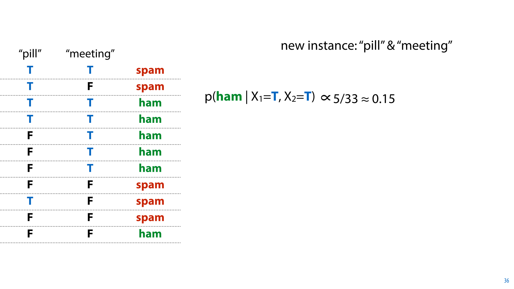

            <figcaption>
            
If we work out the probability of spam in the same way, we see that the Naive Bayes classifier assigns the class ham the most probability. If we want proper class probabilities all we have to do is normalize these values (that is, divide by (5/33) + (3/55)).

            </figcaption>
            click image for animation
       </section>

       <section id="slide-037">
            <a class="slide-link" href="https://mlvu.github.io/probability#slide-037" title="Link to this slide.">link here</a>
            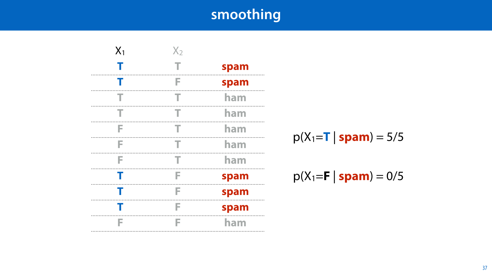

            <figcaption>
            
While naive Bayes can work surprisingly well with these estimators, we do run into a problem if for some feature a particular value does not occur. In that case, we estimate the probability as 0.

            </figcaption>
       </section>

       <section id="slide-038">
            <a class="slide-link" href="https://mlvu.github.io/probability#slide-038" title="Link to this slide.">link here</a>
            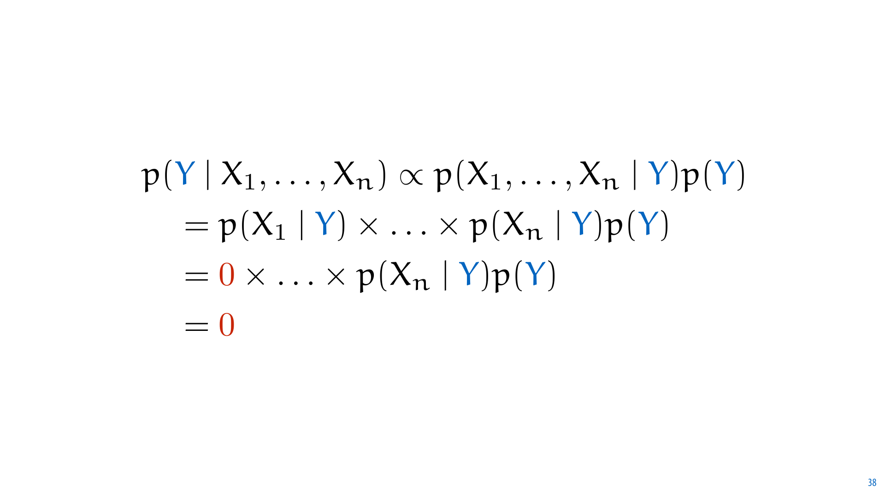

            <figcaption>
            
Since the whole estimate of our probability is just a long product, if one of the factors becomes zero, <strong>the whole thing collapses</strong>. Even if all the other features gave this class a very high probability, that information is lost. 

            </figcaption>
       </section>

       <section id="slide-039">
            <a class="slide-link" href="https://mlvu.github.io/probability#slide-039" title="Link to this slide.">link here</a>
            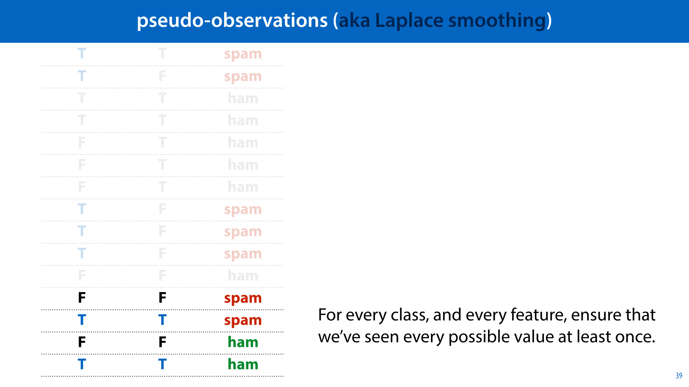

            <figcaption>
            
To remedy this, we need to apply <strong>smoothing</strong>. The simplest way to do that is to add <strong>pseudo-observations</strong>. For each possible value, we add one instance where all the features have that value. This may seem like we're ruining our data with fake examples, but if we have a large dataset the impact should be minimal (and we'll see a way to minimize the impact even further later). 

(We should do the same for the class ham). 
<aside    >If we have features with different sets of values (like gender and country of origin), we can no longer add the pseudo-observations so neatly to the dataset. In that case, we just adjust the estimators for p(Gender | C) and p(Country | C) as shown in the next slide. </aside><aside    >We can do this because of the conditional independence: the estimators for feature 1 don’t look at the data of feature 2, so we can actually add pseudo-observations to one feature but not to the other.</aside><aside    ></aside>
            </figcaption>
       </section>

       <section id="slide-040" class="anim">
            <a class="slide-link" href="https://mlvu.github.io/probability#slide-040" title="Link to this slide.">link here</a>
            

            <figcaption>
            
This changes our estimates as shown here. In practice, we don’t actually need to add the pseudo-observations literally, we just change our estimator. 

Here, v is the number of different values X1 can take. Note that we have to change the denominator as well as the numerator, or the probabilities will sum to more than 1 over all values of the feature. 

If we are worried about the impact of the pseudo-observations, we can reduce the<em> weight</em> they have among the observations. For all other observations we assume that the weight is 1. By replacing 1 for the pseudo-observations with λ, and setting this to a low value like 0.01, we get the λ-smoothed estimator shown. This makes the impact of the pseudo-observations very small, but it still ensures that we will never see a zero. 
<aside    >If you do a Bayesian analysis, you can derive exactly this estimator by setting a particular prior. In fact, many common priors can be framed as pseudo-obervations. We won't dig into this in the course, but it's pretty neat.</aside><aside    ></aside>
            </figcaption>
            click image for animation
       </section>

       <section id="slide-041">
            <a class="slide-link" href="https://mlvu.github.io/probability#slide-041" title="Link to this slide.">link here</a>
            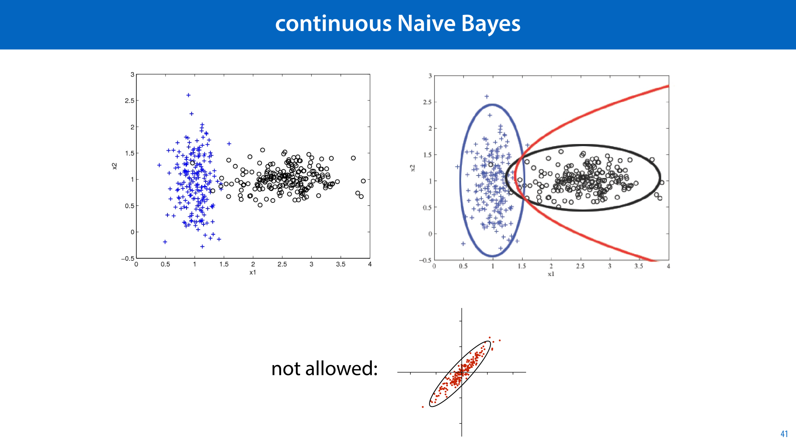

            <figcaption>
            
Naive Bayes is commonly associated with categorical features (to which Bernoulli or Categorical distributions are fitted), but it can also be used with numerical features. If we use normal distributions, then the independence assumption means that we fit a univariate normal distribution to each feature independently. The distribution over the whole space for each class then becomes a multivariate normal whose covariance matrix is diagonal (all off-diagonal elements are zero).  

Visually, this means that the distribution looks like an ellipsoid that is stretched along the axes. Put more technically, its<em> major axis</em> is not horizontal or vertical. 

The kind of ellipse shown on the bottom, which is stretched in an arbitrary direction <em>is</em> a multivariate normal distribution, but not one where the features are independent. So this kind of fit would only be allowed in a non-naive Bayes classifier.  
<aside    >Note that non-naive Bayes with MVNs requires us to specify a full covariance matrix, so the number of model parameters grows quadratically with the number of features, while the number of parameters for the naive Bayes classifier only grows linearly, since we need just one scalar variance per dimension. </aside>
image source: <a href="http://learning.cis.upenn.edu/cis520_fall2009/index.php?n=Lectures.NaiveBayes"><strong class="blue">http://learning.cis.upenn.edu/cis520_fall2009/index.php?n=Lectures.NaiveBayes</strong></a>

<a href="http://learning.cis.upenn.edu/cis520_fall2009/index.php?n=Lectures.NaiveBayes"><strong class="blue"></strong></a>

            </figcaption>
       </section>

       <section id="slide-042">
            <a class="slide-link" href="https://mlvu.github.io/probability#slide-042" title="Link to this slide.">link here</a>
            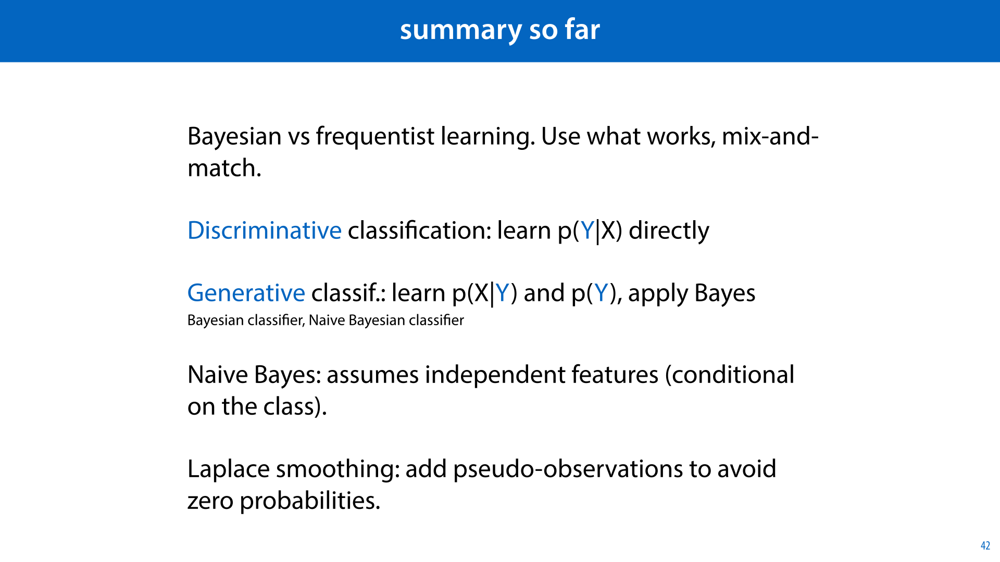

            <figcaption>
            

            </figcaption>
       </section>

        <section class="video" id="video-042">
            <a class="slide-link" href="https://mlvu.github.io/probability#video-42">link here</a>
           <video controls>
                <source src="https://surfdrive.surf.nl/files/index.php/s/3RGE2wmJ3LXdkPy/download" type="video/mp4" />

                Download the <a href="https://surfdrive.surf.nl/files/index.php/s/3RGE2wmJ3LXdkPy/download">video</a>.
           </video>
        </section>

       <section id="slide-043">
            <a class="slide-link" href="https://mlvu.github.io/probability#slide-043" title="Link to this slide.">link here</a>
            

            <figcaption>
            
  

            </figcaption>
       </section>

       <section id="slide-044">
            <a class="slide-link" href="https://mlvu.github.io/probability#slide-044" title="Link to this slide.">link here</a>
            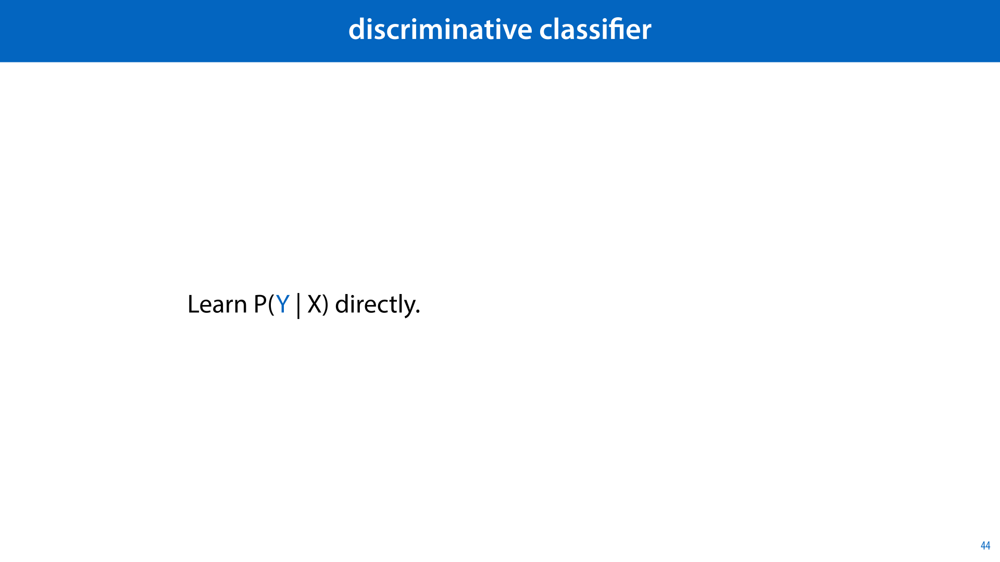

            <figcaption>
            
In this video we’ll look at an example of a discriminative classifier: <strong>logistic regression</strong>. This is a classifier that learns to map the features directly to class probabilities, without using Bayes’ rule to reverse the conditional probability.  

This is basically a small extension of the linear classifier we've already seen. You can also think of it as a linear classifier with a specific loss function. 
<aside    >The name logistic regression is very confusing, but in the modern view it is a classifier, not a regression model.</aside><aside    ></aside>
            </figcaption>
       </section>

       <section id="slide-045">
            <a class="slide-link" href="https://mlvu.github.io/probability#slide-045" title="Link to this slide.">link here</a>
            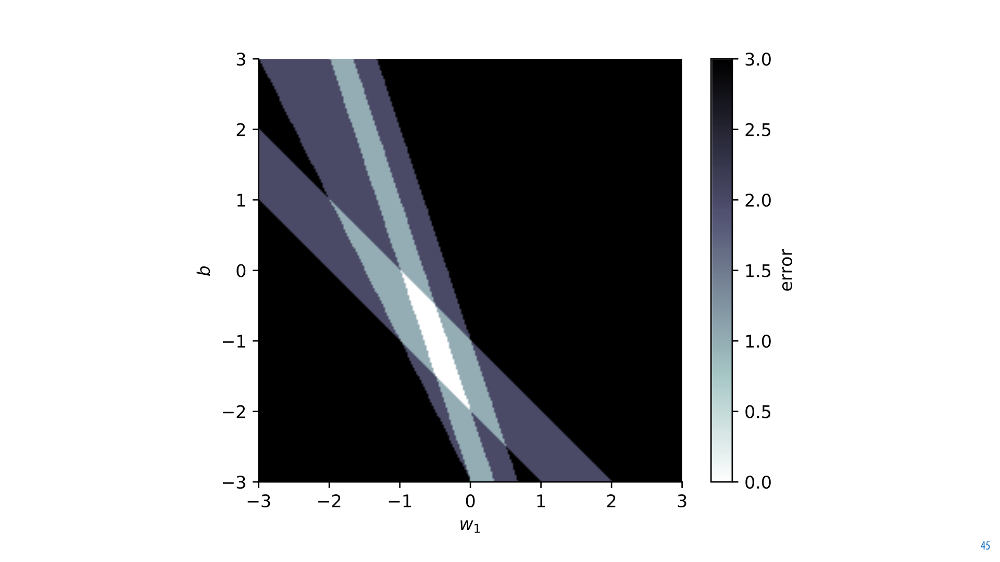

            <figcaption>
            
Remember that we were still on the lookout for good loss functions for the classification problem. We’ll use the language of probability to define one for us.

            </figcaption>
       </section>

       <section id="slide-046">
            <a class="slide-link" href="https://mlvu.github.io/probability#slide-046" title="Link to this slide.">link here</a>
            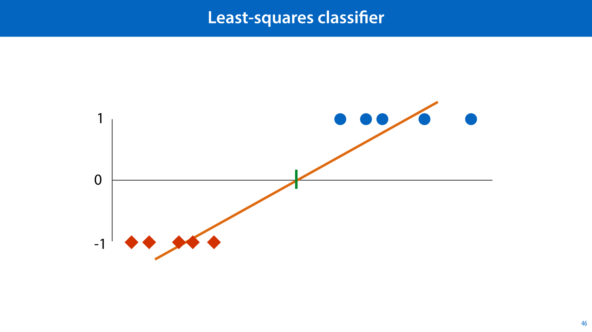

            <figcaption>
            
This was our last attempt: the <em>least squares loss</em>. 

Our thinking was: the hyperplane classifier checks if <strong>w</strong>T<strong>x </strong>+ b is positive or negative, to decide whether to assign classes positive (blue discs) or negative (red diamonds), respectively. Why not just give the classes some arbitrary positive and negative values (-1 and +1), and treat it as a regression problem?

            </figcaption>
       </section>

       <section id="slide-047">
            <a class="slide-link" href="https://mlvu.github.io/probability#slide-047" title="Link to this slide.">link here</a>
            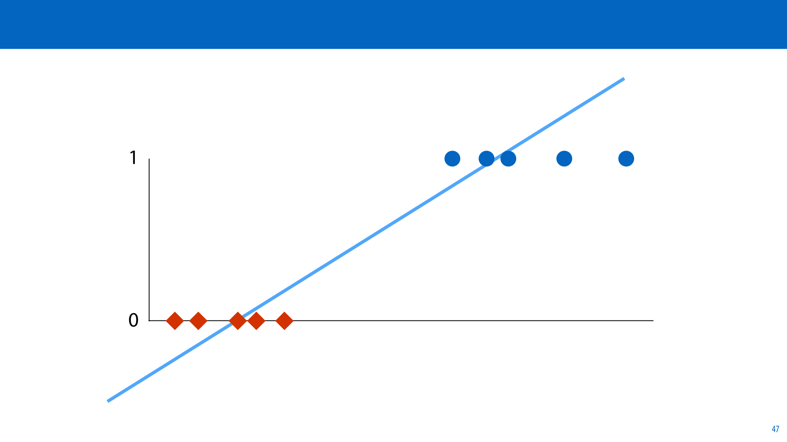

            <figcaption>
            
Here is another option: instead of assigning the two classes arbitrary values, we assign them <em>probabilities</em>: specifically, <em>the probability of being positive.</em> This is 1 for all points in the positive class and 0 for all points in the negative class. Compared to the least squares approach, we just assign the negative class points the value 0 instead of -1. 

Does this give us a probabilistic classifier? Can we fit a linear regression line to these points and interpret the output as the probability, p(pos|x),  that the instance is positive? If we fit a line through these points, it doesn’t look substantially different to the previous slide, because our function <strong>w</strong>T<strong>x </strong>+ b still ranges from negative infinity to positive infinity. We'd like it to produce values between 0 and 1, so we can always interpret them as probabilities, but it only does that for a very narrow and arbitrary range. 

What we need, is a way to squeeze the whole infinite range of the linear function into the range [0, 1], so that the model will only ever produce valid probabilities.

            </figcaption>
       </section>

       <section id="slide-048" class="anim">
            <a class="slide-link" href="https://mlvu.github.io/probability#slide-048" title="Link to this slide.">link here</a>
            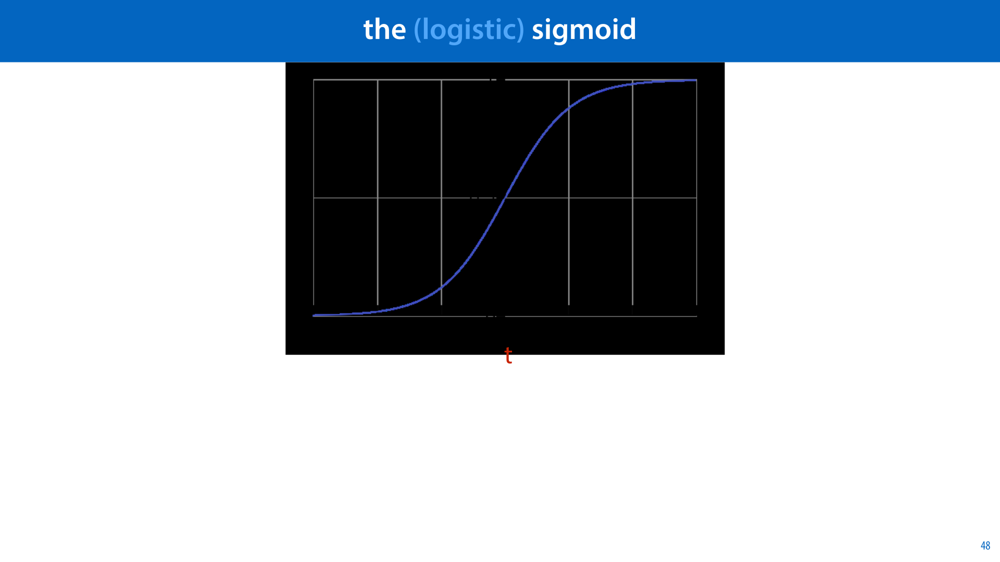

            <figcaption>
            
For this purpose, we will use the <strong>logistic sigmoid</strong> function shown here. A sigmoid function is a function that makes an s-shape like this: its domain is the entire real number line, its range is between two finite values, 0 and 1 in this case, and it increases monotonically. Informally, it squeezes the whole real number line into a finite interval in a smooth way. The<em> logistic</em> sigmoid shown here is just one of many sigmoid functions. 
<aside    >The second definition, in grey, is equal to the first. You can show this easily by multiplying both the numerator and the denominator by et in the first definition. </aside>
source: By Qef (talk) - Created from scratch with gnuplot, Public Domain, <a href="https://commons.wikimedia.org/w/index.php?curid=4310325"><strong class="blue">https://commons.wikimedia.org/w/index.php?curid=4310325</strong></a> 

            </figcaption>
            click image for animation
       </section>

       <section id="slide-049">
            <a class="slide-link" href="https://mlvu.github.io/probability#slide-049" title="Link to this slide.">link here</a>
            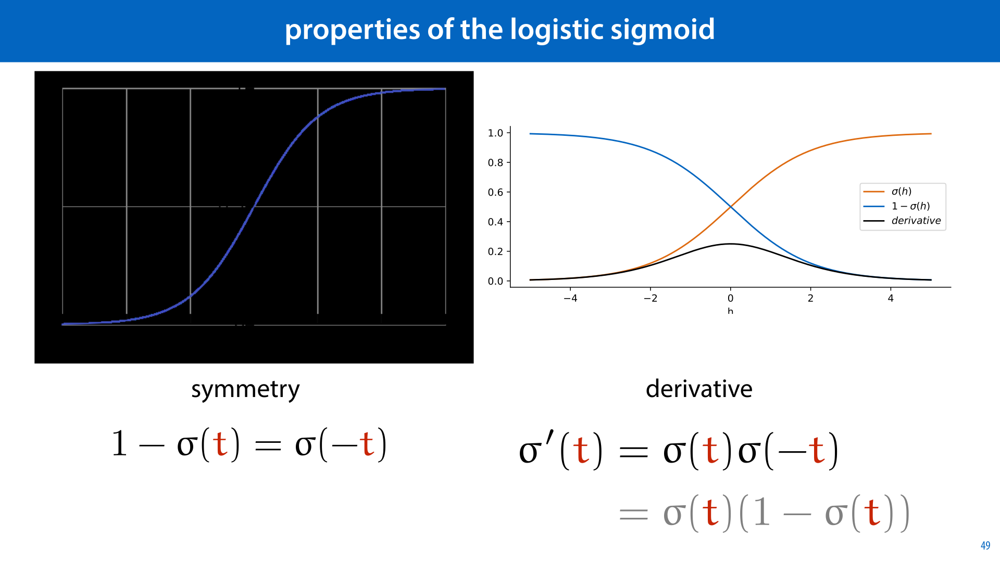

            <figcaption>
            
We'll see a lot more of the logistic sigmoid as the course progresses, so make sure to remember it. The reason we like to use this specific sigmoid in machine learning settings is that it has a few nice properties that make analysis easier. 

The first is its <strong>symmetry</strong>: if you flip it upside down, or left to right, you get the same function, which is the sigmoid running in the opposite direction σ(-t). Basically the remainder between σ(t) and 1, is itself a sigmoid. We'll use this property later in this video. 

The second property is that the<strong> derivative</strong> of the sigmoid has a particularly simple form: it's equal to the sigmoid itself times one of these flipped sigmoids. 
<aside    >Both of these properties are easy enough to work out from the definition on the previous slide. We'll save you this to keep the lecture simple, but it's a good exercise if you have the time to try. If not, take a minute to burn them into your memory, so you'll be able to follow along later when they pop up. </aside><aside    ></aside>
            </figcaption>
       </section>

       <section id="slide-050" class="anim">
            <a class="slide-link" href="https://mlvu.github.io/probability#slide-050" title="Link to this slide.">link here</a>
            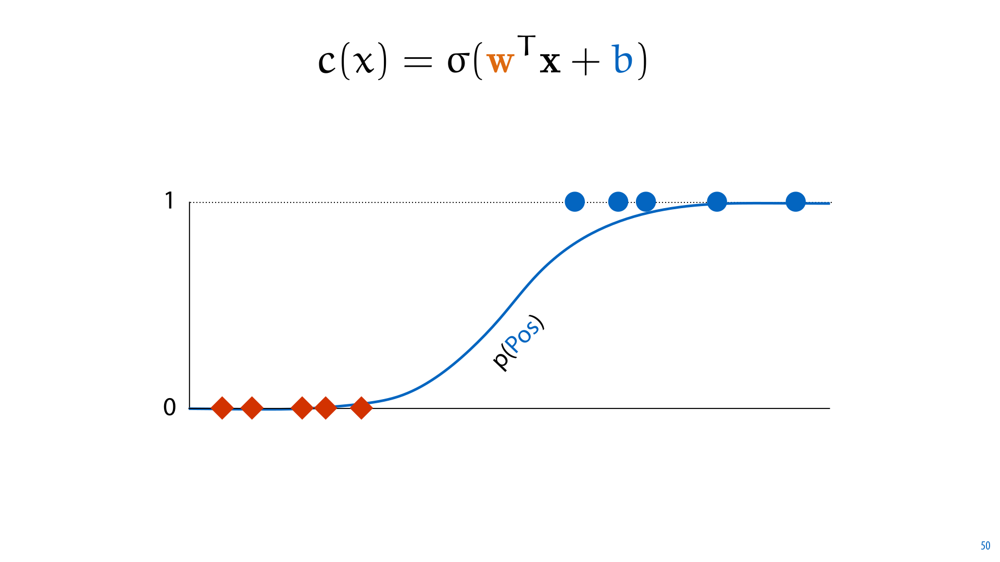

            <figcaption>
            
With the sigmoid in hand, we can build our new classifier: we compute the linear function <strong>w</strong>T<strong>x </strong>+ b as before, but we apply the logistic sigmoid to its output, squeezing it into the interval [0, 1]. This means that we can interpret the output as the probability of the positive class being true, according to our classifier.  

This may be a very accurate probability, or a very inaccurate one, depending on how we choose <strong>w</strong> and b, but it’s always a value between 0 and 1. Hopefully, if we choose the parameters <strong>w</strong> and b well, we'll get a probability distribution that assigns high probability to the blue discs and low probability to the red diamonds. 

Now all we need is a<strong> loss function</strong> that tells us how well the probabilities produced by the classifier match what we see in the data.

            </figcaption>
            click image for animation
       </section>

       <section id="slide-051">
            <a class="slide-link" href="https://mlvu.github.io/probability#slide-051" title="Link to this slide.">link here</a>
            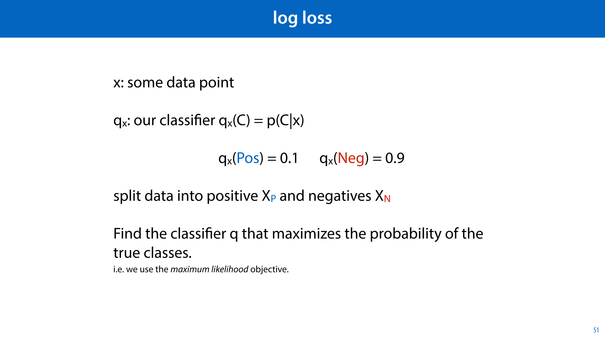

            <figcaption>
            
For this we'll introduce the <strong>log(arithmic) loss</strong>. This is also know as the (binary) cross-entropy loss, for reasons we'll explain in the next video. 

At heart, this is just the maximum likelihood principle at work. We have some data, the class labels, and a model with some parameters, <strong>w</strong> and b. We are looking for the parameters that maximize the probability of the data.  

We'll call the probability distribution that our classifier produces for x qx. This is the probability of the class conditioned on the data, but we'll move the conditional to the subscript to clarify the notation a little. 
<aside    >We call it q because it’s a probability distribution, but one that we “build” rather than one that describes the real world. That is, q could be very accurate, or very inaccurate, depending on how we choose <strong>w</strong> and b.</aside><aside    ></aside>
            </figcaption>
       </section>

       <section id="slide-052" class="anim">
            <a class="slide-link" href="https://mlvu.github.io/probability#slide-052" title="Link to this slide.">link here</a>
            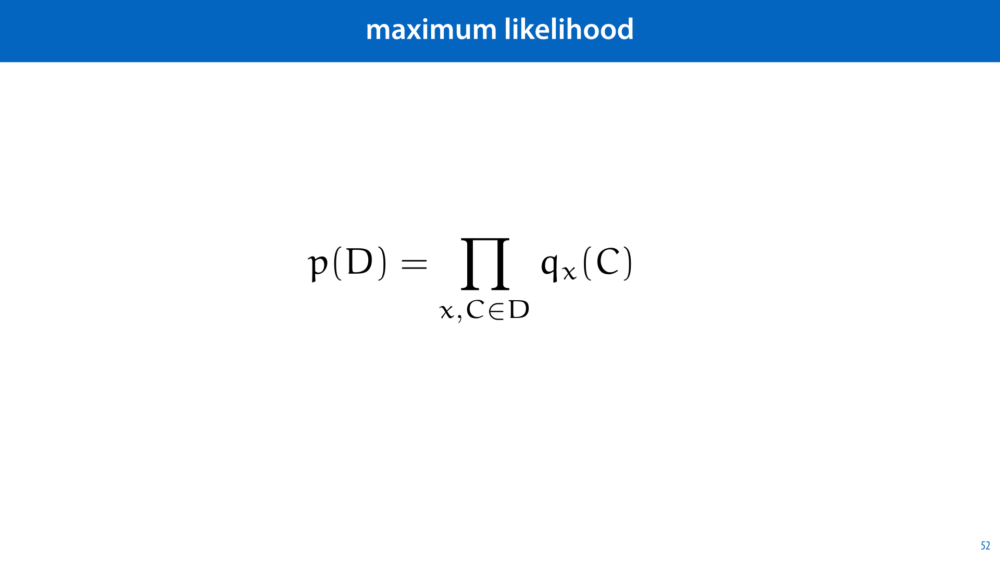

            <figcaption>
            
We assume that the instances in our data are independent, so that the probability of all class labels is just the probabilities of the individual class labels multiplied together. Since we have a discriminative classifier, we are not modeling the features. We take them as given and directly maximize the probability of the labels given the features.

            </figcaption>
            click image for animation
       </section>

       <section id="slide-053" class="anim">
            <a class="slide-link" href="https://mlvu.github.io/probability#slide-053" title="Link to this slide.">link here</a>
            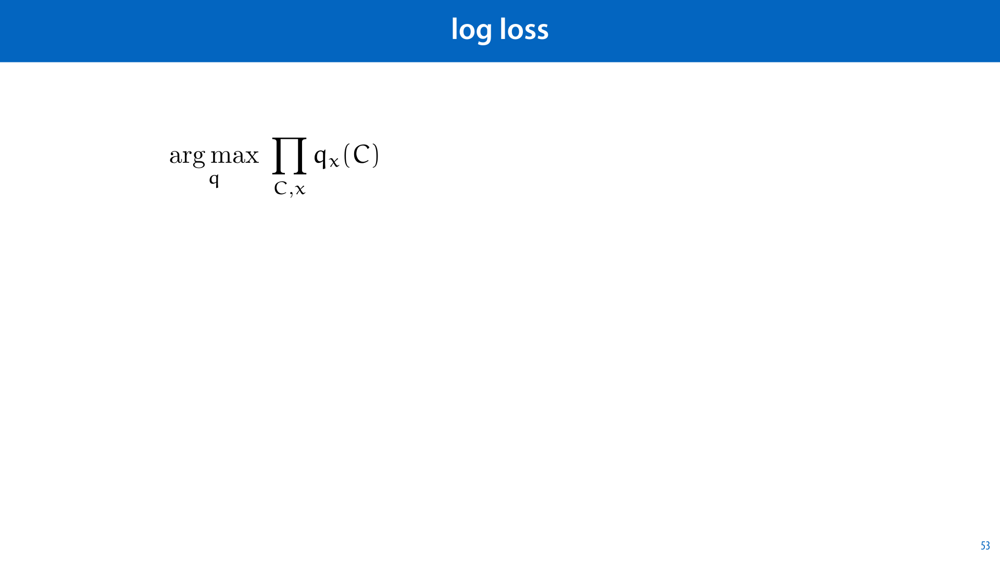

            <figcaption>
            
Since, as we've seen, the logarithm of the probability is often better behaved, we will maximize the log-probability of the class labels given the features. Since we like to minimize—we are looking for a<em> loss function</em> so lower should be better—we stick a minus in front of the log probability and change the argmax to an argmin. 

Then, the multiplication can be moved out of the logarithm, turning it into a sum.  

Finally, we separate the data into the positive and negative instances. Our loss function says that for the positive points we want to maximize the log probability the classifier assigned to the point being positive and for the negative classes we want to maximize the probability that the classifier assigns to the point being negative. Hopefully, this sounds intuitive so far.

            </figcaption>
            click image for animation
       </section>

       <section id="slide-054">
            <a class="slide-link" href="https://mlvu.github.io/probability#slide-054" title="Link to this slide.">link here</a>
            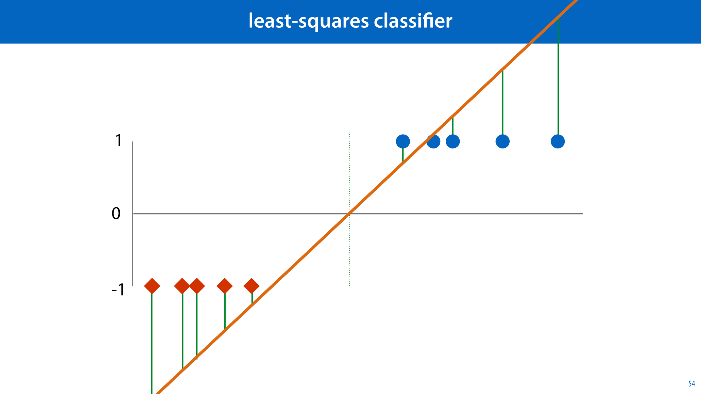

            <figcaption>
            
Before we move on, let's try to visualize what we have so far. 

In the least-squares case, the loss function could be thought of in terms of the <em>residuals</em> between the prediction and the true values. They pull on the line like rubber bands.

            </figcaption>
       </section>

       <section id="slide-055">
            <a class="slide-link" href="https://mlvu.github.io/probability#slide-055" title="Link to this slide.">link here</a>
            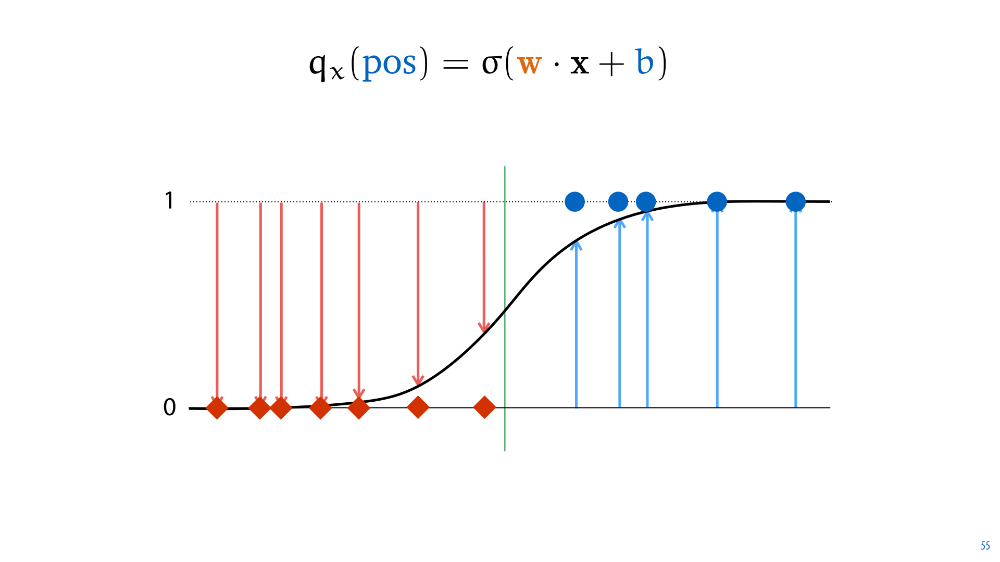

            <figcaption>
            
For the logarithmic loss on the logistic classifier, we can imagine the "residuals" as the lines drawn here: the probabilities of the true classes. The logarithmic loss tries to maximize the sum of their logarithm (or minimize their negative logarithm). 

You can think of them as little rods pushing up (for the blue rods) and down (for the red rods) on the sigmoid function to push it towards the relevant instances.

            </figcaption>
       </section>

       <section id="slide-056">
            <a class="slide-link" href="https://mlvu.github.io/probability#slide-056" title="Link to this slide.">link here</a>
            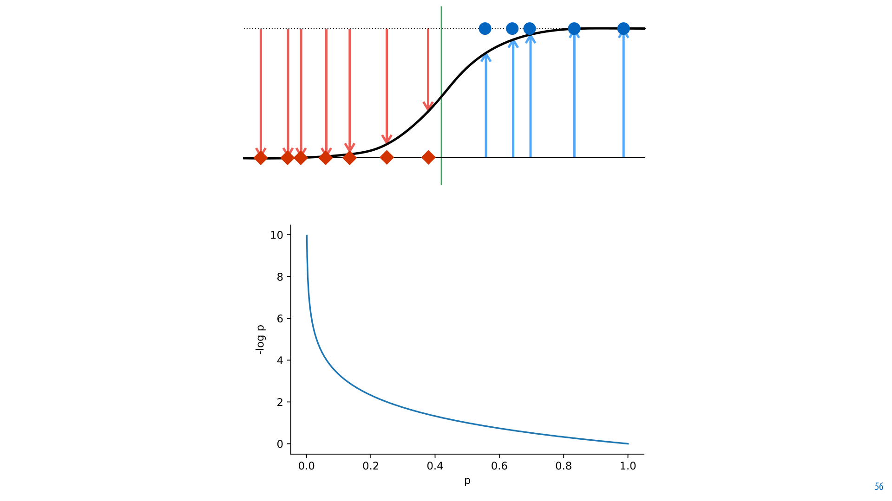

            <figcaption>
            
Remember that in the least squares loss we squared the residuals before summing them, to punish outliers. Taking the logarithm has a similar effect. For those instances where the probability is near the value it should be, we are taking the negative logarithm of a value very close to zero. That means that these points, which are far away from the decision boundary, contribute very little to the loss, and the points for which the rods are smaller contribute proportionally much more. 

The next question is how do we minimize this loss? We'll use gradient descent, which means that we need to work out the derivatives with respect to the parameters.  

            </figcaption>
       </section>

       <section id="slide-057">
            <a class="slide-link" href="https://mlvu.github.io/probability#slide-057" title="Link to this slide.">link here</a>
            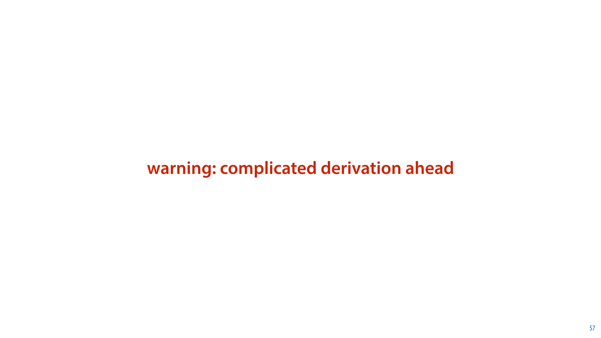

            <figcaption>
            
The next couple of slides show a (somewhat) complicated derivation. You should do your best to go through this step by step. There are a couple more of these coming up in the course, so if you don't take the time to get used to them, you'll struggle later on. If you do take the time, I promise it gets easier with a little practice. 

You don't, however, have to understand this <em>right away</em>. If you struggle to follow along,<em> just look at the start and end points</em>. Try to figure out what the derivation is trying to show and why this is important. Then, move on to the rest of the lecture and come back for the details later.  
<aside    >If you haven't done the second homework exercise yet, it may be better to do that first, and then come back to this part of the video. After that exercise, you should have a more practical understanding of what we're trying to do here.</aside><aside    ></aside>
            </figcaption>
       </section>

       <section id="slide-058" class="anim">
            <a class="slide-link" href="https://mlvu.github.io/probability#slide-058" title="Link to this slide.">link here</a>
            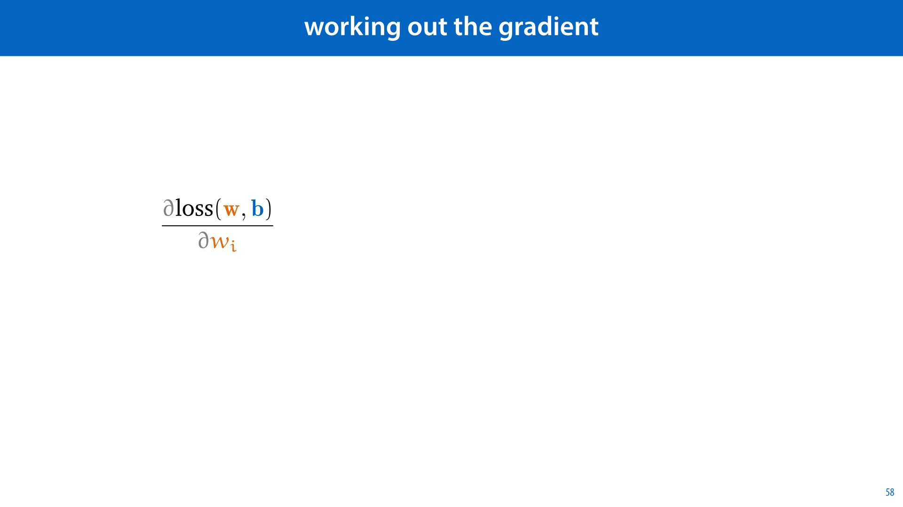

            <figcaption>
            
What we need is the derivative of the loss with respect to every parameter of the model. We'll work it out for the weights wi and take the bias b as read.  

We’ll show you the basics of working out the gradient for logistic regression. The first step is to break the loss apart into separate terms for the positive and negative points. We'll look at the positive term in detail (the negative term can be derived in a similar way).

            </figcaption>
            click image for animation
       </section>

       <section id="slide-059" class="anim">
            <a class="slide-link" href="https://mlvu.github.io/probability#slide-059" title="Link to this slide.">link here</a>
            

            <figcaption>
            
To simplify the derivation, we first take the output of the linear part of our model (before it goes into the sigmoid) and call it y. Note that the derivative of y with respect wi is just xi, because the dot product is a simple sum of element-wise multiplications, so the only term that wi appears in is wi xi. 

With this, we can work out the partial derivative with respect to wi in a relatively clean and simple manner. We start (line 1) by filling in qx(P), the probability according to our current classifier that the point x is in the positive class (which it is). This is just the output y of the linear function, passed through the logistic sigmoid σ. 

Next (line 2), we apply the chain rule twice. First to move out of the logarithm, and then to move out of the sigmoid. Note that each denominator is the numerator of the previous factor. 

For each of these three factors, we can work out the derivative (line 3). The derivative of log(x) is 1/x. That is, assuming we are using the natural logarithm. If we want to use a different logarithm (like base-2), then we get a constant multiplier, which we can ignore if we are using gradient descent (because we are scaling the gradient by η anyway). The derivative of the sigmoid w.r.t. to y is the sigmoid times the flipped sigmoid, and the derivative of y wrt to wi we have already worked out. 

The factor σ(y) appears above and below the division line, so these cancel out (line 4), leaving us with just the flipped sigmoid times xi. We note that the flipped sigmoid is one minus the probability of the positive class (according to our classifier). Since there are only two classes, this equals the probability of the negative class qx(N). We fill this in, which provides our answer. 

 

            </figcaption>
            click image for animation
       </section>

       <section id="slide-060">
            <a class="slide-link" href="https://mlvu.github.io/probability#slide-060" title="Link to this slide.">link here</a>
            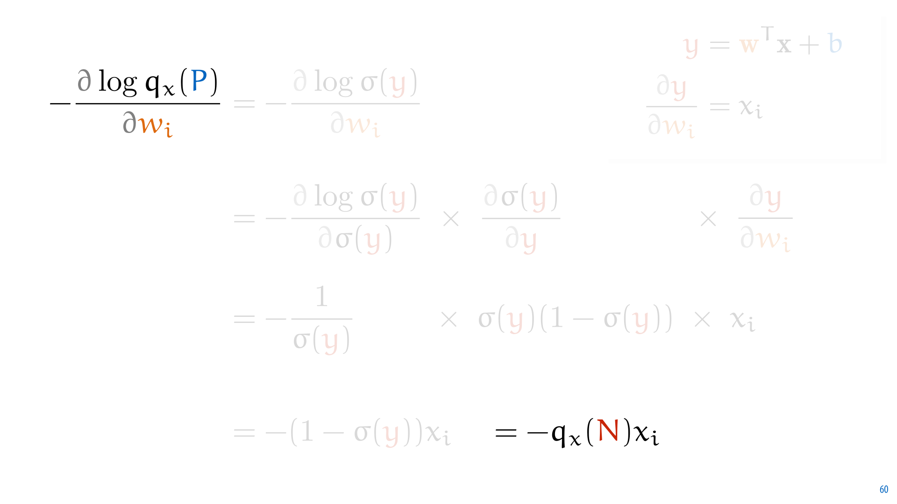

            <figcaption>
            
Despite the complicated business in the middle, the result is actually very simple. This is one of the pleasing properties of the logistic sigmoid, it tends to cancel itself out when the derivative is taken. 

In short, for this particular instance, and weight i, the derivative is the i-th feature times the probability (according to the current parameters) that this instance is negative. 

Consider what this means in a gradient descent setting: this value here is what we want to subtract from the current value of wi to better fit the classifier to this particular point x.  Imagine that the classifier does badly at the moment: to this positive point x, it assigns a large probability for the negative class, so qx(N) is large.  

If xi is a large positive value, then gradient descent subtracts a large negative number, - qx(N)xi, from wi. This makes it bigger, increasing the sum <strong>w</strong>T<strong>x</strong> + b and increasing the probability σ(<strong>w</strong>T<strong>x</strong> + b) that the classifier assigns to the positive class. If xi is a large <em class="red">negative</em> number, we go in the opposite direction. 

If, however, the classifier already does well, assigning this positive point a large positive probability, then qx(N) is very close to 0, and this particular instance has very little influence on the gradient descent step (unless the magnitude of xi is so big that xiqx(N) is still a substantial value).

            </figcaption>
       </section>

       <section id="slide-061">
            <a class="slide-link" href="https://mlvu.github.io/probability#slide-061" title="Link to this slide.">link here</a>
            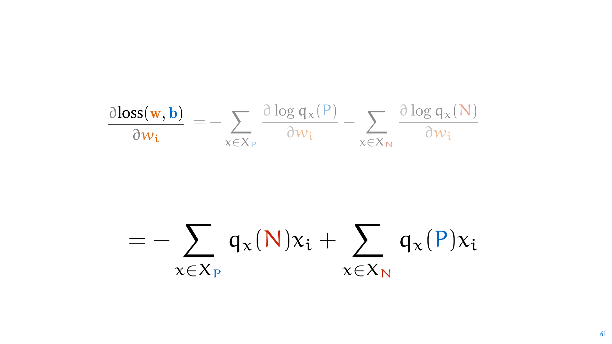

            <figcaption>
            
If we work out the derivative for the other term, we get a predictable result: the same form, but with qx(P) instead of qx(N) and a minus instead of a plus. 
<aside    >If you’re wondering why the sign changes, it’s in the first line, we replace qx(P) by σ(y), but we replace qx(N) by 1- σ(y), so the derivation is slightly more complex. </aside>
So there we have it: the gradient for a linear classifier, fed through a sigmoid function, producing a logarithmic loss. 
<aside    >For the bias b, we get the same result, but without the xi factors. The derivation is the same, except that in the second line of the derivation the third factor is 1 instead of xi.</aside><aside    ></aside>
            </figcaption>
       </section>

       <section id="slide-062">
            <a class="slide-link" href="https://mlvu.github.io/probability#slide-062" title="Link to this slide.">link here</a>
            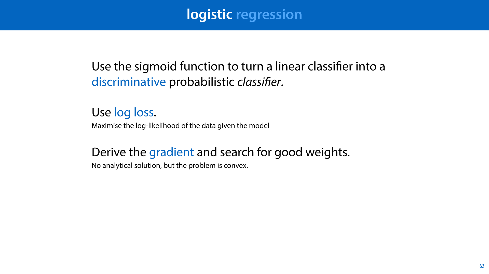

            <figcaption>
            
<em>Regression</em> is a bit of misnomer, since we’re building a classifier. I suppose the confusing terminology comes from the fact that we’re fitting a (curved) line through the probability values in the data. Just one of the many confusing names in the field of machine learning, I'm afraid. 

Anyway, now that we have a gradient, we can apply gradient descent. Let's see the model in action.

            </figcaption>
       </section>

       <section id="slide-063">
            <a class="slide-link" href="https://mlvu.github.io/probability#slide-063" title="Link to this slide.">link here</a>
            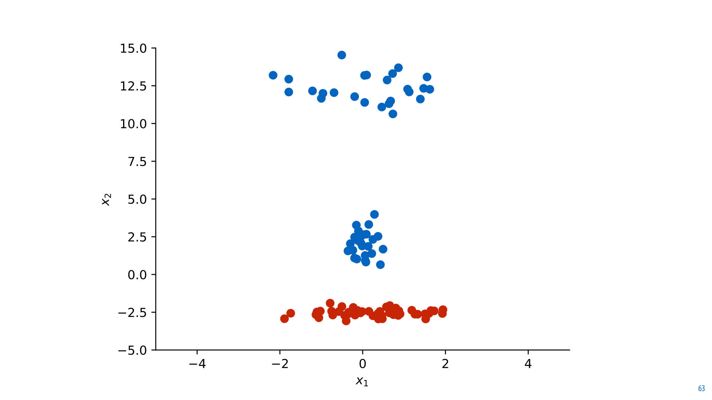

            <figcaption>
            
Here is a 2D dataset that shows a common failure case for the least squares classifier. The points at the top are so far away from the ideal decision boundary that they will have huge residuals under the least squares model, and this is not balanced out by a similar cluster of negative points.

            </figcaption>
       </section>

       <section id="slide-064">
            <a class="slide-link" href="https://mlvu.github.io/probability#slide-064" title="Link to this slide.">link here</a>
            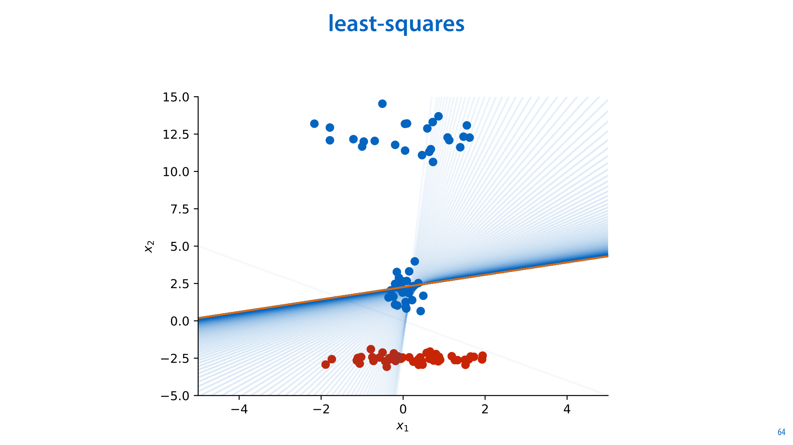

            <figcaption>
            
Here is what the least-squares regression converges to. Clearly, this is not a satisfying solution for such an easily separable dataset. The blue points at the top are so far from the decision boundary.

            </figcaption>
       </section>

       <section id="slide-065">
            <a class="slide-link" href="https://mlvu.github.io/probability#slide-065" title="Link to this slide.">link here</a>
            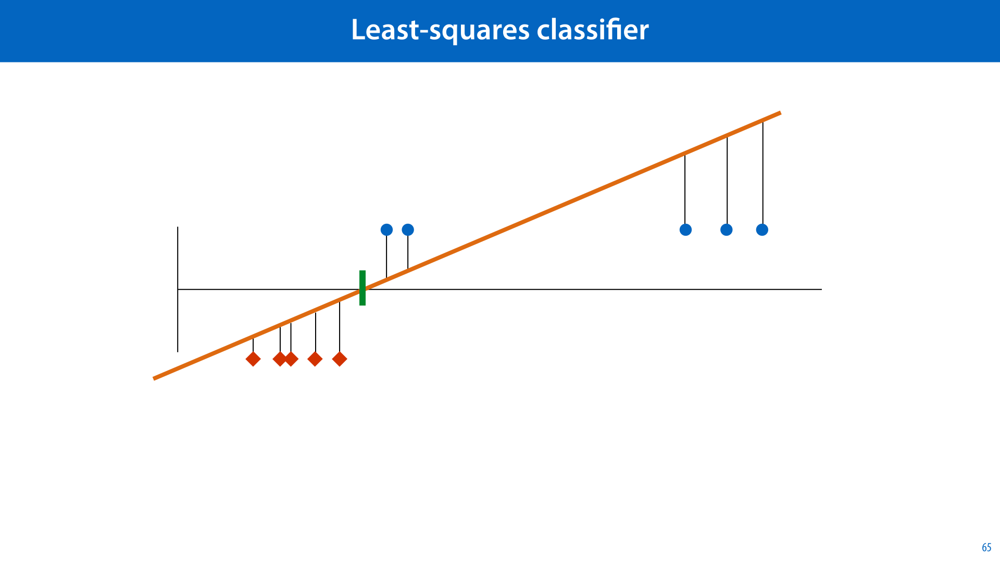

            <figcaption>
            
Here is a 1D view of a similar situation. The green bar is the decision boundary that we want, but any line that crosses the horizontal axis there has really big residuals for the far away points, or really big residuals for all the other points. These pull on the line with a quadratic strength, so the decision boundary will always be pulled toward them.

            </figcaption>
       </section>

       <section id="slide-066" class="anim">
            <a class="slide-link" href="https://mlvu.github.io/probability#slide-066" title="Link to this slide.">link here</a>
            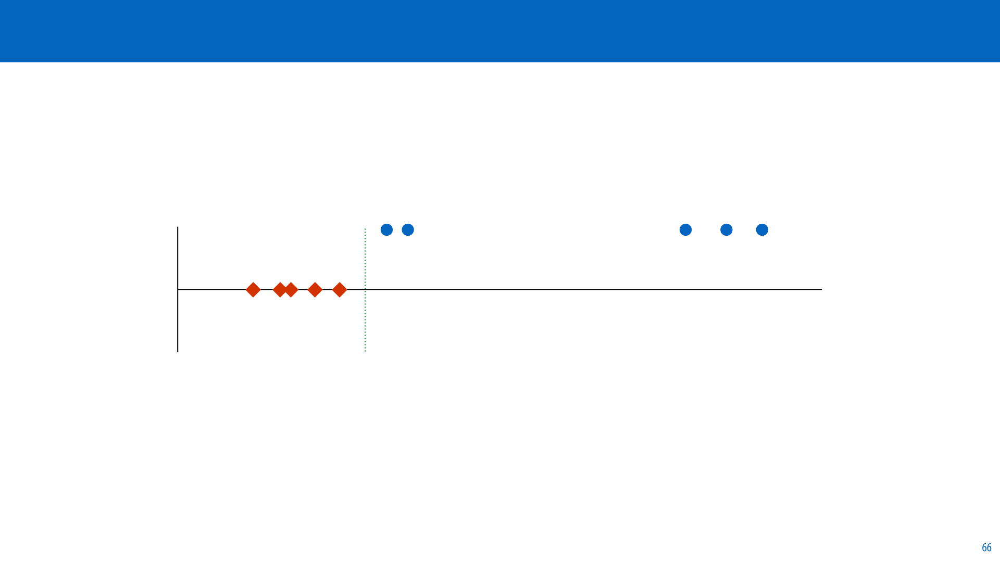

            <figcaption>
            
The logistic model doesn’t have this problem. If the model fits well around the ideal decision boundary, it doesn’t have to worry at all about points that are far away (if they’re on the right side of the boundary). The log loss for these points is very close to -log(1), so very close to 0.

            </figcaption>
            click image for animation
       </section>

       <section id="slide-067">
            <a class="slide-link" href="https://mlvu.github.io/probability#slide-067" title="Link to this slide.">link here</a>
            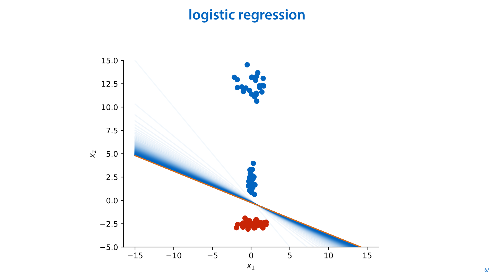

            <figcaption>
            
Here is what the logistic regression chooses as a decision boundary. Unlike the least squares regression, the points are perfectly separated. 

Another thing to note is that while we added some non-linearity to our classifier with the sigmoid function, the <strong>decision boundary</strong> is still linear. This is because the decision boundary is the curve where σ(<strong>w</strong>T<strong>x</strong> + b) = 0.5. The input to the sigmoid that results in an output of 0.5 is 0. 

In other words, we previously put the decision boundary at <strong>w</strong>T<strong>x</strong> + b = 0 and we are still doing the same thing here. What changed was the loss function.

            </figcaption>
       </section>

       <section id="slide-068">
            <a class="slide-link" href="https://mlvu.github.io/probability#slide-068" title="Link to this slide.">link here</a>
            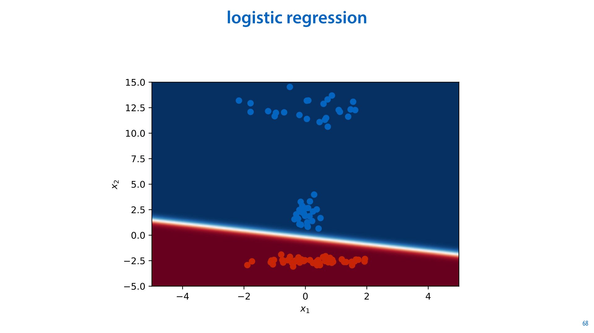

            <figcaption>
            
We can also plot the probability function using a color map (blue is high probability of positive, red is high probability of negative). The white band in the middle is where the probability of positive is near 0.5. That is, in this region, the classifier is <em>uncertain</em>.  

Uncertainty in machine learning is a difficult problem, and models like these that that can express their certainty about a classification are usually much more certain than they should be, so be sure to take this with a grain of salt. Still, it's nice that the model can at least <em>express</em> its uncertainty, even if it may not be doing so accurately. 
<aside    >This plot shows where the non-linearity came in: the probability density function is nonlinear. It looks like the 1D sigmoid function extended in some direction to cover the whole feature space. The place where it’s equal to 0.5 the decision boundary, still makes a line, or in higher dimensions, a hyperplane.</aside><aside    ></aside>
            </figcaption>
       </section>

       <section id="slide-069">
            <a class="slide-link" href="https://mlvu.github.io/probability#slide-069" title="Link to this slide.">link here</a>
            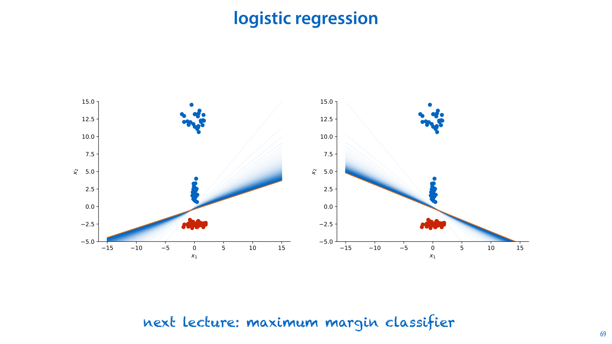

            <figcaption>
            
Note that for such well-separable classes, there are many suitable decision boundaries, and logistic regression has little reason to prefer one over the other (all points are assigned the correct probability very close to 1). We’ll see a solution to this problem next lecture, when we meet our final loss function: the maximum margin loss. 
<aside    >If we want to stick with logistic regression we can solve this problem to some extent by widening the "region of uncertainty" as much as possible, without sacrificing too much of the log loss. One way to achieve this is by adding L2 regularization, which we will learn about in a later lecture.</aside><aside    ></aside>
            </figcaption>
       </section>

       <section id="slide-070">
            <a class="slide-link" href="https://mlvu.github.io/probability#slide-070" title="Link to this slide.">link here</a>
            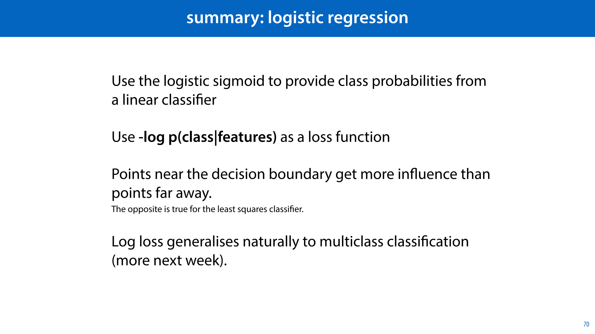

            <figcaption>
            

            </figcaption>
       </section>

        <section class="video" id="video-070">
            <a class="slide-link" href="https://mlvu.github.io/probability#video-70">link here</a>
           <video controls>
                <source src="https://surfdrive.surf.nl/files/index.php/s/b7EKqDsMkGt3SuW/download" type="video/mp4" />

                Download the <a href="https://surfdrive.surf.nl/files/index.php/s/b7EKqDsMkGt3SuW/download">video</a>.
           </video>
        </section>

       <section id="slide-071">
            <a class="slide-link" href="https://mlvu.github.io/probability#slide-071" title="Link to this slide.">link here</a>
            

            <figcaption>
            
The last video was all about defining a probability p(x) and then taking the negative logarithm of that probability. We justified this by saying that the logarithm of the likelihood is easier to work with, and that as a convention we tend to minimize rather than maximize in machine learning  so we took the negative of the log likelihood. All very pragmatic. 

But actually, there is a very concrete meaning to the negative log likelihood of a probability, that can really help to deepen our understanding of what we are doing when we use probabilities in machine learning. To understand this, we need to dig briefly into the topic of <strong>information theory</strong>. This will not just help us understand probability from a new perspective, it will also provide us with the concept of <strong>entropy</strong>, which is an important tool we will use at different points in the course. 

  

            </figcaption>
       </section>

       <section id="slide-072">
            <a class="slide-link" href="https://mlvu.github.io/probability#slide-072" title="Link to this slide.">link here</a>
            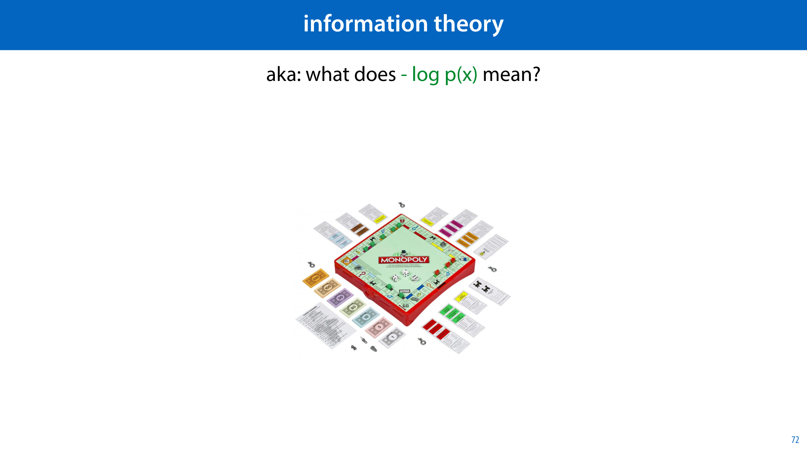

            <figcaption>
            
Imagine you’re on holiday, and you’ve brought your travel monopoly. Unfortunately, the dice have gone missing. You do, however, have a coin with you. Can you use a coin flip to simulate the throw of a six sided  die? 

            </figcaption>
       </section>

       <section id="slide-073">
            <a class="slide-link" href="https://mlvu.github.io/probability#slide-073" title="Link to this slide.">link here</a>
            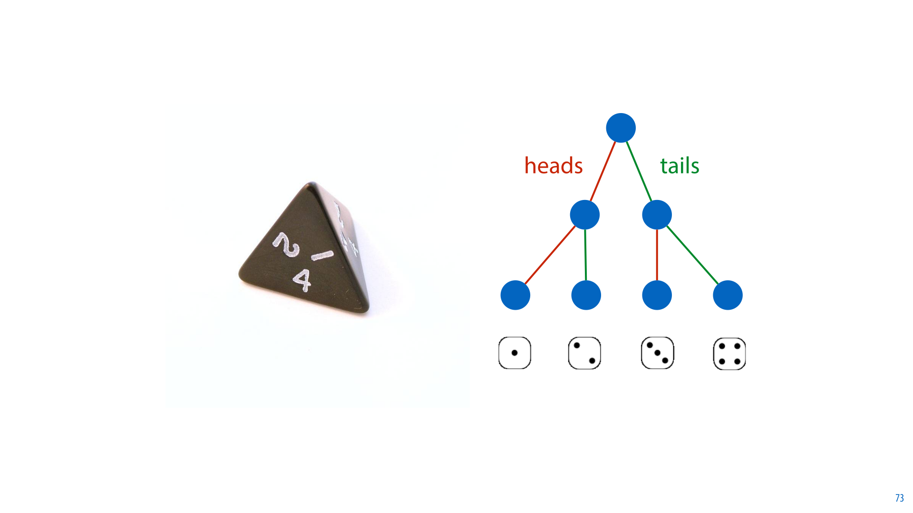

            <figcaption>
            
For a four sided die, the solution is easy. We flip the coin twice, and assign a number to each possible outcome. 

source: <a href="http://www.midlamminiatures.co.uk/blackpolydice/D4Black.html"><strong class="blue">http://www.midlamminiatures.co.uk/blackpolydice/D4Black.html</strong></a>

<a href="http://www.midlamminiatures.co.uk/blackpolydice/D4Black.html"><strong class="blue"></strong></a>

            </figcaption>
       </section>

       <section id="slide-074">
            <a class="slide-link" href="https://mlvu.github.io/probability#slide-074" title="Link to this slide.">link here</a>
            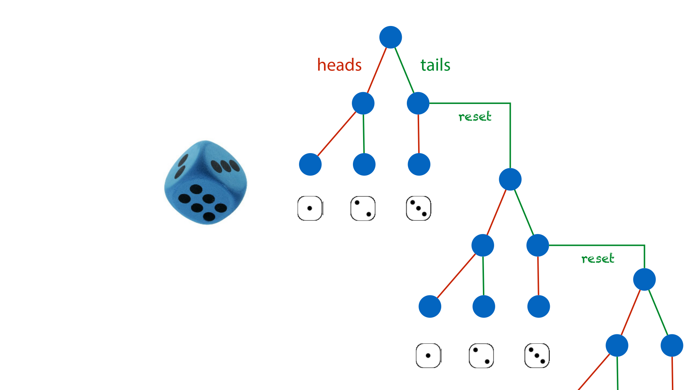

            <figcaption>
            
A six sided die is more tricky. We’ll show the solution for three “sides”. You can just add another coin flip to decide whether to interpret the result as picking between 1,2 and 3 or as picking between 4, 5 and 6. 

The trick is to assign the fourth outcome to a “reset”. If you throw two tails in a row, you just start again. Theoretically you could be coin flipping forever, but the probability of resetting more than five times is already less than one in one-thousand. 

With these kind of resets, it turns out that you can model any probability distribution you like. This will allow you to play your monopoly game. 

The downside is that you have to assign one outcome to multiple leaves in your tree. What if we restrict ourselves to trees where each leaf has a distinct outcome? In that case, we can't model the six-sided die perfectly with coin flips. What distributions can we still model?

            </figcaption>
       </section>

       <section id="slide-075">
            <a class="slide-link" href="https://mlvu.github.io/probability#slide-075" title="Link to this slide.">link here</a>
            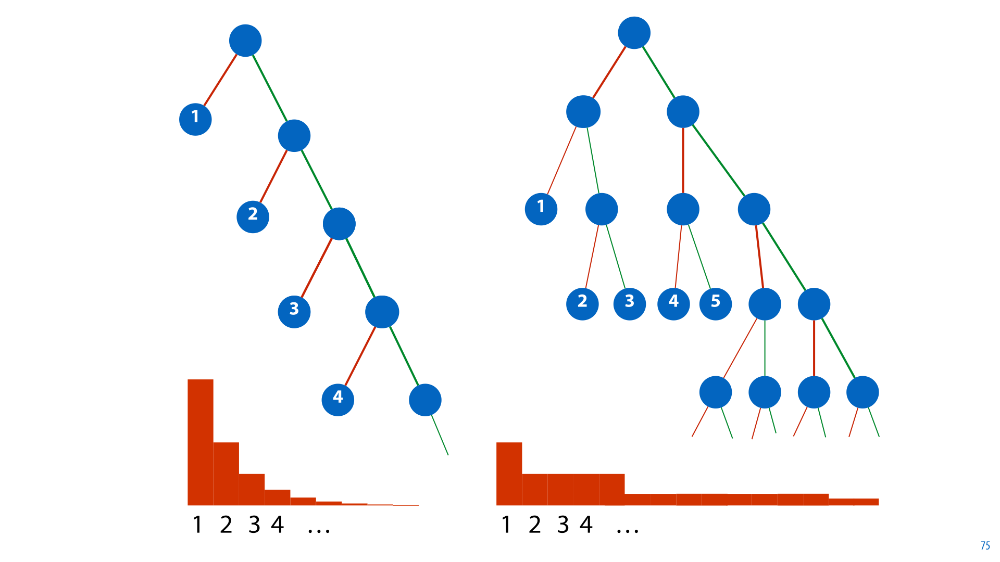

            <figcaption>
            
Here are two distributions on the natural numbers that we can model this way. One with an exponentially decaying tail, and one with a fatter tail.  

Note that both trees are infinite in size. This we don't mind. The only constraint we care about is that each leaf node has a unique label.

            </figcaption>
       </section>

       <section id="slide-076">
            <a class="slide-link" href="https://mlvu.github.io/probability#slide-076" title="Link to this slide.">link here</a>
            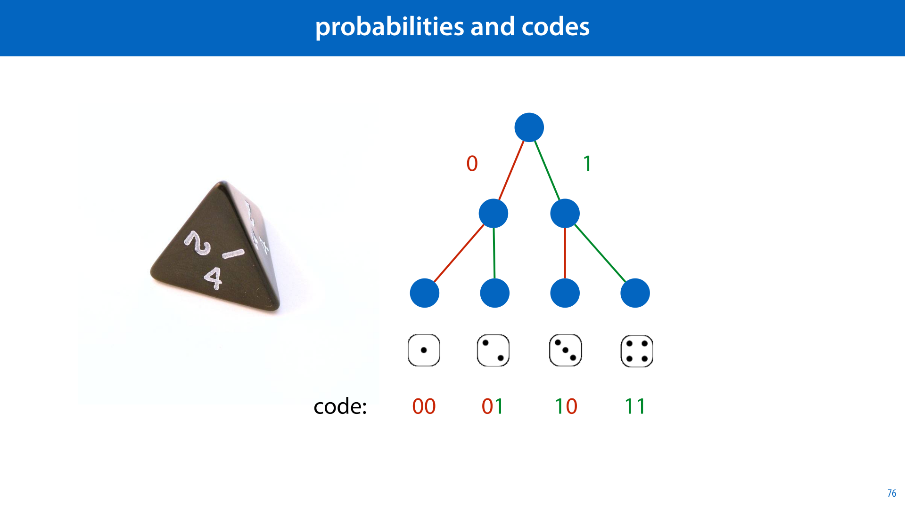

            <figcaption>
            
In probability distributions expressed like this, it's really simple to see the relation between probabilities and <strong>codes</strong>. Functions that assign a binary string to each of our outcomes. 

We simply replace the heads and tails by zeros and ones and describe each outcome by the sequence of steps required to get from the root of the tree to that particular outcome. 

Codes are used to transmit information. If we roll a die and we want to tell somebody that we rolled a 3, we can send them the code 10.

            </figcaption>
       </section>

       <section id="slide-077" class="anim">
            <a class="slide-link" href="https://mlvu.github.io/probability#slide-077" title="Link to this slide.">link here</a>
            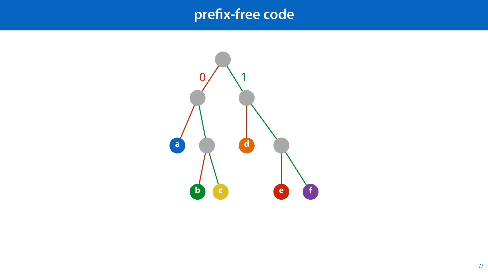

            <figcaption>
            
These kinds of trees are called<strong> prefix-free trees</strong>, and the resulting codes <strong>prefix-free codes</strong>. The name comes from the fact that no codeword will be the prefix of any other code word. That is, the first bits of one code will never be a codeword by themselves. 

The nice thing about prefix free codes is that if we want to encode a sequence of these outcomes, we can just stick the codes one after another and we won’t need any delimiters. A decoder that has access to the tree will know exactly where each codeword ends and the next begins.

            </figcaption>
            click image for animation
       </section>

       <section id="slide-078" class="anim">
            <a class="slide-link" href="https://mlvu.github.io/probability#slide-078" title="Link to this slide.">link here</a>
            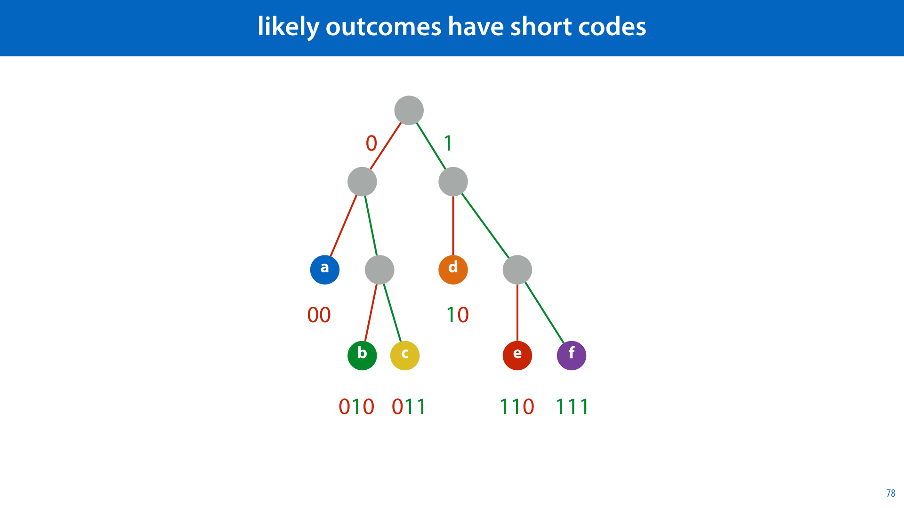

            <figcaption>
            
Another, more relevant, nice property is that there is a direct relation between the length of the code we assign an outcome, and its probability: <strong>the more coinflips we require to get to a particular outcome, the lower the probability that we will get there, and the longer the code. </strong>Low probability outcomes get long codes and high probability outcomes get short codes.<strong> </strong>

In this tree here, if we generate outcomes by flipping coins randomly, the probability of getting a is the probability of flipping heads twice in a row: 1/4. The probability of getting b is the probability of flipping heads, then tails, then heads: 1/8.  

This is expressed in the lengths of the codes for a and b. b has a longer codelength and is therefore less likely. 

If the probabilities from this tree match the probabilities with which we expect to see the outcomes, then this is a very nice property for a code to have: when frequent outcomes have short codes, we end up with shorter messages overall. 

This was realized as early as the invention of Morse code. Samuel Morse explicitly assigned short codewords to letters like e and t, because he knew that they would occur frequently, so that the telegraph messages would be shorter. 
<aside    >Information theory didn't exist yet, so his codelengths were a little ad-hoc. He also didn't know about prefix-free codes, so Morse code does have a delimiter symbol.<strong> </strong></aside>
<strong> </strong>

<strong></strong>

            </figcaption>
            click image for animation
       </section>

       <section id="slide-079" class="anim">
            <a class="slide-link" href="https://mlvu.github.io/probability#slide-079" title="Link to this slide.">link here</a>
            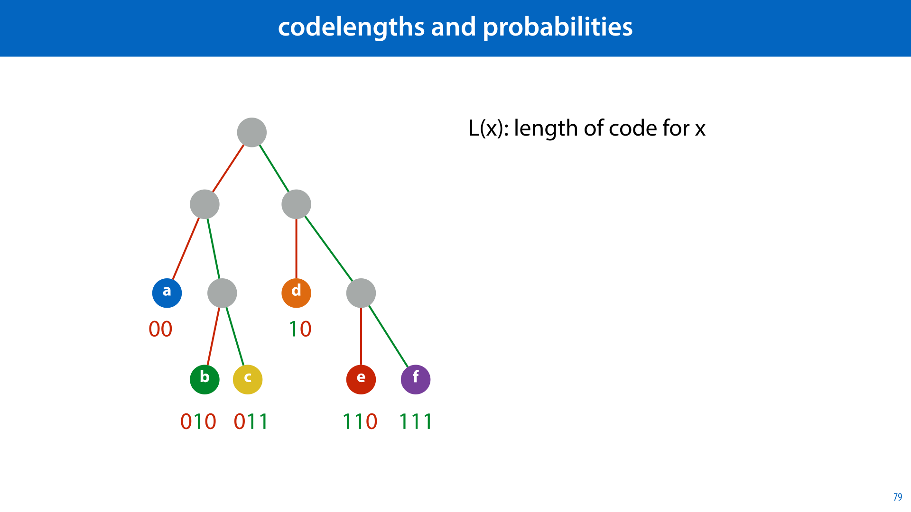

            <figcaption>
            
Let's make all this a little more precise. Let's start with an arbitrary tree, and assume that we sample from it by flipping a coin to decide our path from the root to the leaves. What probability distribution does this define? This is very simple: each coinflip multiplies the probability by 1/2, so if the length of the code for outcome b is 3, then the outcome b has probability (1/2)3 = 1/8. 

In general the probability for an outcome x with a code of length L(x) is p(x) = 2-L(x). 

With this equation in place, we can reverse the question. If we are given a probability distribution p(x), and we are assured that there is some prefix-free tree corresponding to it, what can we say about the codelengths that this probability tree describes? Rewriting the equation to isolate L(x), we get L(x) = -log2p(x) 

There it is! The negative logarithm of a probability. If we have a probability distribution that can be expressed by a prefix-free tree, the negative logarithm of its probabilities has a very concrete meaning: <strong>it's the codelengths of the outcomes under the corresponding codes</strong>. 
<aside    >The base 2 of the logarithm is a consequence of using bits to encode our data. If we used trits (0, 1, 2) we'd get a base-3 logarithm and if we used digits, we'd get a base-10 logarithm. You can even go the other way around and start with the natural logarithm, which will give you a unit for amount of information called "nats". These are a little more abstract; I can't imagine what a codeword written in nats looks like, but it still works to quantify the amount of information in the outcome of a sample from a probability distribution. </aside><aside    ></aside>
            </figcaption>
            click image for animation
       </section>

       <section id="slide-080">
            <a class="slide-link" href="https://mlvu.github.io/probability#slide-080" title="Link to this slide.">link here</a>
            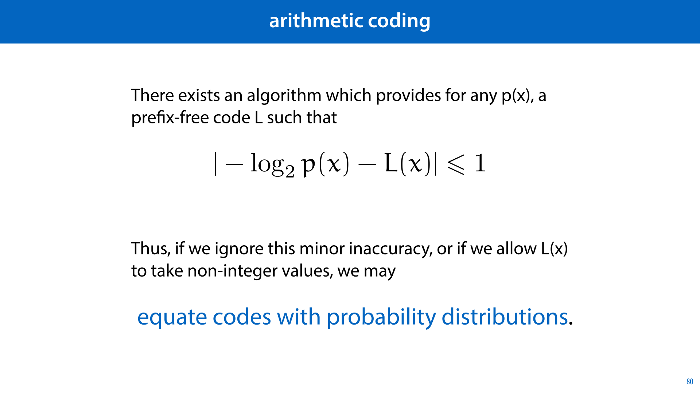

            <figcaption>
            
The only drawback with this view is that we are restricted to probability distributions that we can model as prefix-free codes with unique labels on the leaves. If we investigate closer, it turns out that this is not as much of a restriction as we may fear. We can show that for any probability distribution L we can find a prefix-free code so that the value -log p(x) and the code-length L(x) differ by no more than one bit for any outcome x. 

If we handwave this small difference, we can<strong> equate codes with probability distributions</strong>: every code gives us a distribution and every distribution gives us a code. And all of these codes have the nice property that the higher the probability of an outcome is, the shorter its codelength.

            </figcaption>
       </section>

       <section id="slide-081" class="anim">
            <a class="slide-link" href="https://mlvu.github.io/probability#slide-081" title="Link to this slide.">link here</a>
            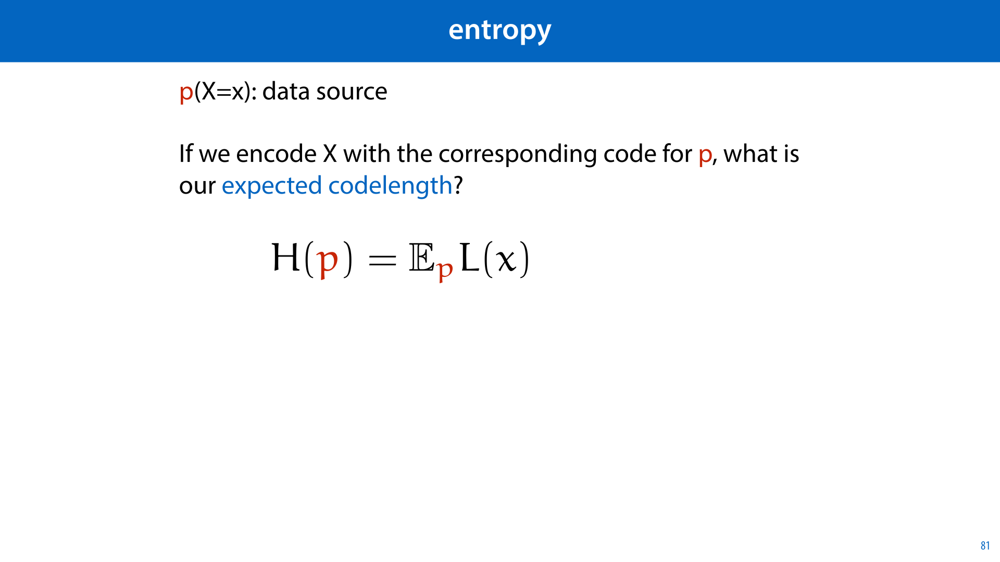

            <figcaption>
            
We already noted that this is a nice property for a code to have, because it reduces the amount of bits we can expect to use. How much does it reduce it? If we know the things we are going to encode come from distribution x, then can we say something about whether using the corresponding code is in some sense the optimal choice? 

The simplest way to answer this question is to compute<strong> the expected number of bits we will have to use per outcome</strong>. This is simply the codelength of each outcome, multiplied by its probability, summed over all outcomes. This quantity is called the <strong>entropy</strong>.  

The entropy of a distribution is the expected codelength of an element sampled from that distribution.

            </figcaption>
            click image for animation
       </section>

       <section id="slide-082" class="anim">
            <a class="slide-link" href="https://mlvu.github.io/probability#slide-082" title="Link to this slide.">link here</a>
            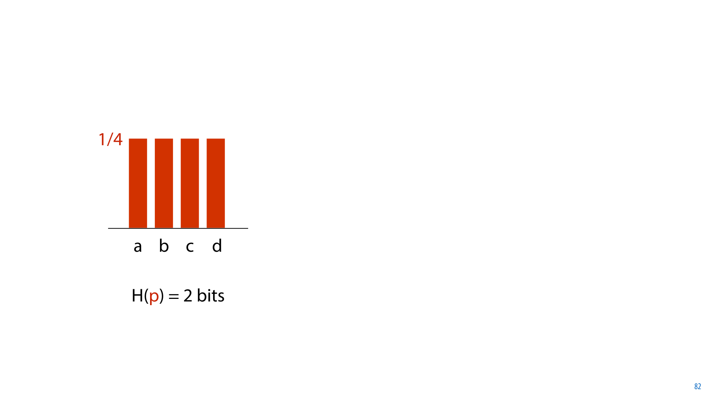

            <figcaption>
            
The entropy of a distribution is a very commonly used function, because it expresses in a single number how much<strong> uncertainty </strong>we have over the outcome. Or in other words, how uniformly spread out the probability mass is among the outcomes. 

The more uniform our distribution is, the less we know about what will happen, and the higher the entropy.  

On the left we see a perfectly uniform distribution. Each outcome has equal probability 1/4, so each outcome gets a 2-bit codewords, and the expected codelength is 2. 

In the middle, we know something more about our distribution, for instance that a is very likely, so we can make the codeword for "a" a little shorter, reducing the expected codelength to 1.75 bits.  

On the right, we see the extreme case of perfect knowledge. We are certain that outcome "a" will happen every time. We can label the root of our tree with "a". This is like having a single "empty" codeword with a length of 0 bits. More practically, if I had to sample an outcome from this distribution and send you a message saying what had happened, the best option would be no message at all: we both know the distribution, so I don't need to tell you what happened. 

This last example requires the assumption that we assume 0 · log(0) = 0. This is not always true, but it’s an assumption we make when we compute entropies, since it leads to the most intuitive results.

            </figcaption>
            click image for animation
       </section>

       <section id="slide-083" class="anim">
            <a class="slide-link" href="https://mlvu.github.io/probability#slide-083" title="Link to this slide.">link here</a>
            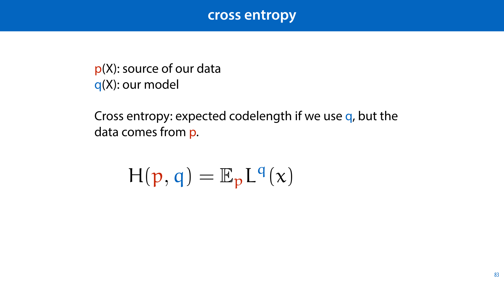

            <figcaption>
            
What if we don’t use the code that corresponds to the source of our data p to encode our data, but some other code based on distribution q. What is our expected codelength then? This is called the<em> </em><strong>cross entropy</strong>. 

It can be shown that the cross entropy is minimal when p=q. That is, when the cross entropy corresponds to the entropy. 

We can conclude two things: 

The code corresponding to p provides the best expected codelength out of all possible prefix-free codes. 

The cross entropy is a good way to <strong>quantify the distance between two distributions</strong> (because it’s minimal when the two are the same). 
<aside    >The proof that the cross entropy is always bigger than the entropy is too complicated for now. If you’re up for a challenge and you know about Lagrange multipliers (explained in the optional SVM lecture), you can apply these to the problem of minimizing the cross entropy for vector <strong class="blue">q</strong>, subject to the constraints that the elements of <strong class="blue">q</strong> are positive and sum to 1.</aside><aside    ></aside>
            </figcaption>
            click image for animation
       </section>

       <section id="slide-084">
            <a class="slide-link" href="https://mlvu.github.io/probability#slide-084" title="Link to this slide.">link here</a>
            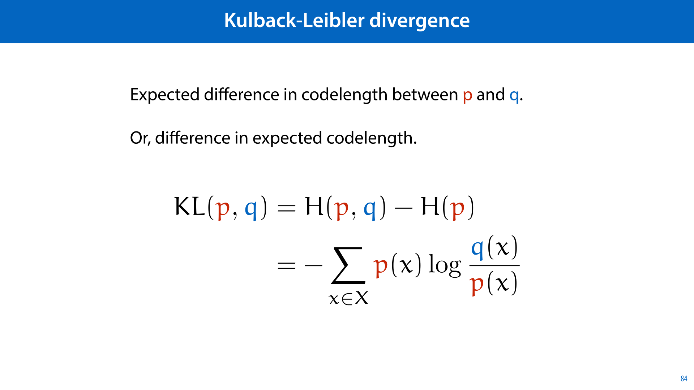

            <figcaption>
            
The cross-entropy is a nice measure, but it’s not zero when p and q are equal. Instead, it’s equal to the entropy of p. 

To get a measure that is zero when the two are equal, and larger than zero otherwise, we can just subtract the the entropy of p. This is called the Kullback-Leibler (KL) divergence. The KL divergence between two distributions is zero if and only if they are equal.  

You can think of this a little bit like the "distance" between two distributions, although unlike a distance, it's not symmetric.

            </figcaption>
       </section>

       <section id="slide-085">
            <a class="slide-link" href="https://mlvu.github.io/probability#slide-085" title="Link to this slide.">link here</a>
            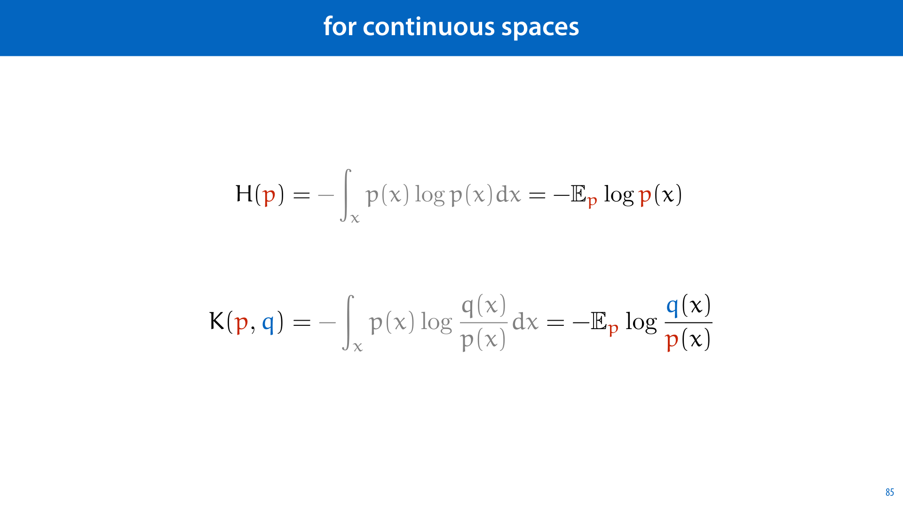

            <figcaption>
            
For probability distributions on continuous spaces, we can also define entropy, known as the<strong> differential entropy</strong>, and KL divergence. We lose the interpretation of prefix-free codes, and there are some technical hurdles here, but the long and short of it is that we replace the summation by an integration. 

To avoid this complexity, in the rest of the course we will often write the entropy and the KL divergence using the expectation notation. This automatically implies that we are summing for discrete sample spaces and integrating for continuous ones, and if we know the basic properties of the expectation (see homework 1), then we'll never need to open the expectation operator up anyway.

            </figcaption>
       </section>

       <section id="slide-086" class="anim">
            <a class="slide-link" href="https://mlvu.github.io/probability#slide-086" title="Link to this slide.">link here</a>
            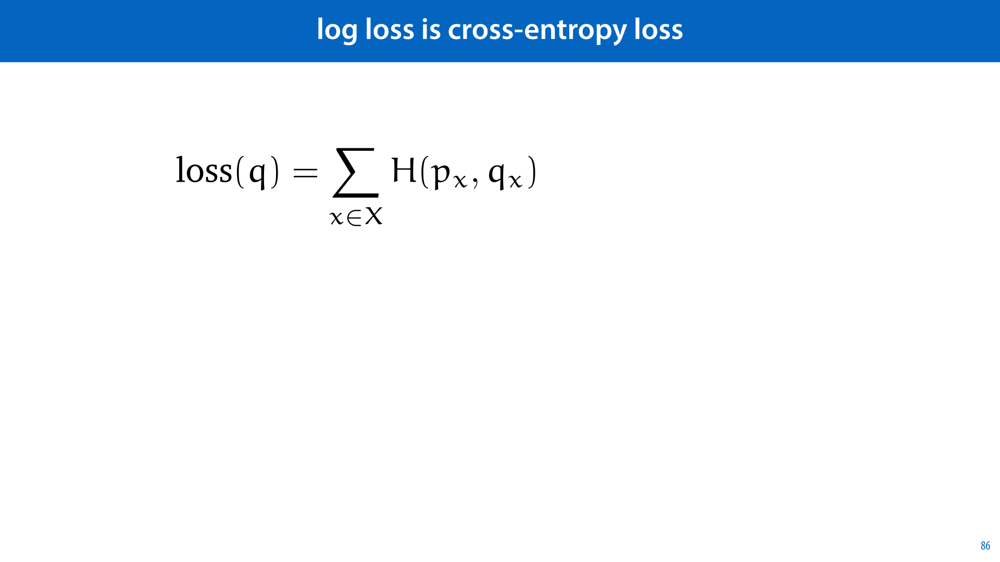

            <figcaption>
            
Now that we have our interpretation of -log(x) as a codelength, let's see what it says about the places where we've used it.  

One such place was the log loss. One interpretation we now have is that if we minmize -qx(P) in logistic regression, we are minimizing the amount of bits we would need to transmit to communicate that x is of the positive class, if we assume that both the sender and receiver have access to the classifier and x, but not to the class label (more about this in a bit). 

Another interpretation comes from the fact that we characterized the cross entropy/KL divergence as the "distance" between two probability distributions. What if we see the labels in the dataset as one probability distribution p (with all probabilities 0 or 1), and the classifier as another distribution q? What happens if we explicitly try to minimize the cross entropy between p and q by changing the parameters of q? 

As you can see, with a little rewriting, we recover the logarithmic loss we already derived. For this reason <strong>log-loss is also known as cross-entropy loss</strong>. This is not just a mathematical curiosity, it can actually be useful. There may be cases, where the data provides class probabilities rather than explicit class labels. In such cases, the cross entropy view tells us exactly what to do, but the log-loss perspective becomes useless. 
<aside    >We can also do this with the KL divergence instead of the cross-entropy. In that case, we get a constant term - log p(x), which is independent of the parameters of q. This usually doesn't affect the gradient, but in some cases it does.</aside><aside    ></aside>
            </figcaption>
            click image for animation
       </section>

       <section id="slide-087">
            <a class="slide-link" href="https://mlvu.github.io/probability#slide-087" title="Link to this slide.">link here</a>
            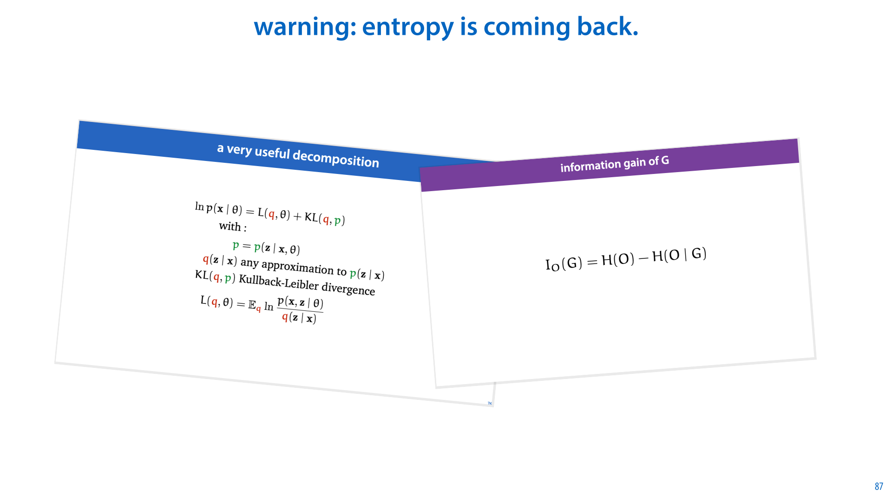

            <figcaption>
            
Just a little heads up: entropy is an important subject. It may feel a little abstract now, and it's fine if you don't quite get it, but we will see it in use a number of times throughout the course.  

We will practice it in the homework exercises, so you'll get another chance to get comfortable with it.

            </figcaption>
       </section>

       <section id="slide-088">
            <a class="slide-link" href="https://mlvu.github.io/probability#slide-088" title="Link to this slide.">link here</a>
            

            <figcaption>
            
We'll finish up with a brief look at the field that aims to apply this coding perspective to problems of learning more rigorously. The family of methods based on the principle of <strong>Minimum Description Length</strong>. 

The idea is very simple: compression is similar to learning. We look at some data and try to isolate recurring patterns in the data. Using the ideas of coding and entropy, we can make this idea rigorous.

            </figcaption>
       </section>

       <section id="slide-089">
            <a class="slide-link" href="https://mlvu.github.io/probability#slide-089" title="Link to this slide.">link here</a>
            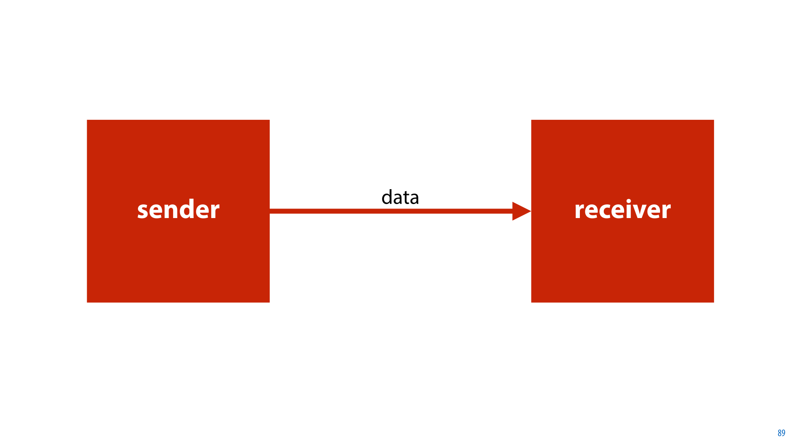

            <figcaption>
            
The simplest way to think of MDL is in a <strong>sender and receiver framework</strong>. The sender is going to see some data, and is going to send it to the receiver. Before observing the data, the sender and receiver are allowed to come up with any scheme they like. But afterwards, the data must be sent using the scheme, and in a way that is perfectly decodable by the receiver without further communication.  

One way this is often done is called <strong>two-part coding</strong>:<strong>  </strong>

The sender and receiver agree beforehand on a family of models (for example the normal distributions, as indexed by parameters μ and σ) 

Then, once the sender has seen the data, she picks a model best suited to the data, and sends this choice of model to the receiver (fopr instance by sending the μ and σ for the chosen model).  

Next, the sender uses the model to encode the data and sends it over 

The receiver unpacks the model and then uses the model to decode the data. 

This allows us to frame the problem of model selection using the MDL principle. The best choice of model is the one that minimizes the size of the total package: the cost of communicating the model plus the cost of communicating the data given the model. If the model is very good at compressing the data, then it might be a very good choice, unless the model is so complex that the cost of sending the model over negates the gains made on communicating the data.

            </figcaption>
       </section>

       <section id="slide-090" class="anim">
            <a class="slide-link" href="https://mlvu.github.io/probability#slide-090" title="Link to this slide.">link here</a>
            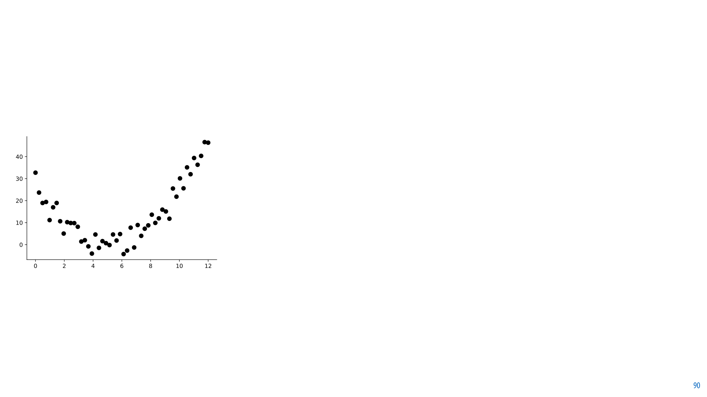

            <figcaption>
            
This idea is often used to solve the problem of over- and underfitting. Without going into the technical details, here is the basic principle of two-part coding applied to a regression problem.  

In a regression (or classification) problems, we take the instances and their features as fixed: both the sender and receiver have access to them. The data that we want to send over the wire is the <em>target labels</em>; in this case the regression targets. How you encode a continuous value is a technical matter that requires some assumptions. For now we can just discretize the range of outputs, and assume that we are using a code that means that <strong>bigger numbers cost more bits</strong>. The same goes for the parameters of the model: these are also continuous values, but we’ll discretize them somehow. Here we only need to assume that using <strong>more parameters in your model takes more bits</strong>. 

Once we’ve chosen a model we can reconstruct the data by sending the model parameters and the residual values. We see that if we pick a linear model we have many large residuals to transmit. On the other hand, our model is described by only two parameters, so we can transmit that part very cheaply. If we make our model a parabola, we require three numbers to transmit it, so that part of  our message gets bigger, but because the model fits so much better, the residuals are much smaller, and the overall length of our message gets much smaller. 

If we make our model a 15-th order polynomial, we get a slightly tighter fit, but not by much, and the price we pay in storing the 16 numbers required to describe our model means that our total message length is bigger than for the parabola. So overall we prefer the model in  the middle, according to the minimum description length principle. 

            </figcaption>
            click image for animation
       </section>

       <section id="slide-091" class="anim">
            <a class="slide-link" href="https://mlvu.github.io/probability#slide-091" title="Link to this slide.">link here</a>
            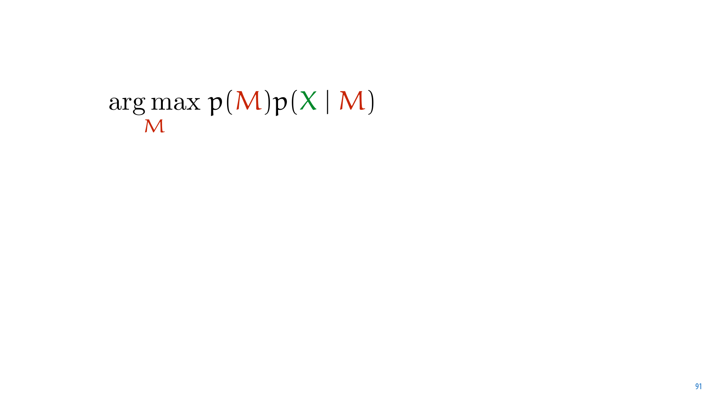

            <figcaption>
            
There are many correspondences between using MDL and using Bayesian methods. In fact they are often different perspectives on the same thing. 

Here is one example. Let's say we are picking a single model M that maximizes the posterior probability  of the data (this requires us to maximize only the numerator of Bayes rule, since the denominator is constant). 
<aside    >A full Bayesian analysis would compute the entire posterior distribution, but sometimes we are only interested in its maximum. </aside>
As we've seen before, we can stick a logarithm in front of any probability without changing the maximum, and we can add a minus to change the maximum into a minimum. 

Then, using the basic properties of the logarithm, we find that we are minimizing the sum of two code-lengths: the cost of describing the model, and the cost of describing the data once the model is known. This is exactly what we do in two-part coding.

            </figcaption>
            click image for animation
       </section>

       <section id="slide-092">
            <a class="slide-link" href="https://mlvu.github.io/probability#slide-092" title="Link to this slide.">link here</a>
            

            <figcaption>
            
When we talked about the problem of induction and the no free lunch theorem, we noted that <em>some assumption</em> about the source of our data was always necessary to make learning possible at all. Some aspects of our problem we need to assume before we start learning. 

You can think of MDL as <strong>encoding a simplicity assumption</strong>. We prefer simple solutions over complex ones, <strong>and we define a simple solution as one that compresses the data well</strong>. The assumption we make about the universe, is that it generates compressible data for us. Or, more precisely, that the compressible aspects of the data that we see are likely to carry over to the test set, and that the incompressible aspects of the data are likely random noise. 

The nice thing about MDL is that it tells us how to trade off the desire to fit the data well with the desire for a simple solution.

            </figcaption>
       </section>

       <section id="slide-093">
            <a class="slide-link" href="https://mlvu.github.io/probability#slide-093" title="Link to this slide.">link here</a>
            

            <figcaption>
            
source: <a href="https://xkcd.com/1236/"><strong class="blue">https://xkcd.com/1236/</strong></a>

<a href="https://xkcd.com/1236/"><strong class="blue"></strong></a>

            </figcaption>
       </section>

</article>
