<nav class="menu">
    <ul>
        <li class="home"><a href="/">Home</a></li>
        <li class="name">Social impact dossier</li>
                <li><a href="#slide-001">Why and how</a></li>
                <li><a href="#video-007">1: Xinjiang, COMPAS and Gender classification</a></li>
                <li><a href="#video-019">2: Physiognomy and sexuality</a></li>
                <li><a href="#video-026">3: Profiling</a></li>
                <li><a href="#video-032">4: Intelligent infrastructure</a></li>
        <li class="pdf"><a href="https://mlvu.github.io/lectures/social-impact-dossier.pdf">PDF</a></li>
    </ul>
</nav>

<article class="slides">

       <section id="slide-001">
            <a class="slide-link" href="https://mlvu.github.io/social-impact#slide-001" title="Link to this slide.">link here</a>
            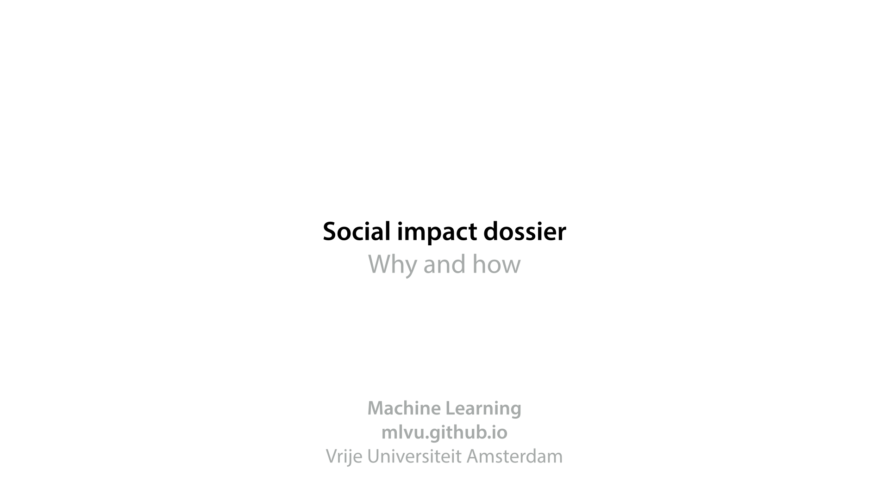

            <figcaption>
            
 

On this page, we will gather all the relevant details and evidence for various topics discussed during the social impact videos. 

If you're happy with the level of detail in the videos, you can ignore this page entirely. However, if you disagree with anything that was said, were upset by it, or are just interested to learn more, this will be a good place to get more background on what we've talked about, and why. 

In short, this page has three main purposes: 

To provide more information and background for people interested in the social impact discussion. 

To provide evidence and justification for some of the more controversial claims made in the lectures, when putting that justification in the lectures themselves would derail the narrative too much. 

To help you develop a degree of<strong> media literacy</strong> in these matters. We often find that when we provide sparse references, people misread them, or misinterpret what they mean. Moreover, people will counter with references such as youtube videos about unrelated matters, or articles from unreliable sources. Making a strong point coherently requires reading sources for what they are, and choosing convincing sources for your own arguments. Here we'll take the time to go through the evidence step by step, and to show you how to read different sources dispassionately, and which aspects to treat as evidence and which to dismiss.  
<aside    >As I've said repeatedly, I don't expect you to agree with me on all issues. What I do expect however, is that when you disagree with me to the extent that you reach out, you are able to build a coherent argument. You are a university student, so we expect a certain level of critical thinking, reading and writing ability and media literacy. This dossier will hopefully give you a sense of how we expect that sort of thing to be done. </aside>
This is meant to be a living document, so if you find anything in the slides that you would like to see discussed in greater detail, or if you think there's a position that is unfairly reflected, <a href="mailto:mlvu@peterbloem.nl?subject=social%20impact:%20..."><strong>please get in touch</strong></a>. 

            </figcaption>
       </section>

       <section id="slide-002">
            <a class="slide-link" href="https://mlvu.github.io/social-impact#slide-002" title="Link to this slide.">link here</a>
            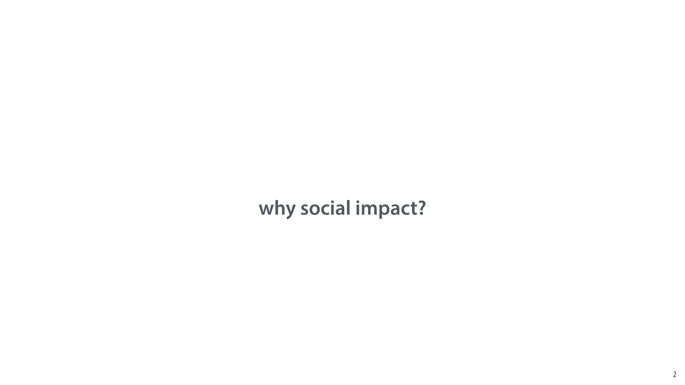

            <figcaption>
            
Before we get to the details, we'll set some ground rules, and basic policies. How do we choose what to include in these parts of the lectures, and how do we substantiate the claims we make? 

To start with, allow me to write a few personal words on why I think it's important to include these topics in a lecture series like this. These videos are the most controversial part of the lecture. I get a lot of support for including them, but also a lot of vehement pushback, including the question why I don't just stick to machine learning. 

My answer simple: When using a technology comes with consequences, teaching that technology should include teaching those consequences.  

Physics or chemistry teaches many principles that can be used to make weapons. If the teacher is a strict pacifist, they may believe that doing so is a bad thing. This is their opinion, and it has no place in their lectures. Each student should be able to decide for themselves what to use their knowledge for. However, to make an informed choice, the student should have a detailed understanding of exactly what the consequences of that choice are. Here, the teacher<em> does</em> have a responsibility. They should discuss what kind of weapons can be made, which are currently being made, and how they are being used. This is not to tell the students what decision to make, but to help them understand how their decisions impact people: to help them understand<strong> what they may be responsible for</strong>. 

The technologies we discuss in this course can be used to do harm. They can be used to make a variety of weapons, but also things that sound at first much more innocuous. Building a simple predictor for welfare fraud may seem like a beneficial technology, but through various quite subtle mechanisms, such a predictor can end up producing profoundly harmful effects. It's the subtlety of these problems that requires us to delve into these areas so closely: at first sight, the idea is almost always harmless. It takes a little background and insight to see the problems. 

Many of you will become programmers. You are the ones who will be asked to build these systems. You are also the only ones who have all the knowledge to understand the potential harm. When push comes to shove, not only do you need to be able to tell people that these problems exist, you need to be able to explain to them what the problem is. 

 

            </figcaption>
       </section>

       <section id="slide-003">
            <a class="slide-link" href="https://mlvu.github.io/social-impact#slide-003" title="Link to this slide.">link here</a>
            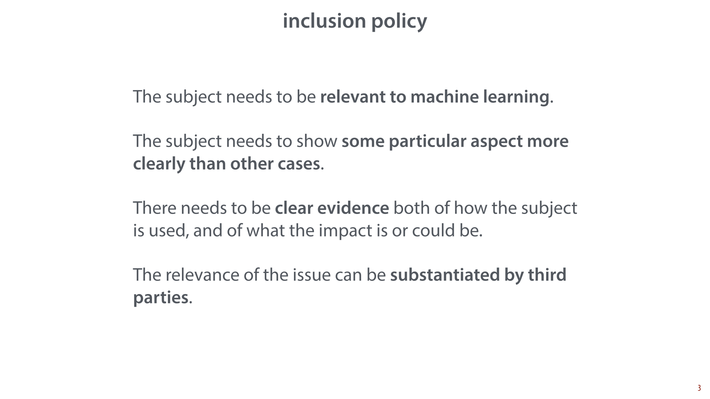

            <figcaption>
            
Let's discuss when and why we decide to include a topic. 

Clearly, the topic needs to be relevant to machine learning. There may be many topics we feel strongly about, but if they are not relevant to the business of machine learning, they don't belong in a machine learning lecture. Sometimes we need to sketch a larger context, which is not related to machine learning, but within which machine learning plays a small role. In such cases, there should be a clear, <strong>unique</strong> aspect to the ML part of the case that justifies straying so far from our subject area. 

In all cases, we strive to choose subjects that highlight a particular aspect more clearly than any other, similar case. Part of this is often the depth or the extent of the harmful effect, but it also includes particular subtleties such as the difference between intentional and unintentional ethnicity classification, or the specific motivations one might have for building a sexuality classifier. 
<aside    >When two cases are equally suitable, we will tend to prefer the one that is "closer to home". Here, since the VU is in Amsterdam,  the western world counts as closer than the non-western, and the Netherlands is closer than the rest of the western world. The closer to the Netherlands, the better we understand the cultural context, and there is much to be said for judging yourself before you judge others. </aside>
Third, we require a strong burden of evidence. It may well be that a terrible harm is being done somewhere, but there simply isn't enough evidence to properly substantiate it. In such cases, more investigation is usually called for, and the matter cannot be overlooked, but for us the burden of proof is greater than that of your average news service. In a course with this many students we should stay away from controversial subjects that are too clouded in uncertainty. 

Finally, the choice of what is relevant can't just be left to one person. Such a choice is always subjective, but when challenged, we should be able to show that there is at least a good number of experts on the record stating that these are topics relevant to the field, and ideally worth discussing in lecture rooms. This does not <em>at all</em> guarantee any kind of objectivity or truth. It just guards against an arbitrary inclusion of subjects. 
<aside    >This last point is a moveable feast. Developments in AI move incredibly quickly and university course material is very labor-intensive to update. This means that overall, what is taught in universities is often a little behind the times. If we only look to what other university courses are doing, we will only reinforce this problem. Instead, we look to what is happening in the community and try to take that as a guide to our choice of subjects (both the social impact stuff and the technical material). This means that we often teach subjects that you won't see  in other courses. We'll do our best to show that the material is relevant in other ways, but if you think we've arbitrarily included something, we may not have the strongest possible defence. </aside><aside    ></aside>
            </figcaption>
       </section>

       <section id="slide-004">
            <a class="slide-link" href="https://mlvu.github.io/social-impact#slide-004" title="Link to this slide.">link here</a>
            

            <figcaption>
            
Next, let's look at how we <strong>establish fact</strong>. In science and math, a single line of evidence is usually usually enough to establish something as true. We can have one carefully designed experiment, or one detailed proof, and the matter is settled. In social matters, things are never so clear-cut. There are always different voices, from many different parties and almost every voice comes with its own biases and backgrounds. 

That means that evidence gathering becomes a more messy business. For each kind of evidence, let's see what caveats there are, and how we should interpret it. 

Types of evidence 

Direct evidence. This is simply direct evidence of a fact. It could include videos or photographs, or satellite imagery. While this type of evidence often seems the strongest, and least easy to dismiss, there are things to be aware of. Consider, for instance, using a single video of a violent police arrest to establish police brutality. The video by itself may be incontrovertible, but in the strictest sense, it is only evidence of <em>one instance </em>of police brutality. This is called <em>anecdotal evidence</em>. To establish a <em>pattern</em> of police brutality, we would need multiple such videos, and we would make a stronger case by adding different forms of evidence like primary data, and eyewitness accounts. 
<aside    >This is a fictional example, I'm not referencing any specific country here. In many countries police brutality is rife, and plenty of evidence exists. </aside>
Eyewitness accounts. One subtle form of direct evidence is the accounts of eyewitnesses. Those who have seen or experienced the subject in question. Great care is needed in such cases. The witnesses themselves may be unreliable, have ulterior motives, and even if they are reliable, their evidence may still only be anecdotal. See the next slide for a failure case. In general a witness who is non-anonymous opens themselves up to greater scrutiny, so can be considered more reliable than an anonymous witness (although witnesses often have good reason to remain anonymous). Also,if a witness report appears in a reputable news source, we can be sure that every effort has been made to check the facts of the story. This isn't always possible for every claim, but journalists take great pains to check all elements of a story that can be checked. 

Primary data. This refers to statistics from a source that can be trusted to provide reliable and complete data. For instance, in the third social impact video, we look at arrest rates for drug crimes by race. Here, we use the 2013 National Survey on Drug Use and Health [1], a large study commissioned by the U.S. Department of Health &amp; Human Services. It is not impossible that such studies misrepresent the situation. A government institution may be under pressure to provide a better picture of reality, or they may simply make arbitrary mistakes. This is a spectrum. We look for careful studies that are transparent about how data was gathered, and that explicitly detail their own limitations. Note also that when primary data is summarized, for instance in a plot, it can misrepresent the truth if this is done carelessly. 

Primary references. Occasionally, the truth can be established directly from the people responsible. Companies will advertise features of their products directly. Countries may publish data that clearly shows certain effects happening.  

In addition to primary sources (evidence and references), it can sometimes be useful to insist on secondary sources. These are neutral experts in a domain that have reviewed the available primary sources critically based on their expertise. Examples are large review studies, but also in-depth long-form journalism.  
<aside    >Something like wikipedia, which cites only secondary sources, could be considered a "ternary source". Citing wikipedia puts you at risk of straying too far from the primary sources. You can use wikipedia to find good primary and secondary sources, but if the issue is important, you should read those sources and cite them rather than citing wikipedia. </aside>
Academic references. These are papers written by researchers, which are peer-reviewed and published in academic journals (or sometimes at conferences). How reliable a paper is as hard evidence depends a lot on the field and on the journal. Some fields, like psychology or medicine require rigid objectivity, and others, like philosophy, history or sociology, allow authors to write from a more personal and subjective perspective. The fact that a paper was peer-reviewed, or that it was published in a reputable journal is not a magic guarantee of truth, although it guards against many problems. As ever, look for papers that are transparent about their process, and will highlight their own limitations. Academic references can produce primary data, or summarise evidence from other sources in a careful reading. 

Peer-review is no silver bullet. Many problems have been found in peer-reviewed research that entirely invalidate it. Peer-review guards against some basic problems, but not against everything. In many disciplines, what ultimately matters is whether research is <em>reproducible</em>. Sometimes, this consists of taking the same primary data and repeating the analysis, and sometimes it requires repeating experiments. 

Journalistic references. These are articles published in newspapers or other news media. Newspaper articles broadly come in three types: current events, long form journalism, and editorials. Current events are usually intended to be objective but are written as stories develop, so may have limited accuracy. Editorials are explicitly stating personal opinions, so cannot be used as references. The most relevant category here is long-form journalism: long, carefully sourced articles about ongoing events. These will often include a variety of forms of evidence combining original research, eyewitness accounts and references to other sources of evidence. 

How do we decide which journalistic sources to trust? Why do we use sources from the Guardian, the New York Times or der Spiegel, but not from Xinhua News Agency, RT or Fox news? Are we showing a left-wing or a western bias in such choices? The first thing to note is that indeed all media are biased to some extent. Whenever we cite journalistic references, we will look for multiple references from across the spectrum. That doesn't mean we can simply allow any article by any source, like Buzzfeed, the Huffington post or Breitbart news. In a news source we look for the following: 

A long-term commitment to critical and disinterested reporting. If a news medium has shown itself to be capable of critical reporting <em>against its bias</em> in the past, we may trust (to some extent) that it will do so in the future. When a left-wing newspaper shows itself critical of a left wing political party in its own country, we can take that of a test of its independence. Examples include US media like the Washington Post and the New York Times reporting on the Pentagon papers and the Watergate scandal, <a href="https://www.nytimes.com/2010/08/12/us/12gitmo.html"><strong>the New York Times being sceptical of a staged media tour of Guantanamo Bay</strong></a>, <a href="https://www.theguardian.com/politics/2020/oct/29/antisemitsim-in-labour-what-did-the-report-find-and-what-happens-next"><strong>the Guardian reporting on allegations of antisemitism in the Labour party</strong></a>, or <a href="https://www.wsj.com/topics/person/donald-trump"><strong>the Wall Street Journal's reporting on Trump</strong></a>. 

Open, transparent, and honest about limitations. As with the academic references, a good reference bends over backward to give you a stick to beat it with. It will give you everything you need to take the story apart and check for yourself. 

A clear separation between the editorial stance (the content labeled as personal opinion) which shows an explicit bias, and the news content, which a good news provider will carefully try to keep free of bias, although some implicit bias may still be present. 
<aside    >If you're unfamiliar with a particular source, you can use tools like the <a href="https://adfontesmedia.com/interactive-media-bias-chart/"><strong>Ad Fontes Media Bias chart</strong></a>, <a href="https://www.allsides.com/unbiased-balanced-news"><strong>AllSides</strong></a> or <a href="https://mediabiasfactcheck.com/"><strong>Media Bias/Fact Check</strong></a> to assess a publications bias and its reliability. These tools are not infallible, or themselves unbiased, but they should give you a rough idea of what the general bias is, and how reliable a source is. We'll occasionally link to these when we reference lesser known publications. </aside>
Note that references to newspaper articles are almost always a reference to a summary of the evidence. We don't reference the Guardian to say "this is true because the Guardian said so" but to say "this is true because of a variety of evidence, and this article provides a good summary." Of course, presentation of evidence can still be subject to bias, but that is where the above points come in. We place some trust in the Guardian, but we only trust it not to misrepresent evidence. Under that condition, we can simply read the article and judge for ourselves what the evidence says.  
<aside    >If we aspire to an even higher standard of impartiality, we can look to news agencies like Reuters, or the Associated Press. These produce news that is often re-used in edited form by other news media. These agencies have no explicit editorial bias, and are often more scrupulously objective than other media. For example, Reuters has an explicit policy of  never using the word "terrorist" in any of its media, so as to avoid a value-judgement on personal actions. This doesn't make Reuters or the AP infallible (as their wikipedia pages show), but in general we can think of them as aiming for a higher standard of objectivity. </aside>
You could allege that the set of sources we trust has a western bias. This may be true, but it is also unfortunately true, that there is a limited number of countries which allow a free and unimpeded press to exist at all. A good source for this is the <a href="https://en.wikipedia.org/wiki/Press_Freedom_Index"><strong>press freedom index</strong></a> [1], and more generally, the work of <a href="https://en.wikipedia.org/wiki/Reporters_Without_Borders"><strong>reporters without borders</strong></a>. While the countries with high press freedom are not universally western, there is a strong overlap. Ideally, we would cite references from multiple countries and cultures to eliminate bias, but if independent news reporting is limited in a country, we must take that into account. 

Considering sources 

Next, let's talk about some things to keep in mind in general when reading sources, especially journalistic ones. The elephant in the room is bias. We've already noted that all sources have bias. We should be aware of the bias of a source. Western newspapers have western biases, as well as political (left-and right-wing) biases. Moreover, collators of primary data will have biases, and will be paid from different sources. For instance, the Washington Post is currently owned by Jeff Bezos, so that should certainly inform how we read its content on the US business world and politics. It should <em>not</em>, however cause you to dismiss it as a source, <em>without considering its content</em>. You are academics (or at least studying to become academics), and you should be capable of separating a written argument from the biases of its author.  

A biased author can write a coherent argument, and if they do so, it should be challenged <em>on the content of the argument</em>.  
<aside    >One thing that bears repeating is that news papers have objective and editorial content. Editorial content is explcitly and knowlingly biased. It's people expressing their opinion. We will never use editorial content for references. Non-editorial content may have implicit biases, but a good journalist writing non-editorial content will do their best to eliminate such biases as much as possible. </aside>
As we've said before, a good source will give you a stick to beat it with. It will tell you exactly what its limitations are and where the areas of uncertainty lie. this is a spectrum, of course, but if you really want to dig in, look out for this, and look out for the absence of it. 

[1] <a href="https://www.samhsa.gov/data/report/results-2013-national-survey-drug-use-and-health-summary-national-findings"><strong>Results from the 2013 National Survey on Drug Use and Health: Summary of National Findings</strong></a>, SAMHSA, 2013<lnbr></lnbr><lnbr></lnbr>

            </figcaption>
       </section>

       <section id="slide-005">
            <a class="slide-link" href="https://mlvu.github.io/social-impact#slide-005" title="Link to this slide.">link here</a>
            

            <figcaption>
            
A final notion to be wary of is <a href="https://en.wikipedia.org/wiki/False_balance"><strong class="red">false balance</strong></a> (also known as "both-sidesism") This is a subtle, but crucial point, so we'll discuss this in more detail. 

Some platforms are happy simply to give both parties to an argument equal time and call it a day. This phenomenon was very prevalent among western news media until recently, and it rightly received a lot of criticism. It is not the job of a journalist or an academic simply to let both parties speak. Both should gather evidence and evaluate it themselves. Being objective doesn't mean never drawing conclusions. Given a collection of evidence, any journalist or academic worth their salt should be able to set a spectrum of reasonable interpretations. Any claim outside that spectrum is not entitled to equal attention to claims that could reasonably be supported by the evidence. 

In short, when there is disagreement between to parties, we should certainly look at the arguments provided by both sides. However, we should not just just blindly report those arguments, we should <em>evaluate</em> them ourselves.  

This is not just for the sake of efficiency. In social matters there is much at stake, and often unscrupulous parties have a lot to gain by creating confusion. When one party is acting in good faith, and the other isn't, a policy of false balance provides a tremendous advantage to the latter to confuse the issue. In short, false balance can be exploited by people acting in bad faith. 

There is substantial evidence that this tactic was actively followed by the US tobacco lobby [1] to sow doubt about the fact that smoking causes lung cancer. More recently the case has been made that the debate around climate change has been similarly manipulated [2]. While no direct evidence of intentional manipulation exists here (as it does for the tobacco lobby), there is certainly evidence that disproportionate media attention has been given to anti climate change  positions and articles [3,4]. For many other environmental issues, the same pattern is followed [2]. 

The conclusion is that false balance is not just erring on the side of showing multiple viewpoints, it is an easily <em>exploitable</em> method of viewing evidence. People acting in bad faith can use it to manipulate the public discussion, <em>and public decision making</em>,. for their purpose. For this reason, insisting on balance is not considered sound academic or journalistic conduct. There is no guarantee that it will lead to the truth, and it is not what journalists or academics are supposed to do. Our job is to look at the evidence. When the truth is clear from the evidence, there is no need to provide "both sides" of an issue with equal attention. 

We hold ourselves to this standard within the course: when discussing a controversial topic, we will not simply show "both sides" without considering the evidence. We will tell you what the evidence says. If the evidence is unclear, we will refrain from including the topic, but if one side is easy to dismiss based on the evidence we will not give it undue attention.  

[1] <a href="https://www.ncbi.nlm.nih.gov/pmc/articles/PMC2560805/"><strong>Tobacco industry tactics for resisting public policy on health</strong></a>, Y. Saloojee , E, Dagli, 2000, Bulletin of the World Health Organization.<lnbr></lnbr>[2] <a href="https://en.wikipedia.org/wiki/Merchants_of_Doubt"><strong>Merchants of Doubt: How a Handful of Scientists Obscured the Truth on Issues from Tobacco Smoke to Global Warming</strong></a>, Naomi Oreskes, Erik M. Conway, 2010<lnbr></lnbr>[3] Boykoff, Maxwell T., and Jules M. Boykoff. <a href="http://julesboykoff.org/wp-content/uploads/2013/06/Boykoff_Boykoff_Geoforum_2007.pdf"><strong>Climate change and journalistic norms: A case-study of US mass-media coverage.</strong></a> Geoforum 38.6 (2007): 1190-1204.<lnbr></lnbr>[4] Boykoff, Maxwell T., and Jules M. Boykoff. <a href="https://www.sciencedirect.com/science/article/pii/S0959378003000669"><strong>Balance as bias: Global warming and the US prestige press. Global environmental change.</strong></a> 14.2 (2004): 125-136. 

image source: <a href="https://undsci.berkeley.edu/article/sciencetoolkit_04"><strong>https://undsci.berkeley.edu/article/sciencetoolkit_04</strong></a>

<a href="https://undsci.berkeley.edu/article/sciencetoolkit_04"><strong></strong></a>

            </figcaption>
       </section>

       <section id="slide-006">
            <a class="slide-link" href="https://mlvu.github.io/social-impact#slide-006" title="Link to this slide.">link here</a>
            

            <figcaption>
            
To show the importance of gathering an abundance of evidence, let's look at a case where this approach to establishing fact <em>failed</em>. 

The case is the testimony of <a href="https://en.wikipedia.org/wiki/Nayirah_testimony"><strong>Nayirah al-Ṣabaḥ</strong></a> before the United States Congressional Human Rights Caucus in 1990.  

At that time, Iraq had just invaded Kuwait, and there were serious questions about human rights violations, including the question of whether he US and other nations should intervene (as they eventually did). Reports began to appear of Iraqi soldiers removing premature babies from incubators and leaving them to die. One of the first reports was in the Telegraph on September 5 1990. An entirely reputable newspaper by the criteria of the previous slide. The story spread and eventually lead to the testimony of Al-Ṣabaḥ. 

She testified that during the invasion, she had herself seen Iraqi soldiers take babies out of incubators and leave them to die. The story was then referenced multiple times in debates around the United States decision to go to war with Iraq, culminating in the first Gulf war. 

The testimony was initially corroborated by Amnesty International, a non-governmental organization. An organization we would call independent. The testimony was reported by various reputable newspapers, like those in the previous slide, and those we use for reference in the social impact videos. Some placed caveats on their reporting, like the Washington Post, which noted that the stories could not be corroborated, due to the lack of access to the occupied territory. 

This testimony was later discredited, and it was found that she was the daughter of the Kuwaiti ambassador to the US. Amnesty international retracted its support for the claim, and multiple investigations found that the removal of babies from incubators never happened. 

This has nothing to do with machine learning, but it shows an important failure case of our method. Had we applied it in 1990, would we have been fooled? Would we have stated that there are human rights violations happening in Iraq as fact? Let's look at what kind of evidence we might have included to save ourselves from such a mistake. 

The main source here is an eyewitness account. It is however, a single account, of a single incident. Even if it's true it may be anecdotal, the witness may have a bias. It is important not to<em> dismiss</em> the account on this basis. We must simply accept our uncertainty. In the face of such uncertainty, you may still believe that military intervention is the right action, but we must be careful about what we call fact. 

The story was reported by multiple reputable news sources, but they largely reported <em>the testimony</em>, rather than the facts of human rights violations. A good journalist will apply the principles of the previous slide and report carefully. This didn't always happen. The story of the incubators was reported as fact in the Washington Post, for instance [1]. The key thing to note is that this was done in an<em> editorial</em>. It's still a failure of the Post when something stated as fact anywhere turns out to be untrue, but we can be more careful by ignoring the editorial content. Another article [2] from the same time is less of an editorial and more of a long-form article. It summarizes the available evidence  into a narrative, which may be biased, but it goes through great trouble to provide sources. Here, we see the claim not stated as fact, but backed up by sources, and evaluated for veracity. The article explicitly states that the claim cannot be independently verified, and the conclusion of the article leans more to a propaganda war, than outright human rights violations. 

The other forms of evidence, such as direct evidence, primary data, or academic sources were not available. This doesn't mean that the story is definitely untrue: there are good reasons for such evidence to be absent. We should not dismiss the story, we should simply accept a degree of uncertainty about its veracity. 

The Nariyah case is a good example to keep in the back of your mind when evaluating evidence. When the stakes are high, and the interests of international corporations or nation states are involved, we are not just dealing with objective evidence gathering, we are gathering evidence in the face of adversarial actions. Institutions that are actively trying to muddy the waters for their own benefit. As we see in this case, such institutions can include parties in the United States. 
<aside    >If you disagree with the social impact material or the way it's referenced, here is your stick to beat us with: the Nayirah case shows a failure of Western media to appropriately establish fact. If we take a controversial topic, like the Xinjiang conflict, and we don't establish the fact of the matter better than was done in this case, you have a clear case to tell us we're in the wrong. </aside>
[1] Hoagland, Jim (September 25, 1990). <a href="https://www.washingtonpost.com/archive/opinions/1990/09/25/end-saddams-reign-of-terror/703ca247-93ab-4360-b236-e84f958b37c6/"><strong>End Saddam's reign of Terror. </strong></a>Washington Post <lnbr></lnbr>[2] Glenn Frankel (September 10, 1990) <a href="https://www.washingtonpost.com/archive/politics/1990/09/10/iraq-kuwait-waging-an-old-fashioned-war-of-propaganda/e681bc46-15c1-4be7-9e0b-a61b8aea74af/"><strong>Iraq, Kuwait, waging an old-fashioned war of propaganda.</strong></a> Washington Post

            </figcaption>
       </section>

       <section id="slide-007">
            <a class="slide-link" href="https://mlvu.github.io/social-impact#slide-007" title="Link to this slide.">link here</a>
            

            <figcaption>
            
One good place to learn about sourcing is wikipedia's sourcing policy: <a href="https://en.wikipedia.org/wiki/Wikipedia:Reliable_sources"><strong>https://en.wikipedia.org/wiki/Wikipedia:Reliable_sources</strong></a> 

Wikipedia is filled with conflicts between editors, and in order to find consensus, they've developed a coherent idea of what a reliable source is. Their policy is, of course, much more detailed than ours, and contains many interesting insights for different domains that we don't cover.  
<aside    >Note that while it's interesting reading, our sourcing policy is different from that of wikipedia. For instance, where it is appropriate, we will use primary sources for evidence. For wikipedia, gathering up a bunch of primary sources is considered original research, effectively making the Wikipedia article a secondary source (which is not allowed on Wikipedia). For us, we are happy to be the secondary source, if no suitable one exists. </aside>
<a href="https://undsci.berkeley.edu/article/0_0_0/us101contents_01"><strong>Understanding science 101</strong></a> is a resource developed by Berkeley university specifically to help with media literacy in scientific result. the picture in the slide on false balance above was taken from this series. Reading scientific evidence is a difficult task: the scientific process is rife with pitfalls and perverse incentives of which you should be aware. However, that doesn't mean that any scientific result can simply be dismissed out of hand. Figuring out what is true requires some understanding of the process.  

            </figcaption>
       </section>

       <section class="video" id="video-007">
           <a class="slide-link" href="https://mlvu.github.io/social-impact#video-7">link here</a>
           <iframe
                src="https://youtu.be/G5vMe_A5OTo"
                title="YouTube video player"
                frameborder="0" allow="accelerometer; autoplay; clipboard-write; encrypted-media; gyroscope; picture-in-picture"
                allowfullscreen>
           </iframe>

       </section>

       <section id="slide-008">
            <a class="slide-link" href="https://mlvu.github.io/social-impact#slide-008" title="Link to this slide.">link here</a>
            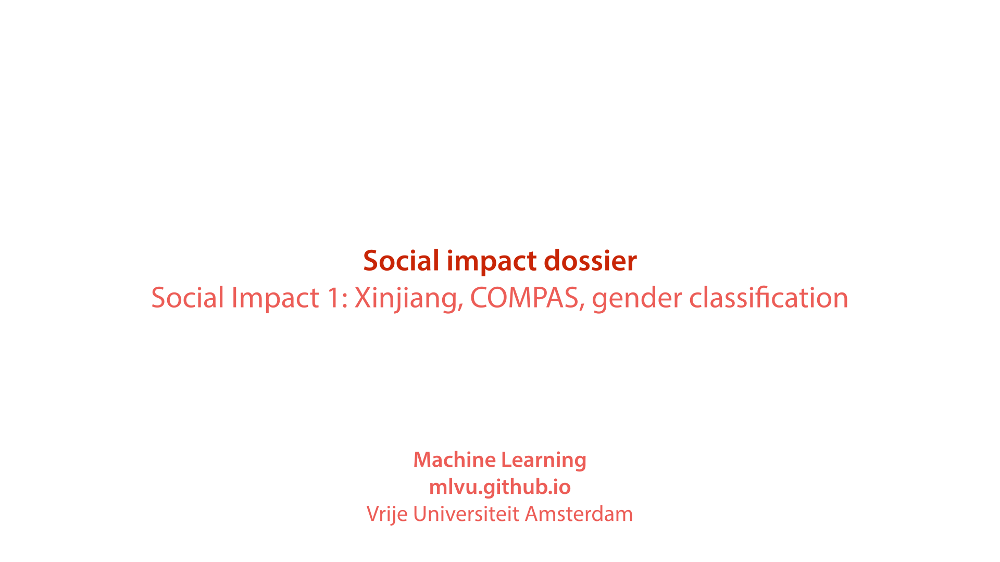

            <figcaption>
            
<lnbr></lnbr> 

In <a href="https://mlvu.github.io/lecture01/#video-076"><strong>the first social impact video</strong></a> we talk about  social impact in general. Since this is an overview, many topics are discussed briefly and without great detail. We'll try to add some background for the topics of the Xinjiang conflict, the COMPAS parole prediction system and the general topic of gender classification, and whether they have any bearing on how we treat gender as an attribute or target label.

            </figcaption>
       </section>

       <section id="slide-009">
            <a class="slide-link" href="https://mlvu.github.io/social-impact#slide-009" title="Link to this slide.">link here</a>
            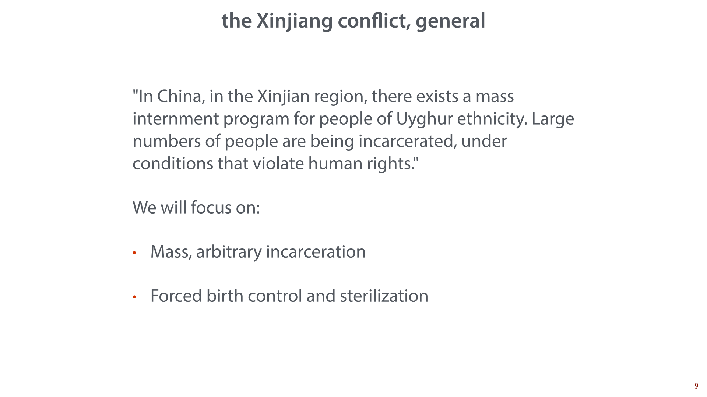

            <figcaption>
            
The most contentious claim made in this video is probably that there are human rights violations taking place in the Xinjiang region in China. I am stating this as fact, not as an opinion or something reported by somebody else. As we saw in the previous slide, it's easy to go wrong in such cases, even if you rely on both eyewitness accounts and reputable, independent news sources. We'll go through the available evidence category by category. 
<aside    >I apologize for putting such a spotlight on a subject that is ultimately only a small part of the course: only two slides out of more than a thousand. However, these two slides regularly lead to vehement criticism. I'd like to show, that we don't make claims like these lightly, or just based on a few western newspaper articles or videos, and that the evidence really is overwhelming.  </aside><aside    >I do not put so much focus on this issue because I like singling out China or Chinese students, I would much prefer to discuss issues closer to home. However, in the past, when I have discussed these matters with less extensive references, people have entirely misconstrued my statements as based simply on some sparse sources and western media bias. I consider (based on conversations with students) an extensive walkthrough of the evidence like this one the lesser of two evils: it may put unnecessary focus on the issue, but it hopefully shows that I have at least done my homework. </aside>
To substantiate the claim in the slides, we will focus on two specific claims about the Xinjiang situation:  

There is mass incarceration, commonly without trial and for extremely innocent behavior. 

There is a program of forced birth control. Either through sterilization, fitting of IUDs or abortion. 

In both cases, ethnic groups like Uyghurs and Kazakhs are specifically targeted. While there are many more aspects to this issue, these are the two claims for which there is ample evidence, even when discounting eyewitness reports and reports by potentially biased media. That is, even the most sceptical reading of the evidence should lead to the conclusion that these two claims are true.  

While there is no universal definition of what constitute human rights, freedom from arbitrary incarceration and bodily autonomy are included in almost all definitions.  

Let's look at some of the evidence for what it happening in Xinjiang. 

Direct evidence. One form of direct evidence we have are western media tours of the facilities, which often paint a relatively pleasant picture [1,2]. We must obviously take these with a grain of salt. A key aspect of the claim we're evaluating is that the Chinese state is <em>hiding </em>these abuses. In that light, a carefully choreographed tour of a very specific facility provides limited evidence, although it does show that at least <em>some</em> Uyghur people are willing to make statements like these on camera. 

On the other hand, the presentation of a video such as [1] is often quite dramatic, using evocative imagery and dramatic music. This is a clear and unambiguous injection of bias by the BBC, and we must be wary of it. If we are looking for incontrovertible evidence, edited video narratives like these (whatever the message) have little value. We will limit ourselves to written sources only. 

A second form of  direct evidence is leaked government papers. One particularly strong example is the Xinjiang papers [3], 400 pages of government material leaked to the New York Times. Again, we can be sceptical of the NYT's bias, and of their interpretation of the source material. However, it is crucial to note that the Chinese government <em>confirmed</em> that these papers are authentic. They only allege that they are taken out of context and poorly translated, which we may doubt, but we must accept that these are not fake documents. For our purposes, the main thing the Xinjiang papers show is the scale of the project (single facilities housing tens of thousands of people), resistance within the government against the program (specifically an official named Wang Yongzhi, who built two of the facilities, resisted and was then sent to prison) and the fact that inmates are detained involuntarily and without a criminal sentence (this appears in a Q&amp;A for people speaking to families of detainees in the city of Turpan). 

Another form of direct evidence is satellite imagery. This cannot show us what is going on in the camps, but it can at least provide a sense of the scale of the problem. Here, we can show how it is easy to jump to the wrong conclusion. For instance, many observers have noted the barbed wire on the walls of these facilities. This may be more innocent than it seems. Many of these facilities were converted from schools, and it is common in China for schools to have barbed wire on the walls.  

We must also be wary of source bias here. One of the more reputable reports using satellite imagery to identify internment sites [4] was produced by the ASPI, an Australian think tank funded by parties in the Australian and US defense industries. Clearly, such an organization may have an incentive to stoke up tensions between nations like Australia and China. However, just because a source has a bias, doesn't mean we can dismiss its evidence out of hand. If the evidence is credible, carefully sourced and dispassionately presented, we must judge it<em> on its own merits</em>. The nitpicking over the details of such reports is too technical to go into here, but if you trust these sources, the main thing that they show is that there are hundreds of internment sites, and that there is a range of facilities from low to high security, with only very specific facilities shown in media tours.  

Both the Xinjiang papers [3] and an analysis of satellite imagery by the BBC [5] show that most such facilities can hold at least 10 000 people (assuming each inmate has their own cell), with the upper end of the estimate at 100 000. This suggests that the commonly alleged figure of around 1 million people detained is highly credible (some other means of estimation arrive at the same number, but we won't delve into them here). 

Eyewitness accounts. Here, we must be careful not to make the same mistakes made in the Nayirah case. We consider the case here to be much stronger for three reasons.  

There are <em>many</em> more eyewitness reports. [6,7,8] in particular provide relevant evidence of arbitrary incarceration, and forced birth control. For extensive collections of victim accounts, see the Xinjiang victims database [9], the Xinjiang documentation project [10], and a recent 160-page Amnesty international report [11] 

There are eyewitness reports from different sides. Not just from camp inmates, but also a police detective [12,13], teacher [14] and a gynaecologist [15] previously employed at the camp.  

The stories told by eyewitnesses are consistent with one another, and corroborated by primary data. 

These are clearly also journalistic sources. We will assume here that reporters faithfully described what witnesses reported and focus on the reliability of the witnesses themselves. The reliability of the news media themselves, we will deal with below. Many of these accounts are not independently verifiable, but the vast amounts of consistent witness testimony from different sides, tells us that we are dealing with a very different situation from the Nayirah case. 

Primary data. There is obviously little primary data coming out of China directly, but a programme of this size is difficult to hide. 

The main source of information for our purposes, is the birthrate in Xinjiang province. According to official Chinese statistics, it has <em>halved</em> between 2017 and 2020 [17,18]. Note that a) this was from an already low starting point, and b) the drop is concentrated in areas with high Uyghur concentration like Hotan prefecture. This drop is not denied by the Chinese state, so we can take it as a rare point of agreement. We will discuss the official explanation below. 

<em>Procurement bids</em>, the procedure by which companies acquire contracts for delivery of goods and construction of buildings, are another source of primary data. Many of these are or were publicly available online. Because they reference specific locations, they corroborate that at least some of the  sites shown are indeed internment facilities, sometimes requiring high-security equipment such as riot batons. They can also be used to arrive at an estimate of about 1 million people incarcerated, as done in [16]. 

In 2022, a hack called the <em>Xinjiang Police Files </em>[30,31] revealed a massive cache of information, including images of detainees, and the acts they were detained for. It corroborates that detainment is not voluntary, and that it is for trivial activities suchas growing a beard, or studying scripture. 
<aside    >Note that while we link to the BBC report, this hack was published by a consortium of <a href="https://www.xinjiangpolicefiles.org/select-media-reporting/"><strong>over a dozen media companies</strong></a> working together to authenticate this evidence. They explicitly checked for, for instance, evidence of forged data, and faked portrait photos. The article describes in detail how these images cannot be dismissed as fakes. </aside>
Academic references. There is little peer-reviewed academic work on the question of what exactly is happening in Xinjiang. Two commonly cited researchers on either end of the spectrum are Adrian Zenz [16,17] and Li Xiaoxia [18]. Zenz is an anthropologist funded by the right-wing think tank the <em>Victims of Communism Memorial Foundation</em>. Li is the director of the <em>Ethnic Studies Institute of the Xinjiang Academy of Social Science</em>. Zenz's work is regularly cited in Western media and Li's work is regularly cited by Chinese state media. In both cases, there is plenty of reason to doubt the independence of the researchers a priori, given their funding source. However, we are committed to judging arguments on their own merit, and not purely on the possible biases of the author. 

In [16] the main message is the existence and the extent of the camps, based on publicly available procurement bids. Reproduction of these results requires speaking Chinese, and access to data that is now no longer online. <a href="https://wokeglobaltimes.com/xinjiang/suppression-of-birthrates"><strong>Here is one such effort</strong></a> that concludes that the paper is not perfect, but the main message stands. 

For our purposes, [17] and [18] are most relevant. Neither appear to be peer-reviewed, but they are at least written in academic style. They both focus on the halving of the Xinjiang birth-rate in the years of 2017-2019. Note that nobody contests this drop: this is taken from official government yearbooks, and confirmed by the Chinese government.  

Briefly summarized, Zenz alleges that this is due to some form of forced birth control, and Li counters that it is due to a voluntary commitment to official planning policy due to policies instituted by the Xinjiang government. Li's argument can be dismissed on several points, but primarily on the basis that the drop is <em>far below </em>the level we would see if everybody followed family planning policy. We can also note that according to [Wang 2018], birth rates in all but one prefecture in Xinjiang were already well below 2.0 before the drop, having dropped slowly over the previous decades (at 2.56 in 2000 and 1.53 in 2010). This shows 1) that family planning incentives were already in place and taking hold, and 2) that such incentives lead to a slow drop over decades, not a halving in the space of 2 years. 

Another rebuttal is [19], a white paper directly from the Chinese government. Note that white papers are different from academic publications, because they are not peer-reviewed. This paper points to a a decade-by decade increase of the total population of Xinjiang. This is to be expected, due to <a href="https://en.wikipedia.org/wiki/Population_momentum"><strong>population momentum</strong></a>. That is, these numbers are not a counter-argument to the accusation that the birth-rate has halved over two years in Xinjiang. The birth rate drop would manifest itself much later in the population numbers. Year-on-year birth rates, though available are not given in the report. Many other claims are left unsubstantiated. 

[17] has been criticised for various incorrect claims and mistakes in his analysis, and some of this criticism appears to be valid. He is a controversial figure, and perhaps not the best example of academic rigor. However, his work is a central part of the discussion, so we shouldn't ignore it. To save us from having to dig into the nitty gritty details, we can note that the following conclusions from this report can be reproduced independently based on official government data only: 

The birth rate in Xinjiang has dropped by half over the span of two years. This is unprecendented anywhere in China in the preceding 20 years. 

The number of birth control procedures is substantially higher in Xinjiang than in any other region of China and withing Xinjiang,  substantially higher in regions with a larger Uyghur population, such as Hotan prefecture. 

In these two years, the number of <em>sterilizations</em> (as opposed to birth control by IUD) in Xinjiang has spiked very strongly while diminishing in the rest of China. 
<aside    >Here <a href="https://wokeglobaltimes.com/xinjiang/suppression-of-birthrates"><strong>is one such reproduction</strong></a>. This is not an academic publication, just a blog post, and the language is not always neutral, but it shows how to reproduce the evidence for these claims yourself from publicly available data. </aside>
Journalistic references. There is a wealth of journalistic sources, that largely carefully summarize the above evidence, and sometimes add some of their own. The following is a relatively arbitrary selection from different countries, and different parts of the spectrum. These are all from western, or western-influenced countries, but they are also all media with a strong commitment to independent and unbiased reporting, and a clear separation of editorial and journalistic content.  

Some of these contain original research, while others report on documents and findings already mentioned elsewhere, such as [19], which reports on the ASPI findings in [4]. This latter category is relevant because it shows an independent journalist has gone through the report, looked at it critically and offered a voice to all relevant parties. 
<aside    >Note that most of these papers have a foundation-based ownership structure, rather than being owned by a single person or corporation. </aside>
The Guardian (left-leaning, UK) [6] provides and in-depth report from a former camp inmate. [20] reports on the release of [4].<lnbr></lnbr>Wall Street Journal (right learning, US) [21, 22, 23]<lnbr></lnbr>Frankfurter Allgemeine Zeitung (right-leaning, Germany) [25]<lnbr></lnbr>The New York Times (left-leaning, US) [3,26]<lnbr></lnbr>Le Figaro (centre-right, France) [27] <lnbr></lnbr>AP (independent news service): [28] reports on [17] and adds statements from relevant parties, including witnesses. [29] reports on an original, corroborated leak of government papers, showing religion, not extremism as a primary reason for detention. 
<aside    >This selection serves mostly to counter accusations of media bias. Yes, all media are biased, but reputable news papers also have a clear commitment to objective new gathering. Across the spectrum, and across countries, independent journalists have come to the same conclusion time and time again. </aside>
Conclusions 

So, can we conclude that there are human rights violations? Even if we take the kindest reading of the situation, based entirely on official data from China, there are at least 230 000 people incarcerated in Xinjiang, a proportion of about 5/1000. This is a little higher than the US national incarceration rate, the highest in the world, which already regularly invites suggestions of a human rights violation. Compared to the rest of China, the number is extremely high, and, most importantly, it has shot up in only two years since 2016. Seen figure (a) in the next slide. 

If we add satellite imagery, procurement bids, and leaked data confirmed as authentic to the evidence, we see that an estimate of more than 1 million people incarcerated (about 1/25) is much more likely. At such a scale it is difficult to imagine the incarceration is all for serious crimes, and based on careful trials. The eyewitness accounts overwhelmingly show that the simplest offences like gathering at home with multiple people, having a family member take part in a demonstration abroad, or having Whatsapp on your phone are enough to be incarcerated for multiple years. If you want to discount all witness evidence, there are still leaked documents like the Turpan Q&amp;A [3], which explicitly prepares officials for encounters with family members, stating inmates aren't criminals, but may not come home until they're "cured". 

Second, the unprecedented drop in birth rate, coupled with a spike in sterilizations, which cannot be explained by voluntary family planning. By itself, the primary data do not tell us where this drop comes from, although we can rule out the official explanations. If there is some innocent explanation, it needs to account for the fact that Xinjiang birth rates were already below 2.0 before 2017. We can take as further evidence that in some regions, it is<em> publicly</em> stated policy that those who have more than two children illegally will be sent to a re-education camp if they refuse long-term birth control or a termination of their pregnancy. Since we have established that this can mean years of incarceration, this qualifies as forced birth control. 

Even if we dismiss all other evidence and focus purely on primary sources and official government information, we must conclude that there is a program of mass, arbitrary incarceration, and forced birth control. Given this evidence, I consider it valid to state as fact that human right violations are taking place in Xinjiang. Note that many organizations and nations have gone much further and spoken of genocide or near-genocide based on the same data. What we include in the lectures is very much the most charitable reading of the evidence. 

To get to this point, we have ignored a lot of evidence. That evidence now gains in weight: even if you dismissed the witness statements of forced birth control as fabrications, you must now concur that they coincide with a vast, unexplained drop in birth rate. Even you don't believe the witness statements that say that Uyghurs are being detained against their will, or for entirely trivial offences, you must account for a system of complexes that can easily hold 1 million people, explicit government directives to make escape from these facilities impossible, and prescribed Q&amp;A's indicating that inmates are  involuntarily held but not seen as criminals. 
<aside    >To make our point this way we have ignored a lot of other aspects of the problem that also justify the name "human rights violation." Torture, systemic sexual abuse and inhumane conditions inside the camps. We've ignored these not because these are less serious, but because they are not independently verifiable.  </aside>
[1] <a href="https://www.youtube.com/watch?v=WmId2ZP3h0c"><strong>Inside China's 'thought transformation' camps</strong></a>,  BBC News John Sudworth, 2019. <lnbr></lnbr>[2] <a href="https://www.reuters.com/article/us-china-xinjiang-insight/china-says-pace-of-xinjiang-education-will-slow-but-defends-camps-idUSKCN1P007W"><strong>China says pace of Xinjiang 'education' will slow</strong></a>, but defends camps, Reuters, Ben Blanchard, 2019<lnbr></lnbr>[3] <a href="https://www.nytimes.com/interactive/2019/11/16/world/asia/china-xinjiang-documents.html"><strong>The Xinjiang papers</strong></a>, the New York Times, Austin Ramzy and Chris Buckley, 16 November 2019<lnbr></lnbr>[4] <a href="https://xjdp.aspi.org.au/"><strong>The Xinjiang data project</strong></a>, ASPI, 2019<lnbr></lnbr>[5] <a href="https://www.bbc.co.uk/news/resources/idt-sh/China_hidden_camps"><strong>China's hidden camps</strong></a>, BBC, John Sudworth, 2019 <lnbr></lnbr>[6] <a href="https://www.theguardian.com/world/2021/jan/12/uighur-xinjiang-re-education-camp-china-gulbahar-haitiwaji"><strong>‘Our souls are dead’: how I survived a Chinese ‘re-education’ camp for Uyghurs</strong></a>, the Guardian, Gulbahar Haitiwaji, Rozenn Morgat, 2021<lnbr></lnbr>[7] <a href="https://www.washingtonpost.com/world/2019/11/17/she-survived-chinese-internment-camp-made-it-virginia-will-us-let-her-stay/"><strong>She survived a Chinese internment camp and made it to Virginia. Will the U.S. let her stay? </strong></a> Washington Post,  Emily Rauhala and and Anna Fifield, 2019<lnbr></lnbr>[8] <a href="https://www.washingtonpost.com/world/asia_pacific/abortions-iuds-and-sexual-humiliation-muslim-women-who-fled-china-for-kazakhstan-recount-ordeals/2019/10/04/551c2658-cfd2-11e9-a620-0a91656d7db6_story.html"><strong>Abortions, IUDs and sexual humiliation: Muslim women who fled China for Kazakhstan recount ordeals,</strong></a> Washington Post, Amie Ferris-Rotman, 2019<lnbr></lnbr>[9] <a href="https://www.shahit.biz/eng/#evidence"><strong>The Xinjian victims database.</strong></a> Gene Bunin, from 2018.<lnbr></lnbr>[10] <a href="https://xinjiang.sppga.ubc.ca/lived-experiences/"><strong>The Xinjiang documentation project, primary accounts</strong></a>, University of British Columbia<lnbr></lnbr>[11] <a href="https://xinjiang.amnesty.org/wp-content/uploads/2021/06/ASA_17_4137-2021_Full_report_ENG.pdf"><strong>“Like we were enemies in a war”China’s Mass Internment, Torture and Persecution of Muslims in Xinjiang</strong></a>, Amnesty International, 2021<lnbr></lnbr>[12] <a href="https://edition.cnn.com/2021/10/04/china/xinjiang-detective-torture-intl-hnk-dst/index.html"><strong>'Some are just psychopaths': Chinese detective in exile reveals extent of torture against Uyghurs</strong></a>, CNN,  Rebecca Wright, Ivan Watson, Zahid Mahmood and Tom Booth, 5 October 2021<lnbr></lnbr>[13] <a href="https://news.sky.com/story/uyghurs-tortured-and-beaten-to-death-in-re-education-camps-in-xinjiang-former-chinese-police-officer-reveals-12431122"><strong>Uyghurs tortured and beaten to death in Xinjiang, former Chinese police officer reveals</strong></a>, Sky news, 11 October 2021<lnbr></lnbr>[14] <a href="https://thediplomat.com/2020/08/confessions-of-a-xinjiang-camp-teacher/"><strong>Confessions of a Xinjiang camp teacher</strong></a>, The Diplomat [<a href="https://mediabiasfactcheck.com/the-diplomat-magazine/"><strong>MBFC</strong></a>], Ruth Ingram, 17 August 2020<lnbr></lnbr>[15] <a href="https://www.newsweek.com/gynecologist-exiled-china-says-80-sterilizations-per-day-forced-uyghurs-1583678"><strong>Gynecologist Exiled From China Says 80 Sterilizations Per Day Forced on Uyghurs</strong></a>, Newsweek [<a href="https://www.allsides.com/news-source/newsweek"><strong>AS</strong></a>], Nicole Fallert , 14 March<lnbr></lnbr>[16] <a href="https://www.tandfonline.com/doi/abs/10.1080/02634937.2018.1507997?journalCode=ccas20"><strong>‘Thoroughly reforming them towards a healthy heart attitude’: China’s political re-education campaign in Xinjiang</strong></a>, Central Asian Survey, Adrian Zenz, 2018<lnbr></lnbr>[17] <a href="https://jamestown.org/wp-content/uploads/2020/06/Zenz-Internment-Sterilizations-and-IUDs-REVISED-March-17-2021.pdf?x48578"><strong>Sterilizations, Intrauterine Devices and Compulsory Birth Control: the Chinese Communist Party's Campaign to Suppress the Birth Rate of Uyghurs in Xinjiang</strong></a>, Adrian Zenz, 2020<lnbr></lnbr>[18] <a href="https://www.chinadaily.com.cn/a/202101/07/WS5ff6a2e4a31024ad0baa1227.html"><strong>An Analysis Report on Population Change in Xinjiang</strong></a>, China Daily, Li Xiaoxia, 2020<lnbr></lnbr>[19]<a href="https://news.cgtn.com/news/whitepaper/Xinjiang-Population-Dynamics-And-Data.pdf"><strong> Xinjiang population dynamics and data</strong></a>, The state council information office of the PRC, September 2021<lnbr></lnbr>[20] <a href="https://www.theguardian.com/world/2020/sep/24/china-has-built-380-internment-camps-in-xinjiang-study-finds"><strong>China has built 380 internment camps in Xinjiang, study finds</strong></a>, the Guardian, Emma Graham-Harrison, 24 September 2020<lnbr></lnbr>[21] <a href="https://www.wsj.com/articles/chinas-xinjiang-crackdown-reaps-millions-of-dollars-in-assets-for-the-state-11632494787"><strong>China’s Xinjiang Crackdown Reaps Millions of Dollars in Assets for the State</strong></a>, Wall Street Journal, Eva Xiao and Jonathan Chen, 24 September 2022<lnbr></lnbr>[22] <a href="https://www.wsj.com/articles/leaked-documents-detail-xi-jinpings-extensive-role-in-xinjiang-crackdown-11638284709"><strong>Leaked Documents Detail Xi Jinping’s Extensive Role in Xinjiang Crackdown</strong></a>, Wall Street Journal, Josh Chin, 30 November 2021<lnbr></lnbr>[24] <a href="https://www.wsj.com/articles/twelve-days-in-xinjiang-how-chinas-surveillance-state-overwhelms-daily-life-1513700355"><strong>Twelve Days in Xinjiang: How China’s Surveillance State Overwhelms Daily Life</strong></a>, Wall Street Journal, 19 December 2017<lnbr></lnbr>[25] <a href="https://www.faz.net/aktuell/politik/politische-buecher/xinjiang-zeugen-dokumentieren-die-praktiken-17933253.html"><strong>Keine „innere Angelegenheit“</strong></a>, Frankfurter Allgemeine Zeitung, Julia C. Schneider, 5 April 2022<lnbr></lnbr>[26] <a href="https://www.nytimes.com/2021/05/10/world/asia/china-xinjiang-women-births.html?searchResultPosition=29"><strong>China Targets Muslim Women in Push to Suppress Births in Xinjiang</strong></a>, New York Times, Amy Qin, 23 September 2021<lnbr></lnbr>[27] <a href="https://www.lefigaro.fr/international/ouighours-de-nouveaux-xinjiang-papers-confirment-le-role-de-xi-jinping-dans-la-repression-20211208"><strong>Ouïghours : de nouveaux «Xinjiang papers» confirment le rôle de Xi Jinping dans la répression</strong></a>, le Figaro, Rozenn Morgat, 2021<lnbr></lnbr>[28] <a href="https://apnews.com/article/ap-top-news-international-news-weekend-reads-china-health-269b3de1af34e17c1941a514f78d764c"><strong>China cuts Uighur births with IUDs, abortion, sterilization</strong></a>, AP, 29 June 2020<lnbr></lnbr>[29] <a href="https://apnews.com/article/china-beijing-ap-top-news-international-news-asia-pacific-890b79866c9eb1451ddf67b121272ee2"><strong>China’s ‘War on Terror’ uproots families, leaked data shows</strong></a>, AP, Dake Kang, 17 February 2020 

[30] <a href="https://www.bbc.co.uk/news/extra/85qihtvw6e/the-faces-from-chinas-uyghur-detention-camps"><strong>The faces from China’s Uyghur detention camps</strong></a>, John Sudworth, BBC News, May 2022<lnbr></lnbr>[31] <a href="https://www.xinjiangpolicefiles.org/"><strong>The Xinjiang Police Files</strong></a>, May 2022<lnbr></lnbr> 

            </figcaption>
       </section>

       <section id="slide-010">
            <a class="slide-link" href="https://mlvu.github.io/social-impact#slide-010" title="Link to this slide.">link here</a>
            

            <figcaption>
            
Here are some graphs to emphasize the main points from the previous slide. 

Official incarceration rates in Xinjiang compared to the rest of China and to the US. Note that this is only the official number of 230 000 people imprisoned. Note also that while this <em>figure </em>is from the NYT, the data is official government data. 

 Sterilizations in Xinjiang vs. the rest of China. From [Zenz 2020], can be verified <a href="https://github.com/wanghaisheng/healthdata"><strong>with this data</strong></a>. 

Left: Xinjiang's birthrate (red) against other provinces (blue), and the Chinese average. Note that the vertical axis does not start at 0, somewhat amplifying the effect.  Right: all two year-changes for all provinces as a histogram, with Xinjiang circled. From <a href="https://github.com/jnzst/china-birth-rates"><strong>official government data</strong></a>. From this twitter thread. Similar plots are available in [Zenz 2018] and the AP report, but these do not include 2019. 

[1] <a href="https://www.nytimes.com/2019/08/31/world/asia/xinjiang-china-uighurs-prisons.html"><strong>China’s Prisons Swell After Deluge of Arrests Engulfs Muslims</strong></a>, New York Times, Chris Buckley, 31 August 2019

            </figcaption>
       </section>

       <section id="slide-011">
            <a class="slide-link" href="https://mlvu.github.io/social-impact#slide-011" title="Link to this slide.">link here</a>
            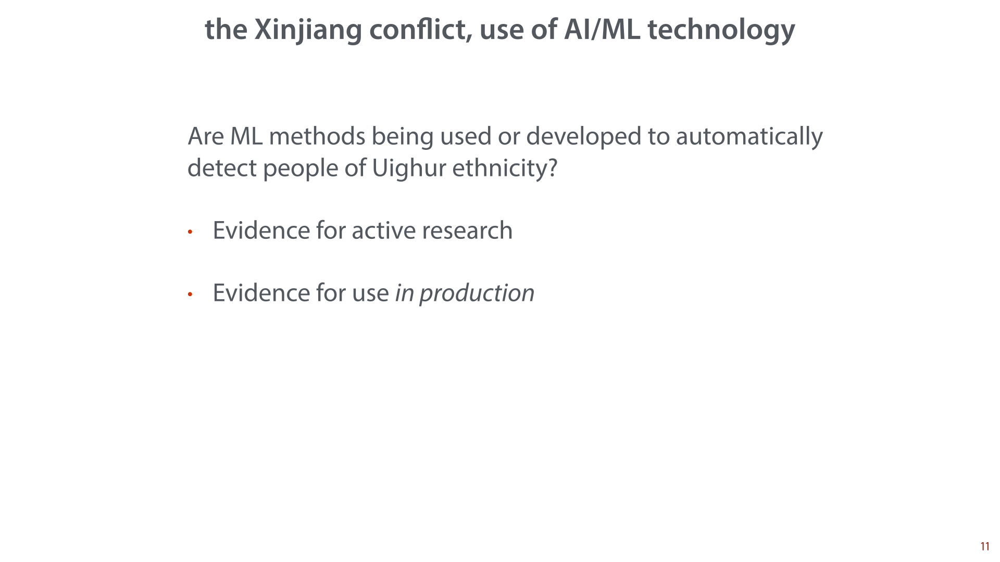

            <figcaption>
            
So, to the more relevant question.<em> If</em> we agree that human rights are being violated in Xinjiang, can we conclude that machine learning technology plays a part in it? 

Here, we can work primarily with <strong>direct evidence</strong>. Our weakest claim is that such technology is being developed, but that it is not necessarily already in production. A stronger claim is that the technology is already in production, and actively being used to detect the ethnicity of people in Xinjiang. 

For the first, there is ample direct evidence. As shown in the slides, a great deal of publicly available research explicitly mentions the Han and Uyghur ethnicities as target classes .[]. Much of it from Chinese institutions, but occasionally also from or involving western institutions. For instance, the survey paper we show in the slide is partly from a US university. References [1-5] further show that this is an active area of research. 

To show that this technology is not just being researched as potential idea, but actively being considered for production, ntoe that there are several patents and other documents outlining technology for explicit Uyghur face-detection, from companies like Alibaba, Huawei, Megvii and other [6. 7]. These were uncovered by a US based research group called IPVM studying video surveillance.  
<aside    >Note that while these references link to media reports, the original documents are always available. See <a href="https://en.wikipedia.org/wiki/IPVM"><strong>IPVM's Wikipedia page</strong></a> for more references. </aside>
For the second claim, that these systems are already being used in production, the evidence is less direct, and we need to rely on evidence gathered by others. A good overview is given in [8]. This is a journalistic reference, namely from the New York Times. A western paper with a left-wing bias, so let's be careful about what we're claiming here. We are <em>not</em> saying that ethnicity is used in production because the New York Times says so, we are referring to an article that presents a collection of evidence. We trust the NYT not to misrepresent the evidence or lie, but otherwise the evidence should speak for itself. 

In this case, the evidence presented by the New York Times is mostly <em>direct</em>. It includes (1) advertising by large companies such as SenseTime and CloudWalk, explicitly mentioning Uyghur face detection, (2) procurement documents from police agencies asking directly for detection of Uyghur ethnicity (3) interviews with 5 anonymous witnesses (4) a database from the company Yitu, seen by the New York Times, of face recognition observations, which explicitly includes the field "rec_uygur". 

A second point of evidence is an article by Reuters [9] reports on a technical standard, uncovered by IPVM, which details how surveillance data should be segmented by categories including ethnicity. The existence of such a standard directly implies that such features are at least being considered in surveillance data, if not used already. 

The second claim is not quite as obviously true as the first, but we have clear evidence from multiple sources, gathered by two separate, reputable news sources. This evidence consists of multiple forms of direct evidence, corroborated by witnesses.  

[1] Wang, Cunrui, et al. <a href="https://wires.onlinelibrary.wiley.com/doi/pdf/10.1002/widm.1278"><strong>Expression of Concern: Facial feature discovery for ethnicity recognition.</strong></a> Wiley Interdisciplinary Reviews: Data Mining and Knowledge Discovery 9.1 (2019): e1278.<lnbr></lnbr>[2] Zuo, Hang, Liejun Wang, and Jiwei Qin. <a href="https://ieeexplore.ieee.org/abstract/document/7878646"><strong>XJU1: A Chinese Ethnic Minorities Face Database.</strong></a> 2017 International Conference on Machine Vision and Information Technology (CMVIT). IEEE, 2017.<lnbr></lnbr>[3] Gao, Shixin, et al. <a href="https://csdl-downloads.ieeecomputer.org/proceedings/aemcse/2020/8143/00/814300a310.pdf?Expires=1649354039&amp;Policy=eyJTdGF0ZW1lbnQiOlt7IlJlc291cmNlIjoiaHR0cHM6Ly9jc2RsLWRvd25sb2Fkcy5pZWVlY29tcHV0ZXIub3JnL3Byb2NlZWRpbmdzL2FlbWNzZS8yMDIwLzgxNDMvMDAvODE0MzAwYTMxMC5wZGYiLCJDb25kaXRpb24iOnsiRGF0ZUxlc3NUaGFuIjp7IkFXUzpFcG9jaFRpbWUiOjE2NDkzNTQwMzl9fX1dfQ__&amp;Signature=dk8QtXAar-FINqXWZXoxiQB8YvlmFAAQdVy-TqL9MYJJhGd1foJCo-UlMB03kz5Gx89jpDXXjXwFUvi3oFkpIRkdUaz5zdjgmKfN46ZSXUgXE-xFLTksqyrW3gr0vR4Z2-crcF5nTeRm0P4F3gweb~SbIOaEJcwY-n1-e4loKjLODior7Cb2~yshlrFr-iXKNjwnmflDWIwoVwrCPY-m5amJNKjI29NNTYlNzu7PXLBS1F6nYcTXFTPxyfWvrgWV7WHGlSSZ9EkL1TJtyPfdYnBYhpgwtLbhUd5xoljpgLVsLryb5VTJ5Tr7m5NmMM7~qzs3MWogOrZohiauJhP~PQ__&amp;Key-Pair-Id=K12PMWTCQBDMDT"><strong>Facial ethnicity recognition based on transfer learning from deep convolutional networks.</strong></a> 2020 3rd International Conference on Advanced Electronic Materials, Computers and Software Engineering (AEMCSE). IEEE, 2020.<lnbr></lnbr>[4] Guo, YiJun, et al. <a href="https://dl.acm.org/doi/pdf/10.1145/3436369.3437412"><strong>A survey of multi-ethnic face feature recognition.</strong></a> Proceedings of the 2020 9th International Conference on Computing and Pattern Recognition. 2020.<lnbr></lnbr>[5] Yi, Lihamu, and Ermaimaiti Ya. <a href="https://www.spiedigitallibrary.org/conference-proceedings-of-spie/LID100/0000/Uyghur-face-recognition-method-combining-2DDCT-with-POEM/10.1117/12.2292981.short?SSO=1"><strong>Uyghur face recognition method combining 2DDCT with POEM.</strong></a> LIDAR Imaging Detection and Target Recognition 2017. Vol. 10605. International Society for Optics and Photonics, 2017. 

[6] <a href="https://www.nytimes.com/2020/12/16/technology/alibaba-china-facial-recognition-uighurs.html"><strong>As China Tracked Muslims, Alibaba Showed Customers How They Could, Too</strong></a>, New York Times, Raymond Zhou, 16 December 2020<lnbr></lnbr>[7] <a href="https://www.bbc.com/news/technology-55634388"><strong>Huawei patent mentions use of Uighur-spotting tech</strong></a>, BBC, Leo Kelion, 13 January 2021 

[8] <a href="https://www.nytimes.com/2019/04/14/technology/china-surveillance-artificial-intelligence-racial-profiling.html"><strong>One Month, 500,000 Face Scans: How China Is Using A.I. to Profile a Minority</strong></a>, New York Times, Paul Mozur, 14 April 2019<lnbr></lnbr>[9] <a href="https://www.reuters.com/article/us-china-tech-surveillance-trfn-idUSKBN2BM1EE"><strong>China found using surveillance firms to help write ethnic-tracking specs</strong></a>, Reuters, Avi Asher-Schapiro, 30 March 2021<lnbr></lnbr> 

<lnbr></lnbr>

            </figcaption>
       </section>

       <section id="slide-012">
            <a class="slide-link" href="https://mlvu.github.io/social-impact#slide-012" title="Link to this slide.">link here</a>
            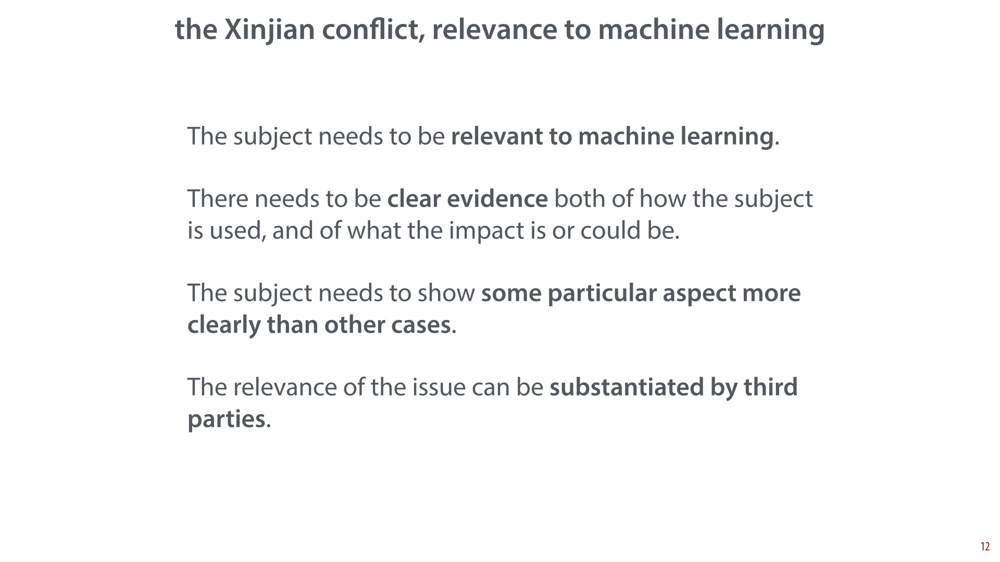

            <figcaption>
            
Finally, assume we agree that there are human rights violations in Xinjiang, and that machine learning plays a part in that program. Does this justify including it in the course? Given that Chinese students don't always have the easiest time in the Netherlands, is it fair to put such a spotlight on such a controversial issue? Can't we find similar examples a little closer to home? Is the machine learning aspect a big enough part of this problem to warrant its inclusion? 

The Xinjiang conflict by itself, and the acts committed are not machine learning related. If machine learning had not existed, this program would still exist. The only reason we bring it up to set the context for the claim in the previous slide. To understand why ethnicity detection of Uyghur people is so harmful, this context is necessary. In this dossier, we spend a large amount of effort to substantiate the claim we make about the Xinjiang program, but note that in the slides themselves, we only touch on this issue very briefly. Just enough to set the context for the part that is relevant for machine learning. 

The use of ethnicity detection is clearly relevant to machine learning. The practice of detecting properties from faces, and its harmful impact, is frequently discussed in the AI community [2]. There are various examples, but detecting ethnicity is the clearest one.  

We have dealt in detail with the available evidence, and as we said before, even with a charitable reading of the evidence, there is clear evidence of human rights abuses. There is also clear evidence that machine learning technology is both being developed and being used in production, at scale specifically for the purpose of ethnicity detection. 

Next, we should ask ourselves whether there are other cases, perhaps closer to home, that could serve as examples equally well. While there are plenty of examples of implicitly biased machine learning systems, such as the COMPAS system in the US or the child benefits fraud detection system in the Netherlands (both discussed later in the course), none of these are <em>explicitly</em> designed with ethnicity as a target feature. Xinjiang is simply the only place where such a large scale program is set up that actively and openly uses machine learning technology to explicitly detect ethnicity from human faces, and then attaches serious consequences to that detection. 

Finally, we should show that there is consensus on this issue among at least a subset of experts. <em>Not </em>because this increases the weight of the evidence: this evidence is simple enough that you can judge it for yourself, which is a much more reliable guide than community consensus. We show this consensus to guard against arbitrary inclusion of of topics.  

Our first point comes from the NYT article linked in the previous slide [1]. There, Jennifer Lynch, surveillance litigation director at the Electronic Frontier Foundation is quoted: 

“It’s something that seems shocking coming from the U.S., where there is most likely racism built into our algorithmic decision making, but not in an overt way like this. [...] There’s not a system designed to identify someone as African-American, for example." 

Earlier, the article summarizes the viewpoints of the interviewed experts as: 

To broaden our view, [2] provides a survey of 480 face recognition and biometrics researchers on general ethical implications of face-recognition research. Many questions directly, or indirectly reference the Xinjiang issue. For instance, when asked "Is it ethical to do facial recognition research on vulnerable populations that might not be able to freely give informed consent, such as the Muslim population in western China?" over 70% of respondents answered that such research could be ethically questions, <em>even if consent was given</em>. This shows, to some extent, the widespread concern about these ethical issues in the community. 

This is why we chose to include the Xinjiang conflict as a subject. It is simply the only example of a large scale use of<em> intentional</em> ethnicity detection. It is also a rare example of machine learning technology contributing directly to a human rights violation. We don't need to spend much time on it in the course, because there are few subtleties to the way machine learning impacts society here, but it does need to be mentioned. 

The Nature article also shows, of course, that there is a strong divide in the community, with many Chinese researchers objecting to the Western narrative of what is happening in Xinjiang. We don't mean to suggest that there is consensus on this issue in the global community, only that it is important enough to discuss in a course like this. 

[1] <a href="https://www.nytimes.com/2019/04/14/technology/china-surveillance-artificial-intelligence-racial-profiling.html"><strong>One Month, 500,000 Face Scans: How China Is Using A.I. to Profile a Minority</strong></a>, New York Times, Paul Mozur, 14 April 2019<lnbr></lnbr>[2] <a href="https://www.nature.com/articles/d41586-020-03187-3"><strong>The ethical questions that haunt facial-recognition research</strong></a><a href="http://www.apple.com/uk"><strong>,</strong></a> Nature, 18 November 2020, Richard Van Noorden<lnbr></lnbr>[3] <a href="https://www.nature.com/articles/d41586-020-03257-6"><strong>What scientists really think about the ethics of facial recognition research</strong></a>, Nature, 19 November 2020, Richard Van Noorden 

 

            </figcaption>
       </section>

       <section id="slide-013">
            <a class="slide-link" href="https://mlvu.github.io/social-impact#slide-013" title="Link to this slide.">link here</a>
            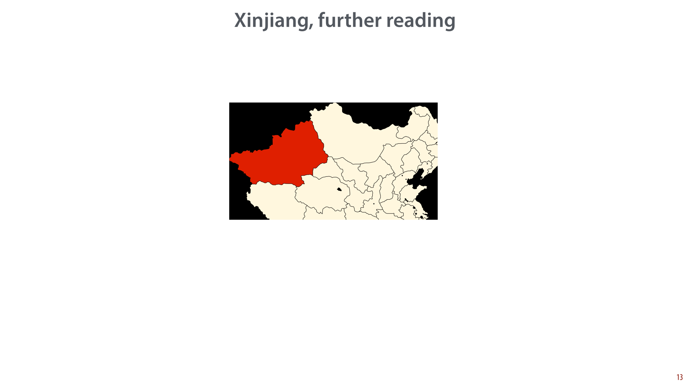

            <figcaption>
            
If you're interested in the Xinjiang issue there is a lot more to read. So far, we've included only the references required to make the points we needed to make. For a full understanding of the situation, you'd need to cast a wider net. Here are some places to start. 

<strong>The history of Xinjiang and modern China.  </strong>

For non-Chinese students, the history of China in the 20th century is not something we're taught much, but you need some of it to understand how things ended up the way they are. Wikipedia is of course a good starting place for general research, but it's quite a read. The following website provides a more high level overview of how the modern state of China came to be.  

<a href="https://departments.kings.edu/history/20c/china.html"><strong>https://departments.kings.edu/history/20c/china.html</strong></a><strong> </strong><em>This is probably a bit of a western reading of history, but take it as an overview of the important events.</em><strong> </strong>

Xinjiang itself has a rich history and has had various relations to China over the centuries. The region as it's now defined became part of China in 1949 at the end of the Chinese civil war. This was a largely political process. The following wikipedia pages are good places to start 

<a href="https://en.wikipedia.org/wiki/History_of_Xinjiang"><strong>History of Xinjiang</strong></a><lnbr></lnbr><a href="https://en.wikipedia.org/wiki/Incorporation_of_Xinjiang_into_the_People%27s_Republic_of_China"><strong>Incorportation of Xinjiang into the People's Republic of China</strong></a> 

<strong>Data mining in Xinjiang.</strong> It's likely that most data operations in Xinjiang are <em>not</em> automated, but simply done by large amounts of manual labourers. The following articles shed some light on how this looks. The first is based on witness statements, the second is based on ASPI research. These are not relevant to the point we need to make, but they do touch on predictive policing, which comes up later in the course.<lnbr></lnbr><a href="https://www.noemamag.com/the-xinjiang-data-police/"><strong>The Xinjiang data police</strong></a>, Noema magazine, Darren Byler, 8 October 2020<lnbr></lnbr><a href="https://www.theguardian.com/world/2021/oct/19/china-predictive-policing-surveillance-uyghurs-report"><strong>Chinese effort to gather ‘micro clues’ on Uyghurs laid bare in report</strong></a>, the Guardian, Helen Davidson and Vincent Ni, 19 October 2021 

<strong>Students and lecturers.</strong> The following article details the experiences of <a href="https://en.wikipedia.org/wiki/Darren_Byler"><strong>Darren Byler</strong></a>, lecturing about this topic and interacting with Chinese students. I found it interesting to read how discussing this issue publicly plays out on a small-scale personal level. Unlike me, Byler makes no effort to remove his politics from his lectures, so take that into account when reading the article or watching his lecture (but then unlike me, he has extensive field experience in Xinjiang).<lnbr></lnbr><a href="https://supchina.com/2019/05/01/truth-hidden-in-the-dark-chinese-international-student-responses-to-xinjiang/"><strong>‘Truth hidden in the dark’: Chinese international student responses to Xinjiang</strong></a>, SupChina, Darren Byler, 1 May 2019 

            </figcaption>
       </section>

       <section id="slide-014">
            <a class="slide-link" href="https://mlvu.github.io/social-impact#slide-014" title="Link to this slide.">link here</a>
            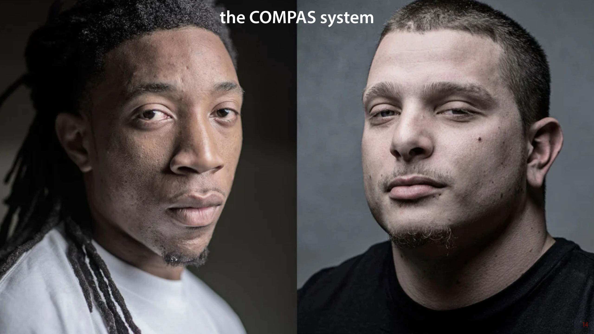

            <figcaption>
            
The COMPAS system has become almost a symbol for fairness in machine learning. We don't take much time to discuss it in the slides, so let's show the whole history in more detail here. 

COMPAS stands for <em>Correctional Offender Management Profiling for Alternative Sanctions</em>. It was developed by a company called Northpointe (now renamed to Equivant) as a decision support system for (among other things) parole decisions. Its stated aim is to predict violent recidivism in parole candidates. 
<aside    >Parole is a technical term in US justice, that indicates a prisoner being released early under certain constraints, usually if they've behaved well in prison, and convinced officials that they are unlikely to return to a life of crime. Recidivism is returning to a life of crime, and violent recidivism is doing so violently. Clearly a prisoner getting parole and then committing a violent crime is a failure of the parole system, so that is what parole boards aim to prevent. COMPAS is used in many different stages of the justice process. The data that Propublica used came from pretrial hearings, since that's where the system was used in the county where they requested the data. </aside>
COMPAS is or has been in production in several US states. It works by producing three different risk scales called pretrial release risk, recidivism risk and violent recidivism risk. These are then combined into a weighted linear function to provide a score for each parole candidate. The precise way the weights are set and the way the scales are calculated is not public information, but features used include: residential stability, employment status, community ties, criminal history and associates, drug involvement, and indications of juvenile delinquency, vocational/educational problems, the person’s age-at-intake and the person’s age-at-first-arrest. 
<aside    >In the slides we use the example of postcode being correlated with race. This is an extreme example, and there doesn't seem to be any indication that there are any features included that leak race so blatantly. The point is not that the authors of COMPAS were careless in selecting their features, it's that if you include enough features, predicting race better than average eventually becomes possible. At that point, it's likely that your system will not just reflect biases present in society, but amplify them.  The burden of proof is then on the authors of the system to show that the system doesn't amplify bias, not the other way around. </aside>
We include the COMPAS system primarily because it was such a watershed moment in the history of predictive systems determining the course of people's lives. The fact that it <em>might </em>be biased is sufficient reason to mention it here. But is it actually biased? Propublica published an in-depth analysis to support their findings [4]. Perhaps unsurprisingly, considering the way science works, others disagreed. This lead to a heated debate on whether the analysis by ProPublica was correct, whether their definition of a biased system was sound and of whether bias was actually the main problem. It's hard to say whether the debate has been conclusively settled by now, but we'll try to answer a few of the main questions. 
<aside    >Before that, a point on <strong>media literacy</strong>. The article [3] is filled with examples of white people incorrectly being judged low-risk and black people incorrectly being judged high-risk. This plays an important role: it shows the real human cost of a system like this, and it shows the kind of offences we're talking about. However, with more than 6000 cases to choose from, unscrupulous journalists could easily cherry pick these cases to paint any picture they like. The people interviewed do not count as evidence. They are relevant, and the fact that they're included should not be counted against the article, but the <strong>evidence</strong> is in the data and the analysis, not the individual examples, which are purely <strong>anecdotal</strong>. </aside>
 

  

            </figcaption>
       </section>

       <section id="slide-015" class="anim">
            <a class="slide-link" href="https://mlvu.github.io/social-impact#slide-015" title="Link to this slide.">link here</a>
            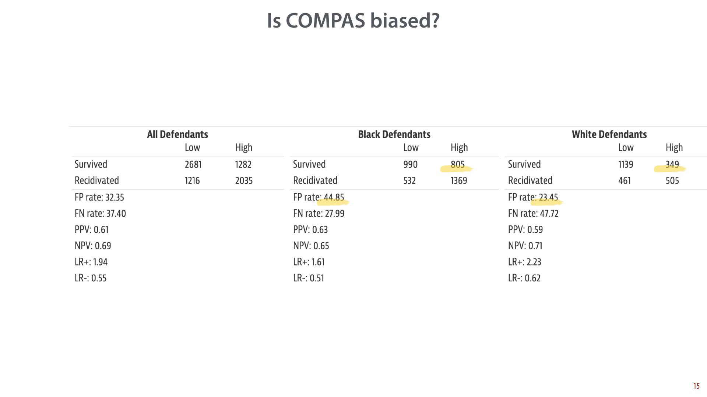

            <figcaption>
            
The original analysis can be found in [4]. [6] is the rebuttal by Northpointe, and [5] is a critique by independent researchers. There is a lot of back-and-forth about various statistical issues. Questions of whether the correct analyses are used and whether the right alpha levels are set and so forth. We'll try to isolate the most important points without getting too bogged down in the details. 

Base rates 

The first thing to note is that a large part of [4] is taken up with showing that black people are more likely to be labeled high-risk than white people. This by itself is not a indication of a biased system. In the county for which the data was requested, black people <em>are</em> more likely to re-offend than white people [6, Table 3.3]. This is not a racist statement: in a racially biased society, poverty, drug abuse, contact with crime are all correlated with race, and all increase the chance of recidivism. This means that a person getting out of prison and returning to a largely black community has higher chances of recidivism compared to a person returning to a largely white community<em> independent of their own character</em>. Thus, the fact that the system is more likely to assign high risk to black people doesn't tell us that it's biased. 
<aside    >Part of the problem here is the<strong> difference between prediction and action</strong>. The system may accurately predict a high risk of recidivism, but if a practitioner then interprets that as a personal attribute, they may keep them in prison longer, rather than offering them greater support, which would be justified if their environment put them at a greater risk of recidivism. The COMPAS manual [1] discusses these topics and clearly indicates that the risk scales are intended to help design a set of support measures under which a person may be allowed bail or parole. However, as the ProPublica article shows, in practice such support measures are often not available, which means that the only option is not to allow bail or parole. </aside>
The main statistics to pay attention to, come all the way at the end of [4]. They are confusion matrices for COMPAS on the total data and separated by race. 
<aside    >These require setting a cutoff to turn the rating given by COMPAS into a classification. This is somewhat unfair, since COMPAS is not meant to be used as a binary predictor, but then, as ProPublica alleges, there is a considerable danger that it is actually used this way, even if it shouldn't be. </aside>
We've highlighted the false positives and the false positive rates, to show where the problem is. Given that you're black, you are much more likely to receive an incorrect indication of high risk, than if you're white. In [6], Northpointe accuses Propublica of committing a base rate fallacy here. Specifically, they refer to the <strong>false positive paradox</strong>.  

Here is an example of that paradox: imagine you are given a test for a disease with a 5% false positive rate and a 0% false negative rate. This may seem like a reliable test, but if the prevalence of the disease in the population is only 2%, then testing positive actually means you only have a 29% chance of actually having the disease. This is because the base rate is so low, that even though the test seems pretty good, false positives are still very likely. Question 3 in the probability homework shows a classic instance of this problem. 

How does this map onto the COMPAS results? Honestly, I'm not sure. The way I read the ProPublica argument is that if it's the case that being black means you have a higher risk of a false positive for recidivism than being white, the system is unfair. The false positive paradox crops up when the base rate is low. Firstly, that's not the case here (the base rates are between 10% and 50% for both groups depending the details of the experiment) and secondly, the false positive paradox leads to increases in false positives for <em>lower</em> base rates. Here the base rate of recidivism is higher for black people, so the false positive paradox should lead to more false positives for white people. 
<aside    >There are also some allegations of improper hypothesis testing in [5]. As far as I can tell, these are unfounded. The effect shown here is extremely large, and the sample size is substantial. I don't think there's any way to dismiss this as a statistical fluke. The rest of [5] seems to hinge on the definitional issue highlighted in the next slide </aside><aside    > </aside><aside    ></aside>
            </figcaption>
            click image for animation
       </section>

       <section id="slide-016" class="anim">
            <a class="slide-link" href="https://mlvu.github.io/social-impact#slide-016" title="Link to this slide.">link here</a>
            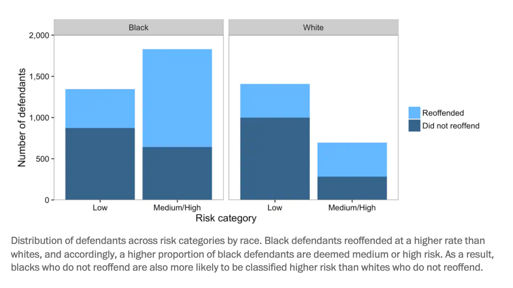

            <figcaption>
            
A pretty convincing explanation of the confusion comes from the fact that there are two conflicting definitions of what it means for a system to be fair. This was explained very clearly in [7], in the Washington Post, where the above image comes from (annotations in orange are added by us). See also [10] for a write-up in the Atlantic. 

In short, Northpointe defines a key aspect of fairness by saying that given a high risk rating, the proportion of re-offending and not re-offending should be the same, <em>regardless of race</em>. It's hard to argue that this is not a necessary condition of fairness: if the proportions are different, then a high risk rating means something different for black people than it does for white people. As a result, notice that the proportions for re-offending and not re-offending are similar in the medium/high bars for white and black people.  

The total size of the bars is different, but this can be explained from the different base rates. It's reasonable to give black people a higher risk score (so long as we're looking only at prediction, not action), because environmental factors mean that the recidivism risk is higher on average for black people. 

The key point to recognize is that ProPublica introduces another consideration that is <em>also</em> necessary for fairness. A false positive is an unfair high risk score: the system predicts I'll re-offend but I don't end up re-offending. If such mistakes are made more often for black people than for white people, then the system is also clearly unfair, at least if a high risk score can be detrimental to a defendant. As the ProPublica article shows, in practice this is certainly the case. 

The Washington Post notes that this picture clearly illustrates that given a different base rate, we can't satisfy <em>both</em> requirements. If the system will accurately predict more recidivism for black people (following the base rate) and make the same proportion of mistakes in this category for black and white people, then<em> the false positive rates must be different</em>. 

This suggests there is a fundamental problem with defining fairness for classifiers. A system cannot be perfectly fair in both ways and follow the natural distribution of recidivism. We either limit the fairness on one or both of our criteria, or artificially set the proportion of people assigned high risk the same for black and white people. The latter would greatly reduce the accuracy of the algorithm (and we can only to it for sensitive attributes we are aware of), and likely disadvantage white people. Note that this is not just a property of automated systems. Parole boards that don't use risk assessment tools like COMPAS also need to make this tradeoff somehow (likely by trading off all three requirements implicitly). 
<aside    >Personally, I feel great benefit could be had from disentangling predictions and actions, and from looking at the causes of recidivism. A large part of the problem is that an accurate prediction of high risk is always coupled to a negative effect for the individual. The prediction may be accurate, but that can't tell us whether the action of denying parole is either effective or just. When you read the COMPAS manual [1], and some of the research behind its risk scores [], you do see that this is closer to the intended use: to determine how a particular defendant can be supported in parole to prevent recidivism, for instance through various forms of counseling.  </aside><aside    > </aside><aside    ></aside>
            </figcaption>
            click image for animation
       </section>

       <section id="slide-017">
            <a class="slide-link" href="https://mlvu.github.io/social-impact#slide-017" title="Link to this slide.">link here</a>
            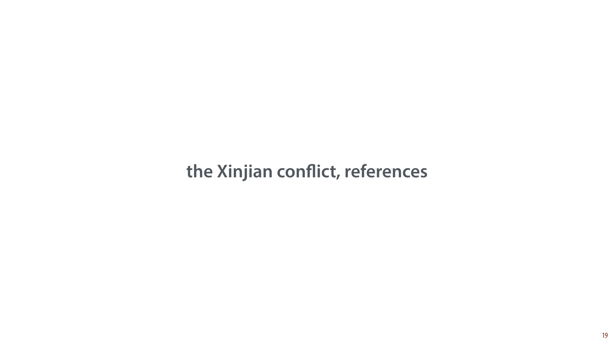

            <figcaption>
            
[1] <a href="https://s3.documentcloud.org/documents/2840784/Practitioner-s-Guide-to-COMPAS-Core.pdf"><strong>A practitioner's guide to COMPAS core</strong></a>, Northpointe, 2015<lnbr></lnbr>[2] <a href="https://www.documentcloud.org/documents/2702103-Sample-Risk-Assessment-COMPAS-CORE.html#document/p1/a296594"><strong>A sample COMPAS risk assesment</strong></a>, published by Propublica, 2011<lnbr></lnbr>[3] <a href="https://www.propublica.org/article/machine-bias-risk-assessments-in-criminal-sentencing"><strong>Machine Bias</strong></a>, Propublica,  Julia Angwin, Jeff Larson, Surya Mattu and Lauren Kirchner,  23 May 2016<lnbr></lnbr>[4] <a href="https://www.propublica.org/article/how-we-analyzed-the-compas-recidivism-algorithm"><strong>How We Analyzed the COMPAS Recidivism Algorithm</strong></a>, Propublica, Jeff Larson, Surya Mattu, Lauren Kirchner and Julia Angwin, 23 May 2016<lnbr></lnbr>[5] <a href="https://www.uscourts.gov/federal-probation-journal/2016/09/false-positives-false-negatives-and-false-analyses-rejoinder"><strong>False positives, false negatives, and false analyses: A rejoinder to machine bias: [...]</strong></a> Flores, Anthony W., Kristin Bechtel, and Christopher T. Lowenkamp, Fed. Probation 80 (2016): 38.<lnbr></lnbr>[6] <a href="http://go.volarisgroup.com/rs/430-MBX-989/images/%20ProPublica_Commentary_Final_070616.pdf"><strong>COMPAS Risk Scales: Demonstrating Accuracy Equity and Predictive Parity</strong></a>, Northpointe, William Dieterich, Christina Mendoza, Tim Brennan, 8 July 2016<lnbr></lnbr>[7] <a href="https://www.washingtonpost.com/news/monkey-cage/wp/2016/10/17/can-an-algorithm-be-racist-our-analysis-is-more-cautious-than-propublicas/"><strong>A computer program used for bail and sentencing decisions was labeled biased against blacks. It’s actually not that clear</strong></a>, Washington Post, Sam Corbett-Davies, Emma Pierson, Avi Feller, Sharad Goel, 17 October 2016<lnbr></lnbr>[8] <a href="https://hdsr.mitpress.mit.edu/pub/7z10o269/release/4"><strong>The Age of Secrecy and Unfairness in Recidivism Prediction</strong></a>, Harvard Data Science Review, Cynthia Rudin, Caroline Wang, and Beau Coker, 31 March 2020<lnbr></lnbr>[9] <a href="https://hdsr.mitpress.mit.edu/pub/hzwo7ax4/release/4"><strong>Setting the Record Straight: What the COMPAS Core Risk and Need Assessment Is and Is Not</strong></a>, Harvard Data Science Review, Eugenie Jackson and Christina Mendoza, 31 May 2020<lnbr></lnbr>[10] <a href="https://www.theatlantic.com/technology/archive/2018/01/equivant-compas-algorithm/550646/"><strong>A Popular Algorithm Is No Better at Predicting Crimes Than Random People</strong></a>, The Atlantic, Ed Yong, 17 January 2016 

            </figcaption>
       </section>

       <section id="slide-018">
            <a class="slide-link" href="https://mlvu.github.io/social-impact#slide-018" title="Link to this slide.">link here</a>
            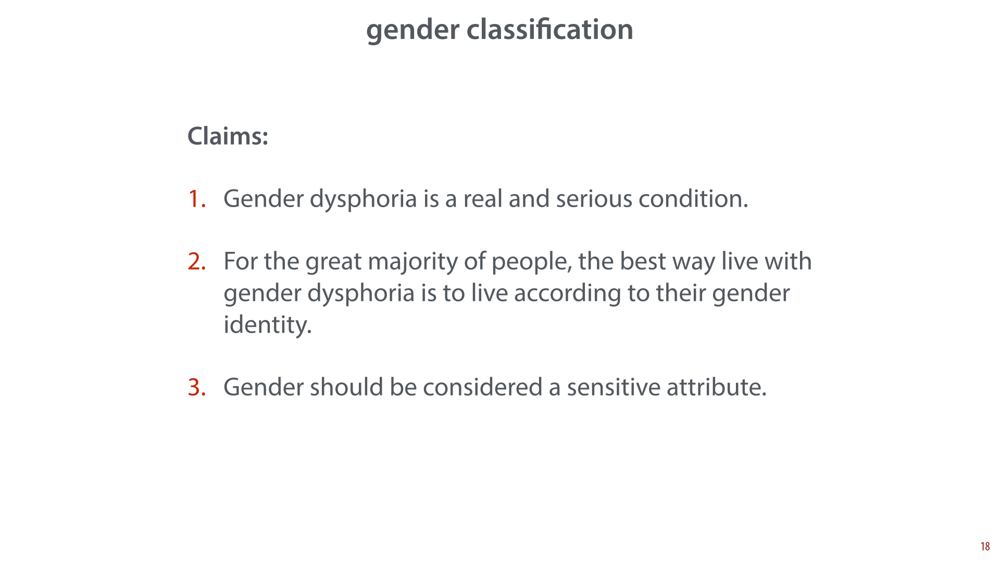

            <figcaption>
            
Finally, we discuss the issue of gender classification. This is a far more complex issue than the other two. Before we discuss what we claim and why we claim it, let's make it absolutely clear what it is that we claim. Our key claim is that gender classification is a controversial subject. This claim itself is not controversial: it is clearly borne out by Google's decision to remove the feature from a key API. <strong>Our aim with this section of the video is not to convince you that Google was right to do so.</strong> We don't claim that, and it's hard to offer evidence for that claim, since it's a largely moral decision.  
<aside    >Some of the text below goes a little off-topic, delving into general issues, for instance, of transgender healthcare. This is a complicated topic with many controversial areas. Our aim in the social impact videos is always to steer clear of anything overly controversial and to build our material on those things that are undeniably true (assuming a basic standard of evidence). In these notes, we dig into the controversy a little, to show the difference, and most importantly what aspects both sides of a controversial argument agree on. This is often a good tactic:<strong> find people on both sides of an issue who are arguing respectfully, based on evidence and in good faith, and see what they agree on</strong>. </aside>
Our aim here is to discuss the subtleties of the problem. We would like to show what kind of information informs this issue and how one might come to such a conclusion, so that when you make your own decision on whether such software should exist, and that decision may well stop being academic once you graduate, you do not leap to obvious conclusions too quickly. 

Why do we feel the need  discuss this issue in particular? We do so for two reasons: 

We occasionally use gender classification as an example in the course. For instance, in the video we show in the first part. In older material, gender classification is even a running example throughout the course (this has now been replaced by sex classification in penguins). We do this because it's a simple example of binary classification that everybody is familiar with and that has a nice 50/50 class balance. Since we bring up the idea that this problem can be approached with machine learning, we also have a responsibility to mention that this is often seen as a problematic use of machine learning and to explain the very subtle reasons for why that's the case. 

In contrast to the Xinjiang issue and the COMPAS system, this is an illustration of the far more subtle issues of social impact that developers of ML impact may encounter. Even if your system doesn't make predictions that directly affect people's lives, it may make predictions that are seen as offensive or harmful in a way that you had never considered. Perhaps you don't agree, and perhaps you will choose to use the predictions anyway. That is your responsibility, not ours. We do however, feel the responsibility to make you aware of the potential issue, so that you can make an informed decision. This use-case is particularly suitable precisely because it's such a subtle issue, it's diffeicult to explain exactly why it can be so controversial, and yet, because we have an example of at least one large corporation deciding not to offer gender classification as a feature. 
<aside    >We repeat that we make no claims about how gender is defined. With hundreds of students, there are bound to be different viewpoints on this, and the matter has little to do with machine learning. </aside>
None of this requires particularly strong evidence. Google's decision by itself is sufficient evidence that the issue is relevant in our community.  

While we are happy for everybody to make up their own mind about this issue, the are a few facts that anybody who reads the evidence critically must agree on. It would be disingenuous and unacademic to do otherwise. They are highlighted in the slide.  

First, gender dysphoria is a real and serious condition. It has been part of the DSM, the standard diagnostics manual of psychology since 1980 [1]. The exact prevalence of gender dysphoria is difficult to measure, but common estimates range 0.005% to 0.014% for people of male sex and 0.002% to 0.003% for people of female sex [2]. That is, between 1 in 10 000 and 1 in 100 000. However, there are good reasons to assume the prevalence is much higher. Depending on the definition, estimates can range as high as 1 in 1000 [7]. 
<aside    >Note that we use the phrase "condition" as a neutral term. It is not commonly seen as an illness or disorder, but people who are gender dysphoric do suffer as a consequence. </aside>
The combination of clear diagnostic criteria and a clear prevalence shows that gender dysphoria is a real condition. Whatever view you hold on gender, this you cannot dismiss. 

To show that the condition is a serious one, a common statistic is the increased suicide rate among transgender people already cited in the slides of the video itself. This gives us a hint of how serious the condition can be. For more insight, we can look at qualitative analyses like. For instance, [4] compares the experiences of children with fluid gender identity differentiating between those who persisted in the transgender identity and those who desisted (become comfortable with their biological sex as a gender identity). In [5] the experience of living with gender dysphoria and autism is illustrated (a relatively common co-occurrence). [6] investigates how transgender people experience Many other papers like these are available. In general, it is not difficult to find first hand descriptions of the experiences of gender dysphoric people. They paint a fairly uniform picture of a very serious condition. 
<aside    >These do not evaluate a question in a rigid empirical manner, but instead aim to report people's experiences without strict statistical conclusions. They can often be useful in gaining insight in areas where strict empirical science cannot work, although as evidence they have less value. </aside>
The second claim we make is that people who are gender dysphoric, in general, are much better off living according their gender identity. This includes gender reassignment surgery and hormone therapy. Most health organizations recommend this approach, and explicitly reject any approaches that do not affirm a patient's gender identity. For example, [7] provides an overview of statements by US institutions to this effect. 

One controversial aspect of the problem is that any psychotherapeutic approaches that are not strictly affirmative, i.e. that don't strictly work by affirming a person's gender identity are often labeled "conversion therapy," in a parallel with the harmful and widely discredited efforts to "cure" people of homosexuality by psychological means. It would be incorrect to say that there is consensus about this in the medical literature. For instance, in [], the assertion was made, based on survey data, that non-affirmative approaches are overwhelmingly harmful, and in [] some serious issues with this conclusion are pointed out. Moreover the authors of the latter offer the opinion that "affirmation vs. conversion" is a false dichotomy, and that non-affirmative care may be beneficial in some cases. 

This is far outside our remit, and we don't have the expertise to make any claims on this subject. What it does show however, is that experts don't disagree that affirmative care is the right way forward for the majority of cases. The argument is over how much room to leave for exceptions.  

This is sufficient to substantiate the points we want to make: gender dysphoria is real, serious and normally substantially alleviated by living according to one's gender identity. Regardless of your opinions on gender in general and the controversial aspects of transgender issues, these are facts. Together they should be enough to convince you of the truth of claim 3: that for some people gender is a <em>sensitive attribute</em>.  

That doesn't mean we have proved that you should never use it or predict it in a machine learning application. Whether or not to do that is a moral choice. We cannot make moral choices for you, and we cannot show which is the right choice by evidence-based reasoning alone. The evidence above should however, tell you that for some people the issue is undeniably a serious one. 
<aside    >We've focused on strong gender dysphoria and transgender people here, in order to make a strong case. That doesn't mean that this is the only group of people that is affected by the issue. Many people have complex relations to their gender, using names like non-binary and gender-fluid (as well as many others) to describe their experience and identity. To these people, gender may well be as sensitive as it is to transgender people, but this is more difficult to show empirically. However, if we include all people who identify in some way as gender-fluid, the proportion of people for whom gender is a sensitive attribute may be as high as 2% [11] (a similar prevalence to homosexuality [12]). </aside><aside    ></aside>
            </figcaption>
       </section>

       <section id="slide-019">
            <a class="slide-link" href="https://mlvu.github.io/social-impact#slide-019" title="Link to this slide.">link here</a>
            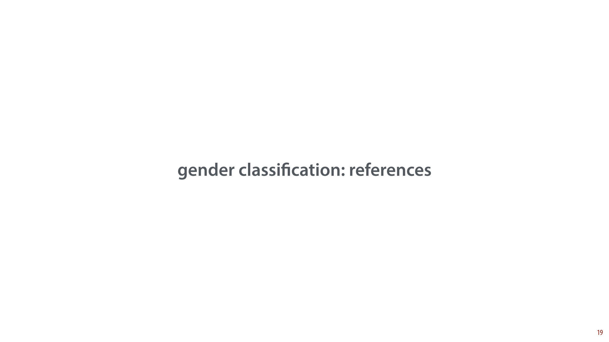

            <figcaption>
            
[1] Diagnostic and Statistical Manual of Mental Disorders (DSM)-III, 1980<lnbr></lnbr>[2] Diagnostic and Statistical Manual of Mental Disorders (DSM)-V, 2013<lnbr></lnbr>[3] Harvey Marcovitch, ed. (2018). "Gender Identity Disorders". Black's Medical Dictionary (43rd ed.). New York: Bloomsbury. 

[4] Steensma, T. D., Biemond, R., de Boer, F., &amp; Cohen-Kettenis, P. T. (2011). <a href="https://journals.sagepub.com/doi/full/10.1177/1359104510378303?casa_token=pyHi_VCsADEAAAAA:p9E1UrJVg4d_EoZZHyXLdXrfqkWfcaEJItHBYeUaPnGhaw6qOMcmRaB-bRwhtlhyESifbOwCU4Rex8w"><strong>Desisting and persisting gender dysphoria after childhood: a qualitative follow-up study. </strong></a>Clinical child psychology and psychiatry, 16(4), 499-516.<lnbr></lnbr>[5] Coleman-Smith, R. S., Smith, R., Milne, E., &amp; Thompson, A. R. (2020). ‘Conflict versus congruence’: A qualitative study exploring the experience of gender dysphoria for adults with autism spectrum disorder. Journal of Autism and Developmental Disorders, 50(8), 2643-2657.<lnbr></lnbr>[6] Kerr, L., Jones, T., &amp; Fisher, C. M. (2021). <a href="https://journals.sagepub.com/doi/abs/10.1177/13558196211013407"><strong>Alleviating gender dysphoria: A qualitative study of perspectives of trans and gender diverse people.</strong></a> Journal of Health Services Research &amp; Policy, 13558196211013407. 

[7] <a href="https://www.lambdalegal.org/publications/health-and-med-orgs-stmts-on-sex-orientation-and-gender-identity"><strong>Health and Medical Organization Statements On Sexual Orientation, Gender Identity/Expression and “Reparative Therapy”</strong></a>, Lambda Legal<lnbr></lnbr>[8] Collin, L., Reisner, S. L., Tangpricha, V., &amp; Goodman, M. (2016). <a href="https://pubmed.ncbi.nlm.nih.gov/27045261/"><strong>Prevalence of transgender depends on the “case” definition: a systematic review.</strong></a> The journal of sexual medicine, 13(4), 613-626. 

[9] <a href="https://www.theatlantic.com/magazine/archive/2018/07/when-a-child-says-shes-trans/561749/"><strong>When Children say they're Trans</strong></a>, Jesse Singal, The Atlantic, August 2018<lnbr></lnbr>[10] <a href="https://www.bbc.com/news/stories-51806011"><strong>Ellie and Nele: From she to he - and back to she again</strong></a>, By Linda Pressly and Lucy Proctor, 10 March 2020 

[11] Goodman, M., Adams, N., Corneil, T., Kreukels, B., Motmans, J., &amp; Coleman, E. (2019). <a href="https://www.endo.theclinics.com/article/S0889-8529(19)30001-5/fulltext"><strong>Size and distribution of transgender and gender nonconforming populations: a narrative review. </strong></a>Endocrinology and Metabolism Clinics, 48(2), 303-321.<lnbr></lnbr>[12] <a href="https://en.wikipedia.org/wiki/Demographics_of_sexual_orientation"><strong>https://en.wikipedia.org/wiki/Demographics_of_sexual_orientation</strong></a> 

<lnbr></lnbr> 

 

            </figcaption>
       </section>

       <section class="video" id="video-019">
           <a class="slide-link" href="https://mlvu.github.io/social-impact#video-19">link here</a>
           <iframe
                src="https://youtu.be/XJ_StAFefUk"
                title="YouTube video player"
                frameborder="0" allow="accelerometer; autoplay; clipboard-write; encrypted-media; gyroscope; picture-in-picture"
                allowfullscreen>
           </iframe>

       </section>

       <section id="slide-020">
            <a class="slide-link" href="https://mlvu.github.io/social-impact#slide-020" title="Link to this slide.">link here</a>
            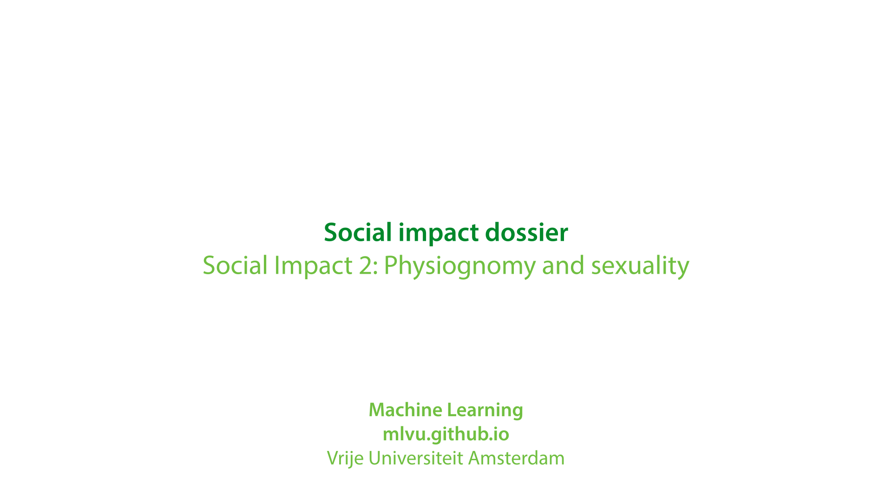

            <figcaption>
            
<lnbr></lnbr> 

In the second social impact video, we focus mainly on classifiers that infer particular characteristics of personality (criminality, homosexuality) from images of people's faces.  

We address two papers specifically. The papers themselves are cited in the video, and the video itself serves as our analysis. We make no claims for which more extensive evidence is required than we give in the slides themselves, so we will focus here only on offering some extra background and context, and on testing our inclusion policy. 

[Wu 2016] Wu, X., &amp; Zhang, X. (2016). Automated inference on criminality using face images. arXiv preprint arXiv:1611.04135, 4038-4052.<lnbr></lnbr>[Wang 2018] Wang, Y., &amp; Kosinski, M. (2018). Deep neural networks are more accurate than humans at detecting sexual orientation from facial images. Journal of personality and social psychology, 114(2), 246.

            </figcaption>
       </section>

       <section id="slide-021">
            <a class="slide-link" href="https://mlvu.github.io/social-impact#slide-021" title="Link to this slide.">link here</a>
            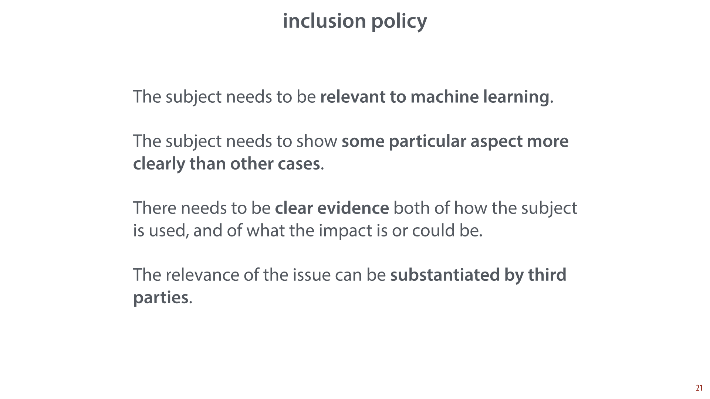

            <figcaption>
            
Here again, are the inclusion criteria. Both papers we discuss are specifically about classifiers, so they are both relevant to machine learning. 

There are many papers presenting work that purports to infer criminality from facial features. We chose [Wu 2016] for various reasons. First, it is a particularly egregious case, with a variety of problems that are illustrative to discuss. Second, the central finding, about the nasolabial angle, clearly illustrates the importance of consider multiple hypotheses for a given conclusion. Third, the paper has been discussed in detail by others [1], which offers both a more detailed treatment of the paper as well as a substantiation of the relevance. 
<aside    >Note that [Wu 2016] does not appear to have passed peer review (it is on Arxiv, but almost anybody can post to that), so it seems unfair to put too much focus on it. It serves here as a simple example of the kind of problematic applications of machine learning that people often seem to the tempted by, </aside>
The second paper we discuss [Wang 2018] offers a more subtle case. The paper was widely discussed in the news media [], but there is good cause to suggest that the authors we treated unfairly by some of these analyses. By contrasting [Wang 2018] with [Wu 2016], we hope to show some of the deeper issues that emerge when the more egregious mistakes are <em>not</em> made.  

This is important in analysing papers like these. If we discussed only a paper like [Wu 2016], it may appear that if only the authors had been more careful in their research, everything would be fine. If we covered only the backlash to a paper like [Wang 2018], it may appear that we are decreeing that inferring character traits from facial features is morally wrong and such research should never even start. We intend to do neither. Only by digging into the details of [Wang 2018] can we show, hopefully, that there are fundamental issues with this kind of research that are unlikely to be solved by making the analysis more careful. But also, that simply suggesting that this kind of research should be essentially disallowed or always dismissed out of hand, we would be ignoring important issues, such as privacy, that legitimately deserve attention. 

 

            </figcaption>
       </section>

       <section id="slide-022">
            <a class="slide-link" href="https://mlvu.github.io/social-impact#slide-022" title="Link to this slide.">link here</a>
            

            <figcaption>
            
Something that is often mentioned in rebuttals to this kind of paper, is that physiognomy is a discredited science. It's a little disingenuous to use this as a standalone argument. Even if people have tried and failed in the past to divine things like criminality from facial features doesn't <em>prove</em> that with modern methods and perspectives we can't do better. In other critiques it's called a <em>pseudoscience</em>. This, again, is not an argument, it's a shorthand for an argument. To make this argument honestly, we should be able to unpack it to its full form. 

What we should do, however, is be aware of the mistakes people have made in the past, and be explicit in where our methods differ.In short, we should know our own history, so as not to repeat the same mistakes. 

<a href="https://en.wikipedia.org/wiki/Physiognomy"><strong>Wikipedia provides a decent overview of the general history of physiognomy.</strong></a> During its heyday in the 17th to 19th centuries, the evidence seems to be mostly based on the personal experiences of respected physicians. In those days, scientific evidence was much less rigorously separated from the reputation of the scientist. Particularly notable is the work of Cesare Lombroso, who attempted to predict criminal tendencies from physical attributes of the face. 

It's hard to deconstruct the original research, since there is so little method behind it. In more modern examples, where the inferences are drawn from data, the following are the main criticisms that seem to come back repeatedly. 
<aside    >These are noted in the main video as well, but it bears repeating </aside>
Confounding details Even if we can predict X from Y, we may not be looking at the features of X that we think we are looking at. The machine learning literature (especially deep learning) is rife with algorithms inferring differences from background details that aren't actually relevant.  

Correlation versus causation Even if we are sure that we are looking only at structural details of the face, finding a correlation between a facial feature and, say, a likelihood of committing crime is no indication of the direction of causation. We go into more details in the third social impact video. 

Implicit implications This is perhaps the most crucial aspect. By doing research like this, you are at risk of implying that certain actions could be taken. Should people with criminality-associated features be subjected to greater scrutiny? Should they be forgiven more readily because criminality is "in their nature"? While a researcher may claim they are only investigating correlations, a misreading of research can easily read to very harmful policies.  

If your research can easily be misread as meaning something you don't mean to imply, there is extra responsibility on you to explicitly steer people away from those implications. 

            </figcaption>
       </section>

       <section id="slide-023" class="anim">
            <a class="slide-link" href="https://mlvu.github.io/social-impact#slide-023" title="Link to this slide.">link here</a>
            

            <figcaption>
            
For some extra background on [Wu 2016], we can start with the author's response. This can be found at the end of [1] and in [2]. 

A large part of this deals with criticism that is not relevant to the main issue we point out in the paper. It is interesting to note that the authors managed to control for some issues that they are accused of. For instance, in section 5 the authors discuss the criticism that the classifier may pick up on the collars of the subjects, which, as can be seen in the slide are white more often for the non-criminal part of the dataset. 

Here, the authors not that everything but the face was removed from the image, so this criticism is not valid. They also indicate that they controlled for broad facial expressions (although it's not clear how), but not for the more subtle facial expressions that the classifier seems to pick up on.  

This illustrates an important point. In some sense we are lucky that the classifier picks up on such an obvious incidental point here. But <strong>the burden of proof is not on us</strong>. It's up to the authors to show that what the classifier picks up on are structural features, not incidental ones like facial expression, lighting or shirt collar. If we had been unable to come up with something that the classifier might be looking at, that would not eliminate the possibility that it does. There are many things, like camera noise or ambient color that are imperceptible to us, but that can easily be picked up on by a convolutional neural network. 

In short, it's not enough to correct for a handful of potential confounders you can come up with. You have to show what the model is actually looking at to make a successful claim of a physiognomical correlation. If you can't, because the model or the data doesn't allow for it, the claim can't be made. 

The second, probably more crucial issue is causality. If you do find a structural correlation between facial features and criminality, it is almost certainly an indication of a social phenomenon like racism or discrimination based on physical attractiveness (so called <a href="https://en.wikipedia.org/wiki/Lookism"><strong>lookism</strong></a>). It proves nothing about biological predispositions towards criminal behavior. Like any other society, China has its racial divisions, and it's likely that a more sophisticated classifier would end up picking up on the facial differences between Han and the relatively underprivileged non-Han. It would be as racist to infer a causal link here as it would be to infer that black people are inherently more likely to be criminal. 
<aside    >The point here is not to claim that Chinese society is more or less racially divided than others, it's that <strong>any</strong> society has its racial divisions, and however small, these will inevitably be picked up on in experiments like these.</aside><aside    ></aside>
            </figcaption>
            click image for animation
       </section>

       <section id="slide-024">
            <a class="slide-link" href="https://mlvu.github.io/social-impact#slide-024" title="Link to this slide.">link here</a>
            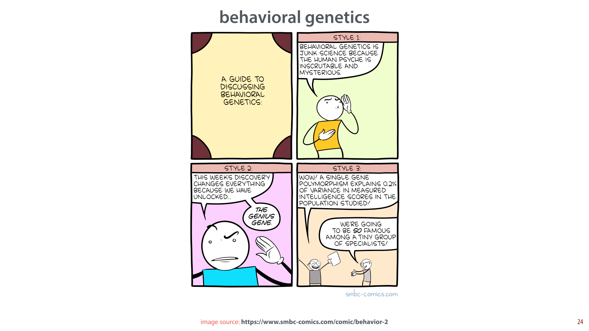

            <figcaption>
            
From this, it's a leap to say that there cannot ever be a biological basis for some tendencies that are associated with criminality. There could be more general behavioral tendencies like rebelliousness, anti-socialism or risk tolerance that, in the right circumstance translate to criminal behavior. If these have a partial genetic basis, this may well be correlated with other genetic expressions. 
<aside    >Note an important distinction. What is criminal is socially defined, and changes a lot. Within living memory, discrimination based on religion or skin color has been both illegal and legally enforced. What is criminal depends a lot on when and where you are, possibly within a single lifetime. This shows one problematic side of predicting "criminality" from biology. We should first make precise what we are actually talking about. </aside>
This leads into behavioral genetics, which is another controversial discussion. In progressive circles this is often seen as the first step on the slippery slope to racism or eugenics. In certain conservative circles, this kind of thinking is more accepted. If you're interested in this question, a good place to start is probably the work of Kathryn Paige Harden [3,4], a geneticist who has written specifically on what the facts of genetics mean for progressive viewpoints.  

For us, the main takeaway is that our behaviors are in part inspired by our biology, this is undeniably true (as well as very much by our environment). However, machine learning experiments are just about the worst possible way to figure out the truth of what aspects play which role. We cannot dismiss research like this by simply claiming that there is no connection between genetics and "criminality" (or rather behavorial patterns that commonly lead to criminality). We <em>can </em>say that a machine learning experiment is never going to allow us to untangle the confounders, or work out the causal direction 
<aside    >As an example of experiment that can help us here, geneticists often study <a href="https://en.wikipedia.org/wiki/Twin_study"><strong>identical twins</strong></a>. By carefully studying a large selection of twins, it's possible to get some signal on the differences between genetics and environment. These are not free of criticism, but it's a lot more methodologically sound than simply using a large CNN on masked images of people's faces. </aside><aside    >image source: <a href="https://www.smbc-comics.com/comic/behavior-2">https://www.smbc-comics.com/comic/behavior-2</a> </aside><aside    ></aside>
            </figcaption>
       </section>

       <section id="slide-025">
            <a class="slide-link" href="https://mlvu.github.io/social-impact#slide-025" title="Link to this slide.">link here</a>
            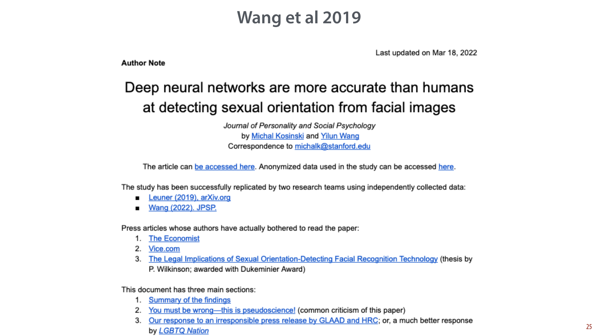

            <figcaption>
            
Wang et al is a more subtle case. Their stated aim is better thought through. They control for confounders more carefully. We discuss the paper and the authors' views in detail in the main video, so there is little to add here. Have a look at their rebuttal [5] if you're interested. It shows a lot of the subtleties of the discussion.  
<aside    >If there's anything you think we've missed, or you'd like to see discussed in more detail, reach out to us by email or on the Canvas discussion board if you're a student, and we'll include it.</aside><aside    ></aside>
            </figcaption>
       </section>

       <section id="slide-026">
            <a class="slide-link" href="https://mlvu.github.io/social-impact#slide-026" title="Link to this slide.">link here</a>
            

            <figcaption>
            
[1] <a href="https://www.callingbullshit.org/case_studies/case_study_criminal_machine_learning.html"><strong>Criminal machine learning</strong></a>, Carl Bergstrom and Jevin West, 2017<lnbr></lnbr>[2] Wu, X., &amp; Zhang, X. (2016). <a href="https://arxiv.org/abs/1611.04135"><strong>Responses to critiques on machine learning of criminality perceptions</strong></a> (Addendum of arXiv: 1611.04135). arXiv preprint arXiv:1611.04135.<lnbr></lnbr>[3] Can progressives be convinced that genetics matters? Gideon Lewis Kraus, the New Yorker, 6 September 2021<lnbr></lnbr>[4] The genetic lottery, Kathryn Paige Harden, 2021 

[5] <a href="http://Deep%20neural%20networks%20are%20more%20accurate%20than%20humans%20at%20detecting%20sexual%20orientation%20from%20facial%20images"><strong>Author note: Deep neural networks are more accurate than humans at detecting sexual orientation from facial images</strong></a>, Michael Kosinski, Yilu Wang,  

            </figcaption>
       </section>

       <section class="video" id="video-026">
           <a class="slide-link" href="https://mlvu.github.io/social-impact#video-26">link here</a>
           <iframe
                src="https://youtu.be/r4DYGXmbk_E"
                title="YouTube video player"
                frameborder="0" allow="accelerometer; autoplay; clipboard-write; encrypted-media; gyroscope; picture-in-picture"
                allowfullscreen>
           </iframe>

       </section>

       <section id="slide-027">
            <a class="slide-link" href="https://mlvu.github.io/social-impact#slide-027" title="Link to this slide.">link here</a>
            

            <figcaption>
            
<lnbr></lnbr> 

 

            </figcaption>
       </section>

       <section id="slide-028">
            <a class="slide-link" href="https://mlvu.github.io/social-impact#slide-028" title="Link to this slide.">link here</a>
            

            <figcaption>
            
In this video, we discuss the issue of profiling in more detail. We specifically highlight two topics: 

Racial profiling in the US, based on drug crime 

The child benefits welfare scandal in the Netherlands. 

In the case of the former, we start closer to home: a profiling incident that was in the news a while ago. The aim is to show that this is not a problem specific to the US. The reason we move to the US is that we find better data there. Not all countries have a clear record of race for their crime statistics (this has ethical benefits and downsides), so in order to make our discussion concrete, and ground it in hard data, we need to discuss a specific issue (drugs crime) in a specific location (the US). This allows us to be precise in what we are talking about. 

This issue shows a very clear example of profiling. The downside is that it's not directly related to AI technology. It isn't hard to see how AI technology may be used in combatting drug crime, leading to profiling (systems like COMPAS hint at this possibility), but having to appeal to  

We discuss the child benefit welfare scandal for several reasons.  

It's a very clear case of how profiling is concretely in ML-based systems. The level of the predictive software used wasn't very high, but it clearly qualifies as ML. 

It's an example of largely <em>unintentional</em> profiling (see the first video). The system programmers most likely didn't intend to explicitly to commit profiling, it simply happened mostly unnoticed as a consequence of poorly thought out design. The larger scandal also shows cases of intentional profiling by people involved, but there is no evidence (that I'm aware of) that this happened at the software level. 

It's close to home. This shows that we don't have to look far abroad for cases of machine learning being used to profile people. 

 

            </figcaption>
       </section>

       <section id="slide-029">
            <a class="slide-link" href="https://mlvu.github.io/social-impact#slide-029" title="Link to this slide.">link here</a>
            

            <figcaption>
            
Review the evidence 

 

- Stackexchange discussion 

[.] <a href="http://skeptics.stackexchange.com/questions/36797/do-black-people-and-white-people-use-drugs-at-the-same-rate-in-the-usa-but-blac"><strong>Do blacks in the US get arrested more often for drug usage despite using drugs at the same rate as whites?</strong></a> Skeptics Stackexchange, 2017

            </figcaption>
       </section>

       <section id="slide-030">
            <a class="slide-link" href="https://mlvu.github.io/social-impact#slide-030" title="Link to this slide.">link here</a>
            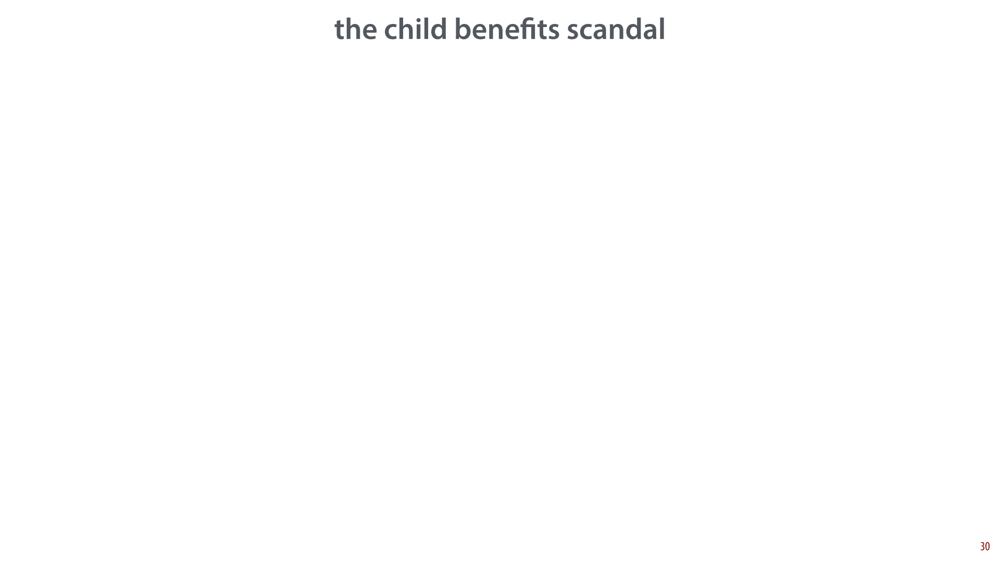

            <figcaption>
            

            </figcaption>
       </section>

       <section id="slide-031">
            <a class="slide-link" href="https://mlvu.github.io/social-impact#slide-031" title="Link to this slide.">link here</a>
            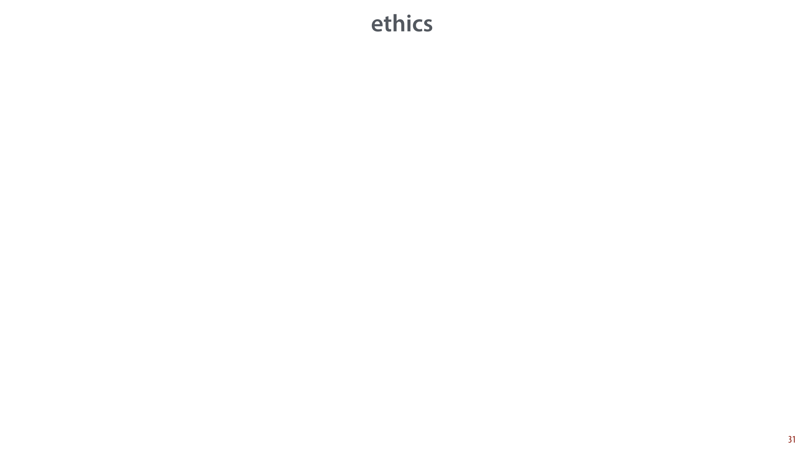

            <figcaption>
            

            </figcaption>
       </section>

       <section id="slide-032">
            <a class="slide-link" href="https://mlvu.github.io/social-impact#slide-032" title="Link to this slide.">link here</a>
            

            <figcaption>
            

            </figcaption>
       </section>

       <section class="video" id="video-032">
           <a class="slide-link" href="https://mlvu.github.io/social-impact#video-32">link here</a>
           <iframe
                src="https://youtu.be/r4DYGXmbk_E"
                title="YouTube video player"
                frameborder="0" allow="accelerometer; autoplay; clipboard-write; encrypted-media; gyroscope; picture-in-picture"
                allowfullscreen>
           </iframe>

       </section>

       <section id="slide-033">
            <a class="slide-link" href="https://mlvu.github.io/social-impact#slide-033" title="Link to this slide.">link here</a>
            

            <figcaption>
            
<lnbr></lnbr> 

 

            </figcaption>
       </section>

       <section id="slide-034">
            <a class="slide-link" href="https://mlvu.github.io/social-impact#slide-034" title="Link to this slide.">link here</a>
            

            <figcaption>
            

            </figcaption>
       </section>

</article>
