<nav class="menu">
    <ul>
        <li class="home"><a href="/">Home</a></li>
        <li class="name">Support vector machines</li>
                <li><a href="#video-000">Lagrange multipliers</a></li>
                <li><a href="#video-032">The kernel trick</a></li>
                <li><a href="#slide-058">KKT conditions and the SVM dual</a></li>
        <li class="pdf"><a href="https://mlvu.github.io/lectures/SVMs.annotated.pdf">PDF</a></li>
    </ul>
</nav>

<article class="slides">

       <section class="video" id="video-000">
           <a class="slide-link" href="https://mlvu.github.io/svms#video-0">link here</a>
           <iframe
                src="https://www.youtube.com/embed/cPbsqPg-s2Y"
                title="YouTube video player"
                frameborder="0" allow="accelerometer; autoplay; clipboard-write; encrypted-media; gyroscope; picture-in-picture"
                allowfullscreen>
           </iframe>

       </section>

       <section id="slide-001">
            <a class="slide-link" href="https://mlvu.github.io/svms#slide-001" title="Link to this slide.">link here</a>
            

            <figcaption>
            
In this lecture, we dig into all the details necessary to understand the kernel trick and support vector machines. At the moment, please consider this a draft: some details may be incorrect or missing, but the general idea is hopefully clear. 

 

 

            </figcaption>
       </section>

       <section id="slide-002" class="anim">
            <a class="slide-link" href="https://mlvu.github.io/svms#slide-002" title="Link to this slide.">link here</a>
            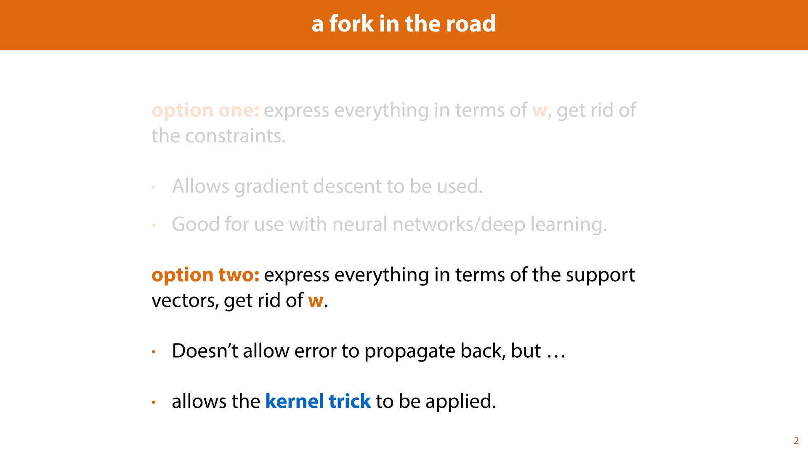

            <figcaption>
            
In the previous video we introduced the maximum margin loss objective. This was a <strong>constrained optimization</strong> problem which we hadn't learned how to solve yet. We sidestepped that issue by rewriting it into an unconstrained optimization problem, so that we could solve it with plain gradient descent. 

In this video, we will learn a relatively simple trick for attacking constrained optimization problems: the method of <strong>Lagrange multipliers</strong>. In the next video, we will see what happens if we apply this method to the SVM objective function.

            </figcaption>
            click image for animation
       </section>

       <section id="slide-003">
            <a class="slide-link" href="https://mlvu.github.io/svms#slide-003" title="Link to this slide.">link here</a>
            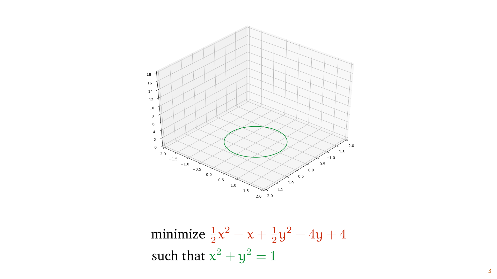

            <figcaption>
            
So we start with <strong>optimization under constraints</strong>. 

First let’s make it a little more intuitive what optimization under constraints looks like. Here, we have a simple constrained optimization problem. We are trying to find the lowest point on some surface, but there is a constraint that we also need to satisfy.   

In this case, the constraint specifies that the solution must lie on the unit circle (that is, x and y together must make a unit vector).  Within that set of points, we want to find the points x and y that result in the lowest value f(x, y). 

This is what is called an <strong>equality constraint</strong>. We have some function of our parameters that needs to be exactly equal to some value for any solution that we will return. 
<aside    >If you have a function of the parameters that needs to be greater than or less than some value, this is called an inequality constraint. We will discuss this in the optional 6th video.</aside><aside    ></aside>
            </figcaption>
       </section>

       <section id="slide-004">
            <a class="slide-link" href="https://mlvu.github.io/svms#slide-004" title="Link to this slide.">link here</a>
            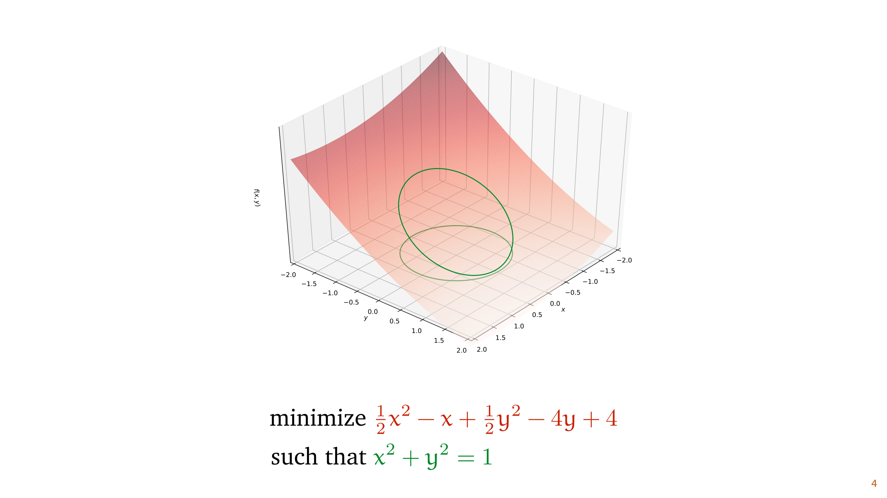

            <figcaption>
            
We can now draw the surface of f. In this case, f is a two-dimensional parabola. We see that if we ignore the constraint, the lowest point is somewhere towards the bottom right. If we move to that point, however, we violate the constraint. 

To figure out how low we can get while satisfying the constraint, we project the constraint region (the unit circle) onto the function, giving us a deformed circle. The constrained optimization problem asks what the lowest point on this deformed circle is.

            </figcaption>
       </section>

       <section id="slide-005" class="anim">
            <a class="slide-link" href="https://mlvu.github.io/svms#slide-005" title="Link to this slide.">link here</a>
            

            <figcaption>
            
The method of  <strong>Lagrange multipliers</strong> is a popular way of dealing with these kinds of problems.  

To give you an idea of where we're going, we will describe the recipe first, with no derivation or intuition. We'll just show you the steps you need to follow to arrive at an answer, and we'll walk through a few examples. Then, we will look at why this recipe actually works. 

First, we need to rewrite the constraint so that it is equal to zero. This is easily done by just moving everything to the left hand side. We call the objective function (the one we want to minimize) f and the left hand side of this constraint g. 

Then, we create a new function L, <strong>the Lagrangian</strong>. This function has the same parameters as f, plus an additional parameter α. It consists of the function f plus or minus the constraint function g times α. The end result will be the same whether we add or subtract g. The parameter α is called a <strong>Lagrange multiplier</strong>.  

We now take the partial derivative of L with respect to all of its arguments (including α), i.e. we compute its gradient, and we set them all equal to 0. The resulting system of equations describes the solution to the constrained optimization problem. If we're lucky, that system of equations can be solved.  
<aside    >As always when we optimize by setting the derivative equal to zero, the solutions may be maxima, minima, saddlepoints or even flat regions that aren't optima (plateaus). Once we've found our solutions, we'll need to use a little common sense to work out which is which. </aside>
Again, there is no reason you should understand from this description why this should work at all. Let's first see the method in action, and then look at why it works.

            </figcaption>
            click image for animation
       </section>

       <section id="slide-006" class="anim">
            <a class="slide-link" href="https://mlvu.github.io/svms#slide-006" title="Link to this slide.">link here</a>
            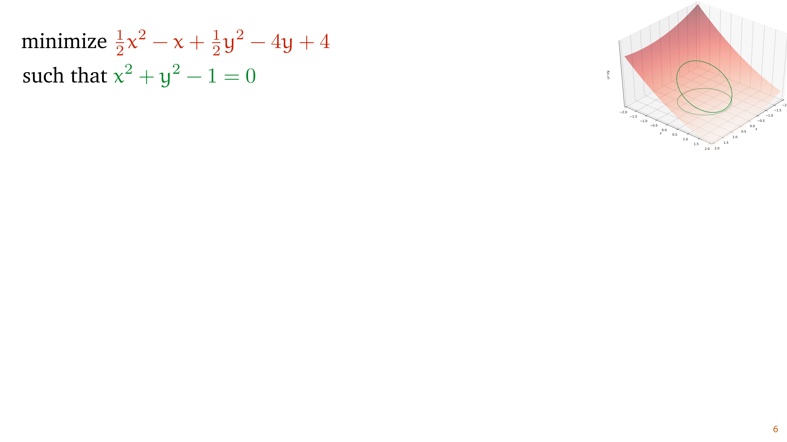

            <figcaption>
            
This is our example problem with the constraint rewritten to be equal to 0. 

The first thing we do is to define our L-function. This is a function in three variables: the x and y from f and the Lagrange multiplier α we've introduced. 

Next we take the three partial derivatives of L with respect to its arguments. We set all of these equal to zero which gives us a system of equations. If we manage to solve this, we work out where the solutions to our problem are. 
<aside    >Note that setting the derivative for the Lagrange multiplier equal to zero recovers the constraint. This is always the case. </aside>
There's no exact recipe for how to work this out in terms of x and y. Here are a few tricks to look out for: 

You can often rewrite the x and y equations to isolate the Lagrange multiplier on the left hand side and then set the right hand sides equal to each other. We'll use this trick in the next slide. 

Often, the constraint is the simplest function. Rewrite this to isolate one of the variables, and then look for another equation where you can easily isolate a variable. 

If you have access to Wolfram Alpha (e.g. if you're not doing an exam) it's a good idea to put<a href="https://www.wolframalpha.com/input/?i=solve+x+-+1+-+2xa+=+0,+y+-+4+-2ya+=+0,+x%5E2+++y%5E2+=1+"><strong class="blue"> the system of equations</strong></a> in, as well as <a href="https://www.wolframalpha.com/input/?i=optimize+(1/2)x%5E2+-x+++(1/2)y%5E2+-4y+++4+on+the+unit+circle"><strong class="blue">the minimization as a whole</strong></a>, to see if the solution looks like one that is easy to solve by hand. Often, Alpha will give you a mess of squares and constants, suggesting that the analytic solution is not pretty, and you might as well solve it numerically. There is no guarantee that this method yields an easily solvable system of equations (unless you're doing a homework problem).

            </figcaption>
            click image for animation
       </section>

       <section id="slide-007" class="anim">
            <a class="slide-link" href="https://mlvu.github.io/svms#slide-007" title="Link to this slide.">link here</a>
            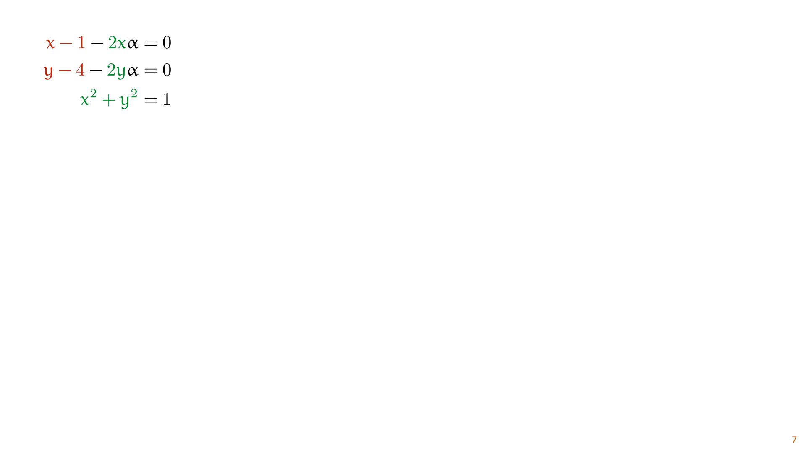

            <figcaption>
            
We are left with the three equations on the top left. It's not always guaranteed that the Lagrangian method leads to a system of equations that can be neatly solved, but in this case it can. Finding such a solution isn't a purely mechanical process, we can't give you a set of steps that always works, but a good place to start is to rewrite the equations for the parameters to isolate the Lagrange multiplier α on the left hand side. 

We then set the right hand sides equal to each other. Moving both denominators to the other sides, we see that the terms 2xy on both sides cancel out. And we are left with y=4x as a condition for our solution. 
<aside    >This example was carefully constructed so that this would happen. Without this bit of luck, the analytical solution becomes very complicated. </aside>
We now use the constraint x2 + y2 = 1 to finish the solution. We put 4x in place of y to give us an equation with only xs to solve, and we put 1/4y in place of x to give us an equation with only ys to solve.  

In both cases, the square means that we get a positive and a negative answer. This gives us four possible solutions. We can check the value of f(x, y) for each to see which is the minimum, or we can look at the plot. The latter option shows that the minimum has a positive x and a negative y, so that must be the solution.

            </figcaption>
            click image for animation
       </section>

       <section id="slide-008" class="anim">
            <a class="slide-link" href="https://mlvu.github.io/svms#slide-008" title="Link to this slide.">link here</a>
            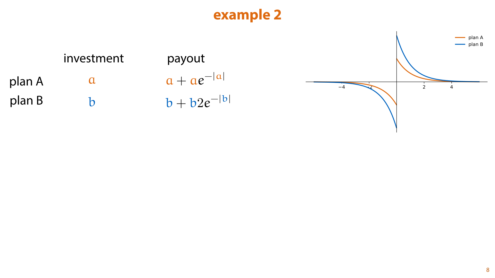

            <figcaption>
            
Before we see why this works, we'll look at one more example. 

Imagine you are given two investment opportunities by a bank. You can use plan A or plan B. Both plans are guaranteed to make money after a year, but the more money you invest, the less you make proportionally (imagine there's a very strict tax system). The curves for the interest you get are shown top right. 

Both are clearly profitable investments, but sadly you don't have any money. What you can do however, is act as a bank yourself. You offer one of the schemes to somebody else. You take their money, and incur a debt. After a year, you'll have to pay them back with the interest, but in the mean time, you can use their money in the other scheme. All we need to do is figure out a point where one scheme makes more money than the other. 

We model this trick by saying you can invest positive or a negative amount in either of the schemes. In that case, the debt you incur is the negative investment, minus the interest. This is why the curve is mirrored for negative investments: you grow your debt by offering an investment to others. 

We'll label your investments as a dollars in scheme A and b dollars in scheme B. Since you have no money of your own, our constraint is that a + b = 0. Everything you get from the person investing with you, you put into the other plan. We want to maximize the amount of money you make after a year, which is the sum of the investments and the interests. 

From the plot, it's clear that plan B always pays more than plan A everywhere (this is necessary for a clean solution), so you should probably use plan B yourself, and offer plan A to somebody else. But how much should invest? The amount you make is proportional to how much you invest, but it also decays, so it's not as simple as just investing as much as you can.

            </figcaption>
            click image for animation
       </section>

       <section id="slide-009" class="anim">
            <a class="slide-link" href="https://mlvu.github.io/svms#slide-009" title="Link to this slide.">link here</a>
            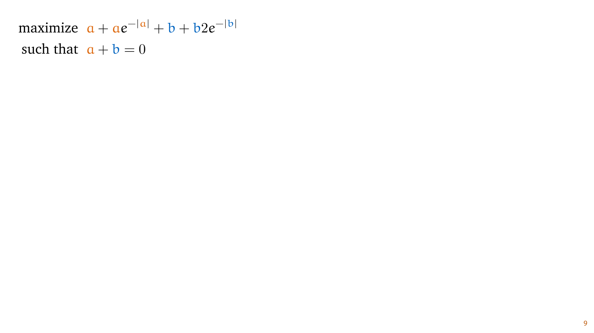

            <figcaption>
            
First, we write down our Lagrangian, which is simply the objective function, plus the constraint function times α. 

We work out the partial derivatives and set them equal to zero. Remember that the derivative of the absolute function |x| is the sign function sign(x).  

We find a solution, again, by isolating the Lagrange multipliers on the left hand side, and setting the right hand sides equal to one another. Then, the constraint tells us very simply that b should be equal to -a, so we fill that in to get an expression in terms of only a, which we can solve. This tells us that |a| = 1, which means we get solutions at a = 1 and a = -1. We can tell from the plot which is the minimum and which is the maximum.

            </figcaption>
            click image for animation
       </section>

       <section id="slide-010">
            <a class="slide-link" href="https://mlvu.github.io/svms#slide-010" title="Link to this slide.">link here</a>
            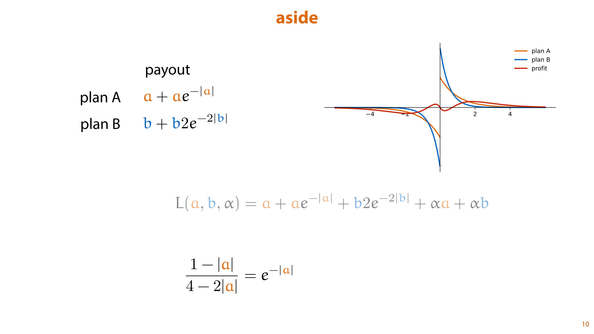

            <figcaption>
            
If we make the interest curves cross, the problem becomes a bit more interesting: which plan is better depends on how much we put in. We don't know beforehand which plan to choose and which to offer.  

We can also attack this problem with the method of Lagrange multipliers. If you do this, you'll likely get stuck at the equation shown below. This tells us the solution, but it doesn't simplify in a straightforward way to a simple answer. This is often the case with more realistic problems.  

Note that this doesn't make the method of Lagrange multipliers useless for such problems. We've still found a solution, we just can't express it better than this. We can easily solve this equation numerically, which would probably give us a much more accurate answer, more quickly than if we'd solved the constrained optimization problem by numerical means in its original form.

            </figcaption>
       </section>

       <section id="slide-011">
            <a class="slide-link" href="https://mlvu.github.io/svms#slide-011" title="Link to this slide.">link here</a>
            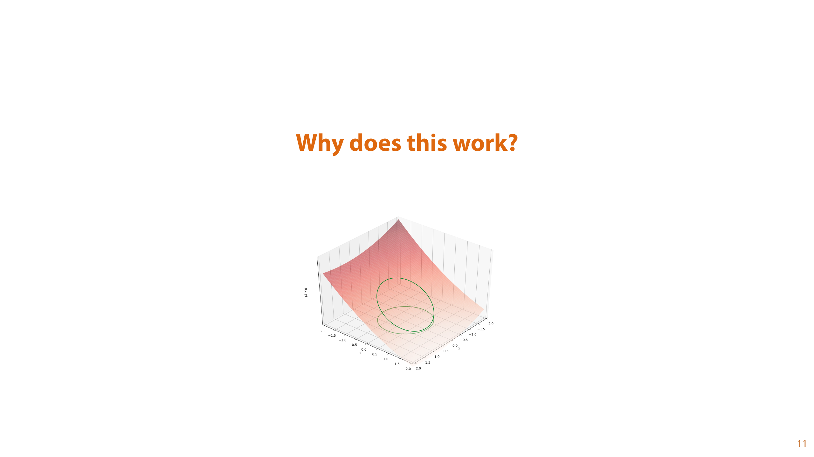

            <figcaption>
            
This has hopefully given you a good sense of <em>how</em> the method works. If you trust us, you can now just apply it, and with a little common sense, you can usually find your way to a solution. 

Still, we haven't discussed why this works. Let's see if we can add a little intuition. To illustrate, we'll return to the parabola we started with.

            </figcaption>
       </section>

       <section id="slide-012" class="anim">
            <a class="slide-link" href="https://mlvu.github.io/svms#slide-012" title="Link to this slide.">link here</a>
            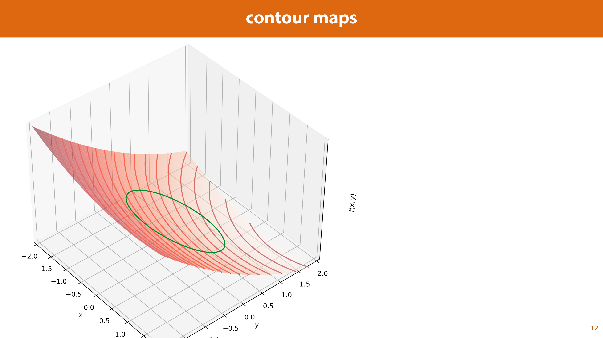

            <figcaption>
            
One way to help us visualize what's happening is to draw <strong>contours</strong> for the function f. These are lines on our function where the output is the same value. For any given value k, we can highlight all the points where f(x, y) = k, resulting in a curved line on the surface of our function.  

If we look down onto the xy plane from above, the z axis disappears, and we get a 2D plot, where the contour lines give us an idea of the height of the function. Note that the function f gets lower towards the top right corner.  
<aside    >This principle is often used in terrain maps to indicate elevation where they are called isolines.</aside><aside    ></aside>
            </figcaption>
            click image for animation
       </section>

       <section id="slide-013" class="anim">
            <a class="slide-link" href="https://mlvu.github.io/svms#slide-013" title="Link to this slide.">link here</a>
            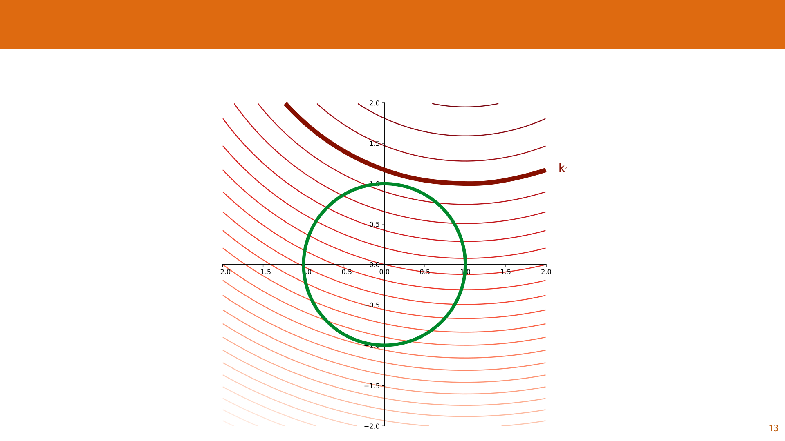

            <figcaption>
            
Each contour line indicates a constant output value for f. We can tell by this plot what we can achieve while sticking to the constraint.. 

The output value k1 is very low (the fourth lowest of the contour lines in this plot), so it would make a good solution, but it never meets the circle representing our constraints. That means that we can’t get the output as low as k1 <em>and</em> satisfy the constraints. 

The next lowest contour we've drawn, with value k2, does give us a contour line that hits the circle representing our constraints. Therefore, we can satisfy our constraints and get at least as low as k2. However, the fact that it <em>crosses</em> the circle of our constrains, means that we can also get <em>lower</em> than k2. This makes sense if you look at the plot: if we drew more contours, we could have one between k1 and k2 that hits the green circle. If we try and get lower and lower without leaving the circle, we see that we would probably end up with the contour that doesn't<em> cross </em>the circle, but just <em>touches</em> it at one point only. A bit like a tangent line, but curved. 

So, for this picture we have three conclusions: 

Any contour line that doesn't meet the constraint region represents a value that we cannot achieve while satisfying the constraints. 

Any contour line that crosses the constraint region represents a value we can achieve, but that isn't the optimum. 

Any contour line that just touches the constraint region is a possible optimum. 

These certainly seem true here. We can use some basic calculus to show that this is true in general. 

            </figcaption>
            click image for animation
       </section>

       <section id="slide-014" class="anim">
            <a class="slide-link" href="https://mlvu.github.io/svms#slide-014" title="Link to this slide.">link here</a>
            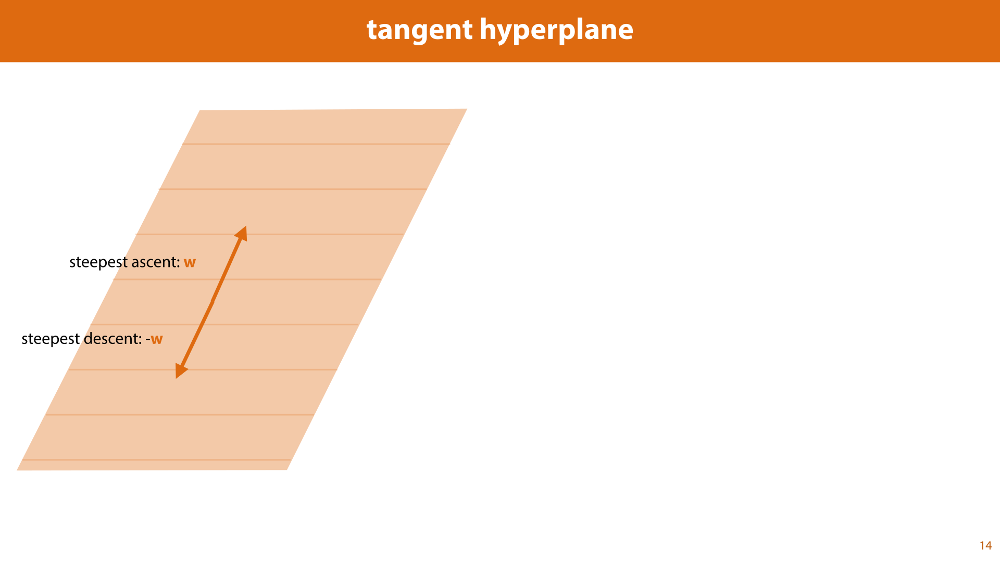

            <figcaption>
            
We'll work out how these ideas look in hyperplanes, and then translate them to general functions. We can always approximate our functions locally with a hyperplane, so the translation should be simple. 

If we have a hyperplane defined by <strong class="orange">w</strong>T<strong>x</strong> + b, then we know that <strong class="orange">w</strong> is the direction of steepest ascent, and -<strong class="orange">w</strong> is the direction of steepest <em>de</em>scent. <strong>This tells us that the direction orthogonal to the line of </strong><strong class="orange">w</strong><strong> is the direction in which the value of the plane doesn’t change</strong>: the direction <strong>of equal value</strong>. If we drew contours on a hyperplane, they would all be lines orthogonal to <strong class="orange">w</strong>. 

This means that if we take any point on our function f and work out the tangent hyperplane of f at that point, that is, compute the gradient, <strong>the direction orthogonal to the gradient points along the contour line</strong>.  
<aside    >The contour line is a curve, so to keep constant value, a straight line is not enough, but if we zoom in close enough, the tangent hyperplane is a close approximation, and the contour line will be a straight line orthogonal to the gradient. </aside>
In this case, since our contour line <em>crosses</em> the circle of the constraints, the direction of equal value doesn’t point along the circle for the constraints, and we can conclude that the value of f decreases in one direction along the circle and increases in one direction. Put simply, we are not at a minimum.

            </figcaption>
            click image for animation
       </section>

       <section id="slide-015" class="anim">
            <a class="slide-link" href="https://mlvu.github.io/svms#slide-015" title="Link to this slide.">link here</a>
            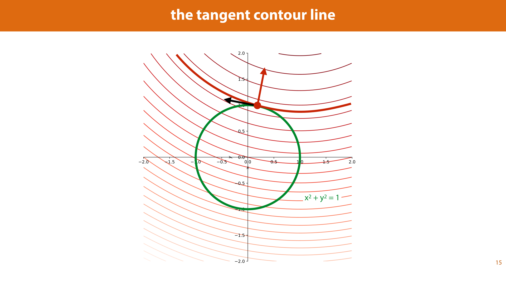

            <figcaption>
            
By this logic, the only time we can be sure that there is no lower to go along the circle is when the direction of equal value points along the circle. In other words, <strong>when the contour line is tangent to the circle</strong>: when it touches it only at one point without crossing it.  

How do we work out where this point is? By recognizing that <strong>the circle for our constraints is </strong><em>also</em><strong> a contour line</strong>. A contour of the function x2 + y2, for the constant value 1.  

When the gradient of x2 + y2 points in the same or opposite direction as that of f, then so do the vectors orthogonal to them, which are the directions of equal value for f and for g respectively. And when that happens we have a minimum or maximum for our objective. 
<aside    >In this picture we've matched the steepest descent direction of the constraint with the steepest ascent direction of the objective function. This makes for a clearer picture, but the method also works if we match up the steepest ascent directions of both. Only when we start looking at inequality constraints do we need to be more careful about this.</aside><aside    ></aside>
            </figcaption>
            click image for animation
       </section>

       <section id="slide-016" class="anim">
            <a class="slide-link" href="https://mlvu.github.io/svms#slide-016" title="Link to this slide.">link here</a>
            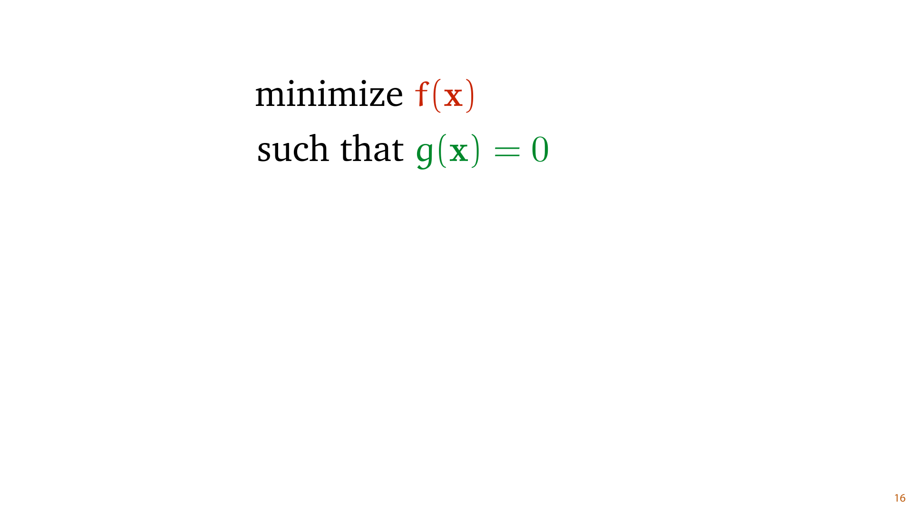

            <figcaption>
            
These are the two basic insights we've just discussed. We look at the contour lines of f and g, and note that the the constraint region is just the contour line of g for the value 0. 

At any point where they cross, we've shown there can't be a minimum. At any point where they don't touch at all, we're outside the constraint region. The only other option is that they are <em>tangent</em>: that is, they just touch. 

To work out where two curves just touch, we note that the vectors that point along the curve must lie on the same line. These are the directions of equal value of f and g respectively, which are the vectors orthogonal to the gradients of f and g. So instead of looking for where the directions of equal value point in the same direction, we can just <strong>look where the gradients point in the same direction</strong>. This is something that we can write down symbolically. 
<aside    >There may be other points where this condition is also true, like maxima and saddle points, but these are usually easy to eliminate in practice.</aside><aside    ></aside>
            </figcaption>
            click image for animation
       </section>

       <section id="slide-017" class="anim">
            <a class="slide-link" href="https://mlvu.github.io/svms#slide-017" title="Link to this slide.">link here</a>
            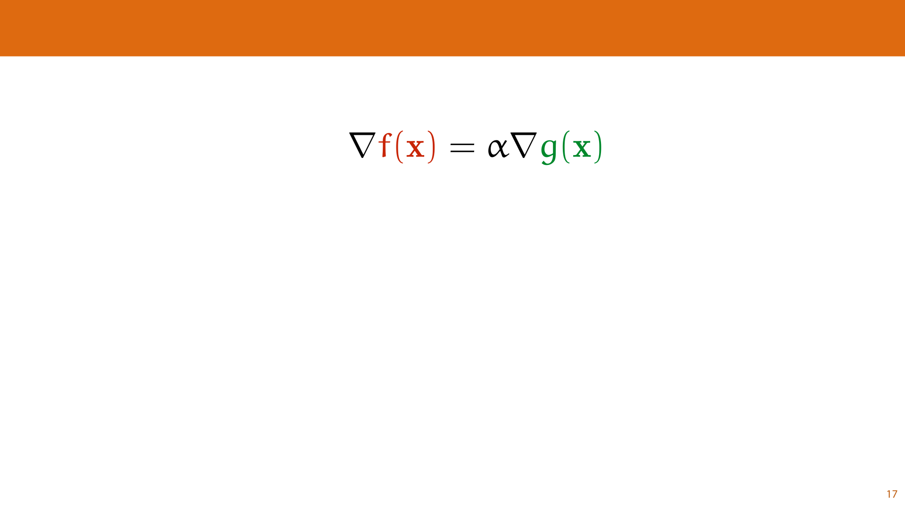

            <figcaption>
            
We are looking for gradients pointing in the same (or opposite) direction, <strong>but not necessarily of the same size</strong>. To state this formally, we say that there must be some value α, such that the gradient of f is equal to the gradient of g <em>times α</em>. 

We rewrite to get something that must be equal to zero. By moving the gradient symbol out in front (the opposite of what we usually do with gradients), we see that what we’re looking for is the point where the gradient of some function is equal to zero. This function, of course, is the Lagrangian. 

What we see here is that at the optimum, the derivative of the Lagrangian wrt to the parameters <strong>x</strong>, is zero. This shows why we want to take the derivative of the Lagrangian wrt <strong>x</strong>, and set it to zero. It doesn't yet tell us why we also take the derivative with respect to α, and set that equal to zero as well.

            </figcaption>
            click image for animation
       </section>

       <section id="slide-018">
            <a class="slide-link" href="https://mlvu.github.io/svms#slide-018" title="Link to this slide.">link here</a>
            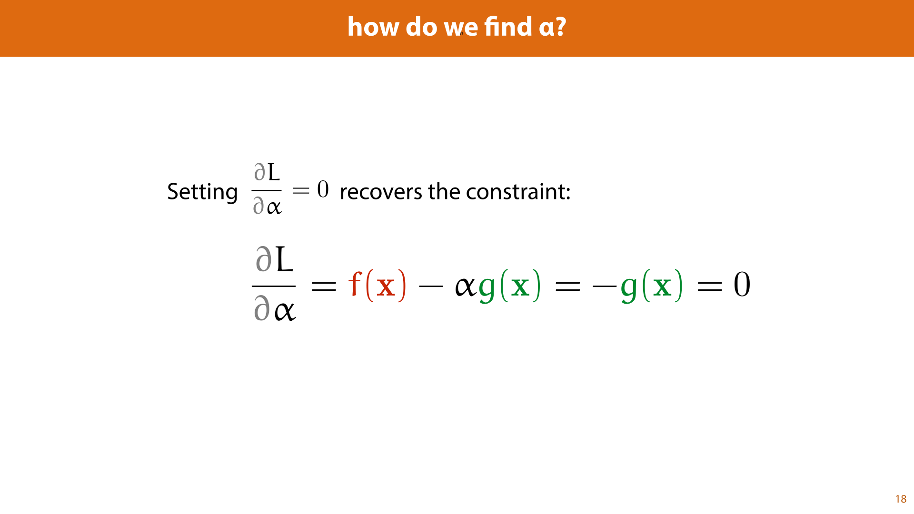

            <figcaption>
            
All we need to do now is to figure out what α is. What we've seen is that at the optimum, α is the ratio of the size of the gradient of f to the size of the gradient of g, 

The recipe we've already seen just takes the derivative of L wrt α, same as we do wrt to <strong>x</strong>, and sets it equal to zero. It's not immediately intuitive that this is the right thing to do.  

You may think that by setting L ∂L/∂α = 0, we are choosing α to optimize the value of L. But L expresses the difference between f(x) and αg(x), not the difference between their gradients. There is no intuitive reason why we'd want f(x) and αg(x) to be close together in value, we only want their gradients to match. Our problem statement says that g(x) should be 0, and that the gradients of f and g should be the same. 

What's more, we could also have <em>added</em> f(x) and αg(x), according to the recipe, and got the same result. So why does setting ∂L/∂α = 0 give us the correct α? 

One way to look at this is that this simply <strong>recovers the constraint</strong>. The multiplier α only appears in front of g(<strong class="green">x</strong>) so taking the derivative w.r.t. α just isolates g(<strong class="green">x</strong>) and sets it equal to zero. This also shows why we can add or subtract the Lagrange multiplier: -g(<strong class="green">x</strong>) = 0 and g(<strong class="green">x</strong>) = 0 have the same solution. 

This should be enough to convince us that we are doing the right thing, but it's worth investigating what this function L actually looks like. 

We can ask ourselves, if we fix <strong>x</strong>, and find the zero of ∂L/∂α this way, aren't we somehow optimizing L? This becomes even more mysterious when we realize that as a function of α, L is simply a 1D linear function (f(<strong class="red">x</strong>) and g(<strong class="green">x</strong>) are constant scalars if we take this to be a function of α). The maxima and minima of a linear function are off to positive and negative infinity respectively, so how can we be optimizing a linear function?  

The answer is that when the constraint is satisfied we know that g(<strong class="green">x</strong>) = 0. This means that L = f(<strong class="red">x</strong>) - αg(<strong class="green">x</strong>) = f(<strong class="red">x</strong>), and L becomes constant function: a flat horizontal line. 

 In other words, if the constraint isn't satisfied L = f(<strong class="red">x</strong>) - αg(<strong class="green">x</strong>) is a linear function, with no optima, so ∂L/∂α = 0 has no solutions. If and only if the constraint is satisfied does ∂L/∂α = 0 have a solution, so requiring that ∂L/∂α = 0, is the same as requiring that the constraint is satisfied.

            </figcaption>
       </section>

       <section id="slide-019">
            <a class="slide-link" href="https://mlvu.github.io/svms#slide-019" title="Link to this slide.">link here</a>
            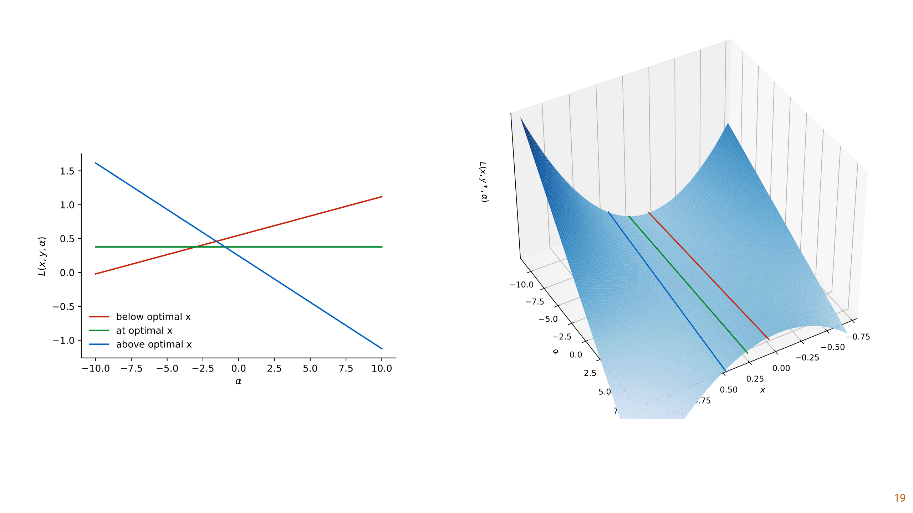

            <figcaption>
            
This is a slightly complex and subtle point to understand about the shape of the Lagrangian function. Where its gradient is 0, it forms a <strong>saddlepoint</strong> (a minimum in one direction and a maximum in another), but that's not necessarily because we are minimizing over <strong>x</strong> and maximizing over α. It's more correct to say that at the optimum for <strong>x</strong>, L as a function of α <em>is constant </em>(it has the same value for all α). When <strong>x</strong> is not at its optimum, L is a linear function of α. 

On the left we've plotted L as a function of α at and near the optimal values of x and y for our example function. When we move x slightly away from the optimum, the function f(<strong class="red">x</strong>) - αg(<strong class="green">x</strong>) becomes some linear function of α. Only when g(<strong class="green">x</strong>) = 0, do we get a constant function. 

On the right, we see the same picture in 3D. We've fixed y at the optimal value and varied x and α. The lines from the plot on the left are highlighted. The solution to the problem is in the exact center of the plot. Note that we have a saddlepoint solution, but it doesn't necessarily have its minimum over x and its maximum over α. 

This is also why we can't find the Lagrangian solution with gradient descent. Gradient descent can be used to find minima, but it doesn't settle on saddlepoints like these.  
<aside    >In the methods we use for inequality constraints, we can arrange things so that we are always minimizing over x and maximizing over α. This allows some tricks that don't quite work in this simpler setting. </aside><aside    ></aside>
            </figcaption>
       </section>

       <section id="slide-020" class="anim">
            <a class="slide-link" href="https://mlvu.github.io/svms#slide-020" title="Link to this slide.">link here</a>
            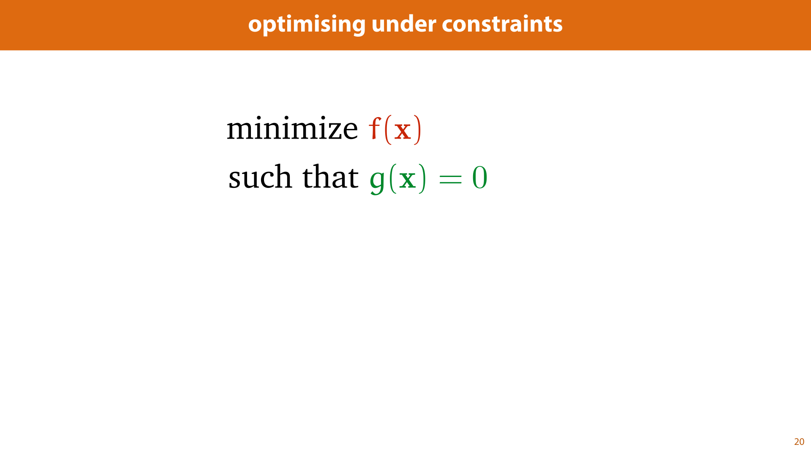

            <figcaption>
            
And with that, we have the method of Lagrange multipliers. 

We rewrite the problem so that he constraints are some function that needs to be equal to zero. Then we create a new function L, which consists of f with α times g subtracted (or added). For this new function <strong>x</strong> and α are both parameters. Then, we solve for both <strong>x</strong> and α. 

This new function L has an optimum where the original function is minimal within the constraints. The new optimum is a <strong>saddlepoint</strong>. This means we can’t solve it easily by basic gradient descent, we have to set its gradient equal to zero, and solve <em>analytically</em>.

            </figcaption>
            click image for animation
       </section>

       <section id="slide-021" class="anim">
            <a class="slide-link" href="https://mlvu.github.io/svms#slide-021" title="Link to this slide.">link here</a>
            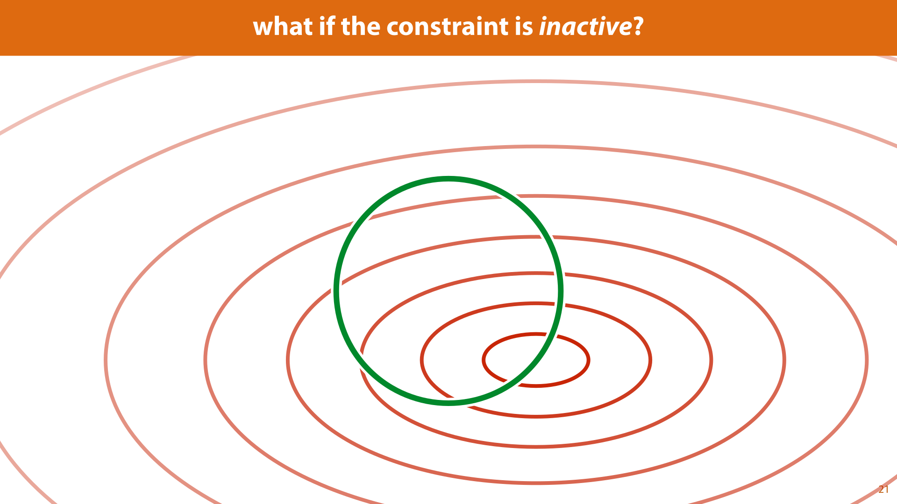

            <figcaption>
            
To deepen our understanding, and to set up some things that are coming up, we can ask ourselves what happens when we have an <em>inactive</em> constraint. What if the global minimum is inside the constraint region, so the solution would be the same with and without the constraint? Ideally, the Lagrangian method should still work, and give us the global minimum. 

In such a case, the gradient of f(<strong class="red">x</strong>) will be the zero vector, since it's at a global minimum. The gradient of g(<strong class="green">x</strong>) <em>won't </em>be the zero vector, since we're at a contour of g(<strong class="green">x</strong>). Is this an optimum if the gradients aren't pointing in the same direction? 

 

 

            </figcaption>
            click image for animation
       </section>

       <section id="slide-022">
            <a class="slide-link" href="https://mlvu.github.io/svms#slide-022" title="Link to this slide.">link here</a>
            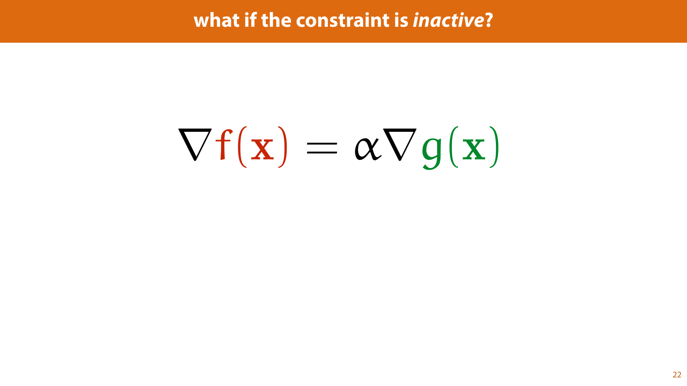

            <figcaption>
            
They are, if we set α to 0. Then the term  α∇g(<strong class="green">x</strong>) is reduced to the zero vector and it's equal to ∇f(<strong class="red">x</strong>) which is equal to the zero vector. 

So why doesn't this always work, even when we have an active constraint? Why can't we always set α=0 and collapse the gradient of the constraint function, so that it's always pointing in all directions at once? The answer is that if we set α equal to zero, we are forcing ∇f(<strong class="red">x</strong>) to the zero vector, so to its global minimum, which is normally outside the constraint. If we then attempt to solve ∂L/∂α = 0, we will not find a solution. 
<aside    >If these questions make little sense to you the answer won't either. In that case, it's probably best to just try the basic recipe of Lagrange multipliers a few times on the homework exercises and exam questions and to come back to these questions later to develop your understanding of what's happening.</aside><aside    ></aside>
            </figcaption>
       </section>

       <section id="slide-023">
            <a class="slide-link" href="https://mlvu.github.io/svms#slide-023" title="Link to this slide.">link here</a>
            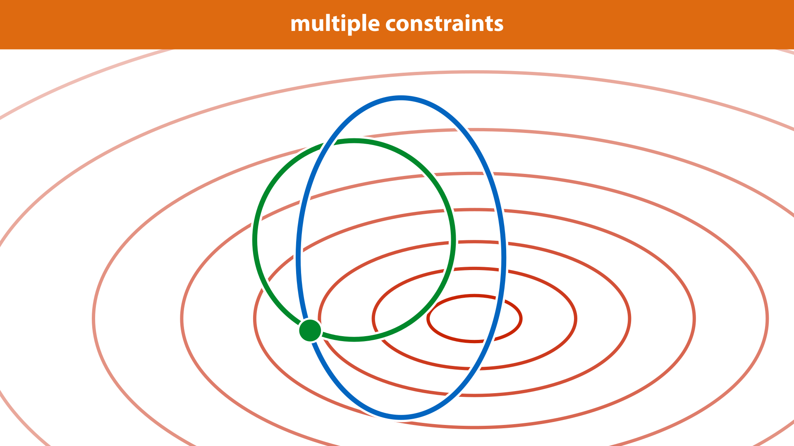

            <figcaption>
            
Finally, If we have <strong>multiple constraints</strong>, the method extends very naturally. With two constraints, we get three gradients: one for the objective function and two for the constraints.We want all all three to be pointing in the same direction, so we add all gradients together, with separate mulitpliers for each constraint. This sum should be equal to zero. 
<aside    >In this picture, the constraints by themselves already form a system of equations with only two point solutions. We still find these if we solve the Lagrangian, but at the solution the gradients don't point in the same direction. For a system with multiple constraints where the gradients come in, we need an active constraint region that is larger than a few individual points, which is difficult to do wityh equality constraints in 2 dimensions. </aside><aside    ></aside>
            </figcaption>
       </section>

       <section id="slide-024">
            <a class="slide-link" href="https://mlvu.github.io/svms#slide-024" title="Link to this slide.">link here</a>
            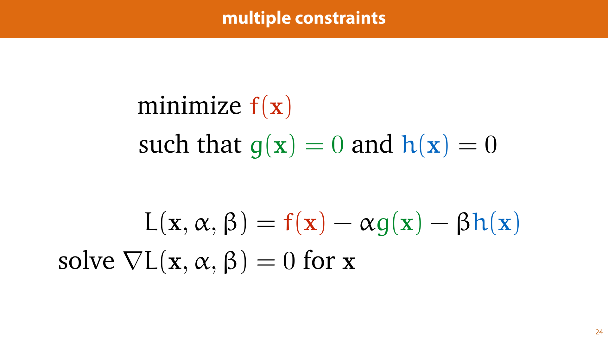

            <figcaption>
            
Here's what that looks like for two constraints. We end up adding a term to the Lagrangian for each constraint, each with a new multiplier. 

Note that if any of these constraints happens to be inactive, we will simply end up setting their multiplier to zero, and we will very naturally recover the problem with only the active constraints.

            </figcaption>
       </section>

       <section id="slide-025">
            <a class="slide-link" href="https://mlvu.github.io/svms#slide-025" title="Link to this slide.">link here</a>
            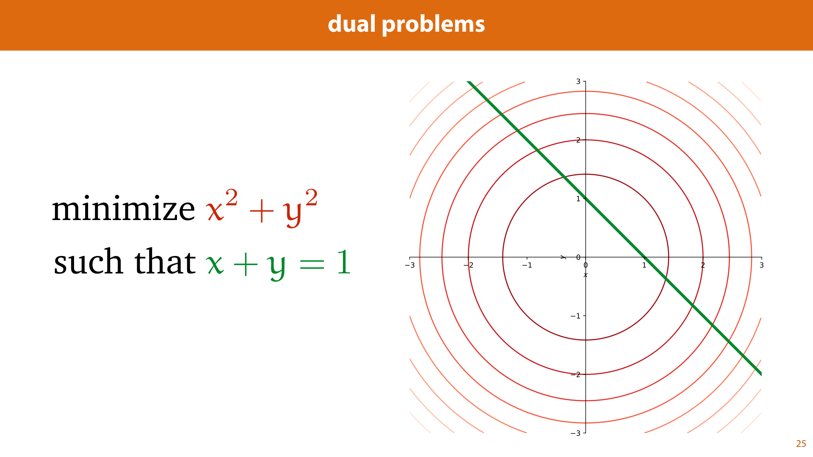

            <figcaption>
            
Sometimes a problem is too complex to solve use the Lagrangian method. In such cases, you can often still use the method, but instead of solving the problem, you turn one optimization into another one. This second problem is called the <strong>dual problem</strong> of the first. Under the right conditions, the solution to the dual problem also gives you the solution to the original problem. 

This is why the Lagrangian method is relevant to the subject of SVMs: we can't solve the SVM problem analytically, but we<em> can</em> rewrite it into a different problem. 

To illustrate the principle in its most basic form on this very simple problem. To see how it works in detail, and most importantly when it does and doesn't work, you'll have to watch the sixth video.

            </figcaption>
       </section>

       <section id="slide-026">
            <a class="slide-link" href="https://mlvu.github.io/svms#slide-026" title="Link to this slide.">link here</a>
            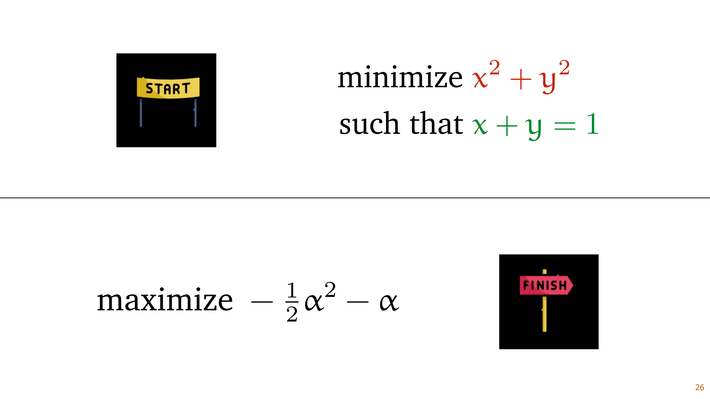

            <figcaption>
            
Here's our start and end points. This problem is very easy to solve explicitly of course, but we'll show you how to translate it to give you a sense of the principle. That way, when we make this step with SVMs, you'll hopefully  understand the basic idea of what's happening, even if you skip the full derivation. 

Note that in the dual problem, the x and y have disappeared and been replaced with α's. These are the Lagrange multipliers: the basic idea is that we set up the Lagrangian, set its derivative equal to zero, and then <strong>rewrite everything in terms of the Lagrange multipliers</strong>, getting rid of all other constraints.

            </figcaption>
       </section>

       <section id="slide-027" class="anim">
            <a class="slide-link" href="https://mlvu.github.io/svms#slide-027" title="Link to this slide.">link here</a>
            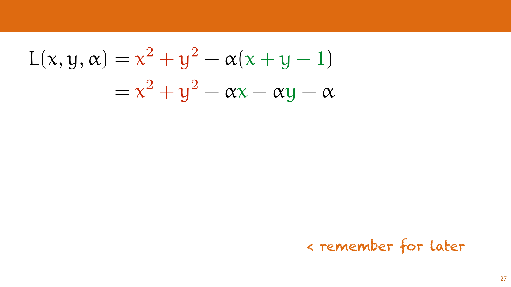

            <figcaption>
            
The first step is the same as before: we set up the Lagrangian, and set its derivative equal to zero. 

We then deviate from the standard approach by rewriting these equations to isolate x and y on the left-hand side. We express both as equations of α only (note that we need to be a bit lucky with our problem to be able to do this). 

The derivative with respect to α, <strong>we don't fill in</strong>. We will hold on to this, and use it in a different way.

            </figcaption>
            click image for animation
       </section>

       <section id="slide-028" class="anim">
            <a class="slide-link" href="https://mlvu.github.io/svms#slide-028" title="Link to this slide.">link here</a>
            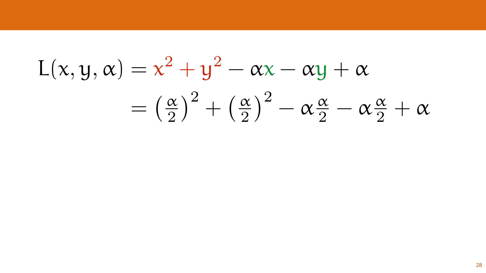

            <figcaption>
            
What we can now do is fill these back into the original Lagrangian. Whatever x and y are at the optimum, the Lagrangian should take this value in terms of the Lagrange multipliers α. 

Now, we require a bit of mental gymnastics. We still have the unused bit of knowledge that at the optimum, the derivative of the Lagrangian should be equal to zero. That's still true of this Lagrangian. In this case, we know how to work that out explicitly, <strong>but imagine that this was too complicated to do</strong> either because the function is too complex, or because there are more constraints active that make things complicated. 

Another route we can take is to recognize that the equation ∂L/∂α = 0 <strong>describes an optimum of L</strong>. We saw earlier that in the 3D space of (x, y, α) that ∇L is always <strong>0</strong> at a saddle-point. It turns out, that if we rewrite it like this, expressed in terms of only α, and we get a bit lucky, the optimum corresponds to a minimum or a maximum in α. In this case, L is a second order polynomial in α, so it must have only one minimum or maximum.

            </figcaption>
            click image for animation
       </section>

       <section id="slide-029">
            <a class="slide-link" href="https://mlvu.github.io/svms#slide-029" title="Link to this slide.">link here</a>
            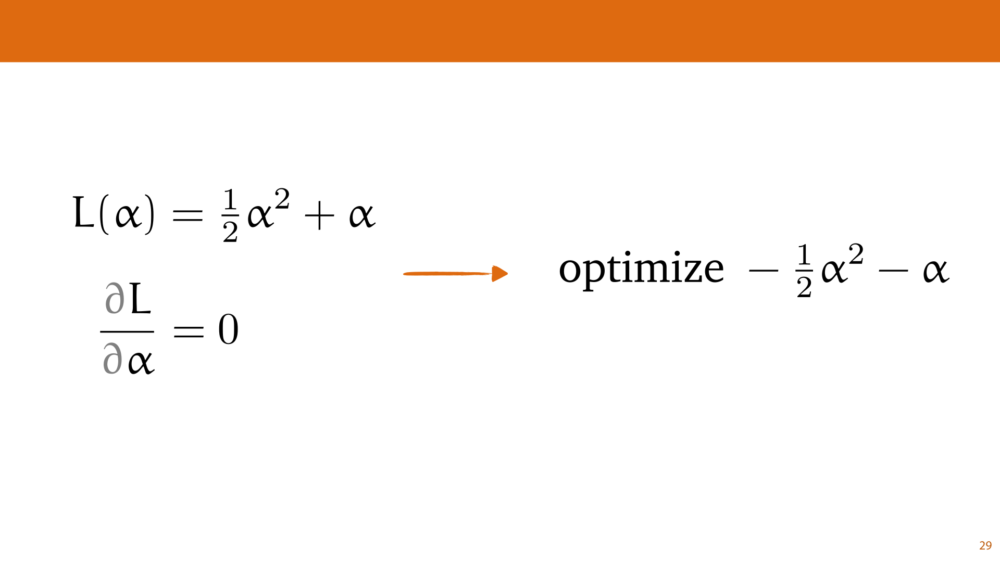

            <figcaption>
            
Here's the trick in a nutshell. We rewrite the Lagrangian to express it in α. We are assuming the conditions that hold at the optimum, so this form only holds for the optimal x and y. Then we add the assumption that ∂L/∂α = 0, and we treat this as an optimization objective. 

We are essentially doing the opposite of what we normally do. We normally start with an optimization objective and set the function's derivative equal to zero. Here we work out a function, assume it's derivative is equal and suppose that this corresponds to the solution to an optimization objective.  

At this point, we don't know whether we'll get a maximum or a minimum, or even a plateau or a saddlepoint. We'll just have to check by hand and hope for the best. In this case, it turns out we get a rather neat maximum, but then this was a particularly simple problem.

            </figcaption>
       </section>

       <section id="slide-030" class="anim">
            <a class="slide-link" href="https://mlvu.github.io/svms#slide-030" title="Link to this slide.">link here</a>
            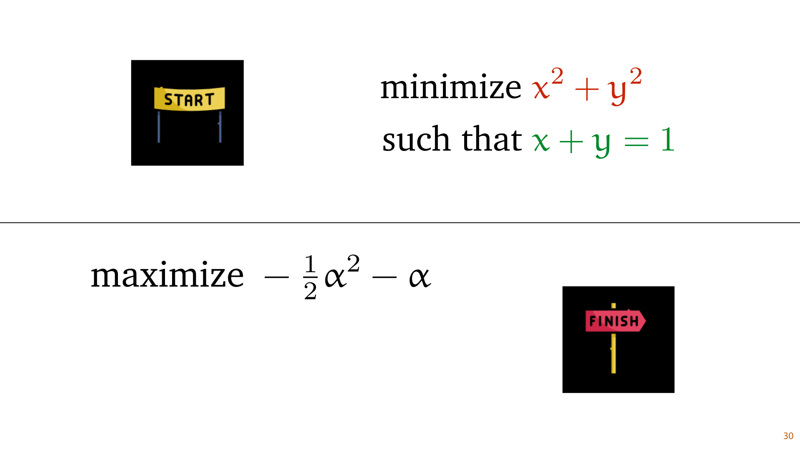

            <figcaption>
            
And with that, we have our dual problem. A different optimization problem, that we can use to solve the first. We just optimize for α, and use the relations we worked out earlier to translate the optimal α back to the optimal x and y. 

This is all a bit handwavy, and if you work out a dual problem in this way, you should always keep your eyes wide open and double check that everything works out as you'd hoped. <strong>None of this is guaranteed to work, if you do it like this</strong>.<strong> </strong>

If you want a more grounded and formal approach, we need to work out the dual problem slightly differently. This is a bit too much for a BSc level course, but we've included the basics in the sixth video for the sake of completeness. 
<aside    >In general, if you want to work out dual problems, it's best to dig a little deeper in to the matter so you get stronger guarantees that what you're doing is correct. The only thing we hope to achieve here is to show the basic principle of working out dual problems, so you get a sense of what's happening when we apply this trick to SVMs.</aside><aside    ></aside>
            </figcaption>
            click image for animation
       </section>

       <section id="slide-031">
            <a class="slide-link" href="https://mlvu.github.io/svms#slide-031" title="Link to this slide.">link here</a>
            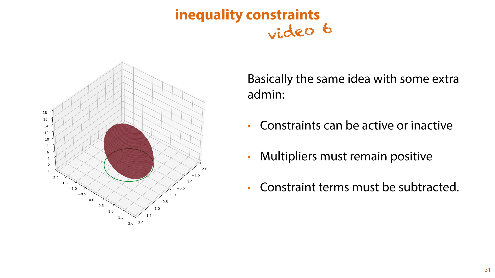

            <figcaption>
            
Equality constraints are relatively rare. It's more often the case that you'll run into a an<strong> </strong><em>in</em><strong>equality constraint</strong>: some quantity that is allowed to be equal to or larger than 0, for instance. In such cases, the constraint region becomes a filled-in area in which the solution is allowed to lie. 

Optimization with inequality constraints is not part of the exam, but it is necessary to derive SVMs. If you're not interested in the details, just remember that it's basically the same approach, except we need a little extra administration. If you want to know the details, you can check out part 6 of this lecture.

            </figcaption>
       </section>

       <section id="slide-032">
            <a class="slide-link" href="https://mlvu.github.io/svms#slide-032" title="Link to this slide.">link here</a>
            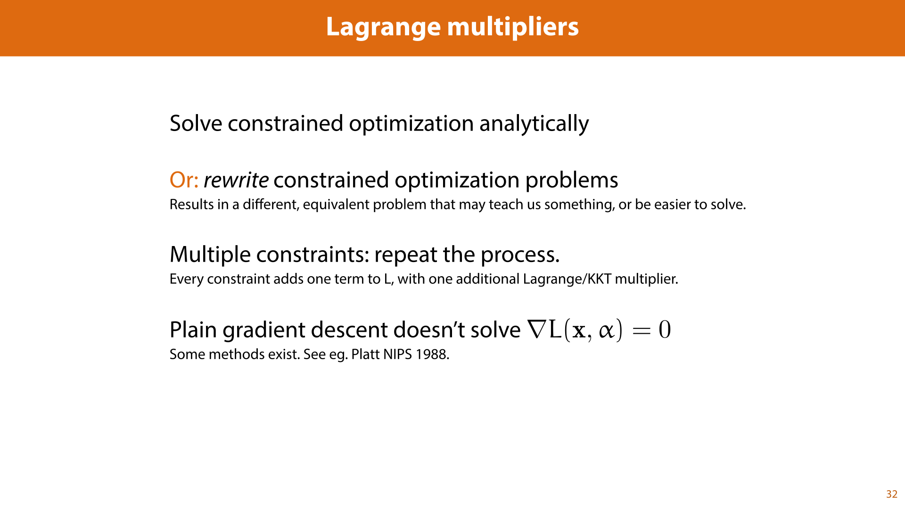

            <figcaption>
            
In the next video, we will return to our constrained optimization objective and apply the KKT method to work out the Lagrangian dual. As we will see, this will allow us to get rid of all parameters except the KKT multipliers

            </figcaption>
       </section>

       <section class="video" id="video-032">
           <a class="slide-link" href="https://mlvu.github.io/svms#video-32">link here</a>
           <iframe
                src="https://www.youtube.com/embed/rILXgY0IHxA"
                title="YouTube video player"
                frameborder="0" allow="accelerometer; autoplay; clipboard-write; encrypted-media; gyroscope; picture-in-picture"
                allowfullscreen>
           </iframe>

       </section>

       <section id="slide-033">
            <a class="slide-link" href="https://mlvu.github.io/svms#slide-033" title="Link to this slide.">link here</a>
            

            <figcaption>
            
Errata: in the video, the optimization objective for the dual is a minimization objective when it should be a maximization objective. In the notes below, we take the negative of this objective. 

 

            </figcaption>
       </section>

       <section id="slide-034">
            <a class="slide-link" href="https://mlvu.github.io/svms#slide-034" title="Link to this slide.">link here</a>
            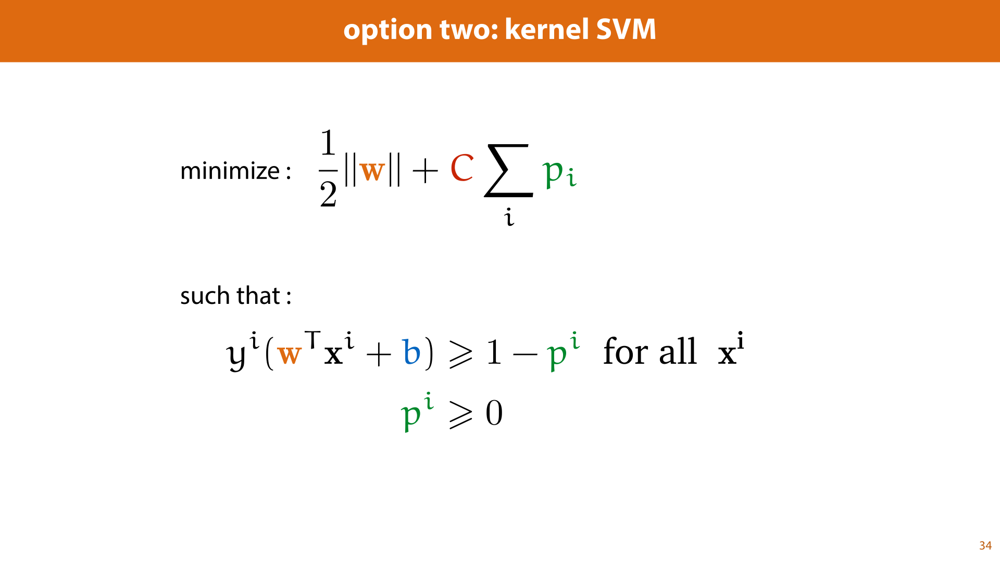

            <figcaption>
            
Here is the original optimization objective again, before we started rewriting. We will use the method of Lagrange multipliers to rewrite this objective to its<strong> dual problem</strong>.

            </figcaption>
       </section>

       <section id="slide-035">
            <a class="slide-link" href="https://mlvu.github.io/svms#slide-035" title="Link to this slide.">link here</a>
            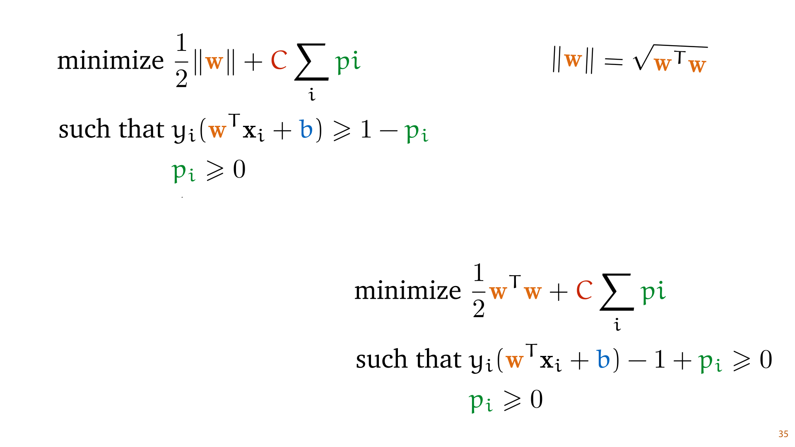

            <figcaption>
            
First, we rewrite the objective function and the constraints a little to make things easier down the line. We turn the norm of <strong class="orange">w</strong> into its dot product. This is just a question of removing the square root so it doesn't change the location of the minimum. 

In the constraints, we move everything to the right, so that all constraints are "greater than or equal to 0."

            </figcaption>
       </section>

       <section id="slide-036">
            <a class="slide-link" href="https://mlvu.github.io/svms#slide-036" title="Link to this slide.">link here</a>
            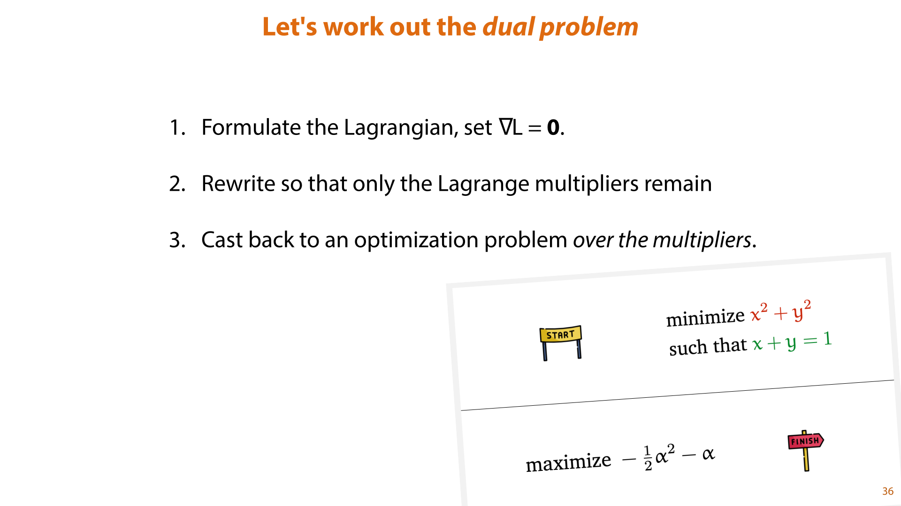

            <figcaption>
            
As we announced already, the SVM view follows from working out the dual problem to the soft margin SVM problem.  

We've seen this done for a simple problem already: (1) we work out the Lagrangian, set its partial derivatives equal to zero, (2) we use these equations to rewrite the Lagrangian to eliminate all variables except the Lagrange mulitpliers, (2) we cast the solution back to an optimization problem, optimizing only over the multipliers.

            </figcaption>
       </section>

       <section id="slide-037">
            <a class="slide-link" href="https://mlvu.github.io/svms#slide-037" title="Link to this slide.">link here</a>
            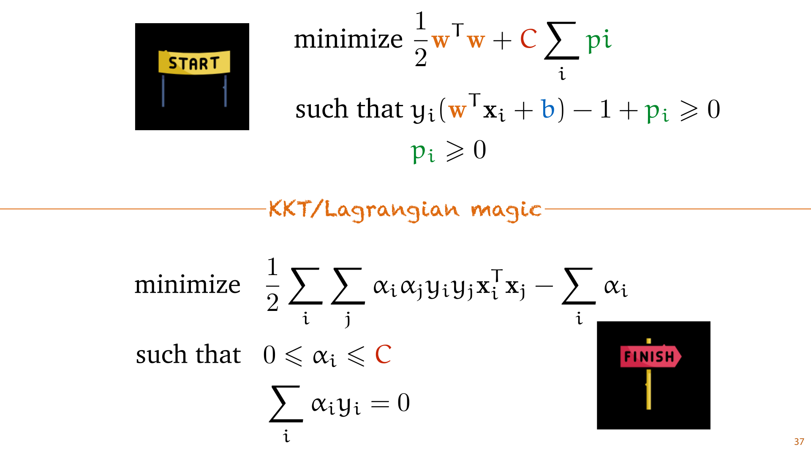

            <figcaption>
            
Here, we will skip a step. This derivation is simply too long and complicated for a BSc course. We will just show you the optimization problem at the top, and tell you that if you set up the Lagrangian and work out the dual problem, and do a little rewriting, you end up with the objective at the bottom.  

 

There's an optional sixth video, for if you really want or need to know how this works, but if you don't, you can take my word for it: these two problems lead to the same solution, which is the maximum margin hyperplane.

            </figcaption>
       </section>

       <section id="slide-038">
            <a class="slide-link" href="https://mlvu.github.io/svms#slide-038" title="Link to this slide.">link here</a>
            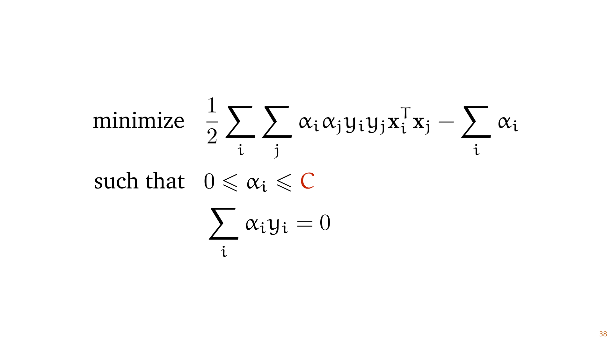

            <figcaption>
            
You may need to stare at the dual problem a little bit to see what you are looking at. 

 

Note the following: 

The α's are the Lagrange multipliers that were introduced for the first constraint of each point. That is, we are assigning each instance in the data a number alpha. Remember from the previous video that at the optimum, these are 0 if the constraint is inactive, and nonzero if the constraint is active. 

The α's are the only <em>parameters</em> of the problem. The <strong>x</strong>'s and y's are simply values from the data. 

The second constraint also received a multiplier, βi, but this was removed from the optimization in rewriting. 

The first problem sums once over the dataset. The second sums twice, with indices i and j. This means we are essentially looking at two nested loops, looking at all pairs of instances over the data. 

For each pair, of any two instances, we compute the product of their multipliers αiαj, the product of their labels yiyj and their dot product. Summing these all up, we get the quantity that we want to minimize. 

Because we started with a problem with inequality constraints, we don't end up with a problem without constraints. Instead we get a problem with constraints over the multipliers. 

There is also a kind of penalty term keeping the sum of all alphas down. 

The slack parameter C now functions to keep the alphas in a fixed range. 

The final line says that the sum of all the alphas on the positive examples must equal the sum of all the alphas on the negative examples. 

 

Finally, note that unlike in the Lagrangian examples, we haven't ended up with anything we can solve analytically. We've just turned one constrained optimization problem into another one. We'll still need a solver that can handle constrained optimization problems. We won't go into the details, but the <a href="https://en.wikipedia.org/wiki/Sequential_minimal_optimization"><strong class="blue">SMO algorithm</strong></a> is a popular choice for SVMs. 

            </figcaption>
       </section>

       <section id="slide-039" class="anim">
            <a class="slide-link" href="https://mlvu.github.io/svms#slide-039" title="Link to this slide.">link here</a>
            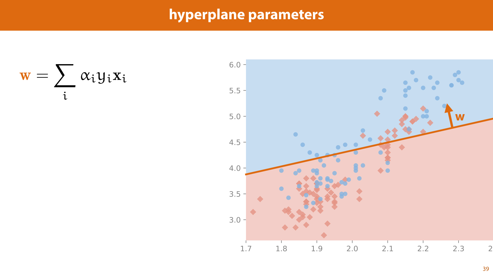

            <figcaption>
            
Of course the solution means nothing to us in terms of the Lagrange multipliers, since these are variables that we introduced ourselves. Once we've found the optimal multipliers, we need to translate them back to a form that allows us to make classifications. 

The simplest thing to do is to translate them back to the hyperplane parameters <strong class="orange">w</strong> and b. As we saw in the previous video, the relation between the multipliers and the parameters of the original problem usually emerges from setting the Lagrangian derivative equal to zero. From this, we see that the vector <strong>w</strong> is a weighted sum over the support vectors, each multiplied by its label. 

This makes sense if you remember that <strong class="orange">w</strong> is the direction in which the hyperplane ascends the quickest. That is, it's the direction in which our model thinks the the points become most likely to be positive. In this sum, we are adding together all the positive support vectors, weighted by their Lagrange multiplier, and subtracting the same sum for the negative support vectors. 

            </figcaption>
            click image for animation
       </section>

       <section id="slide-040" class="anim">
            <a class="slide-link" href="https://mlvu.github.io/svms#slide-040" title="Link to this slide.">link here</a>
            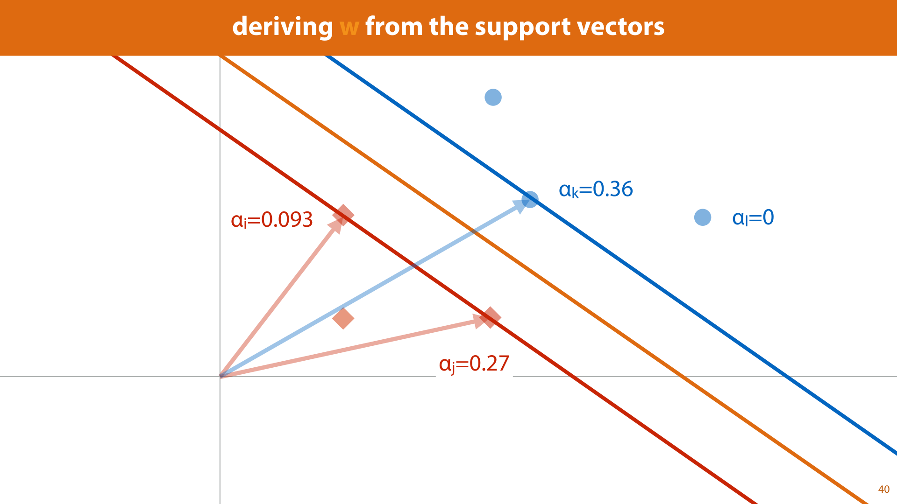

            <figcaption>
            
Here's a visualization of how the different Lagrange multipliers combine to define <strong class="orange">w</strong>. We have two support vectors for the negative class, and one for the positive class. The weights for both classes need to sum to the same value (the second constraint in the dual problem), so the weights for the negative vectors need to be half that of the weight for the positive vector. 

The second term in the objective function tells us that we'd like the multipliers to be as big as possible, and the first constraint suggests that the largest multiplier can be no bigger than C. Assuming we've set C=1, we get the multiplier values shown here. 

The relation in the previous slide now tells us that at the optimum, <strong class="orange">w</strong> is the weighted sum of all suppoort vectors, with the negative ones subtracted and the positive ones added. 

If we scale the support vectors by the multipliers, we can draw a simple vector addition to show how we arrive at <strong class="orange">w</strong>. 

            </figcaption>
            click image for animation
       </section>

       <section id="slide-041" class="anim">
            <a class="slide-link" href="https://mlvu.github.io/svms#slide-041" title="Link to this slide.">link here</a>
            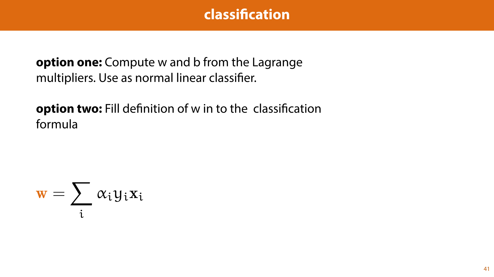

            <figcaption>
            
Once we have our solution in terms of the Lagrange multipliers, we need to use them somehow to work out what class to assign to a new point that we haven't seen before. 

The first option is simply to compute <strong>w</strong> from the Lagrange multipliers and use w and b as you normally do in a linear classifier. However, this doesn't work with the method coming up. There, we never want to compute <strong>w</strong> explicitly because it might be too big. Instead, we can take the definition of w in terms of the multipliers, and fill it into our classification objective.  

What we see is that by computing a weighted sum over the dot products of the new instance xnew with all instances in the data. Or rather, with all support vectors, since the multipliers are zero for the non-support vectors.

            </figcaption>
            click image for animation
       </section>

       <section id="slide-042">
            <a class="slide-link" href="https://mlvu.github.io/svms#slide-042" title="Link to this slide.">link here</a>
            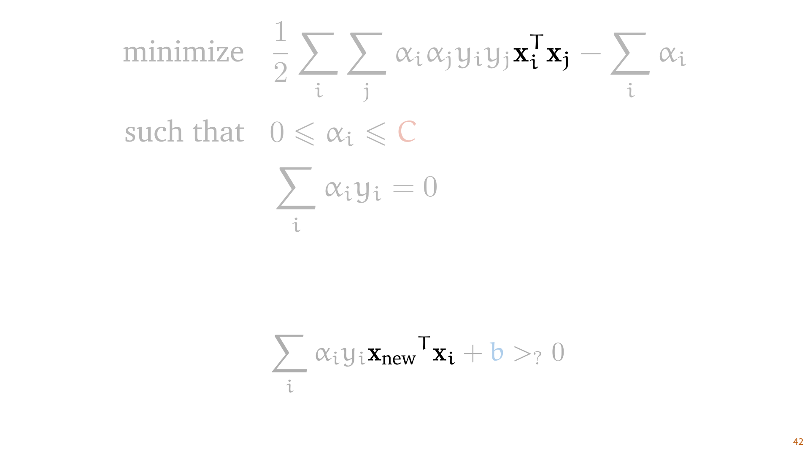

            <figcaption>
            
So why did we do all this if we still need to <em>search</em> for a solution? We had a version that worked with gradient descent, and now we have a version that requires constrained optimization. <strong>What have we gained?</strong> 

The main results here are twofold: 

First, notice that the hyperplane parameters <strong class="orange">w</strong> and b have <em>disappeared</em> entirely from the objective and its constraints. The only parameters that remain are one αi per instance i in our data, and the hyperparameter C. The alphas function as an encoding of the support vectors: <strong>any instance for which the corresponding alpha is not zero is a support vector</strong>. Remember that nonzero Lagrange multipliers correspond to inactive constraints. Only the constraints for the support vectors are active. 
<aside    >We could use this to reduce the data to only its support vectors. For the purposes of the classifier, these instances define the decision boundary, and the rest can be deleted. </aside>
Second, note that the algorithm only operates on the <strong>dot products</strong> of pairs of instances. In other words, if you didn’t have access to the data, but I <em>did</em> give you the full matrix of all dot products of all pairs of instances, you would still be able to find the optimal support vectors. This allows us to use a very special trick.

            </figcaption>
       </section>

       <section id="slide-043">
            <a class="slide-link" href="https://mlvu.github.io/svms#slide-043" title="Link to this slide.">link here</a>
            

            <figcaption>
            
What if I didn’t give you the actual dot products, but instead gave you a different matrix of values, that <em>behaved </em>like a matrix of dot products. 

A <strong>kernel function</strong> is a function of two vectors that behaves like a dot product, but in a higher dimensional feature space. This will take a bit of effort to wrap your head around, so we'll start at the beginning.

            </figcaption>
       </section>

       <section id="slide-044">
            <a class="slide-link" href="https://mlvu.github.io/svms#slide-044" title="Link to this slide.">link here</a>
            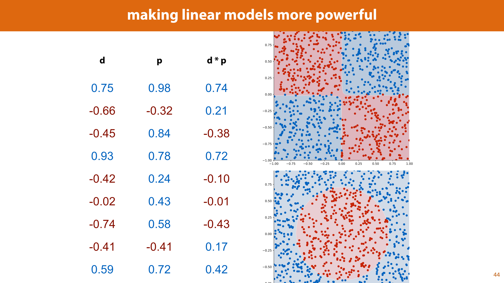

            <figcaption>
            
Remember, by adding features that are derived from the original features, we can make linear models more powerful. If the number of features we add grows very quickly (like if we add all 5-way cross products), this can becomes a little expensive (both memory and time wise). 

The kernel trick is basically a souped-up version of this idea. 

It turns out that for some feature expansions,<strong> we can compute the dot product between two instances in the expanded features space without explicitly computing all expanded features</strong>.

            </figcaption>
       </section>

       <section id="slide-045">
            <a class="slide-link" href="https://mlvu.github.io/svms#slide-045" title="Link to this slide.">link here</a>
            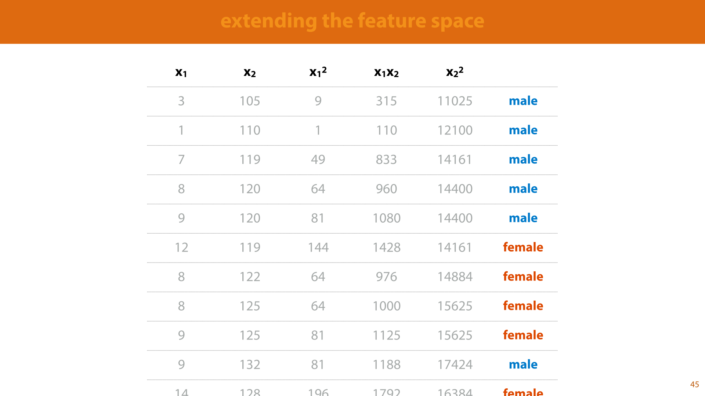

            <figcaption>
            
Let’s look at an example. The simplest way we saw to extend the feature space was to add <strong>all cross-products</strong>. This turns a 2D dataset into a 5D dataset. Let's se if we can do this, or something similar, without computing the 5D vectors.

            </figcaption>
       </section>

       <section id="slide-046" class="anim">
            <a class="slide-link" href="https://mlvu.github.io/svms#slide-046" title="Link to this slide.">link here</a>
            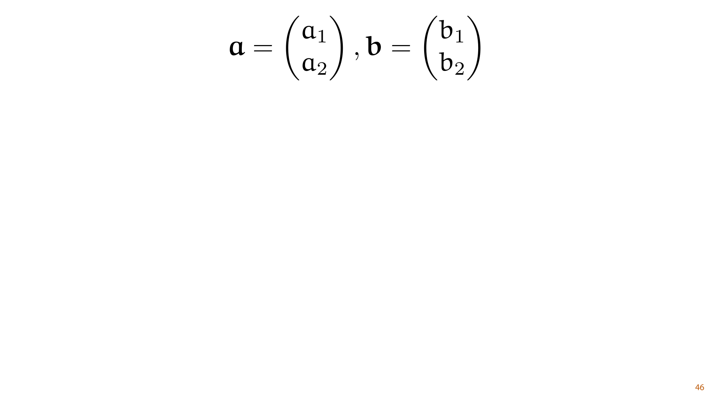

            <figcaption>
            
Here are two 2D feature vectors. What if, instead of computing their dot product, we computed the <em>square</em> of their dot product.  

It turns out that this is equal to the dot product of two other 3D vectors <strong>a’</strong> and <strong>b’</strong>.

            </figcaption>
            click image for animation
       </section>

       <section id="slide-047" class="anim">
            <a class="slide-link" href="https://mlvu.github.io/svms#slide-047" title="Link to this slide.">link here</a>
            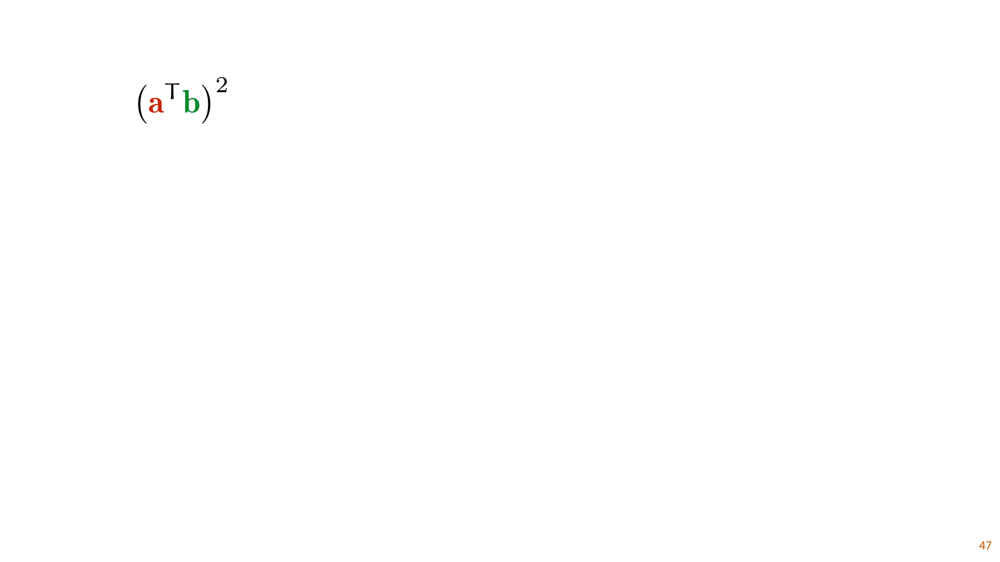

            <figcaption>
            
The square of the dot product in the 2D feature space, is equivalent to the regular dot product in a 3D feature space. The new features in this 3D space can all be derived from the original features. They're the three cross products, with a small multiplier on the a1a2 cross product.

            </figcaption>
            click image for animation
       </section>

       <section id="slide-048" class="anim">
            <a class="slide-link" href="https://mlvu.github.io/svms#slide-048" title="Link to this slide.">link here</a>
            

            <figcaption>
            
That is, this kernel function k doesn't compute the dot product between two instances, but it does compute the dot product in a feature space of <em>expanded</em> features. We could do this already, but before we had to actually <em>compute</em> the new features. <strong>Now, all we have to do is compute the dot product in the original feature space and square it.</strong>

<strong></strong>

            </figcaption>
            click image for animation
       </section>

       <section id="slide-049">
            <a class="slide-link" href="https://mlvu.github.io/svms#slide-049" title="Link to this slide.">link here</a>
            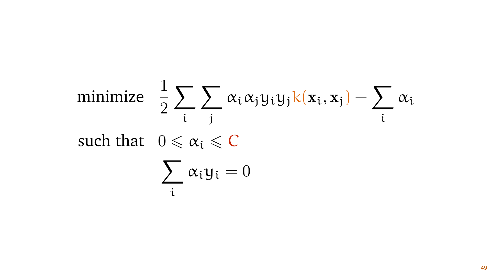

            <figcaption>
            
Since the solution to the SVM is expressed purely in terms of the dot product, we can replace the dot product this kernel function. We are now fitting a line in a higher-dimensional space, without computing any extra features explicitly. 

Note that this only works because we rewrote the optimization objective to get rid of <strong class="orange">w</strong> and b. Since <strong class="orange">w</strong> and b have the same dimensionality as the features, keeping them in means using explicit features. 

Saving the trouble of computing a few extra features may not sound like a big saving, but by choosing our kernel function cleverly we can push things a lot further.

            </figcaption>
       </section>

       <section id="slide-050">
            <a class="slide-link" href="https://mlvu.github.io/svms#slide-050" title="Link to this slide.">link here</a>
            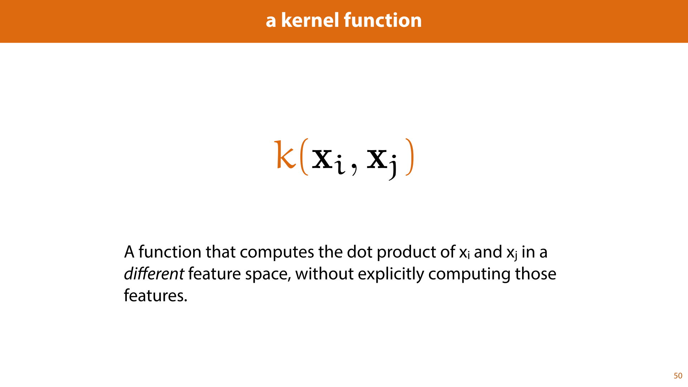

            <figcaption>
            
For some expansions to a higher feature space, we can compute the dot product between two vectors, <strong>without explicitly expanding the features</strong>. This is called a <strong>kernel function</strong>. 

There are many functions that compute the dot product of two vectors in a highly expanded feature space, but don’t actually require you to expand the features. 
<aside    >There are some straightforward conditions for when a given function of two vectors is a kernel. We won't worry about that now, and just look at some commonly used kernels, assuming that others have done the work to show that these actually are kernels.</aside><aside    ></aside>
            </figcaption>
       </section>

       <section id="slide-051">
            <a class="slide-link" href="https://mlvu.github.io/svms#slide-051" title="Link to this slide.">link here</a>
            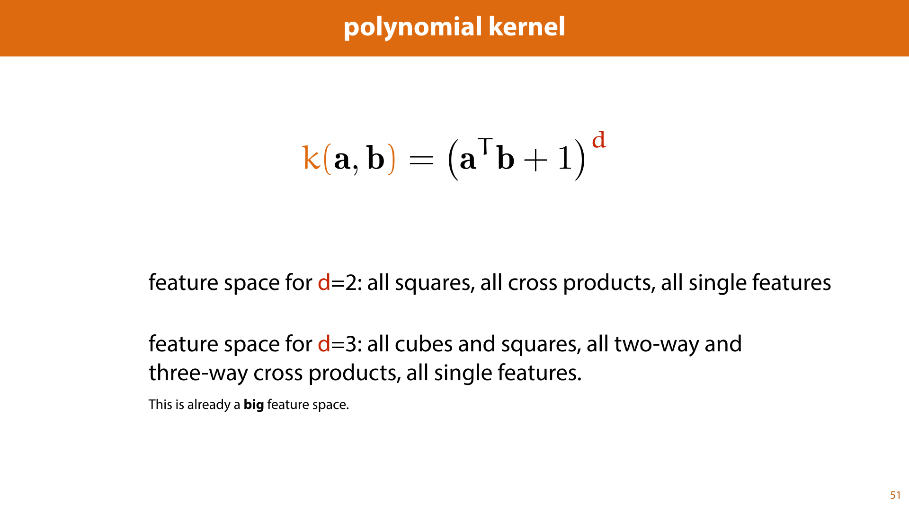

            <figcaption>
            
Taking just the square of the dot product, as we did in our example, we lose the original features. If we take the square of the dot product<strong> plus one</strong>, it turns out that we retain the original features, <em>and</em> get all cross products.  
<aside    >You'll show how this works in the homework. </aside>
If we increase the exponent to d we get all d-way cross products. Here we can see the benefit of the kernel trick. Imagine setting d=10 for a dataset with a modest 10 features. Expanding all 10-way cross-products of all features would give each instance<em> 10 trillion</em> expanded features. We wouldn't even be able to fit one instance into memory. 

However, if we use the kernel trick, all we need to do is to compute the dot product in the original feature space, add a 1, and raise it to the power of 10. 
<aside    >d is a hyperparameter: increasing it does not make the algorithm much more expensive, but it does increase your (implicit) feature space so much that you risk overfitting, so you'll need to tune it to your data.</aside><aside    ></aside>
            </figcaption>
       </section>

       <section id="slide-052" class="anim">
            <a class="slide-link" href="https://mlvu.github.io/svms#slide-052" title="Link to this slide.">link here</a>
            

            <figcaption>
            
If ten trillion expanded features sounded like a lot, here is a kernel that corresponds to an infinite-dimensional expanded feature space. We can only approximate this kernel with a finite number of expanded features, getting closer as we add more. Nevertheless, the kernel function itself is very simple to compute. 

Gamma is another hyperparameter. 

Because this is such a powerful kernel, it is prone to overfitting.

            </figcaption>
            click image for animation
       </section>

       <section id="slide-053">
            <a class="slide-link" href="https://mlvu.github.io/svms#slide-053" title="Link to this slide.">link here</a>
            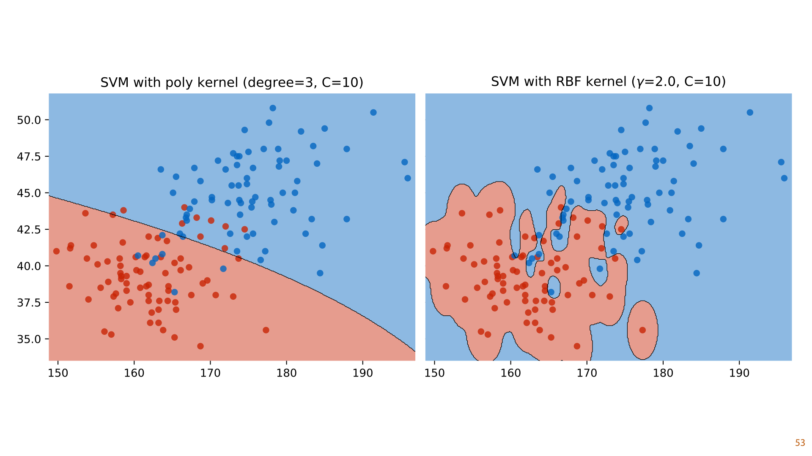

            <figcaption>
            
Here’s a plot for the dataset from the first lecture. As you can tell, the RBF kernel massively overfits for these hyperparameters, but it does give us a very nonlinear fit.

            </figcaption>
       </section>

       <section id="slide-054">
            <a class="slide-link" href="https://mlvu.github.io/svms#slide-054" title="Link to this slide.">link here</a>
            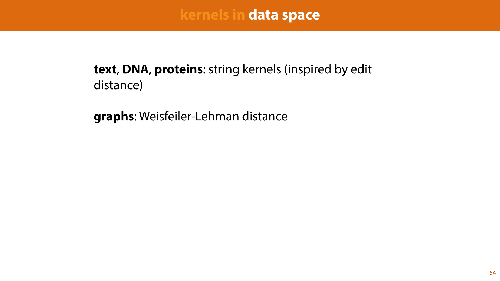

            <figcaption>
            
One of the most interesting application areas of kernel methods is places where you can turn a distance metric in your data space directly into a kernel, <strong>without first extracting any features at all</strong>. 

For instance for an email classifier, you don't need to extract word frequencies, as we’ve done so far, you can just design a kernel that operates directly on strings (usually based on the edit distance).Put simply, the fewer operations we need to turn one email into another, the closer we put them together. If you make sure that such a function behaves like a dot product, you can stick it in the SVM optimizer as a kernel. <strong>You never need to deal with any features at all.</strong> Just the raw data, and their dot products in some feature space that you never compute. 
<aside    >This approach has often been used to analyze DNA and protein sequences in bioinformatics. </aside>
If you’re classifying graphs, there are distance metrics like the Weisfeiler-Lehman algorithm that you can use to define kernels.

            </figcaption>
       </section>

       <section id="slide-055">
            <a class="slide-link" href="https://mlvu.github.io/svms#slide-055" title="Link to this slide.">link here</a>
            

            <figcaption>
            
Kernel SVMs are complicated beasts to understand, but they're easy to use with the right libraries. Here's a simple recipe for fitting an SVM with an RBF kernel in sklearn.

            </figcaption>
       </section>

       <section id="slide-056">
            <a class="slide-link" href="https://mlvu.github.io/svms#slide-056" title="Link to this slide.">link here</a>
            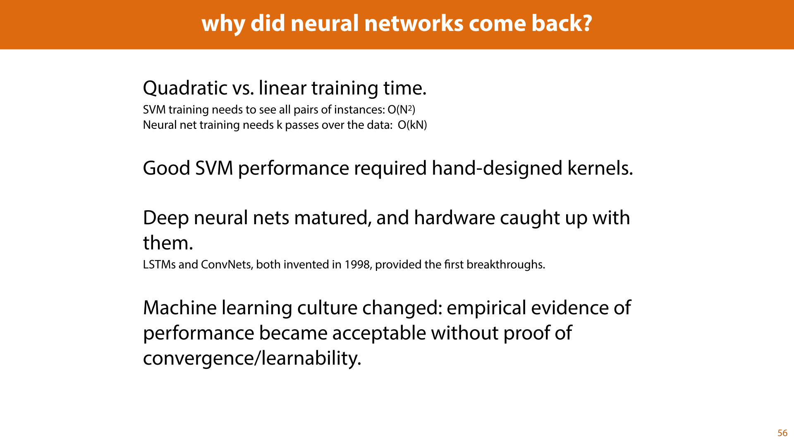

            <figcaption>
            
Neural nets require a lot of passes over the data, so it takes a big dataset before kN becomes smaller than N2, but eventually, we got there. At that point, it became more efficient to train models by gradient descent, and the kernel trick lost its luster.

            </figcaption>
       </section>

       <section id="slide-057">
            <a class="slide-link" href="https://mlvu.github.io/svms#slide-057" title="Link to this slide.">link here</a>
            

            <figcaption>
            
And when neural networks did come back, they caused a revolution. That’s where we’ll pick things up next lecture.

            </figcaption>
       </section>

       <section id="slide-058">
            <a class="slide-link" href="https://mlvu.github.io/svms#slide-058" title="Link to this slide.">link here</a>
            

            <figcaption>
            
To make the story complete, we need to know two things that we've skipped over. How to solve problems with inequality constraints, and how to use this method to work out the dual problem for the SVM.  

<strong>These are explicitly not exam material. </strong>We've separated them into this video so that you can watch them if you need the whole story, or if you want to get a sense of what the missing steps look like, but you are entirely free to skip this video. 

            </figcaption>
       </section>

       <section id="slide-059">
            <a class="slide-link" href="https://mlvu.github.io/svms#slide-059" title="Link to this slide.">link here</a>
            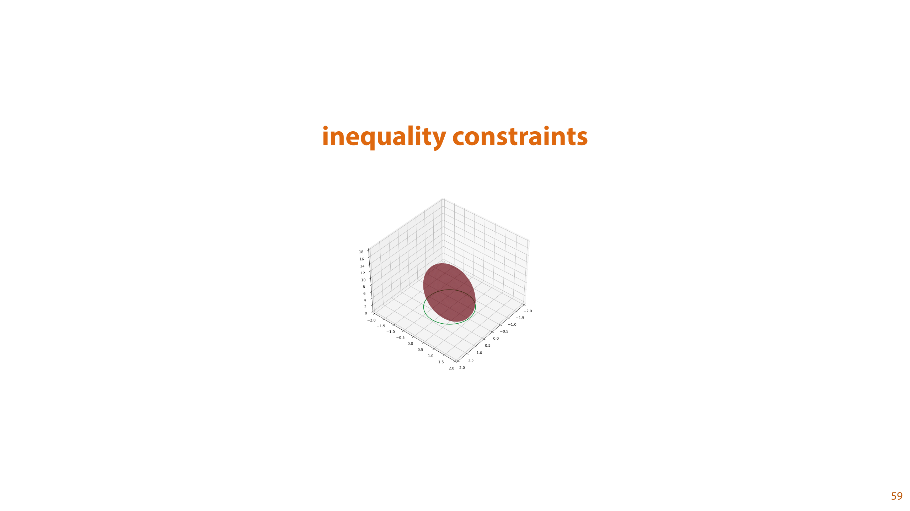

            <figcaption>
            
To start with, let's look at the details of how to handle inequality constraints. For instance, if you want you solution to lie anywhere within the unit circle, instead of on the unit circle. 

This method, called the method of KKT multipliers is necessary to understand how we derive the kernel trick in the next video. It won't, however, be an exam or homework question, so you're free to skim the rest of this video if you've reached your limit of math.

            </figcaption>
       </section>

       <section id="slide-060" class="anim">
            <a class="slide-link" href="https://mlvu.github.io/svms#slide-060" title="Link to this slide.">link here</a>
            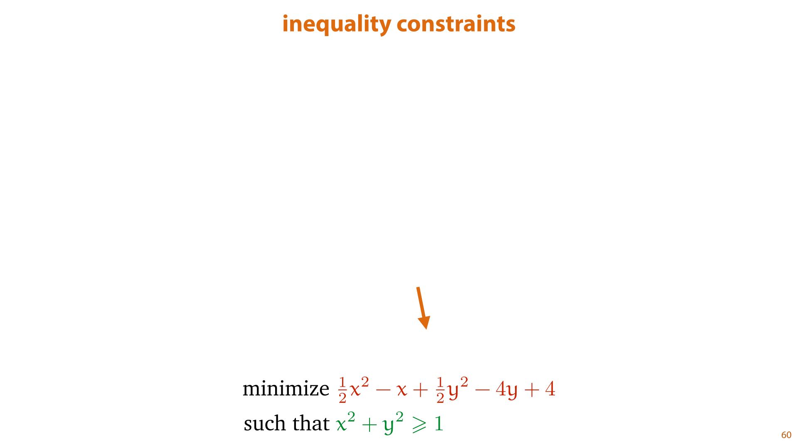

            <figcaption>
            
Lagrange multipliers work great, and are very useful, but so far we've only seen what to do if the constraint is an equality: if some quantity needs to stay exactly equal to some other quantity. It's more often the case that we have an inequality constraint: for instance, the amount of money we spend needs to stay within our budget. 

If the constraint in our problem is not an equality constraint, but an <em>in</em>equality constraint, the same method applies, but we need to keep a few more things in mind. 

Here is an example. This time we are not looking for a solution on the unit circle, we are looking for the lowest point anywhere <em>outside</em> the unit circle. 

This means that our constraint is <strong>inactive</strong>. The simplest approach for a particular problem is just to check manually if the constrain tis active. If it isn't, you can just solve the unconstrained problem, and if it is, the solution must be on the boundary of the constraint region, so the problem basically reduces to the standard Lagrangian method.

            </figcaption>
            click image for animation
       </section>

       <section id="slide-061" class="anim">
            <a class="slide-link" href="https://mlvu.github.io/svms#slide-061" title="Link to this slide.">link here</a>
            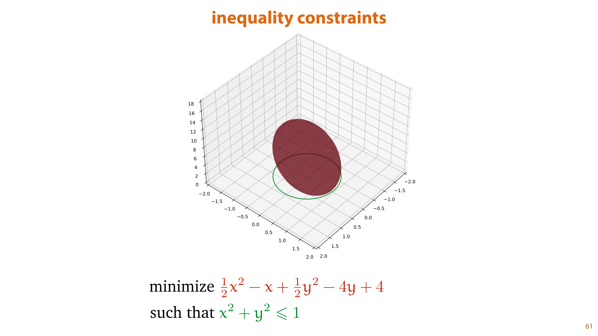

            <figcaption>
            
For this problem, if we search only<em> inside</em> the unit circle, the constraint is <strong>active</strong>. It stops us from going where we want to go, and we end up on the boundary, just like we would if the constraint were an equality constraint. This means that if we know that we have an active constraint, our solution should coincide with the equivalent problem with an equality constraint. For this reason, we can use almost the same approach. We just have to set it up a little bit more carefully, so that we restrict the allowed solutions a bit more. 

We first set the convention that all constraints are rewritten to be “greater than” inequalities, with zero on the right hand side. This doesn’t change the region we’re constrained to, but note that the function on left of the inequality sign had a “bowl” shape before, and now has a “hill” shape. In other words, the gradients of this function now point in the opposite direction.  

The drawings indicate the 1D equivalent. The places where the two functions intersect (the boundary of our constraint region) are the same, but the constraint function is flipped around. This means that its gradient (the direction of steepest ascent) now points in the opposite direction. 

We now know two things: the inequality is always a "greater than" inequality (by convention), and the constraint function is always a "hill" shape and never a "bowl" shape (if it were a bowl shape with a greater than constraint, the constraint would be inactive in this case). 

            </figcaption>
            click image for animation
       </section>

       <section id="slide-062">
            <a class="slide-link" href="https://mlvu.github.io/svms#slide-062" title="Link to this slide.">link here</a>
            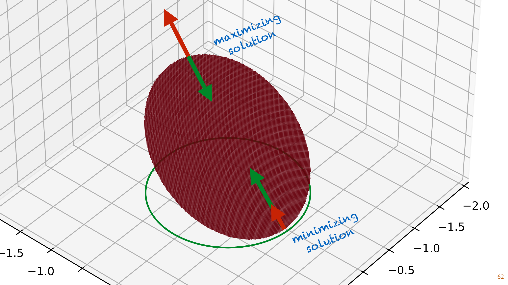

            <figcaption>
            
If we are <strong>minimizing</strong>, we need to make sure that the gradient points<strong> into</strong> the constrained region, so that the direction of steepest descent points outside. If the direction of steepest descent pointed into the region, we could find a lower point somewhere inside, away from the boundary. Since the gradient for the constraint function points inside the region, we need to make sure that the gradients of the objective function point in the same direction. 

If we are <strong>maximizing</strong>, by the same logic, we need to make sure that the gradients point in opposite directions. We want to direction of greatest ascent to point outside the constraint region. 

Contrast this with case of equality constraints. There, we just needed to make sure that the gradients were on the same line, either pointing in the same direction or in opposite directions. Since the constraint was a 1D curve, the gradients and negative gradients always point outside of the constraint region. Now, we need to be a bit more careful. Since we tend to minimize in machine learning, we'll show that version in detail.

            </figcaption>
       </section>

       <section id="slide-063" class="anim">
            <a class="slide-link" href="https://mlvu.github.io/svms#slide-063" title="Link to this slide.">link here</a>
            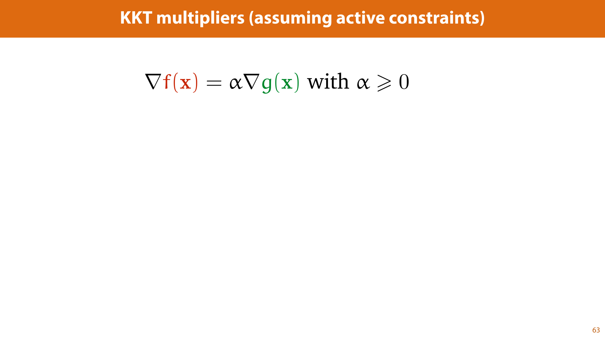

            <figcaption>
            
This makes the derivation the inequality method a little more complicated than the version with an equality constraint: we again set the gradient of the objective function equal to that of the constraint, again with an α to account for the differences in size between the two gradients, but this time around, we need to make sure that <strong>α remains positive</strong>, since a negative α would cause the gradient of the constraint to point in the wrong direction. 
<aside    >We assume we're minimizing. If we are maximizing, we set the gradient of f equation to the negative gradient of g times α. </aside>
Even though we’ve not removed the constraint, we’ve simplified it a lot: it is now a linear function, even a constant one, instead of a nonlinear function. Linear constraints are much easier to handle, for instance using methods like linear programming, or gradient descent with projection. If you're lucky, you may even be able to solve it analytically still.

            </figcaption>
            click image for animation
       </section>

       <section id="slide-064">
            <a class="slide-link" href="https://mlvu.github.io/svms#slide-064" title="Link to this slide.">link here</a>
            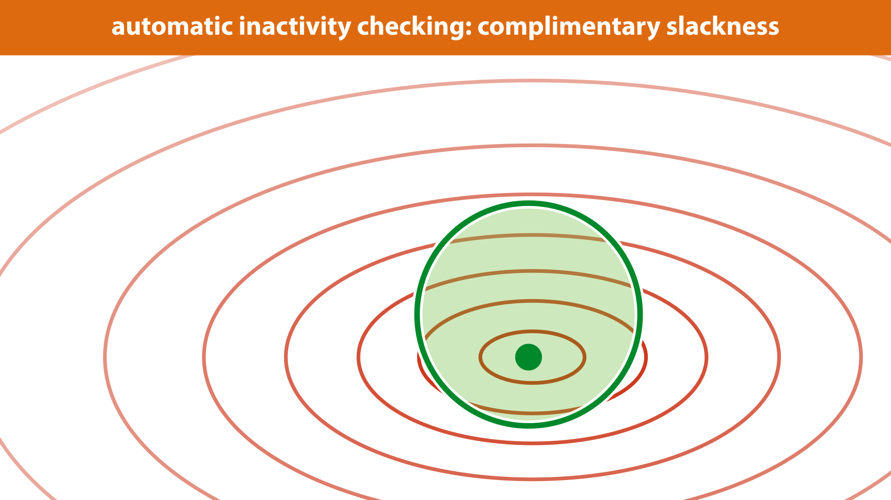

            <figcaption>
            
All this only works if we check manually whether a constraint is active. Sometimes this isn't practical: we may have too many constraints, or we may want to work out a solution independent of the specifics. For instance, in the SVM problem, we can only check which constraints are active once we know the data. If we want to work out a solution that holds for any dataset (with the data represented by uninstantiated variables), we can't check manually which constraints are active. 

Instead, we can work the activity checking into the optimization problem using a condition called <strong>complementary slackness</strong>. 

Remember what we saw for the Lagrangian case: if the constraint is inactive, we can simply set the multiplier to 0 and the problem reduces to the unconstrained problem. 

However, if we don't set the multiplier to zero, we need to make sure that the constraint is active, and stays on the boundary. We can achieve this by requiring that g(<strong class="green">x</strong>) is exactly 0 rather than larger than or equal to zero. 

In short either α is exactly zero, or g(<strong class="green">x</strong>) is.

            </figcaption>
       </section>

       <section id="slide-065">
            <a class="slide-link" href="https://mlvu.github.io/svms#slide-065" title="Link to this slide.">link here</a>
            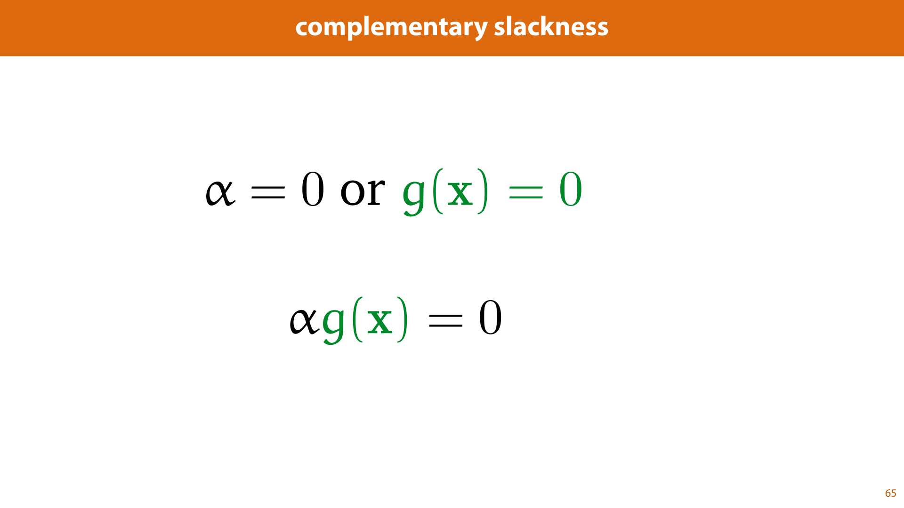

            <figcaption>
            
We can summarize this requirement by saying that the product of the multiplier and the constraint function should be exactly zero. This condition is called<strong> complementary slackness</strong>. 

If we allow the solution to move away from the constraint boundary to the interior of the constraint region, g(<strong class="green">x</strong>) will become nonzero (because the boundary is where it is zero), so the α should be zero to satisfy complementary slackness. This will effectively remove the g term from the Lagrangian, forcing us to find the global minimum of f. 

If g(<strong class="green">x</strong>) is on the boundary and so equal to zero, we are allowing α to be <em>non</em>zero, this means that the g term in the Lagrangian will be active, and we don't need to find the global minimum of f , where its gradient is zero, only the constrained minimum, where its gradient is equal to α∇g(<strong class="green">x</strong>). 
<aside    >Complimentary slackness can be a little confusing to wrap your head around. For me, the key is viewing the term we add to the Lagrangian as a relaxation of the problem. It allows us to move away from the global optimum to a constrained optimum. To allow this we need to make the multiplier α non-zero, and the price we pay to do that is to make g(<strong class="green">x</strong>) equal to zero.</aside><aside    ></aside>
            </figcaption>
       </section>

       <section id="slide-066">
            <a class="slide-link" href="https://mlvu.github.io/svms#slide-066" title="Link to this slide.">link here</a>
            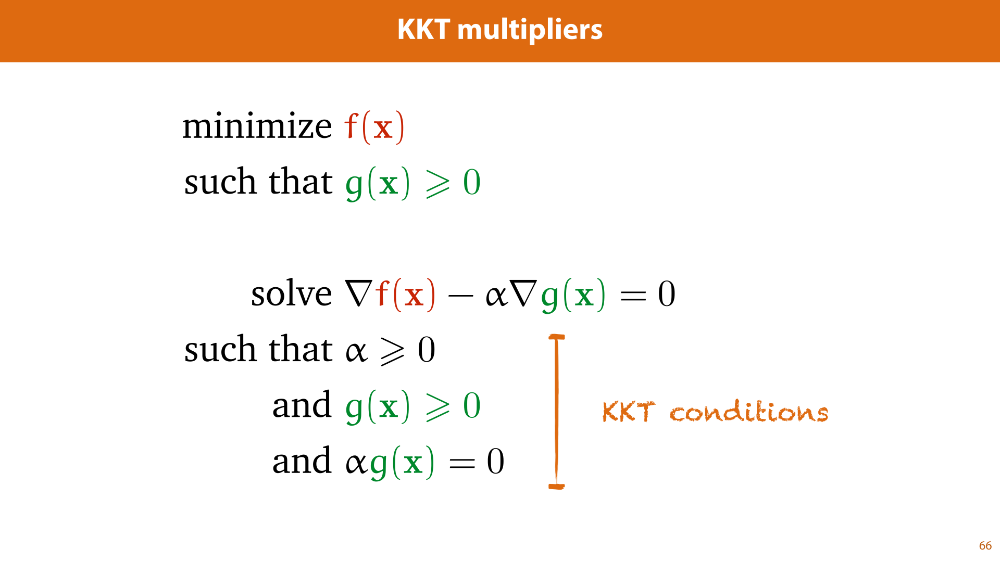

            <figcaption>
            
Here's what the general solution looks like. We start with an optimization objective. We construct a Lagrangian-like function as before, but this time, we don't require that its whole gradient is equal to zero, just the objective functions and the constraint terms. In other words,<strong> we don't require that the derivative with respect to the multiplier is zero</strong>.  
<aside    >You can still start with the Lagrangian. You just don't set all of its partial derivatives equal to zero. </aside>
This is because the constraint may not be active: in that case the multiplier itself is zero and the gradient can take any value. 

This equation may have many solutions, not all of which will be solutions to the optimization problem. The Karush-Kuhn-Tucker (KKT) conditions then tell us which of these solutions also solve the optimization problem.  

It may seem a little counter-intuitive that this is actually a step forward. We had a simple minimization objective with a single constraint, and now we have to solve an equation under several constraint, including the original. Are we really better off? There are two answers. In some rare cases, you can actually solve the problem analytically. We'll see an example of that next. In other cases, you can use the KKT conditions to formulate a<strong> dual problem</strong>. We'll dig into that after the example.

            </figcaption>
       </section>

       <section id="slide-067">
            <a class="slide-link" href="https://mlvu.github.io/svms#slide-067" title="Link to this slide.">link here</a>
            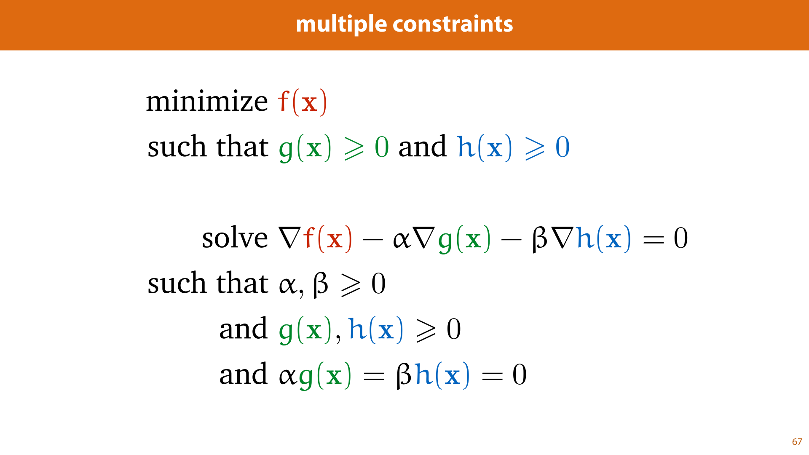

            <figcaption>
            
If we have multiple inequality constraints, we just repeat the procedure with fresh multipliers for each. Each constraint gets its own set of three KKT conditions. 

            </figcaption>
       </section>

       <section id="slide-068" class="anim">
            <a class="slide-link" href="https://mlvu.github.io/svms#slide-068" title="Link to this slide.">link here</a>
            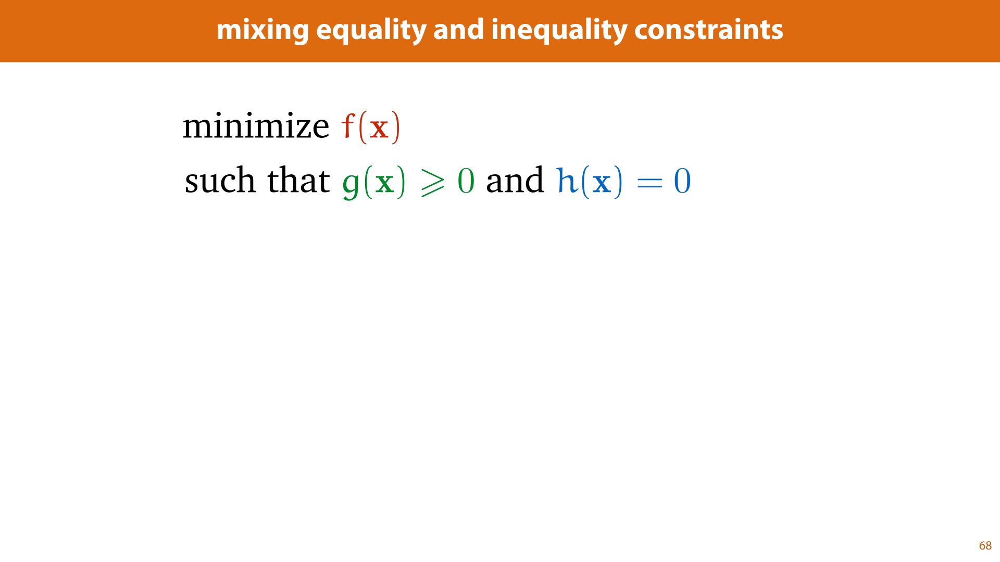

            <figcaption>
            
We can also mix equality and inequality constraints. In this case, we just treat the equality constraint the same as we did before. We set the KKT conditions for the inequality constraint(s) and for the equality constraint, we only set the condition that the original equality is true. As we saw before, this is equivalent to constructing the Lagrangian and requiring that its derivative with respect to the multiplier of the equality constraint is zero. 
<aside    >You can do it both ways, but since you are already including the original inequality constraint as one of the KKT conditions, you may as well include the original equality constraint as well.</aside><aside    ></aside>
            </figcaption>
            click image for animation
       </section>

       <section id="slide-069">
            <a class="slide-link" href="https://mlvu.github.io/svms#slide-069" title="Link to this slide.">link here</a>
            

            <figcaption>
            
Here's an example of when you can solve a KKT problem analytically. 

When we introduced entropy, we noted that the cross entropy of a function with itself was the lowest that the cross entropy could get. The implication was that the average codelength is minimized if we choose a code that corresponds to the source distribution of the elements we are trying to transmit. 

For a finite space of outcomes, we can now prove this with the Lagrangian method. Here's how we set up the problem. We will assume that we have n outcomes over which the probabilities are defined. The source the outcomes are drawn from is called p, and it assigns probabilities p1 through pn. We encode messages using a code corresponding to distributions q, which assigns probabilities q1 though qn, and thus uses codewords of lengths - log q1 though -log qn. 

The expected codelength under this scheme is the cross-entropy between p and q. What we want to show is that setting q=p will minimize the expected codelength.

            </figcaption>
       </section>

       <section id="slide-070" class="anim">
            <a class="slide-link" href="https://mlvu.github.io/svms#slide-070" title="Link to this slide.">link here</a>
            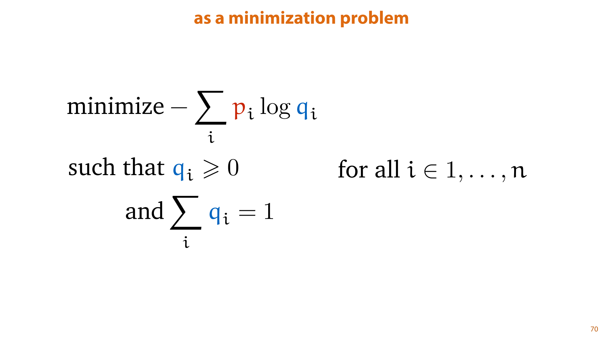

            <figcaption>
            
Here's how that looks as a minimization problem. We want to find the n values for qi for which the corss entropy is minimized. The values of pi are given (we treat them as a constant). 

The constraints essentially state that the qi values put together are <em>probabilities</em>. They should be non-negative and they should collectively sum to 1. This gives us n inequality constraints and one equality constraints. 

The only thing we need to do to put the constraint into the correct form is to move the 1 to the left hand side.

            </figcaption>
            click image for animation
       </section>

       <section id="slide-071">
            <a class="slide-link" href="https://mlvu.github.io/svms#slide-071" title="Link to this slide.">link here</a>
            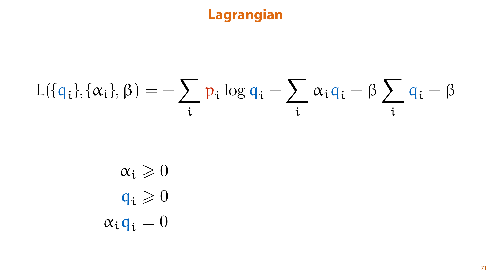

            <figcaption>
            
Here is the Lagrangian we get. Note that it has 2n + 1 parameters: the original n parameters qi, the multipliers of the inequalities αi and one more for the multiplier of the equality β. 

The additional constraints are only on the multipliers for the inequalities. They tell us that both the αi multipliers and the qi parameters should be positive, and that at least one of them should be zero.  

Remember that we won't be working out the whole gradient of the Lagrangian, only the gradient with respect to the original parameters and the equality constraints.

            </figcaption>
       </section>

       <section id="slide-072">
            <a class="slide-link" href="https://mlvu.github.io/svms#slide-072" title="Link to this slide.">link here</a>
            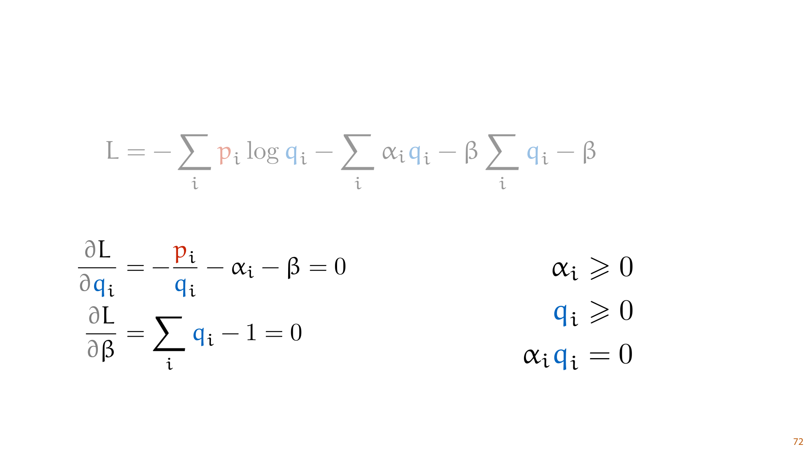

            <figcaption>
            
We start by working out the relvant partial derivatives of the Lagrangian and setting them equal to zero. 

On the left we have the equations resulting from this: n equations for the original parameters, and one for the equality constraint. Again, for the multipliers corresponding to inequality constraints, we don't set the derivative equal to zero: for those we rely on the KKT conditions instead. 

At this point, there's no standard, mehcanical way to proceed. We need to look at what these equations and inequalities are telling us. If we're lucky, there's a way to solve the problem, and if we're even luckier, we're clever enough to find it. 

We can start with the following observations: 

The parameters qi must be positive and sum to zero. This means that they can't all be zero. 

For those that are nonzero, αi must be zero, due to complementary slackness. So for the nonzero qi, we have pi/qi = - β and thus qi = - pi/β. 

All nonzero qi should sum to one, so we have -(1/β)Σpi = 1 (with the sum over those i's corresponding to nonzero qi) 

At this point, we run into a snag. We need to know something about those qi's that are zero, but in that case, the first term of the first inequality, -pi/qi, becomes undefined. The main thing to note is that this is a problem with our domain, not with the Lagrangian/KKT method. Note that in the entropy, we have a factor log qi which goes to negative infinity as qi goes to zero. The entropy isn't really properly defined for zero probabilities, so it's no surprise that we run into difficulty with the Lagrangian/KKT method for zero probabilities. 

The way we deal with this in entropy is to say that the length of the code word for i, - log qi, goes to infinity as the probability goes to zero. If we are absolutely sure that the outcome i won't happen, we can assign it an "inifinitely long codeword" by setting qi=0 (allowing us to make the other codewords shorter, by giving them more probability mass). We do, however, have to be<em> absolutely sure</em> that the i will never happen, that it that pi is also 0. If pi is anywhere above 0, no matter how small, and qi=0 the expected codelength (the cross entropy) becomes infinite, because there is a non-zero probability that we'll need to transmit an infinitely long codeword. 

The conclusion of all of this is that if any of our qi are 0 and the corresponding pi aren't, the objective function is infinite and we are as far from our minimum as we can be. Thus, we may conclude that if qi is zero at an optimum, then pi is also zero. Conversely, if pi is zero and qi isn't, we know we can't be at an optimum, because we could move probability mass away from qi to outcomes that have nonzero probabilty. 

All this should convince you that at the optimum, the nonzero qi's correspond exactly to the nonzero pi's. This means that -(1/β)Σpi = 1 = Σpi, so β must be -1, and we have qi = pi for all i.

            </figcaption>
       </section>

       <section id="slide-073">
            <a class="slide-link" href="https://mlvu.github.io/svms#slide-073" title="Link to this slide.">link here</a>
            

            <figcaption>
            
The other approach we saw in the earlier video, is not to <em>solve</em> the optimization problem, but to turn it into a different problem: the so called dual problem of the first. We were a bit handwavy in our first explanation, skipping a lot of the details, and being vague about when it works and why. Now, in the context of optimization under inequality constraints, we can be more clear about exactly what we're doing.

            </figcaption>
       </section>

       <section id="slide-074" class="anim">
            <a class="slide-link" href="https://mlvu.github.io/svms#slide-074" title="Link to this slide.">link here</a>
            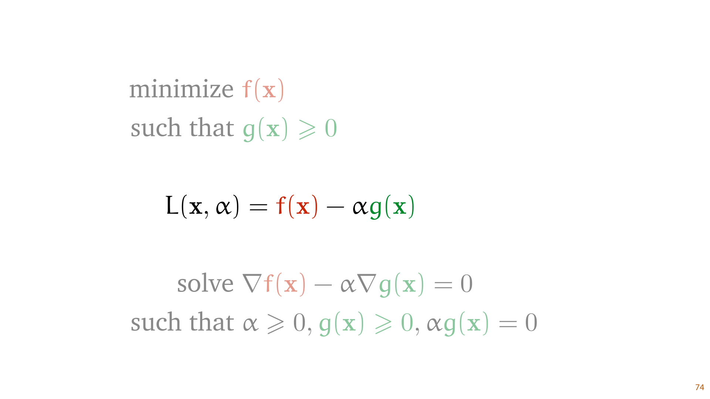

            <figcaption>
            
We'll explain this first in the context of a basic minimization problem with a single inequality constraint. The approach of dual problems makes most sense in the context on inequality constraints, so now that we have the machinery for this, we can give it a proper treatment. 

We know that for any solution that satisfies the KKT conditions, the term αg(<strong class="green">x</strong>) must be positive. This means that whenever <strong>x</strong> satisfies the KKT conditions, we know that the Lagrangian at <strong>x</strong> is always strictly<em> less </em>than the the objective function f at <strong>x</strong>. 

 

            </figcaption>
            click image for animation
       </section>

       <section id="slide-075" class="anim">
            <a class="slide-link" href="https://mlvu.github.io/svms#slide-075" title="Link to this slide.">link here</a>
            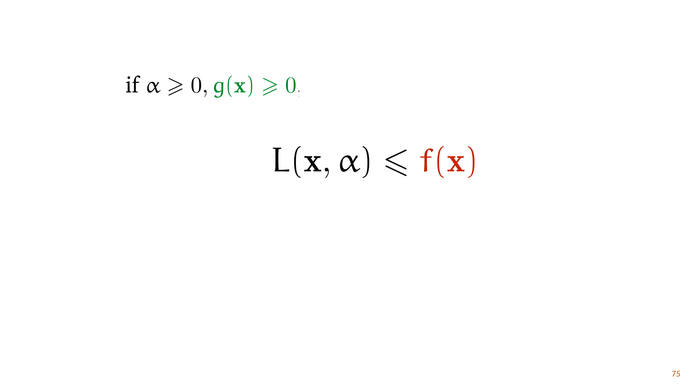

            <figcaption>
            
For all nonnegative a, and x satisfying the constraint, this tells us that the Lagrangian is less than the objective function. This includes the x for which L is minimal (under the constraints).  

Since this is always true, regardless of our value of a, we can now choose a to <em>maximize</em> this function. 

            </figcaption>
            click image for animation
       </section>

       <section id="slide-076" class="anim">
            <a class="slide-link" href="https://mlvu.github.io/svms#slide-076" title="Link to this slide.">link here</a>
            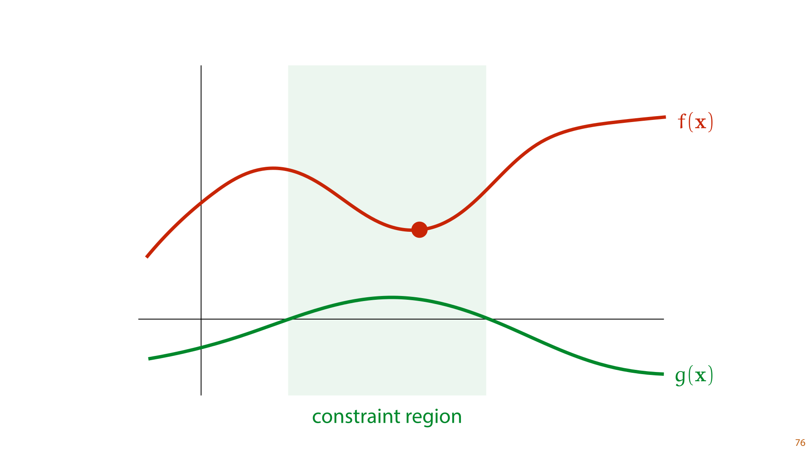

            <figcaption>
            
Here's a visualization. We are looking for the minimum on the red line f(<strong>x</strong>), within the region where the green line g(<strong>x</strong>)is larger than 0. 

If we construct L, and pick some positive value a, we get a line that within the constrain region lies below f(<strong>x</strong>). If we keep <strong>x</strong> fixed and change a to a' in such a way that L(x, a') is bigger than L(x, a), we move the minimum closer to the optimal value.

            </figcaption>
            click image for animation
       </section>

       <section id="slide-077">
            <a class="slide-link" href="https://mlvu.github.io/svms#slide-077" title="Link to this slide.">link here</a>
            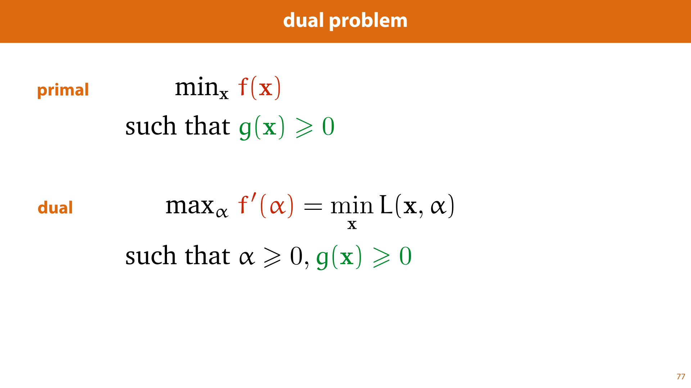

            <figcaption>
            
Here are the proper definitions of the primal and dual problem. "primal" is just the opposite of dual, the problem we started out with. 

What we have done is to remove <strong>x</strong> as a variable, by setting it to the value it has at the minimum within in the constraint region. This leaves the Lagrange multipliers as the only free variable to maximize over. 

            </figcaption>
       </section>

       <section id="slide-078">
            <a class="slide-link" href="https://mlvu.github.io/svms#slide-078" title="Link to this slide.">link here</a>
            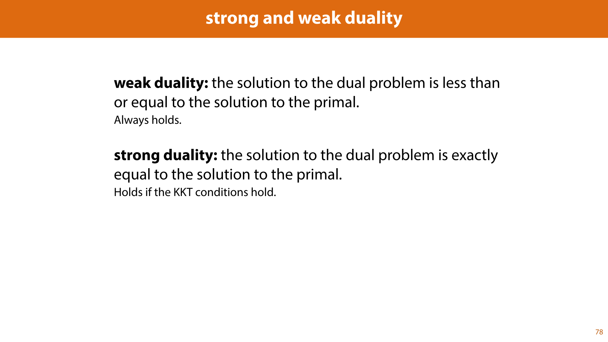

            <figcaption>
            
We have not shown that the value we get for the dual problem is actually the same as the one we get for the dual. Only that it is less than or equal. This is called <strong>weak duality</strong>: the dual serves as a lower bound for the primal. This is always true. 

If they are exactly equal, we say that <strong>strong duality</strong> holds. It can be shown that this is true if and only if all three KKT conditions holds for the solution. Two of them are already included in the dual problem.We're just missing complimentary slackness. We can either define the problem with complimentary slackness added, or we can figure out the dual without complimentary slackness, and then check whether it holds for the solution.

            </figcaption>
       </section>

       <section id="slide-079">
            <a class="slide-link" href="https://mlvu.github.io/svms#slide-079" title="Link to this slide.">link here</a>
            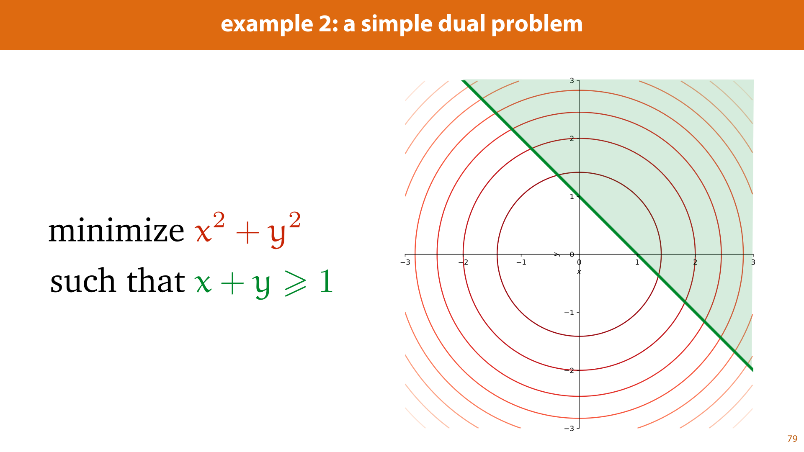

            <figcaption>
            
Before we use these principles to work out the dual for the SVM problem, let's see it in action on a slightly simpler problem. We'll use the problem from the fourth part, but with an inequality constraint instead of an equality constraint. 

The constraint is active, so the solution will be the same as before, but we'll take you through the formal steps of formulating the dual problem. 

            </figcaption>
       </section>

       <section id="slide-080">
            <a class="slide-link" href="https://mlvu.github.io/svms#slide-080" title="Link to this slide.">link here</a>
            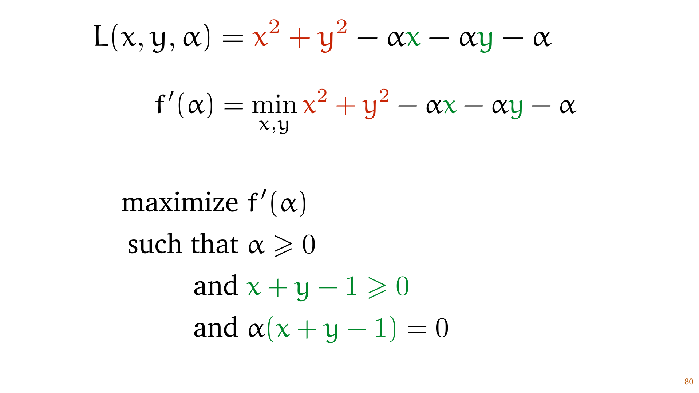

            <figcaption>
            
As before, we set up the Lagrangian, but this time, we start by setting up the dual function f', which halp alpha as an argument and contains a minimization over x and y. 
<aside    >Note that the minimization is over values of x and y that satisfy the original constraints. </aside>
We then maximize this value of f subject to the KKT conditions. To make this practical, we need to rewrite the dual function to eliminate all references to x and y. We do this by making the assumption that x and y are at the optimum: <strong>the derivative of the Lagrangian is zero for them</strong>. 

            </figcaption>
       </section>

       <section id="slide-081" class="anim">
            <a class="slide-link" href="https://mlvu.github.io/svms#slide-081" title="Link to this slide.">link here</a>
            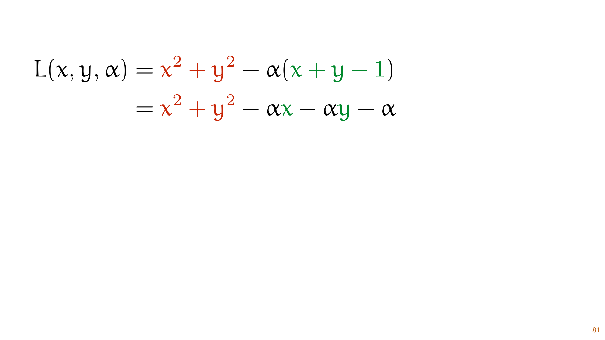

            <figcaption>
            
We worked this out already in slide 100. Under this assumption, we can express x and y in terms of the value of alpha.

            </figcaption>
            click image for animation
       </section>

       <section id="slide-082">
            <a class="slide-link" href="https://mlvu.github.io/svms#slide-082" title="Link to this slide.">link here</a>
            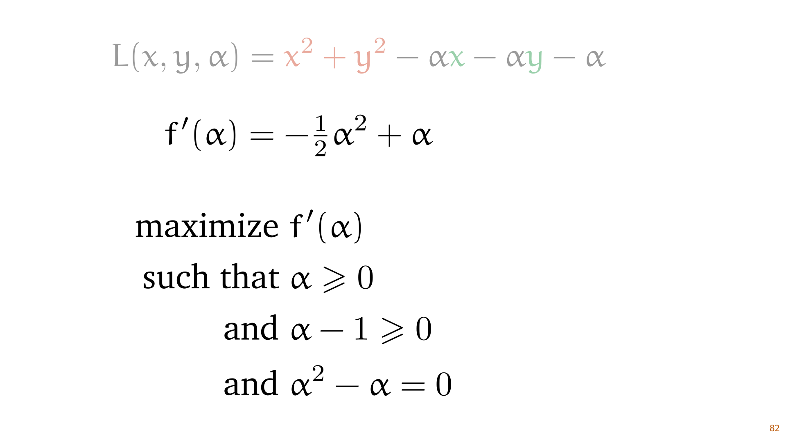

            <figcaption>
            
As we saw before, filling in these derivatives gives us an objective function that is a simple parabola in α. The parabola has it's maximum at α=1, so we get weak duality at that value. do we also get strong duality? We should check the KKT conditions to find out. 

The first says that α should be nonnegative, and the second says that it should be larger or equal to 1. We can ignore the first, but either way our solution satisfies them both. 

The complementary slackness is an equation with two solutions α=0 and α=1. The second corresponds to our solution, so we do indeed have strong duality.  

Filling α=1 into the equations we derived before will tell us where in the x, y plane we will find this solution.

            </figcaption>
       </section>

       <section id="slide-083">
            <a class="slide-link" href="https://mlvu.github.io/svms#slide-083" title="Link to this slide.">link here</a>
            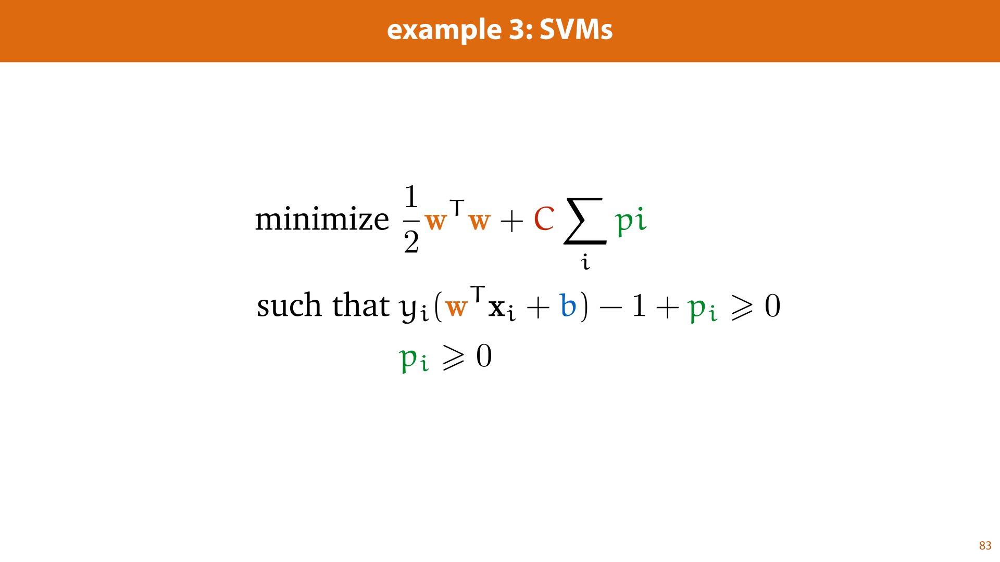

            <figcaption>
            
We are now ready to begin our attack on the SVM objective. This is a much more complicated beast than the problems we've seen so far, but so long as we stick to the plan, and work step by step, we should be fine.

            </figcaption>
       </section>

       <section id="slide-084" class="anim">
            <a class="slide-link" href="https://mlvu.github.io/svms#slide-084" title="Link to this slide.">link here</a>
            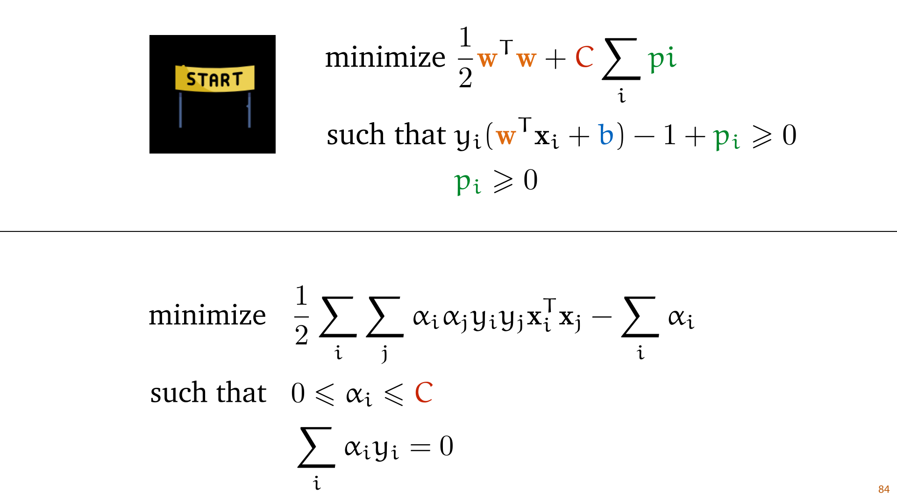

            <figcaption>
            
Here are the start and end points of our journey. The objective at the bottom is the dual problem of the one at the top.

            </figcaption>
            click image for animation
       </section>

       <section id="slide-085" class="anim">
            <a class="slide-link" href="https://mlvu.github.io/svms#slide-085" title="Link to this slide.">link here</a>
            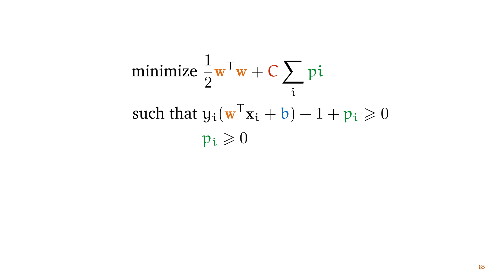

            <figcaption>
            
First, we define our Lagrangian. We introduce two sets of multipliers: α's for the first type of constraint, and β's for the second type of constraint. If our datasets has n instances, we add n α's and n β's. 

            </figcaption>
            click image for animation
       </section>

       <section id="slide-086" class="anim">
            <a class="slide-link" href="https://mlvu.github.io/svms#slide-086" title="Link to this slide.">link here</a>
            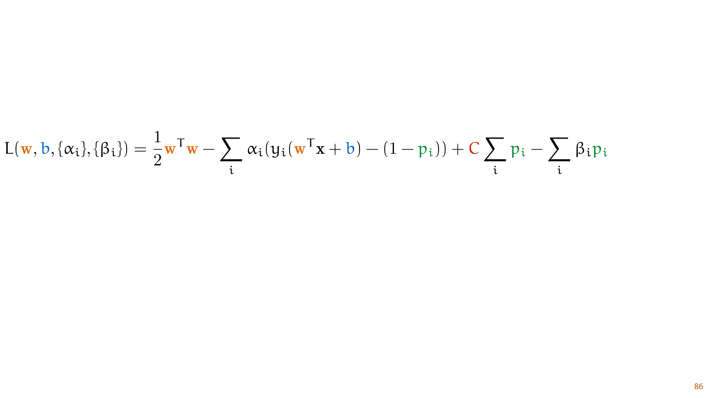

            <figcaption>
            
Next, we'll rewrite the Lagrangian a little bit to isolate the terms we will be taking the derivative over. Remember we'll only do this over the parameters of the original problem <strong class="orange">w</strong>, b and pi. 

In this form, the derivatives with respect to these variables should be straightforward to work out.

            </figcaption>
            click image for animation
       </section>

       <section id="slide-087">
            <a class="slide-link" href="https://mlvu.github.io/svms#slide-087" title="Link to this slide.">link here</a>
            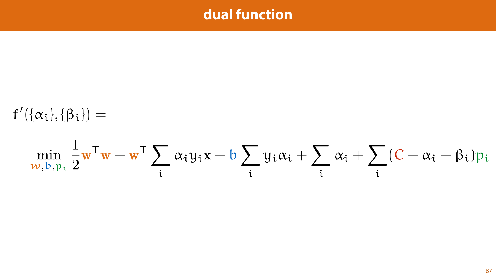

            <figcaption>
            
That makes this our dual function. Before we set up the dual problem, we can rewrite this by finding the minimum, expressing each variable in terms of the multipliers and filling them in to this function.

            </figcaption>
       </section>

       <section id="slide-088">
            <a class="slide-link" href="https://mlvu.github.io/svms#slide-088" title="Link to this slide.">link here</a>
            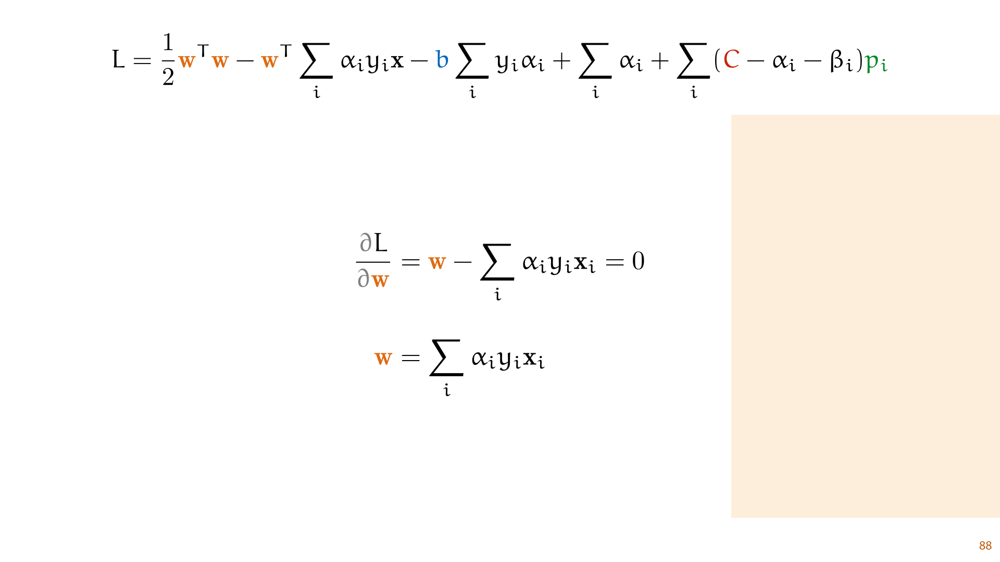

            <figcaption>
            
So, let's take the derivative with respect to the parameters, and set them equal to zero. We'll collect our findings in the box on the right. 

We haven’t discussed taking derivatives with respect to vectors, but here we’ll just use two rules that are analogous to the way we multiply scalars. 

The derivative <strong>w</strong>T<strong>w</strong>, with respect to <strong>w</strong> is 2 times<strong> w</strong>. This is analogous to the derivative of the square for scalars. 

The derivative of <strong>w</strong> times some constant vector (wrt to w) is just that constant. This is similar to the constant multiplier rule for scalars. 
<aside    >You can also work this out by looking at the scalar derivatives for each wi, but to shorten the derivation, we'll take these two rules as given. </aside>
This gives us an expression for <strong>w</strong> at the optimum, in terms of alpha, y and <strong>x</strong>.

            </figcaption>
       </section>

       <section id="slide-089">
            <a class="slide-link" href="https://mlvu.github.io/svms#slide-089" title="Link to this slide.">link here</a>
            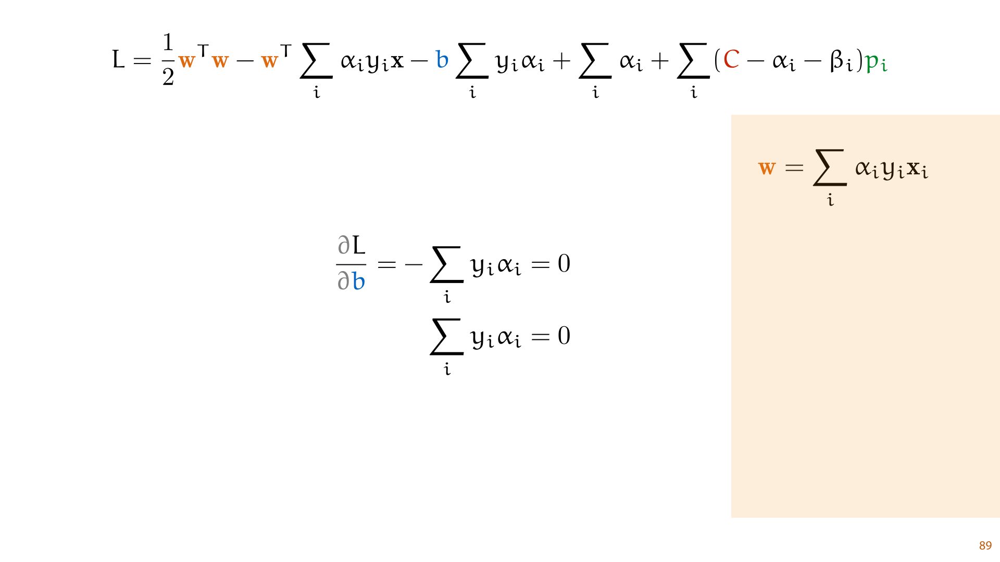

            <figcaption>
            
If we take the derivative with respect to b, we find a simple constraint: that at the optimum, the sum of all α values, multiplied by their corresponding y’s, should be zero.

            </figcaption>
       </section>

       <section id="slide-090" class="anim">
            <a class="slide-link" href="https://mlvu.github.io/svms#slide-090" title="Link to this slide.">link here</a>
            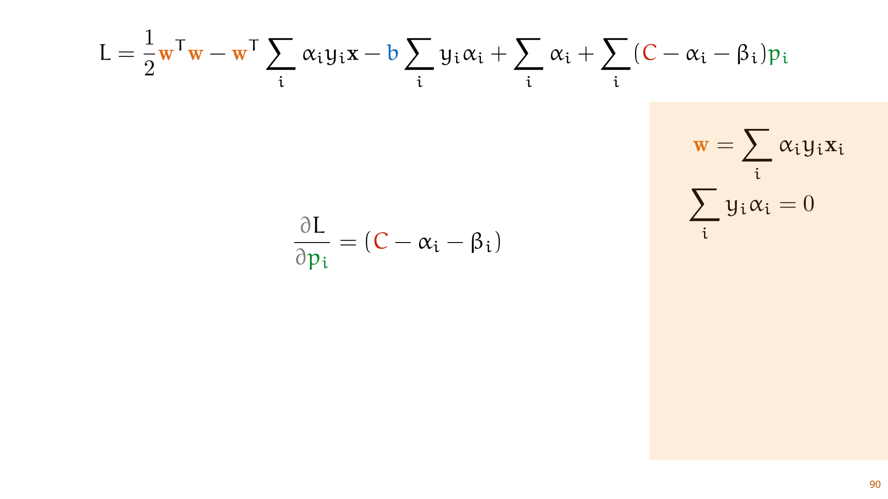

            <figcaption>
            
Finally, we take the derivative for pi and set that equal to zero. 

The result essentially tells us that for any given instance i, the alpha plus the beta must equal C.  

If we assume that alpha is between 0 and C, then we can just take beta to be the remainder.

            </figcaption>
            click image for animation
       </section>

       <section id="slide-091" class="anim">
            <a class="slide-link" href="https://mlvu.github.io/svms#slide-091" title="Link to this slide.">link here</a>
            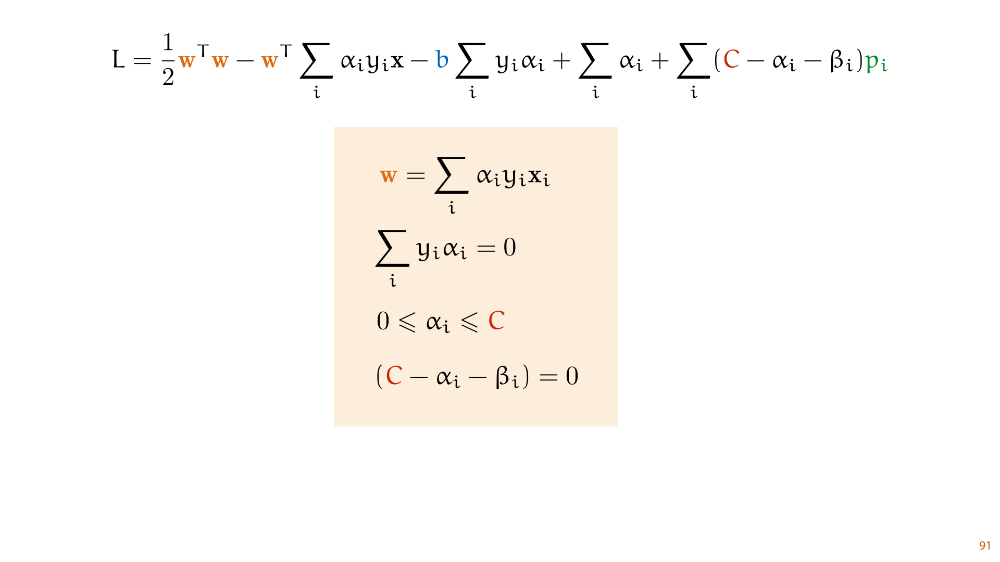

            <figcaption>
            
This (in the orange box) is what we have figured out so far about our function at the optimum.  

If we fill in the three equalities, our function simplifies a lot. This function describes the optimum, subject to the constraints on the right. These are constraints of variables in our final form, so we need to remember these. 

We've eliminated almost all original variables, except <strong class="orange">w</strong>. We have a good expression for w in terms of the α's, so we can just fill this in, and rewrite. 

            </figcaption>
            click image for animation
       </section>

       <section id="slide-092" class="anim">
            <a class="slide-link" href="https://mlvu.github.io/svms#slide-092" title="Link to this slide.">link here</a>
            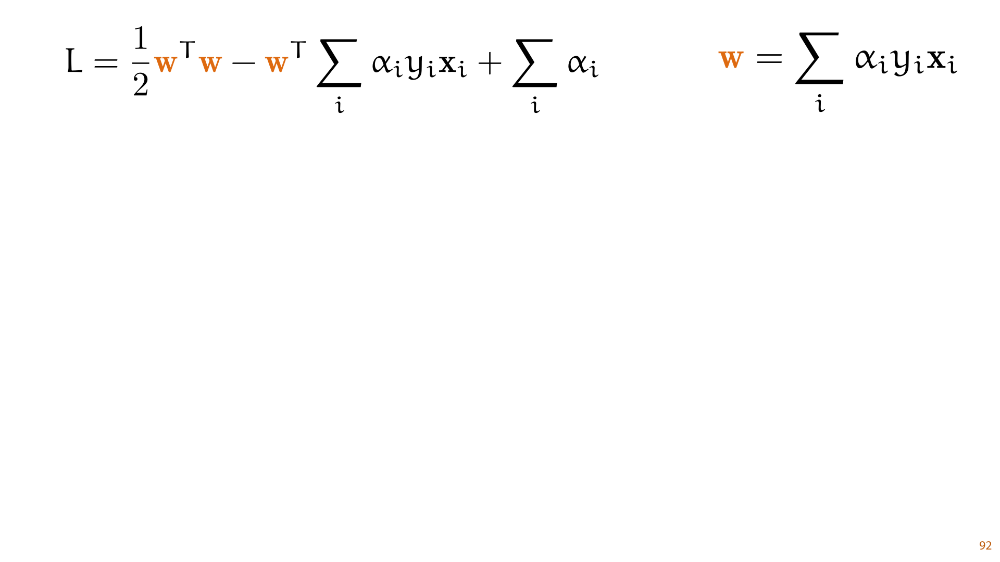

            <figcaption>
            
We first replace one of the sums in the first line with <strong class="orange">w</strong>. This is going in the wrong direction, but it allows us to reduce the number of <strong class="orange">w</strong>'s in the equation. 

Then, we replace the final two occurrences of <strong class="orange">w</strong>, with the sum. This gives us a function purely in terms of alpha, with no reference to <strong class="orange">w</strong> or b. All we need to do is simplify it a little bit. 

Note that the square brackets here are just brackets, they have no special meaning.

            </figcaption>
            click image for animation
       </section>

       <section id="slide-093" class="anim">
            <a class="slide-link" href="https://mlvu.github.io/svms#slide-093" title="Link to this slide.">link here</a>
            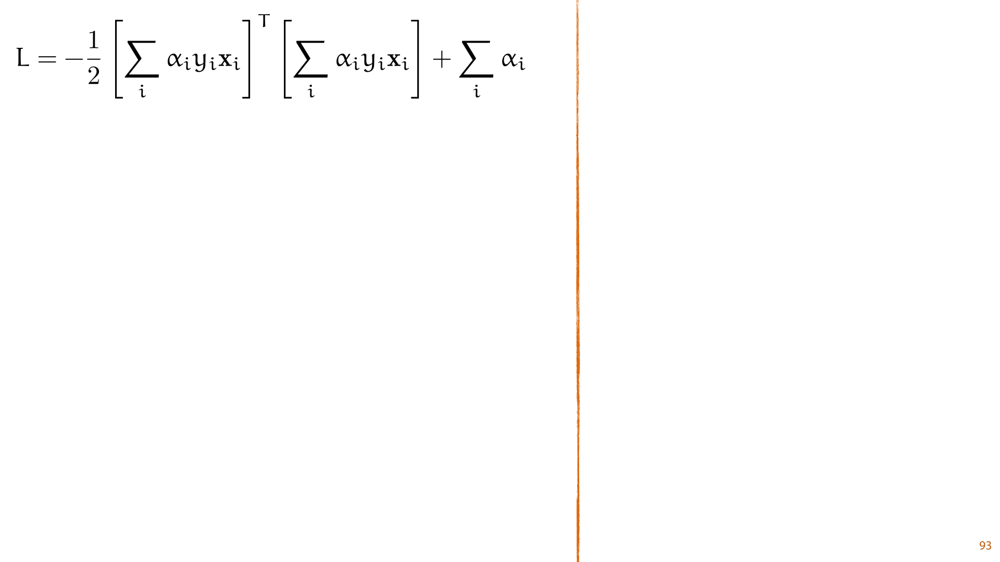

            <figcaption>
            
To simplify, we distribute all dot products over the sums. Note that the dot product distributed over sums the same way as scalar multiplication: (a + b + c)Td -&gt; (aTd  + bTd  + cTd).  

It looks a little intimidating with the capital sigma notation, but it’s the same thing as you see on the right, except with dot products instead of of scalar multiplication. 

            </figcaption>
            click image for animation
       </section>

       <section id="slide-094">
            <a class="slide-link" href="https://mlvu.github.io/svms#slide-094" title="Link to this slide.">link here</a>
            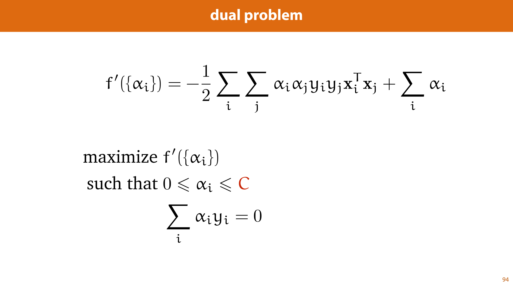

            <figcaption>
            
Here's what all that gives us for the dual problem. We've simplified the objective function to have only α's, and we've received some constraints in return. 

Note that these constraints <strong>are not the KKT conditions</strong>. They are requirements for the Lagrangian to be at a minimum in the original parameters. All we have so far is weak duality. To get strong duality, we need to either prove that the KKT conditions hold for all solutions like these, or add some of them to the list of constraints. It turns out we can do the former: all KKT conditions hold already for this form of the problem, so we have strong duality.

            </figcaption>
       </section>

       <section id="slide-095">
            <a class="slide-link" href="https://mlvu.github.io/svms#slide-095" title="Link to this slide.">link here</a>
            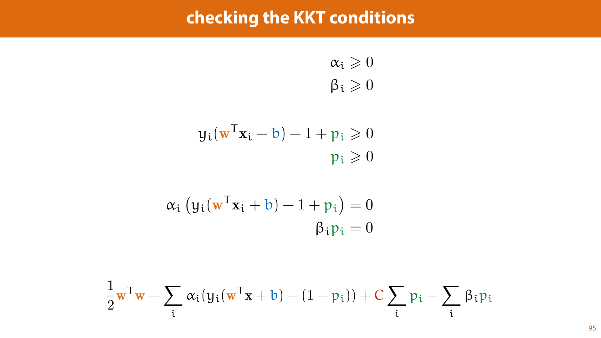

            <figcaption>
            
Here they are for our problem. If we take a solution to our dual problem (a set of alphas), use the expressions for w, b and pi in terms of alpha, and fill them in here, these six statements should hold. 

This is easiest to do with the help of the original form of the Lagrangian, reproduced at the bottom of the slide. Note that we may assume that the original parameters are chosen so that this function is at a minimum, and the alphas are chosen to maximize over that. 

We don't have an expression for pi in terms of the alphas. This is because when (C -ai- bi) = 0, which is true at the optimum, the Langrangian is constant irrespective of pi. In some sense, we can set pi to whatever value we like. If we find one value that causes the KKT conditions to be satisfied, we have strong duality. We'll see that this is the case when we set pi to the originally intended value: where necessary, it makes up the difference between the output of the linear function and the edges of the margin. 

From top to bottom: 

αi is explicitly constrained to be larger than zero in the dual problem 

βi is the remainder between αi and C, so must also be positive. 

As noted, we are free to set and interpret pi however we like. It must be positive to satisfy the next condition. The original definition states that pi was zero if the first term was 1 or larger and makes up the (positive) difference if not. For this value of pi, the third and fourth constraints are satisfied. 

See above. 

The complementary slackness states that either ai is zero or the corresponding constraint is.If we use the slack variable pi, the constraint becomes exactly zero so complementary slackness is satisfied. If we don't use the slack variable (and pi is zero), the left hand side of the constraint may be nonzero, and we should show that that ai is zero. Assume that it isn't, and look at the second term of the Lagrangian. This now consists of two positive factors. If ai is nonzero, we could increase L by reducing it to zero, which tell us that ai must be zero, since ai is chosen to maximize L. 

The same argument as in the previous point can be used here. 

Therefore, the KKT conditions are satisfied by any solution to the dual problem, and we have strong duality.

            </figcaption>
       </section>

       <section id="slide-096">
            <a class="slide-link" href="https://mlvu.github.io/svms#slide-096" title="Link to this slide.">link here</a>
            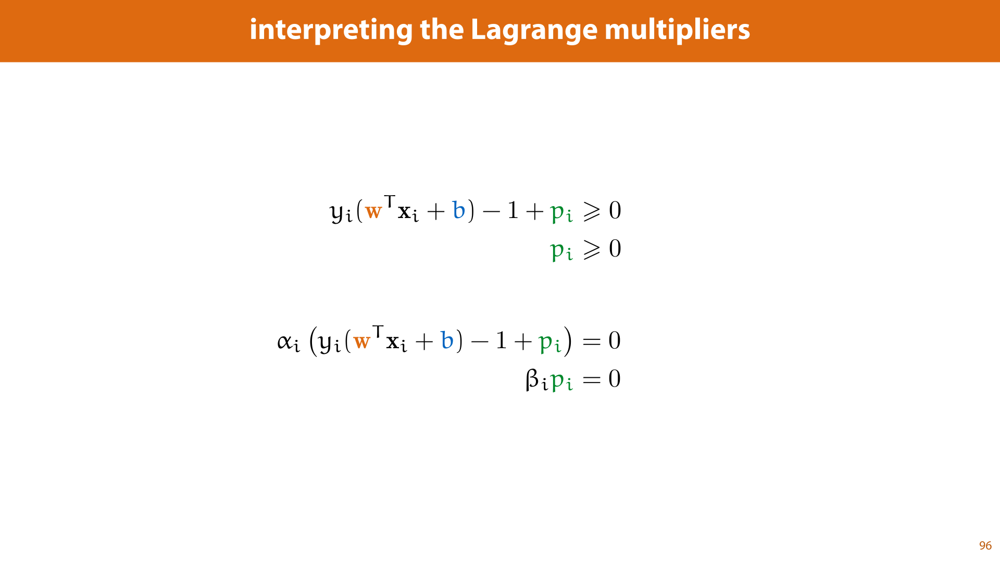

            <figcaption>
            
The argument we used to prove complementary slackness also tells us <strong>what the Lagrange multipliers mean</strong>. This is usually a fruitful area of investigation. The multipliers almost always have a meaningful intepretation in the problem domain.  

In this case, the alphas are a kind of complement to the slack parameters pi. Where the alphas are zero, the slack parameters aren't used, and so the point xi is on the correct side of the margin. Where alpha is nonzero, the slack parameters are active and we are dealing with points inside the margin. 
<aside    >A special case are the support vectors that are exactly on the margin. We can find these by checking for points where both the constraint and the multiplier are zero.</aside><aside    ></aside>
            </figcaption>
       </section>

       <section id="slide-097">
            <a class="slide-link" href="https://mlvu.github.io/svms#slide-097" title="Link to this slide.">link here</a>
            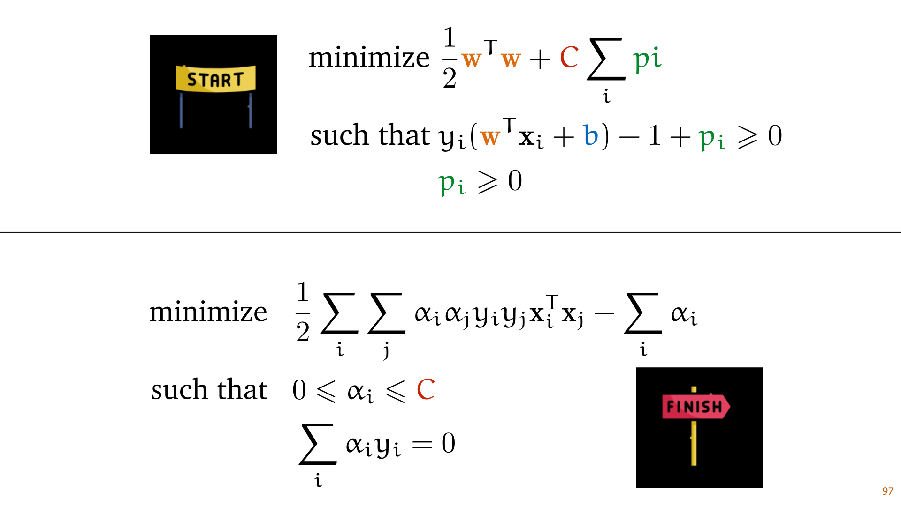

            <figcaption>
            
And there we have the dual problem for SVMs. Note that the dual always gives us a maximization over the Lagrange multilpliers (if we start with inqeuality constraints), but here we've flipped the sign to change it back to a minimization problem. 

 

            </figcaption>
       </section>

       <section id="slide-098">
            <a class="slide-link" href="https://mlvu.github.io/svms#slide-098" title="Link to this slide.">link here</a>
            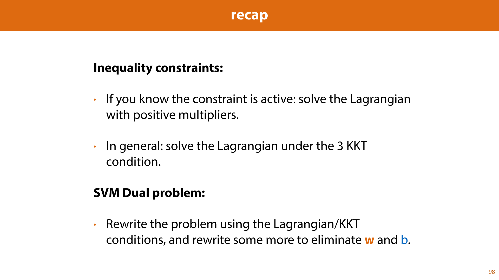

            <figcaption>
            

            </figcaption>
       </section>

</article>
