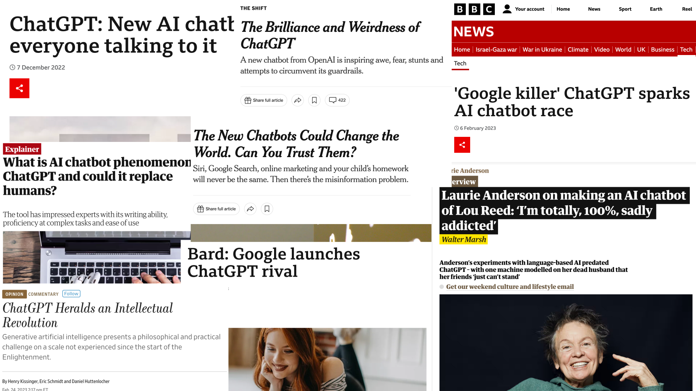
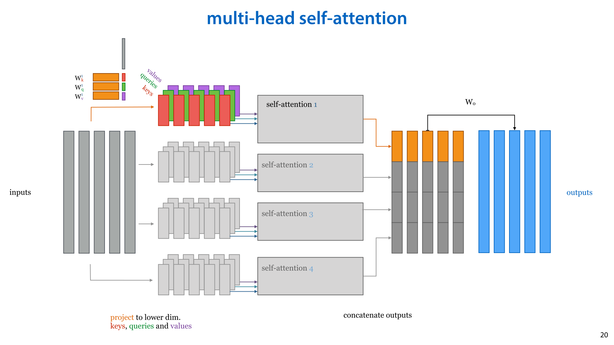
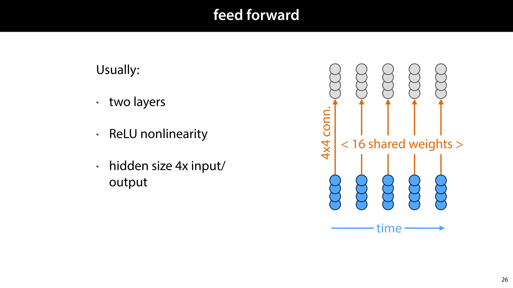
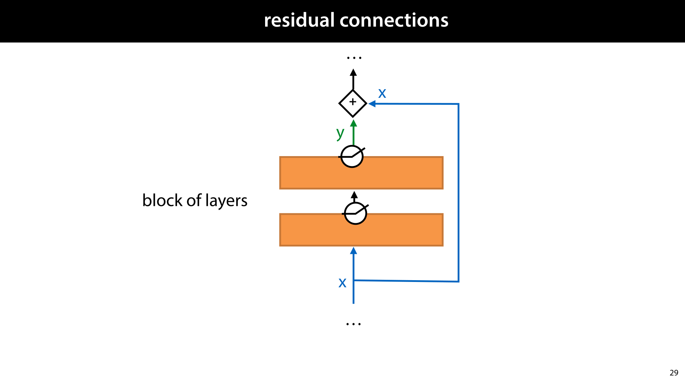
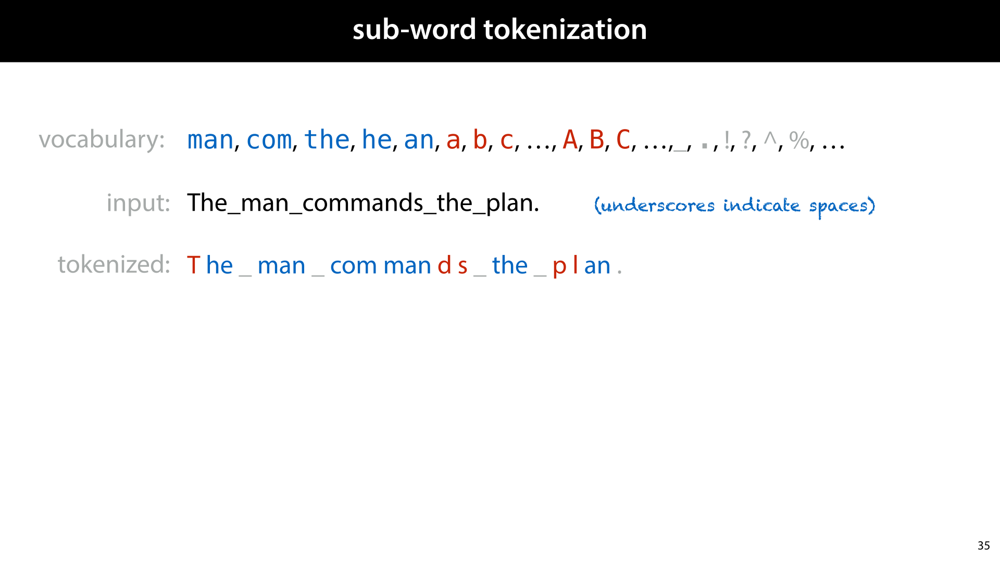
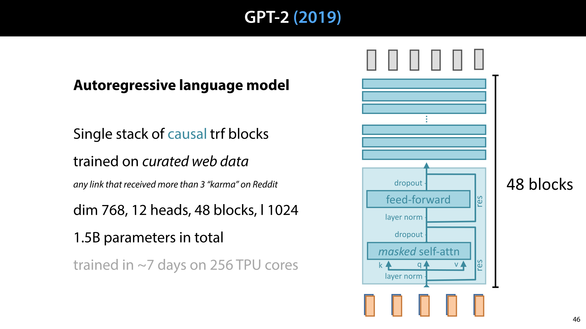
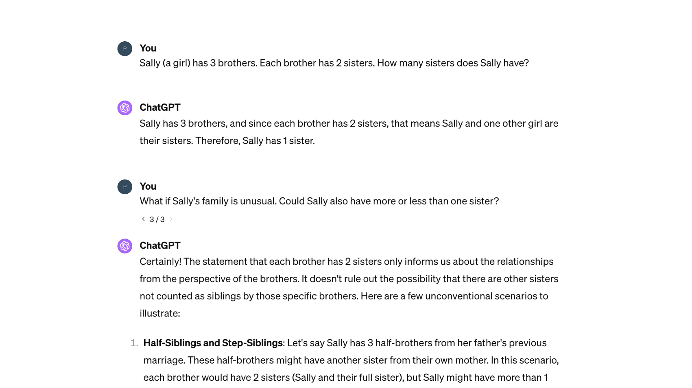

<nav class="menu">
    <ul>
        <li class="home"><a href="/">Home</a></li>
        <li class="name">Lecture 10: Transformers</li>
                <li><a href="#slide-001">Self-attention</a></li>
                <li><a href="#slide-022">Building transformers</a></li>
                <li><a href="#slide-056">Building chatbots</a></li>
        <li class="pdf"><a href="https://mlvu.github.io/lectures/Transformers.annotated.pdf">PDF</a></li>
    </ul>
</nav>

<article class="slides">

       <section id="slide-001">
            <a class="slide-link" href="https://mlvu.github.io/transformers#slide-001" title="Link to this slide.">link here</a>
            

            <figcaption>
            
 
<aside    >The videos for this lecture are currently being recorded. We’ll add them as soon as they’re available. </aside><aside    ></aside>
            </figcaption>
       </section>

       <section id="slide-002">
            <a class="slide-link" href="https://mlvu.github.io/transformers#slide-002" title="Link to this slide.">link here</a>
            

            <figcaption>
            
In November 2022, we witnessed a watershed for AI. The introduction of ChatGPT 

Technologically, not much changed. AI researchers who had been paying attention didn’t see anything that they didn’t know could be done. But for the world at large, the fact that the existing technology was put into a friendly environment and made accessible to all, woke people up to what was now possible.  

Behind the scenes, the fundamental technology behind ChatGPT,  the <em>Transformer</em>, had been introduced in 2016, and had been steadily maturing, until in 2021, we began to see what was possible when these models were trained at huge scales.  

In this lecture we will look at the surprisingly simple model that power transformer models like ChatGPT: self-attention, and we will take a broad look at how it’s built into models containing as many as 175 <em>billion</em> parameters. 
<aside    >That’s about 800Gb of data just to store a single neural network.</aside><aside    ></aside>
            </figcaption>
       </section>

       <section id="slide-003">
            <a class="slide-link" href="https://mlvu.github.io/transformers#slide-003" title="Link to this slide.">link here</a>
            

            <figcaption>
            
At heart, these are sequence models, built on a very simp0le sequence-to-sequence layer called <strong>self-attention</strong>. 

We’ve seen two examples of (non-trivial) sequence-to-sequence layers so far: recurrent neural networks, and  convolutions. RNNs have the benefit that they can potentially look infinitely far back into the sequence, but they require fundamentally sequential processing, making them slow. Convolution don’t have this drawback—we can compute each output vector in parallel if we want to—but the downside is that they are limited in how far back they can look into the sequence. 

 

            </figcaption>
       </section>

       <section id="slide-004">
            <a class="slide-link" href="https://mlvu.github.io/transformers#slide-004" title="Link to this slide.">link here</a>
            

            <figcaption>
            
Self-attention is another sequence-to-sequence layer, and one which provides us with the best of both worlds: parallel processing and a potentially infinite memory. 

To explain the basic idea, we will first strip it down to its essentials. We will call this simple self-attention. This will show the simplicity of the operation, and allows us to understand its fundamental properties more easily. 

Then, we will add a few bells and whistles to define self-attention as it’s practically used. These added features don’t change much about how self-attention operates fundamentally, but they make it a bit more powerful in practical use.

            </figcaption>
       </section>

       <section id="slide-005" class="anim">
            <a class="slide-link" href="https://mlvu.github.io/transformers#slide-005" title="Link to this slide.">link here</a>
            

            <figcaption>
            
As we said before, self-attention is a sequence-to-sequence layer. That means it’s job is to consume a sequence of vectors, and to spit out another sequence of vectors.  

At heart, the operation that does this is very simple. Every output is simply a <em>weighted sum</em> over the inputs. We multiply each input by a weight and then sum them all up. So, when we’re computing output <strong>y</strong>3, we have a weight w3i for every input <strong class="blue">x</strong>i. We then multiply each input vector by its weight and sum all these products together. The result is <strong>y</strong>3. In order to keep the magnitude of the of the output stable, we ensure that he weights are positive and that they sum to 1. 

This is not unlike the feedforward network we’ve seen already (except the inputs are now vectors instead of numbers). However, the fundamental trick of self-attention, is that the weights in this sum are<strong> not parameters</strong>. They are <em>derived</em> from the inputs. 

 
<aside    >Note that this means that the input and output dimensions of a self-attention layer are always the same. If we want to transform to a different dimension, we’ll need to add a projection layer.</aside><aside    ></aside>
            </figcaption>
            click image for animation
       </section>

       <section id="slide-006" class="anim">
            <a class="slide-link" href="https://mlvu.github.io/transformers#slide-006" title="Link to this slide.">link here</a>
            

            <figcaption>
            
Here’s how that is done.  

The output vector <strong>y</strong>i is a weighted sum over the inputs.  

The weights are derived from the similarity between the input <strong class="blue">x</strong>j for which we’re computing the weight, and the input <strong class="blue">x</strong>i whose position corresponds to the current output vector <strong>y</strong>i. The more similar the two vectors are, the higher the weight. We express this similarity with the dot product between the two vectors. 

To ensure that the weights are positive and sum to 1, we pass them through a<em> softmax </em>operation. The softmax is applied over all weights for the current output <strong>y</strong>i.

            </figcaption>
            click image for animation
       </section>

       <section id="slide-007" class="anim">
            <a class="slide-link" href="https://mlvu.github.io/transformers#slide-007" title="Link to this slide.">link here</a>
            

            <figcaption>
            
Here is a visual illustration of the computation. For the output at position 3, we compute all dot products of an input vector <strong class="blue">x</strong>i with input vector <strong class="blue">x</strong>3. These are the raw weights. Then, we softmax these over all weights we’ve computed, to make them positive and make them sum to one.  

Then, we multiply each input vector by its weight, and sum them all up, and the result is <strong>y</strong>3. 

<strong>question</strong> If we changed the output vector to <strong>y</strong>4, how would the diagram change? The vertical vectors in the dot products would stay the same, but the horizontal vectors would change from <strong class="blue">x</strong>3 to <strong class="blue">x</strong>4. The sum diamond would be under <strong>y</strong>4 instead of <strong>y</strong>3.

            </figcaption>
            click image for animation
       </section>

       <section id="slide-008" class="anim">
            <a class="slide-link" href="https://mlvu.github.io/transformers#slide-008" title="Link to this slide.">link here</a>
            

            <figcaption>
            
Self attention looks particularly simple when <em>vectorized</em>, that is, expressed terms of matrix operations.  

Note first, that if we arrange all the weights for one output vector, say <strong>y</strong>1, in a long vector <strong>w</strong>, with one element for every input, then the computation of the weighted sum for <strong>y</strong>1, is just <strong>w</strong> (as a row vector) times <strong class="blue">X</strong>T, where <strong class="blue">X</strong> is a matrix containing all the input vectors. If we then do the same for the other output vectors, and concatenate all the <strong>w</strong>’s into a matrix <strong>W</strong> as its rows, we see that the multiplication <strong>W</strong><strong class="blue">X</strong>T computes a matrix <strong>Y</strong>T with all output vectors <strong>y</strong>i as its rows. 

Next, we need to figure out how to easily compute this matrix of weights <strong>W</strong>. We’ll start with a matrix of raw weights <strong>W</strong>’. The element ij of this matrix is the dot product of two vectors i and j. This is essentially the definition of a matrix multiplication: in the multiplication <strong>AB</strong> = <strong>C</strong>, <strong>C</strong>ij is the dot product of the i-th row of <strong>A</strong> and the j-th column of <strong>B</strong>. This means that if we set up on matrix with <strong>x</strong>i as its i-th row and one matrix with <strong>x</strong>j as its j-th column, multiplying these together will give us <strong>W</strong>’.  

That is, <strong class="blue">X</strong>T<strong class="blue">X</strong> = <strong>W</strong>’. 

Finally, we need to apply a softmax. This should go over all the weights that correspond to a single output. In the multiplication diagram on the right, we see that these form the <em>rows</em> of <strong>W</strong>’. Therefore, we need to apply a row-wise softmax.  Put differently, we want to ensure that all the rows sum to 1. 

With that, we have the three steps of a vectorized, simple self-attention.

            </figcaption>
            click image for animation
       </section>

       <section id="slide-009">
            <a class="slide-link" href="https://mlvu.github.io/transformers#slide-009" title="Link to this slide.">link here</a>
            

            <figcaption>
            
Here are some things to consider about the self attention operation we’ve defined.  

1) In general we can expect the dot product of a vector with itself to be bigger than the dot product with any of the other vectors. This is because the dot product is, roughly, a measure of similarity, and a vector will be most similar to itself.  
<aside    >We can craft a situation where the dot product with another vector is still bigger but in practice, the dot product of a vector with itself will usually be biggest. </aside>
This means that the weight wii will usually be much bigger than the other weights. In short, for output <strong>y</strong>i self-attention usually produces a mixture of the input vectors that is mostly <strong class="blue">x</strong>i, with a little of the others mixed in. This means that the output won’t be much different from the input. We will add some ways to change this later (although it’s not necessarily a bad thing). 

2) Note that there are<strong> no parameters</strong> yet. The only way we can steer how self-attention behaves is by controlling the input values. For example, we can feed self attention with embedding vectors, or feed it with the output of another layer. We’ll add some parametrized components later, but for now, it’s important to realize that the fundamental operation of self-attenttion does not have any parameters that we can control. 

3) Note that if we treat <strong>W</strong> as constants, the self attention is a <strong>linear operation</strong>. This means nice non-vanishing gradients. Of course, W isn’t constant, so we essentially get two paths of computation between <strong>X</strong> and <strong>Y</strong>. One linear, with clean, fast acting gradients, and one nonlinear, with slow vanishing gradients, but able to learn non-linear operations. It’s likely that this is where a lot of the power of the self-attention comes from. 
<aside    >Compare this to the LSTM, where we had a “conveyor belt” which was only affected by linear operations, and then a set of nonlinear functions that drove the manipulation of the conveyor belt. The principle here is very similar.</aside><aside    ></aside>
            </figcaption>
       </section>

       <section id="slide-010">
            <a class="slide-link" href="https://mlvu.github.io/transformers#slide-010" title="Link to this slide.">link here</a>
            

            <figcaption>
            
Some more things we can note: 

The self-attention has no problem looking far back into the sequence. In fact, for a sequence of 1000 elements, <strong class="blue">x</strong>1 influences the outcome <strong>y</strong>1 in exactly the same way as the outcome <strong>y</strong>1000. The information travels exactly the same distance along the computation graph. Compare this to an LSTM, where the information in <strong class="blue">x</strong>1 goes through one cell to compute the output <strong>y</strong>1, but it goes through 1000 cells to  compute <strong>y</strong>1000. 

In fact, the self-attention doesn’t really “see” the sequential structure of the data at all. When an LSTM compute the output for y6, it can treat x5 differently from x1, even if x5 and x1 are the same vector. It can use the position in the sequence in addition to the content of the vector. Simple self-attention cannot do that. For this reason we say that it’s more of a set-to-set model than a sequence-to-sequence model. This has benefits (such as the one outlined in pt. 1) but also certain downsides. To get the best of both worlds, we’ll see a way of introducing position information later. 

The self-attention is permutation <em>equivariant</em>. This means that if we shuffle (permute) the input sequence, the output sequence will be shuffled in the same way, but will otherwise be unchanged. 

<strong>question:</strong> These three points are really three perspectives on the same thing. Can you see how? Permutation equivariance (3) shows that the self attention cannot change its output based on how the input vectors are ordered. In short, it cannot “see” the ordering. This suggests that it treats the input as an unordered set of vectors, i.e. it’s a set model (2). If self-attention is a set model, then it cannot treat elements far back in the sequence differently from nearby elements, purely based on their distance (1). It can only treat input vectors differently base don their content, not based on their position.

            </figcaption>
       </section>

       <section id="slide-011">
            <a class="slide-link" href="https://mlvu.github.io/transformers#slide-011" title="Link to this slide.">link here</a>
            

            <figcaption>
            
As a simple example, let’s build a sequence classifier consisting of just one embedding layer, followed by a global maxpooling layer. We’ll imagine a sentiment classification task where the aim is to predict whether a restaurant review is positive or negative. 

If we did this without the self-attention layer, we would essentially have a model where each word can only contribute to the output score <em>independently</em> of the other.  
<aside    >This is known as a bag-of-words model. A naive Bayes model and a 0-order Markov model are other examples of bag-of-words models. </aside>
In such a model, the word “terrible” would probably cause us to predict that this is a negative review. In order to see that it might be a positive review, we need to recognize that the meaning of the word terrible is moderated by the word not. This is what the self-attention can do for us.

            </figcaption>
       </section>

       <section id="slide-012">
            <a class="slide-link" href="https://mlvu.github.io/transformers#slide-012" title="Link to this slide.">link here</a>
            

            <figcaption>
            
If the embedding vectors of <em>not</em> and <em>terrible</em> have a high dot product together, the weight of the input vector for <em>not</em> becomes high, allowing it to influence the meaning of the word <em>terrible</em> in the output sequence. This could help the model learn, for instance that the negative sentiment carried by the word <em>terrible</em> is flipped around to a positive sentiment by the word <em>not</em>. 
<aside    >It can’t yet see that the word “not” is  close to the word “terrible”, or understand the grammatical relations, but it can at least see that the this sentence contains both words, so it might want to hedge its bets on calling this a negative review..</aside><aside    ></aside>
            </figcaption>
       </section>

       <section id="slide-013">
            <a class="slide-link" href="https://mlvu.github.io/transformers#slide-013" title="Link to this slide.">link here</a>
            

            <figcaption>
            
The standard self-attention adds some bells and whistles to this basic framework. Specifically these three features.

            </figcaption>
       </section>

       <section id="slide-014">
            <a class="slide-link" href="https://mlvu.github.io/transformers#slide-014" title="Link to this slide.">link here</a>
            

            <figcaption>
            
<em>Scaled</em> self attention is very simple: instead of using the dot product, we use the dot product<strong> scaled by the square root of the input dimension</strong>. This ensures that the input and output of the self attention operation have similar magnitude. In short, the output vectors don’t blow up in magnitude (or shrink down to zero) if we stack together a lot of self-attention operations with high-dimensional vectors. 

Why √k? Imagine a vector in ℝk with values all c. Its length is √(c2 + c2 + … + c2)  = √(kc2) =  c√k. Therefore, we are dividing out the amount by which the increase in dimension increases the length of the average vectors.  
<aside    >Transformer models usually apply normalization at every layer, so we can assume that the input is standard-normally distributed.</aside><aside    ></aside>
            </figcaption>
       </section>

       <section id="slide-015">
            <a class="slide-link" href="https://mlvu.github.io/transformers#slide-015" title="Link to this slide.">link here</a>
            

            <figcaption>
            
In each self attention computation, every input vector occurs in three distinct roles: 

<strong>the value</strong>: the vector that is used in the weighted sum that ultimately provides the output 

<strong>the query</strong>: the input vector that corresponds to the current output, matched against every other input vector. 

<strong class="red">the key</strong>: the input vector that the query is matched against to determine the weight. 

This is where we'll add some parameters. We will manipulate the input vector, based on which role it appears in.

            </figcaption>
       </section>

       <section id="slide-016" class="anim">
            <a class="slide-link" href="https://mlvu.github.io/transformers#slide-016" title="Link to this slide.">link here</a>
            

            <figcaption>
            
We can see where these names come from by comparing the (self) attention operation to a dictionary. 

In a dictionary, all the operations are discrete: a query only matches a single key, and returns only the value corresponding to that key.

            </figcaption>
            click image for animation
       </section>

       <section id="slide-017">
            <a class="slide-link" href="https://mlvu.github.io/transformers#slide-017" title="Link to this slide.">link here</a>
            

            <figcaption>
            
We can see an attention operation, as a softened version of the dictionary. The attention holds a bunch of values, which are vectors, and to each value is associated a key, which is also a vector. We can then ask the attention to give us a value for a given query, which is again a vector. Where the attention differs from the dictionary is that is doesn’t return a <em>single</em> value, but a mixture over all the values. Each value in the database contributes to this mixture to some extent, based on how similar the query is to its key. 

<strong>question</strong> In attention the keys, queries and values don’t all need to have the same dimension. Which dimensions can differ, and which need to be the same? The query needs to be the same dimension as the key, because we need to compute a dot product between them. The value can have a different dimension: we only ever need to sum values to other values, or multiply them by a scalar weight.  

We can now say that simple <em>self</em>-attention is just attention, but with the keys, queries and values taken from the same set. To make self-attention a little more expressive, we can give each vector <strong class="blue">x</strong>i a small transformation just before we use it. If we apply different transformations depending on whether <strong class="blue">x</strong>i will be a key, query or value, we can subtly change the behaviour in different ways. 
<aside    >If the dot product of only one query/key pair is non-zero, we recover the operation of a normal dictionary.</aside><aside    ></aside>
            </figcaption>
       </section>

       <section id="slide-018">
            <a class="slide-link" href="https://mlvu.github.io/transformers#slide-018" title="Link to this slide.">link here</a>
            

            <figcaption>
            
Here is how that is done in practice. We multiply each input vector by three different k-by-k parameter matrices, which gives us a different vector to act as key, query and value. 

<strong>question</strong> This fixes two problems that we noted before. Can you remember which? First, it makes the self-attention layer an operation with parameters. We can learn what the values ofthe matrices <strong class="red">K</strong>, <strong>Q</strong> and <strong>V</strong> should be to modify the behaviour of our network. Second, it means that the weight wii is no longer computed as the dot product of a vector by itself, so it’s no longer likely to be large. It can be, but it doesn’t <em>have</em> to be. 
<aside    >We’ve given each transformation a bias here. In recent models, people report good results without these biases (i.e. using just the transformation matrix), so they may not be strictly necessary. Consider them an optional addition to the self-attention.</aside><aside    ></aside>
            </figcaption>
       </section>

       <section id="slide-019">
            <a class="slide-link" href="https://mlvu.github.io/transformers#slide-019" title="Link to this slide.">link here</a>
            

            <figcaption>
            
Finally, we will add<strong> multi-head self-attention</strong>. Fundamentally, the idea is just that we apply multiple smaller copies of the self-attention in parallel, each with their own key/query/value projections, so that each can behave differently. 

One way of thinking about this is that in many sentences, there are different relations to model between words. Here, the meaning of the word “terrible” is inverted by “not” and moderated by “too”. Its relation to the word restaurant is completely different: it describes a property of the restaurant. 

The idea behind multi-head self-attention is that multiple relations are best captured by different self-attention operations.

            </figcaption>
       </section>

       <section id="slide-020">
            <a class="slide-link" href="https://mlvu.github.io/transformers#slide-020" title="Link to this slide.">link here</a>
            

            <figcaption>
            
The idea of multi-head attention, is that we apply h self attentions (with different <strong class="red">K</strong>, <strong>Q</strong>, <strong>V</strong> matrices and biases) <strong>in parallel</strong>. This is usually done in a way that requires roughly the same number of parameters are a one single-head self-attention on the same input. To achieve this, the data is projected down to separate keys, queries and values of dimensionality of k/h, where k is the original input dimension and h is the number of heads being computed in parallel. Each of these smaller inputs is fed to a separate self-attention and the results are concatenated. 
<aside    >If you implement this cleverly (see <a href="https://dlvu.github.io/sa/#slide-026"><strong class="blue">DLVU lecture 12</strong></a> for details), you will end up with exactly the same number of parameters as the original single-head self attention, except for the additional W0 matrix at the end.</aside><aside    ></aside>
            </figcaption>
       </section>

       <section id="slide-021">
            <a class="slide-link" href="https://mlvu.github.io/transformers#slide-021" title="Link to this slide.">link here</a>
            

            <figcaption>
            

            </figcaption>
       </section>

       <section id="slide-022">
            <a class="slide-link" href="https://mlvu.github.io/transformers#slide-022" title="Link to this slide.">link here</a>
            

            <figcaption>
            
 

            </figcaption>
       </section>

       <section id="slide-023">
            <a class="slide-link" href="https://mlvu.github.io/transformers#slide-023" title="Link to this slide.">link here</a>
            

            <figcaption>
            
Now that we have a self-attention operation defined, we can start building it into a full model. Such models are called <strong>transformers</strong>. It's not precisely defined what makes a transformer a transformer, but we'll stick with the definition that a transformer is a sequence model where the only or primary operation that propagates information along the time dimension is self attention. There may be other operations,  but these only look at each token by itself, without taking into account what its neighbors do. 

The idea of transformers started in the domain of sequential data, but it has been extended to other domains as well. There are now, for instance transformers for images and for graphs. Here the idea is that the input data consists of some basic <strong>units</strong> that are connected together in some regular way. In natural language, the units are are the characters or words that are strung together in a sequence. In images these are the pixels, which are connected together in a grid, and in a graph, these are the nodes that are connected together in the graph structure. 

In all cases, a transformer is a model that learns vector representations of these units, in such a way that the only operation that propagates information <em>between </em>the units is some form of self attention. 
<aside    >We'll stick with sequence transformers for the rest of the lecture, but the translation to other domains is usually quite straightforward.</aside><aside    ></aside>
            </figcaption>
       </section>

       <section id="slide-024">
            <a class="slide-link" href="https://mlvu.github.io/transformers#slide-024" title="Link to this slide.">link here</a>
            

            <figcaption>
            
In this section we will discuss the main things we need to add around the self-attention operation in order to create a full fledged transformer.  

Along the way, we will show some of the more famous models that have been introduced over the years.  
<aside    >We won’t do this in chronological order. Rather, we will introduce each model when we’ve discussed the necessary indgredients. By and large, transformer got simpler, as we developed them, which means it’s best not to start at the very beginning.</aside><aside    ></aside>
            </figcaption>
       </section>

       <section id="slide-025">
            <a class="slide-link" href="https://mlvu.github.io/transformers#slide-025" title="Link to this slide.">link here</a>
            

            <figcaption>
            
The main idea that will turn a self attention layer into a transformer, is juts to stak a large number of self-attention layers together into one big model. However, to make this work well, we need a few additional ingredients. Here are the three main ones. 

            </figcaption>
       </section>

       <section id="slide-026">
            <a class="slide-link" href="https://mlvu.github.io/transformers#slide-026" title="Link to this slide.">link here</a>
            

            <figcaption>
            
The first, addition is that we will add  feedforward layers. We’ve seen these already, in <a href="https://mlvu.github.io/lecture11/#slide-045"><strong class="blue">the Sequences lecture</strong></a>, as a simple example of a sequence-to-sequence layer. The idea is that they apply the same MLP or feedforward network to each input vector individually. This doesn’t allow information to propagate between the different positions in the sequence, but it allows some nonlinear processing of the individual tokens. 

The way this is usually set up is that a single feed-forward block consists of two fully connected layers. The first projects up to a hidden size of 4k, where k is the input size. This is followed by a ReLU activation, after which we project down again to k, with no nonlinearity.

            </figcaption>
       </section>

       <section id="slide-027" class="anim">
            <a class="slide-link" href="https://mlvu.github.io/transformers#slide-027" title="Link to this slide.">link here</a>
            

            <figcaption>
            
Next up is <em>layer normalization</em>. We’ve seen already that it’s important in neural network to normalize your input, and to choose your initialization carefully. The idea is that the magnitudes of the hidden values at each layer should remain roughly the same (not blowing up or shrinking down to zero), and so should the gradients propagating back down the network.  

In deep networks, careful initialization and normalization is not enough. If you go deep enough, you’ll always see a small amount of shrinkage or growth. To combat this, we can simply put a normalization step half way up our network.  

This is no different from the computation that we used to do the normalization (or rather <em>standardization</em> as we called it there) on the initial data. The difference here is that we perform this computation on the intermediate values of the network. We just compute their mean, and standard deviation, and then subtract the mean and divide by the standard deviation. 

Since this computation is entirely differentiable, we can make it part of the neural network, and backpropagate through it. We use operations (summing, dividing) for which the gradients are well defined, so we can just integrate the normalization into our computation graph.

            </figcaption>
            click image for animation
       </section>

       <section id="slide-028" class="anim">
            <a class="slide-link" href="https://mlvu.github.io/transformers#slide-028" title="Link to this slide.">link here</a>
            

            <figcaption>
            
We get different kinds of normalization layers, depending on what we normalize. For instance, if we normalize a tensor of intermediate values so that along the batch dimension, each value isa mean-centered with variance 1, we call that <em>batch normalization</em>. 

In layer normalization, as it is used in transformers, we apply the normalization internally to each vector. That is, we compute the mean and standard deviation of all the values within vector x3, and then use these to normalize only the values within that vector, to create output vector <strong>y</strong>3. Step by step, the algorithm for a given vector computes the mean μ and standard deviation σ over the values of that vector. We then subtract μ from each element of x and divide by σ. The result, <strong>y</strong>3, is a linearly scaled version of x3, which is mean-centered and has variance 1.  

Finally, we can optionally multiply element-wise <strong>y</strong>3 by a vector of weights <strong>w</strong> and a vector of biases <strong class="blue">b</strong>. This allows the output to be no longer mean centered or have variance 1. The idea is that we can have our cake and eat it too: the output can have any mean and variance, but internally it’s also normalized. Because of the normalization, we get good propagation of gradients, and because of the rescaling step, we get any scale and mean of output we like. Since this final step is purely linear, it doesn’t harm our gradients.

            </figcaption>
            click image for animation
       </section>

       <section id="slide-029">
            <a class="slide-link" href="https://mlvu.github.io/transformers#slide-029" title="Link to this slide.">link here</a>
            

            <figcaption>
            
Another cheap trick to help your gradients propagate, especially during early training is to simply add a connection around a block of layers. We take the input of the block and add it to the output (sometimes multiplied by a single scalar parameter, but this isn't usually necessary).  

This does require that the input of the block has the same dimensions as the output, but it's usually possible to design your network in these kinds of blocks. This is called a <strong>residual connection</strong>. 

The benefit of the residual connection is that at the start of training, when the gradient signal through the block is weak because of the limits of initialization, there is a second signal through the residual that doesn't suffer this decay. The lower layers can start training based on this signal, and later, when the layers in the block start to do something useful, integrate the gradient that propagates through the block. 

            </figcaption>
       </section>

       <section id="slide-030">
            <a class="slide-link" href="https://mlvu.github.io/transformers#slide-030" title="Link to this slide.">link here</a>
            

            <figcaption>
            
With this we can define the basic building block of transformer models: the <strong>transformer block </strong>(sometimes called a layer, but that term is a little overloaded).  

The details differ per transformer, but the basic ingredients are usually:  

Self-attention 

A feed-forward layer applied individually to each token in the sequence. 

A layer normalization before the self-attention and the feed-forward. 

Residual connections around the self attention and around the feed-forward. 

On the left is what such a block would look like implemented in Pytorch. 

<strong>question</strong> Which parts of the block propagate information along the time dimension? That is, imagine that output <strong>y</strong>2 is determined in part by the input <strong class="blue">x</strong>3; in which part of the block can this information propagate? Only in the self-attention. If we remove that from the block the value of <strong>y</strong>2 depends only on <strong class="blue">x</strong>2. 

            </figcaption>
       </section>

       <section id="slide-031">
            <a class="slide-link" href="https://mlvu.github.io/transformers#slide-031" title="Link to this slide.">link here</a>
            

            <figcaption>
            
With our transformer block defined, we can start building transformers. Here is a very simple example: a classifier to predict whether a given one-sentence restaurant review is positive or negative about the restaurant. 
<aside    >This task is called sentiment classification. </aside>
The input is a sentence, broken up into words. We map these to embedding vectors as shown in the sequences lecture. Next, this sequence of embedding vectors is fed to a stack of transformer blocks, resulting in an sequence of output vectors. 

To reduce this to one vector representing the whole sentence, we average over the time dimension, resulting in a single vector representing the whole sentence. we use a single linear layer to project this down to two output nodes, one for each of our classes. We a apply a softmax, to give us class probabilities, and use a log loss to train the whole network. 

With this network in hand, we’ll see what features we’re missing to meaningfully solve this task.

            </figcaption>
       </section>

       <section id="slide-032">
            <a class="slide-link" href="https://mlvu.github.io/transformers#slide-032" title="Link to this slide.">link here</a>
            

            <figcaption>
            
Here are two sentences with exactly opposite sentiments. However, they contain exactly the same words just in a different order. That means that in our model, the embedding vectors going in will be the same, just in a different order. And since the transformer block is permutation equivariant, the outputs will also be the same, but shuffled. The problem is that we them average the vectors, and the shuffling won’t affect the average. In short, our model will assign these two sentences the same label, whatever we do. 
<aside    >We’ve only shown that the self attention is permutation equivariant, but since all the other operations in the block just operate on the vectors in isolation, the block as a whole must be permutation equivariant as well. </aside>
This is what we mean when we say that the self-attention is fundamentally a <strong>set-operation</strong>. It treats the input as a set, and it can't look at the ordering of the tokens. If we want the model to pay attention to the way the tokens are ordered, <strong>we need to tell it how they are ordered in the first place</strong>. 
<aside    >In more fancy words, we need to break the equivariance.</aside><aside    ></aside>
            </figcaption>
       </section>

       <section id="slide-033" class="anim">
            <a class="slide-link" href="https://mlvu.github.io/transformers#slide-033" title="Link to this slide.">link here</a>
            

            <figcaption>
            
The idea behind <strong>position embeddings</strong> is simple. Just like we assign each <em>word</em> in our vocabulary an embedding vector, which is always the same regardless of where the word appears, we also assign each<em> position</em> in the sentence an embedding vector, which is always the same <strong>regardless of which word appears at that position</strong>. 

This way, the input vectors for the first “the” in the input sequence and the second “the” are different, because the first is added to the position embedding v1 and the second is added to the input embedding v4. 

This breaks our equivariance: the position information becomes part of our embedding vectors, and is fed into the self attention. This is very effective, and very easy to implement. The only drawback is that we can’t run the model very well on sequences that are longer than the largest position embedding observed during training. 
<aside    >Alternative approaches are position encodings, where the values in the vectors representing the position aren't learned but set to some standard encoding function, and relative position embeddings and encodings, where clever tricks are used to encode the position relative to the current output token.</aside><aside    ></aside>
            </figcaption>
            click image for animation
       </section>

       <section id="slide-034">
            <a class="slide-link" href="https://mlvu.github.io/transformers#slide-034" title="Link to this slide.">link here</a>
            

            <figcaption>
            
Next, we need to think a little harder about what we feed the network <em>with</em>: what will be the constituent parts of the input sequence. What does one input vector correspond to? We call these the <strong>tokens</strong> of our data. 

We’ve seen already that we can break a chunk of natural language into either <em>characters</em> or <em>words</em>.  

If we break our sequence into words, we will have to deal with a very large vocabulary. That means a large output layer if we’re doing next-word prediction. It also means that we can’t really deal well with things like typos, noise, or bits of text that are written in another language. Even if we set the vocabulary to  a million words, we will still encounter words we cannot feed to the model. 

An alternative is to break the text up into a sequence of characters. The upside here is that we can deal with any word we encounter. The downside is that we get a very long sequence. Note that in self-attention the matrix of attention weights we compute is of size l × l. That means that as the sequence length grows, our memory use quadratically with it. In short, long sequences are the main bottleneck for transformers. So, the more data we can cram into a given number of tokens, the better. Additionally, a character level model spends a lot of time learning structures that we <em>already</em> know. We don’t really need to learn most of these. If we can communicate some of this structure to the model up front, we can save some time and energy that we can spend on learning more important things. 

            </figcaption>
       </section>

       <section id="slide-035" class="anim">
            <a class="slide-link" href="https://mlvu.github.io/transformers#slide-035" title="Link to this slide.">link here</a>
            

            <figcaption>
            
The middle ground between these two options is sub-word tokenization. We learn a vocabulary of short of character strings that are common in the data. These could be words, but also parts of words, or individual characters. 

Then, when we process a piece of text, we break it up into character chunks that are in our vocabulary. We try to do this in such a way that the text is fully represented in as few chunks as possible. These chunks then become our tokens.  

For example, in the sentence shown in the slide, we assume that the vocabulary contains all individual letters, uppercase and lowercase, and all common punctuation marks, as well as the multi-character chunks shown in blue. This means that we can represent the word “man” in three tokens, using the single-character tokens: m, a, n. However, since “an” is in our vocabulary, we can also represent it in two tokens: m, an. Finally, “man” itself is also in the vocabulary, so we can also represent it in a single token. The fewer tokens the better, so we choose the last option. For “plan” the whole word is not in the vocabulary, so the shortest option is p, l, an. 

With this approach, we have the best of both worlds. We can create a vocabulary with as many sub-word chunks as we can handle computationally. A common amount is about 50 000-100 000, which covers a lot of the most common words in a language like English. If a sentence is very regular, and properly spelled, we’ll tokenize it in about the same number of tokens we’d get with word-level tokenization. If there are typos, or uncommon words, we will need to revert back to single-letter tokens. We’ll get a longer sequence, but we can still represent everything in the sequence.

            </figcaption>
            click image for animation
       </section>

       <section id="slide-036" class="anim">
            <a class="slide-link" href="https://mlvu.github.io/transformers#slide-036" title="Link to this slide.">link here</a>
            

            <figcaption>
            
So how do we decide what our vocabulary should be? The most common approach is to look at our training data, to start with a character-level tokenization, and to merge pairs of tokens recursively. In the slide, for example, we first merge the character bigram “a n” into a single token. We then re-tokenize the sequence with this addition to our vocabulary, and repeat the process. It’s possible that in future steps two multi character tokens get merged into an even larger token. For example we can merge the tokens “m” and “an” into the three-character token “man”.  
<aside    >Note that when we do this, the old token “an” stays in the vocabulary. In the word plan, it’s still used, while the words “man” and “commands” are now tokenized with the three-character token. </aside>
There are a few approaches for deciding how this should be done in detail, specifically for how we should choose the next pair of tokens to merge. Bytepair and Wordpiece are probably the most popular algorithms. In practice, it seems the differences don’t matter all that much.

            </figcaption>
            click image for animation
       </section>

       <section id="slide-037">
            <a class="slide-link" href="https://mlvu.github.io/transformers#slide-037" title="Link to this slide.">link here</a>
            

            <figcaption>
            
And with that, we are ready to show our first real-world transformer model: BERT. 
<aside    >The name stands for Bidirectional Encoder Representations from Transformers. It followed the model ELMO, and started a brief trend of naming language models after muppets. </aside>
BERT consists of a single stack of 24 transformer blocks. Ints input, hidden and output vectors have 1024 dimensions, the self attention has 16 heads and the context length is 512 tokens long.  

The idea was to pre-train the model on a large amount of text in an unsupervised way, and then to <em>finetetune</em> the model on labeled data. 

            </figcaption>
       </section>

       <section id="slide-038">
            <a class="slide-link" href="https://mlvu.github.io/transformers#slide-038" title="Link to this slide.">link here</a>
            

            <figcaption>
            
For pre-training we are looking for tasks that  

don’t require any labels, and  

are likely to lead the model to learn representations that capture a lot of structure and meaning of the text. 

The idea is that if we don’t need labels, we are free to train on a huge amount of high-quality language data. This is easy enough to find on the internet, so we are limited only by how much data we can expose the model to within our computational budget. 

BERT used two tasks for pre-training. The first, and most important is <strong>masked language modeling (MLM)</strong>. 

For this task, we project the model’s 1024-dimensional output up to a v-dimensional output, where v is the size of our vocabulary. We then softmax this output so that at each position in the sequence the model predicts a token.  

We then we <em>corrupt </em>15% of the tokens in the input sequence. The model’s task is to predict what was originally in the place of the corrupted tokens. The loss is a simple log-loss on the correct answer (which we know, since we did the corrupting in the first place). The loss is only computed on the corrupted tokens. 

We corrupt tokens in one of three ways. For 80% of the corrupted tokens, we replace the original token with a special token (called a masking token) only used for this purpose. For the rest, we replace the original token with a randomly chosen other token for the vocabulary. For a small proportion, we leave the original token, but still treat it as a corrupted token (that is, we still compute a loss on this position). 
<aside    >This last trick ensures that he model doesn’t focus only on the tokens it “knows” are corrupted. We want the model to produce good embeddings  </aside>
The idea behind MLM is that, just like next-word prediction, doing this task well requires us to to understand the structure and some of the meaning of the sentence. If we train a model to be good at masked language modeling, it’s likely that the representations it produces (before we project them to tokens), capture a lot of the structure and meaning of the sentence. 

            </figcaption>
       </section>

       <section id="slide-039">
            <a class="slide-link" href="https://mlvu.github.io/transformers#slide-039" title="Link to this slide.">link here</a>
            

            <figcaption>
            
The BERT author wanted to test BERT on two types of downstream task (after the pretraining phase). Some that had a label for every token in the sentence (like POS tagging), but also some that had a label for every sentence (like sentiment classification). To ensure that at least one token could representthe sentence as a whole, they trained BERT on a sentence level task explicitly. 

During pre-training, each sequence is started with a special token, written as [CLS] in the diagram. For the classification task, we look only at the corresponding output token and discard the rest. The token is projected down to a binary classification.  

We then feed the model with either one sequence of 512 tokens taken from a random position in the data (case A), or with two sequences of 256 tokens from two different parts of the corpus, concatenated together (case B). In both cases, a special token, written as [sep] indicates the halfway point. The model’s job is to predict whether the two halves of the input sequence were next to each other in the corpus (case A) or not (case B).  

The idea is that this forces the model to look at the sentence as a whole and to represent the whole sentence and its meaning in the output corresponding to the CLS token.  

In subsequent research it was found that this already happens when you train with only the MLM task, and the classification task doesn’t add much. For that reason later versions of BERT dispense with this task.

            </figcaption>
       </section>

       <section id="slide-040">
            <a class="slide-link" href="https://mlvu.github.io/transformers#slide-040" title="Link to this slide.">link here</a>
            

            <figcaption>
            
The pretraining was done on a corpus (a natural language dataset) containing text from Wikipedia and from free self-published books. This ensured that all language was carefully written, and contained a reasonable mix of styles (at least encyclopaedic and fiction). 

The data was tokenized (with the WordPiece tokenizer), and fed to the model in chunks of 512 tokens. For fast training, the authors just cut chunks of 512 tokens from random positions at the corpus, not worrying about things like sentence ends. 
<aside    >Interestingly, the BooksCorpus shows an early instance of using copyrighted content to train ML models, which has now become quite controversial. The BooksCorpus was originally described as “copyright-free books by unpublished authors”, but the truth is that these were not copyright-free at all, and they were used without the authors’ consent. Whether such consent is necessary, or allowing people to view content immediately implies that they are also allowed to train models on it, is a hotly debated question, currently being worked out in many court cases.</aside><aside    ></aside>
            </figcaption>
       </section>

       <section id="slide-041">
            <a class="slide-link" href="https://mlvu.github.io/transformers#slide-041" title="Link to this slide.">link here</a>
            

            <figcaption>
            
After pretraining, we finetune on labeled data. This table is from the paper that presented BERT. Each column represents a natural language tasks with its own (labeled) training data and test data.  

For example, in MNLI you are given two sentences: a premise and a hypothesis. The task is to predict whether the hypothesis follows from the premise. This is a sequence-level classification task: we predict one label for a sequence of text.   

As you can see, BERT showed great improvement across the board.

            </figcaption>
       </section>

       <section id="slide-042" class="anim">
            <a class="slide-link" href="https://mlvu.github.io/transformers#slide-042" title="Link to this slide.">link here</a>
            

            <figcaption>
            
In the previous lecture on sequential data, we saw that simply predicting the next word in a sequence is a great way to train a model. We’ll call this autoregressive modeling. 

If you want to do autoregressive modeling, plain transformer blocks won't work. The self-attention operation can just look ahead in the sequence to predict what the next model will be. We will never learn to predict the future <strong>from the past</strong>.  

This was not a problem with LSTMs, because by definition any RNN can only look back in the sequence. They are <em>causal</em>. But like convolutions, self-attention needs to be<strong> made causal </strong>in order to be used in autoregressive settings. 
<aside    >Don’t read too much into the word causal. It just means a model that can only look in a certain direction. There is a subfield of statistics that is called causal modeling, which is concerned with properly establishing the difference between causation and correlation. These are not “causal models” in that sense.</aside><aside    ></aside>
            </figcaption>
            click image for animation
       </section>

       <section id="slide-043">
            <a class="slide-link" href="https://mlvu.github.io/transformers#slide-043" title="Link to this slide.">link here</a>
            

            <figcaption>
            
The solution is simple: when computing the third output, we simply apply the self-attention <em>only</em> over the first three elements. Anything further in the sequence than the element we're currently predicting for is ignored. 

Note that we apply the softmax only over these three weights. The rest of the inputs should get weight 0 and the weights up to the current position always sum to one. 

We call this a <strong>causal self-attention</strong>. 

            </figcaption>
       </section>

       <section id="slide-044">
            <a class="slide-link" href="https://mlvu.github.io/transformers#slide-044" title="Link to this slide.">link here</a>
            

            <figcaption>
            
Here is what that looks like vectorized. Note that we compute all weights, and then mask out the ones we don’t want. These, we set to negative infinity, so that they become 0 after the softmax. 

<strong>question</strong> Setting things to infinity seems scary. We have to trust that our softmax implementation is robust enough to handle this. Couldn’t we just do the softmax first, and then set the upper half of the weight matrix to 0? That seems like a safer value to set things to. The problem is that the softmax ensures that things sum to one. If we do the softmax first and then the mask, the result is that the weights we actually use sum to less than one. This makes the magnitude of the output very small for the tokens early in the sequence (since most of the weights are masked out).

            </figcaption>
       </section>

       <section id="slide-045">
            <a class="slide-link" href="https://mlvu.github.io/transformers#slide-045" title="Link to this slide.">link here</a>
            

            <figcaption>
            
Since the self attention is the only part of the transformer block that propagates information across the time dimension, making that part causal, makes the whole block causal. A transformer block with a causal self-attention is a <strong>causal transformer block</strong>. 

Now, a stack of transformer blocks can be put to work on the task of autoregrssive modeling. The input is a sequence of tokens, and the output is projected to the vocabulary, as it was in the BERT model. Then the targets for the prediction are just the sequence shifted one token to the left. That is, for each point in the sequence, we predict, in parallel, what the next token will be. 

Like the masked language modeling, this is great pre-training task. You can do it with only unlabeled data, and doing it well requires a lot of insight into what is happening in the part of the sentence you get to see. 

            </figcaption>
       </section>

       <section id="slide-046">
            <a class="slide-link" href="https://mlvu.github.io/transformers#slide-046" title="Link to this slide.">link here</a>
            

            <figcaption>
            
The GPT family of models are built this way. They are a stack of causal transformer blocks, which are trained to do next token prediction.  

You could see the first GPT already a few slides ago as one of the models that BERT soundly beat. We’ll skip that one and go straight to GPT 2, introduced in 2019. 

One innovation in GPT-3 was the recognition that training data should be <em>high quality</em>. We can easily get terabytes of text from the internet, but not all of it will be very high quality writing. It turns out that filtering quality can be very important in training large language models. To collect a dataset of high quality writing, the authors looked to social media. They collected only links that received a certain number of upvotes on the social media platform Reddit. 
<aside    >Note that this doesn’t mean that the model was trained on Reddit data. It was trained on general articles published on the web, but the articles were filtered by how many upvotes they received. </aside>

            </figcaption>
       </section>

       <section id="slide-047" class="anim">
            <a class="slide-link" href="https://mlvu.github.io/transformers#slide-047" title="Link to this slide.">link here</a>
            

            <figcaption>
            
The reason that we highlight GPT-2 in particular is that it represented a watershed in natural language generation. Like any autoregressive model, we can sample from it, to produce some natural-looking text from a given seed. 

We've seen already that LSTMs can be used to generate language that is stylistically quite realistic. However, the place where they always fell down was in<strong> long term coherence</strong>. For instance, they could generate realistic looking Shakespeare, but the character names would never stay the same from one paragraph to the next. 

GPT-2, quite a modestly sized model by today's standards, was the first model that showed the ability to generate long passages of text with an internally coherent structure. Here, for instance, GPT-2 continues the seed sequence (or <em>prompt</em>) shown in italics. the resulting news article is not only quite realistic, but it also keeps returning to the theme of the piece. The subject of unicorns keeps coming back, and it invents a Bolivian researcher with a Spanish-sounding name, remembers this name, and refers back to it in a consistent, but varied manner. 

            </figcaption>
            click image for animation
       </section>

       <section id="slide-048">
            <a class="slide-link" href="https://mlvu.github.io/transformers#slide-048" title="Link to this slide.">link here</a>
            

            <figcaption>
            
This is when the mainstream media began to take note of the capabilities of modern machine learning systems, and the threats that they could represent. For Open AI, the lab that developed GPT-2, this performance was reason enough not to release the model for a while, for fear that it could create a flood of realistic looking  misinformation. 

            </figcaption>
       </section>

       <section id="slide-049">
            <a class="slide-link" href="https://mlvu.github.io/transformers#slide-049" title="Link to this slide.">link here</a>
            

            <figcaption>
            
About a year and a half later, OpenAI showed off GPT-3. The architecture hadn’t changed much from GPT-2, but they had massively scaled it up. The number of parameters in the model had grown from 1.5 billion to a whopping 175 billion. The model was still pretrained purely for autoregressive language modeling, but this time on a dataset of around 800 Gb of text.  
<aside    >To find this much high-quality text on the web, OpenAI took their previous relatively small set of high quality articles, and trained a classifier to predict whether an article came from this subset, or from a larger, unfiltered web crawl. Then, they used this classifier select the high quality data from the general crawl. </aside><aside    ></aside>
            </figcaption>
       </section>

       <section id="slide-050">
            <a class="slide-link" href="https://mlvu.github.io/transformers#slide-050" title="Link to this slide.">link here</a>
            

            <figcaption>
            
This is graph from the paper of GPT-3, which was more than 100 times the size of GPT-3. Just the final training run of GPT-3 alone is estimated to have cost around 5-10 million dollars in compute. 

It's important to note that this is not just an exercise in building bigger models for the sake of it (although sometimes it seems that way). Transformer models seem to be subject to a kind of emergent behavior that only appears at very large scales. That is, we can build models that can do stuff we could never do before, but it only happens at the scale of billions of parameters and tens to hundreds of gigabytes of data.  

So far, we don't seem to have found the ceiling to this effect yet. The next biggest model, if we can build it, may show us yet more impressive behavior. This is leading to a lot of excitement and a kind of "race to the top" among big industry labs.  

The results can indeed be impressive, but in all this, the questions of social impact become more pronounced as well: with such massive datasets, it's hard to control what ends up in the data, which people are represented and how. The larger the model is, the less transparent it becomes and the more difficult it is to oversee the consequences of putting it blindly into a production system. 

source: <a href="https://arxiv.org/abs/2005.14165">Language models are few-shot learners.</a> Brown et al 2019

            </figcaption>
       </section>

       <section id="slide-051" class="anim">
            <a class="slide-link" href="https://mlvu.github.io/transformers#slide-051" title="Link to this slide.">link here</a>
            

            <figcaption>
            
As a pre-trained model, GPT-3 was far too large to fine-tune. The idea of BERT, that a company like google could pre-train a neural network which everybody could then download and finetune for their own purposes, didn’t work here anymore. GPT-3 was too large even to fine-tune without a million-dollar cluster and a lot of complex multiprocessing. 

Happily, a new ability took its place just in time: the ability for <strong>in-context learning</strong>.  

It turned out that GPT-3 was very good at recognizing patterns in ints input, and continuing them in a natural way. This means that you could set up some examples of a learning problem. An instance, followed by its label, then another instance, the label for that instance, and so on. Then you show the instance you actually want a prediction, and from there, you let GPT-3 predict the rest of the sequence. 

If GPT is successful, it will, first of all, continue the pattern and predict a class label in that position. Then, if it’s really good, it will also predict the correct class label.  
<aside    >It doesn’t really matter how you choose to represent your data. So long as there is some pattern to it, GPT-3 will pick up on the pattern and continue it. </aside>
In this way, we can use GPT-3 without any fine-tuning. We never do any backpropagation ourselves, or make any changes to the weights. In fact, we don’t even need to know the weights. All we need to be able to do is to give the mode a seed (or “prompt”)  and have it predict a continuation. We put the examples we have in the seed, and see what continuation GPT-3 predicts. 
<aside    >For OpenAI, this was a remarkably lucky discovery. Not only did they get a new mode of learning, just as the model was growing too big to finetune, but also in-context learning is much easier to commercialize. You don’t have to give people your model and let them fine-tune it. You can just offer an API that will let then run GPT-3 on a seed on their choice.</aside><aside    ></aside>
            </figcaption>
            click image for animation
       </section>

       <section id="slide-052">
            <a class="slide-link" href="https://mlvu.github.io/transformers#slide-052" title="Link to this slide.">link here</a>
            

            <figcaption>
            
Here is an example of a more complex in-context learning task, from the paper that introduced GPT-3. The aim is to use an invented word in a sentence, given a one-sentence definiton. The first definition/sentence pair (in gray) is given in the prompt. Then the second definition (farduddle) is given and the model generated a sentence for it (in black). 

This sentence is appended to the prompt, and a new definition is appended too (yalubalu). The model is used to generate a sentence and the process is repeated. 
<aside    >Incidentally, this provides a hint of GPT’s future. This way of alternating human input and text generated by the model is not a million miles away from a chat between the model and a human user.</aside><aside    ></aside>
            </figcaption>
       </section>

       <section id="slide-053">
            <a class="slide-link" href="https://mlvu.github.io/transformers#slide-053" title="Link to this slide.">link here</a>
            

            <figcaption>
            
This is the basic idea behind most transformer models. The simplicity and homogeneity compared to models based on LSTMs are a great benefit of the model family: this means that transformers are easier to scale up to huge numbers of parameters. Most claims you will see of models with hundreds of billions of parameters being trained refer to transformer models.

            </figcaption>
       </section>

       <section id="slide-054">
            <a class="slide-link" href="https://mlvu.github.io/transformers#slide-054" title="Link to this slide.">link here</a>
            

            <figcaption>
            
If you read other descriptions of transformer models, you may quickly run into the words <em>encoder</em> and <em>decoder</em>. 

In fact, most tutorials I can find seem to start there: “The first thing to know about transformers is that the consist of and encoder and a decoder.” 

This is <strong>not true</strong>,<strong> </strong>if you consider the BERT and GPT families of models to be transformers. None of these have encoder or decoder components. They are just simple stacks of transformer blocks. Nothing more. 

In fact, there is really only one transformer model worth mentioning here that has an encoder and decoder component…

            </figcaption>
       </section>

       <section id="slide-055">
            <a class="slide-link" href="https://mlvu.github.io/transformers#slide-055" title="Link to this slide.">link here</a>
            

            <figcaption>
            
And that’s the original transformer. The model that first showed that with just self-attention, you could get state-of-the-art performance. <em>Attention</em> had existed for a long time as a way to boost the performance of RNNs, but this paper, appropriately titled <em>Attention is all You Need</em>, showed that if you removed the RNNs and beefed up the number of attention operations, you would get a much more parallelizable model, that still showed state-of the-art performance. 

This model was a little more complex in its architecture than the BERTs and GPTs that came after. Specifically, it consisted of two stacks of transformer blocks: one function as an encoder and one as a decoder.  

The reason for this was simple. The original transformer was not trained for unsupervised language modeling, but for machine translation. It was given one sentence in language A, and it was supposed to translate it to language B.  
<aside    >There was no pretraining here (that only came with GPT and BERT). The whole model was trained on labeled data (pairs of sentences). </aside><aside    >For this reason, it made sense to train one half of the model to read and represent the input sentence in language A, and another half of the model to generate the predicted sentence in language B. But it’s important to note that this whole encoder.decoder business is just a consequence of the task of translation. It has nothing to do with the tasks that transformers were put to later, and almost all models that came after simplified the idea to a single stack of transformer blocks. </aside><aside    >The encoder/decoder idea still has merit in some settings. However, it’s important to note that it’s not a fundamental part of what makes a transformer a transformer. If you use it, you should know why. </aside><aside    ></aside>
            </figcaption>
       </section>

       <section id="slide-056">
            <a class="slide-link" href="https://mlvu.github.io/transformers#slide-056" title="Link to this slide.">link here</a>
            

            <figcaption>
            
 

            </figcaption>
       </section>

       <section id="slide-057">
            <a class="slide-link" href="https://mlvu.github.io/transformers#slide-057" title="Link to this slide.">link here</a>
            

            <figcaption>
            
The first time the general public could see what a large language model was capable of was when ChatGPT was released in November 2022.  

OpenAI turned GPT-3 into a chatbot, and allowed everybody in the world to talk to it. It wasn’t perfect: it was easy to make it do and say things the makers clearly didn’t intend, and logic puzzles that were very simple to humans would lead to wrong or even nonsensical answers. But, by and large, it responded in a coherent way to questions, and most of the time it seemed to understand what the user was asking it to do.  

While the suggestion that this was possible was already present in the results presented for GPT-3, few people realized we would get this far this quickly. 

            </figcaption>
       </section>

       <section id="slide-058">
            <a class="slide-link" href="https://mlvu.github.io/transformers#slide-058" title="Link to this slide.">link here</a>
            

            <figcaption>
            
But GPT-3 by itself wasn’t a chatbot. A few things needed to happen before the raw abilities of GPT-3 could be refined into something that behaved like a chat bot. 

These are the main three ingredients. We’ll briefly outline the basic idea of each step.

            </figcaption>
       </section>

       <section id="slide-059" class="anim">
            <a class="slide-link" href="https://mlvu.github.io/transformers#slide-059" title="Link to this slide.">link here</a>
            

            <figcaption>
            
The main idea is that GPT follows patterns it finds in the prompt.  

That means that if we set up a prompt like this, which is clearly a dialogue between a user and an intelligent chatbot, and ask GPT to continue it just after the characters “bot:”, it will continue the dialogue in a realistic fashion. It’s not really behaving like a chatbot, it’s <strong>predicting what a chatbot would say</strong>.  

If we let it go on for long enough, it will finish predicting the bot’s response, and start predicting the user’s next question, the bot’s reponse to that, and so on. To GPT, it’s all one big text.  

But, we can cut it off at the moment it spits out the characters “user:” and treat its prediction as the answer of a chat bot. We can then ask the user what its next question would be and insert that in the script. 

            </figcaption>
            click image for animation
       </section>

       <section id="slide-060">
            <a class="slide-link" href="https://mlvu.github.io/transformers#slide-060" title="Link to this slide.">link here</a>
            

            <figcaption>
            
Here is the result. Behind the ChatGPT interface that we see, the system builds one long string of characters. It starts with some simple instructions to the system about how to behave, and then something indicating that what will follow is user-submitted text. 
<aside    >In this case I’ve used the string “user:” as a simple example. I have no idea what formatting is used behind the scenes in ChatGPT. </aside>
We then use the interface to ask the user for some text. This is appended to the prompt, followed by the characters “chatgpt:” indicating that it’s ChatGPT’s turn to speak. This whole prompt is fed to GPT, and GPT predicts a likely continuation. As soon as it spits out the sequence “user:” (or some other indication that it’s finished), we append its response to the prompt and ask the user for their next question. 

At the start of the conversation, there is no pattern for ChatGPT to continue. We could fix this by adding some examples of questions and responses, to indicate the sort of behavior we’d be looking for, but this would be costly (they have to be fed through the model for every token we predict) and it would also limit the amount of context we have left over for our actual conversation.  

To solve this, an alternative is to finetune GPT to behave a little more like a chat bot.

            </figcaption>
       </section>

       <section id="slide-061" class="anim">
            <a class="slide-link" href="https://mlvu.github.io/transformers#slide-061" title="Link to this slide.">link here</a>
            

            <figcaption>
            
The problem here was not so much that GPT didn’t have the ability to behave like a chatbot, but that it had lots of other abilities as well. We humans tend to forget this: we expect that for some prompt there is only one obvious answer, and that the model is a failure for not giving us that answer. However, more often than not, the model is giving us an answer that would be perfect in some other context. 

It’s important to remember that GPT was trained on a wide variety of contexts in which language was used: encyclopaedic, narrative finction, dialogues, etc. If it is asked to generate a continuation, and the context is unclear, the best it can do is to sample a context at random, and continue according to that context. 

Put in another way, a perfectly trained language model is not less than an intelligent chatbot, it’s more. It’s a mixture distribution over all possible contexts in which language can be used, including a helpful chatbot, but also including a wikipedia article, a forum discussion between gamers and a children’s book.  

Prompting is one way to specify the context. The pattern in the prompt shows the sort of thing we want GPT to do. But there are other ways to focus in on a specific context.

            </figcaption>
            click image for animation
       </section>

       <section id="slide-062" class="anim">
            <a class="slide-link" href="https://mlvu.github.io/transformers#slide-062" title="Link to this slide.">link here</a>
            

            <figcaption>
            
One option is <strong>instruction tuning</strong>. This is based on a discovery made by researchers at Google. 

They discovered that when they finetuned a large next-token predicting model on a set of tasks in natural language, then the behavior on other tasks, not seen during training, also got better. That is, the model generalized very well from the few tasks it was trained on to novel tasks. 

The approach was simple: the authors collected various labeled datasets for natural language processing, and translated them to instructions. For example, a set of paired language in English and Spanish  could be translated to the prompt: <em>Translate the following sentence into Spanish</em>, followed by the Spanish sentence, and then the English sentence.  

For each task there are myriad ways to convert it to a natural language instruction and answer. The researchers used a simple template based approach to have a few forms for each dataset. The idea was not to teach the model one specific form of instruction following, but to teach it to follow instructions however they were phrased. 

The key finding was that for the tasks that the model hadn’t seen before, the performance also went up. the suggestion was that the ability to do these unseen tasks was already buried within the model, but the fine-tuning was needed to put the model into an “instruction following mode”, instead of a more general language modeling mode.

            </figcaption>
            click image for animation
       </section>

       <section id="slide-063">
            <a class="slide-link" href="https://mlvu.github.io/transformers#slide-063" title="Link to this slide.">link here</a>
            

            <figcaption>
            
A secondary finding was that this approach only worked on models <em>above a certain size</em>. 

For models below 8B parameters, the instruction tuning actually hurt performance. Only around 60B parameters was there a clear improvement.  

This general phenomenon is referred to as <em>emergence</em>: the idea that certain behaviors and abilities only appear once we train models of a certain size. 
<aside    >Often, a secondary requirement for something to be classed as emergence is that the ability happens very suddenly. That is, for the certain parameter size, the model very quickly jumps from not being able to do something at all to doing it very well. It’s a matter of debate whether this requirement actually holds for many properties that are called emergent. </aside><aside    ></aside>
            </figcaption>
       </section>

       <section id="slide-064">
            <a class="slide-link" href="https://mlvu.github.io/transformers#slide-064" title="Link to this slide.">link here</a>
            

            <figcaption>
            
With instruction tuning, we no longer need to worry about adding lots of examples to the prompt. We can simply tell the model once, in natural language how we want it to behave, and expect it to follow these orders. 

            </figcaption>
       </section>

       <section id="slide-065" class="anim">
            <a class="slide-link" href="https://mlvu.github.io/transformers#slide-065" title="Link to this slide.">link here</a>
            

            <figcaption>
            
The final problem is that once our system behaves like a chatbot, it may still behave like a bad chatbot. There are many ways to behave like a chatbot and a few natural language commands aren’t going to tell our system exactly what we want from it in every situation.  

Microsoft found out the difficulty of alignment when it rolled out <em>Bing chat</em> (codenamed Sydney) for the first time, their version of ChatGPT, based on a GPT backbone, but with different instructions (and probably different finetuning). It didn’t take people long to get Sydney to behave in various highly inappropriate ways. 
<aside    >There’s some suggestion that Sydney was functioning as a kind of cultural mirror here. Since the science fiction literature is so full of misbehaving AIs, it’s possible that some of that influenced the likely continuations that GPT would produce when left to its own devices. </aside>
 

            </figcaption>
            click image for animation
       </section>

       <section id="slide-066">
            <a class="slide-link" href="https://mlvu.github.io/transformers#slide-066" title="Link to this slide.">link here</a>
            

            <figcaption>
            
The best solution we have come up with so far, for the alignment problem is <strong>human feedback</strong>. We simply take a small army of human annotators and we have them tell the syetm which of its responses are good or bad.  

You might wonder why we didn’t bring in human annotators earlier. The answer is that in the pre-training phase, we need hundreds of gigabytes of data. It simply isn’t feasible to generate that much data in a carefully curated way.  In addition, it’s likely helpful for a model to some examples of the kind of behavior it shouldn’t exhibit, and then to learn that this behavior is wrong, rather than never to see examples of the wrong behavior at all. 

The key idea in learning from human feedback, was that after a model has been pretrained, it can actually learn very well from a modest number of human annotations, how to behave in general. Just like with the instruction tuning, a large enough model, pre-trained on enough data will learn the general idea of how it’s supposed to behave from a limited number of examples. It will <em>generalize</em> from these examples to any case it might encounter. 
<aside    >When I say “a modest number of examples” I just mean a number that is not completely unfeasible. It’s likely that OpenAI has deployed a huge number of human annotators to align ChatGPT. The point however, is that if we were purely learning from these annotations, no amount of training data would be enough to deal with any situation that ChatGPT could be faced with. The alignment is only possible through the combination of a large amount of human labor and the model’s innate ability to generalize from a limited number of examples. </aside><aside    ></aside>
            </figcaption>
       </section>

       <section id="slide-067" class="anim">
            <a class="slide-link" href="https://mlvu.github.io/transformers#slide-067" title="Link to this slide.">link here</a>
            

            <figcaption>
            
The specific method that OpenAI uses is called reinforcement learning from human feedback, or RLHF.  
<aside    >We haven’t talked about reinforcement learning yet, but it doesn’t play a huge role here. It’s simply a technique that allows us to learn even when certain parts of our computation graph don’t allow backpropagation. </aside>
There are a few approaches to this, and the approach that OpenAI uses is not known in detail, but here is an approach they detailed not long before they release ChatGPT. It’s likely that this is the main idea of the method they still use. 

First, demonstration data is collected to directly show the model how to behave. Here, the human labeler takes the role of the chatbot, and writes the kind of responses that the chatbot should produce. This is similar to the instruction data used in the instruction tuning experiment. As in that experiment, the model is directly finetuned on this data. 

Next, the model is used to generate several outputs for a given prompt. This can be accomplished simply by running the model a few times. A labeler then ranks these outputs from best to worst. We could use these labels to train the model directly, but instead we train a second model, the <strong>reward model</strong>, to learn the ranking behavior of the human labeler.  

Next, we train the GPT model to generate outputs that are most likely to result in high rankings. Here, some reinforcement learning is necessary, since we can’t backpropagate all the way from the reward model’s output to the GPT models weight (this is because there is a sampling step in between).  
<aside    >We will discuss reinforcement learning in a later lecture. </aside>
image source: <a href="https://openai.com/research/instruction-following"><strong class="blue">Aligning language models to follow instructions</strong></a>, OpenAI.

            </figcaption>
            click image for animation
       </section>

       <section id="slide-068">
            <a class="slide-link" href="https://mlvu.github.io/transformers#slide-068" title="Link to this slide.">link here</a>
            

            <figcaption>
            
With these methods, OpenAI rolled out ChatGPT to the general public. It worked impressively enough, but it wasn’t easy to coerce it into behavior that was likely not desired by OpenAI.  

Here’s an example that worked at the time (but not anymore): if you flat out asked ChatGPT to generate a joke about women, it would refuse, saying that such a thing would likely be sexist. If, however you lead up to it, with absurd, or relatively harmless stereotypes, ChatGPT would eventually oblige. 
<aside    >I’ll leave it to you to decide whether the resulting joke is coherent enough to be sexist. </aside>
<strong>question</strong> From what you know about the way ChatGPT is trained, can you make an educated guess why this works, but just asking for a joke about women doesn’t? It’s just a guess of course, but my best explanation is that GPT is trained to do two different things. In its <em>pre-training</em>, it’s trained to continue any pattern that it finds in the prompt. then in the fine-tuning it’s trained to behave like a well-aligned chatbot. What we see here is possibly one behavior overriding the other. By making the pattern in the prompt regular and strong enough we increase the likelihood that GPT will continue the pattern: in this case by telling another joke. As evidence, note the regularity of the jokes: it’s always a question, followed by a one-sentence answer. At some point, the likehood of continuing the pattern becomes strong enough to override the instruction finetuning and the model generates a joke about women.

            </figcaption>
       </section>

       <section id="slide-069">
            <a class="slide-link" href="https://mlvu.github.io/transformers#slide-069" title="Link to this slide.">link here</a>
            

            <figcaption>
            
A few months after the release of ChatGPT, OpenAI released GPT4. At the time of writing this is probably the most capable AI model on earth, by some distance: both in ability and in the quality of its alignment. 

At the same time that it released ChatGPT, however, OpenAI also abrubtly stopped behaving like a research lab and started guarding its secrets very closely. As a result we don’t really know for sure what GPT-4’s architecture is. From rumors, the most likely story is that it consists of 8 different transformers, each just slightly bigger than GPT-3 working in concert. For each token that is generated, two of these are selected, and their judgements are combined. According to the head of OpenAI, the training cost exceed 100M dollars. 

Multiple ML models working together is called an ensemble. We’ll talk about these in detail in a later lecture. 

            </figcaption>
       </section>

       <section id="slide-070" class="anim">
            <a class="slide-link" href="https://mlvu.github.io/transformers#slide-070" title="Link to this slide.">link here</a>
            

            <figcaption>
            
Once it was discovered that GPT was quite good at generating structured output like computer programs and database queries. This led to the development of plugins (opr <em>augmentation</em>). 

The idea is simply to add a third party to the process of generating the prompt. Some parts are typed by the user and some parts are generated by GPT, as before, but whenever GPT generates an instruction to run a program, the program is run in a python shell, and the output is appended to the prompt. 

            </figcaption>
            click image for animation
       </section>

       <section id="slide-071">
            <a class="slide-link" href="https://mlvu.github.io/transformers#slide-071" title="Link to this slide.">link here</a>
            

            <figcaption>
            
Augmentation can help a lot with rapidly changing data. Since it takes a long time and a lot of money to put knowledge into the weights of GPT, this is not something that can be repeated every day. 

Instead, GPT can generate a command to retrieve a webpage, the content of which is then appended to the prompt. Since the prompt is fed through the model for every token generated, the model can use the information in the prompt to provide up-to-date information. 

            </figcaption>
       </section>

       <section id="slide-072">
            <a class="slide-link" href="https://mlvu.github.io/transformers#slide-072" title="Link to this slide.">link here</a>
            

            <figcaption>
            
Finally, it’s worth pausing to contemplate what we’re really dealing with here. Can models like these really <em>think</em> in anyway that justifies the use of that word? 

There is a spectrum of opinions here. On the one hand, we have people who claim that what GPT is doing is nothing more than rehashing, rewriting and collaging things that are already present in its training data. This is sometimes called the stochastic parrot position. The model looks intelligent, but that’s just because in 800 Gb of data, everything’s already been said. As humans, we are not able to comprehend properly how little novelty there is in such a vast amount of data, so things very quickly look intelligent to us when they aren’t. 

On the other end of the spectrum, there are people who are so swayed by the performance of these models that they think it’s time to start talking about whether these models are actually sentient. One argument for this position is that these models would certainly be capable of passing the Turing test, which for decades has stood as the only pragmatic test of machine intelligence. 
<aside    >Thankfully, nobody has trained model at the level of GPT-4 to pretend to be human, but it’s clear that if anybody did, the model would be exceedingly good at it. Even strong believers in the stochastic parrot position won’t argue against the fact that people are very likely to be swayed by the behavior of LLMs. </aside><aside    >Note that the Turing test doesn’t imply that if something can pretend to be human it must necessarily have intelligence. Rather it says that if a system passes the test, then we have no choice but to ascribe intelligence to it, since that is the criterion we use on our fellow humans. </aside>
I won’t tell you what to think about this matter, except to advise you to develop your own position carefully. Often the most vocal people in this debate are the ones with the least technical understanding of the details of how these systems work. And technical understanding is very important in evaluating this issue carefully.

            </figcaption>
       </section>

       <section id="slide-073" class="anim">
            <a class="slide-link" href="https://mlvu.github.io/transformers#slide-073" title="Link to this slide.">link here</a>
            

            <figcaption>
            
Here’s an example of how easy it is to go wrong, when you don’t really understand how the system works.. From the example on the left (which works on GPT4 as of 3 March 2024), it seems like ChatGPT fails at a very simple task. 

However, knowing what we know about the way ChatGPT works, we can see that this is actually a much tougher task than it appears to be at first. Can you see why? Hint: It’s to do with tokenizaThe reason is that the word “ketchup” is likely to be frequent enough in the training data to be represented by a single token. In short, the model doesn’t “see” the constituent parts of the word ketchup the way we do. All it sees is is token nr. 11 236 at this position in the seuqence. How many times that token contains a single letter, and in which position it occurs is something it can only learn from context. To see that the model can actually perform this task very well when it has access to the constituent parts of the sequence, we can replace the  letters by emoji. Most likely all emoji are mapped to single tokens, so in the second example, the sequence of emoji actually becomes a sequence of tokens. sequence of tokens.| 
<aside    >The command “Please refrain from analysis” is required to stop GPT writing a python program to solve the task.</aside><aside    ></aside>
            </figcaption>
            click image for animation
       </section>

       <section id="slide-074">
            <a class="slide-link" href="https://mlvu.github.io/transformers#slide-074" title="Link to this slide.">link here</a>
            

            <figcaption>
            
You’re (most likely) studying to be a computer scientist or an AI researcher. In that case, this is the question of your generation: have we achieved AI, or does it just look that way and are we miles off? Since this question will likely determine whatever you do with the rest of your career, I can only recommend that you “keep your eyes wide”, as Bob Dylan said. Develop your own opinion on what’s happening. 

I will give you some general advice on how to go about this. 

My first suggestion is to try everything yourself. Whenever you see some takedown or criticism floating around, it’s easy to doublecheck. When you do, do so on the best available model (currently GPT-4). It’s remarkable how many supposed problems people find with LLMs don’t work on GPT-4 (the Sally’s sister problem from the opening slide is one example.) 

Second, make sure you understand the technical details and reason them through properly. Something like the ketchup example in the previous slide seems like it shows a really fundamental limitation of LLMs, but really it’s down to a technical detail that can be easily solved.  

Finally, don’t let the vast number of opinion pieces based on anecdotal examples fool you. This is a research field. People are constantly building new datasets and new ways of investigating the capabilities of LLMs.There are many papers that run very carefully designed tests, created by researchers that are very familiar with the technical details. 

            </figcaption>
       </section>

       <section id="slide-075">
            <a class="slide-link" href="https://mlvu.github.io/transformers#slide-075" title="Link to this slide.">link here</a>
            

            <figcaption>
            

            </figcaption>
       </section>

</article>
